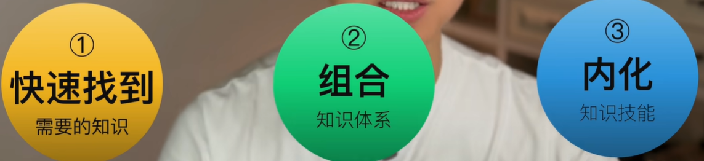
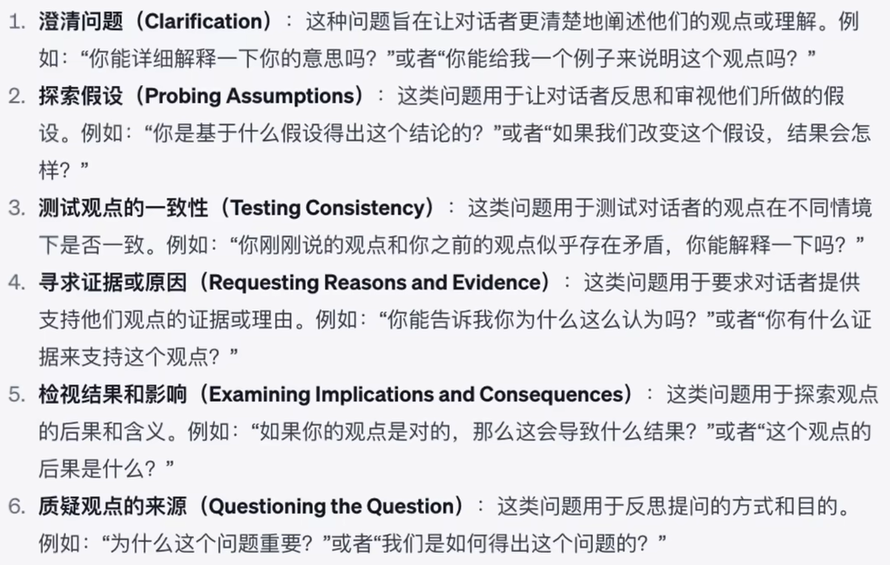

# ChatGPT使用教程

## 一、ChatGPT的优势

1. 直接给你答案
2. GPT能反向提问
3. GPT能完成工作任务

## 二、我们遇到的问题可以分为两类

1. 简单：what、who、when、where
2. 复杂：why、how

### 复杂why的问题？

基于事实依据加推导过程来回答问题。

人类回答这类问题，一方面他的知识面没有这么广泛，知道的事实依据有限； 另一方面人们会在客观事实之外，基于自己的信仰，结合自己的立场，加上自己的观点，然后逻辑自洽的得到一个不靠谱的结论。

### 复杂how的问题？

一般是完成特定的任务，解决实际的问题

知道目标 -> 找到路径 -> 过程中可能还要不同的工具和方法

## 三、如何提问？

### 乔哈里（Johari）沟通视窗

### 盲区

如果想了解盲区的问题，你是问不出具体的问题的，你只知道大概模糊的概念。

#### 盲区 | 问法1

元问题：我想了解 xxx ，我应该向你问哪些问题？

#### 盲区 | 问法2

请给我列出 xxx 领域 / 行业相关的，最常用的50个概念，
并做简单解释。如果有英文缩写，请给出完整的英文解释。

#### 盲区 | 问法3

请详细介绍一下 xxx 的主要生平事迹。
请详细介绍一下 xxx 公司的发展历程。

### 公开区

你可以利用 chatGPT 检验你的认知或扩充你的认知

#### 检验认知 | 问法1

对于 xxx 主题 / 技能，你认为哪些是我必须理解和掌握的核心要点？

#### 检验认知 | 问法2

我理解的 xxx 是这样的，你觉得我的理解对吗？

#### 检验认知 | 问法3

我对 xxx 有一些想法，你帮我批判性地分析一下这些想法的优点和缺点吗？

#### 检验认知 | 问法4

我正在考虑 xxx 的决定，你能帮我分析一下可能的结果和影响吗？

#### 扩充认知 | 问法1

我知道 xxx 的概念，我想知道更多关于 xxx 的信息。

#### 扩充认知 | 问法2

我在 xxx 问题上遇到困难，你能提供一些可能的解决方案或建议吗？

#### 扩充认知 | 问法3

我想要深入学习 xxx，你能推荐一些进阶的学习资源或学习路径吗？

#### 扩充认知 | 问法4

我想要在 xxx 领域有所创新，你能提供一些启发或想法吗？

#### 扩充认知 | 问法5

我想在 xxx 领域提升自己，你能根据最新的研究和趋势给我一些建议吗？

#### 扩充认知 | 问法6

我正在考虑学习 xxx，你能给我一些关于这个领域未来发展的观点吗？

#### 扩充认知 | 问法7

（背景信息）我要做关于 xxx 的研究，我认为原因是，还有其他可能的原因吗？给出一些可能的研究假设。

#### 扩充认知 | 问法8

我是一个 xxx 行业新手，马上要采访这个行业的资深大佬，我应该向他请教哪些有价值的问题？

### 隐私区

介绍背景现象之后可以向gpt发问，你怎么看待这种现象？可能的原因有哪些？这会对xxx产生什么样的影响？你觉得xxx应该怎么做？ 

#### 隐私区 | 问法1

你怎么看待这种现象？

#### 隐私区 | 问法2

可能的原因有哪些？

#### 隐私区 | 问法3

这会对 xxx 产生什么样的影响？

#### 隐私区 | 问法4

你觉得 xxx 应该怎么做？

### 未知区

#### 未知区 | 问法

如果 xxx，这对社会会产生什么影响？

## 四、你怎么就知道自己知道呢？

### 达克效应

### 反问提问 | 问法1

为了测试我对 xxx 的了解程度，你会问我什么问题来检验我的水平，最少10个。

### 反问提问 | 问法2

我是 xxx 领域的专家，你会问我哪些问题来检验我的专业水平？最少10个。

### 反问提问 | 问法3

追问一句，这些我都懂，还有更专业更细更深的问题吗？

### 反问提问 | 问法4

现在我们玩个“你问我答”的游戏，
目的是为了测试我在 xxxx 方面的专业水平。
你负责提问，我负责回答。
你要根据我的答案进行反馈、评价、补充。
如果我说不知道，你就直接输出正确答案，然后你继续提问。

### 大师提问 | 问法1

扩展自己能力边界的提问句式：我已经很精通xxx了，我想知道我是否还有需要学习的地方？然后不停的问，还有呢还有呢？

## 五、chatGPT能做到什么？

### 1.你想做 xx，不知道GPT能帮你什么

**知道自己要干什么，但是不知道ChatGPT能帮你什么。**

我想做 xxx，你能给我提供什么帮助？

### 2.知道GPT能帮你 xx，不知道输入什么信息

**知道要ChatGPT帮你做什么，但是你不知道给他输入什么具体的信息。**

我想要你 xxx，我应该给你输入什么信息？

### 3.直接下指令

**直接给ChatGPT指令。任务目标、背景信息、输出要求都非常清晰。**

请推荐（书名、电视剧、电影、网站、博主、专家、学习资料）等等。请翻译...请总结...请润色...

## 六、可以赋予GPT特定的角色

模拟虚拟人物
在世的名人
过世的名人
一段关系
多个具体的人
多类人

## 七、ChatGPT提升快速学习能力

### 1.SECL的三个阶段

### 2.快速学习能力分为3个层次

- 初级：能够学会手把手教的东西

- 中级：能够学会书本上教的东西

- 高级：你能够学会没有人教的东西

### 3.四项核心能力

#### （1）提问能力

结合布鲁姆教育目标分类模型，能够问出更高质量的问题

对于GPT提问题要详细，描述的越清楚越好

问题之间是可以组合的，但尽量不要超过4个

批判性思考和结构化思考都可以增强提问能力

#### （2）批判性思考

思考观点背后的思考过程：说这话的人他脑子里到底是怎么想的

任何**观点**，都是针对某个**论题**，基于特定的**概念**、**证据事实**和**假设**，站在特定的**立场**，进行**推理**和**解释**，从而支持某个**结论**。

可以让ChatGPT帮你识别一个观点的8个论证部分，也可以让ChatGPT针对各个论证部分进行批判，最简单的最直接的批判就是批判概念，也可以基于苏格拉底的提问分类方法进行批判式的提问，还可以基于结构化的分析问题还有创新这两个目的让ChatGPT直接给你一些批判性的提问句式，最后还可以让GPT教你规避一些常见的论证谬误。

批判性思考不是目的是手段，我们的目的是结构化的分析解决问题

1. 问观点的各个论证部分
2. 用苏格拉底提问方法
3. 基于结构化 / 创新的目的问
4. 结合各种论证谬误提问

##### 苏格拉底提问分类法

#### （3）结构化思考的能力

##### 结构化4有模型

有关系
有好处
有意思
有期待

结构化思维：让你的思考有结构有逻辑而且更有说服力

##### 结构化思维的两个关键

###### MECE分类方法

Mutually Exclusive
相互独立 不重复

Collectively Exhaustive
完全穷尽 不遗漏

1. 二分法：内部和外部、主观和客观、输入和输出
2. 要素法：基于系统内的关键要素分析问题。比如说战略3C、营销4P、波特5力、6顶思考帽、高效能人士的7个习惯
3. 过程法：也就是按照事情发展的时间、流程、程序，对信息进行逐一的分类。
4. 矩阵法：安索夫矩阵、skill-will 矩阵、波士顿矩阵、时间管理矩阵、风险管理矩阵
5. 公式法：将一个问题拆解成一个公式的表达

###### 积累各种好用的模型

###### 1 ChatGPT推荐不同结构的模型

请给我推荐20个最常用的商业分析模型。

请给我推荐15个最常用的4象限矩阵分析模型，类似于skill-will矩阵、安索夫矩阵、波士顿矩阵等等。

请给我推荐20个最常用的基于关键要素进行分析的模型，比如营销4P、波特5力、6顶思考帽、高效能人士的7个习惯等等。不要矩阵法分析模型，只要基于要素法分析的模型。

###### 2 ChatGPT介绍模型用法、局限、举例

请给我详细介绍安索夫矩阵的细节、应用场景、以及应用局限。并举个实际的商业应用案例。

###### 3 ChatGPT分析问题（特定场景&结构）

请问，如何才能提升一个基层管理者的管理能力？请分别用过程法、要素法、矩阵法这3种结构化思考的逻辑回答。

###### 4 ChatGPT推荐特定行业 / 领域 / 人群的模型

请给我推荐10个人力资源管理领域相关的分析模型。比如skill-will，9-box等等。

请给我推荐10个营销领域相关的分析模型。比如营销4P等等。

请给我推荐10个基层管理必须掌握的，带教下属、管理下属的模型。

#### （4）延续性创新

ChatGPT会告诉你可以在哪些方面进行延续性创新，对于延续性创新的提问，一定要说明方向，基于创新者的五个工具，GPT擅长提问联想交流，你可以进行多个角色的模拟共创，也可以在特定的思考结构下发散创新，还能基于推理预测进行创新。

我想要在家用垃圾袋领域有所创新，你能提供一些启发或想法吗？

我想要在家用垃圾袋领域有所创新，主要在垃圾袋的材料、垃圾袋的功能、垃圾袋的使用场景这3个方面进行延续性创新，我应该分别问哪些问题，来激发创新？

一般谈到创新，除了在产品、客户需求、商业模式、工艺流程等方面进行创新，还能在哪些方面进行创新？

## 八、ChatGPT插件

WebPilot	联网搜索信息

Wolfram	计算数理化，还有画图

video summary	总结视频概要

tutory	如果你想学习一个技能或者一个领域的知识，它可以为你量身定制你的学习路径

speak	学习语言的好工具

