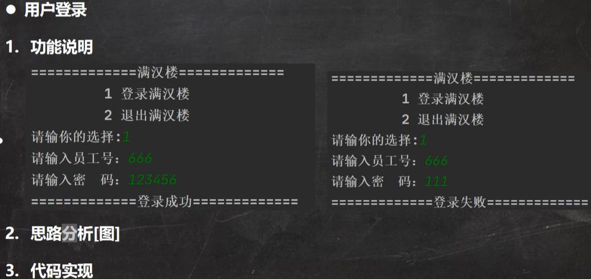
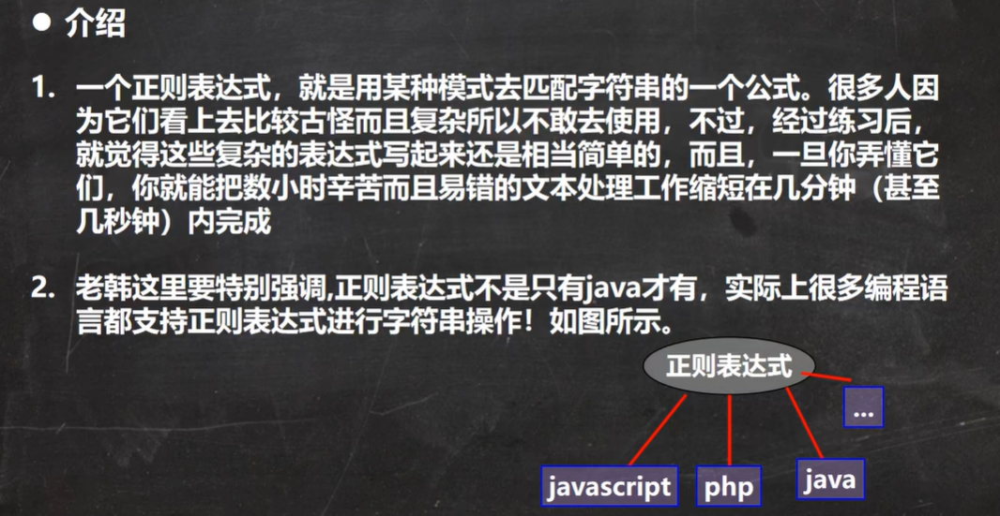
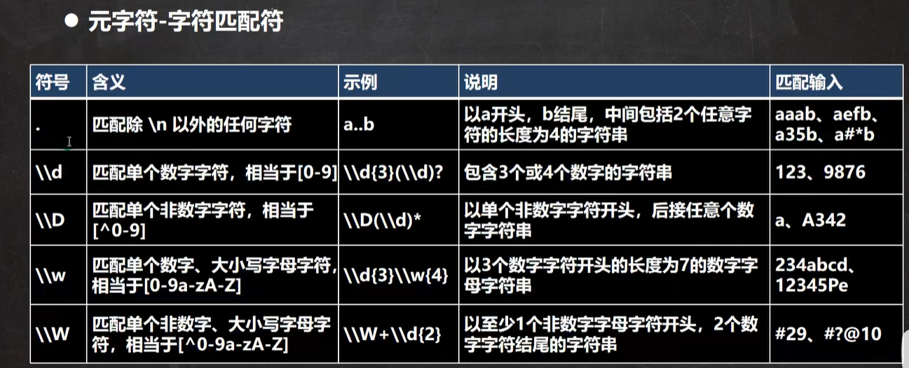
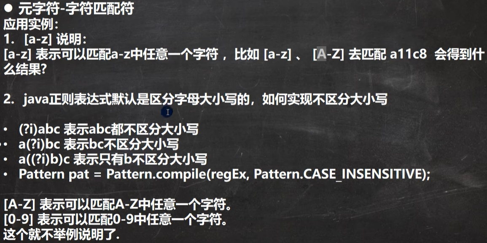
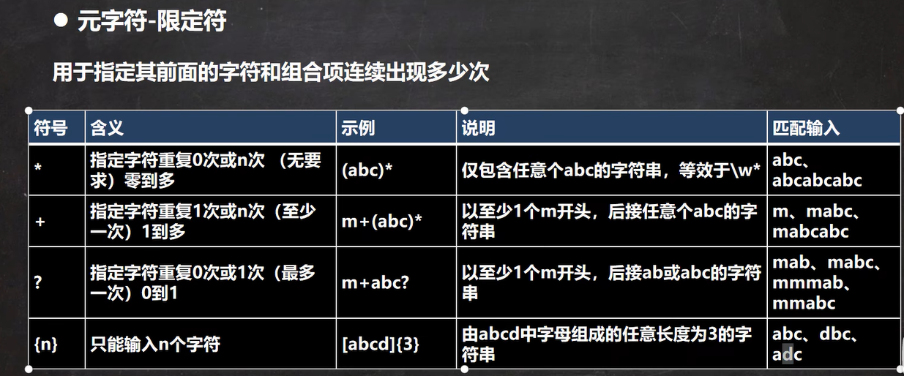

# 满汉楼项目

java + jdbc(druid) + mysql


## 界面设计


## 项目设计


## 工具类

准备工具类Utility，提高开发效率，并搭建项目的整体结构。

在实际开发中，公司都会提供相应的工具类和开发库，可以提高开发效率。

[准备好的工具类](工具类.rar)


## 功能实现




```mysql
-- 创建满汉楼的数据库
CREATE DATABASE mhl

-- 创建表 employee 表 (主键id, empId, name, pwd, job等)

#用户表
CREATE TABLE employee (
	id INT PRIMARY KEY AUTO_INCREMENT, #自增 
	empId VARCHAR(50) UNIQUE NOT NULL DEFAULT '',#员工号 
	pwd CHAR(32) NOT NULL DEFAULT'',#密码md5 
	NAME VARCHAR (50) NOT NULL DEFAULT '',#姓名 
	job VARCHAR(50) NOT NULL DEFAULT '' #岗位
)CHARSET=utf8;

#添加测试数据
INSERT INTO employee VALUES(NULL, '6668612', MD5('123456'), '张三丰', '经理');
INSERT INTO employee VALUES(NULL, '6668622', MD5('123456'), '小龙女', '服务员');
INSERT INTO employee VALUES(NULL, '6668633', MD5('123456'), '张无忌', '收银员');
INSERT INTO employee VALUES(NULL, '666666', MD5('123456'), '老韩', '经理');

SELECT * FROM employee;
```


```mysql
-- 创建menu表（id, name, type, price）
#菜谱
CREATE TABLE menu (
	id INT PRIMARY KEY AUTO_INCREMENT, #自增主键，作为菜谱编号(唯一)
	NAME VARCHAR(50) NOT NULL DEFAULT '',#菜品名称
	TYPE VARCHAR(50) NOT NULL DEFAULT '', #菜品种类
	price DOUBLE NOT NULL DEFAULT 0#价格
)CHARSET=utf8; 
#测试数据
INSERT INTO menu VALUES(NULL, '八宝饭', '主食类', 10);
INSERT INTO menu VALUES(NULL, '叉烧包', '主食类', 20);
INSERT INTO menu VALUES(NULL, '宫保鸡丁', '热菜类', 30);
INSERT INTO menu VALUES(NULL, '山药拨鱼', '凉菜类', 14);
INSERT INTO menu VALUES(NULL, '银丝卷', '甜食类', 9);
INSERT INTO menu VALUES(NULL, '水煮鱼', '热菜类', 26);
INSERT INTO menu VALUES(NULL, '甲鱼汤', '汤类', 100);
INSERT INTO menu VALUES(NULL, '鸡蛋汤', '汤类', 16);

SELECT * FROM menu;
```


```mysql
#增加表 bill 账单表（id, billId, menuId, nums, billDate, money, state, diningTableId）
#账单流水, 考虑可以分开结账, 并考虑将来分别统计各个不同菜品的销售情况
CREATE TABLE bill (
	id INT PRIMARY KEY AUTO_INCREMENT, #自增主键
	billId VARCHAR(50) NOT NULL DEFAULT '',#账单号可以按照自己规则生成 UUID
	menuId INT NOT NULL DEFAULT 0,#菜品的编号, 也可以使用外键
	nums SMALLINT NOT NULL DEFAULT 0,#份数
	money DOUBLE NOT NULL DEFAULT 0, #金额
	diningTableId INT NOT NULL DEFAULT 0, #餐桌
	billDate DATETIME NOT NULL ,#订单日期
	state VARCHAR(50) NOT NULL DEFAULT '' # 状态 '未结账' , '已经结账', '挂单'
)CHARSET=utf8;
SELECT * FROM bill;
```


[满汉楼项目java代码](mhl.rar)


# 正则表达式

## 快速入门


## 基本介绍




## 正则表达式底层实现


```java
package com.hspedu.regexp;

import java.util.regex.Matcher;
import java.util.regex.Pattern;

/* @author  i-s-j-h-d
 * @version 1.0
 * 分析java的正则表达式的底层实现(重要)
 */
public class RegTheory {
    public static void main(String[] args) {
        String content = "1998 年 12 月 8 日，第二代 Java 平台的企业版 J2EE 发布。1999 年 6 月，Sun 公司发布了" + "第二代 Java 平台（简称为 Java2）的 3 个版本：J2ME（Java2 Micro Edition，Java2 平台的微型" + "版），应用于移动、无线及有限资源的环境；J2SE（Java 2 Standard Edition，Java 2 平台的" + "标准版），应用于桌面环境；J2EE（Java 2Enterprise Edition，Java 2 平台的企业版），应" + "用 3443 于基于 Java 的应用服务器。Java 2 平台的发布，是 Java 发展过程中最重要的一个" + "里程碑，标志着 Java 的应用开始普及 9889 ";
        //目标：匹配所有四个数字
        //说明
        //1. \\d 表示一个任意的数据
        String regStr = "(\\d\\d)(\\d\\d)";
        //2. 创建模式对象[即正则表达式对象]
        Pattern pattern = Pattern.compile(regStr);
        //3. 创建匹配器
        //说明：创建匹配器matcher，按照 正则表达式的规则 去匹配 content字符串
        Matcher matcher = pattern.matcher(content);

        //4. 开始匹配
        /*
            matcher.find() 完成地任务（考虑分组）
            什么是分组，比如 (\d\d)(\d\d)，正则表达式中有() 表示分组，第1个()表示第1组，第2个表示第2组...
            1. 根据指定的规则，定位满足规则的子字符串(比如1998)
            2. 找到后，将子字符串的开始的索引记录到matcher对象的属性 int[] groups;
                2.1 group[0] = 0, 把该字符串的结束的索引+1的值记录到 groups[1] = 4
                2.2 记录1组()匹配到的字符串 groups[2] = 0  groups[3] = 2
                2.3 记录2组()匹配到的字符串 groups[4] = 2  groups[5] = 4
                2.4 如果有更多的分组...
            3. 同时记录oldLast 的值为 子字符串的结束的 索引+1的值即4，即下次执行find时，就从4开始匹配

            matcher.group(0) 分析

            源码：
            public String group(int group) {
                if (first < 0)
                    throw new IllegalStateException("No match found");
                if (group < 0 || group > groupCount())
                    throw new IndexOutOfBoundsException("No group " + group);
                if ((groups[group*2] == -1) || (groups[group*2+1] == -1))
                    return null;
                return getSubSequence(groups[group * 2], groups[group * 2 + 1]).toString();
            }
            1. 根据groups[0]=0 和groups[1]=4 的记录的位置，从content开始截取子字符串返回
              就是[0,4) 包含0 但是不包含索引为4的位置

            如果再次指向 find方法，仍然按照上面的分析来执行
        */
        while (matcher.find()) {
            //小结
            //1. 如果正则表达式有() 即分组
            //2. 取出匹配的字符串规则如下
            //3. group(0) 表示匹配到的子字符串
            //4. group(1) 表示匹配到的子字符串的第1组字串
            //5. group(2) 表示匹配到的子字符串的第2组字串
            //6. ... 但是分组的数不能越界
            System.out.println("找到：" + matcher.group(0));
            System.out.println("第1组()匹配到的值=" + matcher.group(1));
            System.out.println("第2组()匹配到的值=" + matcher.group(2));
        }

    }
}
```


## 正则表达式基本语法


- 元字符(Metacharacter) - 转义号 \\\

  

  需要用到转义符号的字符有以下：. * + ( ) $ / \ ? [ ] ^ { }

  ```java
  package com.hspedu.regexp;
  
  import java.util.regex.Matcher;
  import java.util.regex.Pattern;
  
  /* @author  i-s-j-h-d
   * @version 1.0 */
  public class RegExp02 {
      public static void main(String[] args) {
          String content = "abc$(a.bc(123(";
          String regStr = "\\(";
          Pattern pattern = Pattern.compile(regStr);
          Matcher matcher = pattern.matcher(content);
  
          while (matcher.find()) {
              System.out.println("找到：" + matcher.group(0));
          }
      }
  }
  ```

  

- 元字符 - 字符匹配符

  

  

  



```java
package com.hspedu.regexp;

import java.util.regex.Matcher;
import java.util.regex.Pattern;

/* @author  i-s-j-h-d
 * @version 1.0
 * 演示字符匹配符 的使用
 */
public class RegExp03 {
    public static void main(String[] args) {
        String content = "a11c8abcABC";
        //String regStr = "[a-z]";//匹配 a-z 之间任意一个字符
        //String regStr = "[A-Z]";//匹配 A-Z 之间任意一个字符
        //String regStr = "abc";//匹配 abc 字符串【默认区分大小写】
        //String regStr = "(?i)abc";//匹配 abc 字符串【不区分大小写】
        String regStr = "[0-9]";//匹配 0-9 之间任意一个字符

        Pattern pattern = Pattern.compile(regStr);

        //说明：1. 当创建Pattern对象时，指定Pattern.CASE_INSENSITIVE,表示匹配是不区分字母大小写.
        //Pattern pattern = Pattern.compile(regStr, Pattern.CASE_INSENSITIVE);

        Matcher matcher = pattern.matcher(content);

        while (matcher.find()) {
            System.out.println("找到：" + matcher.group(0));
        }
    }
}
```


```java
package com.hspedu.regexp;

import java.util.regex.Matcher;
import java.util.regex.Pattern;

/* @author  i-s-j-h-d
 * @version 1.0
 * 演示字符匹配符 的使用
 */
public class RegExp03 {
    public static void main(String[] args) {
        String content = "a11c8abcABC";
        //String regStr = "[^a-z]";//匹配不在 a-z 之间的任意一个字符
        String regStr = "[^0-9]";//匹配不在 0-9 之间的任意一个字符

        Pattern pattern = Pattern.compile(regStr);
        Matcher matcher = pattern.matcher(content);

        while (matcher.find()) {
            System.out.println("找到：" + matcher.group(0));
        }
    }
}
```


```java
package com.hspedu.regexp;

import java.util.regex.Matcher;
import java.util.regex.Pattern;

/* @author  i-s-j-h-d
 * @version 1.0
 * 演示字符匹配符 的使用
 */
public class RegExp03 {
    public static void main(String[] args) {
        String content = "a11c8 abc_ABC y@";
        //String regStr = "[abcd]";//匹配在 abcd 之间的任意一个字符
        //String regStr = "\\D";//匹配 不在 0-9的任意一个字符
        //String regStr = "\\w";//匹配 大小写英文字母，数字，下划线
        //String regStr = "\\W";//匹配 等价于 [^a-zA-Z0-9_]
        //String regStr = "\\s";// \\s 匹配任何空白字符(空格，制表符等)
        //String regStr = "\\S";// \\S 匹配任何非空白字符，和\\s刚好相反
        String regStr = ".";// . 匹配除 \n 之外的所有字符，如果要匹配 . 本身则需要使用\\.

        Pattern pattern = Pattern.compile(regStr);
        Matcher matcher = pattern.matcher(content);

        while (matcher.find()) {
            System.out.println("找到：" + matcher.group(0));
        }
    }
}
```


- 元字符 - 选择匹配符

  

```java
package com.hspedu.regexp;

import java.util.regex.Matcher;
import java.util.regex.Pattern;

/* @author  i-s-j-h-d
 * @version 1.0 */
public class RegExp04 {
    public static void main(String[] args) {

        String content = "k-on 轻音少女";
        String regStr = "k-on|轻音少女";

        Pattern pattern = Pattern.compile(regStr);
        Matcher matcher = pattern.matcher(content);

        while (matcher.find()) {
            System.out.println("找到：" + matcher.group(0));
        }

    }
}
```


- 元字符 - 限定符

  

  

```java
package com.hspedu.regexp;

import java.util.regex.Matcher;
import java.util.regex.Pattern;

/* @author  i-s-j-h-d
 * @version 1.0
 * 演示限定符的使用
 */
public class RegExp05 {
    public static void main(String[] args) {

        String content = "a11111aaahello";
        //String regStr = "a{3}";// 表示匹配 aaa
        //String regStr = "1{4}";// 表示匹配 1111
        //String regStr = "\\d{2}";// 表示匹配 两位的任意数字字符

        //细节：java匹配默认贪婪匹配，即尽可能匹配多的
        //String regStr = "a{3,4}"; //表示匹配 aaa 或者 aaaa
        //String regStr = "1{4,5}"; //表示匹配 1111 或者 11111
        //String regStr = "\\d{2,5}"; //表示匹配2位数或者3，4，5

        //String regStr = "1+"; //匹配一个1或者多个1
        //String regStr = "\\d+"; //匹配一个数字或者多个数字

        //String regStr = "1*"; //匹配0个1或者多个1

        //演示 ？的使用，遵守贪婪匹配
        String regStr = "a1?"; //匹配 a 或者 a1

        Pattern pattern = Pattern.compile(regStr);
        Matcher matcher = pattern.matcher(content);

        while (matcher.find()) {
            System.out.println("找到：" + matcher.group(0));
        }
    }
}
```


```java
//补充
package com.hspedu.regexp;

import java.util.regex.Matcher;
import java.util.regex.Pattern;

/* @author  i-s-j-h-d
 * @version 1.0
 * 非贪婪匹配
 */
public class RegExp09 {
    public static void main(String[] args) {

        String content = "hello11111111 ok";
        //String regStr = "\\d+"; //默认是贪婪匹配
        String regStr = "\\d+?"; //非贪婪匹配

        Pattern pattern = Pattern.compile(regStr);
        Matcher matcher = pattern.matcher(content);
        while (matcher.find()) {
            System.out.println("找到：" + matcher.group(0));
        }

    }
}
```


- 元字符 - 定位符

  

```java
package com.hspedu.regexp;

import java.util.regex.Matcher;
import java.util.regex.Pattern;

/* @author  i-s-j-h-d
 * @version 1.0
 * 演示定位符的使用
 */
public class RegExp06 {
    public static void main(String[] args) {

        String content = "hanshunping sphan nnhan";
        //String content = "123abc";
        //以至少1个数字开头，后接任意个小写字母的字符串
        //String regStr = "^[0-9]+[a-z]*";

        //以至少1个数字开头，必须以至少一个小写字母结束
        //String regStr = "^[0-9]+[a-z]+$";

        //表示匹配边界的han[这里的边界是指：被匹配的字符串最后，
        // 也可以是空格的字符串的后面]
        //String regStr = "han\\b";

        // 和\\b的含义刚刚相反
        String regStr = "han\\B";

        Pattern pattern = Pattern.compile(regStr);
        Matcher matcher = pattern.matcher(content);

        while (matcher.find()) {
            System.out.println("找到：" + matcher.group(0));
        }
    }
}
```


- 分组

  

  ```java
  package com.hspedu.regexp;
  
  import java.util.regex.Matcher;
  import java.util.regex.Pattern;
  
  /* @author  i-s-j-h-d
   * @version 1.0
   * 分组
   */
  public class RegExp07 {
      public static void main(String[] args) {
  
          String content = "hanshunping s7789 nn1189han";
  
          //下面就是非命名分组
          //说明
          // 1. matcher.group(0) 得到匹配到的字符串
          // 2. matcher.group(1) 得到匹配到的字符串的第一个分组内容
          // 3. matcher.group(2) 得到匹配到的字符串的第二个分组内容
          //String regStr = "(\\d\\d)(\\d\\d)";//匹配4个数字的字符串
  
          // 命名分组：即可以给分组取名
          String regStr = "(?<g1>\\d\\d)(?<g2>\\d\\d)";//匹配4个数字的字符串
  
          Pattern pattern = Pattern.compile(regStr);
          Matcher matcher = pattern.matcher(content);
  
          while (matcher.find()) {
              System.out.println("找到：" + matcher.group(0));
              System.out.println("第一个分组内容：" + matcher.group(1));
              System.out.println("第一个分组内容【通过组名】：" + matcher.group("g1"));
              System.out.println("第二个分组内容：" + matcher.group(2));
              System.out.println("第二个分组内容【通过组名】：" + matcher.group("g2"));
          }
      }
  }
  ```

  

  

  

  ```java
  package com.hspedu.regexp;
  
  import java.util.regex.Matcher;
  import java.util.regex.Pattern;
  
  /* @author  i-s-j-h-d
   * @version 1.0
   * 演示非捕获分组，语法比较奇怪
   */
  public class RegExp08 {
      public static void main(String[] args) {
  
          String content = "hello轻音少女 jack轻音少妇 重音少女hello";
  
          //找到 轻音少女、轻音少妇、重音少女 子字符串
          //String regStr = "轻音少女|轻音少妇|重音少女";
          //上面的写法可以等价非捕获分组，注意：不能 matcher.group(1)
          //String regStr = "(?:轻|重)音少(?:女|妇)";
  
          //找到 轻音少 这个关键字，但是要求只是查找轻音少女、轻音少妇 中含有的轻音少
          //下面也是非捕获分组，不能使用matcher.group(1)
          //String regStr = "轻音少(?=女|妇)";
  
          //找到 轻音 这个关键字，但是要求只是查找不是 (轻音少女 和 轻音少妇) 中含有的轻音
          //下面也是非捕获分组，不能使用matcher.group(1)
          String regStr = "轻音(?!少女|少妇)";
  
          Pattern pattern = Pattern.compile(regStr);
          Matcher matcher = pattern.matcher(content);
          while (matcher.find()) {
              System.out.println("找到：" + matcher.group(0));
          }
  
  
      }
  }
  
  ```

  

- 正则表达式更多元字符——览表

[正则表达式元字符-详细说明](正则表达式元字符-详细说明.docx)


## 正则表达式的应用实例


```java
package com.hspedu.regexp;

import java.util.regex.Matcher;
import java.util.regex.Pattern;

/* @author  i-s-j-h-d
 * @version 1.0
 * 正则表达式的应用实例
 */
public class RegExp10 {
    public static void main(String[] args) {
        String content = "18371317825";

        // 汉字
        //String regStr = "^[\u0391-\uffe5]+$";
        // 邮政编码
        // 要求：1.是1-9开头的一个六位数，比如：123987
        //String regStr = "^[1-9]\\d{5}$";
        // QQ号码
        // 要求：是1-9开头的一个(5位数-10位数) 比如：12389
        //String regStr = "^[1-9]\\d{4,9}$";

        // 手机号码
        // 需求：必须要以13，14，15，18 开头的11位数，比如：187713378125
        String regStr = "^1[3|4|5|8]\\d{9}$";

        Pattern pattern = Pattern.compile(regStr);
        Matcher matcher = pattern.matcher(content);
        if(matcher.find()) {
            System.out.println("满足格式");
        } else {
            System.out.println("不满足格式");
        }

    }
}
```

```java
package com.hspedu.regexp;

import java.util.regex.Matcher;
import java.util.regex.Pattern;

/* @author  i-s-j-h-d
 * @version 1.0
 * 演示正则表达式的使用
 */
public class RegExp11 {
    public static void main(String[] args) {

        String content = "https://www.bilibili.com/video/BV1XN411B7bg/?spm_id_from=333.1007.top_right_bar_window_default_collection.content.click&vd_source=1e76686fcb5720fb01a6d29cfcf015c5";

        /*
            思路
            1. 先确定 url 的开始部分 https:// | http://
            2. 然后通过 ([\\w-]+\\.)+[\\w-] 匹配 www.bilibili.com
            3. video/BV1XN411B7bg/?spm_id_from 匹配(\\/[\\w-?=&/%.#]*)?
        */
        String regStr = "^((http|https)://)?([\\w-]+\\.)+[\\w-]+(\\/[\\w-?=&/%.#]*)?$";

        Pattern pattern = Pattern.compile(regStr);
        Matcher matcher = pattern.matcher(content);
        if(matcher.find()) {
            System.out.println("满足格式");
        } else {
            System.out.println("不满足格式");
        }
    }
}
```


## 三个常用类


- Pattern 类的方法 matches

  ```java
  package com.hspedu.regexp;
  
  import java.util.regex.Pattern;
  
  /* @author  i-s-j-h-d
   * @version 1.0
   * 演示matches方法，用于整体匹配，在验证输入的字符串是否满足条件使用
   */
  public class PatternMethod {
      public static void main(String[] args) {
          String content = "hello abc hello, 轻音少女";
          //String regStr = "hello";
          String regStr = "hello.*";
  
          boolean matches = Pattern.matches(regStr, content);
          System.out.println("整体匹配：" + matches);
      }
  }
  ```

  


```java
package com.hspedu.regexp;

import java.util.regex.Matcher;
import java.util.regex.Pattern;

/* @author  i-s-j-h-d
 * @version 1.0
 * Matcher 类的常用方法
 */
public class MatcherMethod {
    public static void main(String[] args) {
        String content = "hello edu jack qysn tom hello smith hello qysn";
        String regStr = "hello";

        Pattern pattern = Pattern.compile(regStr);
        Matcher matcher = pattern.matcher(content);
        while (matcher.find()) {
            System.out.println("===============");
            System.out.println(matcher.start());
            System.out.println(matcher.end());
            System.out.println("找到：" + content.substring(matcher.start(), matcher.end()));
        }

        //整体匹配方法，常用于，去校验某个字符串是否满足某个规则
        System.out.println("整体匹配：" + matcher.matches());

        //完成如果content 有 qysn 就替换成 轻音少女
        regStr = "qysn";
        pattern = Pattern.compile(regStr);
        matcher = pattern.matcher(content);
        //注意：返回的字符串才是替换后的字符串 原来的 content 不变化
        String newContent = matcher.replaceAll("轻音少女");
        System.out.println("newContent：" + newContent);
        System.out.println("content：" + content);
    }
}
```


## 分组、捕获、反向引用


```java
package com.hspedu.regexp;

import java.util.regex.Matcher;
import java.util.regex.Pattern;

/* @author  i-s-j-h-d
 * @version 1.0
 * 反向引用
 */
public class RegExp12 {
    public static void main(String[] args) {

        String content = "12321-333999111hello33333 jack tom11 1551jack22 yyy12345 xxx";
        //要匹配两个连续的相同数字：(\\d)\\1
        //String regStr = "(\\d)\\1";
        //要匹配五个连续的相同数字：(\\d)\\1{4}
        //String regStr = "(\\d)\\1{4}";
        //要匹配个位与千位相同，十位与百位相同的数 5225 , 1551  (\\d)(\\d)\\2\11
        //String regStr = "(\\d)(\\d)\\2\\1";

        /*
             请在字符串中检索商品编号，形式加：12321-333999111 这样的号码，
             要求满足前面是一个五位数，然后一个-号，然后是一个九位数，连续的每三位要相同
        */
        String regStr = "\\d{5}-(\\d)\\1{2}(\\d)\\2{2}(\\d)\\3{2}";

        Pattern pattern = Pattern.compile(regStr);
        Matcher matcher = pattern.matcher(content);
        while (matcher.find()) {
            System.out.println("找到：" + matcher.group(0));
        }
    }
}
```


- 正则表达式 - 应用实例

  

```java
package com.hspedu.regexp;

import java.util.regex.Matcher;
import java.util.regex.Pattern;

/* @author  i-s-j-h-d
 * @version 1.0 */
public class RegExp13 {
    public static void main(String[] args) {
        String content = "我....我要....学学学学....编程java!";

        //1. 去掉所有的.
        Pattern pattern = Pattern.compile("\\.");
        Matcher matcher = pattern.matcher(content);
        content = matcher.replaceAll("");
        System.out.println("content：" + content);

        //2. 去掉重复的字 我我要学学学学编程java!
        // 思路
        //(1) 使用 (.)\\1+
        //(2) 使用 反向引用$1 来替换匹配到的内容
        // 注意：因为正则表达式变化，所以需要重置 matcher
        //pattern = Pattern.compile("(.)\\1+");
        //matcher = pattern.matcher(content);
        //while (matcher.find()) {
            //System.out.println("找到：" + matcher.group(0));
        //}
        //使用 反向引用$1 来替换匹配到的内容
        //content = matcher.replaceAll("$1");
        //System.out.println("content：" + content);

        //3. 使用一条语句 去掉重复的字 我我要学学学学编程java!
        content = Pattern.compile("(.)\\1+").matcher(content).replaceAll("$1");
        System.out.println("content：" + content);
    }
}
```


## String类中使用正则表达式

- 替换功能

  ```java
  package com.hspedu.regexp;
  
  /* @author  i-s-j-h-d
   * @version 1.0 */
  public class StringReg {
      public static void main(String[] args) {
          String content = "2000年5月，JDK1.3、JDK1.4和J2SE1.3相继发布，几周后其" +
                  "获得了Apple公司Mac OS X的工业标准的支持。2001年9月24日，J2EE1.3发" +
                  "布。2002年2月26日，J2SE1.4发布。自此Java的计算能力有了大幅提升，";
  
          //使用正则表达式方式，将 JDK1.3 和 JDK1.4 替换成JDK
          content = content.replaceAll("JDK1\\.3|JDK1\\.4", "JDK");
          System.out.println(content);
      }
  }
  ```

  

- 判断功能

  ```java
  package com.hspedu.regexp;
  
  /* @author  i-s-j-h-d
   * @version 1.0 */
  public class StringReg {
      public static void main(String[] args) {
          String content = "13871317825";
  
          //要求 验证一个 手机号，要求必须是以138 139 开头的
          if(content.matches("1(38|39)\\d{8}")) {
              System.out.println("验证成功");
          } else {
              System.out.println("验证失败");
          }
      }
  }
  ```

  

- 分割功能

  ```java
  package com.hspedu.regexp;
  
  /* @author  i-s-j-h-d
   * @version 1.0 */
  public class StringReg {
      public static void main(String[] args) {
          String content = "hello#abc-jack12smith~北京";
  
          //要求按照 # 或者 - 或者 ~ 或者 数字 来分割
          String[] split = content.split("#|-|~|\\d+");
          for(String s : split) {
              System.out.println(s);
          }
      }
  }
  ```

  

## 本章作业


```java
package com.hspedu.regexp;

/* @author  i-s-j-h-d
 * @version 1.0 */
public class Homework01 {
    public static void main(String[] args) {
        String content = "3478215435@qq.com";

        //说明：
        //1. String 的 matches 是整体匹配
        //2. 看看这个matches 底层
        /*
            String 的 matches
            public boolean matches(String regex) {
                    return Pattern.matches(regex, this);
            }
            Pattern
            public static boolean matches(String regex, CharSequence input) {
                Pattern p = Pattern.compile(regex);
                Matcher m = p.matcher(input);
                return m.matches();
            }

            Mather 类 match
            Attempts to match the entire region against the pattern
            public boolean matches() {
                return match(from, ENDANCHOR);
            }
        */
        if(content.matches("^[\\w-]+@([a-z]+\\.)+[a-zA-Z]+$")) {
            System.out.println("验证成功");
        } else {
            System.out.println("验证失败");
        }
    }
}
```


```java
package com.hspedu.regexp;


/* @author  i-s-j-h-d
 * @version 1.0 */
public class Homework02 {
    public static void main(String[] args) {
        /*
            思路：
            1. 先写出简单的正则表达式
            2. 在逐步的完善【根据各种情况来完善】
        */
        String content = "-07.8";
        String regStr = "^[-+]?([1-9]\\d*|0)(\\.\\d+)?$";

        if(content.matches(regStr)) {
            System.out.println("匹配成功 是整数或者小数");
        } else {
            System.out.println("匹配失败");
        }

    }
}
```


```java
package com.hspedu.regexp;

import java.util.regex.Matcher;
import java.util.regex.Pattern;

/* @author  i-s-j-h-d
 * @version 1.0 */
public class Homework03 {
    public static void main(String[] args) {
        String content = "https://www.sohu.com:8080/abc/index.htm";


        String regStr = "^([a-zA-Z]+)://([a-zA-Z.]+):(\\d+)[\\w-/]*/([\\w.]+)$";

        Pattern pattern = Pattern.compile(regStr);
        Matcher matcher = pattern.matcher(content);

        if(matcher.matches()) {//整体匹配，如果匹配成功，可以通过group(x)，获取对应分组的内容
            System.out.println("匹配成功：" + matcher.group(0));
            System.out.println("协议：" + matcher.group(1));
            System.out.println("域名：" + matcher.group(2));
            System.out.println("端口：" + matcher.group(3));
            System.out.println("文件：" + matcher.group(4));
        } else {
            System.out.println("匹配失败");
        }
    }
}
```


[java正则表达式大全(参考)](java正则表达式大全(参考).java)

# 马踏棋盘

## 马踏棋盘介绍


