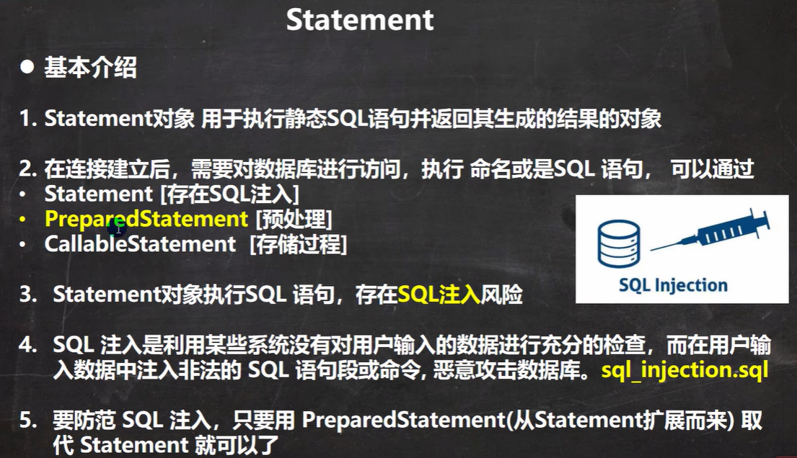

# JDBC和连接池

[IDEA里的java文件](chapter25.rar)


## JDBC概述

- 基本介绍

      1. JDBC为访问不同的数据库提供了统一的接口，为使用者屏蔽了细节问题。
      2. Java程序员使用JDBC，可以连接任何提供了JDBC驱动程序的数据库系统，从而完成对数据库的各种操作。
      3. JDBC的基本原理图 【重要！】


## JDBC快速入门

- JDBC程序编写步骤

  1. 注册驱动 - 加载Driver类

     [mysql-connector-java-5.1.37-bin.jar](mysql-connector-java-5.1.37-bin.jar)

  2. 获取连接 - 得到Connection

  3. 执行增删改查 - 发送SQL给mysql执行

  4. 释放资源 - 关闭相关连接

- JDBC第一个程序

  

```java
//前置工作： 在项目下创建一个文件夹比如 libs
//将 mysql.jar 拷贝到该目录下，点击 add to project ..加入到项目中

//1. 注册驱动
Driver driver = new Driver(); //创建driver对象

//2.得到连接
//解读
//(1) jdbc：mysql: //规定好表示协议，通过jdbc的方式连接mysql
//(2) localhost 主机，可以是ip地址
//(3) 3306 表示mysql监听的端口
//(4) hsp_db02 连接到mysql dbms 的哪个数据库
//(5) mysql的连接本质就是前面学过的socket连接
String url = "jdbc:mysql://localhost:3306/hsp_db02";
// 将 用户名和密码放入到Properties 对象
Properties properties = new Properties();
// 说明 user 和 password 是规定好，后面的值根据实际情况写
properties.setProperty("user", "root");// 用户
properties.setProperty("password", "hsp");// 密码
Connection connect = driver.connect(url, properties);

// 3. 执行sql
String sql = "insert into actor values(null, '刘德华', '男', '1970-11-11', '110')";
//statement 用于执行静态SQL语句并返回其生成的结果的对象
Statement statement = connect.createStatement();
int rows = statement.executeUpdate(sql); // 如果是 dml语句，返回的就是影响行数

System.out.println(rows > 0 ? "成功" : "失败");

//4. 关闭连接资源
statement.close();
connect.close();
```


## JDBC API

#### 获取数据库连接的五种方式

- 方式1

```java
//方式1
@Test
public void connect01() throws SQLException{
    //获取Driver实现类对象 
    Driver driver = new com.mysql.jdbc.Driver(); 

    String url = "jdbc:mysql://localhost:3306/db01"; 
	// 将 用户名和密码放入到Properties 对象
    Properties info = new Properties(); 
    // 说明 user 和 password 是规定好，后面的值根据实际情况写
    info.setProperty("user", "root"); // 用户
    info.setProperty("password", "hsp"); // 密码
    
    Connection connect = driver.connect(url, info); 
    System.out.println(connect);
    
    connect.close();
}
```


- 方式2

```java
//方式2
@Test
public void connect02() throws Exception {
    //使用反射加载Driver类, 动态加载, 更加的灵活, 减少依赖性
    Class<?> aClass = Class.forName("com.mysql.jdbc.Driver");
    Driver driver = (Driver)aClass.newInstance();
    
    String url = "jdbc:mysql://localhost:3306/db01"; 
	// 将 用户名和密码放入到Properties 对象
    Properties info = new Properties(); 
    // 说明 user 和 password 是规定好，后面的值根据实际情况写
    info.setProperty("user", "root"); // 用户
    info.setProperty("password", "hsp"); // 密码
    
    Connection connect = driver.connect(url, info); 
    System.out.println(connect);
    
    connect.close();
}
```


- 方式3

```java
//方式3 使用DriverManager 代替 driver 进行统一管理
@Test
public void connect03() throws Exception{

    //使用反射加载Driver类
    Class<?> aClass = Class.forName("com.mysql.jdbc.Driver");
    Driver driver = (Driver)aClass.newInstance();

    //创建url 和user 和 password
    String url = "jdbc:mysql://localhost:3306/db01";
    String user = "root";
    String password = "hsp";

    DriverManager.registerDriver(driver);//注册Driver驱动

    Connection connection = DriverManager.getConnection(url, user, password);
    System.out.println("第三种方式=" + connection);

    connection.close();
}
```


- 方式4

```java
//方式4：使用Class.forName自动完成注册驱动，简化代码(使用最多)
@Test
public void connect04() throws Exception{
    //使用反射加载Driver类
    //在加载 Driver类时，完成注册
    Class.forName("com.mysql.jdbc.Driver");

    //创建url 和 user 和 password
    String url = "jdbc:mysql://localhost:3306/db01";
    String user = "root";
    String password = "hsp";
    Connection connection = DriverManager.getConnection(url, user, password);

    System.out.println("第四种方式" + connection);
    connection.close();
}
```

​	   提示：

1. mysql驱动5.1.6可以无需Class.forName("com.mysql.jdbc.Driver");
2. 从dk1.5以后使用了jdbc4,不再需要显示调用class.forName()注册驱动而是自动调用驱动jar包下META-lNF\services\java.sql.Driver文本中的类名称去注册
3. 建议还是写上Class.forName("com.mysql.jdbc.Driver")，更加明确


- 方式5

```java
//方式5，在方式4的基础上改进，增加配置文件，让连接mysgl更加灵活
@Test
public void connect05() throws Exception{

    //通过Properties对象获取配置文件的信息
    Properties properties = new Properties();
    properties.load(new FileInputStream("src\\mysql.properties"));
    //获取相关的值
    String user = properties.getProperty("user");
    String password = properties.getProperty("password");
    String driver = properties.getProperty("driver");
    String url = properties.getProperty("url");

    Class.forName(driver); //建议写上

    Connection connection = DriverManager.getConnection(url, user, password);

    System.out.println("方式5 " + connection);

    connection.close();
}
```


#### ResultSet [结果集]

- 基本介绍
  1. 表示数据库结果集的数据表,通常通过执行查询数据库的语句生成
  2. ResultSet对象保持一个光标指向其当前的数据行。 最初，光标位于第一行之前
  3.  next方法将光标移动到下一行,并且由于在ResultSet对象中没有更多行时返回false，因此可以在while循环中使用循环来遍历结果集

```java
package com.hspedu.jdbc.resultset;

import java.io.FileInputStream;

import java.sql.Connection;
import java.sql.DriverManager;
import java.sql.Statement;
import java.util.Properties;

/* @author  i-s-j-h-d
 * @version 1.0 */
public class ResultSet {
    public static void main(String[] args) throws Exception {
        // 演示select 语句返回 ResultSet , 并取出结果

        //通过Properties对象获取配置文件的信息
        Properties properties = new Properties();
        properties.load(new FileInputStream("src\\mysql.properties"));
        //获取相关的值
        String user = properties.getProperty("user");
        String password = properties.getProperty("password");
        String driver = properties.getProperty("driver");
        String url = properties.getProperty("url");

        //1. 注册驱动
        Class.forName(driver); //建议写上

        //2. 得到连接
        Connection connection = DriverManager.getConnection(url, user, password);

        //3. 得到Statement
        Statement statement = connection.createStatement();

        //4. 组织SQL
        String sql = "select id, name, sex, borndate from actor";
        //执行给定的SQL语句，该语句返回单个ResultSet对象
        java.sql.ResultSet resultSet = statement.executeQuery(sql);

        //5. 使用while取出数据
        while (resultSet.next()) {// 让光标向后移动，如果没有更多行，则返回false
            int id = resultSet.getInt(1);// 获取该行的第一列
            String name = resultSet.getString(2);// 获取该行的第二列
            String sex = resultSet.getString(3);
            java.util.Date date = resultSet.getDate(4);

            System.out.println(id + "\t" + name + "\t" + sex + "\t" + date);
        }

        //6. 关闭连接
        resultSet.close();
        statement.close();
        connection.close();
    }
}
```


#### Statement



```java
package com.hspedu.jdbc.statement;

import java.io.FileInputStream;
import java.sql.Connection;
import java.sql.DriverManager;
import java.sql.ResultSet;
import java.util.Properties;
import java.util.Scanner;

/* @author  i-s-j-h-d
 * @version 1.0 */
public class Statement {
    public static void main(String[] args) throws Exception{
        // 演示statement 的注入问题

        //让用户输入管理员名和密码
        //输入用户名 为 1' or
        //输入万能密码 为 or '1'= '1
        Scanner scanner = new Scanner(System.in);
        System.out.print("请输入管理员的名字："); //next(): 当接收到空格或者 '就是表示结束
        String admin_name =scanner.nextLine(); //说明，如果希望看到SQL注入，这里需要用nextLine
        System.out.print("请输入管理员的密码：");
        String admin_pwd = scanner.nextLine();

        //通过Properties对象获取配置文件的信息
        Properties properties = new Properties();
        properties.load(new FileInputStream("src\\mysql.properties"));
        //获取相关的值
        String user = properties.getProperty("user");
        String password = properties.getProperty("password");
        String driver = properties.getProperty("driver");
        String url = properties.getProperty("url");

        //1. 注册驱动
        Class.forName(driver); //建议写上

        //2. 得到连接
        Connection connection = DriverManager.getConnection(url, user, password);

        //3. 得到Statement
        java.sql.Statement statement = connection.createStatement();

        //4. 组织SQL
        String sql = "select name, pwd from admin where name = '"
                + admin_name + "' and pwd = '" + admin_pwd + "'";
        ResultSet resultSet = statement.executeQuery(sql);
        if(resultSet.next()) {//如果查询到一条记录，则说明该管理存在
            System.out.println("恭喜，登录成功");
        }else{
            System.out.println("对不起，I登录失败");
        }

        //6. 关闭连接
        resultSet.close();
        statement.close();
        connection.close();
    }
}
```


#### PreparedStatement

- 基本介绍

  1. PreparedStatement执行的SQL语句中的参数用问号 (?) 来表示，调用PreparedStatement对象的setXxx () 方法来设置这些参数.setXxx () 方法有两个参数，第一个参数是要设置的SQL语句中的参数的索引（从1开始），第二个是设置的SQL语句中的参数的值

  2. 调用executeQuery()，返?ResultSet对象

  3. 调用executeUpdate()：执行更新，包括增、删、修改

- 预处理好处

  1. 不再使用+拼接sql语句，减少语法错误

  2. 有效的解决了sql注入问题！

  3. 大大减少了编译次数，效率较高

- 应用案例

  编写程序完成，登录验证，看看是否可以解决SQL注入问题

##### 预处理查询

```java
package com.hspedu.jdbc.preparedstatement_;

import java.io.FileInputStream;
import java.sql.Connection;
import java.sql.DriverManager;
import java.sql.PreparedStatement;
import java.sql.ResultSet;
import java.util.Properties;
import java.util.Scanner;

/* @author  i-s-j-h-d
 * @version 1.0 */
public class PreparedStatement_ {
    public static void main(String[] args) throws Exception{
        // 演示PreparedStatement使用

        //让用户输入管理员名和密码
        Scanner scanner = new Scanner(System.in);
        System.out.print("请输入管理员的名字："); //next(): 当接收到空格或者'就是表示结束
        String admin_name =scanner.nextLine(); //说明，如果希望看到SQL注入，这里需要用nextLine
        System.out.print("请输入管理员的密码：");
        String admin_pwd = scanner.nextLine();

        //通过Properties对象获取配置文件的信息
        Properties properties = new Properties();
        properties.load(new FileInputStream("src\\mysql.properties"));
        //获取相关的值
        String user = properties.getProperty("user");
        String password = properties.getProperty("password");
        String driver = properties.getProperty("driver");
        String url = properties.getProperty("url");

        //1. 注册驱动
        Class.forName(driver); //建议写上

        //2. 得到连接
        Connection connection = DriverManager.getConnection(url, user, password);

        //3. 得到Statement
        // 3.1 组织SQL, SQL语句的？就相当于占位符
        String sql = "select name, pwd from admin where name =? and pwd = ?";
        // 3.2 preparedStatement 对象实现了 PreparedStatement 接口的实现类的对象
        PreparedStatement preparedStatement = connection.prepareStatement(sql);
        // 3.3 给 ？ 赋值
        preparedStatement.setString(1, admin_name);
        preparedStatement.setString(2, admin_pwd);

        //4. 执行 select 语句使用 executeQuery
        //   如果执行的是 dml(update, insert, delete) executeUpdate()
        ResultSet resultSet = preparedStatement.executeQuery();
        if(resultSet.next()) {//如果查询到一条记录，则说明该管理存在
            System.out.println("恭喜，登录成功");
        }else{
            System.out.println("对不起，I登录失败");
        }

        //5. 关闭连接
        resultSet.close();
        preparedStatement.close();
        connection.close();
    }
}
```


##### 预处理DML

```java
package com.hspedu.jdbc.preparedstatement_;

import java.io.FileInputStream;
import java.sql.Connection;
import java.sql.DriverManager;
import java.sql.PreparedStatement;
import java.sql.ResultSet;
import java.util.Properties;
import java.util.Scanner;

/* @author  i-s-j-h-d
 * @version 1.0 */
public class PreparedStatementDML_ {
    public static void main(String[] args) throws Exception{
        // 演示PreparedStatement使用

        //让用户输入管理员名和密码
        Scanner scanner = new Scanner(System.in);
        System.out.print("请输入需要添加的名字："); //next(): 当接收到空格或者 '就是表示结束
        String admin_name =scanner.nextLine(); //说明，如果希望看到SQL注入，这里需要用nextLine
        System.out.print("请输入需要添加的密码：");
        String admin_pwd = scanner.nextLine();

        //通过Properties对象获取配置文件的信息
        Properties properties = new Properties();
        properties.load(new FileInputStream("src\\mysql.properties"));
        //获取相关的值
        String user = properties.getProperty("user");
        String password = properties.getProperty("password");
        String driver = properties.getProperty("driver");
        String url = properties.getProperty("url");

        //1. 注册驱动
        Class.forName(driver); //建议写上

        //2. 得到连接
        Connection connection = DriverManager.getConnection(url, user, password);

        //3. 得到Statement
        // 3.1 组织SQL, SQL语句的？就相当于占位符
        // 添加记录
        String sql = "insert into admin values(?, ?)";
        // 3.2 preparedStatement 对象实现了 PreparedStatement 接口的实现类的对象
        PreparedStatement preparedStatement = connection.prepareStatement(sql);
        // 3.3 给 ？ 赋值
        preparedStatement.setString(1, admin_name);
        preparedStatement.setString(2, admin_pwd);

        //4. 执行 dml(update, insert, delete) 语句使用 executeUpdate()
        //   如果执行的是 select 语句使用 executeQuery
        int rows = preparedStatement.executeUpdate();
        System.out.println(rows > 0 ? "执行成功" : "执行失败");

        //5. 关闭连接
        preparedStatement.close();
        connection.close();
    }
}
```


#### JDBC的相关API小结


## JDBCUtils

- 说明

  在jdbc操作中，获取连接和释放资源是经常使用到，可以将其封装JDBC连接的工具类 JDBCUtils


- 工具类 JDBCUtils

```java
package com.hspedu.jdbc.utils;

import java.sql.ResultSet;

import java.io.FileInputStream;
import java.io.IOException;
import java.sql.Connection;
import java.sql.Statement;

import java.sql.DriverManager;
import java.sql.SQLException;
import java.util.Properties;

/* @author  i-s-j-h-d
 * @version 1.0
 * 这是一个工具类，完成 mysql 的连接和关闭资源
 */
public class JDBCUtils {
    //定义相关的属性(4个)，因为只需要一份，因此，我们做出static
    private static String user; //用户名
    private static String password; //密码
    private static String url; //用户名
    private static String driver; //驱动名

    //在static代码块去初始化
    static {

        try {
            Properties properties = new Properties();
            properties.load(new FileInputStream("src\\mysql.properties"));
            //读取相关的属性值
            user = properties.getProperty("user");
            password = properties.getProperty("password");
            url = properties.getProperty("url");
            driver = properties.getProperty("driver");

        } catch (IOException e) {
            //在实际发中，我们可以这样处理
            //1. 将编译异常转成运行异常
            //2. 这是调用者，可以选择捕获该异常，也可以选择默认处理该异常，比较方便，
            throw new RuntimeException(e);
        }

    }

    //连接数据库，返会Connection
    public static java.sql.Connection getConnection() {

        try {
            return DriverManager.getConnection(url, user, password);
        } catch (SQLException e) {
            //1. 将编译异常转成运行异常
            //2. 这是调用者，可以选择捕获该异常，也可以选择默认处理该异常，比较方便，
            throw new RuntimeException(e);
        }
    }

    //关闭相关资源
    /*
        1. ResultSet 结果集
        2. Statement 或者 PreparedStatement
        3. Connection
        4.如果需要关闭资源，就传入对象，否则传入 null
     */
    public static void close(ResultSet set, Statement statement, Connection connection) {

        //判断是否为null
        try {
            if (set != null) {
                set.close();
            }
            if (statement != null) {
                statement.close();
            }
            if (connection != null) {
                connection.close();
            }
        } catch (SQLException e) {
            //将编译异常转成运行异常抛出
            throw new RuntimeException(e);
        }

    }
    
}
```


- 实际使用工具类 JDBCUtils

  1. JDBCUtils DML

  ```java
  package com.hspedu.jdbc.utils;
  
  import org.junit.Test;
  
  import java.sql.Connection;
  import java.sql.PreparedStatement;
  import java.sql.SQLException;
  
  /* @author  i-s-j-h-d
   * @version 1.0
   * 该类演示如何使用JDBCUtils工具类，完成dml 和 select
   */
  public class JDBCUtils_Use {
  
      @Test
      public void testDML() {// insert, update, delete
  
          //1. 得到连接
          Connection connection = null;
  
          //2. 组织一个sql
          String sql = "update actor set name = ? where id = ?";
          PreparedStatement preparedStatement = null;
          //3. 创建PreparedStatement 对象
          try {
              connection = JDBCUtils.getConnection();
              preparedStatement = connection.prepareStatement(sql);
              //给占位符赋值
              preparedStatement.setString(1, "周星池");
              preparedStatement.setInt(2, 1);
              //执行
              preparedStatement.executeUpdate();
  
          } catch (SQLException e) {
              e.printStackTrace();
          } finally {
              //关闭资源
              JDBCUtils.close(null, preparedStatement, connection);
          }
  
  
      }
  }
  ```

  

  ​	2. JDBCUtils 查询

  ```java
  package com.hspedu.jdbc.utils;
  
  import org.junit.Test;
  
  import java.sql.*;
  
  /* @author  i-s-j-h-d
   * @version 1.0
   * 该类演示如何使用JDBCUtils工具类，完成dml 和 select
   */
  public class JDBCUtils_Use {
  
      @Test
      public void testSelect() {// 查询
  
          //1. 得到连接
          Connection connection = null;
  
          //2. 组织一个sql
          String sql = "select * from actor";
          PreparedStatement preparedStatement = null;
          ResultSet set = null;
  
          //3. 创建PreparedStatement 对象
          try {
              connection = JDBCUtils.getConnection();
              preparedStatement = connection.prepareStatement(sql);
  
              //执行，得到结果集
              set = preparedStatement.executeQuery();
              // 遍历该结果集
              while (set.next()) {
                  int id = set.getInt("id");
                  String name = set.getString("name");
                  String sex = set.getString("sex");
                  Date borndate = set.getDate("borndate");
                  String phone = set.getString("phone");
                  System.out.println(id + "\t" + name + "\t" +
                          sex + "\t" + borndate + "\t" + phone);
              }
          } catch (SQLException e) {
              e.printStackTrace();
          } finally {
              //关闭资源
              JDBCUtils.close(set, preparedStatement, connection);
          }
      }
  
  }
  ```

  

  

## 事务

- 基本介绍
  1. JDBC程序中当一个Connection对象创建时，默认情况下是自动提交事务：每次执行一个 SQL 语句时，如果执行成功，就会向数据库自动提交，而不能回滚。
  2. JDBC程序中为了让多个 SQL 语句作为一个整体执行，需要使用事务
  3. 调用 Connection 的 setAutoCommit(false）可以取消自动提交事务
  4. 在所有的 SQL 语句都成功执行后，调用 Connection 的 commit()； 方法提交事务
  5. 在其中某个操作失败或出现异常时，调用 Connection 的 rollback()； 方法回滚事务

- 应用实例

  模拟经典的转账业务

  ```mysql
  CREATE TABLE `account`( 
  	id INT PRIMARY KEY AUTO_INCREMENT,
  	`name` VARCHAR(32) NOT NULL DEFAULT ' ',
  	balance DOUBLE NOT NULL DEFAULT 0)CHARACTER SET utf8; 
  	
  INSERT INTO ACCOUNT VALUES(NULL, '马云', 3000); 
  INSERT INTO ACCOUNT VALUES(NULL, '马化腾', 10000);
  SELECT * FROM `account`
  ```

  ```java
  package com.hspedu.jdbc.transaction_;
  
  import com.hspedu.jdbc.utils.JDBCUtils;
  import org.junit.Test;
  
  import java.sql.Connection;
  import java.sql.PreparedStatement;
  import java.sql.SQLException;
  
  /* @author  i-s-j-h-d
   * @version 1.0
   * 演示jdbc 中如何使用事务
   */
  public class Transaction_ {
  
      @Test //没有使用事务
      public void noTransaction() {
          //操做转账的业务
  
          //1. 得到连接
          Connection connection = null;
  
          //2. 组织一个sql
          String sql1 = "update account set balance = balance - 100 where id = 1";
          String sql2 = "update account set balance = balance + 100 where id = 2";
          PreparedStatement preparedStatement = null;
          //3. 创建PreparedStatement 对象
          try {
              connection = JDBCUtils.getConnection(); //在默认情况下，connection是默认自动提交
              preparedStatement = connection.prepareStatement(sql1);
              preparedStatement.executeUpdate();// 执行第一条sql语句
  
              int i = 1 / 0; //抛出异常
              preparedStatement = connection.prepareStatement(sql2);
              preparedStatement.executeUpdate();// 执行第二条sql语句
  
              // 这里提交事务
              connection.commit();
  
          } catch (SQLException e) {
              e.printStackTrace();
          } finally {
              //关闭资源
              JDBCUtils.close(null, preparedStatement, connection);
          }
      }
  
      @Test //事务来解决
      public void useTransaction() {
          //操做转账的业务
  
          //1. 得到连接
          Connection connection = null;
  
          //2. 组织一个sql
          String sql1 = "update account set balance = balance - 100 where id = 1";
          String sql2 = "update account set balance = balance + 100 where id = 2";
          PreparedStatement preparedStatement = null;
          //3. 创建PreparedStatement 对象
          try {
              connection = JDBCUtils.getConnection(); //在默认情况下，connection是默认自动提交
              //将 connection 设置为不自动提交
              connection.setAutoCommit(false); // 开启了事务
              preparedStatement = connection.prepareStatement(sql1);
              preparedStatement.executeUpdate();// 执行第一条sql语句
  
              int i = 1/0; //抛出异常
              preparedStatement = connection.prepareStatement(sql2);
              preparedStatement.executeUpdate();// 执行第二条sql语句
  
          } catch (SQLException e) {
              // 这里我们可以进行回滚，即撤销执行的SQL
              // 默认回滚到事务开始的状态
              System.out.println("执行发生了的异常，撤销执行的sql");
              try {
                  connection.rollback();
              } catch (SQLException ex) {
                  throw new RuntimeException(ex);
              }
  
              e.printStackTrace();
          } finally {
              //关闭资源
              JDBCUtils.close(null, preparedStatement, connection);
          }
      }
  
  }
  ```


## 批处理


- 应用实例

  1. 演示向admin2表中添加5000条数据，看看使用批处理耗时多久

  2. 注意：需要修改 配置文件 jdbc.properties url=jdbc:mysql://localhost:3306/数据库

     (?rewriteBatchedStatements=true)

```mysql
-- 创建测试表 
CREATE TABLE admin2 
	(id INT PRIMARY KEY AUTO_INCREMENT,
	username VARCHAR(32)NOT NULL,
	`PASSWORD` VARCHAR(32) NOT NULL);

SELECT COUNT(*) FROM admin2
```

```java
package com.hspedu.jdbc.batch_;

import com.hspedu.jdbc.utils.JDBCUtils;
import org.junit.Test;

import java.sql.Connection;
import java.sql.PreparedStatement;
import java.sql.SQLException;

/* @author  i-s-j-h-d
 * @version 1.0
 * 演示java的批处理
 */
public class Batch_ {

    @Test//传统方法，添加5000条数据到admin2
    public void noBatch() throws SQLException {

        Connection connection = JDBCUtils.getConnection();
        String sql = "insert into admin2 values(null, ?, ?)";
        PreparedStatement preparedStatement = connection.prepareStatement(sql);
        System.out.println("开始执行");
        long start = System.currentTimeMillis();//开始时间
        for (int i = 0; i < 5000; i++) {//执行5000次
            preparedStatement.setString(1, "jack" + i);
            preparedStatement.setString(2, "666");
            preparedStatement.executeUpdate();
        }
        long end = System.currentTimeMillis();
        System.out.println("传统的方式 耗时=" + (end - start));
        //关闭连接
        JDBCUtils.close(null, preparedStatement, connection);
    }

    @Test//使用批量方式添加数据
    public void batch() throws SQLException {

        Connection connection = JDBCUtils.getConnection();
        String sql = "insert into admin2 values(null, ?, ?)";
        PreparedStatement preparedStatement = connection.prepareStatement(sql);
        System.out.println("开始执行");
        long start = System.currentTimeMillis();//开始时间
        for (int i = 0; i < 5000; i++) {//执行5000次
            preparedStatement.setString(1, "jack" + i);
            preparedStatement.setString(2, "666");
            //将sql 语句加入到批处理包中 -> 看源码
            /*
            	1. 第一就创建 ArrayList - elementData => Object[]
            	2. elementData => Object[] 就会存放我们预处理的sql语句
            	3. 当elementData满后，就按照1.5扩容
            	4.当添加到指定的值后，就executeBatch
            	5.批量处理会减少我们发送sqL语句的网络开销，而且减少编译次数，因此效率提高
            */
            preparedStatement.addBatch();
            //当有1000条记录时，在批量执行
            if((i + 1)% 1000 == 0) {//满1000条sql
                preparedStatement.executeBatch();
                //清空一把
                preparedStatement.clearBatch();
            }
        }
        long end = System.currentTimeMillis();
        System.out.println("批量的方式 耗时=" + (end - start));
        //关闭连接
        JDBCUtils.close(null, preparedStatement, connection);
    }
}
```


## 连接池


- 数据库连接池基本介绍
  1. 预先在缓冲池中放入一定数量的连接，当需要建立数据库连接时，只需从“缓冲池”中取出一个，使用完毕之后再放回去。
  2. 数据库连接池负责分配、管理和释放数据库连接，它允许应用程序**重复使用**一个现有的数据库连接，而不是重新建立一个。

  3. 当应用程序向连接池请求的连接数超过最大连接数量时,这些请求将被加入到等待队列中
  4. 画出示意图


- 数据库连接池种类
  1. JDBC 的数据库连接池使用 javax.sql.DataSource 来表示，DataSource只是一个接口，该接口通常由第三方提供实现
  2. C3P0 数据库连接池，速度相对较慢，稳定性不错（hibernate, spring)
  3. DBCP数据库连接池，速度相对c3p0较快，但不稳定
  4. Proxool数据库连接池，有监控连接池状态的功能，稳定性较c3p0差一点
  5. BoneCP 数据库连接池，速度快
  6. Druid(德鲁伊)是阿里提供的数据库连接池，集DBCP、 C3P0、Proxool优点于一身的数据库连接池


- C3P0应用实例

  使用代码实现c3p0数据库连接池，配置文件放src目录下

  [c3p0-0.9.1.2.jar](c3p0-0.9.1.2.jar)

  [c3p0-config.xml](c3p0-config.xml)

```java
package com.hspedu.jdbc.datasource;

import com.mchange.v2.c3p0.ComboPooledDataSource;
import org.junit.Test;

import java.io.FileInputStream;
import java.sql.Connection;
import java.util.Properties;

/* @author  i-s-j-h-d
 * @version 1.0
 * 演示c3p0的使用
 */
public class C3P0_ {

    //方式一：相关参数，在程序中指定user, url, password等
    @Test
    public void testC3P0_01() throws Exception {

        //1. 创建一个数据源对象
        ComboPooledDataSource comboPooledDataSource = new ComboPooledDataSource();
        //2. 通过配置文件mysql.properties 获取相关连接的信息
        Properties properties = new Properties();
        properties.load(new FileInputStream("src\\mysql.properties"));
        //读取相关的属性值
        String user = properties.getProperty("user");
        String password = properties.getProperty("password");
        String url = properties.getProperty("url");
        String driver = properties.getProperty("driver");

        //给数据源 comboPooledDataSource 设置相关的参数
        //注意：连接管理是由 comboPooledDataSource 来管理
        comboPooledDataSource.setDriverClass(driver);
        comboPooledDataSource.setJdbcUrl(url);
        comboPooledDataSource.setUser(user);
        comboPooledDataSource.setPassword(password);

        //设置初始化连接数
        comboPooledDataSource.setInitialPoolSize(10);
        //最大连接数
        comboPooledDataSource.setMaxPoolSize(50);

        Connection connection = comboPooledDataSource.getConnection();//这个方法就是从 DataSource 接口实现的
        System.out.println("连接OK");
        connection.close();
    }


    //第二种方式 使用配置文件模板来完成
    //1. 将c3p0 提供的 c3p0.config.xml 拷贝到 src 目录下
    //2. 该文件指定了连接数据库和连接池的相关参数
    @Test
    public void testC3P0_02() throws Exception {
        ComboPooledDataSource comboPooledDataSource = new ComboPooledDataSource("isjhd");

        Connection connection = comboPooledDataSource.getConnection();
        System.out.println("连接OK");
        connection.close();
    }

}
```


- Druid(德鲁伊)应用实例

  使用代码实现Druid（德鲁伊）数据库连接池

  [druid-1.1.10.jar包](druid-1.1.10.jar)

  [druid.properties配置文件](druid.properties)

```java
package com.hspedu.jdbc.datasource;

import com.alibaba.druid.pool.DruidDataSourceFactory;
import org.junit.Test;

import javax.sql.DataSource;
import java.io.FileInputStream;
import java.sql.Connection;
import java.util.Properties;

/* @author  i-s-j-h-d
 * @version 1.0
 * 测试druid的使用
 */
public class Druid_ {

    @Test
    public void testDruid() throws Exception{
        //1. 加入 Druid jar包
        //2. 加入 配置文件 druid.properties, 将该文件拷贝到项目的src目录
        //3. 创建Properties对象，读取配置文件
        Properties properties = new Properties();
        properties.load(new FileInputStream("src\\druid.properties"));

        //4. 创建一个指定参数的数据库连接池，Druid连接池
        DataSource dataSource = DruidDataSourceFactory.createDataSource(properties);

        Connection connection = dataSource.getConnection();
        System.out.println("连接成功");
        connection.close();
    }
}
```


- 将JDBCUtils工具类改成Druid（德鲁伊）实现

```java
package com.hspedu.jdbc.datasource;

import com.alibaba.druid.pool.DruidDataSourceFactory;

import javax.sql.DataSource;
import java.io.FileInputStream;
import java.sql.Connection;
import java.sql.ResultSet;
import java.sql.SQLException;
import java.sql.Statement;
import java.util.Properties;

/* @author  i-s-j-h-d
 * @version 1.0
 * 基于druid数据库连接池的工具类
 */
public class JDBCUtilsByDruid {

    private static DataSource ds;

    //在静态代码块完成 ds初始化
    static {
        Properties properties = new Properties();
        try {
            properties.load(new FileInputStream("src\\druid.properties"));
            ds = DruidDataSourceFactory.createDataSource(properties);
        } catch (Exception e) {
            e.printStackTrace();
        }
    }

    //编写getConnection方法
    public static Connection getConnection() throws SQLException {
        return ds.getConnection();
    }

    //关闭连接，再次强调：在数据库连接池技术中，close 不是真的断掉连接
    //而是把使用的Connection对象放回连接池
    public static void close(ResultSet resultSet, Statement statement, Connection connection) {

        //判断是否为null
        try {
            if(resultSet != null) {
                resultSet.close();
            }
            if(statement != null) {
                statement.close();
            }
            if(connection != null) {
                connection.close();
            }
        } catch (SQLException e) {
            throw new RuntimeException(e);
        }
    }

}
```

```java
package com.hspedu.jdbc.datasource;

import org.junit.Test;

import java.sql.*;

/* @author  i-s-j-h-d
 * @version 1.0 */
public class JDBCUtilsByDruid_USE {

    @Test//测试类
    public void testSelect() {// 查询

        System.out.println("使用 druid 方式完成");

        //1. 得到连接
        Connection connection = null;

        //2. 组织一个sql
        String sql = "select * from actor";
        PreparedStatement preparedStatement = null;
        ResultSet set = null;

        //3. 创建PreparedStatement 对象
        try {
            connection = JDBCUtilsByDruid.getConnection();
            preparedStatement = connection.prepareStatement(sql);

            //执行，得到结果集
            set = preparedStatement.executeQuery();
            // 遍历该结果集
            while (set.next()) {
                int id = set.getInt("id");
                String name = set.getString("name");
                String sex = set.getString("sex");
                Date borndate = set.getDate("borndate");
                String phone = set.getString("phone");
                System.out.println(id + "\t" + name + "\t" +
                        sex + "\t" + borndate + "\t" + phone);
            }
        } catch (SQLException e) {
            e.printStackTrace();
        } finally {
            //关闭资源
            JDBCUtilsByDruid.close(set, preparedStatement, connection);
        }
    }

}
```


## Apache——DBUtils

- 先分析一个问题

  1. 关闭connection后，resultSet结果集无法
  2. 使用resultSet不利于数据的管理
  3. 示意图

  

- 土方法完成封装

  ```java
  //使用土方法来解决ResultSer ==(封装)==> ArrayList
      @Test
      public ArrayList<Actor> testSelecToArrayList() {// 查询
  
          System.out.println("使用 druid 方式完成");
  
          //1. 得到连接
          Connection connection = null;
  
          //2. 组织一个sql
          String sql = "select * from actor";
          PreparedStatement preparedStatement = null;
          ResultSet set = null;
          ArrayList<Actor> list = new ArrayList<>();//创建ArrayList对象，存放actor对象
          //3. 创建PreparedStatement 对象
          try {
              connection = JDBCUtilsByDruid.getConnection();
              preparedStatement = connection.prepareStatement(sql);
  
              //执行，得到结果集
              set = preparedStatement.executeQuery();
              // 遍历该结果集
              while (set.next()) {
                  int id = set.getInt("id");
                  String name = set.getString("name");
                  String sex = set.getString("sex");
                  Date borndate = set.getDate("borndate");
                  String phone = set.getString("phone");
                  //把得到的resultset的记录，封装到Actor对象，放入到list集合
                  list.add(new Actor(id, name, sex, borndate, phone));
              }
  
              System.out.println("list集合数据=" + list);
  
          } catch (SQLException e) {
              e.printStackTrace();
          } finally {
              //关闭资源
              JDBCUtilsByDruid.close(set, preparedStatement, connection);
          }
          //因为ArrayList 和 connection 没有任何关联，所以该集合可以复用
          return list;
      }
  ```

  


- 应用实例

  使用DBUtils + 数据连接池（德鲁伊）方式，完成对表actor的crud

  [DBUtils相关的jar包](commons-dbutils-1.3.jar)

  ```java
  package com.hspedu.jdbc.datasource;
  
  import org.apache.commons.dbutils.QueryRunner;
  import org.apache.commons.dbutils.handlers.BeanListHandler;
  import org.junit.Test;
  
  import java.sql.Connection;
  import java.sql.SQLException;
  import java.util.List;
  import java.util.prefs.BackingStoreException;
  
  /* @author  i-s-j-h-d
   * @version 1.0 */
  public class DBUtils_USE {
  
      //使用apache-DBUtils 工具类 + druid 完成对表的crud操作
      @Test
      public void testQueryMany() throws SQLException {//返回结果是多行的情况
  
          //1. 得到 连接 (druid)
          Connection connection = JDBCUtilsByDruid.getConnection();
          //2. 使用 DBUtils 类和接口，先引入DBUtils 相关的jar，加入到本Project
          //3. 创建 QueryRunner
          QueryRunner queryRunner = new QueryRunner();
          //4. 就可以执行相关的方法，返回ArrayList结果集
          String sql = "select * from actor where id >= ?";
          // 注意：sql 语句也可以查询部分列
  
          //解读
          //(1) query 方法就是执行sql 语句，得到resultset ---封装到 --> ArrayList 集合中
          //(2) 返回集合
          //(3) connection：连接
          //(4) sql：执行的sql语句
          //(5) new BeanListHandler<>(Actor.class): 在将resultset -> Actor 对象 -> 封装到 ArrayList
          //    底层使用反射机制 去获取Actor 类的属性，然后进行封装
          //(6) 1 就是给 sql 语句中的 ? 赋值，可以有多个值，因为是可变参数Object... params
          //(7) 底层得到的resultset，会在query关闭，还会关闭PreparedStatment
          List<Actor> list =
                  queryRunner.query(connection, sql, new BeanListHandler<>(Actor.class), 1);
          System.out.println("输出集合的信息");
          for (Actor actor : list) {
              System.out.println(actor);
          }
  
          //释放资源
          JDBCUtilsByDruid.close(null, null, connection);
      }
  }
  ```
  


- Apache-DBUtils查询

```java
//演示 apache-dbutils + druid 完成 返回的结果是单行记录(单个对象)
@Test
public void testQuerySingle() throws SQLException {

    //1. 得到 连接 (druid)
    Connection connection = JDBCUtilsByDruid.getConnection();
    //2. 使用 DBUtils 类和接口，先引入DBUtils 相关的jar，加入到本Project
    //3. 创建 QueryRunner
    QueryRunner queryRunner = new QueryRunner();
    //4. 就可以执行相关的方法，返回ArrayList结果集
    String sql = "select * from actor where id = ?";
    // 解读
    // 因为我们返回的单行记录<--->单个对象，使用的Hander 是 BeanHandler
    Actor actor = queryRunner.query(connection, sql, new BeanHandler<>(Actor.class), 1);
    System.out.println(actor);

    //释放资源
    JDBCUtilsByDruid.close(null, null, connection);
}

//演示apache-dbutils + druid 完成查询结果是单行单列-返回的就是object
@Test
public void testScalar() throws SQLException {

    //1. 得到 连接 (druid)
    Connection connection = JDBCUtilsByDruid.getConnection();
    //2. 使用 DBUtils 类和接口，先引入DBUtils 相关的jar，加入到本Project
    //3. 创建 QueryRunner
    QueryRunner queryRunner = new QueryRunner();

    //4. 就可以执行相关的方法，返回单行单列，返回的就是Object
    String sql = "select name from actor where id = ?";
    // 解读：因为返回的是一个对象，使用的handler 就是 ScalarHandler
    Object obj = queryRunner.query(connection, sql, new ScalarHandler(), 1);
    System.out.println(obj);

    //释放资源
    JDBCUtilsByDruid.close(null, null, connection);
}
```


- Apache-DBUtils DML

```java
//演示apache-dbutils + druid 完成 dml (update, insert, delete)
@Test
public void testDML() throws SQLException {

    //1. 得到 连接 (druid)
    Connection connection = JDBCUtilsByDruid.getConnection();
    //2. 使用 DBUtils 类和接口，先引入DBUtils 相关的jar，加入到本Project
    //3. 创建 QueryRunner
    QueryRunner queryRunner = new QueryRunner();

    //4. 这里组织sql 完成 update, insert, delete
    String sql = "update actor set name = ? where id = ?";

    //解读
    //(1) 执行dml 操作是 queryRunner.update()
    //(2) 返回的值是受影响的行数 (affected：受影响)
    int affectedRow = queryRunner.update(connection, sql, "张三丰", 1);
    System.out.println(affectedRow > 0 ? "执行成功" : "执行没有影响到表");

    //释放资源
    JDBCUtilsByDruid.close(null, null, connection);
}
```


## DAO增删改查 - BasicDao


- 基本说明
  1. DAO: data access object数据访问对象
  
  2. 这样的通用类，称为 BasicDao，是专门和数据库交互的，即完成对数据库（表)的crud操作。

  3. 在BaiscDao 的基础上，实现一张表 对应一个Dao，更好的完成功能，比如 Customer表Customer.java类(javabean)-CustomerDao.java
  
     
  
- BasicDAO分析

  


- BasicDAO实现

  ```java
  package com.hspedu.dao_.utils;
  
  import com.alibaba.druid.pool.DruidDataSourceFactory;
  
  import javax.sql.DataSource;
  import java.io.FileInputStream;
  import java.sql.Connection;
  import java.sql.ResultSet;
  import java.sql.SQLException;
  import java.sql.Statement;
  import java.util.Properties;
  
  /* @author  i-s-j-h-d
   * @version 1.0
   * 基于druid数据库连接池的工具类
   */
  public class JDBCUtilsByDruid {
  
      private static DataSource ds;
  
      //在静态代码块完成 ds初始化
      static {
          Properties properties = new Properties();
          try {
              properties.load(new FileInputStream("src\\druid.properties"));
              ds = DruidDataSourceFactory.createDataSource(properties);
          } catch (Exception e) {
              e.printStackTrace();
          }
      }
  
      //编写getConnection方法
      public static Connection getConnection() throws SQLException {
          return ds.getConnection();
      }
  
      //关闭连接，再次强调：在数据库连接池技术中，close 不是真的断掉连接
      //而是把使用的Connection对象放回连接池
      public static void close(ResultSet resultSet, Statement statement, Connection connection) {
  
          //判断是否为null
          try {
              if(resultSet != null) {
                  resultSet.close();
              }
              if(statement != null) {
                  statement.close();
              }
              if(connection != null) {
                  connection.close();
              }
          } catch (SQLException e) {
              throw new RuntimeException(e);
          }
      }
  }
  ```

  ```java
  package com.hspedu.dao_.domain;
  
  import java.util.Date;
  
  /* @author  i-s-j-h-d
   * @version 1.0
   * Actor 对象和 actor 表的记录对应
   */
  public class Actor { // Javabean, P0JO, Domain对象
  
      private Integer id;
      private String name;
      private String sex;
      private Date borndate;
      private String phone;
  
      public Actor() {// 一定要给一个无参构造器【反射需要】
  
      }
  
      public Actor(Integer id, String name, String sex, Date borndate, String phone) {
          this.id = id;
          this.name = name;
          this.sex = sex;
          this.borndate = borndate;
          this.phone = phone;
      }
  
      public Integer getId() {
          return id;
      }
  
      public void setId(Integer id) {
          this.id = id;
      }
  
      public String getName() {
          return name;
      }
  
      public void setName(String name) {
          this.name = name;
      }
  
      public String getSex() {
          return sex;
      }
  
      public void setSex(String sex) {
          this.sex = sex;
      }
  
      public Date getBorndate() {
          return borndate;
      }
  
      public void setBorndate(Date borndate) {
          this.borndate = borndate;
      }
  
      public String getPhone() {
          return phone;
      }
  
      public void setPhone(String phone) {
          this.phone = phone;
      }
  
      @Override
      public String toString() {
          return "\nActor{" +
                  "id=" + id +
                  ", name='" + name + '\'' +
                  ", sex='" + sex + '\'' +
                  ", borndate=" + borndate +
                  ", phone='" + phone + '\'' +
                  '}';
      }
  }
  ```

  ```java
  package com.hspedu.dao_.dao;
  
  import com.hspedu.jdbc.datasource.JDBCUtilsByDruid;
  import org.apache.commons.dbutils.QueryRunner;
  import org.apache.commons.dbutils.handlers.BeanHandler;
  import org.apache.commons.dbutils.handlers.BeanListHandler;
  import org.apache.commons.dbutils.handlers.ScalarHandler;
  
  import java.sql.Connection;
  import java.sql.SQLException;
  import java.util.List;
  
  /* @author  i-s-j-h-d
   * @version 1.0
   * 开发BasicDAO, 是其他DAO的父类
   */
  public class BasicDAO<T> { //泛型指定具体类型
  
      private QueryRunner qr = new QueryRunner();
  
      //开发通用的dml方法，针对任意的表
      public int update(String sql, Object... parameters) {
  
          Connection connection = null;
  
          try {
              connection = JDBCUtilsByDruid.getConnection();
              int update = qr.update(connection, sql, parameters);
              return update;
          } catch (SQLException e) {
              throw new RuntimeException(e);//将编译异常->运行异常，抛出
          } finally {
              JDBCUtilsByDruid.close(null, null, connection);
          }
  
      }
  
      //返回多个对象(即查询的结果是多行)，针对任意表
      /*
          @param sql sql语句，可以有？
          @param clazz 传入一个类的class对象比如Actor.class
          @param parameters 传入 ？的具体的值，可以是多个
          @return 根据Actor.class 返回对应的 ArrayList 集合
      */
      public List<T> queryMulti(String sql, Class<T> clazz, Object... parameters) {
  
          Connection connection = null;
  
          try {
              connection = JDBCUtilsByDruid.getConnection();
              return qr.query(connection, sql, new BeanListHandler<T>(clazz), parameters);
  
          } catch (SQLException e) {
              throw new RuntimeException(e);//将编译异常->运行异常，抛出
          } finally {
              JDBCUtilsByDruid.close(null, null, connection);
          }
      }
  
      //查询单行结果 的通用方法
      public T querySingle(String sql, Class<T> clazz, Object... parameters) {
  
          Connection connection = null;
  
          try {
              connection = JDBCUtilsByDruid.getConnection();
              return qr.query(connection, sql, new BeanHandler<T>(clazz), parameters);
  
          } catch (SQLException e) {
              throw new RuntimeException(e);//将编译异常->运行异常，抛出
          } finally {
              JDBCUtilsByDruid.close(null, null, connection);
          }
      }
  
      //查询单行单列的方法，即返回单值的方法
      public Object queryScalar(String sql, Object... parameters) {
  
          Connection connection = null;
  
          try {
              connection = JDBCUtilsByDruid.getConnection();
              return qr.query(connection, sql, new ScalarHandler(), parameters);
  
          } catch (SQLException e) {
              throw new RuntimeException(e);//将编译异常->运行异常，抛出
          } finally {
              JDBCUtilsByDruid.close(null, null, connection);
          }
      }
  
  }
  ```

  ```java
  package com.hspedu.dao_.dao;
  
  import com.hspedu.dao_.domain.Actor;
  
  /* @author  i-s-j-h-d
   * @version 1.0
   *
   */
  public class ActorDAO extends BasicDAO<Actor>{
      //1. 就有 BasicDAO 的方法
      //2. 根据业务需求，可以编写特有的方法
  }
  ```

  ```java
  package com.hspedu.dao_.test;
  
  import com.hspedu.dao_.dao.ActorDAO;
  import com.hspedu.dao_.domain.Actor;
  import org.junit.Test;
  
  import java.util.List;
  
  /* @author  i-s-j-h-d
   * @version 1.0 */
  public class TestDAO {
  
      //测试ActorDAO 对actor表crud操作
      @Test
      public void testActorDAO() {
  
          ActorDAO actorDAO = new ActorDAO();
          //1. 查询
          List<Actor> actors = actorDAO.queryMulti("select * from actor where id >= ?", Actor.class, 1);
          System.out.println("===查询结果===");
          for (Actor actor : actors) {
              System.out.println(actor);
          }
  
          //2. 查询单行记录
          Actor actor = actorDAO.querySingle("select * from actor where id = ?", Actor.class, 1);
          System.out.println("====查询单行结果===");
          System.out.println(actor);
  
          //3. 查询单行单列
          Object o = actorDAO.queryScalar("select name from actor where id = ?", 1);
          System.out.println("===查询单行单列值===");
          System.out.println(o);
  
          //4. dml操作 insert, update, delete
          int update = actorDAO.update("insert into actor values(null, ?, ?, ?, ?)",
                  "周星驰", "男", "2000-11-11", "999");
          System.out.println(update > 0 ? "执行成功" : "执行没有影响表");
      }
  }
  ```

  


