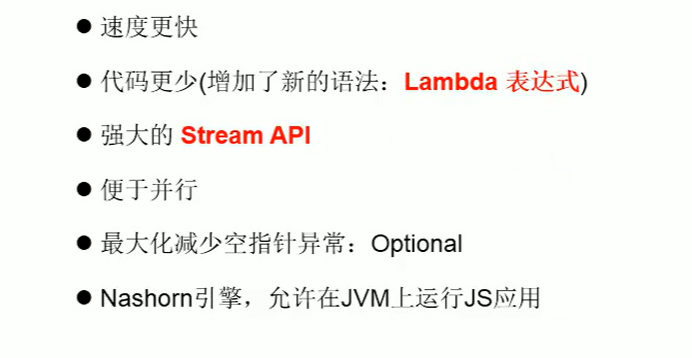
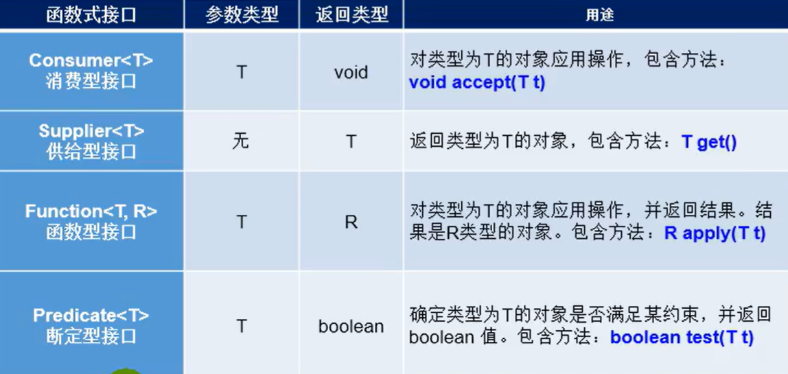
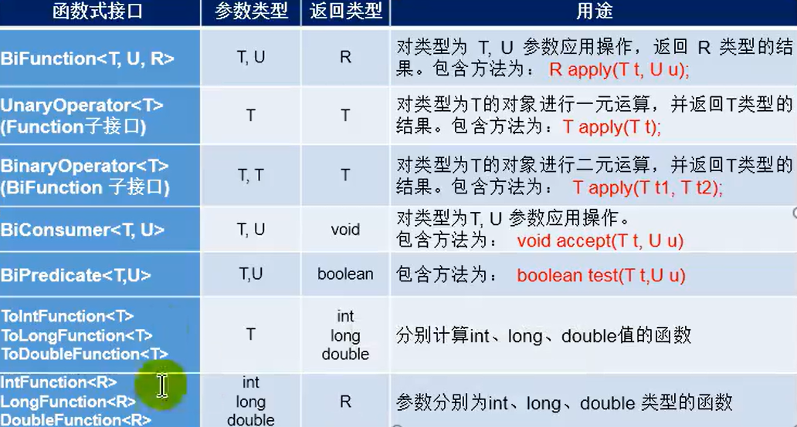
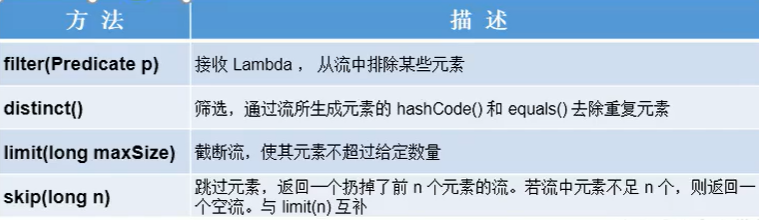
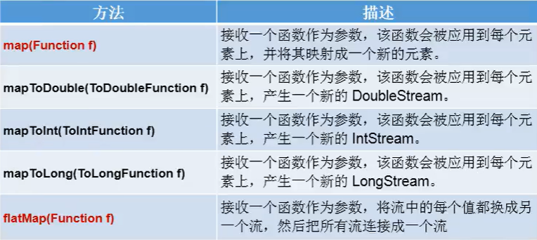
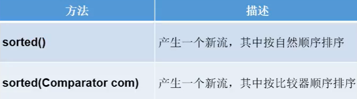
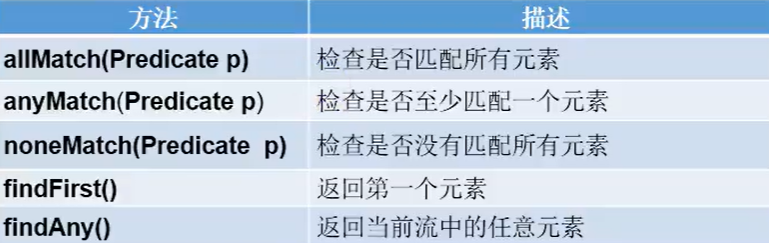
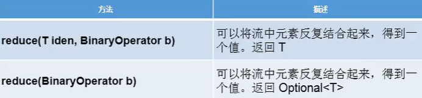
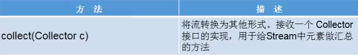
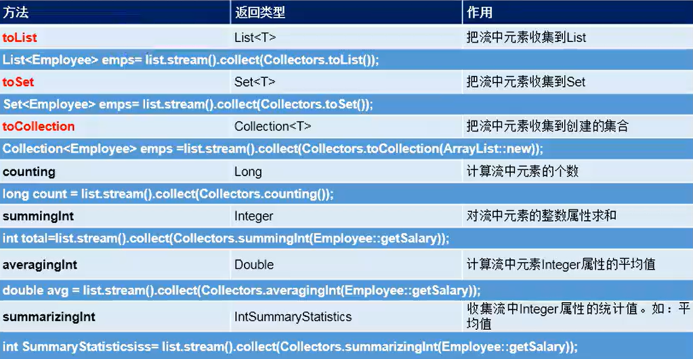

# Java8新特性

Java 8 (又称为jdk 1.8)是Java语言开发的一个主要版本。
Java 8是oracle公司于2014年3月发布,可以看成是自Java 5以来最具革命性的版本。
Java 8为Java语言、编译器、类库、开发工具与JVM带来了大量新特性。



## 一、Lambda表达式

### 为什么使用Lambda表达式

Lambda 是一个匿名函数，我们可以把 Lambda 表达式理解为是一段可以传递的代码(将代码像数据一样进行传递)。使用它可以写出更简洁、更灵活的代码。作为一种更紧凑的代码风格，使Java的语言表达能力得到了提升。

### Lambda 表达式的使用举例

```java
/**
 * Lambda表达式的使用
 *
 * 1. 举例：(o1,o2) -> Integer.compare(o1,o2);
 * 2. 格式：
 *      -> :lambda操作符 或箭头操作符
 *      ->左边：lambda形参列表 (其实就是接口中的抽象方法的形参列表)
 *      ->右边：lambda体(其实就是重写的抽象方法)
 *
 * 3. Lambda表达式的使用：(分为六种情况介绍)
 *      总结：
 *          ->左边：lambda形参列表的参数类型可以省略(类型推断); 如果lambda形参列表只有一个参数，其一对()也可以省略
 *          ->右边：lambda体应该使用一对{}包裹；如果lambda体只有一条执行语句(可能是return语句)，可以省略这一对{}和return关键字
 *
 * 4. Lambda表达式的本质：作为接口的实例
 */
public class LambdaTest1 {

    //语法格式一：无参，无返回值。
    @Test
    public void test1() {
        Runnable r1 = new Runnable() {
            @Override
            public void run() {
                System.out.println("轻音少女");
            }
        };
        r1.run();

        System.out.println("=================================");

        Runnable r2 = () -> {
            System.out.println("星际牛仔");
        };

        r2.run();
    }

    //语法格式二：Lambda 需要一个参数，但是没有返回值
    @Test
    public void test2() {

        Consumer<String> con = new Consumer<String>() {
            @Override
            public void accept(String s) {
                System.out.println(s);
            }
        };
        con.accept("no game no life");

        System.out.println("=======================");

        Consumer<String> con1 = (String s) -> {
            System.out.println(s);
        };
        con1.accept("游戏人生");
    }

    //语法格式三：数据类型可以省略，因为可由编译器推断得出，称为“类型推断”
    @Test
    public void test3() {

        Consumer<String> con1 = (String s) -> {
            System.out.println(s);
        };
        con1.accept("人啊，只有在群体中体会自我，才能有真正活着的感觉");

        System.out.println("===================");

        Consumer<String> con2 = (s) -> {
            System.out.println(s);
        };
        con2.accept("银魂");

        ArrayList<Object> object1 = new ArrayList<Object>();
        ArrayList<Object> object2 = new ArrayList<>();//类型推断

        int[] arr1 = new int[]{1,2,3};
        int[] arr2 = {1,2,3};//类型推断

    }

    //语法格式四：Lambda 若只需要一个参数时，参数的小括号可以省略
    @Test
    public void test4() {

        Consumer<String> con1 = (String s) -> {
            System.out.println(s);
        };
        con1.accept("人啊，只有在群体中体会自我，才能有真正活着的感觉");

        System.out.println("===================");

        Consumer<String> con2 = s -> {
            System.out.println(s);
        };
        con2.accept("银魂");
    }

    // 语法格式五：Lambda 需要两个或以上的参数，多条执行语句，并且可以有返回值
    @Test
    public void text5() {

        Comparator<Integer> com1 = new Comparator<Integer>() {
            @Override
            public int compare(Integer o1, Integer o2) {
                System.out.println(o1);
                System.out.println(o2);
                return o1.compareTo(o2);
            }
        };
        System.out.println(com1.compare(12,21));

        System.out.println("=======================");
        Comparator<Integer> com2 = (o1,o2) -> {
            System.out.println(o1);
            System.out.println(o2);
            return o1.compareTo(o2);
        };
        System.out.println(com2.compare(21,12));
    }

    // 语法格式六：当 Lambda 体只有一条语句时，return 与大括号若有，都可以省略
    @Test
    public void test6() {

        Comparator<Integer> com1 = (o1,o2) -> {
            return o1.compareTo(o2);
        };

        System.out.println(com1.compare(21,12));

        System.out.println("===============================");

        Comparator<Integer> com2 = (o1,o2) -> o1.compareTo(o2);

        System.out.println(com2.compare(12,21));

    }


}
```


## 二、函数式(Functional)接口

### 什么是函数式(Functional)接口

只包含一个抽象方法的接口，称为函数式接口。

你可以通过Lambda表达式来创建该接口的对象。（若Lambda表达式抛出一个受检异常（即：非运行时异常），那么该异常需要在目标接口的抽象方法上进行声明)

我们可以在一个接口上使用@Functionallnterface注解，这样做可以检查它是否是一个函数式接口。同时javadoc也会包含一条声明，说明这个接口是一个函数式接口。

在java.util.function包下定义了Java8的丰富的函数式接口

### 如何理解函数式接口

Java从诞生日起就是一直倡导“一切皆对象” ,在Java里面面向对象(OOP)编程是一切。但是随着python、scala等语言的兴起和新技术的挑战，Java不得不做出调整以便支持更加广泛的技术要求,也即java不但可以支持。OP还可以支持OOF （面向函数编程)

在函数式编程语言当中,函数被当做一等公民对待。在将函数作为一等公民的编程语言中，Lambda表达式的类型是函数。但是在Java8中，有所不同。在Java8中，Lambda表达式是对象，而不是函数，它们必须依附于一类特别的对象类型——函数式接口。

简单的说,在Java8中, Lambda表达式就是一个函数式接口的实例。这就是Lambda表达式和函数式接口的关系。也就是说,只要一个对象是函数式接口的实例，那么该对象就可以用Lambda表达式来表示。

所以以前用匿名实现类表示的现在都可以用Lambda表达式来写。

### Java内置四大核心函数式接口



其他接口


```java
/**
 * java内置的四大核心函数式接口
 *
 * 消费型接口 Consumer<T>    void accept(T t)
 * 供给型接口 Supplier<T>    T get()
 * 函数型接口 Function<T,R>  R apply(T t)
 * 断定型接口 Predicate<T>   boolean test(T t)
 */
public class LambdaTest2 {

    @Test
    public void test1() {

        happyTime(298, new Consumer<Double>(){
            @Override
            public void accept(Double aDouble) {
                System.out.println("爱的价格：" + aDouble);
            }
        });

        System.out.println("============================");

        happyTime(400, money -> System.out.println("爱的价格：" + money));

    }

    public void happyTime(double money, Consumer<Double> con) {
        con.accept(money);
    }


    @Test
    public void test2() {
        List<String> list = Arrays.asList("化物语","伪物语","猫物语","倾物语","鬼物语","花物语");
        List<String> story = filterString(list, new Predicate<String>() {
            @Override
            public boolean test(String s) {
                return s.contains("物语");
            }
        });
        System.out.println(story);

        List<String> story1 = filterString(list, s -> s.contains("物语"));
        System.out.println(story1);
    }

    // 根据给定的规则，过滤集合中的字符串。此规则由Predicate的方法决定
    public List<String> filterString(List<String> list, Predicate<String> pre) {
        ArrayList<String> filterList = new ArrayList<>();

        for(String s : list) {
            if(pre.test(s)) {
                filterList.add(s);
            }
        }
        return filterList;
    }

}
```


## 三、方法引用与构造器引用

### 方法引用(Method References)

当要传递给Lambda体的操作,已经有实现的方法了,可以使用方法引用!

方法引用可以看做是Lambda表达式深层次的表达。换句话说,方法引用就是Lambda表达式,也就是函数式接口的一个实例,通过方法的名字来指向一个方法,可以认为是Lambda表达式的一个语法糖。

要求:实现接口的抽象方法的参数列表和返回值类型,必须与方法引用的方法的参数列表和返回值类型保持一致！

格式:使用操作符“::”将类(或对象)与方法名分隔开来。

如下三种主要使用情况：
    对象：：实例方法名
	类：：静态方法名
	类：：实例方法名

```java
/**
 * 方法引用的使用
 *
 * 1.使用情境：当要传递给Lambda体的操作,已经有实现的方法了,可以使用方法引用!
 *
 * 2.方法引用，本质上就是Lambda表达式，而Lambda表达式作为函数式接口的实例。
 *   所以方法引用，也是函数式接口的实例。
 *
 * 3.使用格式：类(或对象) :: 方法名
 *
 * 4.具体分为如下的三种情况：
 *      情况1 对象 :: 非静态方法
 *      情况2 类 :: 静态方法
 *      情况3 类 :: 非静态方法
 *
 * 5.方法引用使用的要求：要求接口中的抽象方法的形参列表和返回值类型与
 *   方法引用的方法的形参列表和返回值类型相同！(针对于情况1和情况2)
 *
 */
public class MethodRefTest {

    //情况一：对象 :: 实例方法
    // Consumer中的void accept(T t)
    // PrintStream中的void println(T t)
    @Test
    public void test1() {
        Consumer<String> con1 = str -> System.out.println(str);
        con1.accept("轻音少女");

        System.out.println("===================");
        PrintStream ps = System.out;
        Consumer<String> con2 = ps::println;
        con2.accept("星际牛仔");
    }

    //Supplier中的T get()
    //Employee中的String getName()
    @Test
    public void test2() {
        Employee emp = new Employee("1001", "平泽唯", 17, 5000);

        Supplier<String> sup1 = () -> emp.getName();
        System.out.println(sup1.get());

        System.out.println("======================");
        Supplier<String> sup2 = emp::getName;
        System.out.println(sup2.get());
    }

    // 情况二：类::静态方法
    // Comparator中的int compare(T t1, T t2)
    // Integer中的int compare(T t1, T t2)
    @Test
    public void test3() {
        Comparator<Integer> com1 = (t1,t2) -> Integer.compare(t1,t2);
        System.out.println(com1.compare(12,21));

        System.out.println("================================");
        Comparator<Integer> com2 = Integer::compare;
        System.out.println(com2.compare(12,3));
    }

    //Function中的R apply(T t)
    //Math中的Long round(Double d)
    @Test
    public void test4() {
        Function<Double,Long> func = new Function<Double,Long>() {
            @Override
            public Long apply(Double d) {
                return Math.round(d);
            }
        };
        System.out.println("========================");

        Function<Double,Long> func1 = d -> Math.round(d);
        System.out.println(func1.apply(12.3));

        System.out.println("========================");
        Function<Double,Long> func2 = Math::round;
        System.out.println(func1.apply(12.6));
    }

    // 情况三：类::实例方法(有难度)
    // Comparator中的int compare(T t1,T t2)
    // String中的int t1.compareTo(t2)
    @Test
    public void test5() {
        Comparator<String> com1 = (s1,s2) -> s1.compareTo(s2);
        System.out.println(com1.compare("abc","abd"));

        System.out.println("==========================");

        Comparator<String> com2 = String :: compareTo;
        System.out.println(com2.compare("abd","abm"));
    }

    //BiPredicate中的boolean test(T t1,T t2);
    //String中的boolean t1.equals(t2)
    @Test
    public void test6() {
        BiPredicate<String,String> pre1 = (s1,s2) -> s1.equals(s2);
        System.out.println(pre1.test("abc","abc"));

        System.out.println("==============================");
        BiPredicate<String,String> pre2 = String :: equals;
        System.out.println(pre2.test("abc","abd"));
    }

    // Function中的R apply(T t)
    // Employee中的String getName();
    @Test
    public void test7() {
        Employee employee = new Employee("1001", "平泽唯", 17, 5000);

        Function<Employee,String> func1 = e -> e.getName();
        System.out.println(func1.apply(employee));

        System.out.println("================================");

        Function<Employee,String> func2 = Employee::getName;
        System.out.println(func2.apply(employee));

    }

}
```


### 构造器引用和数组引用

```java
/**
 * 一、构造器引用
 *      和方法引用类似，函数式接口的抽象方法的形参列表和构造器的形参列表一致。
 *      抽象方法的返回值类型即为构造器所属的类的类型
 *
 * 二、数组引用
 *      大家可以把数组看作是一个特殊的类，则写法与构造器引用一致
 *
 */
public class ConstructorRefTest {

    //构造器引用
    //Supplier中的T get()
    @Test
    public void test1() {
        Supplier<Employee> sup = new Supplier<Employee>() {
            @Override
            public Employee get() {
                return new Employee();
            }
        };
        System.out.println("===============================");

        Supplier<Employee> sup1 = () -> new Employee();
        System.out.println(sup1.get());

        System.out.println("================================");

        Supplier<Employee> sup2 = Employee :: new;
        System.out.println(sup2.get());
    }

    // Function中国的R apply(T t)
    @Test
    public void test2() {
        Function<String,Employee> func1 = id -> new Employee(id);
        Employee employee = func1.apply("1001");
        System.out.println(employee);

        System.out.println("================================");

        Function<String,Employee> func2 = Employee :: new;
        Employee employee1 = func2.apply("1002");
        System.out.println(employee1);
    }

    //BiFunction中的R apply(T t,U u)
    @Test
    public void test3() {
        BiFunction<String,String,Employee> func1 = (id,name) -> new Employee(id,name);
        System.out.println(func1.apply("1001","Tom"));

        System.out.println("==========================");

        BiFunction<String,String,Employee> func2 = Employee :: new;
        System.out.println(func2.apply("1002", "Tom"));
    }

    //数组引用
    //Function 中的R apply(T t)
    @Test
    public void test4() {
        Function<Integer,String[]> func1 = length -> new String[length];
        String[] arr1 = func1.apply(5);
        System.out.println(Arrays.toString(arr1));

        System.out.println("=================================");

        Function<Integer,String[]> func2 = String[] :: new;
        String[] arr2 = func2.apply(10);
        System.out.println(Arrays.toString(arr2));
    }
}
```


## 四、强大的Stream API

### Stream API说明

Java8中有两大最为重要的改变。第一个是Lambda表达式;另外一个则是 Stream API.

Stream API ( java.util.stream)把真正的函数式编程风格引入到Java中。这是目前为止对Java类库最好的补充,因为Stream API可以极大提供Java程序员的生产力,让程序员写出高效率、干净、简洁的代码。

Stream是Java8中处理集合的关键抽象概念,它可以指定你希望对集合进行的操作，可以执行非常复杂的查找、过滤和映射数据等操作。使用Stream API对集合数据进行操作,就类似于使用SQL执行的数据库查询。也可以使用 Stream API 来并行执行操作。简言之，Stream API 提供了一种高效且易于使用的处理数据的方式。

### 为什么要使用Stream API

实际开发中,项目中多数数据源都来自于Mysql, Oracle等。但现在数据源可以更多了，有MongDB, Radis等，而这些NoSQL的数据就需要Java层面去处理。

Stream和Collection集合的区别: Collection是一种静态的内存数据结构，而 Stream 是有关计算的。前者是主要面向内存，存储在内存中后者主要是面向 CPU，通过 CPU 实现计算。

### 什么是Stream

**Stream到底是什么呢？**
是数据渠道，用于操作数据源（集合、数组等）所生成的元素序列。
**“集合讲的是数据，Stream讲的是计算！”**

**注意：**
    ①Stream自己不会存储元素。
    ②Stream不会改变源对象。相反，他们会返回一个持有结果的Stream。
    ③Stream操作是延迟执行的。这意味着他们会等到需要结果的时候才执行。

### Stream的操作三个步骤

**1- 创建 Stream**
一个数据源（如：集合、数组），获取一个流

**2- 中间操作**
一个中间操作链,对数据源的数据进行处理

**3- 终止操作(终端操作）**
一旦执行终止操作,就执行中间操作链,并产生结果。之后,不会再被使用


### 创建Stream的四种方式

```java
/**
 * 1. Stream关注的是对数据的运算，与CPU打交道
 *      集合关注的式数据的存储，与内存打交道
 *
 * 2.  ① Stream自己不会存储元素。
 *     ② Stream不会改变源对象。相反，他们会返回一个持有结果的Stream。
 *     ③ Stream操作是延迟执行的。这意味着他们会等到需要结果的时候才执行。
 *
 * 3. Stream执行流程
 *      ① Stream的实例化
 *      ② 一系列的中间操作(过滤、映射.....)
 *      ③ 终止操作
 *
 * 4. 说明
 *      ① 一个中间操作链,对数据源的数据进行处理
 *      ② 一旦执行终止操作,就执行中间操作链,并产生结果。之后,不会再被使用
 */
public class StreamAPITest {

    // 创建 Stream方式一：通过集合
    @Test
    public void test1() {
        List<Employee> employees = EmployeeData.getEmployees();

        // default Stream<E> stream(): 返回一个顺序流
        Stream<Employee> stream = employees.stream();

        // default Stream<E> parallelStream(): 返回一个并行流
        Stream<Employee> parallelStream = employees.parallelStream();
    }

    //创建Stream方式二：通过数组
    @Test
    public void test2() {
        int[] arr = new int[]{1,2,3,4,5,6};
        //调用Arrays类的static <T> Stream<T> stream(T[] array): 返回一个流
        IntStream stream = Arrays.stream(arr);

        Employee e1 = new Employee("1001", "Tom");
        Employee e2 = new Employee("1002", "Jerry");
        Employee[] arr1 = new Employee[]{e1,e2};
        Stream<Employee> stream1 = Arrays.stream(arr1);
    }

    //创建Stream方式三：通过Stream的of()
    @Test
    public void test3() {

        Stream<Integer> stream = Stream.of(1,2,3,4,5,6);

    }

    //创建Stream方式四：创建无限流
    @Test
    public void test4() {
        // 迭代
        // public static<T> Stream<T> iterate(final T seed, final UnaryOperator<T> f)
            // 遍历前10个偶数
        Stream.iterate(0, t -> t + 2).limit(10).forEach(System.out::println);

        // 生成
        // public static<T> Stream<T> generate(Supplier<T> s)
        Stream.generate(Math::random).limit(10).forEach(System.out::println);
    }
}
```


### Stream的中间操作

多个中间操作可以连接起来形成一个流水线，除非流水线上触发终止操作，否则中间操作不会执行任何的处理！而在终止操作时一次性全部处理，称为“惰性求值

#### 1-筛选与切片



```java
/**
 * 测试Stream的中间操作
 */
public class StreamAPITest1 {

    //1-筛选与切片
    @Test
    public void test1() {
        List<Employee> list = EmployeeData.getEmployees();

        // filter(Predicate p)——接收 Lambda，从流中排除某些元素。
        Stream<Employee> stream = list.stream();
        //练习：查询员工表中薪资大于7000的员工信息
        stream.filter(e -> e.getSalary() > 7000).forEach(System.out::println);


        System.out.println();
        // limit(n)——截断流，使其元素不超过给定数量。
        Stream<Employee> stream1 = list.stream();
        stream1.limit(3).forEach(System.out::println);

        System.out.println();
        // skip(n)——跳过元素，返回一个扔掉了前n个元素的流。若流中元素不足n个，则返回一个空流。与limit(n)互补
        Stream<Employee> stream2 = list.stream();
        stream2.skip(3).forEach(System.out::println);


        System.out.println();

        List<String> list1 = Arrays.asList("AA", "BB", "CC", "BB", "CC", "AA", "AA");
        // distinct()-筛选,通过流所生成元素的hashCode()和equals()去除重复元素
        Stream<String> stream3 = list1.stream();
        stream3.distinct().forEach(System.out::println);

    }

}
```


#### 2-映射



```java
/**
 * 测试Stream的中间操作
 */
public class StreamAPITest1 {
    @Test
    public void test2() {
//        map(Function f)一接收一个函数作为参数，将元素转换成其他形式或提取信息，该函数会被应用到每个元素上，并将其映射成一个新的元素。
        List<String> list = Arrays.asList("aa","bb","cc","dd");
        list.stream().map(str -> str.toUpperCase()).forEach(System.out::println);

//        练习：获取员工姓名长度大于3的员工的姓名。
        List<Employee> employees = EmployeeData.getEmployees();
        Stream<String> namesStream = employees.stream().map(Employee::getName);
        namesStream.filter(name -> name.length() > 3).forEach(System.out::println);
        System.out.println();

        // 练习2
        Stream<Stream<Character>> streamStream = list.stream().map(StreamAPITest1::fromStringToStream);
        streamStream.forEach(s -> {
            s.forEach(System.out::println);
        });

//        flatMap(Function f)一接收一个函数作为参数，将流中的每个值都换成另一个流，然后把所有流连接成一个流。
        Stream<Character> characterStream = list.stream().flatMap(StreamAPITest1::fromStringToStream);
        characterStream.forEach(System.out::println);

    }

    //将字符串中的多个字符构成的集合转换为对应的Stream的实例
    public static Stream<Character> fromStringToStream(String str) {
        ArrayList<Character> list = new ArrayList<>();
        for(Character c : str.toCharArray()) {
            list.add(c);
        }
        return list.stream();
    }

    @Test
    public void test3() {
        ArrayList list1 = new ArrayList();
        list1.add(1);
        list1.add(2);
        list1.add(3);

        ArrayList list2 = new ArrayList();
        list2.add(4);
        list2.add(5);
        list2.add(6);

//        list1.add(list2);
        list1.addAll(list2);

        System.out.println(list1);

    }
}
```


#### 3-排序



```java
/**
 * 测试Stream的中间操作
 */
public class StreamAPITest1 {
    //3-排序
    @Test
    public void test4() {
        // sorted()——自然排序
        List<Integer> list = Arrays.asList(12,43,65,34,87,0,-98,7);
        list.stream().sorted().forEach(System.out::println);
        //抛异常，原因：Employee没有实现Comparable接口
//        List<Employee> employees = EmployeeData.getEmployees();
//        employees.stream().sorted().forEach(System.out::println);

        // sorted(Comparator com)——定制排序
        List<Employee> employees = EmployeeData.getEmployees();
        employees.stream().sorted( (e1,e2) -> {
            int ageValue = Integer.compare(e1.getAge(), e2.getAge());
            if(ageValue != 0) {
                return ageValue;
            } else {
                return Double.compare(e1.getSalary(),e2.getSalary());
            }
        }).forEach(System.out::println);
    }
}
```


### Stream的终止操作

- 终端操作会从流的流水线生成结果。其结果可以是任何不是流的值，例如：List、Integer,甚至是void。
- 流进行了终止操作后，不能再次使用。

#### 1-匹配与查找



```java
/**
 * 测试Stream的终止操作
 */
public class StreamAPITest2 {

    //1-匹配与查找
    @Test
    public void test1() {
        List<Employee> employees = EmployeeData.getEmployees();

//    allMatch(Predicate p)一检查是否匹配所有元素。
//      练习：是否所有的员工的年龄都大于18
        boolean allMatch = employees.stream().allMatch(e -> e.getAge() > 18);
        System.out.println(allMatch);

//    anyMatch(Predicate p)一检查是否至少匹配一个元素。
//      练习：是否存在员工的工资大于10000
        boolean anyMatch = employees.stream().anyMatch(e -> e.getSalary() > 8999);
        System.out.println(anyMatch);

//    noneMatch(Predicate p)一检查是否没有匹配的元素。
//      练习：是否存在员工姓"雷"
        boolean noneMatch = employees.stream().noneMatch(e -> e.getName().startsWith("雷"));
        System.out.println(noneMatch);

//    findFirst一返回第一个元素
        Optional<Employee> employee = employees.stream().findFirst();
        System.out.println(employee);

//    findAny一返回当前流中的任意元素
        Optional<Employee> employee1 = employees.parallelStream().findAny();
        System.out.println(employee1);

//    count一返回流中元素的总个数
        long count = employees.stream().count();
        System.out.println(count);

//    max(Comparator c)一返回流中最大值
//    练习：返回最高的工资：
        Stream<Double> salaryStream = employees.stream().map(e -> e.getSalary());
        Optional<Double> maxSalary = salaryStream.max(Double::compare);
        System.out.println(maxSalary);

//    min(Comparator c)一返回流中最小值
//    练习：返回最低工资的员工
        Optional<Employee> employee3 = employees.stream().min((e1,e2) -> Double.compare(e1.getSalary(), e2.getSalary()));
        System.out.println(employee3);

//    forEach(Consumer c)一内部送代
        employees.stream().forEach(System.out::println);

        //使用集合的遍历操作
        employees.forEach(System.out::println);
    }

}
```


#### 2-归纳



```java
/**
 * 测试Stream的终止操作
 */
public class StreamAPITest2 {
     //2-归约
    @Test
    public void test3() {
        // reduce(T identity, BinaryOperator)——可以将流中元素反复结合起来，得到一个值，返回T。
        // 练习：计算1-10的自然数的和
        List<Integer> list = Arrays.asList(1,2,3,4,5,6,7,8,9,10);
        Integer sum = list.stream().reduce(0, Integer::sum);
        System.out.println(sum);

        // 可以将流中元素反复结合起来，得到一个值。返回Optional<T>
        // 练习：计算公司所有员工工资的总和
        List<Employee> employees = EmployeeData.getEmployees();
        Stream<Double> salaryStream = employees.stream().map(Employee::getSalary);
        Optional<Double> sumMoney = salaryStream.reduce(Double::sum);
        System.out.println(sumMoney);

    }
}
```


#### 3-收集



Collector接口中方法的实现决定了如何对流执行收集的操作（如收集到List、Set、Map)。
另外，Collectors实用类提供了很多静态方法，可以方便地创建常见收集器实例。



```java
/**
 * 测试Stream的终止操作
 */
public class StreamAPITest2 {
        //3-收集
    @Test
    public void test4() {
        // collect(Collector c)——将流转换为其他形式。接收一个Collector接口的实现，用于给Stream中元素做汇总的方法
        // 练习：查找工资大于6000的员工，结果返回为一个List或Set
        List<Employee> employees = EmployeeData.getEmployees();
        List<Employee> employeeList = employees.stream().filter(e -> e.getSalary() > 6000).collect(Collectors.toList());
        employeeList.forEach(System.out::println);

        System.out.println();

        Set<Employee> employeeSet = employees.stream().filter(e -> e.getSalary() > 6000).collect(Collectors.toSet());
        employeeSet.forEach(System.out::println);
    }
}
```


## 五、Optional类

- 到目前为止，臭名昭著的空指针异常是导致Java应用程序失败的最常见原因。以前，为了解决空指针异常，Google公司著名的Guava项目引入了Optional类，Guava通过使用检查空值的方式来防止代码污染，它鼓励程序员写更干净的代码。受到Google Guava的启发，Optional类已经成为Java8类库的一部分。
- Optional<-T>类(java.util.Optional))是一个容器类，它可以保存类型T的值，代表这个值存在。或者仅仅保存null,表示这个值不存在。原来用nu表示一个值不存在，现在Optional可以更好的表达这个概念。并且可以避免空指针异常。
- Optional类的Javadoc描述如下：这是一个可以为null的容器对象。如果值存在则isPresent()方法会返回true,调用get)方法会返回该对象。


Optional提供很多有用的方法,这样我们就不用显式进行空值检测。

- 创建Optional类对象的方法：
  	Optional.of(T t) :创建一个Optional实例, t必须非空; 
    	Optional.empty() :创建一个空的Optional 实例
    	Optional.ofNullable(T t):可以为null
- 判断Optional容器中是否包含对象：
      boolean isPresent() :判断是否包含对象
  	void ifPresent(Consumer<? super T> consumer) :如果有值,就执行Consumer接口的实现代码，并且该值会作为参数传给它。
- 获取Optional容器的对象：
      Tget():如果调用对象包含值,返回该值,否则抛异常
  	TorElse(T other):如果有值则将其返回,否则返回指定的other对象。
      TorElseGet(Supplier<? extends T> other) :如果有值则将其返回,否则返回由Supplier接口实现提供的对象。
      T orElse Throw(Supplier<? extends X> exceptionSupplier) :如果有值则将其返回,否则抛出由Supplier接口实现提供的异常。

```java
/**
 * Optional类：为了在程序中避免出现空指针异常而创建的。
 *
 * 常用的方法：ofNullable(T t)
 *           orElse(T t)
 */
public class OptionalTest {

    /*
    Optional.of(T t): 创建一个 Optional 实例，t必须非空;
    Optional.empty(): 创建一个空的 Optional 实例
    Optional.ofNullable(T t): t可以为null
    */
    @Test
    public void test1() {
        Girl girl = new Girl();
        girl = null;
        // of(T t): 保证t是非空的
        Optional<Girl> optionalGirl = Optional.of(girl);
    }

    @Test
    public void test2() {
        Girl girl = new Girl();
        girl = null;
        Optional<Girl> optionalGirl = Optional.ofNullable(girl);
        System.out.println(optionalGirl);
        // orElse(T t1): 如果当前的Optional内部封装的t是非空的，则返回内部的t.
        // 如果内部的t是空的，则返回orElse()方法中的参数t1.
        Girl girl1 = optionalGirl.orElse(new Girl("轻音少女"));
        System.out.println(girl1);
    }

    // 未优化的代码，有空指针异常
    public String getGirlName(Boy boy) {
        return boy.getGirl().getName();
    }
    @Test
    public void test3() {
        Boy boy = new Boy();
        boy = null;
        String girlName = getGirlName(boy);
        System.out.println(girlName);
    }
    //优化以后的getGirlName();
    public String getGirlName1(Boy boy) {
        if(boy != null) {
            Girl girl = boy.getGirl();
            if(girl != null) {
               return girl.getName();
            }
        }
        return null;
    }
    @Test
    public void test4() {
        Boy boy = new Boy();
        boy = null;
        String girlName = getGirlName1(boy);
        System.out.println(girlName);
    }
    //使用Optional类的getGirlName();
    public String getGirlName2(Boy boy) {

        Optional<Boy> boyOptional = Optional.ofNullable(boy);
        //此时的boy1一定非空
        Boy boy1 = boyOptional.orElse(new Boy(new Girl("星际牛仔")));
        Girl girl = boy1.getGirl();

        Optional<Girl> girlOptional = Optional.ofNullable(girl);
        //girl一定非空
        Girl girl1 = girlOptional.orElse(new Girl("银魂"));

        return girl1.getName();
    }

    @Test
    public void test5() {
        Boy boy = null;
        boy = new Boy();
        boy = new Boy(new Girl("全金属狂潮"));
        String girlName = getGirlName2(boy);
        System.out.println(girlName);
    }


}
```


