# JavaWeb

## html 和 CSS

### B/S 软件的结构


### 前端开发流程


### 网页的组成部分


### HTML简介


### 创建HTML文件

（1）创建一个web工程（静态的web工程）


（2）在工程下创建html页面


### HTML 文件的书写规范

```html
<!DOCTYPE html><!-- 约束，声明 -->
<html lang="zh_CN"><!-- html标签表示html的开始 lang="zh_CN"表示中文 html标签中一般分为两部分，分别是：head和body -->
<head><!-- 表示头部信息，一般包含三部分内容，title标签，CSS样式，js代码 -->
    <meta charset="UTF-8"><!-- 表示当前页面使用UTF-8字符集 -->
    <title>标题</title><!-- 表示标题 -->
</head>
<body><!-- body标签是整个html页面显示的主题内容 -->
    hello
</body>
</html>
```


### HTML 标签介绍


### 标签语法细节

注意事项：html 代码不是很严谨，有时候标签不闭合，也不会报错

```html
<!DOCTYPE html>
<html lang="en">
<head>
    <meta charset="UTF-8">
    <title>标签语法细节.html</title>
</head>
<body>

  <!--标签不能交叉嵌套-->
  正确：<div><span>hello</span></div>
  错误：<div><span>hello</div></span>
  <hr />

  <!--标签必须正确的关闭-->
  正确：<div>hello</div>
  错误：<div>hello
  <hr/>

  <!--没有文本内容的标签-->
  正确：<br />1
  错误：<br >2
  <hr />

  <!--属性必须有值，属性值必须加引导-->
  正确：<font color="blue">hello</font>
  错误：<font color=blue>hello</font>
  错误：<font color>hello</font>
  <hr />

  <!--注释不能嵌套-->
  正确：<!--注释-->
  错误：<!--注释<!--注释-->-->
  <hr/>

</body>
</html>
```


### html  常见标签介绍

[w3cschool离线手册2017.03.28](API/w3cschool离线手册2017.03.28.chm)

#### font 字体标签

```html
<!DOCTYPE html>
<html lang="en">
<head>
    <meta charset="UTF-8">
    <title>font标签.html</title>
</head>
<body>

    <!--
        需求1：在网页上显示 我是字体标签，并修改字体为 宋体，颜色为红色。
        
        font标签是字体标签，它可以用来修改文本的字体，颜色，大小（尺寸）
        color属性修改颜色
        face属性修改字体
        size属性修改文本大小
    -->
    <font color="red" face="宋体" size="7">我是字体标签</font>

</body>
</html>
```


#### 特殊字符

```html
<!DOCTYPE html>
<html lang="en">
<head>
    <meta charset="UTF-8">
    <title>特殊字符.html</title>
</head>
<body>

    <!-- 特殊字符
    需求1：把 <br> 换行标签 变成文本 转换成字符显示在页面上

    常用的特殊字符：
        <     ===>  &lt;
        >     ===>  &gt;
       空格   ===>  &nbsp;
    -->
    我是&lt;br&gt;标签<br/>
    轻音少&nbsp;&nbsp;&nbsp;&nbsp;&nbsp;&nbsp;&nbsp;女

</body>
</html>
```


#### 标题标签

标题标签是 h1 到 h6

```html
<!DOCTYPE html>
<html lang="en">
<head>
    <meta charset="UTF-8">
    <title>标题标签.html</title>
</head>
<body>

    <!-- 标题标签
    需求1：演示标题1 到 标题6的

      h1 - h6 都是标题标签
      h1 最大
      h6 最小

      align 属性是对齐属性
          left    左对齐(默认)
          center  居中
          right   右对齐
    -->
    <h1 align="left">轻音少女</h1>
    <h2 align="center">轻音少女</h2>
    <h3 align="right">轻音少女</h3>
    <h4>轻音少女</h4>
    <h5>轻音少女</h5>
    <h6>轻音少女</h6>

</body>
</html>
```


#### 超链接

在网页中所有点击之后可以跳转的内容都是超链接

```html
<!DOCTYPE html>
<html lang="en">
<head>
    <meta charset="UTF-8">
    <title>超链接.html</title>
</head>
<body>

        <!--α标签是 超链楼
              href层性设置速接的地址
              target属性设屋哪个目标进行跳装
                  _self   表示当前页面（默认值）
                  _blank  表示打开新页面来进行跳转
        -->
        <a href="https://www.bilibili.com/">百度</a><br/>
        <a href="https://www.bilibili.com/" target="_self">百度_self</a><br/>
        <a href="https://www.bilibili.com/" target="_balnk">百度_blank</a><br/>

</body>
</html>
```


#### 列表标签

```html
<!DOCTYPE html>
<html lang="en">
<head>
    <meta charset="UTF-8">
    <title>列表标签.html</title>
</head>
<body>

    <!-- 需求1：使用无序，列表方式，把东北F4,赵四，刺能，小沈阳，宋小宝，展示出来
        ul 是无序列表
            type层性可以修改列表项前面的符号
        li 是列表项

        ol 是有序列表
    -->
    <ul type="none">
        <li>东京教父</li>
        <li>轻音少女</li>
        <li>CLANNAD</li>
        <li>星际牛仔</li>
    </ul>

    <ol type="none">
        <li>东京教父</li>
        <li>轻音少女</li>
        <li>CLANNAD</li>
        <li>星际牛仔</li>
    </ol>

</body>
</html>
```


#### img标签

```html
<!DOCTYPE html>
<html lang="en">
<head>
    <meta charset="UTF-8">
    <title>img标签</title>
</head>
<body>

    <!-- 需求1：使用img标签显示一张图片。并修改宽高，和边框属性

        img标签是图片标签，用来显示图片
            src属性可以设屋图片的路径
            width属性设置图片的宽度
            height属性设置图片的高度
            border属性设置图片边框
            alt属性设置当指定路径找不到图片时，用来代替显示的文本内容

        在javaSE中路径地也分为相对路径和绝对路径.
            相对路径：从工程名开始算
            绝对路径：盘符：/目录/文件名

        在web中 路径分为相对路径和绝对路径两种
            相对路径：
                .       表示当前文件所在的目录
                ..      表示当前文件所在的上一级目录
                文件名   表示当前文件所在目录的文件，相当于./文件名。     ./可以省略

            绝对路径：
                正确格式是：http://ip:port/工程名/资源路径

                错误格式是：盘符:/目录/文件名
    -->
    
    

</body>
</html>
```


#### 表格标签

```html
<!DOCTYPE html>
<html lang="en">
<head>
    <meta charset="UTF-8">
    <title>表格标签</title>
</head>
<body>

    <!--
        需求1：做一个 带表头的，三行，三列的表格，并显示边框
        需求2：修改表格的宽度，高度，表格的对齐方式，单元格间距。

          table 标签是表格标签
              border 设置表格标签
              width 设置表格宽度
              height 设置表格高度
              align 设置表格相对于页面的对齐方式
              cellspacing 设置单元格间距

         tr   是行标签
         th   是表头标签
         td   是单元格标签

         b 是加粗标签
    -->
    <table align="center" border="1" width="300" height="300" cellspacing="0">
      <tr>
        <th>1.1</th>
        <th>1.2</th>
      </tr>
      <tr>
        <td>2.1</td>
        <td>2.2</td>
      </tr>
    </table>


</body>
</html>
```


#### 跨行跨列表格

```html
<!DOCTYPE html>
<html lang="en">
<head>
    <meta charset="UTF-8">
    <title>表格跨行跨列</title>
</head>
<body>
    <!--   需求1：
              新建一个五行，五列的表格，
              第一行，第一列的单元格要跨两列，
              第二行第一列的单元格跨两行，
              第四行第四列的单元格跨两行两列。

              colspan属性设置跨列
              rowspan属性设置跨行
    -->

    <table width="500" height="500" cellspacing="0" border="1">
      <tr>
        <td colspan="2">1.1</td>
        <td>1.3</td>
        <td>1.4</td>
        <td>1.5</td>
      </tr>
      <tr>
        <td rowspan="2">2.1</td>
        <td>2.2</td>
        <td>2.3</td>
        <td>2.4</td>
        <td>2.5</td>
      </tr>
      <tr>
        <td>3.2</td>
        <td>3.3</td>
        <td>3.4</td>
        <td>3.5</td>
      </tr>
      <tr>
        <td>4.1</td>
        <td>4.2</td>
        <td>4.3</td>
        <td colspan="2" rowspan="2">4.4</td>
      </tr>
      <tr>
        <td>5.1</td>
        <td>5.2</td>
        <td>5.3</td>
      </tr>
    </table>

</body>
</html>
```


#### iframe 框架标签（内嵌窗口）

iframe 标签它可以在一个html页面，打开一个小窗口，去加载一个单独的页面。

```html
<!DOCTYPE html>
<html lang="en">
<head>
    <meta charset="UTF-8">
    <title>iframe标签</title>
</head>
<body>
    我是一个单独的完整的页面<br/><br/>
    <!-- iframe标签可以在页面上开辟一个小区域显示一个单独的页面
            iframe 和 a 标签组合使用的步骤：
                1. 在iframe标签中使用name属性定义一个名称
                2. 在a标签的target属性上设置iframe的name的属性值
    -->
    <iframe src="标题标签.html" width="500" height="400" name="abc"></iframe>
    <br/>

    <ul>
      <li><a href="超链接.html" target="abc">超链接.html</a></li>
      <li><a href="表格标签.html" target="abc">表格标签.html</a></li>
      <li><a href="img标签.html" target="abc">img标签.html</a></li>
    </ul>
</body>
</html>
```


#### 表单标签

表单就是 html 页面中，用来收集用户信息的所有元素集合然后把这些信息发送给服务器.

```html
<!DOCTYPE html>
<html lang="en">
<head>
    <meta charset="UTF-8">
    <title>表单标签</title>
</head>
<body>
<!-- 需求1: 创建一个个人信息注册的表单界面。包含用户名，密码，确认密码。性别(单选) ,兴趣爱好(多选) ,国籍(下拉列表) 。
  隐藏域，自我评价（多行文本域）。重置，提交。-->

    <!--
        form 标签就是表单
          input type=text     是文件输入框  value设置默认显示内容
          input type=password 是密码输入框  value设置默认显示内容
          input type=radio    是单选框    name属性可以对其进行分组  checked="checked"表示默认选中
          input type=checkbox 是复选框    checked="checked"表示默认选中
          input type=reset    是重置按钮    value属性修改按钮上的文本
          input type=submit   是提交按钮    value属性修改按钮上的文本
          input type=button   是按钮        value属性修改按钮上的文本
          input type=file     是文件上传域
          input type=hidden   是隐藏域    当我们要发送某些信息，而这些信息，不需要用户参与，就可以使用隐藏域（提交的时候同时发送给服务器）

          select 标签是下拉列表框
          option标签是下拉列表框中的选项selected="selected"设置默认选中

          textarea 表示多行文本输入框（起始标签和结束标签中的内容是默认值）
              rows 属性设置可以显示几行的高度
              cols 属性设置每行可以显示几个字符宽度
    -->
    <form>
        <table align="center">
            <tr>
                <td> 用户名称：</td>
                <td><input type="text" value="默认值"/></td>
            </tr>
            <tr>
                <td>用户密码：</td>
                <td><input type="password" value="abc"/></td>
            </tr>
            <tr>
                <td>确认密码：</td>
                <td><input type="password" value="abc"/></td>
            </tr>
            <tr>
                <td>性别：</td>
                <td><input type="radio" name="sex"/>男<input type="radio" name="sex" checked="checked" />女</td>
            </tr>
            <tr>
                <td>国籍：</td>
                <td> <select>
                        <option>--请选择国籍-</option>
                        <option selected="selected">中国</option>
                        <option>美国</option>
                        <option>小日本</option>
                    </select></td>
            </tr>
            <tr>
                <td>自我评价：</td>
                <td><textarea rows="10" cols="20">我才是默认值</textarea></td>
            </tr>
            <tr>
                <td><input type="reset"/></td>
                <td align="center"><input type="submit"/></td>
            </tr>
        </table>
    </form>
</body>
</html>
```


#### 表单提交的细节

```html
<!DOCTYPE html>
<html lang="en">
<head>
    <meta charset="UTF-8">
    <title>表单提交细节</title>
</head>
<body>
    <!--
          form标签是表单标签
              action属性设置提交的服务器地址
              method属性设置提交的方式GET(默认值)或POST
          表单提交的时候,数据没有发送给服务器的三种情况:
              1、表单项没有name属性值
              2、单选、复选(下拉列表中的option标签)都需要添加value属性，以便发送给服务器
              3、表单项不在提交的form标签中

          GET请求的特点是：
               1、浏览器地址栏中的地址是：action属性[+?+请求参数]
                    请求参数的格式是: name=value&name=value
               2、不安全
               3、他有数据长度的限制

          POST请求的特点是：
              1、浏览器地址栏中只有action属性值
              2、相对于GET请求要安全
              3、理论上没有数据长度的限制
    -->

    <form action="http://localhost:8080" method="post">
      <table align="center">
        <tr>
          <td> 用户名称：</td>
          <td><input type="text" value="默认值" name="username"/></td>
        </tr>
        <tr>
          <td>用户密码：</td>
          <td><input type="password" value="abc"/></td>
        </tr>
        <tr>
          <td>确认密码：</td>
          <td><input type="password" value="abc"/></td>
        </tr>
        <tr>
          <td>性别：</td>
          <td><input type="radio" name="sex" value="boy"/>男
              <input type="radio" name="sex" value="girl" checked="checked" />女
          </td>
        </tr>
        <tr>
          <td>国籍：</td>
          <td> <select>
            <option>--请选择国籍-</option>
            <option selected="selected">中国</option>
            <option>美国</option>
            <option>小日本</option>
          </select></td>
        </tr>
        <tr>
          <td>自我评价：</td>
          <td><textarea rows="10" cols="20">我才是默认值</textarea></td>
        </tr>
        <tr>
          <td><input type="reset"/></td>
          <td align="center"><input type="submit"/></td>
        </tr>
      </table>
    </form>

</body>
</html>
```


#### 其他标签

```html
<!DOCTYPE html>
<html lang="en">
<head>
    <meta charset="UTF-8">
    <title>其他标签</title>
</head>
<body>

    <!--
        需求1：div、span、p标签的演示

        div标签       默认独占一行
        span标签      它的长度是封装数据的长度
        p段落标签      默认会在段落的上方或下方各空出一行来(如果已有就不再空)
    -->

    <div>div标签1</div>
    <div>div标签2</div>
    <span>span的标签1</span>
    <span>span的标签2</span>
    <p>p段落标签1</p>
    <p>p段落标签2</p>
</body>
</html>
```


### CSS技术介绍

> CSS是【层叠样式表单】。是用于(增强)控制网页样式并允许将样式信息与网页内容分离的一种标记性语言。
>

[CSS_API文档](API\CSS2.0_DOC.chm)

### CSS语法介绍


```css
CSS注释：/*注释内容*/
```


### CSS 和 HTML 的结合方式

- 第一种结合方式

  在标签的 style 属性上设置"key: value value;", 修改标签样式。

  ```html
  <!DOCTYPE html>
  <html lang="en">
  <head>
      <meta charset="UTF-8">
      <title>Title</title>
  </head>
  <body>
      <!-- 需求1：分别定义两个 div、span标签，分别修改每个 div 标签的样式为：边框1个像素，实线，红色。-->
      <div style="border: 1px solid red">div标签1</div>
      <div style="border: 1px solid red">div标签2</div>
      <span style="border: 1px solid red">span标签1</span>
      <span style="border: 1px solid red">span标签2</span>
  </body>
  </html>
  ```

     问题：这种方式的缺点？
  1. 如果标签多了。样式多了。代码量非常庞大。
  2. 可读性非常差。

     3. CSS代码没什么复用性可方言。

        

- 第二种结合方式

    在 head 标签中，使用style标签来定义各种自己需要的css样式。
    格式如下：
      	XXX { 

  ​			Key value value;

  ​		}

  ```html
  <!DOCTYPE html>
  <html lang="en">
  <head>
      <meta charset="UTF-8">
      <title>Title</title>
      <!--style标签专门用来定义css样式代码-->
      <style type="text/css">
        /* 需求1：分别定义两个 div、span标签，分别修改每个 div 标签的样式为：边框1个像素，实线，红色。*/
        div {
          border: 1px solid red;
        }
        span {
          border: 1px solid red;
        }
      </style>
  </head>
  <body>
  
      <div>div标签1</div>
      <div>div标签2</div>
      <span>span标签1</span>
      <span>span标签2</span>
  
  </body>
  </html>
  ```

   问题：这种方式的缺点。

  1. 只能在同一页面内复用代码，不能在多个页面中复用 css代码。
  2. 维护起来不方便,实际的项目中会有成千上万的页面,要到每个页面中去修改。工作量太大了。


- 第三种结合方式

  把css样式写成一个单独的css文件，再通过 link 标签引入即可复用。

  ```html
  <!DOCTYPE html>
  <html lang="en">
  <head>
      <meta charset="UTF-8">
      <title>Title</title>
      <!--link标签专门用来引入css样式代码-->
      <link rel="stylesheet" type="text/css" href="3-css.css"/>
  </head>
  <body>
  
      <div>div标签1</div>
      <div>div标签2</div>
      <span>span标签1</span>
      <span>span标签2</span>
  
  </body>
  </html>
  ```

  ```css
  div {
      border: 1px solid red;
  }
  span {
      border: 1px solid red;
  }
  ```

  

### CSS选择器

- 标签名选择器

  > 标签名选择器的格式是：
  >
  > ​	标签名{
  >
  > ​		属性：值；
  >
  > ​	}
  >
  > 
  >
  > ​	标签名选择器,可以决定哪些标签被动的使用这个样式。

  ```html
  <!DOCTYPE html>
  <html lang="en">
  <head>
      <meta charset="UTF-8">
      <title>CSS选择器</title>
      <style type="text/css">
          div{
              border: 1px solid black;
              color: lightskyblue;
              fon-size: 30px;
          }
          span{
              border: 5px dashed red;
              color: chartreuse;
              font-size: 20px;
          }
      </style>
  </head>
  <body>
  
      <!--
          需求1：在所有div标签上修改字体颜色为蓝色，字体大小30个像素。边框为1像素黄色实线。
          并且修改所有span标签的字体颜色为黄色，字体大小20个像素。边框为5像素蓝色虚线。
      -->
  
      <div>div标签1</div>
      <div>div标签2</div>
      <span>span的标签1</span>
      <span>span的标签2</span>
  
  </body>
  </html>
  ```

  

- id 选择器

  > id 选择器的格式是：
  >
  > ​	#id 属性值{
  >
  > ​		属性：值；
  >
  > ​	}
  >
  > ​	id 选择器，可以让我们通过 id 属性选择性的去使用这个样式。

  ```html
  <!DOCTYPE html>
  <html lang="en">
  <head>
      <meta charset="UTF-8">
      <title>ID选择器</title>
      <style type="text/css">
        #id001{
          border: 1px solid black;
          color: lightskyblue;
          fon-size: 30px;
        }
        #id002{
          border: 5px dashed red;
          color: chartreuse;
          font-size: 20px;
        }
      </style>
  </head>
  <body>
  
      <!--
         需求1：分别定义两个 div 标签，
         第一个div标签定义 id 为 id001，然后根据 id 属性定义css样式修改字体颜色为蓝色，
         字体大小30个像素。边框为1像素黄色实线。
  
        第二个div标签定义 id 为 id002，然后根据 id 属性定义css样式 修改的字体颜色为红色，字体大小20个像素。
        边框为5像素蓝色点线。
      -->
      <div id="id001">div标签1</div>
      <div id="id002">div标签2</div>
  
  </body>
  </html>
  ```

  

- class 选择器（类选择器）

  > class类型选择器的格式是：
  >     .class属性值{
  >
  > ​			属性：值；
  >
  > ​	}
  >
  > 
  >
  > ​	class类型选择器，可以通过class属性有效的选择性地去使用这个样式。

  ​	

  ```html
  <!DOCTYPE html>
  <html lang="en">
  <head>
      <meta charset="UTF-8">
      <title>class类型选择器</title>
      <style type="text/css">
        .class01{
          border: 1px solid black;
          color: lightskyblue;
          fon-size: 30px;
        }
        .class02{
          border: 5px dashed red;
          color: chartreuse;
          font-size: 20px;
        }
      </style>
  </head>
  <body>
  
      <!--
        需求1：修改 class 属性值为 class01的 span 或 div标签，字体颜色为蓝色，字体大小30个像素。边框为1像素黄色实线。
        需求2：修改 class 属性值为 class02的 div 标签，字体额色为灰色，字体大小26个像素。边框为1像素红色实线
      -->
  
      <div class="class01">div标签1</div>
      <div class="class02">div标签2</div>
      <span class="class01">span标签1</span>
      <span class="class02">span标签2</span>
  </body>
  </html>
  ```

  

- 组合选择器

  >  组合选择器的格式是：
  >   选择器1，选择器2，选择器n{
  >
  >  ​		属性：值；}
  >
  >  
  >
  >  ​	组合选择器可以让多个选择器共用同一个css样式代码。
  
  ```html
  <!DOCTYPE html>
  <html lang="en">
  <head>
      <meta charset="UTF-8">
      <title>Title</title>
      <style type="text/css">
        .class01, #id01{
            color: blue;
            font-size: 20px;
            border: 1px greenyellow solid;
        }
      </style>
  </head>
  <body>
  
      <!--
      需求1：修改 class="class01" 的div 标签 和 id="id01"所有的span标签,
      字体颜色为蓝色，字体大小20个像素。边框为1像素黄色实线
      -->
  
      <div class="class01">div标签class01</div> <br />
      <span id="id01">span 标签</span>  <br />
      <div>div标签</div> <br />
      <div>div标签id01</div> <br />
  
  </body>
  </html>
  ```
  
  

### 常见样式

1. 字体颜色
2. 宽度
3. 高度
4. 背景颜色
5. 字体样式
6. 红色 1像素 实线 边框
7. DIV居中
8. 文本居中
9. 超链接去下划线
10. 表格细线
11. 列表去除修饰

```html
<!DOCTYPE html>
<html lang="en">
<head>
    <meta charset="UTF-8">
    <title>Title</title>
    <style type="text/css">

        div{
            color: red;
            border: 1px yellow solid;
            width: 300px;
            height: 300px;
            background-color: greenyellow;
            font-size: 30px;
            margin-left: auto;
            margin-right: auto;
            text-align: center;
        }
        a{
            text-decoration: none;
        }
        table{
            border: 1px red solid;
            border-collapse: collapse;
        }
        td{
            border: 1px red solid;
        }
        ul{
            list-style: none;
        }
    </style>
</head>
<body>
    <ul>
        <li>111111111111111</li>
        <li>222222222222222</li>
        <li>333333333333333</li>
    </ul>
    <table>
        <tr>
            <td>1.1</td>
            <td>1.2</td>
        </tr>
    </table>
    <a href="https://www.baidu.com">百度</a>
    <div>我是div标签</div>
</body>
</html>
```


## JavaScript 语言入门

### JavaScript介绍


### JavaScript  和 html 代码的结合方式

- 第一种方式

  只需要在 head 标签中，或者在 body 标签中， 使用script 标签来书写 JavaScript 代码

  ```html
  <!DOCTYPE html>
  <html lang="en">
  <head>
      <meta charset="UTF-8">
      <title>Title</title>
      <script type="text/javascript">
        // alert是JavaScript语言提供的一个警告框函数。
        // 它可以接收任意类型的参数，这个参数就是警告框的提示信息
        alert("hello javaScript");
      </script>
  </head>
  <body>
  
  </body>
  </html>
  ```

  

- 第二种方式

  使用 script 标签引入 单独的 JavaScript 代码文件

  ```html
  <!DOCTYPE html>
  <html lang="en">
  <head>
      <meta charset="UTF-8">
      <title>Title</title>
      <!--
          现在需要使用script引入外部的js文件来执行
              src属性专门用来引入js文件路径（可以是相对路径，也可以是绝对路径）
      -->
      <script type="text/javascript" src="1.js"></script>
  </head>
  <body>
  
  </body>
  </html>
  ```

  ```javascript
  alert("1125 hello");
  ```

  

### 变量


```html
<!DOCTYPE html>
<html lang="en">
<head>
    <meta charset="UTF-8">
    <title>Title</title>
    <script type="text/javascript">
        var i;
        // alert(i); // undefined
        i = 12;
        // alert(i); //12
        // typeof()是JavaScript语言提供的一个函数。
        // alert( typeof(i) ); // number

        i = "abc";
        // 它可以取变量的数据类型返回
        // alert(typeof(i)); //String

        var a = 12;
        var b = "abc";

        alert(a*b); // NaN是非数字，非数值

    </script>
</head>
<body>


</body>
</html>
```


### 运算符

- 关系（比较）运算符

  

  ```html
  <!DOCTYPE html>
  <html lang="en">
  <head>
      <meta charset="UTF-8">
      <title>Title</title>
      <script type="text/javascript">
  
        var a = "12";
        var b = 12;
  
        alert( a == b ); //true
        alert( a === b ); //false
  
      </script>
  </head>
  <body>
  
  </body>
  </html>
  ```

  

- 逻辑运算

  

  

  ```html
  <!DOCTYPE html>
  <html lang="en">
  <head>
      <meta charset="UTF-8">
      <title>Title</title>
      <script type="text/javascript">
          // 在JavaScript语言中，所有的变量，都可以做为一个boolean类型的变量去使用。
          // 0、null、undefined、""(空串）都认为是 false
          //  var a = 0;
          //  if (a) {
          //    alert("零为真");
          //  } else {
          //    alert("零为假");
          //  }
  
  
          // && 且运算。
          // 有两种情况：
          // 第一种：当表达式全为真的时候。返回最后一个表达式的值。
          // 第二种：当表达式中，有一个为假的时候。返回第一个为假的表达式的值
          var a = "abc";
          var b = true;
          var d = false;
          var c = null;
          // alert( a && b );//true
          // alert( b && a );//"abc"
          // alert( a && d );//false
          // alert( a && c );//null
          // alert( a && d && c );//false
  
          // || 或运算
          // 第一种情况：当表达式全为假时，返回最后一个表达式的值
          // 第二种情况：只要有一个表达式为真。就会返回第一个为真的表达式的值
          alert( d || c );// null
          alert( c || d );// false
          alert( a || c );// abc
          alert( b || c );//true
      </script>
  </head>
  <body>
  
  
  </body>
  </html>
  ```

  

### 数组


```html
<!DOCTYPE html>
<html lang="en">
<head>
    <meta charset="UTF-8">
    <title>Title</title>
    <script type="text/javascript">

        var arr = []; //定义一个空数组
        alert( arr.length ); // 0

        arr[0] = 12;
        alert( arr[0] ); // 12
        alert( arr.length ); // 1

        //javaScript语言中的数组，只要我们通过数组下标赋值，那么最大的下标值，就会自动的给数组做扩容操作。
        arr[2] = "abc";
        alert(arr.length);//3

        alert(arr[1]); // undefined

        //数组的遍历
        for (var i = 0; i < arr.length; i++) {
            alert(arr[i]);
        }

    </script>
</head>
<body>

</body>
</html>
```


### 函数

- 函数定义的第一种方式

  

  ```html
  <!DOCTYPE html>
  <html lang="en">
  <head>
      <meta charset="UTF-8">
      <title>Title</title>
      <script type="text/javascript">
          //定义一个无参函数
          function fun(){
              alert("无参函数fun()被调用");
          }
          fun();
  
          //定义一个有参函数
          function fun2(a, b){
            alert("有参函数fun2()被调用");
          }
          fun2(12, "abc");
  
          //定义带有返回值的函数
          function sum(num1, num2) {
            var result = num1 + num2;
            return result;
          }
  
          alert( sum(100, 50) );
      </script>
  </head>
  <body>
  
  </body>
  </html>
  ```

  

- 函数定义的第二种方式

  

  ```html
  <!DOCTYPE html>
  <html lang="en">
  <head>
      <meta charset="UTF-8">
      <title>Title</title>
      <script type="text/javascript">
          var fun = function () {
            alert("无参函数");
          }
          fun();
  
          var fun2 = function (a, b) {
            alert("有参函数");
          }
          fun2();
  
          var fun3 = function (num1, num2) {
            return num1 + num2;
          }
          alert( fun3(100, 200) );
      </script>
  </head>
  <body>
  
  </body>
  </html>
  ```

  

注：在Java中函数允许重载。但是在 js 中函数的重载会直接覆盖掉上一次的定义

```html
<!DOCTYPE html>
<html lang="en">
<head>
    <meta charset="UTF-8">
    <title>Title</title>
    <script type="text/javascript">

      function fun() {
        alert("无参函数fun()");
      }

      function fun(a,b) {
          alert("有参函数fun(a,b)");
      }

      fun();
    </script>
</head>
<body>

</body>
</html>
```


- 函数的 arguments 隐形参数（只在 function 函数内）

  

  ```html
  <!DOCTYPE html>
  <html lang="en">
  <head>
      <meta charset="UTF-8">
      <title>Title</title>
      <script type="text/javascript">
          function fun() {
              alert( arguments.length );
              alert( arguments[0] );
              alert( arguments[1] );
              alert( arguments[2] );
  
            for (var i = 0; i < arguments.length; i++) {
                alert( arguments[i] );
            }
  
            alert("无参函数fun()");
          }
          fun(1, "ad", true);
  
          // 需求：要求 编写 一个函数，用于计算所有参数相加的和并返回
          function sum(num1, num2) {
              var result = 0;
            for (var i = 0; i < arguments.length; i++) {
                result += arguments[i];
            }
            return result;
          }
  
          alert( sum(1,2,3,4,5,6,7,8,9,10) );
      </script>
  </head>
  <body>
  
  </body>
  </html>
  ```

  

### JS中的自定义对象（扩展内容）

- 第一种方式

  

  ```html
  <!DOCTYPE html>
  <html lang="en">
  <head>
      <meta charset="UTF-8">
      <title>Title</title>
      <script type="text/javascript">
        // 对象的定义：
        //    var 变量名 = new Object();   // 对象实例（空对象）
        //    变量名.属性名 = 值；          // 定义一个属性
        //    变量名.函数名 = function(){} // 定义一个函数
        var obj = new Object();
        obj.name = "轻音少女";
        obj.age = 18;
        obj.fun = function () {
            alert("姓名：" + this.name + "，年龄：" + this.age);
        }
  
        // 对象的访问：
        //    变量名.属性 / 函数名();
        // alert( obj.age );
        obj.fun();
      </script>
  </head>
  <body>
  
  </body>
  </html>
  ```

  

- 第二种方式

  

  ```html
  <!DOCTYPE html>
  <html lang="en">
  <head>
      <meta charset="UTF-8">
      <title>Title</title>
      <script type="text/javascript">
        // 对象的定义：
        // var 变量名 = {            // 空对象
        //      属性名：值,           // 定义一个属性
        //      属性名：值,           // 定义一个属性
        //      函数名：function(){}  // 定义一个函数
        // };
        var obj = {
            name:"轻音少女",
            age:18,
            fun : function () {
                alert("姓名：" + this.name + "，年龄：" + this.age);
            }
        };
  
        // 对象的访问
        //    变量名.属性 / 函数名();
        alert(obj.name);
        obj.fun();
      </script>
  </head>
  <body>
  
  </body>
  </html>
  ```

  

### 事件


#### onload 加载完成事件

```html
<!DOCTYPE html>
<html lang="en">
<head>
    <meta charset="UTF-8">
    <title>Title</title>
    <script type="text/javascript">
        // onload事件的方法
        function onloadFun() {
            alert("静态注册onload事件，所有代码");
        }
    </script>
</head>
<!--
静态注册onload事件
    onload事件是浏览器解析完页面之后就会自动融发的事件
-->
<body onload="onloadFun();">

</body>
</html>
```

```html
<!DOCTYPE html>
<html lang="en">
<head>
    <meta charset="UTF-8">
    <title>Title</title>
    <script type="text/javascript">
        // onload事件动态注册，是固定写法
        window.onload = function () {
            alert("动态注册的onload事件");
        }
    </script>
</head>
<body>

</body>
</html>
```


#### onclick 单击事件

```html
<!DOCTYPE html>
<html lang="en">
<head>
    <meta charset="UTF-8">
    <title>Title</title>
    <script type="text/javascript">
        function onclickFun() {
            alert("静态注册onclick事件");
        }
    </script>
</head>
<body>
    <!--静态注册onclick事件-->
    <button onclick="onclickFun();">按钮</button>
</body>
</html>
```

```html
<!DOCTYPE html>
<html lang="en">
<head>
    <meta charset="UTF-8">
    <title>Title</title>
    <script type="text/javascript">
      // 动态注册onclick事件
      window.onload = function () {
        // 1. 获取标签对象
        /*
            document 是JavaScript语言提供的一个对象（文档) <br/>
            get         获取
            Element     元素（就是标签）
            By          通过..  由..经..
            ID          id属性

            getElementById 通过id属性获取标签对象
         */
        var btnObj = document.getElementById("btn01");

        // 2.通过标签对象.事件名 = function(){}
        btnObj.onclick = function () {
            alert("动态注册的onclick事件");
        }
      }

    </script>
</head>
<body>

    <button id="btn01">按钮</button>

</body>
</html>
```


#### onblur 失去焦点事件

```html
<!DOCTYPE html>
<html lang="en">
<head>
    <meta charset="UTF-8">
    <title>Title</title>
    <script type="text/javascript">
        // 静态注册失去焦点事件
        function onblurFun() {
            //  console是控制台对象，是由JavaScript语言提供，专门用来向浏览器的控制器打印输出，用于测试使用
            //  log()是打印的方法
            console.log("静态注册失去焦点事件");
        }
    </script>
</head>
<body>
    用户名：<input type="text" onblur="onblurFun();"><br/>
    密码：<input type="text">
</body>
</html>
```

```html
<html lang="en">
<head>
    <meta charset="UTF-8">
    <title>Title</title>
    <script type="text/javascript">
        // 动态注册 onblur事件
        window.onload = function () {
            //1. 获取标签对象
            var passwordObj = document.getElementById("password");
            //2. 通过标签对象.事件名 = function(){};
            passwordObj.onblur = function () {
                console.log("动态注册失去焦点事件");
            }
        }
    </script>
</head>
<body>

    密码：<input id="password" type="text">

</body>
</html>
```


#### onchange 内容发生改变事件

```html
<!DOCTYPE html>
<html lang="en">
<head>
    <meta charset="UTF-8">
    <title>Title</title>
    <script type="text/javascript">
        function onchangeFun() {
            alert("女神已经改变了");
        }
    </script>
</head>
<body>

    请选择你心中的女神：
    <!-- 静态注册onchange事件 -->
    <select onchange="onchangeFun()">
        <option>--女神--</option>
        <option>秋山澪</option>
        <option>阿尔托莉雅</option>
        <option>琴美</option>
    </select>

</body>
</html>
```

```html
<!DOCTYPE html>
<html lang="en">
<head>
    <meta charset="UTF-8">
    <title>Title</title>
    <script type="text/javascript">

        window.onload = function () {
            // 1.获取标签对象
            var selObj = document.getElementById("sel01");
            // 2.通过标签对象.事件名 = function(){}
            selObj.onchange = function () {
                alert("女神已经改变了");
            }
        }

    </script>
</head>
<body>

    请选择你心中的女神：
    <!-- 动态注册onchange事件 -->
    <select id="sel01">
        <option>--女神--</option>
        <option>秋山澪</option>
        <option>阿尔托莉雅</option>
        <option>琴美</option>
    </select>

</body>
</html>
```


#### onsubmit 表单提交事件

```html
<!DOCTYPE html>
<html lang="en">
<head>
    <meta charset="UTF-8">
    <title>Title</title>
    <script type="text/javascript">
        // 静态注册表单提交事务
        function onsubmitFun() {
          // 要验证所有表单项是否合法，如果，有一个不合法就阻止表单提交
          alert("静态注册表单提交事件---发现不合法");

          return false;
        }
    </script>
</head>
<body>

    <!-- return false 可以阻止 表单提交 -->
    <form action="http://localhost:8080" method="get" onsubmit="return onsubmitFun();">
      <input type="submit" value="静态注册"/>
    </form>

</body>
</html>
```

```html
<!DOCTYPE html>
<html lang="en">
<head>
    <meta charset="UTF-8">
    <title>Title</title>
    <script type="text/javascript">
        window.onload = function () {
            // 1.获取标签对象
            var formObj = document.getElementById("form01");
            // 2.通过标签对象.事件名 = function(){}
            formObj.onsubmit = function () {
                //要验证所有表单项是否合法，如果，有一个不合法就阻止表单提交
                alert("动态注册表单提交事件-发现不合法");

                return false;
            }
        }
    </script>

</head>
<body>

    <form action="http://localhost:8080" id="form01">
        <input type="submit" value="动态注册"/>
    </form>

</body>
</html>
```


### DOM  模型


#### Document 对象


> Document 对象的理解：
>     第一点: Document它管理了所有的HTML文档内容。
>
> ​    第二点: document它是一种树结构的文档。有层级关系。
>
> ​    第三点：它让我们把所有的标签都对象化
>
> ​	第四点:我们可以通过document访问所有的标签对象。


#### Document 对象中的方法介绍


#### getElementById方法实例代码：

```html
<!DOCTYPE html>
<html lang="en">
<head>
    <meta charset="UTF-8">
    <title>Title</title>
    <script type="text/javascript">
        /*
             需求：当用户点击了较验按钮，要获取输出框中的内容。然后验证其是否合法。
             验证的规则是：必须由字母，数字，下划线组成。并且长度是5到12位。
        */
        function onclickFun() {
            // 1.当我们要操作一个标签的时候，一定要先获取这个标签对象
            var usernameObj = document.getElementById("username");
            var usernameText = usernameObj.value;
            // 如何 验证 字符串，符合某个规则，需要使用正则表达式技术
            var patt = /^\w{5,12}$/;

            // test()方法用于测试某个字符串，是不是匹配我的规则，
            // 匹配就返回true。不匹配就返回false.
            if (patt.test(usernameText)) {
                alert("用户名合法！")
            } else {
                alert("用户名不合法！");
            }
        }
    </script>
</head>
<body>

    用户名：<input type="test" id="username" value="wzg"/>
    <button onclick="onclickFun();">校验</button>
</body>
</html>
```


#### 正则表达式对象

```html
<!DOCTYPE html>
<html lang="en">
<head>
    <meta charset="UTF-8">
    <title>Title</title>
    <script type="text/javascript">
        // 表示要求字符串中，是否包含字母e
        // var patt new RegExp("e");
        // var patt = /e/; // 也是正则表达式对象
        // 表示要求字符串中，是否包含字母a或b或c
        // var patt =/[abc]/;
        // 表示要求字符串，是否包含小写字母
        // var patt =/[a-z]/;
        // 表示要求字符串，是否包含任意大写字母
        // var patt =/[A-Z]/;
        // 表示要求字符串，是否包含任意数字
        // var patt =/[0-9]/;
        // 表示要求字符串，是否包含字母，数字，下划线
        // var patt = /\w/;
        // 表示要求 字符串中是否包含至少一个a
        // var patt = /a+/;
        // 表示要求字符串中是否包含零个或多个a
        // var patt = /a*/;
        // 表示要求 字符串是否包含一个或零个a
        // var patt = /a?/;
        // 表示要求字符串是否包含连续三个a
        // var patt = /a{3)/;
        // 表示要求 字符串是否包含 至少3个连续的a,最多5个连续的a
        // var patt = /a{3,5)/;
        // 表示要求 字符串必须以a结尾
        // var patt = /a$/;
        // 表示要求字符串必须以a打头
        // var patt = /^a/;

        // 要求字符串中是否包含 至少3个连续的a
        // var patt = /a{3,5}/;
        // 要求字符串，从头到尾都必须完全匹配
        // var patt = /^a{3,5}$/;

        var patt = /^\w{5,12}$/;
        var str = "wzg168";
        alert( patt.test(str) );
    </script>
</head>
<body>

</body>
</html>
```


#### 常见的验证提示效果

```html
<!DOCTYPE html>
<html lang="en">
<head>
    <meta charset="UTF-8">
    <title>Title</title>
    <script type="text/javascript">
        /*
             需求：当用户点击了较验按钮，要获取输出框中的内容。然后验证其是否合法。
             验证的规则是：必须由字母，数字，下划线组成。并且长度是5到12位。
        */
        function onclickFun() {
            // 1.当我们要操作一个标签的时候，一定要先获取这个标签对象
            var usernameObj = document.getElementById("username");
            var usernameText = usernameObj.value;
            // 如何 验证 字符串，符合某个规则，需要使用正则表达式技术
            var patt = /^\w{5,12}$/;

            var usernameSpanObj = document.getElementById("usernameSpan");
            // innerHTML 表示起始标签和结束标签中的内容
            // innerHTML 这个属性可读，可写
            usernameSpanObj.innerHTML = "轻音少女";

            // test()方法用于测试某个字符串，是不是匹配我的规则，
            // 匹配就返回true。不匹配就返回false.
            if (patt.test(usernameText)) {
                // alert("用户名合法！");
                usernameSpanObj.innerHTML = "用户名合法！";
            } else {
                // alert("用户名不合法！");
                usernameSpanObj.innerHTML = "用户名不合法！";
            }
        }
    </script>
</head>
<body>

    用户名：<input type="test" id="username" value="wzg"/>
    <span id="usernameSpan" style="color: red;"></span>
    <button onclick="onclickFun();">校验</button>
</body>
</html>
```


#### getElementsByName 方法示例代码：

```html
<!DOCTYPE html>
<html lang="en">
<head>
    <meta charset="UTF-8">
    <title>Title</title>
    <script type="text/javascript">
        // 全选
        function checkAll() {
          // document.getELementsByName();是根据指定的name属性查询返回多个标签对象集合
          // 这个集合的操作跟数组一样
          // 集合中每个元素都是dom对象
          // 这个集合中的元套颇序是他们在htmL页面中从上到下的顺序
          var hobbies = document.getElementsByName("hobby");
          // checked表示复选框的选中状态。如果选中是true，不选中是false
          // checked 这个属性可读，可写
          for (var i = 0; i < hobbies.length; i++) {
              hobbies[i].checked = true;
          }
        }
        // 全不选
        function checkNo() {
          var hobbies = document.getElementsByName("hobby");
          // checked表示复选框的选中状态。如果选中是true，不选中是false
          // checked 这个属性可读，可写
          for (var i = 0; i < hobbies.length; i++) {
            hobbies[i].checked = false;
          }
        }
        // 反选
        function checkReverse() {
          var hobbies = document.getElementsByName("hobby");
          // checked表示复选框的选中状态。如果选中是true，不选中是false
          // checked 这个属性可读，可写
          for (var i = 0; i < hobbies.length; i++) {
              if (hobbies[i].checked) {
                hobbies[i].checked = false;
              } else {
                hobbies[i].checked = true;
              }
          }
        }
    </script>
</head>
<body>

    兴趣爱好：
    <input type="checkbox" name="hobby" value="kon">轻音少女
    <input type="checkbox" name="hobby" value="clannad">团子大家族
    <input type="checkbox" name="hobby" value="kanon">雪之少女
    <br/>
    <button onclick="checkAll()">全选</button>
    <button onclick="checkNo()">全不选</button>
    <button onclick="checkReverse()">反选</button>

</body>
</html>
```


#### getElementsByTagName 方法示例代码：

```html
<!DOCTYPE html>
<html lang="en">
<head>
    <meta charset="UTF-8">
    <title>Title</title>
    <script type="text/javascript">
        // 全选
        function checkAll() {
          // document.getELementsByTagName("input");
          // 是按照指定标签名来进行查询并返回集合
          // 这个集合的操作跟数组一样
          // 集合中都是dom对象
          // 集合中元素顺序 是他们在html页面中从上到下的顺序。
          var inputs = document.getElementsByTagName("input");

          for (var i = 0; i < inputs.length; i++) {
              inputs[i].checked = true;
          }
        }
    </script>
</head>
<body>

    兴趣爱好：
    <input type="checkbox" value="kon">轻音少女
    <input type="checkbox" value="clannad">团子大家族
    <input type="checkbox" value="kanon">雪之少女
    <br/>
    <button onclick="checkAll()">全选</button>

</body>
</html>
```


#### document 对象	三个查询方法的使用注意事项


#### 节点的常用属性和方法

节点就是标签对象


```html
<!DOCTYPE html>
<html>
<head>
<meta charset="UTF-8">
<title>dom查询</title>
<link rel="stylesheet" type="text/css" href="css.css" />
<script type="text/javascript">
	window.onload = function(){
		//1.查找#bj节点
		document.getElementById("btn01").onclick = function () {
			var bjObj = document.getElementById("bj");
			alert(bjObj.innerHTML);
		}
		
		//2.查找所有li节点
		var btn02Ele = document.getElementById("btn02");
		btn02Ele.onclick = function(){
			var lis = document.getElementsByTagName("li");
			alert(lis.length);
		};
		//3.查找name=gender的所有节点
		var btn03Ele = document.getElementById("btn03");
		btn03Ele.onclick = function(){
			var genders = document.getElementsByName("gender");
			alert(genders.length);
		};
		//4.查找#city下所有li节点
		var btn04Ele = document.getElementById("btn04");
		btn04Ele.onclick = function(){
			// 1.获取id为city的节点
			// 2.通过city节点.getELementsByTagName按标签名查子节点
			var lis = document.getElementById("city").getElementsByTagName("li");
			alert(lis.length);
		};
		//5.返回#city的所有子节点
		var btn05Ele = document.getElementById("btn05");
		btn05Ele.onclick = function(){
			// 1.获取id为city的节点
			// 2.通过city获取所有子节点
			alert(document.getElementById("city").childNodes.length);
		};
		//6.返回#phone的第一个子节点
		var btn06Ele = document.getElementById("btn06");
		btn06Ele.onclick = function(){
			// 查询id为phone的节点
			alert(document.getElementById("phone").firstChild.innerHTML);
		};
		//7.返回#bj的父节点
		var btn07Ele = document.getElementById("btn07");
		btn07Ele.onclick = function(){
			// 1.查询id为bj的节点
			var bjObj = document.getElementById("bj");
			// 2.bj节点获取父节点
			alert(bjObj.parentNode.innerHTML);
		};
		//8.返回#android的前一个兄弟节点
		var btn08Ele = document.getElementById("btn08");
		btn08Ele.onclick = function(){
			// 获取id为android的节点
			// 通过android节点获取前面兄弟节点
			alert(document.getElementById("android").previousSibling.innerHTML);
		};
		//9.读取#username的value属性值
		var btn09Ele = document.getElementById("btn09");
		btn09Ele.onclick = function(){
			alert(document.getElementById("username").value);
		};
		//10.设置#username的value属性值
		var btn10Ele = document.getElementById("btn10");
		btn10Ele.onclick = function(){
			document.getElementById("username").value = "轻音少女";
		};
		//11.返回#bj的文本值
		var btn11Ele = document.getElementById("btn11");
		btn11Ele.onclick = function(){
			alert(document.getElementById("city").innerHTML);
		};
	};
</script>
</head>
<body>
<div id="total">
	<div class="inner">
		<p>
			你喜欢哪个城市?
		</p>

		<ul id="city">
			<li id="bj">北京</li>
			<li>上海</li>
			<li>东京</li>
			<li>首尔</li>
		</ul>

		<br>
		<br>

		<p>
			你喜欢哪部动谩?
		</p>

		<ul id="game">
			<li id="rl">轻音少女</li>
			<li>团子大家族</li>
			<li>明日之丈</li>
			<li>JoJo的奇妙冒险</li>
		</ul>

		<br/>
		<br/>
		<br/>
		<br/>

		<p>
			你手机的操作系统是?
		</p>

		<ul id="phone"><li>IOS</li><li id="android">Android</li><li>Windows Phone</li></ul>
	</div>

	<div class="inner">
		gender:
		<input type="radio" name="gender" value="male"/>
		Male
		<input type="radio" name="gender" value="female"/>
		Female
		<br>
		<br>
		name:
		<input type="text" name="name" id="username" value="abcde"/>
	</div>
</div>
<div id="btnList">
	<div><button id="btn01">查找#bj节点</button></div>
	<div><button id="btn02">查找所有li节点</button></div>
	<div><button id="btn03">查找name=gender的所有节点</button></div>
	<div><button id="btn04">查找#city下所有li节点</button></div>
	<div><button id="btn05">返回#city的所有子节点</button></div>
	<div><button id="btn06">返回#phone的第一个子节点</button></div>
	<div><button id="btn07">返回#bj的父节点</button></div>
	<div><button id="btn08">返回#android的前一个兄弟节点</button></div>
	<div><button id="btn09">返回#username的value属性值</button></div>
	<div><button id="btn10">设置#username的value属性值</button></div>
	<div><button id="btn11">返回#bj的文本值</button></div>
</div>
</body>
</html>
```

```css
@CHARSET "UTF-8";

body {
	width: 800px;
	margin-left: auto;
	margin-right: auto;
}

button {
	width: 300px;
	margin-bottom: 10px;
}

#btnList {
	float:left;
}

#total{
	width: 450px;
	float:left;
}

ul{
	list-style-type: none;
	margin: 0px;
	padding: 0px;
}

.inner li{
	border-style: solid;
	border-width: 1px;
	padding: 5px;
	margin: 5px;
	background-color: #99ff99;
	float:left;
}

.inner{
	width:400px;
	border-style: solid;
	border-width: 1px;
	margin-bottom: 10px;
	padding: 10px;
	float: left;
}
```


#### document对象补充说明

```html
<!DOCTYPE html>
<html lang="en">
<head>
    <meta charset="UTF-8">
    <title>Title</title>
    <script type="text/javascript">
        window.onload = function () {
          // 现在需要我们使用js代码来创建htmL标签，并显示在页面上
          // 标签的内容就是：<div>轻音少女</div>
          var divObj = document.createElement("div");// 在内存中 <div></div>

          divObj.innerHTML = "轻音少女"; // <div>轻音少女</div>，但还只在内存中
          // 添加子元素
          document.body.appendChild(divObj);
        }
    </script>
</head>
<body>

</body>
</html>
```


### Dom的增删改查

文档模型对象(Document Object Model):通过DOM可以来任意修改网页的各个内容。

文档：文档指的是网页，一个网页就是一个文档。

对象：对象指将网页中的每一个节点都转换为对象，转换完对象以后，就可以以一种纯面向对象的形式来操作网页了。

模型：模型用来表示节点和节点之间的关系，方便操作页面。

节点（Node）：节点是构成网页的最基本的单元，网页中的每一个部分都可以称为是一个节点，虽然都是节点，但是节点的类型却是不同的。

常用的节点分为以下几种：

| **节点种类**          | 描述                 |
| --------------------- | -------------------- |
| 文档节点 （Document） | 代表整个网页         |
| 元素节点（Element）   | 代表网页中的标签     |
| 属性节点（Attribute） | 代表标签中的属性     |
| 文本节点（Text）      | 代表网页中的文本内容 |


#### DOM操作

一般DOM操纵增删改查等，都需要和事件以及按钮(或其他)进行绑定，如果是按钮，点击页面某个按钮，则会执行对应绑定好的回调函数，通过在回调函数里面进行增删改查是个不错的选择。所以，本总结将DOM操作从事件、查、增、删、改来进行总结。

#### DOM操作之事件

事件指的是用户和浏览器之间的交互行为。比如点击按钮等，可以为事件来绑定回调函数来响应事件。

绑定事件的方法主要有两种：

1.可以在标签的事件属性中设置相应的JS代码

```html
<button onclick="js代码。。。">按钮</button>
```


2.可以通过为对象的指定事件属性设置回调函数的形式来处理事件

```javascript
<button id="btn">按钮</button>  
<script>  
    var btn = document.getElementById("btn");  
    btn.onclick = function(){  
  
    };  
</script>
```


注意细节：

上述第二种方式操作时会存在一定问题，因为浏览器在加载页面的时候，是自上而下的顺序加载的，加载一行执行一行，如果将js代码编写到页面的上边，当代码执行时，页面中的DOM对象还没有加载，此时将会无法正常获取到DOM对象，导致DOM操作失败。

解决办法：

1.可以将JS代码编写到body的下边。

2.将js代码编写到window.onload = function(){}中，window.onload 对应的回调函数会在整个页面加载完毕以后才执行，所以可以确保代码执行时，DOM对象已经加载完毕了

```html
<script>  
    window.onload = function(){  
        var btn = document.getElementById("btn");  
        btn.onclick = function(){  
        };  
    };  
</script>
```


####  DOM操作之查询

在网页中浏览器已经为我们提供了document对象，其代表的是整个网页，是window对象的属性，可以在页面中直接使用。

##### 查询方法

| 方法                                      | 描述                                     |
| ----------------------------------------- | ---------------------------------------- |
| document.getElementById(“id属性值”);      | 根据元素的id属性查询一个元素节点对象     |
| document.getElementsByName(“name属性值”); | 根据元素的name属性值查询一组元素节点对象 |
| document.getElementsByTagName(“标签名”);  | 根据标签名来查询一组元素节点对象         |


##### 查询属性

语法：

> 元素.属性名
>

示例：ele.id、ele.value等

注意细节：class属性不能采用这种方式，读取class属性时需要使用 元素.className

修改元素的属性：

> 元素.属性名 = 属性值
>

查询节点元素的方式一般是通过具体的元素节点来查询，通过标签名查询当前元素的指定后代元素 。

查询的方式有：


|           方式            |                          **描述**                          |
| :-----------------------: | :--------------------------------------------------------: |
|      元素.childNodes      | 获取当前元素的**所有子节点，**但是会获取到空白的文本子节点 |
|       元素.children       |                获取当前元素的**所有子元素**                |
|      元素.firstChild      | 获取当前元素的**第一个子节点**，但会获取到空白的文本子节点 |
|      元素.lastChild       |              获取当前元素的**最后一个子节点**              |
|      元素.parentNode      |                    获取当前元素的父元素                    |
|   元素.previousSibling    |                获取当前元素的前一个兄弟节点                |
|     元素.nextSibling      |                获取当前元素的后一个兄弟节点                |
|     firstElementChild     |                 获取当前元素的第一个子元素                 |
| 元素.firstChild.nodeValue |                 读取第一个子节点的文本内容                 |


注意细节：

- childNodes属性会获取包括文本节点在呢的所有节点，根据DOM标签标签间空白也会当成文本节点。在IE8及以下的浏览器中，不会将空白文本当成子节点。
- previousElementSibling获取前一个兄弟元素，IE8及以下不支持。
- firstElementChild不支持IE8及以下的浏览器，如果需要兼容他们尽量不要使用。

其他
此外，document对象的其他属性和方法有：

| 属性或方法                        | **描述**                                                     |
| --------------------------------- | ------------------------------------------------------------ |
| document.all                      | **获取页面中的所有元素**，相当于document.getElementsByTagName(“*”); |
| document.documentElement          | **获取页面中html根元素**                                     |
| document.body                     | 获取页面中的body元素                                         |
| document.getElementsByClassName() | **根据元素的class属性值查询一组元素节点对象（**这个方法不支持IE8及以下的浏览器**）** |
| document.querySelector()          | **根据CSS选择器去页面中\**查询一个元素\**（**如果匹配到的元素有多个，则它会返回查询到的第一个元素**）** |
| document.querySelectorAll()       | 根据CSS选择器去页面中查询一组元素（会将匹配到所有元素封装到一个数组中返回，即使只匹配到一个，也是返回数组。使用则需要通过操作数组方式来使用） |


#### DOM操作之增加

增加操作需要从以下几步进行：

1. 创建好一个元素节点对象。
2. 为元素节点创建一个文本节点对象。
3. 再将文本节点对象绑定给元素节点。
4. 找到增加节点的目标位置的父节点对象。
5. 通过父节点对象增加子节点对象的方式进行添加。

注意细节：

- document.createElement(“TagName”)用于创建一个元素节点对象。（TagName是创建元素节点的标签名字）
- document.createTextNode(“textContent”)用于创建一个文本节点对象。
- 元素节点.appendChild(文本节点对象)用于将文本信息添加到元素节点对象中去。

代码示例：

```html
<!DOCTYPE html>
<html lang="en">
<head>
    <meta charset="UTF-8">
    <title>DOM-添加</title>
</head>
<style>
    #divMain {
        location: center;
        position: relative;
    }
    #div1 {
        position:absolute;
        width: 200px;
        height: 500px;
        margin-left: 200px;
    }
    #divB {
        position: absolute;
        width: 100px;
        height: 300px;
    }
    button {
        margin: 10px;
        width: 100px;
        height: 40px;
        text-align: center;
        background-color: pink;
    }
</style>
<body>
<div id="divMain">
    <div id="div1">
        <ul id="place">
            <li id="li1">li1</li>
            <li id="li2">li2</li>
            <li id="li3">li3</li>
        </ul>
    </div>
    <div id="divB">
        <button id="button1">常规添加一个li标签</button>
        <button id="buttonHTML">通过innerHTML添加一个li标签</button>
        <button id="button2">添加一个在li2之前的li标签</button>
    </div>
</div>
</body>
<script>
    //为按钮1绑定事件
    var botton = document.getElementById("button1");
    botton.onclick = function () {
        //上述介绍的元素方法，但此方法代码冗长。
        // //添加什么标签，就写什么参数
        // var li = document.createElement("li");
        // //添加标签的文本信息
        // var liText = document.createTextNode("这是常规方法添加的li节点");
        // //把文本信息添加到标签中去(将文本和标签拼接)
        // li.appendChild(liText);
        // //获取父节点对象
        // var place = document.getElementById("place");
        // //把li节点添加到父节点对象中去
        // place.appendChild(li);
 
 
        //对上述代码优化：(优先使用这种方式！！！！！！！！)
        //添加什么标签，就写什么参数
        var li = document.createElement("li");
        //直接通过li添加HTML信息
        li.innerHTML = "<li>这是常规方法添加的li节点</li>";
        //获取父节点对象
        var place = document.getElementById("place");
        //把li节点添加到父节点对象中去
        place.appendChild(li);
    }
 
    //为按钮buttonHTML绑定事件（此方法影响地方较大，可能会影响先前绑定的事件，不推荐使用）
    var botton = document.getElementById("buttonHTML");
    botton.onclick = function () {
        //获取父节点对象
        var place = document.getElementById("place");
        place.innerHTML += "<li>这是通过innerHTML来添加的标签</li>";
    }
 
    //为按钮2绑定事件（在固定位置，li2之前创建节点）
    var botton = document.getElementById("button2");
    botton.onclick = function () {
        //添加什么标签，就写什么参数
        var li = document.createElement("li");
        //添加标签的文本信息
        var liText = document.createTextNode("添加一个在li2之前的li标签");
        //把文本信息添加到标签中去(将文本和标签拼接)
        li.appendChild(liText);
 
        //获取父节点对象和对应子节点对象
        var li2 = document.getElementById("li2");
        var place = document.getElementById("place");
        //把li节点添加到父节点对象中去
        place.insertBefore(li,li2);
    }
 
</script>
</html>
```

 

#### DOM操作之删除

DOM删除，常规主要有以下步骤：

1. 获取父节点对象
2. 获取子节点对象
3. 通过父节点对象来删除子节点对象

注意细节：

- 删除子节点方式：父节点.removeChild(子节点对象)
- 代码中，优化情况主要是通过子节点自身的属性parentNode，来获取到父节点，然后再调用removeChild()来讲目标子节点进行删除。

代码示例：

```html
<!DOCTYPE html>
<html lang="en">
<head>
    <meta charset="UTF-8">
    <title>DOM-添加</title>
</head>
<style>
    #divMain {
        location: center;
        position: relative;
    }
    #div1 {
        position:absolute;
        width: 200px;
        height: 500px;
        margin-left: 200px;
    }
    #divB {
        position: absolute;
        width: 100px;
        height: 300px;
    }
    button {
        margin: 10px;
        width: 100px;
        height: 40px;
        text-align: center;
        background-color: pink;
    }
</style>
<body>
<div id="divMain">
    <div id="div1">
        <ul id="place">
            <li id="li1">li1</li>
            <li id="li2">li2</li>
            <li id="li3">li3</li>
        </ul>
    </div>
    <div id="divB">
        <button id="button4">删除li3标签</button>
    </div>
</div>
</body>
<script>
    //为按钮4绑定事件（删除li3标签）
    var botton = document.getElementById("button4");
    botton.onclick = function () {
        //常规方法
        // //获取父节点对象和对应子节点对象
        // var li3 = document.getElementById("li3");
        // var place = document.getElementById("place");
        // //把li节点添加到父节点对象中去
        // place.removeChild(li3);
 
        // 优化方法：不获取父节点对象的方法
           var li3 = document.getElementById("li3");
        //通过自身节点来直接获取父节点，再利用父节点来删除目标元素
           li3.parentNode.removeChild(li3);
    }
 
</script>
</html>
```


#### DOM操作之修改

DOM修改，主要有以下步骤：（修改也可以理解为替换操作）

1. 创建好一个元素节点对象。
2. 为元素节点创建一个文本节点对象。
3. 再将文本节点对象绑定给元素节点。
4. 获取父节点对象。
5. 将目标节点替换成网页中（必须是父元素的子元素）的已存在子元素节点。

注意细节：

> 修改（替换）是通过：父元素对象.replaceChild(旧节点,新节点)


代码示例：

```html
<!DOCTYPE html>
<html lang="en">
<head>
    <meta charset="UTF-8">
    <title>DOM-添加</title>
</head>
<style>
    #divMain {
        location: center;
        position: relative;
    }
    #div1 {
        position:absolute;
        width: 200px;
        height: 500px;
        margin-left: 200px;
    }
    #divB {
        position: absolute;
        width: 100px;
        height: 300px;
    }
    button {
        margin: 10px;
        width: 100px;
        height: 40px;
        text-align: center;
        background-color: pink;
    }
</style>
<body>
<div id="divMain">
    <div id="div1">
        <ul id="place">
            <li id="li1">li1</li>
            <li id="li2">li2</li>
            <li id="li3">li3</li>
        </ul>
    </div>
    <div id="divB">
        <button id="button3">替换li1标签</button>
    </div>
</div>
</body>
<script>
    //为按钮3绑定事件（替换li1标签）
    var botton = document.getElementById("button3");
    botton.onclick = function () {
        //添加什么标签，就写什么参数
        var li = document.createElement("li");
        //添加标签的文本信息
        var liText = document.createTextNode("这是替换li1标签的li标签");
        //把文本信息添加到标签中去(将文本和标签拼接)
        li.appendChild(liText);
 
        //获取父节点对象和对应旧的子节点对象
        var li1 = document.getElementById("li1");
        var place = document.getElementById("place");
        //把新的li节点添加到父节点对象中去
        place.replaceChild(li,li1);
    }
 
</script>
</html>
```


#### DOM操作回调函数的优化

但增删改查操作一旦变多之后，这需要写大量的重复代码，这时候可以将重复代码整理成一个函数模型，直接拿来调用即可。这样可以简化代码。

直接上代码：

```html
<!DOCTYPE html>
<html lang="en">
<head>
    <meta charset="UTF-8">
    <title>指定元素绑定单击响应函数</title>
</head>
<body>
<button id="test1">按钮</button>
</body>
<script>
<!--  定义函数模型：指定元素绑定单击响应函数-->
  function myClick(idStr, fun) {
    var temp = document.getElementById(idStr);
    temp.onclick = fun;
  }
 
  //调用函数进行测试，第一个参数为test1，第二个参数为一个function函数
  myClick("test1",function (){
    alert("测试成功");
  });
</script>
 
</html>
```


### js阻止事件的默认行为发生的三种方式

a标签点击跳转  鼠标右键弹出菜单  滑动滚轮控制滚动条等 这些都是事件的默认行为，某些时候我们不需要这些行为，就需要阻止这些默认行为

阻止事件默认行为
    用on方式添加事件 
        直接在事件处理函数中return false
    用addEventListener绑定事件
        使用  事件对象.preventDefault()
    用attachEvent 绑定事件
        使用  事件对象.returnValue = false 

```js
//=====示例============以右击事件为例
//如果事件 用 on的方式添加  就使用return false 来阻止
document.oncontextmenu = function(){
    console.log('我点击右键了');
    return false;
}
 
//如果事件  用 addEventListener绑定  就使用 事件对象.preventDefault来阻止
document.addEventListener('contextmenu',function(e){
    //打印内容
    console.log('我爱你塞北的雪');
    var ev = window.event || e;
    ev.preventDefault();//阻止事件默认行为
})
 
//如果事件  用 attachEvent绑定  就使用  事件对象.returnValue = false;
document.attachEvent('oncontextmenu',function(e){
	console.log('我爱你亲爱的姑娘');
	var ev = window.event || e;
	ev.returnValue = false;//阻止事件的默认行为
})
```


## jQuery


### jQuery入门 

[jquery-1.7.2.js](jquery-1.7.2.js)

```html
<!DOCTYPE html>
<html lang="en">
<head>
    <meta charset="UTF-8">
    <title>Title</title>
    <script type="text/javascript" src="../script/jquery-1.7.2.js"></script>
    <script type="text/javascript">
        // window.onload = function () {
        //     var btnObj = document.getElementById("btnId");
        //     // alert(btnObj); //[object HTMLButtonElement] ==> dom对象
        //     btnObj.onclick = function () {
        //         alert("js 原生的点击事件");
        //     }
        // }

        $(function () {// 表示页面加载完成之后，相当于 window.onload = function () {}
            var $btnObj = $("#btnId");// 表示按id查询标签对象
            $btnObj.click(function () { // 绑定单击事件
                alert("jQuery 的单击事件");
            })
        })

    </script>
</head>
<body>

    <button id="btnId">SayHello</button>

</body>
</html>
```


### jQuery常见问题


### jQuery 核心函数

> $ 是 jQuery 的核心函数，能完成 jQuery 的很多功能。$()就是调用$这个函数

```html
<!DOCTYPE html>
<html lang="en">
<head>
    <meta charset="UTF-8">
    <title>Title</title>
    <script type="text/javascript" src="../script/jquery-1.7.2.js"></script>
    <script type="text/javascript">

        // 核心函数的4个作用
        // 1.传入参数为[函数]时：在文档加载完成后执行这个函数
        //    表示页面加载完成之后。相当于 window.onload = function()0
            /*
                $(function () {
                    alert("页面加载完成之后，自动调用");
                });
             */

        // 2.传入参数为[HTML字符串]时：根据这个字符串创建元素节点对象
        //    会对我们创建这个html标签对象
            /*
                $(function () {
                    $("<div>" +
                          "<span>div-span1</span>" +
                          "<span>div-span2</span>" +
                      "</div>").appendTo("body");
                });
            */

        // 3.传入参数为[选择器字符串]时：根据这个字符串查找元素节点对象
        //    $("#id 属性值");     id选择器，根据id查询标签对象
        //    $("标签名");         标签名选择器，根据指定的标签名查询标签对象
        //    $(".class 属性值");  类型选择器，可以根据 class 属性查询标签对象
            /*
                $(function () {
                    alert($("button").length);
                })
            */

        // 4.传入参数为[DOM对象]时：00M对象包装为jQuery对象返回
        //    会把这个dom对象转换为jQuery对象
        var btnObj = document.getElementById("btn01");
        alert( $(v=btnObj) );
    </script>
</head>
<body>

  <button>按钮1</button>
  <button>按钮2</button>
  <button>按钮3</button>
</body>
</html>
```


### jQuery 对象和 dom 对象区别


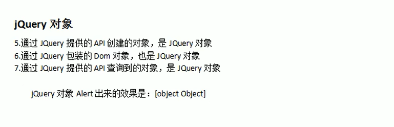

>  问题：jQuery对象的本质是什么？
>
> ​    jQuery对象是 don 对象的数组  +  jQuery提供的一系列功能函数

> jQuery 对象和 Dom 对象使用区别
>
> ​		jQuery对象不能使用DOM对象的属性和方法
>
> ​		DOM对象也不能使用jQuery对象的属性和方法


### Dom 对象和 jQuery 对象互转


### jQuery 选择器

#### 基础选择器


```html
<!DOCTYPE html>
<html>
	<head>
		<meta charset="UTF-8">
		<title>基本选择器</title>
		<style type="text/css">
			div, span, p {
			    width: 140px;
			    height: 140px;
			    margin: 5px;
			    background: #aaa;
			    border: #000 1px solid;
			    float: left;
			    font-size: 17px;
			    font-family: Verdana;
			}
			
			div.mini {
			    width: 55px;
			    height: 55px;
			    background-color: #aaa;
			    font-size: 12px;
			}
			
			div.hide {
			    display: none;
			}
		</style>
		<script type="text/javascript" src="../script/jquery-1.7.2.js"></script>
		<script type="text/javascript">
			$(function(){
				//1.选择 id 为 one 的元素
				$("#btn1").click(function () {
					// css() 方法 可以设置和获取样式
					$("#one").css("background-color", "#bbffaa")
				});

				//2.选择 class 为 mini 的所有元素
				$("#btn2").click(function(){
					$(".mini").css("background-color","#bbffaa");
				});

				//3.选择 元素名是 div 的所有元素
				$("#btn3").click(function(){
					$("div").css("background-color","#bbffaa");
				});

				//4.选择所有的元素
				$("#btn4").click(function(){
					$("*").css("background-color","#bbffaa");
				});

				//5.选择所有的 span 元素和id为two的元素
				$("#btn5").click(function(){
					$("span, #two").css("background-color","#bbffaa");
				});
			});
		</script>
	</head>
	<body>		
		<input type="button" value="选择 id 为 one 的元素" id="btn1" />
		<input type="button" value="选择 class 为 mini 的所有元素" id="btn2" />
		<input type="button" value="选择 元素名是 div 的所有元素" id="btn3" />
		<input type="button" value="选择 所有的元素" id="btn4" />
		<input type="button" value="选择 所有的 span 元素和id为two的元素" id="btn5" />
		
		<br>
		<br>
		<div class="one" id="one">
			id 为 one,class 为 one 的div
			<div class="mini">class为mini</div>
		</div>
		<div class="one" id="two" title="test">
			id为two,class为one,title为test的div
			<div class="mini" title="other">class为mini,title为other</div>
			<div class="mini" title="test">class为mini,title为test</div>
		</div>
		<div class="one">
			<div class="mini">class为mini</div>
			<div class="mini">class为mini</div>
			<div class="mini">class为mini</div>
			<div class="mini"></div>
		</div>
		<div class="one">
			<div class="mini">class为mini</div>
			<div class="mini">class为mini</div>
			<div class="mini">class为mini</div>
			<div class="mini" title="tesst">class为mini,title为tesst</div>
		</div>
		<div style="display:none;" class="none">style的display为"none"的div</div>
		<div class="hide">class为"hide"的div</div>
		<div>
			包含input的type为"hidden"的div<input type="hidden" size="8">
		</div>
		<span class="one" id="span">^^span元素^^</span>
	</body>
</html>
```


#### 层级选择器


```html
<!DOCTYPE html>
<html>
	<head>
		<meta charset="UTF-8">
		<title>层次选择器</title>
		<style type="text/css">
			div, span, p {
			    width: 140px;
			    height: 140px;
			    margin: 5px;
			    background: #aaa;
			    border: #000 1px solid;
			    float: left;
			    font-size: 17px;
			    font-family: Verdana;
			}
			
			div.mini {
			    width: 55px;
			    height: 55px;
			    background-color: #aaa;
			    font-size: 12px;
			}
			
			div.hide {
			    display: none;
			}			
		</style>
		<script type="text/javascript" src="../script/jquery-1.7.2.js"></script>
		<script type="text/javascript">
			$(function(){

				//1.选择 body 内的所有 div 元素
				$("#btn1").click(function(){
					$("body div").css("background", "#bbffaa");
				});

				//2.在 body 内, 选择div子元素
				$("#btn2").click(function(){
					$("body > div").css("background", "#bbffaa");
				});

				//3.选择 id 为 one 的下一个 div 元素
				$("#btn3").click(function(){
					$("#one + div").css("background", "#bbffaa");
				});

				//4.选择 id 为 two 的元素后面的所有 div 兄弟元素
				$("#btn4").click(function(){
					$("#two ~ div").css("background", "#bbffaa");
				});
			});
		</script>
	</head>
	<body>		
		<input type="button" value="选择 body 内的所有 div 元素" id="btn1" />
		<input type="button" value="在 body 内, 选择div子元素" id="btn2" />
		<input type="button" value="选择 id 为 one 的下一个 div 元素" id="btn3" />
		<input type="button" value="选择 id 为 two 的元素后面的所有 div 兄弟元素" id="btn4" />
		
		<br><br>
		<div class="one" id="one">
			id 为 one,class 为 one 的div
			<div class="mini">class为mini</div>
		</div>
		<div class="one" id="two" title="test">
			id为two,class为one,title为test的div
			<div class="mini" title="other">class为mini,title为other</div>
			<div class="mini" title="test">class为mini,title为test</div>
		</div>
		<div class="one">
			<div class="mini">class为mini</div>
			<div class="mini">class为mini</div>
			<div class="mini">class为mini</div>
			<div class="mini"></div>
		</div>
		<div class="one">
			<div class="mini">class为mini</div>
			<div class="mini">class为mini</div>
			<div class="mini">class为mini</div>
			<div class="mini" title="tesst">class为mini,title为tesst</div>
		</div>
		<div style="display:none;" class="none">style的display为"none"的div</div>
		<div class="hide">class为"hide"的div</div>
		<div>
			包含input的type为"hidden"的div<input type="hidden" size="8">
		</div>
		<span id="span">^^span元素^^</span>
	</body>
</html>
```


#### 基本过滤选择器


```html
<!DOCTYPE html>
<html>
	<head>
		<meta charset="UTF-8">
		<title>选择器其他练习</title>
		<style type="text/css">
			div, span, p {
			    width: 140px;
			    height: 140px;
			    margin: 5px;
			    background: #aaa;
			    border: #000 1px solid;
			    float: left;
			    font-size: 17px;
			    font-family: Verdana;
			}
			
			div.mini {
			    width: 55px;
			    height: 55px;
			    background-color: #aaa;
			    font-size: 12px;
			}
			
			div.hide {
			    display: none;
			}			
		</style>
		<script type="text/javascript" src="../script/jquery-1.7.2.js"></script>
		<script type="text/javascript">
			$(function(){
				function anmateIt(){
					$("#mover").slideToggle("slow", anmateIt);
				}
				anmateIt();
			});
			
			$(function(){
				//1.选择第一个 div 元素
				$("#btn1").click(function(){
					$("div:first").css("background", "#bbffaa");
				});

				//2.选择最后一个div元素
				$("#btn2").click(function(){
					$("div:last").css("background", "#bbffaa");
				});

				//3.选择class不为one的所有div元素
				$("#btn3").click(function(){
					$("div:not(.one)").css("background", "#bbffaa");
				});

				//4.选择索引值为偶数的div元素
				$("#btn4").click(function(){
					$("div:even").css("background", "#bbffaa");
				});

				//5.选择索引值为奇数的div元素
				$("#btn5").click(function(){
					$("div:odd").css("background", "#bbffaa");
				});

				//6.选择索引值为大于3的div元素
				$("#btn6").click(function(){
					$("div:gt(3)").show("normal").css("background", "#bbffaa");
				});

				//7.选择索引值为等于3的div元素
				$("#btn7").click(function() {
					$("div:eq(3)").css("background", "#bbffaa");
				});

				//8.选择索引值为小于3的div元素
				$("#btn8").click(function(){
					$("div:lt(3)").css("background","#bbffaa");
				});

				//9.选择所有的标题元素
				$("#btn9").click(function(){
					$(":header").css("background","#bbffaa");
				});

				//10.选择当前正在执行动画的所有元素
				$("#btn10").click(function(){
					$(":animated").css("background","#bbffaa");
				});

				//11.选择没有执行动画的最后一个div
				$("#btn11").click(function(){
					$("div:not(:animated):last").css("background","#bbffaa");
				});
			});
		</script>
	</head>
	<body>		
		<input type="button" value="选择第一个 div 元素" id="btn1" />
		<input type="button" value="选择最后一个div元素" id="btn2" />
		<input type="button" value="选择class不为one的所有div元素" id="btn3" />
		<input type="button" value="选择索引值为偶数的div元素" id="btn4" />
		<input type="button" value="选择索引值为奇数的div元素" id="btn5" />
		<input type="button" value="选择索引值为大于3的div元素" id="btn6" />
		<input type="button" value="选择索引值为等于3的div元素" id="btn7" />
		<input type="button" value="选择索引值为小于3的div元素" id="btn8"/>
		<input type="button" value="选择所有的标题元素" id="btn9"/>
		<input type="button" value="选择当前正在执行动画的所有元素" id="btn10"/>
		<input type="button" value="选择没有执行动画的最后一个div" id="btn11"/>

		<h3>选择器练习.</h3>
		<br><br>
		<div class="one" id="one">
			id 为 one,class 为 one 的div
			<div class="mini">class为mini</div>
		</div>
		<div class="one" id="two" title="test">
			id为two,class为one,title为test的div
			<div class="mini" title="other">class为mini,title为other</div>
			<div class="mini" title="test">class为mini,title为test</div>
		</div>
		<div class="one">
			<div class="mini">class为mini</div>
			<div class="mini">class为mini</div>
			<div class="mini">class为mini</div>
			<div class="mini"></div>
		</div>
		<div class="one">
			<div class="mini">class为mini</div>
			<div class="mini">class为mini</div>
			<div class="mini">class为mini</div>
			<div class="mini" title="tesst">class为mini,title为tesst</div>
		</div>
		<div style="display:none;" class="none">style的display为"none"的div</div>
		<div class="hide">class为"hide"的div</div>
		<div>
			包含input的type为"hidden"的div<input type="hidden" size="8">
		</div>
		<div id="mover">正在执行动画的div元素.</div>
	</body>
</html>
```


#### 内容过滤选择器


```html
<!DOCTYPE html>
<html>
	<head>
		<meta charset="UTF-8">
		<title>选择器其他练习</title>
		<style type="text/css">
			div, span, p {
			    width: 140px;
			    height: 140px;
			    margin: 5px;
			    background: #aaa;
			    border: #000 1px solid;
			    float: left;
			    font-size: 17px;
			    font-family: Verdana;
			}
			
			div.mini {
			    width: 55px;
			    height: 55px;
			    background-color: #aaa;
			    font-size: 12px;
			}
			
			div.hide {
			    display: none;
			}			
		</style>
		<script type="text/javascript" src="../script/jquery-1.7.2.js"></script>
		<script type="text/javascript">
			$(function(){
				function anmateIt(){
					$("#mover").slideToggle("slow", anmateIt);
				}
				anmateIt();
			});
			
			$(function(){
				//1. 选择 含有文本 'di' 的 div 元素
				$("#btn1").click(function(){
					$("div:contains('di')").css("background", "#bbffaa");
				});

				//2.选择不包含子元素(或者文本元素)的 div 空元素
				$("#btn2").click(function(){
					$("div:empty").css("background", "#bbffaa");
				});

				//3.选择含有 class 为 mini 元素的 div 元素
				$("#btn3").click(function(){
					$("div:has(.mini)").css("background", "#bbffaa");
				});

				//4.选择含有子元素(或者文本元素)的div元素
				$("#btn4").click(function(){
					$("div:parent").css("background", "#bbffaa");
				});
			});
		</script>
	</head>
	<body>		
		<input type="button" value="选择 含有文本 'di' 的 div 元素 " id="btn1" />
		<input type="button" value="选择不包含子元素(或者文本元素)的 div 空元素" id="btn2" />
		<input type="button" value="选择含有 class 为 mini 元素的 div 元素" id="btn3" />
		<input type="button" value="选择含有子元素(或者文本元素)的div元素 " id="btn4" />


		<h3>选择器练习.</h3>
		<br><br>
		<div class="one" id="one">
			id 为 one,class 为 one 的div
			<div class="mini">class为mini</div>
		</div>
		<div class="one" id="two" title="test">
			id为two,class为one,title为test的div
			<div class="mini" title="other">class为mini,title为other</div>
			<div class="mini" title="test">class为mini,title为test</div>
		</div>
		<div class="one">
			<div class="mini">class为mini</div>
			<div class="mini">class为mini</div>
			<div class="mini">class为mini</div>
			<div class="mini"></div>
		</div>
		<div class="one">
			<div class="mini">class为mini</div>
			<div class="mini">class为mini</div>
			<div class="mini">class为mini</div>
			<div class="mini" title="tesst">class为mini,title为tesst</div>
		</div>
		<div style="display:none;" class="none">style的display为"none"的div</div>
		<div class="hide">class为"hide"的div</div>
		<div>
			包含input的type为"hidden"的div<input type="hidden" size="8">
		</div>
		<div id="mover">正在执行动画的div元素.</div>
	</body>
</html>

```


#### 属性过滤选择器


```html
<!DOCTYPE HTML PUBLIC "-//W3C//DTD HTML 4.01//EN" "http://www.w3.org/TR/html4/strict.dtd">
<html>
<head>
<meta http-equiv="Content-Type" content="text/html; charset=UTF-8">
<title>Untitled Document</title>
<style type="text/css">
div,span,p {
	width: 140px;
	height: 140px;
	margin: 5px;
	background: #aaa;
	border: #000 1px solid;
	float: left;
	font-size: 17px;
	font-family: Verdana;
}

div.mini {
	width: 55px;
	height: 55px;
	background-color: #aaa;
	font-size: 12px;
}

div.hide {
	display: none;
}
</style>
<script type="text/javascript" src="../script/jquery-1.7.2.js"></script>
<script type="text/javascript">
	/**
[attribute] 			
[attribute=value] 		
[attribute!=value] 		 
[attribute^=value] 		
[attribute$=value] 		
[attribute*=value] 		
[attrSel1][attrSel2][attrSelN]  
	
	
	*/
	$(function() {
		//1.选取含有 属性title 的div元素
		$("#btn1").click(function() {
			$("div[title]").css("background", "#bbffaa");
		});
		//2.选取 属性title值等于'test'的div元素
		$("#btn2").click(function() {
			$("div[title='test']").css("background", "#bbffaa");
		});
		//3.选取 属性title值不等于'test'的div元素(*没有属性title的也将被选中)
		$("#btn3").click(function() {
			$("div[title!='test']").css("background", "#bbffaa");
		});
		//4.选取 属性title值 以'te'开始 的div元素
		$("#btn4").click(function() {
			$("div[title^='te']").css("background", "#bbffaa");
		});
		//5.选取 属性title值 以'est'结束 的div元素
		$("#btn5").click(function() {
			$("div[title$='est']").css("background", "#bbffaa");
		});
		//6.选取 属性title值 含有'es'的div元素
		$("#btn6").click(function() {
			$("div[title*='es']").css("background", "#bbffaa");
		});
		
		//7.首先选取有属性id的div元素，然后在结果中 选取属性title值 含有'es'的 div 元素
		$("#btn7").click(function() {
			$("div[id][title*='es']").css("background", "#bbffaa");
		});
		//8.选取 含有 title 属性值, 且title 属性值不等于 test 的 div 元素
		$("#btn8").click(function() {
			$("div[title][title!='test']").css("background", "#bbffaa");
		});
	});
</script>
</head>
<body>
	<input type="button" value="选取含有 属性title 的div元素." id="btn1" style="display: none;"/>
	<input type="button" value="选取 属性title值等于'test'的div元素." id="btn2" />
	<input type="button"
		value="选取 属性title值不等于'test'的div元素(没有属性title的也将被选中)." id="btn3" />
	<input type="button" value="选取 属性title值 以'te'开始 的div元素." id="btn4" />
	<input type="button" value="选取 属性title值 以'est'结束 的div元素." id="btn5" />
	<input type="button" value="选取 属性title值 含有'es'的div元素." id="btn6" />
	<input type="button"
		value="组合属性选择器,首先选取有属性id的div元素，然后在结果中 选取属性title值 含有'es'的 div 元素."
		id="btn7" />
	<input type="button"
		value="选取 含有 title 属性值, 且title 属性值不等于 test 的 div 元素." id="btn8" />

	<br>
	<br>
	<div class="one" id="one">
		id 为 one,class 为 one 的div
		<div class="mini">class为mini</div>
	</div>
	<div class="one" id="two" title="test">
		id为two,class为one,title为test的div
		<div class="mini" title="other">class为mini,title为other</div>
		<div class="mini" title="test">class为mini,title为test</div>
	</div>
	<div class="one">
		<div class="mini">class为mini</div>
		<div class="mini">class为mini</div>
		<div class="mini">class为mini</div>
		<div class="mini"></div>
	</div>
	<div class="one">
		<div class="mini">class为mini</div>
		<div class="mini">class为mini</div>
		<div class="mini">class为mini</div>
		<div class="mini" title="tesst">class为mini,title为tesst</div>
	</div>
	<div style="display: none;" class="none">style的display为"none"的div</div>
	<div class="hide">class为"hide"的div</div>
	<div>
		包含input的type为"hidden"的div<input type="hidden" value="123456789"
			size="8">
	</div>
	<div id="mover">正在执行动画的div元素.</div>
</body>
</html>
```


#### 表单过滤选择器


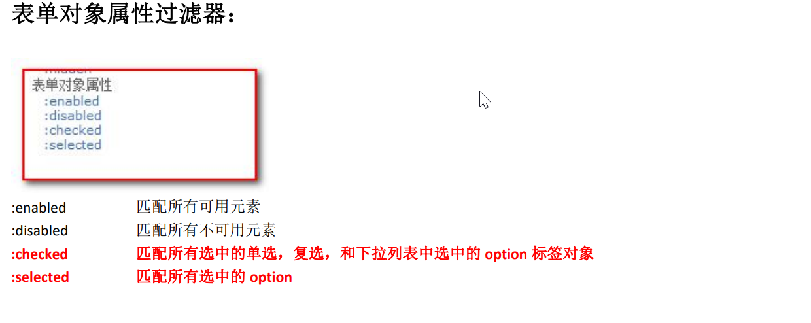

```html
<!DOCTYPE HTML PUBLIC "-//W3C//DTD HTML 4.01//EN" "http://www.w3.org/TR/html4/strict.dtd">
<html>
	<head>
		<meta http-equiv="Content-Type" content="text/html; charset=UTF-8">
		<title>Untitled Document</title>
		<script type="text/javascript" src="../script/jquery-1.7.2.js"></script>
		<script type="text/javascript">
			$(function(){
				
				
		/**
		:input 		
		:text 		
		:password 	
		:radio 		
		:checkbox 	
		:submit 	
		:image 		
		:reset 		
		:button 	
		:file 		
		:hidden 	
		
		表单对象的属性
		:enabled 		
		:disabled 		
		:checked 		
		:selected 		
		*/

					
				//1.对表单内 可用input 赋值操作
				$("#btn1").click(function(){
					// val()可以操作表单项的value属性值
					// 它可以设置和获取
					$(":text:enabled").val("我是万能的程序员");
				});

				//2.对表单内 不可用input 赋值操作
				$("#btn2").click(function(){
					$(":text:disabled").val("管你可用不可用，反正我是万能的程序员");
				});
				//3.获取多选框选中的个数  使用size()方法获取选取到的元素集合的元素个数
				$("#btn3").click(function(){
					alert( $(":checkbox:checked").length );
				});
				//4.获取多选框，每个选中的value值
				$("#btn4").click(function(){
					// 获取全部选中的复选框标签对象
					var $checkboies = $(":checkbox:checked");
					// 老式遍历
					// for (var i = 0; i < $checkboies.length; i++){
					// 	alert( $checkboies[i].value );
					// }

					// each方法是jQuery对象提供用来遍历元素的方法
					// 在遍历的function函数中，有一个this对象，这个this对象，就是当前遍历到的dom对象
					$checkboies.each(function () {
						alert( this.value );
					});

				});
				//5.获取下拉框选中的内容  
				$("#btn5").click(function(){
					// 获取选中的option标签对象
					var $options = $("select option:selected");
					// 遍历，获取option标签中的文本内容
					$options.each(function () {
						// 在each遍历的function函数中，有一个this对象。这个this对象是当前正在遍历到的dom对象
						alert(this.innerHTML);
					});
				});
			})	
		</script>
	</head>
	<body>
		<h3>表单对象属性过滤选择器</h3>
		 <button id="btn1">对表单内 可用input 赋值操作.</button>
  		 <button id="btn2">对表单内 不可用input 赋值操作.</button><br /><br />
		 <button id="btn3">获取多选框选中的个数.</button>
		 <button id="btn4">获取多选框选中的内容.</button><br /><br />
         <button id="btn5">获取下拉框选中的内容.</button><br /><br />
		 
		<form id="form1" action="#">			
			可用元素: <input name="add" value="可用文本框1"/><br>
			不可用元素: <input name="email" disabled="disabled" value="不可用文本框"/><br>
			可用元素: <input name="che" value="可用文本框2"/><br>
			不可用元素: <input name="name" disabled="disabled" value="不可用文本框"/><br>
			<br>
			
			多选框: <br>
			<input type="checkbox" name="newsletter" checked="checked" value="test1" />test1
			<input type="checkbox" name="newsletter" value="test2" />test2
			<input type="checkbox" name="newsletter" value="test3" />test3
			<input type="checkbox" name="newsletter" checked="checked" value="test4" />test4
			<input type="checkbox" name="newsletter" value="test5" />test5
			
			<br><br>
			下拉列表1: <br>
			<select name="test" multiple="multiple" style="height: 100px" id="sele1">
				<option>浙江</option>
				<option selected="selected">辽宁</option>
				<option>北京</option>
				<option selected="selected">天津</option>
				<option>广州</option>
				<option>湖北</option>
			</select>
			
			<br><br>
			下拉列表2: <br>
			<select name="test2">
				<option>浙江</option>
				<option>辽宁</option>
				<option selected="selected">北京</option>
				<option>天津</option>
				<option>广州</option>
				<option>湖北</option>
			</select>
		</form>		
	</body>
</html>
```


### jQuery元素的筛选


```html
<!DOCTYPE HTML PUBLIC "-//W3C//DTD HTML 4.01//EN" "http://www.w3.org/TR/html4/strict.dtd">
<html>
	<head>
		<meta http-equiv="Content-Type" content="text/html; charset=UTF-8">
		<title>DOM查询</title>
		<style type="text/css">
			div, span, p {
			    width: 140px;
			    height: 140px;
			    margin: 5px;
			    background: #aaa;
			    border: #000 1px solid;
			    float: left;
			    font-size: 17px;
			    font-family: Verdana;
			}
			
			div.mini {
			    width: 55px;
			    height: 55px;
			    background-color: #aaa;
			    font-size: 12px;
			}
			
			div.hide {
			    display: none;
			}			
		</style>
		<script type="text/javascript" src="../script/jquery-1.7.2.js"></script>
		<script type="text/javascript">
			$(document).ready(function(){
				function anmateIt(){
					$("#mover").slideToggle("slow", anmateIt);
				}
				anmateIt();
				
	/**
					
	过滤
	eq(index|-index) 			
	first() 					
	last() 						
	hasClass(class) 			
	filter(expr|obj|ele|fn) 	
	is(expr|obj|ele|fn)1.6* 	
	has(expr|ele) 				
	not(expr|ele|fn) 			
	slice(start,[end]) 			
	
	查找
	children([expr]) 			
	closest(expr,[con]|obj|ele)1.6*   
	find(expr|obj|ele) 				
	next([expr]) 					
	nextall([expr]) 				
	nextUntil([exp|ele][,fil])1.6* 	
	parent([expr]) 					
	parents([expr]) 				
	parentsUntil([exp|ele][,fil])1.6*  
	prev([expr]) 					
	prevall([expr]) 				
	prevUntil([exp|ele][,fil])1.6* 	
	siblings([expr]) 				
	
	串联
	add(expr|ele|html|obj[,con]) 	
							
	
	*/
				
				//(1)eq()  选择索引值为等于 3 的 div 元素
				$("#btn1").click(function(){
					$("div").eq(3).css("background-color","#bfa");
				});
				//(2)first()选择第一个 div 元素
				 $("#btn2").click(function(){
					 //first()   选取第一个元素
					$("div").first().css("background-color","#bfa");
				});
				//(3)last()选择最后一个 div 元素
				$("#btn3").click(function(){
					//last()  选取最后一个元素
					$("div").last().css("background-color","#bfa");
				});
				//(4)filter()在div中选择索引为偶数的
				$("#btn4").click(function(){
					//filter()  过滤   传入的是选择器字符串
					$("div").filter(":even").css("background-color","#bfa");
				});
				 //(5)is()判断#one是否为:empty或:parent
				//is用来检测jq对象是否符合指定的选择器
				$("#btn5").click(function(){
					alert( $("#one").is(":empty") );
				});
				
				//(6)has()选择div中包含.mini的
				$("#btn6").click(function(){
					//has(selector)  选择器字符串    是否包含selector
					$("div").has(".mini").css("background-color","#bfa");
				});
				//(7)not()选择div中class不为one的
				$("#btn7").click(function(){
					//not(selector)  选择不是selector的元素
					$("div").not(".one").css("background-color","#bfa");
				});
				//(8)children()在body中选择所有class为one的div子元素
				$("#btn8").click(function(){
					//children()  选出所有的子元素
					$("body").children("div.one").css("background-color","#bfa");
				});
				
				
				//(9)find()在body中选择所有class为mini的div元素
				$("#btn9").click(function(){
					//find()  选出所有的后代元素
					$("body").find("div.mini").css("background-color","#bfa");
				});

				//(10)next() #one的下一个div
				$("#btn10").click(function(){
					//next()  选择下一个兄弟元素
					$("#one").next("div").css("background-color","#bfa");
				});
				//(11)nextAll() #one后面所有的span元素
				$("#btn11").click(function(){
					//nextAll()   选出后面所有的元素
					$("#one").nextAll("span").css("background-color","#bfa");
				});
				//(12)nextUntil() #one和span之间的元素
				$("#btn12").click(function(){
					//
					$("#one").nextUntil("span").css("background-color","#bfa")
				});
				//(13)parent() .mini的父元素
				$("#btn13").click(function(){
					$(".mini").parent().css("background-color","#bfa");
				});
				//(14)prev() #two的上一个div
				$("#btn14").click(function(){
					//prev()  
					$("#two").prev().css("background-color","#bfa")
				});

				//(15)prevAll() span前面所有的div
				$("#btn15").click(function(){
					//prevAll()   选出前面所有的元素
					$("span").prevAll("div").css("background-color","#bfa")
				});

				//(16)prevUntil() span向前直到#one的元素
				$("#btn16").click(function(){
					//prevUntil(exp)   找到之前所有的兄弟元素直到找到exp停止
					$("span").prevUntil("#one").css("background-color","#bfa")
				});
				//(17)siblings() #two的所有兄弟元素
				$("#btn17").click(function(){
					//siblings()    找到所有的兄弟元素，包括前面的和后面的
					$("#two").siblings().css("background-color","#bfa")
				});
				
				
				//(18)add()选择所有的 span 元素和id为two的元素
				$("#btn18").click(function(){

					$("span").add("#two").css("background-color","#bfa");
					
				});
				


			});
			
			
		</script>
	</head>
	<body>		
		<input type="button" value="eq()选择索引值为等于 3 的 div 元素" id="btn1" />
		<input type="button" value="first()选择第一个 div 元素" id="btn2" />
		<input type="button" value="last()选择最后一个 div 元素" id="btn3" />
		<input type="button" value="filter()在div中选择索引为偶数的" id="btn4" />
		<input type="button" value="is()判断#one是否为:empty或:parent" id="btn5" />
		<input type="button" value="has()选择div中包含.mini的" id="btn6" />
		<input type="button" value="not()选择div中class不为one的" id="btn7" />
		<input type="button" value="children()在body中选择所有class为one的div子元素" id="btn8" />
		<input type="button" value="find()在body中选择所有class为mini的div后代元素" id="btn9" />
		<input type="button" value="next()#one的下一个div" id="btn10" />
		<input type="button" value="nextAll()#one后面所有的span元素" id="btn11" />
		<input type="button" value="nextUntil()#one和span之间的元素" id="btn12" />
		<input type="button" value="parent().mini的父元素" id="btn13" />
		<input type="button" value="prev()#two的上一个div" id="btn14" />
		<input type="button" value="prevAll()span前面所有的div" id="btn15" />
		<input type="button" value="prevUntil()span向前直到#one的元素" id="btn16" />
		<input type="button" value="siblings()#two的所有兄弟元素" id="btn17" />
		<input type="button" value="add()选择所有的 span 元素和id为two的元素" id="btn18" />

		
		<h3>基本选择器.</h3>
		<br /><br />
		文本框<input type="text" name="account" disabled="disabled" />
		<br><br>
		<div class="one" id="one">
			id 为 one,class 为 one 的div
			<div class="mini">class为mini</div>
		</div>
		<div class="one" id="two" title="test">
			id为two,class为one,title为test的div
			<div class="mini" title="other"><b>class为mini,title为other</b></div>
			<div class="mini" title="test">class为mini,title为test</div>
		</div>
		
		<div class="one">
			<div class="mini">class为mini</div>
			<div class="mini">class为mini</div>
			<div class="mini">class为mini</div>
			<div class="mini"></div>
		</div>
		<div class="one">
			<div class="mini">class为mini</div>
			<div class="mini">class为mini</div>
			<div class="mini">class为mini</div>
			<div class="mini" title="tesst">class为mini,title为tesst</div>
		</div>
		<div style="display:none;" class="none">style的display为"none"的div</div>
		<div class="hide">class为"hide"的div</div>
		<span id="span1">^^span元素 111^^</span>
		<div>
			包含input的type为"hidden"的div<input type="hidden" size="8">
		</div>
		<span id="span2">^^span元素 222^^</span>
		<div id="mover">正在执行动画的div元素.</div>
	</body>
</html>
```


### jQuery的属性操作


```html
<!DOCTYPE html>
<html lang="en">
<head>
    <meta charset="UTF-8">
    <title>Title</title>
    <script type="text/javascript" src="Demo/script/jquery-1.7.2.js"></script>
    <script type="text/javascript">

        $(function () {
            // 不传参数就是获取，传递参数就是设置
            // alert( $("div").html() ); //获取
            // $("div").html("<h1>我是div中的标题</h1>"); //设置

            // 不传参数就是获取，传递参数就是设置
            // alert( $("div").text() ); //获取
            // $("div").text("<h1>我是div中的标题</h1>"); //设置

            // 不传参数就是获取，传递参数就是设置
            $("button").click(function () {
                //alert($("#username").val()); //获取
                $("#username").val("超级程序猿"); //设置
            });
        })
    </script>
</head>
<body>

    <div>我是div标签<span>我是div中的span</span></div>
    <input type="text" name="username" id="username">
    <button>操作输入框</button>

</body>
</html>
```


- val 方法同时设置多个表单项的选中状态：

  ```html
  <!DOCTYPE html>
  <html lang="zh_CN">
  <head>
      <meta charset="UTF-8">
      <title>Title</title>
      <script type="text/javascript" src="Demo/script/jquery-1.7.2.js"></script>
      <script type="text/javascript">
          $(function () {
              /*
              // 批量操作单选
              $(":radio").val(["radio2"]);
  
              // 批量操作多选框的选中状态
              $(":checkbox").val(["checkbox3","checkbox2"]);
  
              // 批量操作多选的下拉框选中状态
              $("#multiple").val(["mul2","mul3","mul4"]);
  
              // 操作单选的下拉框选中状态
              $("#single").val(["sin2"]);
              */
  
              $(":radio, :checkbox, #multiple, #single").val(["radio2", "checkbox1", "checkbox3", "mul1", "mul4", "sin3"]);
          });
      </script>
  </head>
  <body>
      单选：
      <input name="radio" type="radio" value="radio1"/>radio1
      <input name="radio" type="radio" value="radio2"/>radio2
      <br/>
      多选：
      <input name="checkbox" type="checkbox" value="checkbox1"/>checkbox1
      <input name="checkbox" type="checkbox" value="checkbox2"/>checkbox2
      <input name="checkbox" type="checkbox" value="checkbox3"/>checkbox3
      <br/>
      下拉多选 ：
      <select id="multiple" multiple="multiple" size="4">
          <option value="mul1">mul1</option>
          <option value="mul2">mul2</option>
          <option value="mul3">mul3</option>
          <option value="mul4">mul4</option>
      </select>
      <br/>
      下拉单选 ：
      <select id="single">
          <option value="sin1">sin1</option>
          <option value="sin2">sin2</option>
          <option value="sin3">sin3</option>
      </select>
  </body>
  </html>
  ```

  


```html
<!DOCTYPE html>
<html lang="en">
<head>
    <meta charset="UTF-8">
    <title>Title</title>
    <script type="text/javascript" src="Demo/script/jquery-1.7.2.js"></script>
    <script type="text/javascript">

      $(function () {
          //attr
          // alert( $(":checkbox:first").attr("name") ); //获取
          // $(":checkbox:first").attr("name", "abc"); //设置

          //prop
          // alert( $(":checkbox:last").prop("checked") );// 获取
          $(":checkbox:last").prop("checked", true); //设置
      })

    </script>
</head>
<body>

    多选：
    <input name="checkbox" type="checkbox" checked="checked" value="checkbox1" />checkbox1
    <input name="checkbox" type="checkbox" value="checkbox2"/>checkbox2

</body>
</html>
```


### jQuery 练习

全选、全不选、反选

```html
<!DOCTYPE html PUBLIC "-//W3C//DTD HTML 4.01 Transitional//EN" "http://www.w3.org/TR/html4/loose.dtd">
<html>
<head>
<meta http-equiv="Content-Type" content="text/html; charset=UTF-8">
<title>Insert title here</title>
<script type="text/javascript" src="../jquery-1.7.2.js"></script>
<script type="text/javascript">
	
	$(function(){
		// 给全选绑定单击事件
		$("#checkedAllBtn").click(function () {
			$(":checkbox").prop("checked",true);
		});

		// 给全不选绑定单击事件
		$("#checkedNoBtn").click(function () {
			$(":checkbox").prop("checked",false);
		});

		//反选单击事件
		$("#checkedRevBtn").click(function () {
			//查询全部的球类的复选框
			$(":checkbox[name='items']").each(function () {
				//在each遍历的function函数中，有一个this对象，这个this对象是当前正在遍历到的dom对象
				this.checked = !this.checked;
			});

			//要检查 是否满选
			//获取全部的球类个数
			var allCount = $(":checkbox[name='items']").length;
			//再获取选中的球类个数
			var checkedCount = $(":checkbox[name='items']:checked").length;

			// if(allCount == checkedCount) {
			// 	$("#checkedAllBox").prop("checked",true);
			// } else {
			// 	$("#checkedAllBox").prop("checked",false);
			// }

			$("#checkedAllBox").prop("checked",allCount == checkedCount);
		});

		// 【提交】按钮单击事件
		$("#sendBtn").click(function () {
			//获取选中的球类的复选框
			$(":checkbox[name='items']:checked").each(function () {
				alert(this.value);
			});
		});

		// 给【全选/全不选】绑定单击事件
		$("#checkedAllBox").click(function () {
			// 在事件的function函数中，有一个this对象，这个this对象是当前正在响应事件的dom对象
			// alert(this.checked);

			$(":checkbox[name='items']").prop("checked",this.checked);
		});

		// 给全部球类绑定单击事件
		$(":checkbox[name='items']").click(function () {
			//要检查 是否满选
			//获取全部的球类个数
			var allCount = $(":checkbox[name='items']").length;
			//再获取选中的球类个数
			var checkedCount = $(":checkbox[name='items']:checked").length;

			// if(allCount == checkedCount) {
			// 	$("#checkedAllBox").prop("checked",true);
			// } else {
			// 	$("#checkedAllBox").prop("checked",false);
			// }

			$("#checkedAllBox").prop("checked",allCount == checkedCount);
		})

	});
	
</script>
</head>
<body>

	<form method="post" action="">
	
		你爱好的运动是？<input type="checkbox" id="checkedAllBox" />全选/全不选 
		
		<br />
		<input type="checkbox" name="items" value="足球" />足球
		<input type="checkbox" name="items" value="篮球" />篮球
		<input type="checkbox" name="items" value="羽毛球" />羽毛球
		<input type="checkbox" name="items" value="乒乓球" />乒乓球
		<br />
		<input type="button" id="checkedAllBtn" value="全　选" />
		<input type="button" id="checkedNoBtn" value="全不选" />
		<input type="button" id="checkedRevBtn" value="反　选" />
		<input type="button" id="sendBtn" value="提　交" />
	</form>

</body>
</html>
```


### DOM的增删改


```html
<!DOCTYPE html>
<html lang="en">
<head>
    <meta charset="UTF-8">
    <title>Title</title>
    <script type="text/javascript" src="Demo/script/jquery-1.7.2.js"></script>
    <script type="text/javascript">
        $(function () {

            // $("<h1>标题</h1>").appendTo("div");

            // $("<h1>标题</h1>").prependTo("div");

            // $("<h1>标题</h1>").insertAfter("div");

            // $("<h1>标题</h1>").insertBefore("div");

            // $("div").replaceWith("<h1>标题</h1>");

            // $("<h1>标题</h1>").replaceAll("div");

            // $("div").remove();
            $("div").empty();
        });
    </script>
</head>
<body>

    <div class="scene">1234</div>
    <div>1234</div>


</body>
</html>
```


### jQuery练习

- 从左到右 从右到左


```html
<!DOCTYPE html PUBLIC "-//W3C//DTD HTML 4.01 Transitional//EN" "http://www.w3.org/TR/html4/loose.dtd">
<html>
<head>
<meta http-equiv="Content-Type" content="text/html; charset=UTF-8">
<title>Insert title here</title>
	<style type="text/css">
		select {
			width: 100px;
			height: 140px;
		}
		
		div {
			width: 130px;
			float: left;
			text-align: center;
		}
	</style>
	<script type="text/javascript" src="../jquery-1.7.2.js"></script>
	<script type="text/javascript">
		// 页面加载完成
		$(function () {
			// 第一个按钮【选中添加到右边】
			$("button:eq(0)").click(function () {
				$("select:eq(0) option:selected").appendTo($("select:eq(1)"));
			});

			// 第二个按钮【全部添加到右边】
			$("button:eq(1)").click(function () {
				$("select:eq(0) option").appendTo($("select:eq(1)"));
			});

			// 第一个按钮【选中删除到左边】
			$("button:eq(2)").click(function () {
				$("select:eq(1) option:selected").appendTo($("select:eq(0)"));
			});

			// 第一个按钮【全部删除到左边】
			$("button:eq(3)").click(function () {
				$("select:eq(1) option").appendTo($("select:eq(0)"));
			});
		});
	
	</script>
</head>
<body>

	<div id="left">
		<select multiple="multiple" name="sel01">
			<option value="opt01">选项1</option>
			<option value="opt02">选项2</option>
			<option value="opt03">选项3</option>
			<option value="opt04">选项4</option>
			<option value="opt05">选项5</option>
			<option value="opt06">选项6</option>
			<option value="opt07">选项7</option>
			<option value="opt08">选项8</option>
		</select>
		
		<button>选中添加到右边</button>
		<button>全部添加到右边</button>
	</div>
	<div id="rigth">
		<select multiple="multiple" name="sel02">
		</select>
		<button>选中删除到左边</button>
		<button>全部删除到左边</button>
	</div>

</body>
</html>
```


- 动态添加、删除表格记录

  ```html
  <!DOCTYPE HTML PUBLIC "-//W3C//DTD HTML 4.01//EN" "http://www.w3.org/TR/html4/strict.dtd">
  <html>
  <head>
  <meta http-equiv="Content-Type" content="text/html; charset=UTF-8">
  <title>Untitled Document</title>
  <link rel="stylesheet" type="text/css" href="styleB/css.css" />
  <script type="text/javascript" src="../jquery-1.7.2.js"></script>
  <script type="text/javascript">
  
  	$(function () {
  		// 给【submit】按钮绑定单击事件
  		$("#addEmpButton").click(function () {
  			// 获取输入框，姓名，邮箱，工资的内容
  			var name = $("#empName").val();
  			var email = $("#email").val();
  			var salary = $("#salary").val();
  
  			// 创建一个行标签对象，添加到显示数据的表格中、
  			var $trObj = $("<tr>" +
  					"<td>" + name + "</td>" +
  					"<td>" + email + "</td>" +
  					"<td>" + salary + "</td>" +
  					"<td><a href=\"deleteEmp?id=002\">Delete</a></td>" +
  					"</tr>");
  
  			//添加到显示数据的表格中
  			$trObj.appendTo( $("#employeeTable") );
  
  			// 给添加的行的a标签绑定事件
  			$trObj.find("a").click(function () {
  				// 在事件响应的function函数中，有一个this对象，这个this对象是当前正在响应事件的don对象
  				var $trObj = $(this).parent().parent();
  
  				var name = $trObj.find("td:first").text();
  
  				/*
                      confirm 是JavaScript 语言提供的一个确认提示框函数。你给它传什么，它就提示什么<br/>
                      当用户点击了确定，就返回true。当用户点击了取消，就返回false
                  */
  				if(confirm("你确定要删除["+ name +"]吗？")) {
  					$trObj.remove();
  				}
  
  				// return false; 可以阻止 元素的默认行为
  				return false;
  			});
  		});
  
  		// 给删除的a标签绑定单击事件
  		$("a").click(function () {
  
  			// 在事件响应的function函数中，有一个this对象，这个this对象是当前正在响应事件的don对象
  			var $trObj = $(this).parent().parent();
  
  			var name = $trObj.find("td:first").text();
  
  			/*
  				confirm 是JavaScript 语言提供的一个确认提示框函数。你给它传什么，它就提示什么<br/>
  				当用户点击了确定，就返回true。当用户点击了取消，就返回false
  			*/
  			if(confirm("你确定要删除["+ name +"]吗？")) {
  				$trObj.remove();
  			}
  
  			// return false; 可以阻止 元素的默认行为
  			return false;
  		});
  
  	});
  </script>
  </head>
  <body>
  
  	<table id="employeeTable">
  		<tr>
  			<th>Name</th>
  			<th>Email</th>
  			<th>Salary</th>
  			<th>&nbsp;</th>
  		</tr>
  		<tr>
  			<td>Tom</td>
  			<td>tom@tom.com</td>
  			<td>5000</td>
  			<td><a href="deleteEmp?id=001">Delete</a></td>
  		</tr>
  		<tr>
  			<td>Jerry</td>
  			<td>jerry@sohu.com</td>
  			<td>8000</td>
  			<td><a href="deleteEmp?id=002">Delete</a></td>
  		</tr>
  		<tr>
  			<td>Bob</td>
  			<td>bob@tom.com</td>
  			<td>10000</td>
  			<td><a href="deleteEmp?id=003">Delete</a></td>
  		</tr>
  	</table>
  
  	<div id="formDiv">
  	
  		<h4>添加新员工</h4>
  
  		<table>
  			<tr>
  				<td class="word">name: </td>
  				<td class="inp">
  					<input type="text" name="empName" id="empName" />
  				</td>
  			</tr>
  			<tr>
  				<td class="word">email: </td>
  				<td class="inp">
  					<input type="text" name="email" id="email" />
  				</td>
  			</tr>
  			<tr>
  				<td class="word">salary: </td>
  				<td class="inp">
  					<input type="text" name="salary" id="salary" />
  				</td>
  			</tr>
  			<tr>
  				<td colspan="2" align="center">
  					<button id="addEmpButton" value="abc">
  						Submit
  					</button>
  				</td>
  			</tr>
  		</table>
  
  	</div>
  
  </body>
  </html>
  ```

  

### CSS样式操作


```html
<!DOCTYPE html PUBLIC "-//W3C//DTD HTML 4.01 Transitional//EN" "http://www.w3.org/TR/html4/loose.dtd">
<html>
<head>
<meta http-equiv="Content-Type" content="text/html; charset=UTF-8">
<title>Insert title here</title>
<style type="text/css">
	
	div{
		width:100px;
		height:260px;
	}
	
	div.whiteborder{
		border: 2px white solid;
	}
	
	div.redDiv{
		background-color: red;
	}
	
	div.blueBorder{
		border: 5px blue solid;
	}
	
</style>

<script type="text/javascript" src="../jquery-1.7.2.js"></script>
<script type="text/javascript">
	

	$(function(){
		
		var $divEle = $('div:first');
		
		$('#btn01').click(function(){
			//addClass() - 向被选元素添加一个或多个类
			$divEle.addClass('redDiv blueBorder');
		});
		
		$('#btn02').click(function(){
			//removeClass() - 从被选元素删除一个或多个类 
			$divEle.removeClass('redDiv blueBorder');
		});
	
		
		$('#btn03').click(function(){
			//toggleClass() - 对被选元素进行添加/删除类的切换操作 
			$divEle.toggleClass('redDiv');
		});
		
		
		$('#btn04').click(function(){
			//offset() - 返回第一个匹配元素相对于文档的位置。
			var pos = $divEle.offset();
			// console.log(pos);

			// 设置元素的坐标
			$divEle.offset({
				top:100,
				left:50
			});
		});
		
	
		
	})
</script>
</head>
<body>

	<table align="center">
		<tr>
			<td>
				<div class="border">
				</div>
			</td>
			
			<td>
				<div class="btn">
					<input type="button" value="addClass()" id="btn01"/>
					<input type="button" value="removeClass()" id="btn02"/>
					<input type="button" value="toggleClass()" id="btn03"/>
					<input type="button" value="offset()" id="btn04"/>
				</div>
			</td>
		</tr>
	</table>
	
	
	
	<br /> <br />
	
	
	<br /> <br />
	
	
	
</body>
</html>
```


### jQuery动画操作


```html
<!DOCTYPE HTML PUBLIC "-//W3C//DTD HTML 4.01//EN" "http://www.w3.org/TR/html4/strict.dtd">
<html>
	<head>
		<meta http-equiv="Content-Type" content="text/html; charset=UTF-8">
		<title>Untitled Document</title>
		<link href="css/style.css" type="text/css" rel="stylesheet" />
		<script type="text/javascript" src="../jquery-1.7.2.js"></script>
	
<script type="text/javascript">
	/* 	
		基本
		show([speed,[easing],[fn]]) 
		hide([speed,[easing],[fn]]) 
		toggle([speed],[easing],[fn]) 
		滑动
		slideDown([spe],[eas],[fn]) 
		slideUp([speed,[easing],[fn]]) 
		slideToggle([speed],[easing],[fn]) 
		淡入淡出
		fadeIn([speed],[eas],[fn]) 
		fadeOut([speed],[eas],[fn]) 
		fadeTo([[spe],opa,[eas],[fn]]) 
		fadeToggle([speed,[eas],[fn]])
		*/
		$(function(){
			//显示   show()
			$("#btn1").click(function(){
				$("#div1").show();
			});		
			//隐藏  hide()
			$("#btn2").click(function(){
				$("#div1").hide(1000);
			});	
			//切换   toggle()
			$("#btn3").click(function(){
				$("#div1").toggle(1000, function () {
					alert("toggle动画 完成");
				});
			});	
			
			//淡入   fadeIn()
			$("#btn4").click(function(){
				$("#div1").fadeIn();
			});	
			//淡出  fadeOut()
			$("#btn5").click(function(){
				$("#div1").fadeOut();
			});	
			
			//淡化到  fadeTo()
			$("#btn6").click(function(){
				$("#div1").fadeTo(1000, 0.5);
			});	
			//淡化切换  fadeToggle()
			$("#btn7").click(function(){
				$("#div1").fadeToggle();
			});	
		})
</script>
	
	</head>
	<body>
		<table style="float: left;">
			<tr>
				<td><button id="btn1">显示show()</button></td>
			</tr>
			<tr>
				<td><button id="btn2">隐藏hide()</button></td>
			</tr>
			<tr>
				<td><button id="btn3">显示/隐藏切换 toggle()</button></td>
			</tr>
			<tr>
				<td><button id="btn4">淡入fadeIn()</button></td>
			</tr>
			<tr>
				<td><button id="btn5">淡出fadeOut()</button></td>
			</tr>
			<tr>
				<td><button id="btn6">淡化到fadeTo()</button></td>
			</tr>
			<tr>
				<td><button id="btn7">淡化切换fadeToggle()</button></td>
			</tr>
		</table>
		
		<div id="div1" style="float:left;border: 1px solid;background-color: blue;width: 300px;height: 200px;">
			jquery动画定义了很多种动画效果，可以很方便的使用这些动画效果
		</div>
	</body>

</html>
```


- CSS动画、品牌展示

  

```html
<!DOCTYPE html PUBLIC "-//W3C//DTD XHTML 1.0 Transitional//EN"
        "http://www.w3.org/TR/xhtml1/DTD/xhtml1-transitional.dtd">
<html xmlns="http://www.w3.org/1999/xhtml">
<head>
    <meta http-equiv="Content-Type" content="text/html; charset=utf-8"/>
    <title>品牌展示练习</title>
    <style type="text/css">
        * {
            margin: 0;
            padding: 0;
        }

        body {
            font-size: 12px;
            text-align: center;
        }

        a {
            color: #04D;
            text-decoration: none;
        }

        a:hover {
            color: #F50;
            text-decoration: underline;
        }

        .SubCategoryBox {
            width: 600px;
            margin: 0 auto;
            text-align: center;
            margin-top: 40px;
        }

        .SubCategoryBox ul {
            list-style: none;
        }

        .SubCategoryBox ul li {
            display: block;
            float: left;
            width: 200px;
            line-height: 20px;
        }

        .showmore, .showless {
            clear: both;
            text-align: center;
            padding-top: 10px;
        }

        .showmore a, .showless a {
            display: block;
            width: 120px;
            margin: 0 auto;
            line-height: 24px;
            border: 1px solid #AAA;
        }

        .showmore a span {
            padding-left: 15px;
            background: url(img/down.gif) no-repeat 0 0;
        }

        .showless a span {
            padding-left: 15px;
            background: url(img/up.gif) no-repeat 0 0;
        }

        .promoted a {
            color: #F50;
        }
    </style>
    <script type="text/javascript" src="../jquery-1.7.2.js"></script>
    <script type="text/javascript">
        $(function () {
            // 基本初始状态
			$("li:gt(5):not(:last)").hide();

			// 给功能的按钮绑定单击事件
			$("div div a").click(function () {
				// 让某些品牌，显示，或隐藏
				$("li:gt(5):not(:last)").toggle();
				// 判断 品牌，当前是否可见
				if( $("li:gt(5):not(:last)").is(":hidden") ){
					// 品牌隐藏的状态：1.显示全部品牌 角标向下
					$("div div a span").text("显示全部品牌");

					$("div div").removeClass();
					$("div div").addClass("showmore");

                    // 去掉高亮
                    $("li:contains('索尼')").removeClass("promoted");
				} else {
					// 品牌可见的状态：2.显示精简品牌 角标向上
					$("div div a span").text("显示精简品牌");
					$("div div").removeClass();
					$("div div").addClass("showless");

                    // 增加高亮
                    $("li:contains('索尼')").addClass("promoted");
				}

				return false;
			});
        });
    </script>
</head>
<body>
<div class="SubCategoryBox">
    <ul>
        <li><a href="#">佳能</a><i>(30440) </i></li>
        <li><a href="#">索尼</a><i>(27220) </i></li>
        <li><a href="#">三星</a><i>(20808) </i></li>
        <li><a href="#">尼康</a><i>(17821) </i></li>
        <li><a href="#">松下</a><i>(12289) </i></li>
        <li><a href="#">卡西欧</a><i>(8242) </i></li>
        <li><a href="#">富士</a><i>(14894) </i></li>
        <li><a href="#">柯达</a><i>(9520) </i></li>
        <li><a href="#">宾得</a><i>(2195) </i></li>
        <li><a href="#">理光</a><i>(4114) </i></li>
        <li><a href="#">奥林巴斯</a><i>(12205) </i></li>
        <li><a href="#">明基</a><i>(1466) </i></li>
        <li><a href="#">爱国者</a><i>(3091) </i></li>
        <li><a href="#">其它品牌相机</a><i>(7275) </i></li>
    </ul>
    <div class="showmore">
        <a href="more.html"><span>显示全部品牌</span></a>
    </div>
</div>
</body>
</html>

```


### 原生 js 和 jQuery 页面加载完成之后的区别


```html
<!DOCTYPE html>
<html lang="en">
<head>
    <meta charset="UTF-8">
    <title>Title</title>
    <script type="text/javascript" src="../../jquery-1.7.2.js"></script>
    <script type="text/javascript">
        window.onload = function () {
            alert("原生js的页面加载完成之后--1");
        }
        window.onload = function () {
            alert("原生js的页面加载完成之后--2");
        }
        window.onload = function () {
            alert("原生js的页面加载完成之后--3");
        }

        $(function () {
            alert("jquery的页面加载完成之后--1");
        });
        $(function () {
            alert("jquery的页面加载完成之后--2");
        });
        $(function () {
            alert("jquery的页面加载完成之后--3");
        });
    </script>
</head>
<body>

    <button>我是按钮</button>
    <iframe src="https://www.bilibili.com"></iframe>
    

</body>
</html>
```


### jQuery中常用的事件处理方法


```html
<!DOCTYPE HTML PUBLIC "-//W3C//DTD HTML 4.01//EN" "http://www.w3.org/TR/html4/strict.dtd">
<html>
	<head>
		<meta http-equiv="Content-Type" content="text/html; charset=UTF-8">
		<title>Untitled Document</title>
		<link href="css/style.css" type="text/css" rel="stylesheet" />
		<script type="text/javascript" src="../../jquery-1.7.2.js"></script>
		<script type="text/javascript">
		
			$(function(){
				// $("h5").click(function () { //传function是绑定事件
				// 	alert("h5单击事件 == click方法绑定")
				// })

				// 使用live绑定的单击事件
				$("h5").live("click", function () {
					alert("h5单击事件 == click方法绑定");
				});
				$('<h5 class="head">什么是jQuery?</h5>').appendTo( $("#panel") );

				// $("button").click(function () {
				// 	$("h5").click();// 不传function是触发事件
				// });

				// 鼠标移入
				// $("h5").mouseover(function () {
				// 	console.log("你进来了");
				// });

				// 鼠标移出
				// $("h5").mouseout(function () {
				// 	console.log("你出来了");
				// });

				// 使用bind绑定事件
				$("h5").bind("click mouseover mouseout", function () {
					console.log("这是bind绑定的事件");
				});

				// $("h5").one("click mouseover mouseout", function () {
				// 	console.log("这是one绑定的事件");
				// });

				$("h5").unbind("click");


			});
		
		</script>
	</head>
	<body>
		<div id="panel">
			<h5 class="head">什么是jQuery?</h5>
			<div class="content">
				jQuery是继Prototype之后又一个优秀的JavaScript库，它是一个由 John Resig 创建于2006年1月的开源项目。
				jQuery凭借简洁的语法和跨平台的兼容性，极大地简化了JavaScript开发人员遍历HTML文档、操作DOM、处理事件、执行动画
				和开发Ajax。它独特而又优雅的代码风格改变了JavaScript程序员的设计思路和编写程序的方式。
			</div>
			<button>按钮</button>
		</div>
	</body>

</html>
```


### 事件的冒泡


```html
<!DOCTYPE HTML PUBLIC "-//W3C//DTD HTML 4.01//EN" "http://www.w3.org/TR/html4/strict.dtd">
<html>
	<head>
		<meta http-equiv="Content-Type" content="text/html; charset=UTF-8">
		<title>Untitled Document</title>
		<style type="text/css">
			*{
				margin: 0;
				padding: 0;
			}
			body{
				font-size: 13px;
				line-height: 130%;
				padding: 60px;
			}
			#content{
				width: 220px;
				border: 1px solid #0050D0;
				background: #96E555;
			}
			span{
				width: 200px;
				margin: 10px;
				background: #666666;
				cursor: pointer;
				color: white;
				display: block;
			}
			p{
				width: 200px;
				background: #888;
				color: white;
				height: 16px;
			}
		</style>
		<script type="text/javascript" src="../../jquery-1.7.2.js"></script>
		<script type="text/javascript">
			$(function(){
				$("#content").click(function () {
					alert("我是div");
				});

				$("span").click(function () {
					alert("我是span");
					return false;
				});
			});
		</script>
	</head>
	<body>
		<div id="content">
			外层div元素
			<span>内层span元素</span>
			外层div元素
		</div>
		
		<div id="msg"></div>	
		
		<br><br>
		<a href="http://www.hao123.com">WWW.HAO123.COM</a>	
	</body>
</html>
```


### 事件对象


```html
<!DOCTYPE html PUBLIC "-//W3C//DTD HTML 4.01 Transitional//EN" "http://www.w3.org/TR/html4/loose.dtd">
<html>
<head>
<meta http-equiv="Content-Type" content="text/html; charset=UTF-8">
<title>Insert title here</title>
<style type="text/css">

	#areaDiv {
		border: 1px solid black;
		width: 300px;
		height: 50px;
		margin-bottom: 10px;
	}
	
	#showMsg {
		border: 1px solid black;
		width: 300px;
		height: 20px;
	}

</style>
<script type="text/javascript" src="../../jquery-1.7.2.js"></script>
<script type="text/javascript">

	//1.原生javascript获取 事件对象
	// window.onload = function () {
	// 	document.getElementById("areaDiv").onclick = function (event) {
	// 		console.log(event);
	// 	}
	// }

	//2.JQuery代码获取 事件对象
	$(function () {
		// $("#areaDiv").click(function (event) {
		// 	console.log(event);
		// });
		//3.使用bind同时对多个事件绑定同一个函数。怎么获取当前操作是什么事件。
		$("#areaDiv").bind("mouseover mouseout", function (event){
			if(event.type == "mouseover") {
				console.log("鼠标移入");
			} else if (event.type == "mouseout") {
				console.log("鼠标移出");
			}
		});
	});


</script>
</head>
<body>

	<div id="areaDiv"></div>
	<div id="showMsg"></div>

</body>
</html>
```


### jQuery_练习：图片跟随

```html
<!DOCTYPE html PUBLIC "-//W3C//DTD HTML 4.01 Transitional//EN" "http://www.w3.org/TR/html4/loose.dtd">
<html>
<head>
<meta http-equiv="Content-Type" content="text/html; charset=UTF-8">
<title>Insert title here</title>
<style type="text/css">
	body {
		text-align: center;
	}
	#small {
		margin-top: 150px;
	}
	#showBig {
		position: absolute;
		display: none;
	}
</style>
<script type="text/javascript" src="../jquery-1.7.2.js"></script>
<script type="text/javascript">
	$(function(){
		$("#small").bind("mouseover mouseout mousemove", function (event) {
			if (event.type == "mouseover") {
				$("#showBig").show();
			} else if (event.type == "mouseout") {
				$("#showBig").hide();
			} else if (event.type == "mousemove") {
				console.log(event);
				$("#showBig").offset({
					left: event.pageX + 10,
					top: event.pageY + 10
				});
			}
		});
	});
</script>
</head>
<body>

	
	
	<div id="showBig">
		
	</div>

</body>
</html>
```


## 书城项目_第一阶段

### 表单验证的说明


```html
<!DOCTYPE html>
<html>
	<head>
		<meta charset="UTF-8">
		<title>尚硅谷会员注册页面</title>
		<link type="text/css" rel="stylesheet" href="../../static/css/style.css" >
		<script type="text/javascript" src="../../static/script/jquery-1.7.2.js"></script>
		<script type="text/javascript">
			// 页面加载完成之后
			$(function () {
				// 给注册绑定单击事件
				$("#sub_btn").click(function () {
					// 验证用户名：必须由字母，数字下划线组成，并且长度为5到12位
					//	 1.获取用户名输入框里的内容
					var usernameText = $("#username").val();
					//	 2.创建正则表达式对象
					var usernamePatt = /^\w{5,12}$/;
					//	 3.使用test方法验证
					if (!usernamePatt.test(usernameText)) {
						//	4.提示用户结果
						$("span.errorMsg").text("用户名不合法！");

						return false;
					}

					// 验证密码：必须由字母，数字下划线组成，并且长度为5到12位
					//	 1.获取用户名输入框里的内容
					var passwordText = $("#password").val();
					//	 2.创建正则表达式对象
					var passwordPatt = /^\w{5,12}$/;
					//	 3.使用test方法验证
					if (!passwordPatt.test(passwordText)) {
						//	4.提示用户结果
						$("span.errorMsg").text("密码不合法！");

						return false;
					}


					// 验证确认密码：和密码相同
					// 	1.获取确认密码内容
					var repwdText = $("#repwd").val();
					// 	2.和密码相比较
					if (repwdText != passwordText) {
						// 3.提示用户
						$("span.errorMsg").text("确认密码和密码不一致");

						return false;
					}

					// 邮箱验证：xxxxx@xxx.com
					//	 1.获取邮箱里的内容
					var emailText = $("#email").val();
					//   2.创建正则表达式
					var emailPatt = /^[a-z\d]+(\.[a-z\d]+)*@([\da-z](-[\da-z])?)+(\.{1,2}[a-z]+)+$/;
					//   3.使用test方法验证是否合法
					if (!emailPatt.test(emailText)) {
						// 4.提示用户
						$("span.errorMsg").text("邮箱格式不合法！");

						return false;
					}

					// 验证码：现在只需要验证用户已输入。因为还没讲到服务器。验证码生成。
					var codeText = $("#code").val();
					//	 去掉验证码前后空格
					alert("去空格前：[" + codeText + "]");
					codeText = $.trim(codeText);
					alert("去空格后：[" + codeText + "]");
					if (codeText == null || codeText == "") {
						// 4.提示用户
						$("span.errorMsg").text("验证码不能为空！");

						return false;
					}

					// 去掉错误信息
					$("span.errorMsg").text("");

				});

			});

		</script>
	<style type="text/css">
		.login_form{
			height:420px;
			margin-top: 25px;
		}

	</style>
	</head>
	<body>
		<div id="login_header">
			
		</div>

			<div class="login_banner">

				<div id="l_content">
					<span class="login_word">欢迎注册</span>
				</div>

				<div id="content">
					<div class="login_form">
						<div class="login_box">
							<div class="tit">
								<h1>注册尚硅谷会员</h1>
								<span class="errorMsg"></span>
							</div>
							<div class="form">
								<form action="login_success.html">
									<label>用户名称：</label>
									<input class="itxt" type="text" placeholder="请输入用户名"
										   autocomplete="off" tabindex="1" name="username" id="username" />
									<br />
									<br />
									<label>用户密码：</label>
									<input class="itxt" type="password" placeholder="请输入密码"
										   autocomplete="off" tabindex="1" name="password" id="password" />
									<br />
									<br />
									<label>确认密码：</label>
									<input class="itxt" type="password" placeholder="确认密码"
										   autocomplete="off" tabindex="1" name="repwd" id="repwd" />
									<br />
									<br />
									<label>电子邮件：</label>
									<input class="itxt" type="text" placeholder="请输入邮箱地址"
										   autocomplete="off" tabindex="1" name="email" id="email" />
									<br />
									<br />
									<label>验证码：</label>
									<input class="itxt" type="text" style="width: 150px;" id="code"/>
									
									<br />
									<br />
									<input type="submit" value="注册" id="sub_btn" />
								</form>
							</div>

						</div>
					</div>
				</div>
			</div>
		<div id="bottom">
			<span>
				尚硅谷书城.Copyright &copy;2015
			</span>
		</div>
	</body>
</html>
```


## XML

### xml 简介


### xml 语法

#### 文档声明

先创建一个简单 XML 文件


```xml
<?xml version="1.0" encoding="UTF-8" ?>
<!--
    <?xml version="1.0" encoding="UTF-8" ?>
    以上内容就是xml文件的声明
    version="1.0"       version 表示xml的版本
    encoding="UTF-8"    encoding表示xml文件本身的编码
-->
<books> <!--books 表示多个图书信息-->
    <book sn="SN243345"> <!--book 表示一个图书信息  sn属性表示图书序列号 -->
        <name>时间简史</name><!-- name 标签表示书名 -->
        <author>霍金</author><!-- author表示作者 -->
        <price>45</price><!-- price表示图书价格 -->
    </book>
</books>
```


#### xml 注释

> html 和 XML 注释 一样：<!-- html注释 -->


#### 元素（标签）


- 什么是 xml 元素

  

- XML 命名规则

  > 1. 名称可以含字母、数字以及其他的字符
  > 2. 名称不能以数字或者标点符号开始
  > 3. 名称不能包含空格

- xml 中的元素（标签）也分成单标签和双标签：

  单标签

  ​		格式：<标签名	属性="值"	属性="值".....	/>

  双标签

  ​		格式：<标签名	属性="值"	属性="值".....>文本数据或子标签</标签名>


#### xml 属性


属性必须使用引号引起来，不引会报错示例代码


#### 语法规则

> 1. 所有 XML 元素都须有关闭标签（也就是闭合）
>
> 2. XML 标签对大小写敏感
>
> 3. XML 必须正确地嵌套
>
> 4. XML 文档必须有根元素
>
> 5. XML 的属性值须加引号
>
> 6. XML 中有特殊字符
>
> 7. 文本区域（CDATA 区）
>
>    CDATA 语法可以告诉 xml 解析器，我 CDATA 里的文本内容，
>
>    只是纯文本，不需要 xml 语法解析 
>
>    CDATA 格式：
>
>    ​	<![CDATA[ 这里可以把你输入的字符原样显示，不会解析 xml ]]


### xml 解析技术介绍

xml 可扩展的标记语言。 

​	不管是 html 文件还是 xml 文件它们都是标记型文档，都可以使用 w3c 组织制定的 dom 技术来解析。


**document 对象表示的是整个文档（可以是 html 文档，也可以是 xml 文档）**


### dom4j 解析技术

由于 dom4j 它不是 sun 公司的技术，而属于第三方公司的技术，

我们需要使用第三方给我们提供好的类库才可以解析 xml 文件。

[dom4j-1.6.1](dom4j-1.6.1.zip)

#### dom4j 目录介绍

1.  docs 是文档目录

   

2. lib 目录

   

3. src 目录是第三方类库的源码目录

   


#### dom4j 编程步骤


#### 使用dom4j 读取 xml 文件得到 document 对象

[dom4j-1.6.1.jar](dom4j-1.6.1\dom4j-1.6.1.jar)

```xml
<?xml version="1.0" encoding="UTF-8" ?>
<books>
    <book sn="SN12341232">
        <name>辟邪剑谱</name>
        <price>9.9</price>
        <author>班主任</author>
    </book>
    <book sn="SN12341231">
        <name>葵花宝典</name>
        <price>99.99</price>
        <author>班长</author>
    </book>
</books>
```


```java
package com.atguigu.pojo;

import java.math.BigDecimal;

/* @author  i-s-j-h-d
 * @version 1.0 */
public class Book {
    private String sn;
    private String name;
    public BigDecimal price;
    public String author;

    public Book(String sn, String name, BigDecimal price, String author) {
        this.sn = sn;
        this.name = name;
        this.price = price;
        this.author = author;
    }

    public Book() {

    }

    public String getSn() {
        return sn;
    }

    public void setSn(String sn) {
        this.sn = sn;
    }

    public String getName() {
        return name;
    }

    public void setName(String name) {
        this.name = name;
    }

    public BigDecimal getPrice() {
        return price;
    }

    public void setPrice(BigDecimal price) {
        this.price = price;
    }

    public String getAuthor() {
        return author;
    }

    public void setAuthor(String author) {
        this.author = author;
    }
}
```


```java
package com.atguigu.pojo;

import org.dom4j.Document;
import org.dom4j.io.SAXReader;
import org.junit.Test;

/* @author  i-s-j-h-d
 * @version 1.0 */
public class Dom4jTest {
    @Test
    public void test1() throws Exception{
        // 创建一个SaxReader输入流，去读取xml配置文件，生成Document对象
        SAXReader saxReader = new SAXReader();
        Document document = saxReader.read("src/books.xml");
        System.out.println(document);
    }
}
```


#### 使用dom4j 解析 xml

```java
package com.atguigu.pojo;

import org.dom4j.Document;
import org.dom4j.Element;
import org.dom4j.io.SAXReader;
import org.junit.Test;

import java.math.BigDecimal;
import java.util.List;

/* @author  i-s-j-h-d
 * @version 1.0 */
public class Dom4jTest {
    @Test
    public void test1() throws Exception{
        // 创建一个SaxReader输入流，去读取xml配置文件，生成Document对象
        SAXReader saxReader = new SAXReader();
        Document document = saxReader.read("src/books.xml");
        System.out.println(document);
    }


    //读取books.xml文件生成Book类
    @Test
    public void test2() throws Exception {
        // 1.读取books.xml文件
        SAXReader reader = new SAXReader();
        //      在Junit测试中，相对路径是从模块名开始算
        Document document = reader.read("src/books.xml");

        // 2.通过Document对象获取根元素
        Element rootElement = document.getRootElement();

        // 3.通过根元素获取book标签对象
        //      element()和elements()都是通过标签名查找子元素
        List<Element> books = rootElement.elements("book");

        // 4.遍历，处理每个book标签转换为Book类
        for (Element book : books) {
            // asXML() 把标签对象，转换为标签字符串
            // System.out.println(book.asXML());
            // 或
            Element nameElement = book.element("name");
            // System.out.println( nameElement.asXML() );

            // getText(); 可以获取标签中的文本内容
            String nameText = nameElement.getText();
            // System.out.println(nameText);

            // 直接 获取指定标签名的文本内容
            String priceText = book.elementText("price");
            String authorText = book.elementText("author");
            // System.out.println(priceText);

            String snValue = book.attributeValue("sn");

            System.out.println(new Book(snValue, nameText, new BigDecimal(priceText), authorText));

        }

    }


}

```


## Tomcat

### JavaWeb的概念


### Web资源的分类


### 常用的Web服务器


### Tomcat 服务器和 Servlet 版本的对应关系


### Tomcat 的使用

[apache-tomcat-9.0.80-windows-x64](Tomcat\apache-tomcat-9.0.80-windows-x64.zip)

#### 目录介绍


#### 如何启动Tomcat 服务器

- 下载安装Tomcat9.0 

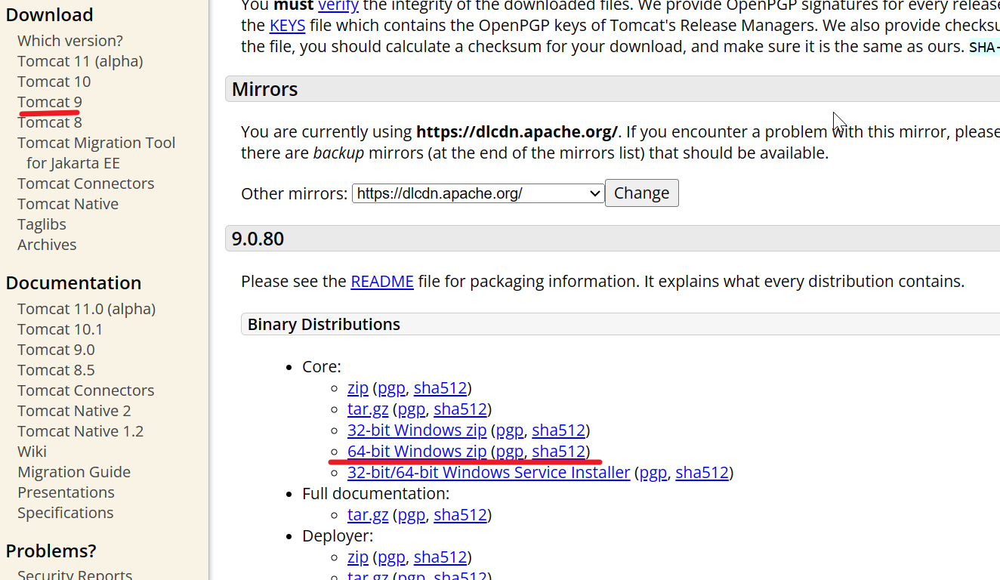


- 配置GATALINA_HOME环境变量


- 配置Path环境变量（先把java环境变量配置好）


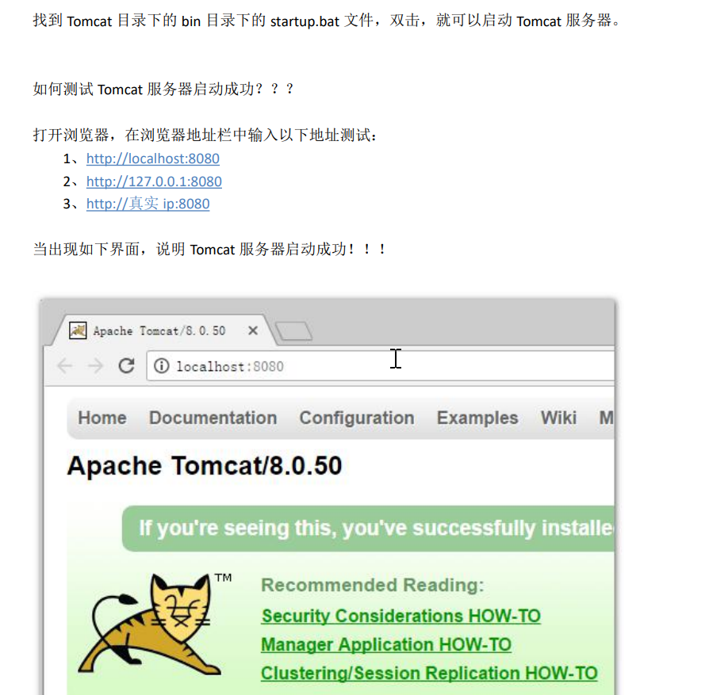


#### 另一种启动 tomcat 服务器的方式


#### Tomcat 的停止


#### 如何修改 Tomcat 的端口号


#### 如何部署 web 工程 到 Tomcat 中

- 第一种部署方法：只需要把 web 工程的目录拷贝到 Tomcat 的 webapps 目录下 即可

  1. 在 webapps 目录下创建一个 book 工程：

     

  2. 把项目的内容拷贝到里面：

     

  3. 如何访问 Tomcat 下的 web 工程：

     > 只需要在浏览器中输入访问地址格式如下：
     >
     > http://主机ip地址:8080/工程名/目录下/文件名


- 第二种部署方法（记得重启服务）

  找到 Tomcat 下的 conf 目录\Catalina\localhost\ 下,创建如下的配置文件：

  

  abc.xml 配置文件内容如下：

  ```xml
  <!-- Context 表示一个工程上下文
  		path 表示工程的访问路径:/abc
  		docBase 表示你的工程目录在哪里
  -->
  <Context path="/abc" docBase="E:\book"/>
  ```

  访问这个工程的路径如下:http://ip地址:8080/abc/ 就表示访问 E:\book 目录


#### 手托 html 页面到浏览器和在浏览器中输入 http://ip:端 口号/工程名/访问的区别


#### ROOT 的工程的访问，以及 默认 index.html 页面的访问


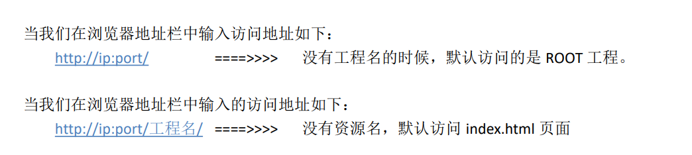


### IDEA 整合 Tomcat 服务器


## IDEA 中动态 web 工程的操作

### IDEA 中如何创建动态 web 工程


到这里就运行成功了


更改项目名称


如果动了整个目录结构，就一定要进行重启


如果不想每次改了资源文件就要重启


记得最后在重启

[原视频](https://www.bilibili.com/video/BV1yg411a7GN)


### Web 工程的目录介绍


### 如何给动态 web 工程添加额外 jar 包


### 如何在 IDEA 中部署工程到 Tomcat 上运行

确认你的 Tomcat 实例中有你要部署运行的 web 工程模块：


还可以修改你的 Tomcat 实例启动后默认的访问地址：


在 IDEA 中如何运行，和停止 Tomcat 实例。


### Tomcat实例使用的其他细节说明

#### 修改工程访问路径


#### 修改运行的端口号


#### 修改运行使用的浏览器


## Servlet1

### Servlet 技术

#### 什么是 Servlet


#### 手动实现Servlet 程序


```java
package com.atguigu.servlet;

import javax.servlet.*;
import java.io.IOException;

/* @author  i-s-j-h-d
 * @version 1.0 */
public class HelloServlet implements Servlet{

    @Override
    public void init(ServletConfig servletConfig) throws ServletException {

    }

    @Override
    public ServletConfig getServletConfig() {
        return null;
    }

    /*
        service方法是专门用来处理请求和响应的
    */
    @Override
    public void service(ServletRequest servletRequest, ServletResponse servletResponse) throws ServletException, IOException {
        System.out.println("servlet 被访问了");
    }

    @Override
    public String getServletInfo() {
        return null;
    }

    @Override
    public void destroy() {

    }
}
```

[servlet-api.jar](servlet-api.jar)


```xml
<?xml version="1.0" encoding="UTF-8"?>
<web-app xmlns="http://xmlns.jcp.org/xml/ns/javaee"
         xmlns:xsi="http://www.w3.org/2001/XMLSchema-instance"
         xsi:schemaLocation="http://xmlns.jcp.org/xml/ns/javaee http://xmlns.jcp.org/xml/ns/javaee/web-app_4_0.xsd"
         version="4.0">

    <!-- servlet 标签给Tomcat配置Servlet程序 -->
    <servlet>
        <!-- servlet-name标签 Servlet程序起的一个别名(一般是类名) -->
        <servlet-name>HelloServlet</servlet-name>

        <!-- servlet-class是Servlet程序的全类名 -->
        <servlet-class>com.atguigu.servlet.HelloServlet</servlet-class>
    </servlet>

    <!-- servlet-mapping标签给servlet程序配置访问地址 -->
    <servlet-mapping>
        <!-- servlet-name标签的作用是告诉服务器，我当前配置的地址给哪个Servlet程序使用 -->
        <servlet-name>HelloServlet</servlet-name>

        <!-- url-pattern标签配置访问地址
                /       斜杠在服务器解析的时候，表示地址为：http://ip:port/工程路径
                /hello  表示地址为：http://ip:port/工程路径/hello
        -->
        <url-pattern>/hello</url-pattern>
    </servlet-mapping>

</web-app>
```


#### url 地址到 Servlet 程序的访问


#### Servlet 的生命周期


#### GET和POST请求的分发处理

```java
package com.atguigu.servlet;

import javax.servlet.*;
import javax.servlet.http.HttpServletRequest;
import java.io.IOException;

/* @author  i-s-j-h-d
 * @version 1.0 */
public class HelloServlet implements Servlet{

    public HelloServlet() {
        System.out.println("第一步：执行Servlet构造器方法");
    }

    @Override
    public void init(ServletConfig servletConfig) throws ServletException {
        System.out.println("第二步：执行init初始化方法");
    }

    @Override
    public ServletConfig getServletConfig() {
        return null;
    }

    /*
        service方法是专门用来处理请求和响应的
    */
    @Override
    public void service(ServletRequest servletRequest, ServletResponse servletResponse) throws ServletException, IOException {
        System.out.println("第三步：执行service方法");

        HttpServletRequest httpServletRequest = (HttpServletRequest) servletRequest;
        // 获取请求的方式
        String method = httpServletRequest.getMethod();

        if("GET".equals(method)) {
            doGet();
        } else if ("POST".equals(method)){
            doPost();
        }
    }

    // 做get请求的操作
    public void doGet() {
        System.out.println("get请求");
    }

    // 做post请求的操作
    public void doPost() {
        System.out.println("post请求");
    }

    @Override
    public String getServletInfo() {
        return null;
    }

    @Override
    public void destroy() {
        System.out.println("第四步：执行destroy销毁方法");
    }
}
```


####  通过继承 HttpServlet 实现 Servlet 程序


Servlet 类的代码：

```java
package com.atguigu.servlet;

import javax.servlet.ServletException;
import javax.servlet.http.HttpServlet;
import javax.servlet.http.HttpServletRequest;
import javax.servlet.http.HttpServletResponse;
import java.io.IOException;

/* @author  i-s-j-h-d
 * @version 1.0 */
public class HelloServlet2 extends HttpServlet {

    //  doGet() 在 get 请求的时候调用
    @Override
    protected void doGet(HttpServletRequest req, HttpServletResponse resp) throws ServletException, IOException {
        System.out.println("HelloServlet2 的 doGet 方法");
    }

    //  doPost() 在 post 请求的时候调用
    @Override
    protected void doPost(HttpServletRequest req, HttpServletResponse resp) throws ServletException, IOException {
        System.out.println("HelloServlet2 的 doPost 方法");
    }
}
```


web.xml 中的配置：

```xml
<servlet>
    <servlet-name>HelloServlet2</servlet-name>
    <servlet-class>com.atguigu.servlet.HelloServlet2</servlet-class>
</servlet>
<servlet-mapping>
    <servlet-name>HelloServlet2</servlet-name>
    <url-pattern>/hello2</url-pattern>
</servlet-mapping>
```


#### 使用IDEA创建Servlet程序


#### Servlet  类的继承体系


### ServletConfig 类


#### ServletConfig 类的三大作用


web.xml 中的配置：

```xml
<?xml version="1.0" encoding="UTF-8"?>
<web-app xmlns="http://xmlns.jcp.org/xml/ns/javaee"
         xmlns:xsi="http://www.w3.org/2001/XMLSchema-instance"
         xsi:schemaLocation="http://xmlns.jcp.org/xml/ns/javaee http://xmlns.jcp.org/xml/ns/javaee/web-app_4_0.xsd"
         version="4.0">

    <!-- servlet 标签给Tomcat配置Servlet程序 -->
    <servlet>
        <!-- servlet-name标签 Servlet程序起的一个别名(一般是类名) -->
        <servlet-name>HelloServlet</servlet-name>

        <!-- servlet-class是Servlet程序的全类名 -->
        <servlet-class>com.atguigu.servlet.HelloServlet</servlet-class>

        <!-- init-param 是初始化参数 -->
        <init-param>
            <!--是参数名-->
            <param-name>username</param-name>
            <!--是参数值-->
            <param-value>root</param-value>
        </init-param>
        <!--init-param 是初始化参数-->
        <init-param>
            <!--是参数名-->
            <param-name>url</param-name>
            <!--是参数值-->
            <param-value>jdbc:mysql://localhost:3306/test</param-value>
        </init-param>
    </servlet>
    ...
```


Servlet 中的代码：

```java
@Override
    public void init(ServletConfig servletConfig) throws ServletException {
        System.out.println("第二步：执行init初始化方法");

        //1、可以获取 Servlet 程序的别名 servlet-name 的值
        System.out.println("HelloServlet 程序的别名是:" + servletConfig.getServletName());
        // 2、获取初始化参数 init-param
        System.out.println("初始化参数 username 的值是;" + servletConfig.getInitParameter("username"));
        System.out.println("初始化参数 url 的值是;" + servletConfig.getInitParameter("url"));
        // 3、获取 ServletContext 对象
        System.out.println(servletConfig.getServletContext());
    }
```


注意点：


### ServletContext 类

#### 什么是 ServleContext


#### ServletContext 类的四个作用


ServletContext 演示代码：

```java
package com.atguigu.servlet;
/* @author  i-s-j-h-d
 * @version 1.0 */

import javax.servlet.*;
import javax.servlet.http.*;
import java.io.IOException;

public class ContextServlet extends HttpServlet {
    @Override
    protected void doGet(HttpServletRequest request, HttpServletResponse response) throws ServletException, IOException {
        // 1、获取web.xml中配置的上下文参数context-param
        ServletContext context = getServletConfig().getServletContext();
        System.out.println("context-param参数username的值是：" + context.getInitParameter("username"));
        System.out.println("context-param参数password的值是：" + context.getInitParameter("password"));

        // 2、获取当前的工程路径，格式: /工程路径
        System.out.println("当前工程路径：" + context.getContextPath());

        // 3、获取工程部署后在服务器硬盘上的绝对路径
        //      / 斜杆被服务器解析地址为：http://ip:port/工程名/
        System.out.println("工程部署的路径是：" + context.getRealPath("/"));
        System.out.println("工程下css目录的绝对路径是：" + context.getRealPath("/css"));
    }

    @Override
    protected void doPost(HttpServletRequest request, HttpServletResponse response) throws ServletException, IOException {

    }
}
```

web.xml 中的配置：

```xml
<!-- context-param是上下文参数(它属于整个web工程) -->
<context-param>
    <param-name>username</param-name>
    <param-value>context</param-value>
</context-param>
<!-- context-param是上下文参数(它属于整个web工程) -->
<context-param>
    <param-name>password</param-name>
    <param-value>root</param-value>
</context-param>
```


- ServletContext 像 Map 一样存取数据：


ContextServlet1 代码：

```java
package com.atguigu.servlet;
/* @author  i-s-j-h-d
 * @version 1.0 */

import javax.servlet.*;
import javax.servlet.http.*;
import java.io.IOException;

public class ContextServlet1 extends HttpServlet {
    @Override
    protected void doGet(HttpServletRequest request, HttpServletResponse response) throws ServletException, IOException {
        // 获取ServletContext对象
        ServletContext servletContext = getServletContext();

        System.out.println("保存之前: Context1 获取 key1 的值是:"+ servletContext.getAttribute("key1"));
        servletContext.setAttribute("key1", "value1");

        System.out.println("Context1 中获取域数据key1的值是：" + servletContext.getAttribute("key1"));
    }

    @Override
    protected void doPost(HttpServletRequest request, HttpServletResponse response) throws ServletException, IOException {

    }
}

```

ContextServlet2 代码：

```java
package com.atguigu.servlet;
/* @author  i-s-j-h-d
 * @version 1.0 */

import javax.servlet.*;
import javax.servlet.http.*;
import java.io.IOException;

public class ContextServlet2 extends HttpServlet {
    @Override
    protected void doGet(HttpServletRequest request, HttpServletResponse response) throws ServletException, IOException {
        // 获取ServletContext对象
        ServletContext servletContext = getServletContext();

        System.out.println("保存之前: Context1 获取 key1 的值是:"+ servletContext.getAttribute("key1"));
    }

    @Override
    protected void doPost(HttpServletRequest request, HttpServletResponse response) throws ServletException, IOException {

    }
}
```

web.xml 中的配置：

```xml
<servlet>
    <servlet-name>ContextServlet1</servlet-name>
    <servlet-class>com.atguigu.servlet.ContextServlet1</servlet-class>
</servlet>
<servlet-mapping>
    <servlet-name>ContextServlet1</servlet-name>
    <url-pattern>/ContextServlet1</url-pattern>
</servlet-mapping>

<servlet>
    <servlet-name>ContextServlet2</servlet-name>
    <servlet-class>com.atguigu.servlet.ContextServlet2</servlet-class>
</servlet>
<servlet-mapping>
    <servlet-name>ContextServlet2</servlet-name>
    <url-pattern>/ContextServlet2</url-pattern>
</servlet-mapping>
```


## HTTP 协议

### 什么是HTTP协议


### 请求的HTTP协议格式

> 客户端给服务器发送数据叫请求。 
>
> 服务器给客户端回传数据叫响应。 
>
> 请求又分为 GET 请求，和 POST 请求两种

#### GET请求


#### POST请求


#### 常见请求头的说明


#### 哪些是 GET 请求，哪些是 POST 请求


### 响应的 HTTP 协议格式


### 常用的响应码说明


### MIME 类型说明


### 谷歌浏览器如何查看 HTTP 协议：


### 火狐浏览器如何查看 HTTP 协议：


## Servlet2

### HttpServletRequest 类

#### HttpServletRequest 类作用


#### HttpServletRequest 类的常用方法


```java
package com.atguigu.servlet2;

import javax.servlet.*;
import javax.servlet.http.*;
import java.io.IOException;

/* @author  i-s-j-h-d
 * @version 1.0 */
public class RequestAPIServlet extends HttpServlet {

    @Override
    protected void doGet(javax.servlet.http.HttpServletRequest req, javax.servlet.http.HttpServletResponse resp) throws ServletException, IOException {

//        i. getRequestURI() 获取请求的资源路径
        System.out.println("URI =>" + req.getRequestURI());
//        ii. getRequestURL() 获取请求的统一资源定位符（绝对路径）
        System.out.println("URL =>" + req.getRequestURL());
//        iii. getRemoteHost() 获取客户端的 ip 地址
            /*
                在IDEA中，使用localhost访问时，得到的客户端ip地址是 ===>>> 127.0.0.1
                在IDEA中，使用127.0.0.1访问时，得到的客户端ip地址是 ===>>> 127.0.0.1
                在IDEA中，使用 真实ip 访问时，得到的客户端ip地址是 ==>>> 真实的客户端ip地址
            */
        System.out.println("客户端 ip地址 =>" + req.getRemoteHost());
//        iv. getHeader() 获取请求头
        System.out.println("请求头User-Agent =>" + req.getHeader("User-Agent"));
//        vii. getMethod() 获取请求的方式 GET 或 POST
        System.out.println("请求的方式 =>" + req.getMethod());
    }

    @Override
    protected void doPost(javax.servlet.http.HttpServletRequest req, javax.servlet.http.HttpServletResponse resp) throws ServletException, IOException {
        super.doPost(req, resp);
    }
}
```


#### 如何获取请求参数

表单：

```html
<!DOCTYPE html>
<html lang="en">
<head>
    <meta charset="UTF-8">
    <title>Title</title>
</head>
<body>
    <form action="http://localhost:8080/servlet2/ParameterServlet" method="get">
        用户名：<input type="text" name="username"><br/>
        密码：<input type="password" name="password"><br/>
        兴趣爱好：<input type="checkbox" name="hobby" value="cpp">C++
        <input type="checkbox" name="hobby" value="java">Java
        <input type="checkbox" name="hobby" value="js">JavaScript<br/>
        <input type="submit">
    </form>
</body>
</html>
```


java代码：

```java
package com.atguigu.servlet2;

import javax.servlet.ServletException;
import javax.servlet.http.HttpServlet;
import javax.servlet.http.HttpServletRequest;
import javax.servlet.http.HttpServletResponse;
import java.io.IOException;
import java.util.Arrays;

/* @author  i-s-j-h-d
 * @version 1.0 */
public class ParameterServlet extends HttpServlet {

    @Override
    protected void doGet(HttpServletRequest req, HttpServletResponse resp) throws ServletException, IOException {

        // 获取请求参数
        String username = req.getParameter("username");
        String password = req.getParameter("password");
        String[] hobby = req.getParameterValues("hobby");

        System.out.println("用户名：" + username);
        System.out.println("密码：" + password);
        System.out.println("兴趣爱好：" + Arrays.asList(hobby));
    }
}
```


#### doGet 和 doPost 请求的中文乱码解决：


doGet 请求的中文乱码解决:

```java
@Override
protected void doGet(HttpServletRequest req, HttpServletResponse resp) throws ServletException, IOException {

    // 获取请求参数
    String username = req.getParameter("username");
    //1 先以 iso8859-1 进行编码
    //2 再以 utf-8 进行解码
    username = new String(username.getBytes("iso-8859-1"), "UTF-8");
}
```


doPost 请求的中文乱码解决:

```java
@Override
protected void doPost(HttpServletRequest req, HttpServletResponse resp) throws ServletException, IOException {
    // 设置请求体的字符集为UTF-8，从而解决post请求的中文乱码问题
    req.setCharacterEncoding("UTF-8");
    System.out.println("==========doPost============");

    // 获取请求参数
    String username = req.getParameter("username");
    String password = req.getParameter("password");
    String[] hobby = req.getParameterValues("hobby");

    System.out.println("用户名：" + username);
    System.out.println("密码：" + password);
    System.out.println("兴趣爱好：" + Arrays.asList(hobby));
}
```


> 注意：获取请求参数之前调用，才能解决中文乱码。
>


#### 请求的转发

什么是请求的转发? 

请求转发是指，服务器收到请求后，从一次资源跳转到另一个资源的操作叫请求转发。


Servlet1 代码：

```java
package com.atguigu.servlet2;

import javax.servlet.RequestDispatcher;
import javax.servlet.ServletException;
import javax.servlet.http.HttpServlet;
import javax.servlet.http.HttpServletRequest;
import javax.servlet.http.HttpServletResponse;
import java.io.IOException;

/* @author  i-s-j-h-d
 * @version 1.0 */
public class Servlet1 extends HttpServlet {

    @Override
    protected void doGet(HttpServletRequest req, HttpServletResponse resp) throws ServletException, IOException {
        // 获取请求的参数(办事的材料)查看
        String username = req.getParameter("username");
        System.out.println("在 Servlet1（柜台 1）中查看参数（材料）：" + username);

        // 给材料 盖一个章，并传递到Servlet2(柜台2)去查看
        req.setAttribute("key1", "柜台1的章");

        // 问路：Servlet2（柜台 2）怎么走
        /*
            请求转发必须要以斜杠打头， / 斜杠表示地址为：http://ip:port/工程名/ , 映射到 IDEA 代码的 web 目录
        */
        RequestDispatcher requestDispatcher = req.getRequestDispatcher("/Servlet2_");

        // 走向Sevlet2(柜台2)
        requestDispatcher.forward(req,resp);

    }
}
```


Servlet2 代码：

```java
package com.atguigu.servlet2;

import javax.servlet.ServletException;
import javax.servlet.http.HttpServlet;
import javax.servlet.http.HttpServletRequest;
import javax.servlet.http.HttpServletResponse;
import java.io.IOException;

/* @author  i-s-j-h-d
 * @version 1.0 */
public class Servlet2_ extends HttpServlet {

    @Override
    protected void doGet(HttpServletRequest req, HttpServletResponse resp) throws ServletException, IOException {
        // 获取请求的参数(办事的材料)查看
        String username = req.getParameter("username");
        System.out.println("在 Servlet2 (柜台2) 中查看参数 (材料)：" + username);

        // 查看 柜台1 是否有盖章
        Object key1 = req.getAttribute("key1");
        System.out.println("柜台1是否有章：" + key1);

        // 处理自己的业务
        System.out.println("Servlet2 处理自己的业务");
    }
}
```


#### base 标签的作用


```html
<!DOCTYPE html>
<html lang="en">
<head>
    <meta charset="UTF-8">
    <title>Title</title>
    <!--
        base 标签设置页面相对路径工作时参照的地址
        href 属性就是参数的地址值
    -->
    <base href="http://localhost:8080/servlet2/a/b/c.html">
</head>
<body>

    这是a下的b下的c.html页面<br/>
    <a href="../../index.html">跳回首页</a>

</body>
</html>
```


#### Web 中的相对路径和绝对路径


#### web 中 / 斜杠的不同意义

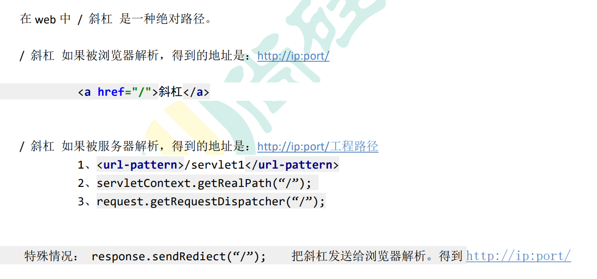


### HttpServletResponse 类

#### HttpServletResponse 类的作用

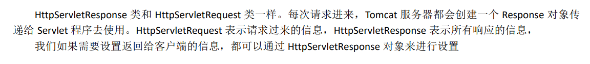


#### 两个输出流的说明


#### 如何往客户端回传数据

要求：往客户端回传 字符串 数据。

```java
package com.atguigu.servlet2;

import javax.servlet.ServletException;
import javax.servlet.http.HttpServlet;
import javax.servlet.http.HttpServletRequest;
import javax.servlet.http.HttpServletResponse;
import java.io.IOException;
import java.io.PrintWriter;

/* @author  i-s-j-h-d
 * @version 1.0 */
public class ResponseIOServlet extends HttpServlet {

    @Override
    protected void doGet(HttpServletRequest req, HttpServletResponse resp) throws ServletException, IOException {
        // 要求：往客户端回传 字符串 数据。
        PrintWriter writer = resp.getWriter();
        writer.write("response's content!!!");
    }
}
```


#### 响应的乱码解决

```java
package com.atguigu.servlet2;

import javax.servlet.ServletException;
import javax.servlet.http.HttpServlet;
import javax.servlet.http.HttpServletRequest;
import javax.servlet.http.HttpServletResponse;
import java.io.IOException;
import java.io.PrintWriter;

/* @author  i-s-j-h-d
 * @version 1.0 */
public class ResponseIOServlet extends HttpServlet {

    @Override
    protected void doGet(HttpServletRequest req, HttpServletResponse resp) throws ServletException, IOException {

        //解决响应中文乱码方案一（不推荐使用）：
//        // 设置服务器字符集为UTF-8
//        resp.setCharacterEncoding("UTF-8");
//        // 通过响应头，设置浏览器也使用UTF-8字符集
//        resp.setHeader("Content-Type", "text/html; charset=UTF-8");

        //解决响应中文乱码方案二（推荐）：
            // 同时设置服务器和客户端都使用UTF-8字符集，还设置了响应头
            // 此方法一定要在获取流对象之前调用才有效
            resp.setContentType("text/html; charset=UTF-8");

        System.out.println(resp.getCharacterEncoding());

        // 要求：往客户端回传 字符串 数据。
        PrintWriter writer = resp.getWriter();
        writer.write("轻音少女");
    }
}
```


#### 请求重定向


Response1 代码：

```java
package com.atguigu.servlet2;

import javax.servlet.ServletException;
import javax.servlet.http.HttpServlet;
import javax.servlet.http.HttpServletRequest;
import javax.servlet.http.HttpServletResponse;
import java.io.IOException;

/* @author  i-s-j-h-d
 * @version 1.0 */
public class Response1 extends HttpServlet {

    @Override
    protected void doGet(HttpServletRequest req, HttpServletResponse resp) throws ServletException, IOException {
        System.out.println("曾到此一游 Response1");

        // 请求重定向的第一种方案：
            // 设置响应状态码302，表示重定向，(已搬迁)
            // resp.setStatus(302);
            // 设置响应头，说明 新的地址在哪里
            // resp.setHeader("Location", "http://localhost:8080/servlet2/response2");

        // 请求重定向的第二种方案（推荐使用）：
            resp.sendRedirect("http://localhost:8080/servlet2/response2");
    }
}
```


Response2 代码：

```java
package com.atguigu.servlet2;

import javax.servlet.ServletException;
import javax.servlet.http.HttpServlet;
import javax.servlet.http.HttpServletRequest;
import javax.servlet.http.HttpServletResponse;
import java.io.IOException;

/* @author  i-s-j-h-d
 * @version 1.0 */
public class Response2 extends HttpServlet {

    @Override
    protected void doGet(HttpServletRequest req, HttpServletResponse resp) throws ServletException, IOException {
        resp.getWriter().write("response2's result!");
    }
}
```


## 书城第二阶段——用户注册和登陆

### javaEE 项目的三层架构


分层的目的是为了解耦。解耦就是为了降低代码的耦合度。方便项目后期的维护和升级。


搭建书城项目开发环境：


### 先创建书城需要的数据库和表

```mysql
DROP DATABASE IF EXISTS book;

CREATE DATABASE book;

USE book;

CREATE TABLE t_user(
	`id` INT PRIMARY KEY AUTO_INCREMENT,
	`username` VARCHAR(20) NOT NULL UNIQUE,
	`password` VARCHAR(32) NOT NULL,
	`email` VARCHAR(200)
);

INSERT INTO t_user(`username`,`password`,`email`) VALUES('admin','admin','admin@atguigu.com');

SELECT * FROM t_user;

```


### 编写数据库表对应的 JavaBean 对象

```java
package com.atguigu.pojo;

/* @author  i-s-j-h-d
 * @version 1.0 */
public class User {

    private Integer id;
    private String username;
    private String password;
    private String email;

    public User() {
    }

    public User(Integer id, String username, String password, String email) {
        this.id = id;
        this.username = username;
        this.password = password;
        this.email = email;
    }

    public Integer getId() {
        return id;
    }

    public void setId(Integer id) {
        this.id = id;
    }

    public String getUsername() {
        return username;
    }

    public void setUsername(String username) {
        this.username = username;
    }

    public String getPassword() {
        return password;
    }

    public void setPassword(String password) {
        this.password = password;
    }

    public String getEmail() {
        return email;
    }

    public void setEmail(String email) {
        this.email = email;
    }

    @Override
    public String toString() {
        return "User{" +
                "id=" + id +
                ", username='" + username + '\'' +
                ", password='" + password + '\'' +
                ", email='" + email + '\'' +
                '}';
    }
}
```


### 编写工具类 JdbcUtils

#### 导入需要的jar包（数据库和连接池需要）：

[druid-1.1.9.jar](druid-1.1.9.jar)	[mysql-connector-java-5.1.7-bin.jar](mysql-connector-java-5.1.7-bin.jar)


#### 在src源码目录下编写 jdbc.properties 属性配置文件：

```properties
username=root
password=root
url=jdbc:mysql://localhost:3306/book
driverClassName=com.mysql.jdbc.Driver
initialSize=5
maxActive=10
```


#### 编写 JdbcUtils 工具类：

```java
package com.atguigu.utils;

import com.alibaba.druid.pool.DruidDataSource;
import com.alibaba.druid.pool.DruidDataSourceFactory;
import java.io.InputStream;
import java.sql.Connection;
import java.sql.SQLException;
import java.util.Properties;
/* @author i-s-j-h-d
 * @version 1.0
 * 基于druid数据库连接池的工具类
 */
public class JdbcUtils {
    private static DruidDataSource dataSource;
    static {
        try {
            Properties properties = new Properties();
            // 读取 jdbc.properties 属性配置文件
            InputStream inputStream =
                    JdbcUtils.class.getClassLoader().getResourceAsStream("jdbc.properties");
            // 从流中加载数据
            properties.load(inputStream);
            // 创建 数据库连接 池
            dataSource = (DruidDataSource) DruidDataSourceFactory.createDataSource(properties);
        } catch (Exception e) {
            e.printStackTrace();
        }
    }
    /**
     * 获取数据库连接池中的连接
     * @return 如果返回 null,说明获取连接失败<br/>有值就是获取连接成功
     */
    public static Connection getConnection(){
        Connection conn = null;
        try {
            conn = dataSource.getConnection();
        } catch (Exception e) {
            e.printStackTrace();
        }
        return conn;
    }
    /**
     * 关闭连接，放回数据库连接池
     * @param conn
     */
    public static void close(Connection conn){
        if (conn != null) {
            try {
                conn.close();
            } catch (SQLException e) {
                e.printStackTrace();
            }
        }
    }
}
```


#### JdbcUtils 测试

```java
public class JdbcUtilsTest {
    @Test
    public void testJdbcUtils(){
        for (int i = 0; i < 100; i++){
            Connection connection = JdbcUtils.getConnection();
            System.out.println(connection);
            JdbcUtils.close(connection);
        }
    }
}
```


### 编写 BaseDao

- 导入 DBUtils 的 jar 包

[commons-dbutils-1.3.jar](commons-dbutils-1.3.jar)

- 编写 BaseDao:

```java
package com.atguigu.dao.impl;

import com.atguigu.utils.JdbcUtils;
import org.apache.commons.dbutils.QueryRunner;
import org.apache.commons.dbutils.handlers.BeanHandler;
import org.apache.commons.dbutils.handlers.BeanListHandler;
import org.apache.commons.dbutils.handlers.ScalarHandler;

import java.sql.Connection;
import java.sql.SQLException;
import java.util.List;

/* @author  i-s-j-h-d
 * @version 1.0 */
public abstract class BaseDao {

    //使用DbUtils操作数据库
    private QueryRunner queryRunner = new QueryRunner();

    // update() 方法用来执行：Insert\Update\Delete语句
    // return 如果返回-1，说明执行失败，返回其他表示影响到的行数
    public int update(String sql, Object ... args) {
        Connection connection = JdbcUtils.getConnection();
        try {
            return queryRunner.update(connection, sql, args);
        } catch (SQLException e) {
            e.printStackTrace();
        } finally {
            JdbcUtils.close(connection);
        }
        return -1;
    }

    /**
     * 查询返回一个javaBean的sql语句
     *
     * @param type  返回的对象类型
     * @param sql   执行的sql语句
     * @param args  sql对应的参数值
     * @param <T>   返回的类型的泛型
     * @return
     */
    public <T> T queryForOne(Class<T> type, String sql, Object ... args) {
        Connection connection = JdbcUtils.getConnection();
        try {
            return queryRunner.query(connection, sql, new BeanHandler<T>(type), args);
        } catch (SQLException e) {
            e.printStackTrace();
        } finally {
            JdbcUtils.close(connection);
        }
        return null;
    }

    /**
     * 查询返回多个 javaBean 的 sql 语句
     *
     * @param type 返回的对象类型
     * @param sql 执行的 sql 语句
     * @param args sql 对应的参数值
     * @param <T> 返回的类型的泛型
     * @return
     */
    public <T> List<T> queryForList(Class<T> type, String sql, Object...args) {
        Connection connection = JdbcUtils.getConnection();
        try {
            return queryRunner.query(connection, sql, new BeanListHandler<T>(type), args);
        } catch (SQLException e) {
            e.printStackTrace();
        } finally {
            JdbcUtils.close(connection);
        }
        return null;
    }

    /**
     * 执行返回一行一列的sql语句
     * @param sql   执行的sql语句
     * @param args  sql对应的参数值
     * @return
     */
    public Object queryForSingleValue(String sql, Object...args) {
        Connection connection = JdbcUtils.getConnection();

        try {
            queryRunner.query(connection, sql, new ScalarHandler(), args);
        } catch (SQLException e) {
            e.printStackTrace();
        } finally {
            JdbcUtils.close(connection);
        }
        return null;
    }

}

```


### 编写 UserDao 和测试

UserDao 接口：

```java
package com.atguigu.dao;

import com.atguigu.pojo.User;

/* @author  i-s-j-h-d
 * @version 1.0 */
public interface UserDao {

    /**
     * 根据用户名查询用户信息
     * @param username 用户名
     * @return 如果返回null，说明没有这个用户，反之亦然
     */
    public User queryUserByUsername(String username);

    /**
     * 根据 用户名和密码查询用户信息
     * @param username
     * @param password
     * @return 如果返回null，说明用户名或密码错误，反之亦然
     */
    public User queryUserByUsernameAndPassword(String username, String password);

    /**
     * 保存用户信息
     * @param user
     * @return 返回-1表示操作失败，其他是sql语句影响的行数
     */
    public int saveUser(User user);
}
```


UserDaoImpl实现类：

```java
package com.atguigu.dao.impl;

import com.atguigu.dao.UserDao;
import com.atguigu.pojo.User;

/* @author  i-s-j-h-d
 * @version 1.0 */
public class UserDaoImpl extends BaseDao implements UserDao {
    @Override
    public User queryUserByUsername(String username) {
        String sql = "select `id`,`username`,`password`,`email` from t_user where username = ?";
        return queryForOne(User.class, sql, username);
    }

    @Override
    public User queryUserByUsernameAndPassword(String username, String password) {
        String sql = "select `id`,`username`,`password`,`email` from t_user where username = ? and password = ?";
        return queryForOne(User.class, sql, username, password);
    }

    @Override
    public int saveUser(User user) {
        String sql = "insert into t_user(`username`,`password`,`email`) values(?,?,?)";
        return update(sql, user.getUsername(), user.getPassword(), user.getEmail());
    }
}
```


UserDao 测试：

```java
package com.atguigu.test;

import com.atguigu.dao.UserDao;
import com.atguigu.dao.impl.UserDaoImpl;
import com.atguigu.pojo.User;
import org.junit.Test;

import static org.junit.Assert.*;

/* @author  i-s-j-h-d
 * @version 1.0 */
public class UserDaoTest {

    UserDao userDao = new UserDaoImpl();

    @Test
    public void queryUserByUsername() {
        if (userDao.queryUserByUsername("admin") == null) {
            System.out.println("用户名可用！");
        } else {
            System.out.println("用户名已存在！");
        }
    }

    @Test
    public void queryUserByUsernameAndPassword() {
        if (userDao.queryUserByUsernameAndPassword("admin", "admin") == null) {
            System.out.println("用户名或密码错误，登录失败");
        } else {
            System.out.println("查询成功");
        }
    }

    @Test
    public void saveUser() {
        System.out.println(userDao.saveUser(
                new User(null, "wzg123", "123456", "wzg168@qq.com")));
    }
}
```


### 编写 UserService 和测试

UserService 接口：

```java
package com.atguigu.service;

import com.atguigu.pojo.User;

/* @author  i-s-j-h-d
 * @version 1.0 */
public interface UserService {

    /**
     * 注册用户
     * @param user
     */
    public void registUser(User user);

    /**
     * 登录
     * @param user
     * @return 如果返回null，说明登录失败，返回有值，是登陆成功
     */
    public User login(User user);

    /**
     * 检查 用户名是否可用
     * @param username
     * @return 返回true表示用户名已存在，返回false表示用户名可用
     */
    public boolean existsUsername(String username);
}
```


UserServicelmpl 实现类：

```java
package com.atguigu.service.impl;

import com.atguigu.dao.UserDao;
import com.atguigu.dao.impl.UserDaoImpl;
import com.atguigu.pojo.User;
import com.atguigu.service.UserService;

/* @author  i-s-j-h-d
 * @version 1.0 */
public class UserServiceImpl implements UserService {

    private UserDao userDao = new UserDaoImpl();

    @Override
    public void registUser(User user) {
        userDao.saveUser(user);
    }

    @Override
    public User login(User user) {
        return userDao.queryUserByUsernameAndPassword(user.getUsername(), user.getPassword());
    }

    @Override
    public boolean existsUsername(String username) {
        if (userDao.queryUserByUsername(username) == null) {
            // 等于null，说明没查到，没查到表示可用
            return false;
        }
        return true;
    }
}
```


UserService 测试：

```java
package com.atguigu.test;

import com.atguigu.pojo.User;
import com.atguigu.service.UserService;
import com.atguigu.service.impl.UserServiceImpl;
import org.junit.Test;

import static org.junit.Assert.*;

/* @author  i-s-j-h-d
 * @version 1.0 */public class UserServiceTest {

     UserService userService = new UserServiceImpl();

    @Test
    public void registUser() {
        userService.registUser(new User(null, "轻音少女", "123456", "kon@qq.com"));
    }

    @Test
    public void login() {
        System.out.println(userService.login(new User(null, "轻音少女", "123456", null)));
    }

    @Test
    public void existsUsername() {
        if (userService.existsUsername("轻音少女")) {
            System.out.println("用户名已存在！");
        } else {
            System.out.println("用户名可用！");
        }
    }
}
```


### 编写 wed 层

#### 实现用户注册的功能

##### 图解用户注册的流程：


##### 修改 regist.html 和 regist_success.html 页面


##### 编写 RegistServlet 程序

```java
package com.atguigu.wed;

import com.atguigu.pojo.User;
import com.atguigu.service.UserService;
import com.atguigu.service.impl.UserServiceImpl;

import javax.servlet.ServletException;
import javax.servlet.http.HttpServlet;
import javax.servlet.http.HttpServletRequest;
import javax.servlet.http.HttpServletResponse;
import java.io.IOException;

/* @author  i-s-j-h-d
 * @version 1.0 */
public class RegistServlet extends HttpServlet {

    private UserService userService = new UserServiceImpl();

    protected void doGet(HttpServletRequest request, HttpServletResponse response) throws ServletException, IOException {
        this.doPost(request,response);
    }


    @Override
    protected void doPost(HttpServletRequest req, HttpServletResponse resp) throws ServletException, IOException {
        // 1、获取请求的参数
        String username = req.getParameter("username");
        String password = req.getParameter("password");
        String email = req.getParameter("email");
        String code = req.getParameter("code");
        // 2、检查验证码是否正确 == 写死，要求验证码为：abcde
        if ("abcde".equalsIgnoreCase(code)) {
            // 3.检查用户名是否可用
            if (userService.existsUsername(username)) {
                System.out.println("用户名【" + username + "】已存在");
                //  不可用    跳回注册页面
                req.getRequestDispatcher("/pages/user/regist.html").forward(req, resp);
            } else {
                //  可用    调用Service保存到数据库，
                userService.registUser(new User(null, username, password, email));
                // 跳到注册成功本面regist_success.html
                req.getRequestDispatcher("/pages/user/regist_success.html").forward(req, resp);

                System.out.println("用户名【" + username + "】创建成功");
            }
        } else {
            System.out.println("验证码【" + code + "】错误");
            req.getRequestDispatcher("/pages/user/regist.html").forward(req, resp);
        }


    }
}
```


#### IDEA 中 Debug 调试的使用

##### Debug 调试代码，首先需要两个元素：断点 + Debug 启动服务器


##### 测试工具栏


##### 变量窗口


##### 方法调用栈窗口


##### 其他常用调试相关按钮


### 用户登录功能的实现

#### 图解用户登录


#### 修改 login.html 页面和 login_success.html 页面


#### LoginServlet 程序

```java
package com.atguigu.wed;

import com.atguigu.pojo.User;
import com.atguigu.service.UserService;
import com.atguigu.service.impl.UserServiceImpl;

import javax.servlet.ServletException;
import javax.servlet.http.HttpServlet;
import javax.servlet.http.HttpServletRequest;
import javax.servlet.http.HttpServletResponse;
import java.io.IOException;

/* @author  i-s-j-h-d
 * @version 1.0 */
public class LoginServlet extends HttpServlet {

    private UserService userService = new UserServiceImpl();

    @Override
    protected void doPost(HttpServletRequest req, HttpServletResponse resp) throws ServletException, IOException {
        // 1、获取请求的参数
        String username = req.getParameter("username");
        String password = req.getParameter("password");
        // 2、userService.login()登录处理业务
        User loginUser = userService.login(new User(null, username, password, null));
        // 3、根据login()方法返回结果判断登录是否成功
        if (loginUser == null) {
            // 如果等于null，说明登陆失败！
            // 失败跳回登录页面
            req.getRequestDispatcher("/pages/user/login.html").forward(req, resp);
        } else {
            // 登陆成功
            // 成功跳到成功页面login_success.html
            req.getRequestDispatcher("/pages/user/login_success.html").forward(req, resp);
        }
    }

    protected void doGet(HttpServletRequest request, HttpServletResponse response) throws ServletException, IOException {
        this.doPost(request,response);
    }
}
```


## jsp

### 什么是jsp，它有什么用？


Servlet 回传 html 页面数据的代码：

```java
package com.atguigu.servlet;

import javax.servlet.ServletException;
import javax.servlet.http.HttpServlet;
import javax.servlet.http.HttpServletRequest;
import javax.servlet.http.HttpServletResponse;
import java.io.IOException;
import java.io.PrintWriter;

/* @author  i-s-j-h-d
 * @version 1.0 */
public class PringHtml extends HttpServlet {

    @Override
    protected void doGet(HttpServletRequest req, HttpServletResponse resp) throws ServletException, IOException {
        // 通过响应的回传流回传html页面数据

        resp.setContentType("text/html; charset=UTF-8");

        PrintWriter writer = resp.getWriter();

        writer.write("<!DOCTYPE html>\r\n");
        writer.write("<html lang=\"en\">\r\n");
        writer.write("<head>\r\n");
        writer.write("    <meta charset=\"UTF-8\">\r\n");
        writer.write("    <title>Title</title>\r\n");
        writer.write("</head>\r\n");
        writer.write("  <body>\r\n");
        writer.write("                html页面\r\n");
        writer.write("  </body>\r\n");
        writer.write("</html>\r\n");


    }
}
```


jsp 回传一个简单 html 页面的代码：

```jsp
<%--
  Created by IntelliJ IDEA.
  User: 34782
  Date: 2023/10/5
  Time: 17:54
  To change this template use File | Settings | File Templates.
--%>
<%@ page contentType="text/html;charset=UTF-8" language="java" %>
<html>
<head>
    <title>Title</title>
</head>
<body>
 wiejfioehrofjwefiheui
</body>
</html>
```


### jsp 的本质是什么

​	jsp 页面本质上是一个 Servlet 程序。 

​	当我们第一次访问 jsp 页面的时候。Tomcat 服务器会帮我们把 jsp 页面翻译成为一个 java 源文件。并且对它进行编译成为.class 字节码程序。我们打开 java 源文件不难发现其里面的内容是：


​	我们跟踪原代码发现，HttpJspBase 类。它直接地继承了 HttpServlet 类。也就是说 .jsp 翻译出来的 java 类，它间接了继 承了 HttpServlet 类。也就是说，翻译出来的是一个 Servlet 程序。


​	大家也可以去观察翻译出来的 Servlet 程序的源代码，不难发现。其底层实现，也是通过输出流。把 html 页面数据回传 给客户端。

```java
public void _jspService(final javax.servlet.http.HttpServletRequest request,final
javax.servlet.http.HttpServletResponse response)
        throws java.io.IOException,javax.servlet.ServletException{
final java.lang.String _jspx_method=request.getMethod();
        if(!"GET".equals(_jspx_method)&&!"POST".equals(_jspx_method)&&!"HEAD".equals(_jspx_method)
        &&!javax.servlet.DispatcherType.ERROR.equals(request.getDispatcherType())){
        response.sendError(HttpServletResponse.SC_METHOD_NOT_ALLOWED,"JSPs only permit GET POST or
        HEAD");
        return;
        }
final javax.servlet.jsp.PageContext pageContext;
        javax.servlet.http.HttpSession session=null;
final javax.servlet.ServletContext application;
final javax.servlet.ServletConfig config;
        javax.servlet.jsp.JspWriter out=null;
final java.lang.Object page=this;
        javax.servlet.jsp.JspWriter _jspx_out=null;
        javax.servlet.jsp.PageContext _jspx_page_context=null;
        try{
        response.setContentType("text/html;charset=UTF-8");
        pageContext=_jspxFactory.getPageContext(this,request,response,
        null,true,8192,true);
        _jspx_page_context=pageContext;
        application=pageContext.getServletContext();
        config=pageContext.getServletConfig();
        session=pageContext.getSession();
        out=pageContext.getOut();
        _jspx_out=out;
        out.write("\r\n");
        out.write("\r\n");
        out.write("<html>\r\n");
        out.write("<head>\r\n");
        out.write(" <title>Title</title>\r\n");
        out.write("</head>\r\n");
        out.write("<body>\r\n");
        out.write(" a.jsp 页面\r\n");
        out.write("</body>\r\n");
        out.write("</html>\r\n");
        }catch(java.lang.Throwable t){
        if(!(t instanceof javax.servlet.jsp.SkipPageException)){
        out=_jspx_out;
        if(out!=null&&out.getBufferSize()!=0)
        try{
        if(response.isCommitted()){
        out.flush();
        }else{
        out.clearBuffer();
        }
        }catch(java.io.IOException e){}
        if(_jspx_page_context!=null)_jspx_page_context.handlePageException(t);
        else throw new ServletException(t);
        }
        }finally{
        _jspxFactory.releasePageContext(_jspx_page_context);
        }
        }
```


### jsp 的三种语法

#### jsp 头部的 page 指令


#### jsp 中的常用脚本

1. 声明脚本（极少使用）

   > 声明脚本的格式是： <%! 声明 java 代码 %> 
   >
   > 作用：可以给 jsp 翻译出来的 java 类定义属性和方法甚至是静态代码块。内部类等。

   ```jsp
   <%@ page import="java.util.Map" %>
   <%@ page import="java.util.HashMap" %><%--
     Created by IntelliJ IDEA.
     User: 34782
     Date: 2023/10/5
     Time: 17:54
     To change this template use File | Settings | File Templates.
   --%>
   <%@ page contentType="text/html;charset=UTF-8" language="java" %>
   <html>
   <head>
       <title>Title</title>
   </head>
   <body>
   
   <%-- 1.声明类属性--%>
       <%!
           private Integer id;
           private String name;
           private static Map<String,Object> map;
       %>
   
   <%-- 2.声明static静态代码块--%>
       <%!
           static {
               map = new HashMap<String, Object>();
               map.put("日漫", "轻音少女");
           }
       %>
   
   <%-- 3.声明类方法--%>
       <%!
           public int abc() {
               return 12;
           }
       %>
   
   <%-- 4.声明内部类--%>
       <%!
           public static class A {
               private Integer id = 12;
               private String abc = "abc";
           }
       %>
   
   </body>
   </html>
   ```


2. 表达式脚本（常用）

   

   ```jsp
   <%@ page import="java.util.Map" %>
   <%@ page import="java.util.HashMap" %><%--
     Created by IntelliJ IDEA.
     User: 34782
     Date: 2023/10/5
     Time: 17:54
     To change this template use File | Settings | File Templates.
   --%>
   <%@ page contentType="text/html;charset=UTF-8" language="java" %>
   <html>
   <head>
       <title>Title</title>
   </head>
   <body>
   
       <%=12 %> <br>
       <%=12.12 %> <br>
       <%="我是字符串" %> <br>
       <%=request.getParameter("username")%>
   
   </body>
   </html>
   ```

   


3. 代码脚本

   

   ```jsp
   <%@ page import="java.util.Map" %>
   <%@ page import="java.util.HashMap" %><%--
     Created by IntelliJ IDEA.
     User: 34782
     Date: 2023/10/5
     Time: 17:54
     To change this template use File | Settings | File Templates.
   --%>
   <%@ page contentType="text/html;charset=UTF-8" language="java" %>
   <html>
   <head>
       <title>Title</title>
   </head>
   <body>
   
   <%--  代码脚本----if 语句--%>
       <%
           int i = 13;
           if (i == 12) {
       %>
               <h1>星际牛仔</h1>
       <%
           } else {
       %>
               <h1>轻音少女</h1>
       <%
           }
       %>
   
   <%--  代码脚本----for 循环语句--%>
       <table border="1" cellspacing="0">
       <%
           for (int j = 0; j < 10; j++) {
       %>
               <tr>
                   <td>第 <%=j + 1%>行</td>
               </tr>
       <%
           }
       %>
       </table>
   
   <%-- 翻译后 java 文件中_jspService 方法内的代码都可以写--%>
       <%
           String username = request.getParameter("username");
           System.out.println("用户名的请求参数值是：" + username);
       %>
   
   
   </body>
   </html>
   ```

   


#### jsp 中的三种注释

1. html 注释

   ```jsp
   <!-- 这是 html 注释 -->
   ```

   html 注释会被翻译到 java 源代码中。在_jspService 方法里，以 out.writer 输出到客户端

   

2. java 注释

   ```jsp
   <%
       // 单行 java 注释
       /* 多行 java 注释 */
   %>
   
   ```

   java 注释会被翻译到 java 源代码中

   

3. jsp 注释

   ```jsp
   <%-- 这是 jsp 注释 --%>
   ```

   jsp 注释可以注掉，jsp 页面中所有代码。


### jsp 九大内置对象


### jsp 四大域对象


scope.jsp页面：

```jsp
<%--
  Created by IntelliJ IDEA.
  User: 34782
  Date: 2023/10/7
  Time: 11:46
  To change this template use File | Settings | File Templates.
--%>
<%@ page contentType="text/html;charset=UTF-8" language="java" %>
<html>
<head>
    <title>Title</title>
</head>
<body>

    <h1>scope.jsp 页面</h1>
    <%
        // 往4个域中分别保存了数据
        pageContext.setAttribute("key", "pageContext");
        request.setAttribute("key", "request");
        session.setAttribute("key", "session");
        application.setAttribute("key", "application");
    %>
    pageContext 域是否有值：<%=pageContext.getAttribute("key")%> <br>
    request 域是否有值：<%=request.getAttribute("key")%> <br>
    session 域是否有值：<%=session.getAttribute("key")%> <br>
    application 域是否有值：<%=application.getAttribute("key")%> <br>
    <%
        request.getRequestDispatcher("/scope2.jsp").forward(request, response);
    %>


</body>
</html>
```


scope2.jsp 页面:

```jsp
<%--
  Created by IntelliJ IDEA.
  User: 34782
  Date: 2023/10/7
  Time: 11:47
  To change this template use File | Settings | File Templates.
--%>
<%@ page contentType="text/html;charset=UTF-8" language="java" %>
<html>
<head>
    <title>Title</title>
</head>
<body>

    <h1>scope2.jsp 页面</h1>
    pageContext 域是否有值：<%=pageContext.getAttribute("key")%> <br>
    request 域是否有值：<%=request.getAttribute("key")%> <br>
    session 域是否有值：<%=session.getAttribute("key")%> <br>
    application 域是否有值：<%=application.getAttribute("key")%> <br>

</body>
</html>
```


### jsp 中的 out 输出和 response.getWriter 输出的区 别


### jsp 的常用标签

#### jsp 静态包含


main.jsp 页面：

```jsp
<%--
  Created by IntelliJ IDEA.
  User: 34782
  Date: 2023/10/8
  Time: 9:33
  To change this template use File | Settings | File Templates.
--%>
<%@ page contentType="text/html;charset=UTF-8" language="java" %>
<html>
<head>
    <title>Title</title>
</head>
<body>

  猫娘头部<br>
  猫娘身体<br>

<%--
  <%@ include file="/"%> 就是静态包含
      file 属性指定你要包含的jsp页面的路径

      地址中第一个斜杠 / 表示为http://ip:port/工程路径/ 映射到代码的web目录

  静态包含的特点：
      1. 静态包含不会翻译被包含的jsp页面
      2. 静态包含其实是把被包含的jsp页面的代码拷贝到包含的位置执行输出
--%>
  <%@ include file="/include/footer.jsp"%>

</body>
</html>
```

footer.jsp 页面：

```jsp
<%--
  Created by IntelliJ IDEA.
  User: 34782
  Date: 2023/10/8
  Time: 9:33
  To change this template use File | Settings | File Templates.
--%>
<%@ page contentType="text/html;charset=UTF-8" language="java" %>
<html>
<head>
    <title>Title</title>
</head>
<body>

    猫娘腿部<br>


</body>
</html>
```


#### jsp 动态包含

动态包含的底层原理：


main2.jsp 页面：

```jsp
<%--
  Created by IntelliJ IDEA.
  User: 34782
  Date: 2023/10/8
  Time: 9:57
  To change this template use File | Settings | File Templates.
--%>
<%@ page contentType="text/html;charset=UTF-8" language="java" %>
<html>
<head>
    <title>Title</title>
</head>
<body>

    猫娘头部<br>
    猫娘身体<br>

<%--
    <jsp:include page=""></jsp:include>     这是动态包含
    page 属性是指定你要包含的jsp页面的路径
    动态包含也可以像静态包含一样。把被包含的内容执行输出到包含位置

    动态包含的特点：
        1. 动态包含会把包含的jsp页面也翻译成为java代码
        2. 动态包含底层代码使用如下代码去调用被包含的jsp页面执行输出。
            org.apache.jasper.runtime.JspRuntimeLibrary.include(request, response, "/include/footer.jsp", out, false);
        3. 动态包含，还可以传递参数
--%>
    <jsp:include page="/include/footer.jsp">
        <jsp:param name="username" value="bbj"/>
        <jsp:param name="password" value="root"/>
    </jsp:include>


</body>
</html>
```

footer.jsp 页面：

```jsp
<%--
  Created by IntelliJ IDEA.
  User: 34782
  Date: 2023/10/8
  Time: 9:33
  To change this template use File | Settings | File Templates.
--%>
<%@ page contentType="text/html;charset=UTF-8" language="java" %>
<html>
<head>
    <title>Title</title>
</head>
<body>

    猫娘腿部<br>
    猫娘脚脚<br>

    <%=request.getParameter("password")%>

</body>
</html>
```


#### jsp 标签-转发

```jsp
<%--
    <jsp:forward page=""></jsp:forward> 是请求转发标签，它的功能就是请求转发
    	page 属性设置请求转发的路径
--%>
<jsp:forward page="/scope2.jsp"></jsp:forward>
```


### jsp 的练习题

练习一：在 jsp 页面中输出九九乘法口诀表

```jsp
<%--
  Created by IntelliJ IDEA.
  User: 34782
  Date: 2023/10/8
  Time: 10:45
  To change this template use File | Settings | File Templates.
--%>
<%@ page contentType="text/html;charset=UTF-8" language="java" %>
<html>
<head>
    <title>Title</title>
</head>
<body>

<%--练习一：在 jsp 页面中输出九九乘法口诀表--%>
    <h1 align="center">九九乘法表</h1>
    <table align="center">
    <% for (int i = 1; i <= 9; i++) { %>
        <tr>
        <% for (int j = 1; j <= i; j++) { %>
            <td><%=j + "x" + i + "=" + (i*j)%></td>
        <% } %>
        </tr>
      <% } %>
    </table>

</body>
</html>
```


练习二：jsp 输出一个表格，里面有 10 个学生信息。


Studnet 类：

```java
package com.atguigu.pojo;

/* @author  i-s-j-h-d
 * @version 1.0 */
public class Student {
    private Integer id;
    private String name;
    private Integer age;
    private String phone;

    public Student() {
    }

    public Student(Integer id, String name, Integer age, String phone) {
        this.id = id;
        this.name = name;
        this.age = age;
        this.phone = phone;
    }

    public Integer getId() {
        return id;
    }

    public void setId(Integer id) {
        this.id = id;
    }

    public String getName() {
        return name;
    }

    public void setName(String name) {
        this.name = name;
    }

    public Integer getAge() {
        return age;
    }

    public void setAge(Integer age) {
        this.age = age;
    }

    public String getPhone() {
        return phone;
    }

    public void setPhone(String phone) {
        this.phone = phone;
    }
}
```


SearchStudentServlet 程序：

```java
package com.atguigu.servlet;

import com.atguigu.pojo.Student;

import javax.servlet.ServletException;
import javax.servlet.http.HttpServlet;
import javax.servlet.http.HttpServletRequest;
import javax.servlet.http.HttpServletResponse;
import java.io.IOException;
import java.util.ArrayList;
import java.util.List;

/* @author  i-s-j-h-d
 * @version 1.0 */
public class SearchStudentServlet extends HttpServlet {

    @Override
    protected void doGet(HttpServletRequest req, HttpServletResponse resp) throws ServletException, IOException {
        // 获取请求的参数
        // 发sql语句查询学生的信息
        // 使用for循环生成查询到的数据做模拟
        List<Student> studentList = new ArrayList<Student>();
        for (int i = 1; i < 10; i++) {
            studentList.add(new Student(i, "name"+i, 18+i, "phone"+i));
        }
        // 保存查询到的结果（学生信息）到request域中
        req.setAttribute("stuList", studentList);
        // 请求转发到showStudent.jsp页面
        req.getRequestDispatcher("/test/test2.jsp").forward(req, resp);
    }
}

```


test2.jsp 页面：

```jsp
<%@ page import="com.atguigu.pojo.Student" %>
<%@ page import="java.util.List" %>
<%@ page import="java.util.ArrayList" %><%--
  Created by IntelliJ IDEA.
  User: 34782
  Date: 2023/10/8
  Time: 11:09
  To change this template use File | Settings | File Templates.
--%>
<%@ page contentType="text/html;charset=UTF-8" language="java" %>
<html>
<head>
    <title>Title</title>
    <style>
        table{
            border: 1px red solid;
            width: 600px;
            border-collapse: collapse;
        }
        td,th{
            border: 1px red solid;
        }
    </style>
</head>
<body>

<%--练习二：jsp 输出一个表格，里面有 10 个学生信息。--%>
    <%
        List<Student> studentList = (List<Student>) request.getAttribute("stuList");
    %>
    <table>
        <tr>
            <td>编号</td>
            <td>姓名</td>
            <td>年龄</td>
            <td>电话</td>
            <td>操作</td>
        </tr>
    <% for (Student student : studentList) { %>
        <tr>
            <td><%=student.getId()%></td>
            <td><%=student.getName()%></td>
            <td><%=student.getAge()%></td>
            <td><%=student.getPhone()%></td>
        </tr>
    <% } %>
    </table>

</body>
</html>

```


### 什么是 Listener 监听器？


#### ServletContextListener 监听器


两个方法分别是：

```java
如何使用 ServletContextListener 监听器监听 ServletContext 对象。
使用步骤如下：
1、编写一个类去实现 ServletContextListener
2、实现其两个回调方法
3、到 web.xml 中去配置监听器
public interface ServletContextListener extends EventListener {
    /**
    * 在 ServletContext 对象创建之后马上调用，做初始化
    */
    public void contextInitialized(ServletContextEvent sce);
    /**
    * 在 ServletContext 对象销毁之后调用
    */
    public void contextDestroyed(ServletContextEvent sce);
}
```

> 如何使用 ServletContextListener 监听器监听 ServletContext 对象。 
>
> 使用步骤如下： 
>
> 1、编写一个类去实现 ServletContextListener 
>
> 2、实现其两个回调方法 
>
> 3、到 web.xml 中去配置监听器

监听器实现类：

```java
package com.atguigu.listener;

import javax.servlet.ServletContextEvent;
import javax.servlet.ServletContextListener;

/* @author  i-s-j-h-d
 * @version 1.0 */
public class MyServletContextListenerImpl implements ServletContextListener {

    @Override
    public void contextInitialized(ServletContextEvent sce) {
        System.out.println("ServletContext对象被创建了");
    }

    @Override
    public void contextDestroyed(ServletContextEvent sce) {
        System.out.println("ServletContext对象被销毁了");
    }
}
```


web.xml 中的配置：

```xml
<!-- 配置监听器 -->
    <listener>
        <listener-class>com.atguigu.listener.MyServletContextListenerImpl</listener-class>
    </listener>
```


## EL 表达式 & JSTL 标签库

### EL  表达式

#### 什么是 EL 表达式，EL 表达式的作用?


#### EL 表达式搜索域数据的顺序


```jsp
<body>
    <%
        //往四个域中都保存了相同的 key 的数据。
        request.setAttribute("key", "request");
        session.setAttribute("key", "session");
        application.setAttribute("key", "application");
        pageContext.setAttribute("key", "pageContext");
    %>
    ${ key }
</body>	
```


#### EL 表达式输出 Bean 的普通属性，数组属性。List 集合属性，map 集合属性

Person 类：

```java
package com.atguigu.pojo;

import java.util.Arrays;
import java.util.List;
import java.util.Map;

/* @author  i-s-j-h-d
 * @version 1.0 */
public class Person {
//    需求——输出 Person 类中普通属性，数组属性。list 集合属性和 map 集合属性。
    private String name;
    private String [] phones;
    private List<String> cities;
    private Map<String,Object> map;

    public Person() {
    }

    public Person(String name, String[] phones, List<String> cities, Map<String, Object> map) {
        this.name = name;
        this.phones = phones;
        this.cities = cities;
        this.map = map;
    }

    @Override
    public String toString() {
        return "Person{" +
                "name=" + name +
                ", phones=" + Arrays.toString(phones) +
                ", cities=" + cities +
                ", map=" + map +
                '}';
    }

    public String getName() {
        return name;
    }

    public void setName(String name) {
        this.name = name;
    }

    public String[] getPhones() {
        return phones;
    }

    public void setPhones(String[] phones) {
        this.phones = phones;
    }

    public List<String> getCities() {
        return cities;
    }

    public void setCities(List<String> cities) {
        this.cities = cities;
    }

    public Map<String, Object> getMap() {
        return map;
    }

    public void setMap(Map<String, Object> map) {
        this.map = map;
    }
}
```


c.jsp 代码：

```jsp
<%@ page import="com.atguigu.pojo.Person" %>
<%@ page import="java.util.List" %>
<%@ page import="java.util.ArrayList" %>
<%@ page import="java.util.HashMap" %>
<%@ page import="java.util.Map" %><%--
  Created by IntelliJ IDEA.
  User: 34782
  Date: 2023/10/9
  Time: 9:54
  To change this template use File | Settings | File Templates.
--%>
<%@ page contentType="text/html;charset=UTF-8" language="java" %>
<html>
<head>
    <title>Title</title>
</head>
<body>

    <%
        Person person = new Person();
        person.setName("星际牛仔");
        person.setPhones(new String[]{"123456", "654321", "098765"});

        List<String> cities = new ArrayList<String>();
        cities.add("木星1");
        cities.add("木星2");
        cities.add("木星3");
        cities.add("木星4");
        person.setCities(cities);

        Map<String,Object> map = new HashMap<>();
        map.put("key1", "value1");
        map.put("key2", "value2");
        map.put("key3", "value3");
        person.setMap(map);

        pageContext.setAttribute("p",person);
    %>

    输出Person：${ p }<br/>
    输出Person的name属性：${p.name}<br/>
    输出Person的phones数组属性值：${p.phones[1]}<br/>
    输出Person的cities集合中的元素值：${p.cities}<br/>
    输出Person的List集合中个别元素值：${p.cities[1]}<br/>
    输出Person的Map集合：${p.map}<br/>
    输出Person的Map集合中某个key的值：${p.map.key1}<br/>


</body>
</html>
```


#### EL 表达式——运算

语法：${ 运算表达式 } ， EL 表达式支持如下运算符：

##### 关系运算


##### 逻辑运算


##### 算数运算


##### empty 运算


```jsp
<%@ page import="java.util.List" %>
<%@ page import="java.util.ArrayList" %>
<%@ page import="java.util.HashMap" %>
<%@ page import="java.util.Map" %><%--
  Created by IntelliJ IDEA.
  User: 34782
  Date: 2023/10/9
  Time: 11:32
  To change this template use File | Settings | File Templates.
--%>
<%@ page contentType="text/html;charset=UTF-8" language="java" %>
<html>
<head>
    <title>Title</title>
</head>
<body>
    <%
//        1、值为 null 值的时候，为空
        request.setAttribute("emptyNull", null);
//        2、值为空串的时候，为空
        request.setAttribute("emptyStr", "");
//        3、值是 Object 类型数组，长度为零的时候
        request.setAttribute("emptyArr", new Object[]{});
//        4、list 集合，元素个数为零
        List<String> list = new ArrayList<>();
        request.setAttribute("emptyList", list);
//        5、map集合，元素个数为零
        Map<String,Object> map = new HashMap<String,Object>();
        request.setAttribute("emptyMap", map);
    %>

    ${ empty emptyNull } <br/>
    ${ empty emptyStr } <br/>
    ${ empty emptyArr } <br/>
    ${ empty emptyList } <br/>
    ${ empty emptyMap } <br/>

</body>
</html>
```


##### 三元运算


```jsp
${ 12 != 12 ? "轻音少女" : "星际牛仔" }
```


##### "." 点运算 和 [] 中括号运算符


```jsp
<%@ page import="java.util.HashMap" %>
<%@ page import="java.util.Map" %><%--
  Created by IntelliJ IDEA.
  User: 34782
  Date: 2023/10/9
  Time: 12:00
  To change this template use File | Settings | File Templates.
--%>
<%@ page contentType="text/html;charset=UTF-8" language="java" %>
<html>
<head>
    <title>Title</title>
</head>
<body>

    <%
        Map<String,Object> map = new HashMap<String,Object>();
        map.put("a.a.a", "星际牛仔");
        map.put("b+b+b", "团子大家族");
        map.put("c-c-c", "轻音少女");

        request.setAttribute("map", map);
    %>

    ${ map['a.a.a'] } <br/>
    ${ map['b+b+b'] } <br/>
    ${ map['c-c-c'] } <br/>

</body>
</html>
```


#### EL 表达式的 11 个隐含对象


##### EL 获取四个特定域中的属性


```jsp
<%--
  Created by IntelliJ IDEA.
  User: 34782
  Date: 2023/10/10
  Time: 8:55
  To change this template use File | Settings | File Templates.
--%>
<%@ page contentType="text/html;charset=UTF-8" language="java" %>
<html>
<head>
    <title>Title</title>
</head>
<body>

    <%
        pageContext.setAttribute("key2", "pageContext");
        request.setAttribute("key2", "request");
        session.setAttribute("key2", "session");
        application.setAttribute("key2", "application");
    %>

    ${pageScope.key2}
    ${requestScope.key2}
    ${sessionScope.key2}
    ${applicationScope.key2}

</body>
</html>
```


##### pageContext 对象的使用


```jsp
<%--
  Created by IntelliJ IDEA.
  User: 34782
  Date: 2023/10/10
  Time: 9:11
  To change this template use File | Settings | File Templates.
--%>
<%@ page contentType="text/html;charset=UTF-8" language="java" %>
<html>
<head>
    <title>Title</title>
</head>
<body>

    <%--
        request.getScheme() 它可以获取请求的协议
        request.getServerName() 获取请求的服务器 ip 或域名
        request.getServerPort() 获取请求的服务器端口号
        getContextPath() 获取当前工程路径
        request.getMethod() 获取请求的方式（GET 或 POST）
        request.getRemoteHost() 获取客户端的 ip 地址
        session.getId() 获取会话的唯一标识
    --%>

    1. 协议：${ pageContext.request.scheme }<br/>
    2. 服务器 ip：${ pageContext.request.serverName }<br/>
    3. 服务器端口：${ pageContext.request.serverPort }<br/>
    4. 获取工程路径：${ pageContext.request.contextPath }<br/>
    5. 获取请求方法：${ pageContext.request.method }<br/>
    6. 获取客户端 ip 地址：${ pageContext.request.remoteHost }<br/>
    7. 获取会话的 id 编号： ${ pageContext.session.id }<br/>

</body>
</html>
```


##### EL 表达式其他隐含对象的使用


```jsp
<%--
  Created by IntelliJ IDEA.
  User: 34782
  Date: 2023/10/10
  Time: 9:55
  To change this template use File | Settings | File Templates.
--%>
<%@ page contentType="text/html;charset=UTF-8" language="java" %>
<html>
<head>
    <title>Title</title>
</head>
<body>

  输出请求参数 username 的值：${ param.username } <br>
  输出请求参数 password 的值：${ param.password } <br>
  
  输出请求参数 username 的值：${ paramValues.username[0] } <br>
  输出请求参数 hobby 的值：${ paramValues.hobby[0] } <br>
  输出请求参数 hobby 的值：${ paramValues.hobby[1] } <br>

</body>
</html>
```

请求地址：

http://localhost:8080/09_EL_JSTL/other_el_obj.jsp?username=wzg168&password=666666&hobby=java&hobby=cpp


```jsp
<%--
  Created by IntelliJ IDEA.
  User: 34782
  Date: 2023/10/10
  Time: 9:55
  To change this template use File | Settings | File Templates.
--%>
<%@ page contentType="text/html;charset=UTF-8" language="java" %>
<html>
<head>
    <title>Title</title>
</head>
<body>

  输出请求头【User-Agent】的值：${ header['User-Agent'] } <br>
  输出请求头【Connection】的值：${ header.Connection } <br>
  输出请求头【User-Agent】的值：${ headerValues['User-Agent'][0] } <br>

</body>
</html>
```


```jsp
<%--
  Created by IntelliJ IDEA.
  User: 34782
  Date: 2023/10/10
  Time: 9:55
  To change this template use File | Settings | File Templates.
--%>
<%@ page contentType="text/html;charset=UTF-8" language="java" %>
<html>
<head>
    <title>Title</title>
</head>
<body>

    获取 Cookie 的名称：${ cookie.JSESSIONID.name } <br>
    获取 Cookie 的值：${ cookie.JSESSIONID.value } <br>

</body>
</html>
```


web.xml 中的配置：

```xml
<?xml version="1.0" encoding="UTF-8"?>
<web-app xmlns="http://xmlns.jcp.org/xml/ns/javaee"
         xmlns:xsi="http://www.w3.org/2001/XMLSchema-instance"
         xsi:schemaLocation="http://xmlns.jcp.org/xml/ns/javaee http://xmlns.jcp.org/xml/ns/javaee/web-app_4_0.xsd"
         version="4.0">
    <context-param>
        <param-name>username</param-name>
        <param-value>root</param-value>
    </context-param>
    <context-param>
        <param-name>url</param-name>
        <param-value>jdbc:mysql:///test</param-value>
    </context-param>
</web-app>
```


```jsp
<%--
  Created by IntelliJ IDEA.
  User: 34782
  Date: 2023/10/10
  Time: 9:55
  To change this template use File | Settings | File Templates.
--%>
<%@ page contentType="text/html;charset=UTF-8" language="java" %>
<html>
<head>
    <title>Title</title>
</head>
<body>

    输出&lt;Context-param&gt;username 的值：${ initParam.username } <br>
    输出&lt;Context-param&gt;url 的值：${ initParam.url } <br>

</body>
</html>
```


### JSTL 标签库（次重点）


#### JSTL 标签库的使用步骤

1. 先导入 jstl 标签库的 jar 包

   [taglibs-standard-impl-1.2.1.jar](taglibs-standard-impl-1.2.1.jar)

   [taglibs-standard-spec-1.2.1.jar](taglibs-standard-spec-1.2.1.jar)

2. 使用 taglib 指令引入标签库

   ```jsp
   <%@ taglib prefix="c" uri="http://java.sun.com/jsp/jstl/core" %>
   ```

   

#### core 核心库使用

##### &lt;c:set/&gt;(使用很少)

作用：set标签可以往域中保存数据

```jsp
<%--
  Created by IntelliJ IDEA.
  User: 34782
  Date: 2023/10/10
  Time: 9:55
  To change this template use File | Settings | File Templates.
--%>
<%@ taglib prefix="c" uri="http://java.sun.com/jsp/jstl/core" %>
<%@ page contentType="text/html;charset=UTF-8" language="java" %>
<html>
<head>
    <title>Title</title>
</head>
<body>

    <%--
        i.<c:set />
            作用：set 标签可以往域中保存数据

            域对象.setAttribute(key,value);
            scope 属性设置保存到哪个域
                page 表示 PageContext 域（默认值）
                request 表示 Request 域
                session 表示 Session 域
                application 表示 ServletContext 域
            var 属性设置 key 是多少
            value 属性设置值
    --%>
    保存之前：${ sessionScope.abc } <br>
    <c:set scope="session" var="abc" value="abcValue"/>
    保存之后：${ sessionScope.abc } <br>


</body>
</html>
```


##### &lt;c:if/&gt;

if 标签用来做 if 判断

```jsp
<%--
  Created by IntelliJ IDEA.
  User: 34782
  Date: 2023/10/10
  Time: 11:47
  To change this template use File | Settings | File Templates.
--%>
<%@ taglib prefix="c" uri="http://java.sun.com/jsp/jstl/core" %>
<%@ page contentType="text/html;charset=UTF-8" language="java" %>
<html>
<head>
    <title>Title</title>
</head>
<body>

  <%--
      <c:if />
      if 标签用来做if判断
      test 属性表示判断的条件 (使用 EL 表达式输出)
  --%>

    <c:if test="${ 12 == 12 }">
      <h1>12等于12</h1>
    </c:if>
    <c:if test="${ 12 != 12 }">
        <h1>12不等于12</h1>
    </c:if>

</body>
</html>
```


##### &lt;c:choose&gt;&lt;c:when&gt;&lt;c:otherwise&gt;标签

作用：多路判断。跟 switch ... case .... default 非常接近

```jsp
<%--
  Created by IntelliJ IDEA.
  User: 34782
  Date: 2023/10/10
  Time: 11:47
  To change this template use File | Settings | File Templates.
--%>
<%@ taglib prefix="c" uri="http://java.sun.com/jsp/jstl/core" %>
<%@ page contentType="text/html;charset=UTF-8" language="java" %>
<html>
<head>
    <title>Title</title>
</head>
<body>

    <%--
        <c:choose> <c:when> <c:otherwise>标签
        作用：多路判断。跟 switch ... case .... default 非常接近
        choose 标签开始选择判断
        when 标签表示每一种判断情况
        test 属性表示当前这种判断情况的值
        otherwise 标签表示剩下的情况

        <c:choose> <c:when> <c:otherwise>标签使用时需要注意的点：
            1、标签里不能使用 html 注释，要使用 jsp 注释
            2、when 标签的父标签一定要是 choose 标签
    --%>

    <%
        request.setAttribute("星际牛仔", 1998);
    %>

    <c:choose>
        <%-- 标签里不能使用 html 注释，要使用 jsp 注释 --%>
        <c:when test="${ requestScope.星际牛仔 > 2010 }">
            <h2>比较老</h2>
        </c:when>
        <c:when test="${ requestScope.星际牛仔 > 2000 }">
            <h2>很老</h2>
        </c:when>
        <c:when test="${ requestScope.星际牛仔 > 1990 }">
            <h2>泡沫时代</h2>
        </c:when>
        <c:otherwise>
            <h2>更老</h2>
        </c:otherwise>
    </c:choose>

</body>
</html>
```


##### &lt;c:forEach/&gt;

作用：遍历输出使用。

1.  遍历 1 到 10，输出

```jsp
<%--
  Created by IntelliJ IDEA.
  User: 34782
  Date: 2023/10/11
  Time: 11:34
  To change this template use File | Settings | File Templates.
--%>
<%@ taglib prefix="c" uri="http://java.sun.com/jsp/jstl/core" %>
<%@ page contentType="text/html;charset=UTF-8" language="java" %>
<html>
<head>
    <title>Title</title>
</head>
<body>

    <%--    遍历 1 到 10，输出
        begin 属性设置开始的索引
        end 属性设置结束的索引
        var 属性表示循环的变量(也是当前正在遍历到的数据)
        for (int i = 1; i < 10; i++)
    --%>
    <c:forEach begin="1" end="10" var="i">
        ${i} <br/>
    </c:forEach>

</body>
</html>
```


2. 遍历 Object 数组

```jsp
<%--
  Created by IntelliJ IDEA.
  User: 34782
  Date: 2023/10/11
  Time: 11:34
  To change this template use File | Settings | File Templates.
--%>
<%@ taglib prefix="c" uri="http://java.sun.com/jsp/jstl/core" %>
<%@ page contentType="text/html;charset=UTF-8" language="java" %>
<html>
<head>
    <title>Title</title>
</head>
<body>

    <%--    遍历 Object 数组
        for (Object item: arr)
        items 表示遍历的数据源（遍历的集合）
        var 表示当前遍历到的数据
    --%>
    <%
        request.setAttribute("arr", new String[]{"轻音少女", "星际牛仔", "团子大家族"});
    %>
    <c:forEach items="${ requestScope.arr }" var="item">
        ${ item } <br>
    </c:forEach>


</body>
</html>
```


3. 遍历 Map 集合

```jsp
<%@ page import="java.util.HashMap" %>
<%@ page import="java.util.Map" %><%--
  Created by IntelliJ IDEA.
  User: 34782
  Date: 2023/10/11
  Time: 11:34
  To change this template use File | Settings | File Templates.
--%>
<%@ taglib prefix="c" uri="http://java.sun.com/jsp/jstl/core" %>
<%@ page contentType="text/html;charset=UTF-8" language="java" %>
<html>
<head>
    <title>Title</title>
</head>
<body>

    <%
        Map<String,Object> map = new HashMap<String,Object>();
        map.put("key1", "value1");
        map.put("key2", "value2");
        map.put("key3", "value3");
//        for ( Map.Entry<String,Object> entry : map.entrySet() ) {
//        }
        request.setAttribute("map", map);
    %>
    <c:forEach items="${ requestScope.map }" var="entry">
        <h1>${entry.key} = ${entry.value}</h1>
    </c:forEach>

</body>
</html>
```


4. 遍历 List 集合---list 中存放 Student 类，有属性：编号，用户名，密码，年龄， 电话信息

Student 类：

```java
package com.atguigu.pojo;

/* @author  i-s-j-h-d
 * @version 1.0 */
public class Student {
    // 4. 编号，用户名，密码，年龄，电话信息
    private Integer id;
    private String username;
    private String password;
    private Integer age;
    private String phone;

    public Student() {
    }

    public Student(Integer id, String username, String password, Integer age, String phone) {
        this.id = id;
        this.username = username;
        this.password = password;
        this.age = age;
        this.phone = phone;
    }

    @Override
    public String toString() {
        return "Student{" +
                "id=" + id +
                ", username='" + username + '\'' +
                ", password='" + password + '\'' +
                ", age=" + age +
                ", phone='" + phone + '\'' +
                '}';
    }

    public Integer getId() {
        return id;
    }

    public void setId(Integer id) {
        this.id = id;
    }

    public String getUsername() {
        return username;
    }

    public void setUsername(String username) {
        this.username = username;
    }

    public String getPassword() {
        return password;
    }

    public void setPassword(String password) {
        this.password = password;
    }

    public Integer getAge() {
        return age;
    }

    public void setAge(Integer age) {
        this.age = age;
    }

    public String getPhone() {
        return phone;
    }

    public void setPhone(String phone) {
        this.phone = phone;
    }
}
```


```jsp
<%@ page import="java.util.HashMap" %>
<%@ page import="java.util.Map" %>
<%@ page import="com.atguigu.pojo.Student" %>
<%@ page import="java.util.List" %>
<%@ page import="java.util.ArrayList" %><%--
  Created by IntelliJ IDEA.
  User: 34782
  Date: 2023/10/11
  Time: 11:34
  To change this template use File | Settings | File Templates.
--%>
<%@ taglib prefix="c" uri="http://java.sun.com/jsp/jstl/core" %>
<%@ page contentType="text/html;charset=UTF-8" language="java" %>
<html>
<head>
    <title>Title</title>
</head>
<body>
    <%-- 遍历 List 集合---list 中存放 Student 类，有属性：编号，用户名，密码，年龄，电话信息--%>
    <%
        List<Student> studentList = new ArrayList<Student>();
        for (int i = 1; i <= 10; i++) {
            studentList.add(new Student(i, "username"+i, "pass"+i, 18+i, "phone"+i));
        }
        request.setAttribute("stus", studentList);
    %>
    <table>
        <tr>
            <th>编号</th>
            <th>用户名</th>
            <th>密码</th>
            <th>年龄</th>
            <th>电话</th>
            <th>操作</th>
        </tr>
        <%--
            items 表示遍历的集合
            var 表示遍历到的数据
            begin 表示遍历的开始索引值
            end 表示结束的索引值
            step 属性表示遍历的步长值
            varStatus 属性表示当前遍历到的数据的状态
            for（int i = 1; i < 10; i+=2）
        --%>
        <c:forEach begin="2" end="7" step="2" varStatus="status" items="${requestScope.stus}" var = "stu">
            <tr>
                <td>${stu.id}</td>
                <td>${stu.username}</td>
                <td>${stu.password}</td>
                <td>${stu.age}</td>
                <td>${stu.phone}</td>
                <td>${status.step}</td>
            </tr>
        </c:forEach>
    </table>


</body>
</html>
```

status 对象：


## 文件的上传和下载

文件的上传和下载，是非常常见的功能。很多的系统中，或者软件中都经常使用文件的上传和下载。

 比如：QQ 头像，就使用了上传。 

邮箱中也有附件的上传和下载功能。 

OA 系统中审批有附件材料的上传。

### 文件的上传介绍


servlet 程序：

```java
package com.atguigu.servlet;

import javax.servlet.ServletException;
import javax.servlet.http.HttpServlet;
import javax.servlet.http.HttpServletRequest;
import javax.servlet.http.HttpServletResponse;
import java.io.IOException;

/* @author  i-s-j-h-d
 * @version 1.0 */
public class UploadServlet extends HttpServlet {

    /**
     * 用来处理上传的数据
     * @param req
     * @param resp
     * @throws ServletException
     * @throws IOException
     */
    @Override
    protected void doPost(HttpServletRequest req, HttpServletResponse resp) throws ServletException, IOException {
        System.out.println("文件上传成功！！！");
    }

    @Override
    protected void doGet(HttpServletRequest req, HttpServletResponse resp) throws ServletException, IOException {
        doPost(req, resp);
    }
}
```


web.xml 配置：

```xml
<?xml version="1.0" encoding="UTF-8"?>
<web-app xmlns="http://xmlns.jcp.org/xml/ns/javaee"
         xmlns:xsi="http://www.w3.org/2001/XMLSchema-instance"
         xsi:schemaLocation="http://xmlns.jcp.org/xml/ns/javaee http://xmlns.jcp.org/xml/ns/javaee/web-app_4_0.xsd"
         version="4.0">
    <context-param>
        <param-name>username</param-name>
        <param-value>root</param-value>
    </context-param>
    <context-param>
        <param-name>url</param-name>
        <param-value>jdbc:mysql:///test</param-value>
    </context-param>

    <servlet>
        <servlet-name>UploadServlet</servlet-name>
        <servlet-class>com.atguigu.servlet.UploadServlet</servlet-class>
    </servlet>
    <servlet-mapping>
        <servlet-name>UploadServlet</servlet-name>
        <url-pattern>/uploadServlet</url-pattern>
    </servlet-mapping>
</web-app>
```


jsp页面：

```jsp
<%--
  Created by IntelliJ IDEA.
  User: 34782
  Date: 2023/10/12
  Time: 10:37
  To change this template use File | Settings | File Templates.
--%>
<%@ page contentType="text/html;charset=UTF-8" language="java" %>
<html>
<head>
    <title>Title</title>
</head>
<body>

    <form action="http://localhost:8080/_EL_JSTL/uploadServlet" method="post" enctype="multipart/form-data">
        用户名：<input type="text" name="username"/> <br>
        头像：<input type="file" name="photo"/> <br>
        <input type="submit"/>
    </form>

</body>
</html>
```


#### 文件上传，HTTP 协议的说明。


#### commons-fileupload.jar 常用 API 介绍说明

第一步，就是需要导入两个 jar 包： [commons-fileupload-1.2.1.jar](commons-fileupload-1.2.1.jar)  [commons-io-1.4.jar](commons-io-1.4.jar)

​	commons-fileupload.jar 需要依赖 commons-io.jar 这个包，所以两个包我们都要引入。


#### fileupload 类库的使用：

上传文件的表单:

```jsp
<%--
  Created by IntelliJ IDEA.
  User: 34782
  Date: 2023/10/12
  Time: 10:37
  To change this template use File | Settings | File Templates.
--%>
<%@ page contentType="text/html;charset=UTF-8" language="java" %>
<html>
<head>
    <title>Title</title>
</head>
<body>

    <form action="http://localhost:8080/_EL_JSTL/uploadServlet" method="post" enctype="multipart/form-data">
        用户名：<input type="text" name="username"/> <br>
        头像：<input type="file" name="photo"/> <br>
        <input type="submit"/>
    </form>


</body>
</html>
```

解析上传的数据的代码：

```java
package com.atguigu.servlet;

import org.apache.commons.fileupload.FileItem;
import org.apache.commons.fileupload.FileItemFactory;
import org.apache.commons.fileupload.disk.DiskFileItemFactory;
import org.apache.commons.fileupload.servlet.ServletFileUpload;

import javax.servlet.ServletException;
import javax.servlet.http.HttpServlet;
import javax.servlet.http.HttpServletRequest;
import javax.servlet.http.HttpServletResponse;
import java.io.File;
import java.io.IOException;
import java.util.List;

/* @author  i-s-j-h-d
 * @version 1.0 */
public class UploadServlet extends HttpServlet {

    /**
     * 用来处理上传的数据
     * @param req
     * @param resp
     * @throws ServletException
     * @throws IOException
     */
    @Override
    protected void doPost(HttpServletRequest req, HttpServletResponse resp) throws ServletException, IOException {
        // 1.先判断上传的数据是否是多段数据(只有是多段的数据，才是文件上传的)
        if (ServletFileUpload.isMultipartContent(req)) {
            // 创建FileItemFactory 工厂实现类
            FileItemFactory fileItemFactory = new DiskFileItemFactory();
            // 创建用于解析上传数据的工具类ServletFileUpload类
            ServletFileUpload servletFileUpload = new ServletFileUpload(fileItemFactory);
            try {
                // 解析上传的数据，得到每一个表单项FileItem
                List<FileItem> list = servletFileUpload.parseRequest(req);
                // 循环判断，每一个表单项，是普通类型，还是上传的文件
                for (FileItem fileItem : list) {

                    if (fileItem.isFormField()) {
                        // 普通表单项
                        System.out.println("表单项的name属性值：" + fileItem.getFieldName());
                        // 参数UTF-8，解决乱码问题
                        System.out.println("表单项的value属性值：" + fileItem.getString("UTF-8"));
                    } else {
                        // 上传的文件
                        System.out.println("表单项的name属性值：" + fileItem.getFieldName());
                        System.out.println("上传的文件名：" + fileItem.getName());

                        fileItem.write(new File("D:\\" + fileItem.getName()));
                    }
                }
            } catch (Exception e) {
                e.printStackTrace();
            }
        }
    }

    @Override
    protected void doGet(HttpServletRequest req, HttpServletResponse resp) throws ServletException, IOException {
        doPost(req, resp);
    }
}
```


### 文件的下载

#### 文件下载的实现


```java
package com.atguigu.servlet;

import org.apache.commons.io.IOUtils;

import javax.servlet.ServletContext;
import javax.servlet.ServletException;
import javax.servlet.http.HttpServlet;
import javax.servlet.http.HttpServletRequest;
import javax.servlet.http.HttpServletResponse;
import java.io.IOException;
import java.io.InputStream;
import java.io.OutputStream;

/* @author  i-s-j-h-d
 * @version 1.0 */
public class Download extends HttpServlet {
    @Override
    protected void doGet(HttpServletRequest req, HttpServletResponse resp) throws ServletException, IOException {
//        1、获取要下载的文件名
                String downloadFileName = "2.png";
//        2、读取要下载的文件内容(通过ServletContext对象可以读取)
                ServletContext servletContext = getServletContext();
                InputStream resourceAsStream = servletContext.getResourceAsStream("/file/" + downloadFileName);
//        4、在回传前，通过响应头告诉客户端返回的数据类型
                // 获取要下载的文件类型
                String mimeType = servletContext.getMimeType("/file/" + downloadFileName);
                resp.setContentType(mimeType);
//        5、还要告诉客户端收到的数据是用于下载使用（还是使用响应头）
                // Content-Disposition响应头 表示收到的数据怎么处理
                // attachment 表示附件，表示下载使用
                // filename= 表示指定下载的文件名
                resp.setHeader("Content-Disposition", "attachment; filename=" + downloadFileName);
//        3、把下载的文件内容回传给客户端
                // 获取响应的输出流
                OutputStream outputStream = resp.getOutputStream();
                // 读取输入流中全部的数据，复制给输出流，输出给客户端
                IOUtils.copy(resourceAsStream,outputStream);

    }
}
```


#### 附件中文名乱码问题解决方案：

方案一：URLEncoder 解决 IE 和谷歌浏览器的 附件中文名问题。

如果客户端浏览器是 IE 浏览器 或者 是谷歌浏览器。我们需要使用 URLEncoder 类先对中文名进行 UTF-8 的编码 操作。 因为 IE 浏览器和谷歌浏览器收到含有编码后的字符串后会以 UTF-8字符集进行解码显示。

```java
// 把中文名进行 UTF-8 编码操作。
String str = "attachment; fileName=" + URLEncoder.encode("中文.jpg", "UTF-8");
// 然后把编码后的字符串设置到响应头中
resp.setHeader("Content-Disposition", str)
```


方案二：BASE64 编解码 解决 火狐浏览器的附件中文名问题

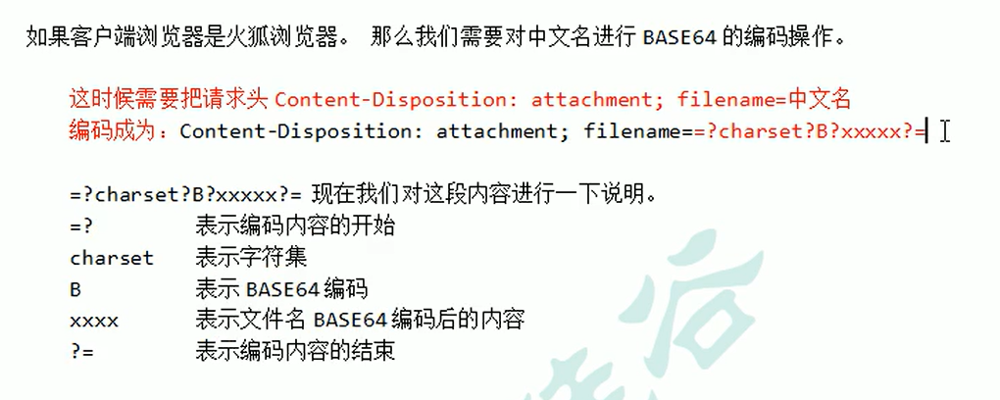

因为火狐使用的是 BASE64 的编解码方式还原响应中的汉字。所以需要使用 BASE64Encoder 类进行编码操作

```java
// 使用下面的格式进行 BASE64 编码后
String str = "attachment; fileName=" + "=?utf-8?B?"+ new BASE64Encoder().encode("中文.jpg".getBytes("utf-8")) + "?=";
// 设置到响应头中
resp.setHeader("Content-Disposition", str);
```


那么我们如何解决上面两种不同编解码方式呢。我们只需要通过判断请求头中 User-Agent 这个请求头携带过来的 浏览器信息即可判断出是什么浏览器。

```java
package com.atguigu.servlet;

import org.apache.commons.io.IOUtils;
import sun.misc.BASE64Encoder;

import javax.servlet.ServletContext;
import javax.servlet.ServletException;
import javax.servlet.http.HttpServlet;
import javax.servlet.http.HttpServletRequest;
import javax.servlet.http.HttpServletResponse;
import java.io.IOException;
import java.io.InputStream;
import java.io.OutputStream;
import java.net.URLEncoder;

/* @author  i-s-j-h-d
 * @version 1.0 */
public class Download extends HttpServlet {
    @Override
    protected void doGet(HttpServletRequest req, HttpServletResponse resp) throws ServletException, IOException {
//        1、获取要下载的文件名
                String downloadFileName = "2.png";
//        2、读取要下载的文件内容(通过ServletContext对象可以读取)
                ServletContext servletContext = getServletContext();
                InputStream resourceAsStream = servletContext.getResourceAsStream("/file/" + downloadFileName);
//        4、在回传前，通过响应头告诉客户端返回的数据类型
                // 获取要下载的文件类型
                String mimeType = servletContext.getMimeType("/file/" + downloadFileName);
                resp.setContentType(mimeType);
//        5、还要告诉客户端收到的数据是用于下载使用（还是使用响应头）
                // Content-Disposition响应头 表示收到的数据怎么处理
                // attachment 表示附件，表示下载使用
                // filename= 表示指定下载的文件名
                // url编码是把文字转换成为%xx%xx的格式
                if (req.getHeader("User-Agent").contains("Firefox")) {
                    resp.setHeader("Content-Disposition",
                            "attachment; fileName=" + "=?utf-8?B?"+ new BASE64Encoder().encode("中文.jpg".getBytes("utf-8")) + "?=");
                } else {
                    resp.setHeader("Content-Disposition",
                            "attachment; filename=" + URLEncoder.encode("中文.png", "UTF-8"));
                }
//        3、把下载的文件内容回传给客户端
                // 获取响应的输出流
                OutputStream outputStream = resp.getOutputStream();
                // 读取输入流中全部的数据，复制给输出流，输出给客户端
                IOUtils.copy(resourceAsStream,outputStream);

    }
}
```


## 书城项目第三阶段

### 页面 jsp 动态化


### 抽取页面中相同的内容

1. head 中 css、jquery、base 标签

   ```jsp
   <%--
     Created by IntelliJ IDEA.
     User: 34782
     Date: 2023/10/14
     Time: 9:36
     To change this template use File | Settings | File Templates.
   --%>
   <%@ page contentType="text/html;charset=UTF-8" language="java" %>
   <!--写base标签，永远固定相对路径跳转的结果-->
   <%
       String basePath = request.getScheme()
               + "://"
               + request.getServerName()
               + ":"
               + request.getServerPort()
               + request.getContextPath()
               + "/";
   %>
   <base href="<%=basePath%>">
   <link type="text/css" rel="stylesheet" href="static/css/style.css" >
   <script type="text/javascript" src="static/script/jquery-1.7.2.js"></script>
   ```

2.  每个页面的页脚

   ```jsp
   <%--
     Created by IntelliJ IDEA.
     User: 34782
     Date: 2023/10/14
     Time: 9:50
     To change this template use File | Settings | File Templates.
   --%>
   <%@ page contentType="text/html;charset=UTF-8" language="java" %>
   <div id="bottom">
         <span>
            尚硅谷书城.Copyright &copy;2015
         </span>
   </div>
   ```

3.  登录成功后的菜单

   ```jsp
   <%--
     Created by IntelliJ IDEA.
     User: 34782
     Date: 2023/10/14
     Time: 9:19
     To change this template use File | Settings | File Templates.
   --%>
   <%@ page contentType="text/html;charset=UTF-8" language="java" %>
   <div>
       <span>欢迎<span class="um_span">韩总</span>光临尚硅谷书城</span>
       <a href="../order/order.jsp">我的订单</a>
       <a href="../../index.jsp">注销</a>&nbsp;&nbsp;
       <a href="../../index.jsp">返回</a>
   </div>
   ```

4. manager 模块的菜单

   ```jsp
   <%--
     Created by IntelliJ IDEA.
     User: 34782
     Date: 2023/10/14
     Time: 9:59
     To change this template use File | Settings | File Templates.
   --%>
   <%@ page contentType="text/html;charset=UTF-8" language="java" %>
   <div>
       <a href="book_manager.jsp">图书管理</a>
       <a href="order_manager.jsp">订单管理</a>
       <a href="../../index.jsp">返回商城</a>
   </div>
   ```


### 登录，注册错误提示，及表单回显

以登录回显为示例： Servlet 程序端需要添加回显信息到 Request 域中


### BaseServlet 的抽取

在实际的项目开发中，一个模块，一般只使用一个 Servlet 程序。


#### 代码优化一：

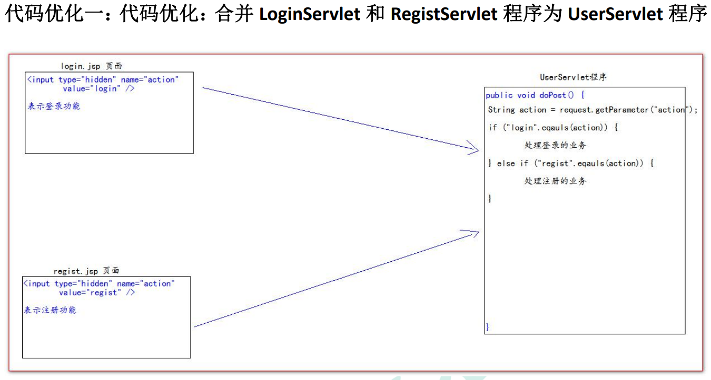

UserServlet 程序：

```java
package com.atguigu.wed;

import com.atguigu.pojo.User;
import com.atguigu.service.UserService;
import com.atguigu.service.impl.UserServiceImpl;

import javax.servlet.ServletException;
import javax.servlet.http.HttpServlet;
import javax.servlet.http.HttpServletRequest;
import javax.servlet.http.HttpServletResponse;
import java.io.IOException;

/* @author  i-s-j-h-d
 * @version 1.0 */
public class UserServlet extends HttpServlet {

    private UserService userService = new UserServiceImpl();

    @Override
    protected void doPost(HttpServletRequest req, HttpServletResponse resp) throws ServletException, IOException {
        String action = req.getParameter("action");

        if("login".equals(action)) {

            login(req, resp);

        } else if ("regist".equals(action)) {

            regist(req, resp);

        }
    }

    @Override
    protected void doGet(HttpServletRequest req, HttpServletResponse resp) throws ServletException, IOException {
        this.doPost(req, resp);
    }

    /**
     * 处理登录
     * @param req
     * @param resp
     * @throws ServletException
     * @throws IOException
     */
    protected void login(HttpServletRequest req, HttpServletResponse resp) throws ServletException, IOException {
        // 1、获取请求的参数
        String username = req.getParameter("username");
        String password = req.getParameter("password");
        // 2、userService.login()登录处理业务
        User loginUser = userService.login(new User(null, username, password, null));
        // 3、根据login()方法返回结果判断登录是否成功
        if (loginUser == null) {
            // 把错误信息，和回显的表单项信息，保存到Request域中
            req.setAttribute("msg", "用户或密码错误");
            req.setAttribute("username", username);
            // 如果等于null，说明登陆失败！
            // 失败跳回登录页面
            req.getRequestDispatcher("/pages/user/login.jsp").forward(req, resp);
        } else {
            // 登陆成功
            // 成功跳到成功页面login_success.html
            System.out.println("失败");
            req.getRequestDispatcher("/pages/user/login_success.jsp").forward(req, resp);
        }
    }

    /**
     * 处理注册
     * @param req
     * @param resp
     * @throws ServletException
     * @throws IOException
     */
    protected void regist(HttpServletRequest req, HttpServletResponse resp) throws ServletException, IOException {
        // 1、获取请求的参数
        String username = req.getParameter("username");
        String password = req.getParameter("password");
        String email = req.getParameter("email");
        String code = req.getParameter("code");
        // 2、检查验证码是否正确 == 写死，要求验证码为：abcde
        if ("abcde".equalsIgnoreCase(code)) {
            // 3.检查用户名是否可用
            if (userService.existsUsername(username)) {
                System.out.println("用户名【" + username + "】已存在");

                // 把回显信息，保存到Request域中
                req.setAttribute("msg", "验证码错误！！！");
                req.setAttribute("username", username);
                req.setAttribute("email", email);

                //  不可用    跳回注册页面
                req.getRequestDispatcher("/pages/user/regist.jsp").forward(req, resp);
            } else {
                //  可用    调用Service保存到数据库，
                userService.registUser(new User(null, username, password, email));
                // 跳到注册成功本面regist_success.html
                req.getRequestDispatcher("/pages/user/regist_success.jsp").forward(req, resp);

                System.out.println("用户名【" + username + "】创建成功");
            }
        } else {
            // 把回显信息，保存到Request域中
            req.setAttribute("msg", "验证码错误！！！");
            req.setAttribute("username", username);
            req.setAttribute("email", email);

            System.out.println("验证码【" + code + "】错误");
            req.getRequestDispatcher("/pages/user/regist.jsp").forward(req, resp);
        }
    }
}
```


#### 优化代码二：使用反射优化大量 else if 代码：

```java
protected void doPost(HttpServletRequest req, HttpServletResponse resp) throws ServletException, IOException {
    String action = req.getParameter("action");

    try {
        // 获取action业务鉴别字符串，获取相应的业务 方法反射对象
        Method method = this.getClass().getDeclaredMethod(action, HttpServletRequest.class, HttpServletResponse.class);

        // 调用目标业务 方法
        method.invoke(this,req,resp);

    } catch (Exception e) {
        e.printStackTrace();
    }
}
```


#### 代码优化三：抽取 BaseServlet 程序


BaseServlet 程序代码：

```java
package com.atguigu.wed;

import javax.servlet.ServletException;
import javax.servlet.http.HttpServlet;
import javax.servlet.http.HttpServletRequest;
import javax.servlet.http.HttpServletResponse;
import java.io.IOException;
import java.lang.reflect.Method;

/* @author  i-s-j-h-d
 * @version 1.0 */
public abstract class BaseServlet extends HttpServlet {

    @Override
    protected void doPost(HttpServletRequest req, HttpServletResponse resp) throws ServletException, IOException {
        String action = req.getParameter("action");

        try {
            // 获取action业务鉴别字符串，获取相应的业务 方法反射对象
            Method method = this.getClass().getDeclaredMethod(action, HttpServletRequest.class, HttpServletResponse.class);

            // 调用目标业务 方法
            method.invoke(this,req,resp);

        } catch (Exception e) {
            e.printStackTrace();
        }
    }

    @Override
    protected void doGet(HttpServletRequest req, HttpServletResponse resp) throws ServletException, IOException {
        this.doPost(req, resp);
    }
}
```


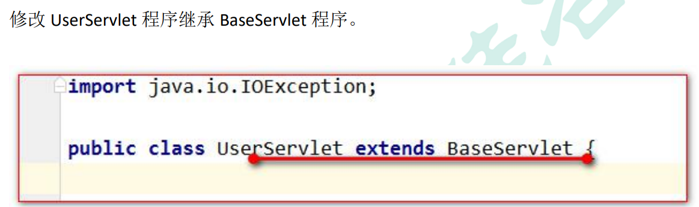


### 数据的封装和抽取 BeanUtils 的使用

BeanUtils 工具类，它可以一次性的把所有请求的参数注入到 JavaBean 中。 

BeanUtils 工具类，经常用于把 Map 中的值注入到 JavaBean 中，或者是对象属性值的拷贝操作。

BeanUtils 它不是 Jdk 的类。而是第三方的工具类。所以需要导包。

​		[commons-beanutils-1.8.0.jar](commons-beanutils-1.8.0.jar)	[commons-logging-1.1.1.jar](commons-logging-1.1.1.jar)

WebUtils 工具类：

```java
package com.atguigu.utils;

import org.apache.commons.beanutils.BeanUtils;

import java.util.Map;

/* @author  i-s-j-h-d
 * @version 1.0 */
public class WebUtils {

    public static <T> T copyParamToBean(Map value, T bean) {
        try {
            System.out.println("注入之前：" + bean);
            /**
             * 把所有请求的参数都注入到user对象中
             */
            BeanUtils.populate(bean, value);
            System.out.println("注入之后：" + bean);
        } catch (Exception e) {
            e.printStackTrace();
        }
        return bean;
    }
}
```


## 书城-第四阶段。使用 EL 表达式修改表单回显


## 第五阶段-图书模块

### MVC  的概念


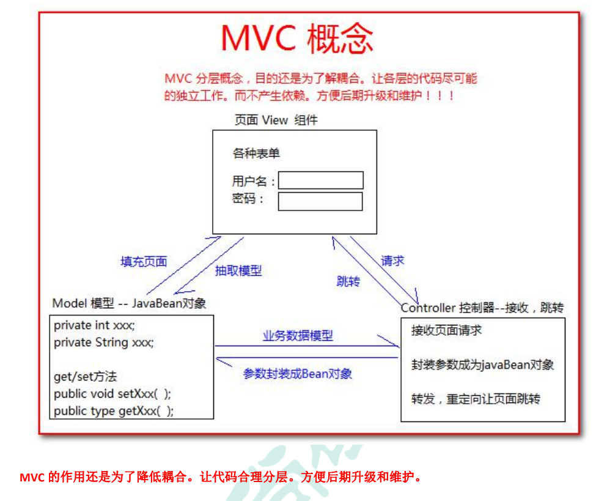


### 图书模块

#### 编写图书模块的数据库表

```mysql
CREATE TABLE t_book(
	`id` INT PRIMARY KEY AUTO_INCREMENT,
	`name` VARCHAR(100),
	`price` DECIMAL(11,2),
	`author` VARCHAR(100),
	`sales` INT,
	`stock` INT,
	`img_path` VARCHAR(200)
)

## 插入初始化测试数据
INSERT INTO t_book(`id` , `name` , `author` , `price` , `sales` , `stock` , `img_path`)
VALUES(NULL , 'java 从入门到放弃' , '国哥' , 80 , 9999 , 9 , 'static/img/default.jpg');
INSERT INTO t_book(`id` , `name` , `author` , `price` , `sales` , `stock` , `img_path`)
VALUES(NULL , '数据结构与算法' , '严敏君' , 78.5 , 6 , 13 , 'static/img/default.jpg');
INSERT INTO t_book(`id` , `name` , `author` , `price` , `sales` , `stock` , `img_path`)
VALUES(NULL , '怎样拐跑别人的媳妇' , '龙伍' , 68, 99999 , 52 , 'static/img/default.jpg');
INSERT INTO t_book(`id` , `name` , `author` , `price` , `sales` , `stock` , `img_path`)
VALUES(NULL , '木虚肉盖饭' , '小胖' , 16, 1000 , 50 , 'static/img/default.jpg');
INSERT INTO t_book(`id` , `name` , `author` , `price` , `sales` , `stock` , `img_path`)
VALUES(NULL , 'C++编程思想' , '刚哥' , 45.5 , 14 , 95 , 'static/img/default.jpg');
INSERT INTO t_book(`id` , `name` , `author` , `price` , `sales` , `stock` , `img_path`)
VALUES(NULL , '蛋炒饭' , '周星星' , 9.9, 12 , 53 , 'static/img/default.jpg');
INSERT INTO t_book(`id` , `name` , `author` , `price` , `sales` , `stock` , `img_path`)
VALUES(NULL , '赌神' , '龙伍' , 66.5, 125 , 535 , 'static/img/default.jpg');
INSERT INTO t_book(`id` , `name` , `author` , `price` , `sales` , `stock` , `img_path`)
VALUES(NULL , 'Java 编程思想' , '阳哥' , 99.5 , 47 , 36 , 'static/img/default.jpg');
INSERT INTO t_book(`id` , `name` , `author` , `price` , `sales` , `stock` , `img_path`)
VALUES(NULL , 'JavaScript 从入门到精通' , '婷姐' , 9.9 , 85 , 95 , 'static/img/default.jpg');
INSERT INTO t_book(`id` , `name` , `author` , `price` , `sales` , `stock` , `img_path`)
VALUES(NULL , 'cocos2d-x 游戏编程入门' , '国哥' , 49, 52 , 62 , 'static/img/default.jpg');
INSERT INTO t_book(`id` , `name` , `author` , `price` , `sales` , `stock` , `img_path`)
VALUES(NULL , 'C 语言程序设计' , '谭浩强' , 28 , 52 , 74 , 'static/img/default.jpg');
INSERT INTO t_book(`id` , `name` , `author` , `price` , `sales` , `stock` , `img_path`)
VALUES(NULL , 'Lua 语言程序设计' , '雷丰阳' , 51.5 , 48 , 82 , 'static/img/default.jpg');
INSERT INTO t_book(`id` , `name` , `author` , `price` , `sales` , `stock` , `img_path`)
VALUES(NULL , '西游记' , '罗贯中' , 12, 19 , 9999 , 'static/img/default.jpg');
INSERT INTO t_book(`id` , `name` , `author` , `price` , `sales` , `stock` , `img_path`)
VALUES(NULL , '水浒传' , '华仔' , 33.05 , 22 , 88 , 'static/img/default.jpg');
INSERT INTO t_book(`id` , `name` , `author` , `price` , `sales` , `stock` , `img_path`)
VALUES(NULL , '操作系统原理' , '刘优' , 133.05 , 122 , 188 , 'static/img/default.jpg');
INSERT INTO t_book(`id` , `name` , `author` , `price` , `sales` , `stock` , `img_path`)
VALUES(NULL , '数据结构 java 版' , '封大神' , 173.15 , 21 , 81 , 'static/img/default.jpg');
INSERT INTO t_book(`id` , `name` , `author` , `price` , `sales` , `stock` , `img_path`)
VALUES(NULL , 'UNIX 高级环境编程' , '乐天' , 99.15 , 210 , 810 , 'static/img/default.jpg');
INSERT INTO t_book(`id` , `name` , `author` , `price` , `sales` , `stock` , `img_path`)
VALUES(NULL , 'javaScript 高级编程' , '国哥' , 69.15 , 210 , 810 , 'static/img/default.jpg');
INSERT INTO t_book(`id` , `name` , `author` , `price` , `sales` , `stock` , `img_path`)
VALUES(NULL , '大话设计模式' , '国哥' , 89.15 , 20 , 10 , 'static/img/default.jpg');
INSERT INTO t_book(`id` , `name` , `author` , `price` , `sales` , `stock` , `img_path`)
VALUES(NULL , '人月神话' , '刚哥' , 88.15 , 20 , 80 , 'static/img/default.jpg');

SELECT * FROM t_book;
```


#### 编写图书模块的 JavaBean

```java
package com.atguigu.pojo;

import java.math.BigDecimal;

/* @author  i-s-j-h-d
 * @version 1.0 */
public class Book {

    private Integer id;
    private String name;
    private String author;
    private BigDecimal price;
    private Integer sales;
    private Integer stock;
    private String imgPath = "static/img/default.jsp";

    public Book() {
    }

    public Book(Integer id, String name, String author, BigDecimal price, Integer sales, Integer stock, String imgPath) {
        this.id = id;
        this.name = name;
        this.author = author;
        this.price = price;
        this.sales = sales;
        this.stock = stock;
        // 要求给定的图书封面图书路径不能为空
        if (imgPath != null && !"".equals(imgPath)) {
            this.imgPath = imgPath;
        }
    }

    @Override
    public String toString() {
        return "Book{" +
                "id=" + id +
                ", name='" + name + '\'' +
                ", author='" + author + '\'' +
                ", price=" + price +
                ", sales=" + sales +
                ", stock=" + stock +
                ", imgPath='" + imgPath + '\'' +
                '}';
    }

    public Integer getId() {
        return id;
    }

    public void setId(Integer id) {
        this.id = id;
    }

    public String getName() {
        return name;
    }

    public void setName(String name) {
        this.name = name;
    }

    public String getAuthor() {
        return author;
    }

    public void setAuthor(String author) {
        this.author = author;
    }

    public BigDecimal getPrice() {
        return price;
    }

    public void setPrice(BigDecimal price) {
        this.price = price;
    }

    public Integer getSales() {
        return sales;
    }

    public void setSales(Integer sales) {
        this.sales = sales;
    }

    public Integer getStock() {
        return stock;
    }

    public void setStock(Integer stock) {
        this.stock = stock;
    }

    public String getImgPath() {
        return imgPath;
    }

    public void setImgPath(String imgPath) {
        this.imgPath = imgPath;
    }
}
```


#### 编写图书模块的 Dao 和测试 Dao

Dao 接口

```java
package com.atguigu.dao;

import com.atguigu.pojo.Book;

import java.util.List;

/* @author  i-s-j-h-d
 * @version 1.0 */
public interface BookDao {
    public int addBook(Book book);
    public int deleteBookById(Integer id);
    public int updateBook(Book book);
    public Book queryBookById(Integer id);
    public List<Book> queryBooks();
}
```


BookDaolmpl 实现类：

```java
package com.atguigu.dao.impl;

import com.atguigu.dao.BookDao;
import com.atguigu.pojo.Book;

import java.util.List;

/* @author  i-s-j-h-d
 * @version 1.0 */
public class BookDaoImpl extends BaseDao implements BookDao {
    @Override
    public int addBook(Book book) {

        String sql = "insert into t_book(`name`, `author`, `price`, `sales`, `stock`, `img_path`) values (?,?,?,?,?,?)";

        return update(sql, book.getName(), book.getAuthor(), book.getPrice(), book.getSales(), book.getStock(), book.getImgPath());
    }

    @Override
    public int deleteBookById(Integer id) {
        String sql = "delete from t_book where id = ?";
        return update(sql, id);
    }

    @Override
    public int updateBook(Book book) {
        String sql = "update t_book set `name`=?,`author`=?,`price`=?,`sales`=?,`stock`=?,`img_path`=? where id = ?";
        return update(sql,book.getName(),book.getAuthor(),book.getPrice(),book.getSales(),book.getStock(),book.getImgPath(),book.getId());
    }

    @Override
    public Book queryBookById(Integer id) {
        String sql = "select `id` , `name` , `author` , `price` , `sales` , `stock` , `img_path` imgPath from t_book where id = ?";
        return queryForOne(Book.class, sql,id);
    }

    @Override
    public List<Book> queryBooks() {
        String sql = "select `id` , `name` , `author` , `price` , `sales` , `stock` , `img_path` imgPath from t_book";
        return queryForList(Book.class, sql);
    }
}
```


BookDao 的测试：

```java
package com.atguigu.test;

import com.atguigu.dao.BookDao;
import com.atguigu.dao.impl.BookDaoImpl;
import com.atguigu.pojo.Book;
import org.junit.Test;

import java.math.BigDecimal;

import static org.junit.Assert.*;

/* @author  i-s-j-h-d
 * @version 1.0 */public class BookDaoTest {

     private BookDao bookDao = new BookDaoImpl();

    @Test
    public void addBook() {
        bookDao.addBook(new Book(null, "轻音少女", "平泽唯",
                new BigDecimal(1888), 111000, 0, null));
    }

    @Test
    public void deleteBookById() {
        bookDao.deleteBookById(21);
    }

    @Test
    public void updateBook() {
        bookDao.updateBook(new Book(21, "轻音少女", "秋山澪",
                new BigDecimal(1888), 111000, 0, null));
    }

    @Test
    public void queryBookById() {
        System.out.println(bookDao.queryBookById(22));
    }

    @Test
    public void queryBooks() {
        for (Book queryBook : bookDao.queryBooks()) {
            System.out.println(queryBook);
        }
    }
}
```


#### 编写图书模块的 Service 和测试 Service

BookService接口：

```java
package com.atguigu.service;

import com.atguigu.pojo.Book;

import java.util.List;

/* @author  i-s-j-h-d
 * @version 1.0 */
public interface BookService {

    public void addBook(Book book);
    public void deleteBookById(Integer id);
    public void updateBook(Book book);
    public Book queryBookById(Integer id);
    public List<Book> queryBooks();
}
```


BookServiceImpl 实现类：

```java
package com.atguigu.service.impl;

import com.atguigu.dao.BookDao;
import com.atguigu.dao.impl.BookDaoImpl;
import com.atguigu.pojo.Book;
import com.atguigu.service.BookService;

import java.util.List;

/* @author  i-s-j-h-d
 * @version 1.0 */
public class BookServiceImpl implements BookService {

    private BookDao bookDao = new BookDaoImpl();

    @Override
    public void addBook(Book book) {
        bookDao.addBook(book);
    }

    @Override
    public void deleteBookById(Integer id) {
        bookDao.deleteBookById(id);
    }

    @Override
    public void updateBook(Book book) {
        bookDao.updateBook(book);
    }

    @Override
    public Book queryBookById(Integer id) {
        return bookDao.queryBookById(id);
    }

    @Override
    public List<Book> queryBooks() {
        return bookDao.queryBooks();
    }
}
```


BookService 的测试：

```java
package com.atguigu.test;

import com.atguigu.pojo.Book;
import com.atguigu.service.BookService;
import com.atguigu.service.impl.BookServiceImpl;
import org.junit.Test;

import java.math.BigDecimal;

import static org.junit.Assert.*;

/* @author  i-s-j-h-d
 * @version 1.0 */public class BookServiceTest {

     private BookService bookService = new BookServiceImpl();

    @Test
    public void addBook() {
        bookService.addBook(new Book(null,"星际牛仔", "1125", new BigDecimal(1000000),
                100000000, 0, null));
    }

    @Test
    public void deleteBookById() {
        bookService.deleteBookById(22);
    }

    @Test
    public void updateBook() {
        bookService.updateBook(new Book(23,"星际牛仔", "1100", new BigDecimal(999999),
                10, 111110, null));
    }

    @Test
    public void queryBookById() {
        System.out.println(bookService.queryBookById(23));
    }

    @Test
    public void queryBooks() {
        for (Book queryBook : bookService.queryBooks()) {
            System.out.println(queryBook);
        }
    }
}
```


#### 编写图书模块的 Web 层，和页面联调测试

##### 图书列表功能的实现

1. 图解列表功能流程：


2. BookServlet 程序中添加 list 方法

```java
protected void list(HttpServletRequest req, HttpServletResponse resp) throws ServletException, IOException {
    // 1.通过BookService查询全部图书
    List<Book> books = bookService.queryBooks();
    // 2.把全部图书保存到Request域中
    req.setAttribute("books", books);
    // 3.请求转发到/pages/manager/book_manager.jsp页面
    req.getRequestDispatcher("/pages/manager/book_manager.jsp").forward(req,resp);
}
```


3. 修改【图书管理】请求地址


4. 修改 pages/manager/book_manager.jsp 页面的数据遍历输出

   ```jsp
   <%--
   Created by IntelliJ IDEA.
   User: 34782
   Date: 2023/9/27
   Time: 14:23
   To change this template use File | Settings | File Templates.
   --%>
   <%@ taglib prefix="c" uri="http://java.sun.com/jsp/jstl/core" %>
   <%@ page contentType="text/html;charset=UTF-8" language="java" %>
   <html>
   <head>
   <meta charset="UTF-8">
   <title>图书管理</title>
   
      <%-- 静态包含 base标签，css样式，jQuery文件 --%>
      <%@include file="/pages/common/head.jsp"%>
   
   </head>
   <body>
      
      <div id="header">
            
            <span class="wel_word">图书管理系统</span>
   
         <%-- 静态包含 manager管理模块的菜单 --%>
         <%@include file="/pages/common/manager_menu.jsp"%>
   
      </div>
      
      <div id="main">
         <table>
            <tr>
               <td>名称</td>
               <td>价格</td>
               <td>作者</td>
               <td>销量</td>
               <td>库存</td>
               <td colspan="2">操作</td>
            </tr>
   
            <c:forEach items="${requestScope.books}" var="book">
               <tr>
                  <td>${book.name}</td>
                  <td>${book.price}</td>
                  <td>${book.author}</td>
                  <td>${book.sales}</td>
                  <td>${book.stock}</td>
                  <td><a href="book_edit.jsp">修改</a></td>
                  <td><a href="#">删除</a></td>
               </tr>
            </c:forEach>
   
            
            <tr>
               <td></td>
               <td></td>
               <td></td>
               <td></td>
               <td></td>
               <td></td>
               <td><a href="book_edit.jsp">添加图书</a></td>
            </tr>  
         </table>
      </div>
   
      <%-- 静态包含页脚内容 --%>
      <%@include file="/pages/common/footer.jsp"%>
   
   </body>
   </html>
   ```


##### 前后台的简单介绍


##### 添加图书功能的实现

###### 添加图书流程细节


###### 问题说明：表单重复提交：

当用户提交完请求，浏览器会记录下最后一次请求的全部信息。当用户按下功能键 F5，就会发起浏览器记录的最后一次 请求。

###### BookServlet 程序中添加 add 方法

```java
protected void add(HttpServletRequest req, HttpServletResponse resp) throws ServletException, IOException {
    // 1.获取请求的参数==封装成为 Book 对象
    Book book = WebUtils.copyParamToBean(req.getParameterMap(), new Book());
    // 2、调用 BookService.addBook()保存图书
    bookService.addBook(book);
    // 3、跳转图书列表页面
        // /manager/bookServlet?action=list
        // req.getRequestDispatcher("/manager/bookServlet?action=list").forward(req, resp)
    resp.sendRedirect(req.getContextPath() + "/manager/bookServlet?action=list");
}
```


###### 修改 book_edit.jsp 页面

```jsp
<%--
Created by IntelliJ IDEA.
User: 34782
Date: 2023/9/27
Time: 14:23
To change this template use File | Settings | File Templates.
--%>
<%@ page contentType="text/html;charset=UTF-8" language="java" %>
<html>
<head>
<meta charset="UTF-8">
<title>编辑图书</title>

   <%-- 静态包含 base标签，css样式，jQuery文件 --%>
   <%@include file="/pages/common/head.jsp"%>

   <style type="text/css">
   h1 {
      text-align: center;
      margin-top: 200px;
   }
   
   h1 a {
      color:red;
   }
   
   input {
      text-align: center;
   }
</style>
</head>
<body>
      <div id="header">
         
         <span class="wel_word">编辑图书</span>

         <%-- 静态包含 manager管理模块的菜单 --%>
         <%@include file="/pages/common/manager_menu.jsp"%>

      </div>
      
      <div id="main">
         <form action="manager/bookServlet" method="get">
            <input type="hidden" name="action" value="add" />
            <table>
               <tr>
                  <td>名称</td>
                  <td>价格</td>
                  <td>作者</td>
                  <td>销量</td>
                  <td>库存</td>
                  <td colspan="2">操作</td>
               </tr>     
               <tr>
                  <td><input name="name" type="text" value="时间简史"/></td>
                  <td><input name="price" type="text" value="30.00"/></td>
                  <td><input name="author" type="text" value="霍金"/></td>
                  <td><input name="sales" type="text" value="200"/></td>
                  <td><input name="stock" type="text" value="300"/></td>
                  <td><input type="submit" value="提交"/></td>
               </tr>  
            </table>
         </form>
         
   
      </div>


      <%-- 静态包含页脚内容 --%>
      <%@include file="/pages/common/footer.jsp"%>

</body>
</html>
```


##### 删除图书功能的实现

###### 图解删除流程


###### BookServlet 程序中的 delete 方法：

```java
protected void delete(HttpServletRequest req, HttpServletResponse resp) throws ServletException, IOException {
    // 1、获取请求的参数 id，图书编程
    int id = Integer.parseInt(req.getParameter("id"));
    // 2、调用 bookService.deleteBookById();删除图书
    bookService.deleteBookById(id);
    // 3、重定向回图书列表管理页面
        // /book/manager/bookServlet?action=list
    resp.sendRedirect(req.getContextPath() + "/manager/bookServlet?action=list");
}
```


###### 修改删除的连接地址：


###### 给删除添加确认提示操作：

```jsp
<script type="text/javascript">
   $(function () {
      // 给删除的 a 标签绑定单击事件，用于删除的确认提示操作
      $("a.deleteClass").click(function () {
         // 在事件的 function 函数中，有一个 this 对象。这个 this 对象，是当前正在响应事件的 dom 对象。
         /**
          * confirm 是确认提示框函数
          * 参数是它的提示内容
          * 它有两个按钮，一个确认，一个是取消。
          * 返回 true 表示点击了，确认，返回 false 表示点击取消。
          */
         return confirm("你确定要删除【" + $(this).parent().parent().find("td:first").text() +"】？");
         // return false // 阻止元素的默认行为===不提交请求
      })
   })
</script>
```


##### 修改图书功能的实现

###### 图解修改图书细节：


###### 更改【修改】的请求地址：


###### BookServlet 程序中添加 getBook 方法：

```java
protected void getBook(HttpServletRequest req, HttpServletResponse resp) throws ServletException, IOException {
    // 1.获取请求的参数图书编号
    int id = Integer.parseInt(req.getParameter("id"));
    // 2.调用bookService.queryBookById 查询图书
    Book book = bookService.queryBookById(id);
    // 3.保存到图书到Request域中
    req.setAttribute("book", book);
    // 4.请求转发到。pages/manager/book_edit.jsp页面
    req.getRequestDispatcher("/pages/manager/book_edit.jsp").forward(req,resp);
}
```


###### 在 book_edit.jsp 页面中显示修改的数据

```jsp
<div id="main">
   <form action="manager/bookServlet" method="get">
      <input type="hidden" name="action" value="add" />
      <table>
         <tr>
            <td>名称</td>
            <td>价格</td>
            <td>作者</td>
            <td>销量</td>
            <td>库存</td>
            <td colspan="2">操作</td>
         </tr>     
         <tr>
            <td><input name="name" type="text" value="${requestScope.book.name}"/></td>
            <td><input name="price" type="text" value="${requestScope.book.price}"/></td>
            <td><input name="author" type="text" value="${requestScope.book.author}"/></td>
            <td><input name="sales" type="text" value="${requestScope.book.sales}"/></td>
            <td><input name="stock" type="text" value="${requestScope.book.stock}"/></td>
            <td><input type="submit" value="提交"/></td>
         </tr>  
      </table>
   </form>
   

</div>
```


###### 在 BookServlet 程序中添加 update 方法：

```java
protected void update(HttpServletRequest req, HttpServletResponse resp) throws ServletException, IOException {
    // 1、获取请求的参数==封装成为 Book 对象
    Book book = WebUtils.copyParamToBean(req.getParameterMap(), new Book());
    // 2、调用 BookService.updateBook( book );修改图书
    bookService.updateBook(book);
    // 3、重定向回图书列表管理页面
    //    地址：/工程名/manager/bookServlet?action=list
    resp.sendRedirect(req.getContextPath() + "/manager/bookServlet?action=list");
}
```


###### 解决 book_edit.jsp 页面，即要实现添加，又要实现修改操作。


## 第五阶段-图书分页

### 图书分页

#### 分页模块的分析


#### 分页模型 Page 的抽取（当前页数，总页数，总记录数， 当前页数据，每页记录数）

```java
package com.atguigu.pojo;

import java.util.List;

/* @author  i-s-j-h-d
 * @version 1.0 */

/**
 * Page是分页的模型对象
 * @param <T> 是具体的模块的javaBean类
 */
public class Page<T> {
    private static final Integer PAGE_SIZE = 4;

    // 当前页码
    private Integer pageNo;
    // 总页码
    private Integer pageTotal;
    // 当前页显示数量
    private Integer pageSize = PAGE_SIZE;
    // 总记录数
    private Integer pageTotalCount;
    // 当前页数据
    private List<T> items;

    public Page() {
    }

    @Override
    public String toString() {
        return "Page{" +
                "pageNo=" + pageNo +
                ", pageTotal=" + pageTotal +
                ", pageSize=" + pageSize +
                ", pageTotalCount=" + pageTotalCount +
                ", items=" + items +
                '}';
    }

    public Page(Integer pageNo, Integer pageTotal, Integer pageTotalCount, List<T> items) {
        this.pageNo = pageNo;
        this.pageTotal = pageTotal;
        this.pageTotalCount = pageTotalCount;
        this.items = items;
    }

    public Integer getPageNo() {
        return pageNo;
    }

    public void setPageNo(Integer pageNo) {
        this.pageNo = pageNo;
    }

    public Integer getPageTotal() {
        return pageTotal;
    }

    public void setPageTotal(Integer pageTotal) {
        this.pageTotal = pageTotal;
    }

    public Integer getPageTotalCount() {
        return pageTotalCount;
    }

    public void setPageTotalCount(Integer pageTotalCount) {
        this.pageTotalCount = pageTotalCount;
    }

    public List<T> getItems() {
        return items;
    }

    public void setItems(List<T> items) {
        this.items = items;
    }
}
```


#### 分页的初步实现

BookDaoImpl 代码：

```java
@Override
public Integer queryForPageTotalCount() {
    String sql = "select count(*) from t_book";
    Number count = (Number) queryForSingleValue(sql);
    return count.intValue();
}

@Override
public List<Book> queryForPageItems(int begin, int pageSize) {
    String sql = "select `id` , `name` , `author` , `price` , `sales` , `stock` , `img_path` imgPath from t_book limit ?,?";
    return queryForList(Book.class,sql,begin,pageSize);
}
```


BookServiceImpl 代码：

```java
@Override
public Page<Book> page(int pageNo, int pageSize) {
    Page<Book> page = new Page<Book>();
    // 设置当前页码
    page.setPageNo(pageNo);

    // 设置每页显示的数量
    page.setPageSize(pageSize);

    // 求总记录数
    Integer pageTotalCount = bookDao.queryForPageTotalCount();

    // 设置总记录数
    page.setPageTotalCount(pageTotalCount);

    // 求总页码
    Integer pageTotal = pageTotalCount / pageSize;
    if(pageTotalCount % pageSize > 0) {
        pageTotal += 1;
    }

    // 设置总页码
    page.setPageTotal(pageTotal);

    // 求当前页数据的开始索引
    int begin = (page.getPageNo() - 1) * pageSize;
    // 求当前页数据
    List<Book> items = bookDao.queryForPageItems(begin, pageSize);
    // 设置当前页数据
    page.setItems(items);


    return page;
}
```


BookServlet 程序的代码：

```java
/**
 * 处理分页功能
 * @param req
 * @param resp
 * @throws ServletException
 * @throws IOException
 */
protected void page(HttpServletRequest req, HttpServletResponse resp) throws ServletException, IOException {
    // 1.获取请求的参数 pageNo 和 pageSize
    int pageNo = WebUtils.parseInt(req.getParameter("pageNo"), 1);
    int pageSize = WebUtils.parseInt(req.getParameter("pageSize"), Page.PAGE_SIZE);
    // 2.调用BookService.page(pageNo,pageSize)：Page对象
    Page<Book> page = bookService.page(pageNo, pageSize);
    // 3.保存page对象到Request域中
    req.setAttribute("page", page);
    // 4.请求转发到pages/manager/book_manager.jsp页面
    req.getRequestDispatcher("/pages/manager/book_manager.jsp").forward(req, resp);

}
```


manager_menu.jsp 中【图书管理】请求地址的修改：


book_manager.jsp 修改：

```jsp
<%--
Created by IntelliJ IDEA.
User: 34782
Date: 2023/9/27
Time: 14:23
To change this template use File | Settings | File Templates.
--%>
<%@ taglib prefix="c" uri="http://java.sun.com/jsp/jstl/core" %>
<%@ page contentType="text/html;charset=UTF-8" language="java" %>
<html>
<head>
<meta charset="UTF-8">
<title>图书管理</title>

   <%-- 静态包含 base标签，css样式，jQuery文件 --%>
   <%@include file="/pages/common/head.jsp"%>

</head>
<body>
   
   <div id="header">
         
         <span class="wel_word">图书管理系统</span>

      <%-- 静态包含 manager管理模块的菜单 --%>
      <%@include file="/pages/common/manager_menu.jsp"%>
      <script type="text/javascript">
         $(function () {
            // 给删除的 a 标签绑定单击事件，用于删除的确认提示操作
            $("a.deleteClass").click(function () {
               // 在事件的 function 函数中，有一个 this 对象。这个 this 对象，是当前正在响应事件的 dom 对象。
               /**
                * confirm 是确认提示框函数
                * 参数是它的提示内容
                * 它有两个按钮，一个确认，一个是取消。
                * 返回 true 表示点击了，确认，返回 false 表示点击取消。
                */
               return confirm("你确定要删除【" + $(this).parent().parent().find("td:first").text() +"】？");
               // return false // 阻止元素的默认行为===不提交请求
            })
         })
      </script>

   </div>
   
   <div id="main">
      <table>
         <tr>
            <td>名称</td>
            <td>价格</td>
            <td>作者</td>
            <td>销量</td>
            <td>库存</td>
            <td colspan="2">操作</td>
         </tr>

         <c:forEach items="${requestScope.page.items}" var="book">
            <tr>
               <td>${book.name}</td>
               <td>${book.price}</td>
               <td>${book.author}</td>
               <td>${book.sales}</td>
               <td>${book.stock}</td>
               <td><a href="manager/bookServlet?action=getBook&id=${book.id}&method=update">修改</a></td>
               <td><a class="deleteClass" href="manager/bookServlet?action=delete&id=${book.id}">删除</a></td>
            </tr>
         </c:forEach>

         
         <tr>
            <td></td>
            <td></td>
            <td></td>
            <td></td>
            <td></td>
            <td></td>
            <td><a href="pages/manager/book_edit.jsp?method=add">添加图书</a></td>
         </tr>  
      </table>
      <div id="page_nav">
         <a href="#">首页</a>
         <a href="#">上一页</a>
         <a href="#">3</a>
         【${requestScope.page.pageNo}】
         <a href="#">5</a>
         <a href="#">下一页</a>
         <a href="#">末页</a>
         共${requestScope.page.pageTotal}页，${requestScope.page.pageTotalCount}条记录
         到第<input value="4" name="pn" id="pn_input"/>页
         <input type="button" value="确定">
      </div>
   </div>

   <%-- 静态包含页脚内容 --%>
   <%@include file="/pages/common/footer.jsp"%>

</body>
</html>
```


#### 首页、上一页、下一页、末页实现

```jsp
<div id="page_nav">
   <%--大于首页，才显示--%>
   <c:if test="${requestScope.page.pageNo > 1}">
      <a href="manager/bookServlet?action=page&pageNo=1">首页</a>
      <a href="manager/bookServlet?action=page&pageNo=${requestScope.page.pageNo-1}">上一页</a>
   </c:if>

   <a href="#">3</a>
   【${requestScope.page.pageNo}】
   <a href="#">5</a>
   <%-- 如果已经 是最后一页，则不显示下一页，末页 --%>
   <c:if test="${requestScope.page.pageNo < requestScope.page.pageTotal}">
      <a href="manager/bookServlet?action=page&pageNo=${requestScope.page.pageNo+1}">下一页</a>
      <a href="manager/bookServlet?action=page&pageNo=${requestScope.page.pageTotal}">末页</a>
   </c:if>

   共${requestScope.page.pageTotal}页，${requestScope.page.pageTotalCount}条记录
   到第<input value="4" name="pn" id="pn_input"/>页
   <input type="button" value="确定">
</div>
```


#### 分页模块中跳转到指定页数功能实现

```jsp
<div id="page_nav">
   <%--大于首页，才显示--%>
   <c:if test="${requestScope.page.pageNo > 1}">
      <a href="manager/bookServlet?action=page&pageNo=1">首页</a>
      <a href="manager/bookServlet?action=page&pageNo=${requestScope.page.pageNo-1}">上一页</a>
   </c:if>

   <a href="#">3</a>
   【${requestScope.page.pageNo}】
   <a href="#">5</a>
   <%-- 如果已经 是最后一页，则不显示下一页，末页 --%>
   <c:if test="${requestScope.page.pageNo < requestScope.page.pageTotal}">
      <a href="manager/bookServlet?action=page&pageNo=${requestScope.page.pageNo+1}">下一页</a>
      <a href="manager/bookServlet?action=page&pageNo=${requestScope.page.pageTotal}">末页</a>
   </c:if>

   共${requestScope.page.pageTotal}页，${requestScope.page.pageTotalCount}条记录
   到第<input value="${param.pageNo}" name="pn" id="pn_input"/>页
   <input id="searchPageBtn" type="button" value="确定">

      <script type="text/javascript">
         $(function () {
            // 跳转指定的页码
            $("#searchPageBtn").click(function () {
                var pageNo = $("#pn_input").val();
               // javaScript 语言中提供了一个 location 地址栏对象
               // 它有一个属性叫 href.它可以获取浏览器地址栏中的地址
               // href 属性可读，可写
               location.href = "${pageScope.basePath}manager/bookServlet?action=page&pageNo=" + pageNo;
            })
         })
      </script>
</div>
```


Page 对象中的修改：

```java
public void setPageNo(Integer pageNo) {
        /* 数据边界的有效检查 */
        if (pageNo < 1) {
            pageNo = 1;
        }
        if (pageNo > pageTotal) {
            pageNo = pageTotal;
        }
        this.pageNo = pageNo;
    }
```


#### 分页模块中，页码 1,2,【3】,4,5 的显示，要显示 5 个页 码，并且页码可以点击跳转.

需求：显示 5 个连续的页码，而且当前页码在中间。除了当前页码之外，每个页码都可以点击跳到指定页。


```jsp
<%-- 页码输出的开始 --%>
   <c:choose>
      <%--情况 1：如果总页码小于等于 5 的情况，页码的范围是：1-总页码--%>
      <c:when test="${ requestScope.page.pageTotal <= 5 }">
         <c:set var="begin" value="1"/>
         <c:set var="end" value="${requestScope.page.pageTotal}"/>
      </c:when>
      <%--情况 2：总页码大于 5 的情况--%>
      <c:when test="${requestScope.page.pageTotal > 5}">
         <c:choose>
            <%--小情况 1：当前页码为前面 3 个：1，2，3 的情况，页码范围是：1-5.--%>
            <c:when test="${requestScope.page.pageNo <= 3}">
               <c:set var="begin" value="1"/>
               <c:set var="end" value="5"/>
            </c:when>
            <%--小情况 2：当前页码为最后 3 个，8，9，10，页码范围是：总页码减 4 - 总页码--%>
            <c:when test="${requestScope.page.pageNo > requestScope.page.pageTotal-3}">
               <c:set var="begin" value="${requestScope.page.pageTotal-4}"/>
               <c:set var="end" value="${requestScope.page.pageTotal}"/>
            </c:when>
            <%--小情况 3：4，5，6，7，页码范围是：当前页码减 2 - 当前页码加 2--%>
            <c:otherwise>
               <c:set var="begin" value="${requestScope.page.pageNo-2}"/>
               <c:set var="end" value="${requestScope.page.pageNo+2}"/>
            </c:otherwise>
         </c:choose>
      </c:when>
   </c:choose>
   <c:forEach begin="${begin}" end="${end}" var="i">
      <c:if test="${i == requestScope.page.pageNo}">
         【${i}】
      </c:if>
      <c:if test="${i != requestScope.page.pageNo}">
         <a href="manager/bookServlet?action=page&pageNo=${i}">${i}</a>
      </c:if>
   </c:forEach>
<%-- 页码输出的结束 --%>
```


####  修改分页后，增加，删除，修改图书信息的回显页面


3、在服务器重定向的时候，获取当前页码追加上进行跳转

```java
protected void update(HttpServletRequest req, HttpServletResponse resp) throws ServletException,
IOException {
// 1、获取请求的参数==封装成为 Book 对象
Book book = WebUtils.copyParamToBean(req.getParameterMap(),new Book());
// 2、调用 BookService.updateBook( book );修改图书
bookService.updateBook(book);
// 3、重定向回图书列表管理页面
// 地址：/工程名/manager/bookServlet?action=list
resp.sendRedirect(req.getContextPath() + "/manager/bookServlet?action=page&pageNo=" +
req.getParameter("pageNo"));
}
```


### 首页 index.jsp 的跳转


### 分页条的抽取

#### 抽取分页条中请求地址为 url 变量

1. 在 page 对象中添加 url 属性

```java
/**
* Page 是分页的模型对象
* @param <T> 是具体的模块的 javaBean 类
*/
public class Page<T> {
    public static final Integer PAGE_SIZE = 4;
    // 当前页码
    private Integer pageNo;
    // 总页码
    private Integer pageTotal;	
    // 当前页显示数量
    private Integer pageSize = PAGE_SIZE;
    // 总记录数
    private Integer pageTotalCount;
    // 当前页数据
    private List<T> items;
    // 分页条的请求地址
    private String url
```


2.  在 Servlet 程序的 page 分页方法中设置 url 的分页请求地址


3. 修改分页条中请求地址为 url 变量输出,并抽取一个单独的 jsp 页面

```jsp
<%-- 分页条的开始 --%>
<div id="page_nav">
    <%--大于首页，才显示--%>
    <c:if test="${requestScope.page.pageNo > 1}">
        <a href="${requestScope.page.url}&pageNo=1">首页</a>
        <a href="${requestScope.page.url}&pageNo=${requestScope.page.pageNo-1}">上一页</a>
    </c:if>

    <%-- 页码输出的开始 --%>
    <c:choose>
        <%--情况 1：如果总页码小于等于 5 的情况，页码的范围是：1-总页码--%>
        <c:when test="${ requestScope.page.pageTotal <= 5 }">
            <c:set var="begin" value="1"/>
            <c:set var="end" value="${requestScope.page.pageTotal}"/>
        </c:when>
        <%--情况 2：总页码大于 5 的情况--%>
        <c:when test="${requestScope.page.pageTotal > 5}">
            <c:choose>
                <%--小情况 1：当前页码为前面 3 个：1，2，3 的情况，页码范围是：1-5.--%>
                <c:when test="${requestScope.page.pageNo <= 3}">
                    <c:set var="begin" value="1"/>
                    <c:set var="end" value="5"/>
                </c:when>
                <%--小情况 2：当前页码为最后 3 个，8，9，10，页码范围是：总页码减 4 - 总页码--%>
                <c:when test="${requestScope.page.pageNo > requestScope.page.pageTotal-3}">
                    <c:set var="begin" value="${requestScope.page.pageTotal-4}"/>
                    <c:set var="end" value="${requestScope.page.pageTotal}"/>
                </c:when>
                <%--小情况 3：4，5，6，7，页码范围是：当前页码减 2 - 当前页码加 2--%>
                <c:otherwise>
                    <c:set var="begin" value="${requestScope.page.pageNo-2}"/>
                    <c:set var="end" value="${requestScope.page.pageNo+2}"/>
                </c:otherwise>
            </c:choose>
        </c:when>
    </c:choose>
    <c:forEach begin="${begin}" end="${end}" var="i">
        <c:if test="${i == requestScope.page.pageNo}">
            【${i}】
        </c:if>
        <c:if test="${i != requestScope.page.pageNo}">
            <a href="${requestScope.page.url}&pageNo=${i}">${i}</a>
        </c:if>
    </c:forEach>
    <%-- 页码输出的结束 --%>


    【${requestScope.page.pageNo}】
    <%-- 如果已经 是最后一页，则不显示下一页，末页 --%>
    <c:if test="${requestScope.page.pageNo < requestScope.page.pageTotal}">
        <a href="${requestScope.page.url}&pageNo=${requestScope.page.pageNo+1}">下一页</a>
        <a href="${requestScope.page.url}&pageNo=${requestScope.page.pageTotal}">末页</a>
    </c:if>

    共${requestScope.page.pageTotal}页，${requestScope.page.pageTotalCount}条记录
    到第<input value="${param.pageNo}" name="pn" id="pn_input"/>页
    <input id="searchPageBtn" type="button" value="确定">

    <script type="text/javascript">
        $(function () {
            // 跳转指定的页码
            $("#searchPageBtn").click(function () {
                var pageNo = $("#pn_input").val();
                // javaScript 语言中提供了一个 location 地址栏对象
                // 它有一个属性叫 href.它可以获取浏览器地址栏中的地址
                // href 属性可读，可写
                location.href = "${pageScope.basePath}${requestScope.page.url}&pageNo=" + pageNo;
            })
        })
    </script>
</div>
<%-- 分页条的结束 --%>
```


### 首页价格搜索


## Cookie

### 什么是 Cookie ?


### 如何创建 Cookie


```java
protected void createCookie(HttpServletRequest req, HttpServletResponse resp) throws ServletException, IOException {
        // 1.创建Cookie对象
        Cookie cookie = new Cookie("key1", "value1");
        // 2.通知客户端保存Cookie
        resp.addCookie(cookie);

        resp.getWriter().write("Cookie创建成功");
    }
```


### 服务器如何获取 Cookie


Cookie 的工具类：

```java
package com.atguigu.util;

import javax.servlet.http.Cookie;

/* @author  i-s-j-h-d
 * @version 1.0 */
public class CookieUtils {

    /**
    * 查找指定名称的 Cookie 对象
    * @param name
    * @param cookies
    * @return
    */
    public static Cookie findCookie(String name, Cookie[] cookies){
        if (name == null || cookies == null || cookies.length == 0) {
            return null;
        }

        for (Cookie cookie : cookies) {
            if (name.equals(cookie.getName())) {
                return cookie;
            }
        }

        return null;
    }
}
```


Servlet 程序中的代码：

```java
protected void getCookie(HttpServletRequest req, HttpServletResponse resp) throws ServletException, IOException {
    Cookie[] cookies = req.getCookies();

    for (Cookie cookie : cookies) {
        // getName 方法返回 Cookie 的 key（名）
        // getValue 方法返回 Cookie 的 value 值
        resp.getWriter().write("Cookie[" + cookie.getName() + "=" + cookie.getValue() + "]<br/>");
    }

    Cookie iWantCookie = CookieUtils.findCookie("key1", cookies);

    // 如果不等于 null，说明赋过值，也就是找到了需要的 Cookie
    if (iWantCookie != null) {
        resp.getWriter().write("找到了需要的 Cookie");
    }
}
```


### Cookie 值的修改

> 方案一： 
>
> ​			1、先创建一个要修改的同名（指的就是 key）的 Cookie 对象 
>
> ​			2、在构造器，同时赋于新的 Cookie 值。
>
> ​			3、调用 response.addCookie( Cookie )

```java
protected void updateCookie1(HttpServletRequest req, HttpServletResponse resp) throws ServletException, IOException {
//        方案一：
//            1、先创建一个要修改的同名（指的就是 key）的 Cookie 对象
//            2、在构造器，同时赋于新的 Cookie 值。
        Cookie cookie = new Cookie("key1", "newValue1");
//            3、调用 response.addCookie( Cookie );
        resp.addCookie(cookie);

    }
```


> 方案二：
>
> ​			1、先查找到需要修改的 Cookie 对象 
>
> ​			2、调用 setValue()方法赋于新的 Cookie 值。 
>
> ​			3、调用 response.addCookie()通知客户端保存修改

```java
protected void updateCookie2(HttpServletRequest req, HttpServletResponse resp) throws ServletException, IOException {
//        方案二：
//            1、先查找到需要修改的 Cookie 对象
        Cookie cookie = CookieUtils.findCookie("key1", req.getCookies());
        if (cookie != null) {
//            2、调用 setValue()方法赋于新的 Cookie 值。
            cookie.setValue("newValue2");
//            3、调用 response.addCookie()通知客户端保存修改
            resp.addCookie(cookie);
        }

    }
```


### 浏览器查看 Cookie：

谷歌浏览器如何查看 Cookie：

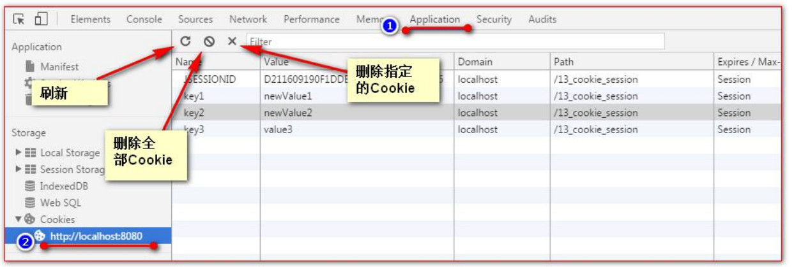

火狐浏览器如何查看 Cookie：


###  Cookie 生命控制

Cookie 的生命控制指的是如何管理 Cookie 什么时候被销毁（删除） 

setMaxAge() 

​		正数，表示在指定的秒数后过期 

​		负数，表示浏览器一关，Cookie 就会被删除（默认值是-1） 

​		零，表示马上删除 Cooki

```java
/**
 *  设置存活 1 分钟的 Cooie
 * @param req
 * @param resp
 * @throws ServletException
 * @throws IOException
 */
protected void life3600(HttpServletRequest req, HttpServletResponse resp) throws ServletException, IOException {
    Cookie cookie = new Cookie("life3600", "life3600");
    cookie.setMaxAge(60); // 设置 Cookie 一小时之后被删除。无效
    resp.addCookie(cookie);
    resp.getWriter().write("已经创建了一个存活一分钟的 Cookie");
}

/**
 *  马上删除一个 Cookie
 * @param req
 * @param resp
 * @throws ServletException
 * @throws IOException
 */
protected void deleteNow(HttpServletRequest req, HttpServletResponse resp) throws ServletException, IOException {
    // 先找到你要删除的Cookie对象
    Cookie cookie = CookieUtils.findCookie("key1", req.getCookies());
    if (cookie != null) {
        // 调用setMaxAge(0);
        cookie.setMaxAge(0); // 表示马上删除，都不需要等待浏览器关闭
        // 调用 response.addCookie(cookie);
        resp.addCookie(cookie);

        resp.getWriter().write("key1 的 Cookie 已经被删除");
    }
}

/**
 *  默认的会话级别的 Cookie
 * @param req
 * @param resp
 * @throws ServletException
 * @throws IOException
 */
protected void defaultLife(HttpServletRequest req, HttpServletResponse resp) throws ServletException, IOException {
    Cookie cookie = new Cookie("defalutLife", "defaultLife");
    cookie.setMaxAge(-1);// 设置存活时间
    resp.addCookie(cookie);
}
```


### Cookie 有效路径 Path 的设置


```java
protected void testPath(HttpServletRequest req, HttpServletResponse resp) throws ServletException, IOException {
    Cookie cookie = new Cookie("path1", "path1");
    // getContextPath() =====>>>> 得到工程路径
    cookie.setPath(req.getContextPath() + "/abc"); // ===>>>> /工程路径/abc
    resp.addCookie(cookie);
    resp.getWriter().write("创建了一个带有 Path 路径的 Cookie");
}
```


###  Cookie 练习---免输入用户名登录


login.jsp 页面

```jsp
<form action="http://localhost:8080/cookie_session/loginServlet" method="get">
    用户名：<input type="text" name="username" value="${cookie.username.value}"> <br>
    密码：<input type="password" name="password"> <br>
    <input type="submit" value="登录">
</form>
```


LoginServlet 程序：

```java
public class LoginServlet extends BaseServlet{

    @Override
    protected void doGet(HttpServletRequest req, HttpServletResponse resp) throws ServletException, IOException {
        String username = req.getParameter("username");
        String password = req.getParameter("password");

        if ("wzg168".equals(username) && "123456".equals(password)) {
            // 登陆成功
            Cookie cookie = new Cookie("username", username);
            cookie.setMaxAge(60*2);// 当前Cookie 2小时内有效
            resp.addCookie(cookie);
            System.out.println("登陆成功");
        } else {
            // 登陆失败
            System.out.println("登陆失败");
        }
    }
}
```


## Session 会话

### 什么是 Session 会话？

> 1、Session 就一个接口（HttpSession）。 
>
> 2、Session 就是会话。它是用来维护一个客户端和服务器之间关联的一种技术。 
>
> 3、每个客户端都有自己的一个 Session 会话。 
>
> 4、Session 会话中，我们经常用来保存用户登录之后的信息。

###  如何创建 Session 和获取(id 号,是否为新)


```java
public class SessionServlet extends BaseServlet{

    protected void createOrGetSession(HttpServletRequest req, HttpServletResponse resp) throws ServletException, IOException {
        // 创建和获取Session会话对象
        HttpSession session = req.getSession();
        // 判断 当前Session 会话，是否是新创建出来的
        boolean isNew = session.isNew();
        // 获取Session 会话的唯一标识 id
        String id = session.getId();

        resp.getWriter().write("得到的Session，它的id是：" + id + "<br/>");
        resp.getWriter().write("这个Session是否是新创建的" + isNew + "<br/>");

    }
}
```


### Session 域数据的存取

```java
/**
 * 往Session 中保存数据
 * @param req
 * @param resp
 * @throws ServletException
 * @throws IOException
 */
protected void setAttribute(HttpServletRequest req, HttpServletResponse resp) throws ServletException, IOException {
    req.getSession().setAttribute("key1", "value1");
    resp.getWriter().write("已经往 Session 中保存了数据");
}

/**
 * 获取Session域中的数据
 * @param req
 * @param resp
 * @throws ServletException
 * @throws IOException
 */
protected void getAttribute(HttpServletRequest req, HttpServletResponse resp) throws ServletException, IOException {
    Object attribute = req.getSession().getAttribute("key1");
    resp.getWriter().write("从Session中获取出key1的数据是：" + attribute);
}
```


### Session 生命周期控制


如果说。你希望你的 web 工程，默认的 Session 的超时时长为其他时长。你可以在你自己的 web.xml 配置文件中做 以上相同的配置。就可以修改你的 web 工程所有 Seession 的默认超时时长。

```xml
<!--表示当前 web 工程。创建出来 的所有 Session 默认是 20 分钟 超时时长-->
<session-config>
    <session-timeout>20</session-timeout>
</session-config>
```


如果你想只修改个别 Session 的超时时长。就可以使用这个 API。setMaxInactiveInterval(int interval)来进行单独的设 置。 

session.setMaxInactiveInterval(int interval)单独设置超时时长。


示例代码：

```java
protected void life3(HttpServletRequest req, HttpServletResponse resp) throws ServletException, IOException {
    // 先获取Session对象
    HttpSession session = req.getSession();
    // 设置当前Session 3秒后超时
    session.setMaxInactiveInterval(3);

    resp.getWriter().write("当前 Session 已经设置为 3 秒后超时");
}
```


Session 马上被超时示例：

```java
protected void deleteNow(HttpServletRequest req, HttpServletResponse resp) throws ServletException, IOException {
    // 先获取Session 对象
    HttpSession session = req.getSession();
    // 让Session 会话马上超时
    session.invalidate();

    resp.getWriter().write("Session 已经设置为超时(无效)");
}
```


### 浏览器和 Session 之间关联的技术内幕

Session 技术，底层其实是基于 Cookie 技术来实现的。


## 项目第六阶段

### 登录--显示用户名

UserServlet 程序中保存用户登录的信息


修改 login_succuess_menu.jsp


还要修改首页 index.jsp 页面的菜单 ：


### 登出--注销用户

> 1、销毁 Session 中用户登录的信息（或者销毁 Session）
>
>  2、重定向到首页（或登录页面）。

UserServlet 程序中添加 logout 方法

```java
/**
     * 注销
     * @param req
     * @param resp
     * @throws ServletException
     * @throws IOException
     */
    protected void doGet(HttpServletRequest req, HttpServletResponse resp) throws ServletException, IOException {
//        1、销毁 Session 中用户登录的信息（或者销毁 Session）
        req.getSession().invalidate();
//        2、重定向到首页（或登录页面）。
        resp.sendRedirect(req.getContextPath());
    }
```


修改【注销】的菜单地址

```jsp
<a href="userServlet?action=logout">注销</a>
```


### 表单重复提交之-----验证码


### 谷歌 kaptcha 图片验证码的使用

谷歌验证码 kaptcha 使用步骤如下：

​		1、导入谷歌验证码的 jar 包

​				[kaptcha-2.3.2.jar](kaptcha-2.3.2.jar)

​		2、在 web.xml 中去配置用于生成验证码的 Servlet 程序

```xml
<servlet>
	<servlet-name>KaptchaServlet</servlet-name>
	<servlet-class>com.google.code.kaptcha.servlet.KaptchaServlet</servlet-class>
</servlet>
<servlet-mapping>
	<servlet-name>KaptchaServlet</servlet-name>
	<url-pattern>/kaptcha.jpg</url-pattern>
</servlet-mapping>
```


​		3、在表单中使用 img 标签去显示验证码图片并使用它

```jsp
<form action="http://localhost:8080/tmp/registServlet" method="get">
	用户名：<input type="text" name="username" > <br>
	验证码：<input type="text" style="width: 80px;" name="code">
	 <br>
	<input type="submit" value="登录">
</form>
```


​	4、在服务器获取谷歌生成的验证码和客户端发送过来的验证码比较使用。

```java
@Override
protected void doGet(HttpServletRequest req, HttpServletResponse resp) throws ServletException,
IOException {
	// 获取 Session 中的验证码
	String token = (String) req.getSession().getAttribute(KAPTCHA_SESSION_KEY);
	// 删除 Session 中的验证码
	req.getSession().removeAttribute(KAPTCHA_SESSION_KEY);
    
	String code = req.getParameter("code");
	// 获取用户名
	String username = req.getParameter("username");
    
	if (token != null && token.equalsIgnoreCase(code)) {
		System.out.println("保存到数据库：" + username);
		resp.sendRedirect(req.getContextPath() + "/ok.jsp");
	} else {
		System.out.println("请不要重复提交表单");
	}
}
```


切换验证码:

```java
// 给验证码的图片，绑定单击事件
$("#code_img").click(function () {
	// 在事件响应的 function 函数中有一个 this 对象。这个 this 对象，是当前正在响应事件的 dom 对象
	// src 属性表示验证码 img 标签的 图片路径。它可读，可写
	// alert(this.src);
	this.src = "${basePath}kaptcha.jpg?d=" + new Date();
});
```


## 书城项目第六阶段：购物车

### 购物车模块分析


### 购物车模型编写

购物车模型：

```java
package com.atguigu.pojo;

import java.math.BigDecimal;

/* @author  i-s-j-h-d
 * @version 1.0 */
public class CartItem {
    private Integer id;
    private String name;
    private Integer count;
    private BigDecimal price;
    private BigDecimal totalPrice;

    public CartItem() {
    }

    public CartItem(Integer id, String name, Integer count, BigDecimal price, BigDecimal totalPrice) {
        this.id = id;
        this.name = name;
        this.count = count;
        this.price = price;
        this.totalPrice = totalPrice;
    }

    @Override
    public String toString() {
        return "CartItem{" +
                "id=" + id +
                ", name='" + name + '\'' +
                ", count=" + count +
                ", price=" + price +
                ", totalPrice=" + totalPrice +
                '}';
    }

    public Integer getId() {
        return id;
    }

    public void setId(Integer id) {
        this.id = id;
    }

    public String getName() {
        return name;
    }

    public void setName(String name) {
        this.name = name;
    }

    public Integer getCount() {
        return count;
    }

    public void setCount(Integer count) {
        this.count = count;
    }

    public BigDecimal getPrice() {
        return price;
    }

    public void setPrice(BigDecimal price) {
        this.price = price;
    }

    public BigDecimal getTotalPrice() {
        return totalPrice;
    }

    public void setTotalPrice(BigDecimal totalPrice) {
        this.totalPrice = totalPrice;
    }
}
```


```java
package com.atguigu.pojo;

import java.math.BigDecimal;
import java.util.LinkedHashMap;
import java.util.Map;

/* @author  i-s-j-h-d
 * @version 1.0 */
public class Cart {

    /**
     * key 是商品编号
     * value 是商品信息
     */
    private Map<Integer, CartItem> items = new LinkedHashMap<>();

    /**
     * 添加商品项
     * @param cartItem
     */
    public void addItem(CartItem cartItem) {
        // 先查看购物车中是否已经添加过此商品，如果已添加，则数量累加，总金额更新，如果没有添加过，直接放到集合中即可
        CartItem item = items.get(cartItem.getId());

        if (item == null) {
            // 之前没添加过此商品
            items.put(cartItem.getId(), cartItem);
        } else {
            // 已经添加过的情况
            item.setCount(item.getCount() + 1);// 数量累加
            item.setTotalPrice(item.getPrice().multiply(new BigDecimal(item.getCount()))); // 更新总金额
        }
    }

    /**
     * 删除商品项
     * @param id
     */
    public void deleteItem(Integer id) {
        items.remove(id);
    }

    /**
     * 清空购物车
     */
    public void clear() {
        items.clear();
    }

    /**
     * 修改商品项
     */
    public void updateCount(Integer id, Integer count) {
        //  先查看购物车中是否有此商品。如果有，修改商品数量，更新总金额
        CartItem cartItem = items.get(id);
        if (cartItem != null) {
            cartItem.setCount(count);// 修改商品数量
            cartItem.setTotalPrice(cartItem.getPrice().multiply(new BigDecimal(cartItem.getCount())));// 更新总金额
        }
    }


    public Cart() {
    }


    @Override
    public String toString() {
        return "Cart{" +
                "totalCount=" + getTotalCount() +
                ", totalPrice=" + getTotalPrice() +
                ", items=" + items +
                '}';
    }

    public Integer getTotalCount() {
        Integer totalCount = 0;
        for(Map.Entry<Integer,CartItem>entry : items.entrySet()) {
            totalCount += entry.getValue().getCount();
        }

        return totalCount;
    }

    public BigDecimal getTotalPrice() {
        BigDecimal totalPrice = new BigDecimal(0);

        for (Map.Entry<Integer,CartItem>entry : items.entrySet()) {
            totalPrice = totalPrice.add(entry.getValue().getTotalPrice());
        }

        return totalPrice;
    }


    public Map<Integer, CartItem> getItems() {
        return items;
    }

    public void setItems(Map<Integer, CartItem> items) {
        this.items = items;
    }
}
```


购物车的测试：

```java
package com.atguigu.test;

import com.atguigu.pojo.Cart;
import com.atguigu.pojo.CartItem;
import org.junit.Test;

import java.math.BigDecimal;

/* @author  i-s-j-h-d
 * @version 1.0 */
public class CartTest {

    @Test
    public void addItem() {
        Cart cart = new Cart();

        cart.addItem(new CartItem(1, "java从入门到精通", 1, new BigDecimal(1000),new BigDecimal(1000)));
        cart.addItem(new CartItem(1, "java从入门到精通", 1, new BigDecimal(1000),new BigDecimal(1000)));
        cart.addItem(new CartItem(2, "数据结构与算法", 1, new BigDecimal(100),new BigDecimal(100)));

        System.out.println(cart);
    }

    @Test
    public void deleteItem() {
        Cart cart = new Cart();
        cart.addItem(new CartItem(1, "java从入门到精通", 1, new BigDecimal(1000),new BigDecimal(1000)));
        cart.addItem(new CartItem(1, "java从入门到精通", 1, new BigDecimal(1000),new BigDecimal(1000)));
        cart.addItem(new CartItem(2, "数据结构与算法", 1, new BigDecimal(100),new BigDecimal(100)));
        cart.deleteItem(1);
        System.out.println(cart);
    }

    @Test
    public void clear() {
        Cart cart = new Cart();
        cart.addItem(new CartItem(1, "java从入门到精通", 1, new BigDecimal(1000),new BigDecimal(1000)));
        cart.addItem(new CartItem(1, "java从入门到精通", 1, new BigDecimal(1000),new BigDecimal(1000)));
        cart.addItem(new CartItem(2, "数据结构与算法", 1, new BigDecimal(100),new BigDecimal(100)));
        cart.clear();
        System.out.println(cart);
    }

    @Test
    public void updateCount() {
        Cart cart = new Cart();

        cart.addItem(new CartItem(1, "java从入门到精通", 1, new BigDecimal(1000),new BigDecimal(1000)));
        cart.updateCount(1, 10);

        System.out.println(cart);
    }

}
```


### 加入购物车功能的实现

CartServlet 程序中的代码：

```java
package com.atguigu.web;

import com.atguigu.pojo.Book;
import com.atguigu.pojo.Cart;
import com.atguigu.pojo.CartItem;
import com.atguigu.service.BookService;
import com.atguigu.service.impl.BookServiceImpl;
import com.atguigu.utils.WebUtils;

import javax.servlet.ServletException;
import javax.servlet.http.HttpServletRequest;
import javax.servlet.http.HttpServletResponse;
import java.io.IOException;

/* @author  i-s-j-h-d
 * @version 1.0 */
public class CartServlet extends BaseServlet{

    private BookService bookService = new BookServiceImpl();

    /**
     * 加入购物车
     * @param req
     * @param resp
     * @throws ServletException
     * @throws IOException
     */
    protected void addItem(HttpServletRequest req, HttpServletResponse resp) throws ServletException, IOException {

        // 获取请求的参数 商品编号
        int id = WebUtils.parseInt(req.getParameter("id"), 0);
        // 得到图书的信息
        Book book = bookService.queryBookById(id);
        // 把图书信息，转化成为CartItem 商品项
        CartItem cartItem = new CartItem(book.getId(), book.getName(), 1, book.getPrice(), book.getPrice());
        // 调用 Cart.addItem(CartItem);添加商品项
        Cart cart = (Cart) req.getSession().getAttribute("cart");
        if (cart == null) {
            cart = new Cart();
            req.getSession().setAttribute("cart", cart);
        }
        cart.addItem(cartItem);

        System.out.println(cart);

        System.out.println("请求头 Referer 的值：" + req.getHeader("Referer"));

        // 重定向回原来商品所在的地址页面
        resp.sendRedirect(req.getHeader("Referer"));

    }
}
```


index.jsp 页面 js 的代码：


```jsp
<Script type="text/javascript">
    $(function () {
        // 给加入购物车按钮绑定单击事件
        $("button.addToCart").click(function () {
            /**
             * 在事件响应的function函数中，有一个this对象，这个this对象，是当前正在响应事件的dom对象
             * @type {string}
             */
            var bookId = $(this).attr("bookId");
            location.href = "http://localhost:8080/book/cartServlet?action=addItem&id=" + bookId;
        });
    })
</Script>
```


图解说明，如何跳回添加商品的页面：


### 购物车的展示

```jsp
<%--
Created by IntelliJ IDEA.
User: 34782
Date: 2023/9/27
Time: 14:23
To change this template use File | Settings | File Templates.
--%>
<%@ taglib prefix="c" uri="http://java.sun.com/jsp/jstl/core" %>
<%@ page contentType="text/html;charset=UTF-8" language="java" %>
<!DOCTYPE html>
<html>
<head>
    <meta charset="UTF-8">
    <title>购物车</title>
    <%-- 静态包含 base 标签、css 样式、jQuery 文件 --%>
    <%@ include file="/pages/common/head.jsp" %>
</head>
<body>
<div id="header">
    
    <span class="wel_word">购物车</span>
    <%--静态包含，登录 成功之后的菜单 --%>
    <%@ include file="/pages/common/login_success_menu.jsp" %>
</div>
<div id="main">
    <table>
        <tr>
            <td>商品名称</td>
            <td>数量</td>
            <td>单价</td>
            <td>金额</td>
            <td>操作</td>
        </tr>
        <c:if test="${empty sessionScope.cart.items}">
            <%--如果购物车空的情况--%>
            <tr>
                <td colspan="5"><a href="index.jsp">亲，当前购物车为空！快跟小伙伴们去浏览商品吧！！！</a>
                </td>
            </tr>
        </c:if>
        <c:if test="${not empty sessionScope.cart.items}">
            <%--如果购物车非空的情况--%>
            <c:forEach items="${sessionScope.cart.items}" var="entry">
                <tr>
                    <td>${entry.value.name}</td>
                    <td>${entry.value.count}</td>
                    <td>${entry.value.price}</td>
                    <td>${entry.value.totalPrice}</td>
                    <td><a href="#">删除</a></td>
                </tr>
            </c:forEach>
        </c:if>
    </table>
    <%--如果购物车非空才输出页面的内容--%>
    <c:if test="${not empty sessionScope.cart.items}">
        <div class="cart_info">
            <span class="cart_span">购物车中共有<span class="b_count">${sessionScope.cart.totalCount}</span>件商品</span>
            <span class="cart_span">总金额<span class="b_price">${sessionScope.cart.totalPrice}</span>元</span>
            <span class="cart_span"><a href="#">清空购物车</a></span>
            <span class="cart_span"><a href="pages/cart/checkout.jsp">去结账</a></span>
        </div>
    </c:if>
</div>
<%--静态包含页脚内容--%>
<%@include file="/pages/common/footer.jsp" %>
</body>
</html>
```


### 删除购物车商品项

CartServlet 程序:

```java
/**
 * 删除商品项
 * @param req
 * @param resp
 * @throws ServletException
 * @throws IOException
 */
protected void deleteItem(HttpServletRequest req, HttpServletResponse resp) throws ServletException, IOException {
    // 获取商品编号
    int id = WebUtils.parseInt(req.getParameter("id"),0);
    // 获取购物车对象
    Cart cart = (Cart) req.getSession().getAttribute("cart");

    if (cart != null) {
        // 删除了购物车商品项
        cart.deleteItem(id);
        // 重定向回原来购物车展示页面
        resp.sendRedirect(req.getHeader("Referer"));
    }

}
```


购物车/pages/cart/cart.jsp 页面的代码：

​			删除的请求地址：

​			删除的确认提示操作：

```jsp
<script type="text/javascript">
    $(function () {
        // 给删除绑定单击事件
        $("a.deleteItem").click(function () {
            return confirm("你确定要删除【" + $(this).parent().parent().find("td:first").text() + "】吗？")
        });
    });
</script>
```


### 清空购物车

CarServlet 程序：

```java
/**
 * 清空购物车
 * @param req
 * @param resp
 * @throws ServletException
 * @throws IOException
 */
protected void clear(HttpServletRequest req, HttpServletResponse resp) throws ServletException, IOException {
    // 1.获取购物车对象
    Cart cart = (Cart) req.getSession().getAttribute("cart");
    if (cart != null) {
        // 清空购物车
        cart.clear();
        // 重定向回原来购物车展示页面
        resp.sendRedirect(req.getHeader("Referer"));
    }
}
```


cart.jsp 页面的内容：

​		给清空购物车添加请求地址，和添加 id 属性：

​		清空的确认提示操作：

```javascript
// 给清空购物车绑定单击事件
$("#clearCart").click(function () {
	return confirm("你确定要清空购物车吗?");
})
```


### 修改购物车商品数量

CartServlet 程序

```java
/**
 * 修改商品数量
 * @param req
 * @param resp
 * @throws ServletException
 * @throws IOException
 */
protected void updateCount(HttpServletRequest req, HttpServletResponse resp) throws ServletException, IOException {
    //  获取请求的参数 商品编号 、商品数量
    int id = WebUtils.parseInt(req.getParameter("id"),0);
    int count = WebUtils.parseInt(req.getParameter("count"),1);

    // 获取Cart 购物车对象
    Cart cart = (Cart) req.getSession().getAttribute("cart");

    if (cart != null) {
        // 修改商品数量
        cart.updateCount(id,count);
        // 重定向回原来购物车展示页面
        resp.sendRedirect(req.getHeader("Referer"));
    }
}
```


修改 pages/cart/cart.jsp 购物车页面：


修改商品数量 js 代码：

```javascript
// 给输入框绑定失去焦点事件 == onchange内容发生改变事件
$(".updateCount").change(function () {
    // 获取商品名称
    var name = $(this).parent().parent().find("td:first").text();
    var id = $(this).attr("bookId");
    // 获取商品数量
    var count = this.value;
    if (confirm("你确定要将【" + name + "】商品修改数量为：" + count + " 吗?")) {

        // 发起请求，给服务器保存修改
        location.href = "http://localhost:8080/book/cartServlet?action=updateCount&count="+count+"&id="+id;

    } else {
        // defaultValue属性是表单项Dom对象的属性。他表示默认的value属性值
        this.value = this.defaultValue;
    }
});
```


### 首页，购物车数据回显

在添加商品到购物车的时候，保存最后一个添加的商品名称：

在 pages/client/index.jsp 页面中输出购物车信息：

```jsp
<div style="text-align: center">
    <c:if test="${empty sessionScope.cart.items}">
        <%-- 购物车为空的输出 --%>
        <span> </span>
        <div>
            <span style="color: red">当前购物车为空</span>
        </div>
    </c:if>
    <c:if test="${not empty sessionScope.cart.items}">
        <%-- 购物车为非空的输出 --%>
        <span>您的购物车中有 ${sessionScope.cart.totalCount} 件商品</span>
        <div>
            您刚刚将<span style="color: red">${sessionScope.lastName}</span>加入到了购物车中
        </div>
    </c:if>

</div>
```


## 项目第七阶段：订单

### 订单模块的分析：

### 订单模块的实现

#### 创建订单模块的数据库表

```mysql
use book;
create table t_order(
    `order_id` varchar(50) primary key,
    `create_time` datetime,
    `price` decimal(11,2),
    `status` int,
    `user_id` int,
    foreign key(`user_id`) references t_user(`id`)
);
create table t_order_item(
    `id` int primary key auto_increment,
    `name` varchar(100),
    `count` int,
    `price` decimal(11,2),
    `total_price` decimal(11,2),
    `order_id` varchar(50),
    foreign key(`order_id`) references t_order(`order_id`)
);
```


#### 创建订单模块的数据模型

```java
package com.atguigu.pojo;

import java.math.BigDecimal;
import java.util.Date;

/* @author  i-s-j-h-d
 * @version 1.0 */
public class Order {
    private String orderId;
    private Date createTime;
    private BigDecimal price;
    // 0未发货，1已发货，2表示已签收
    private Integer status = 0;
    private Integer userId;

    public Order(String orderId, Date createTime, BigDecimal price, Integer status, Integer userId) {
        this.orderId = orderId;
        this.createTime = createTime;
        this.price = price;
        this.status = status;
        this.userId = userId;
    }

    public Order() {
    }

    @Override
    public String toString() {
        return "Order{" +
                "orderId='" + orderId + '\'' +
                ", createTime=" + createTime +
                ", price=" + price +
                ", status=" + status +
                ", userId=" + userId +
                '}';
    }

    public String getOrderId() {
        return orderId;
    }

    public void setOrderId(String orderId) {
        this.orderId = orderId;
    }

    public Date getCreateTime() {
        return createTime;
    }

    public void setCreateTime(Date createTime) {
        this.createTime = createTime;
    }

    public BigDecimal getPrice() {
        return price;
    }

    public void setPrice(BigDecimal price) {
        this.price = price;
    }

    public Integer getStatus() {
        return status;
    }

    public void setStatus(Integer status) {
        this.status = status;
    }

    public Integer getUserId() {
        return userId;
    }

    public void setUserId(Integer userId) {
        this.userId = userId;
    }
}
```


```java
package com.atguigu.pojo;

import java.math.BigDecimal;

/* @author  i-s-j-h-d
 * @version 1.0 */
public class OrderItem {

    private Integer id;
    private String name;
    private Integer count;
    private BigDecimal price;
    private BigDecimal totalPrice;
    private String orderId;

    public OrderItem(Integer id, String name, Integer count, BigDecimal price, BigDecimal totalPrice, String orderId) {
        this.id = id;
        this.name = name;
        this.count = count;
        this.price = price;
        this.totalPrice = totalPrice;
        this.orderId = orderId;
    }

    public OrderItem() {
    }

    @Override
    public String toString() {
        return "OrderItem{" +
                "id=" + id +
                ", name='" + name + '\'' +
                ", count=" + count +
                ", price=" + price +
                ", totalPrice=" + totalPrice +
                ", orderId='" + orderId + '\'' +
                '}';
    }

    public Integer getId() {
        return id;
    }

    public void setId(Integer id) {
        this.id = id;
    }

    public String getName() {
        return name;
    }

    public void setName(String name) {
        this.name = name;
    }

    public Integer getCount() {
        return count;
    }

    public void setCount(Integer count) {
        this.count = count;
    }

    public BigDecimal getPrice() {
        return price;
    }

    public void setPrice(BigDecimal price) {
        this.price = price;
    }

    public BigDecimal getTotalPrice() {
        return totalPrice;
    }

    public void setTotalPrice(BigDecimal totalPrice) {
        this.totalPrice = totalPrice;
    }

    public String getOrderId() {
        return orderId;
    }

    public void setOrderId(String orderId) {
        this.orderId = orderId;
    }
}
```


#### 编写订单模块的 Dao 程序和测试

OrderDao 接口：

```java
public interface OrderDao {
	public int saveOrder(Order order);
}
```


OrderDao 实现：

```java
public class OrderDaoImpl extends BaseDao implements OrderDao {
    @Override
    public int saveOrder(Order order) {
        String sql = "insert into t_order(`order_id`,`create_time`,`price`,`status`,`user_id`) values(?,?,?,?,?)";
        return update(sql,order.getOrderId(),order.getCreateTime(),order.getPrice(),order.getStatus(),order.getUserId());
    }
}
```


OrderItemDao 接口

```java
public interface OrderItemDao {
	public int saveOrderItem(OrderItem orderItem);
}
```


OrderItemDao 实现

```java
package com.atguigu.dao.impl;

import com.atguigu.dao.OrderItemDao;
import com.atguigu.pojo.OrderItem;

/* @author  i-s-j-h-d
 * @version 1.0 */
public class OrderItemDaoImpl extends BaseDao implements OrderItemDao {

    @Override
    public int saveOrderItem(OrderItem orderItem) {
        String sql = "insert into t_order_item(`name`,`count`,`price`,`total_price`,`order_id`) values(?,?,?,?,?)";
        return update(sql,orderItem.getName(),orderItem.getCount(),orderItem.getPrice(),orderItem.getTotalPrice(), orderItem.getOrderId());
    }
}
```


测试：

```java
public class OrderDaoTest {
    @Test
    public void saveOrder() {
    	OrderDao orderDao = new OrderDaoImpl();
    	orderDao.saveOrder(new Order("1234567891",new Date(),new BigDecimal(100),0, 1));
    }
}
public class OrderItemDaoTest {
    @Test
    public void saveOrderItem() {
    	OrderItemDao orderItemDao = new OrderItemDaoImpl();
        
    	orderItemDao.saveOrderItem(new OrderItem(null,"java 从入门到精通", 1,new BigDecimal(100),new BigDecimal(100),"1234567890"));
    	orderItemDao.saveOrderItem(new OrderItem(null,"javaScript 从入门到精通", 2,new BigDecimal(100),new BigDecimal(200),"1234567890"));
    	orderItemDao.saveOrderItem(new OrderItem(null,"Netty 入门", 1,new BigDecimal(100),new BigDecimal(100),"1234567890"));
    }
}

```


#### 编写订单模块的 Service 和测试

OrderService 接口

```java
public interface OrderService {
	public String createOrder(Cart cart,Integer userId);
}
```


OrderService 实现类：

```java
package com.atguigu.service.impl;

import com.atguigu.dao.OrderDao;
import com.atguigu.dao.OrderItemDao;
import com.atguigu.dao.impl.OrderDaoImpl;
import com.atguigu.dao.impl.OrderItemDaoImpl;
import com.atguigu.pojo.Cart;
import com.atguigu.pojo.CartItem;
import com.atguigu.pojo.Order;
import com.atguigu.pojo.OrderItem;
import com.atguigu.service.OrderService;

import java.util.Date;
import java.util.Map;

/* @author  i-s-j-h-d
 * @version 1.0 */
public class OrderServiceImpl implements OrderService {

    private OrderDao orderDao = new OrderDaoImpl();
    private OrderItemDao orderItemDao = new OrderItemDaoImpl();

    @Override
    public String createOrder(Cart cart, Integer userId) {
        // 订单号==唯一性
        String orderId = System.currentTimeMillis()+""+userId;
        // 创建一个订单对象
        Order order = new Order(orderId, new Date(), cart.getTotalPrice(), 0, userId);
        // 保存订单
        orderDao.saveOrder(order);

        // 遍历购物车中的每一个商品项转换成为订单项保存到数据库
        for (Map.Entry<Integer, CartItem>entry : cart.getItems().entrySet()) {
            // 获取每一个购物车中的商品项
            CartItem cartItem = entry.getValue();
            // 转换为每一个订单项
            OrderItem orderItem = new OrderItem(null, cartItem.getName(),cartItem.getCount(),
                    cartItem.getPrice(), cartItem.getTotalPrice(), orderId);
            // 保存订单项到数据库
            orderItemDao.saveOrderItem(orderItem);
        }
        // 清空购物车
        cart.clear();

        return orderId;
    }
}
```


测试：

```java
package com.atguigu.test;

import com.atguigu.pojo.Cart;
import com.atguigu.pojo.CartItem;
import com.atguigu.service.OrderService;
import com.atguigu.service.impl.OrderServiceImpl;
import org.junit.Test;

import java.math.BigDecimal;

import static org.junit.Assert.*;

/* @author  i-s-j-h-d
 * @version 1.0 */public class OrderServiceTest {

    @Test
    public void createOrder() {
        Cart cart = new Cart();
        cart.addItem(new CartItem(1, "java从入门到精通", 1, new BigDecimal(1000),new BigDecimal(1000)));
        cart.addItem(new CartItem(1, "java从入门到精通", 1, new BigDecimal(1000),new BigDecimal(1000)));
        cart.addItem(new CartItem(2, "数据结构与算法", 1, new BigDecimal(100),new BigDecimal(100)));
        OrderService orderService = new OrderServiceImpl();
        System.out.println( "订单号是：" + orderService.createOrder(cart, 1) );
    }
}
```


#### 编写订单模块的 web 层和页面联调

修改 OrderService 程序：

```java
package com.atguigu.service.impl;

import com.atguigu.dao.BookDao;
import com.atguigu.dao.OrderDao;
import com.atguigu.dao.OrderItemDao;
import com.atguigu.dao.impl.BookDaoImpl;
import com.atguigu.dao.impl.OrderDaoImpl;
import com.atguigu.dao.impl.OrderItemDaoImpl;
import com.atguigu.pojo.*;
import com.atguigu.service.OrderService;

import java.util.Date;
import java.util.Map;

/* @author  i-s-j-h-d
 * @version 1.0 */
public class OrderServiceImpl implements OrderService {

    private OrderDao orderDao = new OrderDaoImpl();
    private OrderItemDao orderItemDao = new OrderItemDaoImpl();
    private BookDao bookDao = new BookDaoImpl();

    @Override
    public String createOrder(Cart cart, Integer userId) {
        // 订单号==唯一性
        String orderId = System.currentTimeMillis()+""+userId;
        // 创建一个订单对象
        Order order = new Order(orderId, new Date(), cart.getTotalPrice(), 0, userId);
        // 保存订单
        orderDao.saveOrder(order);

        // 遍历购物车中的每一个商品项转换成为订单项保存到数据库
        for (Map.Entry<Integer, CartItem>entry : cart.getItems().entrySet()) {
            // 获取每一个购物车中的商品项
            CartItem cartItem = entry.getValue();
            // 转换为每一个订单项
            OrderItem orderItem = new OrderItem(null, cartItem.getName(),cartItem.getCount(),
                    cartItem.getPrice(), cartItem.getTotalPrice(), orderId);
            // 保存订单项到数据库
            orderItemDao.saveOrderItem(orderItem);

            // 更新库存和销量
            Book book =bookDao.queryBookById(cartItem.getId());
            book.setSales(book.getSales() + cartItem.getCount());
            book.setStock(book.getStock() - cartItem.getCount());
            bookDao.updateBook(book);

        }
        // 清空购物车
        cart.clear();

        return orderId;
    }
}
```


OrderServlet 程序：

```java
public class OrderServlet extends BaseServlet{

    private OrderService orderService = new OrderServiceImpl();

    /**
     * 生成订单
     * @param req
     * @param resp
     * @throws ServletException
     * @throws IOException
     */
    protected void createOrder(HttpServletRequest req, HttpServletResponse resp) throws ServletException, IOException {
        // 先获取Cart购物车对象
        Cart cart = (Cart) req.getSession().getAttribute("cart");
        // 获取Userid
        User loginUser = (User) req.getSession().getAttribute("user");

        if (loginUser == null) {
            req.getRequestDispatcher("/pages/user/login.jsp").forward(req, resp);
            return;
        }

        Integer userId = loginUser.getId();

        // 调用orderService.createOrder(cart, userId) 生成订单
        String orderId = orderService.createOrder(cart, userId);

//        req.setAttribute("orderId", orderId);
//        // 请求转发到/pages/cart/checkout.jsp
//        req.getRequestDispatcher("/pages/cart/checkout.jsp").forward(req, resp);
        req.getSession().setAttribute("orderId", orderId);
        // 请求转发到/pages/cart/checkout.jsp
        resp.sendRedirect(req.getContextPath() + "/pages/cart/checkout.jsp");

    }

}
```


修改 pages/cart/cart.jsp 页面，结账的请求地址：


修改 pages/cart/checkout.jsp 页面，输出订单号：


## Filter 过滤器

### Filter 什么是过滤器

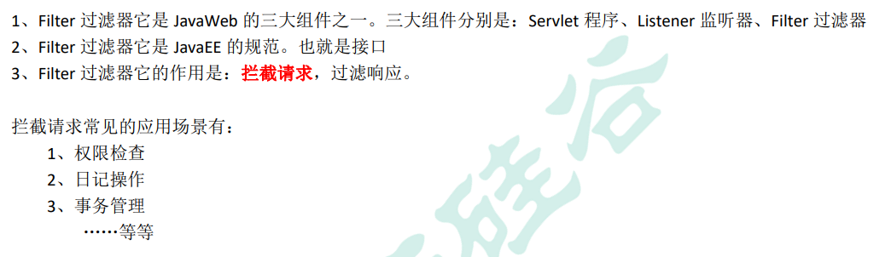

### Filter 的初体验


Filter 的工作流程图：


Filter 的代码：

```java
package com.itguigu.Filter;

import javax.servlet.*;
import javax.servlet.http.HttpServletRequest;
import javax.servlet.http.HttpSession;
import java.io.IOException;

/* @author  i-s-j-h-d
 * @version 1.0 */
public class AdminFilter implements Filter{

    @Override
    public void init(FilterConfig filterConfig) throws ServletException {
        Filter.super.init(filterConfig);
    }

    @Override
    public void doFilter(ServletRequest servletRequest, ServletResponse servletResponse, FilterChain filterChain) throws IOException, ServletException {
        HttpServletRequest httpServletRequest = (HttpServletRequest) servletRequest;

        HttpSession session = httpServletRequest.getSession();
        Object user = session.getAttribute("user");
        // 如果等于null, 说明还没有登录
        if (user == null) {
            servletRequest.getRequestDispatcher("/login.jsp").forward(servletRequest, servletResponse);
            return;
        } else {
            // 让程序继续往下访问用户的目标资源
            filterChain.doFilter(servletRequest,servletResponse);
        }
    }

    @Override
    public void destroy() {
        Filter.super.destroy();
    }
}
```


web.xml 中的配置：

```xml
<!-- filter 标签用于配置一个Filter过滤器 -->
<filter>
    <!--给 filter 起一个别名-->
    <filter-name>AdminFilter</filter-name>
    <!--配置 filter 的全类名-->
    <filter-class>com.itguigu.Filter.AdminFilter</filter-class>
</filter>
<!--filter-mapping 配置 Filter 过滤器的拦截路径-->
<filter-mapping>
    <!--filter-name 表示当前的拦截路径给哪个 filter 使用-->
    <filter-name>AdminFilter</filter-name>
    <!--url-pattern 配置拦截路径
        / 表示请求地址为：http://ip:port/工程路径/ 映射到 IDEA 的 web 目录
        /admin/* 表示请求地址为：http://ip:port/工程路径/admin/*
    -->
    <url-pattern>/admin/*</url-pattern>
</filter-mapping>
```


> Filter 过滤器的使用步骤： 
>
> ​	1、编写一个类去实现 Filter 接口 
>
> ​	2、实现过滤方法 doFilter() 
>
> ​	3、到 web.xml 中去配置 Filter 的拦截路径


#### 完整的用户登录

login.jsp 页面 == 登录表单

```jsp
这是登陆页面 login.jsp<br>
<form action="http://localhost:8080/filter_/loginServlet" method="get">
    用户名：<input type="text" name="username"/> <br>
    密  码：<input type="password" name="password"/> <br>
    <input type="submit"/>
</form>
```


LoginServlet 程序

```java
package com.itguigu.Filter;

import javax.servlet.ServletException;
import javax.servlet.http.HttpServlet;
import javax.servlet.http.HttpServletRequest;
import javax.servlet.http.HttpServletResponse;
import java.io.IOException;

/* @author  i-s-j-h-d
 * @version 1.0 */
public class LoginServlet extends HttpServlet {

    @Override
    protected void doGet(HttpServletRequest req, HttpServletResponse resp) throws ServletException, IOException {

        resp.setContentType("text/html; charset=UTF-8");
        String username = req.getParameter("username");
        String password = req.getParameter("password");

        if ("wzg168".equals(username) && "123456".equals(password)) {
            req.getSession().setAttribute("user",username);
            resp.getWriter().write("登录 成功！！！");
        } else {
            req.getRequestDispatcher("/login.jsp").forward(req,resp);
        }
    }
}
```


### Filter 的生命周期


### FilterConfig 类


java 代码：

```java
@Override
public void init(FilterConfig filterConfig) throws ServletException {
    // 1、获取 Filter 的名称 filter-name 的内容
    System.out.println("filter-name的值是：" + filterConfig.getFilterName());
    // 2、获取在 web.xml 中配置的 init-param 初始化参数
    System.out.println("初始化参数username的值是：" + filterConfig.getInitParameter("username"));
    System.out.println("初始化参数url的值是：" + filterConfig.getInitParameter("url"));
    // 3、获取 ServletContext 对象
    System.out.println(filterConfig.getServletContext());
}
```


web.xml 配置

```xml
<!-- filter 标签用于配置一个Filter过滤器 -->
<filter>
    <!--给 filter 起一个别名-->
    <filter-name>AdminFilter</filter-name>
    <!--配置 filter 的全类名-->
    <filter-class>com.itguigu.Filter.AdminFilter</filter-class>

    <init-param>
        <param-name>username</param-name>
        <param-value>root</param-value>
    </init-param>
    <init-param>
        <param-name>url</param-name>
        <param-value>jdbc:mysql://localhost3306/test</param-value>
    </init-param>
</filter>
```


### FilterChain 过滤器

Filter 		过滤器 

Chain		链，链条 

FilterChain 	就是过滤器链（多个过滤器如何一起工作）

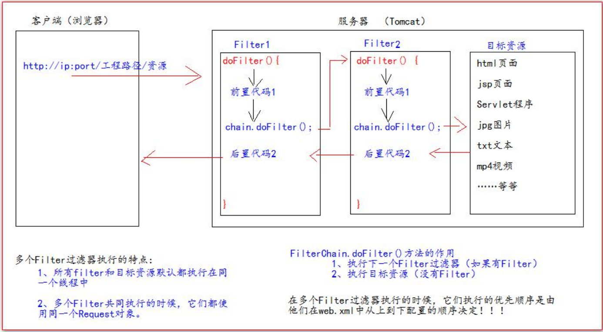


### Filter 的拦截路径


## 书城第八阶段

### 使用 Filter 过滤器拦截/pages/manager/所有内容，实 现权限检查

Filter 代码:

```java
package com.atguigu.filter;

import javax.servlet.*;
import javax.servlet.http.HttpServletRequest;
import java.io.IOException;

/* @author  i-s-j-h-d
 * @version 1.0 */
public class ManagerFilter implements Filter {
    @Override
    public void init(FilterConfig filterConfig) throws ServletException {
        Filter.super.init(filterConfig);
    }

    @Override
    public void doFilter(ServletRequest servletRequest, ServletResponse servletResponse, FilterChain filterChain) throws IOException, ServletException {
        HttpServletRequest httpServletRequest = (HttpServletRequest) servletRequest;

        Object user = httpServletRequest.getSession().getAttribute("user");

        if (user == null) {
            httpServletRequest.getRequestDispatcher("/pages/user/login.jsp").forward(servletRequest,servletResponse);
        } else {
            filterChain.doFilter(servletRequest, servletResponse);
        }
    }

    @Override
    public void destroy() {
        Filter.super.destroy();
    }
}
```


web.xml 中的配置：

```xml
<filter>
    <filter-name>ManagerFilter</filter-name>
    <filter-class>com.atguigu.filter.ManagerFilter</filter-class>
</filter>
<filter-mapping>
    <filter-name>ManagerFilter</filter-name>
    <url-pattern>/pages/manager/*</url-pattern>
    <url-pattern>/manager/bookServlet</url-pattern>
</filter-mapping>
```


### ThreadLocal 的使用


测试类：

```java
public class ThreadLocalTest {
// public static Map<String,Object> data = new Hashtable<String,Object>();
	public static ThreadLocal<Object> threadLocal = new ThreadLocal<Object>();
	private static Random random = new Random();
    
	public static class Task implements Runnable {
		@Override
		public void run() {
		// 在 Run 方法中，随机生成一个变量（线程要关联的数据），然后以当前线程名为 key 保存到 map 中
		Integer i = random.nextInt(1000);
		// 获取当前线程名
		String name = Thread.currentThread().getName();
		System.out.println("线程["+name+"]生成的随机数是：" + i);
		// data.put(name,i);
		threadLocal.set(i);
        try {
        Thread.sleep(3000);
        } catch (InterruptedException e) {
        e.printStackTrace();
        }
		new OrderService().createOrder();
            
        // 在 Run 方法结束之前，以当前线程名获取出数据并打印。查看是否可以取出操作
        // Object o = data.get(name);
        Object o = threadLocal.get();
        System.out.println("在线程["+name+"]快结束时取出关联的数据是：" + o);
	}
}
public static void main(String[] args) {
        for (int i = 0; i < 3; i++){
        	new Thread(new Task()).start();
        }
	}
}


public class OrderService {
    public void createOrder(){
        String name = Thread.currentThread().getName();
        System.out.println("OrderService 当前线程[" + name + "]中保存的数据是：" +ThreadLocalTest.threadLocal.get());
        new OrderDao().saveOrder();
    }
}


public class OrderDao {
    public void saveOrder(){
    	String name = Thread.currentThread().getName();
    	System.out.println("OrderDao 当前线程[" + name + "]中保存的数据是：" + ThreadLocalTest.threadLocal.get());
    }
}
```


### 使用 Filter 和 ThreadLocal 组合管理事务

#### 使用 ThreadLocal 来确保所有 dao 操作都在同一个 Connection 连接对象中完成

原理分析图：


JdbcUtils 工具类的修改：

```java
package com.atguigu.utils;

import com.alibaba.druid.pool.DruidDataSource;
import com.alibaba.druid.pool.DruidDataSourceFactory;
import java.io.InputStream;
import java.sql.Connection;
import java.sql.SQLException;
import java.util.Properties;
/* @author i-s-j-h-d
 * @version 1.0
 * 基于druid数据库连接池的工具类
 */
public class JdbcUtils {
    private static DruidDataSource dataSource;
    private static ThreadLocal<Connection> conns = new ThreadLocal<>();

    static {
        try {
            Properties properties = new Properties();
            // 读取 jdbc.properties 属性配置文件
            InputStream inputStream =
                    JdbcUtils.class.getClassLoader().getResourceAsStream("jdbc.properties");
            // 从流中加载数据
            properties.load(inputStream);
            // 创建 数据库连接 池
            dataSource = (DruidDataSource) DruidDataSourceFactory.createDataSource(properties);
        } catch (Exception e) {
            e.printStackTrace();
        }
    }
    /**
     * 获取数据库连接池中的连接
     * @return 如果返回 null,说明获取连接失败<br/>有值就是获取连接成功
     */
    public static Connection getConnection(){
        Connection conn = conns.get();

        if (conn == null) {
            try {
                conn = dataSource.getConnection();
                conns.set(conn); //保存到 ThreadLocal 对象中，供后面的jdbc操作使用
                conn.setAutoCommit(false); // 设置手动管理事务
            } catch (Exception e) {
                e.printStackTrace();
            }

        }
        return conn;
    }

    /**
     * 提交事务，并关闭释放连接
     */
    public static void commitAndClose() {
        Connection connection = conns.get();
        if (connection != null) { // 如果不等于null，说明之前使用过连接，操作过数据库
            try {
                connection.commit(); // 提交事务
            } catch (SQLException e) {
                e.printStackTrace();
            } finally {
                try {
                    connection.close(); // 关闭连接，释放资源
                } catch (SQLException e) {
                    e.printStackTrace();
                }
            }
        }
        // 一定要执remove操作，否则就会出错。(因为Tomcat服务器底层使用了线程池技术)
        conns.remove();
    }

    /**
     * 回滚事务，并关闭释放连接
     */
    public static void rollbackAndClose() {
        Connection connection = conns.get();
        if (connection != null) { // 如果不等于null，说明之前使用过连接，操作过数据库
            try {
                connection.rollback(); // 回滚事务
            } catch (SQLException e) {
                e.printStackTrace();
            } finally {
                try {
                    connection.close(); // 关闭连接，释放资源
                } catch (SQLException e) {
                    e.printStackTrace();
                }
            }
        }
        // 一定要执remove操作，否则就会出错。(因为Tomcat服务器底层使用了线程池技术)
        conns.remove();
    }


    /**
     * 关闭连接，放回数据库连接池
     * @param conn
     */
//    public static void close(Connection conn){
//        if (conn != null) {
//            try {
//                conn.close();
//            } catch (SQLException e) {
//                e.printStackTrace();
//            }
//        }
//    }
}
```


修改 BaseDao

```java
public abstract class BaseDao {

    //使用DbUtils操作数据库
    private QueryRunner queryRunner = new QueryRunner();

    // update() 方法用来执行：Insert\Update\Delete语句
    // return 如果返回-1，说明执行失败，返回其他表示影响到的行数
    public int update(String sql, Object ... args) {
        Connection connection = JdbcUtils.getConnection();
        try {
            return queryRunner.update(connection, sql, args);
        } catch (SQLException e) {
            e.printStackTrace();
            throw new RuntimeException(e);
        }
    }

    /**
     * 查询返回一个javaBean的sql语句
     *
     * @param type  返回的对象类型
     * @param sql   执行的sql语句
     * @param args  sql对应的参数值
     * @param <T>   返回的类型的泛型
     * @return
     */
    public <T> T queryForOne(Class<T> type, String sql, Object ... args) {
        Connection connection = JdbcUtils.getConnection();
        try {
            return queryRunner.query(connection, sql, new BeanHandler<T>(type), args);
        } catch (SQLException e) {
            e.printStackTrace();
            throw new RuntimeException(e);
        }
    }

    /**
     * 查询返回多个 javaBean 的 sql 语句
     *
     * @param type 返回的对象类型
     * @param sql 执行的 sql 语句
     * @param args sql 对应的参数值
     * @param <T> 返回的类型的泛型
     * @return
     */
    public <T> List<T> queryForList(Class<T> type, String sql, Object...args) {
        Connection connection = JdbcUtils.getConnection();
        try {
            return queryRunner.query(connection, sql, new BeanListHandler<T>(type), args);
        } catch (SQLException e) {
            e.printStackTrace();
            throw new RuntimeException(e);
        }
    }

    /**
     * 执行返回一行一列的sql语句
     * @param sql   执行的sql语句
     * @param args  sql对应的参数值
     * @return
     */
    public Object queryForSingleValue(String sql, Object...args) {
        Connection connection = JdbcUtils.getConnection();

        try {
            return queryRunner.query(connection, sql, new ScalarHandler(), args);
        } catch (SQLException e) {
            e.printStackTrace();
            throw new RuntimeException(e);
        }
    }

}
```


添加到需要操作的地方

```java
// 调用orderService.createOrder(cart, userId) 生成订单
        String orderId = null;
        try {
            orderId = orderService.createOrder(cart, userId);
            JdbcUtils.commitAndClose(); // 提交事务
        } catch (Exception e) {
            JdbcUtils.rollbackAndClose(); //回滚事务
            e.printStackTrace();
        }
```


#### 使用 Filter 过滤器统一给所有的 Service 方法都加上 try-catch。来进行实现的 管理。

原理分析图：

Filter 类代码：

```java
package com.atguigu.filter;

import com.atguigu.utils.JdbcUtils;

import javax.servlet.*;
import java.io.IOException;

/* @author  i-s-j-h-d
 * @version 1.0 */
public class TransactionFilter implements Filter {
    @Override
    public void init(FilterConfig filterConfig) throws ServletException {
        Filter.super.init(filterConfig);
    }

    @Override
    public void doFilter(ServletRequest servletRequest, ServletResponse servletResponse, FilterChain filterChain) throws IOException, ServletException {
        try {
            filterChain.doFilter(servletRequest, servletResponse);
            JdbcUtils.commitAndClose(); // 提交事务
        } catch (Exception e) {
            JdbcUtils.rollbackAndClose(); // 回退事务
            e.printStackTrace();
        }
    }

    @Override
    public void destroy() {
        Filter.super.destroy();
    }
}
```


在 web.xml 中的配置：

```xml
<filter>
    <filter-name>TransactionFilter</filter-name>
    <filter-class>com.atguigu.filter.TransactionFilter</filter-class>
</filter>
<filter-mapping>
    <filter-name>TransactionFilter</filter-name>
    <!-- /* 表示当前工程下所有请求 -->
    <url-pattern>/*</url-pattern>
</filter-mapping>
```


一定要把异常往外抛给 Filter 过滤器！！！


#### 将所有异常都统一交给 Tomcat，让 Tomcat 展示友好的错误信息页面。

在 web.xml 中我们可以通过错误页面配置来进行管理。


error404.jsp 错误页面：

```jsp
<%@ taglib prefix="c" uri="http://java.sun.com/jsp/jstl/core" %>
<%--
Created by IntelliJ IDEA.
User: 34782
Date: 2023/9/27
Time: 14:23
To change this template use File | Settings | File Templates.
--%>
<%@ page contentType="text/html;charset=UTF-8" language="java" %>
<!DOCTYPE html>
<html>
<head>
    <meta charset="UTF-8">
    <title>书城首页</title>

    <%-- 静态包含 base标签，css样式，jQuery文件 --%>
    <%@include file="/pages/common/head.jsp"%>

</head>
<body>

很抱歉，你访问的页面不存在<br>
<a href="index.jsp">返回首页</a>

<%-- 静态包含页脚内容 --%>
<%@include file="/pages/common/footer.jsp"%>

</body>
</html>
```


```xml
<!-- error-page 标签配置，服务器出错之后，自动跳转的页面 -->
<error-page>
    <!-- error-code 是错误类型 -->
    <error-code>404</error-code>
    <!-- location 标签表示：要跳转去的页面路径 -->
    <location>/pages/error/error404.jsp</location>
</error-page>
```


## JSON

### 什么是 JSON ？


#### JSON 在 JavaScript 中的使用

##### json 的定义

json 是由键值对组成，并且由花括号（大括号）包围。每个键由引号引起来，键和值之间使用冒号进行分隔， 多组键值对之间进行逗号进行分隔。

json 定义示例：

```javascript
// json的定义
var jsonObj = {
   "key1":12,
   "key2":"abc",
   "key3":true,
   "key4":[11,"arr",false],
   "key5":{
      "key5_1":551,
      "key5_2":"key5_2_value"
   },
   "key6":[{
      "key6_1_1":6611,
      "key6_1_2":"key6_1_2_value"
   },{
      "key6_2_1":6621,
      "key6_2_2":"key6_2_2_value"
   }]
}
```


##### json 的访问

json 本身是一个对象。 

json 中的 key 我们可以理解为是对象中的一个属性。 

json 中的 key 访问就跟访问对象的属性一样： json 对象.key 


json 访问示例：

```javascript
// json的访问
alert(typeof(jsonObj)); // object  json是一个对象
alert(jsonObj.key1); // 12
alert(jsonObj.key2); // abc
alert(jsonObj.key3); // true

alert(jsonObj.key4); // 得到数组[11, "arr", false]
   // json 中的数组值的遍历
for (var i = 0; i < jsonObj.key4.length; i++) {
   alert(jsonObj.key4[i]);
}

alert(jsonObj.key5.key5_1); // 551
alert(jsonObj.key5.key5_2); // key5_2_value

alert( jsonObj.key6 );// 得到 json 数组
   // 取出来每一个元素都是json对象
var jsonItem = jsonObj.key6[0];
alert(jsonItem.key6_1_1); // 6611
alert(jsonItem.key6_1_2); // key6_1_2_value
```


##### json 的两个常用方法


示例代码：

```javascript
// 把 json 对象转换成为 json 字符
var jsonObjString = JSON.stringify(jsonObj); // 特别像 Java 中对象的 toString
alert(jsonObjString)
// 把 json 字符串。转换成为 json 对象
var jsonObj2 = JSON.parse(jsonObjString);
alert(jsonObj2.key1);
```


#### JSON 在 java 中的使用

##### javaBean 和 json 的互转

[gson-2.2.4.jar](gson-2.2.4.jar)

```java
// javaBean 和 json 的互转
@Test
public void test1() {
    Person person = new Person(1, "轻音少女");
    // 创建 Gson 对象实例
    Gson gson = new Gson();
    // toJson 方法可以把java对象转换成为 json 字符串
    String personJsonString = gson.toJson(person);
    System.out.println(personJsonString);
    // fromJson 把 json 字符串转换回 Java 对象
    // 第一个参数是 json 字符串
    // 第二个参数是转换回去的 Java 对象类
    Person person1 = gson.fromJson(personJsonString, Person.class);
    System.out.println(person1);
}
```


##### List 和 json 的互转

```java
// List 和 json 的互转
@Test
public void test2() {
    List<Person> personList = new ArrayList<>();
    personList.add(new Person(1, "轻音少女"));
    personList.add(new Person(2, "星际牛仔"));

    Gson gson = new Gson();

    // 把 list 转换为 json 字符串
    String personListJsonString = gson.toJson(personList);
    System.out.println(personListJsonString);

    // 把 json 字符串 转换为 list 集合
    List<Person> list = gson.fromJson(personListJsonString, new PersonListType().getType());
    System.out.println(list);
    Person person = list.get(0);
    System.out.println(person);

}
```

json 字符串 转换为 list 集合 需要创建这个类

```java
package com.atguigu.json;

import com.atguigu.pojo.Person;
import com.google.gson.reflect.TypeToken;

import java.util.ArrayList;

/* @author  i-s-j-h-d
 * @version 1.0 */
public class PersonListType extends TypeToken<ArrayList<Person>> {

}
```


##### map 和 json 的互转

```java
// map 和 json 的互转
@Test
public void test3() {
    Map<Integer,Person> personMap = new HashMap<>();
    personMap.put(1, new Person(1, "无间道"));
    personMap.put(2, new Person(2, "一一"));

    Gson gson = new Gson();
    //  把 map 集合转换成为 json 字符串
    String personMapJsonString = gson.toJson(personMap);
    System.out.println(personMapJsonString);

    // Map<Integer,Person> personMap2 = gson.fromJson(personMapJsonString, new PersonMapType().getType());
    // 使用匿名内部类
    Map<Integer,Person> personMap2 = gson.fromJson(personMapJsonString, new TypeToken<HashMap<Integer,Person>>(){}.getType());

    System.out.println(personMap2);
    Person p = personMap2.get(1);
    System.out.println(p);

}
```


## AJAX 请求

### 什么是 AJAX 请求


### 原生 AJAX 请求的示例：

```html
DOCTYPE html PUBLIC "-//W3C//DTD HTML 4.01 Transitional//EN" "http://www.w3.org/TR/html4/loose.dtd">
<html>
   <head>
      <meta http-equiv="pragma" content="no-cache" />
      <meta http-equiv="cache-control" content="no-cache" />
      <meta http-equiv="Expires" content="0" />
      <meta http-equiv="Content-Type" content="text/html; charset=UTF-8">
      <title>Insert title here</title>
      <script type="text/javascript">
         // 在这里使用 javaScript 语言发起 Ajax 请求，访问服务器 AjaxServlet 中 javaScriptAjax
         function ajaxRequest() {
//              1、我们首先要创建XMLHttpRequest 
            var xmlhttprequest = new XMLHttpRequest();
//              2、调用open方法设置请求参数
            xmlhttprequest.open("GET", "http://localhost:8080/json_ajax_i18n/ajaxServlet?action=javaScriptAjax", true)
//              4、在send方法前绑定onreadystatechange事件，处理请求完成后的操作。
            xmlhttprequest.onreadystatechange = function () {
               if (xmlhttprequest.readyState == 4 && xmlhttprequest.status == 200) {

                  var jsonObj = JSON.parse(xmlhttprequest.responseText);

                  // 把响应的数据显示在页面上
                  document.getElementById("div01").innerHTML = "编号：" + jsonObj.id + ", 姓名：" + jsonObj.name;

               }
            }
//              3、调用send方法发送请求
            xmlhttprequest.send();
         }
      </script>
   </head>
   <body> 
      <button onclick="ajaxRequest()">ajax request</button>
      <div id="div01">
      </div>
   </body>
</html>
```


servlet服务端代码：

```java
package com.atguigu.servlet;

import com.atguigu.pojo.Person;
import com.google.gson.Gson;

import javax.servlet.ServletException;
import javax.servlet.http.HttpServletRequest;
import javax.servlet.http.HttpServletResponse;
import java.io.IOException;

/* @author  i-s-j-h-d
 * @version 1.0 */
public class AjaxServlet extends BaseServlet {

    protected void javaScriptAjax(HttpServletRequest req, HttpServletResponse resp) throws ServletException, IOException {
        System.out.println("进入");

        Person person = new Person(1, "轻音少女");

        // json格式的字符串
        Gson gson = new Gson();
        String personJsonString = gson.toJson(person);

        resp.getWriter().write(personJsonString);

    }
}
```


```java
package com.atguigu.servlet;

import javax.servlet.ServletException;
import javax.servlet.http.HttpServlet;
import javax.servlet.http.HttpServletRequest;
import javax.servlet.http.HttpServletResponse;
import java.io.IOException;
import java.lang.reflect.Method;

/* @author  i-s-j-h-d
 * @version 1.0 */
public abstract class BaseServlet extends HttpServlet {

    @Override
    protected void doPost(HttpServletRequest req, HttpServletResponse resp) throws ServletException, IOException {

        // 解决post请求中文乱码问题
        // 一定要在获取请求参数之前调用才有效
        req.setCharacterEncoding("UTF-8");
        // 解决响应乱码问题
        resp.setContentType("text/html; charset=UTF-8");

        String action = req.getParameter("action");
        try {
            // 获取action业务鉴别字符串，获取相应的业务 方法反射对象
            Method method = this.getClass().getDeclaredMethod(action, HttpServletRequest.class, HttpServletResponse.class);

            // 调用目标业务 方法
            method.invoke(this,req,resp);

        } catch (Exception e) {
            e.printStackTrace();
            throw new RuntimeException(e); // 把异常抛给Filter过滤器
        }
    }

    @Override
    protected void doGet(HttpServletRequest req, HttpServletResponse resp) throws ServletException, IOException {
        System.out.println("调用服务");
        this.doPost(req, resp);
    }
}
```


### jQuery 中的 AJAX 请求


```html
<script type="text/javascript">
   $(function(){
      // ajax请求
      $("#ajaxBtn").click(function(){
         $.ajax({
            url:"http://localhost:8080/json_ajax_i18n/ajaxServlet",
            // data:"action=jQueryAjax",或
            data:{action:"jQueryAjax"},
            type:"GET",
            success:function (data) {
               // alert("服务器返回的数据是：" + data);
               // var jsonObj = JSON.parse(data);
               $("#msg").html("编号：" + data.id + ", 姓名：" + data.name);
            },
            dataType:"json"
         });
      });
```


```html
<script type="text/javascript">
     $(function(){
        // ajax--get请求
        $("#getBtn").click(function(){

           // $.get(url,data,callback,type);
           $.get("http://localhost:8080/json_ajax_i18n/ajaxServlet", "action=jQueryGet", function (data) {
              $("#msg").html("get 编号：" + data.id + "，姓名：" + data.name);
           }, "json");
        });

        // ajax--post请求
        $("#postBtn").click(function(){

           // $.post(url,data,callback,type);
           $.post("http://localhost:8080/json_ajax_i18n/ajaxServlet", "action=jQueryPost", function (data) {
              $("#msg").html("post 编号：" + data.id + "，姓名：" + data.name);
           }, "json");
        });
```


```js
// ajax--getJson请求
$("#getJSONBtn").click(function(){

   $.getJSON("http://localhost:8080/json_ajax_i18n/ajaxServlet", "action=jQueryGetJSON", function (data) {
      $("#msg").html("getJSON 编号：" + data.id + "，姓名：" + data.name);
   });
});
```


```js
// ajax请求
$("#submit").click(function(){
   // 把参数序列化
   $.getJSON("http://localhost:8080/json_ajax_i18n/ajaxServlet","action=jQuerySerialize&" +
         $("#form01").serialize(), function (data) {
            $("#msg").html("Serialize 编号：" + data.id + "，姓名：" + data.name);
         });
});
```

```java
protected void jQuerySerialize(HttpServletRequest req, HttpServletResponse resp) throws ServletException, IOException {
    System.out.println("  jQuerySerialize   == 方法调用了");

    System.out.println("用户名：" + req.getParameter("username"));
    System.out.println("密码：" + req.getParameter("password"));

    Person person = new Person(1, "轻音少女");
    // json格式的字符串
    Gson gson = new Gson();
    String personJsonString = gson.toJson(person);

    resp.getWriter().write(personJsonString);
}
```


## 书城项目第九阶段

### 使用 AJAX 验证用户名是否可用


UserServlet 程序中 ajaxExistsUsername 方法：

```java
protected void ajaxExistsUsername(HttpServletRequest req, HttpServletResponse resp) throws ServletException, IOException {
    // 获取请求的参数 username
    String username = req.getParameter("username");
    // 调用userService.existsUsername();
    boolean existsUsername = userService.existsUsername(username);
    // 把返回的结果封装成为map对象
    Map<String,Object> resultMap = new HashMap<>();
    resultMap.put("existsUsername",existsUsername);

    Gson gson = new Gson();
    String json = gson.toJson(resultMap);

    resp.getWriter().write(json);
}
```


regist.jsp 页面中的代码：

```js
$("#username").blur(function () {
   //1 获取用户名
   var username = this.value;
   $.getJSON("http://localhost:8080/book/userServlet","action=ajaxExistsUsername&username=" + username,function (data) {
      if (data.existsUsername) {
         $("span.errorMsg").text("用户名已存在！");
      } else {
         $("span.errorMsg").text("用户名可用！");
      }
   });
});
```


### 使用 AJAX 修改把商品添加到购物车


CartServlet 程序：

```java
protected void ajaxAddItem(HttpServletRequest req, HttpServletResponse resp) throws ServletException, IOException {

    // 获取请求的参数 商品编号
    int id = WebUtils.parseInt(req.getParameter("id"), 0);
    // 得到图书的信息
    Book book = bookService.queryBookById(id);
    // 把图书信息，转化成为CartItem 商品项
    CartItem cartItem = new CartItem(book.getId(), book.getName(), 1, book.getPrice(), book.getPrice());
    // 调用 Cart.addItem(CartItem);添加商品项
    Cart cart = (Cart) req.getSession().getAttribute("cart");
    if (cart == null) {
        cart = new Cart();
        req.getSession().setAttribute("cart", cart);
    }
    cart.addItem(cartItem);

    System.out.println(cart);

    // 最后一个添加的商品名称
    req.getSession().setAttribute("lastName", cartItem.getName());

    //6、返回购物车总的商品数量和最后一个添加的商品名称
    Map<String,Object> resultMap = new HashMap<String,Object>();

    resultMap.put("totalCount", cart.getTotalCount());
    resultMap.put("lastName",cartItem.getName());

    Gson gson = new Gson();
    String resultMapJsonString = gson.toJson(resultMap);

    resp.getWriter().write(resultMapJsonString);


}
```


pages/client/index.jsp 页面 

html 代码：

```jsp
<div style="text-align: center">
    <c:if test="${empty sessionScope.cart.items}">
        <%-- 购物车为空的输出 --%>
        <span id="cartTotalCount"> </span>
        <div>
            <span style="color: red" id="cartLastName">当前购物车为空</span>
        </div>
    </c:if>
    <c:if test="${not empty sessionScope.cart.items}">
        <%-- 购物车为非空的输出 --%>
        <span id="cartTotalCount">您的购物车中有 ${sessionScope.cart.totalCount} 件商品</span>
        <div>
            您刚刚将<span style="color: red" id="cartLastName">${sessionScope.lastName}</span>加入到了购物车中
        </div>
    </c:if>

</div>
```


javaScript 代码：

```js
<Script type="text/javascript">
    $(function () {
        // 给加入购物车按钮绑定单击事件
        $("button.addToCart").click(function () {
            /**
             * 在事件响应的 function 函数 中，有一个 this 对象，这个 this 对象，是当前正在响应事件的 dom 对象
             * @type {jQuery}
             */
            var bookId = $(this).attr("bookId");
            // location.href = "http://localhost:8080/book/cartServlet?action=addItem&id=" + bookId;
            // 发 ajax 请求，添加商品到购物车
            $.getJSON("http://localhost:8080/book/cartServlet", "action=ajaxAddItem&id=" +
                bookId, function (data) {
                $("#cartTotalCount").text("您的购物车中有 " + data.totalCount + " 件商品");
                $("#cartLastName").text(data.lastName);
            })
        });
    });
</Script>
```


## i18n 国际化（了解内容）

### 什么是 i18n 国际化？


### 国际化相关要素介绍


### 国际化资源 properties 测试

配置两个语言的配置文件： 

i18n_en_US.properties 英文

```properties
username=username
password=password
sex=sex
age=age
regist=regist
boy=boy
email=email
girl=girl
reset=reset
submit=submit
```

i18n_zh_CN.properties 中文

```properties
username=用户名
password=密码
sex=性别
age=年龄
regist=注册
boy=男
girl=女
email=邮箱
reset=重置
submit=提交
```


国际化测试代码：

```java
public class I18nTest {
	@Test
	public void testLocale(){
        // 获取你系统默认的语言。国家信息
        // Locale locale = Locale.getDefault();
        // System.out.println(locale);
        // for (Locale availableLocale : Locale.getAvailableLocales()) {
        // System.out.println(availableLocale);
        // }
        // 获取中文，中文的常量的 Locale 对象
        System.out.println(Locale.CHINA);
        // 获取英文，美国的常量的 Locale 对象
        System.out.println(Locale.US);
    }
    @Test
    public void testI18n(){
        // 得到我们需要的 Locale 对象
        Locale locale = Locale.CHINA;
        // 通过指定的 basename 和 Locale 对象，读取 相应的配置文件
        ResourceBundle bundle = ResourceBundle.getBundle("i18n", locale);
        System.out.println("username：" + bundle.getString("username"));
        System.out.println("password：" + bundle.getString("password"));
        System.out.println("Sex：" + bundle.getString("sex"));
        System.out.println("age：" + bundle.getString("age"));
    }
}
```


### 通过请求头国际化页面

```jsp
<%@ page import="java.util.Locale" %>
<%@ page import="java.util.ResourceBundle" %>
<%@ page language="java" contentType="text/html; charset=UTF-8"
pageEncoding="UTF-8"%>
<!DOCTYPE html PUBLIC "-//W3C//DTD HTML 4.01 Transitional//EN" "http://www.w3.org/TR/html4/loose.dtd">
<html>
<head>
<meta http-equiv="pragma" content="no-cache" />
<meta http-equiv="cache-control" content="no-cache" />
<meta http-equiv="Expires" content="0" />
<meta http-equiv="Content-Type" content="text/html; charset=UTF-8">
<title>Insert title here</title>
</head>
<body>
    <%
        // 从请求头中获取 Locale 信息（语言）
        Locale locale = request.getLocale();
        System.out.println(locale);
        // 获取读取包（根据 指定的 baseName 和 Locale 读取 语言信息）
        ResourceBundle i18n = ResourceBundle.getBundle("i18n", locale);
    %>
<a href="">中文</a>|
<a href="">english</a>
<center>
    <h1><%=i18n.getString("regist")%></h1>
    <table>
        <form>
            <tr>
                <td><%=i18n.getString("username")%></td>
                <td><input name="username" type="text" /></td>
            </tr>
            <tr>
                <td><%=i18n.getString("password")%></td>
                <td><input type="password" /></td>
            </tr>
            <tr>
                <td><%=i18n.getString("sex")%></td>
                <td>
                <input type="radio" /><%=i18n.getString("boy")%>
                <input type="radio" /><%=i18n.getString("girl")%>
            </td>
            </tr>
            <tr>
                <td><%=i18n.getString("email")%></td>
                <td><input type="text" /></td>
            </tr>
            <tr>
                <td colspan="2" align="center">
                <input type="reset" value="<%=i18n.getString("reset")%>" />&nbsp;&nbsp;
                <input type="submit" value="<%=i18n.getString("submit")%>" /></td>
            </tr>
        </form>
    </table>
    <br /> <br /> <br /> <br />
</center>
    国际化测试：
    <br /> 1、访问页面，通过浏览器设置，请求头信息确定国际化语言。
    <br /> 2、通过左上角，手动切换语言
</body>
</html>
```


### 通过显示的选择语言类型进行国际化

```jsp
<%@ page import="java.util.Locale" %>
<%@ page import="java.util.ResourceBundle" %>
<%@ page language="java" contentType="text/html; charset=UTF-8"
pageEncoding="UTF-8"%>
<!DOCTYPE html PUBLIC "-//W3C//DTD HTML 4.01 Transitional//EN" "http://www.w3.org/TR/html4/loose.dtd">
<html>
<head>
<meta http-equiv="pragma" content="no-cache" />
<meta http-equiv="cache-control" content="no-cache" />
<meta http-equiv="Expires" content="0" />
<meta http-equiv="Content-Type" content="text/html; charset=UTF-8">
<title>Insert title here</title>
</head>
<body>
    <%
        // 从请求头中获取 Locale 信息（语言）
        Locale locale = null;
    
        String country = request.getParameter("country");
        if ("cn".equals(country)) {
        	locale = Locale.CHINA;
        } else if ("usa".equals(country)) {
        	locale = Locale.US;
        } else {
        	locale = request.getLocale();
        }
        System.out.println(locale);
        // 获取读取包（根据 指定的 baseName 和 Locale 读取 语言信息）
        ResourceBundle i18n = ResourceBundle.getBundle("i18n", locale);
    %>
<a href="i18n.jsp?country=cn">中文</a>|
<a href="i18n.jsp?country=usa">english</a>
<center>
    <h1><%=i18n.getString("regist")%></h1>
    <table>
    <form>
        <tr>
            <td><%=i18n.getString("username")%></td>
            <td><input name="username" type="text" /></td>
        </tr>
        <tr>
            <td><%=i18n.getString("password")%></td>
            <td><input type="password" /></td>
        </tr>
        <tr>
        	<td><%=i18n.getString("sex")%></td>
        	<td>
                <input type="radio" /><%=i18n.getString("boy")%>
                <input type="radio" /><%=i18n.getString("girl")%>
        	</td>
        </tr>
        <tr>
            <td><%=i18n.getString("email")%></td>
            <td><input type="text" /></td>
        </tr>
        <tr>
            <td colspan="2" align="center">
            <input type="reset" value="<%=i18n.getString("reset")%>" />&nbsp;&nbsp;
            <input type="submit" value="<%=i18n.getString("submit")%>" /></td>
        </tr>
    </form>
    </table>
    <br /> <br /> <br /> <br />
</center>
国际化测试：
<br /> 1、访问页面，通过浏览器设置，请求头信息确定国际化语言。
<br /> 2、通过左上角，手动切换语言
</body>
</html>
```


### JSTL 标签库实现国际化


```jsp
<%@ taglib prefix="fmt" uri="http://java.sun.com/jsp/jstl/fmt" %>
<%@ page language="java" contentType="text/html; charset=UTF-8"
pageEncoding="UTF-8"%>
<!DOCTYPE html PUBLIC "-//W3C//DTD HTML 4.01 Transitional//EN" "http://www.w3.org/TR/html4/loose.dtd">
<html>
<head>
<meta http-equiv="pragma" content="no-cache" />
<meta http-equiv="cache-control" content="no-cache" />
<meta http-equiv="Expires" content="0" />
<meta http-equiv="Content-Type" content="text/html; charset=UTF-8">
<title>Insert title here</title>
</head>
<body>
    <%--1 使用标签设置 Locale 信息--%>
    <fmt:setLocale value="${param.locale}" />
    <%--2 使用标签设置 baseName--%>
    <fmt:setBundle basename="i18n"/>
    <a href="i18n_fmt.jsp?locale=zh_CN">中文</a>|
    <a href="i18n_fmt.jsp?locale=en_US">english</a>
    <center>
        <h1><fmt:message key="regist" /></h1>
        <table>
        <form>
            <tr>
                <td><fmt:message key="username" /></td>
                <td><input name="username" type="text" /></td>
            </tr>
            <tr>
                <td><fmt:message key="password" /></td>
                <td><input type="password" /></td>
            </tr>
            <tr>
                <td><fmt:message key="sex" /></td>
                <td>
                    <input type="radio" /><fmt:message key="boy" />
                    <input type="radio" /><fmt:message key="girl" />
                </td>
            </tr>
            <tr>
                <td><fmt:message key="email" /></td>
                <td><input type="text" /></td>
            </tr>
            <tr>
                <td colspan="2" align="center">
                <input type="reset" value="<fmt:message key="reset" />" />&nbsp;&nbsp;
                <input type="submit" value="<fmt:message key="submit" />" /></td>
            </tr>
        </form>
        </table>
        <br /> <br /> <br /> <br />
    </center>
</body>
</html
```


