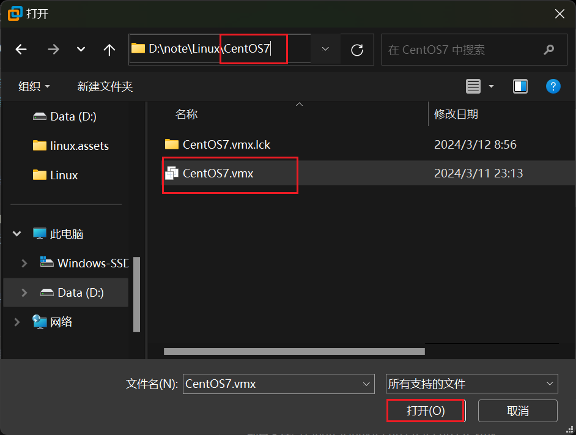
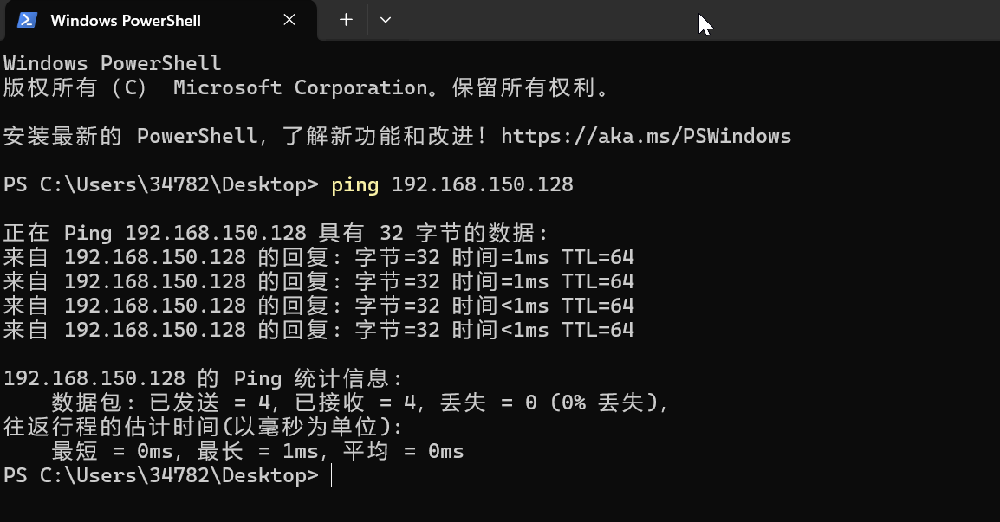
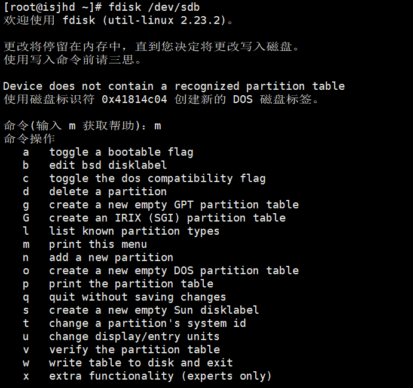
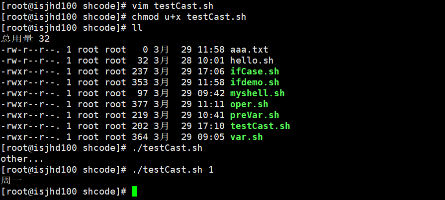
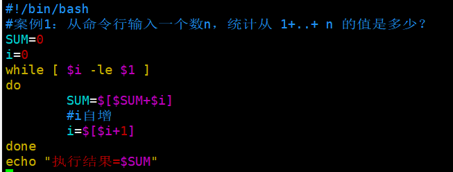

# linux


## Linux使用在哪些地方


## Linux的应用领域

- 个人桌面领域的应用
- 服务器领域linux在服务器领域的应用是最强的。
- 嵌入式领域


## Linux介绍


**Linux主要的发行版：**
Ubuntu(乌班图、RedHat(红帽)、CentOS、Debain[蝶变]、 Fedora、SuSE、OpenSUSE


## VM和 Linux 的安装

### 安装vm和Centos

学习Linux需要一个环境，我们需要创建一个虚拟机，然后在虚拟机上安装一个Centos系统来学习


- vmware17 下载

  自己去找，B站去搜

- vm安装的步骤

  先去看看支不支持虚拟化设备支持。
  不支持的话可参考这篇文章https://jingyan.baidu.com/article/ab0b56305f2882c15afa7dda.html

  [安装VM15.5](资料/韩顺平教育 安装VMWare15.5.docx)

- CentOS下载

  自己去找，B站去搜

- CentOS安装的步骤
  [安装CentOS7.6](资料/韩顺平教育 安装CentOS7.6.docx)

  

## Linux网络连接三种方式


## 虚拟机克隆


**方式1，直接拷贝一份安装好的虚拟机文件**





**方式2，使用vmwarel的克隆操作**
**注意，克隆时，需要先关闭inux系统**


## 虚拟机快照

如果你在使用虚拟机系统的时候（比如linux),你想回到原先的某一个状态，也就是说你担心可能有些误操作造成系统异常，需要回到原先某个正常运行的状态，vmware也提供了这样的功能，就叫快照管理。


## 虚拟机迁移和删除

我在前面讲过，虚拟系统安装好了，它的本质就是文件（放在文件夹的）。因此虚拟系统的迁移很方便，你可以把安装好的虚拟系统这个文件夹整体**拷贝或者剪切**到另外位置使用。

删除也很简单，用vmware进行移除，再点击菜单->从磁盘删除即可，或者直接手动删除虚拟系统对应的文件夹即可。


## 安装vmtools

**介绍**
vmtools 安装后，可以让我们在windows下更好的管理vm虚拟机
可以设置windows和centos的共享文件夹

**安装vmtools的步骤**


复制粘贴到 /opt文件夹


输入指令 cd /opt/


输入指令 tar -zxvf xx.tar.gz


然后一直回车就行


### 设置共享文件夹

为了方便，可以设置一个共享文件夹，比如说d:/myshare


打开虚拟机 /mnt/hgfs, 共享文件夹在这


## Linux目录结构

**基本介绍**
linux的文件系统是采用级层式的树状目录结构，在此结构中的最上层是根目录"/" ,然后在此目录下再创建其他的目录。

**在Linux世界里，一切皆文件**

**具体的目录结构**
 /bin [常用] (/usr/bin、 /usr/local/bin)
是Binary的缩写，这个目录存放着最经常使用的命令

/sbin (/usr/sbin、/usr/local/sbin)
s就是Super User的意思，这里存放的是系统管理员使用的系统管理程序。

/home [常用]
存放普通用户的主目录，在Linux中每个用户都有一个自己的目录，一般该目录名是以用户的账号命名

/root [常用]
该目录为系统管理员，也称作超级权限者的用户主目录

/lib 
系统开机所需要最基本的动态连接共享库，其作用类似于Windows里的DLL文件。几乎所有的应用程序都需要用到这些共享库

/lost + found 这个目录一般情况下是空的，当系统非法关机后，这里就存放了一些文件

/etc [常用]
所有的系统管理所需要的配置文件和子目录, 比如安装mysql数据库 my.conf

/usr [常用]
这是一个非常重要的目录，用户的很多应用程序和文件都放在这个目录下，类似与windows下的program files目录。

 /boot[常用] 
存放的是启动Linux时使用的一些核心文件，包括一些连接文件以及镜像文件

/proc 这个目录是一个虚拟的目录，它是系统内存的映射，访问这个目录来获取系统信息

/srv service缩写，该目录存放一些服务启动之后需要提取的数据

/sys 这是linux2.6内核的一个很大的变化。该目录下安装了2.6内核中新出现的一个文件系统sysfs

/tmp 这个目录是用来存放一些临时文件的

/dev
类似于windows的设备管理器，把所有的硬件用文件的形式存储

/media[常用]
linux系统会自动识别一些设备，例如U盘、光驱等等，当识别后，linux会把识别的设备挂载到这个目录下

/mnt[常用]
系统提供该目录是为了让用户临时挂载别的文件系统的，我们可以将外部的存储挂载在/mnt/上, 然后进入该目录就可以查看里的内容了。d:/myshare

/opt
这是给主机额外安装软件所摆放的目录。如安装ORACLE数据库就可放到该目录下。默认为空

/usr/local[常用]
这是另一个给主机额外安装软件所安装的目录。一般是通过编译源码方式安装的程序

/var[常用]
这个目录中存放着在不断扩充着的东西，习惯将经常被修改的目录放在这个目录下。包括各种日志文件

/selinux [security-enhanced linux]
SELinux是一种安全子系统，它能控制程序只能访问特定文件，有三种工作模式，可以自行设置


## 远程登录到Linux服务器

### 为什么需要远程登录Linux

说明：公司开发时候，具体的应用场景是这样的

1. linux服务器是开发小组共享
2. 正式上线的项目是运行在公网
3. 因此程序员需要远程登录到Linux进行项目管理或者开发
4. 远程登录客户端有Xshell6, Xftp6,我们学习使用 Xshell和Xftp6,其它的远程工具大同小异

### 远程登录Linux-Xshell7

- 介绍说明: Xshell 是目前最好的远程登录到Linux操作的软件,流畅的速度并且完美解决了中文乱码的问题，是目前程序员首选的软件。
- Xshell 是一个强大的安全终端模拟软件，它支持SSH1, SSH2,以及Microsoft Windows 平台的TELNET 协议。
- Xshell可以在Windows界面下用来访问远端不同系统下的服务器，从而比较好的达到远程控制终端的目的

下载：去B站自己搜

**查询linux服务器的ip地址**


查看两台系统是否互通


**Xshell中新建连接, 然后双击运行**


### 远程上传下载文件-Xftp7

- 介绍
  是一个基于 windows 平台的功能强大的SFTP、FTP 文件传输软件。使用了 Xftp 以后，windows用户能安全地在 UNIX/Linux和Windows PC 之间传输文件。

- 新建连接
  

- 解决乱码问题
  左上角>点文件>点当前会话属性>点选项>编码换成utf-8


## vi和vim的基本介绍

Linux 系统会内置 vi 文本编辑器

Vim具有程序编辑的能力,可以看做是Vi的增强版本,可以主动的以字体颜色辨别语法的正确性,方便程序设计。代码补完、编译及错误跳转等方便编程的功能特别丰富，在程序员中被广泛使用。

### vi和vim常用的三种模式

- **正常模式**
  以vim打开一个档案就直接进入一般模式了(这是默认的模式)。在这个模式中,你可以使用『上下左右』按键来移动光标，你可以使用『删除字符』或『删除整行』来处理档案内容，也可以使用『复制、粘贴』来处理你的文件数据。
- **插入模式**
  按下i,I,o,O,a,A,r,R等任何一个字母之后才会进入编辑模式，一般来说按i即可.
- **命令行模式**
  输入esc 再输入：在这个模式当中，可以提供你相关指令，完成读取、存盘、替换、离开vim、显示行号等的动作则是在此模式中达成的！


### 各种模式的相互切换


**快捷键使用练习**
拷贝当前行 yy,拷贝当前行向下的5行 5yy, 并粘贴（输入P)。

删除当前行dd,删除当前行向下的5行5dd

在文件中查找某个单词[命令行下/关键字，回车查找，输入 n 就是查找下一个

设置文件的行号，取消文件的行号.[命令行下：set nu和：set nonu

编辑/etc/profile文件，在一般模式下使用快捷键到该文档的最末行[G]和最首行[gg]

在一个文件中输入"hello”, 在一般模式下, 然后又撤销这个动作 u

编辑/etc/profile文件，在一般模式下, 并将光标移动到，输入20，再输入shift+g

更多的看整理的文档[韩顺平教育-vi 和 vim 的常用快捷键.docx](资料/韩顺平教育-vi 和 vim 的常用快捷键.docx)


## 关机&重启命令

**基本介绍**
shutdown -h now	立该进行关机
shudown -h 1 		 "hello,1 分钟后会关机了"
shutdown -r now 	现在重新启动计算机
halt 						 关机，作用和上面一样.
reboot 					 现在重新启动计算机
sync						 把内存的数据同步到磁盘.

**注意细节**
1.不管是重启系统还是关闭系统，首先要运行sync命令，把内存中的数据写到磁盘中。
2.目前的shutdown/reboot/halt等命令均已经在关机前进行了sync,老韩提醒:小心驶得万年船。


## 用户登录和注销

**基本介绍**
1.登录时尽量少用root帐号登录，因为它是系统管理员，最大的权限，避免操作失误。可以利用普通用户登录，登录后再用 "su - 用户名" 命令来切换成系统管理员身份.
2.在提示符下输入**logout**即可注销用户

**使用细节**
1.Iogout注销指令在图形运行级别无效，在运行级别3下有效
2.运行级别这个概念，后面给大家介绍


## 用户管理

**基本介绍**
Linux系统是一个多用户多任务的操作系统，任何一个要使用系统资源的用户，都必须首先向系统管理员申请一个账号，然后以这个账号的身份进入系统

### 添加用户

基本语法	useradd 用户名

应用案例	案例1：添加一个用户 milan，默认该用户的家目录在 /home/milan

细节说明
1·当创建用户成功后,会自动的创建和用户同名的家目录
2.也可以通过 useradd -d 指定目录新的用户名，给新创建的用户指定家目录


### 指定/修改密码

**基本语法**	passwd 用户名
**应用案例**	给milan指定密码


补充，显示当前用户所在的目录 **pwd**


### 删除用户

**基本语法**	userdel 用户名

**应用案例**
1.删除用户milan,但是要保留家目录，userdel milan
2.删除用户以及用户主目录	


**细节说明**
是否保留家目录的讨论？
一般情况下，我们建议保留


### 查询用户信息指令

**基本语法**	id 用户名

**应用实例**	案例：请查询root 信息


细节说明当用户不存在时，返回无此用户


### 切换用户

**介绍**
在操作Linux中，如果当前用户的权限不够，可以通过su - 指令，切换到高权限用户，比如root

**基本语法**	su - 切换用户名

**应用实例**	创建一个用户jack，指定密码，然后切换到jack

```shell
[root@isjhd ~]# useradd jack
[root@isjhd ~]# passwd jack
更改用户 jack 的密码 。
新的 密码：
无效的密码： 密码少于 8 个字符
重新输入新的 密码：
passwd：所有的身份验证令牌已经成功更新。
[root@isjhd ~]# su - jack
[jack@isjhd ~]$ su - root
密码：
上一次登录：四 3月 14 09:57:13 CST 2024从 192.168.150.1pts/0 上
```

**细节说明**
1.从权限高的用户切换到权限低的用户，不需要输入密码，反之需要。
2.当需要返回到原来用户时，使用exit / logout指令


###  查看当前用户 / 登录用户

**基本语法**	who am I


### 用户组

**介绍**
类似以于角色，系统可以对有共性的多个用户进行统一的管理

**新增组**
指令：groupadd 组名

**删除组**
指令(基本语法)：groupdel组名

**增加用户时直接加上组**
指令(基本语法)：useradd -g 用户组 用户名
增加一个用户 zwj, 直接将他指定到 wudang


**修改用户的组**
指令(基本语法)：usermod -g 用户组 用户名

创建一个组 mojiao，把zwj 放入到 mojiao


### 用户和组相关文件

**/etc/passwd 文件**
用户(user)的配置文件，记录用户的各种信息
每行的含义：用户名:口令:用户标识号:组标识号:注释性描述:主目录:登录Shell

**/etc/shadow 文件**
口令的配置文件
每行的含义：登录名:加密口令:最后一次修改时间:最小时间间隔:最大时间间隔:警告时间:不活动时间:失效时间:标志

**/etc/group 文件**
组(group)的配置文件，记录Linux包含的组的信息
每行含义：组名:口令:组标识号:组内用户列表


## 实用指令

### 指定运行级别

**运行级别说明：**
0：关机
1：单用户【找回丢失密码】
2：多用户状态没有网络服务
3：多用户状态有网络服务
4：系统未使用保留给用户
5：图形界面
6：系统重启
常用运行级别是3和5，也可以指定默认运行级别，后面演示

**应用实例**
命令：init [0123456] 
应用案例：通过init来切换不同的运行级别，比如动5-3，然后关机。

**CentOS7后运行级别说明**
在centos7以前，/etc/inittab文件中。

现在进行了简化，如下：
multi-user.target：运行级别3
graphical.target：运行级别5

查看运行级别：systemctl get-default

修改为运行级别3：systemctl set-default multi-user.target


### 找回 root 密码

假设root密码忘记了，请问如何找回密码

[linux找回root密码](资料/韩顺平教育--linux找回root密码.docx)


### 帮助指令

**man 获得帮助信息**
基本语法：man [命令或配置文件]（功能描述：获得帮助信息）
案例：查看Is命令的帮助信息 man ls
在linux下，隐藏文件是以 . 开头，选项可以组合使用，比如 ls -al，比如 ls -al /root

**help指令**
基本语法：help 命令（功能描述：获得shell内置命令的帮助信息）

**应用实例案例**：查看cd命令的帮助信息 help cd

**百度帮助更直接**
如果英语不太好的，也可以直接百度靠谱。


### 文件目录类

 **pwd指令**
基本语法：pwd(功能描述：显示当前工作目录的绝对路径)
应用实例：案例：显示当前工作目录的绝对路径

**ls指令**
基本语法：ls [选项] [目录或是文件]
常用选项	-a : 显示当前目录所有的文件和目录，包括隐藏的。
    			   -l : 以列表的方式显示信息
				  -h : 以人类容易看的懂的单位来显示单位

**cd 指令**
基本语法：cd [参数] (功能描述：切换到指定目录)
理解：绝对路径和相对路径
cd ~或者 cd : 回到自己的家目录，比如你是root，cd ~ 到 /root
cd.. 回到当前目录的上一级目录

**应用实例**
案例1：使用绝对路径切换到root目录.	cd/root
案例2：使用相对路径到/root目录.	比如在 /home/tom，cd ../../root
案例3：表示回到当前目录的上一级目录.	cd ..
案例4：回到家目录.	cd ~

**mkdir指令**
mkdir指令用于创建目录
基本语法 ：mkdir [选项] 要创建的目录
常用选项 -p：创建多级目录

**应用实例**
案例1:创建一个目录/home/dog	**mkdir /home/dog**
案例2:创建多级目录/home/animal/tiger	**mkdir -p /home/animal/tiger**

**rmdir指令**
rmdir指令删除空目录
基本语法
	rmdir [选项] 要删除的空目录
应用实例
	案例：删除一个目录home/dog	**rmdir /home/dog**
使用细节
	rmdir删除的是空目录，如果目录下有内容时无法删除的。
	提示：如果需要删除非空目录，需要使用 rm -rf 要删除的目录	**rm -rf /home/animal**

**touch指令**
touch:指令创建空文件
基本语法
	touch 文件名称

应用实例
	案例：创建一个空文件 hello.txt	**touch hello.txt**

**cp指令**
cp指令拷贝文件到指定目录

基本语法
cp [选项] source dest

常用选项
-r：递归复制整个文件夹

应用实例
案例1：将 /home/hello.txt拷贝到 /home/bbb目录下	**cp hello.txt bbb/**
案例2：递归复制整个文件夹，举例	比如将 /home/bbb 整个目录，拷贝到 /opt
**cp -r /home/bbb/ /opt/**

使用细节
强制覆盖不提示的方法：\cp	**\cp -r /home/bbb/ /opt/**

**rm指令**
说明：rm指令移除文件或目录

基本语法
	rm [选项] 要删除的文件或目录

常用选项
	-r：递归删除整个文件夹
	-f：强制删除不提示

应用实例
	案例1：将/home/hello.txt删除	**rm /home/hello.txt**
	案例2：递归删除整个文件夹 /home/bbb	**rm -r /home/bbb**

使用细节
	强制删除不提示的方法：带上 -f 参数即可

**mv指令**
mv移动文件与目录或重命名

基本语法
	mv oldNameFile newNameFile (功能描述：重命名)
	mv /temp/movefile /targetFolder (功能描述：移动文件)

应用实例
	案例1: 将 /home/cat.txt 文件 重新命名为 pig.txt	**mv cat.txt pig.txt**
	案例2: 将/home/pig.txt 文件 移动到 /root 目录下(相当于剪切)	**mv pig.txt /root/**
	案例3: 移动整个目录，比如将 /opt/bbb 移动到 /home下	**mv bbb/ /home/**

**cat指令**
cat 查看文件内容

基本语法
	cat [选项] 要查看的文件

常用选项
	-n:显示行号

应用实例
	案例1: /etc/profile 文件内容，并显示行号	**cat -n /etc/profile**

使用细节
	cat 只能浏览文件，而不能修改文件，为了浏览方便，一般会带上 管道命令 | more
	**cat -n /etc/profile | more**

**more指令**
more指令是一个基于VI编辑器的文本过滤器，它以全屏幕的方式按页显示文本文件的内容。more指令中内置了若干快捷键（交互的指令），详见操作说明


基本语法
	more要查看的文件

应用实例
	案例：采用more查看文件/etc/profile	**more /etc/profile**

**less指令**
less指令用来分屏查看文件内容，它的功能与more指令类似，但是比more指令更加强大,支持各种显示终端。less指令在显示文件内容时，并不是一次将整个文件加载之后才显示，而是根据显示需要加载内容，对于显示大型文件具有较高的效率。


基本语法
	less 要查看的文件

应用实例
	案例：采用less查看一个大文件文件/opt/杂文.txt	**less /opt/杂文.txt**

**echo指令**
echo输出内容到控制台

基本语法
	echo [选项] [输出内容]

应用实例
	案例：使用echo 指令输出环境变量, 比如输出 $PATH $HOSTNAME。	**echo $PATH**
	案例： 使用echo 指令输出 hello,world!	**echo "hello,world"**

**head指令**
head用于显示文件的开头部分内容，默认情况下head指令显示文件的前10行内容

基本语法
	head 文件	(功能描述:查看文件头10行内容)
	head -n 5 文件	(功能描述：查看文件头5行内容，5可以是任意行数)

应用实例
	案例：查看/etc/profile 的前面5行代码	**head -n 5 /etc/profile**

**tail指令**
tail用于输出文件中尾部的内容，默认情况下tail指令显示文件的前10行内容。

基本语法
tail 文件	(功能描述：查看文件尾10行内容)
tail -n 5 文件	(功能描述：查看文件尾5行内容，5可以是任意行数)
tail -f 文件	(功能描述：实时追踪该文档的所有更新)（Ctrl + c 退出）

应用实例
	案例1: 查看/etc/profile 最后5行的代码	**tail -n 5 /etc/profile**

​	案例2: 实时监控mydate.txt，看看到文件有变化时，是否看到，实时的追加。
​	一台终端上：**tail -f mydate.txt**
​	另一台终端上：**echo "hello" > /home/mydate.txt**

**>指令和>>指令**	>输出重定向和 >> 追加

基本语法
Is -I>文件	(功能描述：列表的内容写入文件a.txt中(覆盖写))
Is -al >>文件	(功能描述:列表的内容追加到文件aa.txt的末尾)
cat 文件1 > 文件2	(功能描述:将文件1的内容覆盖到文件2)
echo "内容">> 文件	(追加)

应用实例
	案例1：将/home 目录下的文件列表 写入到 /home/info.txt 中	**ls -l /home > /home/info.txt**
	案例2： 将当前日历信息 追加到 /home/mycal 文件中	**cal >> /home/mycal**

**In 指令**
软链接也称为符号链接，类似于windows里的快捷方式，主要存放了链接其他文件的路径

基本语法
	ln -s [原文件或目录] [软链接名]（功能描述：给原文件创建一个软链接）

应用实例
	案例1: 在/home 目录下创建一个软连接 myroot，连接到/root 目录	**ln -s /root/ /home/myroot**
	案例2:删除软连接 myroot	**rm /home/myroot**

细节说明
	当我们使用pwd指令查看目录时，仍然看到的是软链接所在目录。

**history指令**
查看已经执行过历史命令，也可以执行历史指令

基本语法
history(功能描述：查看已经执行过历史命令)

应用实例
	案例1：显示所有的历史命令.	**history**
	案例2：显示最近使用过的10个指令.	**history 10**
    案例3：执行历史编号为5的指令.	**!5**

### 时间日期类

**date指令-显示当前日期**

基本语法
date	(功能描述：显示当前时间)
date + %Y	(功能描述：显示当前年份)
date + %m	(功能描述：显示当前月份)
date + %d	(功能描述：显示当前是哪一天)
date "+%Y - %m - %d %H: %M: %S"	(功能描述：显示年月日时分秒)

应用实例
	案例1：显示当前时间信息	date
	案例2：显示当前时间年月日	date "+%Y- %m- %d"
	案例3：显示当前时间年月日时分秒	date "+%Y- %m- %d %H:%M:%S"

**date指令-设置日期**

基本语法
date -s 字符串时间

应用实例
	案例1：设置系统当前时间，比如设置成2020-11-11:22:22
	**date -s "2020-11-11:22:22"**

**cal指令**
查看日历指令

基本语法
cal [选项] (功能描述：不加选项，显示本月日历)

应用实例
	案例1：显示当前日历	**cal**
	案例2：显示2020年日历	**cal 2022**


### 搜索查找类

**find指令**
find指令将从指定目录向下递归地遍历其各个子目录，将满足条件的文件或者目录显示在终端。

基本语法
find [搜索范围] [选项]

选项说明


应用实例
案例1：按文件名：根据名称查找/home目录下的hello.txt文件
**find /home -name hello.txt**

案例2：按拥有者：查找/opt目录下，用户名称为root的文件
**find /opt -user root**

案例3：查找整个linux系统下大于200M的文件(+n大于 -n小于 n等于, 单位有k,M,G)
**find / -size +200M**

**locate指令**
locate指令可以快速定位文件路径。locate指令利用事先建立的系统中所有文件名称及路径的locate数据库实现快速定位给定的文件。Locate指令无需遍历整个文件系统，查询速度较快。为了保证查询结果的准确度，管理员必须定期更新locatel时刻

基本语法
locate 搜索文件

特别说明
由于locate指令基于数据库进行查询，所以第一次运行前，必须使用updatedb指令创建到ocate数据库。**updatedb**

应用实例
案例1：请使用locate指令快速定位hello.txt文件所在目录	**locate hello.txt**

额外补充
**which指令**，可以查看某个指令在哪个目录下，比如 ls 指令在哪个目录	**which ls**

**grep指令 和 管道符号 I**
grep 过滤查找，管道符，"I"，表示将前一个命令的处理结果输出传递给后面的命令处理。

基本语法
grep [选项] 查找内容 源文件

常用选项


应用实例
案例1： 请在 hello.txt 文件中，查找"yes"所在行，并且显示行号
写法1：**cat /home/hello.txt | grep -n "yes"**
写法2：**grep -n "yes" /home/hello.txt**


### 压缩和解压类

**gzip / gunzip 指令**
gzip 用于压缩文件，gunzip 用于解压的

基本语法
gzip 文件 (功能描述:压缩文件,只能将文件压缩为*.gz文件)
gunzip 文件.gz(功能描述：解压缩文件命令)

应用实例
案例1：gzip压缩，将/home下的 hello.txt文件进行压缩	**gzip /home/hello.txt**
案例2：gunzip压缩，将/home下的 hello.txt.gz 文件进行解压缩	**gunzip hello.txt.gz**

**zip / unzip指令**
zip用于压缩文件，uzip用于解压的，这个在项目打包发布中很有用的

基本语法
zip [选项] XXX.zip 将要压缩的内容（功能描述：压缩文件和目录的命令）
unzip [选项] XXX.zip（功能描述：解压缩文件）

zip常用选项
-r	递归压缩，即压缩目录

unzip的常用选项
-d	<目录>：指定解压后文件的存放目录

应用实例
案例1：将/home下的所有文件进行压缩成myhome.zip
**zip -r myhome.zip /home/**	[将home目录及其包含的文件和子文件夹都压缩]

案例2：将myhome.zip解压到/opt/tmp目录下
**unzip -d /opt/tmp /home/myhome.zip**

tar 指令
tar 指令是打包指令，最后打包后的文件是.tar.gz的文件。

基本语法
tar [选项] XXX.tar.gz 打包的内容	(功能描述：打包目录，压缩后的文件格式.tar.gz)

选项说明


应用实例
案例1：压缩多个文件，将 /home/pig.txt 和 /home/cat.txt 压缩成 pc.tar.gz
**tar -zcvf pc.tar.gz /home/pig.txt /home/cat.txt**

案例2：将 /home 的文件夹压缩成 myhome.tar.gz
**tar -zcvf myhome.tar.gz /home/**

案例3：将 pc.tar.gz 解压到当前目录
**tar -zxvf pc.tar.gz**

案例4：将 myhome.tar.gz 解压到 /opt/tmp2 目录下
**tar -zxvf /home/myhome.tar.gz -C /opt/tmp2**


## 组管理和权限管理

### Linux组基本介绍

在linux中的每个用户必须属于一个组，不能独立于组外。在linux中每个文件有所有者、所在组、其它组的概念。

1.所有者
2.所在组
3.其它组
4.改变用户所在的组

### 文件 / 目录 所有者

一般为文件的创建者，谁创建了该文件，就自然的成为该文件的所有者。

**查看文件的所有者**
指令: Is -ahl
应用实例


**修改文件所有者**
指令：chown 用户名 文件名

应用案例
要求:使用 root 创建一个文件 apple.txt，然后将其所有者修改成 tom	**chown jack apple.txt**


### 组的创建

基本指令
groupadd 组名

应用实例
创建一个组，monster	**groupadd monster**
创建一个用户fox，并放入到 monster组中	**useradd -g monster fox**


### 文件 / 目录 所在组

当某个用户创建了一个文件后，这个文件的所在组就是该用户所在的组。

**查看文件/目录所在组**
基本指令
Is-ahl

**修改文件所在的组**
基本指令
chgrp 组名 文件名

应用实例
使用root用户创建文件 orange.txt,看看当前这个文件属于哪个组,然后将这个文件所在组,修改到fruit组。
**1.groupadd fruit**
**2.touch orange.txt**
**3.看看当前这个文件属于哪个组 -> root组**
**4.chgrp fruit orange.txt**


### 其他组

 除文件的所有者和所在组的用户外，系统的其它用户都是文件的其它组

**改变用户所在组**
在添加用户时，可以指定将该用户添加到哪个组中，同样的用 root 的管理权限可以改变某个用户所在的组。

改变用户所在组
1.usermod -g 组名 用户名
2.usermod -d 目录名 用户名 改变该用户登陆的初始目录。特别说明：用户需要有进入到新目录的权限。

应用实例
将 zwj 这个用户从原来所在组，修改到wudang组。**usermod -g wudang zwj**


### 权限的基本介绍

 Is -l 中显示的内容如下：
-rwxrw-r-- 1 root root 1213 Feb 2 09:39 abc

0-9位说明
1.第0位确定文件类型(d,-,l,c,b)
	l是链接,相当于windows的快捷方式
	-代表是一个普通文件
	d是目录，相当于windows的文件夹
	c是字符设备文件，鼠标，键盘
	b是块设备，比如硬盘
2.第1-3位确定所有者（该文件的所有者）拥有该文件的权限。---User
3.第4-6位确定所属组（同用户组的）拥有该文件的权限，---Group
4.第7-9位确定其他用户拥有该文件的权限，---Other


### rwx权限详解

**rwx作用到文件**
1.[r]代表可读(read)：可以读取,查看
2.[w]代表可写(write)：可以修改,但是不代表可以删除该文件,删除一个文件的前提条件是对该文件所在的目录有写权限，才能删除该文件
3.[x]代表可执行(execute):可以被执行

**rwx作用到目录**
1.[r]代表可读(read)：可以读取，Is查看目录内容
2.[w]代表可写(write)：可以修改,对目录内创建+删除+重命名目录
3.[x]代表可执行(execute)：可以进入该目录

**对文件夹rwx 的细节讨论和测试**
x: 表示可以进入到该目录，比如cd
r: 表示可以ls，将目录的内容显示
w: 表示可以在该目录，删除或者创建文件


### 文件及目录权限实际案例

**ls -l 中显示的内容如下：**
-rwxrw-r--1 root root 1213 Feb 2 09:39 abc

10个字符确定不同用户能对文件干什么
第一个字符代表文件类型：- I d c b
其余字符每3个一组(rwx) 读(r) 写(w) 执行(x)
第一组rwx：文件拥有者的权限是读、写和执行
第二组rw-：与文件拥有者同一组的用户的权限是读、写但不能执行
第三组r--：不与文件拥有者同组的其他用户的权限是读不能写和执行

可用数字表示为：r=4,w=2,x=1 因此 rwx=4+2+1=7

其它说明
	1					文件的数量加子目录的数量
	root				用户
	root				组
	1213			  文件大小（字节），如果是文件夹，显示4096字节
	Feb 2 09:39   最后修改日期
	abc				文件名


### 修改权限-chmod

基本说明：通过chmod指令，可以修改文件或者目录的权限。

**第一种方式：+、-、= 变更权限**
u:所有者 g:所有组 o:其他人 a:所有人(u、g、o的总和)
1.chmod u=rwx,g=rx,o=x 文件/目录名
2.chmod o+w 文件/目录名
3.chmod a-x 文件/目录名

案例演示
1.给abc文件的所有者读写执行的权限，给所在组读执行权限，给其它组读执行权限。
**chmod u=rwx,g=rx,o=rx abc**

2.给abc文件的所有者除去执行的权限，增加组写的权限
**chmod u-x,g+w abc**

3.给abc文件的所有用户添加读的权限
**chmod a+r abc**

**第二种方式：通过数字变更权限**

r=4 w=2 x=1	rwx=4+2+1=7
chmod u=rwx,g=rx,o=x 文件目录名
相当于 chmod 751 文件目录名

案例演示
要求：将/home/abc.txt 文件的权限修改成 rwxr-xr-x, 使用给数字的方式实现：
**chmod 755 /home/abc.txt**


### 修改文件所有者-chown

基本介绍
chown newowner 文件/目录 改变所有者
chown newowner:newgroup 文件/目录 改变所有者和所在组
-R 如果是目录 则使其下所有子文件或目录递归生效

案例演示
请将 /home/abc.txt 文件的所有者修改成 tom
**chown tom /home/abc.txt**

请将/home/bbb 目录下所有的文件和目录的所有者都修改成tom
**chown -R jack /home/bbb**


### 修改文件所在组-chgrp

基本介绍
chgrp newgroup 文件/目录 改变所在组

案例演示
请将 /home/abc.txt 文件的所在组修改成 shaolin(少林)
**groupadd shaolin**
**chgrp shaolin /home/abc.txt**

请将/home/bbb 目录下所有的文件和目录的所在组都修改成 shaolin(少林)
**chgrp -R shaolin /home/bbb**


### 权限管理应用实例


## 定时任务调度

### crond 任务调度

crontab 进行 定时任务的设置

**概述**
任务调度: 是指系统在某个时间执行的特定的命令或程序。
任务调度分类: 1.系统工作：有些重要的工作必须周而复始地执行。如病毒扫描等
个别用户工作: 个别用户可能希望执行某些程序，比如对mysql数据库的备份。
    

**基本语法**
crontab [选项]

**常用选项**


**快速入门**
设置任务调度文件：/etc/crontab
设置个人任务调度。执行crontab-e命令。
接着输入任务到调度文件
如：*/1 ls -l /etc/ > /tmp/to.txt
意思说每小时的每分钟执行ls -l /etc/>/tmp/to.txt命令

**参数细节说明**
5个占位符的说明


**特殊符号的说明**


**特殊时间执行任务案例**


**应用案例**
案例1：每隔1分钟，就将当前的日期信息，追加到 /tmp/mydate文件中
***/1  date >> /tmp/mydate**

案例2：每隔1分钟，将当前日期和日历都追加到 home/mycal文件中
(1) vim /home/my.sh 写入内容 date >> /home/mycal 和 cal >> /home/mycal
(2) 给 my.sh 增加执行权限，chmod u+x /home/my.sh
(3) crontab -e 增加 */1 * * * * /home/my.sh 

案例3：每天凌晨2:00将mysql数据库testdb,备份到文件中。提示：指令为mysqldump-u root-p密码数据库>>home/db.bak
crontab -e
0 2 * * * mysqldump -u root -proot testdb >> /home/db.bak

**crond 相关指令**
crontab -r：终止任务调度。
crontab -l：列出当前有那些任务调度
service crond restart [重启任务调度]


### at定时任务

**基本介绍**
1.at命令是一次性定时计划任务，at的守护进程atd会以后台模式运行，检查作业队列来运行。
2.默认情况下，atd守护进程每60秒检查作业队列,有作业时,会检查作业运行时间,如果时间与当前时间匹配，则运行此作业。
3.at命令是一次性定时计划任务，执行完一个任务后不再执行此任务了
4.在使用at命令的时候，一定要保证atd进程的启动，可以使用相关指令来查看
	ps -ef | grep atd 是检测当前所有正在运行的进程有哪些
5.示意图


**at命令格式**
at [选项] [时间]
Ctrl + D 结束at命令的输入

**at命令选项**


**at时间定义**
at指定时间的方法：
1.接受在当天的hh:mm（小时：分钟）式的时间指定。假如该时间已过去，那么就放在第二天执行。 例如：04:00
2.使用midnight (深夜) , noon (中午) , teatime (饮茶时间,一般是下午4点) 等比较模糊的词语来指定时间。
3.采用12小时计时制,即在时间后面加上AM (上午)或PM(下午)来说明是上午还是下午。例如: 12pm
4.指定命令执行的具体日期, 指定格式为month day (月 日)或mm/dd/yy (月/日/年)或dd.mm.yy(日.月.年) 指定的日期必须跟在指定时间的后面。例如：04:00 2021-03-1.
5.使用相对计时法。指定格式为: now + count time-units , now就是当前时间, time-units是时间单位,这里能够是minutes（分钟）、hours（小时）、days（天）、weeks（星期）。count是时间的数量，几天，几小时。例如：now+ 5 minutes
6.直接使用today（今天）、tomorrow（明天）来指定完成命令的时间。

**应用实例**
案例1：2天后的下午5点执行/bin/ls /home


案例2：atq命令来查看系统中没有执行的工作任务


案例3：明天17点钟，输出时间到指定文件内比如/root/date100.log


案例4：2分钟后，输出时间到指定文件内比如/root/date200.log


案例5：删除已经设置的任务，atrm编号


## Linux磁盘分区、挂载

### Linux分区

**原理介绍**
1.Linux来说无论有几个分区，分给哪一目录使用，它归根结底就只有一个根目录，一个独立且唯一的文件结构，Liunx中每个分区都是用来组成整个文件系统的一部分。
2.Liux采用了一种叫“载入”的处理方法，它的整个文件系统中包含了一整套的文件和目录，且将一个分区和一个目录联系起来。这时要载入的一个分区将使它的存储空间在一个目录下获得。

**硬盘说明**
Linux硬盘分IDE硬盘和SCSI硬盘，目前基本上是SCSI硬盘

对于IDE硬盘,驱动器标识符为"hdx~", 其中"hd"表明分区所在设备的类型,这里是指IDE硬盘了。“x”为盘号（a为基本盘，b为基本从属盘，c为辅助主盘，d为辅助从属盘)，”~”代表分区前四个分区用数字1到4表示,它们是主分区或扩展分区,从5开始就是逻辑分区。例,hda3表示为第一个IDE硬盘上的第三个主分区或扩展分区,hdb2表示为第二个IDE硬盘上的第二个主分区或扩展分区。

对于SCSI硬盘则标识为“sdx~”，SCSI硬盘是用“sd”来表示分区所在设备的类型的，其余则和IDE硬盘的表示方法一样。

**查看所有设备挂载情况**
命令：lsblk 或者 lsblk -f


### 挂载的经典案例

**说明**：下面我们以增加一块硬盘为例来熟悉下磁盘的相关指令和深入理解磁盘分区、挂载、卸载的概念。

#### 虚拟机增加硬盘

**步骤1**


重启系统

**步骤2**
分区命令 fdisk /dev/sdb

开始对 /sdb分区
m 显示命令列表
p 显示磁盘分区 同 fdisk -l
n 新增分区
d 删除分区
w 写入并退出
说明：开始分区后输入n，新增分区，然后选择p，分区类型为主分区。两次回车默认剩余全部空间。最后输入w写入分区并退出，若不保存退出输入q。




**步骤3**
格式化磁盘
分区命令：mkfs -t ext4 /dev/sdb1
其中ext4是分区类型


**步骤4**
挂载:将一个分区与一个目录联系起来,
mount 设备名称 挂载目录
例如: mount /dev/sdb1 /newdisk
umount 设备名称 或者 挂载目录
例如: umount /dev/sdb1 或者 umount /newdisk

注意：用命令行挂载重启后会失效


把分区跟目录之间的关系去掉


**步骤5**
永久挂载：通过修改/etc/fstab实现挂载
添加完成后 执行mount -a 即刻生效


### 磁盘情况查询

**查询系统整体磁盘使用情况**

基本语法
df -h

应用实例
查询系统整体磁盘使用情况


**查询指定目录的磁盘占用情况**

基本语法
du -h /目录
查询指定目录的磁盘占用情况,默认为当前目录
-s 指定目录占用大小汇总
-h 带计量单位
-a含文件
--max-depth=1 子目录深度
-c 列出明细的同时，增加汇总值

应用实例
查询 /opt 目录的磁盘占用情况，深度为1


### 磁盘情况-工作实用指令

1.统计/opt文件夹下文件的个数	**ls -l /opt | grep "^-" | wc -l**
2.统计/opt文件夹下目录的个数	**ls -l /opt | grep "^d" | wc -l**
3.统计/opt文件夹下文件的个数，包括子文件夹里的	**ls -lR /opt | grep "^-" | wc -l**
4.统计/opt文件夹下目录的个数，包括子文件夹里的	**ls -lR /opt | grep "^d" | wc -l**
5.以树状显示目录结构，注意，如果没有tree，则使用 yum install tree 安装	**tree /opt**


## 网络配置

### 查看网络IP和网关

**查看虚拟网络编辑器和修改IP地址**


**查看网关**


**查看windows环境的中VMnet8网络配置(ipconfig指令)**


查看linux的网络配置 **ifconfig**


### ping 测试主机之间网络连通性

基本语法
ping 目的主机（功能描述：测试当前服务器是否可以连接目的主机）

应用实例
测试当前服务器是否可以连接百度 ping www.baidu.com

### linux网络环境配置

**第一种方法（自动获取）**：
说明：登陆后，通过界面的来设置自动获取ip,特点：liunx启动后会自动获取IP,缺点是每次自动获取的ip地址可能不一样。

**第二种方式（指定ip）**:
说明
直接修改配置文件来指定IP, 并可以连接到外网（程序员推荐vim /etc/sysconfig/network-scripts/ifcfg-ens33
要求：将ip地址配置的静态的，比如：ip地址为192.168.200.130

ifcfg-ens33文件说明
DEVICE=eth0	#接口名（设备网卡）
HWADDR=00:0C:2x:6x:0x:Xx	#MAC地址
TYPE=Ethernet	#网络类型（通常是Ethemet）
UUID=926a57ba-92c6-4231-bacb-f27e5e6a9f44	#随机id
#系统启动的时候网络接口是否有效(yes/no）
ONBOOT=yes
#IP的配置方法[none|static|bootp|dhcp] （引导时不使用协议|静态分配IP|BOOTP协议|DHCP协议） 
BOOTPROTO=static 
#IP地址
IPADDR=192.168.200.130
#网关
GATEWAY=192.168.200.2
#域名解析器
DNS1=192.168.200.2


重启网络服务或者重启系统生效
service network restart、reboot


### 设置主机名和hosts映射

**设置主机名**
1.为了方便记忆，可以给linux系统**设置主机名**，也可以根据需要修改主机名
2.指令 hostname：查看主机名
3.修改文件在/etc/hostname 指定
4.修改后，重启生效

**设置hosts映射**
思考：如何通过 主机名能够找到(比如ping) 某个linux系统？

**windows**
在 C:\Windows\System32\drivers\etc\hosts 文件指定即可
案例：192.168.200.128 isjhd100 


没有权限的右键属性→安全→找到自己用的用户勾上完全控制就可以了保存后再取消完全控制就行了


**linux** 
在/etc/hosts文件指定
案例： 192.168.200.1 ThinkPad-PC


### 主机名解析过程分析(Hosts、DNS)

#### Hosts是什么

一个文本文件，用来记录IP和Hostname(主机名)的映射关系

**DNS**
1.DNS,就是Domain Name Systeml的缩写，翻译过来就是域名系统
2.是互联网上作为域名和IP地址相互映射的一个分布式数据库


## 进程管理(重点)

### 基本介绍

1.在linux中，每个**执行的程序**都称为一个进程。每一个进程都分配一个ID号(pid，进程号)。

2.每个进程都可能以两种方式存在的。前台与后台，所谓前台进程就是用户目前的屏幕上可以进行操作的。后台进程则是实际在操作,但由于屏幕上无法看到的进程,通常使用后台方式执行。

3.一般系统的服务都是以后台进程的方式存在，而且都会常驻在系统中。直到关机才才结束。


### 显示系统执行的进程

**基本介绍**
ps命令是用来查看目前系统中，有哪些正在进行，以及它们进行的状况。可以不加任何参数.


#### ps指令详解

指令：ps-aux | grep xxx，比如我看看有没有sshd服务
指令说明
System V展示风格
USER:用户名称
PID：进程号
%CPU：进程占用CPU的百分比
%MEM：进程占用物理内存的百分比
VSZ：进程占用的虚拟内存大小（单位：KB）
RSS：进程占用的物理内存大小（单位：KB）
TT：终端名称，缩写.
STAT：进程状态，其中S-睡眠，s-表示该进程是会话的先导进程，N-表示进程拥有比普通优先级更低的优先级，R-正在运行，D-短期等待，Z-僵死进程，T-被跟踪或者被停止等等
STARTED:进程的启动时间
TIME：CPU时间，即进程使用CPU的总时间
COMMAND：启动进程所用的命令和参数，如果过长会被截断显示


#### 父子进程

**应用实例**
要求：以全格式显示当前所有的进程，查看进程的父进程。查看sshd的父进程信息

ps -ef是以全格式显示当前所有的进程
-e显示所有进程。-f全格式
ps -ef | grep sshd
是BSD风格
UID: 用户ID
PID: 进程ID
PPID:父进程ID
C: CPU用于计算执行优先级的因子。数值越大，表明进程是CPU密集型运算，执行优先级会降低; 数值越小，表明进程是I/O密集型运算，执行优先级会提高
STIME:进程启动的时间
TTY:完整的终端名称
TIME:CPU时间
CMD：启动#程所用的命念和参数


### 终止进程Kill和Killall

**介绍：**
若是某个进程执行一半需要停止时，或是已消耗了很大的系统资源时，此时可以考虑停止该进程。使用kll命令来完成此项任务。

**基本语法**
kll [选项] 进程号（功能描述：通过进程号杀死进程）
killall 进程名称（功能描述：通过进程名称杀死进程，也支持通配符，这在系统因负载过大而变得很慢时很有用)

**常用选项**
-9 表示强迫进程立即停止

**最佳实践**
案例1：踢掉某个非法登录用户	**kill 进程号(PID)**
案例2：终止远程登录服务sshd,在适当时候再次重启sshd服务	


案例3：终止多个gedit,  **killall gedit**
案例4：强制杀掉一个终端	**kill -9 进程号(PID)**


### 查看进程树pstree

**基本语法**
pstree [选项] ，可以更加直观的来看进程信息

**常用选项**
-p：显示进程的PID
-u：显示进程的所属用户

**应用实例**
案例1：请以树状的形式显示进程的pid	**pstree -p**
案例2：请以树状的形式显示进程的用户id	**pstree -u**


### 服务管理

**介绍**
服务(service)本质就是进程，但是是运行在后台的，通常都会监听某个端口，等待其它程序的请求，比如(mysqld, sshd防火墙等)，因此我们又称为守护进程，是Linux中非常重要的知识点。


#### service管理指令

1.service服务名 [start | stop | restart | reload | status]
2.在CentOS7.0后很多服务不再使用service,而是systemctl(后面专门讲)
3.service指令管理的服务在 /etc/init.d 查看


**service管理指令案例**
请使用service指令，查看，关闭，启动network [注意：在虚拟系统演示，因为网络连接会关闭]


#### 查看服务名

方式1：使用setup -> 系统服务就可以看到全部。	**setup**
方式2：/etc/init.d 看到 service 指令管理的服务	**Is -l /etc/init.d**


#### 服务的运行级别(runlevel):

Linux系统有7种运行级别(runlevel)：**常用的级别3和5**
运行级别0：系统停机状态，系统默认运行级别不能设为0，否则不能正常启动
运行级别1：单用户工作状态，root权限，用于系统维护，禁止远程登陆
运行级别2：多用户状态(没有NFS)，不支持网络
运行级别3：完全的多用户状态(有NFS)，无界面，登陆后进入控制台命令行模式
运行级别4：系统未使用，保留
运行级别5：X11控制台，登陆后进入图形GUI模式
运行级别6：系统正常关闭并重启，默认运行级别不能设为6，否则不能正常启动


#### 开机的流程说明：


#### CentOS7后运行级别说明

在 /etc/initab
**multi-user.target**：analongous to runlevel 3
**graphical.target**：analogous to runlevel 5

查看运行级别：**systemctl get-default**

修改运行级别：**systemctl set-default multi-user.target**


#### chkconfig指令

**介绍**
1.通过chkconfig 命令可以给服务的各个运行级别设置自启动 / 关闭
2.chkconfig 指令管理的服务在 /etc/init.d 查看
3.注意：Centos7.0后，很多服务**使用systemctl **管理（后面马上讲）

**chkconfig 基本语法**
查看服务 chkconfig --list | grep xxx
chkconfig 服务名 --list
chkconfig --level 5 服务名 on/off

**案例演示**：对 network 服务 进行各种操作，把network 在3运行级别，关闭自启动
chkconfig --level 3 network off
chkconfig --level 3 network on

**使用细节**
chkconfig 重新设置服务后自启动或关闭，需要重启机器reboot生效


#### systemctl指令

**systemctl管理指令**
1.基本语法：systemctl [start | stop | restart | status] 服务名
2.systemctl指令管理的服务在 /usr/lib/systemd/system 查看

**systemctl设置服务的自启动状态**
1.systemctl list-unit-files [ | grep 服务名]（查看服务开机启动状态， grep 可以进行过滤）
2.systemctl enable 服务名（设置服务开机启动）
3.systemctl disable 服务名（关闭服务开机启动）
4.systemctl is-enabled 服务名（查询某个服务是否是自启动的）

**应用案例**
查看当前防火墙的状况，关闭防火墙和重启防火墙。=> firewalld.service
systemctl status firewalld
systemctl stop firewalld
systemctl start firewalld

细节讨论：
1.关闭或者启用防火墙后，立即生效。[telnet 测试 某个端口即可]，
telnet问题控制面板--程序和功能--启动或关闭功能---勾选talnet服务--ole
2.这种方式只是临时生效，当重启系统后，还是回归以前对服务的设置。
3.如果希望设置某个服务自启动或关闭永久生效，要使用 systemctl [enable|disable] 服务名。


#### firewall指令

**打开或者关闭指定端口**
在真正的生产环境，往往需要将防火墙打开，但问题来了，如果我们把防火墙打开，那么外部请求数据包就不能跟服务器监听端口通讯。这时，需要打开指定的端口。比如80、22、8080等，这个又怎么做呢？

打开端口： firewall-cmd --permanent --add-port=端口号/协议
关闭端口： firewall-cmd --permanent --remove-port=端口号/协议
重新载入,才能生效：firewall-cmd --reload
查询端口是否开放：firewall-cmd --query -port=端口/协议

**应用案例**
1.启用防火墙，测试 111端口是否能 telnet
firewall-cmd --permanent --add-port=111/tcp
firewall-cmd --reload
firewall-cmd --query-port=111/tcp
window电脑测试111端口 telnet 192.168.200.128 111

2.开放111端口
firewall-cmd --permanent --add-port=111/tcp
需要firewall-cmd --reload

3.再次关闭111端口
firewall-cmd --permanent --remove-port=111/tcp
需要firewall-cmd --reload


## 动态监控进程

**介绍**
top与ps命令很相似。它们都用来显示正在执行的进程。Top与ps最大的不同之处，在于top在执行一段时间可以更新正在运行的的进程。


### 基本语法

top [选项]


**选项说明**


### 交互操作说明


**应用实例**
案例1.监视特定用户
top: 输入此命令，按回车键，查看执行的进程。
u:然后输入“u”回车，再输入用户名，即可

案例2：终止指定的进程。
top: 输入此命令，按回车键，查看执行的进程。
k: 然后输入“k”回车，再输入要结束的进程ID号

案例3指定系统状态更新的时间（每隔10秒自动更新）：
top -d 10


## 监控网络状态

**查看系统网络情况netstat**
基本语法
netstat [选项]

选项说明
-an 按一定顺序排列输出
-P 显示哪个进程在调用

应用案例
请查看服务名为 sshd 的服务的信息。**netstat -anp | grep sshd**

**检测主机连接命令ping**
是一种网络检测检测工具，它主要是用检测远程主机是否正常，或是两部主机间的网线或网卡故障。
**如：ping 对方ip地址**


## RPM 与 YUM

### rpm包的管理

**介绍**
rpm用于互联网下载包的打包及安装工具，它包含在某些Linux分发版中。它生成具有.RPM扩展名的文件。RPM是RedHat Package Manager ( RedHat软件包管理工具)的缩写,类似windows的setup.exe，这一文件格式名称虽然打上了RedHat的标志，但理念是通用的。

Linux的分发版本都有采用（suse,redhat, centos等等)，可以算是公认的行业标准了。

**rpm包的简单查询指令**
查询已安装的rpm列表 rpm -qa | grep xx

**rpm包名基本格式**
一个rpm包名：firefox-60.2.2-1.el7.centos.x86_64
名称：firefox
版本号：60.2.2-1
适用操作系统：el7.centos.x86_64
表示centos7.X的64位系统
如果是i686、i386表示32位系统，noarch表示通用。

**rpm包的其它查询指令**
rpm -qa：查询所安装的所有rpm软件包
rpm -qa | more
rpm -qa | grep X (rpm -qa | grep firefox)

rpm -q 软件包名：查询软件包是否安装
案例：rpm -q firefox

rpm -qi 软件包名：查询软件包信息
案例：rpm -qi firefox
rpm -ql 软件包名：查询软件包中的文件
比如：rpm -ql firefox

rpm -qf 文件全路径名 查询文件所属的软件包
rpm -qf /etc/passwd

**卸载rpm包**
基本语法
rpm -e RPM包的名称

应用案例
删除firefox 软件包	rpm -e firefox

细节讨论
1.如果其它软件包依赖于您要卸载的软件包,卸载时则会产生错误信息。
如: $ rpm -e foo
removing these packages would break dependencies:foo is needed by bar-1.0-1
1.如果我们就是要删除 foo这个rpm 包，可以增加参数 --nodeps，就可以强制删除，但是一般不推荐这样做,因为依赖于该软件包的程序可能无法运行
如:$ rpm -e --nodeps foo

**安装rpm包**
基本语法
rpm -ivh RPM包全路径名称

参数说明
i=install 安装
v=verbose 提示
h=hash 进度条

应用实例
演示卸载和安装firefox浏览器


## yum

**介绍**
Yum 是一个Shell前端软件包管理器。基于RPM包管理，能够从指定的服务器自动下载RPM包并且安装，可以自动处理依赖性关系，并且一次安装所有依赖的软件包。

yum的基本指令
查询yum服务器是否有需要安装的软件
yum list | grep xx软件列表

安装指定的yum包
yum install xxx 下载安装

yum应用实例
案例：请使用yum的方式来安装firefox
rpm -e firefox
yum list | grep firefox
yum install firefox


## 搭建JavaEE环境

如果需要在Linux下进行JavaEE的开发，我们需要安装如下软件


### 安装JDK

安装步骤

1. mkdir /opt/jdk
2. 通过xftp6 上传到 /opt/jdk 下
3. cd /opt/jdk
4. 解压 tar -zxvf jdk-8u261--linux-x64.tar.gz
5. mkdir /usr/local/java
6. mv /opt/jdk/jdk1.8.0_261 /usr/local/java
7. 配置环境变量的配置文件vim /etc/profile
8. export JAVA_HOME=/usr/local/java/jdk1.8.0_261
9. export PATH=$JAVA_HOME/bin:$PATH
10. source /etc/profile [让新的环境变量生效]

测试是否安装成功
编写-个简单的Hello.java输出"hello,world!"


### 安装tomcat

**步骤**

1. 上传安装文件，并解压缩到 /opt/tomcat
2. 进入解压目录/bin, 启动tomcat    **./startup.sh**
3. 开放端 8080
   firewall-cmd --permanent add-port=8080/tcp
   firewall-cmd --permanent --add-port=8080/tcp
   firewall-cmd --reload
   firewall-cmd --query-port=8080/tcp

测试是否安装成功：在windows、Linux下访 http/linuxip:8080


### idea2020的安装

**步骤**
1.下载地址：https:/www.jetbrains.com/idea/download/#section=windows 
2.解压缩到 /opt/idea
3.启动idea bin目录下，./idea.sh，配置jdk
4.编写Hello world程序并测试成功！


### mysql5.7的安装

[安装文档](资料/韩顺平教育--centos安装mysql5.7.docx)


## Shell编程

**为什么要学习Shell编程**
1.Linux运维工程师在进行服务器集群管理时，需要编写Shell程序来进行服务器管理
2.对于JavaEE和Python程序员来说，工作的需要，你的老大会要求你编写一些Shell脚本进行程序或者是服务器的维护，比如编写一个定时备份数据库的脚本。
3.对于大数据程序员来说，需要编写Shel程序来管理集群。

**Shell是什么**
Shell是一个命令行解释器，它为用户提供了一个向Linux内核发送请求以便运行程序的界面系统级程序，用户可以用Shell来启动、挂起、停止甚至是编写一些程序。


### Shell脚本的执行方式

**脚本格式要求**
脚本以#!/bin/bash开头
脚本需要有可执行权限

**编写第一个Shell脚本**
需求说明：创建一个Shell脚本，输出hello world!
vim hello.sh
#!/bin/bash
echo "hello,world"

**脚本的常用执行方式**
方式1(输入脚本的绝对路径或相对路径)	**./hello.sh 或 /root/shcode/hello.sh**
说明：首先要赋予helloworld.sh 脚本的+x权限，再执行脚本

方式2(sh+脚本)	**sh hello.sh**
说明：不用赋予脚本+x权限，直接执行即可。


### Shell的变量

**Shell变量介绍**
1.Linux Shell中的变量分为，系统变量和用户自定义变量
2.系统变量：$HOME、$PWD、$SHELL、$USER等等，比如：echo $HOME等等.
3.显示当前shell中所有变量：set

**shell变量的定义**
基本语法
1.定义变量：变量名=值
2.撤销变量：unset变量
3.声明静态变量：readonly变量，注意：不能unset

**快速入门**
案例1：定义变量A
案例2：撤销变量A
案例3：声明静态的变量B=2, 不能unset


案例4：可把变量提升为全局环境变量，可供其他shell程序使用


**shell变量的定义**
定义变量的规则
1.变量名称可以由字母、数字和下划线组成，但是不能以数字开头。5A=200❌
2.等号两侧不能有空格
3.变量名称一般习惯为大写

将命令的返回值赋给变量
1.A=&grave;date&grave;反引号，运行里面的命令，并把结果返回给变量A
2.A=$(date) 等价于反引号


### 设置环境变量

**基本语法**
1.export 变量名=变量值	(功能描述：将shell变量输出为环境变量)
2.source 配置文件	(功能描述：让修改后的配置信息立即生效)
3.echo $变量名	(功能描述：查询环境变量的值)

快速入门
1.在/etc/profile文件中定义TOMCAT_HOME环境变量
2.查看环境变量TOMCAT_HOME的值
3.在另外一个shell程序中使用TOMCAT_HOME


注意：在输出TOMCAT_HOME环境变量前，需要让其生效source /etc/profile

shell脚本的多行注释	**:<<! 内容 !**


### 位置参数变量

**介绍**
当我们执行一个shell脚本时，如果希望获取到命令行的参数信息，就可以使用到位置参数变量比如 	./myshell.sh 100 200，这个就是一个执行shell的命令行，可以在myshell 脚本中获取到参数信息

**基本语法**
$n（功能描述：n为数字，$0代表命令本身，$1-$9代表第一到第九个参数，十以上的参数，十以上的参数需要用大括号包含，如${10}）
$* (功能描述:这个变量代表命令行中所有的参数, $*把所有的参数看成一个整体)
$@（功能描述：这个变量也代表命令行中所有的参数，不过$@把每个参数区分对待）
$#（功能描述：这个变量代表命令行中所有参数的个数）

**位置参数变量**
案例：编写一个shell脚本 myshell.sh，在脚本中获取到命令行的各个参数信息。


### 预定义变量

**基本介绍**
就是shell设计者事先已经定义好的变量，可以直接在shell脚本中使用

**基本语法**
$$	(功能描述：当前进程的进程号(PID))
$!	(功能描述：后台运行的最后一个进程的进程号(PID))
$?	(功能描述：最后一次执行的命令的返回状态。如果这个变量的值为0，证明上一个命令正确执行；如果这个变量的值为非0（具体是哪个数，由命令自己来决定），则证明上一个命令执行不正确了。)

应用实例
在一个shell脚本中简单使用一下预定义变量preVar.sh


### 运算符

**基本介绍**
学习如何在shell中进行各种运算操作。

**基本语法**
1."$((运算式))" 或 "$[运算式]" 或者expr m + n
2.注意expr运算符间要有空格
3.expr m-n
4.expr &bsol;*, /, % 乘, 除, 取余

**应用实例**
案例1：计算(2+3) * 4的值
案例2：请求出命令行的两个参数[整数]的和 20 50


### 条件判断

**判断语句**
基本语法
[ condition ] (注意condition前后要有空格)
#非空返回true，可使用$?验证（0为true，>1为false）

**应用实例**
[ hspEdu ]	返回true
[ ]	返回false
[ condition ] && echo OK || echo notok	条件满足，执行后面的语句

**常用判断条件**
1) = 字符串比较
2) 两个整数的比较
-It 小于
-le 小于等于
-eq 等于
-gt 大于
-ge 大于等于
-ne 不等于
3) 按照文件权限进行判断
-r 有的权限
-w 有写的权限
-x 有执行的权限
4)按照文件类型进行判断
-f 文件存在并且是一个常规的文件
-e 文件存在
-d 文件存在并是一个目录

**应用实例**
案例1:"ok"是否等于"ok"
判断语句：使用 =
案例2：23是否大于等于22
判断语句：使用 -ge
案例3:/root/shcode/aaa.txt 目录中的文件是否存在
判断语句：使用 -f


### 流程控制

#### if判断

**基本语法**
if [ 条件判断试 ] 
then
代码
fi
**或者, 多分支**
if [条件判断试]
then
代码
elif [ 条件判断式 ]
then
代码
fi
**注意事项**：[ 条件判断式 ]，中括号和条件判断式之间必须有空格
**应用实例** ifCase.sh
**案例**：请编写一个sh程序，如果输入的参数，大于等于60，则输出"及格了”，如果小于60，则输出"不及格


#### case语句

**基本语法**
case $变量名 in
"值1" )
如果变量的值等于值1，则执行程序1
;;
"值2" )
如果变量的值等于值2，则执行程序2
;;
...省略其他分支...
&ast; )
如果变量的值都不是以上的值，则执行此程序
;;
esac

**应用实例** testCase.sh
案例1: 当命令行参数是1时, 输出"周一", 是2时, 就输出"周二", 其它情况输出"other"



#### for循环

**基本语法1**
for 变量 in 值1 值2 值3...
do
程序/代码
done

**应用实例** testFor1.sh
案例1：打印命令行输入的参数[这里可以看出 $* 和 $@ 的区别]


**基本语法2**
for(( 初始值；循环控制条件;变量变化 ))
do
程序
done

**应用实例** testFor2.sh
案例1：从1加到100的值输出显示


#### while循环

**基本语法1**
while [ 条件判断式 ]
do
程序
done
**注意：while和 [ 有空格，条件判断式和 [ 也有空格**

**应用实例**testWhile.sh
案例1：从命令行输入一个数n，统计从 1+..+ n 的值是多少？





### read读取控制台输入

**基本语法**
read(选项)(参数)

**选项**
-p: 指定读取值时的提示符；
-t: 指定读取值时等待的时间（秒），如果没有在指定的时间内输入，就不再等待了。。

**参数**
变量：指定读取值的变量名

**应用实例**testRead.sh
案例1：读取控制台输入一个NUM1值
案例2：读取控制台输入一个NUM2值，在10秒内输入。


### 函数

**函数介绍**
shell编程和其它编程语言一样，有系统函数，也可以自定义函数。系统函数中，我们这里就介绍两个。

#### 系统函数

**basename基本语法**
功能:返回完整路径最后 / 的部分,常用于获取文件名
basename [pathname] [suffix]
basename [string] [suffix]
功能描述：basename命令会删掉所有的前缀包括最后一个 ('/') 字符，然后将字符串显示出来。

**选项**
suffix为后缀，如果suffix被指定了，basename会将pathname或string中的suffix去掉。

**应用实例**
案例1:请返回 /home/aaa/test.txt 的 "test.txt" 部分


**dirname基本语法**
功能：返回完整路径最后／的前面的部分，常用于返回路径部分

dirname 文件绝对路径（功能描述：从给定的包含绝对路径的文件名中去除文件名（非目录的部分），然后返回剩下的路径（目录的部分））

**应用实例**
案例1:请返回/home/aaa/test.txt 的 /home/aaa


#### 自定义函数

**基本语法**
[ function ] funname[()]
{
		Action;
		[return int;]
}

调用直接写函数名：funname [值]

**应用实例**
案例1：计算输入两个参数的和(动态的获取)，getSum


### Shell编程综合案例

#### 定时备份数据库

需求分析
1.每天凌晨 2:30 备份 数据库 hspEduDB 到 /data/backup/db
2.备份开始和备份结束能够给出相应的提示信息
3.备份后的文件要求以备份时间为文件名，并打包成.tar.gz 的形式；比如：2021-03-12_230201.tar.gz
4.在备份的同时，检查是否有10天前备份的数据库文件，如果有就将其删除。


