#  MyBatis

## 一、MyBatis简介

### 1、MyBatis历史

MyBatis最初是Apache的一个开源项目iBatis, 2010年6月这个项目由Apache Software Foundation迁移到了Google Code。随着开发团队转投Google Code旗下， iBatis3.x正式更名为MyBatis。代码于2013年11月迁移到Github。

iBatis一词来源于“internet”和“abatis”的组合，是一个基于Java的持久层框架。 iBatis提供的持久层框架包括SQL Maps和Data Access Objects（DAO）。


### 2、MyBatis特性

1） MyBatis 是支持定制化 SQL、存储过程以及高级映射的优秀的持久层框架

2） MyBatis 避免了几乎所有的 JDBC 代码和手动设置参数以及获取结果集

3） MyBatis可以使用简单的XML或注解用于配置和原始映射，将接口和Java的POJO（Plain Old Java Objects，普通的Java对象）映射成数据库中的记录

4） MyBatis 是一个 半自动的ORM（Object Relation Mapping）框架


### 3、MyBatis下载

> MyBatis下载地址：https://github.com/mybatis/mybatis-3

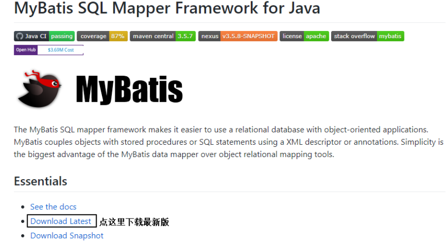

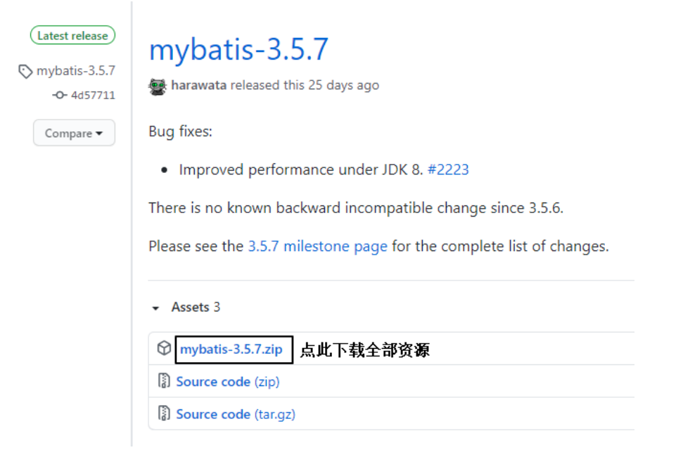


### 4、和其它持久化层技术对比

- JDBC

  SQL 夹杂在Java代码中耦合度高，导致硬编码内伤
  维护不易且实际开发需求中 SQL 有变化，频繁修改的情况多见
  代码冗长，开发效率低

- Hibernate 和 JPA

  操作简便，开发效率高
  程序中的长难复杂 SQL 需要绕过框架
  内部自动生产的 SQL，不容易做特殊优化
  基于全映射的全自动框架，大量字段的 POJO 进行部分映射时比较困难。
  反射操作太多，导致数据库性能下降

- MyBatis

  轻量级，性能出色
  SQL 和 Java 编码分开，功能边界清晰。Java代码专注业务、SQL语句专注数据
  开发效率稍逊于HIbernate，但是完全能够接受


## 二、搭建MyBatis

### 1、开发环境

IDEA：IntelliJ IDEA 2022.3.3

构建工具：apache-maven-3.8.8

MySQL版本：mysql-5.7.19

MyBatis版本：mybatis-3.5.14

### 2、创建maven工程

#### a>打包方式：jar

#### b>引入依赖

```xml
<dependencies>
    <!-- Mybatis核心 -->
    <dependency>
        <groupId>org.mybatis</groupId>
        <artifactId>mybatis</artifactId>
        <version>3.5.7</version>
    </dependency>
    <!-- junit测试 -->
    <dependency>
        <groupId>junit</groupId>
        <artifactId>junit</artifactId>
        <version>4.12</version>
        <scope>test</scope>
    </dependency>
    <!-- MySQL驱动 -->
    <dependency>
        <groupId>mysql</groupId>
        <artifactId>mysql-connector-java</artifactId>
        <version>5.1.3</version>
    </dependency>
</dependencies>
```


### 3、创建MyBatis的核心配置文件

> 习惯上命名为mybatis-config.xml，这个文件名仅仅只是建议，并非强制要求。将来整合Spring之后，这个配置文件可以省略，所以大家操作时可以直接复制、粘贴。
>
> 核心配置文件主要用于配置连接数据库的环境以及MyBatis的全局配置信息
>
> 核心配置文件存放的位置是src/main/resources目录下

```xml
<?xml version="1.0" encoding="UTF-8" ?>
<!DOCTYPE configuration
        PUBLIC "-//mybatis.org//DTD Config 3.0//EN"
        "http://mybatis.org/dtd/mybatis-3-config.dtd">

<configuration>
    <!--设置连接数据库的环境-->
    <environments default="development">
        <environment id="development">
            <transactionManager type="JDBC"/>
            <dataSource type="POOLED">
                <property name="driver" value="com.mysql.jdbc.Driver"/>
                <property name="url" value="jdbc:mysql://localhost:3306/mybatis"/>
                <property name="username" value="root"/>
                <property name="password" value="hsp"/>
            </dataSource>
        </environment>
    </environments>
    <!--引入映射文件-->
    <mappers>
        <mapper resource="mappers/UserMapper.xml"/>
    </mappers>
</configuration>
```


### 4、创建mapper接口

> MyBatis中的mapper接口相当于以前的dao。但是区别在于，mapper仅仅是接口，我们不需要提供实现类。

```java
public interface UserMapper {
    /**
    * 添加用户信息
    */
    int insertUser();
}
```


### 5、创建MyBatis的映射文件

相关概念：ORM（Object Relationship Mapping）对象关系映射。

- 对象：Java的实体类对象
- 关系：关系型数据库
- 映射：二者之间的对应关系

| java概念 | 数据库概念 |
| -------- | ---------- |
| 类       | 表         |
| 属性     | 字段/列    |
| 对象     | 记录/行    |

> 1、映射文件的命名规则：
>
> 表所对应的实体类的类名+Mapper.xml
>
> 例如：表t_user，映射的实体类为User，所对应的映射文件为UserMapper.xml
>
> 因此一个映射文件对应一个实体类，对应一张表的操作
>
> MyBatis映射文件用于编写SQL，访问以及操作表中的数据
>
> MyBatis映射文件存放的位置是src/main/resources/mappers目录下
>
> 2、MyBatis中可以面向接口操作数据，要保证两个一致：
>
> a>mapper接口的全类名和映射文件的命名空间（namespace）保持一致
>
> b>mapper接口中方法的方法名和映射文件中编写SQL的标签的id属性保持一致

UserMapper.java的编写

```java
public interface UserMapper {

    /**
     * MyBatis面向接口编程的两个一致：
     * 1. 映射文件的namespace要和mapper接口的全类名保持一致
     * 2. 映射文件中SQL语句的id要和mapper接口中的方法名一致
     *
     * 表--实体类--mapper接口--映射文件
     */

    /**
     * 添加用户信息
     */
    int insertUser();
}
```


mybatis-config.xml的编写：

```xml
<?xml version="1.0" encoding="UTF-8" ?>
<!DOCTYPE configuration
        PUBLIC "-//mybatis.org//DTD Config 3.0//EN"
        "http://mybatis.org/dtd/mybatis-3-config.dtd">

<configuration>
    <!--设置连接数据库的环境-->
    <environments default="development">
        <environment id="development">
            <transactionManager type="JDBC"/>
            <dataSource type="POOLED">
                <property name="driver" value="com.mysql.jdbc.Driver"/>
                <property name="url" value="jdbc:mysql://localhost:3306/mybatis"/>
                <property name="username" value="root"/>
                <property name="password" value="hsp"/>
            </dataSource>
        </environment>
    </environments>
    <!--引入映射文件-->
    <mappers>
        <mapper resource="mappers/UserMapper.xml"/>
    </mappers>
</configuration>
```


UserMapper.xml的编写

```xml
<?xml version="1.0" encoding="UTF-8" ?>
<!DOCTYPE mapper
        PUBLIC "-//mybatis.org//DTD Mapper 3.0//EN"
        "http://mybatis.org/dtd/mybatis-3-mapper.dtd">
<mapper namespace="org.example.mapper.UserMapper">

    <!--int insertUser();-->
    <insert id="insertUser">
        insert into t_user values(null,'张三','123',23,'女')
    </insert>
</mapper>
```


### 6、通过junit测试功能

```java
public class MyBatisTest {

    @Test
    public void testMyBatis() throws IOException {
        // 读取MyBatis的核心配置文件
        InputStream is = Resources.getResourceAsStream("mybatis-config.xml");
        // 创建SqlSessionFactoryBuilder对象
        SqlSessionFactoryBuilder sqlSessionFactoryBuilder = new SqlSessionFactoryBuilder();
        // 通过核心配置文件所对应的字节输入流创建工厂类SqlSessionFactory，生产SqlSession对象
        SqlSessionFactory sqlSessionFactory = sqlSessionFactoryBuilder.build(is);
        //创建SqlSession对象，此时通过SqlSession对象所操作的sql都必须手动提交或回滚事务
//        SqlSession sqlSession = sqlSessionFactory.openSession();
        //创建SqlSession对象，此时通过SqlSession对象所操作的sql都会自动提交
        SqlSession sqlSession = sqlSessionFactory.openSession(true);
        //通过代理模式创建UserMapper接口的代理实现类对象
        UserMapper userMapper = sqlSession.getMapper(UserMapper.class);
        //调用UserMapper接口中的方法，就可以根据UserMapper的全类名匹配元素文件，
        // 通过调用的方法名匹配映射文件中的SQL标签，并执行标签中的SQL语句
        int result = userMapper.insertUser();
        // 提交事务
//        sqlSession.commit();
        System.out.println("结果："+result);

    }

}
```

> SqlSession：代表Java程序和数据库之间的会话。（HttpSession是Java程序和浏览器之间的会话）
>
> SqlSessionFactory：是“生产”SqlSession的“工厂”。
>
> 工厂模式：如果创建某一个对象，使用的过程基本固定，那么我们就可以把创建这个对象的相关代码封装到一个“工厂类”中，以后都使用这个工厂类来“生产”我们需要的对象。


### 7、加入log4j日志功能

#### a>加入依赖

```xml
<!-- log4j日志 -->
<dependency>
    <groupId>log4j</groupId>
    <artifactId>log4j</artifactId>
    <version>1.2.17</version>
</dependency>
```


#### b>加入log4j的配置文件

> log4j的配置文件名为log4j.xml，存放的位置是src/main/resources目录下

```xml
<?xml version="1.0" encoding="UTF-8" ?>
<!DOCTYPE log4j:configuration SYSTEM "log4j.dtd">
<log4j:configuration xmlns:log4j="http://jakarta.apache.org/log4j/">

    <appender name="STDOUT" class="org.apache.log4j.ConsoleAppender">
        <param name="Encoding" value="UTF-8" />
        <layout class="org.apache.log4j.PatternLayout">
            <param name="ConversionPattern" value="%-5p %d{MM-dd HH:mm:ss,SSS}%m (%F:%L) \n" />
        </layout>
    </appender>
    <logger name="java.sql">
        <level value="debug" />
    </logger>
    <logger name="org.apache.ibatis">
        <level value="info" />
    </logger>
    <root>
        <level value="debug" />
        <appender-ref ref="STDOUT" />
    </root>
</log4j:configuration>
```

> ### 日志的级别
>
> FATAL(致命)>ERROR(错误)>WARN(警告)>INFO(信息)>DEBUG(调试)
>
> 从左到右打印的内容越来越详细


### 在idea中设置核心配置文件的模板


MyBatis-config的配置模板：

```xml
<?xml version="1.0" encoding="UTF-8" ?>
<!DOCTYPE configuration
        PUBLIC "-//mybatis.org//DTD Config 3.0//EN"
        "http://mybatis.org/dtd/mybatis-3-config.dtd">
<configuration>

    <properties resource="jdbc.properties"/>

    <!--以包为单位，设置改包下所有的类型都拥有默认的别名，即类名且不区分大小写-->
    <typeAliases>
        <package name=""/>
    </typeAliases>

    <environments default="development">
        <environment id="development">
            <transactionManager type="JDBC"/>
            <dataSource type="POOLED">
                <property name="driver" value="${jdbc.driver}"/>
                <property name="url" value="${jdbc.url}"/>
                <property name="username" value="${jdbc.username}"/>
                <property name="password" value="${jdbc.password}"/>
            </dataSource>
        </environment>
    </environments>
    <!--引入映射文件-->
    <mappers>
        <package name=""/>
    </mappers>
</configuration>
```


### 在idea中设置映射文件的模板


```xml
<?xml version="1.0" encoding="UTF-8" ?>
<!DOCTYPE mapper
        PUBLIC "-//mybatis.org//DTD Mapper 3.0//EN"
        "http://mybatis.org/dtd/mybatis-3-mapper.dtd">
<mapper namespace="">


</mapper>
```


## 三、核心配置文件详解

核心配置文件中的标签必须按照固定的顺序：

properties?,settings?,typeAliases?,typeHandlers?,objectFactory?,objectWrapperFactory?,reflectorFactory?,plugins?,environments?,databaseIdProvider?,mappers?

```xml
<?xml version="1.0" encoding="UTF-8" ?>
<!DOCTYPE configuration
        PUBLIC "-//mybatis.org//DTD Config 3.0//EN"
        "http://mybatis.org/dtd/mybatis-3-config.dtd">
<configuration>

<!--    核心配置文件中的标签必须按照固定的顺序：-->
<!--    properties?,settings?,typeAliases?,typeHandlers?,objectFactory?,objectWrapperFactory?,reflectorF-->
<!--    actory?,plugins?,environments?,databaseIdProvider?,mappers?-->

    <!--引入properties文件，此时就可以${属性名}的方式访问属性值-->
    <properties resource="jdbc.properties"/>

    <settings>
        <!--将表中字段的下划线自动转换为驼峰-->
        <setting name="mapUnderscoreToCamelCase" value="true"/>
        <!--开启延迟加载-->
        <setting name="lazyLoadingEnabled" value="true"/>
    </settings>

    <typeAliases>
        <!--
            typeAlias：设置某个具体的类型的别名
            属性：
                type：需要设置别名的类型的全类名
                alias：设置此类型的别名，若不设置此属性，该类型拥有默认的别名，即类名且不区分大小
                写
                若设置此属性，此时该类型的别名只能使用alias所设置的值
        -->
<!--        <typeAlias type="org.example.pojo.User" alias="User"/>-->
        <!--以包为单位，设置改包下所有的类型都拥有默认的别名，即类名且不区分大小写-->
        <package name="org.example.pojo"/>
    </typeAliases>

    <!--
        environments：设置多个连接数据库的环境
        属性：
            default：设置默认使用的环境的id
    -->
    <environments default="development">
        <!--
            environment：设置具体的连接数据库的环境信息
            属性：
                id：设置环境的唯一标识，可通过environments标签中的default设置某一个环境的id，表示默认使用的环境
        -->
        <environment id="development">
            <!--
                transactionManager：设置事务管理方式
                属性：
                    type：设置事务管理方式，type="JDBC|MANAGED"
                    type="JDBC"：设置当前环境的事务管理都必须手动处理
                    type="MANAGED"：设置事务被管理，例如spring中的AOP
            -->
            <transactionManager type="JDBC"/>
            <!--
                dataSource：设置数据源
                属性：
                    type：设置数据源的类型，type="POOLED|UNPOOLED|JNDI"
                    type="POOLED"：使用数据库连接池，即会将创建的连接进行缓存，下次使用可以从缓存中直接获取，不需要重新创建
                    type="UNPOOLED"：不使用数据库连接池，即每次使用连接都需要重新创建
                    type="JNDI"：调用上下文中的数据源
            -->
            <dataSource type="POOLED">
                <!--设置驱动类的全类名-->
                <property name="driver" value="${jdbc.driver}"/>
                <!--设置连接数据库的连接地址-->
                <property name="url" value="${jdbc.url}"/>
                <!--设置连接数据库的用户名-->
                <property name="username" value="${jdbc.username}"/>
                <!--设置连接数据库的密码-->
                <property name="password" value="${jdbc.password}"/>
            </dataSource>
        </environment>
    </environments>
    <!--引入映射文件-->
    <mappers>
<!--        <mapper resource="UserMapper.xml"/>-->
        <!--
            以包为单位，将包下所有的映射文件引入核心配置文件
            注意：此方式必须保证mapper接口和mapper映射文件必须在相同的包下
        -->
        <package name="org.example.mapper"/>
    </mappers>
</configuration>
```


## 四、MyBatis的增删改查

### 1、修改

```java
public interface UserMapper {
    /**
     * 修改用户信息
     */
    int updateUser();
}
```

```xml
<?xml version="1.0" encoding="UTF-8" ?>
<!DOCTYPE mapper
        PUBLIC "-//mybatis.org//DTD Mapper 3.0//EN"
        "http://mybatis.org/dtd/mybatis-3-mapper.dtd">
<mapper namespace="org.example.mapper.UserMapper">

    <!--int updateUser();-->
    <update id="updateUser">
        update t_user set username = '张三' where id = 2
    </update>

</mapper>
```

```java
public class MyBatisTest {

    @Test
    public void testMyBatis() throws IOException {
        InputStream is = Resources.getResourceAsStream("mybatis-config.xml");
        SqlSessionFactoryBuilder sqlSessionFactoryBuilder = new SqlSessionFactoryBuilder();
        SqlSessionFactory sqlSessionFactory = sqlSessionFactoryBuilder.build(is);
        SqlSession sqlSession = sqlSessionFactory.openSession(true);
        UserMapper userMapper = sqlSession.getMapper(UserMapper.class);
        int result = userMapper.updateUser();
        System.out.println("结果："+result);
    }
}
```


### 2、添加

```java
public interface UserMapper {
    /**
     * 添加用户信息
     */
    int insertUser();
}
```

```xml
<?xml version="1.0" encoding="UTF-8" ?>
<!DOCTYPE mapper
        PUBLIC "-//mybatis.org//DTD Mapper 3.0//EN"
        "http://mybatis.org/dtd/mybatis-3-mapper.dtd">
<mapper namespace="org.example.mapper.UserMapper">

    <!--int insertUser();-->
    <insert id="insertUser">
        insert into t_user values(null,'张三','123',23,'女','12345@qq.com')
    </insert>
</mapper>
```

```java
public class MyBatisTest {
    @Test
    public void testMyBatis() throws IOException {
        InputStream is = Resources.getResourceAsStream("mybatis-config.xml");
        SqlSessionFactoryBuilder sqlSessionFactoryBuilder = new SqlSessionFactoryBuilder();
        SqlSessionFactory sqlSessionFactory = sqlSessionFactoryBuilder.build(is);
        SqlSession sqlSession = sqlSessionFactory.openSession(true);
        UserMapper userMapper = sqlSession.getMapper(UserMapper.class);
        int result = userMapper.insertUser();
        System.out.println("结果："+result);
    }
}
```


### 3、删除

```java
public interface UserMapper {
    /**
     * 删除用户信息
     */
    int deleteUser();
}
```

```xml
<?xml version="1.0" encoding="UTF-8" ?>
<!DOCTYPE mapper
        PUBLIC "-//mybatis.org//DTD Mapper 3.0//EN"
        "http://mybatis.org/dtd/mybatis-3-mapper.dtd">
<mapper namespace="org.example.mapper.UserMapper">
    <!--int deleteUser();-->
    <delete id="deleteUser">
        delete from t_user where id = 2
    </delete>

</mapper>
```

```java
public class MyBatisTest {
    @Test
    public void testMyBatis() throws IOException {
        InputStream is = Resources.getResourceAsStream("mybatis-config.xml");
        SqlSessionFactoryBuilder sqlSessionFactoryBuilder = new SqlSessionFactoryBuilder();
        SqlSessionFactory sqlSessionFactory = sqlSessionFactoryBuilder.build(is);
        SqlSession sqlSession = sqlSessionFactory.openSession(true);
        UserMapper userMapper = sqlSession.getMapper(UserMapper.class);
        int result = userMapper.deleteUser();
        System.out.println("结果："+result);
    }
}
```


### 4、查询一个实体类对象

```java
public interface UserMapper {

    /**
     * 根据id查询用户信息
     */
    User getUserById();

}
```

```xml
<?xml version="1.0" encoding="UTF-8" ?>
<!DOCTYPE mapper
        PUBLIC "-//mybatis.org//DTD Mapper 3.0//EN"
        "http://mybatis.org/dtd/mybatis-3-mapper.dtd">
<mapper namespace="org.example.mapper.UserMapper">

    <!--User getUserById();-->
    <!--
        查询功能的标签必须设置resultType或resultMap
        resultType：设置默认的映射关系
        resultMap：设置自定义的映射关系
    -->
    <select id="getUserById" resultType="org.example.pojo.User">
        select * from t_user where id = 3
    </select>

</mapper>
```

```java
public class MyBatisTest {
    @Test
    public void testMyBatis() throws IOException {
        InputStream is = Resources.getResourceAsStream("mybatis-config.xml");
        SqlSessionFactoryBuilder sqlSessionFactoryBuilder = new SqlSessionFactoryBuilder();
        SqlSessionFactory sqlSessionFactory = sqlSessionFactoryBuilder.build(is);
        SqlSession sqlSession = sqlSessionFactory.openSession(true);
        UserMapper userMapper = sqlSession.getMapper(UserMapper.class);
        User user = userMapper.getUserById();
        System.out.println("结果："+user);
    }
}
```


### 5、查询集合

```java
public interface UserMapper {
    
    /**
     * 查询所有的用户信息
     */
    List<User> getAllUser();

}
```

```xml
<?xml version="1.0" encoding="UTF-8" ?>
<!DOCTYPE mapper
        PUBLIC "-//mybatis.org//DTD Mapper 3.0//EN"
        "http://mybatis.org/dtd/mybatis-3-mapper.dtd">
<mapper namespace="org.example.mapper.UserMapper">

    <!--List<User> getAllUser();-->
    <select id="getAllUser" resultType="org.example.pojo.User">
        select * from t_user
    </select>

</mapper>
```

```java
public class MyBatisTest {
    @Test
    public void testMyBatis() throws IOException {
        InputStream is = Resources.getResourceAsStream("mybatis-config.xml");
        SqlSessionFactoryBuilder sqlSessionFactoryBuilder = new SqlSessionFactoryBuilder();
        SqlSessionFactory sqlSessionFactory = sqlSessionFactoryBuilder.build(is);
        SqlSession sqlSession = sqlSessionFactory.openSession(true);
        UserMapper userMapper = sqlSession.getMapper(UserMapper.class);
        List<User> allUser = userMapper.getAllUser();
        allUser.forEach(user -> System.out.println(user));
    }
}
```

> 注意：
>
> 1、查询的标签select必须设置属性resultType或resultMap，用于设置实体类和数据库表的映射关系
>
> resultType：自动映射，用于属性名和表中字段名一致的情况
> resultMap：自定义映射，用于一对多或多对一或字段名和属性名不一致的情况
>
> 2、当查询的数据为多条时，不能使用实体类作为返回值，只能使用集合，否则会抛出异常TooManyResultsException；但是若查询的数据只有一条，可以使用实体类或集合作为返回值


### 封装SqlSessionUtils工具类

```java
public class SqlSessionUtils {

    public static SqlSession getSqlSession(){
        SqlSession sqlSession = null;
        try {
            InputStream is = Resources.getResourceAsStream("mybatis-config.xml");
            SqlSessionFactory sqlSessionFactory = new SqlSessionFactoryBuilder().build(is);
            sqlSession = sqlSessionFactory.openSession(true);
        } catch (IOException e) {
            e.printStackTrace();
        }
        return sqlSession;
    }
}
```


## 五、MyBatis获取参数值的两种方式（重点）

MyBatis获取参数值的两种方式：${}和#{}

${}的本质就是字符串拼接，#{}的本质就是占位符赋值

${}使用字符串拼接的方式拼接sql，若为字符串类型或日期类型的字段进行赋值时，需要手动加单引号；但是#{}使用占位符赋值的方式拼接sql，此时为字符串类型或日期类型的字段进行赋值时，可以自动添加单引号

### 1、单个字面量类型的参数

```java
    /**
     * 根据用户名查询用户信息
     */
    User getUserByUsername(String username);
```

```xml
<!--    User getUserByUsername(String username);-->
    <select id="getUserByUsername" resultType="User">
         <!--select * from t_user where username = #{username}-->
         select * from t_user where username = '${username}'
    </select>
```

```java
//1、mapper接口方法的参数为单个的字面量类型
// 	可以通过${}和#{}以任意的名称获取参数值，但是需要注意${}的单引号问题

@Test
public void testGetUserByUsername() {
    SqlSession sqlSession = SqlSessionUtils.getSqlSession();
    ParameterMapper mapper = sqlSession.getMapper(ParameterMapper.class);
    User user = mapper.getUserByUsername("admin");
    System.out.println(user);
}
```


### 2、多个字面量类型的参数

```java
/**
 * 验证登录
 */
User checkLogin(String username, String password);
```

```xml
<!--    User checkLogin(String username, String password);-->
    <select id="checkLogin" resultType="User">
        <!--select * from t_user where username = #{arg0} and password = #{arg1}-->
        <!--select * from t_user where username = #{param1} and password = #{param2}-->
        select * from t_user where username = '${param1}' and password = '${param2}'
    </select>
```

```java
//2、mapper接口方法的参数为多个时
//  此时MyBatis会将这些参数放在一个map集合中，以两种方式进行存储
//  a>以arg0,arg1...为键，以参数为值
//  b>以param1,param2...为键，以参数为值
//  因此只需要通过#{}和${}以键的方式访问值即可，但是需要注意${}的单引号问题
@Test
public void testCheckLogin() {
    SqlSession sqlSession = SqlSessionUtils.getSqlSession();
    ParameterMapper mapper = sqlSession.getMapper(ParameterMapper.class);
    User user = mapper.checkLogin("admin", "123456");
    System.out.println(user);
}
```


### 3、map集合类型的参数

```java
/**
 * 验证登录(参数为map)
 */
User checkLoginByMap(Map<String, Object> map);
```

```java
<!--    User checkLoginByMap(Map<String, Object> map);-->
    <select id="checkLoginByMap" resultType="User">
        select * from t_user where username = #{username} and password = #{password}
    </select>
```

```java
// 3、若mapper接口方法的参数有多个时，可以手动将这些参数放在一个map中存储
//    只需要通过#{}和${}以键的方式访问值即可，但是需要注意${}的单引号问题
 @Test
    public void testCheckLoginByMap() {
        SqlSession sqlSession = SqlSessionUtils.getSqlSession();
        ParameterMapper mapper = sqlSession.getMapper(ParameterMapper.class);
        Map<String, Object> map = new HashMap<>();
        map.put("username", "admin");
        map.put("password", "123456");
        User user = mapper.checkLoginByMap(map);
        System.out.println(user);
    }    
```


### 4、实体类类型的参数

```java
/**
 * 添加用户信息
 */
int insertUser(User user);
```

```xml
<!--    int insertUser(User user);-->
<insert id="insertUser">
	insert into t_user values(null,#{username},#{password},#{age},#{sex},#{email});
</insert>
```

```java
// 4、mapper接口方法的参数是实体类类型的参数
// 	  只需要通过#{}和${}以属性的方式访问属性值即可，但是需要注意${}的单引号问题
@Test
public void testInsertUser() {
    SqlSession sqlSession = SqlSessionUtils.getSqlSession();
    ParameterMapper mapper = sqlSession.getMapper(ParameterMapper.class);
    int result = mapper.insertUser(new User(null, "李四", "123", 23, "男", "123@qq.com"));
    System.out.println(result);
}
```


### 5、使用@Param标识参数

```java
/**
 * 验证登录(使用@Param)
 */
User checkLoginByParam(@Param("username") String username, @Param("password") String password);
```

```xml
<!--    User checkLoginByParam(@Param("username") String username, @Param("password") String password);-->
    <select id="checkLoginByParam" resultType="User">
        select * from t_user where username = #{username} and password = #{password}
    </select>
```

```java
// 5、使用@Param注解命名参数
// 	此时MyBatis会将这些参数放在一个map集合中，以两种方式进行存储
//	a>以@Param注解的值为键，以参数为值
//	b>以param1,param2...为键，以参数为值
//	因此只需要通过#{}和${}以键的方式访问值即可，但是需要注意${}的单引号问题
@Test
public void testCheckLoginByParam() {
    SqlSession sqlSession = SqlSessionUtils.getSqlSession();
    ParameterMapper mapper = sqlSession.getMapper(ParameterMapper.class);
    User user = mapper.checkLoginByParam("admin", "123456");
    System.out.println(user);
}
```


## 六、MyBatis的各种查询功能

```
MyBatis的各种查询功能：
1、若查询出的数据只有一条
	a>可以通过实体类对象接收
	b>可以通过list集合接收
	c>可以通过map集合接收
```

### 1、查询一个实体类对象

```java
/**
* 根据用户id查询用户信息
* @param id
* @return
*/
User getUserById(@Param("id") int id);
```

```xml
<!--User getUserById(@Param("id") int id);-->
<select id="getUserById" resultType="User">
	select * from t_user where id = #{id}
</select>
```


### 2、查询一个list集合

```java
/**
* 查询所有用户信息
* @return
*/
List<User> getUserList();
```

```xml
<!--List<User> getUserList();-->
<select id="getUserList" resultType="User">
	select * from t_user
</select>
```


### 3、查询单个数据

```java
/**
* 查询用户的总记录数
* @return
* 在MyBatis中，对于Java中常用的类型都设置了类型别名
* 例如：java.lang.Integer-->int|integer
* 例如：int-->_int|_integer
* 例如：Map-->map,List-->list
*/
int getCount();
```

```xml
<!--int getCount();-->
<select id="getCount" resultType="_integer">
	select count(id) from t_user
</select>
```


### 4、查询一条数据为map集合

```java
/**
* 根据用户id查询用户信息为map集合
* @param id
* @return
*/
Map<String, Object> getUserToMap(@Param("id") int id);
```

```xml
<!--Map<String, Object> getUserToMap(@Param("id") int id);-->
<select id="getUserToMap" resultType="map">
	select * from t_user where id = #{id}
</select>
<!--结果：{password=123456, sex=男, id=1, age=23, username=admin}-->
```


```
若查询出的数据有多条
     a>可以通过实体类类型的list集合接收
     b>可以通过map类型的list集合接收
     c>可以在mapper接口的方法上添加@MapKey注解，此时就可以将每条数据转换的map集合作为值，以某个字段的值作为键，放在同一个map集合中
     注意：一定不能通过实体类对象接收，此时会抛异常TooManyResultsException
     
```


### 5、查询多条数据为map集合

#### 方式一：

```java
/**
* 查询所有用户信息为map集合
* @return
* 将表中的数据以map集合的方式查询，一条数据对应一个map；若有多条数据，就会产生多个map集合，此
时可以将这些map放在一个list集合中获取
*/
List<Map<String, Object>> getAllUserToMap();
```

```xml
<!--Map<String, Object> getAllUserToMap();-->
<select id="getAllUserToMap" resultType="map">
	select * from t_user
</select>
```


#### 方式二：

```java
/**
* 查询所有用户信息为map集合
* @return
* 将表中的数据以map集合的方式查询，一条数据对应一个map；若有多条数据，就会产生多个map集合，并
且最终要以一个map的方式返回数据，此时需要通过@MapKey注解设置map集合的键，值是每条数据所对应的
map集合
*/
@MapKey("id")
Map<String, Object> getAllUserToMap();
```

```xml
<!--Map<String, Object> getAllUserToMap();-->
<select id="getAllUserToMap" resultType="map">
	select * from t_user
</select>
结果：
<!--
{
    1={password=123456, sex=男, id=1, age=23, username=admin},
    2={password=123456, sex=男, id=2, age=23, username=张三},
    3={password=123456, sex=男, id=3, age=23, username=张三}
}
-->
```


### 6、查询多条数据为list集合

```java
/**
 * 查询所有的用户信息
 */
List<User> getAllUser();
```

```xml
<!--List<User> getAllUser();-->
<select id="getAllUser" resultType="User">
    select * from t_user
</select>
```


## 七、特殊SQL的执行

### 1、模糊查询

```java
/**
 * 根据用户名模糊查询用户信息
 */
List<User> getUserByLike(@Param("username") String username);
```

```xml
<!--List<User> getUserByLike(@Param("username") String username);-->
<select id="getUserByLike" resultType="User">
    <!--select * from t_user where username like '%${username}%'-->
    select * from t_user where username like "%"#{username}"%"
</select>
```


### 2、批量删除

```java
/**
 * 批量删除
 */
int deleteMore(@Param("ids") String ids);
```

```xml
<!--int deleteMore(@Param("ids") String ids);-->
<delete id="deleteMore">
    delete from t_user where id in (${ids})
</delete>
```


### 3、动态设置表名

```java
/**
 * 查询指定表中的数据
 */
List<User> getUserByTableName(@Param("tableName") String tableName);
```

```xml
<!--List<User> getUserByTableName(@Param("tableName") String tableName);-->
<select id="getUserByTableName" resultType="User">
    select * from ${tableName}
</select>
```


### 4、添加功能获取自增的主键

t_clazz(clazz_id,clazz_name)

t_student(student_id,student_name,clazz_id)

1、添加班级信息
2、获取新添加的班级的id
3、为班级分配学生，即将某学的班级id修改为新添加的班级的id

```java
/**
* 添加用户信息
* @param user
* @return
* useGeneratedKeys：设置使用自增的主键
* keyProperty：因为增删改有统一的返回值是受影响的行数，因此只能将获取的自增的主键放在传输的参数user对象的某个属性中
*/
int insertUser(User user);
```

```xml
<!--int insertUser(User user);-->
<insert id="insertUser" useGeneratedKeys="true" keyProperty="id">
	insert into t_user values(null,#{username},#{password},#{age},#{sex})
</insert>
```


## 八、自定义映射resultMap

### 1、resultMap处理字段和属性的映射关系

a>为字段起别名，保持和属性名的一致

```java
/**
 * 查询所有的员工信息
 */
List<Emp> getAllEmp();
```

```xml
<!--    List<Emp> getAllEmp();-->
    <select id="getAllEmp" resultType="Emp">
        select eid,emp_name empName,age,sex,email from t_emp
    </select>
```

```java
@Test
public void testGetAllEmp() {
    SqlSession sqlSession = SqlSessionUtils.getSqlSession();
    EmpMapper mapper = sqlSession.getMapper(EmpMapper.class);
    List<Emp> allEmp = mapper.getAllEmp();
    allEmp.forEach(emp -> System.out.println(emp));
}
```


b>设置全局配置，将_自动映射为驼峰

mybatis-config.xml中配置

```xml
<!--    设置MyBatis的全局配置-->
    <settings>
<!--        将_自动映射为驼峰，emp_name:empName-->
        <setting name="mapUnderscoreToCamelCase" value="true"/>
    </settings>
```


c>通过resultMap设置自定义的映射关系

mapper.xml中的配置：

```xml
<!--
    resultMap：设置自定义映射

    属性：
        id：表示自定义映射的唯一标识
        type：查询的数据要映射的实体类的类型

    子标签：
        id：设置主键的映射关系
        result：设置普通字段的映射关系
        association：设置多对一的映射关系
        collection：设置一对多的映射关系

    属性：
        property：设置映射关系中实体类中的属性名
        column：设置映射关系中表中的字段名
-->
<resultMap id="empResultMap" type="Emp">
    <id property="eid" column="eid"></id>
    <result property="empName" column="emp_name"></result>
    <result property="age" column="age"></result>
    <result property="sex" column="sex"></result>
    <result property="email" column="email"></result>
</resultMap>

<!--List<Emp> getAllEmp();-->
<select id="getAllEmp" resultMap="empResultMap">
    select * from t_emp
</select>
```


### 2、多对一映射处理

> 查询员工信息以及员工所对应的部门信息
>

a>级联方式处理映射关系

```xml
<!--处理多对一映射关系方式一：级联属性赋值-->
    <resultMap id="empAndDeptResultMapAOne" type="Emp">
        <id property="eid" column="eid"></id>
        <result property="empName" column="emp_name"></result>
        <result property="age" column="age"></result>
        <result property="sex" column="sex"></result>
        <result property="email" column="email"></result>
        <result property="dept.did" column="did"></result>
        <result property="dept.deptName" column="dept_name"></result>
    </resultMap>
<!--    Emp getEmpAndDept(@Param("eid") Integer eid);-->
    <select id="getEmpAndDept" resultMap="empAndDeptResultMapAOne">
        select * from t_emp left join t_dept on t_emp.did = t_dept.did where t_emp.eid = #{eid}
    </select>
```

```java
/**
 * 查询员工以及员工所对应的部门信息
 */
Emp getEmpAndDept(@Param("eid") Integer eid);
```

```java
 /**
     * 处理多对一的映射关系：
     * a>级联属性赋值
     */
@Test
public void testGetEmpAndDept() {
    SqlSession sqlSession = SqlSessionUtils.getSqlSession();
    EmpMapper mapper = sqlSession.getMapper(EmpMapper.class);
    Emp empAndDept = mapper.getEmpAndDept(1);
    System.out.println(empAndDept);
}
```


b>使用association处理映射关系

```xml
<resultMap id="empAndDeptResultMapAOne" type="Emp">
        <id property="eid" column="eid"></id>
        <result property="empName" column="emp_name"></result>
        <result property="age" column="age"></result>
        <result property="sex" column="sex"></result>
        <result property="email" column="email"></result>
        <result property="dept.did" column="did"></result>
        <!--
            association：处理多对一的映射关系
            property：需要处理多对一的映射关系的属性名
            javaType：该属性的类型
        -->
        <association property="dept" javaType="Dept">
            <id property="did" column="did"></id>
            <result property="deptName" column="dept_name"></result>
        </association>
    </resultMap>
<!--    Emp getEmpAndDept(@Param("eid") Integer eid);-->
    <select id="getEmpAndDept" resultMap="empAndDeptResultMapAOne">
        select * from t_emp left join t_dept on t_emp.did = t_dept.did where t_emp.eid = #{eid}
    </select>
```


c>分步查询

查询员工信息

```java
public interface EmpMapper {
    /**
     * 通过分步查询员工以及员工所对应的部门信息
     * 分步查询第一步：查询员工信息
     */
    Emp getEmpAndDeptByStepOne(@Param("eid") Integer eid);
}
```

EmpMapper.xml：

```xml
<resultMap id="empAndDeptByStepResultMap" type="Emp">
        <id property="eid" column="eid"></id>
        <result property="empName" column="emp_name"></result>
        <result property="age" column="age"></result>
        <result property="sex" column="sex"></result>
        <result property="email" column="email"></result>
        <!--
            select: 设置分步查询的sql的唯一标识(namespace.SQLId或mapper接口的全类名.方法名)
            column: 设置分步查询的条件
        -->
        <association property="dept"
                     select="com.atguigu.mybatis.mapper.DeptMapper.getEmpAndDeptByStepTwo"
                     column="did"></association>
    </resultMap>
<!--    Emp getEmpAndDeptByStepOne(@Param("eid") Integer eid);-->
    <select id="getEmpAndDeptByStepOne" resultMap="empAndDeptByStepResultMap">
        select * from t_emp where eid = #{eid}
    </select>
```

根据员工所对应的部门id查询部门信息

```java
public interface DeptMapper {

    /**
     * 通过分步查询员工以及员工所对应的部门信息
     * 分步查询第二步：通过did查询员工所对应的部门
     */
    Dept getEmpAndDeptByStepTwo(@Param("did") Integer did);

}
```

DeptMapper.xml：

```xml
<!--    Dept getEmpAndDeptByStepTwo(@Param("did") Integer did);-->
    <select id="getEmpAndDeptByStepTwo" resultType="Dept">
        select * from t_dept where did = #{did}
    </select>
```

```java
@Test
public void testGetEmpAndDeptByStep() {
    SqlSession sqlSession = SqlSessionUtils.getSqlSession();
    EmpMapper mapper = sqlSession.getMapper(EmpMapper.class);
    Emp emp = mapper.getEmpAndDeptByStepOne(3);
    System.out.println(emp);
}
```


### 延迟加载

> 分步查询的优点：可以实现延迟加载，但是必须在核心配置文件中设置全局配置信息
>
> lazyLoadingEnabled：延迟加载的全局开关。当开启时，所有关联对象都会延迟加载
>
> aggressiveLazyLoading：当开启时，任何方法的调用都会加载该对象的所有属性。 否则，每个属性会按需加载
>
> 此时就可以实现按需加载，获取的数据是什么，就只会执行相应的sql。此时可通过association和collection中的fetchType属性设置当前的分步查询是否使用延迟加载，fetchType="lazy(延迟加载)|eager(立即加载)"

mybatis-config.xml中配置：

```xml
<!--设置MyBatis的全局配置-->
<settings>
    <!--将_自动映射为驼峰，emp_name:empName-->
    <setting name="mapUnderscoreToCamelCase" value="true"/>
    <!--开启延迟加载-->
    <setting name="lazyLoadingEnabled" value="true"/>
</settings>
```


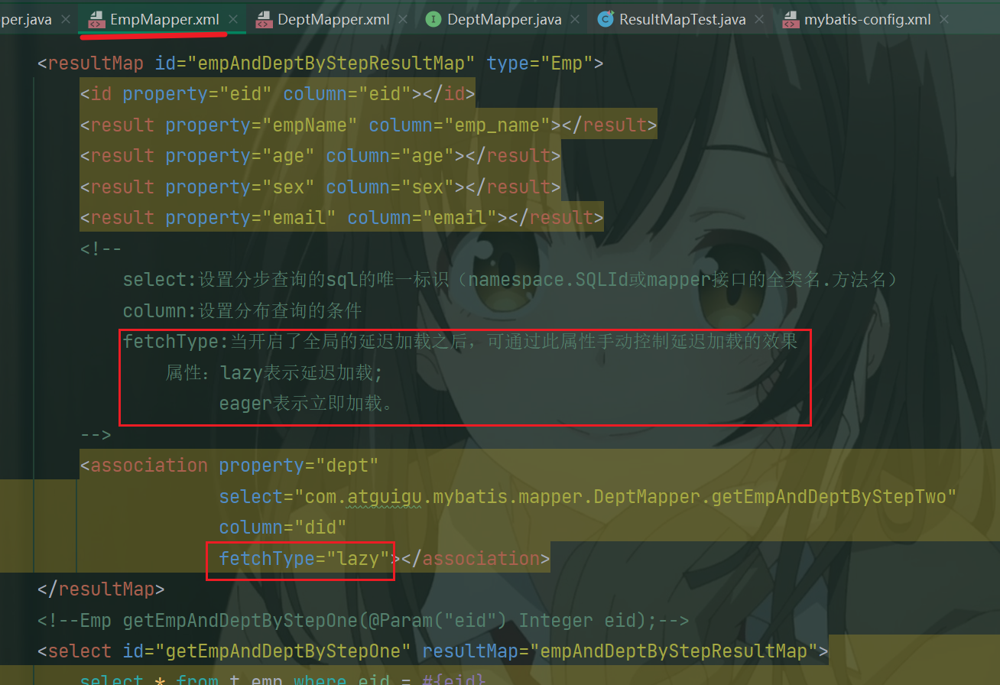


### 3、一对多映射处理

a>collection

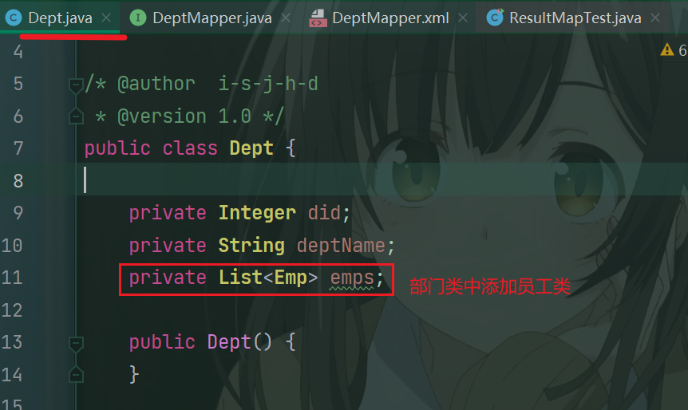

```java
/**
 * 获取部门以及部门中所有的员工信息
 */
Dept getDeptAndEmp(@Param("did") Integer did);
```

```xml
<resultMap id="deptAndEmpResultMap" type="Dept">
        <id property="did" column="did"></id>
        <result property="deptName" column="dept_name"></result>
        <!--
            collection：处理一对多的映射关系
            ofType：表示该属性所对应的集合中存储数据的类型
        -->
        <collection property="emps" ofType="Emp">
            <id property="eid" column="eid"></id>
            <result property="empName" column="emp_name"></result>
            <result property="age" column="age"></result>
            <result property="sex" column="sex"></result>
            <result property="email" column="email"></result>
        </collection>
    </resultMap>
<!--    Dept getDeptAndEmp(@Param("did") Integer did);-->
    <select id="getDeptAndEmp" resultMap="deptAndEmpResultMap">
        select * from t_dept left join t_emp on t_dept.did = t_emp.did where t_dept.did = #{did}
    </select>
```

```java
/**
     * 处理一对多的映射关系
     * a>collection
     * b>分步查询
     */

@Test
public void TestGetDeptAndEmp() {
    SqlSession sqlSession = SqlSessionUtils.getSqlSession();
    DeptMapper mapper = sqlSession.getMapper(DeptMapper.class);
    Dept dept = mapper.getDeptAndEmp(1);
    System.out.println(dept);
}
```


b>分步查询

1）查询部门信息

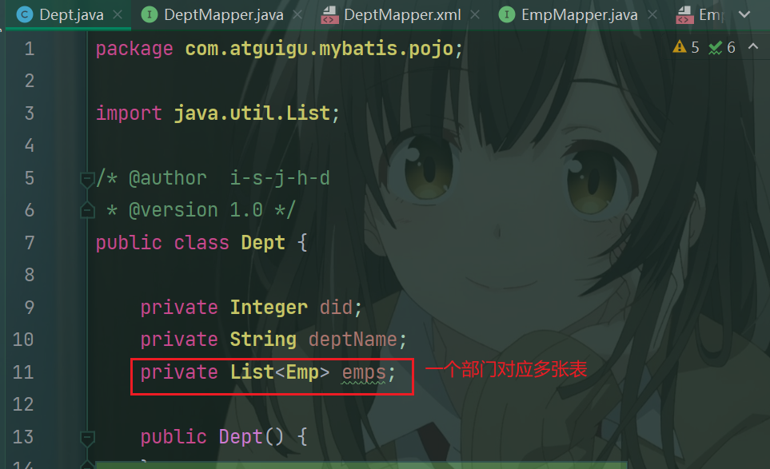

```java
/**
 * 通过分步查询来查询部门以及部门中所有的员工信息
 * 分步查询第一步：查询部门信息
 */
Dept getDeptAndEmpByStepOne(@Param("did") Integer did);
```

```xml
<resultMap id="deptAndEmpByStepResultMap" type="Dept">
    <id property="did" column="did"></id>
    <result property="deptName" column="dept_name"></result>
    <!--
        select:设置分步查询的sql的唯一标识（namespace.SQLId或mapper接口的全类名.方法名）
        column:设置分布查询的条件
        fetchType:当开启了全局的延迟加载之后，可通过此属性手动控制延迟加载的效果
            属性：lazy表示延迟加载;
                 eager表示立即加载。
    -->
    <collection property="emps"
                select="com.atguigu.mybatis.mapper.EmpMapper.getDeptAndEmpByStepTwo"
                column="did" fetchType="eager"></collection>
</resultMap>
<!--    Dept getDeptAndEmpByStepOne(@Param("did") Integer did);-->
<select id="getDeptAndEmpByStepOne" resultMap="deptAndEmpByStepResultMap">
    select * from t_dept where did = #{did}
</select>
```


2）根据部门id查询部门中的所有员工

```java
/**
 * 通过分步查询来查询部门以及部门中所有的员工信息
 * 分步查询第二步：根据did查询员工信息
 */
List<Emp> getDeptAndEmpByStepTwo(@Param("did") Integer did);
```

```xml
<!--List<Emp> getDeptAndEmpByStepTwo(@Param("did") Integer did);-->
<select id="getDeptAndEmpByStepTwo" resultType="Emp">
    select * from t_emp where did = #{did}
</select>
```

```java
@Test
public void TestGetDeptAndEmpByStep() {
    SqlSession sqlSession = SqlSessionUtils.getSqlSession();
    DeptMapper mapper = sqlSession.getMapper(DeptMapper.class);
    Dept dept = mapper.getDeptAndEmpByStepOne(1);
    System.out.println(dept.getDeptName());
}
```


## 九、动态SQL

Mybatis框架的动态SQL技术是一种根据特定条件动态拼装SQL语句的功能，它存在的意义是为了解决拼接SQL语句字符串时的痛点问题。

### 1、if

if标签可通过test属性的表达式进行判断，若表达式的结果为true，则标签中的内容会执行；反之标签中的内容不会执行

```java
/**
 * 多条件查询
 */
List<Emp> getEmpByCondition(Emp emp);
```

```xml
<!--List<Emp> getEmpByCondition(Emp emp);-->
<select id="getEmpByCondition" resultType="Emp">
    select * from t_emp where 1=1
    <if test="empName != null and empName != ''">
        and emp_name = #{empName}
    </if>
    <if test="age != null and age != ''">
        and age = #{age}
    </if>
    <if test="sex != null and sex != ''">
        and sex = #{sex}
    </if>
    <if test="email != null and email != ''">
        and email = #{email}
    </if>
</select>
```

```java
//1、if：根据标签中test属性所对应的表达式决定标签中的内容是否需要拼接到SQL中
@Test
public void testGetEmpByCondition() {
    SqlSession sqlSession = SqlSessionUtils.getSqlSession();
    DynamicSQLMapper mapper = sqlSession.getMapper(DynamicSQLMapper.class);
    List<Emp> list = mapper.getEmpByCondition(new Emp(null, "张三", null, "男", null));
    System.out.println(list);
}
```


### 2、where

```java
/**
 * 多条件查询
 */
List<Emp> getEmpByCondition(Emp emp)
```

```xml
<!--List<Emp> getEmpByCondition(Emp emp);-->
<select id="getEmpByCondition" resultType="Emp">
    select * from t_emp
    <where>
        <if test="empName != null and empName != ''">
            emp_name = #{empName}
        </if>
        <if test="age != null and age != ''">
            and age = #{age}
        </if>
        <if test="sex != null and sex != ''">
            and sex = #{sex}
        </if>
        <if test="email != null and email != ''">
            and email = #{email}
        </if>
    </where>
</select>
```

```java
/*
	2、where：
	当where标签中有内容时，会自动生成where关键字，并且将内容前多余的and或or去掉
	当where标签中没有内容时，此时where标签没有任何效果
	注意：where标签不能将其中内容后面多余的and或or去掉
*/
@Test
public void testGetEmpByCondition() {
    SqlSession sqlSession = SqlSessionUtils.getSqlSession();
    DynamicSQLMapper mapper = sqlSession.getMapper(DynamicSQLMapper.class);
    List<Emp> list = mapper.getEmpByCondition(new Emp(null, "张三", null, "男", null));
    System.out.println(list);
}
```


### 3、trim

```java
/**
 * 多条件查询
 */
List<Emp> getEmpByCondition(Emp emp);
```

```xml
<!--List<Emp> getEmpByCondition(Emp emp);-->
<select id="getEmpByCondition" resultType="Emp">
    select * from t_emp
    <trim prefix="where" suffixOverrides="and | or">
        <if test="empName != null and empName != ''">
            emp_name = #{empName} and
        </if>
        <if test="age != null and age != ''">
             age = #{age} or
        </if>
        <if test="sex != null and sex != ''">
             sex = #{sex} and
        </if>
        <if test="email != null and email != ''">
            email = #{email}
        </if>
    </trim>
</select>
```

```java
/*
	3、trim：
     * 若标签中有内容时：
     * prefix|suffix：将trim标签中内容前面或后面添加指定内容
     * suffixOverrides|prefixOverrides：将trim标签中内容前面或后面去掉指定内容
     * 若标签中没有内容时，trim标签也没有任何效果
*/
@Test
public void testGetEmpByCondition() {
    SqlSession sqlSession = SqlSessionUtils.getSqlSession();
    DynamicSQLMapper mapper = sqlSession.getMapper(DynamicSQLMapper.class);
    List<Emp> list = mapper.getEmpByCondition(new Emp(null, "", null, null, null));
    System.out.println(list);
}
```


### 4、choose、when、otherwise

choose、when、otherwise相当于if...else if..else

```java
/**
 * 测试choose、when、otherwise
 */
List<Emp> getEmpByChoose(Emp emp);
```

```xml
<!--List<Emp> getEmpByChoose(Emp emp);-->
<select id="getEmpByChoose" resultType="Emp">
    select * from t_emp
    <where>
        <choose>
            <when test="empName != null and empName != ''">
                emp_name = #{empName}
            </when>
            <when test="age != null and age != ''">
                age = #{age}
            </when>
            <when test="sex != null and sex != ''">
                sex = #{sex}
            </when>
            <when test="email != null and email != ''">
                email = #{email}
            </when>
            <otherwise>
                did = 1
            </otherwise>
        </choose>
    </where>
</select>
```

```java
/*
	4、choose、when、otherwise，相当于if...else if...else
     * when至少要有一个，otherwise最多只能有一个
*/
@Test
public void testGetEmpByChoose() {
    SqlSession sqlSession = SqlSessionUtils.getSqlSession();
    DynamicSQLMapper mapper = sqlSession.getMapper(DynamicSQLMapper.class);
    List<Emp> list = mapper.getEmpByChoose(new Emp(null, "", null, "男", "123@qq.com"));
    System.out.println(list);
}
```


### 5、foreach

> 属性：
> collection：设置要循环的数组或集合
> item：表示集合或数组中的每一个数据
> separator：设置循环体之间的分隔符
> open：设置foreach标签中的内容的开始符
> close：设置foreach标签中的内容的结束符

批量删除：

```java
/**
 * 通过数组实现批量删除
 */
int deleteMoreByArray(@Param("eids") Integer[] eids);
```

```xml
<!--    int deleteMoreByArray(@Param("eids") Integer[] eids);-->
    <delete id="deleteMoreByArray">
        delete from t_emp where
        <foreach collection="eids" item="eid" separator="or">
            eid = #{eid}
        </foreach>
        <!--
            delete from t_emp where eid in
           <foreach collection="eids" item="eid" separator="," open="(" close=")">
               #{eid}
           </foreach>
        -->
    </delete>
```

```java
@Test
public void testDeleteMoreByArray() {
    SqlSession sqlSession = SqlSessionUtils.getSqlSession();
    DynamicSQLMapper mapper = sqlSession.getMapper(DynamicSQLMapper.class);
    int result = mapper.deleteMoreByArray(new Integer[]{9, 10});
    System.out.println(result);
}
```


批量添加：

```java
/**
 * 通过list集合实现批量添加
 */
int insertMoreByList(@Param("emps") List<Emp> emps);
```

```xml
<!--    int insertMoreByList(List<Emp> emps);-->
    <insert id="insertMoreByList">
        insert into t_emp values
        <foreach collection="emps" item="emp" separator=",">
            (null,#{emp.empName},#{emp.age},#{emp.sex},#{emp.email},null)
        </foreach>
    </insert>
```

```java
@Test
public void testInsertMoreByList() {
    SqlSession sqlSession = SqlSessionUtils.getSqlSession();
    DynamicSQLMapper mapper = sqlSession.getMapper(DynamicSQLMapper.class);
    Emp emp1 = new Emp(null, "a1", 23, "男", "123@qq.com");
    Emp emp2 = new Emp(null, "a2", 23, "男", "123@qq.com");
    Emp emp3 = new Emp(null, "a3", 23, "男", "123@qq.com");
    List<Emp> emps = Arrays.asList(emp1, emp2, emp3);
    System.out.println(mapper.insertMoreByList(emps));
}
```


### 6、SQL片段

sql片段，可以记录一段公共sql片段，在使用的地方通过include标签进行引入

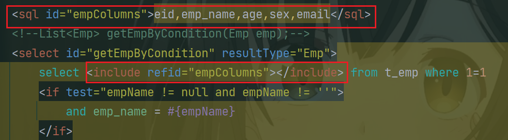


## 十、MyBatis的缓存

### 1、MyBatis的一级缓存

一级缓存是SqlSession级别的，通过同一个SqlSession查询的数据会被缓存，下次查询相同的数据，就会从缓存中直接获取，不会从数据库重新访问

使一级缓存失效的四种情况：

1) 不同的SqlSession对应不同的一级缓存

2) 同一个SqlSession但是查询条件不同

3) 同一个SqlSession两次查询期间执行了任何一次增删改操作

4) 同一个SqlSession两次查询期间手动清空了缓存

```java
public interface CacheMapper {

    Emp getEmpByEid(@Param("eid") Integer eid);

    void insertEmp(Emp emp);

}
```

```xml
<!--Emp getEmpByEid(@Param("eid") Integer eid);-->
<select id="getEmpByEid" resultType="Emp">
    select * from t_emp where eid = #{eid}
</select>

<!--void insertEmp(Emp emp);-->
<insert id="insertEmp">
    insert into t_emp values(null,#{empName},#{age},#{sex},#{email},null)
</insert>
```

```java
public class CacheMapperTest {

    @Test
    public void testCache() {
        SqlSession sqlSession1 = SqlSessionUtils.getSqlSession();
        CacheMapper mapper1 = sqlSession1.getMapper(CacheMapper.class);
        Emp emp1 = mapper1.getEmpByEid(1);
        System.out.println(emp1);
//        SqlSession sqlSession2 = SqlSessionUtils.getSqlSession();
//        CacheMapper mapper2 = sqlSession2.getMapper(CacheMapper.class);
//        Emp emp2 = mapper2.getEmpByEid(1);
//        System.out.println(emp2);

//        mapper1.insertEmp(new Emp(null,"abc",23,"男","123@qq.com"));

        sqlSession1.clearCache();

        Emp emp2 = mapper1.getEmpByEid(1);
        System.out.println(emp2);

    }

}
```


### 2、MyBatis的二级缓存

二级缓存是SqlSessionFactory级别，通过同一个SqlSessionFactory创建的SqlSession查询的结果会被缓存；此后若再次执行相同的查询语句，结果就会从缓存中获取

二级缓存开启的条件：

a>在核心配置文件中，设置全局配置属性cacheEnabled="true"，默认为true，不需要设置

b>在映射文件中设置标签<cache />

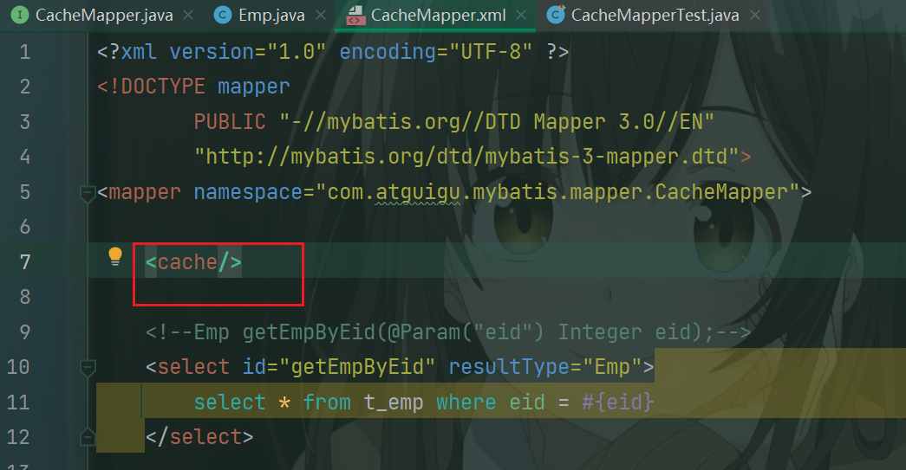

c>二级缓存必须在SqlSession关闭或提交之后有效

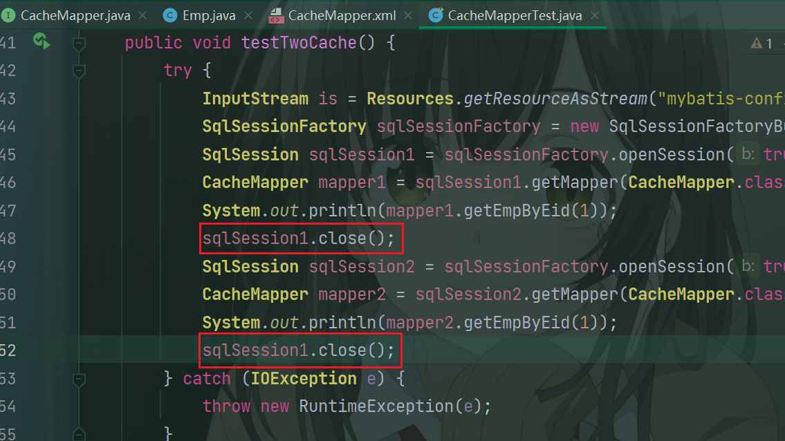

d>查询的数据所转换的实体类类型必须实现序列化的接口

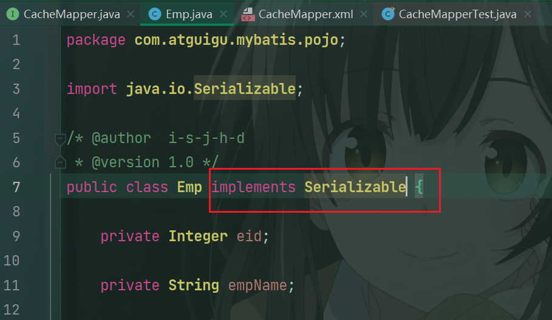

使二级缓存失效的情况：
两次查询之间执行了任意的增删改，会使一级和二级缓存同时失效

```java
@Test
public void testTwoCache() {
    try {
        InputStream is = Resources.getResourceAsStream("mybatis-config.xml");
        SqlSessionFactory sqlSessionFactory = new SqlSessionFactoryBuilder().build(is);
        SqlSession sqlSession1 = sqlSessionFactory.openSession(true);
        CacheMapper mapper1 = sqlSession1.getMapper(CacheMapper.class);
        System.out.println(mapper1.getEmpByEid(1));
        sqlSession1.close();
        SqlSession sqlSession2 = sqlSessionFactory.openSession(true);
        CacheMapper mapper2 = sqlSession2.getMapper(CacheMapper.class);
        System.out.println(mapper2.getEmpByEid(1));
        sqlSession1.close();
    } catch (IOException e) {
        throw new RuntimeException(e);
    }

}
```


### 3、二级缓存的相关配置

在mapper配置文件中添加的cache标签可以设置一些属性：

- eviction属性：缓存回收策略

  LRU（Least Recently Used） – 最近最少使用的：移除最长时间不被使用的对象。

  FIFO（First in First out） – 先进先出：按对象进入缓存的顺序来移除它们。

  SOFT – 软引用：移除基于垃圾回收器状态和软引用规则的对象。

  WEAK – 弱引用：更积极地移除基于垃圾收集器状态和弱引用规则的对象。

  默认的是 LRU。

- flushInterval属性：刷新间隔，单位毫秒

  默认情况是不设置，也就是没有刷新间隔，缓存仅仅调用语句时刷新

- size属性：引用数目，正整数

  代表缓存最多可以存储多少个对象，太大容易导致内存溢出

- readOnly属性：只读，true/false

  true：只读缓存；会给所有调用者返回缓存对象的相同实例。因此这些对象不能被修改。这提供了很重要的性能优势。
  false：读写缓存；会返回缓存对象的拷贝（通过序列化）。这会慢一些，但是安全，因此默认是false。


### 4、MyBatis缓存查询的顺序

- 先查询二级缓存，因为二级缓存中可能会有其他程序已经查出来的数据，可以拿来直接使用。 
- 如果二级缓存没有命中，再查询一级缓存 
- 如果一级缓存也没有命中，则查询数据库 
- SqlSession关闭之后，一级缓存中的数据会写入二级缓存


### 5、整合第三方缓存EHCache

#### a>添加依赖

```xml
<!-- Mybatis EHCache整合包 -->
<dependency>
    <groupId>org.mybatis.caches</groupId>
    <artifactId>mybatis-ehcache</artifactId>
    <version>1.2.1</version>
</dependency>
<!-- slf4j日志门面的一个具体实现 -->
<dependency>
    <groupId>ch.qos.logback</groupId>
    <artifactId>logback-classic</artifactId>
    <version>1.2.3</version>
</dependency>
```


#### b>各jar包功能

|    jar包名称    |              作用               |
| :-------------: | :-----------------------------: |
| mybatis-ehcache |    Mybatis和EHCache的整合包     |
|     ehcache     |          EHCache核心包          |
|    slf4j-api    |         SLF4J日志门面包         |
| logback-classic | 支持SLF4J门面接口的一个具体实现 |


#### c>创建EHCache的配置文件ehcache.xml

```xml
<?xml version="1.0" encoding="utf-8" ?>
<ehcache xmlns:xsi="http://www.w3.org/2001/XMLSchema-instance"
         xsi:noNamespaceSchemaLocation="../config/ehcache.xsd">
    <!-- 磁盘保存路径 -->
    <diskStore path="D:\ehcache"/>
    <defaultCache
            maxElementsInMemory="1000"
            maxElementsOnDisk="10000000"
            eternal="false"
            overflowToDisk="true"
            timeToIdleSeconds="120"
            timeToLiveSeconds="120"
            diskExpiryThreadIntervalSeconds="120"
            memoryStoreEvictionPolicy="LRU">
    </defaultCache>
</ehcache>
```


#### d>设置二级缓存的类型

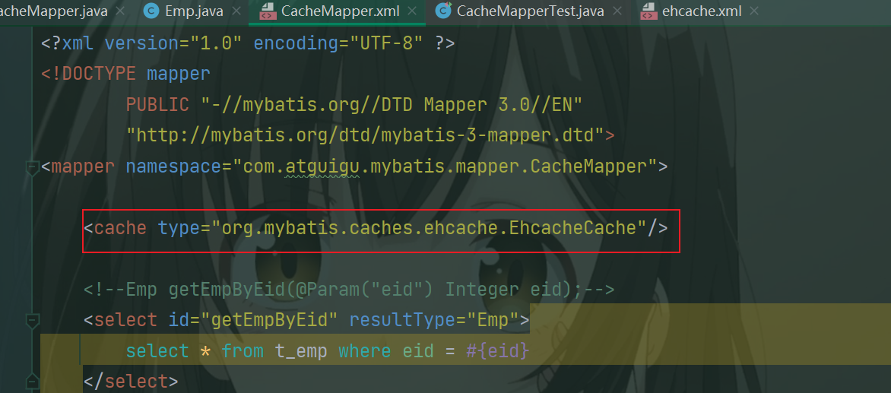

```xml
<cache type="org.mybatis.caches.ehcache.EhcacheCache"/>
```


#### e>加入logback日志

存在SLF4J时，作为简易日志的log4j将失效，此时我们需要借助SLF4J的具体实现logback来打印日志。 创建logback的配置文件logback.xml

```xml
<?xml version="1.0" encoding="UTF-8"?>
<configuration debug="true">
    <!-- 指定日志输出的位置 -->
    <appender name="STDOUT"
              class="ch.qos.logback.core.ConsoleAppender">
    <encoder>
    <!-- 日志输出的格式 -->
    <!-- 按照顺序分别是：时间、日志级别、线程名称、打印日志的类、日志主体内容、换行 -->
    <pattern>[%d{HH:mm:ss.SSS}] [%-5level] [%thread] [%logger]
    [%msg]%n</pattern>
    </encoder>
    </appender>
    <!-- 设置全局日志级别。日志级别按顺序分别是：DEBUG、INFO、WARN、ERROR -->
    <!-- 指定任何一个日志级别都只打印当前级别和后面级别的日志。 -->
    <root level="DEBUG">
        <!-- 指定打印日志的appender，这里通过“STDOUT”引用了前面配置的appender -->
        <appender-ref ref="STDOUT" />
    </root>
    <!-- 根据特殊需求指定局部日志级别 -->
    <logger name="com.atguigu.crowd.mapper" level="DEBUG"/>
</configuration>
```


#### f>EHCache配置文件说明

|             属性名              | 是否必须 | 作用                                                         |
| :-----------------------------: | :------: | :----------------------------------------------------------- |
|       maxElementsInMemory       |    是    | 在内存中缓存的element的最大数目                              |
|        maxElementsOnDisk        |    是    | 在磁盘上缓存的element的最大数目，若是0表示无 穷大            |
|             eternal             |    是    | 设定缓存的elements是否永远不过期。 如果为 true，则缓存的数据始终有效， 如果为false那么还 要根据timeToIdleSeconds、timeToLiveSeconds 判断 |
|         overflowToDisk          |    是    | 设定当内存缓存溢出的时候是否将过期的element 缓存到磁盘上     |
|        timeToIdleSeconds        |    否    | 当缓存在EhCache中的数据前后两次访问的时间超 过timeToIdleSeconds的属性取值时， 这些数据便 会删除，默认值是0,也就是可闲置时间无穷大 |
|        timeToLiveSeconds        |    否    | 缓存element的有效生命期，默认是0.,也就是 element存活时间无穷大 |
|      diskSpoolBufferSizeMB      |    否    | DiskStore(磁盘缓存)的缓存区大小。默认是 30MB。每个Cache都应该有自己的一个缓冲区 |
|         diskPersistent          |    否    | 在VM重启的时候是否启用磁盘保存EhCache中的数 据，默认是false。 |
| diskExpiryThreadIntervalSeconds |    否    | 磁盘缓存的清理线程运行间隔，默认是120秒。每 个120s， 相应的线程会进行一次EhCache中数据的 清理工作 |
|    memoryStoreEvictionPolicy    |    否    | 当内存缓存达到最大，有新的element加入的时 候， 移除缓存中element的策略。 默认是LRU（最 近最少使用），可选的有LFU（最不常使用）和 FIFO（先进先出） |


## 十一、MyBatis的逆向工程

- 正向工程：先创建Java实体类，由框架负责根据实体类生成数据库表。Hibernate是支持正向工程的。

- 逆向工程：先创建数据库表，由框架负责根据数据库表，反向生成如下资源：

  Java实体类

  Mapper接口

  Mapper映射文件


### 1、创建逆向工程的步骤

#### a>添加依赖和插件

pom.xml中添加：

```xml
<!-- 依赖MyBatis核心包 -->
<dependencies>
    <dependency>
        <groupId>org.mybatis</groupId>
        <artifactId>mybatis</artifactId>
        <version>3.5.7</version>
    </dependency>

    <!-- junit测试 -->
    <dependency>
        <groupId>junit</groupId>
        <artifactId>junit</artifactId>
        <version>4.12</version>
        <scope>test</scope>
    </dependency>
    <!-- MySQL驱动 -->
    <dependency>
        <groupId>mysql</groupId>
        <artifactId>mysql-connector-java</artifactId>
        <version>5.1.3</version>
    </dependency>

    <!-- log4j日志 -->
    <dependency>
        <groupId>log4j</groupId>
        <artifactId>log4j</artifactId>
        <version>1.2.17</version>
    </dependency>

</dependencies>
<!-- 控制Maven在构建过程中相关配置 -->
<build>
    <!-- 构建过程中用到的插件 -->
    <plugins>
        <!-- 具体插件，逆向工程的操作是以构建过程中插件形式出现的 -->
        <plugin>
            <groupId>org.mybatis.generator</groupId>
            <artifactId>mybatis-generator-maven-plugin</artifactId>
            <version>1.3.0</version>
            <!-- 插件的依赖 -->
            <dependencies>
                <!-- 逆向工程的核心依赖 -->
                <dependency>
                    <groupId>org.mybatis.generator</groupId>
                    <artifactId>mybatis-generator-core</artifactId>
                    <version>1.3.2</version>
                </dependency>
                <!-- 数据库连接池 -->
                <dependency>
                    <groupId>com.mchange</groupId>
                    <artifactId>c3p0</artifactId>
                    <version>0.9.2</version>
                </dependency>
                <!-- MySQL驱动 -->
                <dependency>
                    <groupId>mysql</groupId>
                    <artifactId>mysql-connector-java</artifactId>
                    <version>5.1.8</version>
                </dependency>
            </dependencies>
        </plugin>
    </plugins>
</build>
```


#### b>创建MyBatis的核心配置文件


#### c>创建逆向工程的配置文件

> 文件名必须是：generatorConfig.xml
>

```xml
<?xml version="1.0" encoding="UTF-8"?>
<!DOCTYPE generatorConfiguration
        PUBLIC "-//mybatis.org//DTD MyBatis Generator Configuration 1.0//EN"
        "http://mybatis.org/dtd/mybatis-generator-config_1_0.dtd">
<generatorConfiguration>
    <!--
            targetRuntime: 执行生成的逆向工程的版本
                    MyBatis3Simple: 生成基本的CRUD（清新简洁版）
                    MyBatis3: 生成带条件的CRUD（奢华尊享版）
     -->
    <context id="DB2Tables" targetRuntime="MyBatis3Simple">
        <!-- 数据库的连接信息 -->
        <jdbcConnection driverClass="com.mysql.jdbc.Driver"
                        connectionURL="jdbc:mysql://localhost:3306/mybatis"
                        userId="root"
                        password="hsp">
        </jdbcConnection>
        <!-- javaBean的生成策略-->
        <javaModelGenerator targetPackage="com.atguigu.mybatis.pojo" targetProject=".\src\main\java">
            <property name="enableSubPackages" value="true" />
            <property name="trimStrings" value="true" />
        </javaModelGenerator>
        <!-- SQL映射文件的生成策略 -->
        <sqlMapGenerator targetPackage="com.atguigu.mybatis.mapper"  targetProject=".\src\main\resources">
            <property name="enableSubPackages" value="true" />
        </sqlMapGenerator>
        <!-- Mapper接口的生成策略 -->
        <javaClientGenerator type="XMLMAPPER" targetPackage="com.atguigu.mybatis.mapper"  targetProject=".\src\main\java">
            <property name="enableSubPackages" value="true" />
        </javaClientGenerator>
        <!-- 逆向分析的表 -->
        <!-- tableName设置为*号，可以对应所有表，此时不写domainObjectName -->
        <!-- domainObjectName属性指定生成出来的实体类的类名 -->
        <table tableName="t_emp" domainObjectName="Emp"/>
        <table tableName="t_dept" domainObjectName="Dept"/>
    </context>
</generatorConfiguration>
```


#### d>执行MBG插件的generate目标

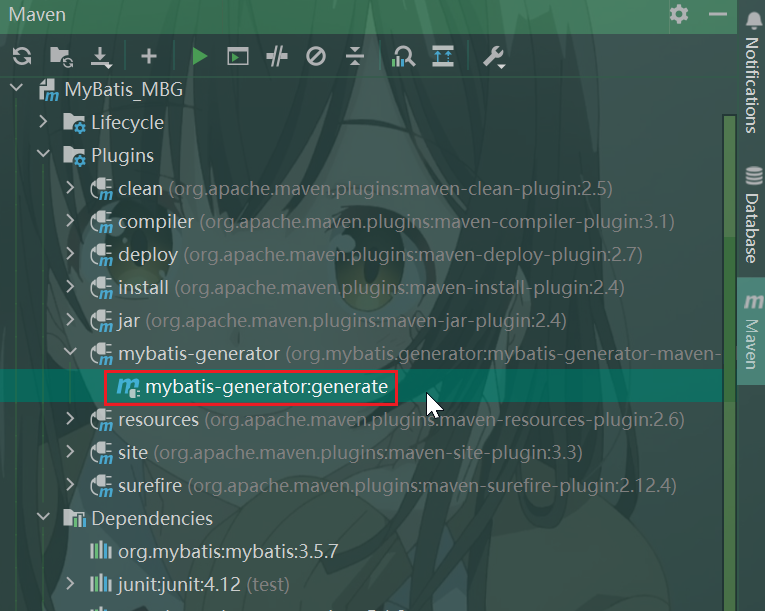

效果：

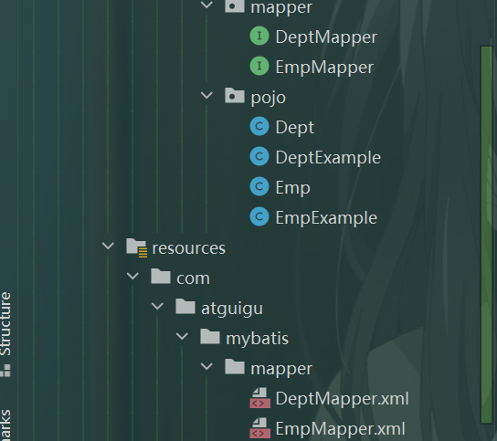


### 2、QBC查询

```java
@Test
    public void testMBG() {
        try {
            InputStream is = Resources.getResourceAsStream("mybatis-config.xml");
            SqlSessionFactory sqlSessionFactory = new SqlSessionFactoryBuilder().build(is);
            SqlSession sqlSession = sqlSessionFactory.openSession(true);
            EmpMapper mapper = sqlSession.getMapper(EmpMapper.class);

            //查询所有数据
            /*List<Emp> list = mapper.selectByExample(null);
            list.forEach(emp -> System.out.println(emp));*/

            // 根据条件查询
            /*EmpExample example = new EmpExample();
            example.createCriteria().andEmpNameEqualTo("张三").andAgeGreaterThanOrEqualTo(20);
            example.or().andDidIsNotNull();
            List<Emp> list = mapper.selectByExample(example);
            list.forEach(emp -> System.out.println(emp));*/

            // 普通添加，会将null所对应的字段修改为null
            mapper.updateByPrimaryKey(new Emp(1,"admin",22,null,"456q@@.com",3));

            // 选择性添加，不会将null所对应的字段修改为null
            // mapper.updateByPrimaryKeySelective(new Emp(1,"admin",22,null,"456q@@.com",3));

        } catch (IOException e) {
            throw new RuntimeException(e);
        }
    }
```


## 十二、分页插件

### 1、分页插件使用步骤

#### a>添加依赖

```xml
<!-- https://mvnrepository.com/artifact/com.github.pagehelper/pagehelper -->
<dependency>
    <groupId>com.github.pagehelper</groupId>
    <artifactId>pagehelper</artifactId>
    <version>5.2.0</version>
</dependency>
```


#### b>配置分页插件

在MyBatis的核心配置文件中配置插件

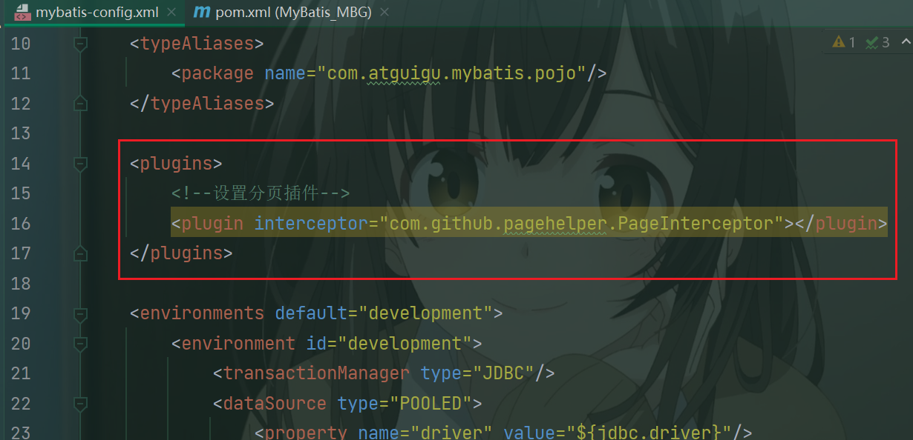

```xml
<plugins>
    <!--设置分页插件-->
    <plugin interceptor="com.github.pagehelper.PageInterceptor"></plugin>
</plugins>
```


### 2、分页插件的使用

a>在查询功能之前使用PageHelper.startPage(int pageNum, int pageSize)开启分页功能

> pageNum：当前页的页码
>
> pageSize：每页显示的条数

b>在查询获取list集合之后，使用PageInfo pageInfo = new PageInfo<>(List list, int navigatePages)获取分页相关数据

> list：分页之后的数据 
>
> navigatePages：导航分页的页码数

c>分页相关数据

> PageInfo{ 
>
> pageNum=8, pageSize=4, size=2, startRow=29, endRow=30, total=30, pages=8, 
>
> list=Page{count=true, pageNum=8, pageSize=4, startRow=28, endRow=32, total=30, pages=8, reasonable=false, pageSizeZero=false}, 
>
> prePage=7, nextPage=0, isFirstPage=false, isLastPage=true, hasPreviousPage=true, hasNextPage=false, navigatePages=5, navigateFirstPage4, navigateLastPage8, navigatepageNums=[4, 5, 6, 7, 8] }
>
> 常用数据：
> pageNum：当前页的页码
>
> pageSize：每页显示的条数
>
> size：当前页显示的真实条数
>
> total：总记录数
>
> pages：总页数
>
> prePage：上一页的页码
>
> nextPage：下一页的页码
>
> isFirstPage/isLastPage：是否为第一页/最后一页
>
> hasPreviousPage/hasNextPage：是否存在上一页/下一页
>
> navigatePages：导航分页的页码数
>
> navigatepageNums：导航分页的页码，[1,2,3,4,5]


```java
public class PageHelperTest {


    /**
     * limit index, pageSize
     * index: 当前页的起始索引
     * pageSize: 每页显示的条数
     * pageNum: 当前页的页码
     * index=(pageNum-1)*pageSize
     *
     * 使用MyBatis的分页插件实现分页功能：
     * 1. 需要在查询功能之前开启分页
     * PageHelper.startPage(int pageNum, int pageSize);
     * 2. 在查询功能之后获取分页相关信息
     * PageInFo<Emp> page = new PageInfo<>(list, 5);
     *  list 表示分页数据
     *  5    表示当前导航分页的数量
     */

    @Test
    public void testPageHelper() {
        InputStream is = null;
        try {
            is = Resources.getResourceAsStream("mybatis-config.xml");
            SqlSessionFactory sqlSessionFactory = new SqlSessionFactoryBuilder().build(is);
            SqlSession sqlSession = sqlSessionFactory.openSession(true);
            EmpMapper mapper = sqlSession.getMapper(EmpMapper.class);
            // Page<Object> page = PageHelper.startPage(2, 4);
            PageHelper.startPage(2, 4);
            List<Emp> list = mapper.selectByExample(null);
            PageInfo<Emp> page = new PageInfo<>(list, 3);
            System.out.println(page);
        } catch (IOException e) {
            throw new RuntimeException(e);
        }

    }

}
```