# MySQL

## 数据库的作用

​	淘宝网、京东、微信，抖音都有各自的功能，那么当我们退出系统的时候，下次再访问时，为什么信息还存在？=》数据库

- 解决之道 - 文件、数据库

  ​	为了解决上述问题，使用更加利于管理数据的东西 - 数据库，它能更有效的管理数据。

  ​	举一个生活化的案例说明如果说 图书馆是保存书籍的,那么数据库就是保存数据的。

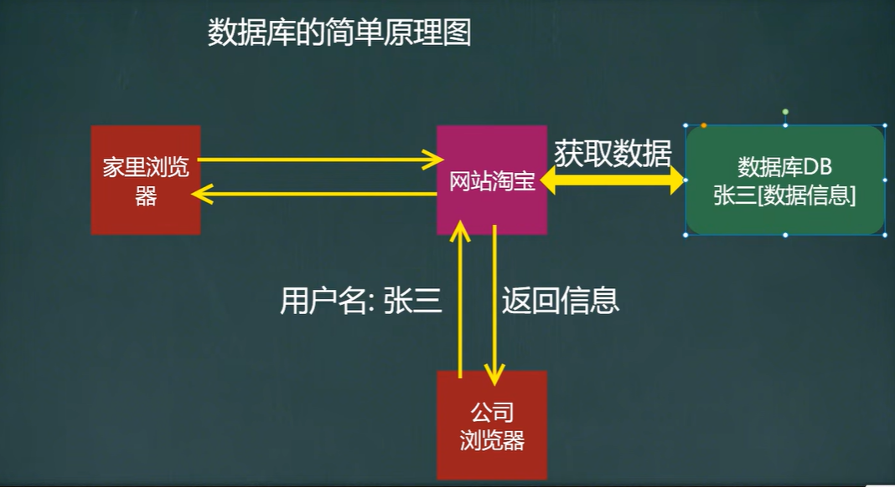


## MySQL安装和连接数据库

- MySQL数据库的安装和配置（安装演示）

  ​	[MySQL5.7.19安装](MySQL5.7.19安装.docx)

- 使用命令行窗口连接MySQL数据库 [示意图]

  ​	1、登陆前，保证服务启动

  ​			net stop mysql（停止服务）

  ​			net start mysql（启动服务）

  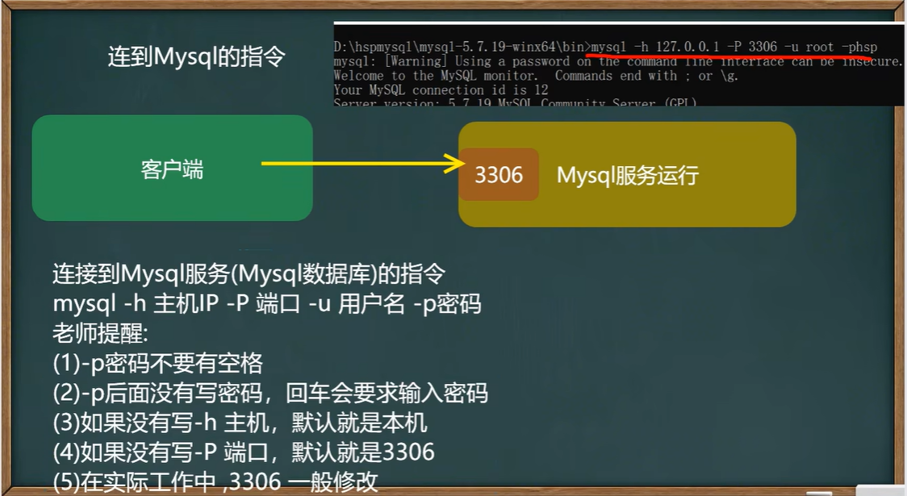


## Navicat安装和使用

- 介绍：图形化MySQL管理软件

  ​	[Navicat 15 下载](https://www.exception.site/essay/how-to-free-use-navicat)


## SQLyog安装和使用

- 介绍：图形化MySQL管理软件

  ​	[SQLyog安装配置](SQLyog安装配置.docx)

  

## 数据库

##### 数据库的三层结构

​	1、所谓安装Mysql数据库，就是在主机安装一个数据库管理系统（DBMS），这个管理程序可以管理多个数据库。DBMS(database manage system)

​	2、一个数据库中可以创建多个表，以保存数据（信息）。

​	3、数据库管理系统(DBMS)、数据库和表的关系如图所示：示意图

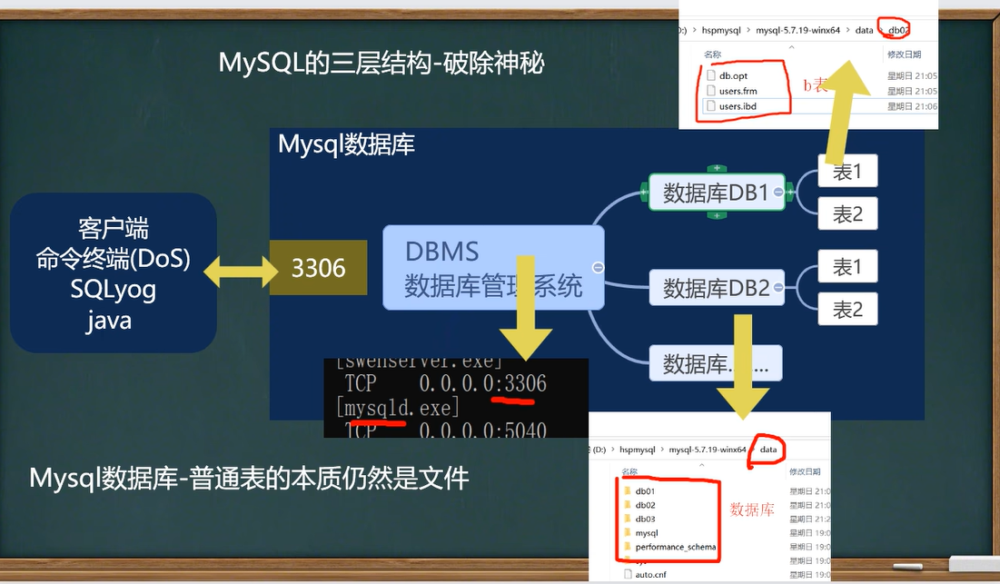


##### 数据在数据库中的存储方式

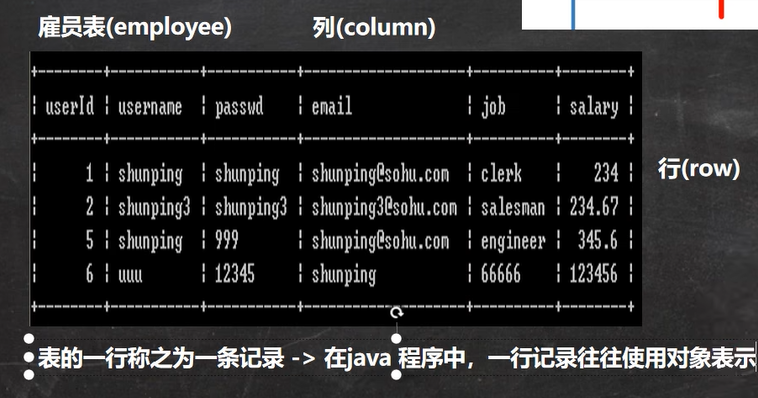


##### SQL语句分类

- ​	DDL:	数据定义语句 [create表，库...]
- ​	JDML:  数据操作语句 [增加insert,修改update,删除delete]
- ​	DQL:	数据查询语句 [select]
- ​	DCL:	数据控制语句 [管理数据库：比如用户权限grant revoke]


##### 创建数据库

```mysql
#演示数据库的操作
#创建一个名称为db01的数据库。[图形化和指令演示]

#使用指令创建数据库
CREATE DATABASE db01;
#说明：在创建数据库、表的时候，为了规避关键字，可以使用反引号解决

#进入数据库
use db01;

#删除数据库指令
DROP DATABASE db01

#创建一个使用utf8字符集的db02数据库
CREATE DATABASE db02 CHARACTER SET utf8
#CHARACTER SET：指定数据库采用的字符集，如果不指定字符集，默认utf8

#创建一个使用utf8字符集，并带校对规则的db03数据库
CREATE DATABASE db03 CHARACTER SET utf8 COLLATE utf8_bin
#COLLATE：指定数据库字符集的校对规则
#校对规则 utf8_bin区分大小 默认utf8_general_ci不区分天小写
```


##### 查看、删除数据库

```mysql
#演示删除和查询数据库
#查看当前数据库服务器中的所有数据库
SHOW DATABASES

#查看前面创建的db01数据库的定义信息
SHOW CREATE DATABASE db01

#删除前面创建的db01数据库[一定要慎重]
DROP DATABASE db01
```


##### 备份恢复数据库

```
DOS命令行窗口
#练习: database03.sql备份db02和db03库中的数据,并恢复

#备份，要在(Dos)下执行mysqldump指令
#mysqldump -u root -p -B db02 db03 > d:\\bak.sql

#恢复数据库（注意：进入Mysql命令行再执行）
#source d:\\bak.sql
#第二个恢复方法，直接将bak.sql的内容放到查询编辑器中，执行
```


##### 备份库的表

```
DOS命令行窗口
#mysqldump -u 用户名 -p密码 数据库 表1 表2 表n > d:\\文件名.sql
```


## 表

##### 创建表

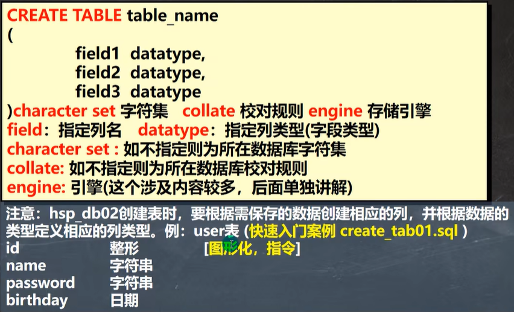


```mysql
CREATE TABLE `user` (
    id INT,
    `name` VARCHAR(255),
    `password` VARCHAR(255),
    `birthday` DATE)
    CHARACTER SET utf8 COLLATE utf8_bin ENGINE INNODB;
```


##### 修改表

```mysql
#修改表的操作练习
#员工表emp的上增加一个image列，varchar类型（要求在resume.后面）。
ALTER TABLE emp1
	ADD image VARCHAR(32) NOT NULL DEFAULT ''
	AFTER RESUME
DESC emp1 #显示表结构，可以查看表的所有列

#修改job列，使其长度为60。
ALTER TABLE emp1
	MODIFY job VARCHAR(80) NOT NULL DEFAULT ''

#删除sex列。
ALTER TABLE emp1
	DROP sex
	
#表名改为employee。
RENAME TABLE emp1 TO employee
DESC employee

#修改表的字符集为utf8
ALTER TABLE employee CHARACTER SET utf8

#列名name修改为user_name
ALTER TABLE employee 
	CHANGE `name` user_name VARCHAR(32) NOT NULL DEFAULT ''
```


##### 删除表

```mysql
DROP TABLE `table_name`;
```


##### 表复制和去重

```mysql
-- 表的复制
-- 为了对某个sql语句进行效率测试，我们需要海量数据时，可以使用此法为表创建海量数据
CREATE TABLE my_tab01
	( id INT,
	  `name` VARCHAR(32),
	  sal VARCHAR(32),
	  job VARCHAR(32),
	  deptno INT);
DESC my_tab01
SELECT * FROM my_tab01;

# 演示如何自我复制
-- 1. 先把 emp表的记录复制到 my_tab01
INSERT INTO my_tab01(id, `name`, sal, job, deptno)
	SELECT empno, ename, sal, job, deptno FROM emp;
-- 2. 自我复制
INSERT INTO my_tab01
	SELECT * FROM my_tab01;
SELECT COUNT(*) FROM my_tab01;

# 如何删除悼一张表重复记录
-- 1. 先创建一张表my_tab02
-- 2. 让my tab02有重复的记录
CREATE TABLE my_tab02 LIKE emp; -- 这个语句把emp表的结构（列），复制到my_tab02

DESC my_tab02;

INSERT INTO my_tab02
	SELECT * FROM emp;
SELECT * FROM my_tab02;
-- 3. 考虑去重my_tab02的记录
-- 思路
-- (1) 先创建一张临时表 my_tmp，该表的结构和 my_tab02一样
CREATE TABLE my_tmp LIKE my_tab02
-- (2) 把my_tmp 的记录 通过 distinct 关键字 处理后 把记录复制到 my_tmp
INSERT INTO my_tmp
	SELECT DISTINCT * FROM my_tab02;
-- (3) 清除掉my_tab02记录
DELETE FROM my_tab02;
-- (4) 把 my_tmp 表的记录复制到 my_tab02
INSERT INTO my_tab02
	SELECT * FROM my_tmp;
-- (5) drop 掉 临时表my_tmp
DROP TABLE my_tmp;

SELECT * FROM my_tab02;
```


## Mysql数据类型

##### Mysql常用数据类型（列类型）

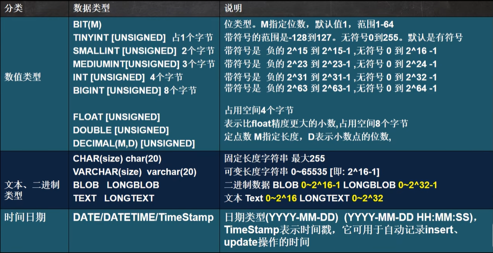

###### 数值型（整数）的基本使用

​	1、说明（使用规范）：在能够满足需求的情况下，尽量选择占用空间小的类型

```mysql
#演示整形
#使用tinyint来演示范围，有符号-128 ~ 127，如果没有符号0 ~ 255
#说明：表的字符集，校验规则，存储引擎，老师使用默认
CREATE TABLE t3 (#1.如果没有指定unsinged,则TINYINT就是有符号
    id TINYINT);
    
CREATE TABLE t4(#2.如果指定unsinged,则TINYINT.就是无符号0-255
    id TINYINT UNSIGNED);
    
INSERT INTO t3 VALUES(127);#这是非常简单的添加语句
SELECT * FROM t3;#查询数据

INSERT INTO t4 VALUES (255);
SELECT * FROM t4;#查询数据
```


###### 数值型（bit）的使用

```mysql
#演示bit类型使用
#说明
#使用不多
#1.bit(m), m范围在1-64
#2.添加数据范围按照你给的位数来确定，比如m = 8表示一个字节 0~255
CREATE TABLE t05 (
    num BIT(8));
INSERT INTO t05 VALUES(255);
SELECT * FROM t05;
SELECT * FROM t05 WHERE num = 1;#查询时，仍然可以按照数来查询
```


###### 数值型（小数）的基本使用

```mysql
#演示decimal类型、float、double使用

#DECIMAL[M,D]
#可以支持更加精确的小数位。M是小数位数(精度)的总数，D是小数点(标度)后面的位数。
#如果D是0，则值没有小数点或分数部分。M最大65。D最大是30。如果D被省略，默认是0。如  果M被省略，默认是10。
#建议：如果希望小数的精度高，推荐使用decimal
#创建表
CREATE TABLE t06(
		num1 FLOAT,
		num2 DOUBLE,
		num3 DECIMAL(30,20));

#添加数据
INSERT INTO t06 VALUES(88.123456789,88.123456789,88.123456789);
SELECT * FROM t06;
```


###### 字符串的基本使用

```mysql
#演示字符串类型便用char、varchar
#注释的快捷键shift+ctrl+c,注销注释shift+ctrl+r

#CHAR (size)
#固定长度字符串最大255字符
CREATE TABLE t09(
		`name` CHAR(255));

# VARCHAR (size) 0~65535
#可变长度字符串最大65532字节【utf8编码最大21844字符 1-3个字节用于记录大小】
#如果表的编码是 utf8 varchar (size) size = (65535-3)/3= 21844(字符)
CREATE TABLE t10(
		`name` VARCHAR(21844));
#如果表的编码是 gbk varchar(size) size=(65535-3)/2= 32766(字符)
CREATE TABLE t11(
		`name` VARCHAR(32766)) CHARSET gbk;

DROP TABLE t10;#删除表
```

- 字符串使用细节

  ```mysql
  #演示字符串类型的使用细节1
  #char(4)和varchar(4)这个4表示的是字符，而不是字节，不区分字符是汉字还是字母
  #占用多大的空间取决于编码
  #如果表的编码是 utf8 则乘以3
  #如果表的编码是 gbk 则乘以2
  CREATE TABLE t11(
      `name` CHAR(4)); 
  INSERT INTO t11 VALUES('韩顺平好1');
  SELECT * FROM t11; #查询
  
  CREATE TABLE t12(
      `name` VARCHAR(4)); 
  INSERT INTO t12 VALUES('韩顺平好');
  INSERT INTO t12 VALUES('ab北京');
  SELECT * FROM t12;#查询
  ```

  ```mysql
  #演示字符串类型的使用细节2
  #char(4)是定长（固定的大小)，就是说，即使你插入'aa',也会占用分配的4个字符的空间.
  #varchar(4)是变长(变化的大小)，就是说，如果你插入了'aa',实际占用空间大小并不是4个字符，而是按照实际占用空间来分配(说明: varchar本身还需要占用1-3个字节来记录存放内容长度)
  ```

  ```mysql
  #演示字符串类型的使用细节3
  #什么时候使用char，什么时候使用varchar
  #1.如果数据是定长，推荐使用char，比如md5的密码，邮编，手机号，身份证号码等。
  #2.如果一个字段的长度是不确定，我们使用varchar，比如留言，文章
  
  #查询速度：char>varchar
  ```

  ```mysql
  #演示字符串类型的使用细节4
  #在存放文本时，如果varchar不够用，也可以使用Text数据类型.可以将TEXT列视为VARCHAR列
  #注意Text不能有默认值.大小0~2^16字节
  #如果希望存放更多字符，可以选择MEDIUMTEXT 0~2^24或者LONGTEXT 0~232
  CREATE TABLE t13(
      content TEXT, content2 MEDIUMTEXT, content3 LONGTEXT);
  INSERT INTO t13 VALUES(
  	'轻音少女2', '碧蓝之海', 'fate/zero');
  SELECT * FROM t13;
  ```


###### 日期类型的基本使用

```mysql
#演示时间相关的类型
#创建一张表,date, datetime ,timestamp
CREATE TABLE t14(
		birthday DATE, #生日
		job_time DATETIME, #记录年月日时分秒
		login_time TIMESTAMP
    			#登陆时间，如果希望login_time列自动更新，需要这样配置
				NOT NULL DEFAULT CURRENT_TIMESTAMP
				ON UPDATE CURRENT_TIMESTAMP);

SELECT * FROM t14;
INSERT INTO t14(birthday, job_time)
		VALUES('2022-11-11','2022-11-11 10:10:10');
#如果我们更新t14表的某条记录，login_time列会自动的以当前时间进行更新
```


##### 创建表练习

```mysql
#创建表的课堂练习
#字段  属性
#Id	  整形
#name 字符型
#sex  字符型
#brithday    日期型(date)
#entry_date  日期型(date)
#job  字符型
#Salary      小数型
#resume      文本型
CREATE TABLE `emp`(
    	id INT,
    	`name` VARCHAR(32),
    	sex CHAR(1),
    	brithday DATE,
    	entry_date DATETIME,
    	job VARCHAR(32),
    	salary DOUBLE,
    	`resume` TEXT)	CHARSET utf8 COLLATE utf8_bin ENGINE INNODB;
    	
INSERT INTO `emp`
		VALUES(100, '逍遥怪', '男', '2000-11-11', 
              	'2010-11-10 11:11:11', '巡山的', 3000, '大王叫我来巡山')

SELECT * FROM `emp`;
```


## CRUD

##### Insert语句（添加数据）

```mysql
#使用INSERT语句向表中插入数据
#创建一张商品表
CREATE TABLE `goods`(
		id INT,
		goods_name VARCHAR(10),
		price DOUBLE);

#添加数据
INSERT INTO `goods`(id, goods_name, price)
		VALUES(10, '华为手机', 3000)

SELECT * FROM goods;
```

-  细节说明

1.插入的数据应与字段的数据类型相同。比如把 'abc' 添加到 int 类型会错误

2.数据的长度应在列的规定范围内，例如：不能将一个长度为80的字符串加入到长度为40的列中。
3.在values中列出的数据位置必须与被加入的列的排列位置相对应。
4.字符和日期型数据应包含在单引号中。
5.列可以插入空值【前提是该字段允许为空】。

6.insert into tab_name(列名...), values(),()形式添加多条记录

7.如果是给表中的所有字段添加数据，可以不写前面的字段名称

8.默认值的使用，当不给某个字段值时，如果有默认值就会添加，否则报错。

​	如果某个列没有指定 not null ,那么当添加数据时，没有给定值，则会默认给null。

​	如果我们希望指定某个列的默认值，可以在创建表时指定 。																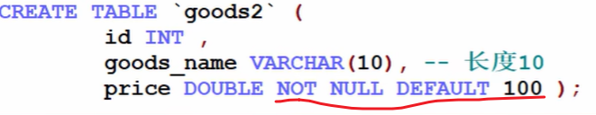

##### Update语句（更新数据）

```mysql
#使用update语句修改表中数据
#要求：在上面创建的employee表中修改表中的纪录
#	1、将所有员工薪水修改为5000元。
UPDATE employee SET salary = 5000
#   2、将姓名为小妖怪的员工薪水修改为3000元
UPDATE employee 
		SET salary = 3000
		WHERE user_name = '逍遥怪'
#   3、将老妖怪的薪水在原有基础上增加1000元。
UPDATE employee 
		SET salary = salary + 1000
		WHERE user_name = '老妖怪'
		
SELECT * FROM employee;
```

- 使用细节：

  1.UPDATE语法可以用新值更新原有表行中的各列。
  2.SET子句指示要修改哪些列和要给予哪些值。
  3.WHERE子句指定应更新哪些行。如没有WHERE子句,则更新所有的行（记录），因此老师提醒一定小心。

  4.如果需要修改多个字段，可以通过 set 字段1=值1，字段2=值2...

##### Delete语句（删除数据）

```mysql
#delete 语句演示

#删除表中名称为'老妖怪'的记录
DELETE FROM employee
		WHERE user_name = '老妖怪';

#删除表中的所有记录，一定要小心
DELETE FROM employee;

SELECT * FROM employee
```

- 使用细节

  1、如果不使用where子句，将删除表中所有数据。

  2、Delete语句不能删除某一列的值(可使用update设为null或者")

  3、使用delete语句仅删除记录,不删除表本身。如要删除表,使用drop table语句。**drop table 表名**
  
  

##### Select语句（查找数据）

###### 单表

```mysql
# Select指定查询哪些列的数据
# *号代表查询所有列。
# From指定查询哪张表。
# DISTINCT可选，指显示结果时，是否去掉重复数据

#查询表中所有学生的信息。
SELECT * FROM student;

#查询表中所有学生的姓名和对应的英语成绩。
SELECT `name`, english FROM student;

#过滤表中重复数据distinct。
#要查询的记录，每个字段都相同，才会去重
SELECT DISTINCT english FROM student;
SELECT DISTINCT `name`, english FROM student;
```

```mysql
#统计每个学生的总分
SELECT `name`, (chinese + english + math) FROM student;

#在所有学生总分加10分的情况
SELECT `name`, (chinese + english + math + 10) FROM student;

#使用别名表示学生分数。
SELECT `name`, (chinese + english + math) AS total_score FROM student;
```


- 在where字句中经常使用的运算符

  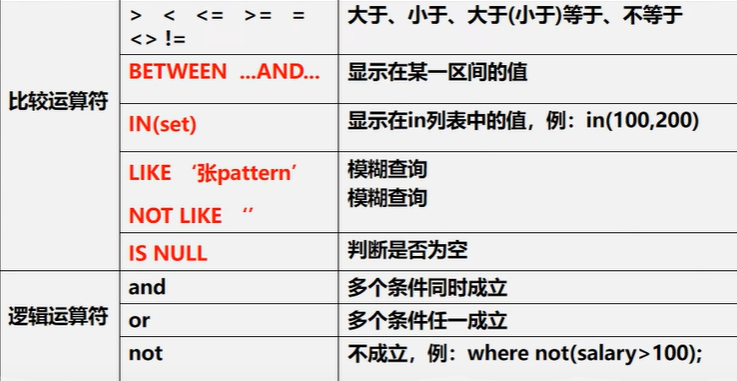

  ```mysql
  #使用where子句，进行过滤查询
  #1.查询姓名为赵云的学生成绩
  SELECT * FROM student
  		WHERE `name` = '赵云'
  		
  #2.查询英语成绩大于90分的同学
  SELECT * FROM student
  		WHERE english > 90
  		
  #3.查询总分大于200分的所有同学
  SELECT * FROM student
  		WHERE (chinese + english + math) > 200
  ```

  ```mysql
  #查询math大于60并且(and)id大于4的学生成绩
  SELECT * FROM student
  		WHERE math > 60 and id > 4
  		
  #查询英语成绩大于语文成绩的同学
  SELECT * FROM student
  		WHERE english > chinese
  		
  #查询总分大于200分并且数学成绩小于语文成绩，的姓赵的学生
  #赵% 表示名字以韩开头的就可以
  SELECT * FROM student
  		WHERE (chinese + english + math) > 200 AND
  				math < chinese AND `name` LIKE '赵%'
  ```


- 课堂练习

  ```mysql
  #课堂练习1
  #1、查询英语分数在80-90之间的同学。
  SELECT * FROM student
  		WHERE english BETWEEN 80 AND 90;
  		
  #2、查询数学分数为89,90,91的同学
  SELECT * FROM student
  		WHERE math IN (89, 90, 91);
  
  #3、查询所有姓宋的学生成绩。
  SELECT * FROM student
  		WHERE `name` LIKE '宋%'
  		
  #4、查询数学分>80，语文分>80的同学。
  SELECT * FROM student
  		WHERE math > 80 and chinese > 80
  ```

  ```mysql
  #课堂练习2
  #1、查询语文分数在70-80之间的同学。
  SELECT * FROM student
  		WHERE chinese BETWEEN 70 AND 80;
  
  #2、查询总分为257, 276, 185的同学。
  SELECT `name`, (chinese + math + english) FROM student
  		WHERE (chinese + math + english) IN (257, 276, 185)
  
  #3、查询所有姓李 或者 姓宋 的学生成绩。
  SELECT * FROM student
  		WHERE `name` LIKE '宋%' OR `name` LIKE '韩%'
  
  #4、查询数学比语文多1分的同学。
  SELECT * FROM student
  		WHERE math > chinese + 1
  ```

  

- 使用order by 子句排序查询结果

  ```mysql
  #演示order by使用
  #对数学成绩排序后输出【升序】
  SELECT * FROM student
  		ORDER BY math;
  
  #对总分按从高到低的顺序输出[降序]
  SELECT `name`, (chinese + english + math) AS total_score FROM student
  		ORDER BY total_score DESC;
  		
  #对姓韩的学生成绩排序输出(升序)
  SELECT `name`, (chinese + english + math) AS total_score FROM student
  		WHERE `name` LIKE '韩%'
  		ORDER BY total_score;
  ```


###### 查询加强

```mysql
# 查询加强

# 使用where子句
-- 	？如何查找1992.1.1后入职的员工
-- 说明：在MySQL中，日期类型可以直接比较，需要注意格式
SELECT * FROM emp
	WHERE hiredate > '1992-01-01'

-- 如何使用like操作符(模糊查询)
-- 	%：表示0到多个任意字符
-- 	_：表示单个任意字符
-- 	？如何显示首字符为S的员工姓名和工资
SELECT ename, sal FROM emp
	WHERE ename LIKE 'S%'
-- 	？如何显示第三个字符为大写O的所有员工的姓名和工资
SELECT ename, sal FROM emp
	WHERE ename LIKE '__O%'

-- 	如何显示没有上级的雇员的情况
SELECT * FROM emp
	WHERE mgr IS NULL;

-- 	查询表结构
DESC emp


#使用order by子句
-- 	?如何按照工资的从低到高的顺序，显示雇员的信息
SELECT * FROM emp
	ORDER BY sal

-- 	?按照部门号升序而雇员的工资降序排列，显示雇员信息
SELECT * FROM emp
	ORDER BY deptno, sal DESC;
```


###### 分页查询


```mysql
# 分页查询
-- 1、按雇员的id号升序取出，每页显示3条记录，请分别显示第1页，第2页，第3页
-- 2、基本语法：select ... limit start, rows
--    表示从start + 1行开始取，取出rows行，start从0开始计算

-- 第一页
SELECT * FROM emp
	ORDER BY empno
	LIMIT 0, 3;
-- 第二页
SELECT * FROM emp
	ORDER BY empno
	LIMIT 3, 3;
-- 第三页
SELECT * FROM emp
	ORDER BY empno
	LIMIT 6, 3;
```


###### 分组增强

```mysql
# 增强group by 的使用

-- (1)显示每种岗位的雇员总数、平均工资。
SELECT COUNT(*), AVG(sal), job
	FROM emp
	GROUP BY job;

-- (2)显示雇员总数，以及获得补助的雇员数。
-- 思路：获得补助的雇员数 就是 comm列为非null
-- 提示：如果该列的值为null, 是不会统计
SELECT COUNT(*), COUNT(comm)
	FROM emp;
	
-- 扩展要求：统计没有获得补助的雇员数
SELECT COUNT(*), COUNT(IF(comm IS NULL, 1, NULL)) #第一种写法
	FROM emp;
SELECT COUNT(*), COUNT(*) - COUNT(comm) #第二种写法
	FROM emp

-- (3)显示管理者的总人数。(造成重复计算)
SELECT COUNT(DISTINCT mgr)
	FROM emp;

-- (4)显示雇员工资的最大差额。
SELECT MAX(sal) - MIN(sal)
	FROM emp;
```


###### 数据分组的总结

如果select语句同时包含有group by，having，limit，order by那么他们的顺序是group by，having，order by，limit

```mysql
-- 应用案例：请统计各个部门group by的平均工资avg,
-- 并且是大于1000的having,并且按照平均工资从高到低排序order by,
-- 取出前两行记录1imit
SELECT  deptno, AVG(sal) AS avg_sal
	FROM emp
	GROUP BY deptno
	HAVING avg_sal > 1000
	ORDER BY avg_sal DESC
	LIMIT 0, 2;
```


###### 多表

- 介绍

  ​	在前面我们讲过mysql表的基本查询,但是都是对一张表进行的查询，这在实际的软件开发中,还远远的不够。
  ​    下面我们讲解的过程中,将使用前面创建 三张表(emp,dept,salgrade)为大家演示如何进行多表查询。

  

- 说明

  ​	多表查询是指基于两个和两个以上的表查询，在实际应用中，查询单个表可能不能满足你的需求，（如下面的课堂练习），需要使用到(dept表和emp表)

```mysql
# 多表查询

-- 在默认情况下：当两个表查询时
-- 1.从第一张表中,取出一行和第二张表的每一行进行组合，返回结果[含有两张表的所有列].
-- 2.一共返回的记录数 第一张表行数*第二张表的行数
-- 3.这样多表查询默认处理返回的结果，称为笛卡尔集
-- 4.解决这个多表的关键就是要写出正确的过滤条件where,需要程序员进行分析
SELECT * FROM emp, dept

-- 显示雇员名，雇员工资及所在部门的名字【笛卡尔集】
-- 分析:
-- 1.雇员名、雇员工资来自emp表
-- 2.部门的名字来自dept表
-- 3.需求对emp和dept查询
-- 4.当我们需要指定显示某个表的列时，需要 表.列表
SELECT ename, sal, dname, emp.deptno
	FROM emp, dept
	WHERE emp.deptno = dept.deptno


-- 小技巧：多表查询的条件不能少于表的个数-1，否则会出现笛卡尔集
-- 如何显示部门号为10的部门名、员工名和工资
SELECT ename, sal, dname, emp.deptno
	FROM emp, dept
	WHERE emp.deptno = dept.deptno AND emp.deptno = 10;
	
-- 显示各个员工的姓名，工资，及其工资的级别
SELECT ename, sal, grade 
	FROM emp, salgrade
	WHERE sal BETWEEN losal AND hisal;

-- 学员练习：
-- 显示雇员名，雇员工资及所在部门的名字，并按部门排序[降序排].
SELECT ename, sal, dname, emp.deptno
	FROM emp, dept
	WHERE emp.deptno = dept.deptno
	ORDER BY deptno DESC;
```


###### 自连接

自连接是指在同一张表的连接查询 [将同一张表看做两张表]。

```mysql
# 多表查询的自连接

-- 思考题：显示公司员工名字和他的上级的名字

-- 分析：员工名字在emp，上级的名字的名字emp
-- 员工和上级是通过emp表的mgr列关联
-- 自连接的特点：1.把同一张表当做两张表使用
-- 			   2.需要给表取别名。 表名 as 表别名
-- 			   3.列名不明确，可以指定列的别名。 列名 as 列的别名
SELECT worker.ename AS '职员名', boss.ename AS '上级名'
	FROM emp AS worker, emp AS boss
	WHERE worker.mgr = boss.empno;
```


###### 子查询

​	子查询是指嵌入在其它sql语句中的select语句,也叫嵌套查询

```mysql
# 子查询的演示
-- 请思考：如何显示与SMITH同一部门的所有员工？
-- 1.先查询到SMITH的部门号得到
-- 2.把上面的select语句当做一个子查询来使用	
SELECT * 
	FROM emp
	WHERE deptno = (
		SELECT deptno
		FROM emp
		WHERE ename = 'SMITH'
	)
	
-- 课堂练习：如何查询和部门10的，工作相同的雇员的
-- 名字、岗位、工资、部门号，但是不含10号部门自己的雇员.
SELECT ename, job, sal, deptno
	FROM emp
	WHERE job IN (
		SELECT DISTINCT job
		FROM emp
		WHERE deptno = 10
	) AND deptno != 10
```


- 子查询当做临时表使用

  ```mysql
  # 查询ecshop中各个类别中，价格最高的商品
  
  -- 查询 商品表
  -- 先得到 各个类别中，价格最高的商品 max + group by cat_id，当做临时表
  -- 把子查询当做一张临时表可以解决很多很多复杂的查询
  SELECT goods_id, ecs_goods.cat_id, goods_name, shop_price
  	FROM (
  		SELECT cat_id, MAX(shop_price) AS max_price
  		FROM ecs_goods
  		GROUP BY cat_id
  	) temp, ecs_goods
  	WHERE temp.cat_id = ecs_goods.cat_id
  	AND temp.max_price = ecs_goods.shop_price
  ```

  

- 在多行子查询中使用all 和 any操作符

  ```mysql
  #演示all 和 any
  
  # 在多行子查询中使用all操作符
  -- 请思考：显示工资比部门30 的所有员工的工资高的员工的姓名、工资和部门号
  SELECT ename, sal, deptno
  	FROM emp
  	WHERE sal > ALL(
  			SELECT sal 
  				FROM emp
  				WHERE deptno = 30
  			)
  
  -- 也可以这样写
  SELECT ename, sal, deptno
  	FROM emp
  	WHERE sal > (
  			SELECT MAX(sal) 
  				FROM emp
  				WHERE deptno = 30
  			)
  
  
  # 在多行子查询中使用any操作符
  -- 请思考：如何显示工资比部门30 的其中一个员工的工资高的员工的姓名、工资和部门号
  SELECT ename, sal, deptno
  	FROM emp
  	WHERE sal > ANY(
  			SELECT sal 
  				FROM emp
  				WHERE deptno = 30
  			)
  ```

  

- 多列子查询

  ​	多列子查询则是指查询返回多个列数据的子查询语句

  ```mysql
  # 多列子查询
  
  -- 请思考如何查询与allen的部门和岗位完全相同的所有雇员（并且不含allen本人）
  -- （字段1，字段2...）=（se1ect 字段 1 ，字段 2 from。。。。）
  
  -- 分析：1. 得到allen的部门和岗位
  SELECT deptno, job
  	FROM emp
  	WHERE ename = 'ALLEN'
  
  -- 分析：2. 把上面的查询当做子查询来使用，并且使用多列子查询的语法进行匹配
  SELECT *
  	FROM emp
  	WHERE (deptno, job) = (
  		SELECT deptno, job
  		FROM emp
  		WHERE ename = 'ALLEN'
  		
  	) AND ename != 'ALLEN'
  ```

  

- 子查询练习

```mysql
# 子查询练习

# 请思考：查找每个部门工资高于本部门平均工资的人的资料
-- 这里要用到数据查询的小技巧，把一个子查询当作一个临时表使用
-- 1. 先得到每个部门的 部门号 和 对应的平均工资
SELECT deptno, AVG(sal) AS avg_sal
	FROM emp GROUP BY deptno
-- 2. 把上面的结果当作子查询，和emp进行多表查询
SELECT ename, sal, temp.avg_sal, emp.deptno
	FROM emp, (
		SELECT deptno, AVG(sal) AS avg_sal
			FROM emp
			GROUP BY deptno
		) temp
	WHERE emp.deptno = temp.deptno AND emp.sal > temp.avg_sal


# 请思考：查找每个部门工资最高的人的详细资料
SELECT *
	FROM emp
	WHERE emp.sal IN (
		SELECT MAX(sal)
			FROM emp
			GROUP BY deptno
		 )
	

# 查询每个部门的信息（包括：部门名，编号，地址）和人员数量
SELECT * FROM dept # 部门名，编号，地址
SELECT * FROM emp 

SELECT dept.deptno, dname, loc, temp.per_num
	FROM dept, (
			SELECT  COUNT(*) AS per_num, deptno 
				FROM emp
				GROUP BY deptno
			) temp
	WHERE dept.deptno = temp.deptno
-- 还有一种写法 表.*：表示将该表所有列都显示出来
SELECT temp.*, dname
	FROM dept, (
			SELECT  COUNT(*) AS per_num, deptno 
				FROM emp
				GROUP BY deptno
			) temp
	WHERE dept.deptno = temp.deptno
```


###### 合并查询

- 介绍

​	有时在实际应用中，为了合并多个select语句的结果，可以使用集合操作符号

```mysql
# 合并查询

-- union all 就是将两个查询结果合并，不会去重
SELECT ename, sal, job FROM emp WHERE sal>2500
UNION ALL
SELECT ename, sal, job FROM emp WHERE job='MANAGER'

-- union 就是将两个查询结果合并，会去重
SELECT ename, sal, job FROM emp WHERE sal>2500
UNION
SELECT ename, sal, job FROM emp WHERE job='MANAGER'
```


## 函数

##### 统计函数

###### 合计/统计函数 - count

- Count 返回行的总数

  ```mysql
  # 演示mysql的统计函数的使用
  # 统计一个班级共有多少学生？
  SELECT COUNT(*) FROM student;
  
  # 统计数学成绩大于90的学生有多少个？
  SELECT COUNT(*) FROM student
  		WHERE math > 90
  
  # 统计总分大于250的人数有多少？
  SELECT COUNT(*) FROM student
  		WHERE (math + english + chinese) > 250
  
  # count（*) 和 count（列）的区别
  #解释：count(*)返回满足条件的记录的行数
  #	  count(列)：统计满足条件的某列有多少个，但是会排除为null的情况
  CREATE TABLE t15(
  		`name` VARCHAR(20));
  INSERT INTO t15 VALUES('tom');
  INSERT INTO t15 VALUES('jack');
  INSERT INTO t15 VALUES('mary');
  INSERT INTO t15 VALUES(null);
  SELECT * FROM t15;
  
  SELECT COUNT(*) FROM t15;#返回4
  SELECT COUNT(`name`) FROM t15;#返回3
  ```


###### 合计函数 - sun

- Sun函数返回满足where条件的行的和一般使用在数值列

  ```mysql
  #演示sum函数的使用
  #统计一个班级数学总成绩
  SELECT SUM(math) FROM student;
  
  #统计一个班级语文、英语、数学各科的总成绩
  SELECT SUM(math), SUM(english), SUM(chinese) FROM student;
  
  #统计一个班级语文、英语、数学的成绩总和
  SELECT SUM(math + english + chinese) FROM student;
  
  #统计一个班级语文成绩平均分
  SELECT SUM(chinese) / COUNT(*) FROM student;
  ```

  注意：1、sum仅对数值起作用。

  ​			2、对多列求和，“ , ” 号不能少。


###### 合计函数 - avg

- AVG函数返回满足where条件的一列的平均值

  ```mysql
  #演示avg的使用
  #练习：求一个班级数学平均分
  SELECT AVG(math) FROM student;
  
  #     求一个班级总分平均分
  SELECT AVG(math + english + chinese) FROM student;
  ```


###### 合计函数 - Max/min

- Max/min函数返回满足where条件的一列的最大/最小值

  ```mysql
  #演示max和min的使用
  #求班级最高分和最低分（数值范围在统计中特别有用）
  SELECT MAX(math + english + chinese) ,MIN(math + english + chinese) 
  		FROM student;
  
  #求出班级数学最高分和最低分
  SELECT MAX(math), MIN(math)
  		FROM student;
  ```


##### 分组统计

- 使用group by 子句对列进行分组

- 使用having 子句对分组后的结果进行过滤

  ```mysql
  #演示group by + having
  #GROUP by用于对查询的结果分组统计
  #having 子句用于限制分组显示结果
  
  #如何显示每个部门的平均工资和最高工资
  -- [emp是每个人的基本信息]
  -- [deptons是emp的基本信息中的一条信息]
  SELECT AVG(sal), MAX(sal), deptno
  	FROM emp GROUP BY deptno;
  
  #显示每个部门的每种岗位的平均工资和最低工资
  -- [job是emp的基本信息中的一条信息]
  SELECT AVG(sal), MIN(sal), deptno, job
  	FROM emp GROUP BY deptno, job;
  
  #显示平均工资低于2000的部门号和它的平均工资
  -- 1、显示各个部门的平均工资和部门号
  -- 2、在1的结果基础上，进行过滤，保留AVG(sa1)<2000
  SELECT AVG(sal), deptno
  	FROM emp GROUP BY deptno
  		HAVING AVG(sal) < 2000;
  		
  -- 使用别名
  SELECT AVG(sal) AS avg_sal, deptno
  	FROM emp GROUP BY deptno
  		HAVING avg_sal < 2000;
  ```


##### 字符串函数

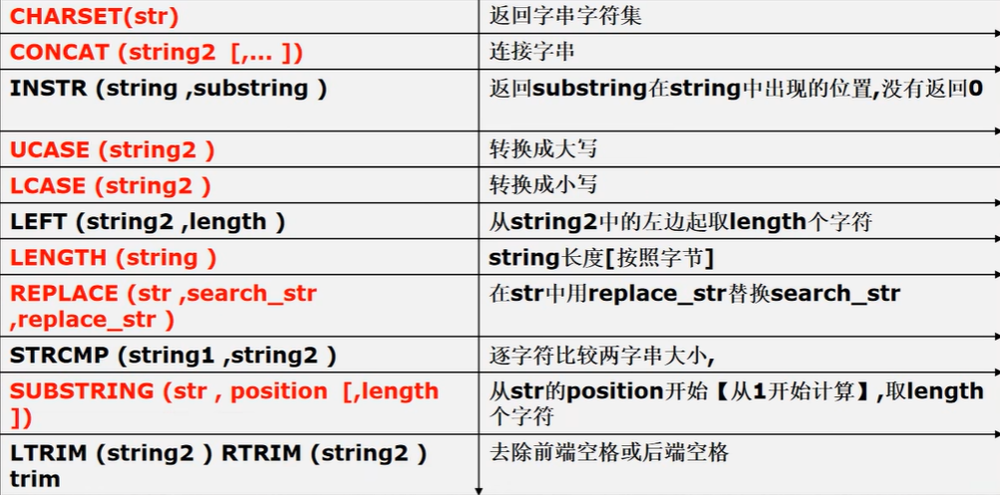

```mysql
#演示字符串相关函数的使用【使用emp表来演示】
SELECT * FROM emp;

-- CHARSET(str) 返回字串的字符集
SELECT CHARSET(ename) FROM emp;

-- CONCAT(string2 [,...]) 连接字串，将多个列拼接成一列
SELECT CONCAT(ename, ' 工作是 ', job) FROM emp;

-- INSTR(string, substring) 返回substring在string中出现的位置，没有返回0
-- DUAL 亚元表, 系统表 可以作为测试表使用
SELECT INSTR('hanshunping', 'ping') FROM DUAL;

-- UCASE(string2) 转成大写
SELECT UCASE(ename) FROM emp;

-- LCASE(string2) 转成小写
SELECT LCASE(ename) FROM emp;

-- LEFT(string2, length) 从string2中的左边起取1ength个字符
-- RIGHT(string2, length) 从string2中的右边起取length个字符
SELECT LEFT (ename, 2) FROM emp;
SELECT RIGHT (ename, 2) FROM emp;

-- LENGTH(string) string长度[按照字节]
SELECT LENGTH(ename) FROM emp;

-- REPLACE(str, search_str, replace_str ) 
-- 在str中用replace_str替换search_str
SELECT ename, REPLACE(job, 'MANAGER', '经理') FROM emp;

-- STRCMP(string1, string2) 逐字符比较两字串大小
SELECT STRCMP('hsp', 'asp') FROM DUAL;

-- SUBSTPING(str, position, spot, length)
-- 从str的position开始【从spot开始计算】, 取length个字符
-- 从1开始计算取出3字符
SELECT SUBSTRING(ename, 1, 3) FROM emp;

-- LTRIM(string2) RTRIM(string2) TRIM(string)
-- 去除前端空格或后端空格
SELECT LTRIM(' 轻音少女') FROM DUAL;
SELECT RTRIM('轻音少女 ') FROM DUAL;
SELECT TRIM('  轻音少女 ') FROM DUAL;
```


- 练习

  ```mysql
  #以首字母小写的方式显示所有员工emp表的姓名
  SELECT CONCAT(LCASE(SUBSTRING(ename, 1, 1)), SUBSTRING(ename, 2))
  		FROM emp;
  ```


##### 数学函数

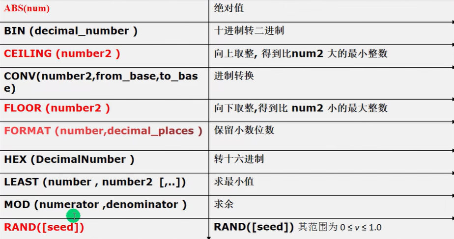

```mysql
#演示数学相关函数

-- ABS(num) 绝对值
SELECT ABS(-10) FROM DUAL;

-- BIN(decimal_number) 十进制转二进制
SELECT BIN(10) FROM DUAL;

-- CEILING(number2) 向上取整，得到比num2大的最小整数
SELECT CEILING(1.1) FROM DUAL;

-- CONV(number2, from_base, to_base) 进制转换
-- 下面的含义是 8 是 10 进制的8, 转成 2 进制输出
SELECT CONV(8, 10, 2) FROM DUAL;

-- FLOOR(number2) 向下取整，得到比num2小的最大整数
SELECT FLOOR(1.1) FROM DUAL;

-- FORMAT(number, decimal_places) 保留小数位数(四舍五入)
SELECT FORMAT(78.125564, 2) FROM DUAL;

-- HEX(DecimalNumber) 转十六进制
SELECT HEX(11);

-- LEAST(number, number2 [,...]) 求最小值
SELECT LEAST(0, 1, -10, 4) FROM DUAL;

-- MOD(numerator, denominator) 求余
SELECT MOD(10, 3) FROM DUAL;

-- RAND([seed]) 返回随机数其范围为0 <= v <= 1.0
-- 说明
-- 1、如果使用rand()每次返回不同的随机数，在 0 <= v <= 1.0
SELECT RAND() FROM DUAL;
-- 2、如果使用 rand (seed)返回随机数，范围在 0 <= v <= 1.0，如果seed不变，
--     该随机数不变
SELECT RAND(6) FROM DUAL;
```


##### 日期函数


```mysql
# 日期时间相关的函数

-- CURRENT_DATE() 当前日期
SELECT CURRENT_DATE() FROM DUAL;

-- CURRENT_TIME() 当前时间
SELECT CURRENT_TIME() FROM DUAL;

-- CURRENT_TIMESTAMP() 当前时间戳
SELECT CURRENT_TIMESTAMP() FROM DUAL;

-- 创建测试表、信息表
CREATE TABLE mes(
	id INT,
	content VARCHAR(30),
	send_time DATETIME);

-- 添加一条记录
INSERT INTO mes
	VALUES(1, '北京新闻', CURRENT_TIMESTAMP());

SELECT * FROM mes;
```


```mysql
# 上应用实例
INSERT INTO mes VALUES(2, '上海新闻', NOW());
INSERT INTO mes VALUES(3, '广州新闻', NOW());
-- 显示所有新闻信息，发布日期只显示日期，不用显示时间
SELECT id, content, DATE(send_time)
	FROM mes;
	
-- 请查询在10分钟内发布的帖子
SELECT * FROM mes
	WHERE DATE_ADD(send_time, INTERVAL 10 MINUTE) >= NOW()
SELECT * FROM mes
	WHERE DATE_SUB(NOW(), INTERVAL 120 MINUTE) <= send_time

-- 请在mysql的sql语句中求出2011-11-11和1990-1-1 相差多少天
SELECT DATEDIFF('2011-11-11', '1990-01-01') FROM DUAL;

-- 请用mysql的sq1语句求出你活了多少天?[练习]
SELECT DATEDIFF(NOW(), '2004-11-12') FROM DUAL;

-- 如果你能活80岁，求出你还能活多少天.[练习]
SELECT DATEDIFF(DATE_ADD('2004-11-12', INTERVAL 80 YEAR), NOW()) FROM DUAL;

#上面函数的细节说明：
-- 1、DATE_ADD()中的interval后面可以是year minute second day等
-- 2、DATE SUB()中的interval后面可以是year minute second hour day等
-- 3、DATEDIFF(date1,date2)得到的是天数,而且是date1-date2的天数,因此可以取负数
-- 4、这四个函数的日期类型可以是date, datetime或者timestamp
```


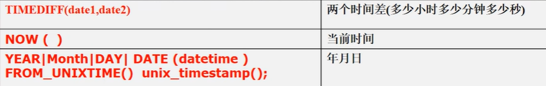

```mysql
#两个时间差(多少小时多少分钟多少秒)
SELECT TIMEDIFF('10:11:11', '06:10:10') FROM DUAL;

#当前时间
SELECT NOW() FROM DUAL;

# YEAR|MONTH|DAY|DATE(datetime) 返回年月日
SELECT YEAR(NOW()) FROM DUAL;
SELECT MONTH(NOW()) FROM DUAL;
SELECT DAY(NOW()) FROM DUAL;
SELECT MONTH('2013-11-10') FROM DUAL;

# unix_timetamp(): 返回的是1970-1-1到现在的秒数
SELECT UNIX_TIMESTAMP() FROM DUAL;

# FROM_UNIXTIME():可以把一个unix_timestamp秒数，转成指定格式的日期
-- %Y-%m-%d 格式是规定好的，表示年月日
-- 意义：在开发中，可以存放一个整数，然后表示时间，通过FROM_UNIXTIME转换
SELECT FROM_UNIXTIME(1618483484, '%Y-%m-%d') FROM DUAL;
SELECT FROM_UNIXTIME(1618483484, '%Y-%m-%d %H:%i:%s') FROM DUAL;
-- 在实际开发中，我们也经常使用int来保存一个unix时间戳
-- 然后使用from_unixtime()进行转换，还是非常有实用价值的
```


##### 加密和系统函数

```mysql
# 演示加密函数和系统函数

-- USER() 查询用户
-- 可以查看登录到mysql的有哪些用户，以及登录的IP
SELECT USER() FROM DUAL; -- 用户@IP地址

-- DATABASE() 查询当前使用数据库名称
SELECT DATABASE();

-- MD5(str) 为字符串算出一个MD5 32的字符串，常用(用户密码)加密
-- root 密码是 hsp -> 加密md5 -> 在数据库中存放的是加密后的密码
SELECT MD5('hsp') FROM DUAL;

-- 演示用户表，存放密码时，是md5
CREATE TABLE hsp_user(
	id INT,
	`name` VARCHAR(32) NOT NULL DEFAULT '',
	pwd CHAR(32) NOT NULL DEFAULT '');
INSERT INTO hsp_user
	VALUES(100, '轻音少女', MD5('k-on'));
	
SELECT * FROM hsp_user
	WHERE `name` = '轻音少女' AND pwd = MD5('k-on')

-- PASSWORD(str) 加密函数，MySQL数据库的用户密码就是PASSWORD函数加密
SELECT PASSWORD('hsp') FROM DUAL;

-- select * from mysql.user 查询用户密码
SELECT * FROM mysql.user
```


##### 流程控制函数

```mysql
# 演示流程控制语句

-- IF(expr1, expr2, expr3) 如果expr1为true, 则返回expr2否则返回expr3
SELECT IF(TRUE, '北京', '上海') FROM DUAL;

-- IFNULL(expr1, expr2) 如果expr1不为空, 则返回expr1, 否则返回expr2
SELECT IFNULL(NULL, '轻音少女') FROM DUAL;

-- SELECT CASE WHEN expr1 THEN expr2 WHEN expr3 THEN 4 ELSE expr5 END; [类似多重分支.]
-- 如果expr1 为true，则返回expr2，如果expr1 为false 和 expr2 为true，返回 expr4。否则返回 expr5
SELECT CASE 
	WHEN FALSE THEN '1'
	WHEN FALSE THEN '2'
	ELSE '3' END;

-- 1. 查询emp 表，如果 comm 是null ，则显示0.0
-- 说明，判断是否为null 要使用 is null，判断不为空 使用 is not
SELECT ename, IF(comm IS NULL, 0.0, comm)
	FROM emp;
SELECT ename, IFNULL(comm, 0.0)
	FROM emp;

-- 2.如果emp表的job是CLERK则显示职员, 如果是MANAGER则显示经理
--	如果是SALESMAN则显示销售人员，其它正常显示
SELECT ename, (SELECT CASE
		WHEN job = 'CLERK' THEN '职员'
		WHEN job = 'MANAGER' THEN '经理'
		WHEN job = 'SALESMAN' THEN '销售人员'
		ELSE job END) AS 'job'
	FROM emp;
```


## 外连接


1.  左外连接 (如果左侧的表完全显示我们就说是左外连接)
2.  右外连接 (如果右侧的表完全显示我们就说是右外连接)

```mysql
-- 表stu
CREATE TABLE stu (
	id INT,
	`name` VARCHAR(32));
INSERT INTO stu VALUES(1, 'jack'), (2, 'tom'), (3, 'kity'), (4, 'nono');
SELECT * FROM stu;

-- 表exam
CREATE TABLE exam (
	id INT,
	grade INT);
INSERT INTO exam VALUES(1, 56), (2, 76), (11, 8);
SELECT * FROM exam;


-- 原方法
SELECT `name`, stu.id, grade
	FROM stu, exam
	WHERE stu.id = exam.id;
# 使用左连接（显示所有人的成绩,如果没有成绩,也要显示该人的姓名和id号,成绩显示为空）
SELECT `name`, stu.id, grade
	FROM stu LEFT JOIN exam
	ON stu.id = exam.id;
# 使用右外连接（显示所有成绩，如果没有名字匹配，显示空)
-- 即：右边的表(exam)和左表没有匹配的记录，也会把右表的记录显示出来
SELECT `name`, stu.id, grade
	FROM stu RIGHT JOIN exam
	ON stu.id = exam.id;

# 课堂练习
-- 列出部门名称和这些部门的员工信息（名字和工作），
-- 同时列出那些没有员工的部门名
-- 使用左外连接实现
SELECT * FROM emp;
SELECT * FROM dept;
SELECT ename, dname, job
	FROM dept LEFT JOIN emp
	ON emp.deptno = dept.deptno
-- 使用右外连接实现
SELECT ename, dname, job
	FROM  emp RIGHT JOIN dept
	ON emp.deptno = dept.deptno
```


## 约束

- 基本介绍

  ​	约束用于确保数据库的数据满足特定的商业规则。在mysql中，约束包括：not null，unique，primary key，foreign key和check五种.


##### primary key (主键)

```mysql
# primary key主键使用

CREATE TABLE t17 
	(id INT PRIMARY KEY, -- 表示id列是主键
	 `name` VARCHAR (32),
	 email VARCHAR(32));

-- 主键列的值是不可以重复
INSERT INTO t17
	VALUES(1, 'jack', 'jack@sohu.com');
INSERT INTO t17
	VALUES(2, 'tom', 'tom@sohu.com');
INSERT INTO t17
	VALUES(1, 'hsp', 'hsp@sohu.com');-- 错误的

SELECT * FROM t17;

# primary key主键细节说明
-- 1. primary key不能重复而且不能为null。
INSERT INTO t17
	VALUES(NULL, 'hsp', 'hsp@sohu.com');-- 错误的
	
-- 2. 一张表最多只能有一个主键，但可以是复合主键
CREATE TABLE t18
	(id INT PRIMARY KEY, -- 表示id列是主键
	 `name` VARCHAR (32), PRIMARY KEY -- 错误的
	 email VARCHAR(32));
-- 演示复合主键（id和name做成复合主键）
--    主键的指定方式有两种
--    直接在字段名后指定：字段名primakry key
--    在表定义最后写primary key(列名)
CREATE TABLE t18
	(id INT,
	 `name` VARCHAR (32),
	 email VARCHAR(32),
	 PRIMARY KEY(id, `name`)-- 这里就是复合主键
	 );
INSERT INTO t18
	VALUES(1, 'tom', 'tom@sohu.com');
INSERT INTO t18
	VALUES(1, 'jack', 'jack@sohu.com');
INSERT INTO t18
	VALUES(1, 'tom', 'xx@sohu.com');-- 这里就违反了复合主键
SELECT * FROM t18;

-- 4. 使用desc表名，可以看到primary key的情况.

DESC t18 -- 查看 t18表的结果，显示约束的情况

-- 5. 提醒：在实际开发中，每个表往往都会设计一个主键
```


##### not null (非空)

​	如果在列上定义了not null,那么当插入数据时，必须为列提供数据

> 字段名 字段类型 not null

```mysql
#指定默认值（NOT NULL DEFAULT '内容'）
CREATE TABLE my_stu1 (
	id INT PRIMARY KEY,
	`www` VARCHAR(32) NOT NULL DEFAULT '万')-- 指定了默认值
	
SELECT * FROM my_stu1;

INSERT INTO my_stu1(id)
	VALUES(100);
```


##### unique (唯一)

​	当定义了唯一约束后，该列值是不能重复的。

```mysql
# unique 的使用

CREATE TABLE t21
	(id INT UNIQUE, -- 表示 id 列是不可以重复的
	`name` VARCHAR(32),
	email VARCHAR(32)
	)

INSERT INTO t21
	VALUES(1, 'jack', 'jack@sohu.com');
	
INSERT INTO t21
	VALUES(1, 'tom', 'tom@sohu.com');-- 错误
	
SELECT * FROM t21;

# unqiue 使用细节
-- 1. 如果没有指定 not null，则 unique 字段可以有多个null
-- 如果一个列（字段），是unique not null使用效果类似primary key
INSERT INTO t21
	VALUES(NULL, 'tom', 'tom@sohu.com');

-- 2. 一张表可以有多个unique字段
CREATE TABLE t22
	(id INT UNIQUE,
	`name` VARCHAR(32) UNIQUE,
	email VARCHAR(32)
	)
```


##### foreign key (外键)

​	用于定义主表和从表之间的关系：外键约束要定义在从表上，主表则必须具有主键约束或是unique约束，当定义外键约束后，要求外键列数据必须在主表的主键列存在或是为null (学生/班级图示)

```mysql
-- 外键演示

-- 创建 主表 my_class
CREATE TABLE my_class (
	id INT PRIMARY KEY, -- 班级编号
	`name` VARCHAR(32) NOT NULL DEFAULT '');
	
-- 创建 从表 my_stu
CREATE TABLE my_stu (
	id INT PRIMARY KEY, -- 学生编号
	`name` VARCHAR(32) NOT NULL DEFAULT '',
	class_id INT, -- 学生所在班级的编号
	-- 下面指定外键关系
	FOREIGN KEY (class_id) REFERENCES my_class(id))
	
-- 测试数据
INSERT INTO my_class
	VALUES(100, 'java'), (200, 'web');
	
SELECT * FROM my_class;

INSERT INTO my_stu
	VALUES(1, 'tom', 100);
INSERT INTO my_stu
	VALUES(2, 'jack', 200);
INSERT INTO my_stu
	VALUES(3, 'hap', 300);-- 这里会失败，因为300班级不存在
	
SELECT * FROM my_stu;

-- 1. 外键指向的表的字段，要求是primary key或者是unique
-- 2. 表的类型是innodb,这样的表才支持外键
-- 3. 外键字段的类型要和主键字段的类型一致（长度可以不同）
-- 4. 外键字段的值，必须在主键字段中出现过，或者为null（前提是外键字段允许为null）
-- 5.一旦建立主外键的关系，数据不能随意删除了
```


##### check

​	用于强制行数据必须满足的条件，假定在sal列上定义了check约束，并要求sal列值在1000~2000之间，如果不在1000~2000之间就会提示出错。
​    老师提示：oracle 和 sql server 均支持check，但是mysql5.7目前还不支持check，只做语法校验，但不会生效。

```mysql
-- 演示check的使用
-- mysql 5.7目前还不支持check，只做语法校验，但不会生效

-- 测试
CREATE TABLE t23 (
	id INT PRIMARY KEY,
	`name` VARCHAR(32),
	sex VARCHAR(6) CHECK (sex IN('man', 'woman')),
	sal DOUBLE CHECK (sal > 1000 AND sal < 2000)
	);

-- 添加数据
INSERT INTO t23
	VALUES(1, 'jack', 'mid', 1);
SELECT * FROM t23;
```


##### mysql约束案例


```mysql
CREATE TABLE goods6(
	goods_id INT PRIMARY KEY,
	goods_name VARCHAR(64) NOT NULL DEFAULT '',
	unitprice DECIMAL(10,2) NOT NULL DEFAULT 0
		CHECK (unitprice > 1.0 AND unitprice < 9999.99),
	category INT NOT NULL DEFAULT 0,
	provider VARCHAR(64) NOT NULL DEFAULT ''
	)

CREATE TABLE customer6(
	customer_id CHAR(8) PRIMARY KEY,
	`name` VARCHAR(64) NOT NULL DEFAULT '',
	address VARCHAR(64) NOT NULL DEFAULT '',
	email VARCHAR(64) UNIQUE NOT NULL,
	sex ENUM('男', '女') NOT NULL,-- 这里使用的是枚举类型，是生效的
	card_id CHAR(18)
	)

CREATE TABLE purchase6(
	order_id INT UNSIGNED PRIMARY KEY,
	customer_id CHAR(8) NOT NULL DEFAULT '',
	goods_id INT NOT NULL DEFAULT 0,
	nums INT NOT NULL DEFAULT 0,
	
	FOREIGN KEY(customer_id) REFERENCES customer6(customer_id),
	FOREIGN KEY(goods_id) REFERENCES goods6(goods_id)
	)

DESC goods6;
DESC customer6;
DESC purchase6;
```


##### 自增长

- 自增长基本介绍

  ​	在某张表中，存在一个 id 列（整数），我们希望在添加记录的时候该列从1开始，自动的增长，怎么处理？

```mysql
# 演示自增长的使用

-- 创建表
CREATE TABLE t24
	(id INT PRIMARY KEY AUTO_INCREMENT,
	 email VARCHAR(32)NOT NULL DEFAULT '',
	 `name` VARCHAR(32)NOT NULL DEFAULT '')

-- 测试自增长的使用
INSERT INTO t24
	VALUES(NULL, 'tom@qq.com', 'tom');
INSERT INTO t24
	(email, `name`) VALUES('wang@qq.com', 'wang');

SELECT * FROM t24;

# 自增长使用细节
-- 1. 一般来说自增长是和primary key 配合使用的
-- 2. 自增长也可以单独使用[但是需要配合一个unique]
-- 3. 自增长修饰的字段为整数型的（虽然小数也可以但是非常非常少这样使用）
-- 4. 自增长默认从1开始，你也可以通过
--    如下命令修改alter table 表名 auto_increment = 新的开始值;
-- 修改默认的自增长开始值
CREATE TABLE t25 
	(id INT PRIMARY KEY AUTO_INCREMENT, 
	 email VARCHAR(32) NOT NULL DEFAULT '',
	 `name` VARCHAR(32) NOT NULL DEFAULT '');
	 
ALTER TABLE t25 AUTO_INCREMENT = 100 

INSERT INTO t25
	VALUES(NULL, 'marry@qq.com', 'marry');
SELECT * FROM t25;

-- 5. 如果你添加数据时，给自增长字段(列)指定的有值，则以指定的值为准，
--    如果指定了自增长，一般来说，就不要破坏自增长的规则来添加数据.
```


## 索引

​	说起提高数据库性能，索引是最物美价廉的东西了。不用加内存，不用改程序，不用调sql,查询速度就可能提高百倍干倍。

```mysql
SELECT COUNT(*) FROM emp;

-- 在没有创建索引时，我们的查询一条记录
SELECT *
	FROM emp
	WHERE empno = 1234567

-- 使用索引来优化一下，体验索引的牛
-- empno_index 索引名称
-- ON emp (empno)：表示在 emp表的 empno列创建索引
CREATE INDEX empno_index ON emp (empno)

-- 在没有创建索引前， emp.ibd 文件大小是 524m
-- 创建索引后 emp.ibd 文件大小 是 655m[索引本身也会占用空间.]

-- 创建索引后，查询的速度如何
SELECT *
	FROM emp
	WHERE empno = 1234567

-- 创建索引后，只对创建了索引的列有效
SELECT *
	FROM emp
	WHERE ename = 'isjhdd' -- 没有在ename创建索引时，速度依旧很慢
```


##### 索引的原理


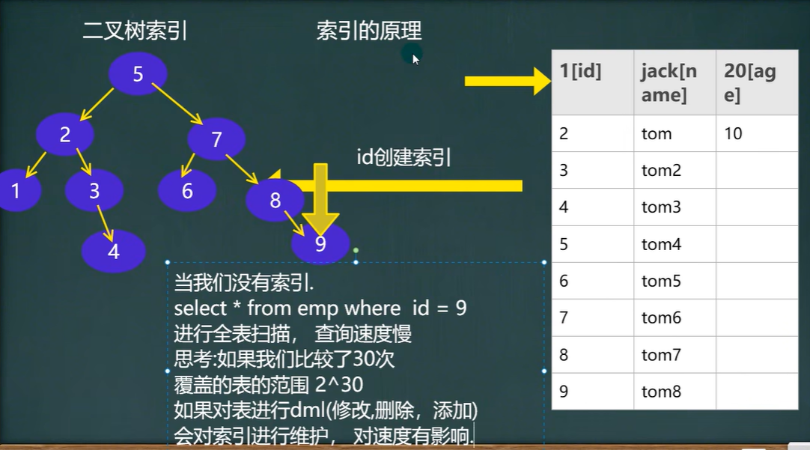


##### 创建索引 [增删改查]

```mysql
# 索引的类型
-- 1. 主键索引，主键自动的为主索（类型Primary key)
-- 2. 唯一索引(UNIQUE)
-- 3. 普通索引(INDEX)
-- 4. 全文索引(FULLTEXT)[适用于MyISAM]
-- 一般开发，不使用mysql自带的全文索引，而是使用：全文搜索 Solr和 ElasticSearch(ES)

# 演示mysql的索引的使用

-- 创建表
CREATE TABLE t25(
	id INT,
	`name` VARCHAR(32));
	
-- 查询表是否有索引
SHOW INDEXES FROM t25;

# 添加索引
-- 添加唯一索引
CREATE UNIQUE INDEX id_index ON t25 (id);

-- 添加普通索引方式1
CREATE INDEX id_index ON t25 (id);

-- 如何选择
-- 1. 如果某列的值，是不会重复的，则优先考虑使用unique索引，
-- 否则使用普通索引

-- 添加普通索引方式2
ALTER TABLE t25 ADD INDEX id_index (id)

-- 添加主键索引
-- 第一种方式
CREATE TABLE t26(
	id INT PRIMARY KEY,
	`name` VARCHAR(32));

-- 第二种方式
ALTER TABLE t26 ADD PRIMARY KEY (id)

SHOW INDEX FROM t26; #查询表是否有索引

# 删除索引
DROP INDEX id_index ON t25

-- 删除主键索引
ALTER TABLE t26 DROP PRIMARY KEY

-- 修改索引，先删除，再添加新的索引

# 查询索引
-- 方式一
SHOW INDEX FROM t25;

-- 方式二
SHOW INDEXES FROM t25;

-- 方式三
SHOW KEYS FROM t25;
```


##### 课后练习

```mysql
# 建立索引（主键）课后练习
-- 创建一张订单表order(id号，商品名，订购人，数量)，
-- 要求id号为主键，请使用2种方式来创建主键.
-- (提示：为练习方便，可以是order1,order2)

-- 第一种方式
CREATE TABLE `order`(
	id INT PRIMARY KEY,
	`shop_name` VARCHAR(32),
	`person_name` VARCHAR(16),
	`number` INT
	)
SHOW INDEXES FROM `order`;

-- 第二种方式
CREATE TABLE `order2`(
	id INT,
	`shop_name` VARCHAR(32),
	`person_name` VARCHAR(16),
	`number` INT
	)
ALTER TABLE `order2` ADD PRIMARY KEY (id);
SHOW INDEXES FROM `order2`;


# 建立索引（唯一）课后练习
-- 创建一张特价菜谱表menu(id号，菜谱名，厨师，点餐人身份证，价格),
-- 要求id号为主键，点餐人身份证是unique，请使用两种方式来创建unique,
-- (提示：为练习方便，可以是menu1,menu2)

-- 第一种方式
CREATE TABLE `menu1`(
	id INT PRIMARY KEY,
	`vegetable_name` VARCHAR(32),
	`card` VARCHAR(16) UNIQUE,
	`price` INT
	)
SHOW INDEXES FROM `menu1`;
	
-- 第二种方式
CREATE TABLE `menu2`(
	id INT,
	`vegetable_name` VARCHAR(32),
	`card` VARCHAR(16),
	`price` INT
	)
ALTER TABLE `menu2` ADD PRIMARY KEY (id)
CREATE UNIQUE INDEX id_index ON `menu2` (card)
SHOW INDEXES FROM `menu2`


# 建立索引（普通）课堂练习
-- 创建一张运动员表sportman(id号，名字，特长)，
-- 要求id号为主键，名字为普通索引，请使用2种方式来创建索引
-- （提示：为练习方便，可以是不同表名sportman1,sportman2）

-- 第一种方式
CREATE TABLE `sportman1`(
	id INT PRIMARY KEY,
	`name` VARCHAR(32),
	`speciality` TEXT
	)
CREATE INDEX name_index ON `sportman1` (`name`);
SHOW INDEXES FROM `sportman1`;

-- 第二种方式
CREATE TABLE `sportman2`(
	id INT,
	`name` VARCHAR(32),
	`speciality` TEXT
	)
ALTER TABLE `sportman2` ADD PRIMARY KEY (id)
ALTER TABLE `sportman2` ADD INDEX name_index (`name`)
SHOW INDEXES FROM `sportman2`;
```


##### 哪些列上适合使用索引

1. 较频繁的作为查询条件字段应该创建索引

   select * from emp where empno = 1

2. 唯一性太差的字段不适合单独创建索引，即使频繁作为查询条件

   select * from emp where sex = '男'

3. 更新非常频繁的字段不适合创建索引

   select * from emp where logincount = 1

4. 不会出现在VHERE子句中字段不该创建索引


## 事务

##### 什么是事务

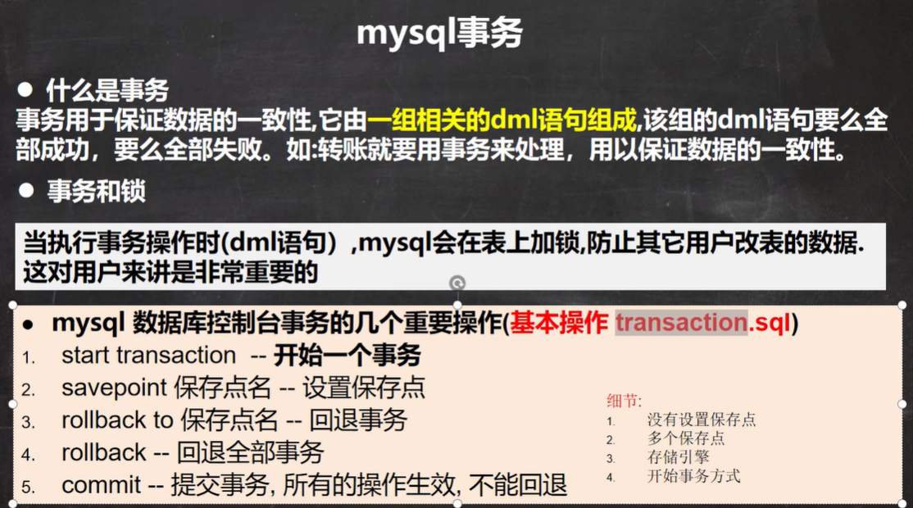

```mysql
# 事务的一个重要的概念和具体操作

-- 1. 创建一张测试表
CREATE TABLE t27(
	id INT,
	`name` VARCHAR(32)
	)

-- 2.开始事务
START TRANSACTION

-- 3. 设置保存点
SAVEPOINT a
-- 执行dml 操作
INSERT INTO t27 VALUES(100, 'tom');
SELECT * FROM t27;

SAVEPOINT b
-- 执行dml 操作
INSERT INTO t27 VALUES(200, 'jack');

-- 回退到 b
ROLLBACK TO b
-- 继续回退 a
ROLLBACK TO a

-- 如果这样，表示直接回退到事务开始的状态
ROLLBACK
```


##### 回退事务


```mysql
# 讨论事务细节

-- 1. 如果不开始事务,默认情况下,dml操作是自动提交的,不能回滚
INSERT INTO t27 VALUES(300, 'milan'); -- 自动提交 commit
SELECT * FROM t27

-- 2. 如果开始一个事务,你没有创建保存点.你可以执行rollback,
--    默认就是回退到你事务开始的状态.
START TRANSACTION
INSERT INTO t27 VALUES(400, 'king');
INSERT INTO t27 VALUES(500, 'scott');
ROLLBACK -- 表示直接回退到你事务开始的状态.

-- 3. 你也可以在这个事务中(还没有提交时),创建多个保存点.
--    比如: savepointaaa; 执行dml, savepoint bbb;

-- 4. 你可以在事务没有提交前,选择回退到哪个保存点.

-- 5. mysql的事务机制需要innodb的存储引擎才可以使用,myisam不好使.
--    InnoDB 存储引擎支持事务 ，MyISAM 不支持

-- 6. 开始一个事务start transaction, set autocommit = off;
START TRANSACTION
COMMIT;
```


##### 隔离级别

- 事务隔离级别介绍

  ​	1. 多个连接开启各自事务操作数据库中数据时，数据库系统要负责隔离操作，以保证各个连接在获取数据时的准确性。

  ​	2.如果不考虑隔离性,可能会引发如下问题:脏读、不可重复读、幻读。

  

- 查看事务隔离级别

  概念：Mysql隔离级别定义了事务与事务之间的隔离程度。

  

  **脏读(dirty read)**：当一个事务读取另一个事务尚未提交的改变（update, insert, delete）时，产生脏读。

  **不可重复读（nonrepeatable read)**：同一查询在同一事务中多次进行，由于其他提交事务所做的修改或删除，每次返回不同的结果集，此时发生不可重复读。

  **幻读（phantom read)**：同一查询在同一事务中多次进行，由于其他提交事务所做的插入操作，每次返回不同的结果集，此时发生幻读。

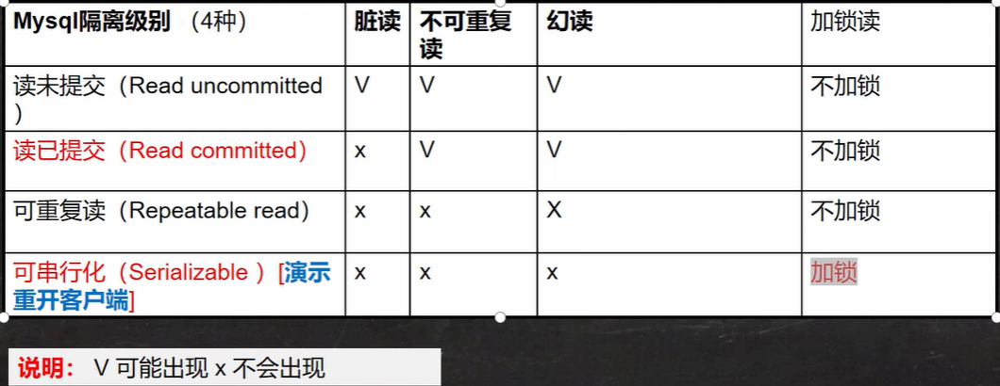

```mysql
# 演示mysql的事务隔离级别

-- 1.开了两个mysql的控制台
-- 2.查看当前mysql的隔离级别
SELECT @@tx_isolation;

-- mysql> SELECT @@tx_isolation;
-- +-----------------+
-- | @@tx_isolation  |
-- +-----------------+
-- | REPEATABLE-READ |
-- +-----------------+

-- 3.把其中一个控制台的隔离级别设置成 读未提交（Read uncommitted）
SET SESSION TRANSACTION ISOLATION LEVEL READ UNCOMMITTED;
```


```mysql
-- 1.查看当前会话隔离级别 
SELECT @@tx_isolation; 

-- 2.查看系统当前隔离级别 
SELECT @@global.tx_isolation;

-- 3.设置当前会话隔离级别 
SET SESSION TRANSACTION ISOLATION LEVEL REPEATABLE READ;

-- 4.设置系统当前隔离级别 
SET GLOBAL TRANSACTION ISOLATION LEVEL REPEATABLE READ; 

-- 5.mysql默认的事务隔离级别是repeatable read,
-- 一般情况下，没有特殊要求，没有必要修改（因为该级别可以满足绝大部分项目需求）


# 全局修改，修改my.ini配置文件，在my.ini最后加上 
-- 可选参数有：READ-UNCOMMITTED,READ-COMMITTED,REPEATABLE-READ,SERIALIZABLE.
TRANSACTION-ISOLATION = REPEATABLE-READ
```


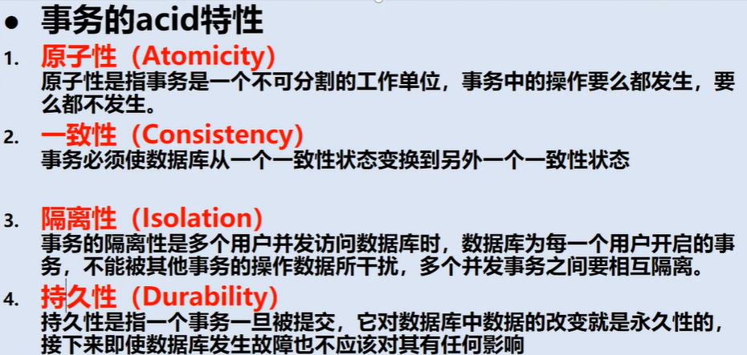


## mysql表类型和存储引擎

- 基本介绍
  1. MySQL的表类型由存储引擎(Storage Engines)决定，主要包括MyISAM、ainnoDB、 Memory等。
  2. MySQL数据表主要支持六种类型，分别是: CSV、 Memory、 ARCHIVE、MRG_MYISAM、MYISAM、InnoBDB。
  3.  这六种又分为两类，一类是”事务安全型”（transaction-safe），比如：InnoDB；其余都属于第二类，称为"非事务安全型"(non-transaction-safe)[mysiam 和 memory]。

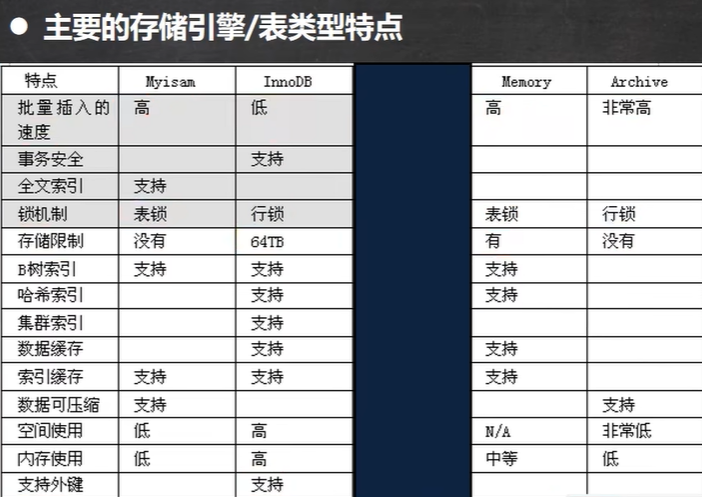

- 细节说明

  重点介绍三种：MyISAM、InnoDB、MEMORY

  1.MyISAM不支持事务、也不支持外键，但其访问速度快，对事务完整性没有要求

  2.InnoDB存储引擎提供了具有提交、回滚和崩溃恢复能力的事务安全。但是比起MyISAM存储引擎，InnoDB写的处理效率差一些并且会占用更多的磁盘空间以保留数据和索引。

  3.MEMORY存储号引擎使用存在内存中的内容来创建表。每个MEMORY：表只实际对应一个磁盘文件。MEMORY类型的表访问非常得快，因为它的数据是放在内存中的，并且默认使用HASH索引。但是一旦MySQL服务关闭，表中的数据就会丢失掉，表的结构还在。


- 三种存储引擎表使用案例

  ```mysql
  # 表类型和存储引擎
  
  -- 查看所有的存储引擎
  SHOW ENGINES;
  
  # innodb存储引擎，前面使用过
  -- 1.支持事务2.支持外键3.支持行级锁
  
  # myisam 存储引擎
  CREATE TABLE t28(
  	id INT,
  	`name` VARCHAR(32)) ENGINE MYISAM
  -- 1.添加速度快 2.不支持外键和事务 3.支持表级锁
  START TRANSACTION;
  SAVEPOINT t1
  INSERT INTO t28 VALUES(1, 'jack');
  SELECT * FROM t28;
  ROLLBACK TO t1
  
  # memory存储引擎
  -- 1.数据存储在内存中[关闭了Mysq1服务，数据丢失，但是表结构还在]
  -- 2.执行速度很快（没有Io读写）
  -- 3.默认支持索引(hash表)
  CREATE TABLE t29(
  	id INT,
  	`name` VARCHAR(32)) ENGINE MEMORY
  DESC t29
  INSERT INTO t29
  	VALUES(1, 'tom'), (2, 'jack'), (3, 'hsp');
  SELECT * FROM t29
  ```

  

- 如何选择表的存储引擎

  ​	1.如果你的应用不需要事务，处理的只是基本的CRUD操作，那么MyISAM是不二选择，速度快

  ​	2.如果需要支持事务，选择InnoDB。

  ​	3.Memory存储引擎就是将数据存储在内存中，由于没有磁盘l./O的等待，速度极快。但由于是内存存储引擎，所做的任何修改在服务器重启后都将消失。（经典用法 用户的在线状态().）


- 修改存储引擎

  ```mysql
  ALTER TABLE `表名` ENGINE = 存储引擎;
  ```

  

##  视图

- 看一个需求

  ​	emp 表的列信息很多，有些信息是个人重要信息（比如sal、comm、mgr、hiredate)，如果我们希望某个用户只能查询emp表的(empno、ename、job 和 deptno）信息，有什么办法？=> 视图

  

- 视图基本概念

   1. 视图是一个虚拟表，其内容由查询定义。同真实的表一样，视图包含列，其数据来自对应的真实表（也叫基表）。

   2. 视图和基表关系的示意图。

      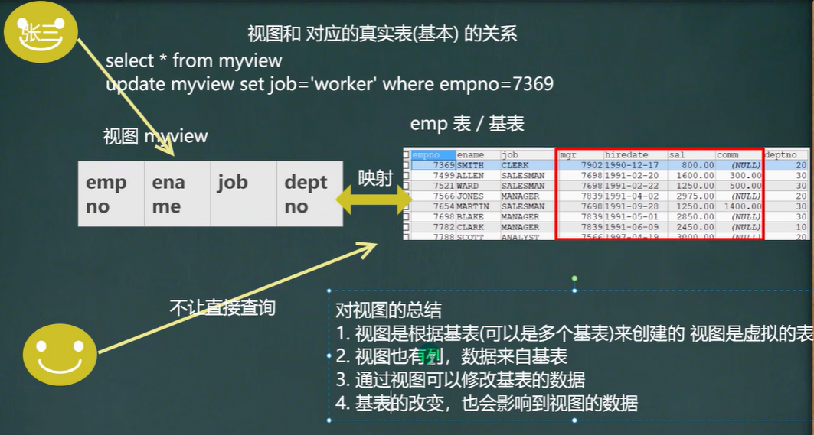


- 视图的基本使用

```mysql
# 视图的基本使用
-- 1. create view 视图名 as select语句
-- 2. alter view视图名 as select语句--更新成新的视图
-- 3. SHOW CREATE VIEW 视图名
-- 4. drop view视图名1,视图名2


# 创建一个视图emp_view01,只能查询emp表的(empno、ename、job 和 deptno )信息

-- 创建视图
CREATE VIEW emp_view01
	AS
	SELECT empno, ename, job, deptno FROM emp;

-- 查看视图
DESC emp_view01

SELECT * FROM emp_view01;
SELECT empno, job FROM emp_view01;

-- 查看创建视图的指令
SHOW CREATE VIEW emp_view01

-- 删除视图
DROP VIEW emp_view01;


# 视图的细节
-- 1.创建视图后，到数据库去看，对应视图只有一个视图结构文件（形式：视图名.frm）
-- 2.视图的数据变化会影响到基表，基表的数据变化也会影响到视图[insert update delete]
-- 3.视图之中可以再使用视图，数据仍然来自基表
```


- 视图最佳实践

  ​	1.**安全**。一些数据表有着重要的信息。有些字段是保密的，不能让用户直接看到。这时就可以创建一个视图，在这张视图中只保留一部分字段。这样，用户就可以查询自己需要的字段，不能查看保密的字段。

  ​	2.**性能**。关系数据库的数据常常会分表存储，使用外键建立这些表的之间关系。这时，数据库查询通常会用到连接(JOIN)。这样做不但麻烦，效率相对也比较低。如果建立一个视图，将相关的表和字段组合在一起，就可以避免使用JOIN查询数据。
  ​    3.**灵活**。如果系统中有一张旧的表，这张表由于设计的问题，即将被废弃。然而，很多应用都是基于这张表，不易修改。这时就可以建立一张视图，视图中的数据直接映射到新建的表。这样，就可以少做很多改动，也达到了升级数据表的目的。


- 视图课堂练习

  ```mysql
  # 视图的课堂练习
  
  -- 针对emp, dept 和salgrade 张三表.创建一个视图emp view03,
  -- 可以显示雇员编号，雇员名，雇员部门名称和薪水级别[即使用三张表，构建一个视图]
  
  -- 分析：使用三表联合查询，得到结果
  -- 	 将得到的结果，构成视图
  
  CREATE VIEW emp_view03
  	AS
  	SELECT empno, ename, dname, grade
  	FROM emp, dept, salgrade
  	WHERE emp.deptno = dept.deptno AND
  	 (sal BETWEEN losal AND hisal)
  
  DESC emp_view03
  SELECT * FROM emp_view03
  ```

  


## MySQL管理

##### Mysql用户管理

mysql中的用户，都存储在系统数据库mysql中 user 表中

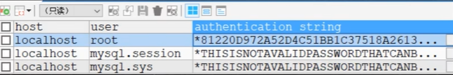

 其中user表的重要字段说明：

1. host：允许登陆的“位置”，localhost表示该用户只允许本机登陆，也可以指定ip地址，比如：192.168.1.100
2. user：用户名；
3. authentication_string：密码，是通过mysql的password() 函数加密之后的密码。

```mysql
# Mysql用户的管理
-- 原因：当我们做项目开发时，可以根据不同的开发人员，赋给他相应的Mysgl操作权限
-- 所以，Mysq1数据库管理人员(root),根据需要创建不同的用户，赋给相应的权限，供人员使用

-- 1. 创建新的用户
-- 解读(1)'hsp_edu'@'localhost' 表示用户的完整信息'hsp_edu'用户名'localhost'登录的IP
--     (2) 123456 密码，但是注意 存放到 mysql.user表时，是password('123456')加密后的密码
CREATE USER 'hsp_edu'@'localhost' IDENTIFIED BY '123456'

SELECT `host`, `user`, authentication_string
	FROM mysql.user
	
-- 2. 删除用户
DROP USER 'hsp_edu'@'localhost'

-- 修改自己的密码
SET PASSWORD = PASSWORD('abcdef')

-- 修改用户的密码，需要权限
SET PASSWORD FOR 'hsp_edu'@'localhost' = PASSWORD('123456')
```


##### Mysql权限管理

- mysql中的权限

  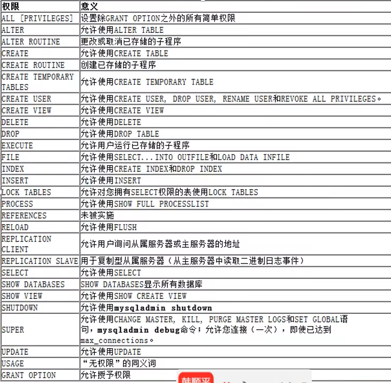


- 给用户授权

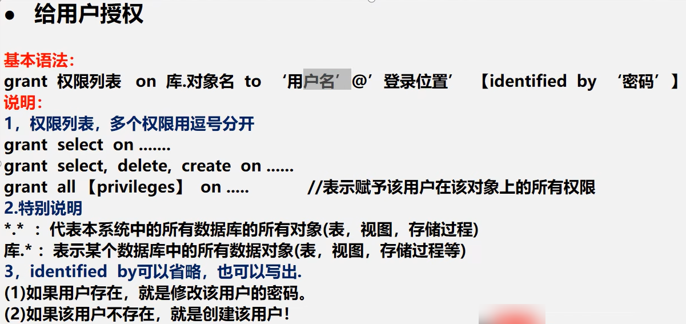

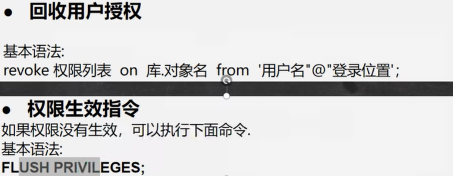


- 用户管理练习题

```mysql
# 演示 用户权限的管理

-- 创建用户wj，密码123，从本地登录
CREATE USER 'wj'@'localhost' IDENTIFIED BY '123'

-- 使用root 用户创建 textdb, 表 news
CREATE DATABASE testdb
CREATE TABLE news(
	id INT,
	content VARCHAR(32));
-- 添加一条测试数据
INSERT INTO news VALUES(100, '山海');
SELECT * FROM news

-- 给 wj 分配 查看news表和 添加news的权限
GRANT SELECT , INSERT
	ON testdb.news
	TO 'wj'@'localhost'

-- 修改 wj的密码为abc
SET PASSWORD FOR 'wj'@'localhost' = PASSWORD('abc');

-- 回收 wj 用户在 testdb.news 表的所有权限
REVOKE SELECT, INSERT ON testdb.news FROM 'wj'@'localhost'
-- 或REVOKE all ON testdb.news FROM 'wj'@'localhost'

-- 删除 wj用户
DROP USER 'wj'@'localhost'
```


##### Mysql管理细节

1.在创建用户的时候，如果不指定Host，则为%，%表示表示所有IP都有连接权限create user xxx;

2.你也可以这样指定create user 'xx'@'192.168.1.%' 表示xx用户在192.168.1.*的ip可以登录mysql

3.在删除用户的时候，如果host不是%，需要明确指定'用户'@'host值'


## Mysql作业

- Mysql作业一

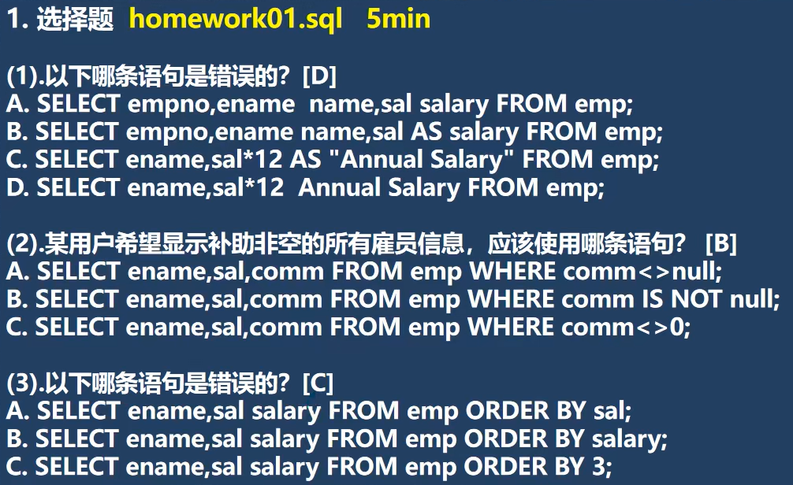


- Mysql作业二

```mysql
# 2.写出查看DEPT表和EMP表的结构 的sql语句
DESC dept
DESC emp

# 3.使用简单查询语句完成：
SELECT * FROM dept;
SELECT * FROM emp;
-- (1)显示所有部门名称。
SELECT dname FROM dept;
-- (2)显示所有雇员名及其全年收入 13月(工资+补助)，并指定列别名"年收入"
SELECT ename, (sal + IFNULL(comm,0)) * 13 AS '年收入' 
	FROM emp;

# 4.限制查询数据。
SELECT * FROM emp;
-- (1)显示工资超过2850的雇员姓名和工资。
SELECT ename, sal
	FROM emp 
	WHERE sal > 2850
-- (2)显示工资不在1500到2850之间的所有雇员名及工资。
SELECT ename, sal
	FROM emp 
	WHERE NOT(sal > 1500 AND sal < 2850)
-- (3)显示编号为7566的雇员姓名及所在部门编号。
SELECT ename, deptno
	FROM emp
	WHERE empno = 7566
-- (4)显示部门10和30中工资超过1500的雇员名及工资。
SELECT ename, sal
	FROM emp
	WHERE deptno IN(10,30) AND sal > 1500
-- (5)显示无管理者的雇员名及岗位。
SELECT ename, job
	FROM emp
	WHERE mgr IS NULL

# 5.排序数据。
-- (1)显示在1991年2月1日到1991年5月1日之间雇用的雇员名,岗位及雇佣日期,并以雇佣日期进行排序。
SELECT ename, job, hiredate
	FROM emp
	WHERE hiredate > '1991-02-01' AND hiredate < '1991-05-01'
	ORDER BY hiredate
-- (2)显示获得补助的所有雇员名,工资及补助,并以工资降序排序
SELECT ename, sal, comm
	FROM emp
	WHERE comm IS NOT NULL
	ORDER BY comm DESC
```


- Mysql作业三

```mysql
# 6.根据：emp员工表 写出正确SQL
SELECT * FROM emp
-- 1.选择部门30中的所有员工
SELECT ename
	FROM emp
	WHERE deptno = 30
-- 2.列出所有办事员(CLERK)的姓名，编号和部门编号.
SELECT ename, empno, deptno
	FROM emp
	WHERE job = 'CLERK'
-- 3.找出佣金高于薪金的员工
SELECT ename
	FROM emp
	WHERE IFNULL(comm,0) > sal
-- 4.找出佣金高于薪金60%的员工
SELECT ename
	FROM emp
	WHERE IFNULL(comm,0) > (sal * 6 / 10)
-- 5.找出部门10中所有经理(MANAGER)和部门20中所有办事员(CLERK)的详细资料.
SELECT *
	FROM emp
	WHERE (job = 'MANAGER' AND deptno = 10)
	OR (job = 'CLERK' AND deptno = 20)
-- 6.找出部门10中所有经理(MANAGER),部门20中所有办事员(CLERK),
--   还有既不是经理又不是办事员但其薪金大于或等于2000的所有员工的详细资料.
SELECT *
	FROM emp
	WHERE (job = 'MANAGER' AND deptno = 10)
	OR (job = 'CLERK' AND deptno = 20)
	OR (ename IN (SELECT ename
			FROM emp
			WHERE job != 'MANAGER' AND job != 'CLERK' 
			AND sal > 2000))
-- 7.找出收取佣金的员工的不同工作
SELECT DISTINCT job
	FROM emp
	WHERE comm IS NOT NULL
-- 8.找出不收取佣金或收取的佣金低于500的员工
SELECT * 
	FROM emp
	WHERE comm IS NULL OR IFNULL(comm,0) < 500
-- 9.找出各月倒数第3天受雇的所有员工！
-- 提示：last_day(日期)，可以返回该日期所在月份的最后一天
--  last_day(日期) - 2得到日期所有月份的倒数第3天
SELECT * 
	FROM emp
	WHERE LAST_DAY(hiredate) - 2 = hiredate
-- 10.找出早于12年前受雇的员工
SELECT *
	FROM emp
	WHERE hiredate < DATE_SUB(NOW(), INTERVAL 12 YEAR)
-- 11.以首字母小写的方式显示所有员工的姓名
SELECT CONCAT(LCASE(LEFT(ename,1)), SUBSTRING(ename,2))
	FROM emp
-- 12.显示正好为5个字符的员工的姓名.
SELECT * FROM emp
	WHERE CHAR_LENGTH(ename) = 5
```


- Mysql作业四

```mysql
# 6. 根据：emp员工表 写出正确SQL
SELECT * FROM emp
-- 13.显示不带有"R"的员工的姓名.
SELECT *
	FROM emp
	WHERE ename NOT LIKE '%R%'
-- 14.显示所有员工姓名的前三个字符.
SELECT LEFT(ename, 3)
	FROM emp
-- 15.显示所有员工的姓名,用a替换所有"A"
SELECT REPLACE(ename, 'A', 'a')
	FROM emp
-- 16.显示满10年服务年限的员工的姓名和受雇日期.
SELECT ename, hiredate
	FROM emp
	WHERE DATE_ADD(hiredate, INTERVAL 10 YEAR) < NOW()
-- 17.显示员工的详细资料，按姓名排序.
SELECT *
	FROM emp
	ORDER BY ename
-- 18.显示员工的姓名和受雇日期,根据其服务年限,将最老的员工排在最前面.
SELECT ename, hiredate
	FROM emp
	ORDER BY hiredate
-- 19.显示所有员工的姓名、工作和薪金,按工作降序排序,若工作相同则按薪金排序.
SELECT ename, job, sal
	FROM emp
	ORDER BY job DESC , sal DESC
-- 20.显示所有员工的姓名、加入公司的年份和月份,按受雇日期所在月排序,
--    若月份相同则将最早年份的员工排在最前面.
SELECT ename, CONCAT(YEAR(hiredate), '-', MONTH(hiredate))
	FROM emp
	ORDER BY MONTH(hiredate), YEAR(hiredate)
-- 21.显示在一个月为30天的情况所有员工的日薪金,忽略余数.
SELECT FORMAT(((sal + IFNULL(comm, 0)) / 30), 0)
	FROM emp
-- 22.找出在(任何年份的)2月受聘的所有员工。
SELECT *
	FROM emp
	WHERE MONTH(hiredate) = 2
-- 23.对于每个员工，显示其加入公司的天数.
SELECT DATEDIFF(NOW(), hiredate)
	FROM emp
-- 24.显示姓名字段的任何位置包含"A"的所有员工的姓名.
SELECT *
	FROM emp
	WHERE ename LIKE '%A%'
-- 25.以年月日的方式显示所有员工的服务年限.(大概)
SELECT FROM_DAYS(DATEDIFF(NOW(), hiredate))
	FROM emp
```


- Mysql作业五

```mysql
# 7.根据: emp员工表, dept部门表, 工资 = 薪金sal + 佣金 comm 写出正确SQL
SELECT * FROM emp
SELECT * FROM dept 
	
-- (1).列出至少有一个员工的所有部门
SELECT COUNT(*) AS c, deptno
	FROM emp
	GROUP BY deptno
	HAVING c > 1
-- (2).列出薪金比“SMITH”多的所有员工。
SELECT ename
	FROM emp
	WHERE sal > (SELECT sal
			FROM emp
			WHERE ename = 'SMITH')
-- (3).列出受雇日期晚于其直接上级的所有员工。
SELECT worker.ename AS '员工名', worker.hiredate AS '员工入职时间',
	leader.ename AS '上级名', leader.hiredate AS '上级入职时间'
	FROM emp AS worker, emp AS leader
	WHERE worker.hiredate > leader.hiredate
	AND worker.mgr = leader.empno;
-- (4).列出部门名称和这些部门的员工信息,同时列出那些没有员工的部门。
SELECT dname, emp.*
	FROM dept
	LEFT JOIN emp ON dept.deptno = emp.deptno

-- (5).列出所有"CLERK" （办事员)的姓名及其部门名称。
SELECT ename, dname
	FROM emp, dept
	WHERE emp.deptno = dept.deptno AND job = 'CLERK'
-- (6).列出最低薪金大于1500的各种工作。
SELECT MIN(sal) AS min_sal, job
	FROM emp
	GROUP BY job
	HAVING min_sal > 1500
-- (7).列出在部门"SALES" (销售部)工作的员工的姓名。
SELECT  ename, dname
	FROM emp, dept
	WHERE emp.deptno = dept.deptno AND dname = 'SALES'
-- (8).列出薪金高于公司平均薪金的所有员工。
SELECT ename, sal
	FROM emp
	WHERE sal > (SELECT AVG(sal)
			FROM emp)
```


- Mysql作业六

```mysql
# 7. 根据：emp员工表，dept部门表，工资 = 薪金 + 佣金 写出正确SQL
SELECT * FROM emp
SELECT * FROM dept

-- (9).列出与"SCOTT"从事相同工作的所有员工。
SELECT ename
	FROM emp
	WHERE job IN (SELECT job
			FROM emp
			WHERE ename = 'SCOTT')
-- (10).列出薪金高于在部门30工作的所有员工的薪金的员工姓名和薪金。
SELECT ename, sal
	FROM emp
	WHERE sal > (SELECT MAX(sal)
			FROM emp
			WHERE deptno = 30)
-- (11).列出在每个部门工作的员工数量、平均工资和平均服务期限。
SELECT COUNT(*), AVG(sal), AVG(YEAR(NOW()) - YEAR(hiredate))
	FROM emp
	GROUP BY deptno
-- (12).列出所有员工的姓名、部门名称和工资。
SELECT ename, deptno, sal
	FROM emp
-- (13).列出所有部门的详细信息和部门人数。
SELECT dept.*, `number`.`count`
	FROM dept LEFT JOIN
	(SELECT COUNT(*) AS `count`, deptno
		FROM emp
		GROUP BY deptno) AS `number`
	ON dept.deptno = `number`.deptno
-- (14).列出各种工作的最低工资。
SELECT job, MIN(sal)
	FROM emp
	GROUP BY job
-- (15).列出MANAGER(经理)的最低薪金。
SELECT MIN(sal)
	FROM emp
	WHERE job = 'MANAGER'
-- (16).列出所有员工的年工资，按年薪从低到高排序。
SELECT ename, (sal + IFNULL(comm, 0)) * 12 AS year_sal
	FROM emp
	ORDER BY sal
```


- Mysql作业七

```mysql
# 8.设学校环境如下：一个系有若干个专业，每个专业一年只招一个班，每个班有若干个学生
-- 现要建立关于系、学生、班级的数据库，关系模式为：
-- 班CLASS(班号classid,专业名subject,.系名deptname,入学年份enrolltime,人数num)
-- 学生STUDENT(学号studentid,姓名name,年龄age,班号classid)
-- 系 DEPARTMENT(系号departmentid，系名deptname)
-- 使用SQL语言完成以下功能

-- (1)建表，在定义中要求声明：
-- 	1.1 每个表的主外码。
-- 	1.2 deptname是唯一约束。
-- 	1.3 学生姓名不能为空。
CREATE TABLE DEPARTMENT(
	departmentid VARCHAR(16) PRIMARY KEY,
	deptname VARCHAR(16) UNIQUE NOT NULL)

CREATE TABLE CLASS(
	classid INT UNSIGNED PRIMARY KEY,
	`subject` VARCHAR(16),
	deptname VARCHAR(16),
	enrolltime INT NOT NULL DEFAULT 0,
	num INT UNSIGNED,
	
	FOREIGN KEY (deptname) REFERENCES DEPARTMENT(deptname))

CREATE TABLE STUDENT(
	studentid INT UNSIGNED PRIMARY KEY,
	`name` VARCHAR(16) NOT NULL,
	age INT UNSIGNED,
	classid INT UNSIGNED,
	
	FOREIGN KEY (classid) REFERENCES CLASS(classid))

-- (2)插入如下数据
INSERT INTO DEPARTMENT 
	VALUES('001', '数学'),
	('002', '计算机'),
	('003', '化学'),
	('004', '中文'),
	('005', '经济');

INSERT INTO CLASS 
    VALUES(101, '软件', '计算机', 1995, 20),
    (102, '微电子', '计算机', 1996, 30),
    (111, '无机化学', '化学', 1995, 29),
    (112, '高分子化学', '化学', 1996, 25),
    (121, '统计数学', '数学', 1995, 20),
    (131, '现代语言', '中文', 1996, 20),
    (141, '国际贸易', '经济', 1997, 30),
    (142, '国际金融', '经济', 1996, 14);

INSERT INTO STUDENT 
	VALUES(8101, '张三', 18, 101),
	(8102, '钱四', 16, 121),
	(8103, '王玲', 17, 131),
	(8105, '李飞', 19, 102),
	(8109, '赵四', 18, 141),
	(8110, '李可', 20, 142),
	(8201, '张飞', 18, 111),
	(8302, '周瑜', 16, 112),
	(8203, '王亮', 17, 111),
	(8305, '董庆', 19, 102),
	(8409, '赵龙', 18, 101),
	(8510, '李丽', 20, 142);

SELECT * FROM DEPARTMENT;
SELECT * FROM CLASS;
SELECT * FROM STUDENT;

DROP TABLE DEPARTMENT;
DROP TABLE CLASS
DROP TABLE STUDENT
-- (3)完成以下查询功能
--	3.1找出所有姓李的学生。
SELECT `name`
	FROM STUDENT 
	WHERE `name` LIKE '李%'
--	3.2列出所有开设超过1个专业的系的名字。
SELECT COUNT(*) AS nums, deptname
	FROM CLASS
	GROUP BY deptname HAVING nums > 1
--	3.3列出人数大于等于30的系的编号和名字。
SELECT temp.*, DEPARTMENT.departmentid
	FROM DEPARTMENT, (
		SELECT SUM(num) AS nums, deptname
		FROM CLASS
		GROUP BY deptname
		HAVING nums >= 30) temp
	WHERE DEPARTMENT.deptname = temp.deptname
-- (4)学校又新增加了一个物理系，编号为006
INSERT INTO DEPARTMENT 
	VALUES('006', '物理')
SELECT * FROM DEPARTMENT;
-- (5)学生张三退学，请更新相关的表
-- 分析：1.张三所在班级的人数-1。2.将张三从学生表删除。3.需要使用事务控制

-- 开启事务
START TRANSACTION;
-- 1.张三所在班级的人数-1
UPDATE CLASS SET num = num - 1
	WHERE classid = (
		SELECT classid
			FROM STUDENT
			WHERE `name` = '张三');

DELETE
	FROM STUDENT
	WHERE `name` = '张三';

-- 提交事务
COMMIT;

SELECT * FROM STUDENT;
SELECT * FROM CLASS;
```

