# MySQL

## 数据库的作用

​	淘宝网、京东、微信，抖音都有各自的功能，那么当我们退出系统的时候，下次再访问时，为什么信息还存在？=》数据库

- 解决之道 - 文件、数据库

  ​	为了解决上述问题，使用更加利于管理数据的东西 - 数据库，它能更有效的管理数据。

  ​	举一个生活化的案例说明如果说 图书馆是保存书籍的,那么数据库就是保存数据的。

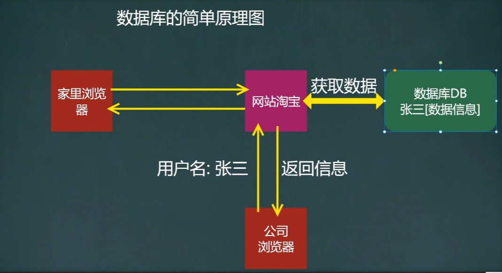


## MySQL安装和连接数据库

- MySQL数据库的安装和配置（安装演示）

  ​	[MySQL5.7.19安装](MySQL5.7.19安装.docx)

- 使用命令行窗口连接MySQL数据库 [示意图]

  ​	1、登陆前，保证服务启动

  ​			net stop mysql（停止服务）s

  ​			net start mysql（启动服务）

  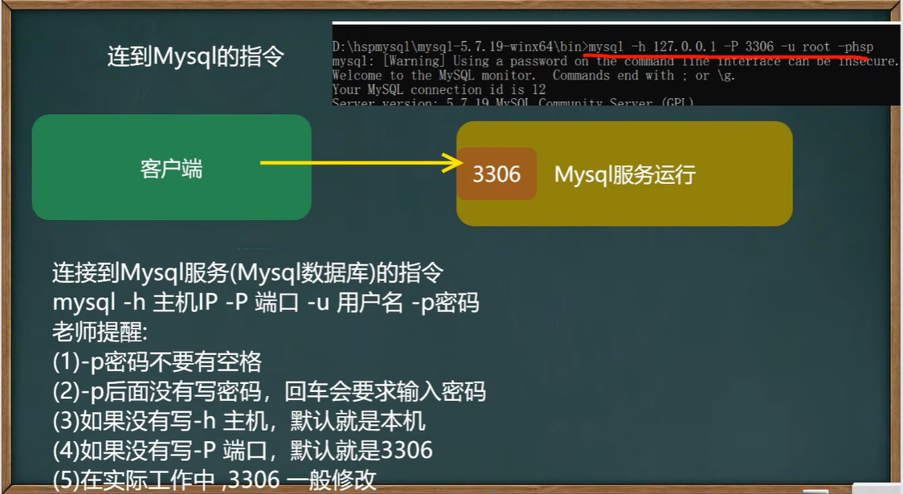


## Navicat安装和使用

- 介绍：图形化MySQL管理软件

  ​	[Navicat 15 下载](https://www.exception.site/essay/how-to-free-use-navicat)


## SQLyog安装和使用

- 介绍：图形化MySQL管理软件

  ​	[SQLyog安装配置](SQLyog安装配置.docx)

  

## 数据库

### 数据库的三层结构

​	1、所谓安装Mysql数据库，就是在主机安装一个数据库管理系统（DBMS），这个管理程序可以管理多个数据库。DBMS(database manage system)

​	2、一个数据库中可以创建多个表，以保存数据（信息）。

​	3、数据库管理系统(DBMS)、数据库和表的关系如图所示：示意图

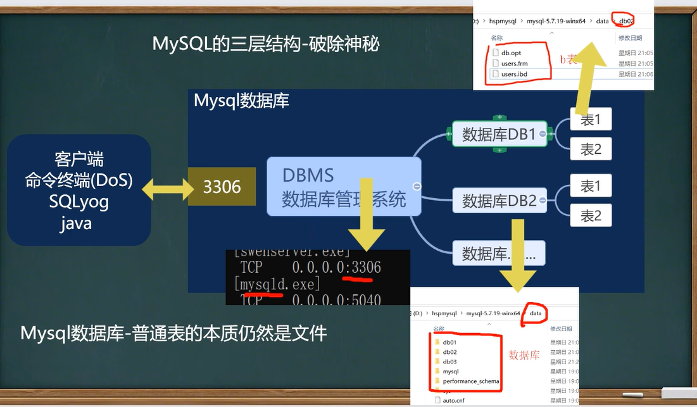


### 数据在数据库中的存储方式

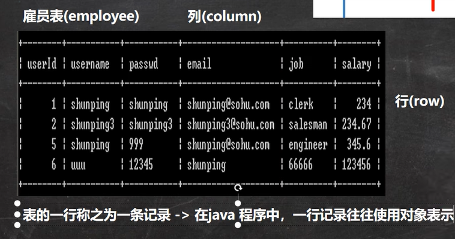


### SQL语句分类

- ​	DDL:	数据定义语句 [create表，库...]
- ​	JDML:  数据操作语句 [增加insert,修改update,删除delete]
- ​	DQL:	数据查询语句 [select]
- ​	DCL:	数据控制语句 [管理数据库：比如用户权限grant revoke]


### 创建数据库

```mysql
#演示数据库的操作
#创建一个名称为db01的数据库。[图形化和指令演示]

#使用指令创建数据库
CREATE DATABASE db01;
#说明：在创建数据库、表的时候，为了规避关键字，可以使用反引号解决

#进入数据库
use db01;

#删除数据库指令
DROP DATABASE db01

#创建一个使用utf8字符集的db02数据库
CREATE DATABASE db02 CHARACTER SET utf8
#CHARACTER SET：指定数据库采用的字符集，如果不指定字符集，默认utf8

#创建一个使用utf8字符集，并带校对规则的db03数据库
CREATE DATABASE db03 CHARACTER SET utf8 COLLATE utf8_bin
#COLLATE：指定数据库字符集的校对规则
#校对规则 utf8_bin区分大小 默认utf8_general_ci不区分天小写
```


### 查看、删除数据库

```mysql
#演示删除和查询数据库
#查看当前数据库服务器中的所有数据库
SHOW DATABASES

#查看前面创建的db01数据库的定义信息
SHOW CREATE DATABASE db01

#删除前面创建的db01数据库[一定要慎重]
DROP DATABASE db01
```


### 备份恢复数据库

```
DOS命令行窗口
#练习: database03.sql备份db02和db03库中的数据,并恢复

#备份，要在(Dos)下执行mysqldump指令
#mysqldump -u root -p -B db02 db03 > d:\\bak.sql

#恢复数据库（注意：进入Mysql命令行再执行）
#source d:\\bak.sql
#第二个恢复方法，直接将bak.sql的内容放到查询编辑器中，执行
```


### 备份库的表

```
DOS命令行窗口
#mysqldump -u 用户名 -p密码 数据库 表1 表2 表n > d:\\文件名.sql
```


## 表

### 创建表

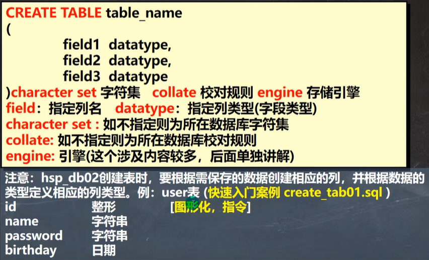


```mysql
CREATE TABLE `user` (
    id INT,
    `name` VARCHAR(255),
    `password` VARCHAR(255),
    `birthday` DATE)
    CHARACTER SET utf8 COLLATE utf8_bin ENGINE INNODB;
```


### 修改表

```mysql
#修改表的操作练习
#员工表emp的上增加一个image列，varchar类型（要求在resume.后面）。
ALTER TABLE emp1
	ADD image VARCHAR(32) NOT NULL DEFAULT ''
	AFTER RESUME
DESC emp1 #显示表结构，可以查看表的所有列

#修改job列，使其长度为60。
ALTER TABLE emp1
	MODIFY job VARCHAR(80) NOT NULL DEFAULT ''

#删除sex列。
ALTER TABLE emp1
	DROP sex
	
#表名改为employee。
RENAME TABLE emp1 TO employee
DESC employee

#修改表的字符集为utf8
ALTER TABLE employee CHARACTER SET utf8

#列名name修改为user_name
ALTER TABLE employee 
	CHANGE `name` user_name VARCHAR(32) NOT NULL DEFAULT ''
```


### 删除表

```mysql
DROP TABLE `table_name`;
```


### 表复制和去重

```mysql
-- 表的复制
-- 为了对某个sql语句进行效率测试，我们需要海量数据时，可以使用此法为表创建海量数据
CREATE TABLE my_tab01
	( id INT,
	  `name` VARCHAR(32),
	  sal VARCHAR(32),
	  job VARCHAR(32),
	  deptno INT);
DESC my_tab01
SELECT * FROM my_tab01;

# 演示如何自我复制
-- 1. 先把 emp表的记录复制到 my_tab01
INSERT INTO my_tab01(id, `name`, sal, job, deptno)
	SELECT empno, ename, sal, job, deptno FROM emp;
-- 2. 自我复制
INSERT INTO my_tab01
	SELECT * FROM my_tab01;
SELECT COUNT(*) FROM my_tab01;

# 如何删除悼一张表重复记录
-- 1. 先创建一张表my_tab02
-- 2. 让my tab02有重复的记录
CREATE TABLE my_tab02 LIKE emp; -- 这个语句把emp表的结构（列），复制到my_tab02

DESC my_tab02;

INSERT INTO my_tab02
	SELECT * FROM emp;
SELECT * FROM my_tab02;
-- 3. 考虑去重my_tab02的记录
-- 思路
-- (1) 先创建一张临时表 my_tmp，该表的结构和 my_tab02一样
CREATE TABLE my_tmp LIKE my_tab02
-- (2) 把my_tmp 的记录 通过 distinct 关键字 处理后 把记录复制到 my_tmp
INSERT INTO my_tmp
	SELECT DISTINCT * FROM my_tab02;
-- (3) 清除掉my_tab02记录
DELETE FROM my_tab02;
-- (4) 把 my_tmp 表的记录复制到 my_tab02
INSERT INTO my_tab02
	SELECT * FROM my_tmp;
-- (5) drop 掉 临时表my_tmp
DROP TABLE my_tmp;

SELECT * FROM my_tab02;
```


## Mysql数据类型

### Mysql常用数据类型（列类型）

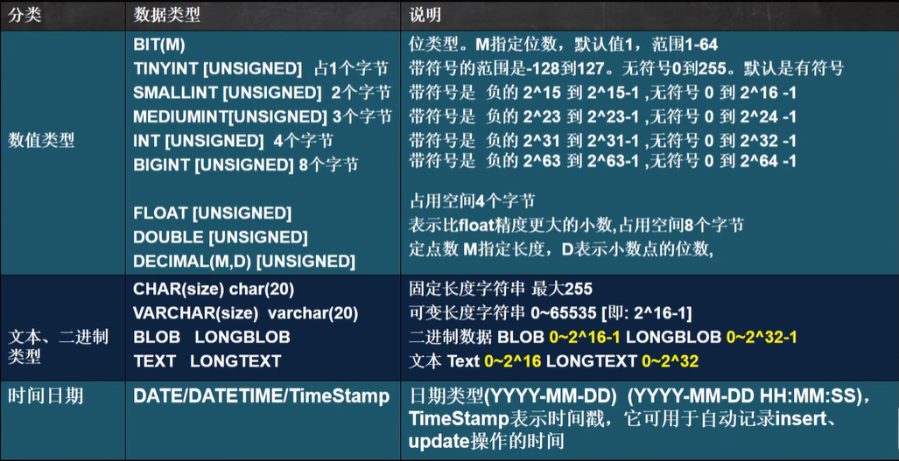

### 数值型（整数）的基本使用

​	1、说明（使用规范）：在能够满足需求的情况下，尽量选择占用空间小的类型

```mysql
#演示整形
#使用tinyint来演示范围，有符号-128 ~ 127，如果没有符号0 ~ 255
#说明：表的字符集，校验规则，存储引擎，老师使用默认
CREATE TABLE t3 (#1.如果没有指定unsinged,则TINYINT就是有符号
    id TINYINT);
    
CREATE TABLE t4(#2.如果指定unsinged,则TINYINT.就是无符号0-255
    id TINYINT UNSIGNED);
    
INSERT INTO t3 VALUES(127);#这是非常简单的添加语句
SELECT * FROM t3;#查询数据

INSERT INTO t4 VALUES (255);
SELECT * FROM t4;#查询数据
```


#### 数值型（bit）的使用

```mysql
#演示bit类型使用
#说明
#使用不多
#1.bit(m), m范围在1-64
#2.添加数据范围按照你给的位数来确定，比如m = 8表示一个字节 0~255
CREATE TABLE t05 (
    num BIT(8));
INSERT INTO t05 VALUES(255);
SELECT * FROM t05;
SELECT * FROM t05 WHERE num = 1;#查询时，仍然可以按照数来查询
```


#### 数值型（小数）的基本使用

```mysql
#演示decimal类型、float、double使用

#DECIMAL[M,D]
#可以支持更加精确的小数位。M是小数位数(精度)的总数，D是小数点(标度)后面的位数。
#如果D是0，则值没有小数点或分数部分。M最大65。D最大是30。如果D被省略，默认是0。如  果M被省略，默认是10。
#建议：如果希望小数的精度高，推荐使用decimal
#创建表
CREATE TABLE t06(
		num1 FLOAT,
		num2 DOUBLE,
		num3 DECIMAL(30,20));

#添加数据
INSERT INTO t06 VALUES(88.123456789,88.123456789,88.123456789);
SELECT * FROM t06;
```


#### 字符串的基本使用

```mysql
#演示字符串类型便用char、varchar
#注释的快捷键shift+ctrl+c,注销注释shift+ctrl+r

#CHAR (size)
#固定长度字符串最大255字符
CREATE TABLE t09(
		`name` CHAR(255));

# VARCHAR (size) 0~65535
#可变长度字符串最大65532字节【utf8编码最大21844字符 1-3个字节用于记录大小】
#如果表的编码是 utf8 varchar (size) size = (65535-3)/3= 21844(字符)
CREATE TABLE t10(
		`name` VARCHAR(21844));
#如果表的编码是 gbk varchar(size) size=(65535-3)/2= 32766(字符)
CREATE TABLE t11(
		`name` VARCHAR(32766)) CHARSET gbk;

DROP TABLE t10;#删除表
```

- 字符串使用细节

  ```mysql
  #演示字符串类型的使用细节1
  #char(4)和varchar(4)这个4表示的是字符，而不是字节，不区分字符是汉字还是字母
  #占用多大的空间取决于编码
  #如果表的编码是 utf8 则乘以3
  #如果表的编码是 gbk 则乘以2
  CREATE TABLE t11(
      `name` CHAR(4)); 
  INSERT INTO t11 VALUES('韩顺平好1');
  SELECT * FROM t11; #查询
  
  CREATE TABLE t12(
      `name` VARCHAR(4)); 
  INSERT INTO t12 VALUES('韩顺平好');
  INSERT INTO t12 VALUES('ab北京');
  SELECT * FROM t12;#查询
  ```

  ```mysql
  #演示字符串类型的使用细节2
  #char(4)是定长（固定的大小)，就是说，即使你插入'aa',也会占用分配的4个字符的空间.
  #varchar(4)是变长(变化的大小)，就是说，如果你插入了'aa',实际占用空间大小并不是4个字符，而是按照实际占用空间来分配(说明: varchar本身还需要占用1-3个字节来记录存放内容长度)
  ```

  ```mysql
  #演示字符串类型的使用细节3
  #什么时候使用char，什么时候使用varchar
  #1.如果数据是定长，推荐使用char，比如md5的密码，邮编，手机号，身份证号码等。
  #2.如果一个字段的长度是不确定，我们使用varchar，比如留言，文章
  
  #查询速度：char>varchar
  ```

  ```mysql
  #演示字符串类型的使用细节4
  #在存放文本时，如果varchar不够用，也可以使用Text数据类型.可以将TEXT列视为VARCHAR列
  #注意Text不能有默认值.大小0~2^16字节
  #如果希望存放更多字符，可以选择MEDIUMTEXT 0~2^24或者LONGTEXT 0~232
  CREATE TABLE t13(
      content TEXT, content2 MEDIUMTEXT, content3 LONGTEXT);
  INSERT INTO t13 VALUES(
  	'轻音少女2', '碧蓝之海', 'fate/zero');
  SELECT * FROM t13;
  ```


#### 日期类型的基本使用

```mysql
#演示时间相关的类型
#创建一张表,date, datetime ,timestamp
CREATE TABLE t14(
		birthday DATE, #生日
		job_time DATETIME, #记录年月日时分秒
		login_time TIMESTAMP
    			#登陆时间，如果希望login_time列自动更新，需要这样配置
				NOT NULL DEFAULT CURRENT_TIMESTAMP
				ON UPDATE CURRENT_TIMESTAMP);

SELECT * FROM t14;
INSERT INTO t14(birthday, job_time)
		VALUES('2022-11-11','2022-11-11 10:10:10');
#如果我们更新t14表的某条记录，login_time列会自动的以当前时间进行更新
```


### 创建表练习

```mysql
#创建表的课堂练习
#字段  属性
#Id	  整形
#name 字符型
#sex  字符型
#brithday    日期型(date)
#entry_date  日期型(date)
#job  字符型
#Salary      小数型
#resume      文本型
CREATE TABLE `emp`(
    	id INT,
    	`name` VARCHAR(32),
    	sex CHAR(1),
    	brithday DATE,
    	entry_date DATETIME,
    	job VARCHAR(32),
    	salary DOUBLE,
    	`resume` TEXT)	CHARSET utf8 COLLATE utf8_bin ENGINE INNODB;
    	
INSERT INTO `emp`
		VALUES(100, '逍遥怪', '男', '2000-11-11', 
              	'2010-11-10 11:11:11', '巡山的', 3000, '大王叫我来巡山')

SELECT * FROM `emp`;
```


## CRUD

### Insert语句（添加数据）

```mysql
#使用INSERT语句向表中插入数据
#创建一张商品表
CREATE TABLE `goods`(
		id INT,
		goods_name VARCHAR(10),
		price DOUBLE);

#添加数据
INSERT INTO `goods`(id, goods_name, price)
		VALUES(10, '华为手机', 3000)

SELECT * FROM goods;
```

-  细节说明

1.插入的数据应与字段的数据类型相同。比如把 'abc' 添加到 int 类型会错误

2.数据的长度应在列的规定范围内，例如：不能将一个长度为80的字符串加入到长度为40的列中。
3.在values中列出的数据位置必须与被加入的列的排列位置相对应。
4.字符和日期型数据应包含在单引号中。
5.列可以插入空值【前提是该字段允许为空】。

6.insert into tab_name(列名...), values(),()形式添加多条记录

7.如果是给表中的所有字段添加数据，可以不写前面的字段名称

8.默认值的使用，当不给某个字段值时，如果有默认值就会添加，否则报错。

​	如果某个列没有指定 not null ,那么当添加数据时，没有给定值，则会默认给null。

​	如果我们希望指定某个列的默认值，可以在创建表时指定 。																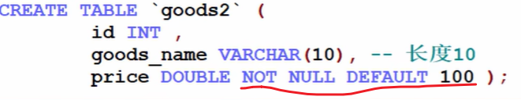

### Update语句（更新数据）

```mysql
#使用update语句修改表中数据
#要求：在上面创建的employee表中修改表中的纪录
#	1、将所有员工薪水修改为5000元。
UPDATE employee SET salary = 5000
#   2、将姓名为小妖怪的员工薪水修改为3000元
UPDATE employee 
		SET salary = 3000
		WHERE user_name = '逍遥怪'
#   3、将老妖怪的薪水在原有基础上增加1000元。
UPDATE employee 
		SET salary = salary + 1000
		WHERE user_name = '老妖怪'
		
SELECT * FROM employee;
```

- 使用细节：

  1.UPDATE语法可以用新值更新原有表行中的各列。
  2.SET子句指示要修改哪些列和要给予哪些值。
  3.WHERE子句指定应更新哪些行。如没有WHERE子句,则更新所有的行（记录），因此老师提醒一定小心。

  4.如果需要修改多个字段，可以通过 set 字段1=值1，字段2=值2...

### Delete语句（删除数据）

```mysql
#delete 语句演示

#删除表中名称为'老妖怪'的记录
DELETE FROM employee
		WHERE user_name = '老妖怪';

#删除表中的所有记录，一定要小心
DELETE FROM employee;

SELECT * FROM employee
```

- 使用细节

  1、如果不使用where子句，将删除表中所有数据。

  2、Delete语句不能删除某一列的值(可使用update设为null或者")

  3、使用delete语句仅删除记录,不删除表本身。如要删除表,使用drop table语句。**drop table 表名**
  
  

### Select语句（查找数据）

#### 单表

```mysql
# Select指定查询哪些列的数据
# *号代表查询所有列。
# From指定查询哪张表。
# DISTINCT可选，指显示结果时，是否去掉重复数据

#查询表中所有学生的信息。
SELECT * FROM student;

#查询表中所有学生的姓名和对应的英语成绩。
SELECT `name`, english FROM student;

#过滤表中重复数据distinct。
#要查询的记录，每个字段都相同，才会去重
SELECT DISTINCT english FROM student;
SELECT DISTINCT `name`, english FROM student;
```

```mysql
#统计每个学生的总分
SELECT `name`, (chinese + english + math) FROM student;

#在所有学生总分加10分的情况
SELECT `name`, (chinese + english + math + 10) FROM student;

#使用别名表示学生分数。
SELECT `name`, (chinese + english + math) AS total_score FROM student;
```


- 在where字句中经常使用的运算符

  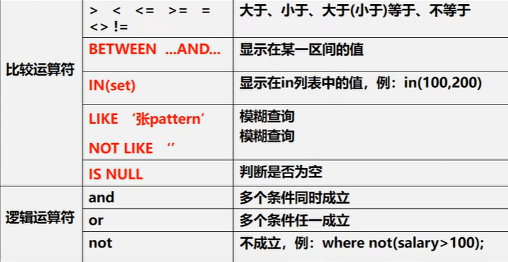

  ```mysql
  #使用where子句，进行过滤查询
  #1.查询姓名为赵云的学生成绩
  SELECT * FROM student
  		WHERE `name` = '赵云'
  		
  #2.查询英语成绩大于90分的同学
  SELECT * FROM student
  		WHERE english > 90
  		
  #3.查询总分大于200分的所有同学
  SELECT * FROM student
  		WHERE (chinese + english + math) > 200
  ```

  ```mysql
  #查询math大于60并且(and)id大于4的学生成绩
  SELECT * FROM student
  		WHERE math > 60 and id > 4
  		
  #查询英语成绩大于语文成绩的同学
  SELECT * FROM student
  		WHERE english > chinese
  		
  #查询总分大于200分并且数学成绩小于语文成绩，的姓赵的学生
  #赵% 表示名字以韩开头的就可以
  SELECT * FROM student
  		WHERE (chinese + english + math) > 200 AND
  				math < chinese AND `name` LIKE '赵%'
  ```


- 课堂练习

  ```mysql
  #课堂练习1
  #1、查询英语分数在80-90之间的同学。
  SELECT * FROM student
  		WHERE english BETWEEN 80 AND 90;
  		
  #2、查询数学分数为89,90,91的同学
  SELECT * FROM student
  		WHERE math IN (89, 90, 91);
  
  #3、查询所有姓宋的学生成绩。
  SELECT * FROM student
  		WHERE `name` LIKE '宋%'
  		
  #4、查询数学分>80，语文分>80的同学。
  SELECT * FROM student
  		WHERE math > 80 and chinese > 80
  ```

  ```mysql
  #课堂练习2
  #1、查询语文分数在70-80之间的同学。
  SELECT * FROM student
  		WHERE chinese BETWEEN 70 AND 80;
  
  #2、查询总分为257, 276, 185的同学。
  SELECT `name`, (chinese + math + english) FROM student
  		WHERE (chinese + math + english) IN (257, 276, 185)
  
  #3、查询所有姓李 或者 姓宋 的学生成绩。
  SELECT * FROM student
  		WHERE `name` LIKE '宋%' OR `name` LIKE '韩%'
  
  #4、查询数学比语文多1分的同学。
  SELECT * FROM student
  		WHERE math > chinese + 1
  ```

  

- 使用order by 子句排序查询结果

  ```mysql
  #演示order by使用
  #对数学成绩排序后输出【升序】
  SELECT * FROM student
  		ORDER BY math;
  
  #对总分按从高到低的顺序输出[降序]
  SELECT `name`, (chinese + english + math) AS total_score FROM student
  		ORDER BY total_score DESC;
  		
  #对姓韩的学生成绩排序输出(升序)
  SELECT `name`, (chinese + english + math) AS total_score FROM student
  		WHERE `name` LIKE '韩%'
  		ORDER BY total_score;
  ```


#### 查询加强

```mysql
# 查询加强

# 使用where子句
-- 	？如何查找1992.1.1后入职的员工
-- 说明：在MySQL中，日期类型可以直接比较，需要注意格式
SELECT * FROM emp
	WHERE hiredate > '1992-01-01'

-- 如何使用like操作符(模糊查询)
-- 	%：表示0到多个任意字符
-- 	_：表示单个任意字符
-- 	？如何显示首字符为S的员工姓名和工资
SELECT ename, sal FROM emp
	WHERE ename LIKE 'S%'
-- 	？如何显示第三个字符为大写O的所有员工的姓名和工资
SELECT ename, sal FROM emp
	WHERE ename LIKE '__O%'

-- 	如何显示没有上级的雇员的情况
SELECT * FROM emp
	WHERE mgr IS NULL;

-- 	查询表结构
DESC emp


#使用order by子句
-- 	?如何按照工资的从低到高的顺序，显示雇员的信息
SELECT * FROM emp
	ORDER BY sal

-- 	?按照部门号升序而雇员的工资降序排列，显示雇员信息
SELECT * FROM emp
	ORDER BY deptno, sal DESC;
```


#### 分页查询


```mysql
# 分页查询
-- 1、按雇员的id号升序取出，每页显示3条记录，请分别显示第1页，第2页，第3页
-- 2、基本语法：select ... limit start, rows
--    表示从start + 1行开始取，取出rows行，start从0开始计算

-- 第一页
SELECT * FROM emp
	ORDER BY empno
	LIMIT 0, 3;
-- 第二页
SELECT * FROM emp
	ORDER BY empno
	LIMIT 3, 3;
-- 第三页
SELECT * FROM emp
	ORDER BY empno
	LIMIT 6, 3;
```


#### 分组增强

```mysql
# 增强group by 的使用

-- (1)显示每种岗位的雇员总数、平均工资。
SELECT COUNT(*), AVG(sal), job
	FROM emp
	GROUP BY job;

-- (2)显示雇员总数，以及获得补助的雇员数。
-- 思路：获得补助的雇员数 就是 comm列为非null
-- 提示：如果该列的值为null, 是不会统计
SELECT COUNT(*), COUNT(comm)
	FROM emp;
	
-- 扩展要求：统计没有获得补助的雇员数
SELECT COUNT(*), COUNT(IF(comm IS NULL, 1, NULL)) #第一种写法
	FROM emp;
SELECT COUNT(*), COUNT(*) - COUNT(comm) #第二种写法
	FROM emp

-- (3)显示管理者的总人数。(造成重复计算)
SELECT COUNT(DISTINCT mgr)
	FROM emp;

-- (4)显示雇员工资的最大差额。
SELECT MAX(sal) - MIN(sal)
	FROM emp;
```


#### 数据分组的总结

如果select语句同时包含有group by，having，limit，order by那么他们的顺序是group by，having，order by，limit

```mysql
-- 应用案例：请统计各个部门group by的平均工资avg,
-- 并且是大于1000的having,并且按照平均工资从高到低排序order by,
-- 取出前两行记录1imit
SELECT  deptno, AVG(sal) AS avg_sal
	FROM emp
	GROUP BY deptno
	HAVING avg_sal > 1000
	ORDER BY avg_sal DESC
	LIMIT 0, 2;
```


#### 多表

- 介绍

  ​	在前面我们讲过mysql表的基本查询,但是都是对一张表进行的查询，这在实际的软件开发中,还远远的不够。
  ​    下面我们讲解的过程中,将使用前面创建 三张表(emp,dept,salgrade)为大家演示如何进行多表查询。

  

- 说明

  ​	多表查询是指基于两个和两个以上的表查询，在实际应用中，查询单个表可能不能满足你的需求，（如下面的课堂练习），需要使用到(dept表和emp表)

```mysql
# 多表查询

-- 在默认情况下：当两个表查询时
-- 1.从第一张表中,取出一行和第二张表的每一行进行组合，返回结果[含有两张表的所有列].
-- 2.一共返回的记录数 第一张表行数*第二张表的行数
-- 3.这样多表查询默认处理返回的结果，称为笛卡尔集
-- 4.解决这个多表的关键就是要写出正确的过滤条件where,需要程序员进行分析
SELECT * FROM emp, dept

-- 显示雇员名，雇员工资及所在部门的名字【笛卡尔集】
-- 分析:
-- 1.雇员名、雇员工资来自emp表
-- 2.部门的名字来自dept表
-- 3.需求对emp和dept查询
-- 4.当我们需要指定显示某个表的列时，需要 表.列表
SELECT ename, sal, dname, emp.deptno
	FROM emp, dept
	WHERE emp.deptno = dept.deptno


-- 小技巧：多表查询的条件不能少于表的个数-1，否则会出现笛卡尔集
-- 如何显示部门号为10的部门名、员工名和工资
SELECT ename, sal, dname, emp.deptno
	FROM emp, dept
	WHERE emp.deptno = dept.deptno AND emp.deptno = 10;
	
-- 显示各个员工的姓名，工资，及其工资的级别
SELECT ename, sal, grade 
	FROM emp, salgrade
	WHERE sal BETWEEN losal AND hisal;

-- 学员练习：
-- 显示雇员名，雇员工资及所在部门的名字，并按部门排序[降序排].
SELECT ename, sal, dname, emp.deptno
	FROM emp, dept
	WHERE emp.deptno = dept.deptno
	ORDER BY deptno DESC;
```


#### 自连接

自连接是指在同一张表的连接查询 [将同一张表看做两张表]。

```mysql
# 多表查询的自连接

-- 思考题：显示公司员工名字和他的上级的名字

-- 分析：员工名字在emp，上级的名字的名字emp
-- 员工和上级是通过emp表的mgr列关联
-- 自连接的特点：1.把同一张表当做两张表使用
-- 			   2.需要给表取别名。 表名 as 表别名
-- 			   3.列名不明确，可以指定列的别名。 列名 as 列的别名
SELECT worker.ename AS '职员名', boss.ename AS '上级名'
	FROM emp AS worker, emp AS boss
	WHERE worker.mgr = boss.empno;
```


#### 子查询

​	子查询是指嵌入在其它sql语句中的select语句,也叫嵌套查询

```mysql
# 子查询的演示
-- 请思考：如何显示与SMITH同一部门的所有员工？
-- 1.先查询到SMITH的部门号得到
-- 2.把上面的select语句当做一个子查询来使用	
SELECT * 
	FROM emp
	WHERE deptno = (
		SELECT deptno
		FROM emp
		WHERE ename = 'SMITH'
	)
	
-- 课堂练习：如何查询和部门10的，工作相同的雇员的
-- 名字、岗位、工资、部门号，但是不含10号部门自己的雇员.
SELECT ename, job, sal, deptno
	FROM emp
	WHERE job IN (
		SELECT DISTINCT job
		FROM emp
		WHERE deptno = 10
	) AND deptno != 10
```


- 子查询当做临时表使用

  ```mysql
  # 查询ecshop中各个类别中，价格最高的商品
  
  -- 查询 商品表
  -- 先得到 各个类别中，价格最高的商品 max + group by cat_id，当做临时表
  -- 把子查询当做一张临时表可以解决很多很多复杂的查询
  SELECT goods_id, ecs_goods.cat_id, goods_name, shop_price
  	FROM (
  		SELECT cat_id, MAX(shop_price) AS max_price
  		FROM ecs_goods
  		GROUP BY cat_id
  	) temp, ecs_goods
  	WHERE temp.cat_id = ecs_goods.cat_id
  	AND temp.max_price = ecs_goods.shop_price
  ```

  

- 在多行子查询中使用all 和 any操作符

  ```mysql
  #演示all 和 any
  
  # 在多行子查询中使用all操作符
  -- 请思考：显示工资比部门30 的所有员工的工资高的员工的姓名、工资和部门号
  SELECT ename, sal, deptno
  	FROM emp
  	WHERE sal > ALL(
  			SELECT sal 
  				FROM emp
  				WHERE deptno = 30
  			)
  
  -- 也可以这样写
  SELECT ename, sal, deptno
  	FROM emp
  	WHERE sal > (
  			SELECT MAX(sal) 
  				FROM emp
  				WHERE deptno = 30
  			)
  
  
  # 在多行子查询中使用any操作符
  -- 请思考：如何显示工资比部门30 的其中一个员工的工资高的员工的姓名、工资和部门号
  SELECT ename, sal, deptno
  	FROM emp
  	WHERE sal > ANY(
  			SELECT sal 
  				FROM emp
  				WHERE deptno = 30
  			)
  ```

  

- 多列子查询

  ​	多列子查询则是指查询返回多个列数据的子查询语句

  ```mysql
  # 多列子查询
  
  -- 请思考如何查询与allen的部门和岗位完全相同的所有雇员（并且不含allen本人）
  -- （字段1，字段2...）=（se1ect 字段 1 ，字段 2 from。。。。）
  
  -- 分析：1. 得到allen的部门和岗位
  SELECT deptno, job
  	FROM emp
  	WHERE ename = 'ALLEN'
  
  -- 分析：2. 把上面的查询当做子查询来使用，并且使用多列子查询的语法进行匹配
  SELECT *
  	FROM emp
  	WHERE (deptno, job) = (
  		SELECT deptno, job
  		FROM emp
  		WHERE ename = 'ALLEN'
  		
  	) AND ename != 'ALLEN'
  ```

  

- 子查询练习

```mysql
# 子查询练习

# 请思考：查找每个部门工资高于本部门平均工资的人的资料
-- 这里要用到数据查询的小技巧，把一个子查询当作一个临时表使用
-- 1. 先得到每个部门的 部门号 和 对应的平均工资
SELECT deptno, AVG(sal) AS avg_sal
	FROM emp GROUP BY deptno
-- 2. 把上面的结果当作子查询，和emp进行多表查询
SELECT ename, sal, temp.avg_sal, emp.deptno
	FROM emp, (
		SELECT deptno, AVG(sal) AS avg_sal
			FROM emp
			GROUP BY deptno
		) temp
	WHERE emp.deptno = temp.deptno AND emp.sal > temp.avg_sal


# 请思考：查找每个部门工资最高的人的详细资料
SELECT *
	FROM emp
	WHERE emp.sal IN (
		SELECT MAX(sal)
			FROM emp
			GROUP BY deptno
		 )
	

# 查询每个部门的信息（包括：部门名，编号，地址）和人员数量
SELECT * FROM dept # 部门名，编号，地址
SELECT * FROM emp 

SELECT dept.deptno, dname, loc, temp.per_num
	FROM dept, (
			SELECT  COUNT(*) AS per_num, deptno 
				FROM emp
				GROUP BY deptno
			) temp
	WHERE dept.deptno = temp.deptno
-- 还有一种写法 表.*：表示将该表所有列都显示出来
SELECT temp.*, dname
	FROM dept, (
			SELECT  COUNT(*) AS per_num, deptno 
				FROM emp
				GROUP BY deptno
			) temp
	WHERE dept.deptno = temp.deptno
```


#### 合并查询

- 介绍

​	有时在实际应用中，为了合并多个select语句的结果，可以使用集合操作符号

```mysql
# 合并查询

-- union all 就是将两个查询结果合并，不会去重
SELECT ename, sal, job FROM emp WHERE sal>2500
UNION ALL
SELECT ename, sal, job FROM emp WHERE job='MANAGER'

-- union 就是将两个查询结果合并，会去重
SELECT ename, sal, job FROM emp WHERE sal>2500
UNION
SELECT ename, sal, job FROM emp WHERE job='MANAGER'
```


## 函数

### 统计函数

#### 合计/统计函数 - count

- Count 返回行的总数

  ```mysql
  # 演示mysql的统计函数的使用
  # 统计一个班级共有多少学生？
  SELECT COUNT(*) FROM student;
  
  # 统计数学成绩大于90的学生有多少个？
  SELECT COUNT(*) FROM student
  		WHERE math > 90
  
  # 统计总分大于250的人数有多少？
  SELECT COUNT(*) FROM student
  		WHERE (math + english + chinese) > 250
  
  # count（*) 和 count（列）的区别
  #解释：count(*)返回满足条件的记录的行数
  #	  count(列)：统计满足条件的某列有多少个，但是会排除为null的情况
  CREATE TABLE t15(
  		`name` VARCHAR(20));
  INSERT INTO t15 VALUES('tom');
  INSERT INTO t15 VALUES('jack');
  INSERT INTO t15 VALUES('mary');
  INSERT INTO t15 VALUES(null);
  SELECT * FROM t15;
  
  SELECT COUNT(*) FROM t15;#返回4
  SELECT COUNT(`name`) FROM t15;#返回3
  ```


#### 合计函数 - sun

- Sun函数返回满足where条件的行的和一般使用在数值列

  ```mysql
  #演示sum函数的使用
  #统计一个班级数学总成绩
  SELECT SUM(math) FROM student;
  
  #统计一个班级语文、英语、数学各科的总成绩
  SELECT SUM(math), SUM(english), SUM(chinese) FROM student;
  
  #统计一个班级语文、英语、数学的成绩总和
  SELECT SUM(math + english + chinese) FROM student;
  
  #统计一个班级语文成绩平均分
  SELECT SUM(chinese) / COUNT(*) FROM student;
  ```

  注意：1、sum仅对数值起作用。

  ​			2、对多列求和，“ , ” 号不能少。


#### 合计函数 - avg

- AVG函数返回满足where条件的一列的平均值

  ```mysql
  #演示avg的使用
  #练习：求一个班级数学平均分
  SELECT AVG(math) FROM student;
  
  #     求一个班级总分平均分
  SELECT AVG(math + english + chinese) FROM student;
  ```


#### 合计函数 - Max/min

- Max/min函数返回满足where条件的一列的最大/最小值

  ```mysql
  #演示max和min的使用
  #求班级最高分和最低分（数值范围在统计中特别有用）
  SELECT MAX(math + english + chinese) ,MIN(math + english + chinese) 
  		FROM student;
  
  #求出班级数学最高分和最低分
  SELECT MAX(math), MIN(math)
  		FROM student;
  ```


### 分组统计

- 使用group by 子句对列进行分组

- 使用having 子句对分组后的结果进行过滤

  ```mysql
  #演示group by + having
  #GROUP by用于对查询的结果分组统计
  #having 子句用于限制分组显示结果
  
  #如何显示每个部门的平均工资和最高工资
  -- [emp是每个人的基本信息]
  -- [deptons是emp的基本信息中的一条信息]
  SELECT AVG(sal), MAX(sal), deptno
  	FROM emp GROUP BY deptno;
  
  #显示每个部门的每种岗位的平均工资和最低工资
  -- [job是emp的基本信息中的一条信息]
  SELECT AVG(sal), MIN(sal), deptno, job
  	FROM emp GROUP BY deptno, job;
  
  #显示平均工资低于2000的部门号和它的平均工资
  -- 1、显示各个部门的平均工资和部门号
  -- 2、在1的结果基础上，进行过滤，保留AVG(sa1)<2000
  SELECT AVG(sal), deptno
  	FROM emp GROUP BY deptno
  		HAVING AVG(sal) < 2000;
  		
  -- 使用别名
  SELECT AVG(sal) AS avg_sal, deptno
  	FROM emp GROUP BY deptno
  		HAVING avg_sal < 2000;
  ```


### 字符串函数

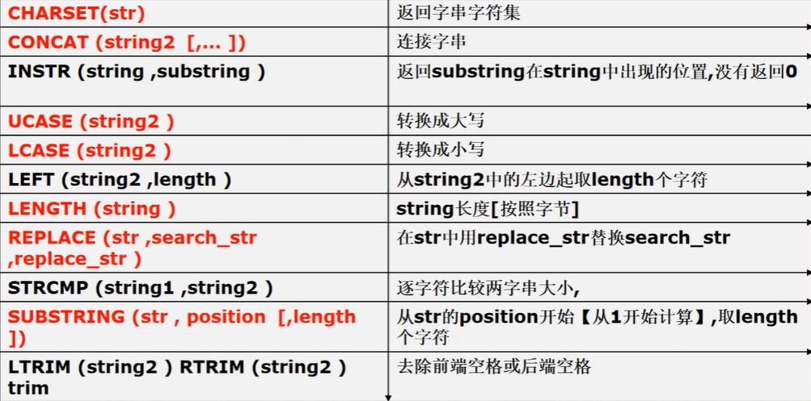

```mysql
#演示字符串相关函数的使用【使用emp表来演示】
SELECT * FROM emp;

-- CHARSET(str) 返回字串的字符集
SELECT CHARSET(ename) FROM emp;

-- CONCAT(string2 [,...]) 连接字串，将多个列拼接成一列
SELECT CONCAT(ename, ' 工作是 ', job) FROM emp;

-- INSTR(string, substring) 返回substring在string中出现的位置，没有返回0
-- DUAL 亚元表, 系统表 可以作为测试表使用
SELECT INSTR('hanshunping', 'ping') FROM DUAL;

-- UCASE(string2) 转成大写
SELECT UCASE(ename) FROM emp;

-- LCASE(string2) 转成小写
SELECT LCASE(ename) FROM emp;

-- LEFT(string2, length) 从string2中的左边起取1ength个字符
-- RIGHT(string2, length) 从string2中的右边起取length个字符
SELECT LEFT (ename, 2) FROM emp;
SELECT RIGHT (ename, 2) FROM emp;

-- LENGTH(string) string长度[按照字节]
SELECT LENGTH(ename) FROM emp;

-- REPLACE(str, search_str, replace_str ) 
-- 在str中用replace_str替换search_str
SELECT ename, REPLACE(job, 'MANAGER', '经理') FROM emp;

-- STRCMP(string1, string2) 逐字符比较两字串大小
SELECT STRCMP('hsp', 'asp') FROM DUAL;

-- SUBSTPING(str, position, spot, length)
-- 从str的position开始【从spot开始计算】, 取length个字符
-- 从1开始计算取出3字符
SELECT SUBSTRING(ename, 1, 3) FROM emp;

-- LTRIM(string2) RTRIM(string2) TRIM(string)
-- 去除前端空格或后端空格
SELECT LTRIM(' 轻音少女') FROM DUAL;
SELECT RTRIM('轻音少女 ') FROM DUAL;
SELECT TRIM('  轻音少女 ') FROM DUAL;
```


- 练习

  ```mysql
  #以首字母小写的方式显示所有员工emp表的姓名
  SELECT CONCAT(LCASE(SUBSTRING(ename, 1, 1)), SUBSTRING(ename, 2))
  		FROM emp;
  ```


### 数学函数

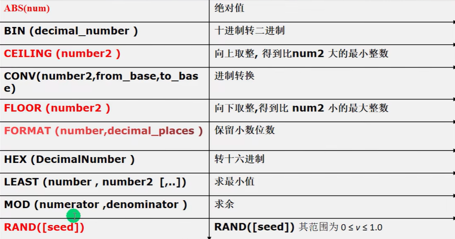

```mysql
#演示数学相关函数

-- ABS(num) 绝对值
SELECT ABS(-10) FROM DUAL;

-- BIN(decimal_number) 十进制转二进制
SELECT BIN(10) FROM DUAL;

-- CEILING(number2) 向上取整，得到比num2大的最小整数
SELECT CEILING(1.1) FROM DUAL;

-- CONV(number2, from_base, to_base) 进制转换
-- 下面的含义是 8 是 10 进制的8, 转成 2 进制输出
SELECT CONV(8, 10, 2) FROM DUAL;

-- FLOOR(number2) 向下取整，得到比num2小的最大整数
SELECT FLOOR(1.1) FROM DUAL;

-- FORMAT(number, decimal_places) 保留小数位数(四舍五入)
SELECT FORMAT(78.125564, 2) FROM DUAL;

-- HEX(DecimalNumber) 转十六进制
SELECT HEX(11);

-- LEAST(number, number2 [,...]) 求最小值
SELECT LEAST(0, 1, -10, 4) FROM DUAL;

-- MOD(numerator, denominator) 求余
SELECT MOD(10, 3) FROM DUAL;

-- RAND([seed]) 返回随机数其范围为0 <= v <= 1.0
-- 说明
-- 1、如果使用rand()每次返回不同的随机数，在 0 <= v <= 1.0
SELECT RAND() FROM DUAL;
-- 2、如果使用 rand (seed)返回随机数，范围在 0 <= v <= 1.0，如果seed不变，
--     该随机数不变
SELECT RAND(6) FROM DUAL;
```


### 日期函数


```mysql
# 日期时间相关的函数

-- CURRENT_DATE() 当前日期
SELECT CURRENT_DATE() FROM DUAL;

-- CURRENT_TIME() 当前时间
SELECT CURRENT_TIME() FROM DUAL;

-- CURRENT_TIMESTAMP() 当前时间戳
SELECT CURRENT_TIMESTAMP() FROM DUAL;

-- 创建测试表、信息表
CREATE TABLE mes(
	id INT,
	content VARCHAR(30),
	send_time DATETIME);

-- 添加一条记录
INSERT INTO mes
	VALUES(1, '北京新闻', CURRENT_TIMESTAMP());

SELECT * FROM mes;
```


```mysql
# 上应用实例
INSERT INTO mes VALUES(2, '上海新闻', NOW());
INSERT INTO mes VALUES(3, '广州新闻', NOW());
-- 显示所有新闻信息，发布日期只显示日期，不用显示时间
SELECT id, content, DATE(send_time)
	FROM mes;
	
-- 请查询在10分钟内发布的帖子
SELECT * FROM mes
	WHERE DATE_ADD(send_time, INTERVAL 10 MINUTE) >= NOW()
SELECT * FROM mes
	WHERE DATE_SUB(NOW(), INTERVAL 120 MINUTE) <= send_time

-- 请在mysql的sql语句中求出2011-11-11和1990-1-1 相差多少天
SELECT DATEDIFF('2011-11-11', '1990-01-01') FROM DUAL;

-- 请用mysql的sq1语句求出你活了多少天?[练习]
SELECT DATEDIFF(NOW(), '2004-11-12') FROM DUAL;

-- 如果你能活80岁，求出你还能活多少天.[练习]
SELECT DATEDIFF(DATE_ADD('2004-11-12', INTERVAL 80 YEAR), NOW()) FROM DUAL;

#上面函数的细节说明：
-- 1、DATE_ADD()中的interval后面可以是year minute second day等
-- 2、DATE SUB()中的interval后面可以是year minute second hour day等
-- 3、DATEDIFF(date1,date2)得到的是天数,而且是date1-date2的天数,因此可以取负数
-- 4、这四个函数的日期类型可以是date, datetime或者timestamp
```


```mysql
#两个时间差(多少小时多少分钟多少秒)
SELECT TIMEDIFF('10:11:11', '06:10:10') FROM DUAL;

#当前时间
SELECT NOW() FROM DUAL;

# YEAR|MONTH|DAY|DATE(datetime) 返回年月日
SELECT YEAR(NOW()) FROM DUAL;
SELECT MONTH(NOW()) FROM DUAL;
SELECT DAY(NOW()) FROM DUAL;
SELECT MONTH('2013-11-10') FROM DUAL;

# unix_timetamp(): 返回的是1970-1-1到现在的秒数
SELECT UNIX_TIMESTAMP() FROM DUAL;

# FROM_UNIXTIME():可以把一个unix_timestamp秒数，转成指定格式的日期
-- %Y-%m-%d 格式是规定好的，表示年月日
-- 意义：在开发中，可以存放一个整数，然后表示时间，通过FROM_UNIXTIME转换
SELECT FROM_UNIXTIME(1618483484, '%Y-%m-%d') FROM DUAL;
SELECT FROM_UNIXTIME(1618483484, '%Y-%m-%d %H:%i:%s') FROM DUAL;
-- 在实际开发中，我们也经常使用int来保存一个unix时间戳
-- 然后使用from_unixtime()进行转换，还是非常有实用价值的
```


### 加密和系统函数

```mysql
# 演示加密函数和系统函数

-- USER() 查询用户
-- 可以查看登录到mysql的有哪些用户，以及登录的IP
SELECT USER() FROM DUAL; -- 用户@IP地址

-- DATABASE() 查询当前使用数据库名称
SELECT DATABASE();

-- MD5(str) 为字符串算出一个MD5 32的字符串，常用(用户密码)加密
-- root 密码是 hsp -> 加密md5 -> 在数据库中存放的是加密后的密码
SELECT MD5('hsp') FROM DUAL;

-- 演示用户表，存放密码时，是md5
CREATE TABLE hsp_user(
	id INT,
	`name` VARCHAR(32) NOT NULL DEFAULT '',
	pwd CHAR(32) NOT NULL DEFAULT '');
INSERT INTO hsp_user
	VALUES(100, '轻音少女', MD5('k-on'));
	
SELECT * FROM hsp_user
	WHERE `name` = '轻音少女' AND pwd = MD5('k-on')

-- PASSWORD(str) 加密函数，MySQL数据库的用户密码就是PASSWORD函数加密
SELECT PASSWORD('hsp') FROM DUAL;

-- select * from mysql.user 查询用户密码
SELECT * FROM mysql.user
```


### 流程控制函数

```mysql
# 演示流程控制语句

-- IF(expr1, expr2, expr3) 如果expr1为true, 则返回expr2否则返回expr3
SELECT IF(TRUE, '北京', '上海') FROM DUAL;

-- IFNULL(expr1, expr2) 如果expr1不为空, 则返回expr1, 否则返回expr2
SELECT IFNULL(NULL, '轻音少女') FROM DUAL;

-- SELECT CASE WHEN expr1 THEN expr2 WHEN expr3 THEN 4 ELSE expr5 END; [类似多重分支.]
-- 如果expr1 为true，则返回expr2，如果expr1 为false 和 expr2 为true，返回 expr4。否则返回 expr5
SELECT CASE 
	WHEN FALSE THEN '1'
	WHEN FALSE THEN '2'
	ELSE '3' END;

-- 1. 查询emp 表，如果 comm 是null ，则显示0.0
-- 说明，判断是否为null 要使用 is null，判断不为空 使用 is not
SELECT ename, IF(comm IS NULL, 0.0, comm)
	FROM emp;
SELECT ename, IFNULL(comm, 0.0)
	FROM emp;

-- 2.如果emp表的job是CLERK则显示职员, 如果是MANAGER则显示经理
--	如果是SALESMAN则显示销售人员，其它正常显示
SELECT ename, (SELECT CASE
		WHEN job = 'CLERK' THEN '职员'
		WHEN job = 'MANAGER' THEN '经理'
		WHEN job = 'SALESMAN' THEN '销售人员'
		ELSE job END) AS 'job'
	FROM emp;
```


## 外连接


1.  左外连接 (如果左侧的表完全显示我们就说是左外连接)
2.  右外连接 (如果右侧的表完全显示我们就说是右外连接)

```mysql
-- 表stu
CREATE TABLE stu (
	id INT,
	`name` VARCHAR(32));
INSERT INTO stu VALUES(1, 'jack'), (2, 'tom'), (3, 'kity'), (4, 'nono');
SELECT * FROM stu;

-- 表exam
CREATE TABLE exam (
	id INT,
	grade INT);
INSERT INTO exam VALUES(1, 56), (2, 76), (11, 8);
SELECT * FROM exam;


-- 原方法
SELECT `name`, stu.id, grade
	FROM stu, exam
	WHERE stu.id = exam.id;
# 使用左连接（显示所有人的成绩,如果没有成绩,也要显示该人的姓名和id号,成绩显示为空）
SELECT `name`, stu.id, grade
	FROM stu LEFT JOIN exam
	ON stu.id = exam.id;
# 使用右外连接（显示所有成绩，如果没有名字匹配，显示空)
-- 即：右边的表(exam)和左表没有匹配的记录，也会把右表的记录显示出来
SELECT `name`, stu.id, grade
	FROM stu RIGHT JOIN exam
	ON stu.id = exam.id;

# 课堂练习
-- 列出部门名称和这些部门的员工信息（名字和工作），
-- 同时列出那些没有员工的部门名
-- 使用左外连接实现
SELECT * FROM emp;
SELECT * FROM dept;
SELECT ename, dname, job
	FROM dept LEFT JOIN emp
	ON emp.deptno = dept.deptno
-- 使用右外连接实现
SELECT ename, dname, job
	FROM  emp RIGHT JOIN dept
	ON emp.deptno = dept.deptno
```


## 约束

- 基本介绍

  ​	约束用于确保数据库的数据满足特定的商业规则。在mysql中，约束包括：not null，unique，primary key，foreign key和check五种.


### primary key (主键)

```mysql
# primary key主键使用

CREATE TABLE t17 
	(id INT PRIMARY KEY, -- 表示id列是主键
	 `name` VARCHAR (32),
	 email VARCHAR(32));

-- 主键列的值是不可以重复
INSERT INTO t17
	VALUES(1, 'jack', 'jack@sohu.com');
INSERT INTO t17
	VALUES(2, 'tom', 'tom@sohu.com');
INSERT INTO t17
	VALUES(1, 'hsp', 'hsp@sohu.com');-- 错误的

SELECT * FROM t17;

# primary key主键细节说明
-- 1. primary key不能重复而且不能为null。
INSERT INTO t17
	VALUES(NULL, 'hsp', 'hsp@sohu.com');-- 错误的
	
-- 2. 一张表最多只能有一个主键，但可以是复合主键
CREATE TABLE t18
	(id INT PRIMARY KEY, -- 表示id列是主键
	 `name` VARCHAR (32), PRIMARY KEY -- 错误的
	 email VARCHAR(32));
-- 演示复合主键（id和name做成复合主键）
--    主键的指定方式有两种
--    直接在字段名后指定：字段名primakry key
--    在表定义最后写primary key(列名)
CREATE TABLE t18
	(id INT,
	 `name` VARCHAR (32),
	 email VARCHAR(32),
	 PRIMARY KEY(id, `name`)-- 这里就是复合主键
	 );
INSERT INTO t18
	VALUES(1, 'tom', 'tom@sohu.com');
INSERT INTO t18
	VALUES(1, 'jack', 'jack@sohu.com');
INSERT INTO t18
	VALUES(1, 'tom', 'xx@sohu.com');-- 这里就违反了复合主键
SELECT * FROM t18;

-- 4. 使用desc表名，可以看到primary key的情况.

DESC t18 -- 查看 t18表的结果，显示约束的情况

-- 5. 提醒：在实际开发中，每个表往往都会设计一个主键
```


### not null (非空)

​	如果在列上定义了not null,那么当插入数据时，必须为列提供数据

> 字段名 字段类型 not null

```mysql
#指定默认值（NOT NULL DEFAULT '内容'）
CREATE TABLE my_stu1 (
	id INT PRIMARY KEY,
	`www` VARCHAR(32) NOT NULL DEFAULT '万')-- 指定了默认值
	
SELECT * FROM my_stu1;

INSERT INTO my_stu1(id)
	VALUES(100);
```


### unique (唯一)

​	当定义了唯一约束后，该列值是不能重复的。

```mysql
# unique 的使用

CREATE TABLE t21
	(id INT UNIQUE, -- 表示 id 列是不可以重复的
	`name` VARCHAR(32),
	email VARCHAR(32)
	)

INSERT INTO t21
	VALUES(1, 'jack', 'jack@sohu.com');
	
INSERT INTO t21
	VALUES(1, 'tom', 'tom@sohu.com');-- 错误
	
SELECT * FROM t21;

# unqiue 使用细节
-- 1. 如果没有指定 not null，则 unique 字段可以有多个null
-- 如果一个列（字段），是unique not null使用效果类似primary key
INSERT INTO t21
	VALUES(NULL, 'tom', 'tom@sohu.com');

-- 2. 一张表可以有多个unique字段
CREATE TABLE t22
	(id INT UNIQUE,
	`name` VARCHAR(32) UNIQUE,
	email VARCHAR(32)
	)
```


### foreign key (外键)

​	用于定义主表和从表之间的关系：外键约束要定义在从表上，主表则必须具有主键约束或是unique约束，当定义外键约束后，要求外键列数据必须在主表的主键列存在或是为null (学生/班级图示)

```mysql
-- 外键演示

-- 创建 主表 my_class
CREATE TABLE my_class (
	id INT PRIMARY KEY, -- 班级编号
	`name` VARCHAR(32) NOT NULL DEFAULT '');
	
-- 创建 从表 my_stu
CREATE TABLE my_stu (
	id INT PRIMARY KEY, -- 学生编号
	`name` VARCHAR(32) NOT NULL DEFAULT '',
	class_id INT, -- 学生所在班级的编号
	-- 下面指定外键关系
	FOREIGN KEY (class_id) REFERENCES my_class(id))
	
-- 测试数据
INSERT INTO my_class
	VALUES(100, 'java'), (200, 'web');
	
SELECT * FROM my_class;

INSERT INTO my_stu
	VALUES(1, 'tom', 100);
INSERT INTO my_stu
	VALUES(2, 'jack', 200);
INSERT INTO my_stu
	VALUES(3, 'hap', 300);-- 这里会失败，因为300班级不存在
	
SELECT * FROM my_stu;

-- 1. 外键指向的表的字段，要求是primary key或者是unique
-- 2. 表的类型是innodb,这样的表才支持外键
-- 3. 外键字段的类型要和主键字段的类型一致（长度可以不同）
-- 4. 外键字段的值，必须在主键字段中出现过，或者为null（前提是外键字段允许为null）
-- 5.一旦建立主外键的关系，数据不能随意删除了
```


### check

​	用于强制行数据必须满足的条件，假定在sal列上定义了check约束，并要求sal列值在1000~2000之间，如果不在1000~2000之间就会提示出错。
​    老师提示：oracle 和 sql server 均支持check，但是mysql5.7目前还不支持check，只做语法校验，但不会生效。

```mysql
-- 演示check的使用
-- mysql 5.7目前还不支持check，只做语法校验，但不会生效

-- 测试
CREATE TABLE t23 (
	id INT PRIMARY KEY,
	`name` VARCHAR(32),
	sex VARCHAR(6) CHECK (sex IN('man', 'woman')),
	sal DOUBLE CHECK (sal > 1000 AND sal < 2000)
	);

-- 添加数据
INSERT INTO t23
	VALUES(1, 'jack', 'mid', 1);
SELECT * FROM t23;
```


### mysql约束案例


```mysql
CREATE TABLE goods6(
	goods_id INT PRIMARY KEY,
	goods_name VARCHAR(64) NOT NULL DEFAULT '',
	unitprice DECIMAL(10,2) NOT NULL DEFAULT 0
		CHECK (unitprice > 1.0 AND unitprice < 9999.99),
	category INT NOT NULL DEFAULT 0,
	provider VARCHAR(64) NOT NULL DEFAULT ''
	)

CREATE TABLE customer6(
	customer_id CHAR(8) PRIMARY KEY,
	`name` VARCHAR(64) NOT NULL DEFAULT '',
	address VARCHAR(64) NOT NULL DEFAULT '',
	email VARCHAR(64) UNIQUE NOT NULL,
	sex ENUM('男', '女') NOT NULL,-- 这里使用的是枚举类型，是生效的
	card_id CHAR(18)
	)

CREATE TABLE purchase6(
	order_id INT UNSIGNED PRIMARY KEY,
	customer_id CHAR(8) NOT NULL DEFAULT '',
	goods_id INT NOT NULL DEFAULT 0,
	nums INT NOT NULL DEFAULT 0,
	
	FOREIGN KEY(customer_id) REFERENCES customer6(customer_id),
	FOREIGN KEY(goods_id) REFERENCES goods6(goods_id)
	)

DESC goods6;
DESC customer6;
DESC purchase6;
```


### 自增长

- 自增长基本介绍

  ​	在某张表中，存在一个 id 列（整数），我们希望在添加记录的时候该列从1开始，自动的增长，怎么处理？

```mysql
# 演示自增长的使用

-- 创建表
CREATE TABLE t24
	(id INT PRIMARY KEY AUTO_INCREMENT,
	 email VARCHAR(32)NOT NULL DEFAULT '',
	 `name` VARCHAR(32)NOT NULL DEFAULT '')

-- 测试自增长的使用
INSERT INTO t24
	VALUES(NULL, 'tom@qq.com', 'tom');
INSERT INTO t24
	(email, `name`) VALUES('wang@qq.com', 'wang');

SELECT * FROM t24;

# 自增长使用细节
-- 1. 一般来说自增长是和primary key 配合使用的
-- 2. 自增长也可以单独使用[但是需要配合一个unique]
-- 3. 自增长修饰的字段为整数型的（虽然小数也可以但是非常非常少这样使用）
-- 4. 自增长默认从1开始，你也可以通过
--    如下命令修改alter table 表名 auto_increment = 新的开始值;
-- 修改默认的自增长开始值
CREATE TABLE t25 
	(id INT PRIMARY KEY AUTO_INCREMENT, 
	 email VARCHAR(32) NOT NULL DEFAULT '',
	 `name` VARCHAR(32) NOT NULL DEFAULT '');
	 
ALTER TABLE t25 AUTO_INCREMENT = 100 

INSERT INTO t25
	VALUES(NULL, 'marry@qq.com', 'marry');
SELECT * FROM t25;

-- 5. 如果你添加数据时，给自增长字段(列)指定的有值，则以指定的值为准，
--    如果指定了自增长，一般来说，就不要破坏自增长的规则来添加数据.
```


## 索引

​	说起提高数据库性能，索引是最物美价廉的东西了。不用加内存，不用改程序，不用调sql,查询速度就可能提高百倍干倍。

```mysql
SELECT COUNT(*) FROM emp;

-- 在没有创建索引时，我们的查询一条记录
SELECT *
	FROM emp
	WHERE empno = 1234567

-- 使用索引来优化一下，体验索引的牛
-- empno_index 索引名称
-- ON emp (empno)：表示在 emp表的 empno列创建索引
CREATE INDEX empno_index ON emp (empno)

-- 在没有创建索引前， emp.ibd 文件大小是 524m
-- 创建索引后 emp.ibd 文件大小 是 655m[索引本身也会占用空间.]

-- 创建索引后，查询的速度如何
SELECT *
	FROM emp
	WHERE empno = 1234567

-- 创建索引后，只对创建了索引的列有效
SELECT *
	FROM emp
	WHERE ename = 'isjhdd' -- 没有在ename创建索引时，速度依旧很慢
```


### 索引的原理


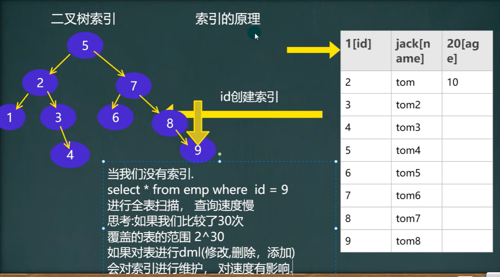


### 创建索引 [增删改查]

```mysql
# 索引的类型
-- 1. 主键索引，主键自动的为主索（类型Primary key)
-- 2. 唯一索引(UNIQUE)
-- 3. 普通索引(INDEX)
-- 4. 全文索引(FULLTEXT)[适用于MyISAM]
-- 一般开发，不使用mysql自带的全文索引，而是使用：全文搜索 Solr和 ElasticSearch(ES)

# 演示mysql的索引的使用

-- 创建表
CREATE TABLE t25(
	id INT,
	`name` VARCHAR(32));
	
-- 查询表是否有索引
SHOW INDEXES FROM t25;

# 添加索引
-- 添加唯一索引
CREATE UNIQUE INDEX id_index ON t25 (id);

-- 添加普通索引方式1
CREATE INDEX id_index ON t25 (id);

-- 如何选择
-- 1. 如果某列的值，是不会重复的，则优先考虑使用unique索引，
-- 否则使用普通索引

-- 添加普通索引方式2
ALTER TABLE t25 ADD INDEX id_index (id)

-- 添加主键索引
-- 第一种方式
CREATE TABLE t26(
	id INT PRIMARY KEY,
	`name` VARCHAR(32));

-- 第二种方式
ALTER TABLE t26 ADD PRIMARY KEY (id)

SHOW INDEX FROM t26; #查询表是否有索引

# 删除索引
DROP INDEX id_index ON t25

-- 删除主键索引
ALTER TABLE t26 DROP PRIMARY KEY

-- 修改索引，先删除，再添加新的索引

# 查询索引
-- 方式一
SHOW INDEX FROM t25;

-- 方式二
SHOW INDEXES FROM t25;

-- 方式三
SHOW KEYS FROM t25;
```


### 课后练习

```mysql
# 建立索引（主键）课后练习
-- 创建一张订单表order(id号，商品名，订购人，数量)，
-- 要求id号为主键，请使用2种方式来创建主键.
-- (提示：为练习方便，可以是order1,order2)

-- 第一种方式
CREATE TABLE `order`(
	id INT PRIMARY KEY,
	`shop_name` VARCHAR(32),
	`person_name` VARCHAR(16),
	`number` INT
	)
SHOW INDEXES FROM `order`;

-- 第二种方式
CREATE TABLE `order2`(
	id INT,
	`shop_name` VARCHAR(32),
	`person_name` VARCHAR(16),
	`number` INT
	)
ALTER TABLE `order2` ADD PRIMARY KEY (id);
SHOW INDEXES FROM `order2`;


# 建立索引（唯一）课后练习
-- 创建一张特价菜谱表menu(id号，菜谱名，厨师，点餐人身份证，价格),
-- 要求id号为主键，点餐人身份证是unique，请使用两种方式来创建unique,
-- (提示：为练习方便，可以是menu1,menu2)

-- 第一种方式
CREATE TABLE `menu1`(
	id INT PRIMARY KEY,
	`vegetable_name` VARCHAR(32),
	`card` VARCHAR(16) UNIQUE,
	`price` INT
	)
SHOW INDEXES FROM `menu1`;
	
-- 第二种方式
CREATE TABLE `menu2`(
	id INT,
	`vegetable_name` VARCHAR(32),
	`card` VARCHAR(16),
	`price` INT
	)
ALTER TABLE `menu2` ADD PRIMARY KEY (id)
CREATE UNIQUE INDEX id_index ON `menu2` (card)
SHOW INDEXES FROM `menu2`


# 建立索引（普通）课堂练习
-- 创建一张运动员表sportman(id号，名字，特长)，
-- 要求id号为主键，名字为普通索引，请使用2种方式来创建索引
-- （提示：为练习方便，可以是不同表名sportman1,sportman2）

-- 第一种方式
CREATE TABLE `sportman1`(
	id INT PRIMARY KEY,
	`name` VARCHAR(32),
	`speciality` TEXT
	)
CREATE INDEX name_index ON `sportman1` (`name`);
SHOW INDEXES FROM `sportman1`;

-- 第二种方式
CREATE TABLE `sportman2`(
	id INT,
	`name` VARCHAR(32),
	`speciality` TEXT
	)
ALTER TABLE `sportman2` ADD PRIMARY KEY (id)
ALTER TABLE `sportman2` ADD INDEX name_index (`name`)
SHOW INDEXES FROM `sportman2`;
```


### 哪些列上适合使用索引

1. 较频繁的作为查询条件字段应该创建索引

   select * from emp where empno = 1

2. 唯一性太差的字段不适合单独创建索引，即使频繁作为查询条件

   select * from emp where sex = '男'

3. 更新非常频繁的字段不适合创建索引

   select * from emp where logincount = 1

4. 不会出现在VHERE子句中字段不该创建索引


## 事务

### 什么是事务

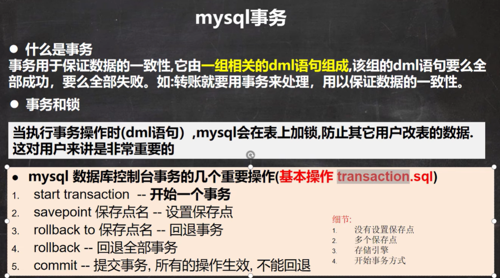

```mysql
# 事务的一个重要的概念和具体操作

-- 1. 创建一张测试表
CREATE TABLE t27(
	id INT,
	`name` VARCHAR(32)
	)

-- 2.开始事务
START TRANSACTION

-- 3. 设置保存点
SAVEPOINT a
-- 执行dml 操作
INSERT INTO t27 VALUES(100, 'tom');
SELECT * FROM t27;

SAVEPOINT b
-- 执行dml 操作
INSERT INTO t27 VALUES(200, 'jack');

-- 回退到 b
ROLLBACK TO b
-- 继续回退 a
ROLLBACK TO a

-- 如果这样，表示直接回退到事务开始的状态
ROLLBACK
```


### 回退事务


```mysql
# 讨论事务细节

-- 1. 如果不开始事务,默认情况下,dml操作是自动提交的,不能回滚
INSERT INTO t27 VALUES(300, 'milan'); -- 自动提交 commit
SELECT * FROM t27

-- 2. 如果开始一个事务,你没有创建保存点.你可以执行rollback,
--    默认就是回退到你事务开始的状态.
START TRANSACTION
INSERT INTO t27 VALUES(400, 'king');
INSERT INTO t27 VALUES(500, 'scott');
ROLLBACK -- 表示直接回退到你事务开始的状态.

-- 3. 你也可以在这个事务中(还没有提交时),创建多个保存点.
--    比如: savepointaaa; 执行dml, savepoint bbb;

-- 4. 你可以在事务没有提交前,选择回退到哪个保存点.

-- 5. mysql的事务机制需要innodb的存储引擎才可以使用,myisam不好使.
--    InnoDB 存储引擎支持事务 ，MyISAM 不支持

-- 6. 开始一个事务start transaction, set autocommit = off;
START TRANSACTION
COMMIT;
```


### 隔离级别

- 事务隔离级别介绍

  ​	1. 多个连接开启各自事务操作数据库中数据时，数据库系统要负责隔离操作，以保证各个连接在获取数据时的准确性。

  ​	2.如果不考虑隔离性,可能会引发如下问题:脏读、不可重复读、幻读。

  

- 查看事务隔离级别

  概念：Mysql隔离级别定义了事务与事务之间的隔离程度。

  

  **脏读(dirty read)**：当一个事务读取另一个事务尚未提交的改变（update, insert, delete）时，产生脏读。

  **不可重复读（nonrepeatable read)**：同一查询在同一事务中多次进行，由于其他提交事务所做的修改或删除，每次返回不同的结果集，此时发生不可重复读。

  **幻读（phantom read)**：同一查询在同一事务中多次进行，由于其他提交事务所做的插入操作，每次返回不同的结果集，此时发生幻读。

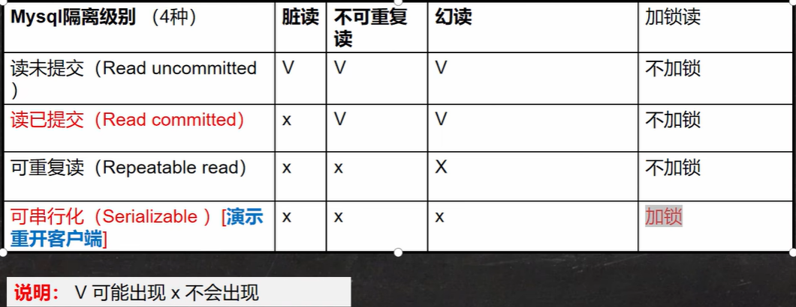

```mysql
# 演示mysql的事务隔离级别

-- 1.开了两个mysql的控制台
-- 2.查看当前mysql的隔离级别
SELECT @@tx_isolation;

-- mysql> SELECT @@tx_isolation;
-- +-----------------+
-- | @@tx_isolation  |
-- +-----------------+
-- | REPEATABLE-READ |
-- +-----------------+

-- 3.把其中一个控制台的隔离级别设置成 读未提交（Read uncommitted）
SET SESSION TRANSACTION ISOLATION LEVEL READ UNCOMMITTED;
```


```mysql
-- 1.查看当前会话隔离级别 
SELECT @@tx_isolation; 

-- 2.查看系统当前隔离级别 
SELECT @@global.tx_isolation;

-- 3.设置当前会话隔离级别 
SET SESSION TRANSACTION ISOLATION LEVEL REPEATABLE READ;

-- 4.设置系统当前隔离级别 
SET GLOBAL TRANSACTION ISOLATION LEVEL REPEATABLE READ; 

-- 5.mysql默认的事务隔离级别是repeatable read,
-- 一般情况下，没有特殊要求，没有必要修改（因为该级别可以满足绝大部分项目需求）


# 全局修改，修改my.ini配置文件，在my.ini最后加上 
-- 可选参数有：READ-UNCOMMITTED,READ-COMMITTED,REPEATABLE-READ,SERIALIZABLE.
TRANSACTION-ISOLATION = REPEATABLE-READ
```


## mysql表类型和存储引擎

- 基本介绍
  1. MySQL的表类型由存储引擎(Storage Engines)决定，主要包括MyISAM、ainnoDB、 Memory等。
  2. MySQL数据表主要支持六种类型，分别是: CSV、 Memory、 ARCHIVE、MRG_MYISAM、MYISAM、InnoBDB。
  3.  这六种又分为两类，一类是”事务安全型”（transaction-safe），比如：InnoDB；其余都属于第二类，称为"非事务安全型"(non-transaction-safe)[mysiam 和 memory]。


- 细节说明

  重点介绍三种：MyISAM、InnoDB、MEMORY

  1.MyISAM不支持事务、也不支持外键，但其访问速度快，对事务完整性没有要求

  2.InnoDB存储引擎提供了具有提交、回滚和崩溃恢复能力的事务安全。但是比起MyISAM存储引擎，InnoDB写的处理效率差一些并且会占用更多的磁盘空间以保留数据和索引。

  3.MEMORY存储号引擎使用存在内存中的内容来创建表。每个MEMORY：表只实际对应一个磁盘文件。MEMORY类型的表访问非常得快，因为它的数据是放在内存中的，并且默认使用HASH索引。但是一旦MySQL服务关闭，表中的数据就会丢失掉，表的结构还在。


- 三种存储引擎表使用案例

  ```mysql
  # 表类型和存储引擎
  
  -- 查看所有的存储引擎
  SHOW ENGINES;
  
  # innodb存储引擎，前面使用过
  -- 1.支持事务2.支持外键3.支持行级锁
  
  # myisam 存储引擎
  CREATE TABLE t28(
  	id INT,
  	`name` VARCHAR(32)) ENGINE MYISAM
  -- 1.添加速度快 2.不支持外键和事务 3.支持表级锁
  START TRANSACTION;
  SAVEPOINT t1
  INSERT INTO t28 VALUES(1, 'jack');
  SELECT * FROM t28;
  ROLLBACK TO t1
  
  # memory存储引擎
  -- 1.数据存储在内存中[关闭了Mysq1服务，数据丢失，但是表结构还在]
  -- 2.执行速度很快（没有Io读写）
  -- 3.默认支持索引(hash表)
  CREATE TABLE t29(
  	id INT,
  	`name` VARCHAR(32)) ENGINE MEMORY
  DESC t29
  INSERT INTO t29
  	VALUES(1, 'tom'), (2, 'jack'), (3, 'hsp');
  SELECT * FROM t29
  ```

  

- 如何选择表的存储引擎

  ​	1.如果你的应用不需要事务，处理的只是基本的CRUD操作，那么MyISAM是不二选择，速度快

  ​	2.如果需要支持事务，选择InnoDB。

  ​	3.Memory存储引擎就是将数据存储在内存中，由于没有磁盘l./O的等待，速度极快。但由于是内存存储引擎，所做的任何修改在服务器重启后都将消失。（经典用法 用户的在线状态().）


- 修改存储引擎

  ```mysql
  ALTER TABLE `表名` ENGINE = 存储引擎;
  ```

  

##  视图

- 看一个需求

  ​	emp 表的列信息很多，有些信息是个人重要信息（比如sal、comm、mgr、hiredate)，如果我们希望某个用户只能查询emp表的(empno、ename、job 和 deptno）信息，有什么办法？=> 视图

  

- 视图基本概念

   1. 视图是一个虚拟表，其内容由查询定义。同真实的表一样，视图包含列，其数据来自对应的真实表（也叫基表）。

   2. 视图和基表关系的示意图。

      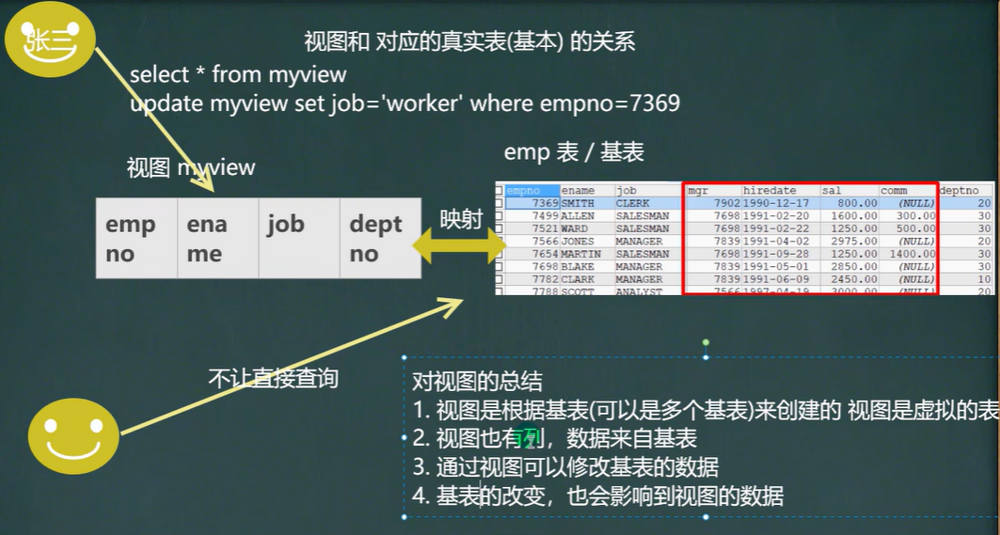


- 视图的基本使用

```mysql
# 视图的基本使用
-- 1. create view 视图名 as select语句
-- 2. alter view视图名 as select语句--更新成新的视图
-- 3. SHOW CREATE VIEW 视图名
-- 4. drop view视图名1,视图名2


# 创建一个视图emp_view01,只能查询emp表的(empno、ename、job 和 deptno )信息

-- 创建视图
CREATE VIEW emp_view01
	AS
	SELECT empno, ename, job, deptno FROM emp;

-- 查看视图
DESC emp_view01

SELECT * FROM emp_view01;
SELECT empno, job FROM emp_view01;

-- 查看创建视图的指令
SHOW CREATE VIEW emp_view01

-- 删除视图
DROP VIEW emp_view01;


# 视图的细节
-- 1.创建视图后，到数据库去看，对应视图只有一个视图结构文件（形式：视图名.frm）
-- 2.视图的数据变化会影响到基表，基表的数据变化也会影响到视图[insert update delete]
-- 3.视图之中可以再使用视图，数据仍然来自基表
```


- 视图最佳实践

  ​	1.**安全**。一些数据表有着重要的信息。有些字段是保密的，不能让用户直接看到。这时就可以创建一个视图，在这张视图中只保留一部分字段。这样，用户就可以查询自己需要的字段，不能查看保密的字段。

  ​	2.**性能**。关系数据库的数据常常会分表存储，使用外键建立这些表的之间关系。这时，数据库查询通常会用到连接(JOIN)。这样做不但麻烦，效率相对也比较低。如果建立一个视图，将相关的表和字段组合在一起，就可以避免使用JOIN查询数据。
  ​    3.**灵活**。如果系统中有一张旧的表，这张表由于设计的问题，即将被废弃。然而，很多应用都是基于这张表，不易修改。这时就可以建立一张视图，视图中的数据直接映射到新建的表。这样，就可以少做很多改动，也达到了升级数据表的目的。


- 视图课堂练习

  ```mysql
  # 视图的课堂练习
  
  -- 针对emp, dept 和salgrade 张三表.创建一个视图emp view03,
  -- 可以显示雇员编号，雇员名，雇员部门名称和薪水级别[即使用三张表，构建一个视图]
  
  -- 分析：使用三表联合查询，得到结果
  -- 	 将得到的结果，构成视图
  
  CREATE VIEW emp_view03
  	AS
  	SELECT empno, ename, dname, grade
  	FROM emp, dept, salgrade
  	WHERE emp.deptno = dept.deptno AND
  	 (sal BETWEEN losal AND hisal)
  
  DESC emp_view03
  SELECT * FROM emp_view03
  ```

  


## MySQL管理

### Mysql用户管理

mysql中的用户，都存储在系统数据库mysql中 user 表中

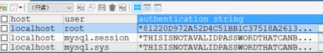

 其中user表的重要字段说明：

1. host：允许登陆的“位置”，localhost表示该用户只允许本机登陆，也可以指定ip地址，比如：192.168.1.100
2. user：用户名；
3. authentication_string：密码，是通过mysql的password() 函数加密之后的密码。

```mysql
# Mysql用户的管理
-- 原因：当我们做项目开发时，可以根据不同的开发人员，赋给他相应的Mysgl操作权限
-- 所以，Mysq1数据库管理人员(root),根据需要创建不同的用户，赋给相应的权限，供人员使用

-- 1. 创建新的用户
-- 解读(1)'hsp_edu'@'localhost' 表示用户的完整信息'hsp_edu'用户名'localhost'登录的IP
--     (2) 123456 密码，但是注意 存放到 mysql.user表时，是password('123456')加密后的密码
CREATE USER 'hsp_edu'@'localhost' IDENTIFIED BY '123456'

SELECT `host`, `user`, authentication_string
	FROM mysql.user
	
-- 2. 删除用户
DROP USER 'hsp_edu'@'localhost'

-- 修改自己的密码
SET PASSWORD = PASSWORD('abcdef')

-- 修改用户的密码，需要权限
SET PASSWORD FOR 'hsp_edu'@'localhost' = PASSWORD('123456')
```


### Mysql权限管理

- mysql中的权限

  


- 给用户授权

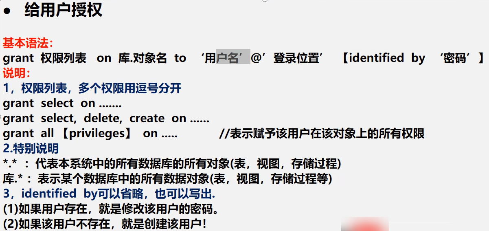


- 用户管理练习题

```mysql
# 演示 用户权限的管理

-- 创建用户wj，密码123，从本地登录
CREATE USER 'wj'@'localhost' IDENTIFIED BY '123'

-- 使用root 用户创建 textdb, 表 news
CREATE DATABASE testdb
CREATE TABLE news(
	id INT,
	content VARCHAR(32));
-- 添加一条测试数据
INSERT INTO news VALUES(100, '山海');
SELECT * FROM news

-- 给 wj 分配 查看news表和 添加news的权限
GRANT SELECT , INSERT
	ON testdb.news
	TO 'wj'@'localhost'

-- 修改 wj的密码为abc
SET PASSWORD FOR 'wj'@'localhost' = PASSWORD('abc');

-- 回收 wj 用户在 testdb.news 表的所有权限
REVOKE SELECT, INSERT ON testdb.news FROM 'wj'@'localhost'
-- 或REVOKE all ON testdb.news FROM 'wj'@'localhost'

-- 删除 wj用户
DROP USER 'wj'@'localhost'
```


### Mysql管理细节

1.在创建用户的时候，如果不指定Host，则为%，%表示表示所有IP都有连接权限create user xxx;

2.你也可以这样指定create user 'xx'@'192.168.1.%' 表示xx用户在192.168.1.*的ip可以登录mysql

3.在删除用户的时候，如果host不是%，需要明确指定'用户'@'host值'


## MySQL数据库范式

> 在MySQL数据库设计中，**范式**（Normalization）是一组规则，用于指导如何组织数据库中的数据以减少冗余和提高数据完整性。范式的核心目的是确保数据的一致性，避免更新异常，并使数据库结构更加清晰。

范式是数据库设计的重要理论基础，它指导我们如何有效地组织数据，减少冗余，提高数据完整性。在设计MySQL数据库时，应该根据实际需求和性能要求选择合适的范式级别，以达到数据一致性和查询性能之间的最佳平衡。

### 第一范式 - 1NF

> 第一范式要求数据库表的每个字段都是原子性的，即字段不可再分。这意味着每个字段中的值都是不可分割的最小单元，不能包含多个值或重复的组合。例如，如果一个字段包含了多个电话号码，那么它就违反了第一范式。为了符合1NF，应该将这个字段拆分成多个字段，每个字段只包含一个电话号码。

先看一个不符合第一范式的表结构，如下：

| 员工编码 | 姓名       | 年龄 |
| -------- | ---------- | ---- |
| 001      | 销售部小张 | 28   |
| 002      | 运营部小黄 | 25   |
| 003      | 技术部小高 | 22   |

在这一个表中的，姓名 字段下的数据是可以再进行拆分的，因此它不符合第一范式，那怎么样才符合第一范式呢？如下：

| 员工编码 | 部门   | 姓名 | 年龄 |
| -------- | ------ | ---- | ---- |
| 001      | 销售部 | 小张 | 28   |
| 002      | 运营部 | 小黄 | 25   |
| 003      | 技术部 | 小高 | 22   |

那是否遵循第一范式就一定是好的呢？如下：

| 员工编码 | 姓名 | 地址               |
| -------- | ---- | ------------------ |
| 001      | 小张 | 江西省南昌市东湖区 |
| 002      | 小黄 | 广东省佛山市禅城区 |
| 003      | 小高 | 湖北省武汉市新洲区 |

通过观察上述表结构，我们发现，地址是可以再进一步拆分的，比如：

| 员工编码 | 姓名 | 省     | 市     | 区     |
| -------- | ---- | ------ | ------ | ------ |
| 001      | 小张 | 江西省 | 南昌市 | 东湖区 |
| 002      | 小黄 | 广东省 | 佛山市 | 禅城区 |
| 003      | 小高 | 湖北省 | 武汉市 | 新洲区 |

虽然拆分后，看上去更符合第一范式了，但是如果项目就只需要我们输出一个完整地址呢？那明显是表在没拆分的时候会更好用。

所以范式只是给了我们一个参考，我们更多的是要根据项目实际情况设计表结构。


###  第二范式 - 2NF

> 在满足第一范式的基础上，第二范式要求表中的所有非主键字段都必须完全依赖于主键。这意味着表中的数据不应该只依赖于主键的一部分，而应该依赖于整个主键。如果一个表有一个复合主键，那么表中的每个非主键字段都应该与这个复合主键有直接关系，而不是只与主键的一部分有关系。

我们用一个经典案例进行解析。

| 学号 | 姓名 | 年龄 | 课程名称 | 成绩 | 学分 |
| ---- | ---- | ---- | -------- | ---- | ---- |
| 001  | 小张 | 28   | 语文     | 90   | 3    |
| 001  | 小张 | 28   | 数学     | 90   | 2    |
| 002  | 小黄 | 25   | 语文     | 90   | 3    |
| 002  | 小黄 | 25   | 语文     | 90   | 3    |
| 003  | 小高 | 22   | 数学     | 90   | 2    |

我们先分析一下表结构。

1. 假设学号是表中的唯一主键，那由学号就可以确定姓名和年龄了，但是却不能确定课程名称和成绩。

2. 假设课程名称是表中的唯一主键，那由课程名称就可以确定学分了，但是却不能确定姓名、年龄和成绩。

3. 虽然通过学号和课程名称的联合主键，可以确定除联合主键外的所有的非主键值，但是基于上述两个假设，也不符合第二范式的要求。


那我们应该**如何调整表结构**，让它能复合第二范式的要求呢？

我们可以**基于上述的三种主键的可能，拆分成 3 张表，保证一张表只描述一件事情**。

1. 学生表 - 学号做主键

| 学号 | 姓名 | 年龄 |
| ---- | ---- | ---- |
| 001  | 小张 | 28   |
| 002  | 小黄 | 25   |
| 003  | 小高 | 22   |

2. 课程表 - 课程名称做主键

| 课程名称 | 学分 |
| -------- | ---- |
| 语文     | 3    |
| 数学     | 2    |

3. 成绩表 - 学号和课程名称做联合主键

| 学号 | 课程名称 | 成绩 |
| ---- | -------- | ---- |
| 001  | 语文     | 90   |
| 001  | 数学     | 90   |
| 002  | 语文     | 90   |
| 002  | 语文     | 90   |
| 003  | 数学     | 90   |


这时候我们可能会想，为什么我们就要遵循第二范式呢？**不遵循第二范式会造成什么样的后果呢**？

1. 造成整表的数据冗余。
   如，学生表，可能我就只有2个学生，每个学生都有许多的信息，比如，年龄、性别、身高、住址......如果与课程信息放到同一张表中，可能每个学生有3门课程，那数据总条数就会变成6条了。但是通过拆分，学生表我们只需要存储 2 条学生信息，课程表只需要存储 3 条课程信息，成绩表就只需保留学号、课程名称和成绩字段。

2. 更新数据不方便。
   假设，课程的学分发生了变更，那我们就需要把整表关于该课程的学分都要更新一次，但如果我们拆分出课程表，那我们就只需要把课程表中的课程信息更新就行。

3. 插入数据不方便或产生异常。
   ① 假设主键是学号或课程名称，我们新增了某个课程，需要把数据插入到表中，这时，可能只有部分人有选修这门课程，那我们插入数据的时候还要规定给哪些人插入对应的课程信息，同时可能由于成绩还没有，我们需要对成绩置空，后续有成绩后还得重新更新一遍。

   ② 假设主键是学号和课程名称的联合主键。同样也是新增了某课程，但是暂时没有人选修这门课，缺少了学号主键字段数据，会导致课程信息无法插入。


### 第三范式 - 3NF

> 第三范式进一步要求，表中的所有非主键字段不仅要完全依赖于主键，而且还不能依赖于其他非主键字段。这样做的目的是消除传递依赖，确保每个字段都直接依赖于主键。如果一个字段依赖于另一个非主键字段，那么就应该将这个依赖字段移到另一个表中，并通过外键关联。

仍然用一个经典例子来解析

| 学号 | 姓名 | 班级          | 班主任 |
| ---- | ---- | ------------- | ------ |
| 001  | 小黄 | 一年级（1）班 | 高老师 |

这个表中，学号是主键，它可以唯一确定姓名、班级、班主任，符合了第二范式，但是在非主键字段中，我们也可以通过班级推导出该班级的班主任，所以它是不符合第三范式的。


那怎么设计表结构，才是符合第三范式的呢？

1. 学生表

| 学号 | 姓名 | 班级          |
| ---- | ---- | ------------- |
| 001  | 小黄 | 一年级（1）班 |

2. 班级表

| 班级          | 班主任 |
| ------------- | ------ |
| 一年级（1）班 | 高老师 |

通过把班级与班主任的映射关系另外做成一张映射表，我们就成功地消除了表中的传递依赖了。


以下是本篇三范式的简单总结：

- 第一范式（1 NF）：字段不可再拆分。
- 第二范式（2 NF）：表中任意一个主键或任意一组联合主键，可以确定除该主键外的所有的非主键值。
- 第三范式（3 NF）：在任一主键都可以确定所有非主键字段值的情况下，不能存在某非主键字段 A 可以获取 某非主键字段 B。


## Mysql作业

- Mysql作业一

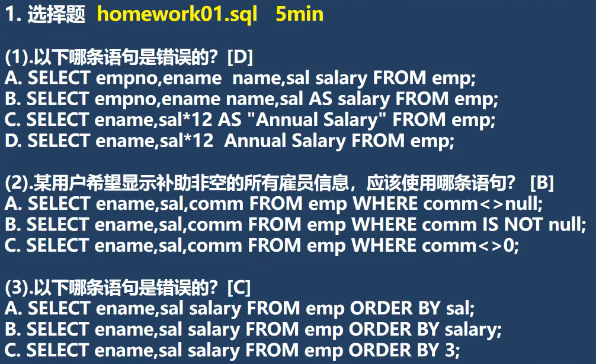


- Mysql作业二

```mysql
# 2.写出查看DEPT表和EMP表的结构 的sql语句
DESC dept
DESC emp

# 3.使用简单查询语句完成：
SELECT * FROM dept;
SELECT * FROM emp;
-- (1)显示所有部门名称。
SELECT dname FROM dept;
-- (2)显示所有雇员名及其全年收入 13月(工资+补助)，并指定列别名"年收入"
SELECT ename, (sal + IFNULL(comm,0)) * 13 AS '年收入' 
	FROM emp;

# 4.限制查询数据。
SELECT * FROM emp;
-- (1)显示工资超过2850的雇员姓名和工资。
SELECT ename, sal
	FROM emp 
	WHERE sal > 2850
-- (2)显示工资不在1500到2850之间的所有雇员名及工资。
SELECT ename, sal
	FROM emp 
	WHERE NOT(sal > 1500 AND sal < 2850)
-- (3)显示编号为7566的雇员姓名及所在部门编号。
SELECT ename, deptno
	FROM emp
	WHERE empno = 7566
-- (4)显示部门10和30中工资超过1500的雇员名及工资。
SELECT ename, sal
	FROM emp
	WHERE deptno IN(10,30) AND sal > 1500
-- (5)显示无管理者的雇员名及岗位。
SELECT ename, job
	FROM emp
	WHERE mgr IS NULL

# 5.排序数据。
-- (1)显示在1991年2月1日到1991年5月1日之间雇用的雇员名,岗位及雇佣日期,并以雇佣日期进行排序。
SELECT ename, job, hiredate
	FROM emp
	WHERE hiredate > '1991-02-01' AND hiredate < '1991-05-01'
	ORDER BY hiredate
-- (2)显示获得补助的所有雇员名,工资及补助,并以工资降序排序
SELECT ename, sal, comm
	FROM emp
	WHERE comm IS NOT NULL
	ORDER BY comm DESC
```


- Mysql作业三

```mysql
# 6.根据：emp员工表 写出正确SQL
SELECT * FROM emp
-- 1.选择部门30中的所有员工
SELECT ename
	FROM emp
	WHERE deptno = 30
-- 2.列出所有办事员(CLERK)的姓名，编号和部门编号.
SELECT ename, empno, deptno
	FROM emp
	WHERE job = 'CLERK'
-- 3.找出佣金高于薪金的员工
SELECT ename
	FROM emp
	WHERE IFNULL(comm,0) > sal
-- 4.找出佣金高于薪金60%的员工
SELECT ename
	FROM emp
	WHERE IFNULL(comm,0) > (sal * 6 / 10)
-- 5.找出部门10中所有经理(MANAGER)和部门20中所有办事员(CLERK)的详细资料.
SELECT *
	FROM emp
	WHERE (job = 'MANAGER' AND deptno = 10)
	OR (job = 'CLERK' AND deptno = 20)
-- 6.找出部门10中所有经理(MANAGER),部门20中所有办事员(CLERK),
--   还有既不是经理又不是办事员但其薪金大于或等于2000的所有员工的详细资料.
SELECT *
	FROM emp
	WHERE (job = 'MANAGER' AND deptno = 10)
	OR (job = 'CLERK' AND deptno = 20)
	OR (ename IN (SELECT ename
			FROM emp
			WHERE job != 'MANAGER' AND job != 'CLERK' 
			AND sal > 2000))
-- 7.找出收取佣金的员工的不同工作
SELECT DISTINCT job
	FROM emp
	WHERE comm IS NOT NULL
-- 8.找出不收取佣金或收取的佣金低于500的员工
SELECT * 
	FROM emp
	WHERE comm IS NULL OR IFNULL(comm,0) < 500
-- 9.找出各月倒数第3天受雇的所有员工！
-- 提示：last_day(日期)，可以返回该日期所在月份的最后一天
--  last_day(日期) - 2得到日期所有月份的倒数第3天
SELECT * 
	FROM emp
	WHERE LAST_DAY(hiredate) - 2 = hiredate
-- 10.找出早于12年前受雇的员工
SELECT *
	FROM emp
	WHERE hiredate < DATE_SUB(NOW(), INTERVAL 12 YEAR)
-- 11.以首字母小写的方式显示所有员工的姓名
SELECT CONCAT(LCASE(LEFT(ename,1)), SUBSTRING(ename,2))
	FROM emp
-- 12.显示正好为5个字符的员工的姓名.
SELECT * FROM emp
	WHERE CHAR_LENGTH(ename) = 5
```


- Mysql作业四

```mysql
# 6. 根据：emp员工表 写出正确SQL
SELECT * FROM emp
-- 13.显示不带有"R"的员工的姓名.
SELECT *
	FROM emp
	WHERE ename NOT LIKE '%R%'
-- 14.显示所有员工姓名的前三个字符.
SELECT LEFT(ename, 3)
	FROM emp
-- 15.显示所有员工的姓名,用a替换所有"A"
SELECT REPLACE(ename, 'A', 'a')
	FROM emp
-- 16.显示满10年服务年限的员工的姓名和受雇日期.
SELECT ename, hiredate
	FROM emp
	WHERE DATE_ADD(hiredate, INTERVAL 10 YEAR) < NOW()
-- 17.显示员工的详细资料，按姓名排序.
SELECT *
	FROM emp
	ORDER BY ename
-- 18.显示员工的姓名和受雇日期,根据其服务年限,将最老的员工排在最前面.
SELECT ename, hiredate
	FROM emp
	ORDER BY hiredate
-- 19.显示所有员工的姓名、工作和薪金,按工作降序排序,若工作相同则按薪金排序.
SELECT ename, job, sal
	FROM emp
	ORDER BY job DESC , sal DESC
-- 20.显示所有员工的姓名、加入公司的年份和月份,按受雇日期所在月排序,
--    若月份相同则将最早年份的员工排在最前面.
SELECT ename, CONCAT(YEAR(hiredate), '-', MONTH(hiredate))
	FROM emp
	ORDER BY MONTH(hiredate), YEAR(hiredate)
-- 21.显示在一个月为30天的情况所有员工的日薪金,忽略余数.
SELECT FORMAT(((sal + IFNULL(comm, 0)) / 30), 0)
	FROM emp
-- 22.找出在(任何年份的)2月受聘的所有员工。
SELECT *
	FROM emp
	WHERE MONTH(hiredate) = 2
-- 23.对于每个员工，显示其加入公司的天数.
SELECT DATEDIFF(NOW(), hiredate)
	FROM emp
-- 24.显示姓名字段的任何位置包含"A"的所有员工的姓名.
SELECT *
	FROM emp
	WHERE ename LIKE '%A%'
-- 25.以年月日的方式显示所有员工的服务年限.(大概)
SELECT FROM_DAYS(DATEDIFF(NOW(), hiredate))
	FROM emp
```


- Mysql作业五

```mysql
# 7.根据: emp员工表, dept部门表, 工资 = 薪金sal + 佣金 comm 写出正确SQL
SELECT * FROM emp
SELECT * FROM dept 
	
-- (1).列出至少有一个员工的所有部门
SELECT COUNT(*) AS c, deptno
	FROM emp
	GROUP BY deptno
	HAVING c > 1
-- (2).列出薪金比“SMITH”多的所有员工。
SELECT ename
	FROM emp
	WHERE sal > (SELECT sal
			FROM emp
			WHERE ename = 'SMITH')
-- (3).列出受雇日期晚于其直接上级的所有员工。
SELECT worker.ename AS '员工名', worker.hiredate AS '员工入职时间',
	leader.ename AS '上级名', leader.hiredate AS '上级入职时间'
	FROM emp AS worker, emp AS leader
	WHERE worker.hiredate > leader.hiredate
	AND worker.mgr = leader.empno;
-- (4).列出部门名称和这些部门的员工信息,同时列出那些没有员工的部门。
SELECT dname, emp.*
	FROM dept
	LEFT JOIN emp ON dept.deptno = emp.deptno

-- (5).列出所有"CLERK" （办事员)的姓名及其部门名称。
SELECT ename, dname
	FROM emp, dept
	WHERE emp.deptno = dept.deptno AND job = 'CLERK'
-- (6).列出最低薪金大于1500的各种工作。
SELECT MIN(sal) AS min_sal, job
	FROM emp
	GROUP BY job
	HAVING min_sal > 1500
-- (7).列出在部门"SALES" (销售部)工作的员工的姓名。
SELECT  ename, dname
	FROM emp, dept
	WHERE emp.deptno = dept.deptno AND dname = 'SALES'
-- (8).列出薪金高于公司平均薪金的所有员工。
SELECT ename, sal
	FROM emp
	WHERE sal > (SELECT AVG(sal)
			FROM emp)
```


- Mysql作业六

```mysql
# 7. 根据：emp员工表，dept部门表，工资 = 薪金 + 佣金 写出正确SQL
SELECT * FROM emp
SELECT * FROM dept

-- (9).列出与"SCOTT"从事相同工作的所有员工。
SELECT ename
	FROM emp
	WHERE job IN (SELECT job
			FROM emp
			WHERE ename = 'SCOTT')
-- (10).列出薪金高于在部门30工作的所有员工的薪金的员工姓名和薪金。
SELECT ename, sal
	FROM emp
	WHERE sal > (SELECT MAX(sal)
			FROM emp
			WHERE deptno = 30)
-- (11).列出在每个部门工作的员工数量、平均工资和平均服务期限。
SELECT COUNT(*), AVG(sal), AVG(YEAR(NOW()) - YEAR(hiredate))
	FROM emp
	GROUP BY deptno
-- (12).列出所有员工的姓名、部门名称和工资。
SELECT ename, deptno, sal
	FROM emp
-- (13).列出所有部门的详细信息和部门人数。
SELECT dept.*, `number`.`count`
	FROM dept LEFT JOIN
	(SELECT COUNT(*) AS `count`, deptno
		FROM emp
		GROUP BY deptno) AS `number`
	ON dept.deptno = `number`.deptno
-- (14).列出各种工作的最低工资。
SELECT job, MIN(sal)
	FROM emp
	GROUP BY job
-- (15).列出MANAGER(经理)的最低薪金。
SELECT MIN(sal)
	FROM emp
	WHERE job = 'MANAGER'
-- (16).列出所有员工的年工资，按年薪从低到高排序。
SELECT ename, (sal + IFNULL(comm, 0)) * 12 AS year_sal
	FROM emp
	ORDER BY sal
```


- Mysql作业七

```mysql
# 8.设学校环境如下：一个系有若干个专业，每个专业一年只招一个班，每个班有若干个学生
-- 现要建立关于系、学生、班级的数据库，关系模式为：
-- 班CLASS(班号classid,专业名subject,.系名deptname,入学年份enrolltime,人数num)
-- 学生STUDENT(学号studentid,姓名name,年龄age,班号classid)
-- 系 DEPARTMENT(系号departmentid，系名deptname)
-- 使用SQL语言完成以下功能

-- (1)建表，在定义中要求声明：
-- 	1.1 每个表的主外码。
-- 	1.2 deptname是唯一约束。
-- 	1.3 学生姓名不能为空。
CREATE TABLE DEPARTMENT(
	departmentid VARCHAR(16) PRIMARY KEY,
	deptname VARCHAR(16) UNIQUE NOT NULL)

CREATE TABLE CLASS(
	classid INT UNSIGNED PRIMARY KEY,
	`subject` VARCHAR(16),
	deptname VARCHAR(16),
	enrolltime INT NOT NULL DEFAULT 0,
	num INT UNSIGNED,
	
	FOREIGN KEY (deptname) REFERENCES DEPARTMENT(deptname))

CREATE TABLE STUDENT(
	studentid INT UNSIGNED PRIMARY KEY,
	`name` VARCHAR(16) NOT NULL,
	age INT UNSIGNED,
	classid INT UNSIGNED,
	
	FOREIGN KEY (classid) REFERENCES CLASS(classid))

-- (2)插入如下数据
INSERT INTO DEPARTMENT 
	VALUES('001', '数学'),
	('002', '计算机'),
	('003', '化学'),
	('004', '中文'),
	('005', '经济');

INSERT INTO CLASS 
    VALUES(101, '软件', '计算机', 1995, 20),
    (102, '微电子', '计算机', 1996, 30),
    (111, '无机化学', '化学', 1995, 29),
    (112, '高分子化学', '化学', 1996, 25),
    (121, '统计数学', '数学', 1995, 20),
    (131, '现代语言', '中文', 1996, 20),
    (141, '国际贸易', '经济', 1997, 30),
    (142, '国际金融', '经济', 1996, 14);

INSERT INTO STUDENT 
	VALUES(8101, '张三', 18, 101),
	(8102, '钱四', 16, 121),
	(8103, '王玲', 17, 131),
	(8105, '李飞', 19, 102),
	(8109, '赵四', 18, 141),
	(8110, '李可', 20, 142),
	(8201, '张飞', 18, 111),
	(8302, '周瑜', 16, 112),
	(8203, '王亮', 17, 111),
	(8305, '董庆', 19, 102),
	(8409, '赵龙', 18, 101),
	(8510, '李丽', 20, 142);

SELECT * FROM DEPARTMENT;
SELECT * FROM CLASS;
SELECT * FROM STUDENT;

DROP TABLE DEPARTMENT;
DROP TABLE CLASS
DROP TABLE STUDENT
-- (3)完成以下查询功能
--	3.1找出所有姓李的学生。
SELECT `name`
	FROM STUDENT 
	WHERE `name` LIKE '李%'
--	3.2列出所有开设超过1个专业的系的名字。
SELECT COUNT(*) AS nums, deptname
	FROM CLASS
	GROUP BY deptname HAVING nums > 1
--	3.3列出人数大于等于30的系的编号和名字。
SELECT temp.*, DEPARTMENT.departmentid
	FROM DEPARTMENT, (
		SELECT SUM(num) AS nums, deptname
		FROM CLASS
		GROUP BY deptname
		HAVING nums >= 30) temp
	WHERE DEPARTMENT.deptname = temp.deptname
-- (4)学校又新增加了一个物理系，编号为006
INSERT INTO DEPARTMENT 
	VALUES('006', '物理')
SELECT * FROM DEPARTMENT;
-- (5)学生张三退学，请更新相关的表
-- 分析：1.张三所在班级的人数-1。2.将张三从学生表删除。3.需要使用事务控制

-- 开启事务
START TRANSACTION;
-- 1.张三所在班级的人数-1
UPDATE CLASS SET num = num - 1
	WHERE classid = (
		SELECT classid
			FROM STUDENT
			WHERE `name` = '张三');

DELETE
	FROM STUDENT
	WHERE `name` = '张三';

-- 提交事务
COMMIT;

SELECT * FROM STUDENT;
SELECT * FROM CLASS;
```


# Mysql基础篇

## 一、视图

### 1. 常见的数据库对象

| 对象                 | 描述                                                         |
| -------------------- | ------------------------------------------------------------ |
| 表(TABLE)            | 表是存储数据的逻辑单元，以行和列的形式存在，列就是字段，行就是记录 |
| 数据字典             | 就是系统表，存放数据库相关信息的表。系统表的数据通常由数据库系统维护， 程序员通常不应该修改，只可查看 |
| 约束 (CONSTRAINT)    | 执行数据校验的规则，用于保证数据完整性的规则                 |
| 视图(VIEW)           | 一个或者多个数据表里的数据的逻辑显示，视图并不存储数据       |
| 索引(INDEX)          | 用于提高查询性能，相当于书的目录                             |
| 存储过程 (PROCEDURE) | 用于完成一次完整的业务处理，没有返回值，但可通过传出参数将多个值传给调 用环境 |
| 存储函数 (FUNCTION)  | 用于完成一次特定的计算，具有一个返回值                       |
| 触发器 (TRIGGER)     | 相当于一个事件监听器，当数据库发生特定事件后，触发器被触发，完成相应的 处理 |


### 2. 视图概述


#### 2.1 为什么使用视图？

视图一方面可以帮我们使用表的一部分而不是所有的表，另一方面也可以针对不同的用户制定不同的查 询视图。比如，针对一个公司的销售人员，我们只想给他看部分数据，而某些特殊的数据，比如采购的 价格，则不会提供给他。再比如，人员薪酬是个敏感的字段，那么只给某个级别以上的人员开放，其他 人的查询视图中则不提供这个字段。


#### 2.2 视图的理解

- 视图是一种 虚拟表 ，本身是 不具有数据 的，占用很少的内存空间，它是 SQL 中的一个重要概念。
- 视图建立在已有表的基础上, 视图赖以建立的这些表称为基表。

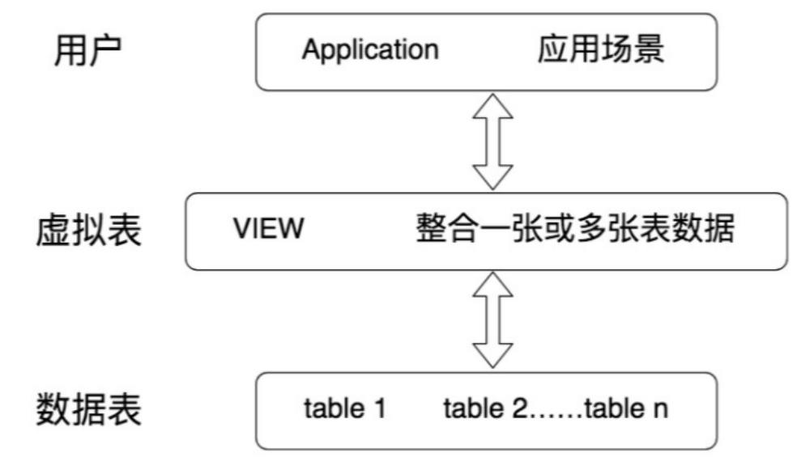

- 视图的创建和删除只影响视图本身，不影响对应的基表。但是当对视图中的数据进行增加、删除和 修改操作时，数据表中的数据会相应地发生变化，反之亦然。
- 向视图提供数据内容的语句为 SELECT 语句, 可以将视图理解为存储起来的SELECT 语句
  - 在数据库中，视图不会保存数据，数据真正保存在数据表中。当对视图中的数据进行增加、删 除和修改操作时，数据表中的数据会相应地发生变化；反之亦然。

- 视图，是向用户提供基表数据的另一种表现形式。通常情况下，小型项目的数据库可以不使用视 图，但是在大型项目中，以及数据表比较复杂的情况下，视图的价值就凸显出来了，它可以帮助我 们把经常查询的结果集放到虚拟表中，提升使用效率。理解和使用起来都非常方便。


### 3. 创建视图

- 在 CREATE VIEW 语句中嵌入子查询


```mysql
CREATE [OR REPLACE]
[ALGORITHM = {UNDEFINED | MERGE | TEMPTABLE}]
VIEW 视图名称 [(字段列表)]
AS 查询语句
[WITH [CASCADED|LOCAL] CHECK OPTION]
```

- 精简版


```mysql
CREATE VIEW 视图名称
AS 查询语句
```


举例：

```mysql
CREATE VIEW empvu80
AS
SELECT employee_id, last_name, salary
FROM employees
WHERE department_id = 80;
```

查询视图：

```mysql
SELECT *
FROM salvu80;
```


### 4. 查看视图

语法1：查看数据库的表对象、视图对象

```mysql
SHOW TABLES;
```

语法2：查看视图的结构

```mysql
DESC / DESCRIBE 视图名称;
```

语法3：查看视图的属性信息

```mysql
# 查看视图信息（显示数据表的存储引擎、版本、数据行数和数据大小等）
SHOW TABLE STATUS LIKE '视图名称';
# 执行结果显示，注释Comment为VIEW，说明该表为视图，其他的信息为NULL，说明这是一个虚表。
```

语法4：查看视图的详细定义信息

```mysql
SHOW CREATE VIEW 视图名称;
```


### 5. 更新视图的数据

#### 5.1 不可更新的视图

要使视图可更新，视图中的行和底层基本表中的行之间必须存在 一对一 的关系。另外当视图定义出现如 下情况时，视图不支持更新操作：

- 在定义视图的时候指定了“ALGORITHM = TEMPTABLE”，视图将不支持INSERT和DELETE操作；
- 视图中不包含基表中所有被定义为非空又未指定默认值的列，视图将不支持INSERT操作；
- 在定义视图的SELECT语句中使用了 JOIN联合查询 ，视图将不支持INSERT和DELETE操作；
- 在定义视图的SELECT语句后的字段列表中使用了 数学表达式 或 子查询 ，视图将不支持INSERT，也
- 不支持UPDATE使用了数学表达式、子查询的字段值；
- 在定义视图的SELECT语句后的字段列表中使用 DISTINCT 、 聚合函数 、 GROUP BY 、 HAVING 、
- UNION 等，视图将不支持INSERT、UPDATE、DELETE；
- 在定义视图的SELECT语句中包含了子查询，而子查询中引用了FROM后面的表，视图将不支持
- INSERT、UPDATE、DELETE；
- 视图定义基于一个 不可更新视图 ；
- 常量视图。

> 虽然可以更新视图数据，但总的来说，视图作为 虚拟表 ，主要用于 方便查询 ，不建议更新视图的 数据。对视图数据的更改，都是通过对实际数据表里数据的操作来完成的。
>


### 6. 修改、删除视图

#### 6.1 修改视图

方式1：使用CREATE OR REPLACE VIEW 子句修改视图

```mysql
CREATE OR REPLACE VIEW empvu80
(id_number, name, sal, department_id)
AS
SELECT employee_id, first_name || ' ' || last_name, salary, department_id
FROM employees
WHERE department_id = 80;
```

> 说明：CREATE VIEW 子句中各列的别名应和子查询中各列相对应。
>


方式2：ALTER VIEW

修改视图的语法是：

```mysql
ALTER VIEW 视图名称
AS
查询语句
```


#### 6.2 删除视图

- 删除视图只是删除视图的定义，并不会删除基表的数据。
- 删除视图的语法是：

```mysql
DROP VIEW IF EXISTS 视图名称;

DROP VIEW IF EXISTS 视图名称1,视图名称2,视图名称3,...;
```

- 举例：


```mysql
DROP VIEW empvu80;
```

- 说明：基于视图a、b创建了新的视图c，如果将视图a或者视图b删除，会导致视图c的查询失败。这 样的视图c需要手动删除或修改，否则影响使用。


### 7. 总结

#### 7.1 视图优点

1. **操作简单**：将经常使用的查询操作定义为视图，可以使开发人员不需要关心视图对应的数据表的结构、表与表之间 的关联关系，也不需要关心数据表之间的业务逻辑和查询条件，而只需要简单地操作视图即可，极大简 化了开发人员对数据库的操作。

2. **减少数据冗余**：视图跟实际数据表不一样，它存储的是查询语句。所以，在使用的时候，我们要通过定义视图的查询语 句来获取结果集。而视图本身不存储数据，不占用数据存储的资源，减少了数据冗余。

3. **数据安全**：MySQL将用户对数据的 访问限制 在某些数据的结果集上，而这些数据的结果集可以使用视图来实现。用 户不必直接查询或操作数据表。这也可以理解为视图具有 隔离性 。视图相当于在用户和实际的数据表之 间加了一层虚拟表。

   同时，MySQL可以根据权限将用户对数据的访问限制在某些视图上，用户不需要查询数据表，可以直接通过视图获取数据表中的信息。这在一定程度上保障了数据表中数据的安全性。

4. **适应灵活多变的需求**：当业务系统的需求发生变化后，如果需要改动数据表的结构，则工作量相对较 大，可以使用视图来减少改动的工作量。这种方式在实际工作中使用得比较多。

5. **能够分解复杂的查询逻辑**：数据库中如果存在复杂的查询逻辑，则可以将问题进行分解，创建多个视图 获取数据，再将创建的多个视图结合起来，完成复杂的查询逻辑。


#### 7.2 视图不足

如果我们在实际数据表的基础上创建了视图，那么，如果实际数据表的结构变更了，我们就需要及时对相关的视图进行相应的维护。特别是嵌套的视图（就是在视图的基础上创建视图），维护会变得比较复 杂， 可读性不好 ，容易变成系统的潜在隐患。因为创建视图的 SQL 查询可能会对字段重命名，也可能包 含复杂的逻辑，这些都会增加维护的成本。

实际项目中，如果视图过多，会导致数据库维护成本的问题。

所以，在创建视图的时候，你要结合实际项目需求，综合考虑视图的优点和不足，这样才能正确使用视 图，使系统整体达到最优。


## 二、存储过程与函数

MySQL从5.0版本开始支持存储过程和函数。存储过程和函数能够将复杂的SQL逻辑封装在一起，应用程 序无须关注存储过程和函数内部复杂的SQL逻辑，而只需要简单地调用存储过程和函数即可。


### 1. 存储过程概述

#### 1.1 理解

**含义**：存储过程的英文是 Stored Procedure 。它的思想很简单，就是一组经过 预先编译 的 SQL 语句 的封装。

**执行过程**：存储过程预先存储在 MySQL 服务器上，需要执行的时候，客户端只需要向服务器端发出调用 存储过程的命令，服务器端就可以把预先存储好的这一系列 SQL 语句全部执行。

**好处**：

1. 简化操作，提高了sql语句的重用性，减少了开发程序员的压力
2. 减少操作过程中的失误，提高效率
3. 减少网络传输量（客户端不需要把所有的 SQL 语句通过网络发给服务器）
4. 减少了 SQL 语句暴露在
5. 网上的风险，也提高了数据查询的安全性

**和视图、函数的对比**：

它和视图有着同样的优点，清晰、安全，还可以减少网络传输量。不过它和视图不同，视图是 虚拟表 ， 通常不对底层数据表直接操作，而存储过程是程序化的 SQL，可以 直接操作底层数据表 ，相比于面向集合的操作方式，能够实现一些更复杂的数据处理。

一旦存储过程被创建出来，使用它就像使用函数一样简单，我们直接通过调用存储过程名即可。相较于 函数，存储过程是 没有返回值 的。


#### 1.2 分类

存储过程的参数类型可以是IN、OUT和INOUT。根据这点分类如下：

1. 没有参数（无参数无返回）
2. 仅仅带 IN 类型（有参数无返回）
3. 仅仅带 OUT 类型（无参数有返回）
4. 既带 IN 又带 OUT（有参数有返回）
5. 带 INOUT（有参数有返回）

注意：IN、OUT、INOUT 都可以在一个存储过程中带多个。


### 2. 创建存储过程

#### 2.1 语法分析

语法：

```mysql
CREATE PROCEDURE 存储过程名(IN|OUT|INOUT 参数名 参数类型,...)
[characteristics ...]
BEGIN
	存储过程体
END
```

类似于Java中的方法：

```java
修饰符 返回类型 方法名(参数类型 参数名,...){
	方法体;
}
```

说明：

1. 参数前面的符号的意思
   - IN ：当前参数为输入参数，也就是表示入参；存储过程只是读取这个参数的值。如果没有定义参数种类， 默认就是 IN ，表示输入参数。
   - OUT ：当前参数为输出参数，也就是表示出参；执行完成之后，调用这个存储过程的客户端或者应用程序就可以读取这个参数返回的值了。
   - INOUT ：当前参数既可以为输入参数，也可以为输出参数。
2. 形参类型可以是 MySQL数据库中的任意类型。
3. characteristics 表示创建存储过程时指定的对存储过程的约束条件，其取值信息如下：

```mysql
LANGUAGE SQL
| [NOT] DETERMINISTIC
| { CONTAINS SQL | NO SQL | READS SQL DATA | MODIFIES SQL DATA }
| SQL SECURITY { DEFINER | INVOKER }
| COMMENT 'string'
```

- LANGUAGE SQL ：说明存储过程执行体是由SQL语句组成的，当前系统支持的语言为SQL。
- [NOT] DETERMINISTIC ：指明存储过程执行的结果是否确定。DETERMINISTIC表示结果是确定的。每次执行存储过程时，相同的输入会得到相同的输出。NOT DETERMINISTIC表示结果是不确定的，相同的输入可能得到不同的输出。如果没有指定任意一个值，默认为NOT DETERMINISTIC。
- { CONTAINS SQL | NO SQL | READS SQL DATA | MODIFIES SQL DATA } ：指明子程序使用SQL语句的限制。
  - CONTAINS SQL表示当前存储过程的子程序包含SQL语句，但是并不包含读写数据的SQL语句；
  - NO SQL表示当前存储过程的子程序中不包含任何SQL语句；
  - READS SQL DATA表示当前存储过程的子程序中包含读数据的SQL语句；
  - MODIFIES SQL DATA表示当前存储过程的子程序中包含写数据的SQL语句。
  - 默认情况下，系统会指定为CONTAINS SQL。
- SQL SECURITY { DEFINER | INVOKER } ：执行当前存储过程的权限，即指明哪些用户能够执行当前存储过程。
  - DEFINER 表示只有当前存储过程的创建者或者定义者才能执行当前存储过程；
  - INVOKER 表示拥有当前存储过程的访问权限的用户能够执行当前存储过程。\
  - 如果没有设置相关的值，则MySQL默认指定值为DEFINER。
- COMMENT 'string' ：注释信息，可以用来描述存储过程。


4. 存储过程体中可以有多条 SQL 语句，如果仅仅一条SQL 语句，则可以省略 BEGIN 和 END

编写存储过程并不是一件简单的事情，可能存储过程中需要复杂的 SQL 语句。

- BEGIN…END：BEGIN…END 中间包含了多个语句，每个语句都以（;）号为结束符。
- DECLARE：DECLARE 用来声明变量，使用的位置在于 BEGIN…END 语句中间，而且需要在其他语句使用之前进行变量的声明。
- SET：赋值语句，用于对变量进行赋值。
- SELECT… INTO：把从数据表中查询的结果存放到变量中，也就是为变量赋值。


5. 需要设置新的结束标记

```mysql
DELIMITER 新的结束标记
```

因为MySQL默认的语句结束符号为分号‘;’。为了避免与存储过程中SQL语句结束符相冲突，需要使用 DELIMITER改变存储过程的结束符。

比如：“DELIMITER //”语句的作用是将MySQL的结束符设置为//，并以“END //”结束存储过程。存储过程定 义完毕之后再使用“DELIMITER ;”恢复默认结束符。DELIMITER也可以指定其他符号作为结束符。

当使用DELIMITER命令时，应该避免使用反斜杠（‘\’）字符，因为反斜线是MySQL的转义字符。

示例：

```mysql
DELIMITER $

CREATE PROCEDURE 存储过程名(IN|OUT|INOUT 参数名 参数类型,...)
[characteristics ...]
BEGIN
    sql语句1;
    sql语句2;
    
END $
```


#### 2.2 代码举例

举例1：创建存储过程select_all_data()，查看 emps 表的所有数据

```mysql
DELIMITER $

CREATE PROCEDURE select_all_data()
BEGIN
	SELECT * FROM emps;

END $

DELIMITER ;
```


举例2：创建存储过程avg_employee_salary()，返回所有员工的平均工资

```mysql
DELIMITER //

CREATE PROCEDURE avg_employee_salary ()
BEGIN
	SELECT AVG(salary) AS avg_salary FROM emps;
END //

DELIMITER ;
```


举例3：创建存储过程show_max_salary()，用来查看“emps”表的最高薪资值。

```mysql
CREATE PROCEDURE show_max_salary()
    LANGUAGE SQL
    NOT DETERMINISTIC
    CONTAINS SQL
    SQL SECURITY DEFINER
    COMMENT '查看最高薪资'
    BEGIN
    	SELECT MAX(salary) FROM emps;
    END //
    
DELIMITER ;
```


举例4：创建存储过程show_min_salary()，查看“emps”表的最低薪资值。并将最低薪资通过OUT参数“ms” 输出

```mysql
DELIMITER //

CREATE PROCEDURE show_min_salary(OUT ms DOUBLE)
    BEGIN
    	SELECT MIN(salary) INTO ms FROM emps;
    END //
    
DELIMITER ;
```


举例5：创建存储过程show_someone_salary()，查看“emps”表的某个员工的薪资，并用IN参数empname 输入员工姓名。

```mysql
DELIMITER //

CREATE PROCEDURE show_someone_salary(IN empname VARCHAR(20))
    BEGIN
    	SELECT salary FROM emps WHERE ename = empname;
    END //
    
DELIMITER ;
```


举例6：创建存储过程show_someone_salary2()，查看“emps”表的某个员工的薪资，并用IN参数empname 输入员工姓名，用OUT参数empsalary输出员工薪资。

```mysql
DELIMITER //

CREATE PROCEDURE show_someone_salary2(IN empname VARCHAR(20),OUT empsalary DOUBLE)
    BEGIN
    	SELECT salary INTO empsalary FROM emps WHERE ename = empname;
    END //
DELIMITER ;
```


举例7：创建存储过程show_mgr_name()，查询某个员工领导的姓名，并用INOUT参数“empname”输入员 工姓名，输出领导的姓名。

```mysql
DELIMITER //

CREATE PROCEDURE show_mgr_name(INOUT empname VARCHAR(20))
    BEGIN
        SELECT ename INTO empname FROM emps
        WHERE eid = (SELECT MID FROM emps WHERE ename=empname);
    END //
    
DELIMITER ;

```


### 3. 调用存储过程

#### 3.1 调用格式

存储过程有多种调用方法。存储过程必须使用CALL语句调用，并且存储过程和数据库相关，如果要执行 其他数据库中的存储过程，需要指定数据库名称，例如CALL dbname.procname。

```mysql
CALL 存储过程名(实参列表)
```


格式： 

1. 调用in模式的参数：

   ```mysql
   CALL sp1('值');
   ```

2. 调用out模式的参数：

   ```mysql
   SET @name;
   CALL sp1(@name);
   SELECT @name;
   ```

3. 调用inout模式的参数：

   ```mysql
   SET @name=值;
   CALL sp1(@name);
   SELECT @name;
   ```

   

#### 3.2 代码举例

举例1：

```mysql
DELIMITER //

CREATE PROCEDURE CountProc(IN sid INT,OUT num INT)
BEGIN
    SELECT COUNT(*) INTO num FROM fruits
	WHERE s_id = sid;
END //

DELIMITER ;
```

调用存储过程：

```mysql
mysql> CALL CountProc (101, @num);
Query OK, 1 row affected (0.00 sec)
```

查看返回结果：

```mysql
mysql> SELECT @num;
```

该存储过程返回了指定 s_id=101 的水果商提供的水果种类，返回值存储在num变量中，使用SELECT查 看，返回结果为3。


举例2：创建存储过程，实现累加运算，计算 1+2+…+n 等于多少。具体的代码如下：

```mysql
DELIMITER //
CREATE PROCEDURE `add_num`(IN n INT)
    BEGIN
    DECLARE i INT;
    DECLARE sum INT;
    
    SET i = 1;
    SET sum = 0;
    WHILE i <= n DO
        SET sum = sum + i;
        SET i = i +1;
    END WHILE;
    SELECT sum;
END //
DELIMITER ;
```

如果你用的是 Navicat 工具，那么在编写存储过程的时候，Navicat 会自动设置 DELIMITER 为其他符号， 我们不需要再进行 DELIMITER 的操作。

直接使用 CALL add_num(50); 即可。这里我传入的参数为 50，也就是统计 1+2+…+50 的积累之和。


#### 3.3 如何调试

在 MySQL 中，存储过程不像普通的编程语言（比如 VC++、Java 等）那样有专门的集成开发环境。因 此，你可以通过 SELECT 语句，把程序执行的中间结果查询出来，来调试一个 SQL 语句的正确性。调试 成功之后，把 SELECT 语句后移到下一个 SQL 语句之后，再调试下一个 SQL 语句。这样 逐步推进 ，就可 以完成对存储过程中所有操作的调试了。当然，你也可以把存储过程中的 SQL 语句复制出来，逐段单独 调试。


### 4. 存储函数的使用

前面学习了很多函数，使用这些函数可以对数据进行的各种处理操作，极大地提高用户对数据库的管理 效率。MySQL支持自定义函数，定义好之后，调用方式与调用MySQL预定义的系统函数一样。


#### 4.1 语法分析

语法格式：

```mysql
CREATE FUNCTION 函数名(参数名 参数类型,...)
RETURNS 返回值类型
[characteristics ...]
BEGIN
	函数体 #函数体中肯定有 RETURN 语句

END
```

说明：

1. 参数列表：指定参数为IN、OUT或INOUT只对PROCEDURE是合法的，FUNCTION中总是默认为IN参数。

2. RETURNS type 语句表示函数返回数据的类型；

   RETURNS子句只能对FUNCTION做指定，对函数而言这是 强制 的。它用来指定函数的返回类型，而且函数体必须包含一个 RETURN value 语句。

3. characteristic 创建函数时指定的对函数的约束。取值与创建存储过程时相同，这里不再赘述。

4. 函数体也可以用BEGIN…END来表示SQL代码的开始和结束。如果函数体只有一条语句，也可以省略BEGIN…END。


#### 4.2 调用存储函数

在MySQL中，存储函数的使用方法与MySQL内部函数的使用方法是一样的。换言之，用户自己定义的存 储函数与MySQL内部函数是一个性质的。区别在于，存储函数是 用户自己定义 的，而内部函数是MySQL 的 开发者定义 的。

```mysql
SELECT 函数名(实参列表)
```


#### 4.3 代码举例

**举例1**：创建存储函数，名称为email_by_name()，参数定义为空，该函数查询Abel的email，并返回，数据类型为 字符串型。

```mysql
DELIMITER //

CREATE FUNCTION email_by_name()
RETURNS VARCHAR(25)
DETERMINISTIC
CONTAINS SQL
BEGIN
	RETURN (SELECT email FROM employees WHERE last_name = 'Abel');
END //

DELIMITER ;
```

**调用**：

```mysql
SELECT email_by_name();
```


**举例2**：创建存储函数，名称为email_by_id()，参数传入emp_id，该函数查询emp_id的email，并返回，数据类型 为字符串型。

```mysql
DELIMITER //

CREATE FUNCTION email_by_id(emp_id INT)
RETURNS VARCHAR(25)
DETERMINISTIC
CONTAINS SQL
BEGIN
	RETURN (SELECT email FROM employees WHERE employee_id = emp_id);
END //

DELIMITER ;
```

调用：

```mysql
SET @emp_id = 102;
SELECT email_by_id(102);
```


**举例3**： 创建存储函数count_by_id()，参数传入dept_id，该函数查询dept_id部门的员工人数，并返回，数据类型 为整型。

```mysql
DELIMITER //

CREATE FUNCTION count_by_id(dept_id INT)
RETURNS INT
    LANGUAGE SQL
    NOT DETERMINISTIC
    READS SQL DATA
    SQL SECURITY DEFINER
    COMMENT '查询部门平均工资'
BEGIN
	RETURN (SELECT COUNT(*) FROM employees WHERE department_id = dept_id);
	
END //

DELIMITER ;
```

调用：

```mysql
SET @dept_id = 50;
SELECT count_by_id(@dept_id);
```


**注意**：若在创建存储函数中报错“ you might want to use the less safe log_bin_trust_function_creators variable ”，有两种处理方法：

- 方式1：加上必要的函数特性“[NOT] DETERMINISTIC”和“{CONTAINS SQL | NO SQL | READS SQL DATA | MODIFIES SQL DATA}”

- 方式2：

  ```mysql
  mysql> SET GLOBAL log_bin_trust_function_creators = 1;
  ```

  

#### 4.4 对比存储函数和存储过程

|          | 关键字    | 调用语法        | 返回值            | 应用场景                         |
| -------- | --------- | --------------- | ----------------- | -------------------------------- |
| 存储过程 | PROCEDURE | CALL 存储过程() | 理解为有0个或多个 | 一般用于更新                     |
| 存储函数 | FUNCTION  | SELECT 函数()   | 只能是一个        | 一般用于查询结果为一个值并返回时 |

此外，存储函数可以放在查询语句中使用，存储过程不行。反之，存储过程的功能更加强大，包括能够执行对表的操作（比如创建表，删除表等）和事务操作，这些功能是存储函数不具备的。


### 5. 存储过程和函数的查看、修改、删除

#### 5.1 查看

创建完之后，怎么知道我们创建的存储过程、存储函数是否成功了呢？

MySQL存储了存储过程和函数的状态信息，用户可以使用SHOW STATUS语句或SHOW CREATE语句来查看，也可直接从系统的information_schema数据库中查询。这里介绍3种方法。


> 1. 使用SHOW CREATE语句查看存储过程和函数的创建信息

基本语法结构如下：

```mysql
SHOW CREATE {PROCEDURE | FUNCTION} 存储过程名或函数名
```

举例：

```mysql
SHOW CREATE FUNCTION test_db.CountProc \G
```


> 2. 使用SHOW STATUS语句查看存储过程和函数的状态信息

基本语法结构如下：

```mysql
SHOW {PROCEDURE | FUNCTION} STATUS [LIKE 'pattern']
```

这个语句返回子程序的特征，如数据库、名字、类型、创建者及创建和修改日期。

[LIKE 'pattern']：匹配存储过程或函数的名称，可以省略。当省略不写时，会列出MySQL数据库中存在的 所有存储过程或函数的信息。 举例：SHOW STATUS语句示例，代码如下：

```mysql
mysql> SHOW PROCEDURE STATUS LIKE 'SELECT%' \G
*************************** 1. row ***************************
                    Db: test_db
                  Name: SelectAllData
                  Type: PROCEDURE
               Definer: root@localhost
              Modified: 2021-10-16 15:55:07
               Created: 2021-10-16 15:55:07
         Security_type: DEFINER
               Comment:
  character_set_client: utf8mb4
  collation_connection: utf8mb4_general_ci
    Database Collation: utf8mb4_general_ci

1 row in set (0.00 sec)
```


> 3. 从information_schema.Routines表中查看存储过程和函数的信息

MySQL中存储过程和函数的信息存储在information_schema数据库下的Routines表中。可以通过查询该表 的记录来查询存储过程和函数的信息。其基本语法形式如下：

```mysql
SELECT * FROM information_schema.Routines
WHERE ROUTINE_NAME='存储过程或函数的名' [AND ROUTINE_TYPE = {'PROCEDURE|FUNCTION'}];
```

说明：如果在MySQL数据库中存在存储过程和函数名称相同的情况，最好指定ROUTINE_TYPE查询条件来 指明查询的是存储过程还是函数。

举例：从Routines表中查询名称为CountProc的存储函数的信息，代码如下：

```mysql
SELECT * FROM information_schema.Routines
WHERE ROUTINE_NAME='count_by_id' AND ROUTINE_TYPE = 'FUNCTION' \G
```


#### 5.2 修改

修改存储过程或函数，不影响存储过程或函数功能，只是修改相关特性。使用ALTER语句实现。

```mysql
ALTER {PROCEDURE | FUNCTION} 存储过程或函数的名 [characteristic ...]
```

其中，characteristic指定存储过程或函数的特性，其取值信息与创建存储过程、函数时的取值信息略有 不同。

```mysql
{ CONTAINS SQL | NO SQL | READS SQL DATA | MODIFIES SQL DATA }
| SQL SECURITY { DEFINER | INVOKER }
| COMMENT 'string'
```

- CONTAINS SQL ，表示子程序包含SQL语句，但不包含读或写数据的语句。
- NO SQL ，表示子程序中不包含SQL语句。
- READS SQL DATA ，表示子程序中包含读数据的语句。
- MODIFIES SQL DATA ，表示子程序中包含写数据的语句。
- SQL SECURITY { DEFINER | INVOKER } ，指明谁有权限来执行。
  - DEFINER ，表示只有定义者自己才能够执行。
  - INVOKER ，表示调用者可以执行。
- COMMENT 'string' ，表示注释信息。

> 修改存储过程使用ALTER PROCEDURE语句，修改存储函数使用ALTER FUNCTION语句。但是，这两 个语句的结构是一样的，语句中的所有参数也是一样的。


举例1：修改存储过程CountProc的定义。将读写权限改为MODIFIES SQL DATA，并指明调用者可以执行，代码如 下：

```mysql
ALTER PROCEDURE CountProc
MODIFIES SQL DATA
SQL SECURITY INVOKER ;
```

查询修改后的信息：

```mysql
SELECT specific_name,sql_data_access,security_type
FROM information_schema.`ROUTINES`
WHERE routine_name = 'CountProc' AND routine_type = 'PROCEDURE';
```

结果显示，存储过程修改成功。从查询的结果可以看出，访问数据的权限（SQL_DATA_ ACCESS）已经变 成MODIFIES SQL DATA，安全类型（SECURITY_TYPE）已经变成INVOKER。


举例2：修改存储函数CountProc的定义。将读写权限改为READS SQL DATA，并加上注释信息“FIND NAME”，代码 如下：

```mysql
ALTER FUNCTION CountProc
READS SQL DATA
COMMENT 'FIND NAME' ;
```

存储函数修改成功。从查询的结果可以看出，访问数据的权限（SQL_DATA_ACCESS）已经变成READS SQL DATA，函数注释（ROUTINE_COMMENT）已经变成FIND NAME。


#### 5.3 删除

删除存储过程和函数，可以使用DROP语句，其语法结构如下：

```mysql
DROP {PROCEDURE | FUNCTION} [IF EXISTS] 存储过程或函数的名
```

IF EXISTS：如果程序或函数不存储，它可以防止发生错误，产生一个用SHOW WARNINGS查看的警告。 

举例：

```mysql
DROP PROCEDURE CountProc;
```

```mysql
DROP FUNCTION CountProc;
```


### 6. 关于存储过程使用的争议

尽管存储过程有诸多优点，但是对于存储过程的使用，一直都存在着很多争议，比如有些公司对于大型 项目要求使用存储过程，而有些公司在手册中明确禁止使用存储过程，为什么这些公司对存储过程的使 用需求差别这么大呢？


#### 6.1 优点

1. 存储过程可以一次编译多次使用。存储过程只在创建时进行编译，之后的使用都不需要重新编译，这就提升了 SQL 的执行效率。
2. 可以减少开发工作量。将代码 封装 成模块，实际上是编程的核心思想之一，这样可以把复杂的问题拆解成不同的模块，然后模块之间可以 重复使用 ，在减少开发工作量的同时，还能保证代码的结构清晰。
3. 存储过程的安全性强。我们在设定存储过程的时候可以 设置对用户的使用权限 ，这样就和视图一样具有较强的安全性。
4. 可以减少网络传输量。因为代码封装到存储过程中，每次使用只需要调用存储过程即可，这样就减少了网络传输量。
5. 良好的封装性。在进行相对复杂的数据库操作时，原本需要使用一条一条的 SQL 语句，可能要连接多次数据库才能完成的操作，现在变成了一次存储过程，只需要 连接一次即可 。


#### 6.2 缺点

基于上面这些优点，不少大公司都要求大型项目使用存储过程，比如微软、IBM 等公司。但是国内的阿 里并不推荐开发人员使用存储过程，这是为什么呢？

> 阿里开发规范
>
> 【强制】禁止使用存储过程，存储过程难以调试和扩展，更没有移植性。

存储过程虽然有诸如上面的好处，但缺点也是很明显的。

1. **可移植性差**。存储过程不能跨数据库移植，比如在 MySQL、Oracle 和 SQL Server 里编写的存储过程，在换成其他数据库时都需要重新编写。
2. **调试困难**。只有少数 DBMS 支持存储过程的调试。对于复杂的存储过程来说，开发和维护都不容易。虽然也有一些第三方工具可以对存储过程进行调试，但要收费。
3. **存储过程的版本管理很困难**。比如数据表索引发生变化了，可能会导致存储过程失效。我们在开发软件的时候往往需要进行版本管理，但是存储过程本身没有版本控制，版本迭代更新的时候很麻烦。
4. **它不适合高并发的场景**。高并发的场景需要减少数据库的压力，有时数据库会采用分库分表的方式，而且对可扩展性要求很高，在这种情况下，存储过程会变得难以维护， 增加数据库的压力 ，显然就不适用了。


**小结**： 存储过程既方便，又有局限性。尽管不同的公司对存储过程的态度不一，但是对于我们开发人员来说， 不论怎样，掌握存储过程都是必备的技能之一。


## 三、变量-流程控制-游标

### 1. 变量

在MySQL数据库的存储过程和函数中，可以使用变量来存储查询或计算的中间结果数据，或者输出最终 的结果数据。

在 MySQL 数据库中，变量分为 系统变量 以及 用户自定义变量 。


#### 1.1 系统变量

##### 1.1.1 系统变量分类

变量由系统定义，不是用户定义，属于 服务器 层面。启动MySQL服务，生成MySQL服务实例期间， MySQL将为MySQL服务器内存中的系统变量赋值，这些系统变量定义了当前MySQL服务实例的属性、特 征。这些系统变量的值要么是 编译MySQL时参数 的默认值，要么是 配置文件 （例如my.ini等）中的参数 值。大家可以通过网址 https://dev.mysql.com/doc/refman/8.0/en/server-systemvariables.html 查看MySQL文档的系统变量。

系统变量分为全局系统变量（需要添加 global 关键字）以及会话系统变量（需要添加 session 关键 字），有时也把全局系统变量简称为全局变量，有时也把会话系统变量称为local变量。如果不写，默认 会话级别。静态变量（在 MySQL 服务实例运行期间它们的值不能使用 set 动态修改）属于特殊的全局系 统变量。

每一个MySQL客户机成功连接MySQL服务器后，都会产生与之对应的会话。会话期间，MySQL服务实例 会在MySQL服务器内存中生成与该会话对应的会话系统变量，这些会话系统变量的初始值是全局系统变 量值的复制。如下图：

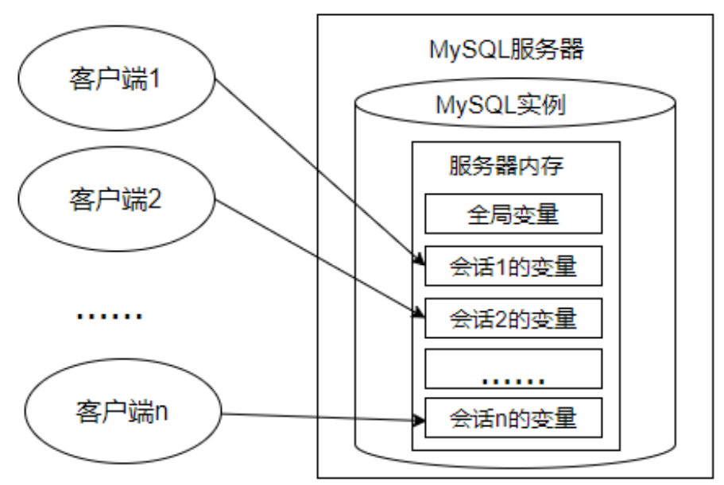

- 全局系统变量针对于所有会话（连接）有效，但 不能跨重启
- 会话系统变量仅针对于当前会话（连接）有效。会话期间，当前会话对某个会话系统变量值的修 改，不会影响其他会话同一个会话系统变量的值。
- 会话1对某个全局系统变量值的修改会导致会话2中同一个全局系统变量值的修改。

在MySQL中有些系统变量只能是全局的，例如 max_connections 用于限制服务器的最大连接数；有些系 统变量作用域既可以是全局又可以是会话，例如 character_set_client 用于设置客户端的字符集；有些系 统变量的作用域只能是当前会话，例如 pseudo_thread_id 用于标记当前会话的 MySQL 连接 ID。


##### 1.1.2 查看系统变量

- 查看所有或部分系统变量


```mysql
#查看所有全局变量
SHOW GLOBAL VARIABLES;

#查看所有会话变量
SHOW SESSION VARIABLES;
或
SHOW VARIABLES;
```

```mysql
#查看满足条件的部分系统变量。
SHOW GLOBAL VARIABLES LIKE '%标识符%';

#查看满足条件的部分会话变量
SHOW SESSION VARIABLES LIKE '%标识符%';
```

举例：

```mysql
SHOW GLOBAL VARIABLES LIKE 'admin_%';
```


- 查看指定系统变量


作为 MySQL 编码规范，MySQL 中的系统变量以 两个“@” 开头，其中“@@global”仅用于标记全局系统变 量，“@@session”仅用于标记会话系统变量。“@@”首先标记会话系统变量，如果会话系统变量不存在， 则标记全局系统变量。

```mysql
#查看指定的系统变量的值
SELECT @@global.变量名;

#查看指定的会话变量的值
SELECT @@session.变量名;
#或者
SELECT @@变量名;
```


- 修改系统变量的值


有些时候，数据库管理员需要修改系统变量的默认值，以便修改当前会话或者MySQL服务实例的属性、 特征。具体方法：

方式1：修改MySQL 配置文件 ，继而修改MySQL系统变量的值（该方法需要重启MySQL服务） 

方式2：在MySQL服务运行期间，使用“set”命令重新设置系统变量的值

```mysql
#为某个系统变量赋值
#方式1：
SET @@global.变量名=变量值;
#方式2：
SET GLOBAL 变量名=变量值;


#为某个会话变量赋值
#方式1：
SET @@session.变量名=变量值;
#方式2：
SET SESSION 变量名=变量值;
```


举例：

```mysql
SELECT @@global.autocommit;
SET GLOBAL autocommit=0;
```

```mysql
SELECT @@session.tx_isolation;
SET @@session.tx_isolation='read-uncommitted';
```

```mysql
SET GLOBAL max_connections = 1000;
SELECT @@global.max_connections;
```


#### 1.2 用户变量

##### 1.2.1 用户变量分类

用户变量是用户自己定义的，作为 MySQL 编码规范，MySQL 中的用户变量以 一个“@” 开头。根据作用 范围不同，又分为 会话用户变量 和 局部变量 。

- 会话用户变量：作用域和会话变量一样，只对当前连接会话有效。
- 局部变量：只在 BEGIN 和 END 语句块中有效。局部变量只能在存储过程和函数 中使用。


##### 1.2.2 会话用户变量

- 变量的定义

```mysql
#方式1：“=”或“:=”
SET @用户变量 = 值;
SET @用户变量 := 值;

#方式2：“:=” 或 INTO关键字
SELECT @用户变量 := 表达式 [FROM 等子句];
SELECT 表达式 INTO @用户变量 [FROM 等子句];
```


- 查看用户变量的值 （查看、比较、运算等）

```mysql
SELECT @用户变量
```

- 举例

```mysql
SET @a = 1;

SELECT @a;
```

```mysql
SELECT @num := COUNT(*) FROM employees;

SELECT @num;
```

```mysql
SELECT AVG(salary) INTO @avgsalary FROM employees;

SELECT @avgsalary
```

```mysql
SELECT @big; #查看某个未声明的变量时，将得到NULL值
```


##### 1.2.3 局部变量

定义：可以使用 DECLARE 语句定义一个局部变量

作用域：仅仅在定义它的 BEGIN ... END 中有效

位置：只能放在 BEGIN ... END 中，而且只能放在第一句

```mysql
BEGIN
    #声明局部变量
    DECLARE 变量名1 变量数据类型 [DEFAULT 变量默认值];
    DECLARE 变量名2,变量名3,... 变量数据类型 [DEFAULT 变量默认值];
    
    #为局部变量赋值
    SET 变量名1 = 值;
    SELECT 值 INTO 变量名2 [FROM 子句];
    
    #查看局部变量的值
    SELECT 变量1,变量2,变量3;
END
```

1. 定义变量

```mysql
DECLARE 变量名 类型 [default 值]; # 如果没有DEFAULT子句，初始值为NULL
```

举例：

```mysql
DECLARE myparam INT DEFAULT 100;
```


2. 变量赋值

方式1：一般用于赋简单的值

```mysql
SET 变量名=值;
SET 变量名:=值;
```

方式2：一般用于赋表中的字段值

```mysql
SELECT 字段名或表达式 INTO 变量名 FROM 表;
```


3. 使用变量（查看、比较、运算等）

```mysql
SELECT 局部变量名;
```

举例1：声明局部变量，并分别赋值为employees表中employee_id为102的last_name和salary

```mysql
DELIMITER //

CREATE PROCEDURE set_value()
BEGIN
    DECLARE emp_name VARCHAR(25);
    DECLARE sal DOUBLE(10,2);
    
    SELECT last_name,salary INTO emp_name,sal
    FROM employees
    WHERE employee_id = 102;
    
    SELECT emp_name,sal;
END //

DELIMITER ;
```

举例2：声明两个变量，求和并打印 （分别使用会话用户变量、局部变量的方式实现）

```mysql
#方式1：使用用户变量
SET @m=1;
SET @n=1;
SET @sum=@m+@n;

SELECT @sum;
```

```mysql
#方式2：使用局部变量
DELIMITER //

CREATE PROCEDURE add_value()
BEGIN
    #局部变量
    DECLARE m INT DEFAULT 1;
    DECLARE n INT DEFAULT 3;
    DECLARE SUM INT;
    
    SET SUM = m+n;
    SELECT SUM;
END //

DELIMITER ;
```

举例3：创建存储过程“different_salary”查询某员工和他领导的薪资差距，并用IN参数emp_id接收员工 id，用OUT参数dif_salary输出薪资差距结果。

```mysql
#声明
DELIMITER //

CREATE PROCEDURE different_salary(IN emp_id INT,OUT dif_salary DOUBLE)
BEGIN
#声明局部变量
    DECLARE emp_sal,mgr_sal DOUBLE DEFAULT 0.0;
    DECLARE mgr_id INT;

    SELECT salary INTO emp_sal FROM employees WHERE employee_id = emp_id;
    SELECT manager_id INTO mgr_id FROM employees WHERE employee_id = emp_id;
    SELECT salary INTO mgr_sal FROM employees WHERE employee_id = mgr_id;
    
    SET dif_salary = mgr_sal - emp_sal;
    
END //

DELIMITER ;

#调用
SET @emp_id = 102;
CALL different_salary(@emp_id,@diff_sal);

#查看
SELECT @diff_sal;
```


##### 1.2.4 对比会话用户变量与局部变量

|              | 作用域              | 定义位置            | 语法                     |
| ------------ | ------------------- | ------------------- | ------------------------ |
| 会话用户变量 | 当前会话            | 会话的任何地方      | 加@符号，不用指定类型    |
| 局部变量     | 定义它的BEGIN END中 | BEGIN END的第一句话 | 一般不用加@,需要指定类型 |


### 2. 定义条件与处理程序

定义条件 是事先定义程序执行过程中可能遇到的问题， 处理程序 定义了在遇到问题时应当采取的处理方式，并且保证存储过程或函数在遇到警告或错误时能继续执行。这样可以增强存储程序处理问题的能力，避免程序异常停止运行。

说明：定义条件和处理程序在存储过程、存储函数中都是支持的。


#### 2.1 案例分析

案例分析：创建一个名称为“UpdateDataNoCondition”的存储过程。代码如下：

```mysql
DELIMITER //

CREATE PROCEDURE UpdateDataNoCondition()
    BEGIN
        SET @x = 1;
        UPDATE employees SET email = NULL WHERE last_name = 'Abel';
        SET @x = 2;
        UPDATE employees SET email = 'aabbel' WHERE last_name = 'Abel';
        SET @x = 3;
    END //

DELIMITER ;
```

调用存储过程：

```mysql
mysql> CALL UpdateDataNoCondition();
ERROR 1048 (23000): Column 'email' cannot be null

mysql> SELECT @x;
+------+
| @x |
+------+
| 1 |
+------+
1 row in set (0.00 sec)
```

可以看到，此时@x变量的值为1。结合创建存储过程的SQL语句代码可以得出：在存储过程中未定义条件 和处理程序，且当存储过程中执行的SQL语句报错时，MySQL数据库会抛出错误，并退出当前SQL逻辑， 不再向下继续执行。


#### 2.2 定义条件

定义条件就是给MySQL中的错误码命名，这有助于存储的程序代码更清晰。它将一个 错误名字 和 指定的 错误条件 关联起来。这个名字可以随后被用在定义处理程序的 DECLARE HANDLER 语句中。

定义条件使用DECLARE语句，语法格式如下：

```mysql
DECLARE 错误名称 CONDITION FOR 错误码（或错误条件）
```

错误码的说明：

- MySQL_error_code 和 sqlstate_value 都可以表示MySQL的错误。
  - MySQL_error_code是数值类型错误代码。
  - sqlstate_value是长度为5的字符串类型错误代码。
- 例如，在ERROR 1418 (HY000)中，1418是MySQL_error_code，'HY000'是sqlstate_value。
- 例如，在ERROR 1142（42000）中，1142是MySQL_error_code，'42000'是sqlstate_value。


举例1：定义“Field_Not_Be_NULL”错误名与MySQL中违反非空约束的错误类型是“ERROR 1048 (23000)”对 应。

```mysql
#使用MySQL_error_code
DECLARE Field_Not_Be_NULL CONDITION FOR 1048;

#使用sqlstate_value
DECLARE Field_Not_Be_NULL CONDITION FOR SQLSTATE '23000';
```


举例2：定义"ERROR 1148(42000)"错误，名称为command_not_allowed。

```mysql
#使用MySQL_error_code
DECLARE command_not_allowed CONDITION FOR 1148;

#使用sqlstate_value
DECLARE command_not_allowed CONDITION FOR SQLSTATE '42000';
```


#### 2.3 定义处理程序

可以为SQL执行过程中发生的某种类型的错误定义特殊的处理程序。定义处理程序时，使用DECLARE语句 的语法如下：

```mysql
DECLARE 处理方式 HANDLER FOR 错误类型 处理语句
```

- 处理方式：处理方式有3个取值：CONTINUE、EXIT、UNDO。
  - CONTINUE ：表示遇到错误不处理，继续执行。
  - EXIT ：表示遇到错误马上退出。
  - UNDO ：表示遇到错误后撤回之前的操作。MySQL中暂时不支持这样的操作。
- 错误类型（即条件）可以有如下取值：
  - SQLSTATE '字符串错误码' ：表示长度为5的sqlstate_value类型的错误代码；
  - MySQL_error_code ：匹配数值类型错误代码；
  - 错误名称 ：表示DECLARE ... CONDITION定义的错误条件名称。
  - SQLWARNING ：匹配所有以01开头的SQLSTATE错误代码；
  - NOT FOUND ：匹配所有以02开头的SQLSTATE错误代码；
  - SQLEXCEPTION ：匹配所有没有被SQLWARNING或NOT FOUND捕获的SQLSTATE错误代码；
- 处理语句：如果出现上述条件之一，则采用对应的处理方式，并执行指定的处理语句。语句可以是像“ SET 变量 = 值 ”这样的简单语句，也可以是使用 BEGIN ... END 编写的复合语句。


定义处理程序的几种方式，代码如下：

```mysql
#方法1：捕获sqlstate_value
DECLARE CONTINUE HANDLER FOR SQLSTATE '42S02' SET @info = 'NO_SUCH_TABLE';

#方法2：捕获mysql_error_value
DECLARE CONTINUE HANDLER FOR 1146 SET @info = 'NO_SUCH_TABLE';

#方法3：先定义条件，再调用
DECLARE no_such_table CONDITION FOR 1146;
DECLARE CONTINUE HANDLER FOR NO_SUCH_TABLE SET @info = 'NO_SUCH_TABLE';

#方法4：使用SQLWARNING
DECLARE EXIT HANDLER FOR SQLWARNING SET @info = 'ERROR';

#方法5：使用NOT FOUND
DECLARE EXIT HANDLER FOR NOT FOUND SET @info = 'NO_SUCH_TABLE';

#方法6：使用SQLEXCEPTION
DECLARE EXIT HANDLER FOR SQLEXCEPTION SET @info = 'ERROR';
```


#### 2.4 案例解决

在存储过程中，定义处理程序，捕获sqlstate_value值，当遇到MySQL_error_code值为1048时，执行 CONTINUE操作，并且将@proc_value的值设置为-1。

```mysql
DELIMITER //

CREATE PROCEDURE UpdateDataNoCondition()
    BEGIN
        #定义处理程序
        DECLARE CONTINUE HANDLER FOR 1048 SET @proc_value = -1;
        
        SET @x = 1;
        UPDATE employees SET email = NULL WHERE last_name = 'Abel';
        SET @x = 2;
        UPDATE employees SET email = 'aabbel' WHERE last_name = 'Abel';
        SET @x = 3;
	END //
	
DELIMITER ;
```

调用过程：

```mysql
mysql> CALL UpdateDataWithCondition();
Query OK, 0 rows affected (0.01 sec)

mysql> SELECT @x,@proc_value;
+------+-------------+
| @x   | @proc_value |
+------+-------------+
|    3 |          -1 |
+------+-------------+
1 row in set (0.00 sec)
```

举例：

创建一个名称为“InsertDataWithCondition”的存储过程，代码如下。

在存储过程中，定义处理程序，捕获sqlstate_value值，当遇到sqlstate_value值为23000时，执行EXIT操 作，并且将@proc_value的值设置为-1。

```mysql
#准备工作
CREATE TABLE departments
AS
SELECT * FROM atguigudb.`departments`;

ALTER TABLE departments
ADD CONSTRAINT uk_dept_name UNIQUE(department_id);
```

```mysql
DELIMITER //

CREATE PROCEDURE InsertDataWithCondition()
    BEGIN
        DECLARE duplicate_entry CONDITION FOR SQLSTATE '23000' ;
        DECLARE EXIT HANDLER FOR duplicate_entry SET @proc_value = -1;
        
        SET @x = 1;
        INSERT INTO departments(department_name) VALUES('测试');
        SET @x = 2;
        INSERT INTO departments(department_name) VALUES('测试');
        SET @x = 3;
    END //

DELIMITER ;
```

调用存储过程：

```mysql
mysql> CALL InsertDataWithCondition();
Query OK, 0 rows affected (0.01 sec)

mysql> SELECT @x,@proc_value;
+------+-------------+
|   @x | @proc_value |
+------+-------------+
|    2 |          -1 |
+------+-------------+
1 row in set (0.00 sec)
```


### 3. 游标

#### 3.1 什么是游标（或光标）

虽然我们也可以通过筛选条件 WHERE 和 HAVING，或者是限定返回记录的关键字 LIMIT 返回一条记录， 但是，却无法在结果集中像指针一样，向前定位一条记录、向后定位一条记录，或者是 随意定位到某一 条记录 ，并对记录的数据进行处理。

这个时候，就可以用到游标。游标，提供了一种灵活的操作方式，让我们能够对结果集中的每一条记录 进行定位，并对指向的记录中的数据进行操作的数据结构。游标让 SQL 这种面向集合的语言有了面向过程开发的能力。

在 SQL 中，游标是一种临时的数据库对象，可以指向存储在数据库表中的数据行指针。这里游标 充当了 指针的作用 ，我们可以通过操作游标来对数据行进行操作。

MySQL中游标可以在存储过程和函数中使用。

比如，我们查询了 employees 数据表中工资高于15000的员工都有哪些：

```mysql
SELECT employee_id,last_name,salary FROM employees
WHERE salary > 15000;
```


这里我们就可以通过游标来操作数据行，如图所示此时游标所在的行是“108”的记录，我们也可以在结果 集上滚动游标，指向结果集中的任意一行。


#### 3.2 使用游标步骤

游标必须在声明处理程序之前被声明，并且变量和条件还必须在声明游标或处理程序之前被声明。

如果我们想要使用游标，一般需要经历四个步骤。不同的 DBMS 中，使用游标的语法可能略有不同。


**第一步，声明游标**

在MySQL中，使用DECLARE关键字来声明游标，其语法的基本形式如下：

```mysql
DECLARE cursor_name CURSOR FOR select_statement;
```

这个语法适用于 MySQL，SQL Server，DB2 和 MariaDB。如果是用 Oracle 或者 PostgreSQL，需要写成：

```mysql
DECLARE cursor_name CURSOR IS select_statement;
```

要使用 SELECT 语句来获取数据结果集，而此时还没有开始遍历数据，这里 select_statement 代表的是 SELECT 语句，返回一个用于创建游标的结果集。

比如：

```mysql
DECLARE cur_emp CURSOR FOR
SELECT employee_id,salary FROM employees;
```

```mysql
DECLARE cursor_fruit CURSOR FOR
SELECT f_name, f_price FROM fruits ;
```


**第二步，打开游标**

打开游标的语法如下：

```mysql
OPEN cursor_name
```

当我们定义好游标之后，如果想要使用游标，必须先打开游标。打开游标的时候 SELECT 语句的查询结 果集就会送到游标工作区，为后面游标的 逐条读取 结果集中的记录做准备。

```mysql
OPEN cur_emp ;
```


**第三步，使用游标（从游标中取得数据）**

语法如下：

```mysql
FETCH cursor_name INTO var_name [, var_name] ...
```

这句的作用是使用 cursor_name 这个游标来读取当前行，并且将数据保存到 var_name 这个变量中，游标指针指到下一行。如果游标读取的数据行有多个列名，则在 INTO 关键字后面赋值给多个变量名即可。

注意：var_name必须在声明游标之前就定义好。

```mysql
FETCH cur_emp INTO emp_id, emp_sal ;
```

注意：游标的查询结果集中的字段数，必须跟 INTO 后面的变量数一致，否则，在存储过程执行的时 候，MySQL 会提示错误。


**第四步，关闭游标**

```mysql
CLOSE cursor_name
```

有 OPEN 就会有 CLOSE，也就是打开和关闭游标。当我们使用完游标后需要关闭掉该游标。因为游标会 占用系统资源 ，如果不及时关闭，游标会一直保持到存储过程结束，影响系统运行的效率。而关闭游标 的操作，会释放游标占用的系统资源。

关闭游标之后，我们就不能再检索查询结果中的数据行，如果需要检索只能再次打开游标。

```mysql
CLOSE cur_emp;
```


#### 3.3 举例

创建存储过程“get_count_by_limit_total_salary()”，声明IN参数 limit_total_salary，DOUBLE类型；声明 OUT参数total_count，INT类型。函数的功能可以实现累加薪资最高的几个员工的薪资值，直到薪资总和 达到limit_total_salary参数的值，返回累加的人数给total_count。

```mysql
DELIMITER //

CREATE PROCEDURE get_count_by_limit_total_salary(IN limit_total_salary DOUBLE,OUT
total_count INT)

BEGIN
    DECLARE sum_salary DOUBLE DEFAULT 0; #记录累加的总工资
    DECLARE cursor_salary DOUBLE DEFAULT 0; #记录某一个工资值
    DECLARE emp_count INT DEFAULT 0; #记录循环个数
    
    #定义游标
    DECLARE emp_cursor CURSOR FOR SELECT salary FROM employees ORDER BY salary DESC;
    
    #打开游标
    OPEN emp_cursor;
    
    REPEAT
        #使用游标（从游标中获取数据）
        FETCH emp_cursor INTO cursor_salary;
        
        SET sum_salary = sum_salary + cursor_salary;
        SET emp_count = emp_count + 1;
        
        UNTIL sum_salary >= limit_total_salary
    END REPEAT;
    
    SET total_count = emp_count;
    #关闭游标
    CLOSE emp_cursor;
    
END //

DELIMITER ;
```


#### 3.4 小结

游标是 MySQL 的一个重要的功能，为 逐条读取 结果集中的数据，提供了完美的解决方案。跟在应用层 面实现相同的功能相比，游标可以在存储程序中使用，效率高，程序也更加简洁。

但同时也会带来一些性能问题，比如在使用游标的过程中，会对数据行进行 加锁 ，这样在业务并发量大 的时候，不仅会影响业务之间的效率，还会 消耗系统资源 ，造成内存不足，这是因为游标是在内存中进 行的处理。

建议：养成用完之后就关闭的习惯，这样才能提高系统的整体效率。


## 四、触发器

在实际开发中，我们经常会遇到这样的情况：有 2 个或者多个相互关联的表，如 商品信息 和 库存信息 分 别存放在 2 个不同的数据表中，我们在添加一条新商品记录的时候，为了保证数据的完整性，必须同时在库存表中添加一条库存记录。

这样一来，我们就必须把这两个关联的操作步骤写到程序里面，而且要用 事务 包裹起来，确保这两个操 作成为一个 原子操作 ，要么全部执行，要么全部不执行。要是遇到特殊情况，可能还需要对数据进行手 动维护，这样就很 容易忘记其中的一步 ，导致数据缺失。

这个时候，咱们可以使用触发器。你可以创建一个触发器，让商品信息数据的插入操作自动触发库存数据的插入操作。这样一来，就不用担心因为忘记添加库存数据而导致的数据缺失了。


### 1. 触发器概述

MySQL从 5.0.2 版本开始支持触发器。MySQL的触发器和存储过程一样，都是嵌入到MySQL服务器的一 段程序。

触发器是由 事件来触发 某个操作，这些事件包括 INSERT 、 UPDATE 、 DELETE 事件。所谓事件就是指 用户的动作或者触发某项行为。如果定义了触发程序，当数据库执行这些语句时候，就相当于事件发生 了，就会 自动 激发触发器执行相应的操作。

当对数据表中的数据执行插入、更新和删除操作，需要自动执行一些数据库逻辑时，可以使用触发器来 实现。


### 2. 触发器的创建

#### 2.1 创建触发器语法

创建触发器的语法结构是：

```mysql
CREATE TRIGGER 触发器名称
{BEFORE|AFTER} {INSERT|UPDATE|DELETE} ON 表名
FOR EACH ROW
触发器执行的语句块;
```

说明：

- 表名 ：表示触发器监控的对象。
- BEFORE | AFTER ：表示触发的时间。BEFORE 表示在事件之前触发；AFTER 表示在事件之后触发。
- INSERT | UPDATE|DELETE ：表示触发的事件。
  - INSERT 表示插入记录时触发；
  - UPDATE 表示更新记录时触发；
  - DELETE 表示删除记录时触发。
- 触发器执行的语句块 ：可以是单条SQL语句，也可以是由BEGIN…END结构组成的复合语句块。


#### 2.2 代码举例

举例1：

1. 创建数据表：

```mysql
CREATE TABLE test_trigger (
    id INT PRIMARY KEY AUTO_INCREMENT,
    t_note VARCHAR(30)
);

CREATE TABLE test_trigger_log (
    id INT PRIMARY KEY AUTO_INCREMENT,
    t_log VARCHAR(30)
);
```


2. 创建触发器：创建名称为before_insert的触发器，向test_trigger数据表插入数据之前，向 test_trigger_log数据表中插入before_insert的日志信息。

```mysql
DELIMITER //

CREATE TRIGGER before_insert
BEFORE INSERT ON test_trigger
FOR EACH ROW
BEGIN
    INSERT INTO test_trigger_log (t_log)
    VALUES('before_insert');

END //

DELIMITER ;
```

3. 向test_trigger数据表中插入数据

```mysql
INSERT INTO test_trigger (t_note) VALUES ('测试 BEFORE INSERT 触发器');
```

4. 查看test_trigger_log数据表中的数据

```mysql
mysql> SELECT * FROM test_trigger_log;
+----+---------------+
| id |         t_log |
+----+---------------+
|  1 | before_insert |
+----+---------------+
1 row in set (0.00 sec)
```


举例2：

1. 创建名称为after_insert的触发器，向test_trigger数据表插入数据之后，向test_trigger_log数据表中插 入after_insert的日志信息。

```mysql
DELIMITER //

CREATE TRIGGER after_insert
AFTER INSERT ON test_trigger
FOR EACH ROW
BEGIN
	INSERT INTO test_trigger_log (t_log)
	VALUES('after_insert');
END //

DELIMITER ;
```

2. 向test_trigger数据表中插入数据。

```mysql
INSERT INTO test_trigger (t_note) VALUES ('测试 AFTER INSERT 触发器');
```

3. 查看test_trigger_log数据表中的数据

```mysql
mysql> SELECT * FROM test_trigger_log;
+----+---------------+
| id |         t_log |
+----+---------------+
| 1  | before_insert |
| 2  | before_insert |
| 3  |  after_insert |
+----+---------------+
3 rows in set (0.00 sec)
```


举例3：定义触发器“salary_check_trigger”，基于员工表“employees”的INSERT事件，在INSERT之前检查 将要添加的新员工薪资是否大于他领导的薪资，如果大于领导薪资，则报sqlstate_value为'HY000'的错 误，从而使得添加失败。

```mysql
DELIMITER //

CREATE TRIGGER salary_check_trigger
BEFORE INSERT ON employees FOR EACH ROW
BEGIN
    DECLARE mgrsalary DOUBLE;
    SELECT salary INTO mgrsalary FROM employees WHERE employee_id = NEW.manager_id;
    
    IF NEW.salary > mgrsalary THEN
    	SIGNAL SQLSTATE 'HY000' SET MESSAGE_TEXT = '薪资高于领导薪资错误';
    END IF;
END //

DELIMITER ;
```

上面触发器声明过程中的NEW关键字代表INSERT添加语句的新记录。


### 3. 查看、删除触发器

#### 3.1 查看触发器

查看触发器是查看数据库中已经存在的触发器的定义、状态和语法信息等。

方式1：查看当前数据库的所有触发器的定义

```mysql
SHOW TRIGGERS\G
```

方式2：查看当前数据库中某个触发器的定义

```mysql
SHOW CREATE TRIGGER 触发器名
```

方式3：从系统库information_schema的TRIGGERS表中查询“salary_check_trigger”触发器的信息。

```mysql
SELECT * FROM information_schema.TRIGGERS;
```


#### 3.2 删除触发器

触发器也是数据库对象，删除触发器也用DROP语句，语法格式如下：

```mysql
DROP TRIGGER IF EXISTS 触发器名称;
```


### 4. 触发器的优缺点

#### 4.1 优点

1. 触发器可以确保数据的完整性。
2. 触发器可以帮助我们记录操作日志。
3. 触发器还可以用在操作数据前，对数据进行合法性检查。


#### 4.2 缺点

1. 触发器最大的一个问题就是可读性差。

因为触发器存储在数据库中，并且由事件驱动，这就意味着触发器有可能不受应用层的控制 。这对系统维护是非常有挑战的。

比如，创建触发器用于修改会员储值操作。如果触发器中的操作出了问题，会导致会员储值金额更新失败。我用下面的代码演示一下：

```mysql
mysql> update demo.membermaster set memberdeposit=20 where memberid = 2;
ERROR 1054 (42S22): Unknown column 'aa' in 'field list
```

结果显示，系统提示错误，字段“aa”不存在。

这是因为，触发器中的数据插入操作多了一个字段，系统提示错误。可是，如果你不了解这个触发器，很可能会认为是更新语句本身的问题，或者是会员信息表的结构出了问题。说不定你还会给会员信息表添加一个叫“aa”的字段，试图解决这个问题，结果只能是白费力。


2. 相关数据的变更，可能会导致触发器出错。

特别是数据表结构的变更，都可能会导致触发器出错，进而影响数据操作的正常运行。这些都会由于触 发器本身的隐蔽性，影响到应用中错误原因排查的效率。


#### 4.3 注意点

注意，如果在子表中定义了外键约束，并且外键指定了ON UPDATE/DELETE CASCADE/SET NULL子句，此 时修改父表被引用的键值或删除父表被引用的记录行时，也会引起子表的修改和删除操作，此时基于子表的UPDATE和DELETE语句定义的触发器并不会被激活。

例如：基于子表员工表（t_employee）的DELETE语句定义了触发器t1，而子表的部门编号（did）字段定 义了外键约束引用了父表部门表（t_department）的主键列部门编号（did），并且该外键加了“ON DELETE SET NULL”子句，那么如果此时删除父表部门表（t_department）在子表员工表（t_employee） 有匹配记录的部门记录时，会引起子表员工表（t_employee）匹配记录的部门编号（did）修改为NULL，但是此时不会激活触发器t1。只有直接对子表员工表（t_employee）执行DELETE语句时才会激活触发器 t1。


# MySQL高级篇

## 一、Linux下MySQL的使用

### 1. 字符集的相关操作

#### 1.1 修改MySQL5.7字符集

在MySQL 8.0版本之前，默认字符集为 latin1 ，utf8字符集指向的是 utf8mb3 。网站开发人员在数据库 设计的时候往往会将编码修改为utf8字符集。如果遗忘修改默认的编码，就会出现乱码的问题。从MySQL 8.0开始，数据库的默认编码将改为 utf8mb4 ，从而避免上述乱码的问题。


1. 查看默认使用的字符集

```mysql
show variables like 'character%';
# 或者
show variables like '%char%';
```


2. 修改字符集

```mysql
vim /etc/my.cnf
```

在MySQL5.7或之前的版本中，在文件最后加上中文字符集配置：

```mysql
character_set_server=utf8
```


3. 重新启动MySQL服务

```mysql
systemctl restart mysqld
```


> 注意：但是原有的数据如果是用非'utf8'编码的话，数据本身编码不会发生改变。已有数据需要导出或删除，然后重新插入。
>


#### 1.2 各级别的字符集

MySQL有4个级别的字符集和比较规则，分别是：

- 服务器级别
- 数据库级别
- 表级别
- 列级别

执行如下SQL语句：

```mysql
show variables like 'character%';
```

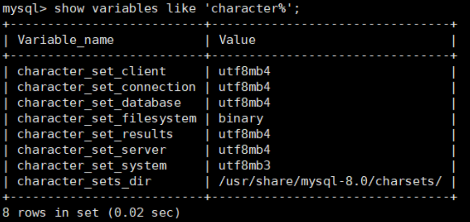

- character_set_server：服务器级别的字符集
- character_set_database：当前数据库的字符集
- character_set_client：服务器解码请求时使用的字符集
- character_set_connection：服务器处理请求时会把请求字符串从character_set_client转为character_set_connection
- character_set_results：服务器向客户端返回数据时使用的字符集


1. 服务器级别

- character_set_server ：服务器级别的字符集。


我们可以在启动服务器程序时通过启动选项或者在服务器程序运行过程中使用 SET 语句修改这两个变量的值。比如我们可以在配置文件中这样写：

```mysql
[server]
character_set_server=gbk # 默认字符集
collation_server=gbk_chinese_ci #对应的默认的比较规则
```

当服务器启动的时候读取这个配置文件后这两个系统变量的值便修改了。


2. 数据库级别

- character_set_database ：当前数据库的字符集


我们在创建和修改数据库的时候可以指定该数据库的字符集和比较规则，具体语法如下：

```mysql
CREATE DATABASE 数据库名
    [[DEFAULT] CHARACTER SET 字符集名称]
    [[DEFAULT] COLLATE 比较规则名称];

ALTER DATABASE 数据库名
    [[DEFAULT] CHARACTER SET 字符集名称]
    [[DEFAULT] COLLATE 比较规则名称];
```


3. 表级别

我们也可以在创建和修改表的时候指定表的字符集和比较规则，语法如下：

```mysql
CREATE TABLE 表名 (列的信息)
    [[DEFAULT] CHARACTER SET 字符集名称]
    [COLLATE 比较规则名称]]

ALTER TABLE 表名
    [[DEFAULT] CHARACTER SET 字符集名称]
    [COLLATE 比较规则名称]
```

如果创建和修改表的语句中没有指明字符集和比较规则，将使用该表所在数据库的字符集和比较规则作为该表的字符集和比较规则。


4. 列级别

对于存储字符串的列，同一个表中的不同的列也可以有不同的字符集和比较规则。我们在创建和修改列 定义的时候可以指定该列的字符集和比较规则，语法如下：

```mysql
CREATE TABLE 表名(
    列名 字符串类型 [CHARACTER SET 字符集名称] [COLLATE 比较规则名称],
    其他列...
);

ALTER TABLE 表名 MODIFY 列名 字符串类型 [CHARACTER SET 字符集名称] [COLLATE 比较规则名称];
```

对于某个列来说，如果在创建和修改的语句中没有指明字符集和比较规则，将使用该列所在表的字符集 和比较规则作为该列的字符集和比较规则。

> 提示
>
> 在转换列的字符集时需要注意，如果转换前列中存储的数据不能用转换后的字符集进行表示会发生 错误。比方说原先列使用的字符集是utf8，列中存储了一些汉字，现在把列的字符集转换为ascii的 话就会出错，因为ascii字符集并不能表示汉字字符。


5. 小结

我们介绍的这4个级别字符集和比较规则的联系如下：

- 如果 创建或修改列 时没有显式的指定字符集和比较规则，则该列 默认用表的 字符集和比较规则
- 如果 创建表时 没有显式的指定字符集和比较规则，则该表 默认用数据库的 字符集和比较规则
- 如果 创建数据库时 没有显式的指定字符集和比较规则，则该数据库 默认用服务器的 字符集和比较规则


#### 1.3 字符集与比较规则(了解)

1. utf8 与 utf8mb4

utf8 字符集表示一个字符需要使用1～4个字节，但是我们常用的一些字符使用1～3个字节就可以表示 了。而字符集表示一个字符所用的最大字节长度，在某些方面会影响系统的存储和性能，所以设计 MySQL的设计者偷偷的定义了两个概念：

- utf8mb3 ：阉割过的 utf8 字符集，只使用1～3个字节表示字符。
- utf8mb4 ：正宗的 utf8 字符集，使用1～4个字节表示字符。


2. 比较规则

上表中，MySQL版本一共支持41种字符集，其中的 Default collation 列表示这种字符集中一种默认 的比较规则，里面包含着该比较规则主要作用于哪种语言，比如 utf8_polish_ci 表示以波兰语的规则 比较， utf8_spanish_ci 是以西班牙语的规则比较， utf8_general_ci 是一种通用的比较规则。

后缀表示该比较规则是否区分语言中的重音、大小写。具体如下：

| 后缀 | 英文释义           | 描述             |
| ---- | ------------------ | ---------------- |
| _ai  | accent insensitive | 不区分重音       |
| _as  | accent sensitive   | 区分重音         |
| _ci  | case insensitive   | 不区分大小写     |
| _cs  | case sensitive     | 区分大小写       |
| _bin | binary             | 以二进制方式比较 |

最后一列 Maxlen ，它代表该种字符集表示一个字符最多需要几个字节。

**常用操作1：**

```mysql
#查看GBK字符集的比较规则
SHOW COLLATION LIKE 'gbk%';

#查看UTF-8字符集的比较规则
SHOW COLLATION LIKE 'utf8%';
```


**常用操作2：**

```mysql
#查看服务器的字符集和比较规则
SHOW VARIABLES LIKE '%_server';

#查看数据库的字符集和比较规则
SHOW VARIABLES LIKE '%_database';

#查看具体数据库的字符集
SHOW CREATE DATABASE dbtest1;

#修改具体数据库的字符集
ALTER DATABASE dbtest1 DEFAULT CHARACTER SET 'utf8' COLLATE 'utf8_general_ci';
```


**常用操作3：**

```mysql
#查看表的字符集
show create table employees;

#查看表的比较规则
show table status from atguigudb like 'employees';

#修改表的字符集和比较规则
ALTER TABLE emp1 DEFAULT CHARACTER SET 'utf8' COLLATE 'utf8_general_ci';
```


#### 1.4 请求到响应过程中字符集的变化

| 系统变量                 | 描述                                                         |
| ------------------------ | ------------------------------------------------------------ |
| character_set_client     | 服务器解码请求时使用的字符集                                 |
| character_set_connection | 服务器处理请求时会把请求字符串从 character_set_client 转为 character_set_connection |
| character_set_results    | 服务器向客户端返回数据时使用的字符集                         |

这几个系统变量在我的计算机上的默认值如下（不同操作系统的默认值可能不同）：

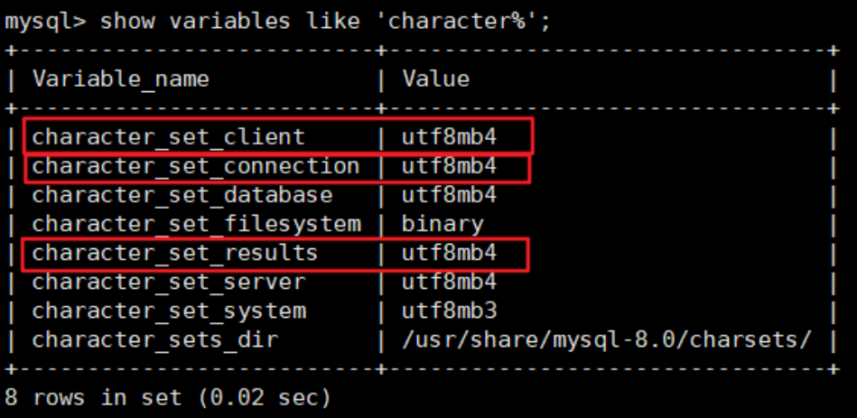

为了体现出字符集在请求处理过程中的变化，我们这里特意修改一个系统变量的值：

```mysql
mysql> set character_set_connection = gbk;
Query OK, 0 rows affected (0.00 sec)
```

现在假设我们客户端发送的请求是下边这个字符串：

```mysql
SELECT * FROM t WHERE s = '我';
```

为了方便大家理解这个过程，我们只分析字符 '我' 在这个过程中字符集的转换。

现在看一下在请求从发送到结果返回过程中字符集的变化：

1. 客户端发送请求所使用的字符集
   一般情况下客户端所使用的字符集和当前操作系统一致，不同操作系统使用的字符集可能不一 样，如下：

   - 类 Unix 系统使用的是 utf8 
   - Windows 使用的是 gbk

   当客户端使用的是 utf8 字符集，字符 '我' 在发送给服务器的请求中的字节形式就是： 0xE68891

> 如果你使用的是可视化工具，比如navicat之类的，这些工具可能会使用自定义的字符集来编 码发送到服务器的字符串，而不采用操作系统默认的字符集（所以在学习的时候还是尽量用 命令行窗口）。
>


2. 服务器接收到客户端发送来的请求其实是一串二进制的字节，它会认为这串字节采用的字符集是 character_set_client ，然后把这串字节转换为 character_set_connection 字符集编码的 字符。

   由于我的计算机上 character_set_client 的值是 utf8 ，首先会按照 utf8 字符集对字节串 0xE68891 进行解码，得到的字符串就是 '我' ，然后按照character_set_connection 代表的 字符集，也就是 gbk 进行编码，得到的结果就是字节串 0xCED2 。

3. 因为表 t 的列 col 采用的是 gbk 字符集，与 character_set_connection 一致，所以直接到列 中找字节值为 0xCED2 的记录，最后找到了一条记录。

> 如果某个列使用的字符集和character_set_connection代表的字符集不一致的话，还需要进行 一次字符集转换。
>


4. 上一步骤找到的记录中的 col 列其实是一个字节串 0xCED2 ， col 列是采用 gbk 进行编码的，所 以首先会将这个字节串使用 gbk 进行解码，得到字符串 '我' ，然后再把这个字符串使用 character_set_results 代表的字符集，也就是 utf8 进行编码，得到了新的字节串： 0xE68891 ，然后发送给客户端。

5. 由于客户端是用的字符集是 utf8 ，所以可以顺利的将 0xE68891 解释成字符 我 ，从而显示到我 们的显示器上，所以我们人类也读懂了返回的结果。


总结图示如下：

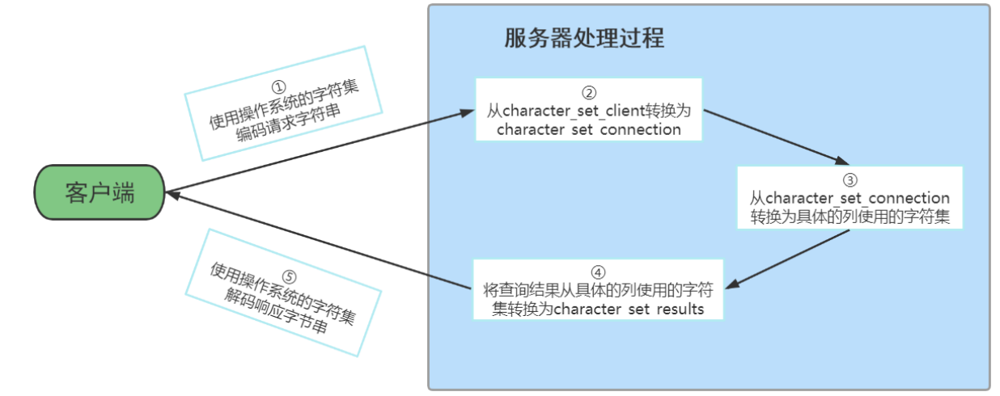


### 2. SQL大小写规范

#### 2.1 Windows和Linux平台区别

在 SQL 中，关键字和函数名是不用区分字母大小写的，比如 SELECT、WHERE、ORDER、GROUP BY 等关 键字，以及 ABS、MOD、ROUND、MAX 等函数名。

不过在 SQL 中，你还是要确定大小写的规范，因为在 Linux 和 Windows 环境下，你可能会遇到不同的大 小写问题。 windows系统默认大小写不敏感 ，但是 linux系统是大小写敏感的 。

通过如下命令查看：

```mysql
SHOW VARIABLES LIKE '%lower_case_table_names%'
```

- lower_case_table_names参数值的设置：
  - 默认为0，大小写敏感 。
  - 设置1，大小写不敏感。创建的表，数据库都是以小写形式存放在磁盘上，对于sql语句都是转换为小写对表和数据库进行查找。
  - 设置2，创建的表和数据库依据语句上格式存放，凡是查找都是转换为小写进行。


- 两个平台上SQL大小写的区别具体来说：

MySQL在Linux下数据库名、表名、列名、别名大小写规则是这样的：

1. 数据库名、表名、表的别名、变量名是严格区分大小写的；
2. 关键字、函数名称在 SQL 中不区分大小写；
3. 列名（或字段名）与列的别名（或字段别名）在所有的情况下均是忽略大小写的；


#### 2.2 Linux下大小写规则设置

当想设置为大小写不敏感时，要在 my.cnf 这个配置文件 [mysqld] 中加入lower_case_table_names=1 ，然后重启服务器。

- 但是要在重启数据库实例之前就需要将原来的数据库和表转换为小写，否则将找不到数据库名。
- 此参数适用于MySQL5.7。在MySQL 8下禁止在重新启动 MySQL 服务时将 lower_case_table_names 设置成不同于初始化 MySQL 服务时设置的 lower_case_table_names 值。如果非要将MySQL8设置为大小写不敏感，具体步骤为：
  1. 停止MySQL服务
  2. 删除数据目录，即删除 /var/lib/mysql 目录
  3. 在MySQL配置文件（ /etc/my.cnf ）中添加 lower_case_table_names=1
  4. 启动MySQL服务


#### 2.3 SQL编写建议

如果你的变量名命名规范没有统一，就可能产生错误。这里有一个有关命名规范的建议：

1. 关键字和函数名称全部大写；
2. 数据库名、表名、表别名、字段名、字段别名等全部小写；
3. SQL 语句必须以分号结尾。

数据库名、表名和字段名在 Linux MySQL 环境下是区分大小写的，因此建议你统一这些字段的命名规 则，比如全部采用小写的方式。

虽然关键字和函数名称在 SQL 中不区分大小写，也就是如果小写的话同样可以执行。但是同时将关键词 和函数名称全部大写，以便于区分数据库名、表名、字段名。


### 3. sql_mode的合理设置

#### 3.1 宽松模式 vs 严格模式

**宽松模式：**

如果设置的是宽松模式，那么我们在插入数据的时候，即便是给了一个错误的数据，也可能会被接受， 并且不报错。

举例 ：我在创建一个表时，该表中有一个字段为name，给name设置的字段类型时 char(10) ，如果我 在插入数据的时候，其中name这个字段对应的有一条数据的 长度超过了10 ，例如'1234567890abc'，超 过了设定的字段长度10，那么不会报错，并且取前10个字符存上，也就是说你这个数据被存为 了'1234567890'，而'abc'就没有了。但是，我们给的这条数据是错误的，因为超过了字段长度，但是并没 有报错，并且mysql自行处理并接受了，这就是宽松模式的效果。

应用场景 ：通过设置sql mode为宽松模式，来保证大多数sql符合标准的sql语法，这样应用在不同数据 库之间进行 迁移 时，则不需要对业务sql 进行较大的修改。


**严格模式：**

出现上面宽松模式的错误，应该报错才对，所以MySQL5.7版本就将sql_mode默认值改为了严格模式。所 以在 生产等环境 中，我们必须采用的是严格模式，进而 开发、测试环境 的数据库也必须要设置，这样在 开发测试阶段就可以发现问题。并且我们即便是用的MySQL5.6，也应该自行将其改为严格模式。

开发经验 ：MySQL等数据库总想把关于数据的所有操作都自己包揽下来，包括数据的校验，其实开发 中，我们应该在自己 开发的项目程序级别将这些校验给做了 ，虽然写项目的时候麻烦了一些步骤，但是这 样做之后，我们在进行数据库迁移或者在项目的迁移时，就会方便很多。

改为严格模式后可能会存在的问题：

若设置模式中包含了 NO_ZERO_DATE ，那么MySQL数据库不允许插入零日期，插入零日期会抛出错误而 不是警告。例如，表中含字段TIMESTAMP列（如果未声明为NULL或显示DEFAULT子句）将自动分配 DEFAULT '0000-00-00 00:00:00'（零时间戳），这显然是不满足sql_mode中的NO_ZERO_DATE而报错。


#### 3.2 模式查看和设置

- 查看当前的sql_mode


```mysql
select @@session.sql_mode

select @@global.sql_mode

#或者

show variables like 'sql_mode';
```

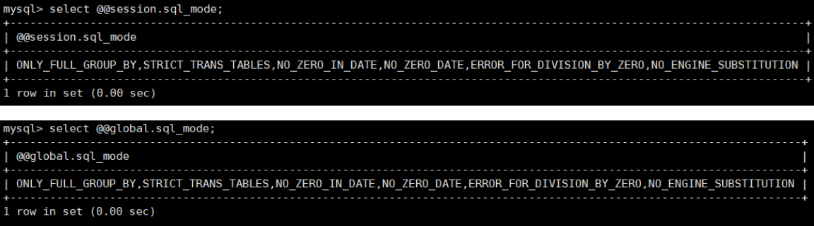


- 临时设置方式：设置当前窗口中设置sql_mode


```mysql
SET GLOBAL sql_mode = 'modes...'; #全局

SET SESSION sql_mode = 'modes...'; #当前会话
```


- 永久设置方式：在/etc/my.cnf中配置sql_mode


在my.cnf文件(windows系统是my.ini文件)，新增：

```mysql
sql_mode=ONLY_FULL_GROUP_BY,STRICT_TRANS_TABLES,NO_ZERO_IN_DATE,NO_ZERO_DATE,ERROR_FOR
_DIVISION_BY_ZERO,NO_ENGINE_SUBSTITUTION
```

然后 重启MySQL 。

当然生产环境上是禁止重启MySQL服务的，所以采用 临时设置方式 + 永久设置方式 来解决线上的问题， 那么即便是有一天真的重启了MySQL服务，也会永久生效了。


 

## 二、MySQL的数据目录

### 1. MySQL8的主要目录结构

```my
[root@atguigu01 ~]# find / -name mysql
```


#### 1.1 数据库文件的存放路径

MySQL数据库文件的存放路径：/var/lib/mysql/

```mysql
mysql> show variables like 'datadir';
+---------------+-----------------+
| Variable_name | Value           |
+---------------+-----------------+
| datadir       | /var/lib/mysql/ |
+---------------+-----------------+
1 row in set (0.04 sec)
```

从结果中可以看出，在我的计算机上MySQL的数据目录就是 /var/lib/mysql/ 。


#### 1.2 相关命令目录

相关命令目录：/usr/bin（mysqladmin、mysqlbinlog、mysqldump等命令）和/usr/sbin。


#### 1.3 配置文件目录

配置文件目录：/usr/share/mysql-8.0（命令及配置文件），/etc/mysql（如my.cnf）


### 2. 数据库和文件系统的关系

#### 2.1 查看默认数据库

查看一下在我的计算机上当前有哪些数据库：

```mysql
mysql> SHOW DATABASES;
```

可以看到有4个数据库是属于MySQL自带的系统数据库。

- mysql
  MySQL 系统自带的核心数据库，它存储了MySQL的用户账户和权限信息，一些存储过程、事件的定义信息，一些运行过程中产生的日志信息，一些帮助信息以及时区信息等。
- information_schema
  MySQL 系统自带的数据库，这个数据库保存着MySQL服务器 维护的所有其他数据库的信息 ，比如有哪些表、哪些视图、哪些触发器、哪些列、哪些索引。这些信息并不是真实的用户数据，而是一些描述性信息，有时候也称之为 元数据 。在系统数据库 information_schema 中提供了一些以 innodb_sys 开头的表，用于表示内部系统表。
- performance_schema 
  MySQL 系统自带的数据库，这个数据库里主要保存MySQL服务器运行过程中的一些状态信息，可以 用来 监控 MySQL 服务的各类性能指标 。包括统计最近执行了哪些语句，在执行过程的每个阶段都 花费了多长时间，内存的使用情况等信息。 
- sys
  MySQL 系统自带的数据库，这个数据库主要是通过 视图 的形式把 information_schema 和 performance_schema 结合起来，帮助系统管理员和开发人员监控 MySQL 的技术性能。


#### 2.2 表在文件系统中的表示

##### 2.2.1 InnoDB存储引擎模式

1. 表结构

为了保存表结构， InnoDB 在 数据目录 下对应的数据库子目录下创建了一个专门用于描述表结构的文件 ，文件名是这样：

```mysql
表名.frm
```

比方说我们在 atguigu 数据库下创建一个名为 test 的表：

```mysql
mysql> USE atguigu;
Database changed

mysql> CREATE TABLE test (
    -> 		c1 INT
    -> );
Query OK, 0 rows affected (0.03 sec)
```

那在数据库 atguigu 对应的子目录下就会创建一个名为 test.frm 的用于描述表结构的文件。.frm文件 的格式在不同的平台上都是相同的。这个后缀名为.frm是以 二进制格式 存储的，我们直接打开是乱码 的。


2. 表中数据和索引

① 系统表空间（system tablespace）

默认情况下，InnoDB会在数据目录下创建一个名为 ibdata1 、大小为 12M 的文件，这个文件就是对应 的 系统表空间 在文件系统上的表示。怎么才12M？注意这个文件是 自扩展文件 ，当不够用的时候它会自己增加文件大小。

当然，如果你想让系统表空间对应文件系统上多个实际文件，或者仅仅觉得原来的 ibdata1 这个文件名 难听，那可以在MySQL启动时配置对应的文件路径以及它们的大小，比如我们这样修改一下my.cnf 配置 文件：

```cnf
[server]
innodb_data_file_path=data1:512M;data2:512M:autoextend
```


② 独立表空间(file-per-table tablespace)

在MySQL5.6.6及之后的版本中，InnoDB并不会默认的把各个表的数据存储到系统表空间中，而是为 每 一个表建立一个独立表空间 ，也就是说我们创建了多少个表，就有多少个独立表空间。使用 独立表空间 来 存储表数据的话，会在该表所属数据库对应的子目录下创建一个表示该独立表空间的文件，文件名和表 名相同，只不过添加了一个 .ibd 的扩展名而已，所以完整的文件名称长这样：

```
表名.ibd
```

比如：我们使用了 独立表空间 去存储 atguigu 数据库下的 test 表的话，那么在该表所在数据库对应 的 atguigu 目录下会为 test 表创建这两个文件：

```
test.frm
test.ibd
```

其中 test.ibd 文件就用来存储 test 表中的数据和索引。


③ 系统表空间与独立表空间的设置

我们可以自己指定使用 系统表空间 还是 独立表空间 来存储数据，这个功能由启动参数 innodb_file_per_table 控制，比如说我们想刻意将表数据都存储到 系统表空间 时，可以在启动 MySQL服务器的时候这样配置：

```
[server]
innodb_file_per_table=0 # 0：代表使用系统表空间； 1：代表使用独立表空间
```

默认情况：

```mysql
mysql> show variables like 'innodb_file_per_table';
+-----------------------+-------+
| Variable_name 		| Value |
+-----------------------+-------+
| innodb_file_per_table | ON    |
+-----------------------+-------+
1 row in set (0.01 sec)
```


④ 其他类型的表空间

随着MySQL的发展，除了上述两种老牌表空间之外，现在还新提出了一些不同类型的表空间，比如通用 表空间（general tablespace）、临时表空间（temporary tablespace）等。


##### 2.2.2 MyISAM存储引擎模式

1. 表结构

在存储表结构方面， MyISAM 和 InnoDB 一样，也是在 数据目录 下对应的数据库子目录下创建了一个专 门用于描述表结构的文件：

```mysql
表名.frm
```


2. 表中数据和索引

在MyISAM中的索引全部都是 二级索引 ，该存储引擎的 数据和索引是分开存放 的。所以在文件系统中也是 使用不同的文件来存储数据文件和索引文件，同时表数据都存放在对应的数据库子目录下。假如 test 表使用MyISAM存储引擎的话，那么在它所在数据库对应的 atguigu 目录下会为 test 表创建这三个文 件：

```mysql
test.frm 存储表结构
test.MYD 存储数据 (MYData)
test.MYI 存储索引 (MYIndex)
```


#### 2.3 小结

举例： 数据库a ， 表b 。

1. 如果表b采用 InnoDB ，data\a中会产生1个或者2个文件：

- b.frm ：描述表结构文件，字段长度等 
- 如果采用 系统表空间 模式的，数据信息和索引信息都存储在 ibdata1 中 
- 如果采用 独立表空间 存储模式，data\a中还会产生 b.ibd 文件（存储数据信息和索引信息）

此外：

① MySQL5.7 中会在data/a的目录下生成 db.opt 文件用于保存数据库的相关配置。比如：字符集、比较 规则。而MySQL8.0不再提供db.opt文件。

② MySQL8.0中不再单独提供b.frm，而是合并在b.ibd文件中。


2. 如果表b采用 MyISAM ，data\a中会产生3个文件：

- MySQL5.7 中： b.frm ：描述表结构文件，字段长度等。
  MySQL8.0 中 b.xxx.sdi ：描述表结构文件，字段长度等
- b.MYD (MYData)：数据信息文件，存储数据信息(如果采用独立表存储模式)
- b.MYI (MYIndex)：存放索引信息文件


## 三、用户与权限管理

### 1. 用户管理

#### 1.1 登录MySQL服务器

启动MySQL服务后，可以通过mysql命令来登录MySQL服务器，命令如下：

```mysql
mysql –h hostname|hostIP –P port –u username –p DatabaseName –e "SQL语句"
```

下面详细介绍命令中的参数：

- -h参数 后面接主机名或者主机IP，hostname为主机，hostIP为主机IP。
- -P参数 后面接MySQL服务的端口，通过该参数连接到指定的端口。MySQL服务的默认端口是3306，不使用该参数时自动连接到3306端口，port为连接的端口号。
- -u参数 后面接用户名，username为用户名。
- -p参数 会提示输入密码。
- DatabaseName参数 指明登录到哪一个数据库中。如果没有该参数，就会直接登录到MySQL数据库中，然后可以使用USE命令来选择数据库。
- -e参数 后面可以直接加SQL语句。登录MySQL服务器以后即可执行这个SQL语句，然后退出MySQL服务器。

举例：

```mysql
mysql -uroot -p -hlocalhost -P3306 mysql -e "select host,user from user"
```


#### 1.2 创建用户

CREATE USER语句的基本语法形式如下：

```mysql
CREATE USER 用户名 [IDENTIFIED BY '密码'][,用户名 [IDENTIFIED BY '密码']];
```

- 用户名参数表示新建用户的账户，由 用户（User） 和 主机名（Host） 构成；
- “[ ]”表示可选，也就是说，可以指定用户登录时需要密码验证，也可以不指定密码验证，这样用户可以直接登录。不过，不指定密码的方式不安全，不推荐使用。如果指定密码值，这里需要使用IDENTIFIED BY指定明文密码值。
- CREATE USER语句可以同时创建多个用户。

举例：

```mysql
CREATE USER zhang3 IDENTIFIED BY '123123'; # 默认host是 %
```

```mysql
CREATE USER 'kangshifu'@'localhost' IDENTIFIED BY '123456';
```


#### 1.3 修改用户

修改用户名：

```mysql
UPDATE mysql.user SET USER='li4' WHERE USER='wang5';

FLUSH PRIVILEGES;
```


#### 1.4 删除用户

**使用DROP方式删除（推荐）**

使用DROP USER语句来删除用户时，必须用于DROP USER权限。DROP USER语句的基本语法形式如下：

```mysql
DROP USER user[,user]…;
```

举例：

```mysql
DROP USER li4 ; # 默认删除host为%的用户
```

```mysql
DROP USER 'kangshifu'@'localhost';
```

> 注意：不推荐通过 DELETE FROM USER u WHERE USER='li4' 进行删除，系统会有残留信息保 留。而drop user命令会删除用户以及对应的权限，执行命令后你会发现mysql.user表和mysql.db表 的相应记录都消失了。


#### 1.5 设置当前用户密码

这里介绍 推荐的写法 ：

1. 使用ALTER USER命令来修改当前用户密码 用户可以使用ALTER命令来修改自身密码，如下语句代表修 改当前登录用户的密码。基本语法如下：

```mysql
ALTER USER USER() IDENTIFIED BY 'new_password';
```

2. 使用SET语句来修改当前用户密码 使用root用户登录MySQL后，可以使用SET语句来修改密码，具体 SQL语句如下：

```mysql
SET PASSWORD='new_password';
```

该语句会自动将密码加密后再赋给当前用户。


#### 1.6 修改其它用户密码

1. 使用ALTER语句来修改普通用户的密码 可以使用ALTER USER语句来修改普通用户的密码。基本语法形 式如下：

```mysql
ALTER USER user [IDENTIFIED BY '新密码']
[,user[IDENTIFIED BY '新密码']]…;
```

2. 使用SET命令来修改普通用户的密码 使用root用户登录到MySQL服务器后，可以使用SET语句来修改普 通用户的密码。SET语句的代码如下：

```mysql
SET PASSWORD FOR 'username'@'hostname'='new_password';
```

3. 使用UPDATE语句修改普通用户的密码（不推荐）

```mysql
UPDATE MySQL.user SET authentication_string=PASSWORD("123456")
WHERE User = "username" AND Host = "hostname";
```


### 2. 权限管理

#### 2.1 权限列表

MySQL到底都有哪些权限呢？

```mysql
mysql> show privileges;
```

1. CREATE和DROP权限 ，可以创建新的数据库和表，或删除（移掉）已有的数据库和表。如果将MySQL数据库中的DROP权限授予某用户，用户就可以删除MySQL访问权限保存的数据库。
2. SELECT、INSERT、UPDATE和DELETE权限 允许在一个数据库现有的表上实施操作。
3. SELECT权限只有在它们真正从一个表中检索行时才被用到。
4. INDEX权限 允许创建或删除索引，INDEX适用于已有的表。如果具有某个表的CREATE权限，就可以在CREATE TABLE语句中包括索引定义。
5. ALTER权限 可以使用ALTER TABLE来更改表的结构和重新命名表。
6. CREATE ROUTINE权限 用来创建保存的程序（函数和程序），ALTER ROUTINE权限用来更改和删除保存的程序， EXECUTE权限 用来执行保存的程序。
7. GRANT权限 允许授权给其他用户，可用于数据库、表和保存的程序。
8. FILE权限 使用户可以使用LOAD DATA INFILE和SELECT ... INTO OUTFILE语句读或写服务器上的文件，任何被授予FILE权限的用户都能读或写MySQL服务器上的任何文件（说明用户可以读任何数据库目录下的文件，因为服务器可以访问这些文件）。


#### 2.2 授予权限的原则

权限控制主要是出于安全因素，因此需要遵循以下几个 经验原则 ：

1. 只授予能 满足需要的最小权限 ，防止用户干坏事。比如用户只是需要查询，那就只给select权限就可以了，不要给用户赋予update、insert或者delete权限。
2. 创建用户的时候 限制用户的登录主机 ，一般是限制成指定IP或者内网IP段。
3. 为每个用户 设置满足密码复杂度的密码 。
4. 定期清理不需要的用户 ，回收权限或者删除用户。


#### 2.3 授予权限

给用户授权的方式有 2 种，分别是通过把 角色赋予用户给用户授权 和 直接给用户授权 。用户是数据库的 使用者，我们可以通过给用户授予访问数据库中资源的权限，来控制使用者对数据库的访问，消除安全 隐患。

授权命令：

```mysql
GRANT 权限1,权限2,…权限n ON 数据库名称.表名称 TO 用户名@用户地址 [IDENTIFIED BY ‘密码口令’];
```

- 该权限如果发现没有该用户，则会直接新建一个用户。


比如：

- 给li4用户用本地命令行方式，授予atguigudb这个库下的所有表的插删改查的权限。


```mysql
GRANT SELECT,INSERT,DELETE,UPDATE ON atguigudb.* TO li4@localhost ;
```

- 授予通过网络方式登录的joe用户 ，对所有库所有表的全部权限，密码设为123。注意这里唯独不包括grant的权限

```mysql
GRANT ALL PRIVILEGES ON *.* TO joe@'%' IDENTIFIED BY '123';
```

> 我们在开发应用的时候，经常会遇到一种需求，就是要根据用户的不同，对数据进行横向和纵向的 分组。
>
> - 所谓横向的分组，就是指用户可以接触到的数据的范围，比如可以看到哪些表的数据；
> - 所谓纵向的分组，就是指用户对接触到的数据能访问到什么程度，比如能看、能改，甚至是删除。


#### 2.4 查看权限

- 查看当前用户权限


```mysql
SHOW GRANTS;
# 或
SHOW GRANTS FOR CURRENT_USER;
# 或
SHOW GRANTS FOR CURRENT_USER();
```

- 查看某用户的全局权限


```mysql
SHOW GRANTS FOR 'user'@'主机地址' ;
```


#### 2.5 收回权限

收回权限就是取消已经赋予用户的某些权限。收回用户不必要的权限可以在一定程度上保证系统的安全 性。MySQL中使用 REVOKE语句 取消用户的某些权限。使用REVOKE收回权限之后，用户账户的记录将从 db、host、tables_priv和columns_priv表中删除，但是用户账户记录仍然在user表中保存（删除user表中 的账户记录使用DROP USER语句）。

注意：在将用户账户从user表删除之前，应该收回相应用户的所有权限。

- 收回权限命令


```mysql
REVOKE 权限1,权限2,…权限n ON 数据库名称.表名称 FROM 用户名@用户地址;
```

- 举例


```mysql
#收回全库全表的所有权限
REVOKE ALL PRIVILEGES ON *.* FROM joe@'%';

#收回mysql库下的所有表的插删改查权限
REVOKE SELECT,INSERT,UPDATE,DELETE ON mysql.* FROM joe@localhost;
```

- 注意： 须用户重新登录后才能生效


### 3. 权限表

#### 3.1 user表

user表是MySQL中最重要的一个权限表， 记录用户账号和权限信息 ，有49个字段。

这些字段可以分成4类，分别是范围列（或用户列）、权限列、安全列和资源控制列。

1. 范围列（或用户列）

- host ： 表示连接类型
  - %：表示所有远程通过 TCP方式的连接
  - IP地址：如 (192.168.1.2、127.0.0.1) 通过制定ip地址进行的TCP方式的连接
  - 机器名：通过制定网络中的机器名进行的TCP方式的连接
  - ::1：IPv6的本地ip地址，等同于IPv4的 127.0.0.1
  - localhost：本地方式通过命令行方式的连接 ，比如mysql -u xxx -p xxx 方式的连接。
- user ： 表示用户名，同一用户通过不同方式链接的权限是不一样的。
- password ： 密码
  - 所有密码串通过 password(明文字符串) 生成的密文字符串。MySQL 8.0 在用户管理方面增加了角色管理，默认的密码加密方式也做了调整，由之前的 SHA1 改为了 SHA2 ，不可逆 。同时加上 MySQL 5.7 的禁用用户和用户过期的功能，MySQL 在用户管理方面的功能和安全性都较之前版本大大的增强了。
  - mysql 5.7 及之后版本的密码保存到 authentication_string 字段中不再使用password 字段。


2. 权限列

- Grant_priv字段
  - 表示是否拥有GRANT权限
- Shutdown_priv字段
  - 表示是否拥有停止MySQL服务的权限
- Super_priv字段
  - 表示是否拥有超级权限
- Execute_priv字段
  - 表示是否拥有EXECUTE权限。拥有EXECUTE权限，可以执行存储过程和函数。
- Select_priv , Insert_priv等
  - 为该用户所拥有的权限。


3. 安全列：安全列只有6个字段，其中两个是ssl相关的（ssl_type、ssl_cipher），用于 加密 ；两个是x509 相关的（x509_issuer、x509_subject），用于 标识用户 ；另外两个Plugin字段用于 验证用户身份 的插件， 该字段不能为空。如果该字段为空，服务器就使用内建授权验证机制验证用户身份。


4. 资源控制列 资源控制列的字段用来 限制用户使用的资源 ，包含4个字段，分别为：

①max_questions，用户每小时允许执行的查询操作次数；
②max_updates，用户每小时允许执行的更新 操作次数；
③max_connections，用户每小时允许执行的连接操作次数； ④max_user_connections，用户 允许同时建立的连接次数。


查看字段：

```mysql
DESC mysql.user;
```

查看用户, 以列的方式显示数据：

```mysql
SELECT * FROM mysql.user \G;
```

查询特定字段：

```mysql
SELECT host,user,authentication_string,select_priv,insert_priv,drop_priv
FROM mysql.user;
```


#### 3.2 db表

在MySQL中，DB文件是存储数据库数据、结构和相关信息的文件。每个数据库都会对应一个文件夹，文件夹内包含数据库表的数据文件以及索引文件。

通常情况下，数据文件有以下几种格式：

- .frm文件：存储表的结构信息。
- .ibd文件：存储InnoDB存储引擎表的数据。
- .MYD文件：存储MyISAM表的数据。
- .MYI文件：存储MyISAM表的索引信息。

这些文件组成了数据库的核心，确保数据的持久性与完整性。

使用DESCRIBE查看db表的基本结构：

```mysql
DESCRIBE mysql.db;
```

1. 用户列：db表用户列有3个字段，分别是Host、User、Db。这3个字段分别表示主机名、用户名和数据库 名。表示从某个主机连接某个用户对某个数据库的操作权限，这3个字段的组合构成了db表的主键。
2. 权限列：Create_routine_priv和Alter_routine_priv这两个字段决定用户是否具有创建和修改存储过程的权限。


#### 3.3 tables_priv表和columns_priv表

tables_priv表用来 对表设置操作权限 ，columns_priv表用来对表的 某一列设置权限 。tables_priv表和 columns_priv表的结构分别如图：

```mysql
desc mysql.tables_priv;
```

tables_priv表有8个字段，分别是Host、Db、User、Table_name、Grantor、Timestamp、Table_priv和 Column_priv，各个字段说明如下：

- Host 、 Db 、 User 和 Table_name 四个字段分别表示主机名、数据库名、用户名和表名。
- Grantor表示修改该记录的用户。
- Timestamp表示修改该记录的时间。
- Table_priv 表示对象的操作权限。包括Select、Insert、Update、Delete、Create、Drop、Grant、References、Index和Alter。
- Column_priv字段表示对表中的列的操作权限，包括Select、Insert、Update和References。

```mysql
desc mysql.columns_priv;
```


#### 3.4 procs_priv表

procs_priv表可以对 存储过程和存储函数设置操作权限 ，表结构如图：

```mysql
desc mysql.procs_priv;
```

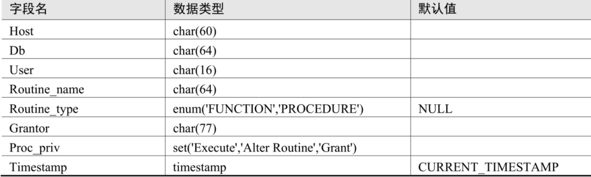


### 4. 访问控制(了解)

#### 4.1 连接核实阶段

当用户试图连接MySQL服务器时，服务器基于用户的身份以及用户是否能提供正确的密码验证身份来确 定接受或者拒绝连接。即客户端用户会在连接请求中提供用户名、主机地址、用户密码，MySQL服务器 接收到用户请求后，会使用user表中的host、user和authentication_string这3个字段匹配客户端提供信 息。

服务器只有在user表记录的Host和User字段匹配客户端主机名和用户名，并且提供正确的密码时才接受 连接。如果连接核实没有通过，服务器就完全拒绝访问；否则，服务器接受连接，然后进入阶段2等待 用户请求。


#### 4.2 请求核实阶段

一旦建立了连接，服务器就进入了访问控制的阶段2，也就是请求核实阶段。对此连接上进来的每个请 求，服务器检查该请求要执行什么操作、是否有足够的权限来执行它，这正是需要授权表中的权限列发 挥作用的地方。这些权限可以来自user、db、table_priv和column_priv表。

确认权限时，MySQL首先 检查user表 ，如果指定的权限没有在user表中被授予，那么MySQL就会继续 检 查db表 ，db表是下一安全层级，其中的权限限定于数据库层级，在该层级的SELECT权限允许用户查看指 定数据库的所有表中的数据；如果在该层级没有找到限定的权限，则MySQL继续 检查tables_priv表 以 及 columns_priv表 ，如果所有权限表都检查完毕，但还是没有找到允许的权限操作，MySQL将 返回错 误信息 ，用户请求的操作不能执行，操作失败。

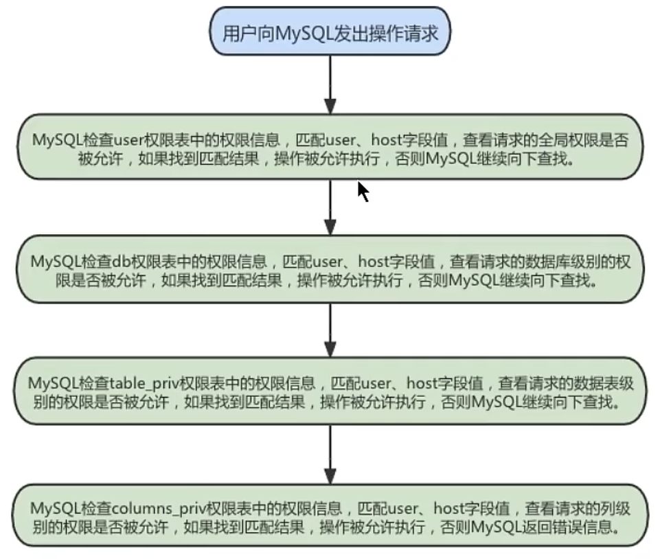

> 提示： MySQL通过向下层级的顺序（从user表到columns_priv表）检查权限表，但并不是所有的权 限都要执行该过程。例如，一个用户登录到MySQL服务器之后只执行对MySQL的管理操作，此时只 涉及管理权限，因此MySQL只检查user表。另外，如果请求的权限操作不被允许，MySQL也不会继 续检查下一层级的表。


### 5. 角色管理

#### 5.1 角色的理解

引入角色的目的是 方便管理拥有相同权限的用户 。恰当的权限设定，可以确保数据的安全性，这是至关 重要的。


#### 5.2 创建角色

创建角色使用 CREATE ROLE 语句，语法如下：

```mysql
CREATE ROLE 'role_name'[@'host_name'] [,'role_name'[@'host_name']]...
```

角色名称的命名规则和用户名类似。如果 host_name省略，默认为% ， role_name不可省略 ，不可为 空。

练习：我们现在需要创建一个经理的角色，就可以用下面的代码：

```mysql
CREATE ROLE 'manager'@'localhost';
```


#### 5.3 给角色赋予权限

创建角色之后，默认这个角色是没有任何权限的，我们需要给角色授权。给角色授权的语法结构是：

```mysql
GRANT privileges ON table_name TO 'role_name'[@'host_name'];
```

上述语句中privileges代表权限的名称，多个权限以逗号隔开。可使用SHOW语句查询权限名称，图11-43 列出了部分权限列表。

```mysql
SHOW PRIVILEGES\G;
```

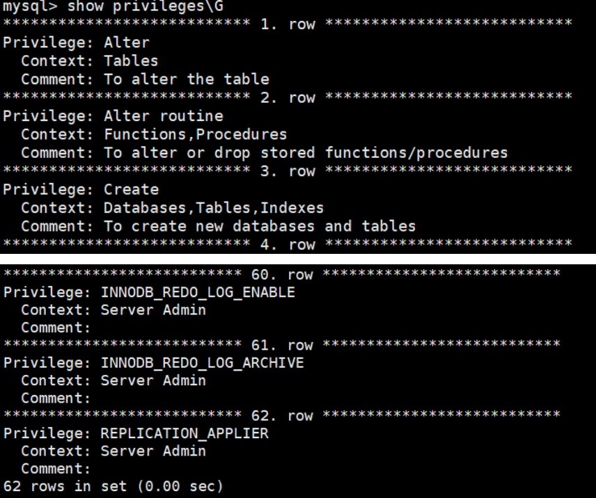

练习1：我们现在想给经理角色授予商品信息表、盘点表和应付账款表的只读权限，就可以用下面的代码 来实现：

```mysql
GRANT SELECT ON demo.settlement TO 'manager';

GRANT SELECT ON demo.goodsmaster TO 'manager';

GRANT SELECT ON demo.invcount TO 'manager';
```


#### 5.4 查看角色的权限

赋予角色权限之后，我们可以通过 SHOW GRANTS 语句，来查看权限是否创建成功了：

```mysql
mysql> SHOW GRANTS FOR 'manager';
+-------------------------------------------------------+
| Grants for manager@% 									|
+-------------------------------------------------------+
| GRANT USAGE ON *.* TO `manager`@`%` 					|
| GRANT SELECT ON `demo`.`goodsmaster` TO `manager`@`%` |
| GRANT SELECT ON `demo`.`invcount` TO `manager`@`%` 	|
| GRANT SELECT ON `demo`.`settlement` TO `manager`@`%`  |
+-------------------------------------------------------+
```

只要你创建了一个角色，系统就会自动给你一个“ USAGE ”权限，意思是 连接登录数据库的权限 。代码的 最后三行代表了我们给角色“manager”赋予的权限，也就是对商品信息表、盘点表和应付账款表的只读权 限。

结果显示，库管角色拥有商品信息表的只读权限和盘点表的增删改查权限。


#### 5.5 回收角色的权限

角色授权后，可以对角色的权限进行维护，对权限进行添加或撤销。添加权限使用GRANT语句，与角色 授权相同。撤销角色或角色权限使用REVOKE语句。

修改了角色的权限，会影响拥有该角色的账户的权限。

撤销角色权限的SQL语法如下：

```mysql
REVOKE privileges ON tablename FROM 'rolename';
```

练习1：撤销school_write角色的权限。

（1）使用如下语句撤销school_write角色的权限。

```mysql
REVOKE INSERT, UPDATE, DELETE ON school.* FROM 'school_write';
```

（2）撤销后使用SHOW语句查看school_write对应的权限，语句如下。

```mysql
SHOW GRANTS FOR 'school_write';
```


#### 5.6 删除角色

当我们需要对业务重新整合的时候，可能就需要对之前创建的角色进行清理，删除一些不会再使用的角 色。删除角色的操作很简单，你只要掌握语法结构就行了。

```mysql
DROP ROLE role [,role2]...
```

注意， 如果你删除了角色，那么用户也就失去了通过这个角色所获得的所有权限 。

练习：执行如下SQL删除角色school_read。

```mysql
DROP ROLE 'school_read';
```


#### 5.7 给用户赋予角色

角色创建并授权后，要赋给用户并处于 激活状态 才能发挥作用。给用户添加角色可使用GRANT语句，语 法形式如下：

```mysql
GRANT role [,role2,...] TO user [,user2,...];
```

在上述语句中，role代表角色，user代表用户。可将多个角色同时赋予多个用户，用逗号隔开即可。

练习：给kangshifu用户添加角色school_read权限。

（1）使用GRANT语句给kangshifu添加school_read权 限，SQL语句如下。

```mysql
GRANT 'school_read' TO 'kangshifu'@'localhost';
```

（2）添加完成后使用SHOW语句查看是否添加成功，SQL语句如下。

```mysql
SHOW GRANTS FOR 'kangshifu'@'localhost';
```

（3）使用kangshifu用户登录，然后查询当前角色，如果角色未激活，结果将显示NONE。SQL语句如 下。

```mysql
SELECT CURRENT_ROLE();
```

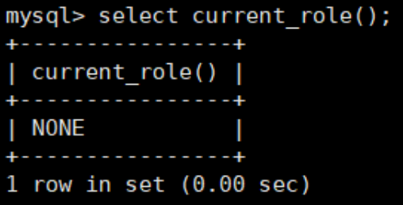


#### 5.8 激活角色

**方式1：使用set default role 命令激活角色**

举例：

```mysql
SET DEFAULT ROLE ALL TO 'kangshifu'@'localhost';
```

举例：使用 SET DEFAULT ROLE 为下面4个用户默认激活所有已拥有的角色如下：

```mysql
SET DEFAULT ROLE ALL TO
'dev1'@'localhost',
'read_user1'@'localhost',
'read_user2'@'localhost',
'rw_user1'@'localhost';
```


方式2：将activate_all_roles_on_login设置为ON

- 默认情况：

```mysql
mysql> show variables like 'activate_all_roles_on_login';
+-----------------------------+-------+
| Variable_name 			  | Value |
+-----------------------------+-------+
| activate_all_roles_on_login | OFF   |
+-----------------------------+-------+
1 row in set (0.00 sec)
```

- 设置：

```mysql
SET GLOBAL activate_all_roles_on_login=ON;
```

这条 SQL 语句的意思是，对 所有角色永久激活 。运行这条语句之后，用户才真正拥有了赋予角色的所有 权限。


#### 5.9 撤销用户的角色

撤销用户角色的SQL语法如下：

```mysql
REVOKE role FROM user;
```

练习：撤销kangshifu用户的school_read角色。

（1）撤销的SQL语句如下

```mysql
REVOKE 'school_read' FROM 'kangshifu'@'localhost';
```

（2）撤销后，执行如下查询语句，查看kangshifu用户的角色信息

```mysql
SHOW GRANTS FOR 'kangshifu'@'localhost';
```

执行发现，用户kangshifu之前的school_read角色已被撤销。


#### 5.10 设置强制角色(mandatory role)

方式1：服务启动前设置

```mysql
[mysqld]
mandatory_roles='role1,role2@localhost,r3@%.atguigu.com'
```

方式2：运行时设置

```mysql
SET PERSIST mandatory_roles = 'role1,role2@localhost,r3@%.example.com'; #系统重启后仍然
有效

SET GLOBAL mandatory_roles = 'role1,role2@localhost,r3@%.example.com'; #系统重启后失效
```


## 四、逻辑架构

### 1. 逻辑架构剖析

#### 1.1 服务器处理客户端请求

那服务器进程对客户端进程发送的请求做了什么处理，才能产生最后的处理结果呢？这里以查询请求为 例展示：

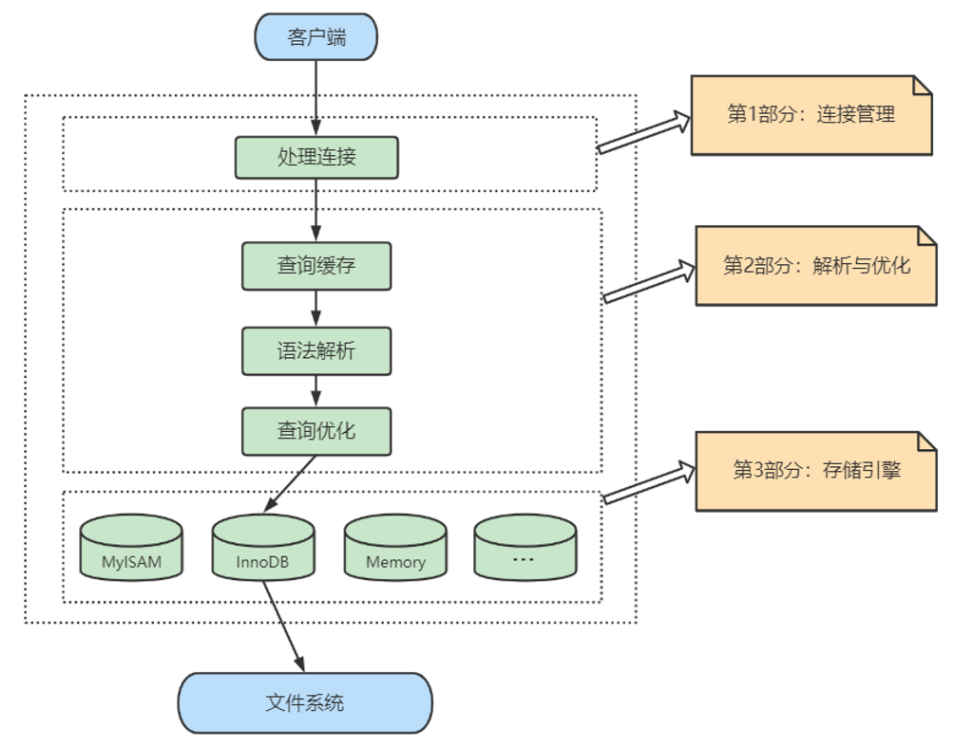

下面具体展开看一下：

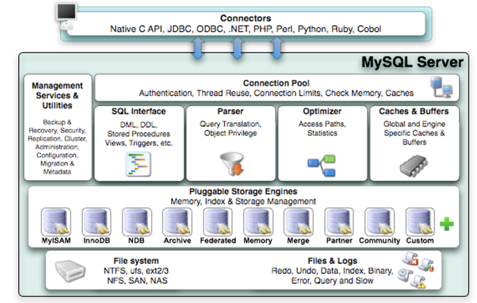


#### 1.2 第1层：连接层

系统（客户端）访问 MySQL 服务器前，做的第一件事就是建立 TCP 连接。

经过三次握手建立连接成功后， MySQL 服务器对 TCP 传输过来的账号密码做身份认证、权限获取。

- 用户名或密码不对，会收到一个Access denied for user错误，客户端程序结束执行
- 用户名密码认证通过，会从权限表查出账号拥有的权限与连接关联，之后的权限判断逻辑，都将依赖于此时读到的权限

TCP 连接收到请求后，必须要分配给一个线程专门与这个客户端的交互。所以还会有个线程池，去走后 面的流程。每一个连接从线程池中获取线程，省去了创建和销毁线程的开销。


#### 1.3 第2层：服务层

- SQL Interface: SQL接口

  - 接收用户的SQL命令，并且返回用户需要查询的结果。比如SELECT ... FROM就是调用SQL Interface
  - MySQL支持DML（数据操作语言）、DDL（数据定义语言）、存储过程、视图、触发器、自定义函数等多种SQL语言接口

- Parser: 解析器

  - 在解析器中对 SQL 语句进行语法分析、语义分析。将SQL语句分解成数据结构，并将这个结构传递到后续步骤，以后SQL语句的传递和处理就是基于这个结构的。如果在分解构成中遇到错误，那么就说明这个SQL语句是不合理的。
  - 在SQL命令传递到解析器的时候会被解析器验证和解析，并为其创建 语法树 ，并根据数据字典丰富查询语法树，会 验证该客户端是否具有执行该查询的权限 。创建好语法树后，MySQL还会对SQl查询进行语法上的优化，进行查询重写。

- Optimizer: 查询优化器

  - SQL语句在语法解析之后、查询之前会使用查询优化器确定 SQL 语句的执行路径，生成一个 执行计划 。

  - 这个执行计划表明应该 使用哪些索引 进行查询（全表检索还是使用索引检索），表之间的连 接顺序如何，最后会按照执行计划中的步骤调用存储引擎提供的方法来真正的执行查询，并将 查询结果返回给用户。

  - 它使用“ 选取-投影-连接 ”策略进行查询。例如：

    ```mysql
    SELECT id,name FROM student WHERE gender = '女';
    ```

    这个SELECT查询先根据WHERE语句进行 选取 ，而不是将表全部查询出来以后再进行gender过 滤。 这个SELECT查询先根据id和name进行属性 投影 ，而不是将属性全部取出以后再进行过 滤，将这两个查询条件 连接 起来生成最终查询结果。

- Caches & Buffers： 查询缓存组件

  - MySQL内部维持着一些Cache和Buffer，比如Query Cache用来缓存一条SELECT语句的执行结 果，如果能够在其中找到对应的查询结果，那么就不必再进行查询解析、优化和执行的整个过 程了，直接将结果反馈给客户端。
  - 这个缓存机制是由一系列小缓存组成的。比如表缓存，记录缓存，key缓存，权限缓存等。
  - 这个查询缓存可以在 不同客户端之间共享。
  - 从MySQL 5.7.20开始，不推荐使用查询缓存，并在 MySQL 8.0中删除 。


#### 1.4 第3层：引擎层

插件式存储引擎层（ Storage Engines），真正的负责了MySQL中数据的存储和提取，对物理服务器级别 维护的底层数据执行操作，服务器通过API与存储引擎进行通信。不同的存储引擎具有的功能不同，这样 我们可以根据自己的实际需要进行选取。

MySQL 8.0.25默认支持的存储引擎如下：

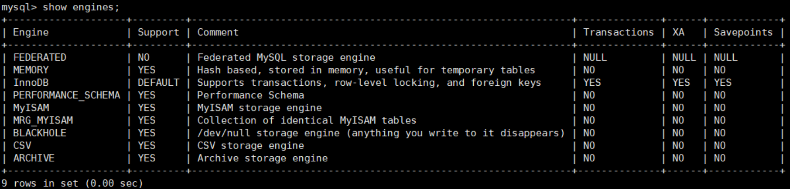


#### 1.5 存储层

所有的数据，数据库、表的定义，表的每一行的内容，索引，都是存在 文件系统 上，以 文件 的方式存 在的，并完成与存储引擎的交互。当然有些存储引擎比如InnoDB，也支持不使用文件系统直接管理裸设 备，但现代文件系统的实现使得这样做没有必要了。在文件系统之下，可以使用本地磁盘，可以使用 DAS、NAS、SAN等各种存储系统。


#### 1.6 小结

MySQL架构图本节开篇所示。下面为了熟悉SQL执行流程方便，我们可以简化如下：

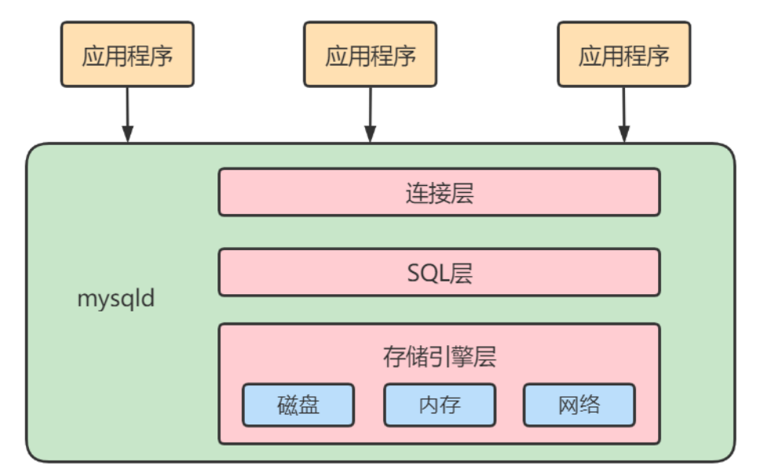

简化为三层结构：

1. 连接层：客户端和服务器端建立连接，客户端发送 SQL 至服务器端；
2. SQL 层（服务层）：对 SQL 语句进行查询处理；与数据库文件的存储方式无关；
3. 存储引擎层：与数据库文件打交道，负责数据的存储和读取。


### 2. SQL执行流程

#### 2.1 MySQL 中的 SQL执行流程

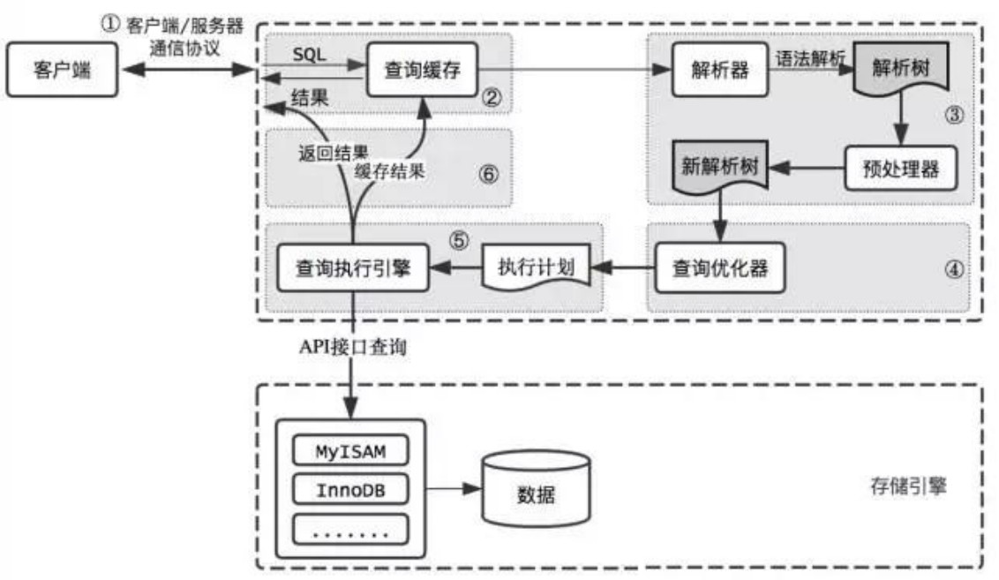


MySQL的查询流程：

1. 查询缓存：Server 如果在查询缓存中发现了这条 SQL 语句，就会直接将结果返回给客户端；如果没 有，就进入到解析器阶段。需要说明的是，因为查询缓存往往效率不高，所以在 MySQL8.0 之后就抛弃了这个功能。

大多数情况查询缓存就是个鸡肋，为什么呢？

```mysql
SELECT employee_id,last_name FROM employees WHERE employee_id = 101;
```

查询缓存是提前把查询结果缓存起来，这样下次不需要执行就可以直接拿到结果。需要说明的是，在 MySQL 中的查询缓存，不是缓存查询计划，而是查询对应的结果。这就意味着查询匹配的 鲁棒性大大降 低 ，只有 相同的查询操作才会命中查询缓存 。两个查询请求在任何字符上的不同（例如：空格、注释、 大小写），都会导致缓存不会命中。因此 MySQL 的 查询缓存命中率不高 。

同时，如果查询请求中包含某些系统函数、用户自定义变量和函数、一些系统表，如 mysql 、 information_schema、 performance_schema 数据库中的表，那这个请求就不会被缓存。以某些系统函数 举例，可能同样的函数的两次调用会产生不一样的结果，比如函数 NOW ，每次调用都会产生最新的当前 时间，如果在一个查询请求中调用了这个函数，那即使查询请求的文本信息都一样，那不同时间的两次 查询也应该得到不同的结果，如果在第一次查询时就缓存了，那第二次查询的时候直接使用第一次查询 的结果就是错误的！

此外，既然是缓存，那就有它 缓存失效的时候 。MySQL的缓存系统会监测涉及到的每张表，只要该表的 结构或者数据被修改，如对该表使用了 INSERT 、 UPDATE 、 DELETE 、 TRUNCATE TABLE 、 ALTER TABLE 、 DROP TABLE 或 DROP DATABASE 语句，那使用该表的所有高速缓存查询都将变为无效并从高 速缓存中删除！对于 更新压力大的数据库 来说，查询缓存的命中率会非常低。


2. 解析器：在解析器中对 SQL 语句进行语法分析、语义分析。

分析器先做“ 词法分析 ”。你输入的是由多个字符串和空格组成的一条 SQL 语句，MySQL 需要识别出里面 的字符串分别是什么，代表什么。 MySQL 从你输入的"select"这个关键字识别出来，这是一个查询语 句。它也要把字符串“T”识别成“表名 T”，把字符串“ID”识别成“列 ID”。

接着，要做“ 语法分析 ”。根据词法分析的结果，语法分析器（比如：Bison）会根据语法规则，判断你输 入的这个 SQL 语句是否 满足 MySQL 语法 。

select department_id,job_id,avg(salary) from employees group by department_id;

如果SQL语句正确，则会生成一个这样的语法树：

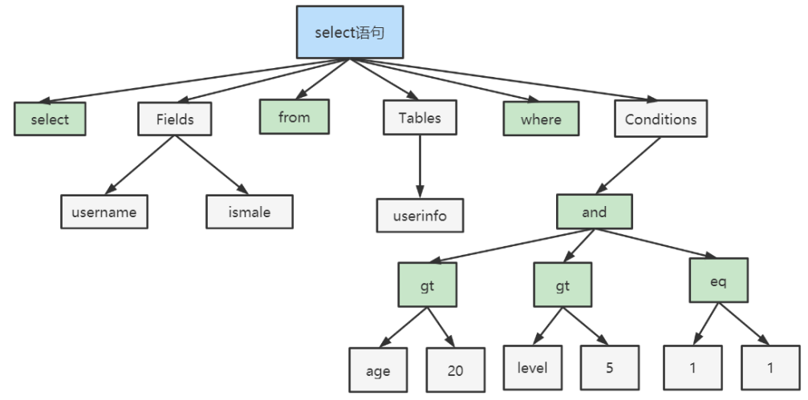


3. 优化器：在优化器中会确定 SQL 语句的执行路径，比如是根据 全表检索 ，还是根据 索引检索 等。

举例：如下语句是执行两个表的 join：

```mysql
select * from test1 join test2 using(ID)
where test1.name='zhangwei' and test2.name='mysql高级课程';
```

**方案1**：可以先从表 test1 里面取出 name='zhangwei'的记录的 ID 值，再根据 ID 值关联到表 test2，再判 断 test2 里面 name的值是否等于 'mysql高级课程'。

**方案2**：可以先从表 test2 里面取出 name='mysql高级课程' 的记录的 ID 值，再根据 ID 值关联到 test1， 再判断 test1 里面 name的值是否等于 zhangwei。

这两种执行方法的逻辑结果是一样的，但是执行的效率会有不同，而优化器的作用就是决定选择使用哪一个方案。优化 器阶段完成后，这个语句的执行方案就确定下来了，然后进入执行器阶段。

如果你还有一些疑问，比如优化器是怎么选择索引的，有没有可能选择错等。后面讲到索引我们再谈。

在查询优化器中，可以分为 逻辑查询 优化阶段和 物理查询 优化阶段。


4. 执行器：

截止到现在，还没有真正去读写真实的表，仅仅只是产出了一个执行计划。于是就进入了 执行器阶段 。

在执行之前需要判断该用户是否 具备权限 。如果没有，就会返回权限错误。如果具备权限，就执行 SQL 查询并返回结果。在 MySQL8.0 以下的版本，如果设置了查询缓存，这时会将查询结果进行缓存。

```mysql
select * from test where id=1;
```

比如：表 test 中，ID 字段没有索引，那么执行器的执行流程是这样的：

调用 InnoDB 引擎接口取这个表的第一行，判断 ID 值是不是1，如果不是则跳过，如果是则将这行存在结果集中； 调用引擎接口取“下一行”，重复相同的判断逻辑，直到取到这个表的最后一行。 

执行器将上述遍历过程中所有满足条件的行组成的记录集作为结果集返回给客户端。

至此，这个语句就执行完成了。对于有索引的表，执行的逻辑也差不多。

SQL 语句在 MySQL 中的流程是： SQL语句→查询缓存→解析器→优化器→执行器 。


#### 2.2 MySQL8中SQL执行原理

1. 确认profiling 是否开启

```mysql
mysql> select @@profiling;
mysql> show variables like 'profiling';
```

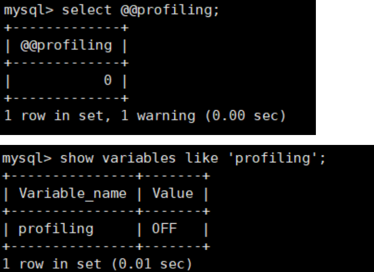

profiling=0 代表关闭，我们需要把 profiling 打开，即设置为 1：

```mysql
mysql> set profiling=1;
```


2. 多次执行相同SQL查询

然后我们执行一个 SQL 查询（你可以执行任何一个 SQL 查询）：

```mysql
mysql> select * from employees;
```


3. 查看profiles

查看当前会话所产生的所有 profiles：

```mysql
mysql> show profiles; # 显示最近的几次查询
```

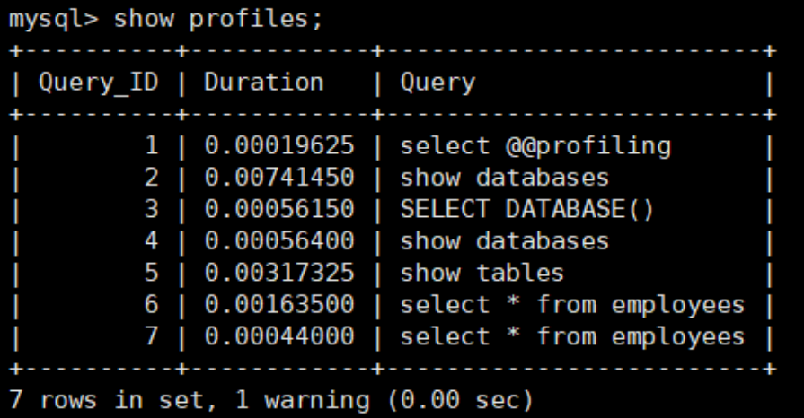


4. 查看profile

显示执行计划，查看程序的执行步骤：

```mysql
mysql> show profile;
```

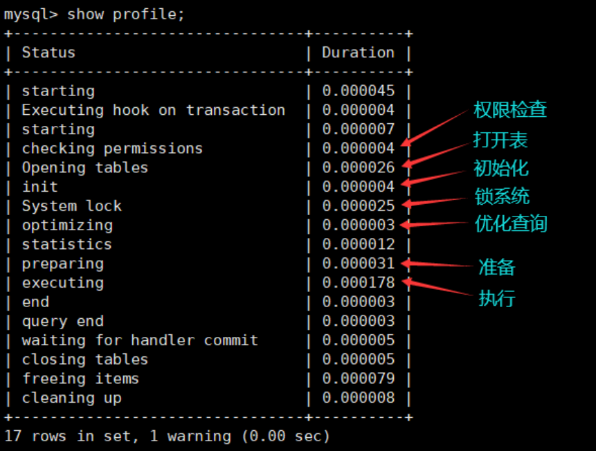

当然你也可以查询指定的 Query ID，比如：

```mysql
mysql> show profile for query 7;
```

查询 SQL 的执行时间结果和上面是一样的。

此外，还可以查询更丰富的内容：

```mysql
mysql> show profile cpu,block io for query 6;
```

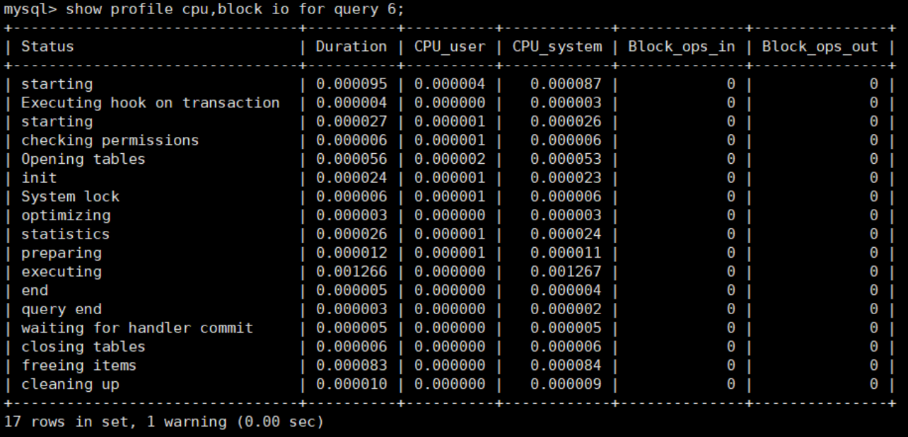

继续：

```mysql
mysql> show profile cpu,block io for query 7;
```

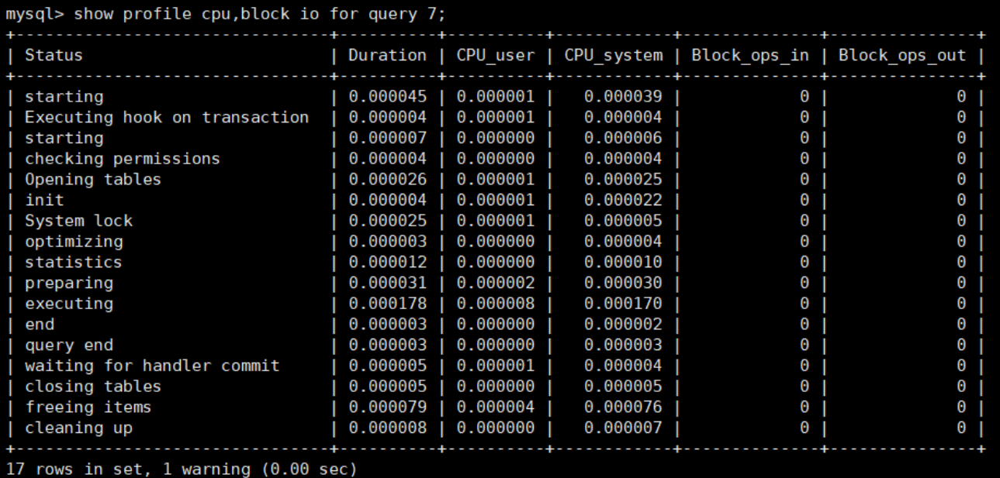


#### 2.3 MySQL5.7中SQL执行原理

上述操作在MySQL5.7中测试，发现前后两次相同的sql语句，执行的查询过程仍然是相同的。不是会使用 缓存吗？这里我们需要 显式开启查询缓存模式 。在MySQL5.7中如下设置：

1. 配置文件中开启查询缓存

在 /etc/my.cnf 中新增一行：

```mysql
query_cache_type=1
```

2. 重启mysql服务

```mysql
systemctl restart mysqld
```

3. 开启查询执行计划

由于重启过服务，需要重新执行如下指令，开启profiling。

```mysql
mysql> set profiling=1;
```

4. 执行语句两次：

```mysql
mysql> select * from locations;

mysql> select * from locations;
```

5. 查看profiles

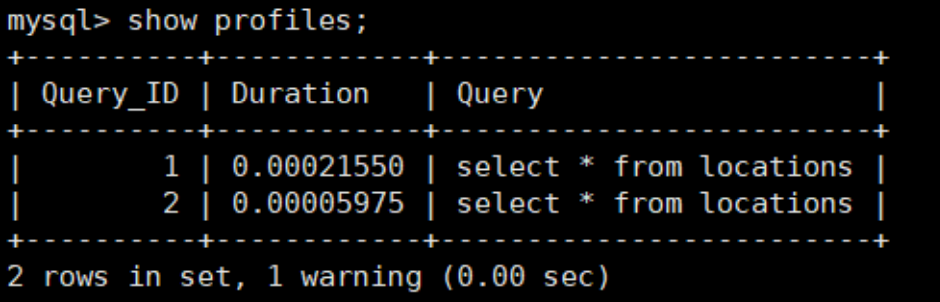

6. 查看profile

显示执行计划，查看程序的执行步骤：

```mysql
mysql> show profile for query 1;
```

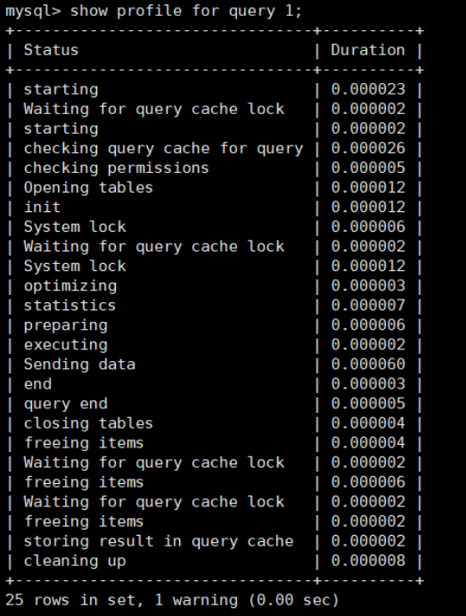

```mysql
mysql> show profile for query 2;
```

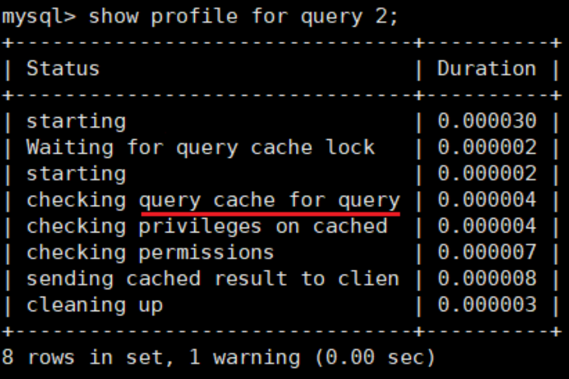

结论不言而喻。执行编号2时，比执行编号1时少了很多信息，从截图中可以看出查询语句直接从缓存中 获取数据。


#### 2.4 SQL语法顺序

随着Mysql版本的更新换代，其优化器也在不断的升级，优化器会分析不同执行顺序产生的性能消耗不同 而动态调整执行顺序。

需求：查询每个部门年龄高于20岁的人数且高于20岁人数不能少于2人，显示人数最多的第一名部门信息

下面是经常出现的查询顺序：

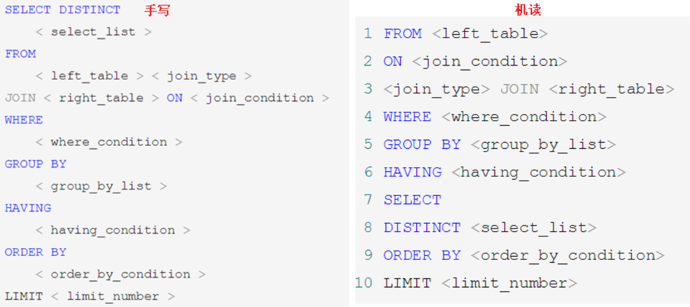


### 3. 数据库缓冲池(buffer pool)

InnoDB 存储引擎是以页为单位来管理存储空间的，我们进行的增删改查操作其实本质上都是在访问页 面（包括读页面、写页面、创建新页面等操作）。而磁盘 I/O 需要消耗的时间很多，而在内存中进行操 作，效率则会高很多，为了能让数据表或者索引中的数据随时被我们所用，DBMS 会申请 占用内存来作为 数据缓冲池 ，在真正访问页面之前，需要把在磁盘上的页缓存到内存中的 Buffer Pool 之后才可以访 问。

这样做的好处是可以让磁盘活动最小化，从而 减少与磁盘直接进行 I/O 的时间 。要知道，这种策略对提 升 SQL 语句的查询性能来说至关重要。如果索引的数据在缓冲池里，那么访问的成本就会降低很多。


#### 3.1 缓冲池 vs 查询缓存

缓冲池和查询缓存是一个东西吗？不是。


1. 缓冲池（Buffer Pool）

首先我们需要了解在 InnoDB 存储引擎中，缓冲池都包括了哪些。

在 InnoDB 存储引擎中有一部分数据会放到内存中，缓冲池则占了这部分内存的大部分，它用来存储各种 数据的缓存，如下图所示：


从图中，你能看到 InnoDB 缓冲池包括了数据页、索引页、插入缓冲、锁信息、自适应 Hash 和数据字典 信息等。


**缓存池的重要性：**

缓存原则：

“ 位置 * 频次 ”这个原则，可以帮我们对 I/O 访问效率进行优化。

首先，位置决定效率，提供缓冲池就是为了在内存中可以直接访问数据。

其次，频次决定优先级顺序。因为缓冲池的大小是有限的，比如磁盘有 200G，但是内存只有 16G，缓冲 池大小只有 1G，就无法将所有数据都加载到缓冲池里，这时就涉及到优先级顺序，会 优先对使用频次高 的热数据进行加载 。


2. 查询缓存

那么什么是查询缓存呢？

查询缓存是提前把 查询结果缓存 起来，这样下次不需要执行就可以直接拿到结果。需要说明的是，在 MySQL 中的查询缓存，不是缓存查询计划，而是查询对应的结果。因为命中条件苛刻，而且只要数据表 发生变化，查询缓存就会失效，因此命中率低。


#### 3.2 缓冲池如何读取数据

缓冲池管理器会尽量将经常使用的数据保存起来，在数据库进行页面读操作的时候，首先会判断该页面 是否在缓冲池中，如果存在就直接读取，如果不存在，就会通过内存或磁盘将页面存放到缓冲池中再进 行读取。

缓存在数据库中的结构和作用如下图所示：

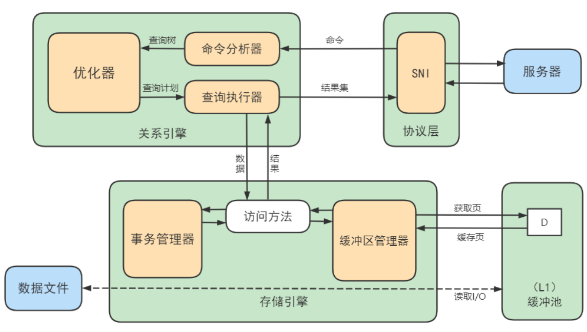

如果我们执行 SQL 语句的时候更新了缓存池中的数据，那么这些数据会马上同步到磁盘上吗？


#### 3.3 查看/设置缓冲池的大小

如果你使用的是 InnoDB 存储引擎，可以通过查看 innodb_buffer_pool_size 变量来查看缓冲池的大 小。命令如下：

```mysql
show variables like 'innodb_buffer_pool_size';
```

你能看到此时 InnoDB 的缓冲池大小只有 134217728/1024/1024=128MB。我们可以修改缓冲池大小，比如 改为256MB，方法如下：

```mysql
set global innodb_buffer_pool_size = 268435456;
```

或者：

```mysql
[server]
innodb_buffer_pool_size = 268435456
```

然后再来看下修改后的缓冲池大小，此时已成功修改成了 256 MB：


#### 3.4 多个Buffer Pool实例

```mysql
[server]
innodb_buffer_pool_instances = 2
```

这样就表明我们要创建2个 Buffer Pool 实例。

我们看下如何查看缓冲池的个数，使用命令：

```mysql
show variables like 'innodb_buffer_pool_instances';
```

那每个 Buffer Pool 实例实际占多少内存空间呢？其实使用这个公式算出来的：innodb_buffer_pool_size/innodb_buffer_pool_instances

也就是总共的大小除以实例的个数，结果就是每个 Buffer Pool 实例占用的大小。


#### 3.5 引申问题

Buffer Pool是MySQL内存结构中十分核心的一个组成，你可以先把它想象成一个黑盒子。

**黑盒下的更新数据流程**

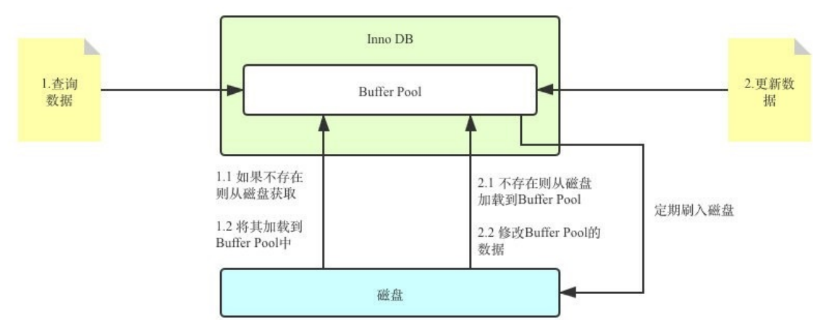

我更新到一半突然发生错误了，想要回滚到更新之前的版本，该怎么办？连数据持久化的保证、事务回 滚都做不到还谈什么崩溃恢复？

答案：Redo Log & Undo Log


## 五、存储引擎

### 1. 查看存储引擎

- 查看mysql提供什么存储引擎：

```mysql
show engines;
```

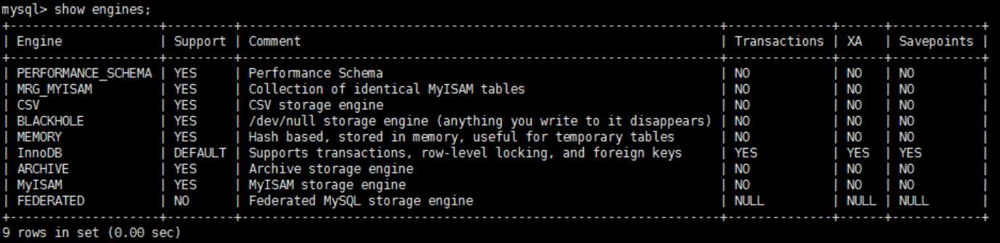


### 2. 设置系统默认的存储引擎

- 查看默认的存储引擎：

```mysql
show variables like '%storage_engine%';
#或
SELECT @@default_storage_engine;
```


- 修改默认的存储引擎

如果在创建表的语句中没有显式指定表的存储引擎的话，那就会默认使用 InnoDB 作为表的存储引擎。 如果我们想改变表的默认存储引擎的话，可以这样写启动服务器的命令行：

```mysql
SET DEFAULT_STORAGE_ENGINE=MyISAM;
```

或者修改 my.cnf 文件：

```mysql
default-storage-engine=MyISAM

# 重启服务
systemctl restart mysqld.service
```


### 3. 设置表的存储引擎

存储引擎是负责对表中的数据进行提取和写入工作的，我们可以为 不同的表设置不同的存储引擎 ，也就是 说不同的表可以有不同的物理存储结构，不同的提取和写入方式。


#### 3.1 创建表时指定存储引擎

我们之前创建表的语句都没有指定表的存储引擎，那就会使用默认的存储引擎 InnoDB 。如果我们想显 式的指定一下表的存储引擎，那可以这么写：

```mysql
CREATE TABLE 表名(
	建表语句;
) ENGINE = 存储引擎名称;
```


#### 3.2 修改表的存储引擎

如果表已经建好了，我们也可以使用下边这个语句来修改表的存储引擎：

```mysql
ALTER TABLE 表名 ENGINE = 存储引擎名称;
```


### 4. 引擎介绍

#### 4.1 InnoDB 引擎：具备外键支持功能的事务存储引擎

- MySQL从3.23.34a开始就包含InnoDB存储引擎。 大于等于5.5之后，默认采用InnoDB引擎 。
- InnoDB是MySQL的 默认事务型引擎 ，它被设计用来处理大量的短期(short-lived)事务。可以确保事务的完整提交(Commit)和回滚(Rollback)。
- 除了增加和查询外，还需要更新、删除操作，那么，应优先选择InnoDB存储引擎。
- 除非有非常特别的原因需要使用其他的存储引擎，否则应该优先考虑InnoDB引擎。
- 数据文件结构：（在《第02章_MySQL数据目录》章节已讲）
  - 表名.frm 存储表结构（MySQL8.0时，合并在表名.ibd中）
  - 表名.ibd 存储数据和索引
- InnoDB是 为处理巨大数据量的最大性能设计 。
  - 在以前的版本中，字典数据以元数据文件、非事务表等来存储。现在这些元数据文件被删除了。比如： .frm ， .par ， .trn ， .isl ， .db.opt 等都在MySQL8.0中不存在了。
- 对比MyISAM的存储引擎， InnoDB写的处理效率差一些 ，并且会占用更多的磁盘空间以保存数据和索引。
- MyISAM只缓存索引，不缓存真实数据；InnoDB不仅缓存索引还要缓存真实数据， 对内存要求较高 ，而且内存大小对性能有决定性的影响。


#### 4.2 MyISAM 引擎：主要的非事务处理存储引擎

- MyISAM提供了大量的特性，包括全文索引、压缩、空间函数(GIS)等，但MyISAM 不支持事务、行级锁、外键 ，有一个毫无疑问的缺陷就是 崩溃后无法安全恢复 。
- 5.5之前默认的存储引擎
- 优势是访问的 速度快 ，对事务完整性没有要求或者以SELECT、INSERT为主的应用
- 针对数据统计有额外的常数存储。故而 count(*) 的查询效率很高
- 数据文件结构：（在《第02章_MySQL数据目录》章节已讲）
  - 表名.frm 存储表结构
  - 表名.MYD 存储数据 (MYData)
  - 表名.MYI 存储索引 (MYIndex)
- 应用场景：只读应用或者以读为主的业务


#### 4.3 Archive 引擎：用于数据存档


#### 4.4 Blackhole 引擎：丢弃写操作，读操作会返回空内容


#### 4.5 CSV 引擎：存储数据时，以逗号分隔各个数据项


#### 4.6 Memory 引擎：置于内存的表


#### 4.7 Federated 引擎：访问远程表


#### 4.8 Merge引擎：管理多个MyISAM表构成的表集合


#### 4.9 NDB引擎：MySQL集群专用存储引擎


#### 4.10 引擎对比

MySQL中同一个数据库，不同的表可以选择不同的存储引擎。如下表对常用存储引擎做出了对比。

其实这些东西大家没必要立即就给记住，列出来的目的就是想让大家明白不同的存储引擎支持不同的功 能。

其实我们最常用的就是 InnoDB 和 MyISAM ，有时会提一下 Memory 。其中 InnoDB 是 MySQL 默认的存 储引擎。


### 5. MyISAM和InnoDB

很多人对 InnoDB 和 MyISAM 的取舍存在疑问，到底选择哪个比较好呢？

MySQL5.5之前的默认存储引擎是MyISAM，5.5之后改为了InnoDB。

| 对比项         | MyISAM                                                   | InnoDB                                                       |
| -------------- | -------------------------------------------------------- | ------------------------------------------------------------ |
| 外键           | 不支持                                                   | 支持                                                         |
| 事务           | 不支持                                                   | 支持                                                         |
| 行表锁         | 表锁，即使操作一条记录也会锁住整个表，不适合高并发的操作 | 行锁，操作时只锁某一行，不对其它行有影响，适合高并发的操作   |
| 缓存           | 只缓存索引，不缓存真实数据                               | 不仅缓存索引还要缓存真实数据，对内存要求较高，而且内存大小对性能有决定性的影响 |
| 自带系统表使用 | Y                                                        | N                                                            |
| 关注点         | 性能：节省资源、消耗少、简单业务                         | 事务：并发写、事务、更大资源                                 |
| 默认安装       | Y                                                        | N                                                            |
| 默认使用       | N                                                        | Y                                                            |


### 6. 课外补充：

1. InnoDB表的优势

InnoDB存储引擎在实际应用中拥有诸多优势，比如操作便利、提高了数据库的性能、维护成本低等。如 果由于硬件或软件的原因导致服务器崩溃，那么在重启服务器之后不需要进行额外的操作。InnoDB崩溃 恢复功能自动将之前提交的内容定型，然后撤销没有提交的进程，重启之后继续从崩溃点开始执行。

InnoDB存储引擎在主内存中维护缓冲池，高频率使用的数据将在内存中直接被处理。这种缓存方式应用 于多种信息，加速了处理进程。

在专用服务器上，物理内存中高达80%的部分被应用于缓冲池。如果需要将数据插入不同的表中，可以 设置外键加强数据的完整性。更新或者删除数据，关联数据将会被自动更新或删除。如果试图将数据插 入从表，但在主表中没有对应的数据，插入的数据将被自动移除。如果磁盘或内存中的数据出现崩溃， 在使用脏数据之前，校验和机制会发出警告。当每个表的主键都设置合理时，与这些列有关的操作会被 自动优化。插入、更新和删除操作通过做改变缓冲自动机制进行优化。 InnoDB不仅支持当前读写，也会 缓冲改变的数据到数据流磁盘 。

InnoDB的性能优势不只存在于长时运行查询的大型表。在同一列多次被查询时，自适应哈希索引会提高 查询的速度。使用InnoDB可以压缩表和相关的索引，可以 在不影响性能和可用性的情况下创建或删除索 引 。对于大型文本和BLOB数据，使用动态行形式，这种存储布局更高效。通过查询 INFORMATION_SCHEMA库中的表可以监控存储引擎的内部工作。在同一个语句中，InnoDB表可以与其他 存储引擎表混用。即使有些操作系统限制文件大小为2GB，InnoDB仍然可以处理。 当处理大数据量时， InnoDB兼顾CPU，以达到最大性能 。


2. InnoDB和ACID模型

ACID模型是一系列数据库设计规则，这些规则着重强调可靠性，而可靠性对于商业数据和任务关键型应 用非常重要。MySQL包含类似InnoDB存储引擎的组件，与ACID模型紧密相连，这样出现意外时，数据不 会崩溃，结果不会失真。如果依赖ACID模型，可以不使用一致性检查和崩溃恢复机制。如果拥有额外的 软件保护，极可靠的硬件或者应用可以容忍一小部分的数据丢失和不一致，可以将MySQL设置调整为只 依赖部分ACID特性，以达到更高的性能。下面讲解InnoDB存储引擎与ACID模型相同作用的四个方面。

**原子方面**：ACID的原子方面主要涉及InnoDB事务，与MySQL相关的特性主要包括：

- 自动提交设置。
- COMMIT语句。
- ROLLBACK语句。
- 操作INFORMATION_SCHEMA库中的表数据。


**一致性方面**：ACID模型的一致性主要涉及保护数据不崩溃的内部InnoDB处理过程，与MySQL相关的特性 主要包括：

- InnoDB双写缓存。
- InnoDB崩溃恢复。


**隔离方面**：隔离是应用于事务的级别，与MySQL相关的特性主要包括：

- 自动提交设置。
- SET ISOLATION LEVEL语句。
- InnoDB锁的低级别信息。


**耐久性方面**：ACID模型的耐久性主要涉及与硬件配置相互影响的MySQL软件特性。由于硬件复杂多样化，耐久性方面没有具体的规则可循。与MySQL相关的特性有：

- InnoDB双写缓存，通过innodb_doublewrite配置项配置。
- 配置项innodb_flush_log_at_trx_commit。
- 配置项sync_binlog。
- 配置项innodb_file_per_table。
- 存储设备的写入缓存。
- 存储设备的备用电池缓存。
- 运行MySQL的操作系统。
- 持续的电力供应。
- 备份策略。
- 对分布式或托管的应用，最主要的在于硬件设备的地点以及网络情况。


3. InnoDB架构

**缓冲池**：缓冲池是主内存中的一部分空间，用来缓存已使用的表和索引数据。缓冲池使得经常被使用的 数据能够直接在内存中获得，从而提高速度。

**更改缓存**：更改缓存是一个特殊的数据结构，当受影响的索引页不在缓存中时，更改缓存会缓存辅助索 引页的更改。索引页被其他读取操作时会加载到缓存池，缓存的更改内容就会被合并。不同于集群索 引，辅助索引并非独一无二的。当系统大部分闲置时，清除操作会定期运行，将更新的索引页刷入磁 盘。更新缓存合并期间，可能会大大降低查询的性能。在内存中，更新缓存占用一部分InnoDB缓冲池。 在磁盘中，更新缓存是系统表空间的一部分。更新缓存的数据类型由innodb_change_buffering配置项管 理。

**自适应哈希索引**：自适应哈希索引将负载和足够的内存结合起来，使得InnoDB像内存数据库一样运行， 不需要降低事务上的性能或可靠性。这个特性通过innodb_adaptive_hash_index选项配置，或者通过-- skip-innodb_adaptive_hash_index命令行在服务启动时关闭。

**重做日志缓存**：重做日志缓存存放要放入重做日志的数据。重做日志缓存大小通过 innodb_log_buffer_size配置项配置。重做日志缓存会定期地将日志文件刷入磁盘。大型的重做日志缓存 使得大型事务能够正常运行而不需要写入磁盘。 

**系统表空间**：系统表空间包括InnoDB数据字典、双写缓存、更新缓存和撤销日志，同时也包括表和索引 数据。多表共享，系统表空间被视为共享表空间。 

**双写缓存**：双写缓存位于系统表空间中，用于写入从缓存池刷新的数据页。只有在刷新并写入双写缓存 后，InnoDB才会将数据页写入合适的位置。 

**撤销日志**：撤销日志是一系列与事务相关的撤销记录的集合，包含如何撤销事务最近的更改。如果其他 事务要查询原始数据，可以从撤销日志记录中追溯未更改的数据。撤销日志存在于撤销日志片段中，这 些片段包含于回滚片段中。 

**每个表一个文件的表空间**：每个表一个文件的表空间是指每个单独的表空间创建在自身的数据文件中， 而不是系统表空间中。这个功能通过innodb_file_per_table配置项开启。每个表空间由一个单独的.ibd数 据文件代表，该文件默认被创建在数据库目录中。 

**通用表空间**：使用CREATE TABLESPACE语法创建共享的InnoDB表空间。通用表空间可以创建在MySQL数 据目录之外能够管理多个表并支持所有行格式的表。 

**撤销表空间**：撤销表空间由一个或多个包含撤销日志的文件组成。撤销表空间的数量由 innodb_undo_tablespaces配置项配置。 

**临时表空间**：用户创建的临时表空间和基于磁盘的内部临时表都创建于临时表空间。 innodb_temp_data_file_path配置项定义了相关的路径、名称、大小和属性。如果该值为空，默认会在 innodb_data_home_dir变量指定的目录下创建一个自动扩展的数据文件。 

**重做日志**：重做日志是基于磁盘的数据结构，在崩溃恢复期间使用，用来纠正数据。正常操作期间， 重做日志会将请求数据进行编码，这些请求会改变InnoDB表数据。遇到意外崩溃后，未完成的更改会自 动在初始化期间重新进行。


## 六、索引的数据结构

### 1. 为什么使用索引

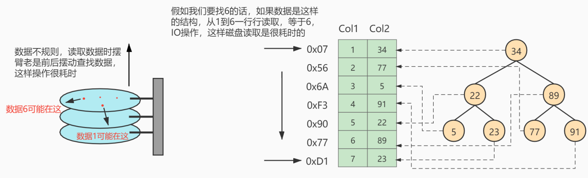

假如给数据使用 二叉树 这样的数据结构进行存储，如下图所示

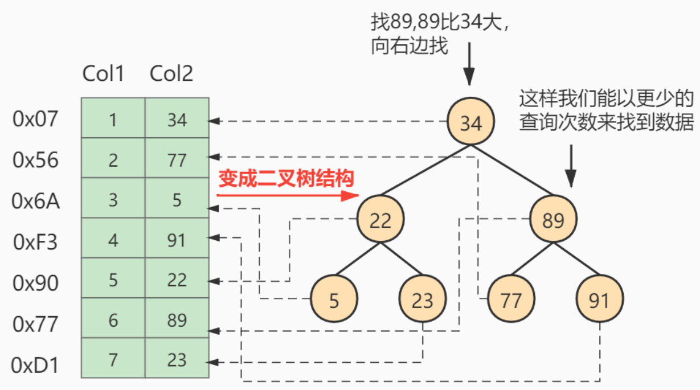


### 2. 索引及其优缺点

#### 2.1 索引概述

MySQL官方对索引的定义为：索引（Index）是帮助MySQL高效获取数据的数据结构。

索引的本质：索引是数据结构。你可以简单理解为“排好序的快速查找数据结构”，满足特定查找算法。 这些数据结构以某种方式指向数据， 这样就可以在这些数据结构的基础上实现 高级查找算法 。


#### 2.2 优点

1. 类似大学图书馆建书目索引，提高数据检索的效率，降低 数据库的IO成本 ，这也是创建索引最主要的原因。 
2. 通过创建唯一索引，可以保证数据库表中每一行数据的唯一性 。 
3. 在实现数据的 参考完整性方面，可以 加速表和表之间的连接 。换句话说，对于有依赖关系的子表和父表联合查询时， 可以提高查询速度。 
4. 在使用分组和排序子句进行数据查询时，可以显著 减少查询中分组和排序的时间，降低了CPU的消耗。


#### 2.3 缺点

增加索引也有许多不利的方面，主要表现在如下几个方面： 

1. 创建索引和维护索引要 耗费时间 ，并 且随着数据量的增加，所耗费的时间也会增加。 
2. 索引需要占 磁盘空间 ，除了数据表占数据空间之 外，每一个索引还要占一定的物理空间， 存储在磁盘上 ，如果有大量的索引，索引文件就可能比数据文 件更快达到最大文件尺寸。 
3. 虽然索引大大提高了查询速度，同时却会 降低更新表的速度 。当对表 中的数据进行增加、删除和修改的时候，索引也要动态地维护，这样就降低了数据的维护速度。 

因此，选择使用索引时，需要综合考虑索引的优点和缺点。


### 3. InnoDB中索引的推演

#### 3.1 索引之前的查找

先来看一个精确匹配的例子：

```mysql
SELECT [列名列表] FROM 表名 WHERE 列名 = xxx;
```

在没有索引的情况下，不论是根据主键列或者其他列的值进行查找，由于我们并不能快速的定位到记录 所在的页，所以只能 从第一个页 沿着 双向链表 一直往下找，在每一个页中根据我们上面的查找方式去查 找指定的记录。因为要遍历所有的数据页，所以这种方式显然是 超级耗时 的。如果一个表有一亿条记录 呢？此时 索引 应运而生。


#### 3.2 设计索引

建一个表：

```mysql
mysql> CREATE TABLE index_demo(
    -> 	c1 INT,
    -> 	c2 INT,
    -> 	c3 CHAR(1),
    -> 	PRIMARY KEY(c1)
    -> ) ROW_FORMAT = Compact;
```

这个新建的 index_demo 表中有2个INT类型的列，1个CHAR(1)类型的列，而且我们规定了c1列为主键， 这个表使用 Compact 行格式来实际存储记录的。这里我们简化了index_demo表的行格式示意图：


我们只在示意图里展示记录的这几个部分：

- record_type ：记录头信息的一项属性，表示记录的类型， 0 表示普通记录、 2 表示最小记 录、 3 表示最大记录、 1 暂时还没用过，下面讲。
- next_record ：记录头信息的一项属性，表示下一条地址相对于本条记录的地址偏移量，我们用 箭头来表明下一条记录是谁。
- 各个列的值 ：这里只记录在 index_demo 表中的三个列，分别是 c1 、 c2 和 c3 。
- 其他信息 ：除了上述3种信息以外的所有信息，包括其他隐藏列的值以及记录的额外信息。

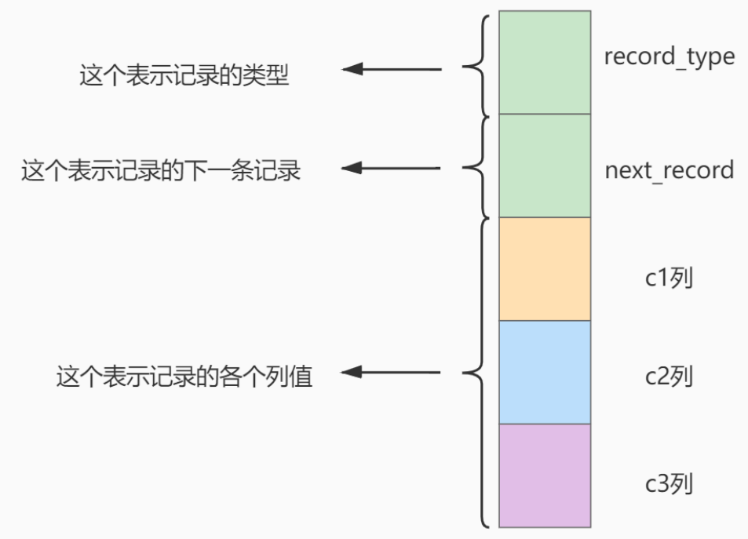


把一些记录放到页里的示意图就是：

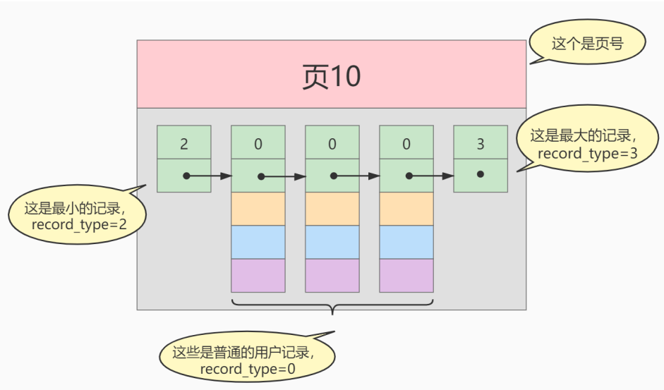


##### 3.2.1 一个简单的索引设计方案

我们在根据某个搜索条件查找一些记录时为什么要遍历所有的数据页呢？因为各个页中的记录并没有规 律，我们并不知道我们的搜索条件匹配哪些页中的记录，所以不得不依次遍历所有的数据页。所以如果 我们 想快速的定位到需要查找的记录在哪些数据页 中该咋办？我们可以为快速定位记录所在的数据页而 建立一个目录 ，建这个目录必须完成下边这些事：

- 下一个数据页中用户记录的主键值必须大于上一个页中用户记录的主键值。
- 给所有的页建立一个目录项。

所以我们为上边几个页做好的目录就像这样子：

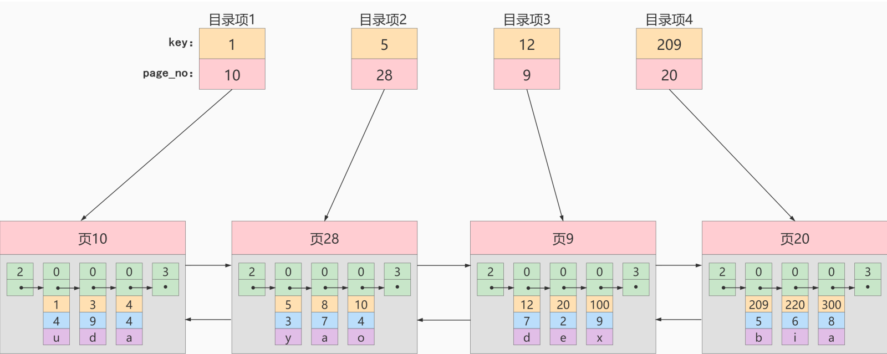

以 页28 为例，它对应 目录项2 ，这个目录项中包含着该页的页号 28 以及该页中用户记录的最小主 键值 5 。我们只需要把几个目录项在物理存储器上连续存储（比如：数组），就可以实现根据主键 值快速查找某条记录的功能了。比如：查找主键值为 20 的记录，具体查找过程分两步：

1. 先从目录项中根据 二分法 快速确定出主键值为 20 的记录在 目录项3 中（因为 12 < 20 <
   209 ），它对应的页是 页9 。

2. 再根据前边说的在页中查找记录的方式去 页9 中定位具体的记录。


##### 3.2.2 InnoDB中的索引方案

###### ① 迭代1次：目录项纪录的页

我们把前边使用到的目录项放到数据页中的样子就是这样：

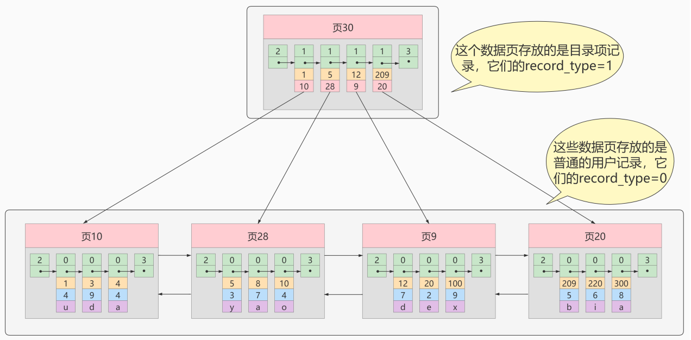

从图中可以看出来，我们新分配了一个编号为30的页来专门存储目录项记录。这里再次强调 目录项记录 和普通的 用户记录 的不同点：

- 目录项记录 的 record_type 值是1，而 普通用户记录 的 record_type 值是0。
- 目录项记录只有 主键值和页的编号 两个列，而普通的用户记录的列是用户自己定义的，可能包含 很多列 ，另外还有InnoDB自己添加的隐藏列。
- 了解：记录头信息里还有一个叫 min_rec_mask 的属性，只有在存储 目录项记录 的页中的主键值最小的 目录项记录 的 min_rec_mask 值为 1 ，其他别的记录的 min_rec_mask 值都是 0 。

相同点：两者用的是一样的数据页，都会为主键值生成 Page Directory （页目录），从而在按照主键 值进行查找时可以使用 二分法 来加快查询速度。

现在以查找主键为 20 的记录为例，根据某个主键值去查找记录的步骤就可以大致拆分成下边两步：

1. 先到存储 目录项记录 的页，也就是页30中通过 二分法 快速定位到对应目录项，因为 12 < 20 <
209 ，所以定位到对应的记录所在的页就是页9。
2. 再到存储用户记录的页9中根据 二分法 快速定位到主键值为 20 的用户记录。


###### ② 迭代2次：多个目录项纪录的页

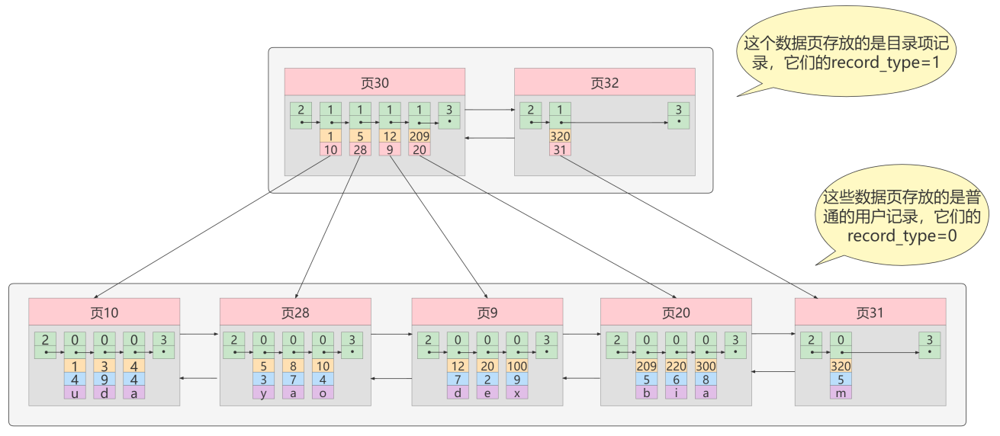

从图中可以看出，我们插入了一条主键值为320的用户记录之后需要两个新的数据页：

- 为存储该用户记录而新生成了 页31 。
- 因为原先存储目录项记录的 页30的容量已满 （我们前边假设只能存储4条目录项记录），所以不得不需要一个新的 页32 来存放 页31 对应的目录项。

现在因为存储目录项记录的页不止一个，所以如果我们想根据主键值查找一条用户记录大致需要3个步骤，以查找主键值为 20 的记录为例：

1. 确定 目录项记录页
我们现在的存储目录项记录的页有两个，即 页30 和 页32 ，又因为页30表示的目录项的主键值的范围是 [1, 320) ，页32表示的目录项的主键值不小于 320 ，所以主键值为 20 的记录对应的目录项记录在 页30 中。
2. 通过目录项记录页 确定用户记录真实所在的页 。
在一个存储 目录项记录 的页中通过主键值定位一条目录项记录的方式说过了。
3. 在真实存储用户记录的页中定位到具体的记录。


###### ③ 迭代3次：目录项记录页的目录页

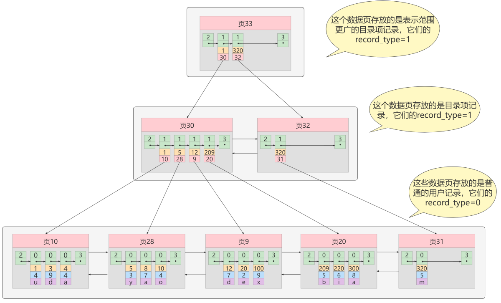

如图，我们生成了一个存储更高级目录项的 页33 ，这个页中的两条记录分别代表页30和页32，如果用 户记录的主键值在 [1, 320) 之间，则到页30中查找更详细的目录项记录，如果主键值 不小于320 的 话，就到页32中查找更详细的目录项记录。

我们可以用下边这个图来描述它：

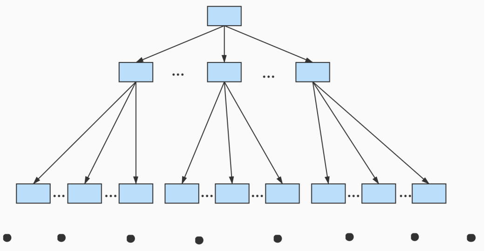

这个数据结构，它的名称是 B+树 。


###### ④ B+Tree

一个B+树的节点其实可以分成好多层，规定最下边的那层，也就是存放我们用户记录的那层为第 0 层， 之后依次往上加。之前我们做了一个非常极端的假设：存放用户记录的页 最多存放3条记录 ，存放目录项 记录的页 最多存放4条记录 。其实真实环境中一个页存放的记录数量是非常大的，假设所有存放用户记录 的叶子节点代表的数据页可以存放 100条用户记录 ，所有存放目录项记录的内节点代表的数据页可以存 放 1000条目录项记录 ，那么：

- 如果B+树只有1层，也就是只有1个用于存放用户记录的节点，最多能存放 100 条记录。
- 如果B+树有2层，最多能存放 1000×100=10,0000 条记录。
- 如果B+树有3层，最多能存放 1000×1000×100=1,0000,0000 条记录。
- 如果B+树有4层，最多能存放 1000×1000×1000×100=1000,0000,0000 条记录。相当多的记录！！！

你的表里能存放 100000000000 条记录吗？所以一般情况下，我们 用到的B+树都不会超过4层 ，那我们 通过主键值去查找某条记录最多只需要做4个页面内的查找（查找3个目录项页和一个用户记录页），又 因为在每个页面内有所谓的 Page Directory （页目录），所以在页面内也可以通过 二分法 实现快速 定位记录。


#### 3.3 常见索引概念

索引按照物理实现方式，索引可以分为 2 种：聚簇（聚集）和非聚簇（非聚集）索引。我们也把非聚集 索引称为二级索引或者辅助索引。

##### 1. 聚簇索引

特点：

1. 使用记录主键值的大小进行记录和页的排序，这包括三个方面的含义：
  - 页内 的记录是按照主键的大小顺序排成一个 单向链表。
  - 各个存放 用户记录的页 也是根据页中用户记录的主键大小顺序排成一个 双向链表 。
  - 存放 目录项记录的页 分为不同的层次，在同一层次中的页也是根据页中目录项记录的主键大小顺序排成一个 双向链表 。
2. B+树的 叶子节点 存储的是完整的用户记录。
    所谓完整的用户记录，就是指这个记录中存储了所有列的值（包括隐藏列）。


优点：

- 数据访问更快 ，因为聚簇索引将索引和数据保存在同一个B+树中，因此从聚簇索引中获取数据比非聚簇索引更快
- 聚簇索引对于主键的 排序查找 和 范围查找 速度非常快
- 按照聚簇索引排列顺序，查询显示一定范围数据的时候，由于数据都是紧密相连，数据库不用从多个数据块中提取数据，所以 节省了大量的io操作 。


缺点：

- 插入速度严重依赖于插入顺序 ，按照主键的顺序插入是最快的方式，否则将会出现页分裂，严重影响性能。因此，对于InnoDB表，我们一般都会定义一个自增的ID列为主键
- 更新主键的代价很高 ，因为将会导致被更新的行移动。因此，对于InnoDB表，我们一般定义主键为不可更新
- 二级索引访问需要两次索引查找 ，第一次找到主键值，第二次根据主键值找到行数据


##### 2. 二级索引（辅助索引、非聚簇索引）

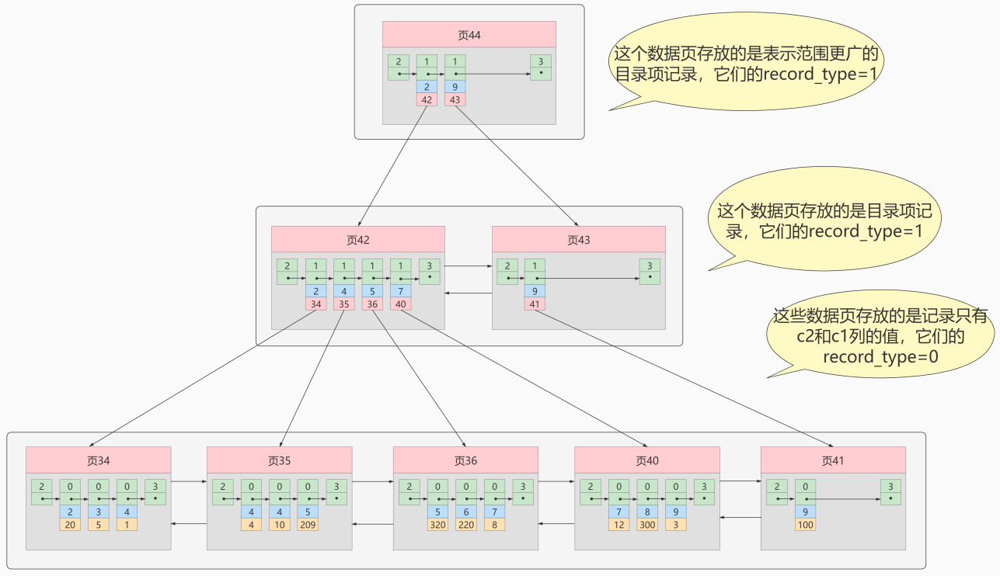

**概念**：回表 我们根据这个以c2列大小排序的B+树只能确定我们要查找记录的主键值，所以如果我们想根 据c2列的值查找到完整的用户记录的话，仍然需要到 聚簇索引 中再查一遍，这个过程称为 回表 。也就 是根据c2列的值查询一条完整的用户记录需要使用到 2 棵B+树！


**问题**：为什么我们还需要一次 回表 操作呢？直接把完整的用户记录放到叶子节点不OK吗？

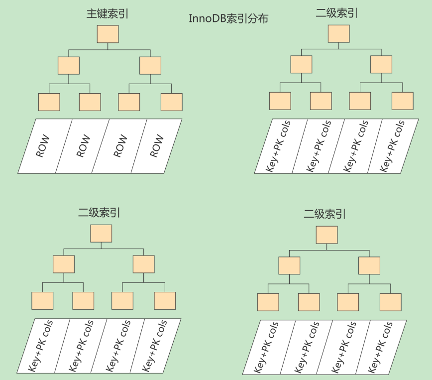


##### 3. 联合索引

我们也可以同时以多个列的大小作为排序规则，也就是同时为多个列建立索引，比方说我们想让B+树按 照 c2和c3列 的大小进行排序，这个包含两层含义：

- 先把各个记录和页按照c2列进行排序。
- 在记录的c2列相同的情况下，采用c3列进行排序

注意一点，以c2和c3列的大小为排序规则建立的B+树称为 联合索引 ，本质上也是一个二级索引。它的意 思与分别为c2和c3列分别建立索引的表述是不同的，不同点如下：

- 建立 联合索引 只会建立如上图一样的1棵B+树。
- 为c2和c3列分别建立索引会分别以c2和c3列的大小为排序规则建立2棵B+树。


#### 3.4 InnoDB的B+树索引的注意事项

##### 1. 根页面位置万年不动

我们前边介绍B+树索引的时候，为了大家理解上的方便，先把存储用户记录的叶子节点都画出来，然后接着画存储目录项记录的内节点，实际上B+树的形成过程是这样的：

- 每当为某个表创建一个B+树索引（聚簇索引不是人为创建的，默认就有）的时候，都会为这个索引创建一个根节点页面。最开始表中没有数据的时候，每个B+树索引对应的根节点中既没有用户记录，也没有目录项记录。
- 随后向表中插入用户记录时，先把用户记录存储到这个根节点中。
- 当根节点中的可用空间用完时继续插入记录，此时会将根节点中的所有记录复制到一个新分配的页，比如页 a中，然后对这个新页进行页分裂的操作，得到另一个新页，比如页b。这时新插入的记录根据键值（也就是聚簇索引中的主键值，二级索引中对应的索引列的值）的大小就会被分配到页a或者页b中，而根节点便升级为存储目录项记录的页

这个过程特别注意的是：一个B+树索引的根节点自诞生之日起，便不会再移动。这样只要我们对某个表建立一个索引，那么它的根节点的页号便会被记录到某个地方，然后凡是InnoDB存储引擎需要用到这个索引的时候，都会从那个固定的地方取出根节点的页号，从而来访问这个索引。


##### 2. 内节点中目录项记录的唯一性

我们知道B+树索引的内节点中目录项记录的内容是索引列+页号的搭配，但是这个搭配对于二级索引来说有点儿不严谨。还拿index_demo表为例，假设这个表中的数据是这样的：

| c1   | c2   | c3   |
| ---- | ---- | ---- |
| 1    | 1    | 'u'  |
| 3    | 1    | 'd'  |
| 5    | 1    | 'y'  |
| 7    | 1    | 'a'  |

如果二级索引中目录项记录的内容只是索引列+页号的搭配的话，那么为c2列建立索引后的B+树应该长这样：

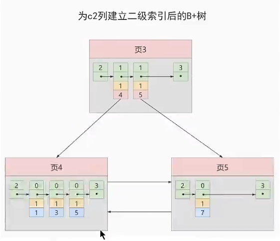

如果我们想新插入一行记录，其中c1、c2、c3的值分别是：9、1、'c’，那么在修改这个为c2列建立的二级索引对应的B+树时便碰到了个大问题：由于页3中存储的目录项记录是由c2列+页号的值构成的，页3中的两条目录项记录对应的c2列的值都是1，而我们新插入的这条记录的c2列的值也是1，那我们这条新插入的记录到底应该放到页4中，还是应该放到页5中啊？答案是：对不起，懵了。

为了让新插入记录能找到自己在那个页里，我们需要保证在B+树的同一层内节点的目录项记录除页号这个字段以外是唯一的。所以对于二级索引的内节点的目录项记录的内容实际上是由三个部分构成的：

- 索引列的值
- 主键值
- 页号

也就是我们把主键值也添加到二级索引内节点中的目录项记录了，这样就能保证B+树每一层节点中各条目录项记录除页号这个字段外是唯一的，所以我们为c2列建立二级索引后的示意图实际上应该是这样子的：

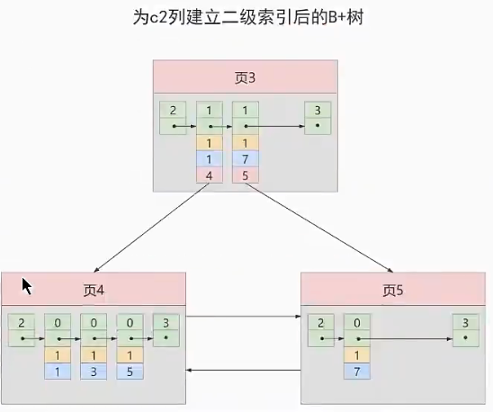

这样我们再插入记录（9，1，‘c'）时，由于页3中存储的目录项记录是由c2列+主键+页号的值构成的，可以先把新记录的c2列的值和页3中各目录项记录的c2列的值作比较，如果c2列的值相同的话，可以接着比较主键值，因为B+树同一层中不同目录项记录的c2列+主键的值肯定是不一样的，所以最后肯定能定位唯一的一条目录项记录，在本例中最后确定新记录应该被插入到页5中。


##### 3. 一个页面最少存储2条记录

一个B+树只需要很少的层级就可以轻松存储数亿条记录，查询速度相当不错！这是因为B+树本质上就是一个大的多层级目录，每经过一个目录时都会过滤掉许多无效的子目录，直到最后访问到存储真实数据的目录。那如果一个大的目录中只存放一个子目录是个啥效果呢？那就是目录层级非常非常非常多，而且最后的那个存放真实数据的目录中只能存放一条记录。费了半天劲只能存放一条真实的用户记录？所以InnoDB的一个数据页至少可以存放两条记录。


### 4. MyISAM中的索引方案

B树索引适用存储引擎如表所示：

| 索引 / 存储引擎 | MyISAM | InnoDB | Memory |
| --------------- | ------ | ------ | ------ |
| B-Tree索引      | 支持   | 支持   | 支持   |

即使多个存储引擎支持同一种类型的索引，但是他们的实现原理也是不同的。Innodb和MyISAM默认的索引是Btree索引；而Memory默认的索引是Hash索引。

MyISAM引擎使用 B+Tree 作为索引结构，叶子节点的data域存放的是 数据记录的地址 。


#### 4.1 MyISAM索引的原理

下图是MyISAM索引的原理图。

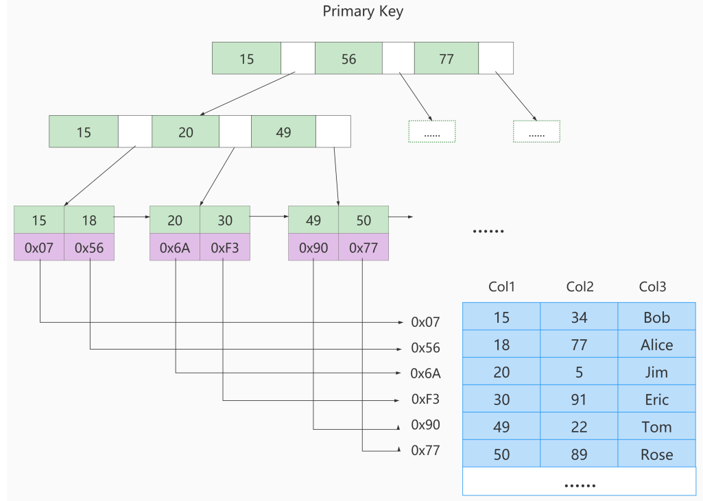

如果我们在Col2上建立一个二级索引，则此索引的结构如下图所示：

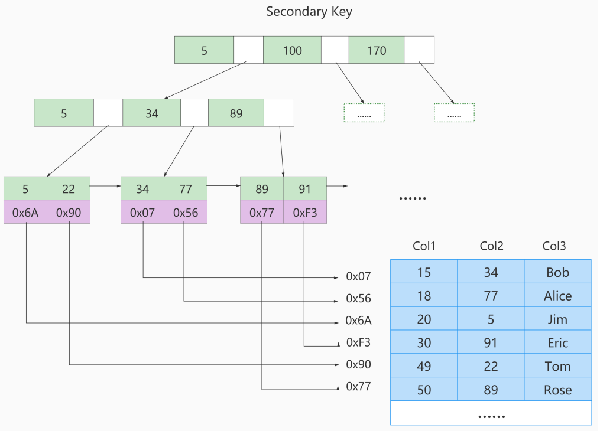


#### 4.2 MyISAM 与 InnoDB对比

MyISAM的索引方式都是“非聚簇”的，与InnoDB包含1个聚簇索引是不同的。小结两种引擎中索引的区 别：

① 在InnoDB存储引擎中，我们只需要根据主键值对 聚簇索引 进行一次查找就能找到对应的记录，而在MyISAM 中却需要进行一次 回表 操作，意味着MyISAM中建立的索引相当于全部都是 二级索引 。

② InnoDB的数据文件本身就是索引文件，而MyISAM索引文件和数据文件是 分离的 ，索引文件仅保存数据记录的地址。

③ InnoDB的非聚簇索引data域存储相应记录 主键的值 ，而MyISAM索引记录的是 地址 。换句话说，InnoDB的所有非聚簇索引都引用主键作为data域。

④ MyISAM的回表操作是十分 快速 的，因为是拿着地址偏移量直接到文件中取数据的，反观InnoDB是通过获取主键之后再去聚簇索引里找记录，虽然说也不慢，但还是比不上直接用地址去访问。

⑤ InnoDB要求表 必须有主键 （ MyISAM可以没有 ）。如果没有显式指定，则MySQL系统会自动选择一个可以非空且唯一标识数据记录的列作为主键。如果不存在这种列，则MySQL自动为InnoDB表生成一个隐含字段作为主键，这个字段长度为6个字节，类型为长整型。

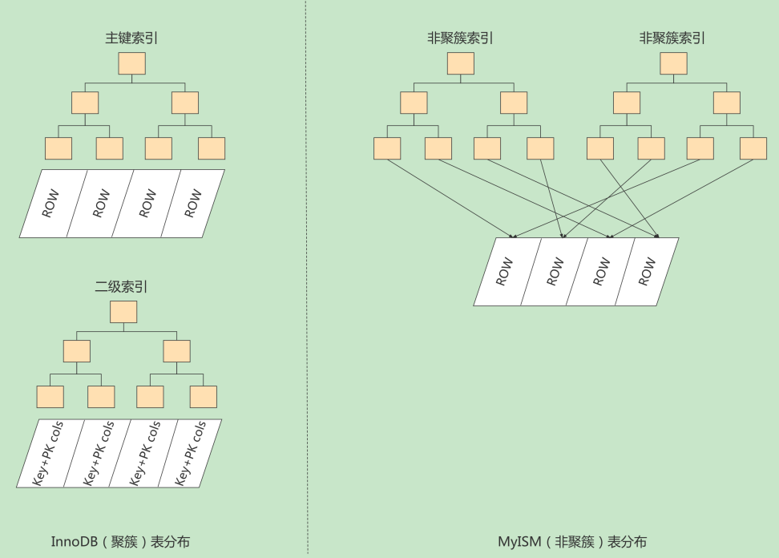


### 5. 索引的代价

索引是个好东西，可不能乱建，它在空间和时间上都会有消耗：

- 空间上的代价
  每建立一个索引都要为它建立一棵B+树，每一棵B+树的每一个节点都是一个数据页，一个页默认会 占用 16KB 的存储空间，一棵很大的B+树由许多数据页组成，那就是很大的一片存储空间。
- 时间上的代价
  每次对表中的数据进行 增、删、改 操作时，都需要去修改各个B+树索引。而且我们讲过，B+树每 层节点都是按照索引列的值 从小到大的顺序排序 而组成了 双向链表 。不论是叶子节点中的记录，还 是内节点中的记录（也就是不论是用户记录还是目录项记录）都是按照索引列的值从小到大的顺序 而形成了一个单向链表。而增、删、改操作可能会对节点和记录的排序造成破坏，所以存储引擎需 要额外的时间进行一些 记录移位 ， 页面分裂 、 页面回收 等操作来维护好节点和记录的排序。如果 我们建了许多索引，每个索引对应的B+树都要进行相关的维护操作，会给性能拖后腿。


### 6. MySQL数据结构选择的合理性

#### 6.1 全表遍历

这里都懒得说了。


#### 6.2 Hash结构

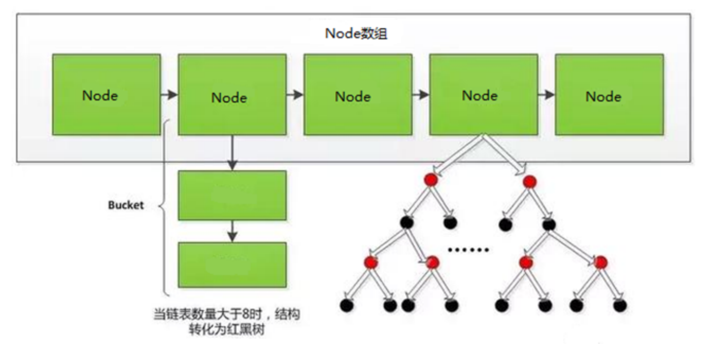

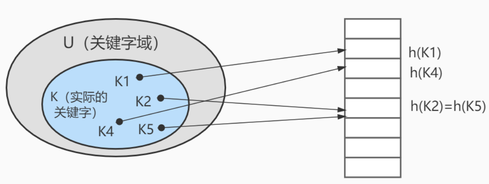

上图中哈希函数h有可能将两个不同的关键字映射到相同的位置，这叫做 碰撞 ，在数据库中一般采用 链 接法 来解决。在链接法中，将散列到同一槽位的元素放在一个链表中，如下图所示：

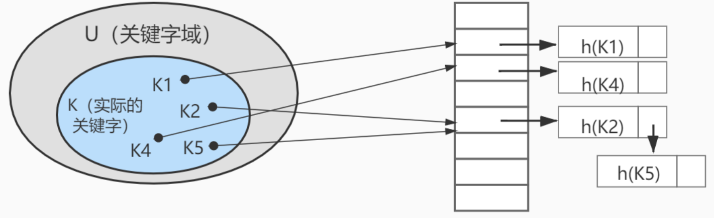

实验：体会数组和hash表的查找方面的效率区别

```java
// 算法复杂度为 O(n)
@Test
public void test1(){
    int[] arr = new int[100000];
    for(int i = 0;i < arr.length;i++){
    	arr[i] = i + 1;
    }
    
    long start = System.currentTimeMillis();
    for(int j = 1; j<=100000;j++){
        int temp = j;
        
        for(int i = 0;i < arr.length;i++){
            if(temp == arr[i]){
            	break;
            }
        }
    }
    long end = System.currentTimeMillis();
    System.out.println("time： " + (end - start)); //time： 823
}
```

```java
//算法复杂度为 O(1)
@Test
public void test2(){
    HashSet<Integer> set = new HashSet<>(100000);
    for(int i = 0;i < 100000;i++){
    	set.add(i + 1);
    }
    
    long start = System.currentTimeMillis();
    
    for(int j = 1; j<=100000;j++) {
        int temp = j;
        boolean contains = set.contains(temp);
    }
    long end = System.currentTimeMillis();
    System.out.println("time： " + (end - start)); //time： 5
}
```

Hash结构效率高，那为什么索引结构要设计成树型呢？

Hash索引适用存储引擎如表所示：

| 索引 / 存储引擎 | MyISAM | InnoDB | Memory |
| --------------- | ------ | ------ | ------ |
| HASH索引        | 不支持 | 不支持 | 支持   |

Hash索引的适用性：

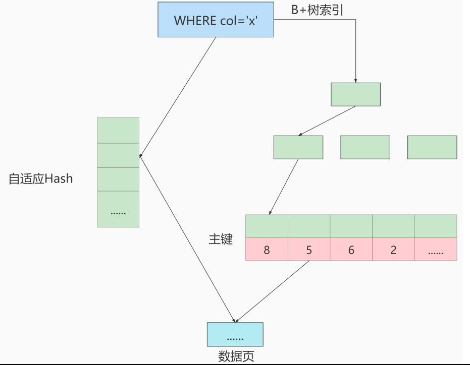

采用自适应 Hash 索引目的是方便根据 SQL 的查询条件加速定位到叶子节点，特别是当 B+ 树比较深的时 候，通过自适应 Hash 索引可以明显提高数据的检索效率。

我们可以通过 innodb_adaptive_hash_index 变量来查看是否开启了自适应 Hash，比如：

```mysql
mysql> show variables like '%adaptive_hash_index';
```


#### 6.3 二叉搜索树

如果我们利用二叉树作为索引结构，那么磁盘的IO次数和索引树的高度是相关的。

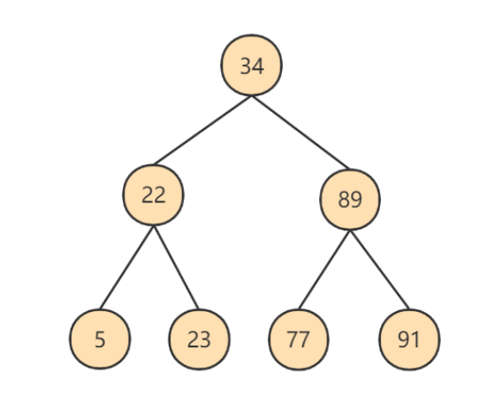

为了提高查询效率，就需要 减少磁盘IO数 。为了减少磁盘IO的次数，就需要尽量 降低树的高度 ，需要把 原来“瘦高”的树结构变的“矮胖”，树的每层的分叉越多越好。


#### 6.4 AVL树

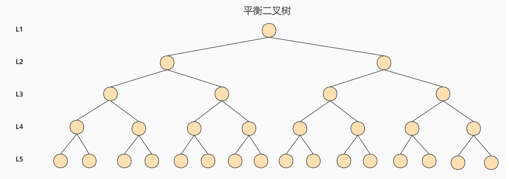

针对同样的数据，如果我们把二叉树改成 M 叉树 （M>2）呢？当 M=3 时，同样的 31 个节点可以由下面 的三叉树来进行存储：

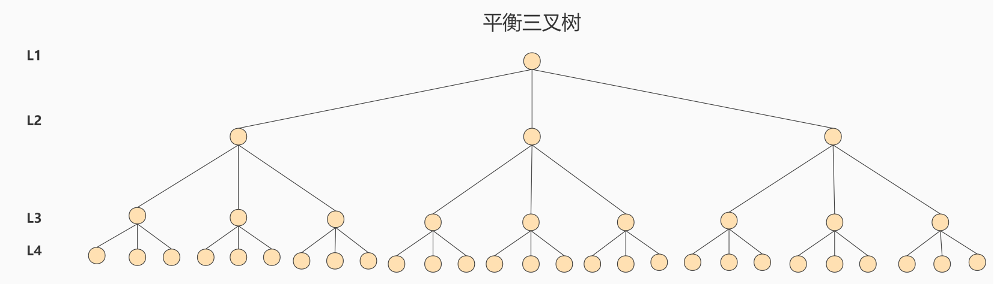


#### 6.5 B-Tree

B 树的结构如下图所示：

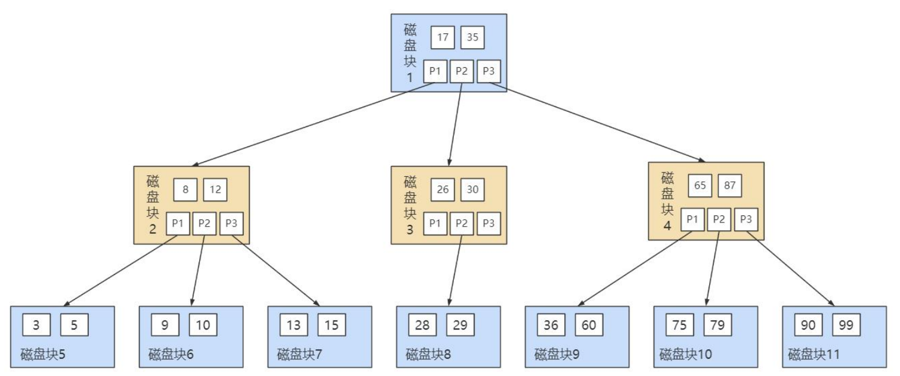

一个 M 阶的 B 树（M>2）有以下的特性：

1. 根节点的儿子数的范围是 [2,M]。
2. 每个中间节点包含 k-1 个关键字和 k 个孩子，孩子的数量 = 关键字的数量 +1，k 的取值范围为[ceil(M/2), M]。
3. 叶子节点包括 k-1 个关键字（叶子节点没有孩子），k 的取值范围为 [ceil(M/2), M]。
4. 假设中间节点节点的关键字为：Key[1], Key[2], …, Key[k-1]，且关键字按照升序排序，即 Key[i]<Key[i+1]。此时 k-1 个关键字相当于划分了 k 个范围，也就是对应着 k 个指针，即为：P[1], P[2], …,P[k]，其中 P[1] 指向关键字小于 Key[1] 的子树，P[i] 指向关键字属于 (Key[i-1], Key[i]) 的子树，P[k] 指向关键字大于 Key[k-1] 的子树。
5. 所有叶子节点位于同一层。

上面那张图所表示的 B 树就是一棵 3 阶的 B 树。我们可以看下磁盘块 2，里面的关键字为（8，12），它 有 3 个孩子 (3，5)，(9，10) 和 (13，15)，你能看到 (3，5) 小于 8，(9，10) 在 8 和 12 之间，而 (13，15) 大于 12，刚好符合刚才我们给出的特征。

然后我们来看下如何用 B 树进行查找。假设我们想要 查找的关键字是 9 ，那么步骤可以分为以下几步：

1. 我们与根节点的关键字 (17，35）进行比较，9 小于 17 那么得到指针 P1；
2. 按照指针 P1 找到磁盘块 2，关键字为（8，12），因为 9 在 8 和 12 之间，所以我们得到指针 P2；
3. 按照指针 P2 找到磁盘块 6，关键字为（9，10），然后我们找到了关键字 9。

你能看出来在 B 树的搜索过程中，我们比较的次数并不少，但如果把数据读取出来然后在内存中进行比 较，这个时间就是可以忽略不计的。而读取磁盘块本身需要进行 I/O 操作，消耗的时间比在内存中进行 比较所需要的时间要多，是数据查找用时的重要因素。 B 树相比于平衡二叉树来说磁盘 I/O 操作要少 ， 在数据查询中比平衡二叉树效率要高。所以 只要树的高度足够低，IO次数足够少，就可以提高查询性能 。

再举例1：

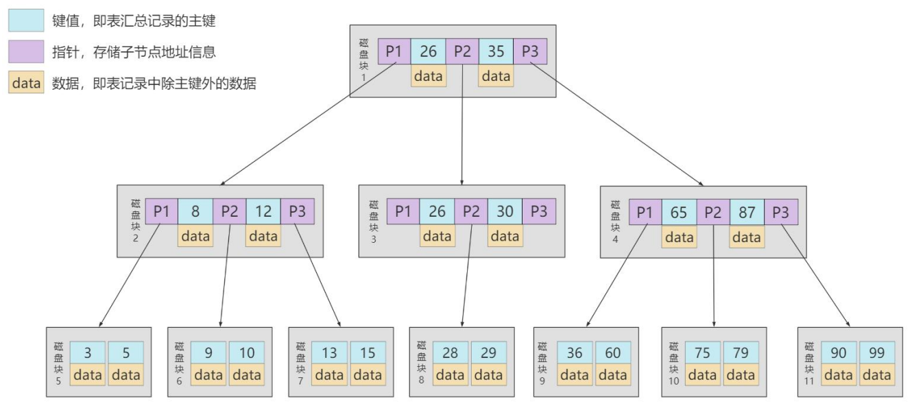


#### 6.6 B+Tree

- MySQL官网说明：

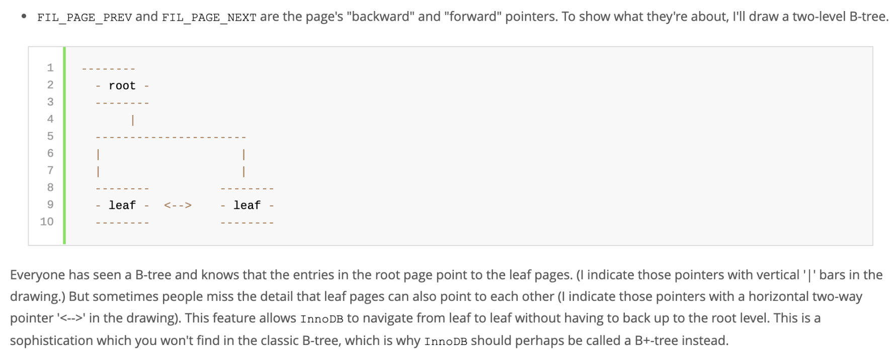

B+ 树和 B 树的差异：

1. 有 k 个孩子的节点就有 k 个关键字。也就是孩子数量 = 关键字数，而 B 树中，孩子数量 = 关键字数 +1。

2. 非叶子节点的关键字也会同时存在在子节点中，并且是在子节点中所有关键字的最大（或最小）。
3. 非叶子节点仅用于索引，不保存数据记录，跟记录有关的信息都放在叶子节点中。而 B 树中， 非叶子节点既保存索引，也保存数据记录 。
4. 所有关键字都在叶子节点出现，叶子节点构成一个有序链表，而且叶子节点本身按照关键字的大小从小到大顺序链接。

> B 树和 B+ 树都可以作为索引的数据结构，在 MySQL 中采用的是 B+ 树。 
>
> 但B树和B+树各有自己的应用场景，不能说B+树完全比B树好，反之亦然。

- 思考题：为了减少IO，索引树会一次性加载吗？
- 思考题：B+树的存储能力如何？为何说一般查找行记录，最多只需1~3次磁盘IO
- 思考题：为什么说B+树比B-树更适合实际应用中操作系统的文件索引和数据库索引？
- 思考题：Hash 索引与 B+ 树索引的区别
- 思考题：Hash 索引与 B+ 树索引是在建索引的时候手动指定的吗？


## 七、InnoDB数据存储结构

### 1. 数据库的存储结构：页

索引结构给我们提供了高效的索引方式，不过索引信息以及数据记录都是保存在文件上的，确切说是存储在页结构中。另一方面，索引是在存储引擎中实现的，MySQL服务器上的存储引擎负责对表中数据的读取和写入工作。不同存储引擎中存放的格式一般是不同的，甚至有的存储引擎比如Memory都不用磁盘来存储数据。

由于InnoDB是MySQL的默认存储引擎，所以本章剖析innoDB存储引擎的数据存储结构。


#### 1.1 磁盘与内存交互基本单位：页

InnoDB将数据划分为若干个页，InnoDB中页的大小默认为16KB。

以页作为磁盘和内存之间交互的基本单位，也就是一次最少从磁盘中读取16KB的内容到内存中，一次最少把内存中的16KB内容刷新到磁盘中。也就是说，在数据库中，不论读一行，还是读多行，都是将这些行所在的页进行加载。也就是说，数据库管理存储空间的基本单位是页（Page），数据库I/O操作的最小单位是页。一个页中可以存储多个行记录。

> 记录是按照行来存储的，但是数据库的读取并不以行为单位，否则一次读取（也就是一次1/0操作）只能处理一行数据，效率会非常低。
>


#### 1.2 页结构概述

页a、页b、页c..页n这些页可以不在物理结构上相连，只要通过双向链表相关联即可。每个数据页中的记录会按照主键值从小到大的顺序组成一个单向链表，每个数据页都会为存储在它里边的记录生成一个页目录，在通过主键查找某条记录的时候可以在页目录中使用二分法快速定位到对应的槽，然后再遍历该槽对应分组中的记录即可快速找到指定的记录。


#### 1.3 页的大小

不同的数据库管理系统（简称DBMS）的页大小不同。比如在MySQL的InnoDB存储引|擎中，默认页的大小是 16KB，我们可以通过下面的命令来进行查看：

```mysql
mysql> show variables like '%innodb_page_size%';
```


#### 1.4 页的上层结构

另外在数据库中，还存在着区（Extent）、段（Segment）和表空间（Tablespace）的概念。行、页、区、段、表空间的关系如下图所示：

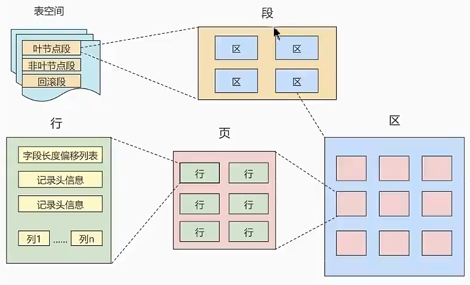

**区（Extent）**是比页大一级的存储结构，在InnoDB存储引擎中，一个区会分配64个连续的页。因为InnoDB中的页大小默认是16KB，所以一个区的大小是64*16KB=1MB。

**段（Segment）**由一个或多个区组成，区在文件系统是一个连续分配的空间（在InnoDB中是连续的64个页），不过在段中不要求区与区之间是相邻的。段是数据库中的分配单位，不同类型的数据库对象以不同的段形式存在。当我们创建数据表、索引的时候，就会相应创建对应的段，比如创建一张表时会创建一个表段，创建一个索引时会创建一个索引段。

**表空间（Tablespace）**是一个逻辑容器，表空间存储的对象是段，在一个表空间中可以有一个或多个段，但是一个段只能属于一个表空间。数据库由一个或多个表空间组成，表空间从管理上可以划分为系统表空间、用户表空间、撤销表空间、临时表空间等。


### 2. 页的内部结构

页如果按类型划分的话，常见的有数据页（保存B+树节点）、系统页、Undo页和事务数据页等。数据页是我们最常使用的页。

数据页的16KB大小的存储空间被划分为七个部，分别是文件头（FileHeader）、页头（PageHeader）、最大最小记录（Infimum+supremum）、用户记录（UserRecords）、空闲空间（Free Space）、页目录（PageDirectory）和文件尾（FileTailer）。

页结构的示意图如下所示：

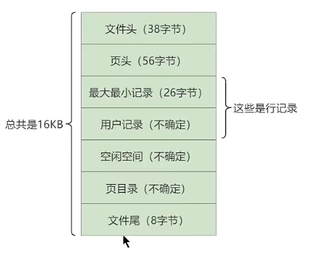


这7个部分作用分别如下，我们简单梳理如下表所示：

| 名称               | 占用大小 | 说明                                 |
| ------------------ | -------- | ------------------------------------ |
| File Header        | 38字节   | 文件头，描述页的信息                 |
| Page Header        | 56字节   | 页头，页的状态信息                   |
| Infimum + Supremum | 26字节   | 最大和最小记录，这是两个虚拟的行记录 |
| User Records       | 不确定   | 用户记录，存储行记录内容             |
| Free Space         | 不确定   | 空闲记录，页中还没有被使用的空间     |
| Pace Directory     | 不确定   | 页目录，存储用户记录的相对位置       |
| File Trailer       | 8字节    | 文件尾，校验页是否完整               |

我们可以把这7个结构分成3个部分。


#### 2.1 第1部分：FileHeader（文件头部）和FileTrailer（文件尾部）

作用：描述各种页的通用信息（比如页的编号、其上一页、下一页是谁等）


1. FileHeader（文件头部）

- FIL_PAGE_OFFSET（4字节）
  每一个页都有一个单独的页号，就跟你的身份证号码一样，InnoDB通过页号可以唯一定位一个页。
- FIL_PAGE_TYPE（2字节）
  这个代表当前页的类型

| 类型名称                | 十六进制 | 描述                           |
| ----------------------- | -------- | ------------------------------ |
| FIL_PAGE_TYPE_ALLOCATED | 0x0000   | 最新分配，还没使用             |
| FIL_PAGE_UNDO_LOG       | 0x0002   | Undo日志页                     |
| FIL_PAGE_INODE          | 0x0003   | 段信息节点                     |
| FIL_PAGE_IBUF_FREE_LIST | 0x0004   | Insert Buffer空闲列表          |
| FIL_PAGE_IBUF_BITMAP    | 0x0005   | Insert Buffer位图              |
| FIL_PAGE_TYPE_SYS       | 0x0006   | 系统页                         |
| FIL_PAGE_TYPE_TRX_SYS   | 0x0007   | 事务系统数据                   |
| FIL_PAGE_TYPE_FSP_HDR   | 0x0008   | 表空间头部信息                 |
| FIL_PAGE_TYPE_XDES      | 0x0009   | 扩展描述页                     |
| FIL_PAGE_TYPE_BLOB      | 0x000A   | 溢出页                         |
| FIL_PAGE_INDEX          | 0x45BF   | 索引顶，也就是我们所说的数据页 |

- FIL_PAGE_PREV（4字节）和FIL_PAGE_NEXT（4字节）
  InnoDB都是以页为单位存放数据的，如果数据分散到多个不连续的页中存储的话需要把这些页关联起来，FIL_PAGE_PREV和FIL_PAGE_NEXT就分别代表本页的上一个和下一个页的页号。这样通过建立一个双向链表把许许多多的页就都串联起来了，保证这些页之间不需要是物理上的连续，而是逻辑上的连续。


- FIL_PAGE_SPACE_OR_CHKSUM（4字节）
  代表当前页面的校验和（checksum）

**什么是校验和？**
就是对于一个很长的字节串来说，我们会通过某种算法来计算一个比较短的值来代表这个很长的字节串，这个比较短的值就称为校验和。

在比较两个很长的字节串之前，先比较这两个长字节串的校验和，如果校验和都不一样，则两个长字节串肯定是不同的，所以省去了直接比较两个比较长的字节串的时间损耗 。


- FIL_PAGE_LSN（8字节）
  页面被最后修改时对应的日志序列位置（英文名是：LogSequenceNumber）


2. FileTrailer（文件尾部）（8字节）

- 前4个字节代表页的校验和：
  这个部分是和FileHeader中的校验和相对应的。
- 后4个字节代表页面被最后修改时对应的日志序列位置（LSN）：
  这个部分也是为了校验页的完整性的，如果首部和尾部的LSN值校验不成功的话，就说明同步过程出现了问题。


#### 2.2 第2部分：UserRecords（用户记录）、最大最小记录、FreeSpace(空闲空间)

第二个部分是记录部分，页的主要作用是存储记录，所以“最大和最小记录”和“用户记录”部分占了页结构的主要空间。

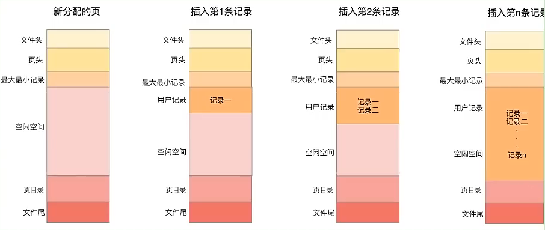


1. Free Space（空闲空间）
   我们自己存储的记录会按照指定的行格式存储到User Records部分。但是在一开始生成页的时候，其实并没有UserRecords这个部分，每当我们插入一条记录，都会从Free Space部分，也就是尚未使用的存储空间中申请一个记录大小的空间划分到User Records部分，当FreeSpace部分的空间全部被UserRecords部分替代掉之后，也就意味着这个页使用完了，如果还有新的记录插入的话，就需要去申请新的页了。

2. User Records（用户记录）
   UserRecords中的这些记录按照指定的行格式一条一条摆在UserRecords部分，相互之间形成单链表。

3. Infimum+Supremum（最小最大记录）
   InnoDB规定的最小记录与最大记录这两条记录的构造十分简单，都是由5字节大小的记录头信息和8字节大小的一个固定的部分组成的。
   这两条记录不是我们自己定义的记录，所以它们并不存放在页的UserRecords部分，他们被单独放在一个称为Infimum+Supremum的部分。


#### 2.3 第3部分：PageDirectory（页目录）、Page Header（页面头部）

1. Page Directory（页目录）

**为什么需要页目录？**

在页中，记录是以单向链表的形式进行存储的。单向链表的特点就是插入、删除非常方便，但是检索效率不高，最差的情况下需要遍历链表上的所有节点才能完成检索。因此在页结构中专门设计了页目录这个模块，专门给记录做一个目录，通过二分查找法的方式进行检索，提升效率。


2. Page Header（页面头部）

为了能得到一个数据页中存储的记录的状态信息，比如本页中已经存储了多少条记录，第一条记录的地址是什么，页目录中存储了多少个槽等等，特意在页中定义了一个叫Page Header的部分，这个部分占用固定的56个字节，专门存储各种状态信息。


#### 2.4 从数据页的角度看B+树如何查询

一棵B+树按照节点类型可以分成两部分：

1. 叶子节点，B+树最底层的节点，节点的高度为0，存储行记录。
2. 非叶子节点，节点的高度大于0，存储索引键和页面指针，并不存储行记录本身。

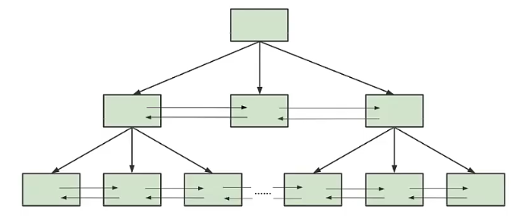

当我们从页结构来理解B+树的结构的时候，可以帮我们理解一些通过索引进行检索的原理： 

1. B+树是如何进行记录检索的？
   如果通过B+树的索引查询行记录，首先是从B+树的根开始，逐层检索，直到找到叶子节点，也就是找到对应的数据页为止，将数据页加载到内存中，页目录中的槽（slot）采用二分查找的方式先找到一个粗略的记录分组，然后再在分组中通过链表遍历的方式查找记录。


### 3. InnoDB行格式（或记录格式）

#### 3.1 COMPACT行格式

在MySQL5.1版本中，默认设置为Compact行格式。一条完整的记录其实可以被分为记录的额外信息和记录的真实数据两大部分。

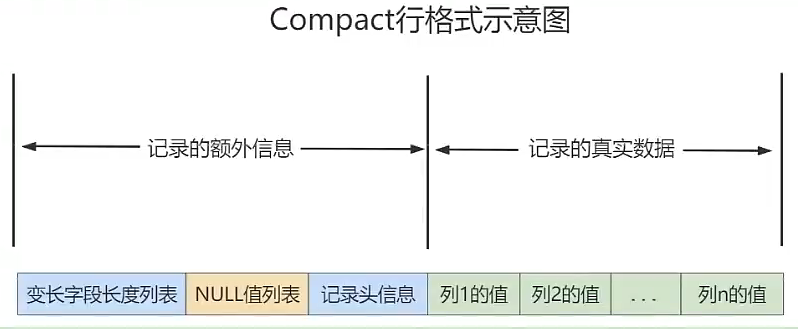


1. 变长字段长度列表

MySQL支持一些变长的数据类型，比如VARCHAR(M)、VARBINARY(M)、TEXT类型、BLOB类型，这些数据类型修饰列称为变长字段，变长字段中存储多少字节的数据不是固定的，所以我们在存储真实数据的时候需要顺便把这些数据占用的字节数也存起来。在 Compact行格式中，把所有变长字段的真实数据占用的字节长度都存放在记录的开头部位，从而形成一个变长字段长度列表。

注意：这里面存储的变长长度和字段顺序是反过来的。比如两个varchar字段在表结构的顺序是a(10)，b(15)。那么在变长字段长度列表中存储的长度顺序就是15，10，是反过来的。


2. Null值列表

Compact行格式会把可以为NULL的列统一管理起来，存在一个标记为NULL值列表中。如果表中没有允许存储NULL的列，则NULL值列表也不存在了。

**为什么定义NULL值列表？**
之所以要存储NULL是因为数据都是需要对齐的，如果没有标注出来NULL值的位置，就有可能在查询数据的时候出现混乱。如果使用一个特定的符号放到相应的数据位表示空置的话，虽然能达到效果，但是这样很浪费空间，所以直接就在行数据得头部开辟出一块空间专门用来记录该行数据哪些是非空数据，哪些是空数据，格式如下：

（1）二进制位的值为1时，代表该列的值为NULL。

（2）二进制位的值为0时，代表该列的值不为NULL。


3. 记录头信息(5字节)

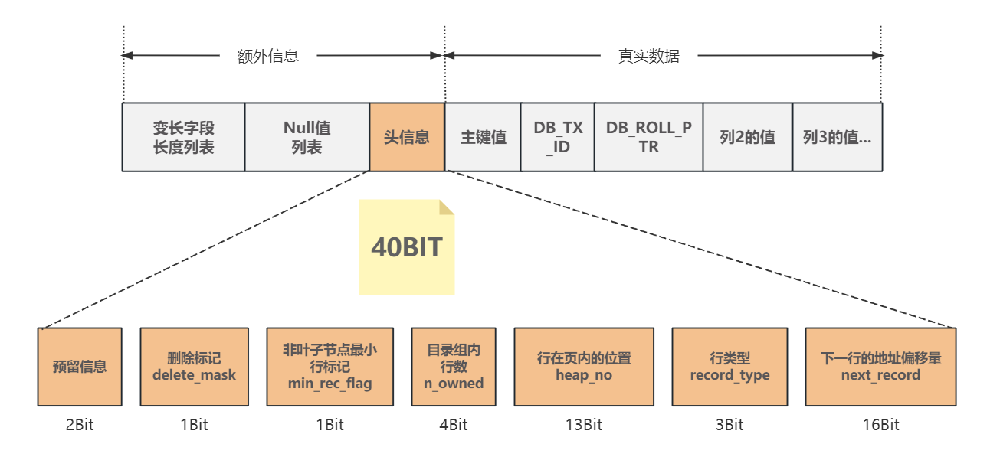

- 下一行地址偏移量: next_record 占16bit，通过这个信息将所有的行链接成一个单向链表
- 行类型: record_type 占3bit，包括四种类型:
  - 0: 普通数据行
  - 1: 索引目录行
  - 2: 页内最小行 infimun
  - 3: 页内最大行 supremun
- 行在整个页中的位置: heap_no 占13bit;
- 分组的行数: n_owned 占4bit，只在该行是分组最后一行才有值，这样就可以快速查询行数，而不用一条条的累加了
- B+树索引树每层最小值标记: min_rec_flag 占1bit，如果当前行的类型是目录行也就是 record_type=1，同时也是B+索引树某层的最小值，则会置为1，会在索引查询时用到，后面我们讲索引时再介绍
- 删除标记: delete_mask 占 1bit，从页中删除数据行时，并不会直接移除，而是修改这个删除标记为0
- 预留区: 占2bit


4. 记录的真实数据

记录的真实数据除了我们自己定义的列的数据以外，还会有三个隐藏列：

| 列名           | 是否必须 | 占用空间 | 描述                   |
| -------------- | -------- | -------- | ---------------------- |
| row_id         | 否       | 6字节    | 行ID、唯一标识一条记录 |
| transaction_id | 是       | 6字节    | 事务ID                 |
| roll_pointer   | 是       | 7字节    | 回滚指针               |

实际上这几个列的真正名称其实是：DB_ROW_ID、DB_TRX_ID、DB_ROLL_PTR。

- 一个表没有手动定义主键，则会选取一个Unigue键作为主键，如果连Unigue键都没有定义的话，则会为表默认添加一个名为row_id的隐藏列作为主键。所以row_id是在没有自定义主键以及Unique键的情况下才会存在的。
- 事务ID和回滚指针在后面的《第14章MySQL事务日志》章节中讲解。


#### 3.2 Dynamic和Compressed行格式

1. 行溢出

InnoDB存储引擎可以将一条记录中的某些数据存储在真正的数据页面之外。

MySQL数据库提供的VARCHAR(M)类型，认为可以存放65535字节。这是真的吗？如果我们使用ascii字符集的话，一个字符就代表一个字节，我们看看VARCHAR(65535)是否可用。

```mysql
CREATE TABLE varchar_size_demo(
    c CVARCHAR(65535)
) CHARSET=ascii ROW_FORMAT=Compact; 
```

结果报错

报错信息表达的意思是：MySQL对一条记录占用的最大存储空间是有限制的，除BLOB或者TEXT类型的列之外，其他所有的列（不包括隐藏列和记录头信息）占用的字节长度加起来不能超过65535个字节。

这个65535个字节除了列本身的数据之外，还包括一些其他的数据，以Compact行格式为例，比如说我们为了存储一个VARCHAR(M)类型的列，除了真实数据占有空间以外，还需要记录的额外信息。

通过上面的案例，我们可以知道一个页的大小一般是16KB，也就是16384字节，而一个 VARCHAR(M)类型的列就最多可以存储65533个字节，这样就可能出现一个页存放不了条记录，这种现象称为行溢出。

在Compact和Reduntant行格式中，对于占用存储空间非常大的列，在记录的真实数据处只会存储该列的一部分数据，把剩余的数据分散存储在几个其他的页中进行分页存储，然后记录的真实数据处用20个字节存储指向这些页的地址（当然这20个字节中还包括这些分散在其他页面中的数据的占用的字节数），从而可以找到剩余数据所在的页。这称为页的扩展，举例如下：

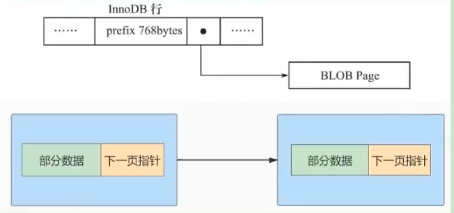


2. Dynamic和Compressed行格式

在MySQL8.O中，默认行格式就是Dynamic，Dynamic、Compressed行格式和 Compact行格式挺像，只不过在处理行溢出数据时有分歧：

- Compressed和Dynamic两种记录格式对于存放在BLOB中的数据采用了完全的行溢出的方式。如图，在数据页中只存放20个字节的指针（溢出页的地址），实际的数据都存放在Off Page（出页）中。
- Compact和Redundant两种格式会在记录的真实数据处存储一部分数据（存放 768个前缀字节）。

Compressed行记录格式的另一个功能就是，存储在其中的行数据会以zlib的算法进行压缩，因此对于BLOB、TEXT、VARCHAR这类大长度类型的数据能够进行非常有效的存储


#### 3.3 Redundant行格式

Redundant是MySQL5.0版本之前InnoDB的行记录存储方式，MySQL5.0支持 Redundant是为了兼容之前版本的页格式。

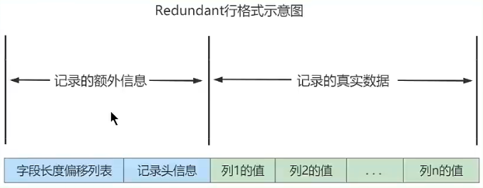

从上图可以看到，不同于Compact行记录格式，Redundant行格式的首部是一个字段长度偏移列表，同样是按照列的顺序逆序放置的。

下边我们从各个方面看一下Redundant行格式有什么不同的地方。

1. 字段长度偏移列表

注意Compact行格式的开头是变长字段长度列表，而Redundant行格式的开头是字段长度偏移列表，与变长字段长度列表有两处不同：

- 少了“变长”两个字：Redundant行格式会把该条记录中所有列（包括隐藏列）的长度信息都按照逆序存储到字段长度偏移列表。
- 多了“偏移”两个字：这意味着计算列值长度的方式不像Compact行格式那么直观，它是采用两个相邻数值的差值来计算各个列值的长度。

举例：比如第一条记录的字段长度偏移列表就是： 2B251F1B130C06

因为它是逆序排放的，所以按照列的顺序排列就是： 060C13171A2425

按照两个相邻数值的差值来计算各个列值的长度的意思就是：

- 第一列(row_id)的长度就是0x06个字节，也就是6个字节。
- 第二列(transaction_id)的长度就是（Ox0c-0x06)个字节，也就是6个字节。
- 第三列(roll_pointer)的长度就是（0x13-0x0C)个字节，也就是7个字节。
- 第四列(col1)的长度就是（0x1B-0x13)个字节，也就是8个字节。
- 第五列(col2)的长度就是（0x1F-0x1B)个字节，也就是4个字节。


2. 记录头信息（record header）

与Compact行格式的记录头信息对比来看，有两处不同：

- Redundant行格式多了n_field和1byte_offs_flag这两个属性。 Redundant行格式没有
- record_type这个属性。


### 4. 区、段与碎片区

#### 4.1 为什么要有区？

B+树的每一层中的页都会形成一个双向链表，如果是以页为单位来分配存储空间的话，双向链表相邻的两个页之间的物理位置可能离得非常远。我们介绍B+树索引的适用场景的时候特别提到范围查询只需要定位到最左边的记录和最右边的记录，然后沿着双向链表一直扫描就可以了，而如果链表中相邻的两个页物理位置离得非常远，就是所谓的随机I/0。再一次强调，磁盘的速度和内存的速度差了好几个数量级，随机I/0是非常慢的，所以我们应该尽量让链表中相邻的页的物理位置也相邻，这样进行范围查询的时候才可以使用所谓的顺序I/0。

引入区的概念，一个区就是在物理位置上连续的64个页。因为InnoDB中的页大小默认是16KB，所以一个区的大小是64*16KB=1MB。在表中数据量大的时候，为某个索引分配空间的时候就不再按照页为单位分配了，而是按照区为单位分配，甚至在表中的数据特别多的时候，可以一次性分配多个连续的区。虽然可能造成一点点空间的浪费（数据不足以填充满整个区），但是从性能角度看，可以消除很多的随机I/0，功大于过！


#### 4.2 为什么要有段？

对于范围查询，其实是对B+树叶子节点中的记录进行顺序扫描，而如果不区分叶子节点和非叶子节点，统统把节点代表的页面放到申请到的区中的话，进行范围扫描的效果就大打折扣了。所以InnoDB对B+树的叶子节点和非叶子节点进行了区别对待，也就是说叶子节点有自己独有的区，非叶子节点也有自己独有的区。存放叶子节点的区的集合就算是一个段（segment），存放非叶子节点的区的集合也算是一个段。也就是说一个索引会生成2个段，一个叶子节点段，一个非叶子节点段。

除了索引的叶子节点段和非叶子节点段之外，InnoDB中还有为存储一些特殊的数据而定义的段，比如回滚段。所以，常见的段有数据段、索引段、回滚段。数据段即为B+树的叶子节点，索引段即为B+树的非叶子节点。

在lnnoDB存储引|擎中，对段的管理都是由引擎自身所完成，DBA不能也没有必要对其进行控制。这从一定程度上简化了DBA对于段的管理。

段其实不对应表空间中某一个连续的物理区域，而是一个逻辑上的概念，由若干个零散的页面以及一些完整的区组成。


#### 4.3 为什么要有碎片区？

默认情况下，一个使用lnnoDB存储引擎的表只有一个聚簇索引，一个索引会生成2个段，而段是以区为单位申请存储空间的，一个区默认占用1M（64*16Kb=1024Kb）存储空间，所以默认情况下一个只存了几条记录的小表也需要2M的存储空间么？以后每次添加一个索引都要多申请2M的存储空间么？这对于存储记录比较少的表简直是天大的浪费。这个问题的症结在于到现在为止我们介绍的区都是非常纯粹的，也就是一个区被整个分配给某一个段，或者说区中的所有页面都是为了存储同一个段的数据而存在的，即使段的数据填不满区中所有的页面，那余下的贡面也不能挪作他用。

为了考虑以完整的区为单位分配给某个段对于数据量较小的表太浪费存储空间的这种情况，InnoDB提出了一个碎片（fragment）区的概念。在一个碎片区中，并不是所有的页都是为了存储同一个段的数据而存在的，而是碎片区中的页可以用于不同的目的，比如有些页用于段A，有些页用于段B，有些页甚至哪个段都不属于。碎片区直属于表空间，并不属于任何一个段。

所以此后为某个段分配存储空间的策略是这样的：

- 在刚开始向表中插入数据的时候，段是从某个碎片区以单个页面为单位来分配存储空间的。
- 当某个段已经占用了32个碎片区页面之后，就会申请以完整的区为单位来分配存储空间。

所以现在段不能仅定义为是某些区的集合，更精确的应该是某些零散的页面以及一些完整的区的集合。


#### 4.4 区的分类

区大体上可以分为4种类型：

- 空闲的区（FREE）：现在还没有用到这个区中的任何页面。
- 有剩余空间的碎片区（FREE_FRAG）：表示碎片区中还有可用的页面。
- 没有剩余空间的碎片区（FULL_FRAG）：表示碎片区中的所有页面都被使用，没有空闲页面。
- 附属于某个段的区（FSEG）：每一个索引都可以分为叶子节点段和非叶子节点段。

处于FREE、FREE_FRAG以及FULL_FRAG这三种状态的区都是独立的，直属于表空间。而处于FSEG状态的区是附属于某个段的。


### 5. 表空间

表空间可以看做是InnoDB存储引擎逻辑结构的最高层，所有的数据都存放在表空间中。

表空间是一个逻辑容器，表空间存储的对象是段，在一个表空间中可以有一个或多个段，但是一个段只能属于一个表空间。表空间数据库由一个或多个表空间组成，表空间从管理上可以划分为系统表空间（System tablespace）、独立表空间（File-per-table tablespace）、撤销表空间（Undo Tablespace）和临时表空间（TemporaryTablespace）等。


#### 5.1 独立表空间

独立表空间，即每张表有一个独立的表空间，也就是数据和索引信息都会保存在自己的表空间中。独立的表空间（即：单表）可以在不同的数据库之间进行迁移。

空间可以回收（DROPTABLE操作可自动回收表空间；其他情况，表空间不能自己回收）。如果对于统计分析或是日志表，删除大量数据后可以通过：altertableTableNameengine=innodb；回收不用的空间。对于使用独立表空间的表，不管怎么删除，表空间的碎片不会太严重的影响性能，而且还有机会处理。

独立表空间结构
独立表空间由段、区、页组成。前面已经讲解过了。

真实表空间对应的文件大小
我们到数据目录里看，会发现一个新建的表对应的.ibd文件只占用了96K，才6个页面大小（MySQL5.7中），这是因为一开始表空间占用的空间很小，因为表里边都没有数据。不过别忘了这些.ibd文件是自扩展的，随着表中数据的增多，表空间对应的文件也逐渐增大。

查看InnoDB的表空间类型：

```mysql
mysql > show variables like 'innodb_file_per_table';
```


#### 5.2 系统表空间

系统表空间的结构和独立表空间基本类似，只不过由于整个MySQL进程只有一个系统表空间，在系统表空间中会额外记录一些有关整个系统信息的页面，这部分是独立表空间中没有的。

每当我们向一个表中插入一条记录的时候，MySQL校验过程如下：

先要校验一下插入语句对应的表存不存在，插入的列和表中的列是否符合，如果语法没有问题的话，还需要知道该表的聚簇索引和所有二级索引对应的根页面是哪个表空间的哪个页面，然后把记录插入对应索引的B+树中。所以说，MySQL除了保存着我们插入的用户数据之外，还需要保存许多额外的信息，比方说：

- 某个表属于哪个表空间，表里边有多少列
- 表对应的每一个列的类型是什么
- 该表有多少索引，每个索引对应哪几个字段，该索引对应的根页面在哪个表空间的哪个页面
- 该表有哪些外键，外键对应哪个表的哪些列
- 某个表空间对应文件系统上文件路径是什么

上述这些数据并不是我们使用INSERT语句插入的用户数据，实际上是为了更好的管理我们这些用户数据而不得已引入的一些额外数据，这些数据也称为元数据。InnoDB存储引擎特意定义了一些列的内部系统表（internal systemtable）来记录这些这些元数据：

| 表名             | 描述                                                       |
| ---------------- | ---------------------------------------------------------- |
| SYS_TABLES       | 整个InnoDB存储引擎中所有的表的信息                         |
| SYS_COLUMNS      | 整个InnoDB存储引擎中所有的列的信息                         |
| SYS_INDEXES      | 整个InnoDB存储引擎中所有的索引l的信息                      |
| SYS_FIELDS       | 整个InnoDB存储引擎中所有的索引对应的列的信息               |
| SYS_FOREIGN      | 整个InnoDB存储引擎中所有的外键的信息                       |
| SYS_FOREIGN_COLS | 整个InnoDB存储引擎中所有的外键对应列的信息                 |
| SYS_TABLESPACES  | 整个InnoDB存储引擎中所有的表空间信息                       |
| SYS_DATAFILES    | 整个InnoDB存储引擎中所有的表空间对应文件系统的文件路径信息 |
| SYS_VIRTUAL      | 整个InnoDB存储引擎中所有的虚拟生成列的信息                 |

这些系统表也被称为数据字典，它们都是以B+树的形式保存在系统表空间的某些页面中，其中SYS_TABLES、 SYS_COLUMNS、SYS_INDEXES、SYS_FIELDS这四个表尤其重要，称之为基本系统表（basic System tables）


### 6. 附录：数据页加载的三种方式

InnoDB从磁盘中读取数据的最小单位是数据页。而你想得到的id=xxx的数据，就是这个数据页众多行中的一行。

对于MySQL存放的数据，逻辑概念上我们称之为表，在磁盘等物理层面而言是按数据页形式进行存放的，当其加载到MySQL中我们称之为缓存页。

如果缓冲池中没有该页数据，那么缓冲池有以下三种读取数据的方式，每种方式的读取效率都是不同的：


1. 内存读取
   如果该数据存在于内存中，基本上执行时间在1ms左右，效率还是很高的。

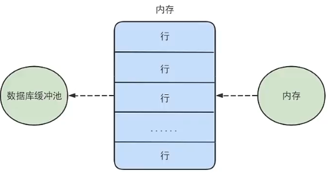


2. 随机读取
   如果数据没有在内存中，就需要在磁盘上对该页进行查找，整体时间预估在10ms左右，这10ms中有6ms是磁盘的实际繁忙时间（包括了寻道和半圈旋转时间），有3ms是对可能发生的排队时间的估计值，另外还有1ms的传输时间，将页从磁盘服务器缓冲区传输到数据库缓冲区中。这10ms看起来很快，但实际上对于数据库来说消耗的时间已经非常长了，因为这还只是一个页的读取时间。

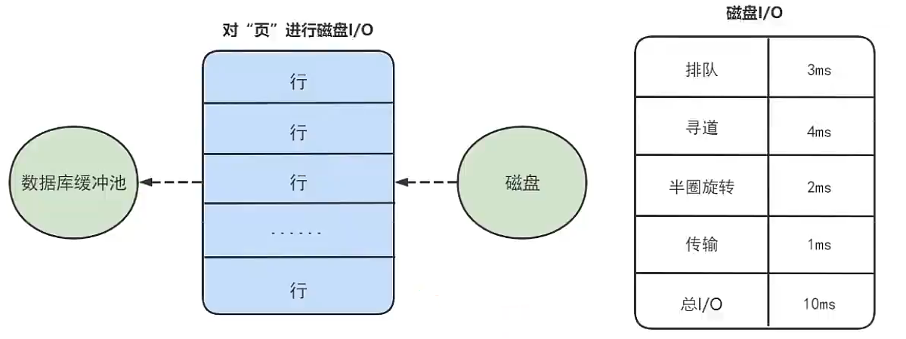


3. 顺序读取
   顺序读取其实是一种批量读取的方式，因为我们请求的数据在磁盘上往往都是相邻存储的，顺序读取可以帮我们批量读取页面，这样的话，一次性加载到缓冲池中就不需要再对其他页面单独进行磁盘/0操作了。如果一个磁盘的吞吐量是40MB/S，那么对于一个16KB大小的页来说，一次可以顺序读取2560（40MB/16KB）个页，相当于一个页的读取时间为0.4ms。采用批量读取的方式，即使是从磁盘上进行读取，效率也比从内存中只单独读取一个页的效率要高。


## 八、索引的创建与设计原则

### 1. 索引的声明与使用

#### 1.1 索引的分类

MySQL的索引包括普通索引、唯一性索引、全文索引、单列索引、多列索引和空间索引等。

- 从 功能逻辑 上说，索引主要有 4 种，分别是普通索引、唯一索引、主键索引、全文索引。
- 按照 物理实现方式 ，索引可以分为 2 种：聚簇索引和非聚簇索引。
- 按照 作用字段个数 进行划分，分成单列索引和联合索引。

1. 普通索引
   在创建普通索引时，不附加任何限制条件，只是用于提高查询效率。这类索引可以创建在任何数据类型中，其值是否唯一和非空，要由字段本身的完整性约束条件决定。建立索引以后，可以通过索引进行查询。例如，在表 student的字段name上建立一个普通索引，查询记录时就可以根据该索引进行查询。

2. 唯一性索引
   使用UNIQUE参数可以设置索引为唯一性索引，在创建唯一性索引时，限制该索引的值必须是唯一的，但允许有空值。在一张数据表里可以有多个唯一索引。
   例如，在表student的字段email中创建唯一性索引，那么字段email的值就必须是唯一的。通过唯一性索引，可以更快速地确定某条记录。

3. 主键索引
   主键索引就是一种特殊的唯一性索引，在唯一索引的基础上增加了不为空的约束，也就是NOTNULL+UNIQUE，一张表里最多只有一个主键索引。
   Why？这是由主键索引的物理实现方式决定的，因为数据存储在文件中只能按照一种顺序进行存储。

4. 单列索引
   在表中的单个字段上创建索引。单列索引只根据该字段进行索引。单列索引可以是普通索引，也可以是唯一性索引，还可以是全文索引。只要保证该索引只对应一个字段即可。一个表可以有多个单列索引。

5. 多列(组合、联合)索引
   多列索引是在表的多个字段组合上创建一个索引。该索引指向创建时对应的多个字段，可以通过这几个字段进行查询，但是只有查询条件中使用了这些字段中的第一个字段时才会被使用。例如，在表中的字段id、name和gender上建立一个多列索引idx_id_name_gender，只有在查询条件中使用了字段id时该索引|才会被使用。使用组合索引时遵循最左前缀集合。

6. 全文索引
   全文索引（也称全文检索）是目前搜索引擎使用的一种关键技术。它能够利用【分词技术】等多种算法智能分析出文本文字中关键词的频率和重要性，然后按照一定的算法规则智能地筛选出我们想要的搜索结果。全文索引目非常适合大型数据集，对于小的数据集，它的用处比较小。

   使用参数FULLTEXT可以设置索引为全文索引。在定义索引的列上支持值的全文查找，允许在这些索引列中插入重复值和空值。全文索引I只能创建在CHAR、VARCHAR或TEXT类型及其系列类型的字段上，查询数据量较大的字符串类型的字段时，使用全文索引可以提高查询速度。例如，表student的字段information是TEXT类型，该字段包含了很多文字信息。在字段information上建立全文索引后，可以提高查询字段information的速度。

   全文索引典型的有两种类型：自然语言的全文索引和布尔全文索引。

   - 自然语言搜索引擎将计算每一个文档对象和查询的相关度。这里，相关度是基于匹配的关键词的个数，以及关键词在文档中出现的次数。在整个索引中出现次数越少的词语，匹配时的相关度就越高。相反，非常常见的单词将不会被搜索，如果一个词语的在超过50%的记录中都出现了，那么自然语言的搜索将不会搜索这类词语。

   随着大数据时代的到来，关系型数据库应对全文索引的需求已力不从心，逐渐被solr、ElasticSearch等专门的搜索引擎所替代。

7. 补充：空间索引
   使用参数SPATIAL可以设置索引为空间索引。空间索引I只能建立在空间数据类型上，这样可以提高系统获取空间数据的效率。MySQL中的空间数据类型包括GEOMETRY、POINT、LINESTRING和POLYGON等。目前只有MyISAM 存储引擎支持空间检索，而且索引的字段不能为空值。对于初学者来说，这类索引很少会用到。

**小结：不同的存储引擎支持的索引类型也不一样**

- InnoDB ：支持 B-tree、Full-text 等索引，不支持 Hash索引； 
- MyISAM ： 支持 B-tree、Full-text 等索引，不支持 Hash 索引；
- Memory ：支持 B-tree、Hash 等索引，不支持 Full-text 索引；
- NDB ：支持 Hash 索引，不支持 B-tree、Full-text 等索引；
- Archive ：不支持 B-tree、Hash、Full-text 等索引；


#### 1.2 创建索引

##### 1. 创建表的时候创建索引

举例：

```mysql
CREATE TABLE dept(
    dept_id INT PRIMARY KEY AUTO_INCREMENT,
    dept_name VARCHAR(20)
);

CREATE TABLE emp(
    emp_id INT PRIMARY KEY AUTO_INCREMENT,
    emp_name VARCHAR(20) UNIQUE,
    dept_id INT,
    CONSTRAINT emp_dept_id_fk FOREIGN KEY(dept_id) REFERENCES dept(dept_id)
);
```

但是，如果显式创建表时创建索引的话，基本语法格式如下：

```mysql
CREATE TABLE table_name [col_name data_type]
[UNIQUE | FULLTEXT | SPATIAL] [INDEX | KEY] [index_name] (col_name [length]) [ASC | DESC]
```

- UNIQUE 、 FULLTEXT 和 SPATIAL 为可选参数，分别表示唯一索引、全文索引和空间索引；
- INDEX 与 KEY 为同义词，两者的作用相同，用来指定创建索引；
- index_name 指定索引的名称，为可选参数，如果不指定，那么MySQL默认col_name为索引名；
- col_name 为需要创建索引的字段列，该列必须从数据表中定义的多个列中选择；
- length 为可选参数，表示索引的长度，只有字符串类型的字段才能指定索引长度；
- ASC 或 DESC 指定升序或者降序的索引值存储。


1. 创建普通索引

在book表中的year_publication字段上建立普通索引，SQL语句如下：

```mysql
CREATE TABLE book(
    book_id INT ,
    book_name VARCHAR(100),
    authors VARCHAR(100),
    info VARCHAR(100) ,
    comment VARCHAR(100),
    year_publication YEAR,
    INDEX(year_publication)
);
```


2. 创建唯一索引

举例：

```mysql
CREATE TABLE test1(
    id INT NOT NULL,
    name varchar(30) NOT NULL,
    UNIQUE INDEX uk_idx_id(id)
);
```

该语句执行完毕之后，使用SHOW CREATE TABLE查看表结构：

```mysql
SHOW INDEX FROM test1 \G
```


3. 主键索引

设定为主键后数据库会自动建立索引，innodb为聚簇索引，语法：

- 随表一起建索引：


```mysql
CREATE TABLE student (
    id INT(10) UNSIGNED AUTO_INCREMENT ,
    student_no VARCHAR(200),
    student_name VARCHAR(200),
    PRIMARY KEY(id)
);
```

- 删除主键索引：


```mysql
ALTER TABLE student
drop PRIMARY KEY ;
```

- 修改主键索引：必须先删除掉(drop)原索引，再新建(add)索引


4. 创建单列索引

举例：

```mysql
CREATE TABLE test2(
    id INT NOT NULL,
    name CHAR(50) NULL,
    INDEX single_idx_name(name(20))
);
```

该语句执行完毕之后，使用SHOW CREATE TABLE查看表结构：

```mysql
SHOW INDEX FROM test2 \G
```


5. 创建组合索引

举例：创建表test3，在表中的id、name和age字段上建立组合索引，SQL语句如下：

```mysql
CREATE TABLE test3(
    id INT(11) NOT NULL,
    name CHAR(30) NOT NULL,
    age INT(11) NOT NULL,
    info VARCHAR(255),
    INDEX multi_idx(id,name,age)
);
```

该语句执行完毕之后，使用SHOW INDEX 查看：

```mysql
SHOW INDEX FROM test3 \G
```


6. 创建全文索引

举例1：创建表test4，在表中的info字段上建立全文索引，SQL语句如下：

```mysql
CREATE TABLE test4(
    id INT NOT NULL,
    name CHAR(30) NOT NULL,
    age INT NOT NULL,
    info VARCHAR(255),
    FULLTEXT INDEX futxt_idx_info(info)
) ENGINE=MyISAM;
```

> 在MySQL5.7及之后版本中可以不指定最后的ENGINE了，因为在此版本中InnoDB支持全文索引。

举例2：

```mysql
CREATE TABLE articles (
    id INT UNSIGNED AUTO_INCREMENT PRIMARY KEY,
    title VARCHAR (200),
    body TEXT,
    FULLTEXT index (title, body)
) ENGINE = INNODB ;
```

创建了一个给title和body字段添加全文索引的表。

举例3：

```mysql
CREATE TABLE `papers` (
    `id` int(10) unsigned NOT NULL AUTO_INCREMENT,
    `title` varchar(200) DEFAULT NULL,
    `content` text,
    PRIMARY KEY (`id`),
    FULLTEXT KEY `title` (`title`,`content`)
) ENGINE=MyISAM DEFAULT CHARSET=utf8;
```

不同于like方式的的查询：

```mysql
SELECT * FROM papers WHERE content LIKE ‘%查询字符串%’;
```

全文索引用match+against方式查询：

```mysql
SELECT * FROM papers WHERE MATCH(title,content) AGAINST (‘查询字符串’);
```

注意点

1. 使用全文索引前，搞清楚版本支持情况；
2. 全文索引比 like + % 快 N 倍，但是可能存在精度问题；
3. 如果需要全文索引的是大量数据，建议先添加数据，再创建索引。


7. 创建空间索引

空间索引创建中，要求空间类型的字段必须为 非空 。

举例：创建表test5，在空间类型为GEOMETRY的字段上创建空间索引，SQL语句如下：

```mysql
CREATE TABLE test5(
    geo GEOMETRY NOT NULL,
    SPATIAL INDEX spa_idx_geo(geo)
) ENGINE=MyISAM;
```


##### 2. 在已经存在的表上创建索引

在已经存在的表中创建索引可以使用ALTER TABLE语句或者CREATE INDEX语句。

1. 使用ALTER TABLE语句创建索引 ALTER TABLE语句创建索引的基本语法如下：

```mysql
ALTER TABLE table_name ADD [UNIQUE | FULLTEXT | SPATIAL] [INDEX | KEY]
[index_name] (col_name[length],...) [ASC | DESC]
```

2. 使用CREATE INDEX创建索引 CREATE INDEX语句可以在已经存在的表上添加索引，在MySQL中， CREATE INDEX被映射到一个ALTER TABLE语句上，基本语法结构为：

```mysql
CREATE [UNIQUE | FULLTEXT | SPATIAL] INDEX index_name
ON table_name (col_name[length],...) [ASC | DESC]
```


#### 1.3 删除索引

1. 使用ALTER TABLE删除索引 ALTER TABLE删除索引的基本语法格式如下：

```mysql
ALTER TABLE table_name DROP INDEX index_name;
```

2. 使用DROP INDEX语句删除索引 DROP INDEX删除索引的基本语法格式如下：

```mysql
DROP INDEX index_name ON table_name;
```

> 提示 删除表中的列时，如果要删除的列为索引的组成部分，则该列也会从索引中删除。如果组成 索引的所有列都被删除，则整个索引将被删除。


### 2. MySQL8.0索引新特性

#### 2.1 支持降序索引

MySQL在8.0版本之前创建的仍然是升序索引，使用时进行反向扫描，这大大降低了数据库的效率。在某些场景下，降序索引意义重大。例如，如果一个查询，需要对多个列进行排序，且顺序要求不一致，那么使用降序索引！将会避免数据库使用额外的文件排序操作，从而提高性能。

举例：分别在MySQL 5.7版本和MySQL 8.0版本中创建数据表ts1，结果如下：

```mysql
CREATE TABLE ts1(a int,b int,index idx_a_b(a,b desc));
```

在MySQL 5.7版本中查看数据表ts1的结构，结果如下：

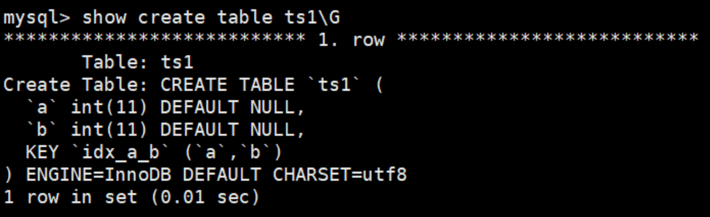

从结果可以看出，索引仍然是默认的升序。

在MySQL 8.0版本中查看数据表ts1的结构，结果如下：

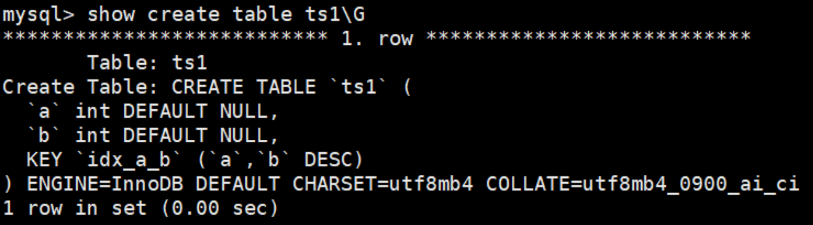

从结果可以看出，索引已经是降序了。下面继续测试降序索引在执行计划中的表现。

分别在MySQL 5.7版本和MySQL 8.0版本的数据表ts1中插入800条随机数据，执行语句如下：

```mysql
DELIMITER //
CREATE PROCEDURE ts_insert()
BEGIN
    DECLARE i INT DEFAULT 1;
    WHILE i < 800
    DO
        insert into ts1 select rand()*80000,rand()*80000;
        SET i = i + 1;
    END WHILE;
    commit;
END //
DELIMITER ;

#调用
CALL ts_insert();
```

在MySQL 5.7版本中查看数据表ts1的执行计划，结果如下：

```mysql
EXPLAIN SELECT * FROM ts1 ORDER BY a,b DESC LIMIT 5;
```

从结果可以看出，执行计划中扫描数为799，而且使用了Using filesort。

> 提示 Using filesort是MySQL中一种速度比较慢的外部排序，能避免是最好的。多数情况下，管理员 可以通过优化索引来尽量避免出现Using filesort，从而提高数据库执行速度。

在MySQL 8.0版本中查看数据表ts1的执行计划。从结果可以看出，执行计划中扫描数为5，而且没有使用 Using filesort。

> 注意 降序索引只对查询中特定的排序顺序有效，如果使用不当，反而查询效率更低。例如，上述 查询排序条件改为order by a desc, b desc，MySQL 5.7的执行计划要明显好于MySQL 8.0。

将排序条件修改为order by a desc, b desc后，下面来对比不同版本中执行计划的效果。 在MySQL 5.7版本 中查看数据表ts1的执行计划，结果如下：

```mysql
EXPLAIN SELECT * FROM ts1 ORDER BY a DESC,b DESC LIMIT 5;
```

在MySQL 8.0版本中查看数据表ts1的执行计划。

从结果可以看出，修改后MySQL 5.7的执行计划要明显好于MySQL 8.0。


#### 2.2 隐藏索引

在MySQL 5.7版本及之前，只能通过显式的方式删除索引。此时，如果发现删除索引后出现错误，又只能 通过显式创建索引的方式将删除的索引创建回来。如果数据表中的数据量非常大，或者数据表本身比较 大，这种操作就会消耗系统过多的资源，操作成本非常高。

从MySQL 8.x开始支持 隐藏索引（invisible indexes） ，只需要将待删除的索引设置为隐藏索引，使 查询优化器不再使用这个索引（即使使用force index（强制使用索引），优化器也不会使用该索引）， 确认将索引设置为隐藏索引后系统不受任何响应，就可以彻底删除索引。 这种通过先将索引设置为隐藏索 引，再删除索引的方式就是软删除 。

1. 创建表时直接创建 在MySQL中创建隐藏索引通过SQL语句INVISIBLE来实现，其语法形式如下：

```mysql
CREATE TABLE tablename(
    propname1 type1[CONSTRAINT1],
    propname2 type2[CONSTRAINT2],
    ……
    propnamen typen,
    INDEX [indexname](propname1 [(length)]) INVISIBLE
);
```

上述语句比普通索引多了一个关键字INVISIBLE，用来标记索引为不可见索引。


2. 在已经存在的表上创建

可以为已经存在的表设置隐藏索引，其语法形式如下：

```mysql
CREATE INDEX indexname
ON tablename(propname[(length)]) INVISIBLE;
```


3. 通过ALTER TABLE语句创建

语法形式如下：

```mysql
ALTER TABLE tablename
ADD INDEX indexname (propname [(length)]) INVISIBLE;
```


4. 切换索引可见状态 已存在的索引可通过如下语句切换可见状态：

```mysql
ALTER TABLE tablename ALTER INDEX index_name INVISIBLE; #切换成隐藏索引
ALTER TABLE tablename ALTER INDEX index_name VISIBLE; #切换成非隐藏索引
```

如果将index_cname索引切换成可见状态，通过explain查看执行计划，发现优化器选择了index_cname索 引。

> 注意 当索引被隐藏时，它的内容仍然是和正常索引一样实时更新的。如果一个索引需要长期被隐 藏，那么可以将其删除，因为索引的存在会影响插入、更新和删除的性能。

通过设置隐藏索引的可见性可以查看索引对调优的帮助。


### 3. 索引的设计原则

#### 3.1 数据准备

**第1步：创建数据库、创建表**

```mysql
CREATE DATABASE atguigudb1;

USE atguigudb1;

#1.创建学生表和课程表
CREATE TABLE `student_info` (
    `id` INT(11) NOT NULL AUTO_INCREMENT,
    `student_id` INT NOT NULL ,
    `name` VARCHAR(20) DEFAULT NULL,
    `course_id` INT NOT NULL ,
    `class_id` INT(11) DEFAULT NULL,
    `create_time` DATETIME DEFAULT CURRENT_TIMESTAMP ON UPDATE CURRENT_TIMESTAMP,
    PRIMARY KEY (`id`)
) ENGINE=INNODB AUTO_INCREMENT=1 DEFAULT CHARSET=utf8;

CREATE TABLE `course` (
    `id` INT(11) NOT NULL AUTO_INCREMENT,
    `course_id` INT NOT NULL ,
    `course_name` VARCHAR(40) DEFAULT NULL,
    PRIMARY KEY (`id`)
) ENGINE=INNODB AUTO_INCREMENT=1 DEFAULT CHARSET=utf8;
```


**第2步：创建模拟数据必需的存储函数**

```mysql
#函数1：创建随机产生字符串函数

DELIMITER //
CREATE FUNCTION rand_string(n INT)
	RETURNS VARCHAR(255) #该函数会返回一个字符串
BEGIN
	DECLARE chars_str VARCHAR(100) DEFAULT
'abcdefghijklmnopqrstuvwxyzABCDEFJHIJKLMNOPQRSTUVWXYZ';
	DECLARE return_str VARCHAR(255) DEFAULT '';
	DECLARE i INT DEFAULT 0;
    WHILE i < n DO
        SET return_str =CONCAT(return_str,SUBSTRING(chars_str,FLOOR(1+RAND()*52),1));
        SET i = i + 1;
    END WHILE;
    RETURN return_str;
END //
DELIMITER ;
```

```mysql
#函数2：创建随机数函数
DELIMITER //
CREATE FUNCTION rand_num (from_num INT ,to_num INT) RETURNS INT(11)
BEGIN
DECLARE i INT DEFAULT 0;
SET i = FLOOR(from_num +RAND()*(to_num - from_num+1)) ;
RETURN i;
END //
DELIMITER ;
```

创建函数，假如报错：

```mysql
This function has none of DETERMINISTIC......
```

由于开启过慢查询日志bin-log, 我们就必须为我们的function指定一个参数。

主从复制，主机会将写操作记录在bin-log日志中。从机读取bin-log日志，执行语句来同步数据。如果使 用函数来操作数据，会导致从机和主键操作时间不一致。所以，默认情况下，mysql不开启创建函数设 置。

- 查看mysql是否允许创建函数：

```mysql
show variables like 'log_bin_trust_function_creators';
```

- 命令开启：允许创建函数设置：

```mysql
set global log_bin_trust_function_creators=1; # 不加global只是当前窗口有效。
```

- mysqld重启，上述参数又会消失。永久方法：

  - windows下：my.ini[mysqld]加上：

    ```mysql
    log_bin_trust_function_creators=1
    ```

  - linux下：/etc/my.cnf下my.cnf[mysqld]加上：

    ```mysql
    log_bin_trust_function_creators=1
    ```


**第3步：创建插入模拟数据的存储过程**

```mysql
# 存储过程1：创建插入课程表存储过程
DELIMITER //
CREATE PROCEDURE insert_course( max_num INT )
BEGIN
DECLARE i INT DEFAULT 0;
SET autocommit = 0; #设置手动提交事务
REPEAT #循环
SET i = i + 1; #赋值
INSERT INTO course (course_id, course_name ) VALUES
(rand_num(10000,10100),rand_string(6));
UNTIL i = max_num
END REPEAT;
COMMIT; #提交事务
END //
DELIMITER ;
```

```mysql
# 存储过程2：创建插入学生信息表存储过程
DELIMITER //
CREATE PROCEDURE insert_stu( max_num INT )
BEGIN
DECLARE i INT DEFAULT 0;
SET autocommit = 0; #设置手动提交事务
REPEAT #循环
SET i = i + 1; #赋值
INSERT INTO student_info (course_id, class_id ,student_id ,NAME ) VALUES
(rand_num(10000,10100),rand_num(10000,10200),rand_num(1,200000),rand_string(6));
UNTIL i = max_num
END REPEAT;
COMMIT; #提交事务
END //
DELIMITER ;
```


**第4步：调用存储过程**

```mysql
CALL insert_course(100);
CALL insert_stu(1000000);
```


#### 3.2 哪些情况适合创建索引

##### 1. 字段的数值有唯一性的限制

> 业务上具有唯一特性的字段，即使是组合字段，也必须建成唯一索引。（来源：Alibaba）
>
> 说明：不要以为唯一索引影响了 insert 速度，这个速度损耗可以忽略，但提高查找速度是明显的。


##### 2. 频繁作为 WHERE 查询条件的字段

某个字段在SELECT语句的 WHERE 条件中经常被使用到，那么就需要给这个字段创建索引了。尤其是在 数据量大的情况下，创建普通索引就可以大幅提升数据查询的效率。

比如student_info数据表（含100万条数据），假设我们想要查询 student_id=123110 的用户信息。


##### 3. 经常 GROUP BY 和 ORDER BY 的列

索引就是让数据按照某种顺序进行存储或检索，因此当我们使用 GROUP BY 对数据进行分组查询，或者 使用 ORDER BY 对数据进行排序的时候，就需要 对分组或者排序的字段进行索引 。如果待排序的列有多 个，那么可以在这些列上建立 组合索引 。


##### 4. UPDATE、DELETE 的 WHERE 条件列

对数据按照某个条件进行查询后再进行 UPDATE 或 DELETE 的操作，如果对 WHERE 字段创建了索引，就 能大幅提升效率。原理是因为我们需要先根据 WHERE 条件列检索出来这条记录，然后再对它进行更新或 删除。如果进行更新的时候，更新的字段是非索引字段，提升的效率会更明显，这是因为非索引字段更 新不需要对索引进行维护。


##### 5.DISTINCT 字段需要创建索引

有时候我们需要对某个字段进行去重，使用 DISTINCT，那么对这个字段创建索引，也会提升查询效率。

比如，我们想要查询课程表中不同的 student_id 都有哪些，如果我们没有对 student_id 创建索引，执行 SQL 语句：

```mysql
SELECT DISTINCT(student_id) FROM `student_info`;
```

运行结果（600637 条记录，运行时间 0.683s ）：

如果我们对 student_id 创建索引，再执行 SQL 语句：

```mysql
SELECT DISTINCT(student_id) FROM `student_info`;
```

运行结果（600637 条记录，运行时间 0.010s ）：

你能看到 SQL 查询效率有了提升，同时显示出来的 student_id 还是按照 递增的顺序 进行展示的。这是因 为索引会对数据按照某种顺序进行排序，所以在去重的时候也会快很多。


##### 6. 多表 JOIN 连接操作时，创建索引注意事项

首先， 连接表的数量尽量不要超过 3 张 ，因为每增加一张表就相当于增加了一次嵌套的循环，数量级增 长会非常快，严重影响查询的效率。

其次， 对 WHERE 条件创建索引 ，因为 WHERE 才是对数据条件的过滤。如果在数据量非常大的情况下， 没有 WHERE 条件过滤是非常可怕的。

最后， 对用于连接的字段创建索引 ，并且该字段在多张表中的 类型必须一致 。比如 course_id 在 student_info 表和 course 表中都为 int(11) 类型，而不能一个为 int 另一个为 varchar 类型。

举个例子，如果我们只对 student_id 创建索引，执行 SQL 语句：

```mysql
SELECT course_id, name, student_info.student_id, course_name
FROM student_info JOIN course
ON student_info.course_id = course.course_id
WHERE name = '462eed7ac6e791292a79';
```

运行结果（1 条数据，运行时间 0.189s ）：

这里我们对 name 创建索引，再执行上面的 SQL 语句，运行时间为 0.002s 。


##### 7. 使用列的类型小的创建索引


##### 8. 使用字符串前缀创建索引

创建一张商户表，因为地址字段比较长，在地址字段上建立前缀索引

```mysql
create table shop(address varchar(120) not null);
alter table shop add index(address(12));
```

问题是，截取多少呢？截取得多了，达不到节省索引存储空间的目的；截取得少了，重复内容太多，字 段的散列度(选择性)会降低。怎么计算不同的长度的选择性呢？

先看一下字段在全部数据中的选择度：

```mysql
select count(distinct address) / count(*) from shop;
```

通过不同长度去计算，与全表的选择性对比：

公式：

```mysql
count(distinct left(列名, 索引长度))/count(*)
```

例如：

```mysql
select count(distinct left(address,10)) / count(*) as sub10, -- 截取前10个字符的选择度
count(distinct left(address,15)) / count(*) as sub11, -- 截取前15个字符的选择度
count(distinct left(address,20)) / count(*) as sub12, -- 截取前20个字符的选择度
count(distinct left(address,25)) / count(*) as sub13 -- 截取前25个字符的选择度
from shop;
```

引申另一个问题：索引列前缀对排序的影响

拓展：Alibaba《Java开发手册》

【 强制 】在 varchar 字段上建立索引时，必须指定索引长度，没必要对全字段建立索引，根据实际文本 区分度决定索引长度。

说明：索引的长度与区分度是一对矛盾体，一般对字符串类型数据，长度为 20 的索引，区分度会 高达 90% 以上 ，可以使用 count(distinct left(列名, 索引长度))/count(*)的区分度来确定。


##### 9. 区分度高(散列性高)的列适合作为索引 


##### 10. 使用最频繁的列放到联合索引的左侧

这样也可以较少的建立一些索引。同时，由于"最左前缀原则"，可以增加联合索引的使用率。


##### 11. 在多个字段都要创建索引的情况下，联合索引优于单值索引


#### 3.3 限制索引的数目

在实际工作中，我们也需要注意平衡，索引的数目不是越多越好。我们需要限制每张表上的索引数量，建议单张表索引数量不超过6个。原因：

①每个索引都需要占用磁盘空间，索引越多，需要的磁盘空间就越大。

②索引会影响INSERT、DELETE、UPDATE等语句的性能，因为表中的数据更改的同时，索引也会进行调整和更新，会造成负担。

③优化器在选择如何优化查询时，会根据统一信息，对每一个可以用到的索引来进行评估，以生成出一个最好的执行计划，如果同时有很多个索引都可以用于查询，会增加MySQL优化器生成执行计划时间，降低查询性能。


#### 3.4 哪些情况不适合创建索引

##### 1. 在where中使用不到的字段，不要设置索引

WHERE条件（包括GROUPBY、ORDERBY）里用不到的字段不需要创建索引，索引的价值是快速定位，如果起不到定位的字段通常是不需要创建索引的。


##### 2. 数据量小的表最好不要使用索引

如果表记录太少，比如少于1000个，那么是不需要创建索引的。表记录太少，是否创建索引对查询效率的影响并不大。甚至说，查询花费的时间可能比遍历索引的时间还要短，索引可能不会产生优化效果。

> 结论：在数据表中的数据行数比较少的情况下，比如不到 1000 行，是不需要创建索引的。
>


##### 3. 有大量重复数据的列上不要建立索引

在条件表达式中经常用到的不同值较多的列上建立索引，但字段中如果有大量重复数据，也不用创建索引。比如在学生表的“性别"字段上只有“男”与“女"两个不同值，因此无须建立索引。如果建立索引，不但不会提高查询效率，反而会严重降低数据更新速度。

> 结论：当数据重复度大，比如高于10%的时候，也不需要对这个字段使用索引
>


##### 4. 避免对经常更新的表创建过多的索引

第一层含义：频繁更新的字段不一定要创建索引。因为更新数据的时候，也需要更新索引，如果索引太多，在更新索引的时候也会造成负担，从而影响效率。

第二层含义：避免对经常更新的表创建过多的索引，并且索引中的列尽可能少。此时，虽然提高了查询速度，同时却会降低更新表的速度。


##### 5. 不建议用无序的值作为索引

例如身份证、UUID(在索引比较时需要转为ASCII，并且插入时可能造成页分裂)、MD5、HASH、无序长字符串等。


##### 6. 删除不再使用或者很少使用的索引

表中的数据被大量更新，或者数据的使用方式被改变后，原有的一些索引可能不再需要。数据库管理员应当定期找出这些索引，将它们删除，从而减少索引对更新操作的影响。


##### 7. 不要定义冗余或重复的索引

**① 冗余索引**

有时候有意或者无意的就对同一个列创建了多个索引，比如：index(a,b,c)相当于index(a)、index(a,b)、 index(a,b,c)。


**② 重复索引**

另一种情况，我们可能会对某个列 重复建立索引 ，比方说这样：

```mysql
CREATE TABLE repeat_index_demo (
    col1 INT PRIMARY KEY,
    col2 INT,
    UNIQUE uk_idx_c1 (col1),
    INDEX idx_c1 (col1)
);
```

我们看到，col1 既是主键、又给它定义为一个唯一索引，还给它定义了一个普通索引，可是主键本身就 会生成聚簇索引，所以定义的唯一索引和普通索引是重复的，这种情况要避免。


#### 3.5 小结

索引是一把双刃剑，可提高查询效率，但也会降低插入和更新的速度并占用磁盘空间。

选择索引的最终目的是为了使查询的速度变快，上面给出的原则是最基本的准则，但不能拘泥于上面的准则，大家要在以后的学习和工作中进行不断的实践，根据应用的实际情况进行分析和判断，选择最合适的索引方式。


## 九、性能分析工具的使用

### 1. 数据库服务器的优化步骤

当我们遇到数据库调优问题的时候，该如何思考呢？这里把思考的流程整理成下面这张图。

整个流程划分成了 观察（Show status） 和 行动（Action） 两个部分。字母 S 的部分代表观察（会使 用相应的分析工具），字母 A 代表的部分是行动（对应分析可以采取的行动）。

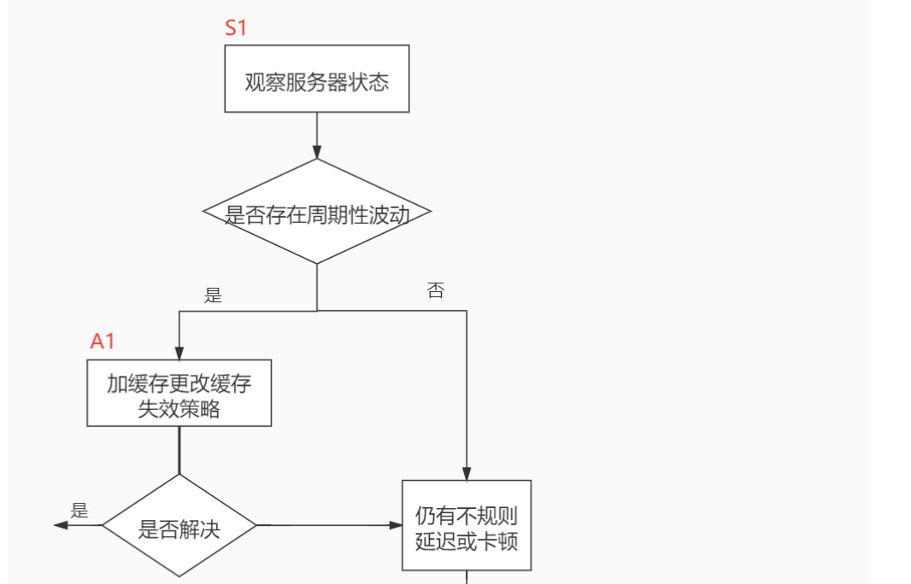

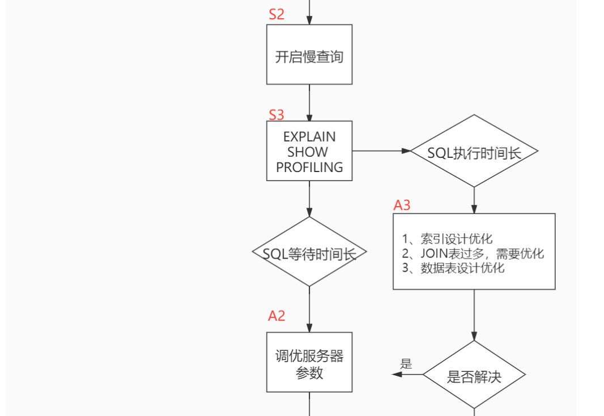

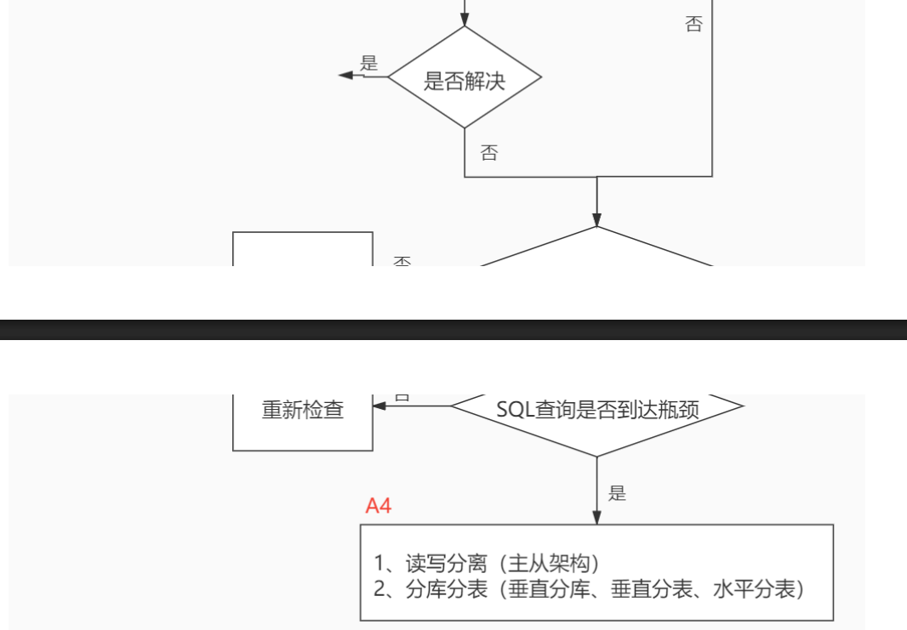


小结：

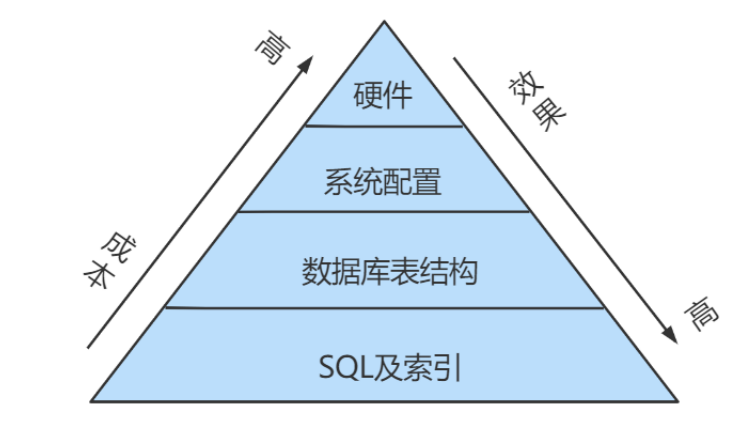


### 2. 查看系统性能参数

在MySQL中，可以使用 SHOW STATUS 语句查询一些MySQL数据库服务器的 性能参数 、 执行频率 。

SHOW STATUS语句语法如下：

```mysql
SHOW [GLOBAL|SESSION] STATUS LIKE '参数';
```

一些常用的性能参数如下：

- Connections：连接MySQL服务器的次数。
- Uptime：MySQL服务器的上 线时间。
- Slow_queries：慢查询的次数。
- Innodb_rows_read：Select查询返回的行数
- Innodb_rows_inserted：执行INSERT操作插入的行数
- Innodb_rows_updated：执行UPDATE操作更新的 行数
- Innodb_rows_deleted：执行DELETE操作删除的行数
- Com_select：查询操作的次数。
- Com_insert：插入操作的次数。对于批量插入的 INSERT 操作，只累加一次。
- Com_update：更新操作 的次数。
- Com_delete：删除操作的次数。


### 3. 统计SQL的查询成本：last_query_cost

一条SQL查询语句在执行前需要确定查询执行计划，如果存在多种执行计划的话，MySQL会计算每个执行计划所需要的成本，从中选择成本最小的一个作为最终执行的执行计划。

如果我们想要查看某条SQL语句的查询成本，可以在执行完这条SQL语句之后，通过查看当前会话中的last_query_cost变量值来得到当前查询的成本。它通常也是我们评价一个查询的执行效率的一个常用指标。这个查询成本对应的是SQL语句所需要读取的页的数量。

```mysql
CREATE TABLE `student_info` (
    `id` INT(11) NOT NULL AUTO_INCREMENT,
    `student_id` INT NOT NULL ,
    `name` VARCHAR(20) DEFAULT NULL,
    `course_id` INT NOT NULL ,
    `class_id` INT(11) DEFAULT NULL,
    `create_time` DATETIME DEFAULT CURRENT_TIMESTAMP ON UPDATE CURRENT_TIMESTAMP,
    PRIMARY KEY (`id`)
) ENGINE=INNODB AUTO_INCREMENT=1 DEFAULT CHARSET=utf8;
```

如果我们想要查询 id=900001 的记录，然后看下查询成本，我们可以直接在聚簇索引上进行查找：

```mysql
SELECT student_id, class_id, NAME, create_time FROM student_info
WHERE id = 900001;
```

运行结果（1 条记录，运行时间为 0.042s ）

然后再看下查询优化器的成本，实际上我们只需要检索一个页即可：

```mysql
mysql> SHOW STATUS LIKE 'last_query_cost';
+-----------------+----------+
| Variable_name   | Value    |
+-----------------+----------+
| Last_query_cost | 1.000000 |
+-----------------+----------+
```

如果我们想要查询 id 在 900001 到 9000100 之间的学生记录呢？

```mysql
SELECT student_id, class_id, NAME, create_time FROM student_info
WHERE id BETWEEN 900001 AND 900100;
```

运行结果（100 条记录，运行时间为 0.046s ）：

然后再看下查询优化器的成本，这时我们大概需要进行 20 个页的查询。

```mysql
mysql> SHOW STATUS LIKE 'last_query_cost';
+-----------------+-----------+
| Variable_name   | Value     |
+-----------------+-----------+
| Last_query_cost | 21.134453 |
+-----------------+-----------+
```

你能看到页的数量是刚才的 20 倍，但是查询的效率并没有明显的变化，实际上这两个 SQL 查询的时间 基本上一样，就是因为采用了顺序读取的方式将页面一次性加载到缓冲池中，然后再进行查找。虽然 页 数量（last_query_cost）增加了不少 ，但是通过缓冲池的机制，并 没有增加多少查询时间 。

使用场景：它对于比较开销是非常有用的，特别是我们有好几种查询方式可选的时候。

> SQL查询是一个动态的过程，从页加载的角度来看，我们可以得到以下两点结论：
>
> 1. 位置决定效率。如果页就在数据库缓冲池中，那么效率是最高的，否则还需要从内存或者磁盘中进行读取，当然针对单个页的读取来说，如果页存在于内存中，会比在磁盘中读取效率高很多。
> 2. 批量决定效率。如果我们从磁盘中对单一页进行随机读，那么效率是很低的（差不多10ms），而采用顺序读取的方式，批量对页进行读取，平均一页的读取效率就会提升很多，甚至要快于单个页面在内存中的随机读取。
>
> 所以说，遇到1/0并不用担心，方法找对了，效率还是很高的。我们首先要考虑数据存放的位置，如果是经常使用的数据就要尽量放到缓冲池中，其次我们可以充分利用磁盘的吞吐能力，一次性批量读取数据，这样单个页的读取效率也就得到了提升。


### 4. 定位执行慢的 SQL：慢查询日志

MySQL的慢查询日志，用来记录在MysQL中响应时间超过阀值的语句，具体指运行时间超过long_query_time值的SQL，则会被记录到慢查询日志中。long_query_time的默认值为10，意思是运行10秒以上（不含10秒）的语句，认为是超出了我们的最大忍耐时间值。

它的主要作用是，帮助我们发现那些执行时间特别长的SQL查询，并且有针对性地进行优化，从而提高系统的整体效率。当我们的数据库服务器发生阻塞、运行变慢的时候，检查一下慢查询日志，找到那些慢查询，对解决问题很有帮助。比如一条sql执行超过5秒钟，我们就算慢SQL，希望能收集超过5秒的sql，结合explain进行全面分析。

默认情况下，MySQL数据库没有开启慢查询日志，需要我们手动来设置这个参数。如果不是调优需要的话，一般不建议启动该参数，因为开启慢查询日志会或多或少带来一定的性能影响。

慢查询日志支持将日志记录写入文件。


#### 4.1 开启慢查询日志参数

1. 开启slow_query_log

```mysql
mysql > set global slow_query_log='ON';
```

然后我们再来查看下慢查询日志是否开启，以及慢查询日志文件的位置：

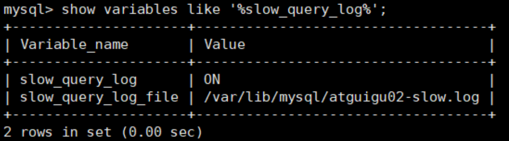

你能看到这时慢查询分析已经开启，同时文件保存在 /var/lib/mysql/atguigu02-slow.log 文件 中。


2. 修改long_query_time阈值

接下来我们来看下慢查询的时间阈值设置，使用如下命令：

```mysql
mysql > show variables like '%long_query_time%';
```

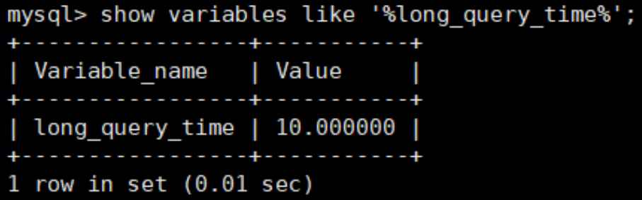

这里如果我们想把时间缩短，比如设置为 1 秒，可以这样设置：

```mysql
#测试发现：设置global的方式对当前session的long_query_time失效。对新连接的客户端有效。所以可以一并执行下述语句
mysql > set global long_query_time = 1;
mysql> show global variables like '%long_query_time%';

mysql> set long_query_time=1;
mysql> show variables like '%long_query_time%';
```

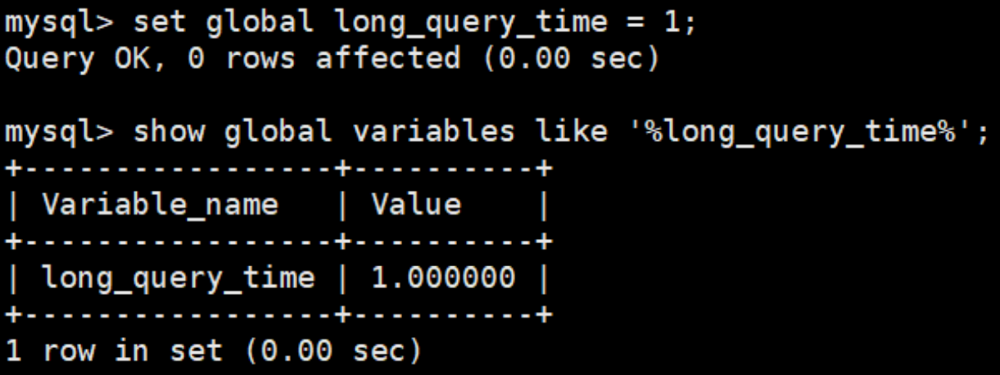


#### 4.2 查看慢查询数目

查询当前系统中有多少条慢查询记录

```mysql
SHOW GLOBAL STATUS LIKE '%Slow_queries%';
```


#### 4.3 案例演示

**步骤1. 建表**

```mysql
CREATE TABLE `student` (
    `id` INT(11) NOT NULL AUTO_INCREMENT,
    `stuno` INT NOT NULL ,
    `name` VARCHAR(20) DEFAULT NULL,
    `age` INT(3) DEFAULT NULL,
    `classId` INT(11) DEFAULT NULL,
    PRIMARY KEY (`id`)
) ENGINE=INNODB AUTO_INCREMENT=1 DEFAULT CHARSET=utf8;
```


**步骤2：设置参数 log_bin_trust_function_creators**

创建函数，假如报错：

```
This function has none of DETERMINISTIC......
```

- 命令开启：允许创建函数设置：


```mysql
set global log_bin_trust_function_creators=1; # 不加global只是当前窗口有效。
```


**步骤3：创建函数**

随机产生字符串：（同上一章）

```mysql
DELIMITER //
CREATE FUNCTION rand_string(n INT)
	RETURNS VARCHAR(255) #该函数会返回一个字符串
BEGIN
	DECLARE chars_str VARCHAR(100) DEFAULT
'abcdefghijklmnopqrstuvwxyzABCDEFJHIJKLMNOPQRSTUVWXYZ';
    DECLARE return_str VARCHAR(255) DEFAULT '';
    DECLARE i INT DEFAULT 0;
    WHILE i < n DO
    	SET return_str =CONCAT(return_str,SUBSTRING(chars_str,FLOOR(1+RAND()*52),1));
    	SET i = i + 1;
    END WHILE;
    RETURN return_str;
END //
DELIMITER ;

#测试
SELECT rand_string(10);
```

产生随机数值：（同上一章）

```mysql
DELIMITER //
CREATE FUNCTION rand_num (from_num INT ,to_num INT) RETURNS INT(11)
BEGIN
DECLARE i INT DEFAULT 0;
SET i = FLOOR(from_num +RAND()*(to_num - from_num+1)) ;
RETURN i;
END //
DELIMITER ;

#测试：
SELECT rand_num(10,100);
```


**步骤4：创建存储过程**

```mysql
DELIMITER //
CREATE PROCEDURE insert_stu1( START INT , max_num INT )
BEGIN
DECLARE i INT DEFAULT 0;
SET autocommit = 0; #设置手动提交事务
REPEAT #循环
SET i = i + 1; #赋值
INSERT INTO student (stuno, NAME ,age ,classId ) VALUES
((START+i),rand_string(6),rand_num(10,100),rand_num(10,1000));
UNTIL i = max_num
END REPEAT;
COMMIT; #提交事务
END //
DELIMITER ;
```


**步骤5：调用存储过程**

```mysql
#调用刚刚写好的函数, 4000000条记录,从100001号开始
CALL insert_stu1(100001,4000000);
```


#### 4.4 测试及分析

1. 测试

```mysql
mysql> SELECT * FROM student WHERE stuno = 3455655;
+---------+---------+--------+------+---------+
| id 	  | stuno 	| name 	 | age  | classId |
+---------+---------+--------+------+---------+
| 3523633 | 3455655 | oQmLUr | 19 	| 39 	  |
+---------+---------+--------+------+---------+
1 row in set (2.09 sec)
mysql> SELECT * FROM student WHERE name = 'oQmLUr';
+---------+---------+--------+------+---------+
| id 	  | stuno 	| name 	 | age 	| classId |
+---------+---------+--------+------+---------+
| 1154002 | 1243200 | OQMlUR | 266  | 28 	  |
| 1405708 | 1437740 | OQMlUR | 245  | 439 	  |
| 1748070 | 1680092 | OQMlUR | 240  | 414 	  |
| 2119892 | 2051914 | oQmLUr | 17   | 32 	  |
| 2893154 | 2825176 | OQMlUR | 245  | 435 	  |
| 3523633 | 3455655 | oQmLUr | 19   | 39 	  |
+---------+---------+--------+------+---------+
6 rows in set (2.39 sec)
```

从上面的结果可以看出来，查询学生编号为“3455655”的学生信息花费时间为2.09秒。查询学生姓名为 “oQmLUr”的学生信息花费时间为2.39秒。已经达到了秒的数量级，说明目前查询效率是比较低的，下面 的小节我们分析一下原因。

2. 分析

```mysql
show status like 'slow_queries';
```


#### 4.5 慢查询日志分析工具：mysqldumpslow

在生产环境中，如果要手工分析日志，查找、分析SQL，显然是个体力活，MySQL提供了日志分析工具 mysqldumpslow 。

查看mysqldumpslow的帮助信息

```mysql
mysqldumpslow --help
```

mysqldumpslow 命令的具体参数如下：

- -a: 不将数字抽象成N，字符串抽象成S
- -s: 是表示按照何种方式排序：
  - c: 访问次数
  - l: 锁定时间
  - r: 返回记录
  - t: 查询时间
  - al:平均锁定时间
  - ar:平均返回记录数
  - at:平均查询时间 （默认方式）
  - ac:平均查询次数
- -t: 即为返回前面多少条的数据；
- -g: 后边搭配一个正则匹配模式，大小写不敏感的；

举例：我们想要按照查询时间排序，查看前五条 SQL 语句，这样写即可：

```mysql
mysqldumpslow -s t -t 5 /var/lib/mysql/atguigu01-slow.log
```

```mysql
[root@bogon ~]# mysqldumpslow -s t -t 5 /var/lib/mysql/atguigu01-slow.log

Reading mysql slow query log from /var/lib/mysql/atguigu01-slow.log

Count: 1 Time=2.39s (2s) Lock=0.00s (0s) Rows=13.0 (13), root[root]@localhost
SELECT * FROM student WHERE name = 'S'

Count: 1 Time=2.09s (2s) Lock=0.00s (0s) Rows=2.0 (2), root[root]@localhost
SELECT * FROM student WHERE stuno = N

Died at /usr/bin/mysqldumpslow line 162, <> chunk 2.
```

工作常用参考：

```mysql
#得到返回记录集最多的10个SQL
mysqldumpslow -s r -t 10 /var/lib/mysql/atguigu-slow.log

#得到访问次数最多的10个SQL
mysqldumpslow -s c -t 10 /var/lib/mysql/atguigu-slow.log

#得到按照时间排序的前10条里面含有左连接的查询语句
mysqldumpslow -s t -t 10 -g "left join" /var/lib/mysql/atguigu-slow.log

#另外建议在使用这些命令时结合 | 和more 使用 ，否则有可能出现爆屏情况
mysqldumpslow -s r -t 10 /var/lib/mysql/atguigu-slow.log | more
```


#### 4.6 关闭慢查询日志

MySQL服务器停止慢查询日志功能有两种方法：

**方式1：永久性方式**

```properties
[mysqld]
slow_query_log=OFF
```

或者，把slow_query_log一项注释掉 或 删除

```properties
[mysqld]
#slow_query_log =OFF
```

重启MySQL服务，执行如下语句查询慢日志功能。

```mysql
SHOW VARIABLES LIKE '%slow%'; #查询慢查询日志所在目录
SHOW VARIABLES LIKE '%long_query_time%'; #查询超时时长
```


**方式2：临时性方式**

使用SET语句来设置。 

（1）停止MySQL慢查询日志功能，具体SQL语句如下。

```mysql
SET GLOBAL slow_query_log=off;
```


（2）重启MySQL服务，使用SHOW语句查询慢查询日志功能信息，具体SQL语句如下

```mysql
SHOW VARIABLES LIKE '%slow%';
#以及
SHOW VARIABLES LIKE '%long_query_time%';
```


#### 4.7 删除慢查询日志

使用SHOW语句显示慢查询日志信息，具体SQL语句如下。

```mysql
SHOW VARIABLES LIKE 'slow_query_log%';
```

从执行结果可以看出，慢查询日志的目录默认为MySQL的数据目录，在该目录下手动删除慢查询日志文件即可。

使用命令mysqladmin flush-logs来重新生成查询日志文件，具体命令如下，执行完毕会在数据目录下重新生成慢查询日志文件。

```mysql
mysqladmin -uroot -p flush-logs slow
```

> 提示
>
> 慢查询日志都是使用mysqladminflush-logs命令来删除重建的。使用时一定要注意，一旦执行了这个命令，慢查询日志都只存在新的日志文件中，如果需要旧的查询日志，就必须事先备份。


### 5. 查看 SQL 执行成本：SHOW PROFILE

Show Profile是MySQL提供的可以用来分析当前会话中SQL都做了什么、执行的资源消耗情况的工具，可用于sql调优的测量。默认情况下处于关闭状态，并保存最近15次的运行结果。

```mysql
mysql > show variables like 'profiling';
```

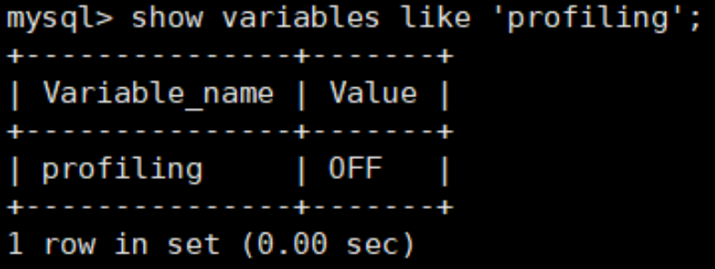

通过设置 profiling='ON’ 来开启 show profile：

```mysql
mysql > set profiling = 'ON';
```

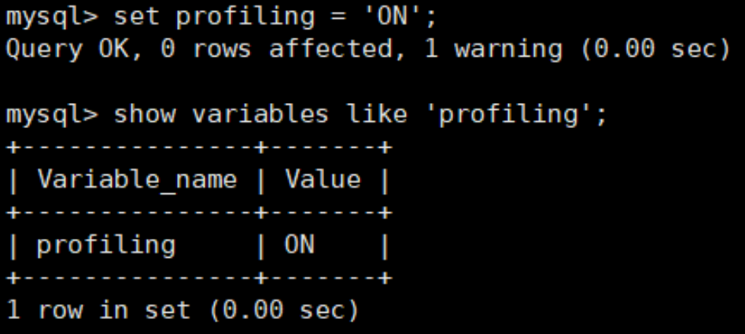

然后执行相关的查询语句。接着看下当前会话都有哪些 profiles，使用下面这条命令：

```mysql
mysql > show profiles;
```

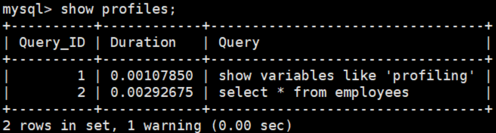

你能看到当前会话一共有 2 个查询。如果我们想要查看最近一次查询的开销，可以使用：

```mysql
mysql > show profile;
```

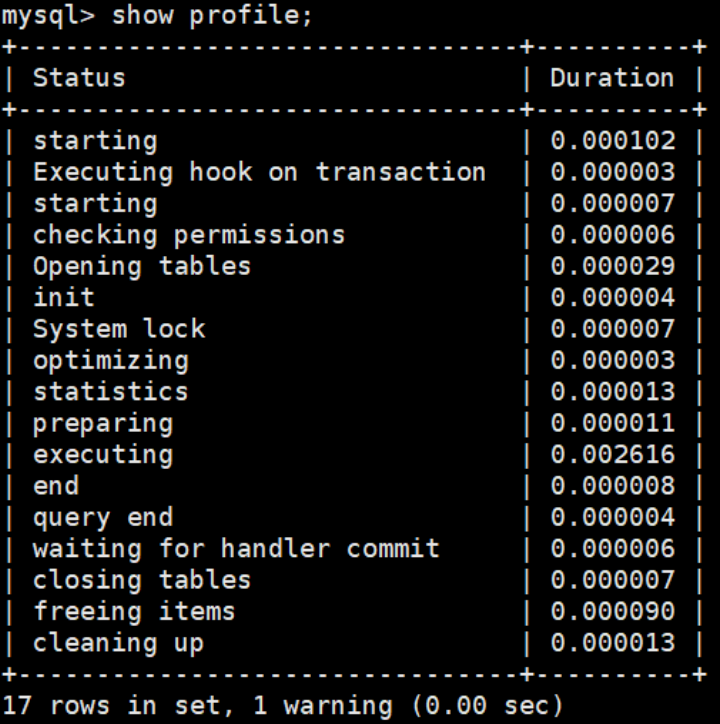

```mysql
mysql> show profile cpu,block io for query 2;
```

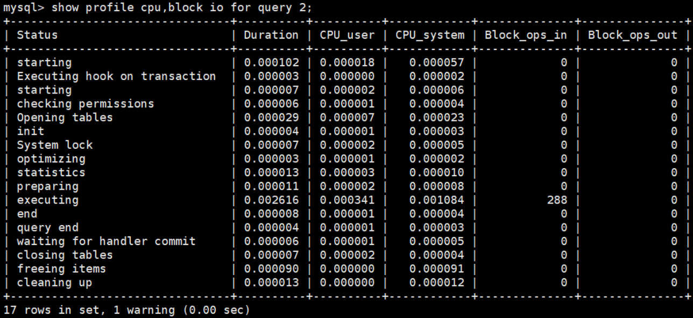

**show profile的常用查询参数：**

① ALL：显示所有的开销信息。 

② BLOCK IO：显示块IO开销。 

③ CONTEXT SWITCHES：上下文切换开 销。 

④ CPU：显示CPU开销信息。 

⑤ IPC：显示发送和接收开销信息。 

⑥ MEMORY：显示内存开销信 息。

⑦ PAGE FAULTS：显示页面错误开销信息。

⑧ SOURCE：显示和Source_function，Source_file， Source_line相关的开销信息。

⑨ SWAPS：显示交换次数开销信息。


**日常开发需注意的结论：**

①converting HEAP to MyISAM：查询结果太大，内存不够，数据往磁盘上搬了。

②Creating tmp table：创建临时表。先拷贝数据到临时表，用完后再删除临时表。 

③Copying to tmp table on disk：把内存中临时表复制到磁盘上，警惕！

④locked。

如果在showprofile诊断结果中出现了以上4条结果中的任何一条，则sql语句需要优化。


**注意：**

不过SHOW PROFILE命令将被弃用，我们可以从information_schema中的profiling数据表进行查看。


### 6. 分析查询语句：EXPLAIN

#### 6.1 概述

定位了查询慢的SQL之后，我们就可以使用EXPLAIN或DESCRIBE工具做针对性的分析查询语句。DESCRIBE语句的使用方法与EXPLAIN语句是一样的，并且分析结果也是一样的。

MySQL中有专门负责优化SELECT语句的优化器模块，主要功能：通过计算分析系统中收集到的统计信息，为客户端请求的Query提供它认为最优的执行计划（他认为最优的数据检索方式，但不见得是DBA认为是最优的，这部分最耗费时间）。

这个执行计划展示了接下来具体执行查询的方式，比如多表连接的顺序是什么，对于每个表采用什么访问方法来具体执行查询等等。MySQL为我们提供了EXPLAIN语句来帮助我们查看某个查询语句的具体执行计划，大家看懂 EXPLAIN语句的各个输出项，可以有针对性的提升我们查询语句的性能。

1. 能做什么？

- 表的读取顺序
- 数据读取操作的操作类型
- 哪些索引可以使用
- 哪些索引被实际使用
- 表之间的引用
- 每张表有多少行被优化器查询


2. 官网介绍

https://dev.mysql.com/doc/refman/5.7/en/explain-output.html

https://dev.mysql.com/doc/refman/8.0/en/explain-output.html


3. 版本情况

- MySQL 5.6.3以前只能 EXPLAIN SELECT ；MYSQL 5.6.3以后就可以 EXPLAIN SELECT，UPDATE，DELETE
- 在5.7以前的版本中，想要显示 partitions 需要使用 explain partitions 命令；想要显示filtered 需要使用 explain extended 命令。在5.7版本后，默认explain直接显示partitions和filtered中的信息。


#### 6.2 基本语法

EXPLAIN 或 DESCRIBE语句的语法形式如下：

```mysql
EXPLAIN SELECT select_options
或者
DESCRIBE SELECT select_options
```

如果我们想看看某个查询的执行计划的话，可以在具体的查询语句前边加一个 EXPLAIN ，就像这样：

```mysql
mysql> EXPLAIN SELECT 1;
```

EXPLAIN 语句输出的各个列的作用如下：

| 列名          | 描述                                                    |
| ------------- | ------------------------------------------------------- |
| id            | 在一个大的查询语句中每个SELECT关键字都对应一个 唯一的id |
| select_type   | SELECT关键字对应的那个查询的类型                        |
| table         | 表名                                                    |
| partitions    | 匹配的分区信息                                          |
| type          | 针对单表的访问方法                                      |
| possible_keys | 可能用到的索引                                          |
| key           | 实际上使用的索引                                        |
| key_len       | 实际使用到的索引长度                                    |
| ref           | 当使用索引列等值查询时，与索引列进行等值匹配的对象信息  |
| rows          | 预估的需要读取的记录条数                                |
| filtered      | 某个表经过搜索条件过滤后剩余记录条数的百分比            |
| Extra         | 一些额外的信息                                          |


#### 6.3 数据准备

1. 建表

```mysql
CREATE TABLE s1 (
    id INT AUTO_INCREMENT,
    key1 VARCHAR(100),
    key2 INT,
    key3 VARCHAR(100),
    key_part1 VARCHAR(100),
    key_part2 VARCHAR(100),
    key_part3 VARCHAR(100),
    common_field VARCHAR(100),
    PRIMARY KEY (id),
    INDEX idx_key1 (key1),
    UNIQUE INDEX idx_key2 (key2),
    INDEX idx_key3 (key3),
    INDEX idx_key_part(key_part1, key_part2, key_part3)
) ENGINE=INNODB CHARSET=utf8;
```

```mysql
CREATE TABLE s2 (
    id INT AUTO_INCREMENT,
    key1 VARCHAR(100),
    key2 INT,
    key3 VARCHAR(100),
    key_part1 VARCHAR(100),
    key_part2 VARCHAR(100),
    key_part3 VARCHAR(100),
    common_field VARCHAR(100),
    PRIMARY KEY (id),
    INDEX idx_key1 (key1),
    UNIQUE INDEX idx_key2 (key2),
    INDEX idx_key3 (key3),
	INDEX idx_key_part(key_part1, key_part2, key_part3)
) ENGINE=INNODB CHARSET=utf8;
```


2. 设置参数 log_bin_trust_function_creators

创建函数，假如报错，需开启如下命令：允许创建函数设置：

```mysql
set global log_bin_trust_function_creators=1; # 不加global只是当前窗口有效。
```


3. 创建函数

```mysql
DELIMITER //
CREATE FUNCTION rand_string1(n INT)
	RETURNS VARCHAR(255) #该函数会返回一个字符串
BEGIN
    DECLARE chars_str VARCHAR(100) DEFAULT
    'abcdefghijklmnopqrstuvwxyzABCDEFJHIJKLMNOPQRSTUVWXYZ';
    DECLARE return_str VARCHAR(255) DEFAULT '';
    DECLARE i INT DEFAULT 0;
    WHILE i < n DO
        SET return_str =CONCAT(return_str,SUBSTRING(chars_str,FLOOR(1+RAND()*52),1));
        SET i = i + 1;
    END WHILE;
    RETURN return_str;
END //
DELIMITER ;
```


4. 创建存储过程

创建往s1表中插入数据的存储过程：

```mysql
DELIMITER //
CREATE PROCEDURE insert_s1 (IN min_num INT (10),IN max_num INT (10))
BEGIN
    DECLARE i INT DEFAULT 0;
    SET autocommit = 0;
    REPEAT
    SET i = i + 1;
    INSERT INTO s1 VALUES(
    (min_num + i),
    rand_string1(6),
    (min_num + 30 * i + 5),
    rand_string1(6),
    rand_string1(10),
    rand_string1(5),
    rand_string1(10),
    rand_string1(10));
    UNTIL i = max_num
    END REPEAT;
    COMMIT;
END //
DELIMITER ;
```

创建往s2表中插入数据的存储过程：

```mysql
DELIMITER //
CREATE PROCEDURE insert_s2 (IN min_num INT (10),IN max_num INT (10))
BEGIN
    DECLARE i INT DEFAULT 0;
    SET autocommit = 0;
    REPEAT
    SET i = i + 1;
    INSERT INTO s2 VALUES(
        (min_num + i),
        rand_string1(6),
        (min_num + 30 * i + 5),
        rand_string1(6),
        rand_string1(10),
        rand_string1(5),
        rand_string1(10),
        rand_string1(10));
    UNTIL i = max_num
    END REPEAT;
    COMMIT;
END //
DELIMITER ;
```


5. 调用存储过程

s1表数据的添加：加入1万条记录：

```mysql
CALL insert_s1(10001,10000);
```

s2表数据的添加：加入1万条记录：

```mysql
CALL insert_s2(10001,10000);
```


#### 6.4 EXPLAIN各列作用

为了让大家有比较好的体验，我们调整了下 EXPLAIN 输出列的顺序。

##### 1.  table

不论我们的查询语句有多复杂，里边儿 包含了多少个表 ，到最后也是需要对每个表进行 单表访问 的，所 以MySQL规定EXPLAIN语句输出的每条记录都对应着某个单表的访问方法，该条记录的table列代表着该 表的表名（有时不是真实的表名字，可能是简称）。


##### 2. id

我们写的查询语句一般都以 SELECT 关键字开头，比较简单的查询语句里只有一个 SELECT 关键字，比 如下边这个查询语句：

```mysql
SELECT * FROM s1 WHERE key1 = 'a';
```

稍微复杂一点的连接查询中也只有一个 SELECT 关键字，比如：

```mysql
SELECT * FROM s1 INNER JOIN s2
ON s1.key1 = s2.key1
WHERE s1.common_field = 'a';
```

```mysql
mysql> EXPLAIN SELECT * FROM s1 WHERE key1 = 'a';
```

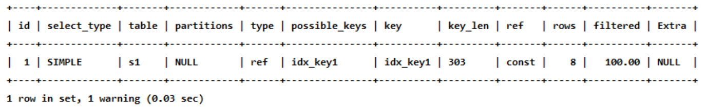

```mysql
mysql> EXPLAIN SELECT * FROM s1 INNER JOIN s2;
```

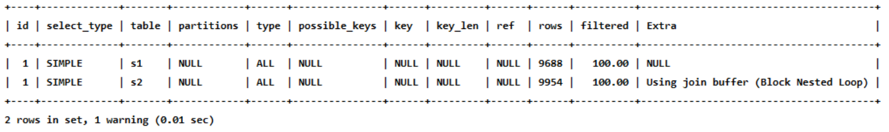

```mysql
mysql> EXPLAIN SELECT * FROM s1 WHERE key1 IN (SELECT key1 FROM s2) OR key3 = 'a';
```

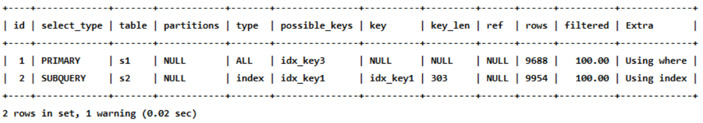


**小结**：

- id如果相同，可以认为是一组，从上往下顺序执行
- 在所有组中，id值越大，优先级越高，越先执行
- 关注点：不同的id，表示一趟独立的查询select, 一个sql的查询趟数越少越好


##### 3. select_type

一条大的查询语句里边可以包含若干个SELECT关键字，每个SELECT关键字代表着一个小的查询语句，而每个SELECT关键字的FROM子句中都可以包含若干张表（这些表用来做连接查询），每一张表都对应着执行计划输出中的一条记录，对于在同一个SELECT关键字中的表来说，它们的id值是相同的。

MySQL为每一个SELECT关键字代表的小查询都定义了一个称之为select_type的属性，意思是我们只要知道了某个小查询的select_type属性，就知道了这个小查询在整个大查询中扮演了一个什么角色，我们看一下select_type都能取哪些值，请看官方文档：


 


| 名称                 | 描述                                                         |
| -------------------- | ------------------------------------------------------------ |
| SIMPLE               | Simple SELECT (not using UNION or subqueries)                |
| PRIMARY              | Outermost SELECT                                             |
| UNION                | Second or later SELECT statement in a UNION                  |
| UNION RESULT         | Result of a UNION                                            |
| SUBQUERY             | First SELECT in subquery                                     |
| DEPENDENT SUBQUERY   | First SELECT in subquery, dependent on outer query           |
| DEPENDENT UNION      | Second or later SELECT statement in a UNION, dependent on outer query |
| DERIVED              | Derived table                                                |
| MATERIALIZED         | Materialized subquery                                        |
| UNCACHEABLE SUBQUERY | A subquery for which the result cannot be cached and must be re-evaluated for each row of the outer query |
| UNCACHEABLE UNION    | The second or later select in a UNION that belongs to an uncacheable subquery (see UNCACHEABLE SUBQUERY) |

具体分析如下：

```mysql
mysql> EXPLAIN SELECT * FROM s1;
```

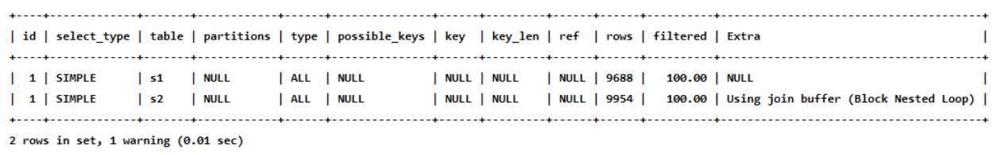


##### 4. partitions (可略)

- 代表分区表中的命中情况，非分区表，该项为NULL。一般情况下我们的查询语句的执行计划的partitions 列的值都是NULL。


##### 5. type ☆

执行计划的一条记录就代表着MySQL对某个表的执行查询时的访问方法，又称“访问类型”，其中的type列就表明了这个访问方法是啥，是较为重要的一个指标。比如，看到type列的值是ref，表明MySQL即将使用ref访问方法来执行对s1表的查询。

完整的访问方法如下： system ， const ， eq_ref ， ref ， fulltext ， ref_or_null ， index_merge ， unique_subquery ， index_subquery ， range ， index ， ALL 。

- system
  当表中只有一条记录并且该表使用的存储引引擎的统计数据是精确的，比如MyISAM、Memory，那么对该表的访问方法就是system。

- const
  当我们根据主键或者唯一二级索引列与常数进行等值匹配时，对单表的访问方法就是const

- eq_ref
  在连接查询时，如果被驱动表是通过主键或者唯一二级索引列等值匹配的方式进行访问的：（如果该主键或者唯一二级索引是联合索引的话，所有的索引列都必须进行等值比较），则对该被驱动表的访问方法就是eq_ref

  ```mysql
  mysql> EXPLAIN SELECT * FROM s1 INNER JOIN s2 ON s1.id = s2.id;
  ```

- ref
  当通过普通的二级索引列与常量进行等值匹配时来查询某个表，那么对该表的访问方法就可能是ref

  ```mysql
  mysql> EXPLAIN SELECT * FROM s1 WHERE key1 = 'a';
  ```

- ref_or_null

  当对普通二级索引进行等值匹配查询，该索引列的值也可以是NULL值时，那么对该表的访问方法就可能是ref_or_null

  ```mysql
  mysql> EXPLAIN SELECT * FROM s1 WHERE key1 = 'a' OR key1 IS NULL;
  ```

- index_merge
  单表访问方法时在某些场景下可以使用Intersection、Union、Sort-Union这三种索引合并的方式来执行查询

  ```mysql
  mysql> EXPLAIN SELECT * FROM s1 WHERE key1 = 'a' OR key3 = 'a';
  ```

- unique_subquery
  unique_subquery是针对在一些包含IN子查询的查询语句中，如果查询优化器决定将IN子查询转换为EXISTS子查询，而且子查询可以使用到主键进行等值匹配的话，那么该子查询执行计划的type列的值就是unique_subquery

  ```mysql
  mysql> EXPLAIN SELECT * FROM s1 WHERE key2 IN (SELECT id FROM s2 where s1.key1 =
  s2.key1) OR key3 = 'a';
  ```

- range
  如果使用索引获取某些范围区间的记录，那么就可能使用到range访问方法

  ```mysql
  mysql> EXPLAIN SELECT * FROM s1 WHERE key1 IN ('a', 'b', 'c');
  #或者
  mysql> EXPLAIN SELECT * FROM s1 WHERE key1 > 'a' AND key1 < 'b';
  ```

- index
  当我们可以使用索引覆盖，但需要扫描全部的索引记录时，该表的访问方法就是index

  ```mysql
  mysql> EXPLAIN SELECT key_part2 FROM s1 WHERE key_part3 = 'a';
  ```

- ALL
  最熟悉的全表扫描

  ```mysql
  mysql> EXPLAIN SELECT * FROM s1;
  ```

**小结：**

结果值从最好到最坏依次是： system > const > eq_ref > ref > fulltext > ref_or_null > index_merge > unique_subquery > index_subquery > range > index > ALL 其中比较重要的几个提取出来（见上图中的蓝 色）。SQL 性能优化的目标：至少要达到 range 级别，要求是 ref 级别，最好是 consts级别。（阿里巴巴 开发手册要求）


##### 6. possible_keys和key

在EXPLAIN语句输出的执行计划中，possible_keys列表示在某个查询语句中，对某个表执行单表查询时可能用到的索引有哪些。一般查询涉及到的字段上若存在索引，则该索引将被列出，但不一定被查询使用。key列表示实际用到的索引有哪些，如果为NULL，则没有使用索引。比方说下边这个查询：

```mysql
mysql> EXPLAIN SELECT * FROM s1 WHERE key1 > 'z' AND key3 = 'a';
```


##### 7. key_len ☆

实际使用到的索引长度（即：字节数）帮你检查是否充分的利用上了索引，值越大越好。主要针对联合索引，有一定参考意义。

```mysql
mysql> EXPLAIN SELECT * FROM s1 WHERE key_part1 = 'a';
```

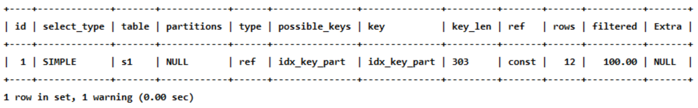

```mysql
mysql> EXPLAIN SELECT * FROM s1 WHERE key_part1 = 'a' AND key_part2 = 'b';
```

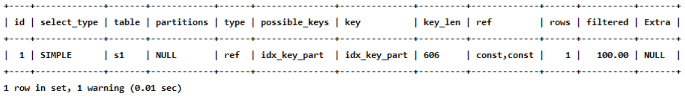


##### 8. ref

当使用索引列等值查询时，与索引列进行等值匹配的对象信息。比如只是一个常数或者是某个列。

```mysql
mysql> EXPLAIN SELECT * FROM s1 WHERE key1 = 'a';
```

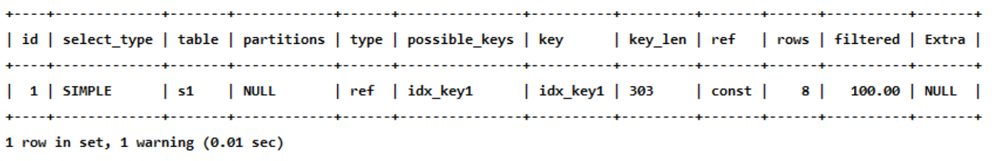


##### 9. rows ☆

预估的需要读取的记录条数，值越小越好

```mysql
mysql> EXPLAIN SELECT * FROM s1 WHERE key1 > 'z';
```


##### 10. filtered

某个表经过搜索条件过滤后剩余记录条数的百分比

如果使用的是索引执行的单表扫描，那么计算时需要估计出满足除使用到对应索引的搜索条件外的其他搜索条件的记录有多少条。

```mysql
mysql> EXPLAIN SELECT * FROM s1 WHERE key1 > 'z' AND common_field = 'a';
```

对于单表查询来说，这个filtered列的值没什么意义，我们更关注在连接查询中驱动表对应的执行计划记录的filtered值，它决定了被驱动表要执行的次数（即：rows*filtered）

```mysql
mysql> EXPLAIN SELECT * FROM s1 INNER JOIN s2 ON s1.key1 = s2.key1 WHERE s1.common_field = 'a';
```

从执行计划中可以看出来，查询优化器打算把s1当作驱动表，s2当作被驱动表。我们可以看到驱动表s1表的执行计划的rows列为9688，filtered列为10.00，这意味着驱动表s1的扇出值就是9688x10.00%= 968.8，这说明还要对被驱动表执行大约968次查询。


##### 11. Extra ☆

顾名思义，Extra列是用来说明一些额外信息的，包含不适合在其他列中显示但十分重要的额外信息。我们可以通过这些额外信息来更准确的理解MySQL到底将如何执行给定的查询语句。MySQL提供的额外信息有好几十个，我们就不一个一个介绍了，所以我们只挑比较重要的额外信息介绍给大家。

- No tables used
  当查询语句的没有FROM子句时将会提示该额外信息

  ```mysql
  mysql> EXPLAIN SELECT 1;
  ```

- Impossible where
  查询语句的where子句永远为false时将会提示该额外信息

  ```mysql
  mysql> EXPLAIN SELECT * FROM s1 WHERE 1 != 1;
  ```

- Using where
  当我们使用全表扫描来执行对某个表的查询，并且该语句的where子句中有针对该表的搜索条件时，在Extra列中会提示上述额外信息。

  ```mysql
  mysql> EXPLAIN SELECT * FROM s1 WHERE common_field = 'a';
  ```

  当使用索引访问来执行对某个表的查询，并且该语句的where子句中有除了该索引包含的列之外的其他搜索条件时，在Extra列中也会提示上述额外信息。

  ```mysql
  mysql> EXPLAIN SELECT * FROM s1 WHERE key1 = 'a' AND common_field = 'a';
  ```

- No matching min/max row
  当查询列表处有MIN或者MAX聚合函数，但是并没有符合WHERE子句中的搜索条件的记录时，将会提示该额外信息

  ```mysql
  mysql> EXPLAIN SELECT key1 FROM s1 WHERE key1 = 'a';
  ```

- Using index
  当我们的查询列表以及搜索条件中只包含属于某个索引的列，也就是在可以使用覆盖索引的情况下，在Extra列将会提示该额外信息。比方说下边这个查询中只需要用到idxkey1而不需要回表操作

  ```mysql
  mysql> EXPLAIN SELECT key1 FROM s1 WHERE key1 = 'a';
  ```

- Using index condition
  有些搜索条件中虽然出现了索引列，但却不能使用到索引

  ```mysql
  SELECT * FROM s1 WHERE key1 > 'z' AND key1 LIKE '%a';
  ```

- Using join buffer (Block Nested Loop)
  在连接查询执行过程中，当被驱动表不能有效的利用索引加快访问速度，MySQL一般会为其分配一块名叫 join buffer 的内存块来加快查询速度，也就是我们所讲的基于块的嵌套循环算法

  ```mysql
  mysql> EXPLAIN SELECT * FROM s1 INNER JOIN s2 ON s1.common_field = s2.common_field;
  ```

- Not exists
  当我们使用左（外）连接时，如果WHERE子句中包含要求被驱动表的某个列等于NULL值的搜索条件，而且那个列又是不允许存储NULL值的，那么在该表的执行计划的Extra列就会提示No texists额外信息

  ```mysql
  mysql> EXPLAIN SELECT * FROM s1 LEFT JOIN s2 ON s1.key1 = s2.key1 WHERE s2.id IS NULL;
  ```

- Using intersect(...) 、 Using union(...) 和 Using sort_union(...)
  如果执行计划的Extra列出现了Usingintersect（...）提示，说明准备使Intersect索引合并的方式执行查询，括号中的...：表示需要进行索引合并的索引名称；如果出现了Usingunion（...）提示，说明准备使用Union索引合并的方式执行查询；出现了Usingsort_union（...）提示，说明准备使用Sort-Union索引合并的方式执行查询。

  ```mysql
  mysql> EXPLAIN SELECT * FROM s1 WHERE key1 = 'a' OR key3 = 'a';
  ```

- Zero limit
  当我们的LIMIT子句的参数为O时，表示压根儿不打算从表中读出任何记录，将会提示该额外信息

  ```mysql
  mysql> EXPLAIN SELECT * FROM s1 LIMIT 0;
  ```

- Using filesort
  有一些情况下对结果集中的记录进行排序是可以使用到索引的。

  ```mysql
  mysql> EXPLAIN SELECT * FROM s1 ORDER BY key1 LIMIT 10;
  ```

  很多情况下排序操作无法使用到索引，只能在内存中（记录较少的时候）或者磁盘中（记录较多的时候）进行排序，MySQL把这种在内存中或者磁盘上进行排序的方式统称为文件排序（英文名：filesort"）。
  如果某个查询需要使用文件排序的方式执行查询，就会在执行计划的Extra列中显示Usingfilesort提示

  ```mysql
  mysql> EXPLAIN SELECT * FROM s1 ORDER BY common_field LIMIT 10;
  ```

- Using temporary
  在许多查询的执行过程中，MySQL可能会借助临时表来完成一些功能，比如去重、排序之类的，比如我们在执行许多包含DISTINCT、GROUPBY、UNION等子句的查询过程中，如果不能有效利用索引来完成查询，MySQL很有可能寻求通过建立内部的临时表来执行查询。如果查询中使用到了内部的临时表，在执行计划的Extra列将会显示Usingtemporary提示

  ```mysql
  mysql> EXPLAIN SELECT DISTINCT common_field FROM s1;
  ```

  执行计划中出现Using temporary并不是一个好的征兆，因为建立与维护临时表要付出很大成本的，所以我们最好能使用索引来替代掉使用临时表。比如：扫描指定的索引 idx_key1 即可


##### 12. 小结

- EXPLAIN不考虑各种Cache
- EXPLAIN不能显示MySQL在执行查询时所作的优化工作
- EXPLAIN不会告诉你关于触发器、存储过程的信息或用户自定义函数对查询的影响情况
- 部分统计信息是估算的，并非精确值


### 7. EXPLAIN的进一步使用

#### 7.1 EXPLAIN四种输出格式

这里谈谈EXPLAIN的输出格式。EXPLAIN可以输出四种格式： 传统格式 ， JSON格式 ， TREE格式 以及 可 视化输出 。用户可以根据需要选择适用于自己的格式。


##### 1. 传统格式

传统格式简单明了，输出是一个表格形式，概要说明查询计划。

```mysql
mysql> EXPLAIN SELECT s1.key1, s2.key1 FROM s1 LEFT JOIN s2 ON s1.key1 = s2.key1 WHERE s2.common_field IS NOT NULL;
```

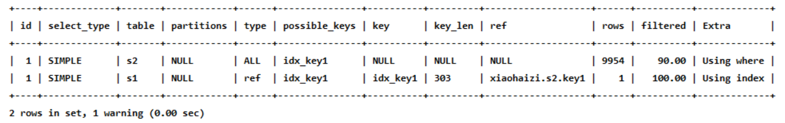


##### 2. JSON格式

- JSON格式：在EXPLAIN单词和真正的查询语句中间加上 FORMAT=JSON 。


```mysql
EXPLAIN FORMAT=JSON SELECT ....
```

```json
"cost_info": {
    "read_cost": "1840.84",
    "eval_cost": "193.76",
    "prefix_cost": "2034.60",
    "data_read_per_join": "1M"
}
```

- read_cost 是由下边这两部分组成的：
  - IO 成本
  - 检测 rows × (1 - filter) 条记录的 CPU 成本
- eval_cost 是这样计算的：
  检测 rows × filter 条记录的成本。
- prefix_cost 就是单独查询 s1 表的成本，也就是：
  read_cost + eval_cost
- data_read_per_join 表示在此次查询中需要读取的数据量。


##### 3. TREE格式

TREE格式是8.0.16版本之后引入的新格式，主要根据查询的 各个部分之间的关系 和 各部分的执行顺序 来描 述如何查询。

```mysql
mysql> EXPLAIN FORMAT=tree SELECT * FROM s1 INNER JOIN s2 ON s1.key1 = s2.key2 WHERE s1.common_field = 'a'\G
*************************** 1. row ***************************
EXPLAIN: -> Nested loop inner join (cost=1360.08 rows=990)
	-> Filter: ((s1.common_field = 'a') and (s1.key1 is not null)) (cost=1013.75 rows=990)
		-> Table scan on s1 (cost=1013.75 rows=9895)
	-> Single-row index lookup on s2 using idx_key2 (key2=s1.key1), with index
	
condition: (cast(s1.key1 as double) = cast(s2.key2 as double)) (cost=0.25 rows=1)

1 row in set, 1 warning (0.00 sec)
```


##### 4. 可视化输出

可视化输出，可以通过MySQL Workbench可视化查看MySQL的执行计划。通过点击Workbench的放大镜图 标，即可生成可视化的查询计划。 

上图按从左到右的连接顺序显示表。红色框表示 全表扫描 ，而绿色框表示使用 索引查找 。对于每个表， 显示使用的索引。还要注意的是，每个表格的框上方是每个表访问所发现的行数的估计值以及访问该表 的成本。


#### 7.2 SHOW WARNINGS的使用

在我们使用EXPLAIN语句查看了某个查询的执行计划后，紧接着还可以使用SHOWWARNINGS语句查看与这个查询的执行计划有关的一些扩展信息，比如这样：

```mysql
mysql> EXPLAIN SELECT s1.key1, s2.key1 FROM s1 LEFT JOIN s2 ON s1.key1 = s2.key1 WHERE s2.common_field IS NOT NULL;
```

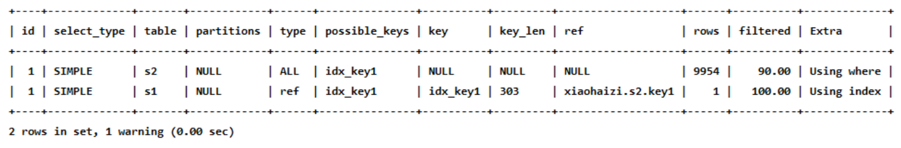

```mysql
mysql> SHOW WARNINGS\G
*************************** 1. row ***************************
Level: Note
Code: 1003

Message: /* select#1 */ select `atguigu`.`s1`.`key1` AS `key1`,`atguigu`.`s2`.`key1` AS `key1` from `atguigu`.`s1` join `atguigu`.`s2` where ((`atguigu`.`s1`.`key1` = `atguigu`.`s2`.`key1`) and (`atguigu`.`s2`.`common_field` is not null))
1 row in set (0.00 sec)
```


### 8. 分析优化器执行计划：trace

OPTIMIZER_TRACE是MySQL5.6引入的一项跟踪功能，它可以跟踪优化器做出的各种决策（比如访问表的方法、各种开销计算、各种转换等），并将跟踪结果记录到INFORMATION_SCHEMA.OPTIMIZER_TRACE表中。

此功能默认关闭。开启trace，并设置格式为JSON，同时设置trace最大能够使用的内存大小，避免解析过程中因为默认内存过小而不能够完整展示。

```mysql
SET optimizer_trace="enabled=on",end_markers_in_json=on;

set optimizer_trace_max_mem_size=1000000;
```

开启后，可分析如下语句：

- SELECT
- INSERT
- REPLACE
- UPDATE
- DELETE
- EXPLAIN
- SET
- DECLARE
- CASE
- IF
- RETURN
- CALL

测试：执行如下SQL语句

```mysql
select * from student where id < 10;
```

```mysql
*************************** 1. row ***************************
//第1部分：查询语句
//第2部分：QUERY字段对应语句的跟踪信息
//第3部分：跟踪信息过长时，被截断的跟踪信息的字节数。
//第4部分：执行跟踪语句的用户是否有查看对象的权限。当不具有权限时，该列信息为1且TRACE字段为空，一般在调用带有SQL SECURITY DEFINER的视图或者是存储过程的情况下，会出现此问题。
```


### 9. MySQL监控分析视图-sys schema

关于MySQL的性能监控和问题诊断，我们一般都从performance_schema中去获取想要的数据，在MySQL5.7.7版本中新增sysschema，它将performance_schema和information_schema中的数据以更容易理解的方式总结归纳为"视图”，其目的就是为了降低查询performance_schema的复杂度，让DBA能够快速的定位问题。下面看看这些库中都有哪些监控表和视图，掌握了这些，在我们开发和运维的过程中就起到了事半功倍的效果。


#### 9.1 Sys schema视图摘要

1. 主机相关：以host_summary开头，主要汇总了IO延迟的信息。
2. Innodb相关：以innodb开头，汇总了innodb buffer信息和事务等待innodb锁的信息。
3. I/o相关：以io开头，汇总了等待I/O、I/O使用量情况。
4. 内存使用情况：以memory开头，从主机、线程、事件等角度展示内存的使用情况
5. 连接与会话信息：processlist和session相关视图，总结了会话相关信息。
6. 表相关：以schema_table开头的视图，展示了表的统计信息。
7. 索引信息：统计了索引的使用情况，包含冗余索引和未使用的索引情况。
8. 语句相关：以statement开头，包含执行全表扫描、使用临时表、排序等的语句信息。
9. 用户相关：以user开头的视图，统计了用户使用的文件I/O、执行语句统计信息。
10. 等待事件相关信息：以wait开头，展示等待事件的延迟情况。


#### 9.2 Sys schema视图使用场景

索引情况

```mysql
#1. 查询冗余索引
select * from sys.schema_redundant_indexes;
#2. 查询未使用过的索引
select * from sys.schema_unused_indexes;
#3. 查询索引的使用情况
select index_name,rows_selected,rows_inserted,rows_updated,rows_deleted
from sys.schema_index_statistics where table_schema='dbname' ;
```

表相关

```mysql
# 1. 查询表的访问量
select table_schema,table_name,sum(io_read_requests+io_write_requests) as io from sys.schema_table_statistics group by table_schema,table_name order by io desc;
# 2. 查询占用bufferpool较多的表
select object_schema,object_name,allocated,data from sys.innodb_buffer_stats_by_table order by allocated limit 10;
# 3. 查看表的全表扫描情况
select * from sys.statements_with_full_table_scans where db='dbname';
```

语句相关

```mysql
#1. 监控SQL执行的频率
select db,exec_count,query from sys.statement_analysis order by exec_count desc;

#2. 监控使用了排序的SQL
select db,exec_count,first_seen,last_seen,query from sys.statements_with_sorting limit 1;

#3. 监控使用了临时表或者磁盘临时表的SQL
select db,exec_count,tmp_tables,tmp_disk_tables,query from sys.statement_analysis where tmp_tables>0 or tmp_disk_tables >0 order by (tmp_tables+tmp_disk_tables) desc;
```


IO相关

```mysql
#1. 查看消耗磁盘IO的文件
select file,avg_read,avg_write,avg_read+avg_write as avg_io from sys.io_global_by_file_by_bytes order by avg_read limit 10;
```


Innodb 相关

```mysql
#1. 行锁阻塞情况
select * from sys.innodb_lock_waits;
```


## 十、索引优化与查询优化

都有哪些维度可以进行数据库调优？简言之：

- 索引失效、没有充分利用到索引 --索引建立
- 关联查询太多JOIN（设计缺陷或不得已的需求）--SQL优化
- 服务器调优及各个参数设置（缓冲、线程数等）--调整my.cnf
- 数据过多 --分库分表

关于数据库调优的知识点非常分散。不同的DBMS，不同的公司，不同的职位，不同的项目遇到的问题都不尽相同。这里我们分为三个章节进行细致讲解。

虽然SQL查询优化的技术有很多，但是大方向上完全可以分成物理查询优化和逻辑查询优化两大块。

- 物理查询优化是通过索引和表连接方式等技术来进行优化，这里重点需要掌握索引的使用。
- 逻辑查询优化就是通过SQL等价变换提升查询效率，直白一点就是说，换一种查询写法执行效率可能更高。


### 1. 数据准备

学员表 插 50万 条， 班级表 插 1万 条。

**步骤1：建表**

```mysql
CREATE TABLE `class` (
    `id` INT(11) NOT NULL AUTO_INCREMENT,
    `className` VARCHAR(30) DEFAULT NULL,
    `address` VARCHAR(40) DEFAULT NULL,
    `monitor` INT NULL ,
    PRIMARY KEY (`id`)
) ENGINE=INNODB AUTO_INCREMENT=1 DEFAULT CHARSET=utf8;

CREATE TABLE `student` (
    `id` INT(11) NOT NULL AUTO_INCREMENT,
    `stuno` INT NOT NULL ,
    `name` VARCHAR(20) DEFAULT NULL,
    `age` INT(3) DEFAULT NULL,
    `classId` INT(11) DEFAULT NULL,
    PRIMARY KEY (`id`)
    #CONSTRAINT `fk_class_id` FOREIGN KEY (`classId`) REFERENCES `t_class` (`id`)
) ENGINE=INNODB AUTO_INCREMENT=1 DEFAULT CHARSET=utf8;
```


**步骤2：设置参数**

- 命令开启：允许创建函数设置：

```mysql
set global log_bin_trust_function_creators=1; # 不加global只是当前窗口有效。
```


**步骤3：创建函数**

保证每条数据都不同。

```mysql
#随机产生字符串
DELIMITER //
CREATE FUNCTION rand_string(n INT) RETURNS VARCHAR(255)
BEGIN
DECLARE chars_str VARCHAR(100) DEFAULT
'abcdefghijklmnopqrstuvwxyzABCDEFJHIJKLMNOPQRSTUVWXYZ';
DECLARE return_str VARCHAR(255) DEFAULT '';
DECLARE i INT DEFAULT 0;
WHILE i < n DO
SET return_str =CONCAT(return_str,SUBSTRING(chars_str,FLOOR(1+RAND()*52),1));
SET i = i + 1;
END WHILE;
RETURN return_str;
END //
DELIMITER ;

#假如要删除
#drop function rand_string;
```

随机产生班级编号

```mysql
#用于随机产生多少到多少的编号
DELIMITER //
CREATE FUNCTION rand_num (from_num INT ,to_num INT) RETURNS INT(11)
BEGIN
DECLARE i INT DEFAULT 0;
SET i = FLOOR(from_num +RAND()*(to_num - from_num+1)) ;
RETURN i;
END //
DELIMITER ;

#假如要删除
#drop function rand_num;
```


**步骤4：创建存储过程**

```mysql
#创建往stu表中插入数据的存储过程
DELIMITER //
CREATE PROCEDURE insert_stu( START INT , max_num INT )
BEGIN
DECLARE i INT DEFAULT 0;
SET autocommit = 0; #设置手动提交事务
REPEAT #循环
SET i = i + 1; #赋值
INSERT INTO student (stuno, name ,age ,classId ) VALUES
((START+i),rand_string(6),rand_num(1,50),rand_num(1,1000));
UNTIL i = max_num
END REPEAT;
COMMIT; #提交事务
END //
DELIMITER ;
#假如要删除
#drop PROCEDURE insert_stu;
```

创建往class表中插入数据的存储过程

```mysql
#执行存储过程，往class表添加随机数据
DELIMITER //
CREATE PROCEDURE `insert_class`( max_num INT )
BEGIN
DECLARE i INT DEFAULT 0;
SET autocommit = 0;
REPEAT
SET i = i + 1;
INSERT INTO class ( classname,address,monitor ) VALUES
(rand_string(8),rand_string(10),rand_num(1,100000));
UNTIL i = max_num
END REPEAT;
COMMIT;
END //
DELIMITER ;

#假如要删除
#drop PROCEDURE insert_class;
```


**步骤5：调用存储过程**

class

```mysql
#执行存储过程，往class表添加1万条数据
CALL insert_class(10000);
```

stu

```mysql
#执行存储过程，往stu表添加50万条数据
CALL insert_stu(100000,500000);
```


**步骤6：删除某表上的索引**

创建存储过程

```mysql
DELIMITER //
CREATE PROCEDURE `proc_drop_index`(dbname VARCHAR(200),tablename VARCHAR(200))
BEGIN
        DECLARE done INT DEFAULT 0;
        DECLARE ct INT DEFAULT 0;
        DECLARE _index VARCHAR(200) DEFAULT '';
        DECLARE _cur CURSOR FOR SELECT index_name FROM
information_schema.STATISTICS WHERE table_schema=dbname AND table_name=tablename AND seq_in_index=1 AND index_name <>'PRIMARY' ;
#每个游标必须使用不同的declare continue handler for not found set done=1来控制游标的结束
	DECLARE CONTINUE HANDLER FOR NOT FOUND set done=2 ;
#若没有数据返回,程序继续,并将变量done设为2
        OPEN _cur;
        FETCH _cur INTO _index;
        WHILE _index<>'' DO
            SET @str = CONCAT("drop index " , _index , " on " , tablename );
            PREPARE sql_str FROM @str ;
            EXECUTE sql_str;
            DEALLOCATE PREPARE sql_str;
            SET _index='';
            FETCH _cur INTO _index;
        END WHILE;
	CLOSE _cur;
END //
DELIMITER ;
```

执行存储过程

```mysql
CALL proc_drop_index("dbname","tablename");
```


### 2. 索引失效案例

MySQL中提高性能的一个最有效的方式是对数据表设计合理的索引。索引提供了高效访问数据的方法，并且加快查询的速度，因此索引对查询的速度有着至关重要的影响。

- 使用索引可以快速地定位表中的某条记录，从而提高数据库查询的速度，提高数据库的性能。
- 如果查询时没有使用索引，查询语句就会扫描表中的所有记录。在数据量大的情况下，这样查询的速度会很慢。

大多数情况下都（默认）采用B+树来构建索引。只是空间列类型的索引I使用R-树，并且MEMORY表还支持hash 索引。

其实，用不用索引，最终都是优化器说了算。优化器是基于什么的优化器？基于cost开销（CostBaseOptimizer），它不是基于规则（Rule-BasedOptimizer），也不是基于语义。怎么样开销小就怎么来。另外，SQL语句是否使用索引，跟数据库版本、数据量、数据选择度都有关系。


#### 2.1 全值匹配我最爱

系统中经常出现的sql语句如下：

```mysql
EXPLAIN SELECT SQL_NO_CACHE * FROM student WHERE age=30;
EXPLAIN SELECT SQL_NO_CACHE * FROM student WHERE age=30 and classId=4;
EXPLAIN SELECT SQL_NO_CACHE * FROM student WHERE age=30 and classId=4 AND name ='abcd';
```

建立索引前执行：(关注执行时间）

```mysql
SELECT SQL_NO_CACHE * FROM student WHERE age=30 and classId=4 AND name ='abcd';
Empty set, 1 warning (0.28 sec)
```

建立索引

```mysql
CREATE INDEX idx_age ON student(age);
CREATE INDEX idx_age_classid ON student(age,classId);
CREATE INDEX idx_age_classid_name ON student(age,classId,name);
```

建立索引后执行：

```mysql
SELECT SQL_NO_CACHE * FROM student WHERE age=30 and classId=4 AND name = 'abcd';
Empty set，1 warning (0.01 sec)
```

可以看到，创建索引前的查询时间是0.28秒，创建索引后的查询时间是0.01秒，索引帮助我们极大的提高了查询效率。


#### 2.2 最佳左前缀法则

在MySQL建立联合索引时会遵守最佳左前缀匹配原则，即最左优先，在检索数据时从联合索引的最左边开始四配。

举例1:

```mysql
EXPLAIN SELECT SQL_NO_CACHE * FROM student WHERE student.age=30 AND student.name = 'abcd'；
```

举例2:

```mysql
EXPLAIN SELECT SQL_NO_CACHE * FROM student WHERE student.classid=1 AND student.name  = 'abcd'; 
```

举例3：索引 idx_age_classid_name 还能否正常使用？

```mysql
EXPLAIN SELECT SQL_NO_CACHE * FROM student WHERE classid=4 AND student.age=30 AND student.name ='abcd';
```

虽然可以正常使用，但是只有部分被使用到了。

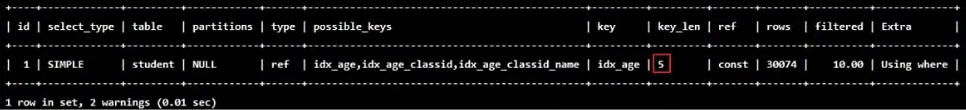

```mysql
mysql> EXPLAIN SELECT SQL_NO_CACHE * FROM student WHERE student.classid=1 AND student.name'abcd';
```

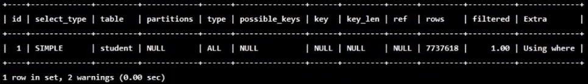

完全没有使用上索引。

结论：MySQL可以为多个字段创建索引，一个索引|可以包括16个字段。对于多列索引，过滤条件要使用索引必须按照索引建立时的顺序，依次满足，一旦跳过某个字段，索引后面的字段都无法被使用。如果查询条件中没有使用这些字段中第1个字段时，多列（或联合）索引不会被使用。


#### 2.3 主键插入顺序

对于一个使用InnoDB存储引擎的表来说，在我们没有显式的创建索引时，表中的数据实际上都是存储在聚簇索引的叶子节点的。而记录又是存储在数据页中的，数据页和记录又是按照记录主键值从小到大的顺序进行排序，所以如果我们插入的记录的主键值是依次增大的话，那我们每插满一个数据页就换到下一个数据页继续插，而如果我们插入的主键值忽大忽小的话，就比较麻烦了，假设某个数据页存储的记录已经满了，它存储的主键值在 1~100之间：


如果此时再插入一条主键值为 9 的记录，那它插入的位置就如下图：

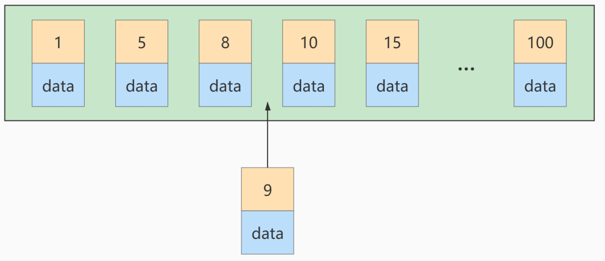

可这个数据页已经满了，再插进来咋办呢？我们需要把当前页面分裂成两个页面，把本页中的一些记录移动到新创建的这个页中。页面分裂和记录移位意味着什么？意味着：性能损耗！所以如果我们想尽量避免这样无谓的性能损耗，最好让插入的记录的主键值依次递增，这样就不会发生这样的性能损耗了。所以我们建议：让主键具有 AUTO_INCREMENT，让存储引擎自已为表生成主键，而不是我们手动插入，比如：person_info表：

```mysql
CREATE TABLE person_info(
    id INT UNSIGNED NOT NULL AUTO_INCREMENT,
    name VARCHAR(100) NOT NULL,
    birthday DATE NOT NULL,
    phone_number CHAR(11) NOT NULL,
    country varchar(100) NOT NULL,
    PRIMARY KEY (id),
    KEY idx_name_birthday_phone_number (name(10), birthday, phone_number)
);
```

我们自定义的主键列 id 拥有 AUTO_INCREMENT 属性，在插入记录时存储引擎会自动为我们填入自增的 主键值。这样的主键占用空间小，顺序写入，减少页分裂。


#### 2.4 计算、函数、类型转换(自动或手动)导致索引失效


#### 2.5 类型转换导致索引失效


#### 2.6 范围条件右边的列索引失效

1. 如果系统经常出现的sql如下：

```mysql
ALTER TABLE student DROP INDEX idx_name;
ALTER TABLE student DROP INDEX idx_age;
ALTER TABLE student DROP INDEX idx_age_classid;

EXPLAIN SELECT SQL_NO_CACHE * FROM student
WHERE student.age=30 AND student.classId>20 AND student.name = 'abc' ;
```

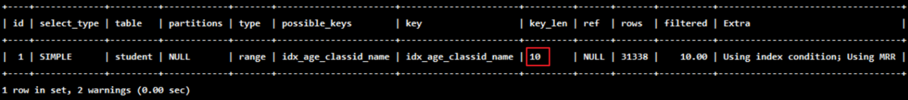


2. 那么索引 idx_age_classid_name 这个索引还能正常使用么？

- 不能，范围右边的列不能使用。比如：（<）（<=）（>）（>=）和between等
- 如果这种sql出现较多，应该建立：

```mysql
create index idx_age_name_classid on student(age,name,classid);
```

- 将范围查询条件放置语句最后：

```mysql
EXPLAIN SELECT SQL_NO_CACHE * FROM student WHERE student.age=30 AND student.name = 'abc' AND student.classId>20 ;
```

> 应用开发中范围查询，例如：金额查询，日期查询往往都是范围查询。应将查询条件放置where语句最后。（创建的联合索引|中，务必把范围涉及到的字段写在最后）


#### 2.7 不等于(!= 或者<>)索引失效


#### 2.8 is null可以使用索引，is not null无法使用索引

> 结论：最好在设计数据表的时候就将字段设置为 NOT NULL 约束，比如你可以将 INT 类型的字段，默认值设置为0。将字符类型的默认值设置为空字符串('')。
>
> 拓展：同理，在查询中使用not like也无法使用索引，导致全表扫描。


#### 2.9 like以通配符%开头索引失效

在使用LIKE关键字进行查询的查询语句中，如果匹配字符串的第一个字符为“%”，索引就不会起作用。只有“%"不在第一个位置，索引才会起作用。

> 拓展：Alibaba《Java开发手册》
>
> 【强制】页面搜索严禁左模糊或者全模糊，如果需要请走搜索引擎来解决。


#### 2.10 OR 前后存在非索引的列，索引失效

在WHERE子句中，如果在OR前的条件列进行了索引，而在OR后的条件列没有进行索引，那么索引会失效。也就是说，OR前后的两个条件中的列都是索引时，查询中才使用索引。

因为OR的含义就是两个只要满足一个即可，因此只有一个条件列进行了索引是没有意义的，只要有条件列没有进行索引，就会进行全表扫描，因此索引的条件列也会失效。


#### 2.11 数据库和表的字符集统一使用utf8mb4

统一使用utf8mb4( 5.5.3版本以上支持)兼容性更好，统一字符集可以避免由于字符集转换产生的乱码。不 同的 字符集 进行比较前需要进行 转换 会造成索引失效。


#### 2.12 一般建议

- 对于单列索引，尽量选择针对当前query过滤性更好的索引
- 在选择组合索引的时候，当前query中过滤性最好的字段在索引字段顺序中，位置越靠前越好。
- 在选择组合索引的时候，尽量选择能够包含当前query中的where子句中更多字段的索引。
- 在选择组合索引的时候，如果某个字段可能出现范围查询时，尽量把这个字段放在索引次序的最后面。


### 3. 关联查询优化

#### 3.2 采用左外连接

下面开始 EXPLAIN 分析

```mysql
EXPLAIN SELECT SQL_NO_CACHE * FROM `type` LEFT JOIN book ON type.card = book.card;
```

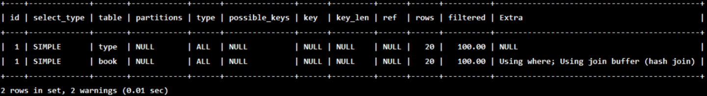

结论：type 有All

添加索引优化

```mysql
ALTER TABLE book ADD INDEX Y ( card); #【被驱动表】，可以避免全表扫描

EXPLAIN SELECT SQL_NO_CACHE * FROM `type` LEFT JOIN book ON type.card = book.card;
```

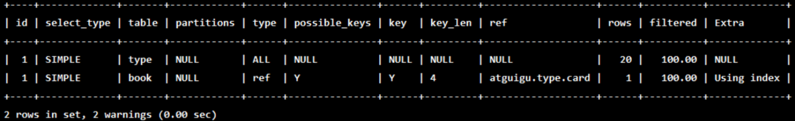

可以看到第二行的 type 变为了 ref，rows 也变成了优化比较明显。这是由左连接特性决定的。LEFT JOIN 条件用于确定如何从右表搜索行，左边一定都有，所以 右边是我们的关键点,一定需要建立索引 。

```mysql
ALTER TABLE `type` ADD INDEX X (card); #【驱动表】，无法避免全表扫描

EXPLAIN SELECT SQL_NO_CACHE * FROM `type` LEFT JOIN book ON type.card = book.card;
```

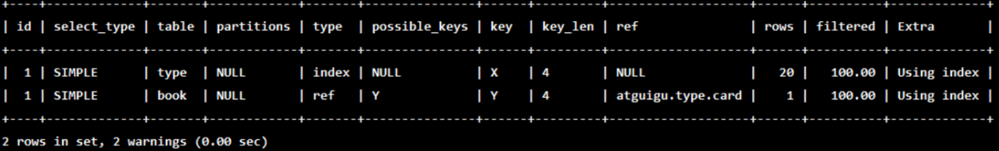

接着：

```mysql
DROP INDEX Y ON book;

EXPLAIN SELECT SQL_NO_CACHE * FROM `type` LEFT JOIN book ON type.card = book.card;
```

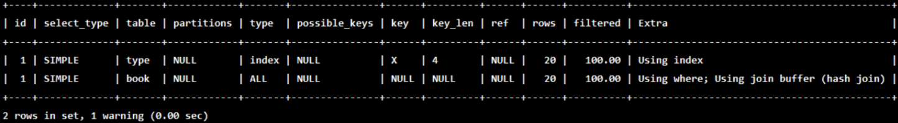


#### 3.3 采用内连接

- 对于内连接来说，查询优化器可以决定谁作为驱动表，谁作为被驱动表出现的
- 对于内连接来说，如果表的连接条件中只能有一个字段有索引，则有索引的字段所在的表会被作为被驱动表出现。
- 对于内连接来说，在两个表的连接条件都存在索引的情况下，会选择小表作为驱动表。“小表驱动大表”


#### 3.4 join语句原理

join方式连接多个表，本质就是各个表之间数据的循环匹配。MySQL5.5版本之前，MySQL只支持一种表间关联方式，就是嵌套循环（Nested Loop Join)。如果关联表的数据量很大，则join关联的执行时间会非常长。在MySQL5.5 以后的版本中，MySQL通过引入BNLJ算法来优化嵌套执行。

##### 1. 驱动表和被驱动表

驱动表就是主表，被驱动表就是从表、非驱动表。

- 对于内连接来说：

```mysql
select * from A join B on ...
```

A一定是驱动表吗？不一定，优化器会根据你查询语句做优化，决定先查哪张表。先查询的那张表就是驱动表，反之就是被驱动表。通过explain关键字可以查看。


- 对于外连接来说：


```mysql
select * from A left join B on ...
#或
select * from B right join A on ...
```

通常，大家会认为A就是驱动表，B就是被驱动表。但也未必。


##### 2. Simple Nested-Loop Join（简单嵌套循环连接）

算法相当简单，从表A中取出一条数据1，遍历表B，将匹配到的数据放到result..以此类推，驱动表A中的每一条记录与被驱动表B的记录进行判断：

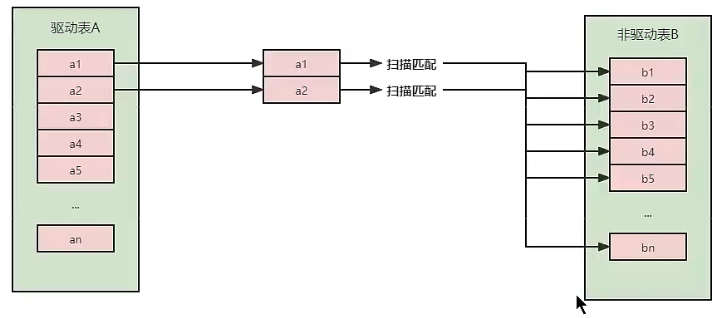

可以看到这种方式效率是非常低的，以上述表A数据100条，表B数据1000条计算，则A*B=10万次。开销统计如下:

| 开销统计           | SNLJ  |
| ------------------ | ----- |
| 外表扫描次数：     | 1     |
| 内表扫描次数：     | A     |
| 读取记录数：       | A+B*A |
| JOIN比较次数：     | B*A   |
| 回表读取记录次数： | 0     |

当然mysql肯定不会这么粗暴的去进行表的连接，所以就出现了后面的两种对Nested-LoopJoin优化算法。


##### 3. Index Nested-Loop Join（索引嵌套循环连接）

Index Nested-Loop Join其优化的思路主要是为了减少内层表数据的匹配次数，所以要求被驱动表上必须有索引才行。通过外层表匹配条件直接与内层表索引进行匹配，避免和内层表的每条记录去进行比较，这样极大的减少了对内层表的匹配次数。

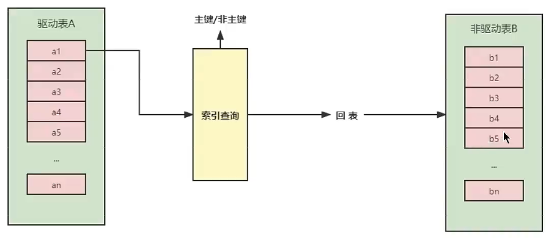

驱动表中的每条记录通过被驱动表的索引进行访问，因为索引|查询的成本是比较固定的，故mysql优化器都倾向于使用记录数少的表作为驱动表（外表）。

| 开销统计           | SNLJ  | INLJ                   |
| ------------------ | ----- | ---------------------- |
| 外表扫描次数：     | 1     | 1                      |
| 内表扫描次数：     | A     | 0                      |
| 读取记录数：       | A+B*A | A+B(match)             |
| JOIN比较次数：     | B*A   | A*Index(Height)        |
| 回表读取记录次数： | 0     | B(match) (if possible) |

如果被驱动表加索引，效率是非常高的，但如果索引不是主键索引，所以还得进行一次回表查询。相比，被驱动表的索引是主键索引，效率会更高。


##### 4. Block Nested-Loop Join（块嵌套循环连接）

如果存在索引，那么会使用index的方式进行join，如果join的列没有索引，被驱动表要扫描的次数太多了。每次访问被驱动表，其表中的记录都会被加载到内存中，然后再从驱动表中取一条与其匹配，匹配结束后清除内存，然后再从驱动表中加载一条记录，然后把被驱动表的记录在加载到内存匹配，这样周而复始，大大增加了10的次数。为了减少被驱动表的io次数，就出现了BlockNested-LoopJoin的方式。

不再是逐条获取驱动表的数据，而是一块一块的获取，引入了joinbuffer缓冲区，将驱动表join相关的部分数据列（大小受joinbuffer的限制）缓存到joinbuffer中，然后全表扫描被驱动表，被驱动表的每一条记录一次性和join buffer中的所有驱动表记录进行匹配（内存中操作），将简单嵌套循环中的多次比较合并成一次，降低了被驱动表的访问频率。

> 注意：
>
> 这里缓存的不只是关联表的列，select后面的列也会缓存起来。
>
> 在一个有N个join关联的sql中会分配N-1个joinbuffer。所以查询的时候尽量减少不必要的字段，可以让join buffer中可以存放更多的列。

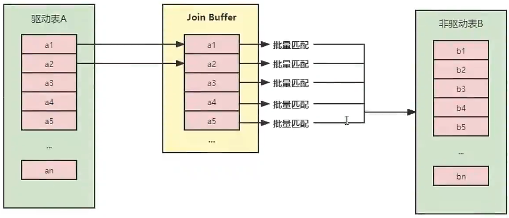

| 开销统计           | SNLJ  | INLJ                   | BNLJ                                              |
| ------------------ | ----- | ---------------------- | ------------------------------------------------- |
| 外表扫描次数：     | 1     | 1                      | 1                                                 |
| 内表扫描次数：     | A     | 0                      | A * used_column_size / join_buffer_size + 1       |
| 读取记录数：       | A+B*A | A+B(match)             | A + B * (A * used_column_size / join_buffer_size) |
| JOIN比较次数：     | B*A   | A*Index(Height)        | B* A                                              |
| 回表读取记录次数： | 0     | B(match) (if possible) | 0                                                 |

参数设置：

- block_nested_loop

通过show variables like '%optimizer_switch%' 查看 block_nested_loop 状态。默认是开启的。

- join_buffer_size

驱动表能不能一次加载完，要看join buffer能不能存储所有的数据，默认情况下join_buffer_size=256k。

join_buffer_size的最大值在32位系统可以申请4G，而在64位操做系统下可以申请大于4G的Join Buffer空间（64位 Windows除外，其大值会被截断为4GB并发出警告）。


##### 5. 小结

1. 整体效率比较：INLJ > BNLJ > SNLJ
2. 永远用小结果集驱动大结果集（其本质就是减少外层循环的数据数量）（小的度量单位指的是表行数 * 每行大小)
3. 为被驱动表匹配的条件增加索引(减少内层表的循环匹配次数）
4. 增大join buffer size的大小（一次缓存的数据越多，那么内层包的扫表次数就越少）
5. 减少驱动表不必要的字段查询（字段越少，join buffer所缓存的数据就越多）


### 4. 子查询优化

MySQL从4.1版本开始支持子查询，使用子查询可以进行SELECT语句的嵌套查询，即一个SELECT查询的结 果作为另一个SELECT语句的条件。 子查询可以一次性完成很多逻辑上需要多个步骤才能完成的SQL操作 。

子查询是 MySQL 的一项重要的功能，可以帮助我们通过一个 SQL 语句实现比较复杂的查询。但是，子 查询的执行效率不高。原因：

1. 执行子查询时，MySQL需要为内层查询语句的查询结果 建立一个临时表 ，然后外层查询语句从临时表 中查询记录。查询完毕后，再 撤销这些临时表 。这样会消耗过多的CPU和IO资源，产生大量的慢查询。
2. 子查询的结果集存储的临时表，不论是内存临时表还是磁盘临时表都 不会存在索引 ，所以查询性能会 受到一定的影响。
3. 对于返回结果集比较大的子查询，其对查询性能的影响也就越大。

在MySQL中，可以使用连接（JOIN）查询来替代子查询。连接查询 不需要建立临时表 ，其 速度比子查询 要快 ，如果查询中使用索引的话，性能就会更好。

举例1：查询学生表中是班长的学生信息

- 使用子查询

```mysql
#创建班级表中班长的索引
CREATE INDEX idx_monitor ON class（monitor);

EXPLAIN SELECT * FROM student stu1 
WHERE stu1.stuno IN(
SELECT monitor 
FROM class c
WHERE monitor IS NOT NULL
);
```

- 推荐：使用多表查询

```mysql
EXPLAIN SELECT stu1.* FROM student stu1 JOIN class c
ON stu1.stuno = c.monitor 
WHERE c.monitor IS NOT NULL;
```

> 结论：尽量不要使用NOT IN 或者 NOT EXISTS，用LEFT JOIN xxx ON xx WHERE xx IS NULL替代


### 5. 排序优化

#### 5.1 排序优化

**问题**：在 WHERE 条件字段上加索引，但是为什么在 ORDER BY 字段上还要加索引呢？

**回答**：

在MySQL中，支持两种排序方式，分别是 FileSort 和 Index 排序。

- Index排序中，索引可以保证数据的有序性，不需要再进行排序，效率更高。
- FileSort排序则一般在内存中进行排序，占用CPU较多。如果待排结果较大，会产生临时文件I/O到磁盘进行排序的情况，效率较低。

**优化建议**：

1. SQL 中，可以在 WHERE 子句和 ORDER BY 子句中使用索引，目的是在 WHERE 子句中 避免全表扫描 ，在 ORDER BY 子句 避免使用 FileSort 排序 。当然，某些情况下全表扫描，或者 FileSort 排序不一定比索引慢。但总的来说，我们还是要避免，以提高查询效率。
2. 尽量使用 Index 完成 ORDER BY 排序。如果 WHERE 和 ORDER BY 后面是相同的列就使用单索引列；如果不同就使用联合索引。
3. 无法使用 Index 时，需要对 FileSort 方式进行调优。

```mysql
INDEX a_b_c(a,b,c)

order by 能使用索引最左前缀
- ORDER BY a
- ORDER BY a,b
- ORDER BY a,b,c
- ORDER BY a DESC,b DESC,c DESC

如果WHERE使用索引的最左前缀定义为常量，则order by 能使用索引
- WHERE a = const ORDER BY b,c
- WHERE a = const AND b = const ORDER BY c
- WHERE a = const ORDER BY b,c
- WHERE a = const AND b > const ORDER BY b,c

不能使用索引进行排序
- ORDER BY a ASC,b DESC,c DESC /* 排序不一致 */
- WHERE g = const ORDER BY b,c /*丢失a索引*/
- WHERE a = const ORDER BY c /*丢失b索引*/
- WHERE a = const ORDER BY a,d /*d不是索引的一部分*/
- WHERE a in (...) ORDER BY b,c /*对于排序来说，多个相等条件也是范围查询*/
```


#### 5.2 filesort算法：双路排序和单路排序

排序的字段若如果不在索引列上，则filesort会有两种算法：双路排序和单路排序

**双路排序 （慢）**

- MySQL 4.1之前是使用双路排序 ，字面意思就是两次扫描磁盘，最终得到数据， 读取行指针和order by列 ，对他们进行排序，然后扫描已经排序好的列表，按照列表中的值重新从列表中读取对应的数据输出
- 从磁盘取排序字段，在buffer进行排序，再从 磁盘取其他字段 。

取一批数据，要对磁盘进行两次扫描，众所周知，IO是很耗时的，所以在mysql4.1之后，出现了第二种 改进的算法，就是单路排序。


**单路排序 （快）**

从磁盘读取查询需要的 所有列 ，按照order by列在buffer对它们进行排序，然后扫描排序后的列表进行输 出， 它的效率更快一些，避免了第二次读取数据。并且把随机IO变成了顺序IO，但是它会使用更多的空 间， 因为它把每一行都保存在内存中了。


**结论及引申出的问题**

- 由于单路是后出的，总体而言好过双路
- 但是用单路有问题
  - 在sort_buffer中，单路比多路要多占用很多空间，因为单路是把所有字段都取出，所以有可能取出的数据的总大小超出了sort_buffer的容量，导致每次只能取sort_buffer容量大小的数据，进行排序（创建tmp文件，多路合并），排完再取sort_buffer容量大小，再排.....从而多次I/O。
  - 单路本来想省一次/O操作，反而导致了大量的I/0操作，反而得不偿失。


### 6. GROUP BY优化

- group by 使用索引的原则几乎跟order by一致 ，group by 即使没有过滤条件用到索引，也可以直接使用索引。
- group by 先排序再分组，遵照索引建的最佳左前缀法则
- 当无法使用索引列，增大 max_length_for_sort_data 和 sort_buffer_size 参数的设置
- where效率高于having，能写在where限定的条件就不要写在having中了
- 减少使用order by，和业务沟通能不排序就不排序，或将排序放到程序端去做。Order by、groupby、distinct这些语句较为耗费CPU，数据库的CPU资源是极其宝贵的。
- 包含了order by、group by、distinct这些查询的语句，where条件过滤出来的结果集请保持在1000行以内，否则SQL会很慢。


### 7. 优化分页查询

**优化思路一**

在索引上完成排序分页操作，最后根据主键关联回原表查询所需要的其他列内容。

```mysql
EXPLAIN SELECT * FROM student t,(SELECT id FROM student ORDER BY id LIMIT 2000000,10)
a WHERE t.id = a.id;
```

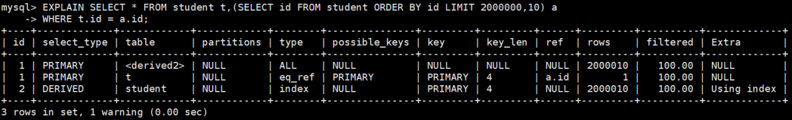


**优化思路二**

该方案适用于主键自增的表，可以把Limit 查询转换成某个位置的查询 。

```mysql
EXPLAIN SELECT * FROM student WHERE id > 2000000 LIMIT 10;
```

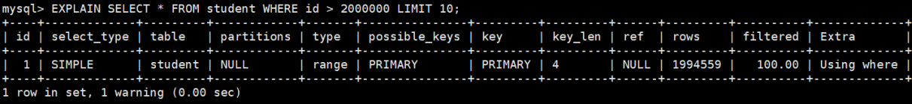


### 8. 优先考虑覆盖索引

#### 8.1 什么是覆盖索引？

**理解方式一**：索引是高效找到行的一个方法，但是一般数据库也能使用索引找到一个列的数据，因此它 不必读取整个行。毕竟索引叶子节点存储了它们索引的数据；当能通过读取索引就可以得到想要的数 据，那就不需要读取行了。一个索引包含了满足查询结果的数据就叫做覆盖索引。

**理解方式二**：非聚簇复合索引的一种形式，它包括在查询里的SELECT、JOIN和WHERE子句用到的所有列 （即建索引的字段正好是覆盖查询条件中所涉及的字段）。

简单说就是， 索引列+主键 包含 SELECT 到 FROM之间查询的列 。


#### 8.2 覆盖索引的利弊

**好处：**

1. 避免Innodb表进行索引的二次查询（回表）
2. 可以把随机IO变成顺序IO加快查询效率


**弊端：**

- 索引字段的维护 总是有代价的。因此，在建立冗余索引来支持覆盖索引时就需要权衡考虑了。这是业务 DBA，或者称为业务数据架构师的工作。


### 9. 如何给字符串添加索引

有一张教师表，表定义如下：

```mysql
create table teacher(
ID bigint unsigned primary key,
email varchar(64),
...
)engine=innodb;
```

讲师要使用邮箱登录，所以业务代码中一定会出现类似于这样的语句：

```mysql
mysql> select col1, col2 from teacher where email='xxx';
```

如果email这个字段上没有索引，那么这个语句就只能做 全表扫描 。


#### 9.1 前缀索引

MySQL是支持前缀索引的。默认地，如果你创建索引的语句不指定前缀长度，那么索引就会包含整个字 符串。

```mysql
mysql> alter table teacher add index index1(email);
#或
mysql> alter table teacher add index index2(email(6));
```

这两种不同的定义在数据结构和存储上有什么区别呢？下图就是这两个索引的示意图。

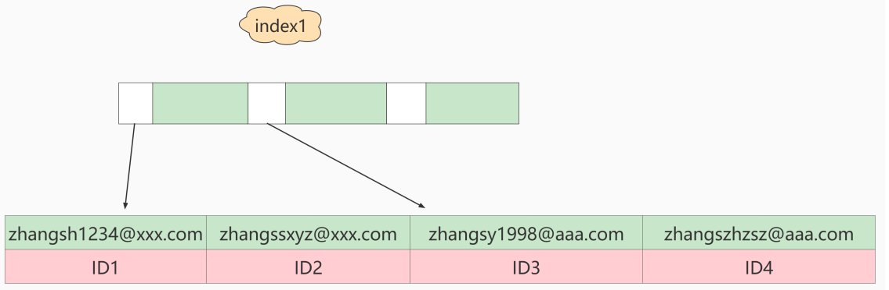

以及

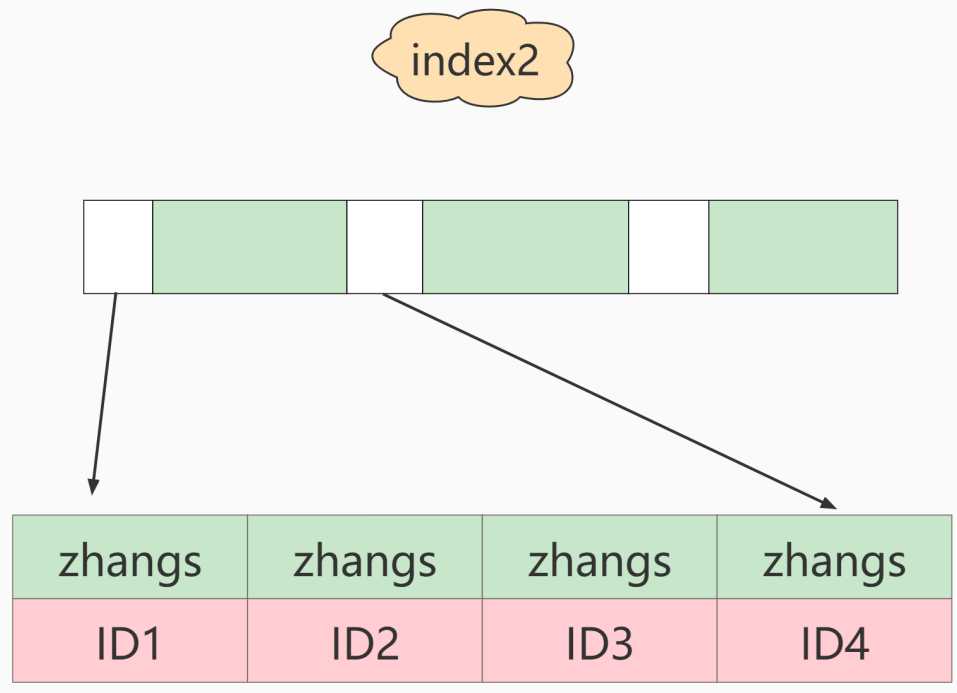


**如果使用的是index1**（即email整个字符串的索引结构），执行顺序是这样的：

1. 从index1索引树找到满足索引值是’ zhangssxyz@xxx.com ’的这条记录，取得ID2的值；
2. 到主键上查到主键值是ID2的行，判断email的值是正确的，将这行记录加入结果集；
3. 取index1索引树上刚刚查到的位置的下一条记录，发现已经不满足email=' zhangssxyz@xxx.com ’的条件了，循环结束。

这个过程中，只需要回主键索引取一次数据，所以系统认为只扫描了一行。


**如果使用的是index2**（即email(6)索引结构），执行顺序是这样的：

1. 从index2索引树找到满足索引值是’zhangs’的记录，找到的第一个是ID1；
2. 到主键上查到主键值是ID1的行，判断出email的值不是’ zhangssxyz@xxx.com ’，这行记录丢弃；
3. 取index2上刚刚查到的位置的下一条记录，发现仍然是’zhangs’，取出ID2，再到ID索引上取整行然后判断，这次值对了，将这行记录加入结果集；
4. 重复上一步，直到在idxe2上取到的值不是’zhangs’时，循环结束。

也就是说使用前缀索引，定义好长度，就可以做到既节省空间，又不用额外增加太多的查询成本。前面 已经讲过区分度，区分度越高越好。因为区分度越高，意味着重复的键值越少。


#### 9.2 前缀索引对覆盖索引的影响

> 结论： 使用前缀索引就用不上覆盖索引对查询性能的优化了，这也是你在选择是否使用前缀索引时需要考 虑的一个因素。


### 10. 索引下推

#### 10.1 使用前后对比

Index Condition Pushdown(ICP)是MySQL5.6中新特性，是一种在存储引擎层使用索引过滤数据的优化方式。

- 如果没有ICP，存储引擎会遍历索引以定位基表中的行，并将它们返回给MySQL服务器，由MySQL服务器评估WHERE后面的条件是否保留行。
- 启用ICP后，如果部分WHERE条件可以仅使用索引中的列进行筛选，则MySQL服务器会把这部分WHERE条件放到存储引擎筛选。然后，存储引擎通过使用索引条目来筛选数据，并且只有在满足这一条件时才从表中读取行。
  - 好处：ICP可以减少存储引擎必须访问基表的次数和MySQL服务器必须访问存储引擎的次数。
  - 但是，ICP的加速效果取决于在存储引擎内通过ICP筛选掉的数据的比例。


#### 10.2 ICP的开启/关闭

- 默认情况下启用索引条件下推。可以通过设置系统变量optimizer_switch控制：index_condition_pushdown

```mysql
#关闭索引下推
SET optimizer_switch = 'index_condition_pushdown=off';

#打开索引下推
SET optimizer_switch = 'index_condition_pushdown=on';
```

- 当使用索引条件下推时，EXPLAIN语句输出结果中Extra列内容显示为Using index condition。


#### 10.3 ICP的使用条件

1. 如果表访问的类型为range、ref、eq_ref和ref_or_null可以使用ICP
2. ICP可以用于InnoDB和MyISAM表，包括分区表InnoDB和MyISAM表
3. 对于InnoDB表，ICP仅用于二级索引。ICP的目标是减少全行读取次数，从而减少I/O操作。
4. 当SQL使用覆盖索引时，不支持ICP。I因为这种情况下使用ICP不会减少I/O。 
5. 相关子查询的条件不能使用ICP


### 11. 普通索引 vs 唯一索引

从性能的角度考虑，你选择唯一索引还是普通索引呢？选择的依据是什么呢？

假设，我们有一个主键列为ID的表，表中有字段k，并且在k上有索引，假设字段 k 上的值都不重复。

这个表的建表语句是：

```mysql
mysql> create table test(
id int primary key,
k int not null,
name varchar(16),
index (k)
)engine=InnoDB;
```

表中R1~R5的(ID,k)值分别为(100,1)、(200,2)、(300,3)、(500,5)和(600,6)。


#### 11.1 查询过程

假设，执行查询的语句是 select id from test where k=5。

- 对于普通索引来说，查找到满足条件的第一个记录(5,500)后，需要查找下一个记录，直到碰到第一个不满足k=5条件的记录。
- 对于唯一索引来说，由于索引定义了唯一性，查找到第一个满足条件的记录后，就会停止继续检索。

那么，这个不同带来的性能差距会有多少呢？答案是， 微乎其微 。


#### 11.2 更新过程

为了说明普通索引和唯一索引对更新语句性能的影响这个问题，介绍一下change buffer。

当需要更新一个数据页时，如果数据页在内存中就直接更新，而如果这个数据页还没有在内存中的话， 在不影响数据一致性的前提下， InooDB会将这些更新操作缓存在change buffer中 ，这样就不需要从磁 盘中读入这个数据页了。在下次查询需要访问这个数据页的时候，将数据页读入内存，然后执行change buffer中与这个页有关的操作。通过这种方式就能保证这个数据逻辑的正确性。

将change buffer中的操作应用到原数据页，得到最新结果的过程称为 merge 。除了 访问这个数据页 会触 发merge外，系统有 后台线程会定期 merge。在 数据库正常关闭（shutdown） 的过程中，也会执行merge 操作。

如果能够将更新操作先记录在change buffer， 减少读磁盘 ，语句的执行速度会得到明显的提升。而且， 数据读入内存是需要占用 buffer pool 的，所以这种方式还能够 避免占用内存 ，提高内存利用率。

唯一索引的更新就不能使用change buffer ，实际上也只有普通索引可以使用。

如果要在这张表中插入一个新记录(4,400)的话，InnoDB的处理流程是怎样的？


#### 11.3 change buffer的使用场景

1. 普通索引和唯一索引应该怎么选择？其实，这两类索引在查询能力上是没差别的，主要考虑的是
对 更新性能 的影响。所以，建议你 尽量选择普通索引 。
2. 在实际使用中会发现， 普通索引 和 change buffer 的配合使用，对于 数据量大 的表的更新优化
还是很明显的。
3. 如果所有的更新后面，都马上 伴随着对这个记录的查询 ，那么你应该 关闭change buffer 。而在
其他情况下，change buffer都能提升更新性能。
4. 由于唯一索引用不上change buffer的优化机制，因此如果 业务可以接受 ，从性能角度出发建议优 先考虑非唯一索引。但是如果"业务可能无法确保"的情况下，怎么处理呢？

- 首先， 业务正确性优先 。我们的前提是“业务代码已经保证不会写入重复数据”的情况下，讨论性能问题。如果业务不能保证，或者业务就是要求数据库来做约束，那么没得选，必须创建唯一索引。这种情况下，本节的意义在于，如果碰上了大量插入数据慢、内存命中率低的时候，给你多提供一个排查思路。
- 然后，在一些“ 归档库 ”的场景，你是可以考虑使用唯一索引的。比如，线上数据只需要保留半年，然后历史数据保存在归档库。这时候，归档数据已经是确保没有唯一键冲突了。要提高归档效率，可以考虑把表里面的唯一索引改成普通索引。


### 12. 其它查询优化策略

#### 12.1 EXISTS 和 IN 的区分

**问题：**

不太理解哪种情况下应该使用EXISTS，哪种情况应该用IN。选择的标准是看能否使用表的索引吗？

**回答：**

索引是个前提，其实选择与否还是要看表的大小。你可以将选择的标准理解为小表驱动大表。在这种方式下效率是最高的。


#### 12.2 COUNT(*)与COUNT(具体字段)效率

问：在 MySQL 中统计数据表的行数，可以使用三种方式： SELECT COUNT(*) 、 SELECT COUNT(1) 和 SELECT COUNT(具体字段) ，使用这三者之间的查询效率是怎样的？

答：

前提：如果你要统计的是某个字段的非空数据行数，则另当别论，毕竟比较执行效率的前提是结果一样才可以。

**环节1**：COUNT( * )和COUNT(1)都是对所有结果进行COUNT，COUNT( * )和COUNT(1)本质上并没有区别（二者执行时间可能略有差别，不过你还是可以把它俩的执行效率看成是相等的）。如果有WHERE子句，则是对所有符合筛选条件的数据行进行统计；如果没有WHERE子句，则是对数据表的数据行数进行统计。

**环节2**：如果是MyISAM存储引擎，统计数据表的行数只需要0（1）的复杂度，这是因为每张MyISAM的数据表都有一个meta信息存储了row_count值，而一致性则由表级锁来保证。

如果是InnoDB存储引擎，因为InnoDB支持事务，采用行级锁和MVCC机制，所以无法像MyISAM一样，维护一个row_count变量，因此需要采用扫描全表，是0（n）的复杂度，进行循环+计数的方式来完成统计。

**环节3**：在InnoDB引擎中，如果采用COUNT（具体字段）来统计数据行数，要尽量采用二级索引。因为主键采用的索引是聚簇索引，聚簇索引包含的信息多，明显会大于二级索引（非聚簇索引）。对于COUNT（*）和COUNT（1）来说，它们不需要查找具体的行，只是统计行数，系统会自动采用占用空间更小的二级索引来进行统计。

如果有多个二级索引，会使用key_len小的二级索引进行扫描。当没有二级索引的时候，才会采用主键索引来进行统计。


#### 12.3 关于SELECT(*)

在表查询中，建议明确字段，不要使用 * 作为查询的字段列表，推荐使用SELECT <字段列表> 查询。

原因：

1. MySQL 在解析的过程中，会通过 查询数据字典 将"*"按序转换成所有列名，这会大大的耗费资源和时 间。
2. 无法使用覆盖索引


#### 12.4 LIMIT 1 对优化的影响

针对的是会扫描全表的 SQL 语句，如果你可以确定结果集只有一条，那么加上 LIMIT 1 的时候，当找到一条结果的时候就不会继续扫描了，这样会加快查询速度。

如果数据表已经对字段建立了唯一索引，那么可以通过索引进行查询，不会全表扫描的话，就不需要加 上 LIMIT 1 了。


#### 12.5 多使用COMMIT

只要有可能，在程序中尽量多使用 COMMIT，这样程序的性能得到提高，需求也会因为 COMMIT 所释放 的资源而减少。

COMMIT 所释放的资源：

- 回滚段上用于恢复数据的信息
- 被程序语句获得的锁
- redo / undo log buffer 中的空间
- 管理上述 3 种资源中的内部花费


### 13. 淘宝数据库，主键如何设计的？

聊一个实际问题：淘宝的数据库，主键是如何设计的？

某些错的离谱的答案还在网上年复一年的流传着，甚至还成为了所谓的MySQL军规。其中，一个最明显 的错误就是关于MySQL的主键设计。

大部分人的回答如此自信：用8字节的 BIGINT 做主键，而不要用INT。 错 ！

这样的回答，只站在了数据库这一层，而没有 从业务的角度 思考主键。主键就是一个自增ID吗？站在 2022年的新年档口，用自增做主键，架构设计上可能 连及格都拿不到 。


#### 13.1 自增ID的问题

自增ID做主键，简单易懂，几乎所有数据库都支持自增类型，只是实现上各自有所不同而已。自增ID除 了简单，其他都是缺点，总体来看存在以下几方面的问题：

1. 可靠性不高
存在自增ID回溯的问题，这个问题直到最新版本的MySQL 8.0才修复。
2. 安全性不高
对外暴露的接口可以非常容易猜测对应的信息。比如：/User/1/这样的接口，可以非常容易猜测用户ID的值为多少，总用户数量有多少，也可以非常容易地通过接口进行数据的爬取。
3. 性能差
自增ID的性能较差，需要在数据库服务器端生成。
4. 交互多
业务还需要额外执行一次类似 last_insert_id() 的函数才能知道刚才插入的自增值，这需要多一次的网络交互。在海量并发的系统中，多1条SQL，就多一次性能上的开销。
5. 局部唯一性
最重要的一点，自增ID是局部唯一，只在当前数据库实例中唯一，而不是全局唯一，在任意服务器间都是唯一的。对于目前分布式系统来说，这简直就是噩梦。


#### 13.2 业务字段做主键

为了能够唯一地标识一个会员的信息，需要为 会员信息表 设置一个主键。那么，怎么为这个表设置主 键，才能达到我们理想的目标呢？ 这里我们考虑业务字段做主键。

表数据如下：


在这个表里，哪个字段比较合适呢？

- 选择卡号（cardno）


会员卡号（cardno）看起来比较合适，因为会员卡号不能为空，而且有唯一性，可以用来 标识一条会员 记录。

```mysql
mysql> CREATE TABLE demo.membermaster
-> (
-> cardno CHAR(8) PRIMARY KEY, -- 会员卡号为主键
-> membername TEXT,
-> memberphone TEXT,
-> memberpid TEXT,
-> memberaddress TEXT,
-> sex TEXT,
-> birthday DATETIME
-> );
Query OK, 0 rows affected (0.06 sec)
```

不同的会员卡号对应不同的会员，字段“cardno”唯一地标识某一个会员。如果都是这样，会员卡号与会 员一一对应，系统是可以正常运行的。

但实际情况是， 会员卡号可能存在重复使用 的情况。比如，张三因为工作变动搬离了原来的地址，不再 到商家的门店消费了 （退还了会员卡），于是张三就不再是这个商家门店的会员了。但是，商家不想让 这个会 员卡空着，就把卡号是“10000001”的会员卡发给了王五。

从系统设计的角度看，这个变化只是修改了会员信息表中的卡号是“10000001”这个会员 信息，并不会影 响到数据一致性。也就是说，修改会员卡号是“10000001”的会员信息， 系统的各个模块，都会获取到修 改后的会员信息，不会出现“有的模块获取到修改之前的会员信息，有的模块获取到修改后的会员信息， 而导致系统内部数据不一致”的情况。因此，从 信息系统层面 上看是没问题的。

但是从使用 系统的业务层面 来看，就有很大的问题 了，会对商家造成影响。

比如，我们有一个销售流水表（trans），记录了所有的销售流水明细。2020 年 12 月 01 日，张三在门店 购买了一本书，消费了 89 元。那么，系统中就有了张三买书的流水记录，如下所示：


接着，我们查询一下 2020 年 12 月 01 日的会员销售记录：

```mysql
mysql> SELECT b.membername,c.goodsname,a.quantity,a.salesvalue,a.transdate
-> FROM demo.trans AS a
-> JOIN demo.membermaster AS b
-> JOIN demo.goodsmaster AS c
-> ON (a.cardno = b.cardno AND a.itemnumber=c.itemnumber);
+------------+-----------+----------+------------+---------------------+
| membername | goodsname | quantity | salesvalue | transdate 		   |
+------------+-----------+----------+------------+---------------------+
| 张三        | 书 	   | 1.000    | 89.00      | 2020-12-01 00:00:00 |
+------------+-----------+----------+------------+---------------------+
1 row in set (0.00 sec)
```

如果会员卡“10000001”又发给了王五，我们会更改会员信息表。导致查询时：

```mysql
mysql> SELECT b.membername,c.goodsname,a.quantity,a.salesvalue,a.transdate
-> FROM demo.trans AS a
-> JOIN demo.membermaster AS b
-> JOIN demo.goodsmaster AS c
-> ON (a.cardno = b.cardno AND a.itemnumber=c.itemnumber);
+------------+-----------+----------+------------+---------------------+
| membername | goodsname | quantity | salesvalue | transdate 		   |
+------------+-----------+----------+------------+---------------------+
| 王五        | 书        | 1.000    | 89.00      | 2020-12-01 00:00:00 |
+------------+-----------+----------+------------+---------------------+
1 row in set (0.01 sec)
```

这次得到的结果是：王五在 2020 年 12 月 01 日，买了一本书，消费 89 元。显然是错误的！结论：千万 不能把会员卡号当做主键。


- 选择会员电话 或 身份证号


会员电话可以做主键吗？不行的。在实际操作中，手机号也存在 被运营商收回 ，重新发给别人用的情 况。

那身份证号行不行呢？好像可以。因为身份证决不会重复，身份证号与一个人存在一一对 应的关系。可 问题是，身份证号属于 个人隐私 ，顾客不一定愿意给你。要是强制要求会员必须登记身份证号，会把很 多客人赶跑的。其实，客户电话也有这个问题，这也是我们在设计会员信息表的时候，允许身份证号和 电话都为空的原因。

所以，建议尽量不要用跟业务有关的字段做主键。毕竟，作为项目设计的技术人员，我们谁也无法预测 在项目的整个生命周期中，哪个业务字段会因为项目的业务需求而有重复，或者重用之类的情况出现。

> 经验： 刚开始使用 MySQL 时，很多人都很容易犯的错误是喜欢用业务字段做主键，想当然地认为了解业 务需求，但实际情况往往出乎意料，而更改主键设置的成本非常高。
>


#### 13.3 淘宝的主键设计

在淘宝的电商业务中，订单服务是一个核心业务。请问， 订单表的主键 淘宝是如何设计的呢？是自增ID 吗？

打开淘宝，看一下订单信息：


从上图可以发现，订单号不是自增ID！我们详细看下上述4个订单号：

```mysql
1550672064762308113
1481195847180308113
1431156171142308113
1431146631521308113
```

订单号是19位的长度，且订单的最后5位都是一样的，都是08113。且订单号的前面14位部分是单调递增 的。

大胆猜测，淘宝的订单ID设计应该是：

```mysql
订单ID = 时间 + 去重字段 + 用户ID后6位尾号
```

这样的设计能做到全局唯一，且对分布式系统查询及其友好。


#### 13.4 推荐的主键设计

非核心业务 ：对应表的主键自增ID，如告警、日志、监控等信息。

核心业务 ：**主键设计至少应该是全局唯一且是单调递增**。全局唯一保证在各系统之间都是唯一的，单调 递增是希望插入时不影响数据库性能。

这里推荐最简单的一种主键设计：UUID。

**UUID的特点：**全局唯一，占用36字节，数据无序，插入性能差。

**认识UUID：**

- 为什么UUID是全局唯一的？
- 为什么UUID占用36个字节？
- 为什么UUID是无序的？

MySQL数据库的UUID组成如下所示：

```mysql
UUID = 时间+UUID版本（16字节）- 时钟序列（4字节） - MAC地址（12字节）
```

我们以UUID值e0ea12d4-6473-11eb-943c-00155dbaa39d举例：

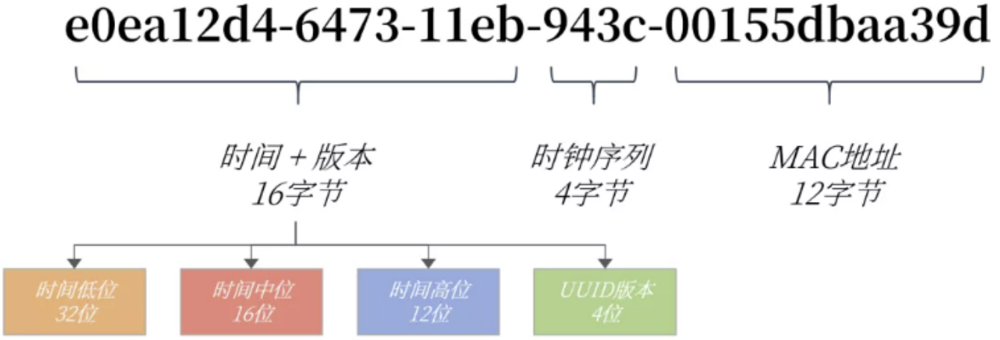

**为什么UUID是全局唯一的？**

在UUID中时间部分占用60位，存储的类似TIMESTAMP的时间戳，但表示的是从1582-10-15 00：00：00.00 到现在的100ns的计数。可以看到UUID存储的时间精度比TIMESTAMPE更高，时间维度发生重复的概率降 低到1/100ns。

时钟序列是为了避免时钟被回拨导致产生时间重复的可能性。MAC地址用于全局唯一。


**为什么UUID占用36个字节？**

UUID根据字符串进行存储，设计时还带有无用"-"字符串，因此总共需要36个字节。


**为什么UUID是随机无序的呢？**

因为UUID的设计中，将时间低位放在最前面，而这部分的数据是一直在变化的，并且是无序。


**改造UUID**

若将时间高低位互换，则时间就是单调递增的了，也就变得单调递增了。MySQL 8.0可以更换时间低位和 时间高位的存储方式，这样UUID就是有序的UUID了。

MySQL 8.0还解决了UUID存在的空间占用的问题，除去了UUID字符串中无意义的"-"字符串，并且将字符 串用二进制类型保存，这样存储空间降低为了16字节。

可以通过MySQL8.0提供的uuid_to_bin函数实现上述功能，同样的，MySQL也提供了bin_to_uuid函数进行 转化：

```mysql
SET @uuid = UUID();

SELECT @uuid,uuid_to_bin(@uuid),uuid_to_bin(@uuid,TRUE);
```

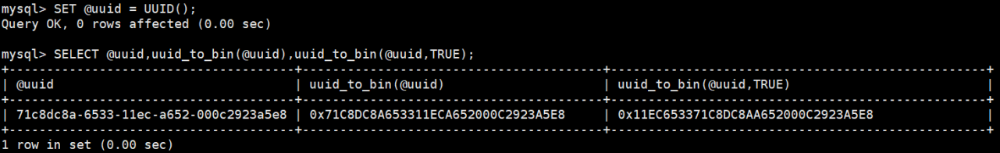

通过函数uuid_to_bin(@uuid,true)将UUID转化为有序UUID了。全局唯一 + 单调递增，这不就是我们想要 的主键！


**有序UUID性能测试**

16字节的有序UUID，相比之前8字节的自增ID，性能和存储空间对比究竟如何呢？ 

我们来做一个测试，插入1亿条数据，每条数据占用500字节，含有3个二级索引，最终的结果如下所示：


从上图可以看到插入1亿条数据有序UUID是最快的，而且在实际业务使用中有序UUID在 业务端就可以生 成 。还可以进一步减少SQL的交互次数。

另外，虽然有序UUID相比自增ID多了8个字节，但实际只增大了3G的存储空间，还可以接受。

> 在当今的互联网环境中，非常不推荐自增ID作为主键的数据库设计。更推荐类似有序UUID的全局 唯一的实现。
>
> 另外在真实的业务系统中，主键还可以加入业务和系统属性，如用户的尾号，机房的信息等。这样 的主键设计就更为考验架构师的水平了。


## 十一、数据库的设计规范

### 1. 为什么需要数据库设计

**我们在设计数据表的时候，要考虑很多问题。**比如：

- 用户都需要什么数据？需要在数据表中保存哪些数据？
- 如何保证数据表中数据的正确性，当插入、删除、更新的时候该进行怎样的约束检查？
- 如何降低数据表的数据冗余度，保证数据表不会因为用户量的增长而迅速扩张？
- 如何让负责数据库维护的人员更方便地使用数据库？
- 使用数据库的应用场景也各不相同，可以说针对不同的情况，设计出来的数据表可能千差万别。

**现实情况中，面临的场景：**

当数据库运行了一段时间之后，我们才发现数据表设计的有问题。重新调整数据表的结构，就需要做数据迁移，还有可能影响程序的业务逻辑，以及网站正常的访问。

如果是糟糕的数据库设计可能会造成以下问题：

- 数据冗余、信息重复，存储空间浪费
- 数据更新、插入、删除的异常
- 无法正确表示信息
- 丢失有效信息
- 程序性能差

良好的数据库设计则有以下优点：

- 节省数据的存储空间
- 能够保证数据的完整性
- 方便进行数据库应用系统的开发

总之，开始设置数据库的时候，我们就需要重视数据表的设计。为了建立冗余较小、结构合理的数据库，设计数据库时必须遵循一定的规则。


### 2. 范 式

#### 2.1 范式简介

**在关系型数据库中，关于数据表设计的基本原则、规则就称为范式。**可以理解为，一张数据表的设计结 构需要满足的某种设计标准的 级别 。要想设计一个结构合理的关系型数据库，必须满足一定的范式。


#### 2.2 范式都包括哪些

目前关系型数据库有六种常见范式，按照范式级别，从低到高分别是：**第一范式（1NF）、第二范式 （2NF）、第三范式（3NF）、巴斯-科德范式（BCNF）、第四范式(4NF）和第五范式（5NF，又称完美 范式）**。

数据库的范式设计越高阶，冗余度就越低，同时高阶的范式一定符合低阶范式的要求，满足最低要求的范式是第一范式（1NF）。在第一范式的基础上进一步满足更多规范要求的称为第二范式（2NF），其余范式以次类推。

一般来说，在关系型数据库设计中，最高也就遵循到BCNF，普遍还是3NF。但也不绝对，有时候为了提高某些查询性能，我们还需要破坏范式规则，也就是反规范化。

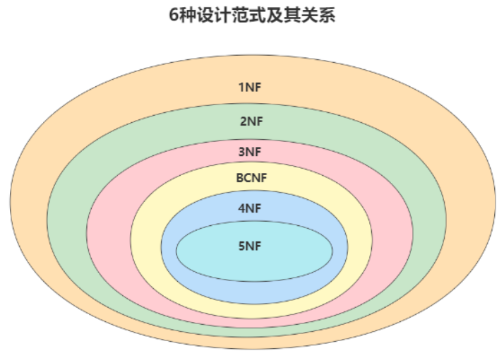


#### 2.3 键和相关属性的概念

范式的定义会使用到主键和候选键，数据库中的键（Key）由一个或者多个属性组成。数据表中常用的几种键和属性的定义：

- 超键：能唯一标识元组的属性集叫做超键。
- 候选键：如果超键不包括多余的属性，那么这个超键就是候选键。
- 主键：用户可以从候选键中选择一个作为主键。
- 外键：如果数据表R1中的某属性集不是R1的主键，而是另一个数据表R2的主键，那么这个属性集就是数据表R1的外键。
- 主属性：包含在任一候选键中的属性称为主属性。
- 非主属性：与主属性相对，指的是不包含在任何一个候选键中的属性。

通常，我们也将候选键称之为“码”，把主键也称为“主码”。因为键可能是由多个属性组成的，针对单个属性，我们还可以用主属性和非主属性来进行区分。


**举例：** 

这里有两个表：

**球员表(player)**：球员编号 | 姓名 | 身份证号 | 年龄 | 球队编号

**球队表(team)**：球队编号 | 主教练 | 球队所在地

- 超键 ：对于球员表来说，超键就是包括球员编号或者身份证号的任意组合，比如（球员编号）（球员编号，姓名）（身份证号，年龄）等。
- 候选键 ：就是最小的超键，对于球员表来说，候选键就是（球员编号）或者（身份证号）。
- 主键 ：我们自己选定，也就是从候选键中选择一个，比如（球员编号）。
- 外键 ：球员表中的球队编号。
- 主属性 、 非主属性 ：在球员表中，主属性是（球员编号）（身份证号），其他的属性（姓名）（年龄）（球队编号）都是非主属性。


#### 2.4 第一范式(1st NF)

第一范式主要是确保数据表中每个字段的值必须具有原子性，也就是说数据表中每个字段的值为不可再次拆分的最小数据单元。

我们在设计某个字段的时候，对于字段×来说，不能把字段×拆分成字段X-1和字段X-2。事实上，任何的DBMS 都会满足第一范式的要求，不会将字段进行拆分。


**举例1：**

假设一家公司要存储员工的姓名和联系方式。它创建一个如下表：

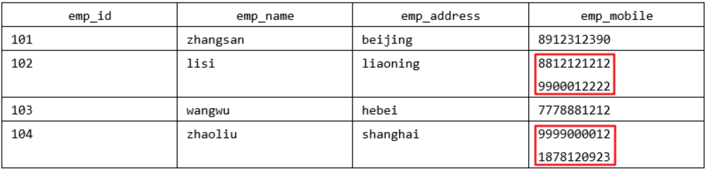

该表不符合 1NF ，因为规则说“表的每个属性必须具有原子（单个）值”，lisi和zhaoliu员工的 emp_mobile 值违反了该规则。为了使表符合 1NF ，我们应该有如下表数据：

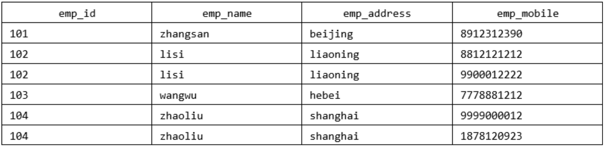


**举例2：**

user 表的设计不符合第一范式

| 字段名称  | 字段类型     | 是否是主键 | 说明                               |
| --------- | ------------ | ---------- | ---------------------------------- |
| id        | INT          | 是         | 主键id                             |
| username  | VARCHAR(30)  | 否         | 用户名                             |
| password  | VARCHAR(50)  | 否         | 密码                               |
| user_info | VARCHAR(255) | 否         | 用户信息(包含真实姓名、电话、住址) |

其中，user_info字段为用户信息，可以进一步拆分成更小粒度的字段，不符合数据库设计对第一范式的 要求。将user_info拆分后如下：

| 字段名称  | 字段类型     | 是否是主键 | 说明     |
| --------- | ------------ | ---------- | -------- |
| id        | INT          | 是         | 主键id   |
| username  | VARCHAR(30)  | 否         | 用户名   |
| password  | VARCHAR(50)  | 否         | 密码     |
| real_name | VARCHAR(30)  | 否         | 真实姓名 |
| phone     | VARCHAR(12)  | 否         | 联系电话 |
| address   | VARCHAR(100) | 否         | 家庭住址 |


**举例3：**

属性的原子性是 主观的 。例如，Employees关系中雇员姓名应当使用1个（fullname）、2个（firstname 和lastname）还是3个（firstname、middlename和lastname）属性表示呢？答案取决于应用程序。如果应 用程序需要分别处理雇员的姓名部分（如：用于搜索目的），则有必要把它们分开。否则，不需要。

表1：

| 姓名 | 年龄 | 地址                   |
| ---- | ---- | ---------------------- |
| 张三 | 20   | 广东省广州市三元里78号 |
| 李四 | 24   | 广东省深圳市龙华新区   |

表2：

| 姓名 | 年龄 | 省   | 市   | 地址       |
| ---- | ---- | ---- | ---- | ---------- |
| 张三 | 20   | 广东 | 广州 | 三元里78号 |
| 李四 | 24   | 广东 | 深圳 | 龙华新区   |


#### 2.5 第二范式(2nd NF)

第二范式要求，在满足第一范式的基础上，还要满足数据表里的每一条数据记录，都是可唯一标识的。而且所有非主键字段，都必须完全依赖主键，不能只依赖主键的一部分。如果知道主键的所有属性的值，就可以检索到任何元组（行）的任何属性的任何值。（要求中的主键，其实可以拓展替换为候选键）。


**举例1：**

成绩表 （学号，课程号，成绩）关系中，（学号，课程号）可以决定成绩，但是学号不能决定成绩，课 程号也不能决定成绩，所以“（学号，课程号）→成绩”就是 完全依赖关系 。


**举例2：**

比赛表 player_game ，里面包含球员编号、姓名、年龄、比赛编号、比赛时间和比赛场地等属性，这 里候选键和主键都为（球员编号，比赛编号），我们可以通过候选键（或主键）来决定如下的关系：

```
(球员编号, 比赛编号) → (姓名, 年龄, 比赛时间, 比赛场地，得分)
```

但是这个数据表不满足第二范式，因为数据表中的字段之间还存在着如下的对应关系：

```
(球员编号) → (姓名，年龄)
(比赛编号) → (比赛时间, 比赛场地)
```

对于非主属性来说，并非完全依赖候选键。这样会产生怎样的问题呢？

1. 数据冗余 ：如果一个球员可以参加 m 场比赛，那么球员的姓名和年龄就重复了 m-1 次。一个比赛
也可能会有 n 个球员参加，比赛的时间和地点就重复了 n-1 次。
2. 插入异常 ：如果我们想要添加一场新的比赛，但是这时还没有确定参加的球员都有谁，那么就没
法插入。
3. 删除异常 ：如果我要删除某个球员编号，如果没有单独保存比赛表的话，就会同时把比赛信息删
除掉。
4. 更新异常 ：如果我们调整了某个比赛的时间，那么数据表中所有这个比赛的时间都需要进行调
整，否则就会出现一场比赛时间不同的情况。

为了避免出现上述的情况，我们可以把球员比赛表设计为下面的三张表。

| 表名                        | 属性（字段）                       |
| --------------------------- | ---------------------------------- |
| 球员 player 表              | 球员编号、姓名和年龄等属性         |
| 比赛 game 表                | 比赛编号、比赛时间和比赛场地等属性 |
| 球员比赛关系 player_game 表 | 球员编号、比赛编号和得分等属性     |

这样的话，每张数据表都符合第二范式，也就避免了异常情况的发生。

> 1NF 告诉我们字段属性需要是原子性的，而 2NF 告诉我们一张表就是一个独立的对象，一张表只 表达一个意思。


**举例3：**

定义了一个名为 Orders 的关系，表示订单和订单行的信息：

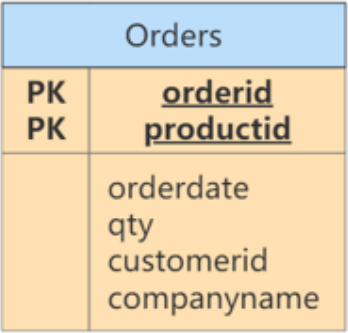

违反了第二范式，因为有非主键属性仅依赖于候选键（或主键）的一部分。例如，可以仅通过orderid找 到订单的 orderdate，以及 customerid 和 companyname，而没有必要再去使用productid。

修改：

Orders表和OrderDetails表如下，此时符合第二范式。

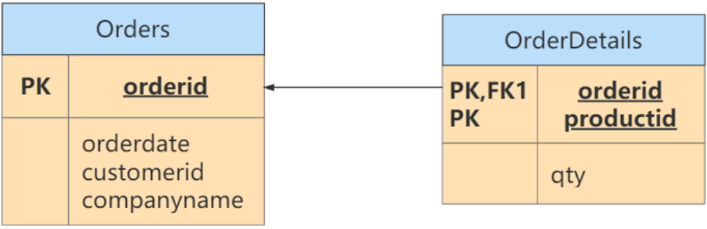


#### 2.6 第三范式(3rd NF)

第三范式是在第二范式的基础上，确保数据表中的每一个非主键字段都和主键字段直接相关，也就是说，要求数据表中的所有非主键字段不能依赖于其他非主键字段。（即，不能存在非主属性A依赖于非主属性B，非主属性 B依赖于主键C的情况，即存在“A一B→C"的决定关系）通俗地讲，该规则的意思是所有非主键属性之间不能有依赖关系，必须相互独立。


**举例1：**

部门信息表 ：每个部门有部门编号（dept_id）、部门名称、部门简介等信息。

员工信息表 ：每个员工有员工编号、姓名、部门编号。列出部门编号后就不能再将部门名称、部门简介 等与部门有关的信息再加入员工信息表中。

如果不存在部门信息表，则根据第三范式（3NF）也应该构建它，否则就会有大量的数据冗余。


**举例2：**

| 字段名称      | 字段类型      | 是否是主键 | 说明                |
| ------------- | ------------- | ---------- | ------------------- |
| id            | INT           | 是         | 商品主键id （主键） |
| category_id   | INT           | 否         | 商品类别id          |
| category_name | VARCHAR(30)   | 否         | 商品类别名称        |
| goods_name    | VARCHAR(30)   | 否         | 商品名称            |
| price         | DECIMAL(10,2) | 否         | 商品价格            |

商品类别名称依赖于商品类别编号，不符合第三范式。

修改：

表1：符合第三范式的 商品类别表 的设计

| 字段名称      | 字段类型    | 是否是主键 | 说明           |
| ------------- | ----------- | ---------- | -------------- |
| id            | INT         | 是         | 商品类别主键id |
| category_name | VARCHAR(30) | 否         | 商品类别名称   |

表2：符合第三范式的 商品表 的设计

| 字段名称    | 字段类型      | 是否是主键 | 说明                |
| ----------- | ------------- | ---------- | ------------------- |
| id          | INT           | 是         | 商品主键id （主键） |
| category_id | INT           | 否         | 商品类别id          |
| goods_name  | VARCHAR(30)   | 否         | 商品名称            |
| price       | DECIMAL(10,2) | 否         | 商品价格            |

商品表goods通过商品类别id字段（category_id）与商品类别表goods_category进行关联。


**举例3：**

球员player表 ：球员编号、姓名、球队名称和球队主教练。现在，我们把属性之间的依赖关系画出 来，如下图所示：

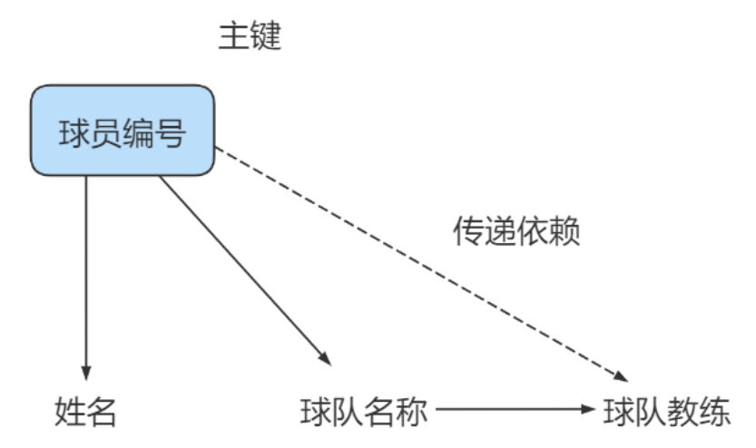

你能看到球员编号决定了球队名称，同时球队名称决定了球队主教练，非主属性球队主教练就会传递依 赖于球员编号，因此不符合 3NF 的要求。

如果要达到 3NF 的要求，需要把数据表拆成下面这样：

| 表名   | 属性（字段）             |
| ------ | ------------------------ |
| 球员表 | 球员编号、姓名和球队名称 |
| 球队表 | 球队名称、球队主教练     |


**举例4：**

修改第二范式中的举例3。

此时的Orders关系包含 orderid、orderdate、customerid 和 companyname 属性，主键定义为 orderid。 customerid 和companyname均依赖于主键——orderid。例如，你需要通过orderid主键来查找代表订单中 客户的customerid，同样，你需要通过 orderid 主键查找订单中客户的公司名称（companyname）。然 而， customerid和companyname也是互相依靠的。为满足第三范式，可以改写如下：

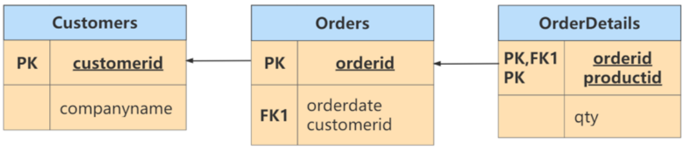

> 符合3NF后的数据模型通俗地讲，2NF和3NF通常以这句话概括：“每个非键属性依赖于键，依赖于 整个键，并且除了键别无他物”。
>


#### 2.7 小结

关于数据表的设计，有三个范式要遵循。

1. 第一范式（1NF），确保每列保持原子性
   数据库的每一列都是不可分割的原子数据项，不可再分的最小数据单元，而不能是集合、数组、记录等非原子数据项。
2. 第二范式（2NF），确保每列都和主键完全依赖
   尤其在复合主键的情况下，非主键部分不应该依赖于部分主键。
3. 第三范式（3NF）确保每列都和主键列直接相关，而不是间接相关

**范式的优点**：数据的标准化有助于消除数据库中的数据余，第三范式（3NF）通常被认为在性能、扩展性和数据完整性方面达到了最好的平衡。

**范式的缺点**：范式的使用，可能降低查询的效率。因为范式等级越高，设计出来的数据表就越多、越精细，数据的冗余度就越低，进行数据查询的时候就可能需要关联多张表，这不但代价昂贵，也可能使一些索引策略无效。

范式只是提出了设计的标准，实际上设计数据表时，未必一定要符合这些标准。开发中，我们会出现为了性能和读取效率违反范式化的原则，通过增加少量的余或重复的数据来提高数据库的读性能，减少关联查询，join表的次数，实现空间换取时间的目的。因此在实际的设计过程中要理论结合实际，灵活运用。

范式本身没有优劣之分，只有适用场景不同。没有完美的设计，只有合适的设计，我们在数据表的设计中，还需要根据需求将范式和反范式混合使用。

> 范式本身没有优劣之分，只有适用场景不同。没有完美的设计，只有合适的设计，我们在数据表的设计中，还需要根据需求将范式和反范式混合使用。


### 3. 反范式化

#### 3.1 概述

有的时候不能简单按照规范要求设计数据表，因为有的数据看似余，其实对业务来说十分重要。这个时候，我们就要遵循业务优先的原则，首先满足业务需求，再尽量减少冗余。

如果数据库中的数据量比较大，系统的UV和PV访问频次比较高，则完全按照MySQL的三大范式设计数据表，读数据时会产生大量的关联查询，在一定程度上会影响数据库的读性能。如果我们想对查询效率进行优化，反范式优化也是一种优化思路。此时，可以通过在数据表中增加余字段来提高数据库的读性能。

**规范化 vs 性能**

1. 为满足某种商业目标 , 数据库性能比规范化数据库更重要
2. 在数据规范化的同时 , 要综合考虑数据库的性能
3. 通过在给定的表中添加额外的字段，以大量减少需要从中搜索信息所需的时间
4. 通过在给定的表中插入计算列，以方便查询


#### 3.2 应用举例

**举例1：**

员工的信息存储在 employees 表 中，部门信息存储在 departments 表 中。通过 employees 表中的 department_id字段与 departments 表建立关联关系。如果要查询一个员工所在部门的名称：

```mysql
select employee_id,department_name
from employees e join departments d
on e.department_id = d.department_id;
```

如果经常需要进行这个操作，连接查询就会浪费很多时间。可以在 employees 表中增加一个冗余字段 department_name，这样就不用每次都进行连接操作了。


**举例2：**

反范式化的 goods商品信息表 设计如下：

| 字段名称      | 字段类型      | 是否是主键 | 说明                |
| ------------- | ------------- | ---------- | ------------------- |
| id            | INT           | 是         | 商品主键id （主键） |
| category_id   | INT           | 否         | 商品类别id          |
| category_name | VARCHAR(30)   | 否         | 商品类别名称        |
| goods_name    | VARCHAR(30)   | 否         | 商品名称            |
| price         | DECIMAL(10,2) | 否         | 商品价格            |


**举例3：** 

我们有 2 个表，分别是 商品流水表（atguigu.trans ）和 商品信息表 （atguigu.goodsinfo） 。商品流水表里有 400 万条流水记录，商品信息表里有 2000 条商品记录。

商品流水表：


商品信息表：


新的商品流水表如下所示：


**举例4：**

课程评论表 class_comment ，对应的字段名称及含义如下：


学生表 student ，对应的字段名称及含义如下：


在实际应用中，我们在显示课程评论的时候，通常会显示这个学生的昵称，而不是学生 ID，因此当我们 想要查询某个课程的前 1000 条评论时，需要关联 class_comment 和 student这两张表来进行查询。


#### 3.3 反范式的新问题

反范式可以通过空间换时间，提升查询的效率，但是反范式也会带来一些新问题：

- 存储 空间变大 了
- 一个表中字段做了修改，另一个表中冗余的字段也需要做同步修改，否则 数据不一致
- 若采用存储过程来支持数据的更新、删除等额外操作，如果更新频繁，会非常 消耗系统资源
- 在 数据量小 的情况下，反范式不能体现性能的优势，可能还会让数据库的设计更加 复杂


#### 3.4 反范式的适用场景

当冗余信息有价值或者能 大幅度提高查询效率 的时候，我们才会采取反范式的优化。

##### 1. 增加冗余字段的建议

增加冗余字段一定要符合如下两个条件。只有满足这两个条件，才可以考虑增加冗余字段

1. 这个余字段不需要经常进行修改；
2. 这个冗余字段查询的时候不可或缺。


##### 2. 历史快照、历史数据的需要

在现实生活中，我们经常需要一些冗余信息，比如订单中的收货人信息，包括姓名、电话和地址等。每 次发生的 订单收货信息 都属于 历史快照 ，需要进行保存，但用户可以随时修改自己的信息，这时保存这 些冗余信息是非常有必要的。

反范式优化也常用在 数据仓库 的设计中，因为数据仓库通常 存储历史数据 ，对增删改的实时性要求不 强，对历史数据的分析需求强。这时适当允许数据的冗余度，更方便进行数据分析。

我简单总结下数据仓库和数据库在使用上的区别：

1. 数据库设计的目的在于捕获数据，而数据仓库设计的目的在于分析数据；
2. 数据库对数据的增删改实时性要求强，需要存储在线的用户数据，而数据仓库存储的一般是历史数据；
3. 数据库设计需要尽量避免冗余，但为了提高查询效率也允许一定的冗余度，而数据仓库在设计上更偏向采用反范式设计。


### 4. BCNF(巴斯范式)

人们在3NF的基础上进行了改进，提出了巴斯范式（BCNF），也叫做巴斯-科德范式（Boyce-CoddNormal Form）。BCNF被认为没有新的设计规范加入，只是对第三范式中设计规范要求更强，使得数据库冗余度更小。所以，称为是修正的第三范式，或扩充的第三范式，BCNF不被称为第四范式。

若一个关系达到了第三范式，并且它只有一个候选键，或者它的每个候选键都是单属性，则该关系自然达到BC范式。

一般来说，一个数据库设计符合3NF或BCNF就可以了。


1. 案例

我们分析如下表的范式情况：


在这个表中，一个仓库只有一个管理员，同时一个管理员也只管理一个仓库。我们先来梳理下这些属性 之间的依赖关系。

仓库名决定了管理员，管理员也决定了仓库名，同时（仓库名，物品名）的属性集合可以决定数量这个 属性。这样，我们就可以找到数据表的候选键。

候选键 ：是（管理员，物品名）和（仓库名，物品名），然后我们从候选键中选择一个作为 主键 ，比 如（仓库名，物品名）。

主属性 ：包含在任一候选键中的属性，也就是仓库名，管理员和物品名。

非主属性 ：数量这个属性。


2. 是否符合三范式

如何判断一张表的范式呢？我们需要根据范式的等级，从低到高来进行判断。

首先，数据表每个属性都是原子性的，符合 1NF 的要求；

其次，数据表中非主属性”数量“都与候选键全部依赖，（仓库名，物品名）决定数量，（管理员，物品 名）决定数量。因此，数据表符合 2NF 的要求；

最后，数据表中的非主属性，不传递依赖于候选键。因此符合 3NF 的要求。


3. 存在的问题

既然数据表已经符合了 3NF 的要求，是不是就不存在问题了呢？我们来看下面的情况：

- 增加一个仓库，但是还没有存放任何物品。根据数据表实体完整性的要求，主键不能有空值，因 此会出现 插入异常 ；
- 如果仓库更换了管理员，我们就可能会 修改数据表中的多条记录 ；
- 如果仓库里的商品都卖空了，那么此时仓库名称和相应的管理员名称也会随之被删除。

你能看到，即便数据表符合 3NF 的要求，同样可能存在插入，更新和删除数据的异常情况。


4. 问题解决

首先我们需要确认造成异常的原因：主属性仓库名对于候选键（管理员，物品名）是部分依赖的关系， 这样就有可能导致上面的异常情况。因此引入BCNF，它在 3NF 的基础上消除了主属性对候选键的部分依 赖或者传递依赖关系。

- 如果在关系R中，U为主键，A属性是主键的一个属性，若存在A->Y，Y为主属性，则该关系不属于 BCNF。

根据 BCNF 的要求，我们需要把仓库管理关系 warehouse_keeper 表拆分成下面这样：

仓库表 ：（仓库名，管理员）

库存表 ：（仓库名，物品名，数量）

这样就不存在主属性对于候选键的部分依赖或传递依赖，上面数据表的设计就符合 BCNF。

再举例：

有一个 学生导师表 ，其中包含字段：学生ID，专业，导师，专业GPA，这其中学生ID和专业是联合主 键。

| StudentId | Major    | Advisor | MajGPA |
| --------- | -------- | ------- | ------ |
| 1         | 人工智能 | Edward  | 4.0    |
| 2         | 大数据   | William | 3.8    |
| 1         | 大数据   | William | 3.7    |
| 3         | 大数据   | Joseph  | 4.0    |

这个表的设计满足三范式，但是这里存在另一个依赖关系，“专业”依赖于“导师”，也就是说每个导师只 做一个专业方面的导师，只要知道了是哪个导师，我们自然就知道是哪个专业的了。

所以这个表的部分主键Major依赖于非主键属性Advisor，那么我们可以进行以下的调整，拆分成2个表：

学生导师表：

| StudentId | Advisor | MajGPA |
| --------- | ------- | ------ |
| 1         | Edward  | 4.0    |
| 2         | William | 3.8    |
| 1         | William | 3.7    |
| 3         | Joseph  | 4.0    |

导师表：

| Advisor | Major    |
| ------- | -------- |
| Edward  | 人工智能 |
| William | 大数据   |
| Joseph  | 大数据   |


### 5. 第四范式

多值依赖的概念：

- **多值依赖**：即属性之间的一对多关系，记为K→→A。
- **函数依赖**：事实上是单值依赖，所以不能表达属性值之间的一对多关系。
- **平凡的多值依赖**：全集U=K+A，一个K可以对应于多个A，即K→→A。此时整个表就是一组一对多关系。
- **非平凡的多值依赖**：全集U=K+A+B，一个K可以对应于多个A，也可以对应于多个B，A与B互相独立，即K→→A，K→→B。整个表有多组一对多关系，且有：“一"部分是相同的属性集合，“多"部分是互相独立的属性集合。

第四范式即在满足巴斯-科德范式（BCNF）的基础上，消除非平凡且非函数依赖的多值依赖（即把同一表内的多对多关系删除）。


**举例1**：职工表(职工编号，职工孩子姓名，职工选修课程)。

在这个表中，同一个职工可能会有多个职工孩子姓名。同样，同一个职工也可能会有多个职工选修课 程，即这里存在着多值事实，不符合第四范式。

如果要符合第四范式，只需要将上表分为两个表，使它们只有一个多值事实，例如： 职工表一 (职工编 号，职工孩子姓名)， 职工表二 (职工编号，职工选修课程)，两个表都只有一个多值事实，所以符合第四 范式。


**举例2：**

比如我们建立课程、教师、教材的模型。我们规定，每门课程有对应的一组教师，每门课程也有对应的 一组教材，一门课程使用的教材和教师没有关系。我们建立的关系表如下：

课程ID，教师ID，教材ID；这三列作为联合主键。

为了表述方便，我们用Name代替ID，这样更容易看懂：

| Course | Teacher | Book       |
| ------ | ------- | ---------- |
| 英语   | Bill    | 人教版英语 |
| 英语   | Bill    | 美版英语   |
| 英语   | Jay     | 美版英语   |
| 高数   | William | 人教版高数 |
| 高数   | Dave    | 美版高数   |

这个表除了主键，就没有其他字段了，所以肯定满足BC范式，但是却存在 多值依赖 导致的异常。

假如我们下学期想采用一本新的英版高数教材，但是还没确定具体哪个老师来教，那么我们就无法在这 个表中维护Course高数和Book英版高数教材的的关系。

解决办法是我们把这个多值依赖的表拆解成2个表，分别建立关系。这是我们拆分后的表：

| Course | Teacher |
| ------ | ------- |
| 英语   | Bill    |
| 英语   | Jay     |
| 高数   | William |
| 高数   | Dave    |

以及

| Course | Book       |
| ------ | ---------- |
| 英语   | 人教版英语 |
| 英语   | 美版英语   |
| 高数   | 人教版高数 |
| 高数   | 美版高数   |


### 6. 第五范式、域键范式

除了第四范式外，我们还有更高级的第五范式（又称完美范式）和域键范式（DKNF）。

在满足第四范式（4NF）的基础上，消除不是由候选键所蕴含的连接依赖。如果关系模式R中的每一个连 接依赖均由R的候选键所隐含，则称此关系模式符合第五范式。

函数依赖是多值依赖的一种特殊的情况，而多值依赖实际上是连接依赖的一种特殊情况。但连接依赖不 像函数依赖和多值依赖可以由 语义直接导出 ，而是在 关系连接运算 时才反映出来。存在连接依赖的关系 模式仍可能遇到数据冗余及插入、修改、删除异常等问题。

第五范式处理的是 无损连接问题 ，这个范式基本 没有实际意义 ，因为无损连接很少出现，而且难以察 觉。而域键范式试图定义一个 终极范式 ，该范式考虑所有的依赖和约束类型，但是实用价值也是最小 的，只存在理论研究中。


### 7. ER模型

数据库设计是牵一发而动全身的。那有没有什么办法提前看到数据库的全貌呢？比如需要哪些数据表、数据表中应该有哪些字段，数据表与数据表之间有什么关系、通过什么字段进行连接，等等。这样我们才能进行整体的梳理和设计。

其实，ER模型就是一个这样的工具。ER模型也叫作实体关系模型，是用来描述现实生活中客观存在的事物、事物的属性，以及事物之间关系的一种数据模型。在开发基于数据库的信息系统的设计阶段，通常使用ER模型来描述信息需求和信息特性，帮助我们理清业务逻辑，从而设计出优秀的数据库。


#### 7.1 ER模型包括哪些要素？

**ER 模型中有三个要素，分别是实体、属性和关系。**

**实体** ，可以看做是数据对象，往往对应于现实生活中的真实存在的个体。在 ER 模型中，用 矩形 来表 示。实体分为两类，分别是 强实体 和 弱实体 。强实体是指不依赖于其他实体的实体；弱实体是指对另 一个实体有很强的依赖关系的实体。

**属性** ，则是指实体的特性。比如超市的地址、联系电话、员工数等。在 ER 模型中用 椭圆形 来表示。

**关系** ，则是指实体之间的联系。比如超市把商品卖给顾客，就是一种超市与顾客之间的联系。在 ER 模 型中用 菱形 来表示。

注意：实体和属性不容易区分。这里提供一个原则：我们要从系统整体的角度出发去看，**可以独立存在 的是实体，不可再分的是属性**。也就是说，属性不能包含其他属性。


#### 7.2 关系的类型

在 ER 模型的 3 个要素中，关系又可以分为 3 种类型，分别是 一对一、一对多、多对多。

**一对一** ：指实体之间的关系是一一对应的，比如个人与身份证信息之间的关系就是一对一的关系。一个 人只能有一个身份证信息，一个身份证信息也只属于一个人。

**一对多** ：指一边的实体通过关系，可以对应多个另外一边的实体。相反，另外一边的实体通过这个关 系，则只能对应唯一的一边的实体。比如说，我们新建一个班级表，而每个班级都有多个学生，每个学 生则对应一个班级，班级对学生就是一对多的关系。

**多对多** ：指关系两边的实体都可以通过关系对应多个对方的实体。比如在进货模块中，供货商与超市之 间的关系就是多对多的关系，一个供货商可以给多个超市供货，一个超市也可以从多个供货商那里采购 商品。再比如一个选课表，有许多科目，每个科目有很多学生选，而每个学生又可以选择多个科目，这 就是多对多的关系。


#### 7.3 建模分析

ER 模型看起来比较麻烦，但是对我们把控项目整体非常重要。如果你只是开发一个小应用，或许简单设 计几个表够用了，一旦要设计有一定规模的应用，在项目的初始阶段，建立完整的 ER 模型就非常关键 了。开发应用项目的实质，其实就是 建模 。

我们设计的案例是 电商业务 ，由于电商业务太过庞大且复杂，所以我们做了业务简化，比如针对 SKU（StockKeepingUnit，库存量单位）和SPU（Standard Product Unit，标准化产品单元）的含义上，我 们直接使用了SKU，并没有提及SPU的概念。本次电商业务设计总共有8个实体，如下所示。

- 地址实体
- 用户实体
- 购物车实体
- 评论实体
- 商品实体
- 商品分类实体
- 订单实体
- 订单详情实体

其中， 用户 和 商品分类 是强实体，因为它们不需要依赖其他任何实体。而其他属于弱实体，因为它们 虽然都可以独立存在，但是它们都依赖用户这个实体，因此都是弱实体。知道了这些要素，我们就可以 给电商业务创建 ER 模型了，如图：

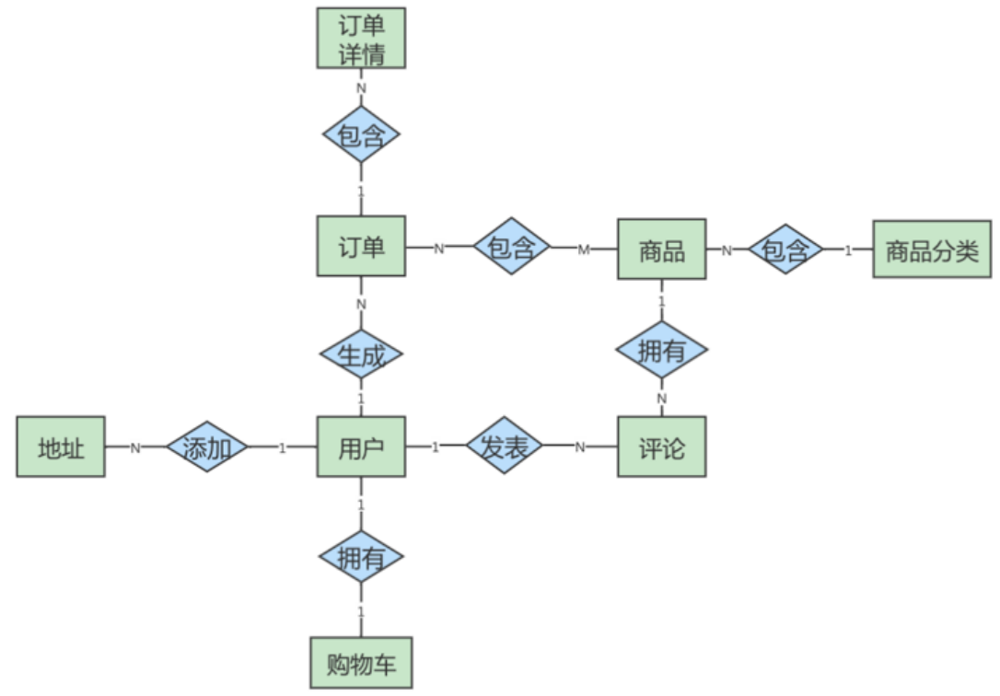

在这个图中，地址和用户之间的添加关系，是一对多的关系，而商品和商品详情示一对1的关系，商品和 订单是多对多的关系。 这个 ER 模型，包括了 8个实体之间的 8种关系。

（1）用户可以在电商平台添加多个地址；
（2）用户只能拥有一个购物车；
（3）用户可以生成多个订单；
（4）用户可以发表多条评论；
（5）一件商品可以有多条评论；
（6）每一个商品分类包含多种商品；
（7）一个订单可以包含多个商品，一个商品可以在多个订单里。
（8）订单中又包含多个订单详情，因为一个订单中可能包含不同种类的商品


#### 7.4 ER 模型的细化

有了这个 ER 模型，我们就可以从整体上 理解 电商的业务了。刚刚的 ER 模型展示了电商业务的框架， 但是只包括了订单，地址，用户，购物车，评论，商品，商品分类和订单详情这八个实体，以及它们之 间的关系，还不能对应到具体的表，以及表与表之间的关联。我们需要把 属性加上 ，用 椭圆 来表示， 这样我们得到的 ER 模型就更加完整了。

因此，我们需要进一步去设计一下这个 ER 模型的各个局部，也就是细化下电商的具体业务流程，然后把 它们综合到一起，形成一个完整的 ER 模型。这样可以帮助我们理清数据库的设计思路。

（1） 地址实体 包括用户编号、省、市、地区、收件人、联系电话、是否是默认地址。
（2） 用户实体 包括用户编号、用户名称、昵称、用户密码、手机号、邮箱、头像、用户级别。
（3） 购物车实体 包括购物车编号、用户编号、商品编号、商品数量、图片文件url。
（4） 订单实体 包括订单编号、收货人、收件人电话、总金额、用户编号、付款方式、送货地址、下单时间。
（5） 订单详情实体 包括订单详情编号、订单编号、商品名称、商品编号、商品数量。
（6） 商品实体 包括商品编号、价格、商品名称、分类编号、是否销售，规格、颜色。
（7） 评论实体 包括评论id、评论内容、评论时间、用户编号、商品编号
（8） 商品分类实体 包括类别编号、类别名称、父类别编号

这样细分之后，我们就可以重新设计电商业务了，ER 模型如图：

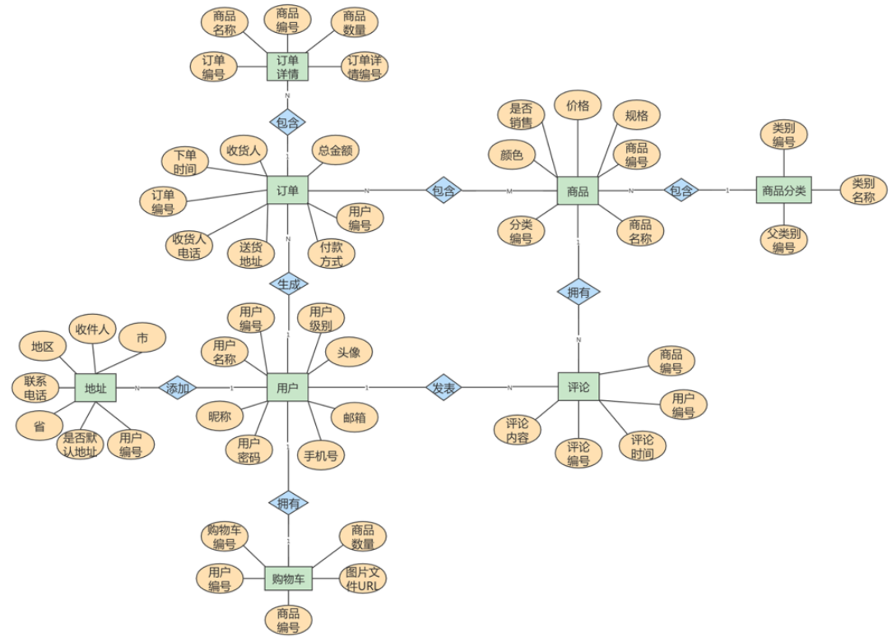


#### 7.5 ER 模型图转换成数据表

通过绘制 ER 模型，我们已经理清了业务逻辑，现在，我们就要进行非常重要的一步了：把绘制好的 ER 模型，转换成具体的数据表，下面介绍下转换的原则：

（1）一个 实体 通常转换成一个 数据表 ；
（2）一个 多对多的关系 ，通常也转换成一个 数据表 ；
（3）一个 1 对 1 ，或者 1 对多 的关系，往往通过表的 外键 来表达，而不是设计一个新的数据表；
（4） 属性 转换成表的 字段 。

其实，任何一个基于数据库的应用项目，都可以通过这种 先建立 ER 模型 ，再 转换成数据表 的方式， 完成数据库的设计工作。创建 ER 模型不是目的，目的是把业务逻辑梳理清楚，设计出优秀的数据库。我 建议你不是为了建模而建模，要利用创建 ER 模型的过程来整理思路，这样创建 ER 模型才有意义。

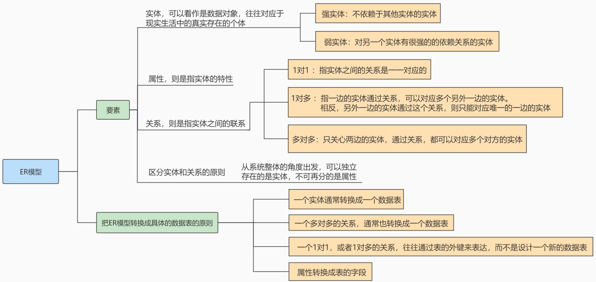


### 8. 数据表的设计原则

综合以上内容，总结出数据表设计的一般原则："三少一多"

1. 数据表的个数越少越好
2. 数据表中的字段个数越少越好
3. 数据表中联合主键的字段个数越少越好
4. 使用主键和外键越多越好

> 注意：这个原则并不是绝对的，有时候我们需要牺牲数据的冗余度来换取数据处理的效率。


### 9. 数据库对象编写建议

#### 9.1 关于库

1. 【强制】库的名称必须控制在32个字符以内，只能使用英文字母、数字和下划线，建议以英文字
母开头。
2. 【强制】库名中英文 一律小写 ，不同单词采用 下划线 分割。须见名知意。
3. 【强制】库的名称格式：业务系统名称_子系统名。
4. 【强制】库名禁止使用关键字（如type,order等）。
5. 【强制】创建数据库时必须 显式指定字符集 ，并且字符集只能是utf8或者utf8mb4。
创建数据库SQL举例：CREATE DATABASE crm_fund DEFAULT CHARACTER SET 'utf8' ;
6. 【建议】对于程序连接数据库账号，遵循 权限最小原则
使用数据库账号只能在一个DB下使用，不准跨库。程序使用的账号 原则上不准有drop权限 。
7. 【建议】临时库以 tmp_ 为前缀，并以日期为后缀；
备份库以 bak_ 为前缀，并以日期为后缀。


#### 9.2 关于表、列

1. 【强制】表和列的名称必须控制在32个字符以内，表名只能使用英文字母、数字和下划线，建议
以 英文字母开头 。
2. 【强制】 表名、列名一律小写 ，不同单词采用下划线分割。须见名知意。
3. 【强制】表名要求有模块名强相关，同一模块的表名尽量使用 统一前缀 。比如：crm_fund_item
4. 【强制】创建表时必须 显式指定字符集 为utf8或utf8mb4。
5. 【强制】表名、列名禁止使用关键字（如type,order等）。
6. 【强制】创建表时必须 显式指定表存储引擎 类型。如无特殊需求，一律为InnoDB。
7. 【强制】建表必须有comment。
8. 【强制】字段命名应尽可能使用表达实际含义的英文单词或 缩写 。如：公司 ID，不要使用
corporation_id, 而用corp_id 即可。
9. 【强制】布尔值类型的字段命名为 is_描述 。如member表上表示是否为enabled的会员的字段命
名为 is_enabled。
10. 【强制】禁止在数据库中存储图片、文件等大的二进制数据
通常文件很大，短时间内造成数据量快速增长，数据库进行数据库读取时，通常会进行大量的随
机IO操作，文件很大时，IO操作很耗时。通常存储于文件服务器，数据库只存储文件地址信息。
11. 【建议】建表时关于主键： 表必须有主键 (1)强制要求主键为id，类型为int或bigint，且为
auto_increment 建议使用unsigned无符号型。 (2)标识表里每一行主体的字段不要设为主键，建议
设为其他字段如user_id，order_id等，并建立unique key索引。因为如果设为主键且主键值为随机
插入，则会导致innodb内部页分裂和大量随机I/O，性能下降。
12. 【建议】核心表（如用户表）必须有行数据的 创建时间字段 （create_time）和 最后更新时间字段
（update_time），便于查问题。
13. 【建议】表中所有字段尽量都是 NOT NULL 属性，业务可以根据需要定义 DEFAULT值 。 因为使用
NULL值会存在每一行都会占用额外存储空间、数据迁移容易出错、聚合函数计算结果偏差等问
题。
14. 【建议】所有存储相同数据的 列名和列类型必须一致 （一般作为关联列，如果查询时关联列类型
不一致会自动进行数据类型隐式转换，会造成列上的索引失效，导致查询效率降低）。
15. 【建议】中间表（或临时表）用于保留中间结果集，名称以 tmp_ 开头。
备份表用于备份或抓取源表快照，名称以 bak_ 开头。中间表和备份表定期清理。
16. 【示范】一个较为规范的建表语句：

```mysql
CREATE TABLE user_info (
    `id` int unsigned NOT NULL AUTO_INCREMENT COMMENT '自增主键',
    `user_id` bigint(11) NOT NULL COMMENT '用户id',
    `username` varchar(45) NOT NULL COMMENT '真实姓名',
    `email` varchar(30) NOT NULL COMMENT '用户邮箱',
    `nickname` varchar(45) NOT NULL COMMENT '昵称',
    `birthday` date NOT NULL COMMENT '生日',
    `sex` tinyint(4) DEFAULT '0' COMMENT '性别',
    `short_introduce` varchar(150) DEFAULT NULL COMMENT '一句话介绍自己，最多50个汉字',
    `user_resume` varchar(300) NOT NULL COMMENT '用户提交的简历存放地址',
    `user_register_ip` int NOT NULL COMMENT '用户注册时的源ip',
    `create_time` timestamp NOT NULL DEFAULT CURRENT_TIMESTAMP COMMENT '创建时间',
    `update_time` timestamp NOT NULL DEFAULT CURRENT_TIMESTAMP ON UPDATE
    CURRENT_TIMESTAMP COMMENT '修改时间',
    `user_review_status` tinyint NOT NULL COMMENT '用户资料审核状态，1为通过，2为审核中，3为未
    通过，4为还未提交审核',
    PRIMARY KEY (`id`),
    UNIQUE KEY `uniq_user_id` (`user_id`),
    KEY `idx_username`(`username`),
    KEY `idx_create_time_status`(`create_time`,`user_review_status`)
) ENGINE=InnoDB DEFAULT CHARSET=utf8 COMMENT='网站用户基本信息'
```

17. 【建议】创建表时，可以使用可视化工具。这样可以确保表、字段相关的约定都能设置上。

实际上，我们通常很少自己写 DDL 语句，可以使用一些可视化工具来创建和操作数据库和数据表。

可视化工具除了方便，还能直接帮我们将数据库的结构定义转化成 SQL 语言，方便数据库和数据表结构 的导出和导入。


#### 9.3 关于索引

1. 【强制】InnoDB表必须主键为id int/bigint auto_increment，且主键值 禁止被更新 。
2. 【强制】InnoDB和MyISAM存储引擎表，索引类型必须为 BTREE 。
3. 【建议】主键的名称以 pk_ 开头，唯一键以 uni_ 或 uk_ 开头，普通索引以 idx_ 开头，一律
使用小写格式，以字段的名称或缩写作为后缀。
4. 【建议】多单词组成的columnname，取前几个单词首字母，加末单词组成column_name。如:
sample 表 member_id 上的索引：idx_sample_mid。
5. 【建议】单个表上的索引个数 不能超过6个 。
6. 【建议】在建立索引时，多考虑建立 联合索引 ，并把区分度最高的字段放在最前面。
7. 【建议】在多表 JOIN 的SQL里，保证被驱动表的连接列上有索引，这样JOIN 执行效率最高。
8. 【建议】建表或加索引时，保证表里互相不存在 冗余索引 。 比如：如果表里已经存在key(a,b)，
则key(a)为冗余索引，需要删除。


#### 9.4 SQL编写

1. 【强制】程序端SELECT语句必须指定具体字段名称，禁止写成 *。
2. 【建议】程序端insert语句指定具体字段名称，不要写成INSERT INTO t1 VALUES(…)。
3. 【建议】除静态表或小表（100行以内），DML语句必须有WHERE条件，且使用索引查找。
4. 【建议】INSERT INTO…VALUES(XX),(XX),(XX).. 这里XX的值不要超过5000个。 值过多虽然上线很
快，但会引起主从同步延迟。
5. 【建议】SELECT语句不要使用UNION，推荐使用UNION ALL，并且UNION子句个数限制在5个以
内。
6. 【建议】线上环境，多表 JOIN 不要超过5个表。
7. 【建议】减少使用ORDER BY，和业务沟通能不排序就不排序，或将排序放到程序端去做。ORDER
BY、GROUP BY、DISTINCT 这些语句较为耗费CPU，数据库的CPU资源是极其宝贵的。
8. 【建议】包含了ORDER BY、GROUP BY、DISTINCT 这些查询的语句，WHERE 条件过滤出来的结果
集请保持在1000行以内，否则SQL会很慢。
9. 【建议】对单表的多次alter操作必须合并为一次
对于超过100W行的大表进行alter table，必须经过DBA审核，并在业务低峰期执行，多个alter需整
合在一起。 因为alter table会产生 表锁 ，期间阻塞对于该表的所有写入，对于业务可能会产生极
大影响。
10. 【建议】批量操作数据时，需要控制事务处理间隔时间，进行必要的sleep。
11. 【建议】事务里包含SQL不超过5个。
因为过长的事务会导致锁数据较久，MySQL内部缓存、连接消耗过多等问题。
12. 【建议】事务里更新语句尽量基于主键或UNIQUE KEY，如UPDATE… WHERE id=XX;
    否则会产生间隙锁，内部扩大锁定范围，导致系统性能下降，产生死锁。


## 十二、数据库其它调优策略

### 1. 数据库调优的措施

#### 1.1 调优的目标

- 尽可能 节省系统资源 ，以便系统可以提供更大负荷的服务。（吞吐量更大）
- 合理的结构设计和参数调整，以提高用户操作 响应的速度 。（响应速度更快）
- 减少系统的瓶颈，提高MySQL数据库整体的性能。


#### 1.2 如何定位调优问题

不过随着用户量的不断增加，以及应用程序复杂度的提升，我们很难用“更快”去定义数据库调优的目标，因为用户在不同时间段访问服务器遇到的瓶颈不同，比如双十一促销的时候会带来大规模的并发访问；还有用户在进行不同业务操作的时候，数据库的事务处理和SQL查询都会有所不同。因此我们还需要更加精细的定位，去确定调优的目标。

如何确定呢？一般情况下，有如下几种方式：

- 用户的反馈（主要）
  用户是我们的服务对象，因此他们的反馈是最直接的。虽然他们不会直接提出技术建议，但是有些问题往往是用户第一时间发现的。我们要重视用户的反馈，找到和数据相关的问题。
- 日志分析（主要）
  我们可以通过查看数据库日志和操作系统日志等方式找出异常情况，通过它们来定位遇到的问题。
- 服务器资源使用监控
  通过监控服务器的CPU、内存、I/O等使用情况，可以实时了解服务器的性能使用，与历史情况进行对比。
- 数据库内部状况监控
  在数据库的监控中，活动会话（ActiveSession）监控是一个重要的指标。通过它，你可以清楚地了解数据库当前是否处于非常繁忙的状态，是否存在SQL堆积等。
- 其它
  除了活动会话监控以外，我们也可以对事务、锁等待等进行监控，这些都可以帮助我们对数据库的运行状态有更全面的认识。


#### 1.3 调优的维度和步骤

我们需要调优的对象是整个数据库管理系统，它不仅包括 SQL 查询，还包括数据库的部署配置、架构 等。从这个角度来说，我们思考的维度就不仅仅局限在 SQL 优化上了。通过如下的步骤我们进行梳理：


##### 第1步：选择适合的 DBMS

如果对事务性处理以及安全性要求高的话，可以选择商业的数据库产品。这些数据库在事务处理和查询性能上都比较强，比如采用sQLServer、Oracle，那么单表存储上亿条数据是没有问题的。如果数据表设计得好，即使不采用分库分表的方式，查询效率也不差。

除此以外，你也可以采用开源的MySQL进行存储，它有很多存储引擎可以选择，如果进行事务处理的话可以选择 InnoDB，非事务处理可以选择MyISAM。

NoSQL阵营包括键值型数据库、文档型数据库、搜索引擎、列式存储和图形数据库。这些数据库的优缺点和使用场景各有不同，比如列式存储数据库可以大幅度降低系统的VO，适合于分布式文件系统，但如果数据需要频繁地增删改，那么列式存储就不太适用了。

DBMS的选择关系到了后面的整个设计过程，所以第一步就是要选择适合的DBMS。如果已经确定好了DBMS，那么这步可以跳过。


##### 第2步：优化表设计

选择了DBMS之后，我们就需要进行表设计了。而数据表的设计方式也直接影响了后续的SQL查询语句。RDBMS 中，每个对象都可以定义为一张表，表与表之间的关系代表了对象之间的关系。如果用的是MySQL，我们还可以根据不同表的使用需求，选择不同的存储引擎。除此以外，还有一些优化的原则可以参考：

1. 表结构要尽量遵循三范式的原则。这样可以让数据结构更加清晰规范，减少冗余字段，同时也减少了在更新，插入和删除数据时等异常情况的发生。
2. 如果查询应用比较多，尤其是需要进行多表联查的时候，可以采用反范式进行优化。反范式采用空间换时间的方式，通过增加气余字段提高查询的效率。
3. 表字段的数据类型选择，关系到了查询效率的高低以及存储空间的大小。一般来说，如果字段可以采用数值类型就不要采用字符类型；字符长度要尽可能设计得短一些。针对字符类型来说，当确定字符长度固定时，就可以采用CHAR类型；当长度不固定时，通常采用VARCHAR类型。

数据表的结构设计很基础，也很关键。好的表结构可以在业务发展和用户量增加的情况下依然发挥作用，不好的表结构设计会让数据表变得非常臃肿，查询效率也会降低。


##### 第3步：优化逻辑查询

当我们建立好数据表之后，就可以对数据表进行增删改查的操作了。这时我们首先需要考虑的是逻辑查询优化。 

SQL查询优化，可以分为逻辑查询优化和物理查询优化。逻辑查询优化就是通过改变SQL语句的内容让SQL执行效率更高效，采用的方式是对SQL语句进行等价变换，对查询进行重写。

SQL的查询重写包括了子查询优化、等价谓词重写、视图重写、条件简化、连接消除和嵌套连接消除等。

比如我们在讲解EXISTS子查询和IN子查询的时候，会根据小表驱动大表的原则选择适合的子查询。在WHERE子句中会尽量避免对字段进行函数运算，它们会让字段的索引失效。

举例：查询评论内容开头为abc的内容都有哪些，如果在WHERE子句中使用了函数，语句就会写成下面这样： 

```mysql
SELECT comment_id, comment_text, comment_time FROM product_comment WHERE SUBSTRING(comment_text,1,3) = 'abc'
```

采用查询重写的方式进行等价替换：

```mysql
SELECT comment_id, comment_text, comment_time FROM product_comment WHERE comment_text LIKE 'abc%'
```


##### 第4步：优化物理查询

物理查询优化是在确定了逻辑查询优化之后，采用物理优化技术（比如索引等），通过计算代价模型对 各种可能的访问路径进行估算，从而找到执行方式中代价最小的作为执行计划。在这个部分中，我们需 要掌握的重点是对索引的创建和使用。

SQL查询时需要对不同的数据表进行查询，因此在物理查询优化阶段也需要确定这些查询所采用的路径，具体的情况包括：

1. 单表扫描：对于单表扫描来说，我们可以全表扫描所有的数据，也可以局部扫描。
2. 两张表的连接：常用的连接方式包括了嵌套循环连接、HASH连接和合并连接。
3. 多张表的连接：多张数据表进行连接的时候，顺序很重要，因为不同的连接路径查询的效率不同，搜索空间也会不同。我们在进行多表连接的时候，搜索空间可能会达到很高的数据量级，巨大的搜索空间显然会占用更多的资源，因此我们需要通过调整连接顺序，将搜索空间调整在一个可接受的范围内。


##### 第5步：使用 Redis 或 Memcached 作为缓存

除了可以对 SQL 本身进行优化以外，我们还可以请外援提升查询的效率。 

因为数据都是存放到数据库中，我们需要从数据库层中取出数据放到内存中进行业务逻辑的操作，当用 户量增大的时候，如果频繁地进行数据查询，会消耗数据库的很多资源。如果我们将常用的数据直接放 到内存中，就会大幅提升查询的效率。 

键值存储数据库可以帮我们解决这个问题。 

常用的键值存储数据库有 Redis 和 Memcached，它们都可以将数据存放到内存中。

从可靠性来说，Redis支持持久化，可以让我们的数据保存在硬盘上，不过这样一来性能消耗也会比较大。而 Memcached仅仅是内存存储，不支持持久化。

从支持的数据类型来说，Redis比Memcached要多，它不仅支持key-value类型的数据，还支持List，Set，Hash 等数据结构。当我们有持久化需求或者是更高级的数据处理需求的时候，就可以使用Redis。如果是简单的key-value存储，则可以使用Memcached。

通常我们对于查询响应要求高的场景（响应时间短，吞吐量大），可以考虑内存数据库，毕竟术业有专攻。传统的RDBMS都是将数据存储在硬盘上，而内存数据库则存放在内存中，查询起来要快得多。不过使用不同的工具，也增加了开发人员的使用成本。


##### 第6步：库级优化

库级优化是站在数据库的维度上进行的优化策略，比如控制一个库中的数据表数量。另外，单一的数据库总会遇到各种限制，不如取长补短，利用"外援"的方式。通过主从架构优化我们的读写策略，通过对数据库进行垂直或者水平切分，突破单一数据库或数据表的访问限制，提升查询的性能。

1. 读写分离

如果读和写的业务量都很大，并且它们都在同一个数据库服务器中进行操作，那么数据库的性能就会出现瓶颈这时为了提升系统的性能，优化用户体验，我们可以采用读写分离的方式降低主数据库的负载，比如用主数据库（master）完成写操作，用从数据库（slave）完成读操作。

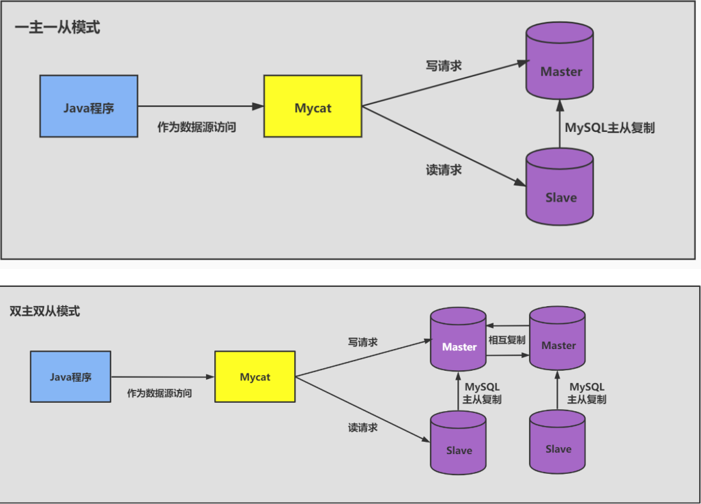


2. 数据分片

对数据库分库分表。当数据量级达到千万级以上时，有时候我们需要把一个数据库切成多份，放到不同的数据库服务器上，减少对单一数据库服务器的访问压力。如果你使用的是MySQL，就可以使用MySQL自带的分区表功能，当然你也可以考虑自己做垂直拆分（分库）、水平拆分（分表）、垂直+水平拆分（分库分表）。

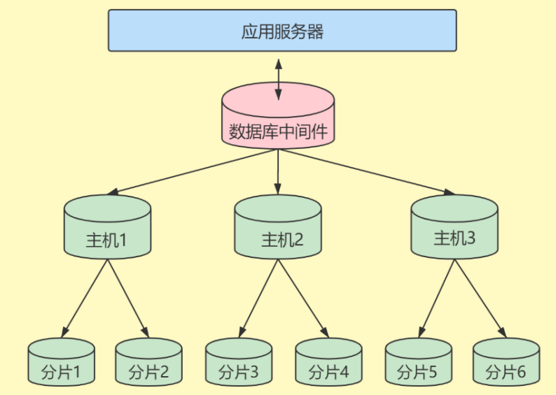

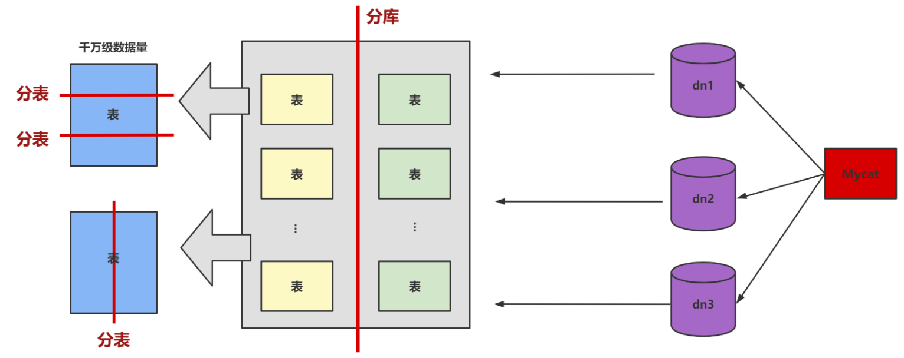

> 但需要注意的是，分拆在提升数据库性能的同时，也会增加维护和使用成本。
>


### 2. 优化MySQL服务器

优化MySQL服务器主要从两个方面来优化，一方面是对硬件进行优化；另一方面是对MySQL服务的参数进行优化。这部分的内容需要较全面的知识，一般只有专业的数据库管理员才能进行这一类的优化。对于可以定制参数的操作系统，也可以针对MySQL进行操作系统优化。


#### 2.1 优化服务器硬件

服务器的硬件性能直接决定着MySQL数据库的性能。硬件的性能瓶颈直接决定MySQL数据库的运行速度 和效率。针对性能瓶颈提高硬件配置，可以提高MySQL数据库查询、更新的速度。

1. **配置较大的内存**。足够大的内存是提高MySQL数据库性能的方法之一。内存的速度比磁盘I/O快得多，可以通过增加系统的缓冲区容量使数据在内存中停留的时间更长，以减少磁盘工/0。
2. **配置高速磁盘系统**，以减少读盘的等待时间，提高响应速度。磁盘的I/O能力，也就是它的寻道能力，目前的SCSI高速旋转的是7200转/分钟，这样的速度，一旦访问的用户量上去，磁盘的压力就会过大，如果是每天的网站pv（pageview）在150w，这样的一般的配置就无法满足这样的需求了。现在SSD盛行，在SSD上随机访问和顺序访问性能几乎差不多，使用SSD可以减少随机IO带来的性能损耗。
3. **合理分布磁盘I/0**，把磁盘I/O分散在多个设备上，以减少资源竞争，提高并行操作能力。
4. **配置多处理器**，MySQL是多线程的数据库，多处理器可同时执行多个线程。


#### 2.2 优化MySQL的参数

通过优化MySQL的参数可以提高资源利用率，从而达到提高MySQL服务器性能的目的。

MySQL服务的配置参数都在my.cnf或者my.ini文件的[mysqld]组中。配置完参数以后，需要重新启动MySQL服务才会生效。

下面对几个对性能影响比较大的参数进行详细介绍。

- innodb_buffer_pool_size ：这个参数是Mysql数据库最重要的参数之一，表示InnoDB类型的 表和索引的最大缓存 。它不仅仅缓存 索引数据 ，还会缓存 表的数据 。这个值越大，查询的速度就会越快。但是这个值太大会影响操作系统的性能。
- key_buffer_size ：表示 索引缓冲区的大小 。索引缓冲区是所有的 线程共享 。增加索引缓冲区可以得到更好处理的索引（对所有读和多重写）。当然，这个值不是越大越好，它的大小取决于内存的大小。如果这个值太大，就会导致操作系统频繁换页，也会降低系统性能。对于内存在 4GB 左右的服务器该参数可设置为 256M 或 384M 。

- table_cache ：表示 同时打开的表的个数 。这个值越大，能够同时打开的表的个数越多。物理内存越大，设置就越大。默认为2402，调到512-1024最佳。这个值不是越大越好，因为同时打开的表太多会影响操作系统的性能。
- query_cache_size ：表示 查询缓冲区的大小 。可以通过在MySQL控制台观察，如果Qcache_lowmem_prunes的值非常大，则表明经常出现缓冲不够的情况，就要增加Query_cache_size的值；如果Qcache_hits的值非常大，则表明查询缓冲使用非常频繁，如果该值较小反而会影响效率，那么可以考虑不用查询缓存；Qcache_free_blocks，如果该值非常大，则表明缓冲区中碎片很多。MySQL8.0之后失效。该参数需要和query_cache_type配合使用。
- query_cache_type 的值是0时，所有的查询都不使用查询缓存区。但是query_cache_type=0并不会导致MySQL释放query_cache_size所配置的缓存区内存。
  - 当query_cache_type=1时，所有的查询都将使用查询缓存区，除非在查询语句中指定SQL_NO_CACHE ，如SELECT SQL_NO_CACHE * FROM tbl_name。
  - 当query_cache_type=2时，只有在查询语句中使用 SQL_CACHE 关键字，查询才会使用查询缓存区。使用查询缓存区可以提高查询的速度，这种方式只适用于修改操作少且经常执行相同的查询操作的情况。
- sort_buffer_size ：表示每个 需要进行排序的线程分配的缓冲区的大小 。增加这个参数的值可以提高 ORDER BY 或 GROUP BY 操作的速度。默认数值是2 097 144字节（约2MB）。对于内存在4GB左右的服务器推荐设置为6-8M，如果有100个连接，那么实际分配的总共排序缓冲区大小为100 × 6＝ 600MB。
- join_buffer_size = 8M ：表示 联合查询操作所能使用的缓冲区大小 ，和sort_buffer_size一样，该参数对应的分配内存也是每个连接独享。
- read_buffer_size ：表示 每个线程连续扫描时为扫描的每个表分配的缓冲区的大小（字节） 。当线程从表中连续读取记录时需要用到这个缓冲区。SET SESSION read_buffer_size=n可以临时设置该参数的值。默认为64K，可以设置为4M。
- innodb_flush_log_at_trx_commit ：表示 何时将缓冲区的数据写入日志文件 ，并且将日志文件写入磁盘中。该参数对于innoDB引擎非常重要。该参数有3个值，分别为0、1和2。该参数的默认值为1。
  - 值为 0 时，表示 每秒1次 的频率将数据写入日志文件并将日志文件写入磁盘。每个事务的commit并不会触发前面的任何操作。该模式速度最快，但不太安全，mysqld进程的崩溃会导致上一秒钟所有事务数据的丢失。
  - 值为 1 时，表示 每次提交事务时 将数据写入日志文件并将日志文件写入磁盘进行同步。该模式是最安全的，但也是最慢的一种方式。因为每次事务提交或事务外的指令都需要把日志写入（flush）硬盘。
  - 值为 2 时，表示 每次提交事务时 将数据写入日志文件， 每隔1秒 将日志文件写入磁盘。该模式速度较快，也比0安全，只有在操作系统崩溃或者系统断电的情况下，上一秒钟所有事务数据才可能丢失。
- innodb_log_buffer_size ：这是 InnoDB 存储引擎的 事务日志所使用的缓冲区 。为了提高性能，也是先将信息写入 Innodb Log Buffer 中，当满足 innodb_flush_log_trx_commit 参数所设置的相应条件（或者日志缓冲区写满）之后，才会将日志写到文件（或者同步到磁盘）中。
- max_connections ：表示 允许连接到MySQL数据库的最大数量 ，默认值是 151 。如果状态变量connection_errors_max_connections 不为零，并且一直增长，则说明不断有连接请求因数据库连接数已达到允许最大值而失败，这是可以考虑增大max_connections 的值。在Linux 平台下，性能好的服务器，支持 500-1000 个连接不是难事，需要根据服务器性能进行评估设定。这个连接数 不是越大越好 ，因为这些连接会浪费内存的资源。过多的连接可能会导致MySQL服务器僵死。

- back_log ：用于 控制MySQL监听TCP端口时设置的积压请求栈大小 。如果MySql的连接数达到max_connections时，新来的请求将会被存在堆栈中，以等待某一连接释放资源，该堆栈的数量即back_log，如果等待连接的数量超过back_log，将不被授予连接资源，将会报错。5.6.6 版本之前默认值为 50 ， 之后的版本默认为 50 + （max_connections / 5）， 对于Linux系统推荐设置为小于512的整数，但最大不超过900。如果需要数据库在较短的时间内处理大量连接请求， 可以考虑适当增大back_log 的值。

- thread_cache_size ： 线程池缓存线程数量的大小 ，当客户端断开连接后将当前线程缓存起来，当在接到新的连接请求时快速响应无需创建新的线程 。这尤其对那些使用短连接的应用程序来说可以极大的提高创建连接的效率。那么为了提高性能可以增大该参数的值。默认为60，可以设置为120。
  可以通过如下几个MySQL状态值来适当调整线程池的大小：

  ```mysql
  mysql> show global status like 'Thread%';
  +-------------------+-------+
  | Variable_name     | Value |
  +-------------------+-------+
  | Threads_cached    | 2 	|
  | Threads_connected | 1 	|
  | Threads_created   | 3 	|
  | Threads_running   | 2 	|
  +-------------------+-------+
  4 rows in set (0.01 sec)
  ```

  当 Threads_cached 越来越少，但 Threads_connected 始终不降，且 Threads_created 持续升高，可 适当增加 thread_cache_size 的大小。

- wait_timeout ：指定 一个请求的最大连接时间 ，对于4GB左右内存的服务器可以设置为5-10。

- interactive_timeout ：表示服务器在关闭连接前等待行动的秒数。

这里给出一份my.cnf的参考配置：

> [mysqld]
>
> port = 3306 serverid = 1 socket = /tmp/mysql.sock skip-locking #避免MySQL的外部锁定，减少 出错几率增强稳定性。 skip-name-resolve #禁止MySQL对外部连接进行DNS解析，使用这一选 项可以消除MySQL进行DNS解析的时间。但需要注意，如果开启该选项，则所有远程主机连接授权 都要使用IP地址方式，否则MySQL将无法正常处理连接请求！ back_log = 384 key_buffer_size = 256M max_allowed_packet = 4M thread_stack = 256K table_cache = 128K sort_buffer_size = 6M read_buffer_size = 4M read_rnd_buffer_size=16M join_buffer_size = 8M myisam_sort_buffer_size = 64M table_cache = 512 thread_cache_size = 64 query_cache_size = 64M tmp_table_size = 256M max_connections = 768 max_connect_errors = 10000000 wait_timeout = 10 thread_concurrency = 8 #该参数取值为服务器逻辑CPU数量*2，在本 例中，服务器有2颗物理CPU，而每颗物理CPU又支持H.T超线程，所以实际取值为4*2=8 skipnetworking #开启该选项可以彻底关闭MySQL的TCP/IP连接方式，如果WEB服务器是以远程连接 的方式访问MySQL数据库服务器则不要开启该选项！否则将无法正常连接！ table_cache=1024 innodb_additional_mem_pool_size=4M #默认为2M innodb_flush_log_at_trx_commit=1 innodb_log_buffer_size=2M #默认为1M innodb_thread_concurrency=8 #你的服务器CPU 有几个就设置为几。建议用默认一般为8 tmp_table_size=64M #默认为16M，调到64-256最挂 thread_cache_size=120 query_cache_size=32M


### 3. 优化数据库结构

一个好的数据库设计方案对于数据库的性能常常会起到事半功倍的效果。合理的数据库结构不仅可以使数据库占用更小的磁盘空间，而且能够使查询速度更快。数据库结构的设计需要考虑数据余、查询和更新的速度、字段的数据类型是否合理等多方面的内容。


#### 3.1 拆分表：冷热数据分离

拆分表的思路是，把1个包含很多字段的表拆分成2个或者多个相对较小的表。这样做的原因是，这些表中某些字段的操作频率很高（热数据），经常要进行查询或者更新操作，而另外一些字段的使用频率却很低（冷数据），冷热数据分离，可以减小表的宽度。如果放在一个表里面，每次查询都要读取大记录，会消耗较多的资源。

MySQL限制每个表最多存储4096列，并且每一行数据的大小不能超过65535字节。表越宽，把表装载进内存缓冲池时所占用的内存也就越大，也会消耗更多的I0。冷热数据分离的目的是：①减少磁盘I0，保证热数据的内存缓存命中率。②更有效的利用缓存，避免读入无用的冷数据。

**举例1**： 会员members表 存储会员登录认证信息，该表中有很多字段，如id、姓名、密码、地址、电 话、个人描述字段。其中地址、电话、个人描述等字段并不常用，可以将这些不常用的字段分解出另一 个表。将这个表取名叫members_detail，表中有member_id、address、telephone、description等字段。 这样就把会员表分成了两个表，分别为 members表 和 members_detail表 。

创建这两个表的SQL语句如下：

```mysql
CREATE TABLE members (
    id int(11) NOT NULL AUTO_INCREMENT,
    username varchar(50) DEFAULT NULL,
    password varchar(50) DEFAULT NULL,
    last_login_time datetime DEFAULT NULL,
    last_login_ip varchar(100) DEFAULT NULL,
    PRIMARY KEY(Id)
);

CREATE TABLE members_detail (
    Member_id int(11) NOT NULL DEFAULT 0,
    address varchar(255) DEFAULT NULL,
    telephone varchar(255) DEFAULT NULL,
    description text
);
```

如果需要查询会员的基本信息或详细信息，那么可以用会员的id来查询。如果需要将会员的基本信息和 详细信息同时显示，那么可以将members表和members_detail表进行联合查询，查询语句如下：

```mysql
SELECT * FROM members LEFT JOIN members_detail on members.id =
members_detail.member_id;
```

通过这种分解可以提高表的查询效率。对于字段很多且有些字段使用不频繁的表，可以通过这种分解的 方式来优化数据库的性能。


#### 3.2 增加中间表

对于需要经常联合查询的表，可以建立中间表以提高查询效率。通过建立中间表，把需要经常联合查询的数据插入中间表中，然后将原来的联合查询改为对中间表的查询，以此来提高查询效率。

首先，分析经常联合查询表中的字段；然后，使用这些字段建立一个中间表，并将原来联合查询的表的数据插入中间表中；最后，使用中间表来进行查询。

举例1： 学生信息表 和 班级表 的SQL语句如下：

```mysql
CREATE TABLE `class` (
    `id` INT(11) NOT NULL AUTO_INCREMENT,
    `className` VARCHAR(30) DEFAULT NULL,
    `address` VARCHAR(40) DEFAULT NULL,
    `monitor` INT NULL ,
    PRIMARY KEY (`id`)
) ENGINE=INNODB AUTO_INCREMENT=1 DEFAULT CHARSET=utf8;

CREATE TABLE `student` (
    `id` INT(11) NOT NULL AUTO_INCREMENT,
    `stuno` INT NOT NULL ,
    `name` VARCHAR(20) DEFAULT NULL,
    `age` INT(3) DEFAULT NULL,
    `classId` INT(11) DEFAULT NULL,
    PRIMARY KEY (`id`)
) ENGINE=INNODB AUTO_INCREMENT=1 DEFAULT CHARSET=utf8;
```

现在有一个模块需要经常查询带有学生名称（name）、学生所在班级名称（className）、学生班级班 长（monitor）的学生信息。根据这种情况可以创建一个 temp_student 表。temp_student表中存储学生 名称（stu_name）、学生所在班级名称（className）和学生班级班长（monitor）信息。创建表的语句 如下：

```mysql
CREATE TABLE `temp_student` (
    `id` INT(11) NOT NULL AUTO_INCREMENT,
    `stu_name` INT NOT NULL ,
    `className` VARCHAR(20) DEFAULT NULL,
    `monitor` INT(3) DEFAULT NULL,
    PRIMARY KEY (`id`)
) ENGINE=INNODB AUTO_INCREMENT=1 DEFAULT CHARSET=utf8;
```

接下来，从学生信息表和班级表中查询相关信息存储到临时表中：

```mysql
insert into temp_student(stu_name,className,monitor)
    select s.name,c.className,c.monitor
    from student as s,class as c
    where s.classId = c.id
```

以后，可以直接从temp_student表中查询学生名称、班级名称和班级班长，而不用每次都进行联合查 询。这样可以提高数据库的查询速度。


#### 3.3 增加冗余字段

设计数据库表时应尽量遵循范式理论的规约，尽可能减少冗余字段，让数据库设计看起来精致、优雅。 但是，合理地加入冗余字段可以提高查询速度。

表的规范化程度越高，表与表之间的关系就越多，需要连接查询的情况也就越多。尤其在数据量大，而 且需要频繁进行连接的时候，为了提升效率，我们也可以考虑增加冗余字段来减少连接。


#### 3.4 优化数据类型

改进表的设计时，可以考虑优化字段的数据类型。这个问题在大家刚从事开发时基本不算是问题。但是，随着你的经验越来越丰富，参与的项目越来越大，数据量也越来越多的时候，你就不能只从系统稳定性的角度来思考问题了，还要考虑到系统整体的稳定性和效率。此时，优先选择符合存储需要的最小的数据类型。

列的字段越大，建立索引时所需要的空间也就越大，这样一页中所能存储的索引节点的数量也就越少，在遍历时所需要的I0次数也就越多，索引的性能也就越差。

具体来说

**情况1：对整数类型数据进行优化。**

遇到整数类型的字段可以用 INT 型 。这样做的理由是，INT 型数据有足够大的取值范围，不用担心数 据超出取值范围的问题。刚开始做项目的时候，首先要保证系统的稳定性，这样设计字段类型是可以 的。但在数据量很大的时候，数据类型的定义，在很大程度上会影响到系统整体的执行效率。


**情况2：既可以使用文本类型也可以使用整数类型的字段，要选择使用整数类型。**

跟文本类型数据相比，大整数往往占用 更少的存储空间 ，因此，在存取和比对的时候，可以占用更少的 内存空间。所以，在二者皆可用的情况下，尽量使用整数类型，这样可以提高查询的效率。如：将IP地 址转换成整型数据。


**情况3：避免使用TEXT、BLOB数据类型**

MySQL内存临时表不支持TEXT、BLOB这样的大数据类型，如果查询中包含这样的数据，在排序等操作时，就不能使用内存临时表，必须使用磁盘临时表进行。并且对于这种数据，MySQL还是要进行二次查询，会使SQL性能变得很差，但是不是说一定不能使用这样的数据类型。

如果一定要使用，建议把BLOB或是TEXT列分离到单独的扩展表中，查询时一定不要使用select * ，而只需要取出必要的列，不需要TEXT列的数据时不要对该列进行查询。


**情况4：避免使用ENUM类型**

修改ENUM值需要使用ALTER语句。

ENUM类型的ORDER BY操作效率低，需要额外操作。使用TINYINT来代替ENUM类型。


**情况5：使用TIMESTAMP存储时间**

TIMESTAMP存储的时间范围1970-01-0100:00:01~2038-01-19-03:14:07。TIMESTAMP使用4字节，DATETIME使用8个字节，同时TIMESTAMP具有自动赋值以及自动更新的特性。


**情况6：用DECIMAL代替FLOAT和DOUBLE存储精确浮点数**

1. 非精准浮点：float,doubfe
2. 精准浮点：decimal

Decimal类型为精准浮点数，在计算时不会丢失精度，尤其是财务相关的金融类数据。占用空间由定义的宽度决定，每4个字节可以存储9位数字，并且小数点要占用一个字节。可用于存储比bigint更大的整型数据。


总之，遇到数据量大的项目时，一定要在充分了解业务需求的前提下，合理优化数据类型，这样才能充 分发挥资源的效率，使系统达到最优。


#### 3.5 优化插入记录的速度

插入记录时，影响插入速度的主要是索引、唯一性校验、一次插入记录条数等。根据这些情况可以分别进行优化。这里我们分为MyISAM引擎和InnoDB存储引擎来讲。

1. MyISAM引擎的表：

**① 禁用索引**

对于非空表，插入记录时，MySQL会根据表的索引对插入的记录建立索引。如果插入大量数据，建立索引就会降低插入记录的速度。为了解决这种情况，可以在插入记录之前禁用索引，数据插入完毕后再开启索引。禁用索引的语句如下：

```mysql
ALTER TABLE table_name DISABLE KEYS; 
```

重新开启索引的语句如下：

```mysql
ALTER TABLE table_name ENABLE KEYS;
```

若对于空表批量导入数据，则不需要进行此操作，因为MyISAM引擎的表是在导入数据之后才建立索引的。


**② 禁用唯一性检查**

插入数据时，MySQL会对插入的记录进行唯一性校验。这种唯一性校验会降低插入记录的速度。为了降低这种情况对查询速度的影响，可以在插入记录之前禁用唯一性检查，等到记录插入完毕后再开启。禁用唯一性检查的语句如下：

```mysql
SET UNIQUE_CHECKS=0;
```

开启唯一性检查的语句如下：

```mysql
SET UNIQUE_CHECKS=1;
```


**③ 使用批量插入**

插入多条记录时，可以使用一条INSERT语句插入一条记录，也可以使用一条INSERT语句插入多条记录。插入一条记录的INSERT语句情形如下：

```mysql
insert into student values(1,'zhangsan',18,1);
insert into student values(2,'lisi',17,1);
insert into student values(3,'wangwu',17,1);
insert into student values(4,'zhaoliu',19,1);
```

使用一条INSERT语句插入多条记录的情形如下：

```mysql
insert into student values
(1,'zhangsan',18,1),
(2,'lisi',17,1),
(3,'wangwu',17,1),
(4,'zhaoliu',19,1);
```

第2种情形的插入速度要比第1种情形快。


**④ 使用LOAD DATA INFILE 批量导入**

当需要批量导入数据时，如果能用LOAD DATA INFILE语句，就尽量使用。因为LOAD DATA INFILE语句导入数据的速度比INSERT语句快。


2. InnoDB引擎的表：

**① 禁用唯一性检查**

插入数据之前执行set unique_checks=0来禁止对唯一索引的检查，数据导入完成之后再运行set unique_checks=1。这个和MylSAM引擎的使用方法一样。

**② 禁用外键检查**

插入数据之前执行禁止对外键的检查，数据插入完成之后再恢复对外键的检查。禁用外键检查的语句如下：

```mysql
SET foreign_key_checks=0;
```

恢复对外键的检查语句如下：

```mysql
SET foreign_key_checks=1;
```


**③ 禁止自动提交**

插入数据之前禁止事务的自动提交，数据导入完成之后，执行恢复自动提交操作。禁止自动提交的语句如下：

```mysql
set autocommit=0;
```

恢复自动提交的语句如下：

```mysql
set autocommit=1;
```


#### 3.6 使用非空约束

在设计字段的时候，如果业务允许，建议尽量使用非空约束。这样做的好处是：

①进行比较和计算时，省去要对NULL值的字段判断是否为空的开销，提高存储效率。

②非空字段也容易创建索引。因为索引NULL列需要额外的空间来保存，所以要占用更多的空间。使用非空约束，就可以节省存储空间（每个字段1个bit）。


#### 3.7 分析表、检查表与优化表

MySQL提供了分析表、检查表和优化表的语句。分析表主要是分析关键字的分布，检查表主要是检查表是否存在错误，优化表主要是消除删除或者更新造成的空间浪费。

##### 1. 分析表

MySQL中提供了ANALYZE TABLE语句分析表，ANALYZE TABLE语句的基本语法如下：

```mysql
ANALYZE [LOCAL | NO_WRITE_TO_BINLOG] TABLE tbl_name[,tbl_name]…
```

默认的，MySQL服务会将 ANALYZE TABLE语句写到binlog中，以便在主从架构中，从服务能够同步数据。 可以添加参数LOCAL 或者 NO_WRITE_TO_BINLOG取消将语句写到binlog中。

使用 ANALYZE TABLE 分析表的过程中，数据库系统会自动对表加一个 只读锁 。在分析期间，只能读取 表中的记录，不能更新和插入记录。ANALYZE TABLE语句能够分析InnoDB和MyISAM类型的表，但是不能 作用于视图。

ANALYZE TABLE分析后的统计结果会反应到 cardinality 的值，该值统计了表中某一键所在的列不重复 的值的个数。该值越接近表中的总行数，则在表连接查询或者索引查询时，就越优先被优化器选择使 用。也就是索引列的cardinality的值与表中数据的总条数差距越大，即使查询的时候使用了该索引作为查 询条件，存储引擎实际查询的时候使用的概率就越小。下面通过例子来验证下。cardinality可以通过 SHOW INDEX FROM 表名查看。


##### 2. 检查表

MySQL中可以使用 CHECK TABLE 语句来检查表。CHECK TABLE语句能够检查InnoDB和MyISAM类型的表 是否存在错误。CHECK TABLE语句在执行过程中也会给表加上 只读锁 。

对于MyISAM类型的表，CHECK TABLE语句还会更新关键字统计数据。而且，CHECK TABLE也可以检查视 图是否有错误，比如在视图定义中被引用的表已不存在。该语句的基本语法如下：

```mysql
CHECK TABLE tbl_name [, tbl_name] ... [option] ...
option = {QUICK | FAST | MEDIUM | EXTENDED | CHANGED}
```

其中，tbl_name是表名；option参数有5个取值，分别是QUICK、FAST、MEDIUM、EXTENDED和 CHANGED。各个选项的意义分别是：

- QUICK ：不扫描行，不检查错误的连接。
- FAST ：只检查没有被正确关闭的表。
- CHANGED ：只检查上次检查后被更改的表和没有被正确关闭的表。
- MEDIUM ：扫描行，以验证被删除的连接是有效的。也可以计算各行的关键字校验和，并使用计算出的校验和验证这一点。
- EXTENDED ：对每行的所有关键字进行一个全面的关键字查找。这可以确保表是100%一致的，但是花的时间较长。

option只对MyISAM类型的表有效，对InnoDB类型的表无效。比如：

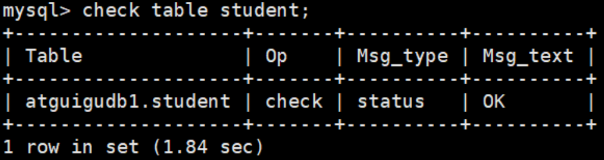

该语句对于检查的表可能会产生多行信息。最后一行有一个状态的 Msg_type 值，Msg_text 通常为 OK。 如果得到的不是 OK，通常要对其进行修复；是 OK 说明表已经是最新的了。表已经是最新的，意味着存 储引擎对这张表不必进行检查。


##### 3. 优化表

**方式1：OPTIMIZE TABLE**

MySQL中使用 OPTIMIZE TABLE 语句来优化表。但是，OPTILMIZE TABLE语句只能优化表中的 VARCHAR 、 BLOB 或 TEXT 类型的字段。一个表使用了这些字段的数据类型，若已经 删除 了表的一大部 分数据，或者已经对含有可变长度行的表（含有VARCHAR、BLOB或TEXT列的表）进行了很多 更新 ，则 应使用OPTIMIZE TABLE来重新利用未使用的空间，并整理数据文件的 碎片 。

OPTIMIZE TABLE 语句对InnoDB和MyISAM类型的表都有效。该语句在执行过程中也会给表加上 只读锁 。

OPTILMIZE TABLE语句的基本语法如下：

```mysql
OPTIMIZE [LOCAL | NO_WRITE_TO_BINLOG] TABLE tbl_name [, tbl_name] ...
```

LOCAL | NO_WRITE_TO_BINLOG关键字的意义和分析表相同，都是指定不写入二进制日志。

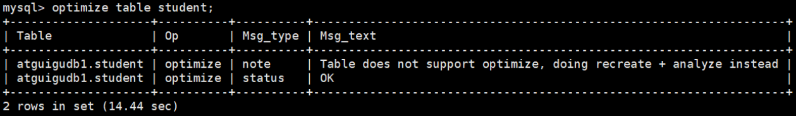

执行完毕，Msg_text显示

> ‘numysql.SYS_APP_USER’, ‘optimize’, ‘note’, ‘Table does not support optimize, doing recreate + analyze instead’

原因是我服务器上的MySQL是InnoDB存储引擎。

到底优化了没有呢？看官网！

https://dev.mysql.com/doc/refman/8.0/en/optimize-table.html

在MyISAM中，是先分析这张表，然后会整理相关的MySQL datafile，之后回收未使用的空间；在InnoDB 中，回收空间是简单通过Alter table进行整理空间。在优化期间，MySQL会创建一个临时表，优化完成之 后会删除原始表，然后会将临时表rename成为原始表。

> 说明： 在多数的设置中，根本不需要运行OPTIMIZE TABLE。即使对可变长度的行进行了大量的更 新，也不需要经常运行， 每周一次 或 每月一次 即可，并且只需要对 特定的表 运行。


#### 3.8 小结

上述这些方法都是有利有弊的。比如：

- 修改数据类型，节省存储空间的同时，你要考虑到数据不能超过取值范围；
- 增加冗余字段的时候，不要忘了确保数据一致性；
- 把大表拆分，也意味着你的查询会增加新的连接，从而增加额外的开销和运维的成本。

因此，你一定要结合实际的业务需求进行权衡。


### 4. 大表优化

当MySQL单表记录数过大时，数据库的CRUD性能会明显下降，一些常见的优化措施如下：


#### 4.1 限定查询的范围

禁止不带任何限制数据范围条件的查询语句。比如：我们当用户在查询订单历史的时候，我们可以控制 在一个月的范围内；


#### 4.2 读/写分离

经典的数据库拆分方案，主库负责写，从库负责读。

- 一主一从模式：

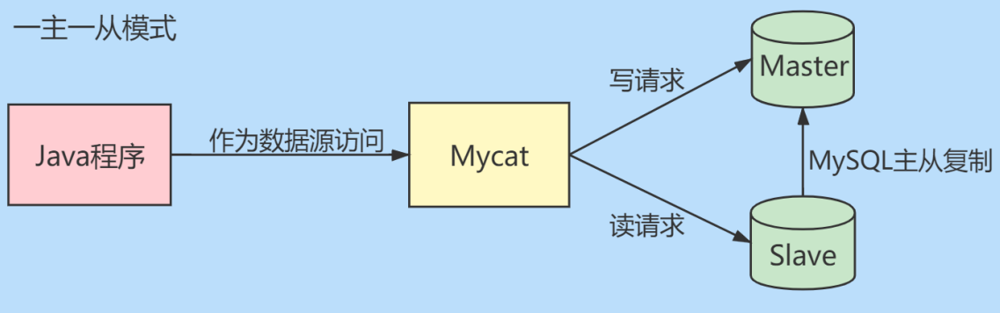

- 双主双从模式：

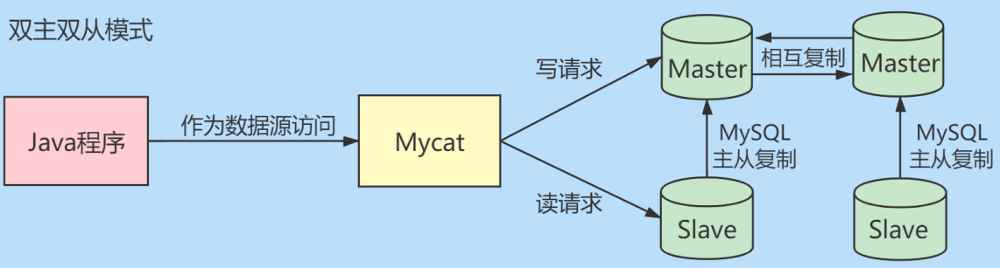


#### 4.3 垂直拆分

当数据量级达到 千万级 以上时，有时候我们需要把一个数据库切成多份，放到不同的数据库服务器上， 减少对单一数据库服务器的访问压力。

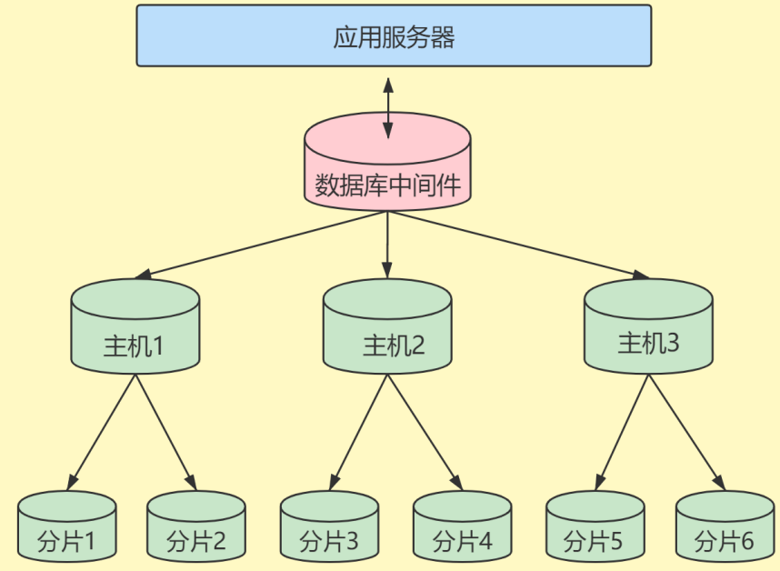

- 如果数据库中的数据表过多，可以采用垂直分库的方式，将关联的数据表部署在同一个数据库上。
- 如果数据表中的列过多，可以采用垂直分表的方式，将一张数据表分拆成多张数据表，把经常一起使用的列放到同一张表里。


- 垂直拆分的优点： 可以使得列数据变小，在查询时减少读取的Block数，减少I/O次数。此外，垂直分区 可以简化表的结构，易于维护。 
- 垂直拆分的缺点： 主键会出现冗余，需要管理冗余列，并会引起 JOIN 操作。此外，垂直拆分会让事务 变得更加复杂。


#### 4.4 水平拆分

- 尽量控制单表数据量的大小，建议控制在1000万以内。1000万并不是MySQL数据库的限制，过大会造成修改表结构、备份、恢复都会有很大的问题。此时可以用历史数据归档（应用于日志数据），水平分表（应用于业务数据）等手段来控制数据量大小。
- 这里我们主要考虑业务数据的水平分表策略。将大的数据表按照某个属性维度分拆成不同的小表，每张小表保持相同的表结构。比如你可以按照年份来划分，把不同年份的数据放到不同的数据表中。2017年、2018年和2019年的数据就可以分别放到三张数据表中。
- 水平分表仅是解决了单一表数据过大的问题，但由于表的数据还是在同一台机器上，其实对于提升MySQL并发能力没有什么意义，所以水平拆分最好分库，从而达到分布式的目的。

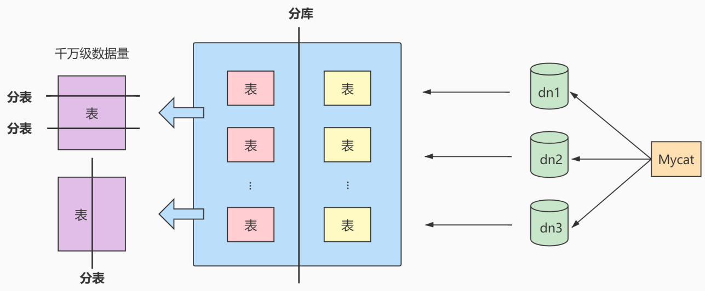

下面补充一下数据库分片的两种常见方案：

- 客户端代理： 分片逻辑在应用端，封装在jar包中，通过修改或者封装JDBC层来实现。 当当网的 Sharding-JDBC 、阿里的TDDL是两种比较常用的实现。
- 中间件代理： 在应用和数据中间加了一个代理层。分片逻辑统一维护在中间件服务中。我们现在 谈的 Mycat 、360的Atlas、网易的DDB等等都是这种架构的实现。


## 十三、事务基础知识

### 1. 数据库事务概述

事务是数据库区别于文件系统的重要特性之一，当我们有了事务就会让数据库始终保持一致性，同时我们还能通过事务的机制恢复到某个时间点，这样可以保证已提交到数据库的修改不会因为系统崩溃而丢失。


#### 1.1 存储引擎支持情况

SHOW ENGINES 命令来查看当前 MySQL 支持的存储引擎都有哪些，以及这些存储引擎是否支持事务。

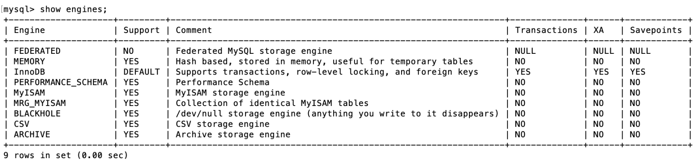

能看出在 MySQL 中，只有InnoDB 是支持事务的。


#### 1.2 基本概念

**事务**：一组逻辑操作单元，使数据从一种状态变换到另一种状态。

**事务处理的原则**：保证所有事务都作为 一个工作单元 来执行，即使出现了故障，都不能改变这种执行方式。当在一个事务中执行多个操作时，要么所有的事务都被提交( commit )，那么这些修改就 永久 地保 存下来；要么数据库管理系统将 放弃 所作的所有 修改 ，整个事务回滚( rollback )到最初状态。

```mysql
#案例：AA用户给BB用户转账100
update account set money = money - 100 where name = 'AA';

#服务器岩机
update account set money = money + 100 where name = 'BB';
```


#### 1.3 事务的ACID特性

- 原子性（atomicity）：

原子性是指事务是一个不可分割的工作单位，要么全部提交，要么全部失败回滚。


- 一致性（consistency）：


（国内很多网站上对一致性的阐述有误，具体你可以参考 Wikipedia 对Consistency的阐述）

根据定义，一致性是指事务执行前后，数据从一个 合法性状态 变换到另外一个 合法性状态 。这种状态 是 语义上 的而不是语法上的，跟具体的业务有关。

那什么是合法的数据状态呢？满足 预定的约束 的状态就叫做合法的状态。通俗一点，这状态是由你自己 来定义的（比如满足现实世界中的约束）。满足这个状态，数据就是一致的，不满足这个状态，数据就 是不一致的！如果事务中的某个操作失败了，系统就会自动撤销当前正在执行的事务，返回到事务操作 之前的状态。

**举例1**：A账户有200元，转账300元出去，此时A账户余额为-100元。你自然就发现了此时数据是不一致的，为什么呢？因为你定义了一个状态，余额这列必须>=0。

**举例2**：A账户200元，转账50元给B账户，A账户的钱扣了，但是B账户因为各种意外，余额并没有增加。你也知道此时数据是不一致的，为什么呢？因为你定义了一个状态，要求A+B的总余额必须不变。

**举例3**：在数据表中我们将姓名字段设置为唯一性约束，这时当事务进行提交或者事务发生回滚的时候，如果数据表中的姓名不唯一，就破坏了事务的一致性要求。


- 隔离型（isolation）：


事务的隔离性是指一个事务的执行 不能被其他事务干扰 ，即一个事务内部的操作及使用的数据对 并发 的 其他事务是隔离的，并发执行的各个事务之间不能互相干扰。

如果无法保证隔离性会怎么样？假设A账户有200元，B账户0元。A账户往B账户转账两次，每次金额为50 元，分别在两个事务中执行。如果无法保证隔离性，会出现下面的情形：

```mysql
UPDATE accounts SET money = money - 50 WHERE NAME = 'AA';

UPDATE accounts SET money = money + 50 WHERE NAME = 'BB';
```

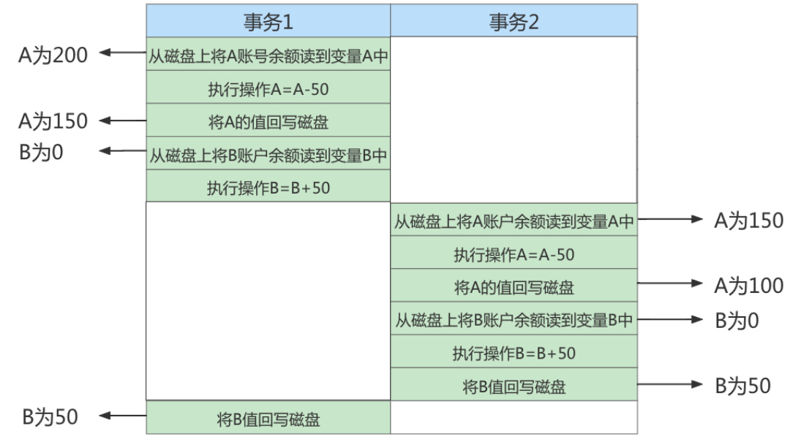


- 持久性（durability）：


持久性是指一个事务一旦被提交，它对数据库中数据的改变就是 永久性的 ，接下来的其他操作和数据库 故障不应该对其有任何影响。

持久性是通过 事务日志 来保证的。日志包括了 重做日志 和 回滚日志 。当我们通过事务对数据进行修改 的时候，首先会将数据库的变化信息记录到重做日志中，然后再对数据库中对应的行进行修改。这样做 的好处是，即使数据库系统崩溃，数据库重启后也能找到没有更新到数据库系统中的重做日志，重新执 行，从而使事务具有持久性。

> 总结
>
> ACID是事务的四大特性，在这四个特性中，原子性是基础，隔离性是手段，一致性是约束条件，而持久性是我们的目的。
>
> 数据库事务，其实就是数据库设计者为了方便起见，把需要保证原子性、隔离性、一致性和持久性的一个或多个数据库操作称为一个事务。


#### 1.4 事务的状态

我们现在知道 事务 是一个抽象的概念，它其实对应着一个或多个数据库操作，MySQL根据这些操作所执 行的不同阶段把 事务 大致划分成几个状态：

- 活动的（active）
  事务对应的数据库操作正在执行过程中时，我们就说该事务处在 活动的 状态。

- 部分提交的（partially committed）
  当事务中的最后一个操作执行完成，但由于操作都在内存中执行，所造成的影响并 没有刷新到磁盘 时，我们就说该事务处在 部分提交的 状态。

- 失败的（failed）
  当事务处在 活动的 或者 部分提交的 状态时，可能遇到了某些错误（数据库自身的错误、操作系统 错误或者直接断电等）而无法继续执行，或者人为的停止当前事务的执行，我们就说该事务处在 失 败的 状态。
- 中止的（aborted）
  如果事务执行了一部分而变为 失败的 状态，那么就需要把已经修改的事务中的操作还原到事务执 行前的状态。换句话说，就是要撤销失败事务对当前数据库造成的影响。我们把这个撤销的过程称 之为 回滚 。当 回滚 操作执行完毕时，也就是数据库恢复到了执行事务之前的状态，我们就说该事 务处在了 中止的 状态。
- 提交的（committed）
  当一个处在 部分提交的 状态的事务将修改过的数据都 同步到磁盘 上之后，我们就可以说该事务处 在了 提交的 状态。

一个基本的状态转换图如下所示：

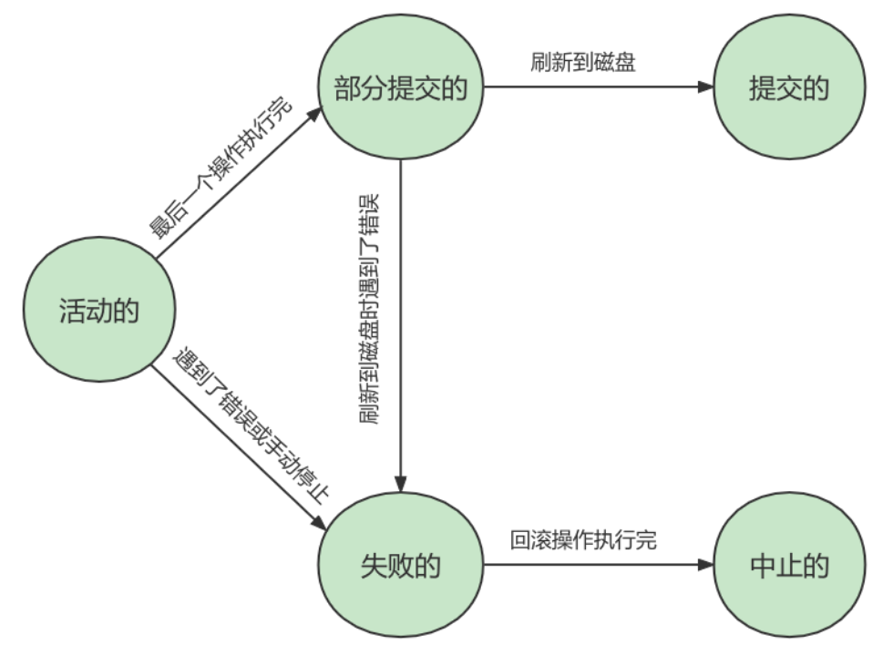


### 2. 如何使用事务

使用事务有两种方式，分别为 显式事务 和 隐式事务 。


#### 2.1 显式事务

**步骤1**： START TRANSACTION 或者 BEGIN ，作用是显式开启一个事务。

> mysql> BEGIN;
>
> #或者
>
> mysql> START TRANSACTION;

START TRANSACTION 语句相较于 BEGIN 特别之处在于，后边能跟随几个 修饰符 ：

1. READ ONLY ：标识当前事务是一个 只读事务 ，也就是属于该事务的数据库操作只能读取数据，而不能修改数据。
   **补充**：只读事务中只是不允许修改那些其他事务也能访问到的表中的数据，对于临时表来说（我们使用CREATE TMEPORARY TABLE创建的表），由于它们只能在当前会话中可见，所以只读事务其实也是可以对临时表进行增、删、改操作的。
2. READ WRITE ：标识当前事务是一个 读写事务 ，也就是属于该事务的数据库操作既可以读取数据，也可以修改数据。
3. WITH CONSISTENT SNAPSHOT ：启动一致性读。

注意：

- READ ONLY和READ WRITE是用来设置所谓的事务访问模式的，就是以只读还是读写的方式来访问数据库中的数据，一个事务的访问模式不能同时既设置为只读的也设置为读写的，所以不能同时把READ ONLY和 READ WRITE放到START TRANSACTION语句后边。
- 如果我们不显式指定事务的访问模式，那么该事务的访问模式就是读写模式。


**步骤2**：一系列事务中的操作（主要是DML，不含DDL）


**步骤3**：提交事务 或 中止事务（即回滚事务）

```mysql
# 提交事务。当提交事务后，对数据库的修改是永久性的。
mysql> COMMIT;
```


```mysql
# 回滚事务。即撤销正在进行的所有没有提交的修改
mysql> ROLLBACK;

# 将事务回滚到某个保存点。
mysql> ROLLBACK TO [SAVEPOINT]
```

其中关于SAVEPOINT相关操作有：

```mysql
#在事务中创建保存点，方便后续针对保存点进行回滚。一个事务中可以存在多个保存点。
SAVEPOINT 保存点名称；
```

```mysql
#删除某个保存点。
RELEASE SAVEPOINT 保存点名称：
```


#### 2.2 隐式事务

MySQL中有一个系统变量 autocommit ：

```mysql
mysql> SHOW VARIABLES LIKE 'autocommit';
+---------------+-------+
| Variable_name | Value |
+---------------+-------+
| autocommit    | ON 	|
+---------------+-------+
1 row in set (0.01 sec)
```

当然，如果我们想关闭这种 自动提交 的功能，可以使用下边两种方法之一：

- 显式的的使用 START TRANSACTION 或者 BEGIN 语句开启一个事务。这样在本次事务提交或者回滚前会暂时关闭掉自动提交的功能。
- 把系统变量 autocommit 的值设置为 OFF ，就像这样：

```mysql
SET autocommit = OFF;
#或
SET autocommit = 0;
```


#### 2.3 隐式提交数据的情况

- 数据定义语言（Data definition language，缩写为：DDL）
  数据库对象，指的就是数据库、表、视图、存储过程等结构。当我们使用CREATE、ALTER、DROP等语句去修改数据库对象时，就会隐式的提交前边语句所属于的事务。
- 隐式使用或修改mysql数据库中的表
  当我门使用ALTER USER、CREAT EUSER、DROP USER、GRANT、RENAME USER、REVOKE、SET PASSWORD等语句时也会隐式的提交前边语句所属于的事务。
- 事务控制或关于锁定的语句
  ① 当我们在一个事务还没提交或者回滚时就又使用 START TRANSACTION 或者 BEGIN 语句开启了 另一个事务时，会 隐式的提交 上一个事务。
  ② 当前的 autocommit 系统变量的值为 OFF ，我们手动把它调为 ON 时，也会 隐式的提交 前边语 句所属的事务。
  ③ 使用 LOCK TABLES 、 UNLOCK TABLES 等关于锁定的语句也会 隐式的提交 前边语句所属的事 务。
- 加载数据的语句
  使用LOAD DATA语句来批量往数据库中导入数据时，也会隐式的提交前边语句所属的事务。
- 关于MySQL复制的一些语句
  使用START SLAVE、STOP SLAVE、RESET SLAVE、CHANGE MASTER TO等语句时会隐式的提交前边语句所属的事务。
- 其它的一些语句
  使用ANALYZE TABLE、CACHE INDEX、CHECK TABLE、FLUSH、LOAD INDEX INTO CACHE、 OPTIMIZE TABLE、REPAIR TABLE、RESET等语句也会隐式的提交前边语句所属的事务。


#### 2.4 使用举例1：提交与回滚

我们看下在 MySQL 的默认状态下，下面这个事务最后的处理结果是什么。

**情况1：**

```mysql
CREATE TABLE user(name varchar(20), PRIMARY KEY (name)) ENGINE=InnoDB;

BEGIN;
INSERT INTO user SELECT '张三';
COMMIT;

BEGIN;
INSERT INTO user SELECT '李四';
INSERT INTO user SELECT '李四';
ROLLBACK;

SELECT * FROM user;
```

运行结果（1 行数据）：

```mysql
mysql> commit;
Query OK, 0 rows affected (0.00 秒)

mysql> BEGIN;
Query OK, 0 rows affected (0.00 秒)

mysql> INSERT INTO user SELECT '李四';
Query OK, 1 rows affected (0.00 秒)

mysql> INSERT INTO user SELECT '李四';
Duplicate entry '李四' for key 'user.PRIMARY'

mysql> ROLLBACK;
Query OK, 0 rows affected (0.01 秒)

mysql> select * from user;
+--------+
| name   |
+--------+
| 张三    |
+--------+
1 行于数据集 (0.01 秒)
```


**情况2：**

```mysql
CREATE TABLE user (name varchar(20), PRIMARY KEY (name)) ENGINE=InnoDB;

BEGIN;
INSERT INTO user SELECT '张三';
COMMIT;

INSERT INTO user SELECT '李四';
INSERT INTO user SELECT '李四';
ROLLBACK;
```

运行结果（2 行数据）：

```mysql
mysql> SELECT * FROM user;
+--------+
| name   |
+--------+
| 张三    |
| 李四    |
+--------+
2 行于数据集 (0.01 秒)
```


**情况3：**

```mysql
CREATE TABLE user(name varchar(255), PRIMARY KEY (name)) ENGINE=InnoDB;

SET @@completion_type = 1;
BEGIN;
INSERT INTO user SELECT '张三';
COMMIT;

INSERT INTO user SELECT '李四';
INSERT INTO user SELECT '李四';
ROLLBACK;

SELECT * FROM user;
```

运行结果（1 行数据）：

```mysql
mysql> SELECT * FROM user;
+--------+
| name   |
+--------+
| 张三    |
+--------+
1 行于数据集 (0.01 秒)
```

> 当我们设置 autocommit=0 时，不论是否采用 START TRANSACTION 或者 BEGIN 的方式来开启事 务，都需要用 COMMIT 进行提交，让事务生效，使用 ROLLBACK 对事务进行回滚。 
>
> 当我们设置 autocommit=1 时，每条 SQL 语句都会自动进行提交。 不过这时，如果你采用 START TRANSACTION 或者 BEGIN 的方式来显式地开启事务，那么这个事务只有在 COMMIT 时才会生效， 在 ROLLBACK 时才会回滚。


### 3. 事务隔离级别

MySQL是一个 客户端／服务器 架构的软件，对于同一个服务器来说，可以有若干个客户端与之连接，每 个客户端与服务器连接上之后，就可以称为一个会话（ Session ）。每个客户端都可以在自己的会话中 向服务器发出请求语句，一个请求语句可能是某个事务的一部分，也就是对于服务器来说可能同时处理 多个事务。事务有 隔离性 的特性，理论上在某个事务 对某个数据进行访问 时，其他事务应该进行 排 队 ，当该事务提交之后，其他事务才可以继续访问这个数据。但是这样对 性能影响太大 ，我们既想保持 事务的隔离性，又想让服务器在处理访问同一数据的多个事务时 性能尽量高些 ，那就看二者如何权衡取 舍了。


#### 3.1 数据准备

我们需要创建一个表：

```mysql
CREATE TABLE student (
    studentno INT,
    name VARCHAR(20),
    class varchar(20),
    PRIMARY KEY (studentno)
) Engine=InnoDB CHARSET=utf8;
```

然后向这个表里插入一条数据：

```mysql
INSERT INTO student VALUES(1, '小谷', '1班');
```

现在表里的数据就是这样的：

```mysql
mysql> select * from student;
+-----------+--------+-------+
| studentno | name   | class |
+-----------+--------+-------+
| 1 		| 小谷    | 1班   |
+-----------+--------+-------+
1 row in set (0.00 sec)
```


#### 3.2 数据并发问题

针对事务的隔离性和并发性，我们怎么做取舍呢？先看一下访问相同数据的事务在 不保证串行执行 （也 就是执行完一个再执行另一个）的情况下可能会出现哪些问题：

##### 1. 脏写（ Dirty Write ）

对于两个事务 Session A、Session B，如果事务Session A 修改了 另一个 未提交 事务Session B 修改过 的数 据，那就意味着发生了 脏写


SessionA和SessionB各开启了一个事务，SessionB中的事务先将studentno列为1的记录的name列更新为李四，然后SessionA中的事务接着又把这条studentno列为1的记录的name列更新为张三。如果之后SessionB中的事务进行了回滚，那么SessionA中的更新也将不复存在，这种现象就称之为脏写。这时SessionA中的事务就没有效果了，明明把数据更新了，最后也提交事务了，最后看到的数据什么变化也没有。这里大家对事务的隔离级比较了解的话，会发现默认隔离级别下，上面SessionA中的更新语句会处于等待状态，这里只是跟大家说明一下会出现这样现象。


##### 2. 脏读（ Dirty Read ）

对于两个事务 Session A、Session B，Session A 读取 了已经被 Session B 更新 但还 没有被提交 的字段。 之后若 Session B 回滚 ，Session A 读取 的内容就是 临时且无效 的。


Session A和Session B各开启了一个事务，Session B中的事务先将studentno列为1的记录的name列更新 为'张三'，然后Session A中的事务再去查询这条studentno为1的记录，如果读到列name的值为'张三'，而 Session B中的事务稍后进行了回滚，那么Session A中的事务相当于读到了一个不存在的数据，这种现象 就称之为 脏读 。


##### 3. 不可重复读（ Non-Repeatable Read ）

对于两个事务Session A、Session B，Session A 读取 了一个字段，然后 Session B 更新 了该字段。 之后 Session A 再次读取 同一个字段， 值就不同 了。那就意味着发生了不可重复读。

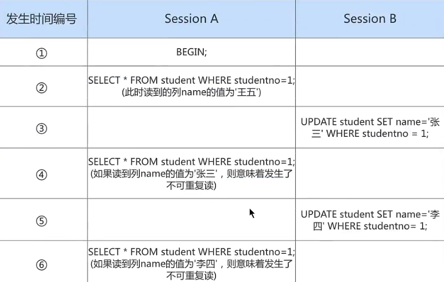

我们在Session B中提交了几个 隐式事务 （注意是隐式事务，意味着语句结束事务就提交了），这些事务 都修改了studentno列为1的记录的列name的值，每次事务提交之后，如果Session A中的事务都可以查看 到最新的值，这种现象也被称之为 不可重复读 。


##### 4. 幻读（ Phantom ）

对于两个事务Session A、Session B, Session A 从一个表中 读取 了一个字段, 然后 Session B 在该表中 插 入 了一些新的行。 之后, 如果 Session A 再次读取 同一个表, 就会多出几行。那就意味着发生了幻读。

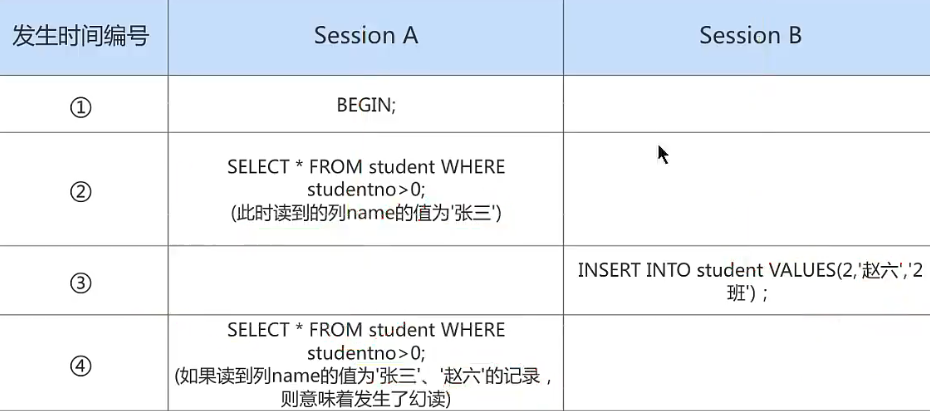

Session A中的事务先根据条件 studentno > 0这个条件查询表student，得到了name列值为'张三'的记录； 之后Session B中提交了一个 隐式事务 ，该事务向表student中插入了一条新记录；之后Session A中的事务 再根据相同的条件 studentno > 0查询表student，得到的结果集中包含Session B中的事务新插入的那条记 录，这种现象也被称之为 幻读 。我们把新插入的那些记录称之为 幻影记录 。

**注意1:**
有的同学会有疑问，那如果SessionB中删除了一些符合studentno>0的记录而不是插入新记录，那SessionA 之后再根据studentno>0的条件读取的记录变少了，这种现象算不算幻读呢？这种现象不属于幻读，幻读强调的是一个事务按照某个相同条件多次读取记录时，后读取时读到了之前没有读到的记录。

**注意2:**
那对于先前已经读到的记录，之后又读取不到这种情况，算啥呢？这相当于对每一条记录都发生了不可重复读的现象。幻读只是重点强调了读取到了之前读取没有获取到的记录。


#### 3.3 SQL中的四种隔离级别

上面介绍了几种并发事务执行过程中可能遇到的一些问题，这些问题有轻重缓急之分，我们给这些问题 按照严重性来排一下序：

```mysql
脏写 > 脏读 > 不可重复读 > 幻读
```

我们愿意舍弃一部分隔离性来换取一部分性能在这里就体现在：设立一些隔离级别，隔离级别越低，并发问题发生的就越多。 SQL标准 中设立了4个 隔离级别 ：

- READ UNCOMMITTED ：读未提交，在该隔离级别，所有事务都可以看到其他未提交事务的执行结果。不能避免脏读、不可重复读、幻读。
- READ COMMITTED ：读已提交，它满足了隔离的简单定义：一个事务只能看见已经提交事务所做的改变。这是大多数数据库系统的默认隔离级别（但不是MySQL默认的）。可以避免脏读，但不可重复读、幻读问题仍然存在。
- REPEATABLE READ ：可重复读，事务A在读到一条数据之后，此时事务B对该数据进行了修改并提交，那么事务A再读该数据，读到的还是原来的内容。可以避免脏读、不可重复读，但幻读问题仍然存在。这是MySQL的默认隔离级别。
- SERIALIZABLE ：可串行化，确保事务可以从一个表中读取相同的行。在这个事务持续期间，禁止其他事务对该表执行插入、更新和删除操作。所有的并发问题都可以避免，但性能十分低下。能避免脏读、不可重复读和幻读。

SQL标准 中规定，针对不同的隔离级别，并发事务可以发生不同严重程度的问题，具体情况如下：


脏写 怎么没涉及到？因为脏写这个问题太严重了，不论是哪种隔离级别，都不允许脏写的情况发生。

不同的隔离级别有不同的现象，并有不同的锁和并发机制，隔离级别越高，数据库的并发性能就越差，4 种事务隔离级别与并发性能的关系如下：

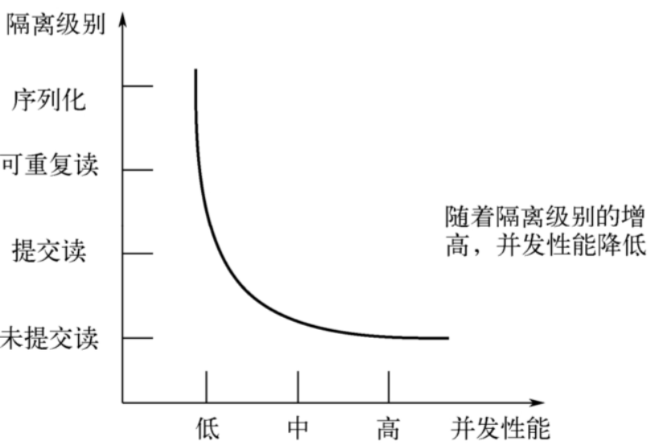


#### 3.4 MySQL支持的四种隔离级别

不同的数据库厂商对SQL标准中规定的四种隔离级别支持不一样。比如，Oracle就只支持READ COMMITTED（默认隔离级别）和SERIALIZABLE隔离级别。MySQL虽然支持4种隔离级别，但与SQL标准中所规定的各级隔离级别允许发生的问题却有些出入，MySQL在REPEATABLEREAD隔离级别下，是可以禁止幻读问题的发生的，禁止幻读的原因我们在第16章讲解。

MySQL的默认隔离级别为REPEATABLE READ，我们可以手动修改一下事务的隔离级别。

```mysql
# 查看隔离级别，MySQL 5.7.20的版本之前：
mysql> SHOW VARIABLES LIKE 'tx_isolation';
+---------------+-----------------+
| Variable_name | Value           |
+---------------+-----------------+
| tx_isolation  | REPEATABLE-READ |
+---------------+-----------------+
1 row in set (0.00 sec)

# MySQL 5.7.20版本之后，引入transaction_isolation来替换tx_isolation

# 查看隔离级别，MySQL 5.7.20的版本及之后：
mysql> SHOW VARIABLES LIKE 'transaction_isolation';
+-----------------------+-----------------+
| Variable_name 		| Value			  |
+-----------------------+-----------------+
| transaction_isolation | REPEATABLE-READ |
+-----------------------+-----------------+
1 row in set (0.02 sec)

#或者不同MySQL版本中都可以使用的：
SELECT @@transaction_isolation;
```


#### 3.5 如何设置事务的隔离级别

通过下面的语句修改事务的隔离级别：

```mysql
SET [GLOBAL|SESSION] TRANSACTION ISOLATION LEVEL 隔离级别;
#其中，隔离级别格式：
> READ UNCOMMITTED
> READ COMMITTED
> REPEATABLE READ
> SERIALIZABLE
```

或者：

```mysql
SET [GLOBAL|SESSION] TRANSACTION_ISOLATION = '隔离级别'
#其中，隔离级别格式：
> READ-UNCOMMITTED
> READ-COMMITTED
> REPEATABLE-READ
> SERIALIZABLE
```

关于设置时使用GLOBAL或SESSION的影响：

1. 使用 GLOBAL 关键字（在全局范围影响）：

```mysql
SET GLOBAL TRANSACTION ISOLATION LEVEL SERIALIZABLE;
#或
SET GLOBAL TRANSACTION_ISOLATION = 'SERIALIZABLE';
```

则：

- 当前已经存在的会话无效
- 只对执行完该语句之后产生的会话起作用


2. 使用 SESSION 关键字（在会话范围影响）：

```mysql
SET SESSION TRANSACTION ISOLATION LEVEL SERIALIZABLE;
#或
SET SESSION TRANSACTION_ISOLATION = 'SERIALIZABLE';
```

则：

- 对当前会话的所有后续的事务有效
- 如果在事务之间执行，则对后续的事务有效
- 该语句可以在已经开启的事务中间执行，但不会影响当前正在执行的事务

如果在服务器启动时想改变事务的默认隔离级别，可以修改启动参数transaction_isolation的值。比如，在启动服务器时指定了transaction_isolation=SERIALIZABLE，那么事务的默认隔离级别就从原来的 REPEATABLE-READ变成了SERIALIZABLE。

> 小结： 数据库规定了多种事务隔离级别，不同隔离级别对应不同的干扰程度，隔离级别越高，数据一致性 就越好，但并发性越弱。


#### 3.6 不同隔离级别举例

**演示1. 读未提交之脏读**

设置隔离级别为未提交读：

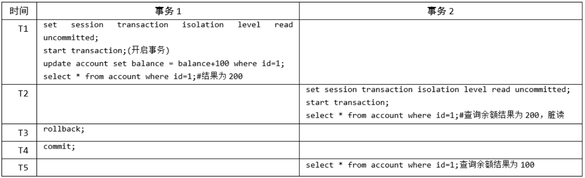

事务1和事务2的执行流程如下：

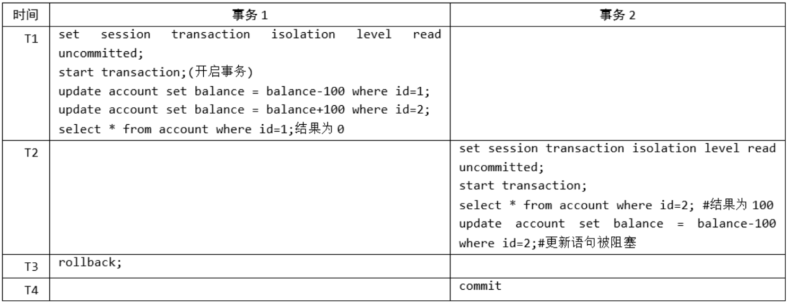


**演示2：读已提交**

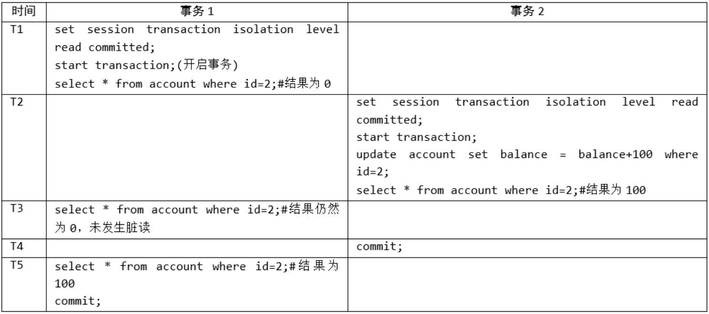

设置隔离级别为可重复读，事务的执行流程如下：

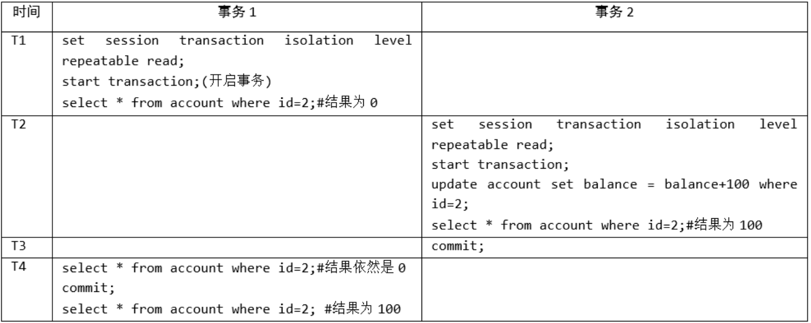


**演示4：幻读**

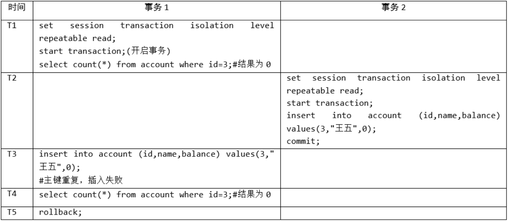


### 4. 事务的常见分类

从事务理论的角度来看，可以把事务分为以下几种类型：

- 扁平事务（Flat Transactions）
- 带有保存点的扁平事务（Flat Transactions with Savepoints）
- 链事务（Chained Transactions）
- 嵌套事务（Nested Transactions）
- 分布式事务（Distributed Transactions）


## 十四、MySQL事务日志

事务有4种特性：原子性、一致性、隔离性和持久性。那么事务的四种特性到底是基于什么机制实现呢？

- 事务的隔离性由 锁机制 实现。 
- 而事务的原子性、一致性和持久性由事务的 redo 日志和undo 日志来保证。 
  - REDO LOG 称为 重做日志 ，提供再写入操作，恢复提交事务修改的页操作，用来保证事务的持 久性。
  - UNDO LOG 称为 回滚日志 ，回滚行记录到某个特定版本，用来保证事务的原子性、一致性。 

有的DBA或许会认为UNDO是REDO的逆过程，其实不然。REDO和UNDO都可以视为是一种恢复操作，但是：

- redo log：是存储引擎层(innodb)生成的日志，记录的是”物理级别"上的页修改操作，比如页号xxx、偏移量yyy 写入了'zzz'数据。主要为了保证数据的可靠性；
- undo log：是存储引擎层（innodb)生成的日志，记录的是逻辑操作日志，比如对某一行数据进行了INSERT语句操作，那么undo log就记录一条与之相反的DELETE操作。主要用于事务的回滚（undolog记录的是每个修改操作的逆操作）和一致性非锁定读(undo log回滚行记录到某种特定的版本---MVCC，即多版本并发控制)。


### 1. redo日志

InnoDB存储引擎是以页为单位来管理存储空间的。在真正访问页面之前，需要把在磁盘上的页缓存到内存中的 BufferPool之后才可以访问。所有的变更都必须先更新缓冲池中的数据，然后缓冲池中的脏页会以一定的频率被刷入磁盘（checkPoint机制），通过缓冲池来优化CPU和磁盘之间的鸿沟，这样就可以保证整体的性能不会下降太快。


#### 1.1 为什么需要REDO日志

一方面，缓冲池可以帮助我们消除CPU和磁盘之间的鸿沟，checkpoint机制可以保证数据的最终落盘，然 而由于checkpoint 并不是每次变更的时候就触发 的，而是master线程隔一段时间去处理的。所以最坏的情 况就是事务提交后，刚写完缓冲池，数据库宕机了，那么这段数据就是丢失的，无法恢复。

另一方面，事务包含 持久性 的特性，就是说对于一个已经提交的事务，在事务提交后即使系统发生了崩 溃，这个事务对数据库中所做的更改也不能丢失。

那么如何保证这个持久性呢？ 一个简单的做法 ：在事务提交完成之前把该事务所修改的所有页面都刷新 到磁盘，但是这个简单粗暴的做法有些问题

- **修改量与刷新磁盘工作量严重不成比例**
  有时候我们仅仅修改了某个页面中的一个字节，但是我们知道在InnoDB中是以页为单位来进行磁盘lO的，也就是说我们在该事务提交时不得不将一个完整的页面从内存中刷新到磁盘，我们又知道一个页面默认是16KB大小，只修改一个字节就要刷新16KB的数据到磁盘上显然是太小题大做了。
- **随机IO刷新较慢**
  一个事务可能包含很多语句，即使是一条语句也可能修改许多页面，假如该事务修改的这些页面可能并不相邻，这就意味着在将某个事务修改的BufferPool中的页面刷新到磁盘时，需要进行很多的随机IO，随机IO比顺序I0要慢，尤其对于传统的机械硬盘来说。

另一个解决的思路 ：我们只是想让已经提交了的事务对数据库中数据所做的修改永久生效，即使后来系 统崩溃，在重启后也能把这种修改恢复出来。所以我们其实没有必要在每次事务提交时就把该事务在内 存中修改过的全部页面刷新到磁盘，只需要把 修改 了哪些东西 记录一下 就好。比如，某个事务将系统 表空间中 第10号 页面中偏移量为 100 处的那个字节的值 1 改成 2 。我们只需要记录一下：将第0号表 空间的10号页面的偏移量为100处的值更新为 2 。

InnoDB引l擎的事务采用了WAL技术（Write-AheadLogging），这种技术的思想就是先写日志，再写磁盘，只有日志写入成功，才算事务提交成功，这里的日志就是redolog。当发生岩机且数据未刷到磁盘的时候，可以通过redolog来恢复，保证ACID中的D，这就是redolog的作用。

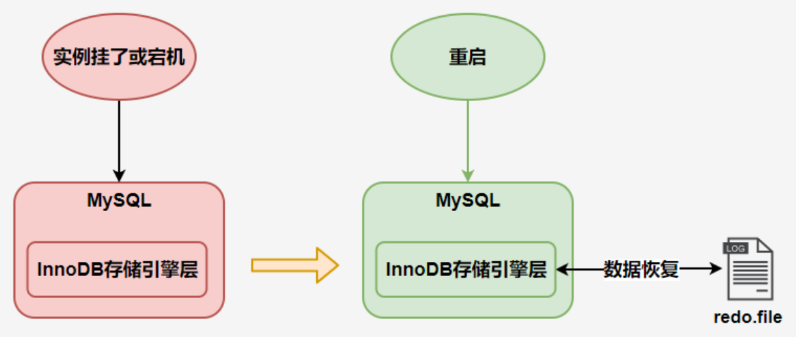


#### 1.2 REDO日志的好处、特点

**好处**

- redo日志降低了刷盘频率
- redo日志占用的空间非常小
  存储表空间ID、页号、偏移量以及需要更新的值，所需的存储空间是很小的，刷盘快。


**特点**

- redo日志是顺序写入磁盘的
  在执行事务的过程中，每执行一条语句，就可能产生若干条redo日志，这些日志是按照产生的顺序写入磁盘的，也就是使用顺序I0，效率比随机I0快。
- 事务执行过程中，redo log不断记录
  redolog跟binlog的区别，redolog是存储引擎层产生的，而binlog是数据库层产生的。假设一个事务，对表做 10万行的记录插入，在这个过程中，一直不断的往redolog顺序记录，而binlog不会记录，直到这个事务提交，才会一次写入到binlog文件中。


#### 1.3 redo的组成

Redo log可以简单分为以下两个部分： 

- 重做日志的缓冲 (redo log buffer) ，保存在内存中，是易失的。

在服务器启动时就向操作系统申请了一大片称之为redologbuffer的连续内存空间，翻译成中文就是redo日志缓冲区。这片内存空间被划分成若干个连续的redologblock。一个redologblock占用512字节大小。

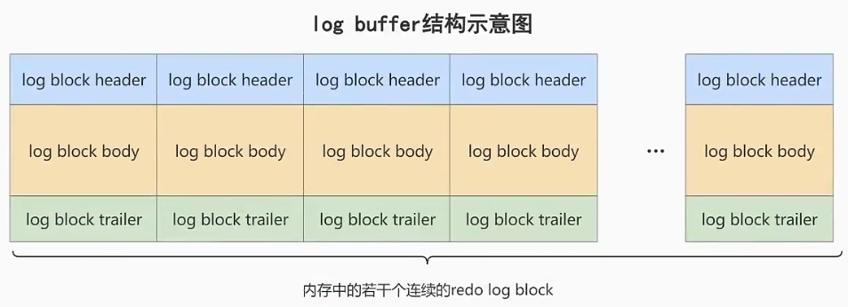


**参数设置：innodb_log_buffer_size：**

redo log buffer 大小，默认 16M ，最大值是4096M，最小值为1M。

```mysql
mysql> show variables like '%innodb_log_buffer_size%';
+------------------------+----------+
| Variable_name 		 | Value 	|
+------------------------+----------+
| innodb_log_buffer_size | 16777216 |
+------------------------+----------+
```

- 重做日志文件 (redo log file) ，保存在硬盘中，是持久的。


#### 1.4 redo的整体流程

以一个更新事务为例，redo log 流转过程，如下图所示：

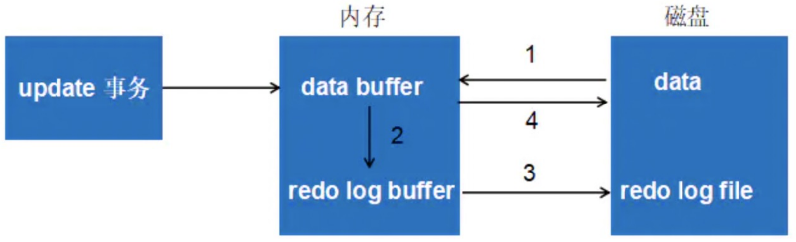

- 第1步：先将原始数据从磁盘中读入内存中来，修改数据的内存拷贝
- 第2步：生成一条重做日志并写入redo log buffer，记录的是数据被修改后的值
- 第3步：当事务commit时，将redo log buffer中的内容刷新到 redo log file，对 redo log file采用追加写的方式
- 第4步：定期将内存中修改的数据刷新到磁盘中

> 体会： Write-Ahead Log(预先日志持久化)：在持久化一个数据页之前，先将内存中相应的日志页持久化。


#### 1.5 redo log的刷盘策略

redo log的写入并不是直接写入磁盘的，InnoDB引擎会在写redo log的时候先写redo log buffer，之后以 一 定的频率 刷入到真正的redo log file 中。这里的一定频率怎么看待呢？这就是我们要说的刷盘策略。

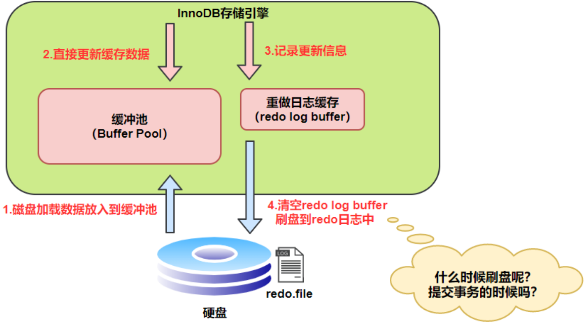

注意，redo log buffer刷盘到redo log file的过程并不是真正的刷到磁盘中去，只是刷入到 文件系统缓存 （page cache）中去（这是现代操作系统为了提高文件写入效率做的一个优化），真正的写入会交给系 统自己来决定（比如page cache足够大了）。那么对于InnoDB来说就存在一个问题，如果交给系统来同 步，同样如果系统宕机，那么数据也丢失了（虽然整个系统宕机的概率还是比较小的）。

针对这种情况，InnoDB给出 innodb_flush_log_at_trx_commit 参数，该参数控制 commit提交事务 时，如何将 redo log buffer 中的日志刷新到 redo log file 中。它支持三种策略：

- 设置为0 ：表示每次事务提交时不进行刷盘操作。（系统默认master thread每隔1s进行一次重做日志的同步）
- 设置为1 ：表示每次事务提交时都将进行同步，刷盘操作（ 默认值 ） 
- 设置为2 ：表示每次事务提交时都只把 redo log buffer 内容写入 page cache，不进行同步。由os自 己决定什么时候同步到磁盘文件。

另外，InnoDB存储引擎有一个后台线程，每隔1秒，就会把redologbuffer中的内容写到文件系统缓存（pagecache），然后调用刷盘操作。

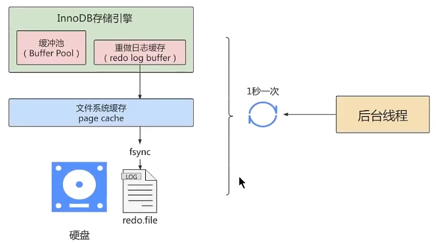

也就是说，一个没有提交事务的redolog记录，也可能会刷盘。因为在事务执行过程redolog记录是会写入 redologbuffer中，这些redolog记录会被后台线程刷盘。

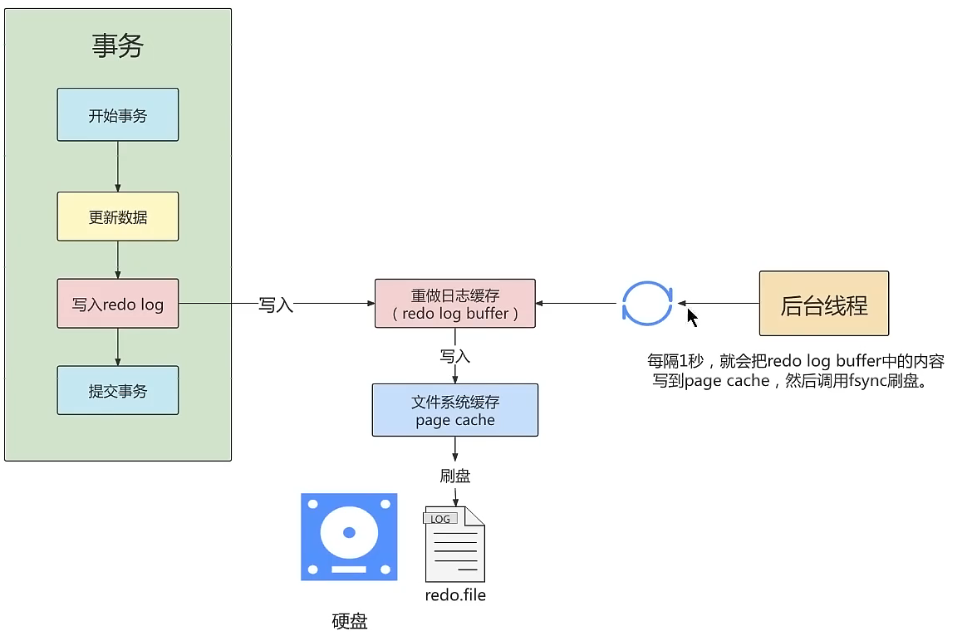

除了后台线程每秒1次的轮询操作，还有一种情况，当redologbuffer占用的空间即将达到 innodb_log_buffer_size（这个参数默认是16M）的一半的时候，后台线程会主动刷盘。


#### 1.6 不同刷盘策略演示

1. 流程图

> innodb_flush_log_at_trx_commit = 1

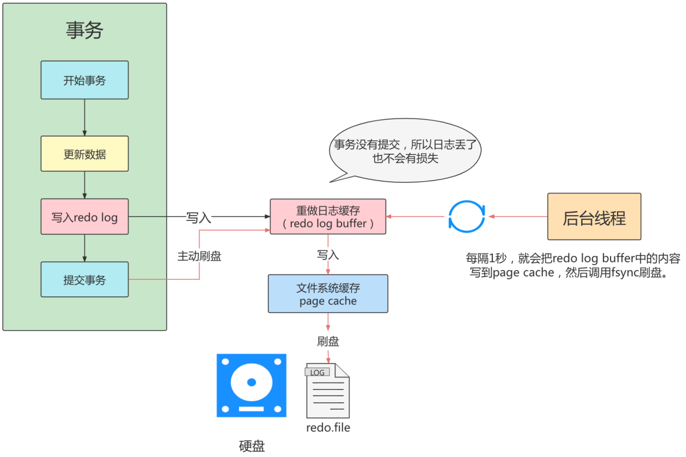

为1时，只要事务提交成功，redolog记录就一定在硬盘里，不会有任何数据丢失。

如果事务执行期间MySQL挂了或宕机，这部分日志丢了，但是事务并没有提交，所以日志丢了也不会有损失。可以保证ACID的D，数据绝对不会丢失，但是效率最差的。

建议使用默认值，虽然操作系统宕机的概率理论小于数据库宕机的概率，但是一般既然使用了事务，那么数据的安全相对来说更重要些


> innodb_flush_log_at_trx_commit = 2

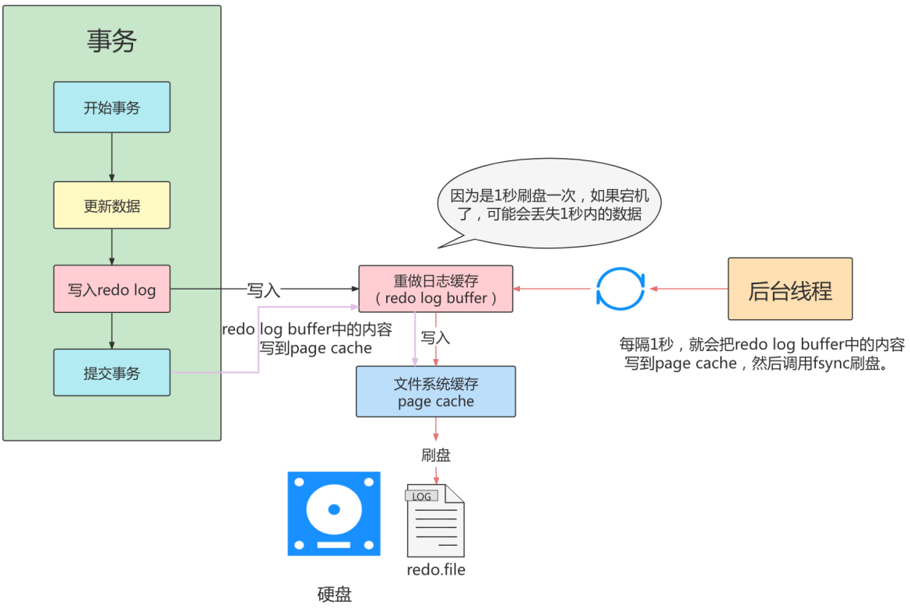

为2时，只要事务提交成功，redologbuffer中的内容只写入文件系统缓存（pagecache）。

如果仅仅只是MySQL挂了不会有任何数据丢失，但是操作系统岩机可能会有1秒数据的丢失，这种情况下无法满足ACID中的D。但是数值2肯定是效率最高的。


> innodb_flush_log_at_trx_commit = 0

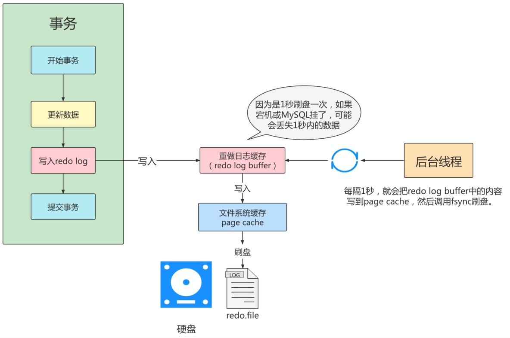

为0时，master thread中每1秒进行一次重做日志的fsync操作，因此实例crash最多丢失1秒钟内的事务。（masterthread是负责将缓冲池中的数据异步刷新到磁盘，保证数据的一致性）

数值0的话，是一种折中的做法，它的I0效率理论是高于1的，低于2的，这种策略也有丢失数据的风险，也无法保证D。


#### 1.7 写入redo log buffer 过程

##### 1. 补充概念：Mini-Transaction

MySQL把对底层页面中的一次原子访问的过程称之为一个Mini-Transaction，简称mtr，比如，向某个索引对应的B+树中插入一条记录的过程就是一个Mini-Transaction。一个所谓的mtr可以包含一组redo日志，在进行崩溃恢复时这一组redo日志作为一个不可分割的整体。

一个事务可以包含若干条语句，每一条语句其实是由若干个 mtr 组成，每一个 mtr 又可以包含若干条 redo日志，画个图表示它们的关系就是这样：

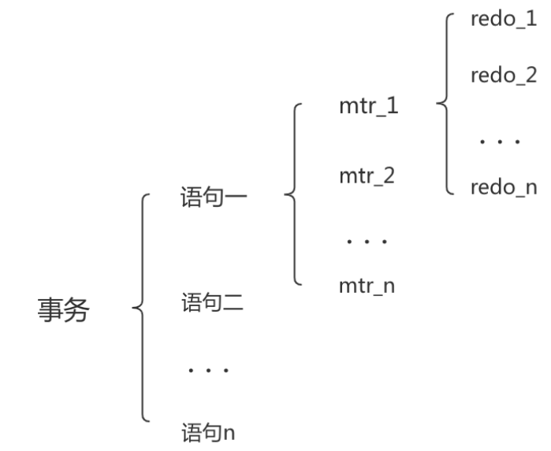


##### 2. redo 日志写入log buffer

向logbuffer中写入redo日志的过程是顺序的，也就是先往前边的block中写，当该block的空闲空间用完之后再往下一个block中写。当我们想往logbuffer中写入redo日志时，第一个遇到的问题就是应该写在哪个block 的哪个偏移量处，所以InnoDB的设计者特意提供了一个称之为buf_free的全局变量，该变量指明后续写入的 redo日志应该写入到logbuffer中的哪个位置，如图所示：

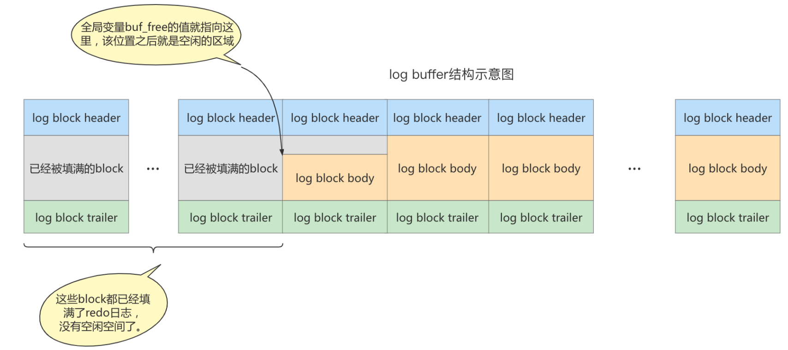

每个mtr都会产生一组redo日志，用示意图来描述一下这些mtr产生的日志情况：

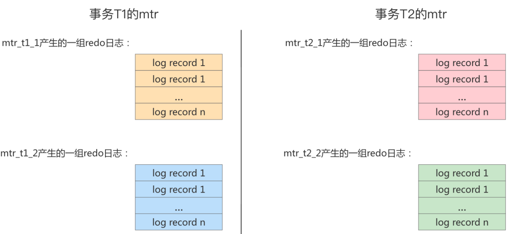

不同的事务可能是 并发 执行的，所以 T1 、 T2 之间的 mtr 可能是 交替执行 的。

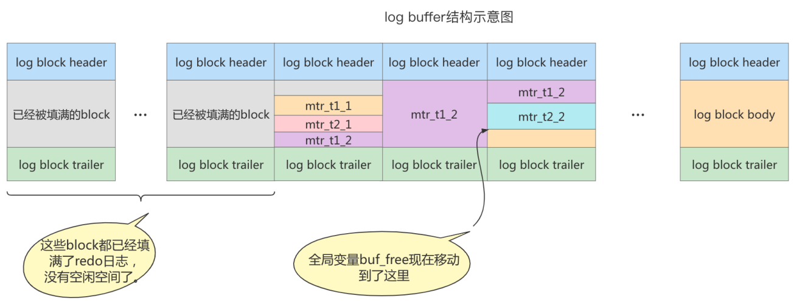


##### 3. redo log block的结构图

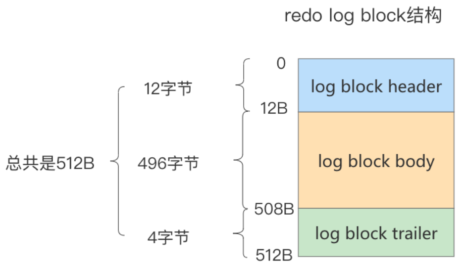

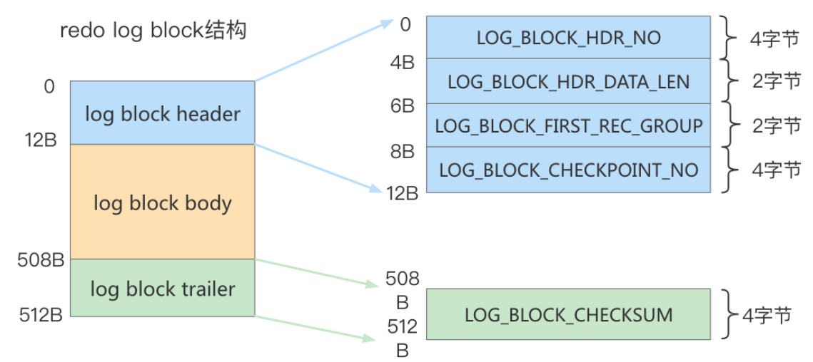


#### 1.8 redo log file

##### 1. 相关参数设置

- innodb_log_group_home_dir ：指定 redo log 文件组所在的路径，默认值为 ./ ，表示在数据库的数据目录下。MySQL的默认数据目录（ var/lib/mysql ）下默认有两个名为 ib_logfile0 和ib_logfile1 的文件，log buffer中的日志默认情况下就是刷新到这两个磁盘文件中。此redo日志文件位置还可以修改。
- innodb_log_files_in_group：指明redo log file的个数，命名方式如：ib_logfile0，iblogfile1...iblogfilen。默认2个，最大100个。

```mysql
mysql> show variables like 'innodb_log_files_in_group';
+---------------------------+-------+
| Variable_name 			| Value |
+---------------------------+-------+
| innodb_log_files_in_group | 2 	|
+---------------------------+-------+
#ib_logfile0
#ib_logfile1
```

- innodb_flush_log_at_trx_commit：控制 redo log 刷新到磁盘的策略，默认为1。
- innodb_log_file_size：单个 redo log 文件设置大小，默认值为 48M 。最大值为512G，注意最大值指的是整个 redo log 系列文件之和，即（innodb_log_files_in_group * innodb_log_file_size ）不能大于最大值512G。

```mysql
mysql> show variables like 'innodb_log_file_size';
+----------------------+----------+
| Variable_name 	   | Value    |
+----------------------+----------+
| innodb_log_file_size | 50331648 |
+----------------------+----------+
```

根据业务修改其大小，以便容纳较大的事务。编辑my.cnf文件并重启数据库生效，如下所示

```
[root@localhost ~]# vim /etc/my.cnf
innodb_log_file_size=200M
```


##### 2. 日志文件组

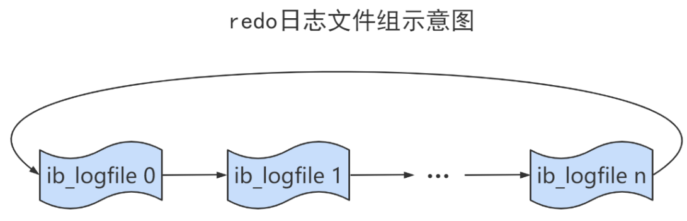

总共的redo日志文件大小其实就是： innodb_log_file_size × innodb_log_files_in_group 。

采用循环使用的方式向redo日志文件组里写数据的话，会导致后写入的redo日志覆盖掉前边写的redo日 志？当然！所以InnoDB的设计者提出了checkpoint的概念。


##### 3. checkpoint

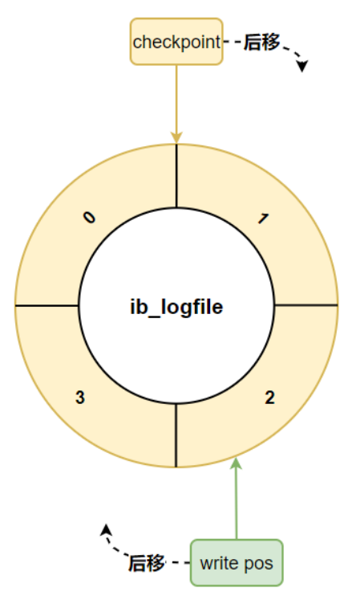

如果 write pos 追上 checkpoint ，表示日志文件组满了，这时候不能再写入新的 redo log记录，MySQL 得 停下来，清空一些记录，把 checkpoint 推进一下。

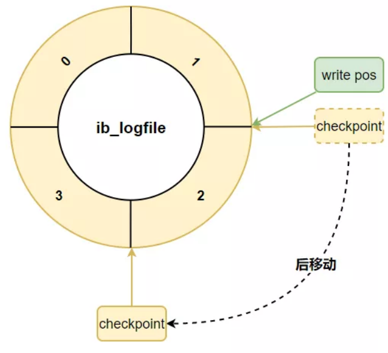


### 2. Undo日志

redo log是事务持久性的保证，undo log是事务原子性的保证。在事务中 更新数据 的 前置操作 其实是要 先写入一个 undo log 。

#### 2.1 如何理解Undo日志

事务需要保证 原子性 ，也就是事务中的操作要么全部完成，要么什么也不做。但有时候事务执行到一半 会出现一些情况，比如：

- 情况一：事务执行过程中可能遇到各种错误，比如 服务器本身的错误 ， 操作系统错误 ，甚至是突然断电 导致的错误。
- 情况二：程序员可以在事务执行过程中手动输入 ROLLBACK 语句结束当前事务的执行。

以上情况出现，我们需要把数据改回原先的样子，这个过程称之为 回滚 ，这样就可以造成一个假象：这 个事务看起来什么都没做，所以符合 原子性 要求。

每当我们要对一条记录做改动时（这里的改动可以指INSERT、DELETE、UPDATE），都需要"留一手”一一把回滚时所需的东西记下来。比如：

- 你插入一条记录时，至少要把这条记录的主键值记下来，之后回滚的时候只需要把这个主键值对应的记录删掉就好了。（对于每个INSERT，InnoDB存储引擎会完成一个DELETE）
- 你删除了一条记录，至少要把这条记录中的内容都记下来，这样之后回滚时再把由这些内容组成的记录插入到表中就好了。（对于每个DELETE，InnoDB存储引|擎会执行一个INSERT）
- 你修改了一条记录，至少要把修改这条记录前的旧值都记录下来，这样之后回滚时再把这条记录更新为旧值就好了。（对于每个UPDATE，InnoDB存储引擎会执行一个相反的UPDATE，将修改前的行放回去）

MySQL把这些为了回滚而记录的这些内容称之为撤销日志或者回滚日志（即undo1og）。注意，由于查询操作（SELECT）并不会修改任何用户记录，所以在查询操作执行时，并不需要记录相应的undo日志。

此外，undolog会产生redolog，也就是undolog的产生会伴随着redolog的产生，这是因为undolog也需要持久性的保护。


#### 2.2 Undo日志的作用

- 作用1：回滚数据

用户对undo日志可能有误解：undo用于将数据库物理地恢复到执行语句或事务之前的样子。但事实并非如此。undo是逻辑日志，因此只是将数据库逻辑地恢复到原来的样子。所有修改都被逻辑地取消了，但是数据结构和页本身在回滚之后可能大不相同。

这是因为在多用户并发系统中，可能会有数十、数百甚至数千个并发事务。数据库的主要任务就是协调对数据记录的并发访问。比如，一个事务在修改当前一个页中某几条记录，同时还有别的事务在对同一个页中另几条记录进行修改。因此，不能将一个页回滚到事务开始的样子，因为这样会影响其他事务正在进行的工作。

- 作用2：MVCC

undo的另一个作用是MVCC，即在lnnoDB存储引擎中MVCC的实现是通过undo来完成。当用户读取一行记录时，若该记录已经被其他事务占用，当前事务可以通过undo读取之前的行版本信息，以此实现非锁定读取。


#### 2.3 undo的存储结构

##### 1. 回滚段与undo页

InnoDB对undo log的管理采用段的方式，也就是 回滚段（rollback segment） 。每个回滚段记录了 1024 个 undo log segment ，而在每个undo log segment段中进行 undo页 的申请。

- 在 InnoDB1.1版本之前 （不包括1.1版本），只有一个rollback segment，因此支持同时在线的事务限制为 1024 。虽然对绝大多数的应用来说都已经够用。
- 从1.1版本开始InnoDB支持最大 128个rollback segment ，故其支持同时在线的事务限制提高到了 128*1024 。

```mysql
mysql> show variables like 'innodb_undo_logs';
+------------------+-------+
| Variable_name    | Value |
+------------------+-------+
| innodb_undo_logs | 128   |
+------------------+-------+
```


##### 2. 回滚段与事务

1. 每个事务只会使用一个回滚段，一个回滚段在同一时刻可能会服务于多个事务。

2. 当一个事务开始的时候，会制定一个回滚段，在事务进行的过程中，当数据被修改时，原始的数据会被复制到回滚段。
3. 在回滚段中，事务会不断填充盘区，直到事务结束或所有的空间被用完。如果当前的盘区不够用，事务会在段中请求扩展下一个盘区，如果所有已分配的盘区都被用完，事务会覆盖最初的盘区或者在回滚段允许的情况下扩展新的盘区来使用。
4. 回滚段存在于undo表空间中，在数据库中可以存在多个undo表空间，但同一时刻只能使用一个undo表空间。
5. 当事务提交时，InnoDB存储引擎会做以下两件事情：
  - 将undo log放入列表中，以供之后的purge操作
  - 判断undo log所在的页是否可以重用，若可以分配给下个事务使用


##### 3. 回滚段中的数据分类

1. 未提交的回滚数据(uncommitted undo information)
2. 已经提交但未过期的回滚数据(committed undo information)
3. 事务已经提交并过期的数据(expired undo information)


#### 2.4 undo的类型

在InnoDB存储引擎中，undo log分为：

- insert undo log
- update undo log


#### 2.5 undo log的生命周期

##### 1. 简要生成过程

只有Buffer Pool的流程：

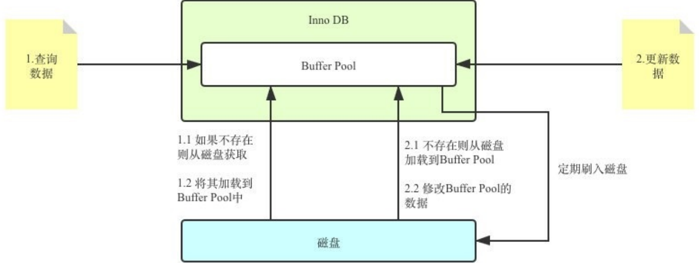

有了Redo Log和Undo Log之后

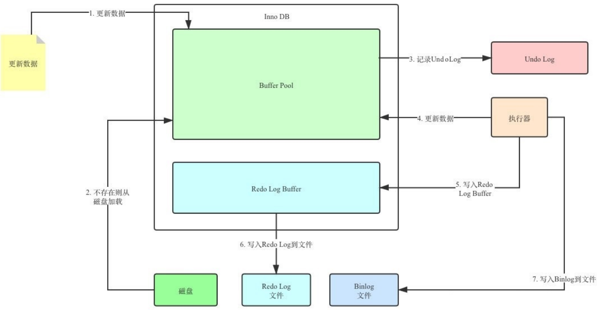


##### 2. 详细生成过程


当我们执行INSERT时：

```mysql
begin;
INSERT INTO user (name) VALUES ("tom");
```

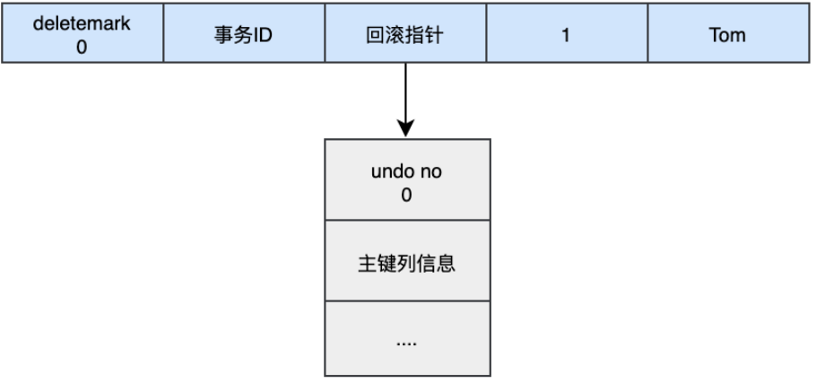

当我们执行UPDATE时：

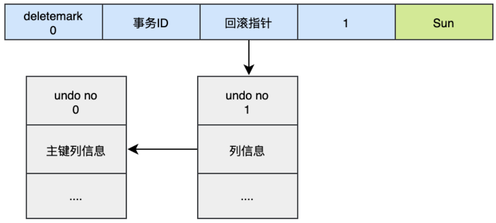

```mysql
UPDATE user SET id=2 WHERE id=1;
```

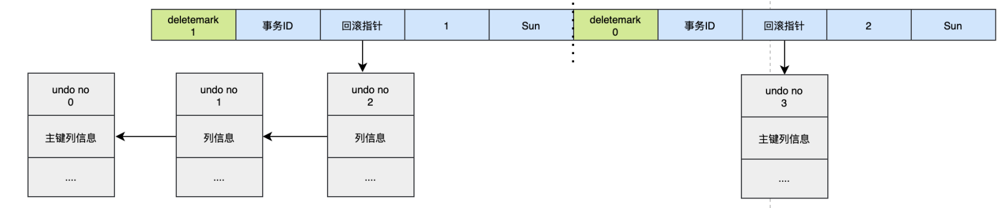


##### 3. undo log是如何回滚的

以上面的例子来说，假设执行rollback，那么对应的流程应该是这样：

1. 通过undo no=3的日志把id=2的数据删除
2. 通过undo no=2的日志把id=1的数据的deletemark还原成0
3. 通过undo no=1的日志把id=1的数据的name还原成Tom
4. 通过undo no=0的日志把id=1的数据删除


##### 4. undo log的删除

- 针对于insert undo log

因为insert操作的记录，只对事务本身可见，对其他事务不可见。故该undo log可以在事务提交后直接删 除，不需要进行purge操作。

- 针对于update undo log

该undo log可能需要提供MVCC机制，因此不能在事务提交时就进行删除。提交时放入undo log链表，等 待purge线程进行最后的删除。


#### 2.6 小结

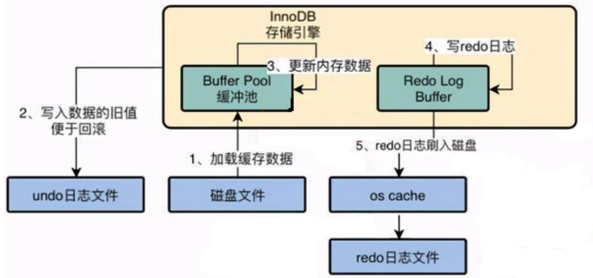

undo log是逻辑日志，对事务回滚时，只是将数据库逻辑地恢复到原来的样子。

redo log是物理日志，记录的是数据页的物理变化，undo log不是redo log的逆过程。


## 十五、锁

事务的 隔离性 由这章讲述的 锁 来实现。

### 1. 概述

锁是计算机协调多个进程或线程并发访问某一资源的机制。在程序开发中会存在多线程同步的问题，当多个线程并发访问某个数据的时候，尤其是针对一些敏感的数据（比如订单、金额等），我们就需要保证这个数据在任何时刻最多只有一个线程在访问，保证数据的完整性和一致性。在开发过程中加锁是为了保证数据的一致性，这个思想在数据库领域中同样很重要。

在数据库中，除传统的计算资源（如CPU、RAM、I/O等）的争用以外，数据也是一种供许多用户共享的 资源。为保证数据的一致性，需要对 并发操作进行控制 ，因此产生了 锁 。同时 锁机制 也为实现MySQL 的各个隔离级别提供了保证。 锁冲突 也是影响数据库 并发访问性能 的一个重要因素。所以锁对数据库而 言显得尤其重要，也更加复杂。


### 2. MySQL并发事务访问相同记录

并发事务访问相同记录的情况大致可以划分为3种：


#### 2.1 读-读情况

读-读 情况，即并发事务相继 读取相同的记录 。读取操作本身不会对记录有任何影响，并不会引起什么 问题，所以允许这种情况的发生。


#### 2.2 写-写情况

写-写 情况，即并发事务相继对相同的记录做出改动。

在这种情况下会发生 脏写 的问题，任何一种隔离级别都不允许这种问题的发生。所以在多个未提交事务 相继对一条记录做改动时，需要让它们 排队执行 ，这个排队的过程其实是通过 锁 来实现的。这个所谓 的锁其实是一个 内存中的结构 ，在事务执行前本来是没有锁的，也就是说一开始是没有 锁结构 和记录进 行关联的，如图所示：


当一个事务想对这条记录做改动时，首先会看看内存中有没有与这条记录关联的 锁结构 ，当没有的时候 就会在内存中生成一个 锁结构 与之关联。比如，事务 T1 要对这条记录做改动，就需要生成一个 锁结构 与之关联：


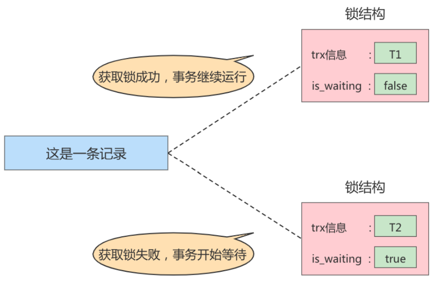


小结几种说法：

- 不加锁
  意思就是不需要在内存中生成对应的 锁结构 ，可以直接执行操作。
- 获取锁成功，或者加锁成功
  意思就是在内存中生成了对应的 锁结构 ，而且锁结构的 is_waiting 属性为 false ，也就是事务可以继续执行操作。
- 获取锁失败，或者加锁失败，或者没有获取到锁
  意思就是在内存中生成了对应的 锁结构 ，不过锁结构的 is_waiting 属性为 true ，也就是事务 需要等待，不可以继续执行操作。


#### 2.3 读-写或写-读情况

读-写 或 写-读 ，即一个事务进行读取操作，另一个进行改动操作。这种情况下可能发生 脏读 、 不可重 复读 、 幻读 的问题。

各个数据库厂商对 SQL标准 的支持都可能不一样。比如MySQL在 REPEATABLE READ 隔离级别上就已经 解决了 幻读 问题。


#### 2.4 并发问题的解决方案

怎么解决 脏读 、 不可重复读 、 幻读 这些问题呢？其实有两种可选的解决方案：

- 方案一：读操作利用多版本并发控制（ MVCC ，下章讲解），写操作进行 加锁 。
  所谓的MVCC，就是生成一个ReadView，通过ReadView找到符合条件的记录版本（历史版本由undo日志构建）。查询语句只能读到在生成ReadView之前已提交事务所做的更改，在生成ReadView之前未提交的事务或者之后才开启的事务所做的更改是看不到的。而写操作肯定针对的是最新版本的记录，读记录的历史版本和改动记录的最新版本本身并不冲突，也就是采用MVCC时，读-写操作并不冲突。

> 普通的SELECT语句在READ COMMITTED和REPEATABLE READ隔离级别下会使用到MVCC读取记录。 
>
> - 在 READ COMMITTED 隔离级别下，一个事务在执行过程中每次执行SELECT操作时都会生成一 个ReadView，ReadView的存在本身就保证了 事务不可以读取到未提交的事务所做的更改 ，也就 是避免了脏读现象； 
> - 在 REPEATABLE READ 隔离级别下，一个事务在执行过程中只有 第一次执行SELECT操作 才会 生成一个ReadView，之后的SELECT操作都 复用 这个ReadView，这样也就避免了不可重复读 和幻读的问题。


- 方案二：读、写操作都采用 加锁 的方式。

如果我们的一些业务场景不允许读取记录的旧版本，而是每次都必须去读取记录的最新版本。比如，在银行存款的事务中，你需要先把账户的余额读出来，然后将其加上本次存款的数额，最后再写到数据库中。在将账户余额读取出来后，就不想让别的事务再访问该余额，直到本次存款事务执行完成，其他事务才可以访问账户的余额。这样在读取记录的时候就需要对其进行加锁操作，这样也就意味着读操作和写操作也像写-写操作那样排队执行。

**脏读**的产生是因为当前事务读取了另一个未提交事务写的一条记录，如果另一个事务在写记录的时候就给这条记录加锁，那么当前事务就无法继续读取该记录了，所以也就不会有脏读问题的产生了。

**不可重复读**的产生是因为当前事务先读取一条记录，另外一个事务对该记录做了改动之后并提交之后，当前事务再次读取时会获得不同的值，如果在当前事务读取记录时就给该记录加锁，那么另一个事务就无法修改该记录，自然也不会发生不可重复读了。

**幻读**问题的产生是因为当前事务读取了一个范围的记录，然后另外的事务向该范围内插入了新记录，当前事务再次读取该范围的记录时发现了新插入的新记录。采用加锁的方式解决幻读问题就有一些麻烦，因为当前事务在第一次读取记录时幻影记录并不存在，所以读取的时候加锁就有点尴尬（因为你并不知道给谁加锁）。

小结对比发现：

- 采用 MVCC 方式的话， 读-写 操作彼此并不冲突， 性能更高 。 
- 采用 加锁 方式的话， 读-写 操作彼此需要 排队执行 ，影响性能。

一般情况下我们当然愿意采用 MVCC 来解决 读-写 操作并发执行的问题，但是业务在某些特殊情况 下，要求必须采用 加锁 的方式执行。下面就讲解下MySQL中不同类别的锁。


### 3. 锁的不同角度分类

锁的分类图，如下：

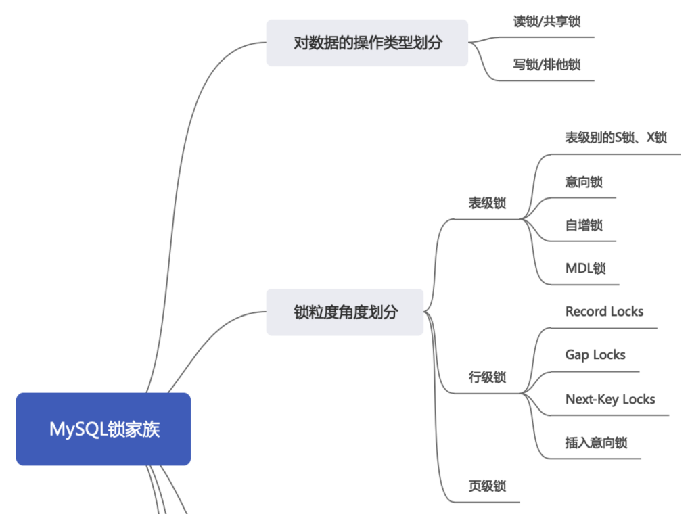


#### 3.1 从数据操作的类型划分：读锁、写锁

对于数据库中并发事务的读-读情况并不会引起什么问题。对于写-写、读-写或写-读这些情况可能会引起一些问题，需要使用MVCC或者加锁的方式来解决它们。在使用加锁的方式解决问题时，由于既要允许读-读情况不受影响，又要使写-写、读-写或写-读情况中的操作相互阻塞，所以MySQL实现一个由两种类型的锁组成的锁系统来解决。这两种类型的锁通常被称为共享锁（SharedLock，SLock）和排他锁（ExclusiveLock，XLock），也叫读锁（readlock）和写锁（writelock）。

- 读锁 ：也称为 共享锁 、英文用 S 表示。针对同一份数据，多个事务的读操作可以同时进行而不会互相影响，相互不阻塞的。
- 写锁 ：也称为 排他锁 、英文用 X 表示。当前写操作没有完成前，它会阻断其他写锁和读锁。这样就能确保在给定的时间里，只有一个事务能执行写入，并防止其他用户读取正在写入的同一资源。

需要注意的是对于 InnoDB 引擎来说，读锁和写锁可以加在表上，也可以加在行上。

举例（行级读写锁）：如果一个事务T1已经获得了某个行r的读锁，那么此时另外的一个事务T2是可以去获得这个行r的读锁的，因为读取操作并没有改变行r的数据；但是，如果某个事务T3想获得行r的写锁，则它必须等待事务T1、T2释放掉行r上的读锁才行。

总结：这里的兼容是指对同一张表或记录的锁的兼容性情况。

|      | X锁    | S锁    |
| ---- | ------ | ------ |
| X锁  | 不兼容 | 不兼容 |
| S锁  | 不兼容 | 兼容   |


##### 1. 锁定读

在采用加锁方式解决脏读、不可重复读、幻读这些问题时，读取一条记录时需要获取该记录的S锁，其实是不严谨的，有时候需要在读取记录时就获取记录的X锁，来禁止别的事务读写该记录，为此MySQL提出了两种比较特殊的SELECT语句格式：

- 对读取的记录加S锁：

```mysql
SELECT ... LOCK IN SHARE MODE;
#或
SELECT ... FOR SHARE;#（8.O新增语法）
```

在普通的SELECT语句后边加LOCK IN SHARE MODE，如果当前事务执行了该语句，那么它会为读取到的记录加S锁，这样允许别的事务继续获取这些记录的S锁（比方说别的事务也使用SELECT ... LOCK IN SHARE MODE语句来读取这些记录），但是不能获取这些记录的X锁（比如使用SELECT ... FOR UPDATE语句来读取这些记录，或者直接修改这些记录）。如果别的事务想要获取这些记录的×锁，那么它们会阻塞，直到当前事务提交之后将这些记录上的S锁释放掉。

- 对读取的记录加X锁：

```mysql
SELECT ... FOR UPDATE;
```

在普通的SELECT语句后边加FOR UPDATE，如果当前事务执行了该语句，那么它会为读取到的记录加X锁，这样既不允许别的事务获取这些记录的S锁（比方说别的事务使用SELECT ... LOCK IN SHARE MODE语句来读取这些记录），也不允许获取这些记录的X锁（比如使用SELECT ... FOR UPDATE语句来读取这些记录，或者直接修改这些记录）。如果别的事务想要获取这些记录的S锁或者×锁，那么它们会阻塞，直到当前事务提交之后将这些记录上的X锁释放掉。


##### 2. 写操作

平常所用到的写操作无非是DELETE、UPDATE、INSERT这三种：

- DELETE：
  对一条记录做DELETE操作的过程其实是先在B+树中定位到这条记录的位置，然后获取这条记录的X锁，再执行deletemark操作。我们也可以把这个定位待删除记录在B+树中位置的过程看成是一个获取x锁的锁定读。
- UPDATE：在对一条记录做UPDATE操作时分为三种情况：
  - 情况1：未修改该记录的键值，并且被更新的列占用的存储空间在修改前后未发生变化。
    则先在B+树中定位到这条记录的位置，然后再获取一下记录的×锁，最后在原记录的位置进行修改操作。我们也可以把这个定位待修改记录在B+树中位置的过程看成是一个获取×锁的锁定读。
  - 情况2：未修改该记录的键值，并且至少有一个被更新的列占用的存储空间在修改前后发生变化。
    则先在B+树中定位到这条记录的位置，然后获取一下记录的×锁，将该记录彻底删除掉（就是把记录彻底移入垃圾链表），最后再插入一条新记录。这个定位待修改记录在B+树中位置的过程看成是一个获取× 锁的锁定读，新插入的记录由INSERT操作提供的隐式锁进行保护。
  - 情况3：修改了该记录的键值，则相当于在原记录上做DELETE操作之后再来一次INSERT操作，加锁操作就需要按照DELETE和INSERT的规则进行了。

- INSERT:
  一般情况下，新插入一条记录的操作并不加锁，通过一种称之为隐式锁的结构来保护这条新插入的记录在本事务提交前不被别的事务访问。


#### 3.2 从数据操作的粒度划分：表级锁、页级锁、行锁

为了尽可能提高数据库的并发度，每次锁定的数据范围越小越好，理论上每次只锁定当前操作的数据的方案会得到最大的并发度，但是管理锁是很耗资源的事情（涉及获取、检查、释放锁等动作）。因此数据库系统需要在高并发响应和系统性能两方面进行平衡，这样就产生了“锁粒度（Lockgranularity）"的概念。

对一条记录加锁影响的也只是这条记录而已，我们就说这个锁的粒度比较细；其实一个事务也可以在表级别进行加锁，自然就被称之为表级锁或者表锁，对一个表加锁影响整个表中的记录，我们就说这个锁的粒度比较粗。锁的粒度主要分为表级锁、页级锁和行锁。


##### 1. 表锁（Table Lock）

该锁会锁定整张表，它是MySQL中最基本的锁策略，并不依赖于存储引擎（不管你是MySQL的什么存储引擎，对于表锁的策略都是一样的），并且表锁是开销最小的策略（因为粒度比较大）。由于表级锁一次会将整个表锁定，所以可以很好的避免死锁问题。当然，锁的粒度大所带来最大的负面影响就是出现锁资源争用的概率也会最高，导致并发率大打折扣。

###### ① 表级别的S锁、X锁

在对某个表执行SELECT、INSERT、DELETE、UPDATE语句时，InnoDB存储引擎是不会为这个表添加表级 别的 S锁 或者 X锁 的。在对某个表执行一些诸如 ALTER TABLE 、 DROP TABLE 这类的 DDL 语句时，其 他事务对这个表并发执行诸如SELECT、INSERT、DELETE、UPDATE的语句会发生阻塞。同理，某个事务 中对某个表执行SELECT、INSERT、DELETE、UPDATE语句时，在其他会话中对这个表执行 DDL 语句也会 发生阻塞。这个过程其实是通过在 server层 使用一种称之为 元数据锁 （英文名： Metadata Locks ， 简称 MDL ）结构来实现的。

一般情况下，不会使用InnoDB存储引擎提供的表级别的 S锁 和 X锁 。只会在一些特殊情况下，比方说 崩 溃恢复 过程中用到。比如，在系统变量 autocommit=0，innodb_table_locks = 1 时， 手动 获取 InnoDB存储引擎提供的表t 的 S锁 或者 X锁 可以这么写：

- LOCK TABLES t READ ：InnoDB存储引擎会对表 t 加表级别的 S锁 。
- LOCK TABLES t WRITE ：InnoDB存储引擎会对表 t 加表级别的 X锁 。

不过尽量避免在使用InnoDB存储引擎的表上使用 LOCK TABLES 这样的手动锁表语句，它们并不会提供 什么额外的保护，只是会降低并发能力而已。InnoDB的厉害之处还是实现了更细粒度的 行锁 ，关于 InnoDB表级别的 S锁 和 X锁 大家了解一下就可以了。

总结：MyISAM在执行查询语句（SELECT）前，会给涉及的所有表加读锁，在执行增删改操作前，会给涉及的表加写锁。 InnoDB存储引擎是不会为这个表添加表级别的读锁或者写锁的。

MySQL的表级锁有两种模式：（以MyISAM表进行操作的演示）

- 表共享读锁（Table Read Lock）
- 表独占写锁（Table Write Lock）

| 锁类型 | 自己可读 | 自己可写 | 自己可操作其他表 | 他人可读 | 他人可写 |
| ------ | -------- | -------- | ---------------- | -------- | -------- |
| 读锁   | 是       | 否       | 否               | 是       | 否，等   |
| 写锁   | 是       | 是       | 否               | 否，等   | 否，等   |


###### ② 意向锁 （intention lock）

InnoDB 支持 多粒度锁（multiple granularity locking） ，它允许 行级锁 与 表级锁 共存，而意向 锁就是其中的一种 表锁 。

1. 意向锁的存在是为了协调行锁和表锁的关系，支持多粒度（表锁与行锁）的锁并存。
2. 意向锁是一种不与行级锁冲突表级锁，这一点非常重要。
3. 表明“某个事务正在某些行持有了锁或该事务准备去持有锁”

意向锁分为两种：

- 意向共享锁（intention shared lock, IS）：事务有意向对表中的某些行加共享锁（S锁）

  ```mysql
  -- 事务要获取某些行的 S 锁，必须先获得表的 IS 锁。
  SELECT column FROM table ... LOCK IN SHARE MODE;
  ```

- 意向排他锁（intention exclusive lock, IX）：事务有意向对表中的某些行加排他锁（X锁）

  ```mysql
  -- 事务要获取某些行的 X 锁，必须先获得表的 IX 锁。
  SELECT column FROM table ... FOR UPDATE;
  ```

即：意向锁是由存储引擎 自己维护的 ，用户无法手动操作意向锁，在为数据行加共享 / 排他锁之前， InooDB 会先获取该数据行 所在数据表的对应意向锁 。

**意向锁要解决的问题**

现在有两个事务，分别是T1和T2，其中T2试图在该表级别上应用共享或排它锁，如果没有意向锁存在，那么T2就需要去检查各个页或行是否存在锁；如果存在意向锁，那么此时就会受到由T1控制的表级别意向锁的阻塞。T2在锁定该表前不必检查各个页或行锁，而只需检查表上的意向锁。简单来说就是给更大一级别的空间示意里面是否已经上过锁。

在数据表的场景中，如果我们给某一行数据加上了排它锁，数据库会自动给更大一级的空间，比如数据页或数据表加上意向锁，告诉其他人这个数据页或数据表已经有人上过排它锁了，这样当其他人想要获取数据表排它锁的时候，只需要了解是否有人已经获取了这个数据表的意向排他锁即可。

- 如果事务想要获得数据表中某些记录的共享锁，就需要在数据表上添加意向共享锁。
- 如果事务想要获得数据表中某些记录的排他锁，就需要在数据表上添加意向排他锁。

这时，意向锁会告诉其他事务已经有人锁定了表中的某些记录。

因为共享锁与排他锁互斥，所以事务B在试图对teacher表加共享锁的时候，必须保证两个条件。

1. 当前没有其他事务持有teacher表的排他锁。
2. 当前没有其他事务持有teacher表中任意一行的排他锁。

为了检测是否满足第二个条件，事务B必须在确保teacher表不存在任何排他锁的前提下，去检测表中的每一行是否存在排他锁。很明显这是一个效率很差的做法，但是有了意向锁之后，情况就不一样了。

意向锁是怎么解决这个问题的呢？首先，我们需要知道意向锁之间的兼容互斥性，如下所示。

|                  | 意向共享锁（IS） | 意向排他锁（IX） |
| ---------------- | ---------------- | ---------------- |
| 意向共享锁（IS） | 兼容             | 兼容             |
| 意向排他锁（IX） | 兼容             | 兼容             |

即意向锁之间是互相兼容的，虽然意向锁和自家兄弟互相兼容，但是它会与普通的排他/共享锁互斥。

|             | 意向共享锁（IS） | 意向排他锁（IX） |
| ----------- | ---------------- | ---------------- |
| 共享锁（S） | 兼容             | 互斥             |
| 排他锁（X） | 互斥             | 互斥             |


结论：

1. InnoDB支持多粒度锁，特定场景下，行级锁可以与表级锁共存。
2. 意向锁之间互不排斥，但除了IS与S兼容外，意向锁会与共享锁／排他锁互斥。
3. IX，IS是表级锁，不会和行级的X，S锁发生冲突。只会和表级的X，S发生冲突。 
4. 意向锁在保证并发性的前提下，实现了行锁和表锁共存且满足事务隔离性的要求。


###### ③ 自增锁（AUTO-INC锁）

在使用MySQL过程中，我们可以为表的某个列添加 AUTO_INCREMENT 属性。举例：

```mysql
CREATE TABLE `teacher` (
    `id` int NOT NULL AUTO_INCREMENT,
    `name` varchar(255) NOT NULL,
    PRIMARY KEY (`id`)
) ENGINE=InnoDB DEFAULT CHARSET=utf8mb4 COLLATE=utf8mb4_0900_ai_ci;
```

由于这个表的id字段声明了AUTO_INCREMENT，意味着在书写插入语句时不需要为其赋值，SQL语句修改 如下所示。

```mysql
INSERT INTO `teacher` (name) VALUES ('zhangsan'), ('lisi');
```

上边的插入语句并没有为id列显式赋值，所以系统会自动为它赋上递增的值，结果如下所示。

```mysql
INSERT INTO `teacher` (name) VALUES ('zhangsan'), ('lisi');
```

上边的插入语句并没有为id列显式赋值，所以系统会自动为它赋上递增的值，结果如下所示。

```mysql
mysql> select * from teacher;
+----+----------+
| id | name 	|
+----+----------+
| 1  | zhangsan |
| 2  | lisi	    |
+----+----------+
2 rows in set (0.00 sec)
```

现在我们看到的上面插入数据只是一种简单的插入模式，所有插入数据的方式总共分为三类，分别是 “ Simple inserts ”，“ Bulk inserts ”和“ Mixed-mode inserts ”。

1. “Simple inserts” （简单插入）
   可以 预先确定要插入的行数 （当语句被初始处理时）的语句。包括没有嵌套子查询的单行和多行 INSERT...VALUES() 和 REPLACE 语句。比如我们上面举的例子就属于该类插入，已经确定要插入的行 数。
2. “Bulk inserts” （批量插入）
   事先不知道要插入的行数 （和所需自动递增值的数量）的语句。比如 INSERT ... SELECT ， REPLACE ... SELECT 和 LOAD DATA 语句，但不包括纯INSERT。 InnoDB在每处理一行，为AUTO_INCREMENT列 分配一个新值。
3. “Mixed-mode inserts” （混合模式插入）
   这些是“Simple inserts”语句但是指定部分新行的自动递增值。例如 INSERT INTO teacher (id,name) VALUES (1,'a'), (NULL,'b'), (5,'c'), (NULL,'d'); 只是指定了部分id的值。另一种类型的“混 合模式插入”是 INSERT ... ON DUPLICATE KEY UPDATE 。

innodb_autoinc_lock_mode有三种取值，分别对应与不同锁定模式：

> （1）innodb_autoinc_lock_mode = 0(“传统”锁定模式)
>

在此锁定模式下，所有类型的insert语句都会获得一个特殊的表级AUTO-INC锁，用于插入具有 AUTO_INCREMENT列的表。这种模式其实就如我们上面的例子，即每当执行insert的时候，都会得到一个 表级锁(AUTO-INC锁)，使得语句中生成的auto_increment为顺序，且在binlog中重放的时候，可以保证 master与slave中数据的auto_increment是相同的。因为是表级锁，当在同一时间多个事务中执行insert的 时候，对于AUTO-INC锁的争夺会 限制并发 能力。

> （2）innodb_autoinc_lock_mode = 1(“连续”锁定模式)
>

在 MySQL 8.0 之前，连续锁定模式是 默认 的。

在这个模式下，“bulk inserts”仍然使用AUTO-INC表级锁，并保持到语句结束。这适用于所有INSERT ... SELECT，REPLACE ... SELECT和LOAD DATA语句。同一时刻只有一个语句可以持有AUTO-INC锁。

对于“Simple inserts”（要插入的行数事先已知），则通过在 mutex（轻量锁） 的控制下获得所需数量的 自动递增值来避免表级AUTO-INC锁， 它只在分配过程的持续时间内保持，而不是直到语句完成。不使用 表级AUTO-INC锁，除非AUTO-INC锁由另一个事务保持。如果另一个事务保持AUTO-INC锁，则“Simple inserts”等待AUTO-INC锁，如同它是一个“bulk inserts”。

> （3）innodb_autoinc_lock_mode = 2(“交错”锁定模式)
>

从 MySQL 8.0 开始，交错锁模式是 默认 设置。

在此锁定模式下，自动递增值 保证 在所有并发执行的所有类型的insert语句中是 唯一 且 单调递增 的。但 是，由于多个语句可以同时生成数字（即，跨语句交叉编号），为任何给定语句插入的行生成的值可能 不是连续的。


###### ④ 元数据锁（MDL锁）

MySQL5.5引入了meta data lock，简称MDL锁，属于表锁范畴。MDL 的作用是，保证读写的正确性。比 如，如果一个查询正在遍历一个表中的数据，而执行期间另一个线程对这个 表结构做变更 ，增加了一 列，那么查询线程拿到的结果跟表结构对不上，肯定是不行的。

因此，当对一个表做增删改查操作的时候，加 MDL读锁；当要对表做结构变更操作的时候，加 MDL 写 锁。


##### 2. InnoDB中的行锁

行锁（RowLock）也称为记录锁，顾名思义，就是锁住某一行（某条记录row）。需要的注意的是，MySQL服务器层并没有实现行锁机制，行级锁只在存储引擎层实现。

**优点**：锁定力度小，发生锁冲突概率低，可以实现的并发度高。

**缺点**：对于锁的开销比较大，加锁会比较慢，容易出现死锁情况。

InnoDB与MyISAM的最大不同有两点：一是支持事务（TRANSACTION）；二是采用了行级锁。

###### ① 记录锁（Record Locks）

记录锁也就是仅仅把一条记录锁上，官方的类型名称为： LOCK_REC_NOT_GAP 。比如我们把id值为8的 那条记录加一个记录锁的示意图如图所示。仅仅是锁住了id值为8的记录，对周围的数据没有影响。


举例如下：

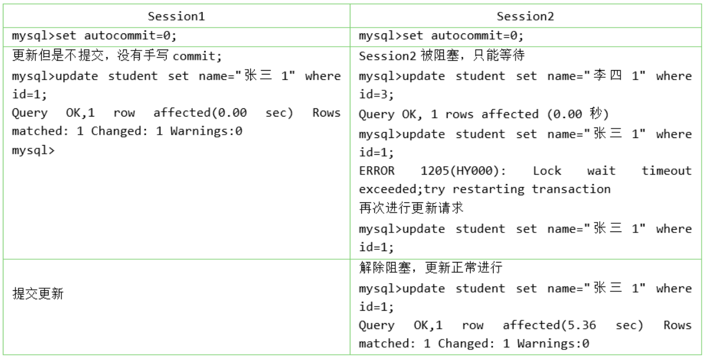

记录锁是有S锁和X锁之分的，称之为 S型记录锁 和 X型记录锁 。

- 当一个事务获取了一条记录的S型记录锁后，其他事务也可以继续获取该记录的S型记录锁，但不可以继续获取X型记录锁；
- 当一个事务获取了一条记录的X型记录锁后，其他事务既不可以继续获取该记录的S型记录锁，也不可以继续获取X型记录锁。


###### ② 间隙锁（Gap Locks）

MySQL 在 REPEATABLE READ 隔离级别下是可以解决幻读问题的，解决方案有两种，可以使用 MVCC 方 案解决，也可以采用 加锁 方案解决。但是在使用加锁方案解决时有个大问题，就是事务在第一次执行读 取操作时，那些幻影记录尚不存在，我们无法给这些 幻影记录 加上 记录锁 。InnoDB提出了一种称之为 Gap Locks 的锁，官方的类型名称为： LOCK_GAP ，我们可以简称为 gap锁 。比如，把id值为8的那条 记录加一个gap锁的示意图如下。

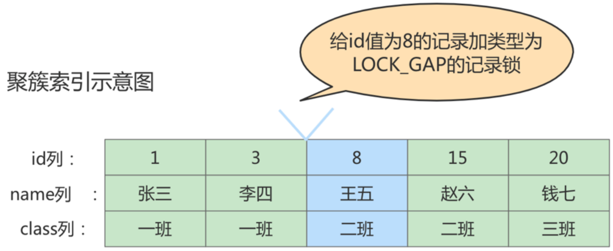

图中id值为8的记录加了gap锁，意味着 不允许别的事务在id值为8的记录前边的间隙插入新记录 ，其实就是 id列的值(3, 8)这个区间的新记录是不允许立即插入的。比如，有另外一个事务再想插入一条id值为4的新 记录，它定位到该条新记录的下一条记录的id值为8，而这条记录上又有一个gap锁，所以就会阻塞插入 操作，直到拥有这个gap锁的事务提交了之后，id列的值在区间(3, 8)中的新记录才可以被插入。

gap锁的提出仅仅是为了防止插入幻影记录而提出的。


###### ③ 临键锁（Next-Key Locks）

有时候我们既想 锁住某条记录 ，又想 阻止 其他事务在该记录前边的 间隙插入新记录 ，所以InnoDB就提 出了一种称之为 Next-Key Locks 的锁，官方的类型名称为： LOCK_ORDINARY ，我们也可以简称为 next-key锁 。Next-Key Locks是在存储引擎 innodb 、事务级别在 可重复读 的情况下使用的数据库锁， innodb默认的锁就是Next-Key locks。

```mysql
begin;
select * from student where id <=8 and id > 3 for update;
```


###### ④ 插入意向锁（Insert Intention Locks）

我们说一个事务在 插入 一条记录时需要判断一下插入位置是不是被别的事务加了 gap锁 （ next-key锁 也包含 gap锁 ），如果有的话，插入操作需要等待，直到拥有 gap锁 的那个事务提交。但是InnoDB规 定事务在等待的时候也需要在内存中生成一个锁结构，表明有事务想在某个 间隙 中 插入 新记录，但是 现在在等待。InnoDB就把这种类型的锁命名为 Insert Intention Locks ，官方的类型名称为： LOCK_INSERT_INTENTION ，我们称为 插入意向锁 。插入意向锁是一种 Gap锁 ，不是意向锁，在insert 操作时产生。

插入意向锁是在插入一条记录行前，由 INSERT 操作产生的一种间隙锁 。

事实上插入意向锁并不会阻止别的事务继续获取该记录上任何类型的锁。

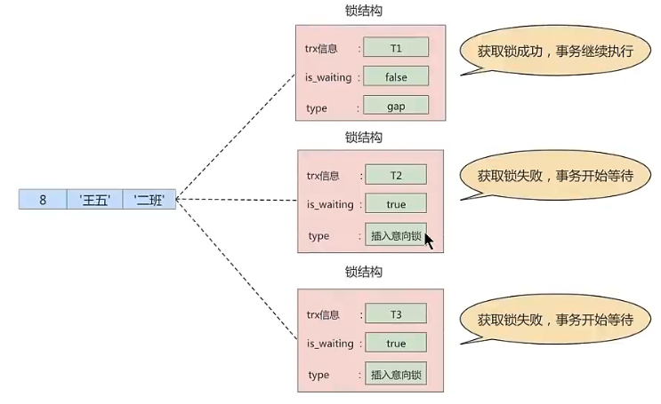

从图中可以看到，由于T1持有gap锁，所以T2和T3需要生成一个插入意向锁的锁结构并且处于等待状态。当T1提交后会把它获取到的锁都释放掉，这样T2和T3就能获取到对应的插入意向锁了（本质上就是把插入意向锁对应锁结构的is_Waiting属性改为false），T2和T3之间也并不会相互阻塞，它们可以同时获取到id值为8的插入意向锁，然后执行插入操作。事实上插入意向锁并不会阻止别的事务继续获取该记录上任何类型的锁。


##### 3. 页锁

页锁就是在 页的粒度 上进行锁定，锁定的数据资源比行锁要多，因为一个页中可以有多个行记录。当我 们使用页锁的时候，会出现数据浪费的现象，但这样的浪费最多也就是一个页上的数据行。页锁的开销 介于表锁和行锁之间，会出现死锁。锁定粒度介于表锁和行锁之间，并发度一般。

每个层级的锁数量是有限制的，因为锁会占用内存空间， 锁空间的大小是有限的 。当某个层级的锁数量 超过了这个层级的阈值时，就会进行 锁升级 。锁升级就是用更大粒度的锁替代多个更小粒度的锁，比如 InnoDB 中行锁升级为表锁，这样做的好处是占用的锁空间降低了，但同时数据的并发度也下降了。


#### 3.3 从对待锁的态度划分:乐观锁、悲观锁

从对待锁的态度来看锁的话，可以将锁分成乐观锁和悲观锁，从名字中也可以看出这两种锁是两种看待 数据并发的思维方式 。需要注意的是，乐观锁和悲观锁并不是锁，而是锁的 设计思想 。

##### 1. 悲观锁（Pessimistic Locking）

悲观锁是一种思想，顾名思义，就是很悲观，对数据被其他事务的修改持保守态度，会通过数据库自身 的锁机制来实现，从而保证数据操作的排它性。

悲观锁总是假设最坏的情况，每次去拿数据的时候都认为别人会修改，所以每次在拿数据的时候都会上 锁，这样别人想拿这个数据就会 阻塞 直到它拿到锁（共享资源每次只给一个线程使用，其它线程阻塞， 用完后再把资源转让给其它线程）。比如行锁，表锁等，读锁，写锁等，都是在做操作之前先上锁，当 其他线程想要访问数据时，都需要阻塞挂起。Java中 synchronized 和 ReentrantLock 等独占锁就是 悲观锁思想的实现。


##### 2. 乐观锁（Optimistic Locking）

乐观锁认为对同一数据的并发操作不会总发生，属于小概率事件，不用每次都对数据上锁，但是在更新 的时候会判断一下在此期间别人有没有去更新这个数据，也就是不采用数据库自身的锁机制，而是通过 程序来实现。在程序上，我们可以采用 版本号机制 或者 CAS机制 实现。乐观锁适用于多读的应用类型， 这样可以提高吞吐量。在Java中 java.util.concurrent.atomic 包下的原子变量类就是使用了乐观锁的一种实现方式：CAS实现的。

1. 乐观锁的版本号机制
   在表中设计一个 版本字段 version ，第一次读的时候，会获取 version 字段的取值。然后对数据进行更 新或删除操作时，会执行 UPDATE ... SET version=version+1 WHERE version=version 。此时 如果已经有事务对这条数据进行了更改，修改就不会成功。

2. 乐观锁的时间戳机制
   时间戳和版本号机制一样，也是在更新提交的时候，将当前数据的时间戳和更新之前取得的时间戳进行 比较，如果两者一致则更新成功，否则就是版本冲突。

   你能看到乐观锁就是程序员自己控制数据并发操作的权限，基本是通过给数据行增加一个戳（版本号或 者时间戳），从而证明当前拿到的数据是否最新。


##### 3. 两种锁的适用场景

从这两种锁的设计思想中，我们总结一下乐观锁和悲观锁的适用场景：

1. 乐观锁 适合 读操作多 的场景，相对来说写的操作比较少。它的优点在于 程序实现， 不存在死锁问题，不过适用场景也会相对乐观，因为它阻止不了除了程序以外的数据库操作。
2. 悲观锁 适合 写操作多 的场景，因为写的操作具有 排它性 。采用悲观锁的方式，可以在数据库层面阻止其他事务对该数据的操作权限，防止 读 - 写 和 写 - 写 的冲突。


#### 3.4 按加锁的方式划分：显式锁、隐式锁

##### 1. 隐式锁

一个事务在执行INSERT操作时，如果即将插入的间隙已经被其他事务加了gap锁，那么本次INSERT操作会阻塞，并且当前事务会在该间隙上加一个插入意向锁，否则一般情况下INSERT操作是不加锁的。那如果一个事务首先插入了一条记录（此时并没有在内存生产与该记录关联的锁结构），然后另一个事务：

- 立即使用SELECT ... LOCK IN SHARE MODE语句读取这条记录，也就是要获取这条记录的S锁，或者使用SELECT ... FOR UPDATE语句读取这条记录，也就是要获取这条记录的X锁，怎么办？
  如果允许这种情况的发生，那么可能产生脏读问题。
- 立即修改这条记录，也就是要获取这条记录的×锁，怎么办？
  如果允许这种情况的发生，那么可能产生脏写问题。

这时候我们前边提过的事务id又要起作用了。我们把聚簇索引和二级索引中的记录分开看一下：

- 情景一：对于聚簇索引记录来说，有一个 trx_id 隐藏列，该隐藏列记录着最后改动该记录的 事务id 。那么如果在当前事务中新插入一条聚簇索引记录后，该记录的 trx_id 隐藏列代表的的就是当前事务的 事务id ，如果其他事务此时想对该记录添加 S锁 或者 X锁 时，首先会看一下该记录的trx_id 隐藏列代表的事务是否是当前的活跃事务，如果是的话，那么就帮助当前事务创建一个 X锁 （也就是为当前事务创建一个锁结构， is_waiting 属性是 false ），然后自己进入等待状态（也就是为自己也创建一个锁结构， is_waiting 属性是 true ）。
- 情景二：对于二级索引记录来说，本身并没有 trx_id 隐藏列，但是在二级索引页面的 PageHeader 部分有一个 PAGE_MAX_TRX_ID 属性，该属性代表对该页面做改动的最大的 事务id ，如果 PAGE_MAX_TRX_ID 属性值小于当前最小的活跃 事务id ，那么说明对该页面做修改的事务都已经提交了，否则就需要在页面中定位到对应的二级索引记录，然后回表找到它对应的聚簇索引记录，然后再重复 情景一 的做法。

即：一个事务对新插入的记录可以不显式的加锁（生成一个锁结构），但是由于事务id的存在，相当于加了一个隐式锁。别的事务在对这条记录加S锁或者X锁时，由于隐式锁的存在，会先帮助当前事务生成一个锁结构，然后自己再生成一个锁结构后进入等待状态。隐式锁是一种延迟加锁的机制，从而来减少加锁的数量。

隐式锁在实际内存对象中并不含有这个锁信息。只有当产生锁等待时，隐式锁转化为显式锁。

InnoDB的insert操作，对插入的记录不加锁，但是此时如果另一个线程进行当前读，类似以下的用例，session2 会锁等待session1，那么这是如何实现的呢？

**session 1:**

```mysql
mysql> begin;
Query OK, 0 rows affected (0.00 sec)

mysql> insert INTO student VALUES(34,"周八","二班");
Query OK, 1 row affected (0.00 sec)
```

**session 2:**

```mysql
mysql> begin;
Query OK, 0 rows affected (0.00 sec)

mysql> select * from student lock in share mode; #执行完，当前事务被阻塞
```

隐式锁的逻辑过程如下：

1. InnoDB的每条记录中都一个隐含的trx_id字段，这个字段存在于聚簇索引的B+Tree中。
2. 在操作一条记录前，首先根据记录中的trx_id检查该事务是否是活动的事务(未提交或回滚)。如果是活动的事务，首先将 隐式锁 转换为 显式锁 (就是为该事务添加一个锁)。
3. 检查是否有锁冲突，如果有冲突，创建锁，并设置为waiting状态。如果没有冲突不加锁，跳到E。
4. 等待加锁成功，被唤醒，或者超时。
5. 写数据，并将自己的trx_id写入trx_id字段。


##### 2. 显式锁

通过特定的语句进行加锁，我们一般称之为显示加锁，例如：

显示加共享锁：

```mysql
select .... lock in share mode
```

显示加排它锁：

```mysql
select .... for update
```


#### 3.5 其它锁之：全局锁

全局锁就是对 整个数据库实例 加锁。当你需要让整个库处于 只读状态 的时候，可以使用这个命令，之后 其他线程的以下语句会被阻塞：数据更新语句（数据的增删改）、数据定义语句（包括建表、修改表结 构等）和更新类事务的提交语句。全局锁的典型使用 场景 是：做 全库逻辑备份 。

全局锁的命令：

```mysql
Flush tables with read lock
```


#### 3.6 其它锁之：死锁

> 两个事务都持有对方需要的锁，并且在等待对方释放，并且双方都不会释放自己的锁。

|      | 事务1                                                        | 事务2                                   |
| ---- | ------------------------------------------------------------ | --------------------------------------- |
| 1    | start transaction;<br />update account set money=10 where id=1; | start transaction;                      |
| 2    |                                                              | update account set money=10 where id=2; |
| 3    | update account set money=20 where id=2;                      |                                         |
| 4    |                                                              | update account set money=20 where id=1; |

这时候，事务1在等待事务2释放id=2的行锁，而事务2在等待事务1释放id=1的行锁。 事务1和事务2在互 相等待对方的资源释放，就是进入了死锁状态。当出现死锁以后，有 两种策略 ：

- 一种策略是，直接进入等待，直到超时。这个超时时间可以通过参数 innodb_lock_wait_timeout 来设置。
- 另一种策略是，发起死锁检测，发现死锁后，主动回滚死锁链条中的某一个事务（将持有最少行级 排他锁的事务进行回滚），让其他事务得以继续执行。将参数 innodb_deadlock_detect 设置为 on ，表示开启这个逻辑。


### 4. 锁的内存结构

InnoDB 存储引擎中的 锁结构 如下：

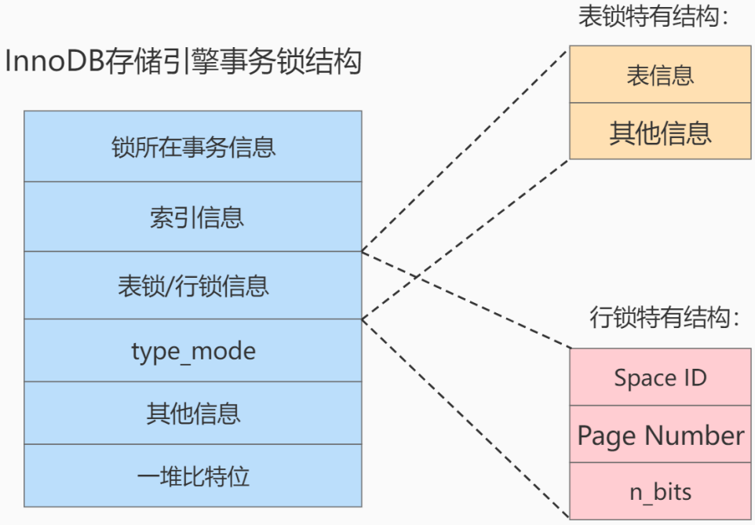

结构解析：

1. 锁所在的事务信息 ：

不论是 表锁 还是 行锁 ，都是在事务执行过程中生成的，哪个事务生成了这个 锁结构 ，这里就记录这个 事务的信息。

此 锁所在的事务信息 在内存结构中只是一个指针，通过指针可以找到内存中关于该事务的更多信息，比 方说事务id等。

2. 索引信息 ：

对于 行锁 来说，需要记录一下加锁的记录是属于哪个索引的。这里也是一个指针。

3. 表锁／行锁信息 ：

表锁结构 和 行锁结构 在这个位置的内容是不同的：

- 表锁：
  记载着是对哪个表加的锁，还有其他的一些信息。
- 行锁：
  记载了三个重要的信息：
  - Space ID ：记录所在表空间。
  - Page Number ：记录所在页号。
  - n_bits ：对于行锁来说，一条记录就对应着一个比特位，一个页面中包含很多记录，用不同 的比特位来区分到底是哪一条记录加了锁。为此在行锁结构的末尾放置了一堆比特位，这个 n_bits 属性代表使用了多少比特位。

> n_bits的值一般都比页面中记录条数多一些。主要是为了之后在页面中插入了新记录后 也不至于重新分配锁结构
>


4. type_mode ：

这是一个32位的数，被分成了 lock_mode 、 lock_type 和 rec_lock_type 三个部分，如图所示：

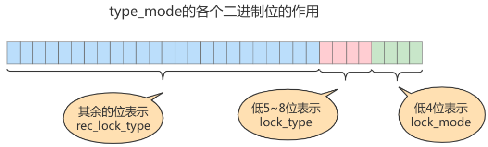

- 锁的模式（ lock_mode ），占用低4位，可选的值如下：

  - LOCK_IS （十进制的 0 ）：表示共享意向锁，也就是 IS锁 。

  - LOCK_IX （十进制的 1 ）：表示独占意向锁，也就是 IX锁 。

  - LOCK_S （十进制的 2 ）：表示共享锁，也就是 S锁 。

  - LOCK_X （十进制的 3 ）：表示独占锁，也就是 X锁 。

  - LOCK_AUTO_INC （十进制的 4 ）：表示 AUTO-INC锁 。

在InnoDB存储引擎中，LOCK_IS，LOCK_IX，LOCK_AUTO_INC都算是表级锁的模式，LOCK_S和 LOCK_X既可以算是表级锁的模式，也可以是行级锁的模式。

- 锁的类型（ lock_type ），占用第5～8位，不过现阶段只有第5位和第6位被使用：

  - LOCK_TABLE （十进制的 16 ），也就是当第5个比特位置为1时，表示表级锁。

  - LOCK_REC （十进制的 32 ），也就是当第6个比特位置为1时，表示行级锁。

- 行锁的具体类型（ rec_lock_type ），使用其余的位来表示。只有在 lock_type 的值为 LOCK_REC 时，也就是只有在该锁为行级锁时，才会被细分为更多的类型：

  - LOCK_ORDINARY （十进制的 0 ）：表示 next-key锁 。

  - LOCK_GAP （十进制的 512 ）：也就是当第10个比特位置为1时，表示 gap锁 。

  - LOCK_REC_NOT_GAP （十进制的 1024 ）：也就是当第11个比特位置为1时，表示正经 记录锁 。

  - LOCK_INSERT_INTENTION （十进制的 2048 ）：也就是当第12个比特位置为1时，表示插入意向锁。其他的类型：还有一些不常用的类型我们就不多说了。

- is_waiting 属性呢？基于内存空间的节省，所以把 is_waiting 属性放到了 type_mode 这个32 位的数字中：
  - LOCK_WAIT （十进制的 256 ） ：当第9个比特位置为 1 时，表示 is_waiting 为 true ，也 就是当前事务尚未获取到锁，处在等待状态；当这个比特位为 0 时，表示 is_waiting 为 false ，也就是当前事务获取锁成功。


5. 其他信息 ：

为了更好的管理系统运行过程中生成的各种锁结构而设计了各种哈希表和链表。


6. 一堆比特位 ：

如果是 行锁结构 的话，在该结构末尾还放置了一堆比特位，比特位的数量是由上边提到的 n_bits 属性 表示的。InnoDB数据页中的每条记录在 记录头信息 中都包含一个 heap_no 属性，伪记录 Infimum 的 heap_no 值为 0 ， Supremum 的 heap_no 值为 1 ，之后每插入一条记录， heap_no 值就增1。 锁结 构 最后的一堆比特位就对应着一个页面中的记录，一个比特位映射一个 heap_no ，即一个比特位映射 到页内的一条记录。


### 5. 锁监控

关于MySQL锁的监控，我们一般可以通过检查 InnoDB_row_lock 等状态变量来分析系统上的行锁的争 夺情况

```mysql
mysql> show status like 'innodb_row_lock%';
+-------------------------------+-------+
| Variable_name 				| Value |
+-------------------------------+-------+
| Innodb_row_lock_current_waits | 0 	|
| Innodb_row_lock_time 			| 0 	|
| Innodb_row_lock_time_avg 		| 0 	|
| Innodb_row_lock_time_max 		| 0 	|
| Innodb_row_lock_waits 		| 0 	|
+-------------------------------+-------+
5 rows in set (0.01 sec)
```

对各个状态量的说明如下：

- Innodb_row_lock_current_waits：当前正在等待锁定的数量；
- Innodb_row_lock_time ：从系统启动到现在锁定总时间长度；（等待总时长）
- Innodb_row_lock_time_avg ：每次等待所花平均时间；（等待平均时长）
- Innodb_row_lock_time_max：从系统启动到现在等待最常的一次所花的时间；
- Innodb_row_lock_waits ：系统启动后到现在总共等待的次数；（等待总次数）

对于这5个状态变量，比较重要的3个见上面（橙色）。

其他监控方法：

MySQL把事务和锁的信息记录在了 information_schema 库中，涉及到的三张表分别是 INNODB_TRX 、 INNODB_LOCKS 和 INNODB_LOCK_WAITS 。

MySQL5.7及之前 ，可以通过information_schema.INNODB_LOCKS查看事务的锁情况，但只能看到阻塞事 务的锁；如果事务并未被阻塞，则在该表中看不到该事务的锁情况。

MySQL8.0删除了information_schema.INNODB_LOCKS，添加了 performance_schema.data_locks ，可 以通过performance_schema.data_locks查看事务的锁情况，和MySQL5.7及之前不同， performance_schema.data_locks不但可以看到阻塞该事务的锁，还可以看到该事务所持有的锁。

同时，information_schema.INNODB_LOCK_WAITS也被 performance_schema.data_lock_waits 所代 替。

我们模拟一个锁等待的场景，以下是从这三张表收集的信息

锁等待场景，我们依然使用记录锁中的案例，当事务2进行等待时，查询情况如下：

（1）查询正在被锁阻塞的sql语句。

```mysql
SELECT * FROM information_schema.INNODB_TRX\G;
```

重要属性代表含义已在上述中标注。

（2）查询锁等待情况

```mysql
SELECT * FROM data_lock_waits\G;
*************************** 1. row ***************************
ENGINE: INNODB
REQUESTING_ENGINE_LOCK_ID: 139750145405624:7:4:7:139747028690608
REQUESTING_ENGINE_TRANSACTION_ID: 13845 #被阻塞的事务ID
REQUESTING_THREAD_ID: 72
REQUESTING_EVENT_ID: 26
REQUESTING_OBJECT_INSTANCE_BEGIN: 139747028690608
BLOCKING_ENGINE_LOCK_ID: 139750145406432:7:4:7:139747028813248
BLOCKING_ENGINE_TRANSACTION_ID: 13844 #正在执行的事务ID，阻塞了13845
BLOCKING_THREAD_ID: 71
BLOCKING_EVENT_ID: 24
BLOCKING_OBJECT_INSTANCE_BEGIN: 139747028813248
1 row in set (0.00 sec)
```

（3）查询锁的情况

```mysql
mysql > SELECT * from performance_schema.data_locks\G;
*************************** 1. row ***************************
ENGINE: INNODB
ENGINE_LOCK_ID: 139750145405624:1068:139747028693520
ENGINE_TRANSACTION_ID: 13847
THREAD_ID: 72
EVENT_ID: 31
OBJECT_SCHEMA: atguigu
OBJECT_NAME: user
PARTITION_NAME: NULL
SUBPARTITION_NAME: NULL
INDEX_NAME: NULL
OBJECT_INSTANCE_BEGIN: 139747028693520
LOCK_TYPE: TABLE
LOCK_MODE: IX
LOCK_STATUS: GRANTED
LOCK_DATA: NULL
*************************** 2. row ***************************
ENGINE: INNODB
ENGINE_LOCK_ID: 139750145405624:7:4:7:139747028690608
ENGINE_TRANSACTION_ID: 13847
THREAD_ID: 72
EVENT_ID: 31
OBJECT_SCHEMA: atguigu
OBJECT_NAME: user
PARTITION_NAME: NULL
SUBPARTITION_NAME: NULL
INDEX_NAME: PRIMARY
OBJECT_INSTANCE_BEGIN: 139747028690608
LOCK_TYPE: RECORD
LOCK_MODE: X,REC_NOT_GAP
LOCK_STATUS: WAITING
LOCK_DATA: 1
*************************** 3. row ***************************
ENGINE: INNODB
ENGINE_LOCK_ID: 139750145406432:1068:139747028816304
ENGINE_TRANSACTION_ID: 13846
THREAD_ID: 71
EVENT_ID: 28
OBJECT_SCHEMA: atguigu
OBJECT_NAME: user
PARTITION_NAME: NULL
SUBPARTITION_NAME: NULL
INDEX_NAME: NULL
OBJECT_INSTANCE_BEGIN: 139747028816304
LOCK_TYPE: TABLE
LOCK_MODE: IX
LOCK_STATUS: GRANTED
LOCK_DATA: NULL
*************************** 4. row ***************************
ENGINE: INNODB
ENGINE_LOCK_ID: 139750145406432:7:4:7:139747028813248
ENGINE_TRANSACTION_ID: 13846
THREAD_ID: 71
EVENT_ID: 28
OBJECT_SCHEMA: atguigu
OBJECT_NAME: user
PARTITION_NAME: NULL
SUBPARTITION_NAME: NULL
INDEX_NAME: PRIMARY
OBJECT_INSTANCE_BEGIN: 139747028813248
LOCK_TYPE: RECORD
LOCK_MODE: X,REC_NOT_GAP
LOCK_STATUS: GRANTED
LOCK_DATA: 1
4 rows in set (0.00 sec)
ERROR:
No query specified
```

从锁的情况可以看出来，两个事务分别获取了IX锁，我们从意向锁章节可以知道，IX锁互相时兼容的。所 以这里不会等待，但是事务1同样持有X锁，此时事务2也要去同一行记录获取X锁，他们之间不兼容，导 致等待的情况发生。


## 十六、多版本并发控制

### 1. 什么是MVCC

MVCC （Multiversion Concurrency Control），多版本并发控制。顾名思义，MVCC 是通过数据行的多个版 本管理来实现数据库的 并发控制 。这项技术使得在InnoDB的事务隔离级别下执行 一致性读 操作有了保 证。换言之，就是为了查询一些正在被另一个事务更新的行，并且可以看到它们被更新之前的值，这样 在做查询的时候就不用等待另一个事务释放锁。

### 2. 快照读与当前读

MVCC在MySQL InnoDB中的实现主要是为了提高数据库并发性能，用更好的方式去处理 读-写冲突 ，做到 即使有读写冲突时，也能做到 不加锁 ， 非阻塞并发读 ，而这个读指的就是 快照读 , 而非 当前读 。当前 读实际上是一种加锁的操作，是悲观锁的实现。而MVCC本质是采用乐观锁思想的一种方式。

#### 2.1 快照读

快照读又叫一致性读，读取的是快照数据。不加锁的简单的 SELECT 都属于快照读，即不加锁的非阻塞 读；比如这样：

```mysql
SELECT * FROM player WHERE ...
```

之所以出现快照读的情况，是基于提高并发性能的考虑，快照读的实现是基于MVCC，它在很多情况下， 避免了加锁操作，降低了开销。

既然是基于多版本，那么快照读可能读到的并不一定是数据的最新版本，而有可能是之前的历史版本。

快照读的前提是隔离级别不是串行级别，串行级别下的快照读会退化成当前读。


#### 2.2 当前读

当前读读取的是记录的最新版本（最新数据，而不是历史版本的数据），读取时还要保证其他并发事务 不能修改当前记录，会对读取的记录进行加锁。加锁的 SELECT，或者对数据进行增删改都会进行当前 读。比如：

```mysql
SELECT * FROM student LOCK IN SHARE MODE; # 共享锁

SELECT * FROM student FOR UPDATE; # 排他锁

INSERT INTO student values ... # 排他锁

DELETE FROM student WHERE ... # 排他锁

UPDATE student SET ... # 排他锁
```


### 3. 复习

#### 3.1 再谈隔离级别

我们知道事务有 4 个隔离级别，可能存在三种并发问题：


在MySQL中，默认的隔离级别是可重复读，可以解决脏读和不可重复读的问题，如果仅从定义的角度来看，它并不能解决幻读问题。如果我们想要解决幻读问题，就需要采用串行化的方式，也就是将隔离级别提升到最高，但这样一来就会大幅降低数据库的事务并发能力。

MVCC可以不采用锁机制，而是通过乐观锁的方式来解决不可重复读和幻读问题！它可以在大多数情况下替代行级锁，降低系统的开销。


#### 3.2 隐藏字段、Undo Log版本链

回顾一下undo日志的版本链，对于使用 InnoDB 存储引擎的表来说，它的聚簇索引记录中都包含两个必 要的隐藏列。

- trx_id ：每次一个事务对某条聚簇索引记录进行改动时，都会把该事务的 事务id 赋值给trx_id 隐藏列。
- roll_pointer ：每次对某条聚簇索引记录进行改动时，都会把旧的版本写入到 undo日志 中，然后这个隐藏列就相当于一个指针，可以通过它来找到该记录修改前的信息。

假设插入该记录的事务id为8，那么此刻该条记录的示意图如下所示：

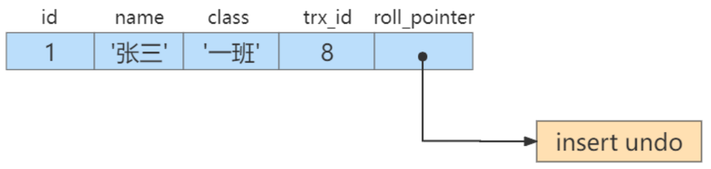

> insert undo只在事务回滚时起作用，当事务提交后，该类型的undo日志就没用了，它占用的Undo Log Segment也会被系统回收（也就是该undo日志占用的Undo页面链表要么被重用，要么被释 放）。
>

假设之后两个事务id分别为 10 、 20 的事务对这条记录进行 UPDATE 操作，操作流程如下：

| 发生时间顺序 | 事务10                                     | 事务20                                     |
| ------------ | ------------------------------------------ | ------------------------------------------ |
| 1            | BEGIN;                                     |                                            |
| 2            |                                            | BEGIN                                      |
| 3            | UPDATE student SET name="李四" WHERE id=1; |                                            |
| 4            | UPDATE student SET name="王五" WHERE id=1; |                                            |
| 5            | COMMIT;                                    |                                            |
| 6            |                                            | UPDATE student SET name="钱七" WHERE id=1; |
| 7            |                                            | UPDATE student SET name="宋八" WHERE id=1; |
| 8            |                                            | COMMIT;                                    |

每次对记录进行改动，都会记录一条undo日志，每条undo日志也都有一个 roll_pointer 属性 （ INSERT 操作对应的undo日志没有该属性，因为该记录并没有更早的版本），可以将这些 undo日志 都连起来，串成一个链表：

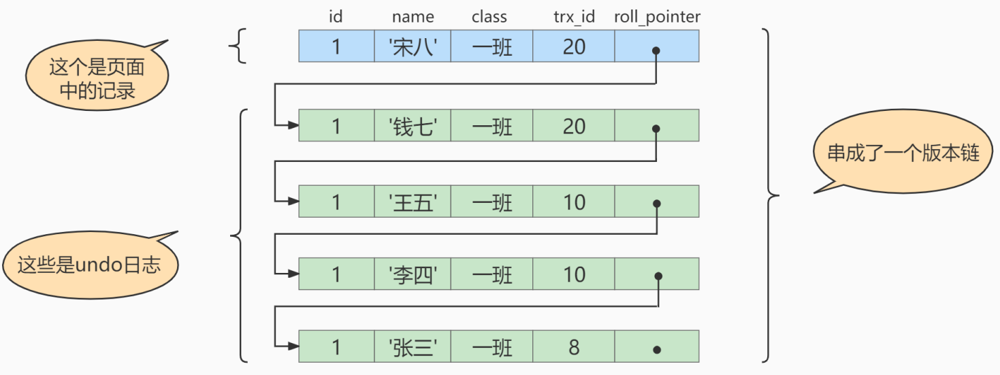

对该记录每次更新后，都会将旧值放到一条 undo日志 中，就算是该记录的一个旧版本，随着更新次数 的增多，所有的版本都会被 roll_pointer 属性连接成一个链表，我们把这个链表称之为 版本链 ，版 本链的头节点就是当前记录最新的值。

每个版本中还包含生成该版本时对应的 事务id 。


### 4. MVCC实现原理之ReadView

MVCC 的实现依赖于：隐藏字段、Undo Log、Read View。


#### 4.1 什么是ReadView

在MVCC机制中，多个事务对同一个行记录进行更新会产生多个历史快照，这些历史快照保存在Undo Log里。如果一个事务想要查询这个行记录，需要读取哪个版本的行记录呢？这时就需要用到ReadView了，它帮我们解决了行的可见性问题。

ReadView就是事务在使用MVCC机制进行快照读操作时产生的读视图。当事务启动时，会生成数据库系统当前的一个快照，InnoDB为每个事务构造了一个数组，用来记录并维护系统当前活跃事务的ID（“活跃"指的就是，启动了但还没提交）。


#### 4.2 设计思路

使用 READ UNCOMMITTED 隔离级别的事务，由于可以读到未提交事务修改过的记录，所以直接读取记录 的最新版本就好了。

使用 SERIALIZABLE 隔离级别的事务，InnoDB规定使用加锁的方式来访问记录。

使用 READ COMMITTED 和 REPEATABLE READ 隔离级别的事务，都必须保证读到 已经提交了的 事务修改 过的记录。假如另一个事务已经修改了记录但是尚未提交，是不能直接读取最新版本的记录的，核心问 题就是需要判断一下版本链中的哪个版本是当前事务可见的，这是ReadView要解决的主要问题。

这个ReadView中主要包含4个比较重要的内容，分别如下：

1. creator_trx_id ，创建这个 Read View 的事务 ID。

> 说明：只有在对表中的记录做改动时（执行INSERT、DELETE、UPDATE这些语句时）才会为 事务分配事务id，否则在一个只读事务中的事务id值都默认为0。
>

2. trx_ids ，表示在生成ReadView时当前系统中活跃的读写事务的 事务id列表 。
3. up_limit_id ，活跃的事务中最小的事务 ID。
4. low_limit_id ，表示生成ReadView时系统中应该分配给下一个事务的 id 值。low_limit_id 是系统最大的事务id值，这里要注意是系统中的事务id，需要区别于正在活跃的事务ID。

> 注意：low_limit_id并不是trx_ids中的最大值，事务id是递增分配的。比如，现在有id为1， 2，3这三个事务，之后id为3的事务提交了。那么一个新的读事务在生成ReadView时， trx_ids就包括1和2，up_limit_id的值就是1，low_limit_id的值就是4。
>


#### 4.3 ReadView的规则

有了这个ReadView，这样在访问某条记录时，只需要按照下边的步骤判断记录的某个版本是否可见。

- 如果被访问版本的trx_id属性值与ReadView中的 creator_trx_id 值相同，意味着当前事务在访问它自己修改过的记录，所以该版本可以被当前事务访问。
- 如果被访问版本的trx_id属性值小于ReadView中的 up_limit_id 值，表明生成该版本的事务在当前事务生成ReadView前已经提交，所以该版本可以被当前事务访问。
- 如果被访问版本的trx_id属性值大于或等于ReadView中的 low_limit_id 值，表明生成该版本的事务在当前事务生成ReadView后才开启，所以该版本不可以被当前事务访问。
- 如果被访问版本的trx_id属性值在ReadView的 up_limit_id 和 low_limit_id 之间，那就需要判断一下trx_id属性值是不是在 trx_ids 列表中。
  - 如果在，说明创建ReadView时生成该版本的事务还是活跃的，该版本不可以被访问。
  - 如果不在，说明创建ReadView时生成该版本的事务已经被提交，该版本可以被访问。


#### 4.4 MVCC整体操作流程

了解了这些概念之后，我们来看下当查询一条记录的时候，系统如何通过MVCC找到它：

1. 首先获取事务自己的版本号，也就是事务 ID；
2. 获取 ReadView；
3. 查询得到的数据，然后与 ReadView 中的事务版本号进行比较；
4. 如果不符合 ReadView 规则，就需要从 Undo Log 中获取历史快照；
5. 最后返回符合规则的数据。

在隔离级别为读已提交（Read Committed）时，一个事务中的每一次 SELECT 查询都会重新获取一次 Read View。

如表所示：

| 事务                               | 说明              |
| ---------------------------------- | ----------------- |
| begin;                             |                   |
| select * from student where id >2; | 获取一次Read View |
| .........                          |                   |
| select * from student where id >2; | 获取一次Read View |
| commit;                            |                   |

> 注意，此时同样的查询语句都会重新获取一次 Read View，这时如果 Read View 不同，就可能产生 不可重复读或者幻读的情况。
>

当隔离级别为可重复读的时候，就避免了不可重复读，这是因为一个事务只在第一次 SELECT 的时候会 获取一次 Read View，而后面所有的 SELECT 都会复用这个 Read View，如下表所示：


### 5. 举例说明

#### 5.1 READ COMMITTED隔离级别下

READ COMMITTED ：每次读取数据前都生成一个ReadView。

现在有两个 事务id 分别为 10 、 20 的事务在执行：

```mysql
# Transaction 10
BEGIN;
UPDATE student SET name="李四" WHERE id=1;
UPDATE student SET name="王五" WHERE id=1;

# Transaction 20
BEGIN;
# 更新了一些别的表的记录
...
```

此刻，表student 中 id 为 1 的记录得到的版本链表如下所示：


假设现在有一个使用 READ COMMITTED 隔离级别的事务开始执行：

```mysql
# 使用READ COMMITTED隔离级别的事务
BEGIN;

# SELECT1：Transaction 10、20未提交
SELECT * FROM student WHERE id = 1; # 得到的列name的值为'张三'
```

之后，我们把 事务id 为 10 的事务提交一下：

```mysql
# Transaction 10
BEGIN;

UPDATE student SET name="李四" WHERE id=1;
UPDATE student SET name="王五" WHERE id=1;

COMMIT;
```

然后再到 事务id 为 20 的事务中更新一下表 student 中 id 为 1 的记录：

```mysql
# Transaction 20
BEGIN;

# 更新了一些别的表的记录
...
UPDATE student SET name="钱七" WHERE id=1;
UPDATE student SET name="宋八" WHERE id=1;
```

此刻，表student中 id 为 1 的记录的版本链就长这样：

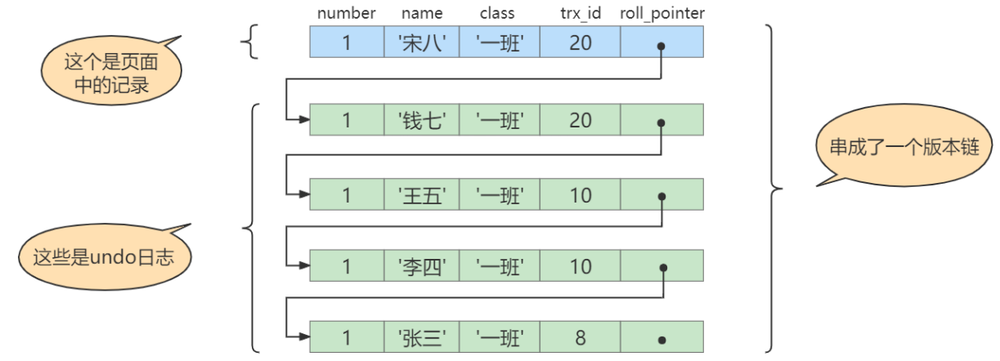

然后再到刚才使用 READ COMMITTED 隔离级别的事务中继续查找这个 id 为 1 的记录，如下：

```mysql
# 使用READ COMMITTED隔离级别的事务
BEGIN;

# SELECT1：Transaction 10、20均未提交
SELECT * FROM student WHERE id = 1; # 得到的列name的值为'张三'

# SELECT2：Transaction 10提交，Transaction 20未提交
SELECT * FROM student WHERE id = 1; # 得到的列name的值为'王五'
```


#### 5.2 REPEATABLE READ隔离级别下

使用 REPEATABLE READ 隔离级别的事务来说，只会在第一次执行查询语句时生成一个 ReadView ，之 后的查询就不会重复生成了。

比如，系统里有两个 事务id 分别为 10 、 20 的事务在执行：

```mysql
# Transaction 10
BEGIN;
UPDATE student SET name="李四" WHERE id=1;
UPDATE student SET name="王五" WHERE id=1;

# Transaction 20
BEGIN;
# 更新了一些别的表的记录
...
```

此刻，表student 中 id 为 1 的记录得到的版本链表如下所示：


假设现在有一个使用 REPEATABLE READ 隔离级别的事务开始执行：

```mysql
# 使用REPEATABLE READ隔离级别的事务
BEGIN;

# SELECT1：Transaction 10、20未提交
SELECT * FROM student WHERE id = 1; # 得到的列name的值为'张三'
```

之后，我们把 事务id 为 10 的事务提交一下，就像这样：

```mysql
# Transaction 10
BEGIN;

UPDATE student SET name="李四" WHERE id=1;
UPDATE student SET name="王五" WHERE id=1;

COMMIT;
```

然后再到 事务id 为 20 的事务中更新一下表 student 中 id 为 1 的记录：

```mysql
# Transaction 20
BEGIN;

# 更新了一些别的表的记录
...
UPDATE student SET name="钱七" WHERE id=1;
UPDATE student SET name="宋八" WHERE id=1;
```

此刻，表student 中 id 为 1 的记录的版本链长这样：

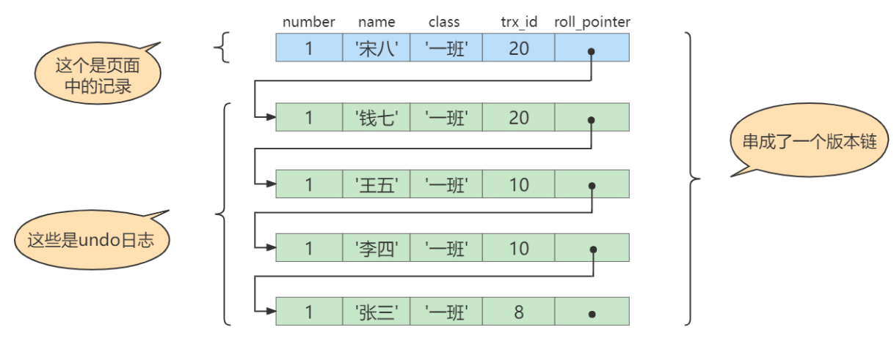

然后再到刚才使用 REPEATABLE READ 隔离级别的事务中继续查找这个 id 为 1 的记录，如下：

```mysql
# 使用REPEATABLE READ隔离级别的事务
BEGIN;

# SELECT1：Transaction 10、20均未提交
SELECT * FROM student WHERE id = 1; # 得到的列name的值为'张三'

# SELECT2：Transaction 10提交，Transaction 20未提交
SELECT * FROM student WHERE id = 1; # 得到的列name的值仍为'张三'
```


#### 5.3 如何解决幻读

接下来说明InnoDB 是如何解决幻读的。

假设现在表 student 中只有一条数据，数据内容中，主键 id=1，隐藏的 trx_id=10，它的 undo log 如下图 所示。


假设现在有事务 A 和事务 B 并发执行， 事务 A 的事务 id 为 20 ， 事务 B 的事务 id 为 30 。

步骤1：事务 A 开始第一次查询数据，查询的 SQL 语句如下。

```mysql
select * from student where id >= 1;
```

在开始查询之前，MySQL 会为事务 A 产生一个 ReadView，此时 ReadView 的内容如下： trx_ids= [20,30] ， up_limit_id=20 ， low_limit_id=31 ， creator_trx_id=20 。

由于此时表 student 中只有一条数据，且符合 where id>=1 条件，因此会查询出来。然后根据 ReadView 机制，发现该行数据的trx_id=10，小于事务 A 的 ReadView 里 up_limit_id，这表示这条数据是事务 A 开 启之前，其他事务就已经提交了的数据，因此事务 A 可以读取到。

结论：事务 A 的第一次查询，能读取到一条数据，id=1。

步骤2：接着事务 B(trx_id=30)，往表 student 中新插入两条数据，并提交事务。

```mysql
insert into student(id,name) values(2,'李四');
insert into student(id,name) values(3,'王五');
```

此时表student 中就有三条数据了，对应的 undo 如下图所示：

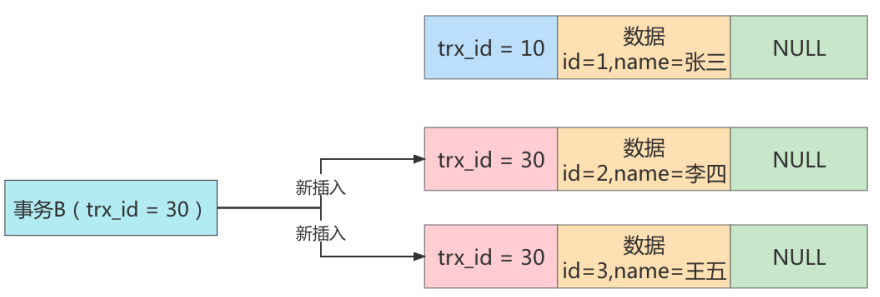

步骤3：接着事务 A 开启第二次查询，根据可重复读隔离级别的规则，此时事务 A 并不会再重新生成 ReadView。此时表 student 中的 3 条数据都满足 where id>=1 的条件，因此会先查出来。然后根据 ReadView 机制，判断每条数据是不是都可以被事务 A 看到。

1. 首先 id=1 的这条数据，前面已经说过了，可以被事务 A 看到。
2. 然后是 id=2 的数据，它的 trx_id=30，此时事务 A 发现，这个值处于 up_limit_id 和 low_limit_id 之
   间，因此还需要再判断 30 是否处于 trx_ids 数组内。由于事务 A 的 trx_ids=[20,30]，因此在数组内，这表
   示 id=2 的这条数据是与事务 A 在同一时刻启动的其他事务提交的，所以这条数据不能让事务 A 看到。
3. 同理，id=3 的这条数据，trx_id 也为 30，因此也不能被事务 A 看见。

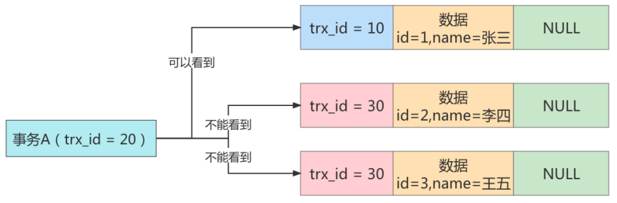

结论：最终事务 A 的第二次查询，只能查询出 id=1 的这条数据。这和事务 A 的第一次查询的结果是一样 的，因此没有出现幻读现象，所以说在 MySQL 的可重复读隔离级别下，不存在幻读问题。


### 6. 总结

这里介绍了 MVCC 在 READ COMMITTD 、 REPEATABLE READ 这两种隔离级别的事务在执行快照读操作时 访问记录的版本链的过程。这样使不同事务的 读-写 、 写-读 操作并发执行，从而提升系统性能。

核心点在于 ReadView 的原理， READ COMMITTD 、 REPEATABLE READ 这两个隔离级别的一个很大不同 就是生成ReadView的时机不同：

- READ COMMITTD 在每一次进行普通SELECT操作前都会生成一个ReadView
- REPEATABLE READ 只在第一次进行普通SELECT操作前生成一个ReadView，之后的查询操作都重复使用这个ReadView就好了。


## 十七、其他数据库日志

我们在讲解数据库事务时，讲过两种日志：重做日志、回滚日志。

对于线上数据库应用系统，突然遭遇数据库宕机怎么办？在这种情况下，定位岩机的原因就非常关键。我们可以查看数据库的错误日志。因为日志中记录了数据库运行中的诊断信息，包括了错误、警告和注释等信息。比如：从日志中发现某个连接中的SQL操作发生了死循环，导致内存不足，被系统强行终止了。明确了原因，处理起来也就轻松了，系统很快就恢复了运行。

除了发现错误，日志在数据复制、数据恢复、操作审计，以及确保数据的永久性和一致性等方面，都有着不可替代的作用。

千万不要小看日志。很多看似奇怪的问题，答案往往就藏在日志里。很多情况下，只有通过查看日志才 能发现问题的原因，真正解决问题。所以，一定要学会查看日志，养成检查日志的习惯，对提升你的数 据库应用开发能力至关重要。


### 1. MySQL支持的日志

#### 1.1 日志类型

MySQL有不同类型的日志文件，用来存储不同类型的日志，分为 二进制日志 、 错误日志 、 通用查询日志 和 慢查询日志 ，这也是常用的4种。MySQL 8又新增两种支持的日志： 中继日志 和 数据定义语句日志 。使 用这些日志文件，可以查看MySQL内部发生的事情。

这6类日志分别为：

- **慢查询日志**：记录所有执行时间超过long_query_time的所有查询，方便我们对查询进行优化。
- **通用查询日志**：记录所有连接的起始时间和终止时间，以及连接发送给数据库服务器的所有指令，对我们复原操作的实际场景、发现问题，甚至是对数据库操作的审计都有很大的帮助。
- **错误日志**：记录MySQL服务的启动、运行或停止MySQL服务时出现的问题，方便我们了解服务器的状态，从而对服务器进行维护。
- **二进制日志**：记录所有更改数据的语句，可以用于主从服务器之间的数据同步，以及服务器遇到故障时数据的无损失恢复。
- **中继日志**：用于主从服务器架构中，从服务器用来存放主服务器二进制日志内容的一个中间文件。从服务器通过读取中继日志的内容，来同步主服务器上的操作。
- **数据定义语句日志**：记录数据定义语句执行的元数据操作。

除二进制日志外，其他日志都是 文本文件 。默认情况下，所有日志创建于 MySQL数据目录 中。


#### 1.2 日志的弊端

- 日志功能会 降低MySQL数据库的性能 。
- 日志会 占用大量的磁盘空间 。


### 2. 慢查询日志(slow query log)

前面章节《第09章_性能分析工具的使用》已经详细讲述。


### 3. 通用查询日志(general query log)

通用查询日志用来 记录用户的所有操作 ，包括启动和关闭MySQL服务、所有用户的连接开始时间和截止 时间、发给 MySQL 数据库服务器的所有 SQL 指令等。当我们的数据发生异常时，查看通用查询日志， 还原操作时的具体场景，可以帮助我们准确定位问题。

#### 3.1 查看当前状态

```mysql
mysql> SHOW VARIABLES LIKE '%general%';
+------------------+------------------------------+
| Variable_name    | Value 						  |
+------------------+------------------------------+
| general_log 	   | OFF 						  | #通用查询日志处于关闭状态
| general_log_file | /var/lib/mysql/atguigu01.log | #通用查询日志文件的名称是atguigu01.log
+------------------+------------------------------+
2 rows in set (0.03 sec)
```


#### 3.2 启动日志

**方式1：永久性方式**

修改my.cnf或者my.ini配置文件来设置。在[mysqld]组下加入log选项，并重启MySQL服务。格式如下：

```properties
[mysqld]
general_log=ON
general_log_file=[path[filename]] #日志文件所在目录路径，filename为日志文件名
```

如果不指定目录和文件名，通用查询日志将默认存储在MySQL数据目录中的hostname.log文件中， hostname表示主机名。


**方式2：临时性方式**

```mysql
SET GLOBAL general_log=on; # 开启通用查询日志
```

```mysql
SET GLOBAL general_log_file=’path/filename’; # 设置日志文件保存位置
```

对应的，关闭操作SQL命令如下：

```mysql
SET GLOBAL general_log=off; # 关闭通用查询日志
```

查看设置后情况：

```mysql
SHOW VARIABLES LIKE 'general_log%';
```


#### 3.3 查看日志

通用查询日志是以 文本文件 的形式存储在文件系统中的，可以使用 文本编辑器 直接打开日志文件。每台 MySQL服务器的通用查询日志内容是不同的。

- 在Windows操作系统中，使用文本文件查看器；
- 在Linux系统中，可以使用vi工具或者gedit工具查看；
- 在Mac OSX系统中，可以使用文本文件查看器或者vi等工具查看。

从 SHOW VARIABLES LIKE 'general_log%'; 结果中可以看到通用查询日志的位置。

```mysql
/usr/sbin/mysqld, Version: 8.0.26 (MySQL Community Server - GPL). started with:
Tcp port: 3306 Unix socket: /var/lib/mysql/mysql.sock
Time Id Command Argument
2022-01-04T07:44:58.052890Z 10 Query SHOW VARIABLES LIKE '%general%'
2022-01-04T07:45:15.666672Z 10 Query SHOW VARIABLES LIKE 'general_log%'
2022-01-04T07:45:28.970765Z 10 Query select * from student
2022-01-04T07:47:38.706804Z 11 Connect root@localhost on using Socket
2022-01-04T07:47:38.707435Z 11 Query select @@version_comment limit 1
2022-01-04T07:48:21.384886Z 12 Connect root@172.16.210.1 on using TCP/IP
2022-01-04T07:48:21.385253Z 12 Query SET NAMES utf8
2022-01-04T07:48:21.385640Z 12 Query USE `atguigu12`
2022-01-04T07:48:21.386179Z 12 Query SHOW FULL TABLES WHERE Table_Type !=
'VIEW'
2022-01-04T07:48:23.901778Z 13 Connect root@172.16.210.1 on using TCP/IP
2022-01-04T07:48:23.902128Z 13 Query SET NAMES utf8
2022-01-04T07:48:23.905179Z 13 Query USE `atguigu`
2022-01-04T07:48:23.905825Z 13 Query SHOW FULL TABLES WHERE Table_Type !=
'VIEW'
2022-01-04T07:48:32.163833Z 14 Connect root@172.16.210.1 on using TCP/IP
2022-01-04T07:48:32.164451Z 14 Query SET NAMES utf8
2022-01-04T07:48:32.164840Z 14 Query USE `atguigu`
2022-01-04T07:48:40.006687Z 14 Query select * from account
```

在通用查询日志里面，我们可以清楚地看到，什么时候开启了新的客户端登陆数据库，登录之后做了什 么 SQL 操作，针对的是哪个数据表等信息。


#### 3.5 停止日志

**方式1：永久性方式**

修改 my.cnf 或者 my.ini 文件，把[mysqld]组下的 general_log 值设置为 OFF 或者把general_log一项 注释掉。修改保存后，再 重启MySQL服务 ，即可生效。 

举例1：

```properties
[mysqld]
general_log=OFF
```

举例2：

```properties
[mysqld]
#general_log=ON
```


**方式2：临时性方式**

使用SET语句停止MySQL通用查询日志功能：

```properties
SET GLOBAL general_log=off;
```

查询通用日志功能：

```mysql
SHOW VARIABLES LIKE 'general_log%';
```


#### 3.6 删除\刷新日志

如果数据的使用非常频繁，那么通用查询日志会占用服务器非常大的磁盘空间。数据管理员可以删除很 长时间之前的查询日志，以保证MySQL服务器上的硬盘空间。

**手动删除文件**

```mysql
SHOW VARIABLES LIKE 'general_log%';
```

可以看出，通用查询日志的目录默认为MySQL数据目录。在该目录下手动删除通用查询日志 atguigu01.log。

使用如下命令重新生成查询日志文件，具体命令如下。刷新MySQL数据目录，发现创建了新的日志文 件。前提一定要开启通用日志。

```
mysqladmin -uroot -p flush-logs
```


### 4. 错误日志(error log)

#### 4.1 启动日志

在MySQL数据库中，错误日志功能是 默认开启 的。而且，错误日志 无法被禁止 。

默认情况下，错误日志存储在MySQL数据库的数据文件夹下，名称默认为 mysqld.log （Linux系统）或 hostname.err （mac系统）。如果需要制定文件名，则需要在my.cnf或者my.ini中做如下配置：

```properties
[mysqld]
log-error=[path/[filename]] #path为日志文件所在的目录路径，filename为日志文件名
```

修改配置项后，需要重启MySQL服务以生效。


#### 4.2 查看日志

MySQL错误日志是以文本文件形式存储的，可以使用文本编辑器直接查看。

查询错误日志的存储路径：

```mysql
mysql> SHOW VARIABLES LIKE 'log_err%';
+----------------------------+----------------------------------------+
| Variable_name 			 | Value 								  |
+----------------------------+----------------------------------------+
| log_error 				 | /var/log/mysqld.log 					  |
| log_error_services 		 | log_filter_internal; log_sink_internal |
| log_error_suppression_list | 										  |
| log_error_verbosity 		 | 2 									  |
+----------------------------+----------------------------------------+
4 rows in set (0.01 sec)
```

执行结果中可以看到错误日志文件是mysqld.log，位于MySQL默认的数据目录下。


#### 4.3 删除\刷新日志

对于很久以前的错误日志，数据库管理员查看这些错误日志的可能性不大，可以将这些错误日志删除， 以保证MySQL服务器上的 硬盘空间 。MySQL的错误日志是以文本文件的形式存储在文件系统中的，可以 直接删除 。

```mysql
[root@atguigu01 log]# mysqladmin -uroot -p flush-logs
Enter password:
mysqladmin: refresh failed; error: 'Could not open file '/var/log/mysqld.log' for
error logging.'
```

官网提示：

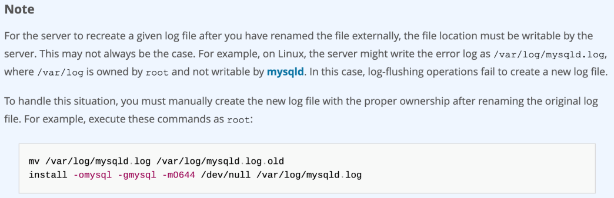

补充操作：

```mysql
install -omysql -gmysql -m0644 /dev/null /var/log/mysqld.log
```


### 5. 二进制日志(bin log)

binlog可以说是MySQL中比较 重要 的日志了，在日常开发及运维过程中，经常会遇到。

binlog即binary log，二进制日志文件，也叫作变更日志（update log）。它记录了数据库所有执行的 DDL 和 DML 等数据库更新事件的语句，但是不包含没有修改任何数据的语句（如数据查询语句select、 show等）。

binlog主要应用场景：

- 一是用于 数据恢复
- 二是用于 数据复制

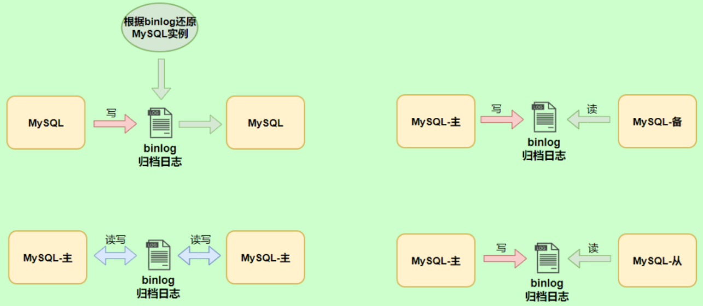


#### 5.1 查看默认情况

查看记录二进制日志是否开启：在MySQL8中默认情况下，二进制文件是开启的。

```mysql
mysql> show variables like '%log_bin%';
+---------------------------------+----------------------------------+
| Variable_name 				  | Value 							 |
+---------------------------------+----------------------------------+
| log_bin 						  | ON 								 |
| log_bin_basename 				  | /var/lib/mysql/binlog 			 |
| log_bin_index 				  | /var/lib/mysql/binlog.index 	 |
| log_bin_trust_function_creators | OFF 							 |
| log_bin_use_v1_row_events 	  | OFF 							 |
| sql_log_bin 					  | ON 								 |
+---------------------------------+----------------------------------+
6 rows in set (0.00 sec)
```


#### 5.2 日志参数设置

**方式1：永久性方式**

修改MySQL的 my.cnf 或 my.ini 文件可以设置二进制日志的相关参数：

```properties
[mysqld]
#启用二进制日志
log-bin=atguigu-bin
binlog_expire_logs_seconds=600
max_binlog_size=100M
```

重新启动MySQL服务，查询二进制日志的信息，执行结果：

```mysql
mysql> show variables like '%log_bin%';
+---------------------------------+----------------------------------+
| Variable_name 				  | Value 							 |
+---------------------------------+----------------------------------+
| log_bin 						  | ON 								 |
| log_bin_basename 				  | /var/lib/mysql/atguigu-bin 		 |
| log_bin_index 				  | /var/lib/mysql/atguigu-bin.index |
| log_bin_trust_function_creators | OFF 							 |
| log_bin_use_v1_row_events 	  | OFF 							 |
| sql_log_bin 					  | ON 								 |
+---------------------------------+----------------------------------+
6 rows in set (0.00 sec)
```

**设置带文件夹的bin-log日志存放目录**

如果想改变日志文件的目录和名称，可以对my.cnf或my.ini中的log_bin参数修改如下：

```mysql
[mysqld]
log-bin="/var/lib/mysql/binlog/atguigu-bin"
```

注意：新建的文件夹需要使用mysql用户，使用下面的命令即可。

```mysql
chown -R -v mysql:mysql binlog
```


**方式2：临时性方式**

如果不希望通过修改配置文件并重启的方式设置二进制日志的话，还可以使用如下指令，需要注意的是 在mysql8中只有 会话级别 的设置，没有了global级别的设置。

```mysql
# global 级别
mysql> set global sql_log_bin=0;
ERROR 1228 (HY000): Variable 'sql_log_bin' is a SESSION variable and can`t be used
with SET GLOBAL

# session级别
mysql> SET sql_log_bin=0;
Query OK, 0 rows affected (0.01 秒)
```


#### 5.3 查看日志

当MySQL创建二进制日志文件时，先创建一个以“filename”为名称、以“.index”为后缀的文件，再创建一 个以“filename”为名称、以“.000001”为后缀的文件。

MySQL服务 重新启动一次 ，以“.000001”为后缀的文件就会增加一个，并且后缀名按1递增。即日志文件的 个数与MySQL服务启动的次数相同；如果日志长度超过了 max_binlog_size 的上限（默认是1GB），就 会创建一个新的日志文件。

查看当前的二进制日志文件列表及大小。指令如下：

```mysql
mysql> SHOW BINARY LOGS;
+--------------------+-----------+-----------+
| Log_name 			 | File_size | Encrypted |
+--------------------+-----------+-----------+
| atguigu-bin.000001 | 156 		 | No 		 |
+--------------------+-----------+-----------+
1 行于数据集 (0.02 秒)
```

下面命令将行事件以 伪SQL的形式 表现出来

```mysql
mysqlbinlog -v "/var/lib/mysql/binlog/atguigu-bin.000002"
#220105 9:16:37 server id 1 end_log_pos 324 CRC32 0x6b31978b Query thread_id=10
exec_time=0 error_code=0
SET TIMESTAMP=1641345397/*!*/;
SET @@session.pseudo_thread_id=10/*!*/;
SET @@session.foreign_key_checks=1, @@session.sql_auto_is_null=0,
@@session.unique_checks=1, @@session.autocommit=1/*!*/;
SET @@session.sql_mode=1168113696/*!*/;
SET @@session.auto_increment_increment=1, @@session.auto_increment_offset=1/*!*/;
/*!\C utf8mb3 *//*!*/;
SET
@@session.character_set_client=33,@@session.collation_connection=33,@@session.collatio
n_server=255/*!*/;
SET @@session.lc_time_names=0/*!*/;
SET @@session.collation_database=DEFAULT/*!*/;
/*!80011 SET @@session.default_collation_for_utf8mb4=255*//*!*/;
BEGIN
/*!*/;
# at 324
#220105 9:16:37 server id 1 end_log_pos 391 CRC32 0x74f89890 Table_map:
`atguigu14`.`student` mapped to number 85
# at 391
#220105 9:16:37 server id 1 end_log_pos 470 CRC32 0xc9920491 Update_rows: table id
85 flags: STMT_END_F
BINLOG '
dfHUYRMBAAAAQwAAAIcBAAAAAFUAAAAAAAEACWF0Z3VpZ3UxNAAHc3R1ZGVudAADAw8PBDwAHgAG
AQEAAgEhkJj4dA==
dfHUYR8BAAAATwAAANYBAAAAAFUAAAAAAAEAAgAD//8AAQAAAAblvKDkuIkG5LiA54+tAAEAAAAL
5byg5LiJX2JhY2sG5LiA54+tkQSSyQ==
'/*!*/;
### UPDATE `atguigu`.`student`
### WHERE
### @1=1
### @2='张三'
### @3='一班'
### SET
### @1=1
### @2='张三_back'
### @3='一班'
# at 470
#220105 9:16:37 server id 1 end_log_pos 501 CRC32 0xca01d30f Xid = 15
COMMIT/*!*/;
```

前面的命令同时显示binlog格式的语句，使用如下命令不显示它

```mysql
mysqlbinlog -v --base64-output=DECODE-ROWS "/var/lib/mysql/binlog/atguigu-bin.000002"
#220105 9:16:37 server id 1 end_log_pos 324 CRC32 0x6b31978b Query thread_id=10
exec_time=0 error_code=0
SET TIMESTAMP=1641345397/*!*/;
SET @@session.pseudo_thread_id=10/*!*/;
SET @@session.foreign_key_checks=1, @@session.sql_auto_is_null=0,
@@session.unique_checks=1, @@session.autocommit=1/*!*/;
SET @@session.sql_mode=1168113696/*!*/;
SET @@session.auto_increment_increment=1, @@session.auto_increment_offset=1/*!*/;
/*!\C utf8mb3 *//*!*/;
SET
@@session.character_set_client=33,@@session.collation_connection=33,@@session.collatio
n_server=255/*!*/;
SET @@session.lc_time_names=0/*!*/;
SET @@session.collation_database=DEFAULT/*!*/;
/*!80011 SET @@session.default_collation_for_utf8mb4=255*//*!*/;
BEGIN
/*!*/;
# at 324
#220105 9:16:37 server id 1 end_log_pos 391 CRC32 0x74f89890 Table_map:
`atguigu14`.`student` mapped to number 85
# at 391
#220105 9:16:37 server id 1 end_log_pos 470 CRC32 0xc9920491 Update_rows: table id
85 flags: STMT_END_F
### UPDATE `atguigu14`.`student`
### WHERE
### @1=1
### @2='张三'
### @3='一班'
### SET
### @1=1
### @2='张三_back'
### @3='一班'
# at 470
#220105 9:16:37 server id 1 end_log_pos 501 CRC32 0xca01d30f Xid = 15
```

关于mysqlbinlog工具的使用技巧还有很多，例如只解析对某个库的操作或者某个时间段内的操作等。简 单分享几个常用的语句，更多操作可以参考官方文档。

```mysql
# 可查看参数帮助
mysqlbinlog --no-defaults --help

# 查看最后100行
mysqlbinlog --no-defaults --base64-output=decode-rows -vv atguigu-bin.000002 |tail -100

# 根据position查找
mysqlbinlog --no-defaults --base64-output=decode-rows -vv atguigu-bin.000002 |grep -A 20 '4939002'
```

上面这种办法读取出binlog日志的全文内容比较多，不容易分辨查看到pos点信息，下面介绍一种更为方 便的查询命令：

```mysql
mysql> show binlog events [IN 'log_name'] [FROM pos] [LIMIT [offset,] row_count];
```

- IN 'log_name' ：指定要查询的binlog文件名（不指定就是第一个binlog文件）　
- FROM pos ：指定从哪个pos起始点开始查起（不指定就是从整个文件首个pos点开始算）
- LIMIT [offset] ：偏移量(不指定就是0)
- row_count :查询总条数（不指定就是所有行）

```mysql
mysql> show binlog events in 'atguigu-bin.000002';
+--------------------+-----+----------------+-----------+-------------+---------------
--------------------------------------------------------------+
| Log_name | Pos | Event_type | Server_id | End_log_pos | Info
|
+--------------------+-----+----------------+-----------+-------------+---------------
--------------------------------------------------------------+
| atguigu-bin.000002 | 4 | Format_desc | 1 | 125 | Server ver:
8.0.26, Binlog ver: 4 |
| atguigu-bin.000002 | 125 | Previous_gtids | 1 | 156 |
|
| atguigu-bin.000002 | 156 | Anonymous_Gtid | 1 | 235 | SET
@@SESSION.GTID_NEXT= 'ANONYMOUS' |
| atguigu-bin.000002 | 235 | Query | 1 | 324 | BEGIN
|
| atguigu-bin.000002 | 324 | Table_map | 1 | 391 | table_id: 85
(atguigu14.student) |
| atguigu-bin.000002 | 391 | Update_rows | 1 | 470 | table_id: 85
flags: STMT_END_F |
| atguigu-bin.000002 | 470 | Xid | 1 | 501 | COMMIT /*
xid=15 */ |
| atguigu-bin.000002 | 501 | Anonymous_Gtid | 1 | 578 | SET
@@SESSION.GTID_NEXT= 'ANONYMOUS' |
| atguigu-bin.000002 | 578 | Query | 1 | 721 | use
`atguigu14`; create table test(id int, title varchar(100)) /* xid=19 */ |
| atguigu-bin.000002 | 721 | Anonymous_Gtid | 1 | 800 | SET
@@SESSION.GTID_NEXT= 'ANONYMOUS' |
| atguigu-bin.000002 | 800 | Query | 1 | 880 | BEGIN
|
| atguigu-bin.000002 | 880 | Table_map | 1 | 943 | table_id: 89
(atguigu14.test) |
| atguigu-bin.000002 | 943 | Write_rows | 1 | 992 | table_id: 89
flags: STMT_END_F |
| atguigu-bin.000002 | 992 | Xid | 1 | 1023 | COMMIT /*
xid=21 */ 
+--------------------+-----+----------------+-----------+-------------+---------------
--------------------------------------------------------------+
14 行于数据集 (0.02 秒)

```

上面我们讲了这么多都是基于binlog的默认格式，binlog格式查看

```mysql
mysql> show variables like 'binlog_format';
+---------------+-------+
| Variable_name | Value |
+---------------+-------+
| binlog_format | ROW |
+---------------+-------+
1 行于数据集 (0.02 秒)
```

除此之外，binlog还有2种格式，分别是Statement和Mixed

- Statement

每一条会修改数据的sql都会记录在binlog中。 

优点：不需要记录每一行的变化，减少了binlog日志量，节约了IO，提高性能。

- Row

5.1.5版本的MySQL才开始支持row level 的复制，它不记录sql语句上下文相关信息，仅保存哪条记录被修 改。 

优点：row level 的日志内容会非常清楚的记录下每一行数据修改的细节。而且不会出现某些特定情况下 的存储过程，或function，以及trigger的调用和触发无法被正确复制的问题。

- Mixed

从5.1.8版本开始，MySQL提供了Mixed格式，实际上就是Statement与Row的结合。

详细情况，下章讲解。


#### 5.4 使用日志恢复数据

mysqlbinlog恢复数据的语法如下：

```mysql
mysqlbinlog [option] filename|mysql –uuser -ppass;
```

这个命令可以这样理解：使用mysqlbinlog命令来读取filename中的内容，然后使用mysql命令将这些内容 恢复到数据库中。

- filename ：是日志文件名。
- option ：可选项，比较重要的两对option参数是--start-date、--stop-date 和 --start-position、--stop-position。
  - --start-date 和 --stop-date ：可以指定恢复数据库的起始时间点和结束时间点。
  - --start-position和--stop-position ：可以指定恢复数据的开始位置和结束位置。

> 注意：使用mysqlbinlog命令进行恢复操作时，必须是编号小的先恢复，例如atguigu-bin.000001必 须在atguigu-bin.000002之前恢复。


#### 5.5 删除二进制日志

MySQL的二进制文件可以配置自动删除，同时MySQL也提供了安全的手动删除二进制文件的方法。 PURGE MASTER LOGS 只删除指定部分的二进制日志文件， RESET MASTER 删除所有的二进制日志文 件。具体如下：

1. PURGE MASTER LOGS：删除指定日志文件

PURGE MASTER LOGS语法如下：

```mysql
PURGE {MASTER | BINARY} LOGS TO ‘指定日志文件名’
PURGE {MASTER | BINARY} LOGS BEFORE ‘指定日期’
```


#### 5.6 其它场景

二进制日志可以通过数据库的 全量备份 和二进制日志中保存的 增量信息 ，完成数据库的 无损失恢复 。 但是，如果遇到数据量大、数据库和数据表很多（比如分库分表的应用）的场景，用二进制日志进行数 据恢复，是很有挑战性的，因为起止位置不容易管理。

在这种情况下，一个有效的解决办法是 配置主从数据库服务器 ，甚至是 一主多从 的架构，把二进制日志 文件的内容通过中继日志，同步到从数据库服务器中，这样就可以有效避免数据库故障导致的数据异常 等问题。


### 6. 再谈二进制日志(binlog)

#### 6.1 写入机制

binlog的写入时机也非常简单，事务执行过程中，先把日志写到 binlog cache ，事务提交的时候，再 把binlog cache写到binlog文件中。因为一个事务的binlog不能被拆开，无论这个事务多大，也要确保一 次性写入，所以系统会给每个线程分配一个块内存作为binlog cache。

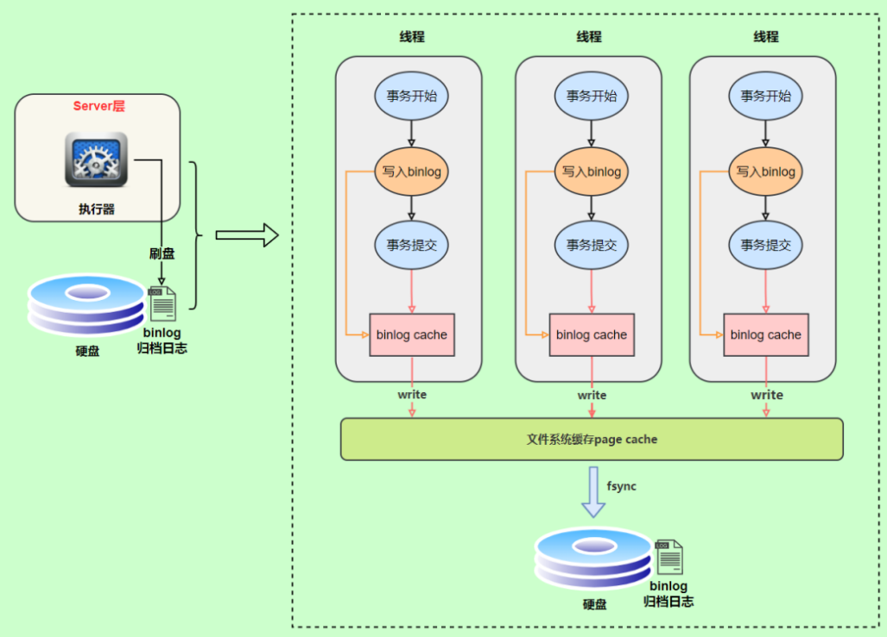

write和fsync的时机，可以由参数 sync_binlog 控制，默认是 0 。为0的时候，表示每次提交事务都只 write，由系统自行判断什么时候执行fsync。虽然性能得到提升，但是机器宕机，page cache里面的 binglog 会丢失。如下图：

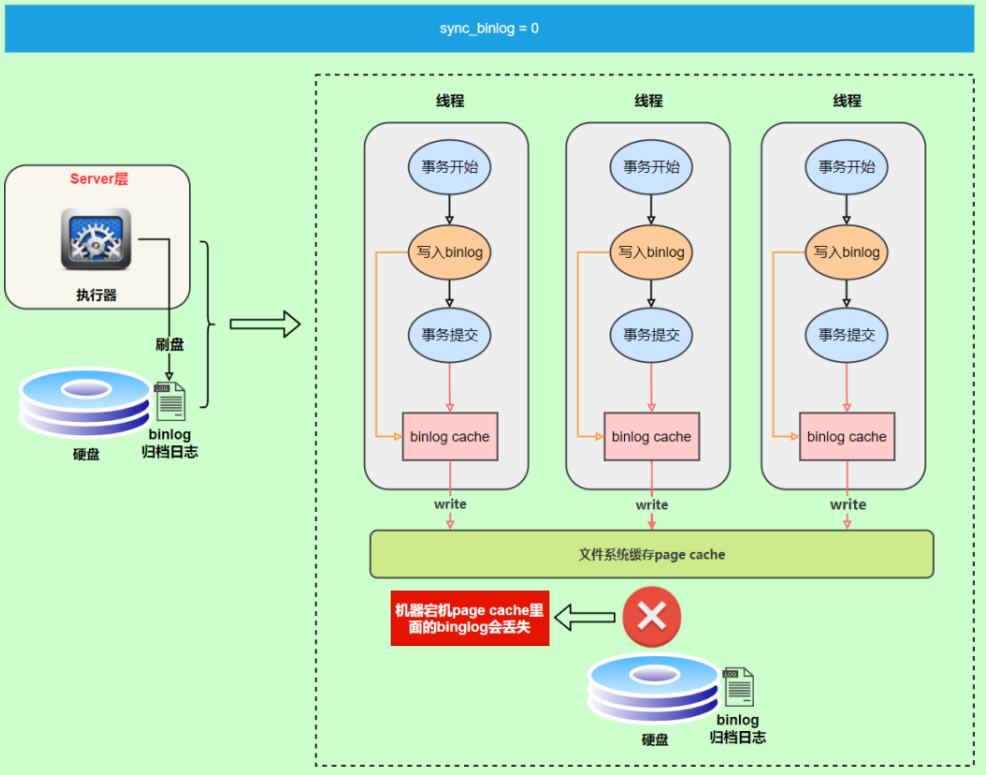

为了安全起见，可以设置为 1 ，表示每次提交事务都会执行fsync，就如同redo log 刷盘流程一样。 最后还有一种折中方式，可以设置为N(N>1)，表示每次提交事务都write，但累积N个事务后才fsync。

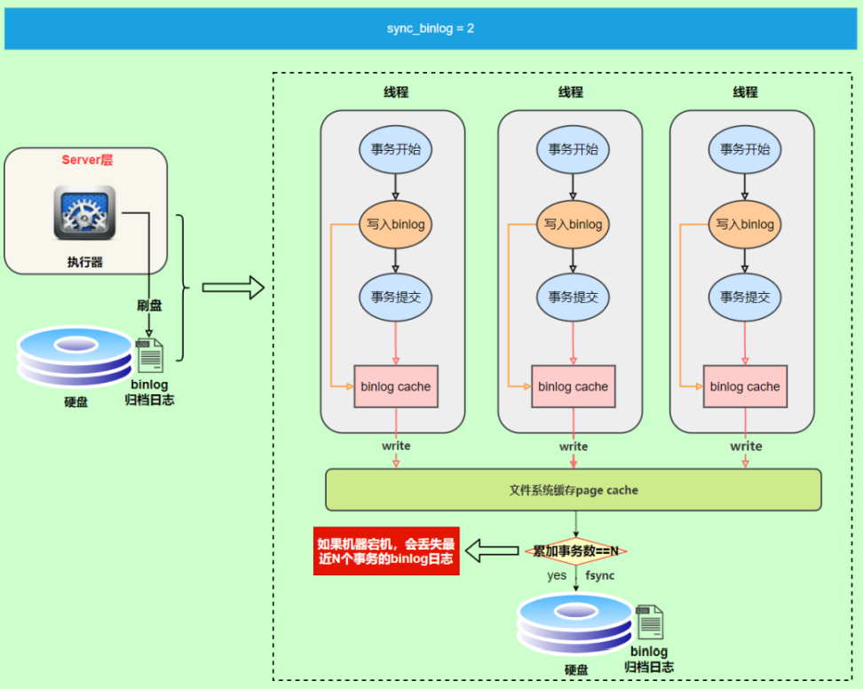

在出现IO瓶颈的场景里，将sync_binlog设置成一个比较大的值，可以提升性能。同样的，如果机器宕 机，会丢失最近N个事务的binlog日志。


#### 6.2 binlog与redolog对比

- redo log 它是 物理日志 ，记录内容是“在某个数据页上做了什么修改”，属于 InnoDB 存储引擎层产生的。
- 而 binlog 是 逻辑日志 ，记录内容是语句的原始逻辑，类似于“给 ID=2 这一行的 c 字段加 1”，属于MySQL Server 层。


#### 6.3 两阶段提交

在执行更新语句过程，会记录redo log与binlog两块日志，以基本的事务为单位，redo log在事务执行过程 中可以不断写入，而binlog只有在提交事务时才写入，所以redo log与binlog的 写入时机 不一样。

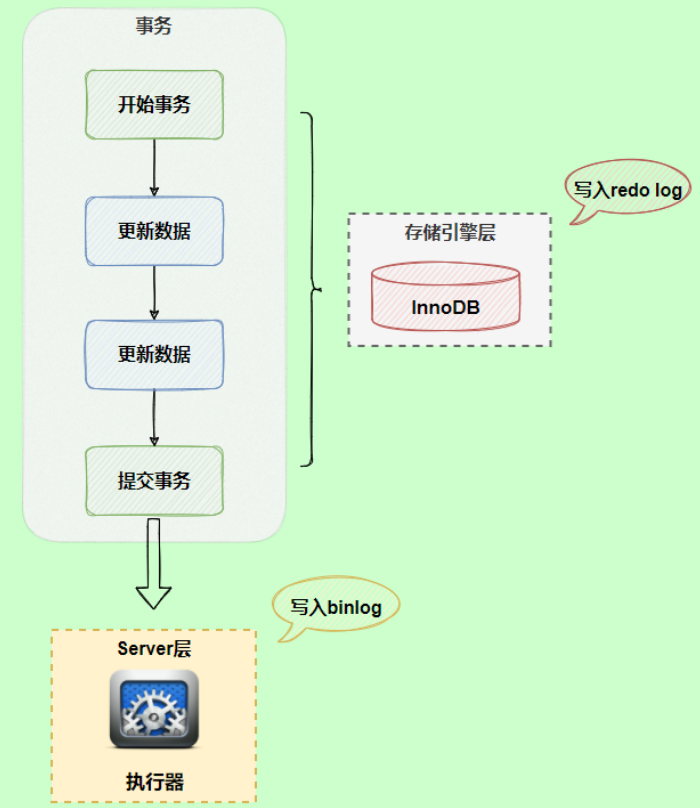


redo log与binlog两份日志之间的逻辑不一致，会出现什么问题？

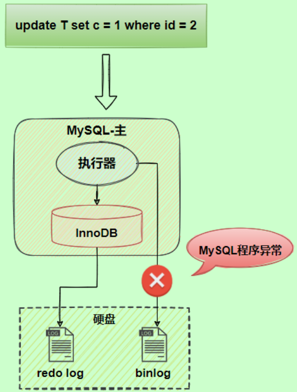

由于binlog没写完就异常，这时候binlog里面没有对应的修改记录。

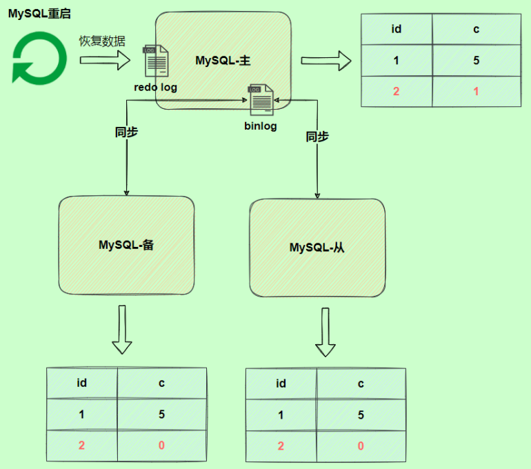

为了解决两份日志之间的逻辑一致问题，InnoDB存储引擎使用两阶段提交方案。

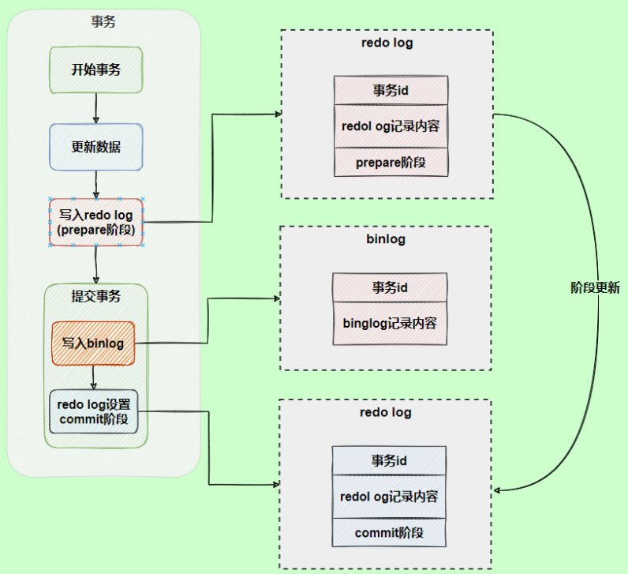

使用两阶段提交后，写入binlog时发生异常也不会有影响

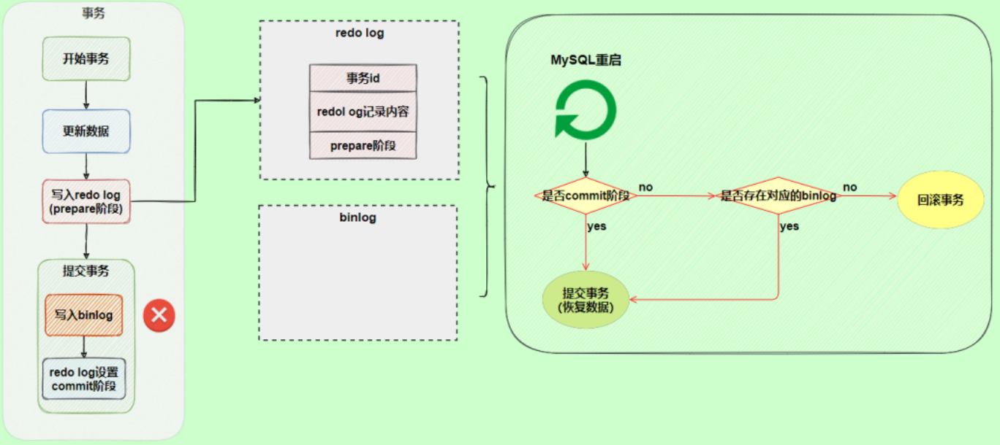

另一个场景，redo log设置commit阶段发生异常，那会不会回滚事务呢？

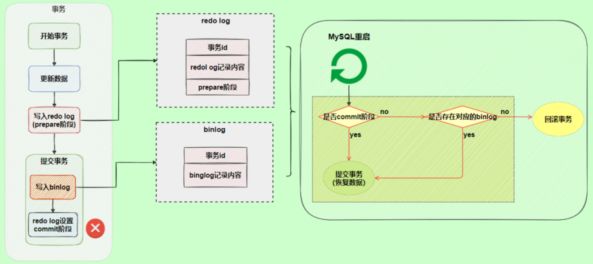

并不会回滚事务，它会执行上图框住的逻辑，虽然redo log是处于prepare阶段，但是能通过事务id找到对 应的binlog日志，所以MySQL认为是完整的，就会提交事务恢复数据。


### 7. 中继日志(relay log)

#### 7.1 介绍

中继日志只在主从服务器架构的从服务器上存在。从服务器为了与主服务器保持一致，要从主服务器读 取二进制日志的内容，并且把读取到的信息写入 本地的日志文件 中，这个从服务器本地的日志文件就叫 中继日志 。然后，从服务器读取中继日志，并根据中继日志的内容对从服务器的数据进行更新，完成主 从服务器的 数据同步 。

搭建好主从服务器之后，中继日志默认会保存在从服务器的数据目录下。

文件名的格式是： 从服务器名 -relay-bin.序号 。中继日志还有一个索引文件： 从服务器名 -relaybin.index ，用来定位当前正在使用的中继日志。


#### 7.2 查看中继日志

中继日志与二进制日志的格式相同，可以用 mysqlbinlog 工具进行查看。下面是中继日志的一个片 段：

```mysql
SET TIMESTAMP=1618558728/*!*/;
BEGIN
/*!*/;
# at 950
#210416 15:38:48 server id 1 end_log_pos 832 CRC32 0xcc16d651 Table_map:
`atguigu`.`test` mapped to number 91
# at 1000
#210416 15:38:48 server id 1 end_log_pos 872 CRC32 0x07e4047c Delete_rows: table id
91 flags: STMT_END_F -- server id 1 是主服务器，意思是主服务器删了一行数据
BINLOG '
CD95YBMBAAAAMgAAAEADAAAAAFsAAAAAAAEABGRlbW8ABHRlc3QAAQMAAQEBAFHWFsw=
CD95YCABAAAAKAAAAGgDAAAAAFsAAAAAAAEAAgAB/wABAAAAfATkBw==
'/*!*/;
# at 1040
```

这一段的意思是，主服务器（“server id 1”）对表 atguigu.test 进行了 2 步操作：

```mysql
定位到表 atguigu.test 编号是 91 的记录，日志位置是 832；
删除编号是 91 的记录，日志位置是 872。
```


#### 7.3 恢复的典型错误

如果从服务器宕机，有的时候为了系统恢复，要重装操作系统，这样就可能会导致你的 服务器名称 与之 前 不同 。而中继日志里是 包含从服务器名 的。在这种情况下，就可能导致你恢复从服务器的时候，无法 从宕机前的中继日志里读取数据，以为是日志文件损坏了，其实是名称不对了。

解决的方法也很简单，把从服务器的名称改回之前的名称。


## 十八、主从复制

### 1. 主从复制概述

#### 1.1 如何提升数据库并发能力

在实际工作中，我们常常将Redis作为缓存与MySQL配合来使用，当有请求的时候，首先会从缓存中进行查找，如果存在就直接取出。如果不存在再访问数据库，这样就提升了读取的效率，也减少了对后端数据库的访问压力。Redis的缓存架构是高并发架构中非常重要的一环。

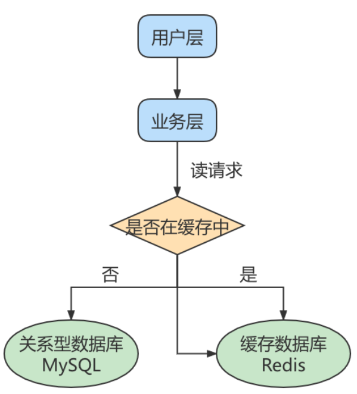

此外，一般应用对数据库而言都是“ 读多写少 ”，也就说对数据库读取数据的压力比较大，有一个思路就 是采用数据库集群的方案，做 主从架构 、进行 读写分离 ，这样同样可以提升数据库的并发处理能力。但 并不是所有的应用都需要对数据库进行主从架构的设置，毕竟设置架构本身是有成本的。

如果我们的目的在于提升数据库高并发访问的效率，那么首先考虑的是如何 优化SQL和索引 ，这种方式 简单有效；其次才是采用 缓存的策略 ，比如使用 Redis将热点数据保存在内存数据库中，提升读取的效 率；最后才是对数据库采用 主从架构 ，进行读写分离。


#### 1.2 主从复制的作用

主从同步设计不仅可以提高数据库的吞吐量，还有以下 3 个方面的作用。

**第1个作用：读写分离。**我们可以通过主从复制的方式来同步数据，然后通过读写分离提高数据库并发处理能力。

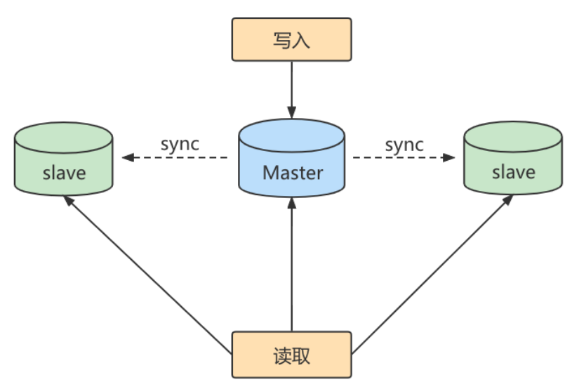

其中一个是Master主库，负责写入数据，我们称之为：写库。

其它都是slave从库，负责读取数据，我们称之为：读库。

当主库进行更新的时候，会自动将数据复制到从库中，而我们在客户端读取数据的时候，会从从库中进行读取。

面对“读多写少”的需求，采用读写分离的方式，可以实现更高的并发访问。同时，我们还能对从服务器进行负载均衡，让不同的读请求按照策略均匀地分发到不同的从服务器上，让读取更加顺畅。读取顺畅的另一个原因，就是减少了锁表的影响，比如我们让主库负责写，当主库出现写锁的时候，不会影响到从库进行SELECT的读取。


**第2个作用就是数据备份。**我们通过主从复制将主库上的数据复制到了从库上，相当于是一种热备份机制，也就是在主库正常运行的情况下进行的备份，不会影响到服务。


**第3个作用是具有高可用性**。数据备份实际上是一种冗余的机制，通过这种冗余的方式可以换取数据库的高可用性，也就是当服务器出现故障或宕机的情况下，可以切换到从服务器上，保证服务的正常运行。

关于高可用性的程度，我们可以用一个指标衡量，即正常可用时间/全年时间。比如要达到全年99.999%的时间都可用，就意味着系统在一年中的不可用时间不得超过365 * 24 * 60 * (1-99.999%) = 5.256分钟（含系统崩溃的时间、日常维护操作导致的停机时间等），其他时间都需要保持可用的状态。

实际上，更高的高可用性，意味着需要付出更高的成本代价。在现实中我们需要结合业务需求和成本来进行选择。


### 2. 主从复制的原理

Slave 会从 Master 读取 binlog 来进行数据同步。


#### 2.1 原理剖析

**三个线程**

实际上主从同步的原理就是基于 binlog 进行数据同步的。在主从复制过程中，会基于 3 个线程 来操 作，一个主库线程，两个从库线程。

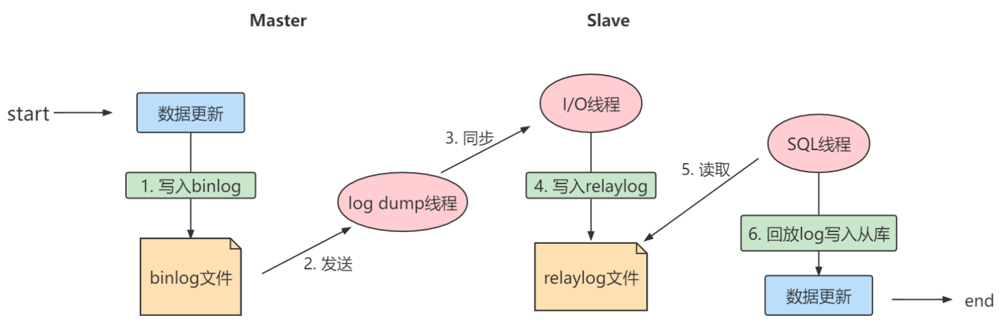

二进制日志转储线程 （Binlog dump thread）是一个主库线程。当从库线程连接的时候， 主库可以将二进 制日志发送给从库，当主库读取事件（Event）的时候，会在 Binlog 上 加锁 ，读取完成之后，再将锁释 放掉。

从库 I/O 线程 会连接到主库，向主库发送请求更新 Binlog。这时从库的 I/O 线程就可以读取到主库的 二进制日志转储线程发送的 Binlog 更新部分，并且拷贝到本地的中继日志 （Relay log）。

从库 SQL 线程 会读取从库中的中继日志，并且执行日志中的事件，将从库中的数据与主库保持同步。

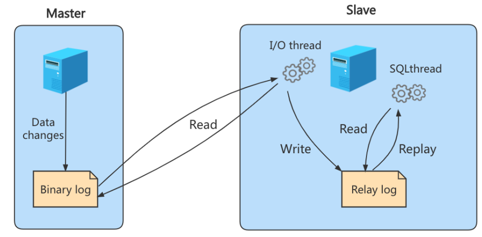

> 注意：
>
> 不是所有版本的MySQL都默认开启服务器的二进制日志。在进行主从同步的时候，我们需要先检查服务器是否已经开启了二进制日志。
>
> 除非特殊指定，默认情况下从服务器会执行所有主服务器中保存的事件。也可以通过配置，使从服务器执行特定的事件。

**复制三步骤**

步骤1： Master 将写操作记录到二进制日志（ binlog ）。

步骤2： Slave 将 Master 的binary log events拷贝到它的中继日志（ relay log ）；

步骤3： Slave 重做中继日志中的事件，将改变应用到自己的数据库中。 MySQL复制是异步的且串行化 的，而且重启后从 接入点 开始复制。


**复制的问题**

复制的最大问题： 延时


#### 2.2 复制的基本原则

- 每个 Slave 只有一个 Master
- 每个 Slave 只能有一个唯一的服务器ID
- 每个 Master 可以有多个 Slave


### 3. 一主一从架构搭建

一台 主机 用于处理所有 写请求 ，一台 从机 负责所有 读请求 ，架构图如下：

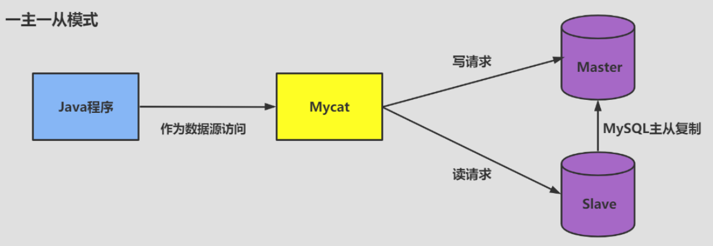


#### 3.1 准备工作

1. 准备 2台 CentOS 虚拟机

2. 每台虚拟机上需要安装好MySQL (可以是MySQL8.0 )

说明：前面我们讲过如何克隆一台CentOS。大家可以在一台CentOS上安装好MySQL，进而通过克隆的方 式复制出1台包含MySQL的虚拟机。

注意：克隆的方式需要修改新克隆出来主机的：① MAC地址 ② hostname ③ IP 地址 ④ UUID 。

此外，克隆的方式生成的虚拟机（包含MySQL Server），则克隆的虚拟机MySQL Server的UUID相同，必 须修改，否则在有些场景会报错。比如： show slave status\G ，报如下的错误：

```
Last_IO_Error: Fatal error: The slave I/O thread stops because master and slave have equal MySQL server UUIDs; these UUIDs must be different for replication to work.
```

修改MySQL Server 的UUID方式：

```
vim /var/lib/mysql/auto.cnf

systemctl restart mysqld
```


#### 3.2 主机配置文件

建议mysql版本一致且后台以服务运行，主从所有配置项都配置在 [mysqld] 节点下，且都是小写字母。

具体参数配置如下：

- 必选

```properties
#[必须]主服务器唯一ID
server-id=1

#[必须]启用二进制日志,指名路径。比如：自己本地的路径/log/mysqlbin
log-bin=atguigu-bin
```

- 可选

```mysql
#[可选] 0（默认）表示读写（主机），1表示只读（从机）
read-only=0

#设置日志文件保留的时长，单位是秒
binlog_expire_logs_seconds=6000

#控制单个二进制日志大小。此参数的最大和默认值是1GB
max_binlog_size=200M

#[可选]设置不要复制的数据库
binlog-ignore-db=test

#[可选]设置需要复制的数据库,默认全部记录。比如：binlog-do-db=atguigu_master_slave
binlog-do-db=需要复制的主数据库名字

#[可选]设置binlog格式
binlog_format=STATEMENT
```


**binlog格式设置：**

格式1： STATEMENT模式 （基于SQL语句的复制(statement-based replication, SBR)）

```properties
binlog_format=STATEMENT
```

每一条会修改数据的sql语句会记录到binlog中。这是默认的binlog格式。

- SBR 的优点：
  - 历史悠久，技术成熟
  - 不需要记录每一行的变化，减少了binlog日志量，文件较小
  - binlog中包含了所有数据库更改信息，可以据此来审核数据库的安全等情况
  - binlog可以用于实时的还原，而不仅仅用于复制
  - 主从版本可以不一样，从服务器版本可以比主服务器版本高
- SBR 的缺点：
  - 不是所有的UPDATE语句都能被复制，尤其是包含不确定操作的时候
- 使用以下函数的语句也无法被复制：LOAD_FILE()、UUID()、USER()、FOUND_ROWS()、SYSDATE()(除非启动时启用了 --sysdate-is-now 选项)
  - INSERT ... SELECT 会产生比 RBR 更多的行级锁
  - 复制需要进行全表扫描(WHERE 语句中没有使用到索引)的 UPDATE 时，需要比 RBR 请求更多的行级锁
  - 对于有 AUTO_INCREMENT 字段的 InnoDB表而言，INSERT 语句会阻塞其他 INSERT 语句
  - 对于一些复杂的语句，在从服务器上的耗资源情况会更严重，而 RBR 模式下，只会对那个发生变化的记录产生影响
  - 执行复杂语句如果出错的话，会消耗更多资源
  - 数据表必须几乎和主服务器保持一致才行，否则可能会导致复制出错


**② ROW模式（基于行的复制(row-based replication, RBR)）**

```properties
binlog_format=ROW
```

5.1.5版本的MySQL才开始支持，不记录每条sql语句的上下文信息，仅记录哪条数据被修改了，修改成什 么样了。

- RBR 的优点：
  - 任何情况都可以被复制，这对复制来说是最 安全可靠 的。（比如：不会出现某些特定情况下的存储过程、function、trigger的调用和触发无法被正确复制的问题）
  - 多数情况下，从服务器上的表如果有主键的话，复制就会快了很多
  - 复制以下几种语句时的行锁更少：INSERT ... SELECT、包含 AUTO_INCREMENT 字段的 INSERT、没有附带条件或者并没有修改很多记录的 UPDATE 或 DELETE 语句
  - 执行 INSERT，UPDATE，DELETE 语句时锁更少
  - 从服务器上采用 多线程 来执行复制成为可能
- RBR 的缺点：
  - binlog 大了很多
  - 复杂的回滚时 binlog 中会包含大量的数据
  - 主服务器上执行 UPDATE 语句时，所有发生变化的记录都会写到 binlog 中，而 SBR 只会写一次，这会导致频繁发生 binlog 的并发写问题
  - 无法从 binlog 中看到都复制了些什么语句


**③ MIXED模式（混合模式复制(mixed-based replication, MBR)）**

```properties
binlog_format=MIXED
```

从5.1.8版本开始，MySQL提供了Mixed格式，实际上就是Statement与Row的结合。

在Mixed模式下，一般的语句修改使用statment格式保存binlog。如一些函数，statement无法完成主从复 制的操作，则采用row格式保存binlog。

MySQL会根据执行的每一条具体的sql语句来区分对待记录的日志形式，也就是在Statement和Row之间选 择一种。


#### 3.3 从机配置文件

要求主从所有配置项都配置在 my.cnf 的 [mysqld] 栏位下，且都是小写字母。

- 必选

```properties
#[必须]从服务器唯一ID
server-id=2
```

- 可选

```properties
#[可选]启用中继日志
relay-log=mysql-relay
```

重启后台mysql服务，使配置生效。

> 注意：主从机都关闭防火墙
>
> service iptables stop #CentOS 6
>
> systemctl stop firewalld.service #CentOS 7


#### 3.4 主机：建立账户并授权

```mysql
#在主机MySQL里执行授权主从复制的命令
GRANT REPLICATION SLAVE ON *.* TO 'slave1'@'从机器数据库IP' IDENTIFIED BY 'abc123';
#5.5,5.7
```

**注意：如果使用的是MySQL8，需要如下的方式建立账户，并授权slave：**

```mysql
CREATE USER 'slave1'@'%' IDENTIFIED BY '123456';

GRANT REPLICATION SLAVE ON *.* TO 'slave1'@'%';

#此语句必须执行。否则见下面。
ALTER USER 'slave1'@'%' IDENTIFIED WITH mysql_native_password BY '123456';

flush privileges;
```

> 注意：在从机执行show slave status\G时报错： 
>
> Last_IO_Error: error connecting to master 'slave1@192.168.1.150:3306' - retry-time: 60 retries: 1 message: Authentication plugin 'caching_sha2_password' reported error: Authentication requires secure connection.

查询Master的状态，并记录下File和Position的值。

```mysql
show master status;
```

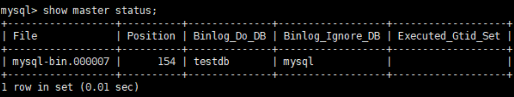

- 记录下File和Position的值

> 注意：执行完此步骤后不要再操作主服务器MySQL，防止主服务器状态值变化。


#### 3.5 从机：配置需要复制的主机

步骤1：从机上复制主机的命令

```properties
CHANGE MASTER TO
MASTER_HOST='主机的IP地址',
MASTER_USER='主机用户名',
MASTER_PASSWORD='主机用户名的密码',
MASTER_LOG_FILE='mysql-bin.具体数字',
MASTER_LOG_POS=具体值;
```

举例：

```mysql
CHANGE MASTER TO
MASTER_HOST='192.168.1.150',MASTER_USER='slave1',MASTER_PASSWORD='123456',MASTER_LOG_F
ILE='atguigu-bin.000007',MASTER_LOG_POS=154;
```

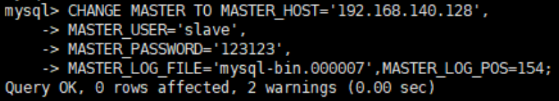

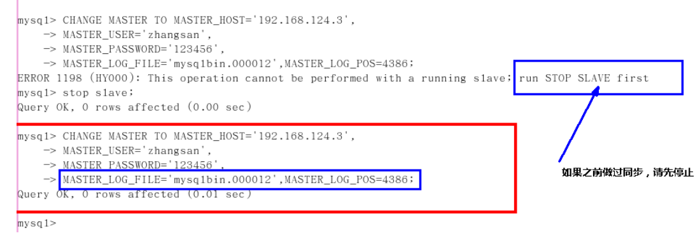


步骤2：

```mysql
#启动slave同步
START SLAVE;
```

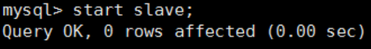

如果报错：

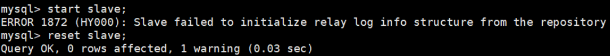

可以执行如下操作，删除之前的relay_log信息。然后重新执行 CHANGE MASTER TO ...语句即可。

```mysql
mysql> reset slave; #删除SLAVE数据库的relaylog日志文件，并重新启用新的relaylog文件
```

接着，查看同步状态：

```mysql
SHOW SLAVE STATUS\G;
```

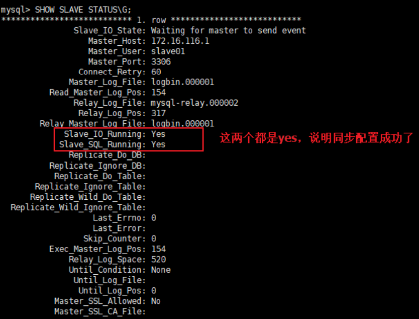

> 上面两个参数都是Yes，则说明主从配置成功！

显式如下的情况，就是不正确的。可能错误的原因有：

1. 网络不通
2. 账户密码错误
3. 防火墙
4. mysql配置文件问题
5. 连接服务器时语法
6. 主服务器mysql权限


#### 3.6 测试

主机新建库、新建表、insert记录，从机复制：

```mysql
CREATE DATABASE atguigu_master_slave;

CREATE TABLE mytbl(id INT,NAME VARCHAR(16));

INSERT INTO mytbl VALUES(1, 'zhang3');

INSERT INTO mytbl VALUES(2,@@hostname);
```


#### 3.7 停止主从同步

- 停止主从同步命令：

```mysql
stop slave;
```

- 如何重新配置主从

如果停止从服务器复制功能，再使用需要重新配置主从。否则会报错。

重新配置主从，需要在从机上执行：

```mysql
stop slave;

reset master; #删除Master中所有的binglog文件，并将日志索引文件清空，重新开始所有新的日志文件(慎用)
```


#### 3.8 后续

搭建主从复制：双主双从

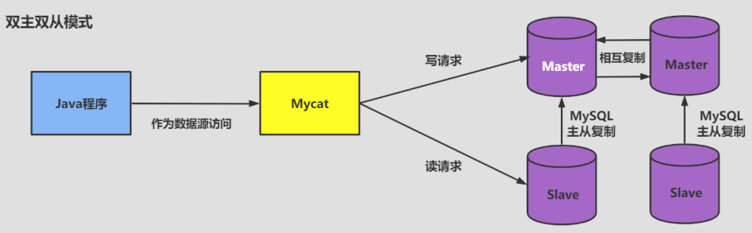

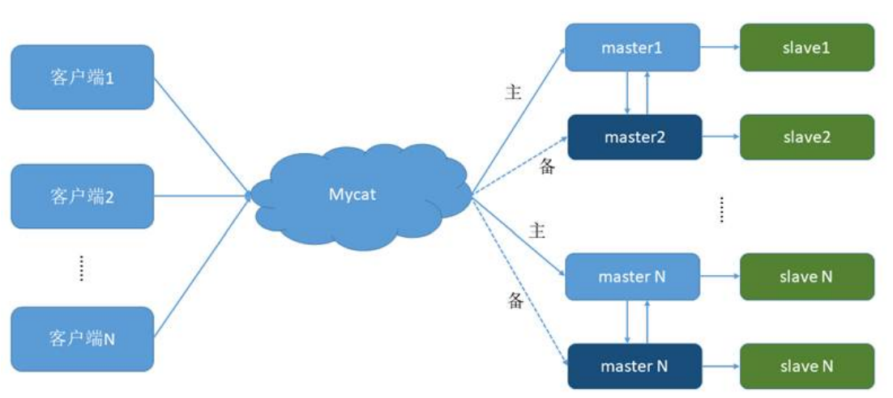


### 4. 同步数据一致性问题

**主从同步的要求：**

- 读库和写库的数据一致(最终一致)；
- 写数据必须写到写库；
- 读数据必须到读库(不一定)；


#### 4.1 理解主从延迟问题

进行主从同步的内容是二进制日志，它是一个文件，在进行 网络传输 的过程中就一定会 存在主从延迟 （比如 500ms），这样就可能造成用户在从库上读取的数据不是最新的数据，也就是主从同步中的 数据 不一致性 问题。


#### 4.2 主从延迟问题原因

在网络正常的时候，日志从主库传给从库所需的时间是很短的，即T2-T1的值是非常小的。即，网络正常 情况下，主备延迟的主要来源是备库接收完binlog和执行完这个事务之间的时间差。

主备延迟最直接的表现是，从库消费中继日志（relay log）的速度，比主库生产binlog的速度要慢。造 成原因：

1. 从库的机器性能比主库要差
2. 从库的压力大
3. 大事务的执行

**举例1**：一次性用delete语句删除太多数据

结论：后续再删除数据的时候，要控制每个事务删除的数据量，分成多次删除。

**举例2**：一次性用insert...select插入太多数据

**举例3**：大表DDL

比如在主库对一张500W的表添加一个字段耗费了10分钟，那么从节点上也会耗费10分钟。


#### 4.3 如何减少主从延迟

如果操作的数据存储在同一个数据库中，那么对数据进行更新的时候，可以对记录加写锁，这样在读取 的时候就不会发生数据不一致的情况。但这时从库的作用就是 备份 ，并没有起到 读写分离 ，分担主库 读压力 的作用。

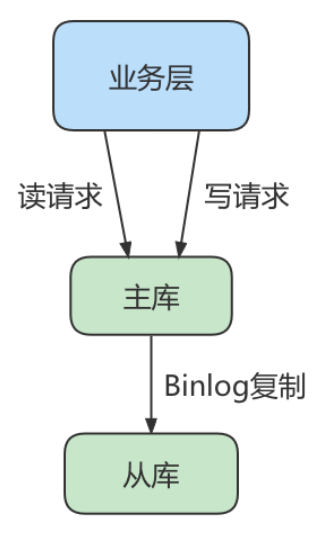

读写分离情况下，解决主从同步中数据不一致的问题， 就是解决主从之间 数据复制方式 的问题，如果按 照数据一致性 从弱到强 来进行划分，有以下 3 种复制方式。


##### 方法 1：异步复制

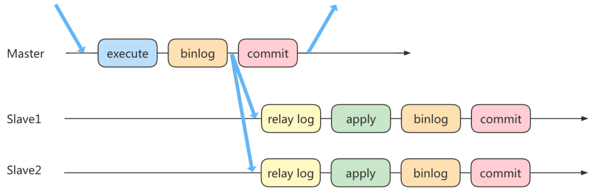


##### 方法 2：半同步复制

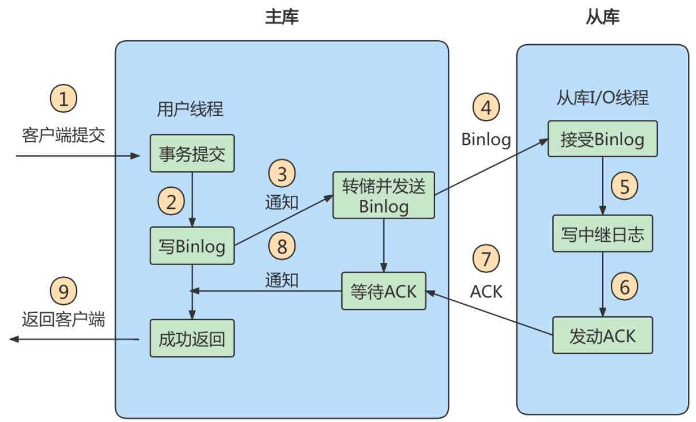


##### 方法 3：组复制

异步复制和半同步复制都无法最终保证数据的一致性问题，半同步复制是通过判断从库响应的个数来决 定是否返回给客户端，虽然数据一致性相比于异步复制有提升，但仍然无法满足对数据一致性要求高的 场景，比如金融领域。MGR 很好地弥补了这两种复制模式的不足。

组复制技术，简称 MGR（MySQL Group Replication）。是 MySQL 在 5.7.17 版本中推出的一种新的数据复 制技术，这种复制技术是基于 Paxos 协议的状态机复制。

**MGR 是如何工作的**

首先我们将多个节点共同组成一个复制组，在 执行读写（RW）事务 的时候，需要通过一致性协议层 （Consensus 层）的同意，也就是读写事务想要进行提交，必须要经过组里“大多数人”（对应 Node 节 点）的同意，大多数指的是同意的节点数量需要大于 （N/2+1），这样才可以进行提交，而不是原发起 方一个说了算。而针对 只读（RO）事务 则不需要经过组内同意，直接 COMMIT 即可。

在一个复制组内有多个节点组成，它们各自维护了自己的数据副本，并且在一致性协议层实现了原子消 息和全局有序消息，从而保证组内数据的一致性。

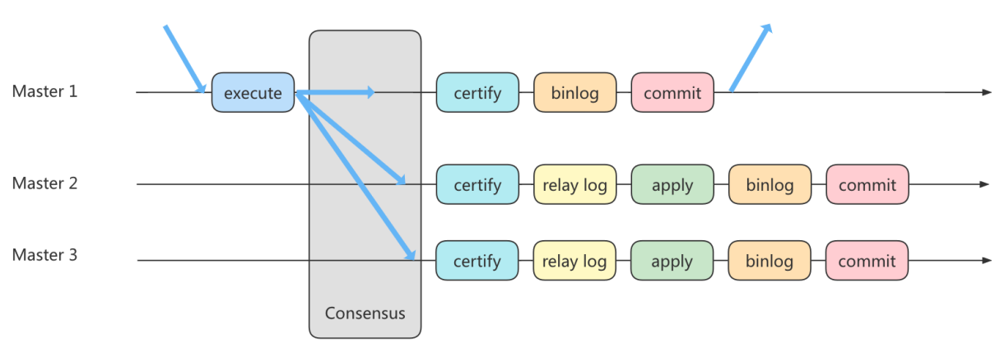

MGR 将 MySQL 带入了数据强一致性的时代，是一个划时代的创新，其中一个重要的原因就是MGR 是基 于 Paxos 协议的。Paxos 算法是由 2013 年的图灵奖获得者 Leslie Lamport 于 1990 年提出的，有关这个算 法的决策机制可以搜一下。事实上，Paxos 算法提出来之后就作为 分布式一致性算法 被广泛应用，比如 Apache 的 ZooKeeper 也是基于 Paxos 实现的。


### 5. 知识延伸

在主从架构的配置中，如果想要采取读写分离的策略，我们可以 自己编写程序 ，也可以通过 第三方的中 间件 来实现。

- 自己编写程序的好处就在于比较自主，我们可以自己判断哪些查询在从库上来执行，针对实时性要求高的需求，我们还可以考虑哪些查询可以在主库上执行。同时，程序直接连接数据库，减少了中间件层，相当于减少了性能损耗。
- 采用中间件的方法有很明显的优势， 功能强大 ， 使用简单 。但因为在客户端和数据库之间增加了中间件层会有一些 性能损耗 ，同时商业中间件也是有使用成本的。我们也可以考虑采取一些优秀的开源工具。

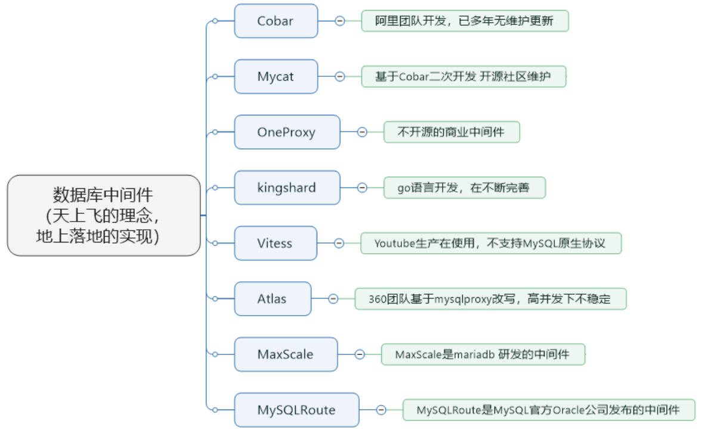

① Cobar 属于阿里B2B事业群，始于2008年，在阿里服役3年多，接管3000+个MySQL数据库的schema,集群日处理在线SQL请求50亿次以上。由于Cobar发起人的离职，Cobar停止维护。

② Mycat 是开源社区在阿里cobar基础上进行二次开发，解决了cobar存在的问题，并且加入了许多新的功能在其中。青出于蓝而胜于蓝。

③ OneProxy 基于MySQL官方的proxy思想利用c语言进行开发的，OneProxy是一款商业 收费 的中间件。舍弃了一些功能，专注在 性能和稳定性上 。

④ kingshard 由小团队用go语言开发，还需要发展，需要不断完善。

⑤ Vitess 是Youtube生产在使用，架构很复杂。不支持MySQL原生协议，使用 需要大量改造成本 。

⑥ Atlas 是360团队基于mysql proxy改写，功能还需完善，高并发下不稳定。

⑦ MaxScale 是mariadb（MySQL原作者维护的一个版本） 研发的中间件

⑧ MySQLRoute 是MySQL官方Oracle公司发布的中间件

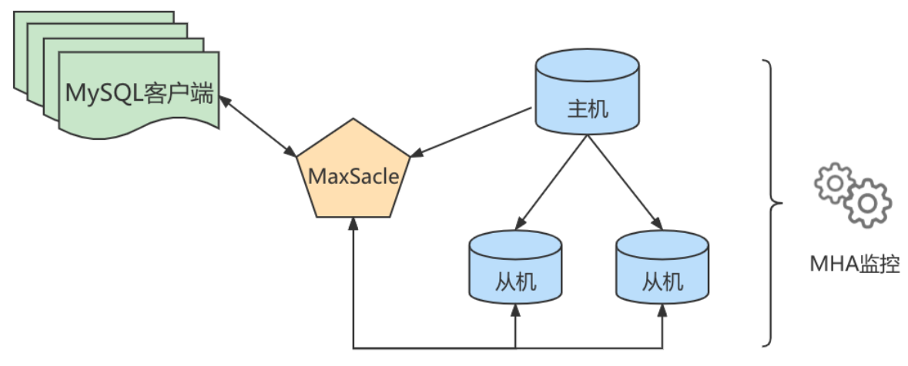

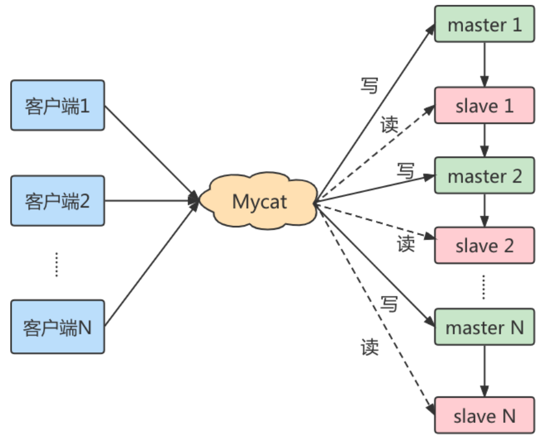

主备切换：

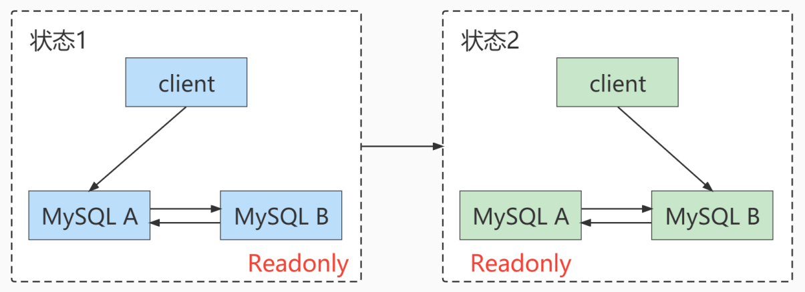

- 主动切换
- 被动切换
- 如何判断主库出问题了？如何解决过程中的数据不一致性问题？


## 十九、数据库备份与恢复

在任何数据库环境中，总会有不确定的意外情况发生，比如例外的停电、计算机系统中的各种软硬件故障、人为破坏、管理员误操作等是不可避免的，这些情况可能会导致数据的丢失、服务器瘫痪等严重的后果。存在多个服务器时，会出现主从服务器之间的数据同步问题。

为了有效防止数据丢失，并将损失降到最低，应定期对MySQL数据库服务器做备份。如果数据库中的数据丢失或者出现错误，可以使用备份的数据进行恢复。主从服务器之间的数据同步问题可以通过复制功能实现。


### 1. 物理备份与逻辑备份

**物理备份**：备份数据文件，转储数据库物理文件到某一目录。物理备份恢复速度比较快，但占用空间比 较大，MySQL中可以用 xtrabackup 工具来进行物理备份。

**逻辑备份**：对数据库对象利用工具进行导出工作，汇总入备份文件内。逻辑备份恢复速度慢，但占用空 间小，更灵活。MySQL 中常用的逻辑备份工具为 mysqldump 。逻辑备份就是 备份sql语句 ，在恢复的 时候执行备份的sql语句实现数据库数据的重现。


### 2. mysqldump实现逻辑备份

#### 2.1 备份一个数据库

基本语法：

```mysql
mysqldump –u 用户名称 –h 主机名称 –p密码 待备份的数据库名称[tbname，[tbname...]]> 备份文件名称.sql
```

举例：使用root用户备份atguigu数据库：

```mysql
mysqldump -uroot -p atguigu>atguigu.sql #备份文件存储在当前目录下
```

```mysql
mysqldump -uroot -p atguigudb1 > /var/lib/mysql/atguigu.sql
```


#### 2.2 备份全部数据库

若想用mysqldump备份整个实例，可以使用 --all-databases 或 -A 参数：

```mysql
mysqldump -uroot -pxxxxxx --all-databases > all_database.sql
mysqldump -uroot -pxxxxxx -A > all_database.sql
```


#### 2.3 备份部分数据库

使用 --databases 或 -B 参数了，该参数后面跟数据库名称，多个数据库间用空格隔开。如果指定 databases参数，备份文件中会存在创建数据库的语句，如果不指定参数，则不存在。语法如下：

```mysql
mysqldump –u user –h host –p --databases [数据库的名称1 [数据库的名称2...]] > 备份文件名称.sql
```

举例：

```mysql
mysqldump -uroot -p --databases atguigu atguigu12 >two_database.sql
```

或

```mysql
mysqldump -uroot -p -B atguigu atguigu12 > two_database.sql
```


#### 2.4 备份部分表

比如，在表变更前做个备份。语法如下：

```mysql
mysqldump –u user –h host –p 数据库的名称 [表名1 [表名2...]] > 备份文件名称.sql
```

举例：备份atguigu数据库下的book表

```mysql
mysqldump -uroot -p atguigu book> book.sql
```

备份多张表使用下面的命令，比如备份book和account表：

```mysql
#备份多张表
mysqldump -uroot -p atguigu book account > 2_tables_bak.sql
```


#### 2.5 备份单表的部分数据

有些时候一张表的数据量很大，我们只需要部分数据。这时就可以使用 --where 选项了。where后面附 带需要满足的条件。

举例：备份student表中id小于10的数据：

```mysql
mysqldump -uroot -p atguigu student --where="id < 10 " > student_part_id10_low_bak.sql
```

内容如下所示，insert语句只有id小于10的部分

```mysql
LOCK TABLES `student` WRITE;
/*!40000 ALTER TABLE `student` DISABLE KEYS */;
INSERT INTO `student` VALUES (1,100002,'JugxTY',157,280),(2,100003,'QyUcCJ',251,277),
(3,100004,'lATUPp',80,404),(4,100005,'BmFsXI',240,171),(5,100006,'mkpSwJ',388,476),
(6,100007,'ujMgwN',259,124),(7,100008,'HBJTqX',429,168),(8,100009,'dvQSQA',61,504),
(9,100010,'HljpVJ',234,185);
```


#### 2.6 排除某些表的备份

如果我们想备份某个库，但是某些表数据量很大或者与业务关联不大，这个时候可以考虑排除掉这些 表，同样的，选项 --ignore-table 可以完成这个功能。

```mysql
mysqldump -uroot -p atguigu --ignore-table=atguigu.student > no_stu_bak.sql
```

通过如下指定判定文件中没有student表结构：

```mysql
grep "student" no_stu_bak.sql
```


#### 2.7 只备份结构或只备份数据

只备份结构的话可以使用 --no-data 简写为 -d 选项；只备份数据可以使用 --no-create-info 简写为 -t 选项。

- 只备份结构

```mysql
mysqldump -uroot -p atguigu --no-data > atguigu_no_data_bak.sql
#使用grep命令，没有找到insert相关语句，表示没有数据备份。
[root@node1 ~]# grep "INSERT" atguigu_no_data_bak.sql
[root@node1 ~]#
```

- 只备份数据

```mysql
mysqldump -uroot -p atguigu --no-create-info > atguigu_no_create_info_bak.sql
#使用grep命令，没有找到create相关语句，表示没有数据结构。
[root@node1 ~]# grep "CREATE" atguigu_no_create_info_bak.sql
[root@node1 ~]#
```


#### 2.8 备份中包含存储过程、函数、事件

mysqldump备份默认是不包含存储过程，自定义函数及事件的。可以使用 --routines 或 -R 选项来备 份存储过程及函数，使用 --events 或 -E 参数来备份事件。

举例：备份整个atguigu库，包含存储过程及事件：

- 使用下面的SQL可以查看当前库有哪些存储过程或者函数

```mysql
mysql> SELECT SPECIFIC_NAME,ROUTINE_TYPE ,ROUTINE_SCHEMA FROM
information_schema.Routines WHERE ROUTINE_SCHEMA="atguigu";
+---------------+--------------+----------------+
| SPECIFIC_NAME | ROUTINE_TYPE | ROUTINE_SCHEMA |
+---------------+--------------+----------------+
| rand_num | FUNCTION | atguigu |
| rand_string | FUNCTION | atguigu |
| BatchInsert | PROCEDURE | atguigu |
| insert_class | PROCEDURE | atguigu |
| insert_order | PROCEDURE | atguigu |
| insert_stu | PROCEDURE | atguigu |
| insert_user | PROCEDURE | atguigu |
| ts_insert | PROCEDURE | atguigu |
+---------------+--------------+----------------+
9 rows in set (0.02 sec)
```

下面备份atguigu库的数据，函数以及存储过程。

```mysql
mysqldump -uroot -p -R -E --databases atguigu > fun_atguigu_bak.sql
```


#### 2.9 mysqldump常用选项

mysqldump其他常用选项如下：

```mysql
--add-drop-database：在每个CREATE DATABASE语句前添加DROP DATABASE语句。

--add-drop-tables：在每个CREATE TABLE语句前添加DROP TABLE语句。

--add-locking：用LOCK TABLES和UNLOCK TABLES语句引用每个表转储。重载转储文件时插入得更快。

--all-database, -A：转储所有数据库中的所有表。与使用--database选项相同，在命令行中命名所有数据库。

--comment[=0|1]：如果设置为0，禁止转储文件中的其他信息，例如程序版本、服务器版本和主机。--skipcomments与--comments=0的结果相同。默认值为1，即包括额外信息。

--compact：产生少量输出。该选项禁用注释并启用--skip-add-drop-tables、--no-set-names、--skipdisable-keys和--skip-add-locking选项。

--compatible=name：产生与其他数据库系统或旧的MySQL服务器更兼容的输出，值可以为ansi、MySQL323、MySQL40、postgresql、oracle、mssql、db2、maxdb、no_key_options、no_table_options或者
no_field_options。

--complete_insert, -c：使用包括列名的完整的INSERT语句。

--debug[=debug_options], -#[debug_options]：写调试日志。

--delete，-D：导入文本文件前清空表。

--default-character-set=charset：使用charsets默认字符集。如果没有指定，就使用utf8。

--delete--master-logs：在主复制服务器上，完成转储操作后删除二进制日志。该选项自动启用-masterdata。

--extended-insert，-e：使用包括几个VALUES列表的多行INSERT语法。这样使得转储文件更小，重载文件时可以加速插入。

--flush-logs，-F：开始转储前刷新MySQL服务器日志文件。该选项要求RELOAD权限。

--force，-f：在表转储过程中，即使出现SQL错误也继续。

--lock-all-tables，-x：对所有数据库中的所有表加锁。在整体转储过程中通过全局锁定来实现。该选项自动关闭--single-transaction和--lock-tables。

--lock-tables，-l：开始转储前锁定所有表。用READ LOCAL锁定表以允许并行插入MyISAM表。对于事务表（例如InnoDB和BDB），--single-transaction是一个更好的选项，因为它根本不需要锁定表。

--no-create-db，-n：该选项禁用CREATE DATABASE /*!32312 IF NOT EXIST*/db_name语句，如果给出--database或--all-database选项，就包含到输出中。

--no-create-info，-t：只导出数据，而不添加CREATE TABLE语句。

--no-data，-d：不写表的任何行信息，只转储表的结构。

--opt：该选项是速记，它可以快速进行转储操作并产生一个能很快装入MySQL服务器的转储文件。该选项默认开启，但可以用--skip-opt禁用。

--password[=password]，-p[password]：当连接服务器时使用的密码。

-port=port_num，-P port_num：用于连接的TCP/IP端口号。

--protocol={TCP|SOCKET|PIPE|MEMORY}：使用的连接协议。

--replace，-r –replace和--ignore：控制替换或复制唯一键值已有记录的输入记录的处理。如果指定--replace，新行替换有相同的唯一键值的已有行；如果指定--ignore，复制已有的唯一键值的输入行被跳过。如果不指定这两个选项，当发现一个复制键值时会出现一个错误，并且忽视文本文件的剩余部分。

--silent，-s：沉默模式。只有出现错误时才输出。

--socket=path，-S path：当连接localhost时使用的套接字文件（为默认主机）。

--user=user_name，-u user_name：当连接服务器时MySQL使用的用户名。

--verbose，-v：冗长模式，打印出程序操作的详细信息。

--xml，-X：产生XML输出
```

运行帮助命令 mysqldump --help ，可以获得特定版本的完整选项列表。

> 提示 如果运行mysqldump没有--quick或--opt选项，mysqldump在转储结果前将整个结果集装入内 存。如果转储大数据库可能会出现问题，该选项默认启用，但可以用--skip-opt禁用。如果使用最 新版本的mysqldump程序备份数据，并用于恢复到比较旧版本的MySQL服务器中，则不要使用--opt 或-e选项。


### 3. mysql命令恢复数据

基本语法：

```mysql
mysql –u root –p [dbname] < backup.sql
```


#### 3.1 单库备份中恢复单库

使用root用户，将之前练习中备份的atguigu.sql文件中的备份导入数据库中，命令如下：

如果备份文件中包含了创建数据库的语句，则恢复的时候不需要指定数据库名称，如下所示

```mysql
mysql -uroot -p < atguigu.sql
```

否则需要指定数据库名称，如下所示

```mysql
mysql -uroot -p atguigu4< atguigu.sql
```


#### 3.2 全量备份恢复

如果我们现在有昨天的全量备份，现在想整个恢复，则可以这样操作：

```mysql
mysql –u root –p < all.sql
```

```mysql
mysql -uroot -pxxxxxx < all.sql
```

执行完后，MySQL数据库中就已经恢复了all.sql文件中的所有数据库。


#### 3.3 从全量备份中恢复单库

可能有这样的需求，比如说我们只想恢复某一个库，但是我们有的是整个实例的备份，这个时候我们可 以从全量备份中分离出单个库的备份。

举例：

```mysql
sed -n '/^-- Current Database: `atguigu`/,/^-- Current Database: `/p' all_database.sql > atguigu.sql

#分离完成后我们再导入atguigu.sql即可恢复单个库
```


#### 3.4 从单库备份中恢复单表

这个需求还是比较常见的。比如说我们知道哪个表误操作了，那么就可以用单表恢复的方式来恢复。

举例：我们有atguigu整库的备份，但是由于class表误操作，需要单独恢复出这张表。

```mysql
cat atguigu.sql | sed -e '/./{H;$!d;}' -e 'x;/CREATE TABLE `class`/!d;q' >
class_structure.sql

cat atguigu.sql | grep --ignore-case 'insert into `class`' > class_data.sql
#用shell语法分离出创建表的语句及插入数据的语句后 再依次导出即可完成恢复

use atguigu;
mysql> source class_structure.sql;
Query OK, 0 rows affected, 1 warning (0.00 sec)

mysql> source class_data.sql;
Query OK, 1 row affected (0.01 sec)
```


### 4. 物理备份：直接复制整个数据库

直接将MySQL中的数据库文件复制出来。这种方法最简单，速度也最快。MySQL的数据库目录位置不一 定相同：

- 在Windows平台下，MySQL 8.0存放数据库的目录通常默认为 “C:\ProgramData\MySQL\MySQLServer 8.0\Data ”或者其他用户自定义目录；
- 在Linux平台下，数据库目录位置通常为/var/lib/mysql/；
- 在MAC OSX平台下，数据库目录位置通常为“/usr/local/mysql/data”

但为了保证备份的一致性。需要保证：

- 方式1：备份前，将服务器停止。
- 方式2：备份前，对相关表执行 FLUSH TABLES WITH READ LOCK 操作。这样当复制数据库目录中的文件时，允许其他客户继续查询表。同时，FLUSH TABLES语句来确保开始备份前将所有激活的索引页写入硬盘。

这种方式方便、快速，但不是最好的备份方法，因为实际情况可能 不允许停止MySQL服务器 或者 锁住 表 ，而且这种方法 对InnoDB存储引擎 的表不适用。对于MyISAM存储引擎的表，这样备份和还原很方 便，但是还原时最好是相同版本的MySQL数据库，否则可能会存在文件类型不同的情况。

注意，物理备份完毕后，执行 UNLOCK TABLES 来结算其他客户对表的修改行为。

> 说明： 在MySQL版本号中，第一个数字表示主版本号，主版本号相同的MySQL数据库文件格式相同。

此外，还可以考虑使用相关工具实现备份。比如， MySQLhotcopy 工具。MySQLhotcopy是一个Perl脚 本，它使用LOCK TABLES、FLUSH TABLES和cp或scp来快速备份数据库。它是备份数据库或单个表最快的 途径，但它只能运行在数据库目录所在的机器上，并且只能备份MyISAM类型的表。多用于mysql5.5之 前。


### 5. 物理恢复：直接复制到数据库目录

步骤：

1. 演示删除备份的数据库中指定表的数据
2. 将备份的数据库数据拷贝到数据目录下，并重启MySQL服务器
3. 查询相关表的数据是否恢复。需要使用下面的 chown 操作。

要求：

- 必须确保备份数据的数据库和待恢复的数据库服务器的主版本号相同。
  - 因为只有MySQL数据库主版本号相同时，才能保证这两个MySQL数据库文件类型是相同的。
- 这种方式对 MyISAM类型的表比较有效 ，对于InnoDB类型的表则不可用。
  - 因为InnoDB表的表空间不能直接复制。
- 在Linux操作系统下，复制到数据库目录后，一定要将数据库的用户和组变成mysql，命令如下：

```mysql
chown -R mysql.mysql /var/lib/mysql/dbname
```

其中，两个mysql分别表示组和用户；“-R”参数可以改变文件夹下的所有子文件的用户和组；“dbname”参 数表示数据库目录。

> 提示 Linux操作系统下的权限设置非常严格。通常情况下，MySQL数据库只有root用户和mysql用户 组下的mysql用户才可以访问，因此将数据库目录复制到指定文件夹后，一定要使用chown命令将 文件夹的用户组变为mysql，将用户变为mysql。


### 6. 表的导出与导入

#### 6.1 表的导出

##### 1. 使用SELECT…INTO OUTFILE导出文本文件

在MySQL中，可以使用SELECT…INTO OUTFILE语句将表的内容导出成一个文本文件。

举例：使用SELECT…INTO OUTFILE将atguigu数据库中account表中的记录导出到文本文件。 

（1）选择数 据库atguigu，并查询account表，执行结果如下所示。

```mysql
use atguigu;
select * from account;
mysql> select * from account;
+----+--------+---------+
| id | name | balance |
+----+--------+---------+
| 1 | 张三 | 90 |
| 2 | 李四 | 100 |
| 3 | 王五 | 0 |
+----+--------+---------+
3 rows in set (0.01 sec)
```


（2）mysql默认对导出的目录有权限限制，也就是说使用命令行进行导出的时候，需要指定目录进行操 作。

查询secure_file_priv值：

```mysql
mysql> SHOW GLOBAL VARIABLES LIKE '%secure%';
+--------------------------+-----------------------+
| Variable_name | Value |
+--------------------------+-----------------------+
| require_secure_transport | OFF |
| secure_file_priv | /var/lib/mysql-files/ |
+--------------------------+-----------------------+
2 rows in set (0.02 sec)
```


（3）上面结果中显示，secure_file_priv变量的值为/var/lib/mysql-files/，导出目录设置为该目录，SQL语 句如下。

```mysql
SELECT * FROM account INTO OUTFILE "/var/lib/mysql-files/account.txt";
```


（4）查看 /var/lib/mysql-files/account.txt`文件。

```
1 张三 90
2 李四 100
3 王五 0
```


##### 2. 使用mysqldump命令导出文本文件

**举例1**：使用mysqldump命令将将atguigu数据库中account表中的记录导出到文本文件：

```mysql
mysqldump -uroot -p -T "/var/lib/mysql-files/" atguigu account
```

mysqldump命令执行完毕后，在指定的目录/var/lib/mysql-files/下生成了account.sql和account.txt文件。

打开account.sql文件，其内容包含创建account表的CREATE语句。

打开account.txt文件，其内容只包含account表中的数据。


**举例2**：使用mysqldump将atguigu数据库中的account表导出到文本文件，使用FIELDS选项，要求字段之 间使用逗号“，”间隔，所有字符类型字段值用双引号括起来：

```mysql
mysqldump -uroot -p -T "/var/lib/mysql-files/" atguigu account --fields-terminatedby=',' --fields-optionally-enclosed-by='\"'
```

语句mysqldump语句执行成功之后，指定目录下会出现两个文件account.sql和account.txt。

打开account.sql文件，其内容包含创建account表的CREATE语句。

打开account.txt文件，其内容包含创建account表的数据。从文件中可以看出，字段之间用逗号隔开，字 符类型的值被双引号括起来。


##### 3. 使用mysql命令导出文本文件

**举例1**：使用mysql语句导出atguigu数据中account表中的记录到文本文件：

```mysql
mysql -uroot -p --execute="SELECT * FROM account;" atguigu> "/var/lib/mysqlfiles/account.txt"
```

打开account.txt文件，其内容包含创建account表的数据。

```mysql
[root@node1 mysql-files]# cat account.txt
id name balance
1 张三 90
2 李四 100
3 王五 0

```

举例2：将atguigu数据库account表中的记录导出到文本文件，使用--veritcal参数将该条件记录分为多行 显示：

```mysql
mysql -uroot -p --vertical --execute="SELECT * FROM account;" atguigu >
"/var/lib/mysql-files/account_1.txt"
```

打开account_1.txt文件，其内容包含创建account表的数据。

```mysql
[root@node1 mysql-files]# cat account_1.txt
*************************** 1. row ***************************
id: 1
name: 张三
balance: 90
*************************** 2. row ***************************
id: 2
name: 李四
balance: 100
*************************** 3. row ***************************
id: 3
name: 王五
balance: 0
```


**举例3**：将atguigu数据库account表中的记录导出到xml文件，使用--xml参数，具体语句如下。

```mysql
mysql -uroot -p --xml --execute="SELECT * FROM account;" atguigu>"/var/lib/mysqlfiles/account_3.xml"
```

```mysql
[root@node1 mysql-files]# cat account_3.xml
<?xml version="1.0"?>
<resultset statement="SELECT * FROM account"
xmlns:xsi="http://www.w3.org/2001/XMLSchema-instance">
<row>
<field name="id">1</field>
<field name="name">张三</field>
<field name="balance">90</field>
</row>
<row>
<field name="id">2</field>
<field name="name">李四</field>
<field name="balance">100</field>
</row>
<row>
<field name="id">3</field>
<field name="name">王五</field>
<field name="balance">0</field>
</row>
</resultset>
```

说明：如果要将表数据导出到html文件中，可以使用 --html 选项。然后可以使用浏览器打开。


#### 6.2 表的导入

##### 1. 使用LOAD DATA INFILE方式导入文本文件

**举例1：**

使用SELECT...INTO OUTFILE将atguigu数据库中account表的记录导出到文本文件

```mysql
SELECT * FROM atguigu.account INTO OUTFILE '/var/lib/mysql-files/account_0.txt';
```

删除account表中的数据：

```mysql
DELETE FROM atguigu.account;
```

从文本文件account.txt中恢复数据：

```mysql
LOAD DATA INFILE '/var/lib/mysql-files/account_0.txt' INTO TABLE atguigu.account;
```

查询account表中的数据：

```mysql
mysql> select * from account;
+----+--------+---------+
| id | name | balance |
+----+--------+---------+
| 1 | 张三 | 90 |
| 2 | 李四 | 100 |
| 3 | 王五 | 0 |
+----+--------+---------+
3 rows in set (0.00 sec)
```


**举例2：** 选择数据库atguigu，使用SELECT…INTO OUTFILE将atguigu数据库account表中的记录导出到文本 文件，使用FIELDS选项和LINES选项，要求字段之间使用逗号"，"间隔，所有字段值用双引号括起来：

```mysql
SELECT * FROM atguigu.account INTO OUTFILE '/var/lib/mysql-files/account_1.txt' FIELDS TERMINATED BY ',' ENCLOSED BY '\"';
```

删除account表中的数据：

```mysql
DELETE FROM atguigu.account;
```

从/var/lib/mysql-files/account.txt中导入数据到account表中：

```mysql
LOAD DATA INFILE '/var/lib/mysql-files/account_1.txt' INTO TABLE atguigu.account FIELDS TERMINATED BY ',' ENCLOSED BY '\"';
```

查询account表中的数据，具体SQL如下：

```mysql
select * from account;
mysql> select * from account;
+----+--------+---------+
| id | name | balance |
+----+--------+---------+
| 1 | 张三 | 90 |
| 2 | 李四 | 100 |
| 3 | 王五 | 0 |
+----+--------+---------+
3 rows in set (0.00 sec)
```


##### 2. 使用mysqlimport方式导入文本文件

**举例：**

导出文件account.txt，字段之间使用逗号"，"间隔，字段值用双引号括起来：

```mysql
SELECT * FROM atguigu.account INTO OUTFILE '/var/lib/mysql-files/account.txt' FIELDS TERMINATED BY ',' ENCLOSED BY '\"';
```

删除account表中的数据：

```mysql
DELETE FROM atguigu.account;
```

使用mysqlimport命令将account.txt文件内容导入到数据库atguigu的account表中：

```mysql
mysqlimport -uroot -p atguigu '/var/lib/mysql-files/account.txt' --fields-terminatedby=',' --fields-optionally-enclosed-by='\"'
```

查询account表中的数据：

```mysql
select * from account;
mysql> select * from account;
+----+--------+---------+
| id | name | balance |
+----+--------+---------+
| 1 | 张三 | 90 |
| 2 | 李四 | 100 |
| 3 | 王五 | 0 |
+----+--------+---------+
3 rows in set (0.00 sec)
```


### 7. 数据库迁移

#### 7.1 概述

数据迁移（data migration）是指选择、准备、提取和转换数据，并将数据从一个计算机存储系统永久地 传输到另一个计算机存储系统的过程。此外， 验证迁移数据的完整性 和 退役原来旧的数据存储 ，也被认 为是整个数据迁移过程的一部分。

数据库迁移的原因是多样的，包括服务器或存储设备更换、维护或升级，应用程序迁移，网站集成，灾 难恢复和数据中心迁移。

根据不同的需求可能要采取不同的迁移方案，但总体来讲，MySQL 数据迁移方案大致可以分为 物理迁移 和 逻辑迁移 两类。通常以尽可能 自动化 的方式执行，从而将人力资源从繁琐的任务中解放出来。


#### 7.2 迁移方案

- 物理迁移

物理迁移适用于大数据量下的整体迁移。使用物理迁移方案的优点是比较快速，但需要停机迁移并且要 求 MySQL 版本及配置必须和原服务器相同，也可能引起未知问题。 

物理迁移包括拷贝数据文件和使用 XtraBackup 备份工具两种。 

不同服务器之间可以采用物理迁移，我们可以在新的服务器上安装好同版本的数据库软件，创建好相同 目录，建议配置文件也要和原数据库相同，然后从原数据库方拷贝来数据文件及日志文件，配置好文件 组权限，之后在新服务器这边使用 mysqld 命令启动数据库。

- 逻辑迁移

逻辑迁移适用范围更广，无论是 部分迁移 还是 全量迁移 ，都可以使用逻辑迁移。逻辑迁移中使用最多的 就是通过 mysqldump 等备份工具。


#### 7.3 迁移注意点

##### 1. 相同版本的数据库之间迁移注意点

指的是在主版本号相同的MySQL数据库之间进行数据库移动。

**方式1**： 因为迁移前后MySQL数据库的 主版本号相同 ，所以可以通过复制数据库目录来实现数据库迁 移，但是物理迁移方式只适用于MyISAM引擎的表。对于InnoDB表，不能用直接复制文件的方式备份数据 库。

**方式2**： 最常见和最安全的方式是使用 mysqldump命令 导出数据，然后在目标数据库服务器中使用 MySQL命令导入。

举例：

```mysql
#host1的机器中备份所有数据库,并将数据库迁移到名为host2的机器上
mysqldump –h host1 –uroot –p –-all-databases|
mysql –h host2 –uroot –p
```

在上述语句中，“|”符号表示管道，其作用是将mysqldump备份的文件给mysql命令；“--all-databases”表 示要迁移所有的数据库。通过这种方式可以直接实现迁移。


##### 2. 不同版本的数据库之间迁移注意点

例如，原来很多服务器使用5.7版本的MySQL数据库，在8.0版本推出来以后，改进了5.7版本的很多缺陷， 因此需要把数据库升级到8.0版本

旧版本与新版本的MySQL可能使用不同的默认字符集，例如有的旧版本中使用latin1作为默认字符集，而 最新版本的MySQL默认字符集为utf8mb4。如果数据库中有中文数据，那么迁移过程中需要对 默认字符集 进行修改 ，不然可能无法正常显示数据。

高版本的MySQL数据库通常都会 兼容低版本 ，因此可以从低版本的MySQL数据库迁移到高版本的MySQL 数据库。


##### 3. 不同数据库之间迁移注意点

不同数据库之间迁移是指从其他类型的数据库迁移到MySQL数据库，或者从MySQL数据库迁移到其他类 型的数据库。这种迁移没有普适的解决方法。

迁移之前，需要了解不同数据库的架构， 比较它们之间的差异 。不同数据库中定义相同类型的数据的 关 键字可能会不同 。例如，MySQL中日期字段分为DATE和TIME两种，而ORACLE日期字段只有DATE；SQL Server数据库中有ntext、Image等数据类型，MySQL数据库没有这些数据类型；MySQL支持的ENUM和SET 类型，这些SQL Server数据库不支持。

另外，数据库厂商并没有完全按照SQL标准来设计数据库系统，导致不同的数据库系统的 SQL语句 有差 别。例如，微软的SQL Server软件使用的是T-SQL语句，T-SQL中包含了非标准的SQL语句，不能和MySQL 的SQL语句兼容。

不同类型数据库之间的差异造成了互相 迁移的困难 ，这些差异其实是商业公司故意造成的技术壁垒。但 是不同类型的数据库之间的迁移并 不是完全不可能 。例如，可以使用 MyODBC 实现MySQL和SQL Server之 间的迁移。MySQL官方提供的工具 MySQL Migration Toolkit 也可以在不同数据之间进行数据迁移。 MySQL迁移到Oracle时，需要使用mysqldump命令导出sql文件，然后， 手动更改 sql文件中的CREATE语 句。


#### 7.4 迁移小结

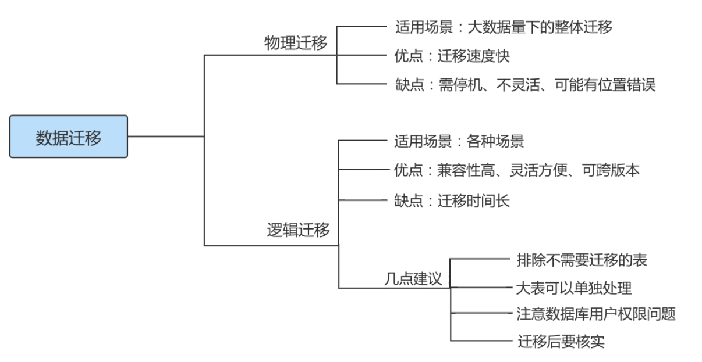


### 8. 删库了不敢跑，能干点啥？

#### 8.1 delete：误删行

经验之谈：

1. 恢复数据比较安全的做法，是 恢复出一个备份 ，或者找一个从库作为 临时库 ，在这个临时库上执 行这些操作，然后再将确认过的临时库的数据，恢复回主库。如果直接修改主库，可能导致对数 据的 二次破坏 。
2.  当然，针对预防误删数据的问题，建议如下：
   1.  把 sql_safe_updates 参数设置为 on 。这样一来，如果我们忘记在delete或者update语句 中写where条件，或者where条件里面没有包含索引字段的话，这条语句的执行就会报错。
   2. 代码上线前，必须经过 SQL审计 。


#### 8.2 truncate/drop ：误删库/表

方案：

这种情况下，要想恢复数据，就需要使用 全量备份 ，加 增量日志 的方式了。这个方案要求线上有定期的 全量备份，并且实时备份binlog。

在这两个条件都具备的情况下，假如有人中午12点误删了一个库，恢复数据的流程如下：

1. 取最近一次 全量备份 ，假设这个库是一天一备，上次备份是当天 凌晨2点 ；
2. 用备份恢复出一个 临时库 ；
3. 从日志备份里面，取出凌晨2点之后的日志；
4. 把这些日志，除了误删除数据的语句外，全部应用到临时库。


#### 8.3 延迟复制备库

如果有 非常核心 的业务，不允许太长的恢复时间，可以考虑搭建延迟复制的备库。一般的主备复制结构 存在的问题是，如果主库上有个表被误删了，这个命令很快也会被发给所有从库，进而导致所有从库的 数据表也都一起被误删了。

延迟复制的备库是一种特殊的备库，通过 CHANGE MASTER TO MASTER_DELAY = N 命令，可以指定这 个备库持续保持跟主库有 N秒的延迟 。比如你把N设置为3600，这就代表了如果主库上有数据被误删了， 并且在1小时内发现了这个误操作命令，这个命令就还没有在这个延迟复制的备库执行。这时候到这个备 库上执行stop slave，再通过之前介绍的方法，跳过误操作命令，就可以恢复出需要的数据。


#### 8.4 预防误删库/表的方法

1. 账号分离 。这样做的目的是，避免写错命令。比如：

- 只给业务开发同学DML权限，而不给truncate/drop权限。而如果业务开发人员有DDL需求的话，可以通过开发管理系统得到支持。
- 即使是DBA团队成员，日常也都规定只使用 只读账号 ，必要的时候才使用有更新权限的账号。

2. 制定操作规范 。比如：

- 在删除数据表之前，必须先 对表做改名 操作。然后，观察一段时间，确保对业务无影响以后再删除这张表。
- 改表名的时候，要求给表名加固定的后缀（比如加 _to_be_deleted )，然后删除表的动作必须通过管理系统执行。并且，管理系统删除表的时候，只能删除固定后缀的表。


#### 8.5 rm：误删MySQL实例

对于一个有高可用机制的MySQL集群来说，不用担心 rm删除数据 了。只是删掉了其中某一个节点的数据 的话，HA系统就会开始工作，选出一个新的主库，从而保证整个集群的正常工作。我们要做的就是在这 个节点上把数据恢复回来，再接入整个集群。


