# Netty

## 一. NIO 基础

non-blocking io 非阻塞 IO

### 1. 三大组件

#### 1.1 Channel & Buffer

channel 有一点类似于 stream，它就是读写数据的双向通道，可以从 channel 将数据读入 buffer，也 可以将 buffer 的数据写入 channel，而之前的 stream 要么是输入，要么是输出，channel 比 stream 更为底层

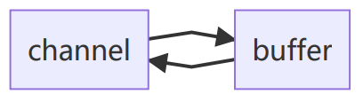

常见的 Channel 有

- FileChannel
- DatagramChannel
- SocketChannel
- ServerSocketChannel


buffer 则用来缓冲读写数据，常见的 buffer 有

- ByteBuffer
  - MappedByteBuffer
  - DirectByteBuffer
  - HeapByteBuffer
- ShortBuffer
- IntBuffer
- LongBuffer
- FloatBuffer
- DoubleBuffer
- CharBuffer


#### 1.2 Selector

selector 单从字面意思不好理解，需要结合服务器的设计演化来理解它的用途

##### 多线程版设计

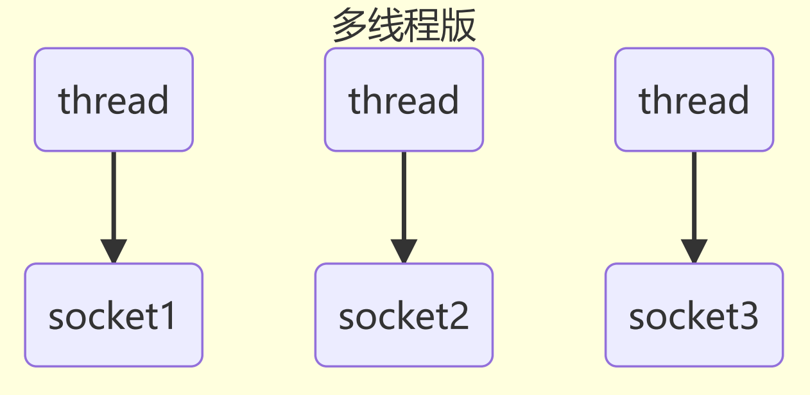


##### ⚠️ 多线程版缺点

- 内存占用高
- 线程上下文切换成本高
- 只适合连接数少的场景


##### 线程池版设计

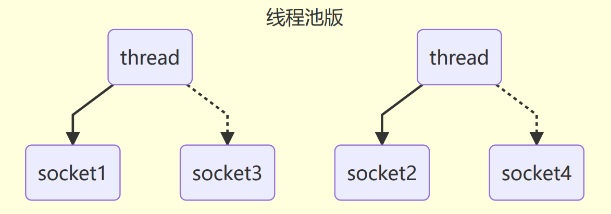


##### ⚠️ 线程池版缺点

- 阻塞模式下，线程仅能处理一个 socket 连接
- 仅适合短连接场景


##### selector 版设计

selector 的作用就是配合一个线程来管理多个 channel，获取这些 channel 上发生的事件，这些 channel 工作在非阻塞模式下，不会让线程吊死在一个 channel 上。适合连接数特别多，但流量低的场景（low traffic）

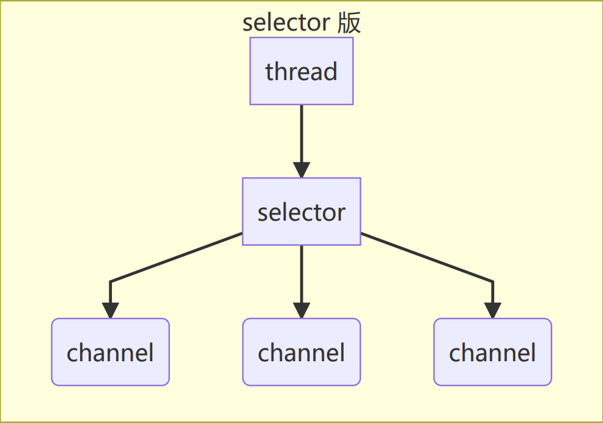

调用 selector 的 select() 会阻塞直到 channel 发生了读写就绪事件，这些事件发生，select 方法就会返回这些事件交给 thread 来处理


### 2. ByteBuffer

有一普通文本文件 data.txt，内容为

```
1234567890abcd
```

使用 FileChannel 来读取文件内容

```java
@Slf4j
public class TestByteBuffer {

    public static void main(String[] args) {
        //FileChannel
        // 1.输入输出流，2.RandomAccessFile
        try (FileChannel channel = new FileInputStream("data.txt").getChannel()) {
            //准备缓冲区
            ByteBuffer buffer = ByteBuffer.allocate(10);
            while(true) {
                //从 channel 读取数据，向 buffer 写入
                int len = channel.read(buffer);
                log.debug("读取到的字节数{}", len);
                if(len == -1) {//没有内容了
                    break;
                }
                //打印 buffer 的内容
                buffer.flip();//切换至读模式
                while(buffer.hasRemaining()) {//是否还有剩余未读的数据
                    byte b = buffer.get();
                    log.debug("实际字节{}", (char)b);
                }
                buffer.clear();//清除
            }
        } catch (IOException e) {
        }
    }
}
```

输出

```
10:39:03 [DEBUG] [main] c.i.n.ChannelDemo1 - 读到字节数：10
10:39:03 [DEBUG] [main] c.i.n.ChannelDemo1 - 1
10:39:03 [DEBUG] [main] c.i.n.ChannelDemo1 - 2
10:39:03 [DEBUG] [main] c.i.n.ChannelDemo1 - 3
10:39:03 [DEBUG] [main] c.i.n.ChannelDemo1 - 4
10:39:03 [DEBUG] [main] c.i.n.ChannelDemo1 - 5
10:39:03 [DEBUG] [main] c.i.n.ChannelDemo1 - 6
10:39:03 [DEBUG] [main] c.i.n.ChannelDemo1 - 7
10:39:03 [DEBUG] [main] c.i.n.ChannelDemo1 - 8
10:39:03 [DEBUG] [main] c.i.n.ChannelDemo1 - 9
10:39:03 [DEBUG] [main] c.i.n.ChannelDemo1 - 0
10:39:03 [DEBUG] [main] c.i.n.ChannelDemo1 - 读到字节数：4
10:39:03 [DEBUG] [main] c.i.n.ChannelDemo1 - a
10:39:03 [DEBUG] [main] c.i.n.ChannelDemo1 - b
10:39:03 [DEBUG] [main] c.i.n.ChannelDemo1 - c
10:39:03 [DEBUG] [main] c.i.n.ChannelDemo1 - d
10:39:03 [DEBUG] [main] c.i.n.ChannelDemo1 - 读到字节数：-1
```


#### 2.1 ByteBuffer 正确使用姿势

1. 向 buffer 写入数据，例如调用 channel.read(buffer)
2. 调用 flip() 切换至读模式
3. 从 buffer 读取数据，例如调用 buffer.get()
4. 调用 clear() 或 compact() 切换至写模式
5. 重复 1~4 步骤


#### 2.2 ByteBuffer 结构

ByteBuffer 有以下重要属性

- **capacity**(容量)
- **position**(读写指针)
- **limit**(读写限制)

一开始

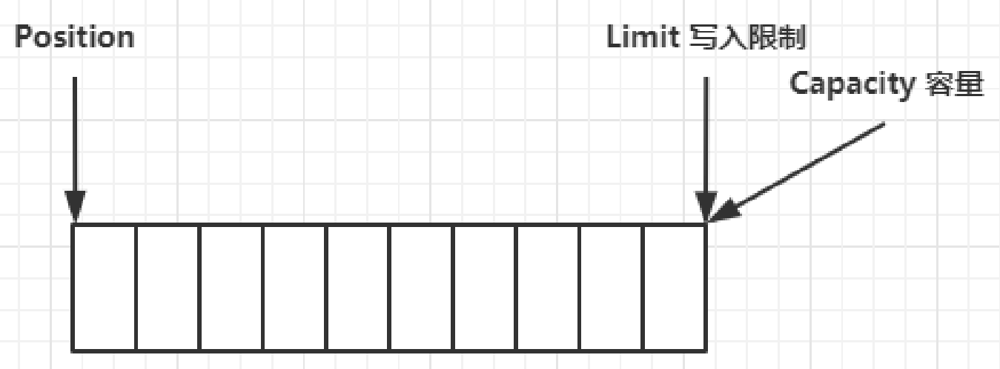

写模式下，position 是写入位置，limit 等于容量，下图表示写入了 4 个字节后的状态

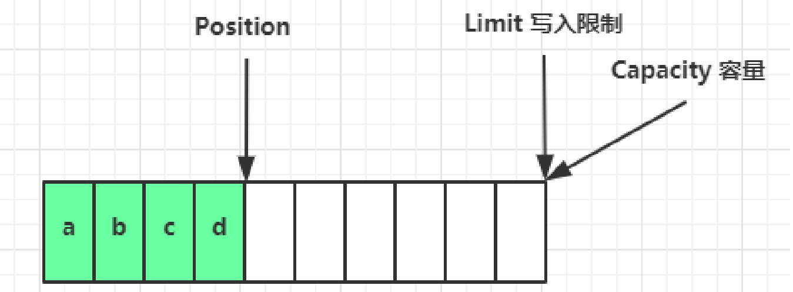

flip 动作发生后，position 切换为读取位置，limit 切换为读取限制

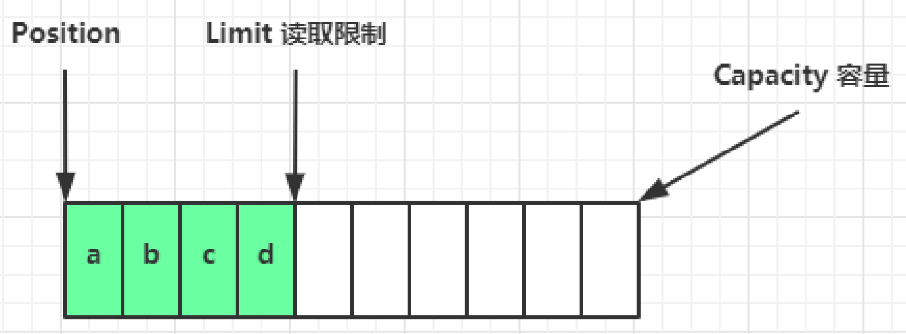

读取 4 个字节后，状态

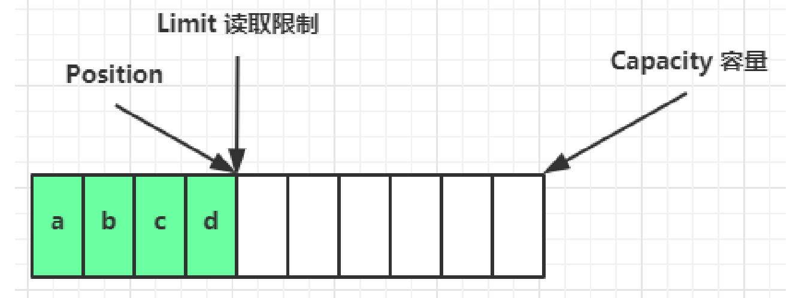

clear 动作发生后，状态

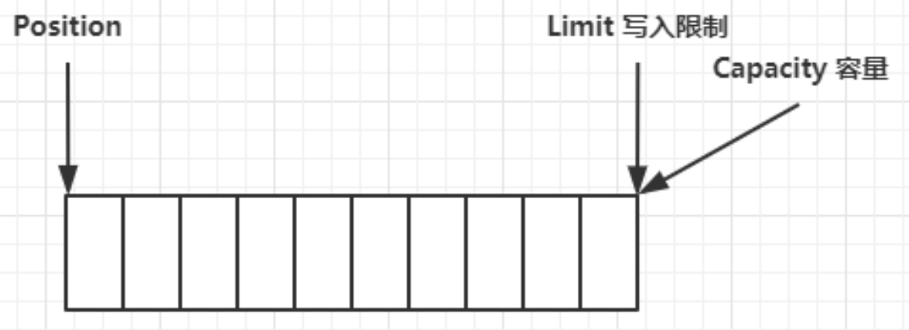

compact 方法，是把未读完的部分向前压缩，然后切换至写模式

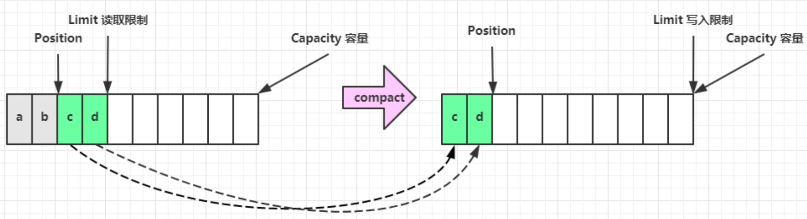


##### 💡 调试工具类

```java
import lombok.extern.slf4j.Slf4j;

import java.io.FileInputStream;
import java.io.IOException;
import java.nio.ByteBuffer;
import java.nio.channels.FileChannel;

@Slf4j
public class TestByteBuffer {

    public static void main(String[] args) {
        //FileChannel
        // 1.输入输出流，2.RandomAccessFile
        try (FileChannel channel = new FileInputStream("data.txt").getChannel()) {
            //准备缓冲区
            ByteBuffer buffer = ByteBuffer.allocate(10);
            while(true) {
                //从 channel 读取数据，向 buffer 写入
                int len = channel.read(buffer);
                log.debug("读取到的字节数{}", len);
                if(len == -1) {//没有内容了
                    break;
                }
                //打印 buffer 的内容
                buffer.flip();//切换至读模式
                while(buffer.hasRemaining()) {//是否还有剩余未读的数据
                    byte b = buffer.get();
                    log.debug("实际字节{}", (char)b);
                }
                buffer.clear();//清除
            }
        } catch (IOException e) {
        }
    }
}
```


#### 2.3 ByteBuffer 常见方法

##### 分配空间

可以使用 allocate 方法为 ByteBuffer 分配空间，其它 buffer 类也有该方法

```java
System.out.println(ByteBuffer.allocate(16).getClass());
System.out.println(ByteBuffer.allocateDirect(16).getClass());
/**
 class java.nio.HeapByteBuffer      - java 堆内存，读写效率较低，受到 GC 的影响
 class java.nio.DirectByteBuffer    - 直接内存，读写效率高(少一次拷贝)，不会受 GC 影响，分配的效率低
 */
```


##### 向 buffer 写入数据

有两种办法

- 调用 channel 的 read 方法
- 调用 buffer 自己的 put 方法

```java
int readBytes = channel.read(buf);
和
buf.put((byte)127);
```


##### 从 buffer 读取数据

同样有两种办法

- 调用 channel 的 write 方法
- 调用 buffer 自己的 get 方法

```java
int writeBytes = channel.write(buf);
和
byte b = buf.get();
```

get 方法会让 position 读指针向后走，如果想重复读取数据

- 可以调用 rewind 方法将 position 重新置为 0
- 或者调用 get(int i) 方法获取索引 i 的内容，它不会移动读指针

```java
ByteBuffer buffer = ByteBuffer.allocate(10);
        buffer.put(new byte[]{'a', 'b', 'c', 'd'});
        buffer.flip();

        //rewind 从头开始读
//        buffer.get(new byte[4]);
//        debugAll(buffer);
//        buffer.rewind();
//        System.out.println((char)buffer.get());

		//get(i) 不会改变读索引的位置
        System.out.println((char) buffer.get(3));
        debugAll(buffer);
```


##### mark 和 reset

mark 是在读取时，做一个标记，即使 position 改变，只要调用 reset 就能回到 mark 的位置

> 注意 
>
> rewind 和 flip 都会清除 mark 位置

```java
ByteBuffer buffer = ByteBuffer.allocate(10);
        buffer.put(new byte[]{'a', 'b', 'c', 'd'});
        buffer.flip();

        // mark & reset
        // mark 做一个标记，记录 position 位置，reset 是将 position 重置到 mark 的位置
        System.out.println((char) buffer.get());
        System.out.println((char) buffer.get());
        buffer.mark();//加标记，索引2 的位置
        System.out.println((char) buffer.get());
        System.out.println((char) buffer.get());
        buffer.reset();//将 position 重置到索引 2
        System.out.println((char) buffer.get());
        System.out.println((char) buffer.get());
```


##### 字符串与 ByteBuffer 互转

```java
import java.nio.ByteBuffer;
import java.nio.charset.StandardCharsets;

import static cn.itcast.netty.c1.ByteBufferUtil.debugAll;

public class TestByteBufferString {
    public static void main(String[] args) {
        //1.字符串转为ByteBuffer
        ByteBuffer buffer = ByteBuffer.allocate(16);
        buffer.put("hello".getBytes());
        debugAll(buffer);

        //转为字符串
        buffer.flip();
        String str1 = StandardCharsets.UTF_8.decode(buffer).toString();
        System.out.println(str1);

        //2.Charset
        ByteBuffer buffer2 = StandardCharsets.UTF_8.encode("hello");
        debugAll(buffer2);

        //3.wrap
        ByteBuffer buffer3 = ByteBuffer.wrap("hello".getBytes());
        debugAll(buffer3);

        //转为字符串
        String str2 = StandardCharsets.UTF_8.decode(buffer2).toString();
        System.out.println(str2);
    }
}
```


##### ⚠️ Buffer 的线程安全

> Buffer 是非线程安全的
>


#### 2.4 Scattering Reads

分散读取，有一个文本文件 3parts.txt

```tex
onetwothree
```

使用如下方式读取，可以将数据填充至多个 buffer

```java
import java.io.IOException;
import java.io.RandomAccessFile;
import java.nio.ByteBuffer;
import java.nio.channels.FileChannel;

import static cn.itcast.netty.c1.ByteBufferUtil.debugAll;

public class TestScatteringReads {
    public static void main(String[] args) {
        try (FileChannel channel = new RandomAccessFile("3parts.txt", "r").getChannel()) {
            ByteBuffer b1 = ByteBuffer.allocate(3);
            ByteBuffer b2 = ByteBuffer.allocate(3);
            ByteBuffer b3 = ByteBuffer.allocate(5);
            channel.read(new ByteBuffer[]{b1, b2, b3});
            b1.flip();
            b2.flip();
            b3.flip();
            debugAll(b1);
            debugAll(b2);
            debugAll(b3);
        } catch (IOException e) {

        }
    }
}
```


#### 2.5 Gathering Writes

使用如下方式写入，可以将多个 buffer 的数据填充至 channel

```java
import java.io.IOException;
import java.io.RandomAccessFile;
import java.nio.ByteBuffer;
import java.nio.channels.FileChannel;
import java.nio.charset.StandardCharsets;

public class TestGatheringWrites {

    public static void main(String[] args) {
        ByteBuffer b1 = StandardCharsets.UTF_8.encode("hello");
        ByteBuffer b2 = StandardCharsets.UTF_8.encode("world");
        ByteBuffer b3 = StandardCharsets.UTF_8.encode("你好");
        try (FileChannel channel = new RandomAccessFile("3parts.txt", "rw").getChannel()) {
            channel.write(new ByteBuffer[]{b1, b2, b3});
        } catch (IOException e) {

        }
    }

}
```


#### 2.6 练习

网络上有多条数据发送给服务端，数据之间使用 \n 进行分隔

但由于某种原因这些数据在接收时，被进行了重新组合，例如原始数据有3条为

- Hello,world\n
- I'm zhangsan\n
- How are you?\n

变成了下面的两个 byteBuffer (黏包，半包)

- Hello,world\nI'm zhangsan\nHo
- w are you?\n

现在要求你编写程序，将错乱的数据恢复成原始的按 \n 分隔的数据

```java
public class TestByteBufferExam {
    public static void main(String[] args) {
        /*
            网络上有多条数据发送给服务端，数据之间使用 \n 进行分隔
            但由于某种原因这些数据在接收时，被进行了重新组合，例如原始数据有3条为
                Hello,world\n
                I'm zhangsan\n
                How are you?\n
            变成了下面的两个 byteBuffer (黏包，半包)
                Hello,world\nI'm zhangsan\nHo
                w are you?\n
            现在要求你编写程序，将错乱的数据恢复成原始的按 \n 分隔的数据
        */
        ByteBuffer source = ByteBuffer.allocate(32);
        source.put("Hello,world\nI'm zhangsan\nHo".getBytes());
        split(source);
        source.put("w are you?\n".getBytes());
        split(source);
    }

    private static void split(ByteBuffer source) {
        source.flip();
        for(int i = 0; i < source.limit(); i++) {
            //找到一条完整消息
            if(source.get(i) == '\n') {
                int length = i + 1 - source.position();
                //把这条完整消息存入到新的 ByteBuffer
                ByteBuffer target = ByteBuffer.allocate(length);
                //从 source 读，向 target 写
                for(int j = 0; j < length; j++) {
                    target.put(source.get());
                }
                debugAll(target);
            }
        }
        source.compact();
    }

}
```


### 3. 文件编程

#### 3.1 FileChannel

##### ⚠️ FileChannel 工作模式

> FileChannel 只能工作在阻塞模式下
>


##### 获取

不能直接打开 FileChannel，必须通过 FileInputStream、FileOutputStream 或者 RandomAccessFile 来获取 FileChannel，它们都有 getChannel 方法

- 通过 FileInputStream 获取的 channel 只能读
- 通过 FileOutputStream 获取的 channel 只能写
- 通过 RandomAccessFile 是否能读写根据构造 RandomAccessFile 时的读写模式决定


##### 读取

会从 channel 读取数据填充 ByteBuffer，返回值表示读到了多少字节，-1 表示到达了文件的末尾

```java
int readBytes = channel.read(buffer);
```


##### 写入

写入的正确姿势如下， SocketChannel

```java
ByteBuffer buffer = ...;
buffer.put(...); // 存入数据
buffer.flip(); // 切换读模式

while(buffer.hasRemaining()) {
	channel.write(buffer);
}
```

在 while 中调用 channel.write 是因为 write 方法并不能保证一次将 buffer 中的内容全部写入 channel


##### 关闭

channel 必须关闭，不过调用了 FileInputStream、FileOutputStream 或者 RandomAccessFile 的 close 方法会间接地调用 channel 的 close 方法


##### 位置

获取当前位置

```java
long pos = channel.position();
```

设置当前位置

```java
long newPos = ...;
channel.position(newPos);
```

设置当前位置时，如果设置为文件的末尾

- 这时读取会返回 -1
- 这时写入，会追加内容，但要注意如果 position 超过了文件末尾，再写入时在新内容和原末尾之间会有空洞（00）


##### 大小

使用 size 方法获取文件的大小


##### 强制写入

操作系统出于性能的考虑，会将数据缓存，不是立刻写入磁盘。可以调用 force(true) 方法将文件内容 和元数据（文件的权限等信息）立刻写入磁盘


#### 3.2 两个 Channel 传输数据

```java
public class TestFileChannelTransferTo {
    public static void main(String[] args) {
        try (
                FileChannel from = new FileInputStream("data.txt").getChannel();
                FileChannel to = new FileOutputStream("to.txt").getChannel();
        ) {
            //效率高，底层会利用操作系统的零拷贝进行优化，一次传2g的数据
            long size = from.size();
            // left 变量代表还剩余多少字节
            for(long left = size; left > 0;) {
                System.out.println("position: " + (size-left) + "，left: " + left);
                left -= from.transferTo((size - left), left, to);
            }
        } catch (IOException e) {
            e.printStackTrace();
        }
    }
}
```


#### 3.3 Path

jdk7 引入了 Path 和 Paths 类

- Path 用来表示文件路径
- Paths 是工具类，用来获取 Path 实例

```java
Path source = Paths.get("1.txt"); // 相对路径 使用 user.dir 环境变量来定位 1.txt

Path source = Paths.get("d:\\1.txt"); // 绝对路径 代表了 d:\1.txt

Path source = Paths.get("d:/1.txt"); // 绝对路径 同样代表了 d:\1.txt

Path projects = Paths.get("d:\\data", "projects"); // 代表了 d:\data\projects
```


- . 代表了当前路径
- .. 代表了上一级路径

例如目录结构如下

```
d:
    |- data
        |- projects
            |- a
            |- b
```

代码

```java
Path path = Paths.get("d:\\data\\projects\\a\\..\\b");
System.out.println(path);
System.out.println(path.normalize()); // 正常化路径
```

会输出

```
d:\data\projects\a\..\b
d:\data\projects\b
```


#### 3.4 Files

检查文件是否存在

```java
Path path = Paths.get("helloword/data.txt");
System.out.println(Files.exists(path));
```


创建一级目录

```java
Path path = Paths.get("helloword/d1");
Files.createDirectory(path);
```

- 如果目录已存在，会抛异常 FileAlreadyExistsException
- 不能一次创建多级目录，否则会抛异常 NoSuchFileException


创建多级目录用

```java
Path path = Paths.get("helloword/d1/d2");
Files.createDirectories(path);
```


拷贝文件

```java
Path source = Paths.get("helloword/data.txt");
Path target = Paths.get("helloword/target.txt");

Files.copy(source, target);
```

- 如果文件已存在，会抛异常 FileAlreadyExistsException


如果希望用 source 覆盖掉 target，需要用 StandardCopyOption 来控制

```java
Files.copy(source, target, StandardCopyOption.REPLACE_EXISTING);
```


移动文件

```java
Path source = Paths.get("helloword/data.txt");
Path target = Paths.get("helloword/data.txt");

Files.move(source, target, StandardCopyOption.ATOMIC_MOVE);
```

- StandardCopyOption.ATOMIC_MOVE 保证文件移动的原子性


删除文件

```java
Path target = Paths.get("helloword/target.txt");

Files.delete(target);
```

- 如果文件不存在，会抛异常 NoSuchFileException


删除目录

```java
Path target = Paths.get("helloword/d1");

Files.delete(target);
```

- 如果目录还有内容，会抛异常 DirectoryNotEmptyException


遍历目录文件

```java
public class TestFilesWalkFileTree {
    public static void main(String[] args) throws IOException {
        AtomicInteger jarCount = new AtomicInteger();
        Files.walkFileTree(Paths.get("D:\\note\\ChatGPT使用教程"), new SimpleFileVisitor<Path>(){
            @Override
            public FileVisitResult visitFile(Path file, BasicFileAttributes attrs) throws IOException {
                if(file.toString().endsWith(".md")) {
                    System.out.println(file);
                    jarCount.incrementAndGet();
                }
                return super.visitFile(file, attrs);
            }
        });
        System.out.println("jar count: " + jarCount);
    }

    private static void m1() throws IOException {
        AtomicInteger dirCount = new AtomicInteger();
        AtomicInteger fileCount = new AtomicInteger();
        Files.walkFileTree(Paths.get("D:\\note\\ChatGPT使用教程"), new SimpleFileVisitor<Path>(){
            @Override
            public FileVisitResult preVisitDirectory(Path dir, BasicFileAttributes attrs) throws IOException {
                System.out.println("===>" + dir);
                dirCount.incrementAndGet();
                return super.preVisitDirectory(dir, attrs);
            }

            @Override
            public FileVisitResult visitFile(Path file, BasicFileAttributes attrs) throws IOException {
                System.out.println(file);
                fileCount.incrementAndGet();
                return super.visitFile(file, attrs);
            }
        });
        System.out.println("dir count: " + dirCount);
        System.out.println("file count: " + fileCount);
    }

}
```


删除多级目录

```java
public static void main(String[] args) throws IOException {
    Files.walkFileTree(Paths.get("D:\\英语的平行世界\\平行morty"), new SimpleFileVisitor<Path>(){
        @Override
        public FileVisitResult visitFile(Path file, BasicFileAttributes attrs) throws IOException {
            Files.delete(file);
            return super.visitFile(file, attrs);
        }

        @Override
        public FileVisitResult postVisitDirectory(Path dir, IOException exc) throws IOException {
            Files.delete(dir);
            return super.postVisitDirectory(dir, exc);
        }
    });
}
```

⚠️ 删除很危险

> 删除是危险操作，确保要递归删除的文件夹没有重要内容
>


拷贝多级目录

```java
public class TestFilesCopy {
    public static void main(String[] args) throws IOException {
        String source = "D:\\轻音\\轻音桌宠";
        String target = "D:\\专升本";

        Files.walk(Paths.get(source)).forEach(path -> {
            try {
                String targetName = path.toString().replace(source, target);
                System.out.println(targetName);
                //是目录
                if(Files.isDirectory(path)) {
                    Files.createDirectory(Paths.get(targetName));
                }

                //是普通文件
                if(Files.isRegularFile(path)) {
                    Files.copy(path, Paths.get(targetName));
                }
            } catch (Exception e) {
                e.printStackTrace();
            }
        });
    }
}
```


### 4. 网络编程

#### 4.1 非阻塞 vs 阻塞

##### 阻塞

- 阻塞模式下，相关方法都会导致线程暂停
  - ServerSocketChannel.accept 会在没有连接建立时让线程暂停
  - SocketChannel.read 会在没有数据可读时让线程暂停
  - 阻塞的表现其实就是线程暂停了，暂停期间不会占用 cpu，但线程相当于闲置
- 单线程下，阻塞方法之间相互影响，几乎不能正常工作，需要多线程支持
- 但多线程下，有新的问题，体现在以下方面
  - 32 位 jvm 一个线程 320k，64 位 jvm 一个线程 1024k，如果连接数过多，必然导致 OOM，并且线程太多，反而会因为频繁上下文切换导致性能降低
  - 可以采用线程池技术来减少线程数和线程上下文切换，但治标不治本，如果有很多连接建立，但长时间 inactive，会阻塞线程池中所有线程，因此不适合长连接，只适合短连接


**服务器端**

```java
@Slf4j
public class Server {
    public static void main(String[] args) throws IOException {
        //使用 nio 来理解阻塞模式

        //0.ByteBuffer
        ByteBuffer buffer = ByteBuffer.allocate(16);

        //1.创建了服务器
        ServerSocketChannel ssc = ServerSocketChannel.open();

        //2.绑定监听端口
        ssc.bind(new InetSocketAddress(8080));

        //3.连接集合
        List<SocketChannel> channels = new ArrayList<>();
        while(true) {
            //4.accept建立与客户端连接，SocketChannel 用来与客户端之间通信
            log.debug("connecting...");
            SocketChannel sc = ssc.accept();//阻塞方法，线程停止运行
            log.debug("connected...{}", sc);
            channels.add(sc);
            for(SocketChannel channel : channels) {
                //5.接收客户端发送的数据
                log.debug("before read...{}", channel);
                channel.read(buffer);//阻塞方法，线程停止运行
                buffer.flip();
                debugRead(buffer);
                buffer.clear();
                log.debug("after read...{}", channel);
            }
        }
    }
}
```


**客户端**

```java
public class Client {
    public static void main(String[] args) throws IOException {
        SocketChannel sc = SocketChannel.open();
        sc.connect(new InetSocketAddress("localhost", 8080));
        System.out.println("waiting...");
        System.out.println("1234");
    }
}
```


##### 非阻塞

- 非阻塞模式下，相关方法都会不会让线程暂停
  - 在 ServerSocketChannel.accept 在没有连接建立时，会返回 null，继续运行
  - SocketChannel.read 在没有数据可读时，会返回 0，但线程不必阻塞，可以去执行其它SocketChannel 的 read 或是去执行 ServerSocketChannel.accept
  - 写数据时，线程只是等待数据写入 Channel 即可，无需等 Channel 通过网络把数据发送出去
- 但非阻塞模式下，即使没有连接建立，和可读数据，线程仍然在不断运行，白白浪费了 cpu
- 数据复制过程中，线程实际还是阻塞的（AIO 改进的地方）


服务器端，客户端代码不变

```java
@Slf4j
public class Server {
    public static void main(String[] args) throws IOException {
        //使用 nio 来理解阻塞模式，单线程

        //0.ByteBuffer
        ByteBuffer buffer = ByteBuffer.allocate(16);

        //1.创建了服务器
        ServerSocketChannel ssc = ServerSocketChannel.open();
        ssc.configureBlocking(false);//非阻塞模式

        //2.绑定监听端口
        ssc.bind(new InetSocketAddress(8080));

        //3.连接集合
        List<SocketChannel> channels = new ArrayList<>();
        while(true) {
            //4.accept建立与客户端连接，SocketChannel 用来与客户端之间通信
            SocketChannel sc = ssc.accept();//非阻塞，线程还会继续运行，如果没有连接建立，sc就是null
            if(sc != null) {
                log.debug("connected...{}", sc);
                sc.configureBlocking(false);//非阻塞模式
                channels.add(sc);
            }
            for(SocketChannel channel : channels) {
                //5.接收客户端发送的数据
                int read = channel.read(buffer);//非阻塞，线程仍然会继续运行，如果没有读到数据，read返回0
                if(read > 0) {
                    buffer.flip();
                    debugRead(buffer);
                    buffer.clear();
                    log.debug("after read...{}", channel);
                }
            }
        }
    }
}
```


##### 多路复用

单线程可以配合 Selector 完成对多个 Channel 可读写事件的监控，这称之为多路复用

- 多路复用仅针对网络 IO、普通文件 IO 没法利用多路复用
- 如果不用 Selector 的非阻塞模式，线程大部分时间都在做无用功，而 Selector 能够保证
  - 有可连接事件时才去连接
  - 有可读事件才去读取
  - 有可写事件才去写入
    - 限于网络传输能力，Channel 未必时时可写，一旦 Channel 可写，会触发 Selector 的可写事件


#### 4.2 Selector

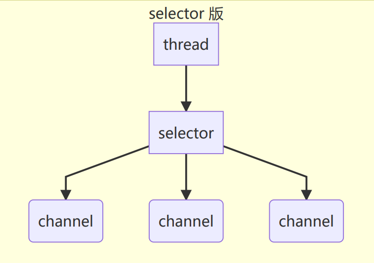

好处

- 一个线程配合 selector 就可以监控多个 channel 的事件，事件发生线程才去处理。避免非阻塞模式下所做无用功
- 让这个线程能够被充分利用
- 节约了线程的数量
- 减少了线程上下文切换


##### 创建

```java
Selector selector = Selector.open();
```


##### 绑定 Channel 事件

也称之为注册事件，绑定的事件 selector 才会关心

```java
channel.configureBlocking(false);
SelectionKey key = channel.register(selector, 绑定事件);
```

- channel 必须工作在非阻塞模式
- FileChannel 没有非阻塞模式，因此不能配合 selector 一起使用
- 绑定的事件类型可以有
  - connect - 客户端连接成功时触发
  - accept - 服务器端成功接受连接时触发
  - read - 数据可读入时触发，有因为接收能力弱，数据暂不能读入的情况
  - write - 数据可写出时触发，有因为发送能力弱，数据暂不能写出的情况


##### 监听 Channel 事件

可以通过下面三种方法来监听是否有事件发生，方法的返回值代表有多少 channel 发生了事件

方法1，阻塞直到绑定事件发生

```java
int count = selector.select();
```


方法2，阻塞直到绑定事件发生，或是超时（时间单位为 ms）

```java
int count = selector.select(long timeout);
```


方法3，不会阻塞，也就是不管有没有事件，立刻返回，自己根据返回值检查是否有事件

```java
int count = selector.selectNow();
```


##### 💡 select 何时不阻塞

- 事件发生时
  - 客户端发起连接请求，会触发 accept 事件
  - 客户端发送数据过来，客户端正常、异常关闭时，都会触发 read 事件，另外如果发送的数据大于 buffer 缓冲区，会触发多次读取事件
  - channel 可写，会触发 write 事件
  - 在 linux 下 nio bug 发生时
- 调用 selector.wakeup()
- 调用 selector.close()
- selector 所在线程 interrupt


#### 4.3 处理 accept 事件

客户端代码为

```java
public class Client {
    public static void main(String[] args) throws IOException {
        SocketChannel sc = SocketChannel.open();
        sc.connect(new InetSocketAddress("localhost", 8080));
        System.out.println("waiting...");
        System.out.println("1234");
    }
}
```


服务器端代码为

```java
@Slf4j
public class Server {
    public static void main(String[] args) throws IOException {

        //1.创建 selector，管理多个 channel
        Selector selector = Selector.open();

        ServerSocketChannel ssc = ServerSocketChannel.open();
        ssc.configureBlocking(false);

        //2.建立 selector 和 channel 的联系(注册)
        // SelectionKey 就是将来事件发生后，通过它可以知道事件和哪个channel的事件
        SelectionKey sscKey = ssc.register(selector, 0, null);
        // key 只关注 accept 事件
        sscKey.interestOps(SelectionKey.OP_ACCEPT);
        log.debug("register key:{}", sscKey);

        ssc.bind(new InetSocketAddress(8080));
        while(true) {
            //3. select方法，没有事件发生，线程阻塞；有事件发生，线程才会恢复运行
            // select 在事件未处理时，它不会阻塞，事件发生后要么处理，要么取消，不能置之不理。
            selector.select();
            //4. 处理事件，selectedKeys 内部包含了所有发生的事件
            Iterator<SelectionKey> iter = selector.selectedKeys().iterator();// accept，read
            while(iter.hasNext()) {
                SelectionKey key = iter.next();
                log.debug("key：{}", key);
                ServerSocketChannel channel = (ServerSocketChannel) key.channel();
                SocketChannel sc = channel.accept();
                sc.configureBlocking(false);//非阻塞模式
                SelectionKey scKey = sc.register(selector, 0, null);
                scKey.interestOps(SelectionKey.OP_READ);
                log.debug("{}", sc);
                //key.cancel();取消事件
            }
        }
```


##### 💡 事件发生后能否不处理

> 事件发生后，要么处理，要么取消（cancel），不能什么都不做，否则下次该事件仍会触发，这是 因为 nio 底层使用的是水平触发


#### 4.4 处理 read 事件

```java
@Slf4j
public class Server {
    public static void main(String[] args) throws IOException {

        //1.创建 selector，管理多个 channel
        Selector selector = Selector.open();

        ServerSocketChannel ssc = ServerSocketChannel.open();
        ssc.configureBlocking(false);

        //2.建立 selector 和 channel 的联系(注册)
        // SelectionKey 就是将来事件发生后，通过它可以知道事件和哪个channel的事件
        SelectionKey sscKey = ssc.register(selector, 0, null);
        // key 只关注 accept 事件
        sscKey.interestOps(SelectionKey.OP_ACCEPT);
        log.debug("register key:{}", sscKey);

        ssc.bind(new InetSocketAddress(8080));
        while(true) {
            //3. select方法，没有事件发生，线程阻塞；有事件发生，线程才会恢复运行
            // select 在事件未处理时，它不会阻塞，事件发生后要么处理，要么取消，不能置之不理。
            selector.select();
            //4. 处理事件，selectedKeys 内部包含了所有发生的事件
            Iterator<SelectionKey> iter = selector.selectedKeys().iterator();// accept，read
            while(iter.hasNext()) {
                SelectionKey key = iter.next();
                //处理key时，要从 selectedKeys 集合中删除，否则下次处理就会有问题
                iter.remove();
                log.debug("key：{}", key);
                //5.区分事件类型
                if (key.isAcceptable()) {//如果是 accept
                    ServerSocketChannel channel = (ServerSocketChannel) key.channel();
                    SocketChannel sc = channel.accept();
                    sc.configureBlocking(false);//非阻塞模式
                    SelectionKey scKey = sc.register(selector, 0, null);
                    scKey.interestOps(SelectionKey.OP_READ);
                    log.debug("{}", sc);
                } else if(key.isReadable()) {//如果是 read
                    try {
                        SocketChannel channel = (SocketChannel) key.channel();//拿到触发事件的channel
                        ByteBuffer buffer = ByteBuffer.allocate(16);
                        int read = channel.read(buffer);//如果是正常断开，read的方法的返回值是-1
                        if(read == -1) {
                            key.cancel();
                        } else {
                            buffer.flip();
                            debugRead(buffer);
                        }
                    } catch (IOException e) {
                        e.printStackTrace();
                        //因为客户端断开了，因此需要将 key 取消(从 selector 的 keys 集合中真正删除key)
                        key.cancel();
                    }
                }
                //key.cancel();取消事件
            }
        }
    }
}
```


##### 💡 为何要 iter.remove()

因为 select 在事件发生后，就会将相关的 key 放入 selectedKeys 集合，但不会在处理完后从 selectedKeys 集合中移除，需要我们自己编码删除。例如：

- 第一次触发了 ssckey 上的 accept 事件，没有移除 ssckey
- 第二次触发了 sckey 上的 read 事件，但这时 selectedKeys 中还有上次的 ssckey ，在处理时因为没有真正的 serverSocket 连上了，就会导致空指针异常


##### 💡 cancel 的作用

cancel 会取消注册在 selector 上的 channel，并从 keys 集合中删除 key 后续不会再监听事件


##### ⚠️ 不处理边界的问题

以前有同学写过这样的代码，思考注释中两个问题，以 bio 为例，其实 nio 道理是一样的

```java
public class Server {
	public static void main(String[] args) throws IOException {
		ServerSocket ss=new ServerSocket(9000);
		while (true) {
            Socket s = ss.accept();
            InputStream in = s.getInputStream();
            // 这里这么写，有没有问题
            byte[] arr = new byte[4];
            while(true) {
                int read = in.read(arr);
                // 这里这么写，有没有问题
                if(read == -1) {
                	break;
                }
            	System.out.println(new String(arr, 0, read));
			}
		}
	}
}
```

客户端

```java
public class Client {
    public static void main(String[] args) throws IOException {
        Socket max = new Socket("localhost", 9000);
        OutputStream out = max.getOutputStream();
        out.write("hello".getBytes());
        out.write("world".getBytes());
        out.write("你好".getBytes());
        max.close();
    }
}
```

输出

```
hell
owor
ld�
�好
```

为什么？

##### 处理消息的边界

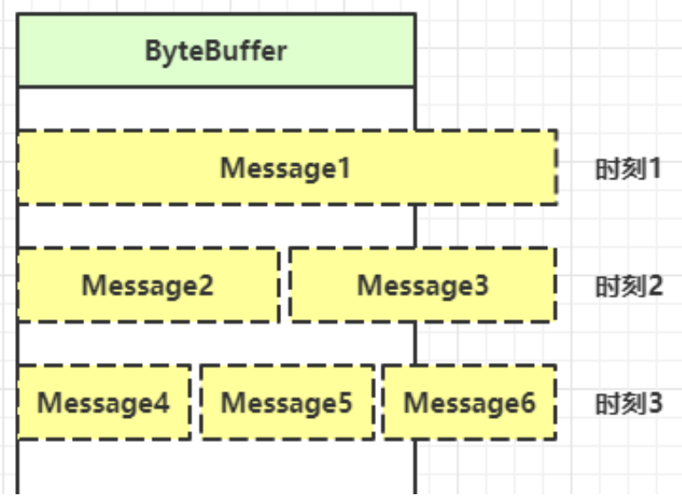

- 一种思路是固定消息长度，数据包大小一样，服务器按预定长度读取，缺点是浪费带宽
- 另一种思路是按分隔符拆分，缺点是效率低
- TLV 格式，即 Type 类型、Length 长度、Value 数据，类型和长度已知的情况下，就可以方便获取消息大小，分配合适的 buffer，缺点是 buffer 需要提前分配，如果内容过大，则影响 server 吞吐量
  - Http 1.1 是 TLV 格式
  - Http 2.0 是 LTV 格式

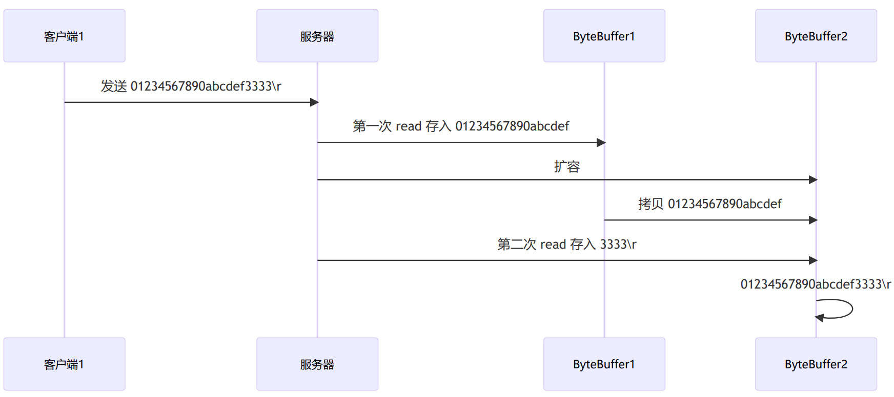


服务器端

```java
@Slf4j
public class Server {

    private static void split(ByteBuffer source) {
        source.flip();
        for(int i = 0; i < source.limit(); i++) {
            //找到一条完整消息
            if(source.get(i) == '\n') {
                int length = i + 1 -source.position();
                //把这条完整的消息存入新的ByteBuffer
                ByteBuffer target = ByteBuffer.allocate(length);
                //从source读，向target写
                for(int j = 0; j < length; j++) {
                    target.put(source.get());
                }
                debugAll(target);
            }
        }
        source.compact();
    }

    public static void main(String[] args) throws IOException {

        //1.创建 selector，管理多个 channel
        Selector selector = Selector.open();

        ServerSocketChannel ssc = ServerSocketChannel.open();
        ssc.configureBlocking(false);

        //2.建立 selector 和 channel 的联系(注册)
        // SelectionKey 就是将来事件发生后，通过它可以知道事件和哪个channel的事件
        SelectionKey sscKey = ssc.register(selector, 0, null);
        // key 只关注 accept 事件
        sscKey.interestOps(SelectionKey.OP_ACCEPT);
        log.debug("register key:{}", sscKey);

        ssc.bind(new InetSocketAddress(8080));
        while(true) {
            //3. select方法，没有事件发生，线程阻塞；有事件发生，线程才会恢复运行
            // select 在事件未处理时，它不会阻塞，事件发生后要么处理，要么取消，不能置之不理。
            selector.select();
            //4. 处理事件，selectedKeys 内部包含了所有发生的事件
            Iterator<SelectionKey> iter = selector.selectedKeys().iterator();// accept，read
            while(iter.hasNext()) {
                SelectionKey key = iter.next();
                //处理key时，要从 selectedKeys 集合中删除，否则下次处理就会有问题
                iter.remove();
                log.debug("key：{}", key);
                //5.区分事件类型
                if (key.isAcceptable()) {//如果是 accept
                    ServerSocketChannel channel = (ServerSocketChannel) key.channel();
                    SocketChannel sc = channel.accept();
                    sc.configureBlocking(false);//非阻塞模式
                    ByteBuffer buffer = ByteBuffer.allocate(16);//attachment
                    //将一个 byteBuffer 作为附件关联到 selectionKey 上
                    SelectionKey scKey = sc.register(selector, 0, buffer);
                    scKey.interestOps(SelectionKey.OP_READ);
                    log.debug("{}", sc);
                } else if(key.isReadable()) {//如果是 read
                    try {
                        SocketChannel channel = (SocketChannel) key.channel();//拿到触发事件的channel
                        //获取 selectionKey 上关联的附件
                        ByteBuffer buffer = (ByteBuffer)key.attachment();
                        int read = channel.read(buffer);//如果是正常断开，read的方法的返回值是-1
                        if(read == -1) {
                            key.cancel();
                        } else {
                            split(buffer);
                            if(buffer.position() == buffer.limit()) {
                                ByteBuffer newBuffer = ByteBuffer.allocate(buffer.capacity() * 2);
                                buffer.flip();
                                newBuffer.put(buffer);
                                key.attach(newBuffer);
                            }
                        }
                    } catch (IOException e) {
                        e.printStackTrace();
                        //因为客户端断开了，因此需要将 key 取消(从 selector 的 keys 集合中真正删除key)
                        key.cancel();
                    }
                }
                //key.cancel();取消事件
            }
        }
    }
}
```

客户端

```java
public class Client {
    public static void main(String[] args) throws IOException {
        SocketChannel sc = SocketChannel.open();
        sc.connect(new InetSocketAddress("localhost", 8080));
        SocketAddress address = sc.getLocalAddress();
        sc.write(Charset.defaultCharset().encode("hello\nworld\n"));
        System.in.read();

    }
}
```


ByteBuffer 大小分配

- 每个 channel 都需要记录可能被切分的消息，因为 ByteBuffer 不能被多个 channel 共同使用，因 此需要为每个 channel 维护一个独立的 ByteBuffer
- ByteBuffer 不能太大，比如一个 ByteBuffer 1Mb 的话，要支持百万连接就要 1Tb 内存，因此需 要设计大小可变的 ByteBuffer
  - 一种思路是首先分配一个较小的 buffer，例如 4k，如果发现数据不够，再分配 8k 的 buffer，将 4k buffer 内容拷贝至 8k buffer，优点是消息连续容易处理，缺点是数据拷贝耗 费性能，参考实现 http://tutorials.jenkov.com/java-performance/resizable-array.html
  - 另一种思路是用多个数组组成 buffer，一个数组不够，把多出来的内容写入新的数组，与前 面的区别是消息存储不连续解析复杂，优点是避免了拷贝引起的性能损耗


#### 4.5 处理 write 事件

##### 一次无法写完例子

- 非阻塞模式下，无法保证把 buffer 中所有数据都写入 channel，因此需要追踪 write 方法的返回值 （代表实际写入字节数）
- 用 selector 监听所有 channel 的可写事件，每个 channel 都需要一个 key 来跟踪 buffer，但这样 又会导致占用内存过多，就有两阶段策略
  - 当消息处理器第一次写入消息时，才将 channel 注册到 selector 上
  - selector 检查 channel 上的可写事件，如果所有的数据写完了，就取消 channel 的注册
  - 如果不取消，会每次可写均会触发 write 事件

```java
public class WriteServer {
    public static void main(String[] args) throws IOException {
        ServerSocketChannel ssc = ServerSocketChannel.open();
        ssc.configureBlocking(false);

        Selector selector = Selector.open();
        ssc.register(selector, SelectionKey.OP_ACCEPT);

        ssc.bind(new InetSocketAddress(8080));

        while(true) {
            selector.select();
            Iterator<SelectionKey> iter = selector.selectedKeys().iterator();
            while(iter.hasNext()) {
                SelectionKey key = iter.next();
                iter.remove();
                if(key.isAcceptable()) {
                    SocketChannel sc = ssc.accept();
                    sc.configureBlocking(false);
                    SelectionKey scKey = sc.register(selector, 0, null);
                    scKey.interestOps(SelectionKey.OP_READ);

                    //1.向客户端发送大量数据
                    StringBuilder sb = new StringBuilder();
                    for(int i = 0; i < 3000000; i++) {
                        sb.append("a");
                    }
                    ByteBuffer buffer = Charset.defaultCharset().encode(sb.toString());

                    //2.返回值代表实际写入的字节数
                    int write = sc.write(buffer);
                    System.out.println(write);

                    //3.判断是否有剩余内容
                    if(buffer.hasRemaining()) {
                        //4.关注可写事件
                        scKey.interestOps(scKey.interestOps() + SelectionKey.OP_WRITE);
                        //5.把未写完的数据挂到 scKey 上
                        scKey.attach(buffer);
                    }
                } else if(key.isWritable()) {
                    ByteBuffer buffer = (ByteBuffer) key.attachment();
                    SocketChannel sc = (SocketChannel) key.channel();
                    int write = sc.write(buffer);
                    System.out.println(write);
                    // 6.清理操作
                    if(!buffer.hasRemaining()) {
                        key.attach(null);//需要清理buffer
                        key.interestOps(key.interestOps() - SelectionKey.OP_WRITE);//不需要关注可写事件
                    }
                }
            }
        }

    }
}
```


客户端

```java
public class WriteClient {

    public static void main(String[] args) throws IOException {
        SocketChannel sc = SocketChannel.open();
        sc.connect(new InetSocketAddress("localhost", 8080));

        //3.接收数据
        int count = 0;
        while(true) {
            ByteBuffer buffer = ByteBuffer.allocate(1024 * 1024);
            count += sc.read(buffer);
            System.out.println(count);
            buffer.clear();
        }
    }

}
```


##### 💡 write 为何要取消

只要向 channel 发送数据时，socket 缓冲可写，这个事件会频繁触发，因此应当只在 socket 缓冲区写 不下时再关注可写事件，数据写完之后再取消关注


#### 4.6 更进一步

##### 💡 利用多线程优化

> 现在都是多核 cpu，设计时要充分考虑别让 cpu 的力量被白白浪费
>

前面的代码只有一个选择器，没有充分利用多核 cpu，如何改进呢？

分两组选择器

- 单线程配一个选择器，专门处理 accept 事件
- 创建 cpu 核心数的线程，每个线程配一个选择器，轮流处理 read 事件

```java
@Slf4j
public class MultiThreadServer {
    public static void main(String[] args) throws IOException {
        Thread.currentThread().setName("boss");
        ServerSocketChannel ssc = ServerSocketChannel.open();
        ssc.configureBlocking(false);
        Selector boss = Selector.open();
        SelectionKey boosKey = ssc.register(boss, 0, null);
        boosKey.interestOps(SelectionKey.OP_ACCEPT);
        ssc.bind(new InetSocketAddress(8080));
        //1.创建固定数量的worker 并初始化
        Worker[] workers = new Worker[Runtime.getRuntime().availableProcessors()];
        for(int i = 0; i < workers.length; i++) {
            workers[i] = new Worker("worker-" + i);
        }
        AtomicInteger index = new AtomicInteger();
        while(true) {
            boss.select();
            Iterator<SelectionKey> iter = boss.selectedKeys().iterator();
            while(iter.hasNext()) {
                SelectionKey key = iter.next();
                iter.remove();
                if(key.isAcceptable()) {
                    SocketChannel sc = ssc.accept();
                    sc.configureBlocking(false);
                    log.debug("connected...{}", sc.getRemoteAddress());
                    //2.关联selector
                    log.debug("before register...{}", sc.getRemoteAddress());
                    //负载均衡 轮询
                    workers[index.getAndIncrement() % workers.length].register(sc);//boss 调用 初始化 selector，启动 worker-0
                    log.debug("after register...{}", sc.getRemoteAddress());
                }
            }
        }
    }

    static class Worker implements Runnable {

        private Thread thread;
        private Selector selector;
        private String name;
        private volatile boolean start = false;//还未初始化
        private ConcurrentLinkedQueue<Runnable> queue = new ConcurrentLinkedQueue<>();

        public Worker(String name) {
            this.name = name;
        }

        //初始化线程，和 selector
        public void register(SocketChannel sc) throws IOException {
            if(!start) {
                thread = new Thread(this, name);
                thread.start();
                selector = Selector.open();
                start = true;
            }
            //向队列添加了任务，但这个任务并没有立刻执行//boss
            queue.add(() -> {
                try {
                    sc.register(selector, SelectionKey.OP_READ, null);
                } catch (ClosedChannelException e) {
                    e.printStackTrace();
                }
            });
            selector.wakeup();
        }

        @Override
        public void run() {
            while(true) {
                try {
                    selector.select();//worker-0 阻塞
                    Runnable task = queue.poll();
                    if(task != null) {
                        task.run();//执行了 sc.register(selector, SelectionKey.OP_READ, null);
                    }
                    Iterator<SelectionKey> iter = selector.selectedKeys().iterator();
                    while(iter.hasNext()) {
                        SelectionKey key = iter.next();
                        iter.remove();
                        if(key.isReadable()) {
                            ByteBuffer buffer = ByteBuffer.allocate(16);
                            SocketChannel channel = (SocketChannel) key.channel();
                            log.debug("read...{}", channel.getRemoteAddress());
                            channel.read(buffer);
                            buffer.flip();
                            debugAll(buffer);
                        }
                    }
                } catch (IOException e) {
                    e.printStackTrace();
                }
            }
        }
    }

}
```


##### 💡 如何拿到 cpu 个数

- Runtime.getRuntime().availableProcessors() 如果工作在 docker 容器下，因为容器不是物理隔离的，会拿到物理 cpu 个数，而不是容器申请时的个数
- 这个问题直到 jdk 10 才修复，使用 jvm 参数 UseContainerSupport 配置， 默认开启


#### 4.7 UDP

- UDP 是无连接的，client 发送数据不会管 server 是否开启
- server 这边的 receive 方法会将接收到的数据存入 byte buffer，但如果数据报文超过 buffer 大小，多出来的数据会被默默抛弃

首先启动服务器端

```java
public class UdpServer {
    public static void main(String[] args) {
        try (DatagramChannel channel = DatagramChannel.open()) {
            channel.socket().bind(new InetSocketAddress(9999));
            System.out.println("waiting...");
            ByteBuffer buffer = ByteBuffer.allocate(32);
            channel.receive(buffer);
            buffer.flip();
            debug(buffer);
        } catch (IOException e) {
        	e.printStackTrace();
        }
    }
}
```

输出

```
waiting...
```

运行客户端

```java
public class UdpClient {
    public static void main(String[] args) {
        try (DatagramChannel channel = DatagramChannel.open()) {
            ByteBuffer buffer = StandardCharsets.UTF_8.encode("hello");
            InetSocketAddress address = new InetSocketAddress("localhost",
            9999);
        	channel.send(buffer, address);
        } catch (Exception e) {
        	e.printStackTrace();
        }
    }
}
```

接下来服务器端输出

```
		 +-------------------------------------------------+
		 | 0 1 2 3 4 5 6 7 8 9 a b c d e f |
+--------+-------------------------------------------------+----------------+
|00000000| 68 65 6c 6c 6f |hello |
+--------+-------------------------------------------------+----------------+
```


### 5. NIO vs BIO

#### 5.1 stream vs channel

- stream 不会自动缓冲数据，channel 会利用系统提供的发送缓冲区、接收缓冲区（更为底层）
- stream 仅支持阻塞 API，channel 同时支持阻塞、非阻塞 API，网络 channel 可配合 selector 实现多路复用
- 二者均为全双工，即读写可以同时进行


#### 5.2 IO 模型

同步阻塞、同步非阻塞、同步多路复用、异步阻塞（没有此情况）、异步非阻塞

- 同步：线程自己去获取结果（一个线程）
- 异步：线程自己不去获取结果，而是由其它线程送结果（至少两个线程）

当调用一次 channel.read 或 stream.read 后，会切换至操作系统内核态来完成真正数据读取，而读取 又分为两个阶段，分别为：

- 等待数据阶段
- 复制数据阶段

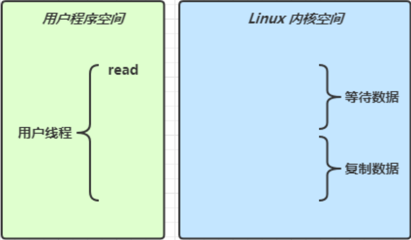


- 阻塞 IO

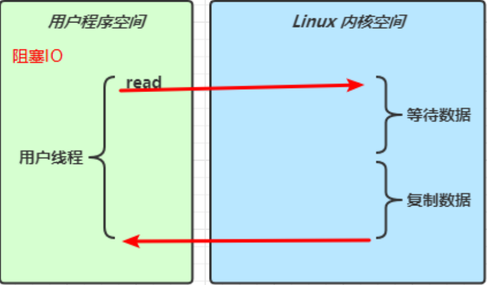


- 非阻塞 IO

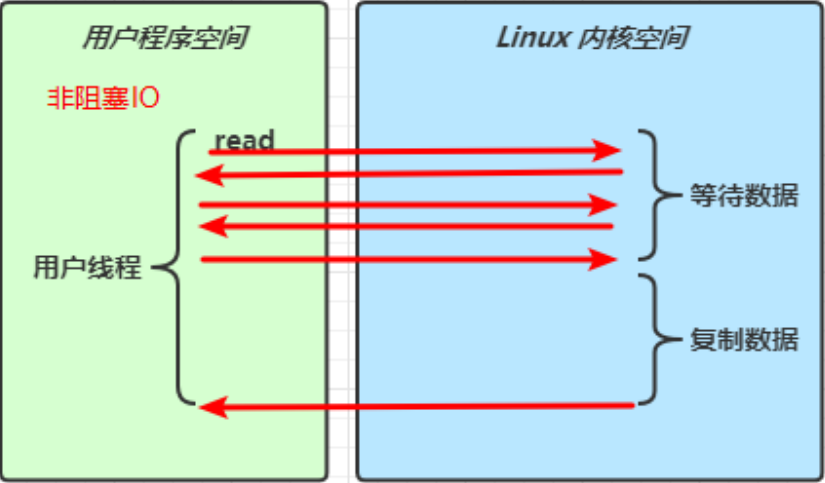


- 多路复用

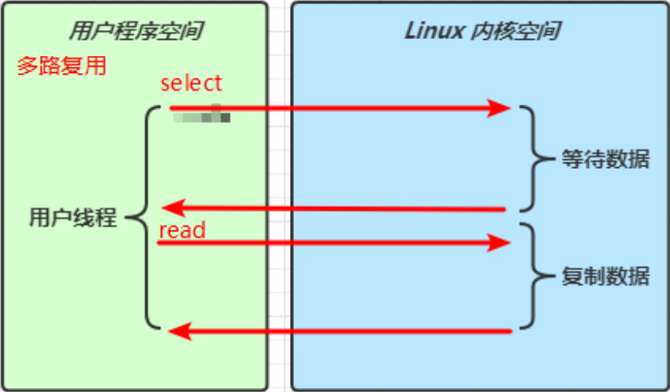


- 信号驱动
- 异步 IO

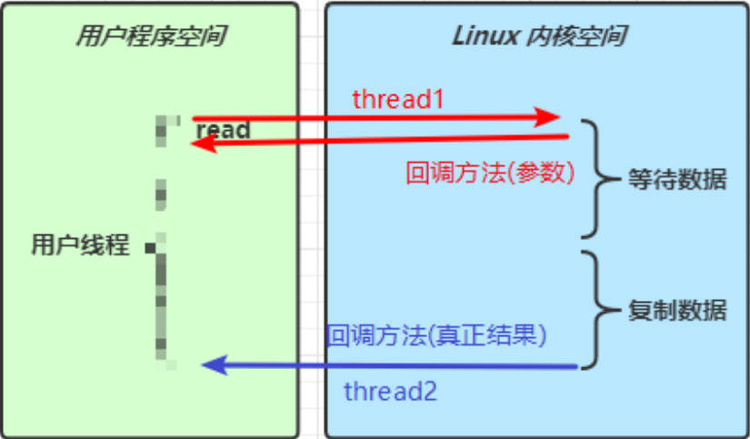


- 阻塞 IO vs 多路复用

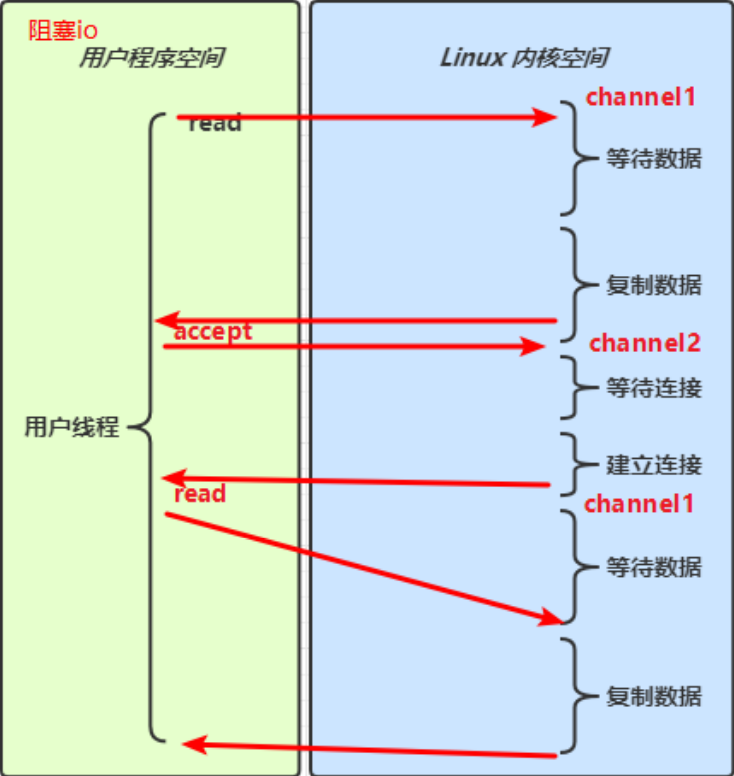

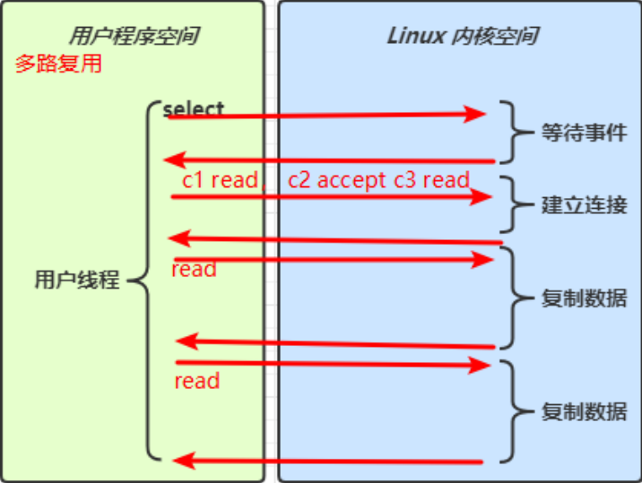


##### 🔖 参考

UNIX 网络编程 - 卷 I


#### 5.3 零拷贝

##### 传统 IO 问题

传统的 IO 将一个文件通过 socket 写出

```java
File f = new File("helloword/data.txt");
RandomAccessFile file = new RandomAccessFile(file, "r");

byte[] buf = new byte[(int)f.length()];
file.read(buf);

Socket socket = ...;
socket.getOutputStream().write(buf);
```

内部工作流程是这样的：

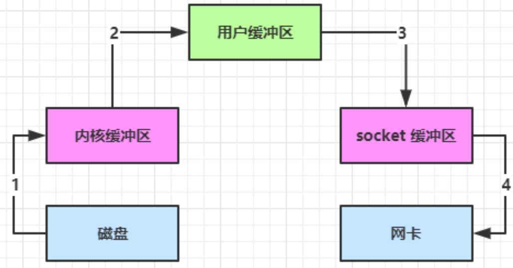

1. java 本身并不具备 IO 读写能力，因此 read 方法调用后，要从 java 程序的**用户态**切换至**内核态**，去调用操作系统（Kernel）的读能力，将数据读入**内核缓冲区**。这期间用户线程阻塞，操作系统使用 DMA（Direct Memory Access，**DMA 也可以理解为硬件单元，用来解放 cpu 完成文件 IO**）来实现文件读，其间也不会使用 cpu

2. 从**内核态**切换回**用户态**，将数据从**内核缓冲区**读入**用户缓冲区**（即 byte[] buf），这期间 cpu 会参与拷贝，无法利用 DMA
3. 调用 write 方法，这时将数据从**用户缓冲区**（byte[] buf）写入 **socket 缓冲区**，cpu 会参与拷贝
4. 接下来要向网卡写数据，这项能力 java 又不具备，因此又得从**用户态**切换至**内核态**，调用操作系统的写能力，使用 DMA 将 **socket 缓冲区**的数据写入网卡，不会使用 cpu

可以看到中间环节较多，java 的 IO 实际不是物理设备级别的读写，而是缓存的复制，底层的真正读写 是操作系统来完成的

- 用户态与内核态的切换发生了 3 次，这个操作比较重量级
- 数据拷贝了共 4 次


##### NIO 优化

通过 DirectByteBuf

- ByteBuffer.allocate(10) HeapByteBuffer 使用的还是 java 内存
- ByteBuffer.allocateDirect(10) DirectByteBuffer 使用的是操作系统内存

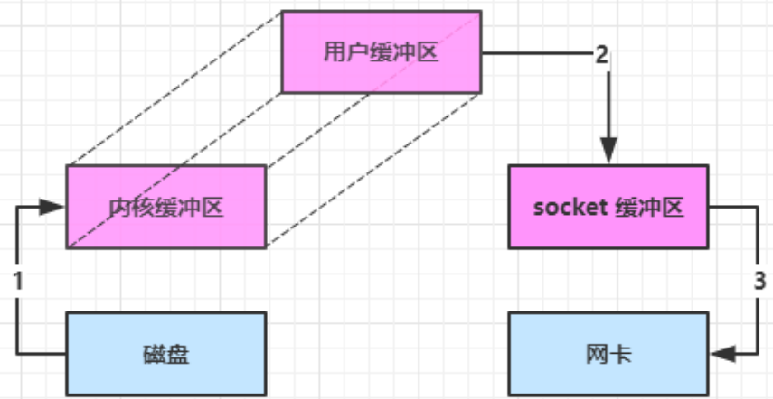

大部分步骤与优化前相同，不再赘述。唯有一点：java 可以使用 DirectByteBuf 将堆外内存映射到 jvm 内存中来直接访问使用

- 这块内存不受 jvm 垃圾回收的影响，因此内存地址固定，有助于 IO 读写
- java 中的 DirectByteBuf 对象仅维护了此内存的虚引用，内存回收分成两步
  - DirectByteBuf 对象被垃圾回收，将虚引用加入引用队列
  - 通过专门线程访问引用队列，根据虚引用释放堆外内存
- 减少了一次数据拷贝，用户态与内核态的切换次数没有减少


进一步优化（底层采用了 linux 2.1 后提供的 sendFile 方法），java 中对应着两个 channel 调用 transferTo/transferFrom 方法拷贝数据

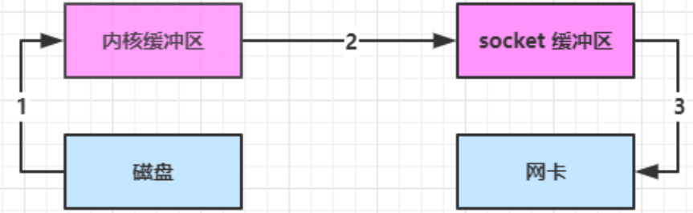

1. java 调用 transferTo 方法后，要从 java 程序的**用户态**切换至**内核态**，使用 DMA将数据读入**内核缓冲区**，不会使用 cpu
2. 数据从**内核缓冲区**传输到 **socket 缓冲区**，cpu 会参与拷贝
3. 最后使用 DMA 将 **socket 缓冲区**的数据写入网卡，不会使用 cpu

可以看到

- 只发生了一次用户态与内核态的切换
- 数据拷贝了 3 次


进一步优化（linux 2.4）

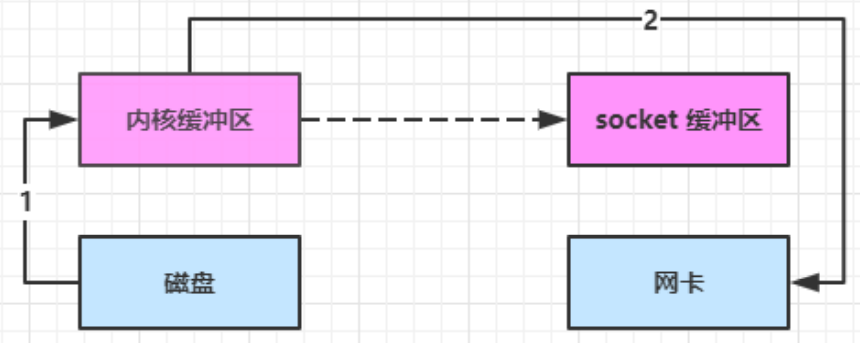

1. java 调用 transferTo 方法后，要从 java 程序的用户态切换至内核态，使用 DMA将数据读入内核缓冲区，不会使用 cpu
2. 只会将一些 offset 和 length 信息拷入 socket 缓冲区，几乎无消耗
3. 使用 DMA 将 内核缓冲区的数据写入网卡，不会使用 cpu

整个过程仅只发生了一次用户态与内核态的切换，数据拷贝了 2 次。所谓的【零拷贝】，并不是真正无 拷贝，而是在不会拷贝重复数据到 jvm 内存中，零拷贝的优点有：

- 更少的用户态与内核态的切换
- 不利用 cpu 计算，减少 cpu 缓存伪共享
- 零拷贝适合小文件传输


#### 5.4 AIO

先来看看 AsynchronousFileChannel

- 同步意味着，在进行读写操作时，线程需要等待结果，还是相当于闲置
- 异步意味着，在进行读写操作时，线程不必等待结果，而是将来由操作系统来通过回调方式由另外的线程来获得结果

> 异步模型需要底层操作系统（Kernel）提供支持
>
> - Windows 系统通过 IOCP 实现了真正的异步 IO
> - Linux 系统异步 IO 在 2.6 版本引入，但其底层实现还是用多路复用模拟了异步 IO，性能没有优势


##### 文件 AIO

先来看看 AsynchronousFileChannel

```java
@Slf4j
public class AioFileChannel {
    public static void main(String[] args) throws IOException {
        try (AsynchronousFileChannel channel =
                     AsynchronousFileChannel.open(Paths.get("data.txt"), StandardOpenOption.READ)){

            //参数1 ByteBuffer
            //参数2 读取的起始位置
            //参数3 附件
            //参数4 回调对象 CompletionHandler
            ByteBuffer buffer = ByteBuffer.allocate(16);
            log.debug("read begin...");
            channel.read(buffer, 0, buffer, new CompletionHandler<Integer, ByteBuffer>() {
                @Override//read成功
                public void completed(Integer result, ByteBuffer attachment) {
                    log.debug("read completed...");
                    attachment.flip();
                    debugAll(attachment);
                }

                @Override//read失败
                public void failed(Throwable exc, ByteBuffer attachment) {
                    exc.printStackTrace();
                }
            });
            log.debug("read end...");
        } catch (IOException e) {
            e.printStackTrace();
        }
        System.in.read();
    }
}
```

输出

```java
17:58:42 [DEBUG] [main] c.i.n.c.AioFileChannel - read begin...
17:58:42 [DEBUG] [main] c.i.n.c.AioFileChannel - read end...
17:58:42 [DEBUG] [Thread-8] c.i.n.c.AioFileChannel - read completed...
+--------+-------------------- all ------------------------+----------------+
position: [0], limit: [14]
         +-------------------------------------------------+
         |  0  1  2  3  4  5  6  7  8  9  a  b  c  d  e  f |
+--------+-------------------------------------------------+----------------+
|00000000| 31 32 33 34 35 36 37 38 39 30 61 62 63 64 00 00 |1234567890abcd..|
+--------+-------------------------------------------------+----------------+
```

可以看到

- 响应文件读取成功的是另一个线程 Thread-8
- 主线程并没有 IO 操作阻塞


##### 💡 守护线程

默认文件 AIO 使用的线程都是守护线程，所以最后要执行 System.in.read() 以避免守护线程意外结 束


# 二. Netty 入门

## 1. 概述

### 1.1 Netty 是什么？

Netty 是一个异步的、基于事件驱动的网络应用框架，用于快速开发可维护、高性能的网络服务器和客户端


### 1.2 Netty 的作者


他还是另一个著名网络应用框架 Mina 的重要贡献者


### 1.3 Netty 的地位

Netty 在 Java 网络应用框架中的地位就好比：Spring 框架在 JavaEE 开发中的地位

以下的框架都使用了 Netty，因为它们有网络通信需求！

- Cassandra - nosql 数据库
- Spark - 大数据分布式计算框架
- Hadoop - 大数据分布式存储框架
- RocketMQ - ali 开源的消息队列

- ElasticSearch - 搜索引擎
- gRPC - rpc 框架
- Dubbo - rpc 框架
- Spring 5.x - flux api 完全抛弃了 tomcat ，使用 netty 作为服务器端
- Zookeeper - 分布式协调框架


### 1.4 Netty 的优势

- Netty vs NIO，工作量大，bug 多
  - 需要自己构建协议
  - 解决 TCP 传输问题，如粘包、半包
  - epoll 空轮询导致 CPU 100%
  - 对 API 进行增强，使之更易用，如 FastThreadLocal => ThreadLocal，ByteBuf => ByteBuffer
- Netty vs 其它网络应用框架
  - Mina 由 apache 维护，将来 3.x 版本可能会有较大重构，破坏 API 向下兼容性，Netty 的开发迭代更迅速，API 更简洁、文档更优秀
  - 久经考验，16年，Netty 版本
    - 2.x 2004
    - 3.x 2008
    - 4.x 2013
    - 5.x 已废弃（没有明显的性能提升，维护成本高）


## 2. Hello World

### 2.1 目标

开发一个简单的服务器端和客户端

- 客户端向服务器端发送 hello, world
- 服务器仅接收，不返回

加入依赖

```xml
<dependency>
    <groupId>io.netty</groupId>
    <artifactId>netty-all</artifactId>
    <version>4.1.39.Final</version>
</dependency>
```


### 2.2 服务器端

```java
public class HelloServer {
    public static void main(String[] args) {
        //1.启动器，负责组装 netty 组件，启动服务器
        new ServerBootstrap()
                //2.BossEventLoop, WorkerEventLoop(selector, thread), group组
                .group(new NioEventLoopGroup())
                //3.选择服务器的 ServerSocketChannel 实现
                .channel(NioServerSocketChannel.class)
                //4.boss 负责处理连接, worker(child) 负责处理读写, 决定了 worker(child) 能执行哪些操作(handler)
                .childHandler(
                    //5.channel 代表和客户端进行数据读写的通道, Initializer 初始化, 负责添加别的 handler
                    new ChannelInitializer<NioSocketChannel>() {
                    @Override
                    protected void initChannel(NioSocketChannel ch) throws Exception {
                        //6.添加具体的handler
                        ch.pipeline().addLast(new StringDecoder());//将 ByteBuf 转换为字符串
                        ch.pipeline().addLast(new ChannelInboundHandlerAdapter() {//自定义 handler
                            @Override//读事件
                            public void channelRead(ChannelHandlerContext ctx, Object msg) throws Exception {
                                //打印上一步转换好的字符串
                                System.out.println(msg);
                            }
                        });
                    }
                })
                //7.绑定监听端口
                .bind(8080);
    }
}
```

代码解读

- 1 处，创建 NioEventLoopGroup，可以简单理解为 线程池 + Selector 后面会详细展开
- 2 处，选择服务 Scoket 实现类，其中 NioServerSocketChannel 表示基于 NIO 的服务器端实现，其它实现还有
  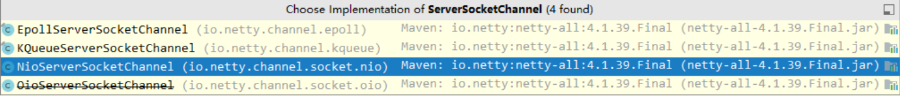
- 3 处，为啥方法叫 childHandler，是接下来添加的处理器都是给 SocketChannel 用的，而不是给 ServerSocketChannel。ChannelInitializer 处理器（仅执行一次），它的作用是待客户端 SocketChannel 建立连接后，执行 initChannel 以便添加更多的处理器 
- 4 处，ServerSocketChannel 绑定的监听端口 
- 5 处，SocketChannel 的处理器，解码 ByteBuf => String 
- 6 处，SocketChannel 的业务处理器，使用上一个处理器的处理结果


### 2.3 客户端

```java
public class HelloClient {
    public static void main(String[] args) throws InterruptedException {
        //1.启动类
        new Bootstrap()
                //2.添加EventLoop
                .group(new NioEventLoopGroup())
                //3.选择客户端 channel 实现
                .channel(NioSocketChannel.class)
                //4.添加处理器
                .handler(new ChannelInitializer<NioSocketChannel>() {
                    @Override//在连接建立后被调用
                    protected void initChannel(NioSocketChannel ch) throws Exception {
                        ch.pipeline().addLast(new StringEncoder());
                    }
                })
                //5.连接到服务器
                .connect(new InetSocketAddress("localhost", 8080))
                .sync()//阻塞方法，直到连接建立
                .channel()//代表连接对象
                //6.向服务器发送数据
                .writeAndFlush("hello, world");
    }
}
```

代码解读

- 1 处，创建 NioEventLoopGroup，同 Server
- 2 处，选择客户 Socket 实现类，NioSocketChannel 表示基于 NIO 的客户端实现，其它实现还有
  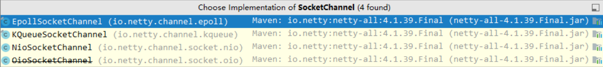

- 3 处，添加 SocketChannel 的处理器，ChannelInitializer 处理器（仅执行一次），它的作用是待客户端 SocketChannel 建立连接后，执行 initChannel 以便添加更多的处理器
- 4 处，指定要连接的服务器和端口
- 5 处，Netty 中很多方法都是异步的，如 connect，这时需要使用 sync 方法等待 connect 建立连接完毕
- 6 处，获取 channel 对象，它即为通道抽象，可以进行数据读写操作
- 7 处，写入消息并清空缓冲区
- 8 处，消息会经过通道 handler 处理，这里是将 String => ByteBuf 发出数据经过网络传输，到达服务器端，服务器端 5 和 6 处的 handler 先后被触发，走完一个流程


### 2.4 流程梳理

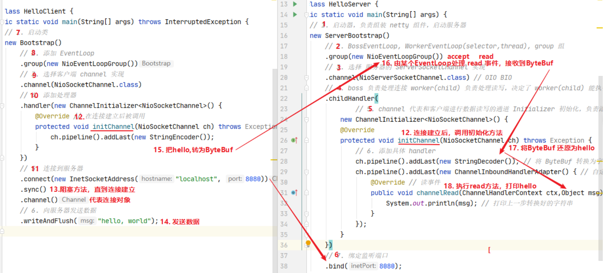

#### 💡 提示

一开始需要树立正确的观念

- 把 channel 理解为数据的通道
- 把 msg 理解为流动的数据，最开始输入是 ByteBuf，但经过 pipeline 的加工，会变成其它类型对象，最后输出又变成 ByteBuf
- 把 handler 理解为数据的处理工序
  - 工序有多道，合在一起就是 pipeline，pipeline 负责发布事件（读、读取完成...）传播给每个 handler， handler 对自己感兴趣的事件进行处理（重写了相应事件处理方法）
  - handler 分 Inbound 和 Outbound 两类
- 把 eventLoop 理解为处理数据的工人
  - 工人可以管理多个 channel 的 io 操作，并且一旦工人负责了某个 channel，就要负责到底（绑定）
  - 工人既可以执行 io 操作，也可以进行任务处理，每位工人有任务队列，队列里可以堆放多个 channel 的待处理任务，任务分为普通任务、定时任务
  - 工人按照 pipeline 顺序，依次按照 handler 的规划（代码）处理数据，可以为每道工序指定不同的工人


## 3. 组件

### 3.1 EventLoop

事件循环对象

EventLoop 本质是一个单线程执行器（同时维护了一个 Selector），里面有 run 方法处理 Channel 上 源源不断的 io 事件。

它的继承关系比较复杂

- 一条线是继承自 j.u.c.ScheduledExecutorService 因此包含了线程池中所有的方法
- 另一条线是继承自 netty 自己的 OrderedEventExecutor，
  - 提供了 boolean inEventLoop(Thread thread) 方法判断一个线程是否属于此 EventLoop
  - 提供了 parent 方法来看看自己属于哪个 EventLoopGroup


事件循环组

EventLoopGroup 是一组 EventLoop，Channel 一般会调用 EventLoopGroup 的 register 方法来绑定 其中一个 EventLoop，后续这个 Channel 上的 io 事件都由此 EventLoop 来处理（保证了 io 事件处理 时的线程安全）

- 继承自 netty 自己的 EventExecutorGroup
  - 实现了 Iterable 接口提供遍历 EventLoop 的能力
  - 另有 next 方法获取集合中下一个 EventLoop

```java
@Slf4j
public class TestEventLoop {
    public static void main(String[] args) {
        //1.创建事件循环组
        EventLoopGroup group1 = new NioEventLoopGroup(2);// io事件，普通任务，定时任务
//        EventLoopGroup group2 = new DefaultEventLoopGroup();// 普通任务，定时任务
        //2.获取下一个事件循环对象
        System.out.println(group1.next());
        System.out.println(group1.next());
        System.out.println(group1.next());
        System.out.println(group1.next());

        //3.执行普通任务
//        group1.next().submit(() -> {
//            try {
//                Thread.sleep(1000);
//                log.debug("ok");
//            } catch (InterruptedException e) {
//                e.printStackTrace();
//            }
//        });
//        log.debug("main");

        //4.执行定时任务
        group1.next().scheduleAtFixedRate(() -> {
           log.debug("ok");
        }, 0, 1, TimeUnit.SECONDS);
        log.debug("main");

    }
}
```


#### 💡 优雅关闭

优雅关闭 shutdownGracefully 方法。该方法会首先切换 EventLoopGroup 到关闭状态从而拒绝新的任务的加入，然后在任务队列的任务都处理完成后，停止线程的运行。从而确保整体应用是在正常有序 的状态下退出的


#### 演示 NioEventLoop 处理 io 事件

服务器端两个 nio worker 工人

```java
@Slf4j
public class EventLoopServer {
    public static void main(String[] args) {
        new ServerBootstrap()
                // boss 和 worker
                // 细分1：boss只负责ServerSocketChannel上accept事件，worker只负责socketChannel上的读写
                .group(new NioEventLoopGroup(), new NioEventLoopGroup(2))
                .channel(NioServerSocketChannel.class)
                .childHandler(new ChannelInitializer<NioSocketChannel>() {
                    @Override
                    protected void initChannel(NioSocketChannel ch) throws Exception {
                        ch.pipeline().addLast(new ChannelInboundHandlerAdapter(){
                            @Override
                            public void channelRead(ChannelHandlerContext ctx, Object msg) throws Exception {
                                ByteBuf buf = (ByteBuf) msg;
                                log.debug(buf.toString(Charset.defaultCharset()));
                            }
                        });
                    }
                }).bind(8080);

    }
}
```

客户端，启动三次，分别修改发送字符串为 zhangsan（第一次），lisi（第二次），wangwu（第三 次）

```java
public class EventLoopClient {
    public static void main(String[] args) throws InterruptedException {
        //1.启动类
        Channel channel = new Bootstrap()
                //2.添加EventLoop
                .group(new NioEventLoopGroup())
                //3.选择客户端 channel 实现
                .channel(NioSocketChannel.class)
                //4.添加处理器
                .handler(new ChannelInitializer<NioSocketChannel>() {
                    @Override//在连接建立后被调用
                    protected void initChannel(NioSocketChannel ch) throws Exception {
                        ch.pipeline().addLast(new StringEncoder());
                    }
                })
                //5.连接到服务器
                .connect(new InetSocketAddress("localhost", 8080))
                .sync()//阻塞方法，直到连接建立
                .channel();//代表连接对象
        System.out.println(channel);
        System.out.println("");
    }
}
```

最后输出

```
22:03:34 [DEBUG] [nioEventLoopGroup-3-1] c.i.o.EventLoopTest - zhangsan
22:03:36 [DEBUG] [nioEventLoopGroup-3-1] c.i.o.EventLoopTest - zhangsan
22:05:36 [DEBUG] [nioEventLoopGroup-3-2] c.i.o.EventLoopTest - lisi
22:05:38 [DEBUG] [nioEventLoopGroup-3-2] c.i.o.EventLoopTest - lisi
22:06:09 [DEBUG] [nioEventLoopGroup-3-1] c.i.o.EventLoopTest - wangwu
22:06:11 [DEBUG] [nioEventLoopGroup-3-1] c.i.o.EventLoopTest - wangwu
```

可以看到两个工人轮流处理 channel，但工人与 channel 之间进行了绑定

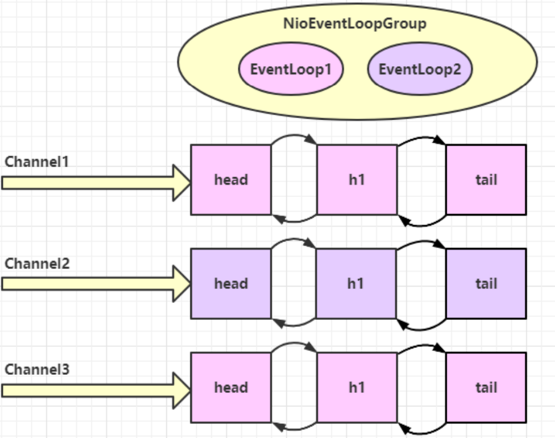


再增加两个非 nio 工人

```java
@Slf4j
public class EventLoopServer {
    public static void main(String[] args) {

        //细分2：创建一个独立的EventLoopGroup
        EventLoopGroup group = new DefaultEventLoopGroup();

        new ServerBootstrap()
                // boss 和 worker
                // 细分1：boss只负责ServerSocketChannel上accept事件，worker只负责socketChannel上的读写
                .group(new NioEventLoopGroup(), new NioEventLoopGroup(2))
                .channel(NioServerSocketChannel.class)
                .childHandler(new ChannelInitializer<NioSocketChannel>() {
                    @Override
                    protected void initChannel(NioSocketChannel ch) throws Exception {
                        ch.pipeline().addLast("handler1",new ChannelInboundHandlerAdapter(){
                            @Override
                            public void channelRead(ChannelHandlerContext ctx, Object msg) throws Exception {
                                ByteBuf buf = (ByteBuf) msg;
                                log.debug(buf.toString(Charset.defaultCharset()));
                                ctx.fireChannelRead(msg);//让消息传递给下一个handler
                            }
                        }).addLast(group, "handler2",new ChannelInboundHandlerAdapter(){
                                @Override
                                public void channelRead(ChannelHandlerContext ctx, Object msg) throws Exception {
                                ByteBuf buf = (ByteBuf) msg;
                                log.debug(buf.toString(Charset.defaultCharset()));
                                }
                        });
                    }
                })
                .bind(8080);

    }
}

```

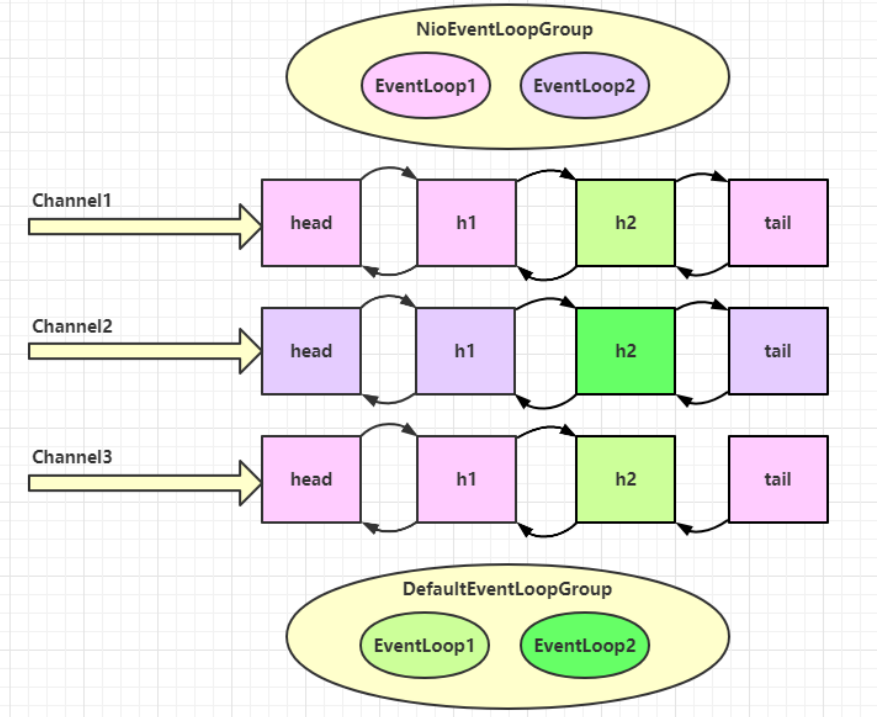


#### 💡 handler 执行中如何换人？

关键代码 io.netty.channel.AbstractChannelHandlerContext#invokeChannelRead()

```java
static void invokeChannelRead(final AbstractChannelHandlerContext next, Object
msg) {
    final Object m = next.pipeline.touch(ObjectUtil.checkNotNull(msg, "msg"),
    next);
    // 下一个 handler 的事件循环是否与当前的事件循环是同一个线程
    EventExecutor executor = next.executor();
    // 是，直接调用
    if (executor.inEventLoop()) {
    	next.invokeChannelRead(m);
    }
    // 不是，将要执行的代码作为任务提交给下一个事件循环处理（换人）
    else {
        executor.execute(new Runnable() {
            @Override
            public void run() {
            	next.invokeChannelRead(m);
            }
        });
    }
}
```

- 如果两个 handler 绑定的是同一个线程，那么就直接调用
- 否则，把要调用的代码封装为一个任务对象，由下一个 handler 的线程来调用


#### 演示 NioEventLoop 处理普通任务

NioEventLoop 除了可以处理 io 事件，同样可以向它提交普通任务

```java
NioEventLoopGroup nioWorkers = new NioEventLoopGroup(2);

log.debug("server start...");
Thread.sleep(2000);
nioWorkers.execute(()->{
	log.debug("normal task...");
});
```

输出

```java
22:30:36 [DEBUG] [main] c.i.o.EventLoopTest2 - server start...
22:30:38 [DEBUG] [nioEventLoopGroup-2-1] c.i.o.EventLoopTest2 - normal task...
```

> 可以用来执行耗时较长的任务
>


#### 演示 NioEventLoop 处理定时任务

```java
NioEventLoopGroup nioWorkers = new NioEventLoopGroup(2);

log.debug("server start...");
Thread.sleep(2000);
nioWorkers.scheduleAtFixedRate(() -> {
	log.debug("running...");
}, 0, 1, TimeUnit.SECONDS);
```

输出

```
22:35:15 [DEBUG] [main] c.i.o.EventLoopTest2 - server start...
22:35:17 [DEBUG] [nioEventLoopGroup-2-1] c.i.o.EventLoopTest2 - running...
22:35:18 [DEBUG] [nioEventLoopGroup-2-1] c.i.o.EventLoopTest2 - running...
22:35:19 [DEBUG] [nioEventLoopGroup-2-1] c.i.o.EventLoopTest2 - running...
22:35:20 [DEBUG] [nioEventLoopGroup-2-1] c.i.o.EventLoopTest2 - running...
...
```

> 可以用来执行定时任务
>


### 3.2 Channel

channel 的主要作用

- close() 可以用来关闭 channel
- closeFuture() 用来处理 channel 的关闭
  - sync 方法作用是同步等待 channel 关闭
  - 而 addListener 方法是异步等待 channel 关闭
- pipeline() 方法添加处理器
- write() 方法将数据写入
- writeAndFlush() 方法将数据写入并刷出


#### ChannelFuture

```java
@Slf4j
public class EventLoopClient {
    public static void main(String[] args) throws InterruptedException {
        //2.带有Future，Promise的类型都是和异步方法配套使用，用来处理结果
        ChannelFuture channelFuture = new Bootstrap()
                .group(new NioEventLoopGroup())
                .channel(NioSocketChannel.class)
                .handler(new ChannelInitializer<NioSocketChannel>() {
                    @Override//在连接建立后被调用
                    protected void initChannel(NioSocketChannel ch) throws Exception {
                        ch.pipeline().addLast(new StringEncoder());
                    }
                })
                //1.连接到服务器
                //异步非阻塞，main发起了调用，真正执行connect是nio线程
                .connect(new InetSocketAddress("localhost", 8080));//1秒后

        //2.1 使用sync方法同步处理结果
//        channelFuture.sync();//阻塞住当前线程，直到nio线程连接建立完毕
//        //无阻塞向下执行获取channel
//        Channel channel = channelFuture.channel();
//        log.debug("{}", channel);
//        channel.writeAndFlush("hello,world");

        //2.2 使用addListener(回调函数) 方法异步处理结果
        channelFuture.addListener(new ChannelFutureListener(){
            @Override
            //在nio线程连接建立好之后，会调用operationComplete
            public void operationComplete(ChannelFuture future) throws Exception {
                Channel channel = future.channel();
                log.debug("{}", channel);
                channel.writeAndFlush("hello, world");
            }
        });


    }
}
```

 ChannelFuture 对象，它的作用是利用 channel() 方法来获取 Channel 对象

> **注意**：connect 方法是异步的，意味着不等连接建立，方法执行就返回了。因此 channelFuture 对象中不 能【立刻】获得到正确的 Channel 对象

如何获得到正确的 Channel 对象

- sync 方法是同步等待连接建立完成
- addListener(回调函数) 方法异步处理结果


#### CloseFuture

```java
@Slf4j
public class CloseFutureClient {
    public static void main(String[] args) throws InterruptedException {
        NioEventLoopGroup group = new NioEventLoopGroup();
        ChannelFuture channelFuture = new Bootstrap()
                .group(group)
                .channel(NioSocketChannel.class)
                .handler(new ChannelInitializer<NioSocketChannel>() {

                    @Override
                    protected void initChannel(NioSocketChannel ch) throws Exception {
                        ch.pipeline().addLast(new LoggingHandler(LogLevel.DEBUG));
                        ch.pipeline().addLast(new StringEncoder());
                    }
                })
                .connect(new InetSocketAddress("localhost", 8080));

        Channel channel = channelFuture.sync().channel();
        log.debug("{}", channel);
        new Thread(() ->{
            Scanner scanner = new Scanner(System.in);
            while(true) {
                String line = scanner.nextLine();
                if("q".equals(line)) {
                    channel.close();//close异步操作
//                    log.debug("处理关闭之后的操作");//不能在这里善后
                    break;
                }
                channel.writeAndFlush(line);
            }
        }, "input").start();

        //获取ClosedFuture对象。1)同步处理关闭，2)异步处理关闭
        ChannelFuture closeFuture = channel.closeFuture();
//        System.out.println("waiting close...");
//        closeFuture.sync();
//        log.debug("处理关闭之后的操作");

        closeFuture.addListener(new ChannelFutureListener() {
            @Override
            public void operationComplete(ChannelFuture future) throws Exception {
                log.debug("处理关闭之后的操作");
                group.shutdownGracefully();
            }
        });

    }
}
```


#### 💡 异步提升的是什么

- 有些同学看到这里会有疑问：为什么不在一个线程中去执行建立连接、去执行关闭 channel，那样不是也可以吗？非要用这么复杂的异步方式：比如一个线程发起建立连接，另一个线程去真正建立连接
- 还有同学会笼统地回答，因为 netty 异步方式用了多线程、多线程就效率高。其实这些认识都比较片面，多线程和异步所提升的效率并不是所认为的

思考下面的场景，4 个医生给人看病，每个病人花费 20 分钟，而且医生看病的过程中是以病人为单位 的，一个病人看完了，才能看下一个病人。假设病人源源不断地来，可以计算一下 4 个医生一天工作 8 小时，处理的病人总数是： 4 * 8 * 3 = 96

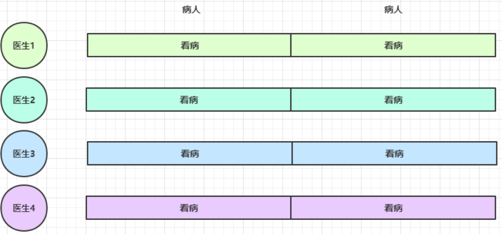

经研究发现，看病可以细分为四个步骤，经拆分后每个步骤需要 5 分钟，如下

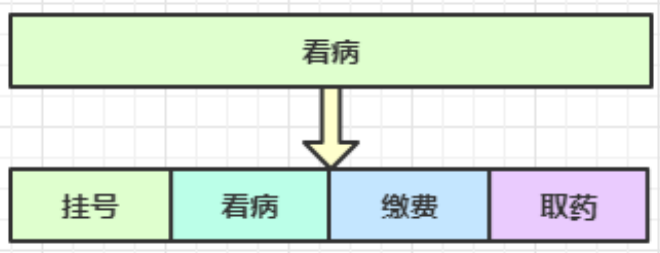

因此可以做如下优化，只有一开始，医生 2、3、4 分别要等待 5、10、15 分钟才能执行工作，但只要后 续病人源源不断地来，他们就能够满负荷工作，并且处理病人的能力提高到了 4 * 8 * 12 效率几乎是 原来的四倍

要点

- 单线程没法异步提高效率，必须配合多线程、多核 cpu 才能发挥异步的优势
- 异步并没有缩短响应时间，反而有所增加
- 合理进行任务拆分，也是利用异步的关键


### 3.3 Future & Promise

在异步处理时，经常用到这两个接口

首先要说明 netty 中的 Future 与 jdk 中的 Future 同名，但是是两个接口，netty 的 Future 继承自 jdk 的 Future，而 Promise 又对 netty Future 进行了扩展

- jdk Future 只能同步等待任务结束（或成功、或失败）才能得到结果
- netty Future 可以同步等待任务结束得到结果，也可以异步方式得到结果，但都是要等任务结束
- netty Promise 不仅有 netty Future 的功能，而且脱离了任务独立存在，只作为两个线程间传递结果的容器

| 功能/名称    | jdk Future                     | netty Future                                                 | Promise      |
| ------------ | ------------------------------ | ------------------------------------------------------------ | ------------ |
| cancel       | 取消任务                       | -                                                            | -            |
| isCanceled   | 任务是否取消                   | -                                                            | -            |
| isDone       | 任务是否完成，不能区分成功失败 | -                                                            | -            |
| get          | 获取任务结果，阻塞等待         | -                                                            | -            |
| getNow       | -                              | 获取任务结果，非阻塞，还未产生结果时返回 null                | -            |
| await        | -                              | 等待任务结束，如果任务失败，不会抛异常，而是通过 isSuccess 判断 | -            |
| sync         | -                              | 等待任务结束，如果任务失败，抛出异常                         | -            |
| isSuccess    | -                              | 判断任务是否成功                                             | -            |
| cause        | -                              | 获取失败信息，非阻塞，如果没有失败，返回null                 | -            |
| addLinstener | -                              | 添加回调，异步接收结果                                       | -            |
| setSuccess   | -                              | -                                                            | 设置成功结果 |
| setFailure   | -                              | -                                                            | 设置失败结果 |


#### jdk-future

同步处理任务

```java
@Slf4j
public class TestJdkFuture {
    public static void main(String[] args) throws ExecutionException, InterruptedException {
        //1.线程池
        ExecutorService service = Executors.newFixedThreadPool(2);
        //2.提交任务
        Future<Integer> future = service.submit(new Callable<Integer>() {
            @Override
            public Integer call() throws Exception {
                log.debug("执行计算");
                Thread.sleep(1000);
                return 50;
            }
        });

        //3.主线程通过future来获取结果
        log.debug("等待结果");
        log.debug("结果是{}", future.get());

    }
}
```


#### netty-future

```java
@Slf4j
public class TestNettyFuture {
    public static void main(String[] args) throws ExecutionException, InterruptedException {
        NioEventLoopGroup group = new NioEventLoopGroup();

        EventLoop eventLoop = group.next();
        Future<Integer> future = eventLoop.submit(new Callable<Integer>() {
            @Override
            public Integer call() throws Exception {
                log.debug("执行计算");
                Thread.sleep(1000);
                return 70;
            }
        });

        //同步
//        log.debug("等待结果");
//        log.debug("结果是{}", future.get());

        //异步
        future.addListener(new GenericFutureListener<Future<? super Integer>>() {
            @Override
            public void operationComplete(Future<? super Integer> future) throws Exception {
                log.debug("接受结果：{}", future.getNow());
            }
        });

    }
}
```


#### netty-promise

```java
@Slf4j
public class TestNettyPromise {
    public static void main(String[] args) throws ExecutionException, InterruptedException {
        //1.准备EventLoop对象
        EventLoop eventLoop = new NioEventLoopGroup().next();

        //2.可以主动创建promise，结果容器
        DefaultPromise<Integer> promise = new DefaultPromise<>(eventLoop);

        new Thread(() ->{
            //3.任意一个线程执行计算，计算完毕后向promise填充结果
            log.debug("开始计算...");
            try {
                int i = 1 / 0;
                Thread.sleep(1000);
                promise.setSuccess(80);
            } catch (InterruptedException e) {
                e.printStackTrace();
                promise.setFailure(e);
            }
        }).start();

        //4.接收结果的线程
        log.debug("等待结果...");
        log.debug("结果是：{}", promise.get());

    }
}
```


### 3.4 Handler & Pipeline

ChannelHandler 用来处理 Channel 上的各种事件，分为入站、出站两种。所有 ChannelHandler 被连 成一串，就是 Pipeline

- 入站处理器通常是 ChannelInboundHandlerAdapter 的子类，主要用来读取客户端数据，写回结果
- 出站处理器通常是 ChannelOutboundHandlerAdapter 的子类，主要对写回结果进行加工

打个比喻，每个 Channel 是一个产品的加工车间，Pipeline 是车间中的流水线，ChannelHandler 就是 流水线上的各道工序，而后面要讲的 ByteBuf 是原材料，经过很多工序的加工：先经过一道道入站工 序，再经过一道道出站工序最终变成产品


先搞清楚顺序，服务端

```java
@Slf4j
public class TestPipeline {
    public static void main(String[] args) {
        new ServerBootstrap()
                .group(new NioEventLoopGroup())
                .channel(NioServerSocketChannel.class)
                .childHandler(new ChannelInitializer<NioSocketChannel>() {
                    @Override
                    protected void initChannel(NioSocketChannel ch) throws Exception {
                        //1.通过channel拿到pipeline
                        ChannelPipeline pipeline = ch.pipeline();
                        //2.添加处理器 head -> h1 -> h2 -> h3 -> h4 -> h5 -> h6 -> tail
                        pipeline.addLast("h1", new ChannelInboundHandlerAdapter(){
                            @Override
                            public void channelRead(ChannelHandlerContext ctx, Object msg) throws Exception {
                                log.debug("1");
                                super.channelRead(ctx, msg);
                            }
                        });
                        pipeline.addLast("h2", new ChannelInboundHandlerAdapter(){
                            @Override
                            public void channelRead(ChannelHandlerContext ctx, Object msg) throws Exception {
                                log.debug("2");
                                super.channelRead(ctx, msg);
                            }
                        });
                        pipeline.addLast("h3", new ChannelInboundHandlerAdapter(){
                            @Override
                            public void channelRead(ChannelHandlerContext ctx, Object msg) throws Exception {
                                log.debug("3");
                                super.channelRead(ctx, msg);
                                ch.writeAndFlush(ctx.alloc().buffer().writeBytes("server...".getBytes()));
                            }
                        });
                        pipeline.addLast("h4", new ChannelOutboundHandlerAdapter(){
                            @Override
                            public void write(ChannelHandlerContext ctx, Object msg, ChannelPromise promise) throws Exception {
                                log.debug("4");
                                super.write(ctx, msg, promise);
                            }
                        });
                        pipeline.addLast("h5", new ChannelOutboundHandlerAdapter(){
                            @Override
                            public void write(ChannelHandlerContext ctx, Object msg, ChannelPromise promise) throws Exception {
                                log.debug("5");
                                super.write(ctx, msg, promise);
                            }
                        });
                        pipeline.addLast("h6", new ChannelOutboundHandlerAdapter(){
                            @Override
                            public void write(ChannelHandlerContext ctx, Object msg, ChannelPromise promise) throws Exception {
                                log.debug("6");
                                super.write(ctx, msg, promise);
                            }
                        });
                    }
                }).bind(8080);
    }
}
```

客户端

```java
@Slf4j
public class CloseFutureClient {
    public static void main(String[] args) throws InterruptedException {
        NioEventLoopGroup group = new NioEventLoopGroup();
        ChannelFuture channelFuture = new Bootstrap()
                .group(group)
                .channel(NioSocketChannel.class)
                .handler(new ChannelInitializer<NioSocketChannel>() {

                    @Override
                    protected void initChannel(NioSocketChannel ch) throws Exception {
                        ch.pipeline().addLast(new LoggingHandler(LogLevel.DEBUG));
                        ch.pipeline().addLast(new StringEncoder());
                    }
                })
                .connect(new InetSocketAddress("localhost", 8080));

        Channel channel = channelFuture.sync().channel();
        log.debug("{}", channel);
        new Thread(() ->{
            Scanner scanner = new Scanner(System.in);
            while(true) {
                String line = scanner.nextLine();
                if("q".equals(line)) {
                    channel.close();//close异步操作
//                    log.debug("处理关闭之后的操作");//不能在这里善后
                    break;
                }
                channel.writeAndFlush(line);
            }
        }, "input").start();

        //获取ClosedFuture对象。1)同步处理关闭，2)异步处理关闭
        ChannelFuture closeFuture = channel.closeFuture();
//        System.out.println("waiting close...");
//        closeFuture.sync();
//        log.debug("处理关闭之后的操作");

        closeFuture.addListener(new ChannelFutureListener() {
            @Override
            public void operationComplete(ChannelFuture future) throws Exception {
                log.debug("处理关闭之后的操作");
                group.shutdownGracefully();
            }
        });

    }
}
```

可以看到，ChannelInboundHandlerAdapter 是按照 addLast 的顺序执行的，而 ChannelOutboundHandlerAdapter 是按照 addLast 的逆序执行的。ChannelPipeline 的实现是一个 ChannelHandlerContext（包装了 ChannelHandler） 组成的双向链表

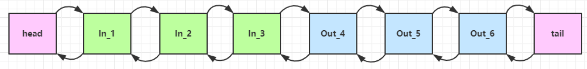

- 入站处理器中，super.channelRead(ctx, msg) 是 **调用下一个入站处理器**
  - 如果注释掉 1 处代码，则仅会打印 1 
  - 如果注释掉 2 处代码，则仅会打印 1 2
- 3 处的 channel.writeAndFlush() 会 从**尾部开始触发** 后续出站处理器的执行
  - 如果注释掉 3 处代码，则仅会打印 1 2 3
- 类似的，出站处理器中，super.write(ctx, msg, promise) 的调用会 **触发上一个出站处理器**
  - 如果注释掉 6 处代码，则仅会打印 1 2 3 6
- ctx.channel().write(msg) vs ctx.write(msg)
  - 都是触发出站处理器的执行 
  - ctx.channel().write(msg) 从尾部开始查找出站处理器 
  - ctx.write(msg) 是从当前节点找上一个出站处理器 
  - 3 处的 ctx.channel().write(msg) 如果改为 ctx.write(msg) 仅会打印 1 2 3，因为节点3 之前没 有其它出站处理器了 
  - 6 处的 ctx.write(msg, promise) 如果改为 ctx.channel().write(msg) 会打印 1 2 3 6 6 6... 因为 ctx.channel().write() 是从尾部开始查找，结果又是节点6 自己


图1 - 服务端 pipeline 触发的原始流程，图中数字代表了处理步骤的先后次序

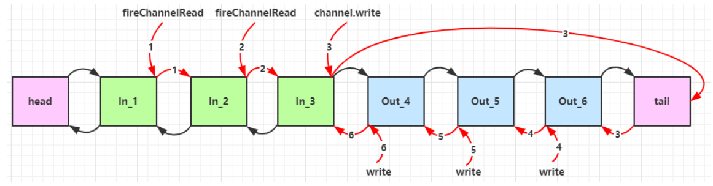


### 3.5 ByteBuf

是对字节数据的封装

#### 1）创建

```java
ByteBuf buf = ByteBufAllocator.DEFAULT.buffer();
```

上面代码创建了一个默认的 ByteBuf（池化基于直接内存的 ByteBuf），初始容量是 256


#### 2）直接内存 vs 堆内存

可以使用下面的代码来创建池化基于堆的 ByteBuf

```java
ByteBuf buffer = ByteBufAllocator.DEFAULT.heapBuffer(10);
```

也可以使用下面的代码来创建池化基于直接内存的 ByteBuf

```java
ByteBuf buffer = ByteBufAllocator.DEFAULT.directBuffer(10);
```

- 直接内存创建和销毁的代价昂贵，但读写性能高（少一次内存复制），适合配合池化功能一起用
- 直接内存对 GC 压力小，因为这部分内存不受 JVM 垃圾回收的管理，但也要注意及时主动释放


#### 3）池化 vs 非池化

池化的最大意义在于可以重用 ByteBuf，优点有

- 没有池化，则每次都得创建新的 ByteBuf 实例，这个操作对直接内存代价昂贵，就算是堆内存，也会增加 GC 压力
- 有了池化，则可以重用池中 ByteBuf 实例，并且采用了与 jemalloc 类似的内存分配算法提升分配效率
- 高并发时，池化功能更节约内存，减少内存溢出的可能

池化功能是否开启，可以通过下面的系统环境变量来设置

```
-Dio.netty.allocator.type={unpooled|pooled}
```

- 4.1 以后，非 Android 平台默认启用池化实现，Android 平台启用非池化实现
- 4.1 之前，池化功能还不成熟，默认是非池化实现


#### 4）组成

ByteBuf 由四部分组成

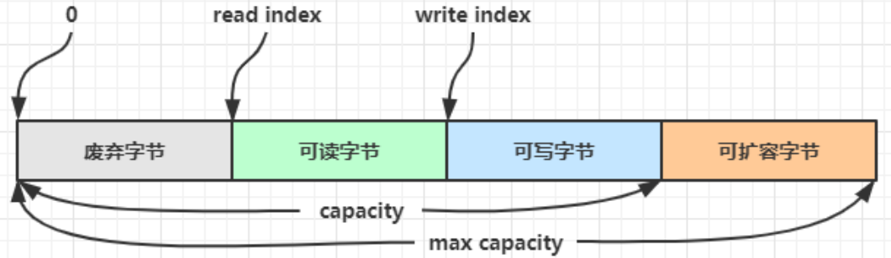

最开始读写指针都在 0 位置


#### 5）写入

方法列表，省略一些不重要的方法

| 方法签名                                                     | 含义                   | 备注                                        |
| ------------------------------------------------------------ | ---------------------- | ------------------------------------------- |
| writeBoolean(boolean value)                                  | 写入 boolean 值        | 用一字节 01\|00 代表 true\|false            |
| writeByte(int value)                                         | 写入 byte 值           |                                             |
| writeShort(int value)                                        | 写入 short 值          |                                             |
| writeInt(int value)                                          | 写入 int 值            | Big Endian，即 0x250，写入后 00 00 02 50    |
| writeIntLE(int value)                                        | 写入 int 值            | Little Endian，即 0x250，写入后 50 02 00 00 |
| writeLong(long value)                                        | 写入 long 值           |                                             |
| writeChar(int value)                                         | 写入 char 值           |                                             |
| writeFloat(float value)                                      | 写入 float 值          |                                             |
| writeDouble(double value)                                    | 写入 double 值         |                                             |
| writeBytes(ByteBuf src)                                      | 写入 netty 的 ByteBuf  |                                             |
| writeBytes(byte[] src)                                       | 写入 byte[]            |                                             |
| writeBytes(ByteBuffer src)                                   | 写入 nio 的 ByteBuffer |                                             |
| int writeCharSequence(CharSequence sequence, Charset charset) | 写入字符串             |                                             |

> 注意
>
> * 这些方法的未指明返回值的，其返回值都是 ByteBuf，意味着可以链式调用
> * 网络传输，默认习惯是 Big Endian


先写入 4 个字节

```java
buffer.writeBytes(new byte[]{1, 2, 3, 4});
log(buffer);
```

结果是

```
read index:0 write index:4 capacity:10
		 +-------------------------------------------------+
		 | 0 1 2 3 4 5 6 7 8 9 a b c d e f 				   |
+--------+-------------------------------------------------+----------------+
|00000000| 01 02 03 04 									   |.... 			|
+--------+-------------------------------------------------+----------------+
```

再写入一个 int 整数，也是 4 个字节

```java
buffer.writeInt(5);
log(buffer);
```

结果是

```
read index:0 write index:8 capacity:10
		 +-------------------------------------------------+
		 | 0 1 2 3 4 5 6 7 8 9 a b c d e f 				   |
+--------+-------------------------------------------------+----------------+
|00000000| 01 02 03 04 00 00 00 05 						   |........ 		|
+--------+-------------------------------------------------+----------------+
```

还有一类方法是 set 开头的一系列方法，也可以写入数据，但不会改变写指针位置


#### 6）扩容

再写入一个 int 整数时，容量不够了（初始容量是 10），这时会引发扩容

```java
buffer.writeInt(6);
log(buffer);
```

扩容规则是

- 如果写入后数据大小未超过 512，则选择下一个 16 的整数倍，例如写入后大小为 12 ，则扩容后 capacity 是 16
- 如果写入后数据大小超过 512，则选择下一个 2^n，例如写入后大小为 513，则扩容后 capacity 是2^10=1024（2^9=512 已经不够了）
- 扩容不能超过 max capacity 会报错

结果是

```
read index:0 write index:12 capacity:16
		 +-------------------------------------------------+
		 | 0 1 2 3 4 5 6 7 8 9 a b c d e f 				   |
+--------+-------------------------------------------------+----------------+
|00000000| 01 02 03 04 00 00 00 05 00 00 00 06 			   |............ 	|
+--------+-------------------------------------------------+----------------+
```


#### 7）读取

例如读了 4 次，每次一个字节

```java
System.out.println(buffer.readByte());
System.out.println(buffer.readByte());
System.out.println(buffer.readByte());
System.out.println(buffer.readByte());
log(buffer);
```

读过的内容，就属于废弃部分了，再读只能读那些尚未读取的部分

```
1
2
3
4
read index:4 write index:12 capacity:16
         +-------------------------------------------------+
         |  0  1  2  3  4  5  6  7  8  9  a  b  c  d  e  f |
+--------+-------------------------------------------------+----------------+
|00000000| 00 00 00 05 00 00 00 06                         |........        |
+--------+-------------------------------------------------+----------------+
```

如果需要重复读取 int 整数 5，怎么办？

可以在 read 前先做个标记 mark

```java
buffer.markReaderIndex();
System.out.println(buffer.readInt());
log(buffer);
```

结果

```
5
read index:8 write index:12 capacity:16
         +-------------------------------------------------+
         |  0  1  2  3  4  5  6  7  8  9  a  b  c  d  e  f |
+--------+-------------------------------------------------+----------------+
|00000000| 00 00 00 06                                     |....            |
+--------+-------------------------------------------------+----------------+
```

这时要重复读取的话，重置到标记位置 reset

```java
buffer.resetReaderIndex();
log(buffer);
```

这时

```
read index:4 write index:12 capacity:16
         +-------------------------------------------------+
         |  0  1  2  3  4  5  6  7  8  9  a  b  c  d  e  f |
+--------+-------------------------------------------------+----------------+
|00000000| 00 00 00 05 00 00 00 06                         |........        |
+--------+-------------------------------------------------+----------------+
```

还有种办法是采用 get 开头的一系列方法，这些方法不会改变 read index


#### 8）retain & release

由于 Netty 中有堆外内存的 ByteBuf 实现，堆外内存最好是手动来释放，而不是等 GC 垃圾回收。

- UnpooledHeapByteBuf 使用的是 JVM 内存，只需等 GC 回收内存即可
- UnpooledDirectByteBuf 使用的就是直接内存了，需要特殊的方法来回收内存
- PooledByteBuf 和它的子类使用了池化机制，需要更复杂的规则来回收内存

> 回收内存的源码实现，请关注下面方法的不同实现 
>
> protected abstract void deallocate()

Netty 这里采用了引用计数法来控制回收内存，每个 ByteBuf 都实现了 ReferenceCounted 接口

- 每个 ByteBuf 对象的初始计数为 1
- 调用 release 方法计数减 1，如果计数为 0，ByteBuf 内存被回收
- 调用 retain 方法计数加 1，表示调用者没用完之前，其它 handler 即使调用了 release 也不会造成回收
- 当计数为 0 时，底层内存会被回收，这时即使 ByteBuf 对象还在，其各个方法均无法正常使用


谁来负责 release 呢？

不是我们想象的（一般情况下）

```java
ByteBuf buf = ...
try {
	...
} finally {
	buf.release();
}
```

请思考，因为 pipeline 的存在，一般需要将 ByteBuf 传递给下一个 ChannelHandler，如果在 finally 中 release 了，就失去了传递性（当然，如果在这个 ChannelHandler 内这个 ByteBuf 已完成了它的使 命，那么便无须再传递）

基本规则是，**谁是最后使用者，谁负责 release**，详细分析如下

- 起点，对于 NIO 实现来讲，在
  io.netty.channel.nio.AbstractNioByteChannel.NioByteUnsafe#read 方法中首次创建 ByteBuf 放 入 pipeline（line 163 pipeline.fireChannelRead(byteBuf)）
- 入站 ByteBuf 处理原则
  - 对原始 ByteBuf 不做处理，调用 ctx.fireChannelRead(msg) 向后传递，这时无须 release
  - 将原始 ByteBuf 转换为其它类型的 Java 对象，这时 ByteBuf 就没用了，必须 release
  - 如果不调用 ctx.fireChannelRead(msg) 向后传递，那么也必须 release
  - 注意各种异常，如果 ByteBuf 没有成功传递到下一个 ChannelHandler，必须 release
  - 假设消息一直向后传，那么 TailContext 会负责释放未处理消息（原始的 ByteBuf）
- 出站 ByteBuf 处理原则
  - 出站消息最终都会转为 ByteBuf 输出，一直向前传，由 HeadContext flush 后 release
- 异常处理原则 
  - 有时候不清楚 ByteBuf 被引用了多少次，但又必须彻底释放，可以循环调用 release 直到返 回 true


#### 9）slice

【零拷贝】的体现之一，对原始 ByteBuf 进行切片成多个 ByteBuf，切片后的 ByteBuf 并没有发生内存 复制，还是使用原始 ByteBuf 的内存，切片后的 ByteBuf 维护独立的 read，write 指针

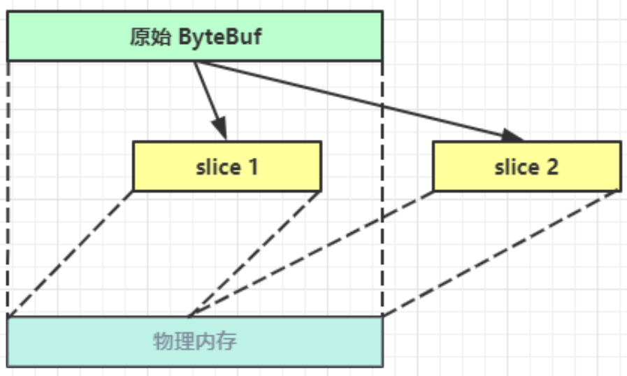

```java
public class TestSlice {
    public static void main(String[] args) {
        ByteBuf buf = ByteBufAllocator.DEFAULT.buffer(10);
        System.out.println(buf);
        buf.writeBytes(new byte[]{'a', 'b', 'c', 'd', 'e', 'f', 'g', 'h', 'i', 'j', 'k'});
        log(buf);

        //在切片过程中，没有发生数据复制
        ByteBuf f1 = buf.slice(0, 5);
        ByteBuf f2 = buf.slice(5, 5);
        log(f1);
        log(f2);

        System.out.println("============");
        f1.setByte(0, 'b');
        log(f1);
        log(buf);

    }
}
```

这时调用 slice 进行切片，无参 slice 是从原始 ByteBuf 的 read index 到 write index 之间的内容进行切片，切片后的 max capacity 被固定为这个区间的大小，因此不能追加 write

```java
ByteBuf f1 = buf.slice(0, 5);
f1.writeByte('x');
// slice.writeByte(5); 如果执行，会报 IndexOutOfBoundsException 异常
```


如果原始 ByteBuf 再次读操作（又读了一个字节），这时的 slice 不受影响，因为它有独立的读写指针

如果 slice 的内容发生了更改，这时，原始 ByteBuf 也会受影响，因为底层都是同一块内存


#### 10）duplicate

【零拷贝】的体现之一，截取了原始 ByteBuf 所有内容，并且没有 max capacity 的限制，也是与原始 ByteBuf 使用同一块底层内存，只是读写指针是独立的

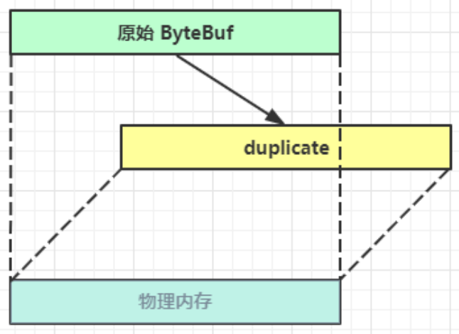


#### 11）copy

会将底层内存数据进行深拷贝，因此无论读写，都与原始 ByteBuf 无关


#### 12）CompositeByteBuf

【零拷贝】的体现之一，可以将多个 ByteBuf 合并为一个逻辑上的 ByteBuf，避免拷贝

有两个 ByteBuf 如下

```java
public class TestCompositeByteBuf {
    public static void main(String[] args) {
        ByteBuf buf1 = ByteBufAllocator.DEFAULT.buffer();
        buf1.writeBytes(new byte[]{1, 2, 3, 4, 5});

        ByteBuf buf2 = ByteBufAllocator.DEFAULT.buffer();
        buf2.writeBytes(new byte[]{6, 7, 8, 9, 0});

        //这种方法好不好？回答是不太好，因为进行了数据的内存复制操作
//        ByteBuf buffer = ByteBufAllocator.DEFAULT.buffer();
//        buffer.writeBytes(buf1).writeBytes(buf2);
//        log(buffer);

        CompositeByteBuf buffer = ByteBufAllocator.DEFAULT.compositeBuffer();
        buffer.addComponents(true, buf1, buf2);
        log(buffer);

    }
}
```

输出

```
read index:0 write index:10 capacity:10
         +-------------------------------------------------+
         |  0  1  2  3  4  5  6  7  8  9  a  b  c  d  e  f |
+--------+-------------------------------------------------+----------------+
|00000000| 01 02 03 04 05 06 07 08 09 00                   |..........      |
+--------+-------------------------------------------------+----------------+
```

CompositeByteBuf 是一个组合的 ByteBuf，它内部维护了一个 Component 数组，每个 Component 管理一个 ByteBuf，记录了这个 ByteBuf 相对于整体偏移量等信息，代表着整体中某一段的数据。

- 优点，对外是一个虚拟视图，组合这些 ByteBuf 不会产生内存复制
- 缺点，复杂了很多，多次操作会带来性能的损耗


#### 13）Unpooled

Unpooled 是一个工具类，类如其名，提供了非池化的 ByteBuf 创建、组合、复制等操作

这里仅介绍其跟【零拷贝】相关的 wrappedBuffer 方法，可以用来包装 ByteBuf

```java
ByteBuf buf1 = ByteBufAllocator.DEFAULT.buffer(5);
buf1.writeBytes(new byte[]{1, 2, 3, 4, 5});
ByteBuf buf2 = ByteBufAllocator.DEFAULT.buffer(5);
buf2.writeBytes(new byte[]{6, 7, 8, 9, 10});

// 当包装 ByteBuf 个数超过一个时, 底层使用了 CompositeByteBuf
ByteBuf buf3 = Unpooled.wrappedBuffer(buf1, buf2);
System.out.println(ByteBufUtil.prettyHexDump(buf3));
```

输出

```
		 +-------------------------------------------------+
		 | 0 1 2 3 4 5 6 7 8 9 a b c d e f 				   |
+--------+-------------------------------------------------+----------------+
|00000000| 01 02 03 04 05 06 07 08 09 0a 				   |.......... 		|
+--------+-------------------------------------------------+----------------+
```

也可以用来包装普通字节数组，底层也不会有拷贝操作

```java
ByteBuf buf4 = Unpooled.wrappedBuffer(new byte[]{1, 2, 3}, new byte[]{4, 5, 6});
System.out.println(buf4.getClass());
System.out.println(ByteBufUtil.prettyHexDump(buf4));
```

输出

```
class io.netty.buffer.CompositeByteBuf
		 +-------------------------------------------------+
		 | 0 1 2 3 4 5 6 7 8 9 a b c d e f 				   |
+--------+-------------------------------------------------+----------------+
|00000000| 01 02 03 04 05 06 							   |...... 			|
+--------+-------------------------------------------------+----------------+
```


##### 💡 ByteBuf 优势

- 池化 - 可以重用池中 ByteBuf 实例，更节约内存，减少内存溢出的可能
- 读写指针分离，不需要像 ByteBuffer 一样切换读写模式
- 可以自动扩容
- 支持链式调用，使用更流畅
- 很多地方体现零拷贝，例如 slice、duplicate、CompositeByteBuf


# 三. Netty 进阶

## 1. 粘包与半包

### 1.1 粘包现象

服务端代码

```java
public class HelloWorldServer {
    static final Logger log = LoggerFactory.getLogger(HelloWorldServer.class);

    void start() {
        NioEventLoopGroup boss = new NioEventLoopGroup(1);
        NioEventLoopGroup worker = new NioEventLoopGroup();
        try {
            ServerBootstrap serverBootstrap = new ServerBootstrap();
            serverBootstrap.channel(NioServerSocketChannel.class);
            serverBootstrap.group(boss, worker);
            serverBootstrap.childHandler(new ChannelInitializer<SocketChannel>() {
                @Override
                protected void initChannel(SocketChannel ch) throws Exception {
                    ch.pipeline().addLast(new LoggingHandler(LogLevel.DEBUG));
                    ch.pipeline().addLast(new ChannelInboundHandlerAdapter() {
                        @Override
                        public void channelActive(ChannelHandlerContext ctx)
                                throws Exception {
                            log.debug("connected {}", ctx.channel());
                            super.channelActive(ctx);
                        }

                        @Override
                        public void channelInactive(ChannelHandlerContext ctx)
                                throws Exception {
                            log.debug("disconnect {}", ctx.channel());
                            super.channelInactive(ctx);
                        }
                    });
                }
            });
            ChannelFuture channelFuture = serverBootstrap.bind(8080);
            log.debug("{} binding...", channelFuture.channel());
            channelFuture.sync();
            log.debug("{} bound...", channelFuture.channel());
            channelFuture.channel().closeFuture().sync();
        } catch (InterruptedException e) {
            log.error("server error", e);
        } finally {
            boss.shutdownGracefully();
            worker.shutdownGracefully();
            log.debug("stoped");
        }
    }

    public static void main(String[] args) {
        new HelloWorldServer().start();
    }
}
```

客户端代码希望发送 10 个消息，每个消息是 16 字节

```java
public class HelloWorldClient {
    static final Logger log = LoggerFactory.getLogger(HelloWorldClient.class);

    public static void main(String[] args) {
        NioEventLoopGroup worker = new NioEventLoopGroup();
        try {
            Bootstrap bootstrap = new Bootstrap();
            bootstrap.channel(NioSocketChannel.class);
            bootstrap.group(worker);
            bootstrap.handler(new ChannelInitializer<SocketChannel>() {
                @Override
                protected void initChannel(SocketChannel ch) throws Exception {
                    ch.pipeline().addLast(new ChannelInboundHandlerAdapter() {
                        //会在连接 channel 建立成功后，会触发 active 事件
                        @Override
                        public void channelActive(ChannelHandlerContext ctx) throws Exception {
                            for(int i = 0; i < 10; i++) {
                                ByteBuf buf = ctx.alloc().buffer(16);
                                buf.writeBytes(new byte[]{0,1,2,3,4,5,6,7,8,9,10,11,12,13,14,15});
                                ctx.writeAndFlush(buf);
                            }
                        }
                    });
                }
            });
            ChannelFuture channelFuture = bootstrap.connect("127.0.0.1", 8080).sync();
            channelFuture.channel().closeFuture().sync();
        } catch (InterruptedException e) {
            log.error("client error", e);
        } finally {
            worker.shutdownGracefully();
        }
    }
}
```

服务器端的某次输出，可以看到一次就接收了 160 个字节，而非分 10 次接收


### 1.2 半包现象

服务端修改一下接收缓冲区，其它代码不变

```java
serverBootstrap.option(ChannelOption.SO_RCVBUF, 10);
```

服务器端的某次输出，可以看到接收的消息被分为两节，第一次 20 字节，第二次 140 字节


**注意**：serverBootstrap.option(ChannelOption.SO_RCVBUF, 10) 影响的底层接收缓冲区（即滑动窗 口）大小，仅决定了 netty 读取的最小单位，netty 实际每次读取的一般是它的整数倍


### 1.3 现象分析

**粘包**

- 现象，发送 abc def，接收 abcdef
- 原因
  - 应用层：接收方 ByteBuf 设置太大（Netty 默认 1024） 
  - 滑动窗口：假设发送方 256 bytes 表示一个完整报文，但由于接收方处理不及时且窗口大小 足够大，这 256 bytes 字节就会缓冲在接收方的滑动窗口中，当滑动窗口中缓冲了多个报文 就会粘包
  - Nagle 算法：会造成粘包

**半包**

- 现象，发送 abcdef，接收 abc def
- 原因
  - 应用层：接收方 ByteBuf 小于实际发送数据量 
  - 滑动窗口：假设接收方的窗口只剩了 128 bytes，发送方的报文大小是 256 bytes，这时放不下了，只能先发送前 128 bytes，等待 ack 后才能发送剩余部分，这就造成了半包
  - MSS 限制：当发送的数据超过 MSS 限制后，会将数据切分发送，就会造成半包

本质是因为 TCP 是流式协议，消息无边界


滑动窗口

- TCP 以一个段（segment）为单位，每发送一个段就需要进行一次确认应答（ack）处理，但 如果这么做，缺点是包的往返时间越长性能就越差
  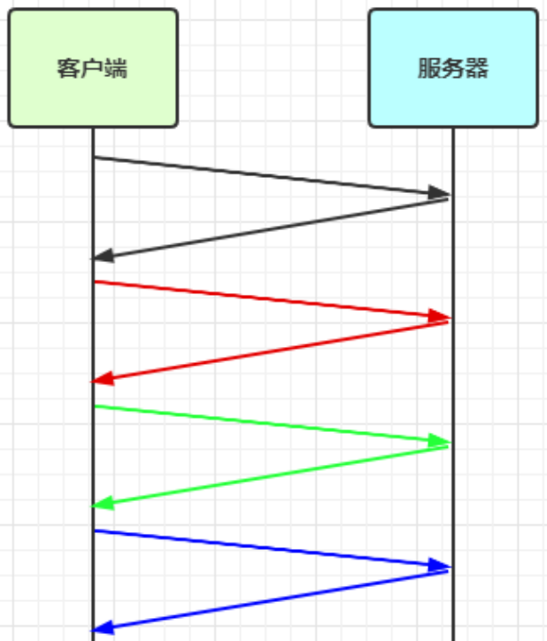


- 为了解决此问题，引入了窗口概念，窗口大小即决定了无需等待应答而可以继续发送的数据 最大值
  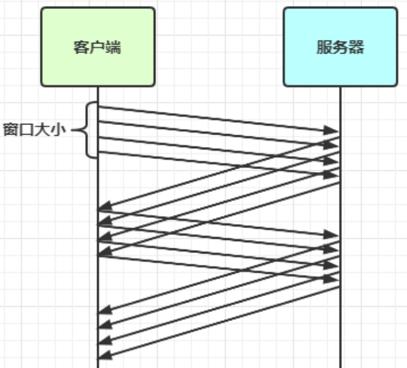


- 窗口实际就起到一个缓冲区的作用，同时也能起到流量控制的作用
  - 图中深色的部分即要发送的数据，高亮的部分即窗口
  - 窗口内的数据才允许被发送，当应答未到达前，窗口必须停止滑动
  - 如果 1001~2000 这个段的数据 ack 回来了，窗口就可以向前滑动
  - 接收方也会维护一个窗口，只有落在窗口内的数据才能允许接收


MSS 限制

- 链路层对一次能够发送的最大数据有限制，这个限制称之为 MTU（maximum transmissionunit），不同的链路设备的 MTU 值也有所不同，例如
- 以太网的 MTU 是 1500
- FDDI（光纤分布式数据接口）的 MTU 是 4352
- 本地回环地址的 MTU 是 65535 - 本地测试不走网卡
- MSS 是最大段长度（maximum segment size），它是 MTU 刨去 tcp 头和 ip 头后剩余能够作为数据传输的字节数
- ipv4 tcp 头占用 20 bytes，ip 头占用 20 bytes，因此以太网 MSS 的值为 1500 - 40 = 1460
- TCP 在传递大量数据时，会按照 MSS 大小将数据进行分割发送
- MSS 的值在三次握手时通知对方自己 MSS 的值，然后在两者之间选择一个小值作为 MSS

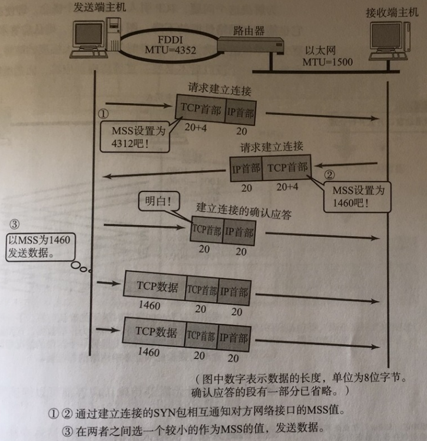


Nagle 算法

- 即使发送一个字节，也需要加入 tcp 头和 ip 头，也就是总字节数会使用 41 bytes，非常不经济。因此为了提高网络利用率，tcp 希望尽可能发送足够大的数据，这就是 Nagle 算法产生的缘由
- 该算法是指发送端即使还有应该发送的数据，但如果这部分数据很少的话，则进行延迟发送
  - 如果 SO_SNDBUF 的数据达到 MSS，则需要发送
  - 如果 SO_SNDBUF 中含有 FIN（表示需要连接关闭）这时将剩余数据发送，再关闭
  - 如果 TCP_NODELAY = true，则需要发送
  - 已发送的数据都收到 ack 时，则需要发送
  - 上述条件不满足，但发生超时（一般为 200ms）则需要发送
  - 除上述情况，延迟发送


### 1.4 解决方案

1. 短链接，发一个包建立一次连接，这样连接建立到连接断开之间就是消息的边界，缺点效率太低
2. 每一条消息采用固定长度，缺点浪费空间
3. 每一条消息采用分隔符，例如 \n，缺点需要转义
4. 每一条消息分为 head 和 body，head 中包含 body 的长度


#### 方法1，短链接

服务端

```java
public class HelloWorldServer {
    static final Logger log = LoggerFactory.getLogger(HelloWorldServer.class);

    void start() {
        NioEventLoopGroup boss = new NioEventLoopGroup(1);
        NioEventLoopGroup worker = new NioEventLoopGroup();
        try {
            ServerBootstrap serverBootstrap = new ServerBootstrap();
            serverBootstrap.channel(NioServerSocketChannel.class);
            //调整系统的接收缓冲缓冲器(滑动窗口)，针对全局
            //serverBootstrap.option(ChannelOption.SO_RCVBUF, 10);
            //调整netty的接收缓冲区(byteBuf)，针对每个channel连接
            serverBootstrap.childOption(ChannelOption.RCVBUF_ALLOCATOR,
                    new AdaptiveRecvByteBufAllocator(16, 16, 16));
            serverBootstrap.group(boss, worker);
            serverBootstrap.childHandler(new ChannelInitializer<SocketChannel>() {
                @Override
                protected void initChannel(SocketChannel ch) throws Exception {
                    ch.pipeline().addLast(new LoggingHandler(LogLevel.DEBUG));
                    ch.pipeline().addLast(new ChannelInboundHandlerAdapter() {
                        @Override
                        public void channelActive(ChannelHandlerContext ctx)
                                throws Exception {
                            log.debug("connected {}", ctx.channel());
                            super.channelActive(ctx);
                        }

                        @Override
                        public void channelInactive(ChannelHandlerContext ctx)
                                throws Exception {
                            log.debug("disconnect {}", ctx.channel());
                            super.channelInactive(ctx);
                        }
                    });
                }
            });
            ChannelFuture channelFuture = serverBootstrap.bind(8080);
            log.debug("{} binding...", channelFuture.channel());
            channelFuture.sync();
            log.debug("{} bound...", channelFuture.channel());
            channelFuture.channel().closeFuture().sync();
        } catch (InterruptedException e) {
            log.error("server error", e);
        } finally {
            boss.shutdownGracefully();
            worker.shutdownGracefully();
            log.debug("stoped");
        }
    }

    public static void main(String[] args) {
        new HelloWorldServer().start();
    }
}
```


客户端

```java
public class HelloWorldClient {
    static final Logger log = LoggerFactory.getLogger(HelloWorldClient.class);

    public static void main(String[] args) {
        for(int i = 0; i < 10; i++) {
            send();
        }
        System.out.println("finish");
    }

    private static void send() {
        NioEventLoopGroup worker = new NioEventLoopGroup();
        try {
            Bootstrap bootstrap = new Bootstrap();
            bootstrap.channel(NioSocketChannel.class);
            bootstrap.group(worker);
            bootstrap.handler(new ChannelInitializer<SocketChannel>() {
                @Override
                protected void initChannel(SocketChannel ch) throws Exception {
                    ch.pipeline().addLast(new ChannelInboundHandlerAdapter() {
                        //会在连接 channel 建立成功后，会触发 active 事件
                        @Override
                        public void channelActive(ChannelHandlerContext ctx) throws Exception {
                            for(int i = 0; i < 10; i++) {
                                ByteBuf buf = ctx.alloc().buffer(16);
                                buf.writeBytes(new byte[]{0,1,2,3,4,5,6,7,8,9,10,11,12,13,14,15});
                                ctx.writeAndFlush(buf);
                                ctx.channel().close();
                            }
                        }
                    });
                }
            });
            ChannelFuture channelFuture = bootstrap.connect("127.0.0.1", 8080).sync();
            channelFuture.channel().closeFuture().sync();
        } catch (InterruptedException e) {
            log.error("client error", e);
        } finally {
            worker.shutdownGracefully();
        }
    }
}
```


半包用这种办法还是不好解决，因为接收方的缓冲区大小是有限的


#### 方法2，固定长度

让所有数据包长度固定（假设长度为 8 字节），服务器端加入

```java
ch.pipeline().addLast(new FixedLengthFrameDecoder(8));
```

客户端测试代码，注意, 采用这种方法后，客户端什么时候 flush 都可以

```java
public class Client2 {
    public static void main(String[] args) {
        send();
        System.out.println("finish");
    }

    public static byte[] fill10Bytes(char c, int len) {
        byte[] bytes = new byte[10];
        Arrays.fill(bytes, (byte) '_');
        for (int i = 0; i < len; i++) {
            bytes[i] = (byte) c;
        }
        System.out.println(new String(bytes));
        return bytes;
    }

    private static void send() {
        NioEventLoopGroup worker = new NioEventLoopGroup();
        try {
            Bootstrap bootstrap = new Bootstrap();
            bootstrap.channel(NioSocketChannel.class);
            bootstrap.group(worker);
            bootstrap.handler(new ChannelInitializer<SocketChannel>() {
                @Override
                protected void initChannel(SocketChannel ch) {
                    ch.pipeline().addLast(new LoggingHandler(LogLevel.DEBUG));
                    ch.pipeline().addLast(new ChannelInboundHandlerAdapter() {
                        // 会在连接 channel 建立成功后，会触发 active 事件
                        @Override
                        public void channelActive(ChannelHandlerContext ctx) {
                            ByteBuf buf = ctx.alloc().buffer();
                            char c = '0';
                            Random r = new Random();
                            for(int i = 0; i < 10; i++) {
                                byte[] bytes = fill10Bytes(c, r.nextInt(10) + 1);
                                buf.writeBytes(bytes);
                            }
                            ctx.writeAndFlush(buf);
                        }
                    });
                }
            });
            ChannelFuture channelFuture = bootstrap.connect("127.0.0.1", 8080).sync();
            channelFuture.channel().closeFuture().sync();
        } catch (InterruptedException e) {
            e.printStackTrace();
        } finally {
            worker.shutdownGracefully();
        }
    }
}
```

服务端代码

```java
@Slf4j
public class Server2 {
    void start() {
        NioEventLoopGroup boss = new NioEventLoopGroup();
        NioEventLoopGroup worker = new NioEventLoopGroup();
        try {
            ServerBootstrap serverBootstrap = new ServerBootstrap();
            serverBootstrap.channel(NioServerSocketChannel.class);
            // 调整系统的接收缓冲区（滑动窗口）
//            serverBootstrap.option(ChannelOption.SO_RCVBUF, 10);
            // 调整 netty 的接收缓冲区（byteBuf）
            serverBootstrap.childOption(ChannelOption.RCVBUF_ALLOCATOR, new AdaptiveRecvByteBufAllocator(16, 16, 16));
            serverBootstrap.group(boss, worker);
            serverBootstrap.childHandler(new ChannelInitializer<SocketChannel>() {
                @Override
                protected void initChannel(SocketChannel ch) throws Exception {
                    ch.pipeline().addLast(new FixedLengthFrameDecoder(10));
                    ch.pipeline().addLast(new LoggingHandler(LogLevel.DEBUG));
                }
            });
            ChannelFuture channelFuture = serverBootstrap.bind(8080).sync();
            channelFuture.channel().closeFuture().sync();
        } catch (InterruptedException e) {
            log.error("server error", e);
        } finally {
            boss.shutdownGracefully();
            worker.shutdownGracefully();
        }
    }

    public static void main(String[] args) {
        new Server2().start();
    }
}
```

缺点是，数据包的大小不好把握

- 长度定的太大，浪费
- 长度定的太小，对某些数据包又显得不够


#### 方法3，固定分隔符

服务端加入，默认以 \n 或 \r\n 作为分隔符，如果超出指定长度仍未出现分隔符，则抛出异常

```java
ch.pipeline().addLast(new LineBasedFrameDecoder(1024));
```

客户端在每条消息之后，加入 \n 分隔符

```java
public class Client3 {
    static final Logger log = LoggerFactory.getLogger(Client1.class);

    public static void main(String[] args) {
        send();
        System.out.println("finish");
    }

    public static StringBuilder makeString(char c, int len) {
        StringBuilder sb = new StringBuilder(len + 2);
        for (int i = 0; i < len; i++) {
            sb.append(c);
        }
        sb.append("\n");
        return sb;
    }

    private static void send() {
        NioEventLoopGroup worker = new NioEventLoopGroup();
        try {
            Bootstrap bootstrap = new Bootstrap();
            bootstrap.channel(NioSocketChannel.class);
            bootstrap.group(worker);
            bootstrap.handler(new ChannelInitializer<SocketChannel>() {
                @Override
                protected void initChannel(SocketChannel ch) {
                    ch.pipeline().addLast(new LoggingHandler(LogLevel.DEBUG));
                    ch.pipeline().addLast(new ChannelInboundHandlerAdapter() {
                        // 会在连接 channel 建立成功后，会触发 active 事件
                        @Override
                        public void channelActive(ChannelHandlerContext ctx) {
                            ByteBuf buf = ctx.alloc().buffer();
                            char c = '0';
                            Random r = new Random();
                            for(int i = 0; i < 10; i++) {
                                StringBuilder sb = makeString(c, r.nextInt(256) + 1);
                                c++;
                                buf.writeBytes(sb.toString().getBytes());
                            }
                            ctx.writeAndFlush(buf);
                        }
                    });
                }
            });
            ChannelFuture channelFuture = bootstrap.connect("127.0.0.1", 8080).sync();
            channelFuture.channel().closeFuture().sync();
        } catch (InterruptedException e) {
            log.error("client error", e);
        } finally {
            worker.shutdownGracefully();
        }
    }
}
```

服务端代码

```java
@Slf4j
public class Server3 {
    void start() {
        NioEventLoopGroup boss = new NioEventLoopGroup();
        NioEventLoopGroup worker = new NioEventLoopGroup();
        try {
            ServerBootstrap serverBootstrap = new ServerBootstrap();
            serverBootstrap.channel(NioServerSocketChannel.class);
            // 调整系统的接收缓冲区（滑动窗口）
//            serverBootstrap.option(ChannelOption.SO_RCVBUF, 10);
            // 调整 netty 的接收缓冲区（byteBuf）
            serverBootstrap.childOption(ChannelOption.RCVBUF_ALLOCATOR, new AdaptiveRecvByteBufAllocator(16, 16, 16));
            serverBootstrap.group(boss, worker);
            serverBootstrap.childHandler(new ChannelInitializer<SocketChannel>() {
                @Override
                protected void initChannel(SocketChannel ch) throws Exception {
                    ch.pipeline().addLast(new LineBasedFrameDecoder(1024));
                    ch.pipeline().addLast(new LoggingHandler(LogLevel.DEBUG));
                }
            });
            ChannelFuture channelFuture = serverBootstrap.bind(8080).sync();
            channelFuture.channel().closeFuture().sync();
        } catch (InterruptedException e) {
            log.error("server error", e);
        } finally {
            boss.shutdownGracefully();
            worker.shutdownGracefully();
        }
    }

    public static void main(String[] args) {
        new Server3().start();
    }
}
```

缺点，处理字符数据比较合适，但如果内容本身包含了分隔符（字节数据常常会有此情况），那么就会 解析错误


#### 方法4，预设长度

在发送消息前，先约定用定长字节表示接下来数据的长度

```java
// 最大长度，长度偏移，长度的占用字节(ch)，长度调整，剥离字节数
ch.pipeline().addLast(new LengthFieldBasedFrameDecoder(1024, 0, 1, 0, 4));
```

客户端代码

```java
public class TestLengthFieldDecoder {
    public static void main(String[] args) {
        EmbeddedChannel channel = new EmbeddedChannel(
                new LengthFieldBasedFrameDecoder(1024, 0, 4, 1, 4),
                new LoggingHandler(LogLevel.DEBUG)
        );

        ByteBuf buffer = ByteBufAllocator.DEFAULT.buffer();
        send(buffer, "Hello, world");
        send(buffer, "Hi");
		channel.writeOneInbound(buffer);
    }

    private static void send(ByteBuf buffer, String content) {
        byte[] bytes = content.getBytes();//实际内容
        int length = bytes.length;//实际内容长度
        buffer.writeInt(length);
        buffer.writeByte(1);
        buffer.writeBytes(bytes);
    }

}
```


## 2. 协议设计与解析

### 2.1 为什么需要协议？

TCP/IP 中消息传输基于流的方式，没有边界。

协议的目的就是划定消息的边界，制定通信双方要共同遵守的通信规则

例如：在网络上传输

```
下雨天留客天留我不留
```

是中文一句著名的无标点符号句子，在没有标点符号情况下，这句话有数种拆解方式，而意思却是完全 不同，所以常被用作讲述标点符号的重要性

一种解读

```
下雨天留客，天留，我不留
```

另一种解读

```
下雨天，留客天，留我不？留
```

如何设计协议呢？其实就是给网络传输的信息加上“标点符号”。但通过分隔符来断句不是很好，因为分 隔符本身如果用于传输，那么必须加以区分。因此，下面一种协议较为常用

```
定长字节表示内容长度 + 实际内容
```

例如，假设一个中文字符长度为 3，按照上述协议的规则，发送信息方式如下，就不会被接收方弄错意 思了

```
0f下雨天留客06天留09我不留
```


### 2.2 redis 协议举例

```java
public class TestRedis {
    /*
       set name zhangSan
       先发*3，因为有三个元素
       再发$3，因为第一个元素有三个字节长度
       再发set。
       $4
       name
       $8
       zhangSan
    */
    public static void main(String[] args) {
        final byte[] LINE = {13, 10};
        NioEventLoopGroup worker = new NioEventLoopGroup();
        try{
            Bootstrap bootstrap = new Bootstrap();
            bootstrap.channel(NioSocketChannel.class);
            bootstrap.group(worker);
            bootstrap.handler(new ChannelInitializer<SocketChannel>() {

                @Override
                protected void initChannel(SocketChannel ch){
                    ch.pipeline().addLast(new LoggingHandler());
                    ch.pipeline().addLast(new ChannelInboundHandlerAdapter(){
                        @Override
                        public void channelActive(ChannelHandlerContext ctx) {
                            ByteBuf buf = ctx.alloc().buffer();
                            buf.writeBytes("*3".getBytes());
                            buf.writeBytes(LINE);
                            buf.writeBytes("$3".getBytes());
                            buf.writeBytes(LINE);
                            buf.writeBytes("set".getBytes());
                            buf.writeBytes(LINE);
                            buf.writeBytes("$4".getBytes());
                            buf.writeBytes(LINE);
                            buf.writeBytes("name".getBytes());
                            buf.writeBytes(LINE);
                            buf.writeBytes("$8".getBytes());
                            buf.writeBytes(LINE);
                            buf.writeBytes("zhangsan".getBytes());
                            buf.writeBytes(LINE);
                            ctx.writeAndFlush(buf);
                        }

                        @Override
                        public void channelRead(ChannelHandlerContext ctx, Object msg) throws Exception {
                            ByteBuf buf = (ByteBuf) msg;
                            System.out.println(buf.toString(Charset.defaultCharset()));
                        }
                    });
                }
            });
            ChannelFuture channelFuture = bootstrap.connect("localhost", 6379).sync();
            channelFuture.channel().closeFuture().sync();
        } catch (InterruptedException e) {
            e.printStackTrace();
        } finally {
            worker.shutdownGracefully();
        }
    }
}
```


### 2.3 http 协议举例

```java
@Slf4j
public class TestHttp {
    public static void main(String[] args) {
        NioEventLoopGroup boss = new NioEventLoopGroup();
        NioEventLoopGroup worker = new NioEventLoopGroup();
        try {
            ServerBootstrap serverBootstrap = new ServerBootstrap();
            serverBootstrap.channel(NioServerSocketChannel.class);
            serverBootstrap.group(boss, worker);
            serverBootstrap.childHandler(new ChannelInitializer<SocketChannel>() {
                @Override
                protected void initChannel(SocketChannel ch) throws Exception {
                    ch.pipeline().addLast(new LoggingHandler(LogLevel.DEBUG));
                    ch.pipeline().addLast(new HttpServerCodec());
                    ch.pipeline().addLast(new SimpleChannelInboundHandler<HttpRequest>() {
                        @Override
                        protected void channelRead0(ChannelHandlerContext ctx, HttpRequest msg) throws Exception {
                            //获取请求
                            log.debug(msg.uri());

                            //返回响应
                            DefaultFullHttpResponse response =
                                    new DefaultFullHttpResponse(msg.protocolVersion(), HttpResponseStatus.OK);

                            byte[] bytes = "<h1>Hello, world!</h1>".getBytes();
                            response.headers().setInt(CONTENT_LENGTH, bytes.length);
                            response.content().writeBytes(bytes);

                            //写回响应
                            ctx.writeAndFlush(response);

                        }
                    });
                    /*ch.pipeline().addLast(new ChannelInboundHandlerAdapter(){
                        @Override
                        public void channelRead(ChannelHandlerContext ctx, Object msg) throws Exception {
                            log.debug("{}", msg.getClass());

                            if(msg instanceof HttpRequest) {//请求体，请求头

                            } else if(msg instanceof HttpContent) {//请求体

                            }

                        }
                    });*/
                }
            });
            ChannelFuture channelFuture = serverBootstrap.bind(8080).sync();
            channelFuture.channel().closeFuture().sync();
        } catch (InterruptedException e) {
            log.error("server error", e);
        } finally {
            boss.shutdownGracefully();
            worker.shutdownGracefully();
        }
    }
}
```


### 2.4 自定义协议要素

- 魔数，用来在第一时间判定是否是无效数据包
- 版本号，可以支持协议的升级
- 序列化算法，消息正文到底采用哪种序列化反序列化方式，可以由此扩展，例如：json、protobuf、hessian、jdk
- 指令类型，是登录、注册、单聊、群聊... 跟业务相关
- 请求序号，为了双工通信，提供异步能力
- 正文长度
- 消息正文


#### 编解码器

根据上面的要素，设计一个登录请求消息和登录响应消息，并使用 Netty 完成收发

```java
@Slf4j
public class MessageCodec extends ByteToMessageCodec<Message> {

    @Override//编码
    protected void encode(ChannelHandlerContext ctx, Message msg, ByteBuf out) throws Exception {
        //1. 四个字节的魔数
        out.writeBytes(new byte[]{1,2,3,4});
        //2. 一个字节的版本
        out.writeByte(1);
        //3. 一个字节的序列化方式 jdk 0, json 1
        out.writeByte(0);
        //4. 一个字节的指令类型
        out.writeByte(msg.getMessageType());
        //5. 四个字节，为了双工通信，提供异步能力
        out.writeInt(msg.getSequenceId());
        //无意义，对齐填充，满足2的整数倍
        out.writeByte(0xff);

        //6. 获取内容的字节数组
        ByteArrayOutputStream bos = new ByteArrayOutputStream();
        ObjectOutputStream oos = new ObjectOutputStream(bos);
        oos.writeObject(msg);
        byte[] bytes = bos.toByteArray();

        //7. 长度
        out.writeInt(bytes.length);

        //8. 写入内容
        out.writeBytes(bytes);

    }

    @Override//解码
    protected void decode(ChannelHandlerContext ctx, ByteBuf in, List<Object> out) throws Exception {
        int magicNum = in.readInt();//字节的魔数
        byte version = in.readByte();//字节的版本
        byte serializerType = in.readByte();//字节的序列化方式
        byte messageType = in.readByte();//字节的指令类型
        int sequenceId = in.readInt();//为了双工通信，提供异步能力
        in.readByte();//无意义字节
        int length = in.readInt();//正文内容长度
        byte[] bytes = new byte[length];
        in.readBytes(bytes, 0, length);//正文内容
        ObjectInputStream ois = new ObjectInputStream(new ByteArrayInputStream(bytes));
        Message message = (Message) ois.readObject();
        log.debug("{}, {}, {}, {}, {}, {}", magicNum, version, serializerType, messageType, sequenceId, length);
        log.debug("{}", message);
        out.add(message);
    }
}
```

测试

```java
public class TestMessageCodec {
    public static void main(String[] args) throws Exception {
        EmbeddedChannel channel = new EmbeddedChannel(
                new LengthFieldBasedFrameDecoder(
                        1024, 12, 4, 0, 0),
                new LoggingHandler(),
                new MessageCodec());
        //encode
        LoginRequestMessage message = new LoginRequestMessage("zhangsan", "123", "张三");
        //channel.writeOutbound(message);

        //decode
        ByteBuf buf = ByteBufAllocator.DEFAULT.buffer();
        new MessageCodec().encode(null, message, buf);

        //入栈
        ByteBuf s1 = buf.slice(0, 100);
        ByteBuf s2 = buf.slice(100, buf.readableBytes() - 100);
        s1.retain();//引用计数2
        channel.writeInbound(s1);//release 1
        channel.writeInbound(s2);

    }
}
```


解读

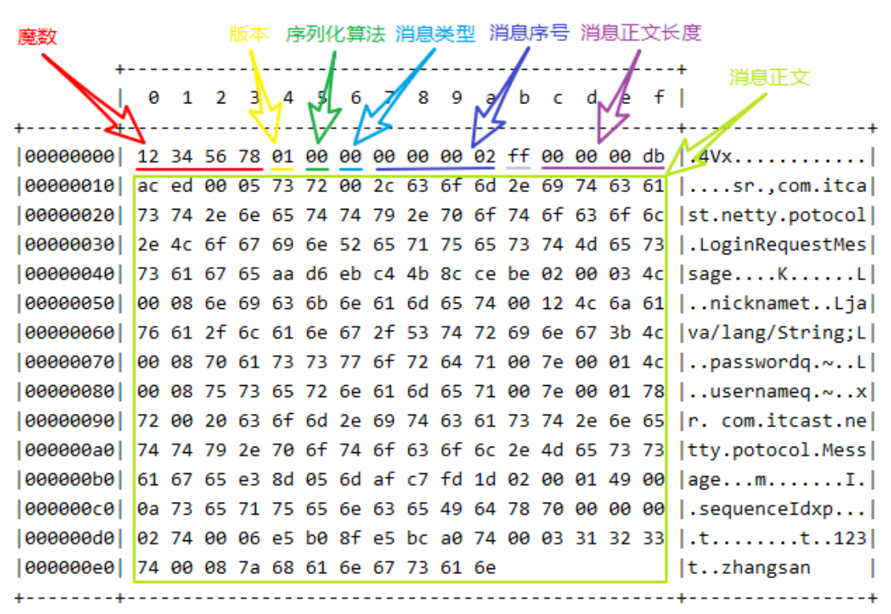


#### 💡 什么时候可以加 @Sharable

- 当 handler 不保存状态时，就可以安全地在多线程下被共享
- 但要注意对于编解码器类，不能继承 ByteToMessageCodec 或CombinedChannelDuplexHandler 父类，他们的构造方法对 @Sharable 有限制
- 如果能确保编解码器不会保存状态，可以继承 MessageToMessageCodec 父类

```java
@Slf4j
@ChannelHandler.Sharable
/**
 * 必须和 LengthFieldBasedFrameDecoder 一起使用，确保接到的 ByteBuf 消息是完整的
 */
public class MessageCodecSharable extends MessageToMessageCodec<ByteBuf, Message> {
    @Override
    protected void encode(ChannelHandlerContext ctx, Message msg, List<Object> outList) throws Exception {
        ByteBuf out = ctx.alloc().buffer();
        // 1. 4 字节的魔数
        out.writeBytes(new byte[]{1, 2, 3, 4});
        // 2. 1 字节的版本,
        out.writeByte(1);
        // 3. 1 字节的序列化方式 jdk 0 , json 1
        out.writeByte(0);
        // 4. 1 字节的指令类型
        out.writeByte(msg.getMessageType());
        // 5. 4 个字节
        out.writeInt(msg.getSequenceId());
        // 无意义，对齐填充
        out.writeByte(0xff);
        // 6. 获取内容的字节数组
        ByteArrayOutputStream bos = new ByteArrayOutputStream();
        ObjectOutputStream oos = new ObjectOutputStream(bos);
        oos.writeObject(msg);
        byte[] bytes = bos.toByteArray();
        // 7. 长度
        out.writeInt(bytes.length);
        // 8. 写入内容
        out.writeBytes(bytes);
        outList.add(out);
    }

    @Override
    protected void decode(ChannelHandlerContext ctx, ByteBuf in, List<Object> out) throws Exception {
        int magicNum = in.readInt();
        byte version = in.readByte();
        byte serializerType = in.readByte();
        byte messageType = in.readByte();
        int sequenceId = in.readInt();
        in.readByte();
        int length = in.readInt();
        byte[] bytes = new byte[length];
        in.readBytes(bytes, 0, length);
        ObjectInputStream ois = new ObjectInputStream(new ByteArrayInputStream(bytes));
        Message message = (Message) ois.readObject();
        log.debug("{}, {}, {}, {}, {}, {}", magicNum, version, serializerType, messageType, sequenceId, length);
        log.debug("{}", message);
        out.add(message);
    }
}
```


## 3. 聊天室案例

### 3.1 聊天室业务介绍

```java
/**
 * 用户管理接口
 */
public interface UserService {

    /**
     * 登录
     * @param username 用户名
     * @param password 密码
     * @return 登录成功返回 true, 否则返回 false
     */
    boolean login(String username, String password);
}
```

```java
/**
 * 会话管理接口
 */
public interface Session {

    /**
     * 绑定会话
     * @param channel 哪个 channel 要绑定会话
     * @param username 会话绑定用户
     */
    void bind(Channel channel, String username);

    /**
     * 解绑会话
     * @param channel 哪个 channel 要解绑会话
     */
    void unbind(Channel channel);

    /**
     * 获取属性
     * @param channel 哪个 channel
     * @param name 属性名
     * @return 属性值
     */
    Object getAttribute(Channel channel, String name);

    /**
     * 设置属性
     * @param channel 哪个 channel
     * @param name 属性名
     * @param value 属性值
     */
    void setAttribute(Channel channel, String name, Object value);

    /**
     * 根据用户名获取 channel
     * @param username 用户名
     * @return channel
     */
    Channel getChannel(String username);
}
```

```java
/**
 * 聊天组会话管理接口
 */
public interface GroupSession {

    /**
     * 创建一个聊天组, 如果不存在才能创建成功, 否则返回 null
     * @param name 组名
     * @param members 成员
     * @return 成功时返回组对象, 失败返回 null
     */
    Group createGroup(String name, Set<String> members);

    /**
     * 加入聊天组
     * @param name 组名
     * @param member 成员名
     * @return 如果组不存在返回 null, 否则返回组对象
     */
    Group joinMember(String name, String member);

    /**
     * 移除组成员
     * @param name 组名
     * @param member 成员名
     * @return 如果组不存在返回 null, 否则返回组对象
     */
    Group removeMember(String name, String member);

    /**
     * 移除聊天组
     * @param name 组名
     * @return 如果组不存在返回 null, 否则返回组对象
     */
    Group removeGroup(String name);

    /**
     * 获取组成员
     * @param name 组名
     * @return 成员集合, 没有成员会返回 empty set
     */
    Set<String> getMembers(String name);

    /**
     * 获取组成员的 channel 集合, 只有在线的 channel 才会返回
     * @param name 组名
     * @return 成员 channel 集合
     */
    List<Channel> getMembersChannel(String name);
}
```


### 3.2 聊天室业务-登录

```java
@Slf4j
public class ChatServer {
    public static void main(String[] args) {
        NioEventLoopGroup boss = new NioEventLoopGroup();
        NioEventLoopGroup worker = new NioEventLoopGroup();
        LoggingHandler LOGGING_HANDLER = new LoggingHandler(LogLevel.DEBUG);
        MessageCodecSharable MESSAGE_CODEC = new MessageCodecSharable();
        try {
            ServerBootstrap serverBootstrap = new ServerBootstrap();
            serverBootstrap.channel(NioServerSocketChannel.class);
            serverBootstrap.group(boss, worker);
            serverBootstrap.childHandler(new ChannelInitializer<SocketChannel>() {
                @Override
                protected void initChannel(SocketChannel ch) throws Exception {
                    ch.pipeline().addLast(new ProcotolFrameDecoder());
                    ch.pipeline().addLast(LOGGING_HANDLER);
                    ch.pipeline().addLast(MESSAGE_CODEC);
                }
            });
            Channel channel = serverBootstrap.bind(8080).sync().channel();
            channel.closeFuture().sync();
        } catch (InterruptedException e) {
            log.error("server error", e);
        } finally {
            boss.shutdownGracefully();
            worker.shutdownGracefully();
        }
    }
}
```

```java
@Slf4j
public class ChatClient {
    public static void main(String[] args) {
        NioEventLoopGroup group = new NioEventLoopGroup();
        LoggingHandler LOGGING_HANDLER = new LoggingHandler(LogLevel.DEBUG);
        MessageCodecSharable MESSAGE_CODEC = new MessageCodecSharable();
        try {
            Bootstrap bootstrap = new Bootstrap();
            bootstrap.channel(NioSocketChannel.class);
            bootstrap.group(group);
            bootstrap.handler(new ChannelInitializer<SocketChannel>() {
                @Override
                protected void initChannel(SocketChannel ch) throws Exception {
                    ch.pipeline().addLast(new ProcotolFrameDecoder());
                    ch.pipeline().addLast(LOGGING_HANDLER);
                    ch.pipeline().addLast(MESSAGE_CODEC);
                }
            });
            Channel channel = bootstrap.connect("localhost", 8080).sync().channel();
            channel.closeFuture().sync();
        } catch (Exception e) {
            log.error("client error", e);
        } finally {
            group.shutdownGracefully();
        }
    }
}
```


### 3.3 聊天室业务-单聊

服务器端将 handler 独立出来

登录 handler

```java
@ChannelHandler.Sharable
public class LoginRequestMessageHandler extends SimpleChannelInboundHandler<LoginRequestMessage> {
    @Override
    protected void channelRead0(ChannelHandlerContext ctx, LoginRequestMessage msg) throws Exception {
        String username = msg.getUsername();
        String password = msg.getPassword();
        boolean login = UserServiceFactory.getUserService().login(username, password);
        LoginResponseMessage message;
        if (login) {
            SessionFactory.getSession().bind(ctx.channel(), username);
            message = new LoginResponseMessage(true, "登录成功");
        } else {
            message = new LoginResponseMessage(false, "用户名或密码不正确");
        }
        ctx.writeAndFlush(message);
    }
}
```

单聊 handler

```java
@ChannelHandler.Sharable
public class ChatRequestMessageHandler extends SimpleChannelInboundHandler<ChatRequestMessage> {
    @Override
    protected void channelRead0(ChannelHandlerContext ctx, ChatRequestMessage msg) throws Exception {
        String to = msg.getTo();
        Channel channel = SessionFactory.getSession().getChannel(to);
        if(channel != null) {//在线
            channel.writeAndFlush(new ChatResponseMessage(msg.getFrom(), msg.getContent()));
        } else {//不在线
            ctx.writeAndFlush(new ChatResponseMessage(false, "对方用户不存在或者不在线"));
        }
    }
}
```


### 3.4 聊天室业务-群聊

创建群聊

```java
@ChannelHandler.Sharable
public class GroupCreateRequestMessageHandler extends SimpleChannelInboundHandler<GroupCreateRequestMessage> {
    @Override
    protected void channelRead0(ChannelHandlerContext ctx, GroupCreateRequestMessage msg) throws Exception {
        String groupName = msg.getGroupName();
        Set<String> members = msg.getMembers();
        //群管理器
        GroupSession groupSession = GroupSessionFactory.getGroupSession();
        Group group = groupSession.createGroup(groupName, members);
        if(group == null) {
            //发送成功消息
            ctx.writeAndFlush(new GroupCreateResponseMessage(true, groupName + "创建成功"));
            //发送拉群消息
            List<Channel> channels = groupSession.getMembersChannel(groupName);
            for(Channel channel : channels) {
                channel.writeAndFlush(new GroupCreateResponseMessage(true, "您已经被拉入" + groupName));
            }
        } else {
            ctx.writeAndFlush(new GroupCreateResponseMessage(false, groupName + "已经存在"));
        }

    }
}
```

群聊消息处理

```java
@ChannelHandler.Sharable
public class GroupChatRequestMessageHandler extends SimpleChannelInboundHandler<GroupChatRequestMessage> {
    @Override
    protected void channelRead0(ChannelHandlerContext ctx, GroupChatRequestMessage msg) throws Exception {
        List<Channel> channels = GroupSessionFactory.getGroupSession()
                .getMembersChannel(msg.getGroupName());

        for(Channel channel : channels) {
            channel.writeAndFlush(new GroupChatResponseMessage(msg.getFrom(), msg.getContent()));
        }

    }
}
```


### 3.5 聊天室业务-退出

```java
@Slf4j
@ChannelHandler.Sharable
public class QuitHandler extends ChannelInboundHandlerAdapter {

    //当连接断开时触发 inactive 事件
    @Override
    public void channelInactive(ChannelHandlerContext ctx) throws Exception {
        SessionFactory.getSession().unbind(ctx.channel());
        log.debug("{} 已经断开", ctx.channel());
    }

    @Override
    public void exceptionCaught(ChannelHandlerContext ctx, Throwable cause) throws Exception {
        SessionFactory.getSession().unbind(ctx.channel());
        log.debug("{} 已经异常断开 异常是{}", ctx.channel(), cause.getMessage());
    }
}
```


### 3.6 聊天室业务-空闲检测

#### 连接假死

原因

- 网络设备出现故障，例如网卡，机房等，底层的 TCP 连接已经断开了，但应用程序没有感知到，仍然占用着资源。
- 公网网络不稳定，出现丢包。如果连续出现丢包，这时现象就是客户端数据发不出去，服务端也一直收不到数据，就这么一直耗着
- 应用程序线程阻塞，无法进行数据读写

问题

- 假死的连接占用的资源不能自动释放
- 向假死的连接发送数据，得到的反馈是发送超时

服务器端解决

- 怎么判断客户端连接是否假死呢？如果能收到客户端数据，说明没有假死。因此策略就可以定为，每隔一段时间就检查这段时间内是否接收到客户端数据，没有就可以判定为连接假死

```java
//用来判断是不是 读空闲时间过长 或 写空闲时间过长
//5s 内如果没有收到 channel 的数据，会触发一个 IdleState#READER_IDLE 事件
ch.pipeline().addLast(new IdleStateHandler(5,0,0));
// ChannelDuplexHandler 可以同时作为入站和出站处理器
ch.pipeline().addLast(new ChannelDuplexHandler() {
    //用来触发特殊事件
    @Override
    public void userEventTriggered(ChannelHandlerContext ctx, Object evt) throws Exception {
        IdleStateEvent event = (IdleStateEvent) evt;
        //触发了读空闲事件
        if(event.state() == IdleState.READER_IDLE) {
            log.debug("已经 5s 没有读到数据了");
        }
    }
});
```


客户端定时心跳

- 客户端可以定时向服务器端发送数据，只要这个时间间隔小于服务器定义的空闲检测的时间间隔，那么就能防止前面提到的误判，客户端可以定义如下心跳处理器

```java
//用来判断是不是 读空闲时间过长 或 写空闲时间过长
//3s 内如果没有向服务器写数据，会触发一个 IdleState#WRITER_IDLE 事件
ch.pipeline().addLast(new IdleStateHandler(0,3,0));
// ChannelDuplexHandler 可以同时作为入站和出站处理器
ch.pipeline().addLast(new ChannelDuplexHandler() {
    //用来触发特殊事件
    @Override
    public void userEventTriggered(ChannelHandlerContext ctx, Object evt) throws Exception {
        IdleStateEvent event = (IdleStateEvent) evt;
        //触发了读空闲事件
        if(event.state() == IdleState.WRITER_IDLE) {
            log.debug("已经三秒没有写数据了，发送一个心跳包");
            ctx.writeAndFlush(new PingMessage());
        }
    }
});
```


# 四. 优化与源码

## 1. 优化

### 1.1 扩展序列化算法

序列化，反序列化主要用在消息正文的转换上

- 序列化时，需要将 Java 对象变为要传输的数据（可以是 byte[]，或 json 等，最终都需要变成byte[]）
- 反序列化时，需要将传入的正文数据还原成 Java 对象，便于处理

目前的代码仅支持 Java 自带的序列化，反序列化机制，核心代码如下

```java
// 反序列化
byte[] body = new byte[bodyLength];
byteByf.readBytes(body);
ObjectInputStream in = new ObjectInputStream(new ByteArrayInputStream(body));
Message message = (Message) in.readObject();
message.setSequenceId(sequenceId);

// 序列化
ByteArrayOutputStream out = new ByteArrayOutputStream();
new ObjectOutputStream(out).writeObject(message);
byte[] bytes = out.toByteArray();
```

为了支持更多序列化算法，抽象一个 Serializer 接口

```java
public interface Serializer {

    //反序列化方法
    <T> T deserialize(Class<T> clazz, byte[] bytes);

    //序列化方法
    <T> byte[] serialize(T object);
}
```

提供两个实现，我这里直接将实现加入了枚举类 Serializer.Algorithm 中

```java
enum Algorithm implements Serializer {
    JAVA {
        @Override
        public <T> T deserialize(Class<T> clazz, byte[] bytes) {
            try {
                ObjectInputStream ois = new ObjectInputStream(new ByteArrayInputStream(bytes));
                return (T) ois.readObject();
            } catch (IOException | ClassNotFoundException e) {
                throw new RuntimeException("反序列化失败", e);
            }
        }

        @Override
        public <T> byte[] serialize(T object) {
            try {
                ByteArrayOutputStream bos = new ByteArrayOutputStream();
                ObjectOutputStream oos = new ObjectOutputStream(bos);
                oos.writeObject(object);
                return bos.toByteArray();
            } catch (IOException e) {
                throw new RuntimeException("序列化失败", e);
            }
        }
    },

    JSON {
        @Override
        public <T> T deserialize(Class<T> clazz, byte[] bytes) {
            String json = new String(bytes, StandardCharsets.UTF_8);
            return new Gson().fromJson(json, clazz);
        }

        @Override
        public <T> byte[] serialize(T object) {
            String json = new Gson().toJson(object);
            return json.getBytes(StandardCharsets.UTF_8);
        }
    }
}
```

增加配置类和配置文件

```java
public abstract class Config {
    static Properties properties;
    static {
        try (InputStream in = Config.class.getResourceAsStream("/application.properties")) {
            properties = new Properties();
            properties.load(in);
        } catch (IOException e) {
            throw new ExceptionInInitializerError(e);
        }
    }
    public static int getServerPort() {
        String value = properties.getProperty("server.port");
        if(value == null) {
            return 8080;
        } else {
            return Integer.parseInt(value);
        }
    }
    public static Serializer.Algorithm getSerializerAlgorithm() {
        String value = properties.getProperty("serializer.algorithm");
        if(value == null) {
            return Serializer.Algorithm.JAVA;
        } else {
            return Serializer.Algorithm.valueOf(value);
        }
    }
}
```

配置文件

```properties
serializer.algorithm=Json
```

修改编解码器

```java
@Slf4j
@ChannelHandler.Sharable
/**
 * 必须和 LengthFieldBasedFrameDecoder 一起使用，确保接到的 ByteBuf 消息是完整的
 */
public class MessageCodecSharable extends MessageToMessageCodec<ByteBuf, Message> {
    @Override
    protected void encode(ChannelHandlerContext ctx, Message msg, List<Object> outList) throws Exception {
        ByteBuf out = ctx.alloc().buffer();
        // 1. 4 字节的魔数
        out.writeBytes(new byte[]{1, 2, 3, 4});
        // 2. 1 字节的版本,
        out.writeByte(1);
        // 3. 1 字节的序列化方式 jdk 0 , json 1
        out.writeByte(Config.getSerializerAlgorithm().ordinal());
        // 4. 1 字节的指令类型
        out.writeByte(msg.getMessageType());
        // 5. 4 个字节
        out.writeInt(msg.getSequenceId());
        // 无意义，对齐填充
        out.writeByte(0xff);
        // 6. 获取内容的字节数组
        byte[] bytes = Config.getSerializerAlgorithm().serialize(msg);
        // 7. 长度
        out.writeInt(bytes.length);
        // 8. 写入内容
        out.writeBytes(bytes);
        outList.add(out);
    }

    @Override
    protected void decode(ChannelHandlerContext ctx, ByteBuf in, List<Object> out) throws Exception {
        int magicNum = in.readInt();
        byte version = in.readByte();
        byte serializerAlgorithm = in.readByte();
        byte messageType = in.readByte();
        int sequenceId = in.readInt();
        in.readByte();
        int length = in.readInt();
        byte[] bytes = new byte[length];
        in.readBytes(bytes, 0, length);

        //找到反序列化算法
        Serializer.Algorithm algorithm = Serializer.Algorithm.values()[serializerAlgorithm];
        //确定具体消息类型
        Class<?> messageClass = Message.getMessageClass(messageType);
        Object deserialize = algorithm.deserialize(messageClass, bytes);
        out.add(deserialize);
    }
}
```

其中确定具体消息类型，可以根据 消息类型字节 获取到对应的 消息 class

```java
@Data
public abstract class Message implements Serializable {

    public static Class<?> getMessageClass(int messageType) {
        return messageClasses.get(messageType);
    }

    private int sequenceId;

    private int messageType;

    public abstract int getMessageType();

    public static final int LoginRequestMessage = 0;
    public static final int LoginResponseMessage = 1;
    public static final int ChatRequestMessage = 2;
    public static final int ChatResponseMessage = 3;
    public static final int GroupCreateRequestMessage = 4;
    public static final int GroupCreateResponseMessage = 5;
    public static final int GroupJoinRequestMessage = 6;
    public static final int GroupJoinResponseMessage = 7;
    public static final int GroupQuitRequestMessage = 8;
    public static final int GroupQuitResponseMessage = 9;
    public static final int GroupChatRequestMessage = 10;
    public static final int GroupChatResponseMessage = 11;
    public static final int GroupMembersRequestMessage = 12;
    public static final int GroupMembersResponseMessage = 13;
    private static final Map<Integer, Class<?>> messageClasses = new HashMap<>();

    static {
        messageClasses.put(LoginRequestMessage, LoginRequestMessage.class);
        messageClasses.put(LoginResponseMessage, LoginResponseMessage.class);
        messageClasses.put(ChatRequestMessage, ChatRequestMessage.class);
        messageClasses.put(ChatResponseMessage, ChatResponseMessage.class);
        messageClasses.put(GroupCreateRequestMessage, GroupCreateRequestMessage.class);
        messageClasses.put(GroupCreateResponseMessage, GroupCreateResponseMessage.class);
        messageClasses.put(GroupJoinRequestMessage, GroupJoinRequestMessage.class);
        messageClasses.put(GroupJoinResponseMessage, GroupJoinResponseMessage.class);
        messageClasses.put(GroupQuitRequestMessage, GroupQuitRequestMessage.class);
        messageClasses.put(GroupQuitResponseMessage, GroupQuitResponseMessage.class);
        messageClasses.put(GroupChatRequestMessage, GroupChatRequestMessage.class);
        messageClasses.put(GroupChatResponseMessage, GroupChatResponseMessage.class);
        messageClasses.put(GroupMembersRequestMessage, GroupMembersRequestMessage.class);
        messageClasses.put(GroupMembersResponseMessage, GroupMembersResponseMessage.class);
    }
}
```


### 1.2 参数调优

#### 1）CONNECT_TIMEOUT_MILLIS

- 属于 SocketChannal 参数
- 用在客户端建立连接时，如果在指定毫秒内无法连接，会抛出 timeout 异常
- SO_TIMEOUT 主要用在阻塞 IO，阻塞 IO 中 accept，read 等都是无限等待的，如果不希望永远阻塞，使用它调整超时时间

```java
@Slf4j
public class TestConnectionTimeout {
    public static void main(String[] args) {
        //1.客户端通过 .option() 方法配置参数 给 SocketChannel 配置参数

        //2.服务器端
        //new ServerBootstrap().option(); //是给 ServerSocketChannel 配置参数
        //new ServerBootstrap().childOption(); // 给 SocketChannel 配置参数

        NioEventLoopGroup group = new NioEventLoopGroup();
        try {
            Bootstrap bootstrap = new Bootstrap()
                    .group(group)
                    .option(ChannelOption.CONNECT_TIMEOUT_MILLIS, 300)
                    .channel(NioSocketChannel.class)
                    .handler(new LoggingHandler());
            ChannelFuture future = bootstrap.connect("127.0.0.1", 8080);
            future.sync().channel().closeFuture().sync();
        } catch(Exception e) {
            e.printStackTrace();
            log.debug("timeout");
        } finally {
            group.shutdownGracefully();
        }
    }
}
```


#### 2）SO_BACKLOG

- 属于 ServerSocketChannal 参数


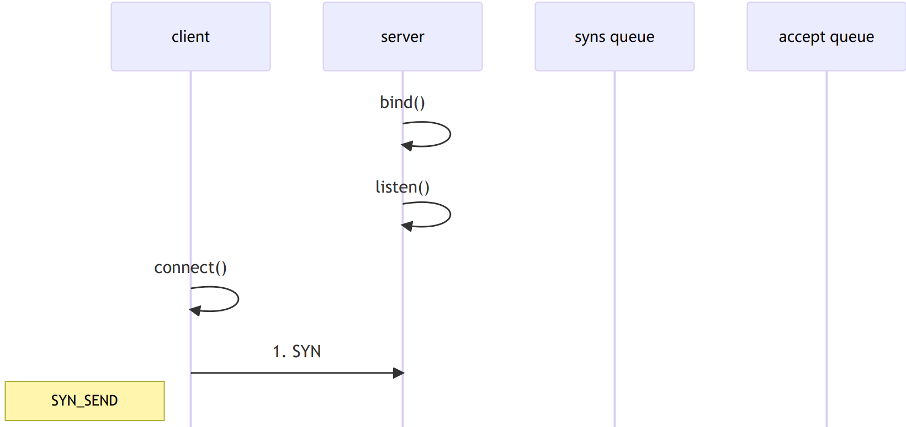

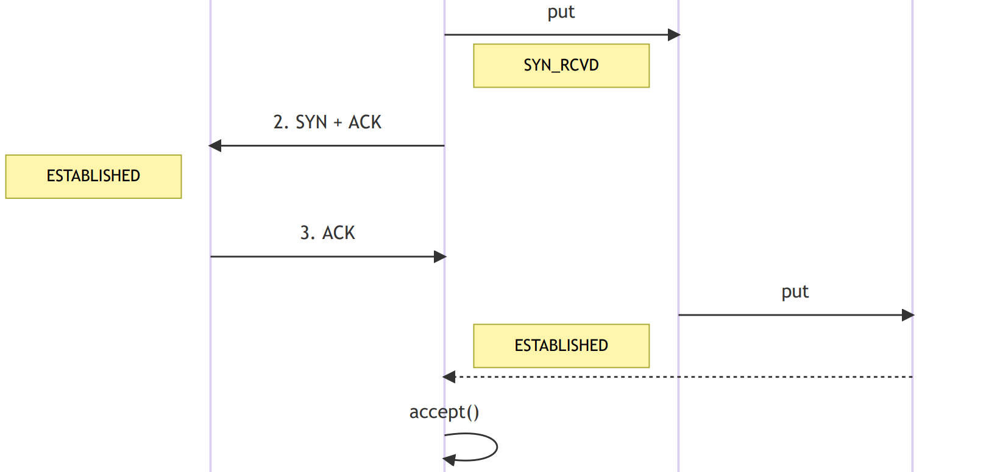

1. 第一次握手，client 发送 SYN 到 server，状态修改为 SYN_SEND，server 收到，状态改变为SYN_REVD，并将该请求放入 sync queue 队列
2. 第二次握手，server 回复 SYN + ACK 给 client，client 收到，状态改变为 ESTABLISHED，并发送ACK 给 server
3. 第三次握手，server 收到 ACK，状态改变为 ESTABLISHED，将该请求从 sync queue 放入 acceptqueue

其中

- 在 linux 2.2 之前，backlog 大小包括了两个队列的大小，在 2.2 之后，分别用下面两个参数来控制
- sync queue - 半连接队列
  - 大小通过 /proc/sys/net/ipv4/tcp_max_syn_backlog 指定，在 syncookies 启用的情况下，逻辑上没有最大值限制，这个设置便被忽略
- accept queue - 全连接队列
  - 其大小通过 /proc/sys/net/core/somaxconn 指定，在使用 listen 函数时，内核会根据传入的backlog 参数与系统参数，取二者的较小值
  - 如果 accpet queue 队列满了，server 将发送一个拒绝连接的错误信息到 client

netty 中 可以通过 option(ChannelOption.SO_BACKLOG, 值) 来设置大小

```java
public class TestBacklogServer {
    public static void main(String[] args) {
        new ServerBootstrap()
                .group(new NioEventLoopGroup())
                .option(ChannelOption.SO_BACKLOG, 2) // 全队列满了
                .channel(NioServerSocketChannel.class)
                .childHandler(new ChannelInitializer<NioSocketChannel>() {
                    @Override
                    protected void initChannel(NioSocketChannel ch) {
                        ch.pipeline().addLast(new LoggingHandler());
                    }
                }).bind(8080);
    }
}
```


#### 3）ulimit -n

- 属于操作系统参数


可以允许同一个进程能够同时打开的文件描述符的数量


#### 4）TCP_NODELAY

- 属于 SocketChannal 参数


false，开启 nagle 算法

true，关闭 nagle 算法，不要延迟，及时发送


#### 5）SO_SNDBUF & SO_RCVBUF

- SO_SNDBUF 属于 SocketChannal 参数
- SO_RCVBUF 既可用于 SocketChannal 参数，也可以用于 ServerSocketChannal 参数（建议设置到 ServerSocketChannal 上）

发送缓冲区和接收缓冲区的滑动窗口


#### 6）ALLOCATOR

- 属于 SocketChannal 参数
- 用来分配 ByteBuf， ctx.alloc()


#### 7）RCVBUF_ALLOCATOR

- 属于 SocketChannal 参数
- 控制 netty 接收缓冲区大小
- 负责入站数据的分配，决定入站缓冲区的大小（并可动态调整），统一采用 direct 直接内存，具体池化还是非池化由 allocator 决定


### 1.3 RPC 框架

#### 1）准备工作

这些代码可以认为是现成的，无需从头编写练习 

为了简化起见，在原来聊天项目的基础上新增 Rpc 请求和响应消息

```java
@Data
public abstract class Message implements Serializable {
    // 省略旧的代码
    
    public static final int RPC_MESSAGE_TYPE_REQUEST = 101;
    public static final int RPC_MESSAGE_TYPE_RESPONSE = 102;
    
    static {
        // ...
        messageClasses.put(RPC_MESSAGE_TYPE_REQUEST, RpcRequestMessage.class);
        messageClasses.put(RPC_MESSAGE_TYPE_RESPONSE, RpcResponseMessage.class);
    }
}
```

请求消息

```java
@Getter
@ToString(callSuper = true)
public class RpcRequestMessage extends Message {
    /**
     * 调用的接口全限定名，服务端根据它找到实现
     */
    private String interfaceName;
    /**
     * 调用接口中的方法名
     */
    private String methodName;
    /**
     * 方法返回类型
     响应消息
     服务器架子
     */
    private Class<?> returnType;
    /**
     * 方法参数类型数组
     */
    private Class[] parameterTypes;
    /**
     * 方法参数值数组
     */
    private Object[] parameterValue;
    public RpcRequestMessage(int sequenceId, String interfaceName, String
            methodName, Class<?> returnType, Class[] parameterTypes, Object[]
                                     parameterValue) {
        super.setSequenceId(sequenceId);
        this.interfaceName = interfaceName;
        this.methodName = methodName;
        this.returnType = returnType;
        this.parameterTypes = parameterTypes;
        this.parameterValue = parameterValue;
    }
    @Override
    public int getMessageType() {
        return RPC_MESSAGE_TYPE_REQUEST;
    }
}
```

响应消息

```java
@Data
@ToString(callSuper = true)
public class RpcResponseMessage extends Message {
    /**
     * 返回值
     */
    private Object returnValue;
    /**
     * 异常值
     */
    private Exception exceptionValue;
    @Override
    public int getMessageType() {
        return RPC_MESSAGE_TYPE_RESPONSE;
    }
}
```

服务器架子

```java
@Slf4j
public class RpcServer {
    public static void main(String[] args) {
        NioEventLoopGroup boss = new NioEventLoopGroup();
        NioEventLoopGroup worker = new NioEventLoopGroup();
        LoggingHandler LOGGING_HANDLER = new LoggingHandler(LogLevel.DEBUG);
        MessageCodecSharable MESSAGE_CODEC = new MessageCodecSharable();
        // rpc 请求消息处理器，待实现
        RpcRequestMessageHandler RPC_HANDLER = new RpcRequestMessageHandler();
        try {
            ServerBootstrap serverBootstrap = new ServerBootstrap();
            serverBootstrap.channel(NioServerSocketChannel.class);
            serverBootstrap.group(boss, worker);
            serverBootstrap.childHandler(new ChannelInitializer<SocketChannel>() {
                @Override
                protected void initChannel(SocketChannel ch) throws Exception {
                    ch.pipeline().addLast(new ProcotolFrameDecoder());
                    ch.pipeline().addLast(LOGGING_HANDLER);
                    ch.pipeline().addLast(MESSAGE_CODEC);
                    ch.pipeline().addLast(RPC_HANDLER);
                }
            });
            Channel channel = serverBootstrap.bind(8080).sync().channel();
            channel.closeFuture().sync();
        } catch (InterruptedException e) {
            log.error("server error", e);
        } finally {
            boss.shutdownGracefully();
            worker.shutdownGracefully();
        }
    }
}
```

客户端架子

```java
@Slf4j
public class RpcClient {
    public static void main(String[] args) {
        NioEventLoopGroup group = new NioEventLoopGroup();
        LoggingHandler LOGGING_HANDLER = new LoggingHandler(LogLevel.DEBUG);
        MessageCodecSharable MESSAGE_CODEC = new MessageCodecSharable();
// rpc 响应消息处理器，待实现
        RpcResponseMessageHandler RPC_HANDLER = new RpcResponseMessageHandler();
        try {
            Bootstrap bootstrap = new Bootstrap();
            bootstrap.channel(NioSocketChannel.class);
            bootstrap.group(group);
            bootstrap.handler(new ChannelInitializer<SocketChannel>() {
                @Override
                protected void initChannel(SocketChannel ch) throws Exception {
                    ch.pipeline().addLast(new ProcotolFrameDecoder());
                    ch.pipeline().addLast(LOGGING_HANDLER);
                    ch.pipeline().addLast(MESSAGE_CODEC);
                    ch.pipeline().addLast(RPC_HANDLER);
                }
            });
            Channel channel = bootstrap.connect("localhost",
                    8080).sync().channel();
            channel.closeFuture().sync();
        } catch (Exception e) {
            log.error("client error", e);
        } finally {
            group.shutdownGracefully();
        }
    }
}
```

服务器端的 service 获取

```java
public class ServicesFactory {
    static Properties properties;
    static Map<Class<?>, Object> map = new ConcurrentHashMap<>();
    static {
        try (InputStream in =
                     Config.class.getResourceAsStream("/application.properties")) {
            properties = new Properties();
            properties.load(in);
            Set<String> names = properties.stringPropertyNames();
            for (String name : names) {
                if (name.endsWith("Service")) {
                    Class<?> interfaceClass = Class.forName(name);
                    Class<?> instanceClass =
                            Class.forName(properties.getProperty(name));
                    map.put(interfaceClass, instanceClass.newInstance());
                }
            }
        } catch (IOException | ClassNotFoundException | InstantiationException |
                 IllegalAccessException e) {
            throw new ExceptionInInitializerError(e);
        }
    }
    public static <T> T getService(Class<T> interfaceClass) {
        return (T) map.get(interfaceClass);
    }
}
```

相关配置 application.properties

```properties
serializer.algorithm=JSON
cn.itcast.server.service.HelloService=cn.itcast.server.service.HelloServiceImpl
```


#### 2）服务器 handler

```java
@Slf4j
@ChannelHandler.Sharable
public class RpcRequestMessageHandler extends
        SimpleChannelInboundHandler<RpcRequestMessage> {
    @Override
    protected void channelRead0(ChannelHandlerContext ctx, RpcRequestMessage
            message) {
        RpcResponseMessage response = new RpcResponseMessage();
        response.setSequenceId(message.getSequenceId());
        try {
// 获取真正的实现对象
            HelloService service = (HelloService)
                    ServicesFactory.getService(Class.forName(message.getInterfaceName()));
// 获取要调用的方法
            Method method =
                    service.getClass().getMethod(message.getMethodName(),
                            message.getParameterTypes());
// 调用方法
            Object invoke = method.invoke(service, message.getParameterValue());
// 调用成功
            response.setReturnValue(invoke);
        } catch (Exception e) {
            e.printStackTrace();
// 调用异常
            response.setExceptionValue(e);
        }
// 返回结果
        ctx.writeAndFlush(response);
    }
}
```


#### 3）客户端代码第一版

只发消息

```java
@Slf4j
public class RpcClient {
    public static void main(String[] args) {
        NioEventLoopGroup group = new NioEventLoopGroup();
        LoggingHandler LOGGING_HANDLER = new LoggingHandler(LogLevel.DEBUG);
        MessageCodecSharable MESSAGE_CODEC = new MessageCodecSharable();
        // rpc 响应消息处理器，待实现
        RpcResponseMessageHandler RPC_HANDLER = new RpcResponseMessageHandler();
        try {
            Bootstrap bootstrap = new Bootstrap();
            bootstrap.channel(NioSocketChannel.class);
            bootstrap.group(group);
            bootstrap.handler(new ChannelInitializer<SocketChannel>() {
                @Override
                protected void initChannel(SocketChannel ch) throws Exception {
                    ch.pipeline().addLast(new ProcotolFrameDecoder());
                    ch.pipeline().addLast(LOGGING_HANDLER);
                    ch.pipeline().addLast(MESSAGE_CODEC);
                    ch.pipeline().addLast(RPC_HANDLER);
                }
            });
            Channel channel = bootstrap.connect("localhost",
                    8080).sync().channel();

            channel.writeAndFlush(new RpcRequestMessage(
                        1,
                        "cn.itcast.server.service.HelloService",
                        "sayHello",
                        String.class,
                        new Class[]{String.class},
                        new Object[]{"张三"}
                ));

            channel.closeFuture().sync();
        } catch (Exception e) {
            log.error("client error", e);
        } finally {
            group.shutdownGracefully();
        }
    }
}
```


#### 4）客户端 handler 第一版

```java
@Slf4j
@ChannelHandler.Sharable
public class RpcResponseMessageHandler extends
SimpleChannelInboundHandler<RpcResponseMessage> {
	@Override
	protected void channelRead0(ChannelHandlerContext ctx, RpcResponseMessage msg) throws Exception {
		log.debug("{}", msg);
	}
}
```


#### 5）客户端代码 第二版

包括 channel 管理，代理，接收结果

```java
@Slf4j
public class RpcClientManager {

    public static void main(String[] args) {
        HelloService service = getProxyService(HelloService.class);
        service.sayHello("张三");
    }

    //创建代理类
    public static <T> T getProxyService(Class<T> serviceClass) {
        ClassLoader loader = serviceClass.getClassLoader();
        Class<?>[] interfaces = new Class[]{serviceClass};
        Object o = Proxy.newProxyInstance(loader, interfaces, (proxy, method, args) -> {
            //1.将方法调用转换为消息对象
            int sequenceId = SequenceIdGenerator.nextId();
            RpcRequestMessage msg = new RpcRequestMessage(
                    sequenceId,
                    serviceClass.getName(),
                    method.getName(),
                    method.getReturnType(),
                    method.getParameterTypes(),
                    args
            );
            //2.将消息对象发送出去
            getChannel().writeAndFlush(msg);

            //3.准备一个空的Promise对象，来接受结果               指定promise对象接收结果线程
            DefaultPromise promise = new DefaultPromise(getChannel().eventLoop());
            RpcResponseMessageHandler.PROMISES.put(sequenceId, promise);

            //4.等待promise结果
            promise.await();
            if(promise.isSuccess()) {
                //调用正常
                return promise.getNow();
            } else {
                //调用失败
                throw new RuntimeException(promise.cause());
            }
        });
        return (T) o;
    }

    private static Channel channel = null;
    private static final Object LOCK = new Object();

    //获取唯一的channel对象
    public static Channel getChannel() {
        if(channel != null) {
            return channel;
        }
        synchronized (LOCK) {
            if(channel != null) {
                return channel;
            }
            initChannel();
            return channel;
        }

    }

    //初始化channel方法
    private static void initChannel() {
        NioEventLoopGroup group = new NioEventLoopGroup();
        LoggingHandler LOGGING_HANDLER = new LoggingHandler(LogLevel.DEBUG);
        MessageCodecSharable MESSAGE_CODEC = new MessageCodecSharable();
        // rpc 响应消息处理器，待实现
        RpcResponseMessageHandler RPC_HANDLER = new RpcResponseMessageHandler();

        Bootstrap bootstrap = new Bootstrap();
        bootstrap.channel(NioSocketChannel.class);
        bootstrap.group(group);
        bootstrap.handler(new ChannelInitializer<SocketChannel>() {
            @Override
            protected void initChannel(SocketChannel ch) throws Exception {
                ch.pipeline().addLast(new ProcotolFrameDecoder());
                ch.pipeline().addLast(LOGGING_HANDLER);
                ch.pipeline().addLast(MESSAGE_CODEC);
                ch.pipeline().addLast(RPC_HANDLER);
            }
        });

        try {
            Channel channel = bootstrap.connect("localhost",
                    8080).sync().channel();

            channel.closeFuture().addListener(future -> {
                group.shutdownGracefully();
            });
        } catch (Exception e) {
            log.error("client error", e);
        }
    }

}
```


#### 6）客户端 handler 第二版

```java
@Slf4j
@ChannelHandler.Sharable
public class RpcResponseMessageHandler extends SimpleChannelInboundHandler<RpcResponseMessage> {

    //                        序号    用来接收结果的 promise 对象
    public static final Map<Integer, Promise<Object>> PROMISES = new ConcurrentHashMap<>();

    @Override
    protected void channelRead0(ChannelHandlerContext ctx, RpcResponseMessage msg) throws Exception {
        log.debug("{}", msg);
        // 拿到空的 promise
        Promise<Object> promise = PROMISES.remove(msg.getSequenceId());
        if (promise != null) {
            Object returnValue = msg.getReturnValue();
            Exception exceptionValue = msg.getExceptionValue();
            if(exceptionValue != null) {
                promise.setFailure(exceptionValue);
            } else {
                promise.setSuccess(returnValue);
            }
        }
    }
}
```


## 2. 源码分析

### 2.1 启动剖析

我们就来看看 netty 中对下面的代码是怎样进行处理的

```java
//1 netty 中使用 NioEventLoopGroup （简称 nio boss 线程）来封装线程和 selector
Selector selector = Selector.open(); 

//2 创建 NioServerSocketChannel，同时会初始化它关联的 handler，以及为原生 ssc 存储 config
NioServerSocketChannel attachment = new NioServerSocketChannel();

//3 创建 NioServerSocketChannel 时，创建了 java 原生的 ServerSocketChannel
ServerSocketChannel serverSocketChannel = ServerSocketChannel.open(); 
serverSocketChannel.configureBlocking(false);

//4 启动 nio boss 线程执行接下来的操作

//5 注册（仅关联 selector 和 NioServerSocketChannel），未关注事件
SelectionKey selectionKey = serverSocketChannel.register(selector, 0, attachment);

//6 head -> 初始化器 -> ServerBootstrapAcceptor -> tail，初始化器是一次性的，只为添加 acceptor

//7 绑定端口
serverSocketChannel.bind(new InetSocketAddress(8080));

//8 触发 channel active 事件，在 head 中关注 op_accept 事件
selectionKey.interestOps(SelectionKey.OP_ACCEPT);
```


入口 `io.netty.bootstrap.ServerBootstrap#bind`

关键代码 `io.netty.bootstrap.AbstractBootstrap#doBind`

```java
private ChannelFuture doBind(final SocketAddress localAddress) {
	// 1. 执行初始化和注册 regFuture 会由 initAndRegister 设置其是否完成，从而回调 3.2 处代码
    final ChannelFuture regFuture = initAndRegister();
    final Channel channel = regFuture.channel();
    if (regFuture.cause() != null) {
        return regFuture;
    }

    // 2. 因为是 initAndRegister 异步执行，需要分两种情况来看，调试时也需要通过 suspend 断点类型加以区分
    // 2.1 如果已经完成
    if (regFuture.isDone()) {
        ChannelPromise promise = channel.newPromise();
        // 3.1 立刻调用 doBind0
        doBind0(regFuture, channel, localAddress, promise);
        return promise;
    } 
    // 2.2 还没有完成
    else {
        final PendingRegistrationPromise promise = new PendingRegistrationPromise(channel);
        // 3.2 回调 doBind0
        regFuture.addListener(new ChannelFutureListener() {
            @Override
            public void operationComplete(ChannelFuture future) throws Exception {
                Throwable cause = future.cause();
                if (cause != null) {
                    // 处理异常...
                    promise.setFailure(cause);
                } else {
                    promise.registered();
					// 3. 由注册线程去执行 doBind0
                    doBind0(regFuture, channel, localAddress, promise);
                }
            }
        });
        return promise;
    }
}
```

关键代码 `io.netty.bootstrap.AbstractBootstrap#initAndRegister`

```java
final ChannelFuture initAndRegister() {
    Channel channel = null;
    try {
        channel = channelFactory.newChannel();
        // 1.1 初始化 - 做的事就是添加一个初始化器 ChannelInitializer
        init(channel);
    } catch (Throwable t) {
        // 处理异常...
        return new DefaultChannelPromise(new FailedChannel(), GlobalEventExecutor.INSTANCE).setFailure(t);
    }

    // 1.2 注册 - 做的事就是将原生 channel 注册到 selector 上
    ChannelFuture regFuture = config().group().register(channel);
    if (regFuture.cause() != null) {
        // 处理异常...
    }
    return regFuture;
}
```

关键代码 `io.netty.bootstrap.ServerBootstrap#init`

```java
// 这里 channel 实际上是 NioServerSocketChannel
void init(Channel channel) throws Exception {
    final Map<ChannelOption<?>, Object> options = options0();
    synchronized (options) {
        setChannelOptions(channel, options, logger);
    }

    final Map<AttributeKey<?>, Object> attrs = attrs0();
    synchronized (attrs) {
        for (Entry<AttributeKey<?>, Object> e: attrs.entrySet()) {
            @SuppressWarnings("unchecked")
            AttributeKey<Object> key = (AttributeKey<Object>) e.getKey();
            channel.attr(key).set(e.getValue());
        }
    }

    ChannelPipeline p = channel.pipeline();

    final EventLoopGroup currentChildGroup = childGroup;
    final ChannelHandler currentChildHandler = childHandler;
    final Entry<ChannelOption<?>, Object>[] currentChildOptions;
    final Entry<AttributeKey<?>, Object>[] currentChildAttrs;
    synchronized (childOptions) {
        currentChildOptions = childOptions.entrySet().toArray(newOptionArray(0));
    }
    synchronized (childAttrs) {
        currentChildAttrs = childAttrs.entrySet().toArray(newAttrArray(0));
    }
	
    // 为 NioServerSocketChannel 添加初始化器
    p.addLast(new ChannelInitializer<Channel>() {
        @Override
        public void initChannel(final Channel ch) throws Exception {
            final ChannelPipeline pipeline = ch.pipeline();
            ChannelHandler handler = config.handler();
            if (handler != null) {
                pipeline.addLast(handler);
            }

            // 初始化器的职责是将 ServerBootstrapAcceptor 加入至 NioServerSocketChannel
            ch.eventLoop().execute(new Runnable() {
                @Override
                public void run() {
                    pipeline.addLast(new ServerBootstrapAcceptor(
                            ch, currentChildGroup, currentChildHandler, currentChildOptions, currentChildAttrs));
                }
            });
        }
    });
}
```

关键代码 `io.netty.channel.AbstractChannel.AbstractUnsafe#register`

```java
public final void register(EventLoop eventLoop, final ChannelPromise promise) {
    // 一些检查，略...

    AbstractChannel.this.eventLoop = eventLoop;

    if (eventLoop.inEventLoop()) {
        register0(promise);
    } else {
        try {
            // 首次执行 execute 方法时，会启动 nio 线程，之后注册等操作在 nio 线程上执行
            // 因为只有一个 NioServerSocketChannel 因此，也只会有一个 boss nio 线程
            // 这行代码完成的事实是 main -> nio boss 线程的切换
            eventLoop.execute(new Runnable() {
                @Override
                public void run() {
                    register0(promise);
                }
            });
        } catch (Throwable t) {
            // 日志记录...
            closeForcibly();
            closeFuture.setClosed();
            safeSetFailure(promise, t);
        }
    }
}
```


`io.netty.channel.AbstractChannel.AbstractUnsafe#register0`

```java
private void register0(ChannelPromise promise) {
    try {
        if (!promise.setUncancellable() || !ensureOpen(promise)) {
            return;
        }
        boolean firstRegistration = neverRegistered;
        // 1.2.1 原生的 nio channel 绑定到 selector 上，注意此时没有注册 selector 关注事件，附件为 NioServerSocketChannel
        doRegister();
        neverRegistered = false;
        registered = true;

        // 1.2.2 执行 NioServerSocketChannel 初始化器的 initChannel
        pipeline.invokeHandlerAddedIfNeeded();

        // 回调 3.2 io.netty.bootstrap.AbstractBootstrap#doBind0
        safeSetSuccess(promise);
        pipeline.fireChannelRegistered();
        
        // 对应 server socket channel 还未绑定，isActive 为 false
        if (isActive()) {
            if (firstRegistration) {
                pipeline.fireChannelActive();
            } else if (config().isAutoRead()) {
                beginRead();
            }
        }
    } catch (Throwable t) {
        // Close the channel directly to avoid FD leak.
        closeForcibly();
        closeFuture.setClosed();
        safeSetFailure(promise, t);
    }
}
```

关键代码 `io.netty.channel.ChannelInitializer#initChannel`

```java
private boolean initChannel(ChannelHandlerContext ctx) throws Exception {
    if (initMap.add(ctx)) { // Guard against re-entrance.
        try {
            // 1.2.2.1 执行初始化
            initChannel((C) ctx.channel());
        } catch (Throwable cause) {
            exceptionCaught(ctx, cause);
        } finally {
            // 1.2.2.2 移除初始化器
            ChannelPipeline pipeline = ctx.pipeline();
            if (pipeline.context(this) != null) {
                pipeline.remove(this);
            }
        }
        return true;
    }
    return false;
}
```

关键代码 `io.netty.bootstrap.AbstractBootstrap#doBind0`

```java
// 3.1 或 3.2 执行 doBind0
private static void doBind0(
        final ChannelFuture regFuture, final Channel channel,
        final SocketAddress localAddress, final ChannelPromise promise) {

    channel.eventLoop().execute(new Runnable() {
        @Override
        public void run() {
            if (regFuture.isSuccess()) {
                channel.bind(localAddress, promise).addListener(ChannelFutureListener.CLOSE_ON_FAILURE);
            } else {
                promise.setFailure(regFuture.cause());
            }
        }
    });
}
```

关键代码 `io.netty.channel.AbstractChannel.AbstractUnsafe#bind`

```java
public final void bind(final SocketAddress localAddress, final ChannelPromise promise) {
    assertEventLoop();

    if (!promise.setUncancellable() || !ensureOpen(promise)) {
        return;
    }

    if (Boolean.TRUE.equals(config().getOption(ChannelOption.SO_BROADCAST)) &&
        localAddress instanceof InetSocketAddress &&
        !((InetSocketAddress) localAddress).getAddress().isAnyLocalAddress() &&
        !PlatformDependent.isWindows() && !PlatformDependent.maybeSuperUser()) {
        // 记录日志...
    }

    boolean wasActive = isActive();
    try {
        // 3.3 执行端口绑定
        doBind(localAddress);
    } catch (Throwable t) {
        safeSetFailure(promise, t);
        closeIfClosed();
        return;
    }

    if (!wasActive && isActive()) {
        invokeLater(new Runnable() {
            @Override
            public void run() {
                // 3.4 触发 active 事件
                pipeline.fireChannelActive();
            }
        });
    }

    safeSetSuccess(promise);
}
```

3.3 关键代码 `io.netty.channel.socket.nio.NioServerSocketChannel#doBind`

```java
protected void doBind(SocketAddress localAddress) throws Exception {
    if (PlatformDependent.javaVersion() >= 7) {
        javaChannel().bind(localAddress, config.getBacklog());
    } else {
        javaChannel().socket().bind(localAddress, config.getBacklog());
    }
}
```

3.4 关键代码 `io.netty.channel.DefaultChannelPipeline.HeadContext#channelActive`

```java
public void channelActive(ChannelHandlerContext ctx) {
    ctx.fireChannelActive();
	// 触发 read (NioServerSocketChannel 上的 read 不是读取数据，只是为了触发 channel 的事件注册)
    readIfIsAutoRead();
}
```

关键代码 `io.netty.channel.nio.AbstractNioChannel#doBeginRead`

```java
protected void doBeginRead() throws Exception {
    // Channel.read() or ChannelHandlerContext.read() was called
    final SelectionKey selectionKey = this.selectionKey;
    if (!selectionKey.isValid()) {
        return;
    }

    readPending = true;

    final int interestOps = selectionKey.interestOps();
    // readInterestOp 取值是 16，在 NioServerSocketChannel 创建时初始化好，代表关注 accept 事件
    if ((interestOps & readInterestOp) == 0) {
        selectionKey.interestOps(interestOps | readInterestOp);
    }
}
```


### 2.2 NioEventLoop 剖析

NioEventLoop 线程不仅要处理 IO 事件，还要处理 Task（包括普通任务和定时任务），

提交任务代码 `io.netty.util.concurrent.SingleThreadEventExecutor#execute`

```java
public void execute(Runnable task) {
    if (task == null) {
        throw new NullPointerException("task");
    }

    boolean inEventLoop = inEventLoop();
    // 添加任务，其中队列使用了 jctools 提供的 mpsc 无锁队列
    addTask(task);
    if (!inEventLoop) {
        // inEventLoop 如果为 false 表示由其它线程来调用 execute，即首次调用，这时需要向 eventLoop 提交首个任务，启动死循环，会执行到下面的 doStartThread
        startThread();
        if (isShutdown()) {
            // 如果已经 shutdown，做拒绝逻辑，代码略...
        }
    }

    if (!addTaskWakesUp && wakesUpForTask(task)) {
        // 如果线程由于 IO select 阻塞了，添加的任务的线程需要负责唤醒 NioEventLoop 线程
        wakeup(inEventLoop);
    }
}
```


唤醒 select 阻塞线程`io.netty.channel.nio.NioEventLoop#wakeup`

```java
@Override
protected void wakeup(boolean inEventLoop) {
    if (!inEventLoop && wakenUp.compareAndSet(false, true)) {
        selector.wakeup();
    }
}
```


启动 EventLoop 主循环 `io.netty.util.concurrent.SingleThreadEventExecutor#doStartThread`

```java
private void doStartThread() {
    assert thread == null;
    executor.execute(new Runnable() {
        @Override
        public void run() {
            // 将线程池的当前线程保存在成员变量中，以便后续使用
            thread = Thread.currentThread();
            if (interrupted) {
                thread.interrupt();
            }

            boolean success = false;
            updateLastExecutionTime();
            try {
                // 调用外部类 SingleThreadEventExecutor 的 run 方法，进入死循环，run 方法见下
                SingleThreadEventExecutor.this.run();
                success = true;
            } catch (Throwable t) {
                logger.warn("Unexpected exception from an event executor: ", t);
            } finally {
				// 清理工作，代码略...
            }
        }
    });
}
```


`io.netty.channel.nio.NioEventLoop#run` 主要任务是执行死循环，不断看有没有新任务，有没有 IO 事件

```java
protected void run() {
    for (;;) {
        try {
            try {
                // calculateStrategy 的逻辑如下：
                // 有任务，会执行一次 selectNow，清除上一次的 wakeup 结果，无论有没有 IO 事件，都会跳过 switch
                // 没有任务，会匹配 SelectStrategy.SELECT，看是否应当阻塞
                switch (selectStrategy.calculateStrategy(selectNowSupplier, hasTasks())) {
                    case SelectStrategy.CONTINUE:
                        continue;

                    case SelectStrategy.BUSY_WAIT:

                    case SelectStrategy.SELECT:
                        // 因为 IO 线程和提交任务线程都有可能执行 wakeup，而 wakeup 属于比较昂贵的操作，因此使用了一个原子布尔对象 wakenUp，它取值为 true 时，表示该由当前线程唤醒
                        // 进行 select 阻塞，并设置唤醒状态为 false
                        boolean oldWakenUp = wakenUp.getAndSet(false);
                        
                        // 如果在这个位置，非 EventLoop 线程抢先将 wakenUp 置为 true，并 wakeup
                        // 下面的 select 方法不会阻塞
                        // 等 runAllTasks 处理完成后，到再循环进来这个阶段新增的任务会不会及时执行呢?
                        // 因为 oldWakenUp 为 true，因此下面的 select 方法就会阻塞，直到超时
                        // 才能执行，让 select 方法无谓阻塞
                        select(oldWakenUp);

                        if (wakenUp.get()) {
                            selector.wakeup();
                        }
                    default:
                }
            } catch (IOException e) {
                rebuildSelector0();
                handleLoopException(e);
                continue;
            }

            cancelledKeys = 0;
            needsToSelectAgain = false;
            // ioRatio 默认是 50
            final int ioRatio = this.ioRatio;
            if (ioRatio == 100) {
                try {
                    processSelectedKeys();
                } finally {
                    // ioRatio 为 100 时，总是运行完所有非 IO 任务
                    runAllTasks();
                }
            } else {                
                final long ioStartTime = System.nanoTime();
                try {
                    processSelectedKeys();
                } finally {
                    // 记录 io 事件处理耗时
                    final long ioTime = System.nanoTime() - ioStartTime;
                    // 运行非 IO 任务，一旦超时会退出 runAllTasks
                    runAllTasks(ioTime * (100 - ioRatio) / ioRatio);
                }
            }
        } catch (Throwable t) {
            handleLoopException(t);
        }
        try {
            if (isShuttingDown()) {
                closeAll();
                if (confirmShutdown()) {
                    return;
                }
            }
        } catch (Throwable t) {
            handleLoopException(t);
        }
    }
}
```


#### ⚠️ 注意

> 这里有个费解的地方就是 wakeup，它既可以由提交任务的线程来调用（比较好理解），也可以由 EventLoop 线程来调用（比较费解），这里要知道 wakeup 方法的效果：
>
> * 由非 EventLoop 线程调用，会唤醒当前在执行 select 阻塞的 EventLoop 线程
> * 由 EventLoop 自己调用，会本次的 wakeup 会取消下一次的 select 操作


参考下图

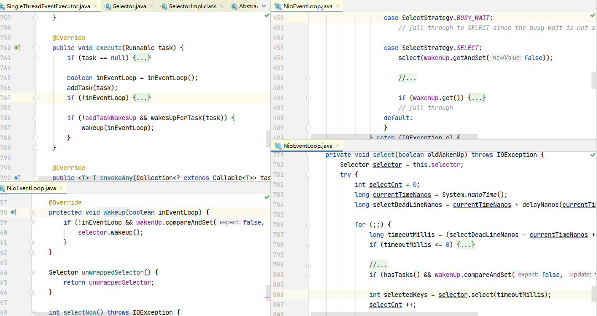


`io.netty.channel.nio.NioEventLoop#select`

```java
private void select(boolean oldWakenUp) throws IOException {
    Selector selector = this.selector;
    try {
        int selectCnt = 0;
        long currentTimeNanos = System.nanoTime();
        // 计算等待时间
        // * 没有 scheduledTask，超时时间为 1s
        // * 有 scheduledTask，超时时间为 `下一个定时任务执行时间 - 当前时间`
        long selectDeadLineNanos = currentTimeNanos + delayNanos(currentTimeNanos);

        for (;;) {
            long timeoutMillis = (selectDeadLineNanos - currentTimeNanos + 500000L) / 1000000L;
            // 如果超时，退出循环
            if (timeoutMillis <= 0) {
                if (selectCnt == 0) {
                    selector.selectNow();
                    selectCnt = 1;
                }
                break;
            }

            // 如果期间又有 task 退出循环，如果没这个判断，那么任务就会等到下次 select 超时时才能被执行
            // wakenUp.compareAndSet(false, true) 是让非 NioEventLoop 不必再执行 wakeup
            if (hasTasks() && wakenUp.compareAndSet(false, true)) {
                selector.selectNow();
                selectCnt = 1;
                break;
            }

            // select 有限时阻塞
            // 注意 nio 有 bug，当 bug 出现时，select 方法即使没有时间发生，也不会阻塞住，导致不断空轮询，cpu 占用 100%
            int selectedKeys = selector.select(timeoutMillis);
            // 计数加 1
            selectCnt ++;

            // 醒来后，如果有 IO 事件、或是由非 EventLoop 线程唤醒，或者有任务，退出循环
            if (selectedKeys != 0 || oldWakenUp || wakenUp.get() || hasTasks() || hasScheduledTasks()) {
                break;
            }
            if (Thread.interrupted()) {
               	// 线程被打断，退出循环
                // 记录日志
                selectCnt = 1;
                break;
            }

            long time = System.nanoTime();
            if (time - TimeUnit.MILLISECONDS.toNanos(timeoutMillis) >= currentTimeNanos) {
                // 如果超时，计数重置为 1，下次循环就会 break
                selectCnt = 1;
            } 
            // 计数超过阈值，由 io.netty.selectorAutoRebuildThreshold 指定，默认 512
            // 这是为了解决 nio 空轮询 bug
            else if (SELECTOR_AUTO_REBUILD_THRESHOLD > 0 &&
                    selectCnt >= SELECTOR_AUTO_REBUILD_THRESHOLD) {
                // 重建 selector
                selector = selectRebuildSelector(selectCnt);
                selectCnt = 1;
                break;
            }

            currentTimeNanos = time;
        }

        if (selectCnt > MIN_PREMATURE_SELECTOR_RETURNS) {
            // 记录日志
        }
    } catch (CancelledKeyException e) {
        // 记录日志
    }
}
```


处理 keys `io.netty.channel.nio.NioEventLoop#processSelectedKeys`

```java
private void processSelectedKeys() {
    if (selectedKeys != null) {
        // 通过反射将 Selector 实现类中的就绪事件集合替换为 SelectedSelectionKeySet 
        // SelectedSelectionKeySet 底层为数组实现，可以提高遍历性能（原本为 HashSet）
        processSelectedKeysOptimized();
    } else {
        processSelectedKeysPlain(selector.selectedKeys());
    }
}
```


`io.netty.channel.nio.NioEventLoop#processSelectedKey`

```java
private void processSelectedKey(SelectionKey k, AbstractNioChannel ch) {
    final AbstractNioChannel.NioUnsafe unsafe = ch.unsafe();
    // 当 key 取消或关闭时会导致这个 key 无效
    if (!k.isValid()) {
        // 无效时处理...
        return;
    }

    try {
        int readyOps = k.readyOps();
        // 连接事件
        if ((readyOps & SelectionKey.OP_CONNECT) != 0) {
            int ops = k.interestOps();
            ops &= ~SelectionKey.OP_CONNECT;
            k.interestOps(ops);

            unsafe.finishConnect();
        }

        // 可写事件
        if ((readyOps & SelectionKey.OP_WRITE) != 0) {
            ch.unsafe().forceFlush();
        }

        // 可读或可接入事件
        if ((readyOps & (SelectionKey.OP_READ | SelectionKey.OP_ACCEPT)) != 0 || readyOps == 0) {
            // 如果是可接入 io.netty.channel.nio.AbstractNioMessageChannel.NioMessageUnsafe#read
            // 如果是可读 io.netty.channel.nio.AbstractNioByteChannel.NioByteUnsafe#read
            unsafe.read();
        }
    } catch (CancelledKeyException ignored) {
        unsafe.close(unsafe.voidPromise());
    }
}
```


### 2.3 accept 剖析

nio 中如下代码，在 netty 中的流程

```java
//1 阻塞直到事件发生
selector.select();

Iterator<SelectionKey> iter = selector.selectedKeys().iterator();
while (iter.hasNext()) {    
    //2 拿到一个事件
    SelectionKey key = iter.next();
    
    //3 如果是 accept 事件
    if (key.isAcceptable()) {
        
        //4 执行 accept
        SocketChannel channel = serverSocketChannel.accept();
        channel.configureBlocking(false);
        
        //5 关注 read 事件
        channel.register(selector, SelectionKey.OP_READ);
    }
    // ...
}
```


先来看可接入事件处理（accept）

`io.netty.channel.nio.AbstractNioMessageChannel.NioMessageUnsafe#read`

```java
public void read() {
    assert eventLoop().inEventLoop();
    final ChannelConfig config = config();
    final ChannelPipeline pipeline = pipeline();    
    final RecvByteBufAllocator.Handle allocHandle = unsafe().recvBufAllocHandle();
    allocHandle.reset(config);

    boolean closed = false;
    Throwable exception = null;
    try {
        try {
            do {
				// doReadMessages 中执行了 accept 并创建 NioSocketChannel 作为消息放入 readBuf
                // readBuf 是一个 ArrayList 用来缓存消息
                int localRead = doReadMessages(readBuf);
                if (localRead == 0) {
                    break;
                }
                if (localRead < 0) {
                    closed = true;
                    break;
                }
				// localRead 为 1，就一条消息，即接收一个客户端连接
                allocHandle.incMessagesRead(localRead);
            } while (allocHandle.continueReading());
        } catch (Throwable t) {
            exception = t;
        }

        int size = readBuf.size();
        for (int i = 0; i < size; i ++) {
            readPending = false;
            // 触发 read 事件，让 pipeline 上的 handler 处理，这时是处理
            // io.netty.bootstrap.ServerBootstrap.ServerBootstrapAcceptor#channelRead
            pipeline.fireChannelRead(readBuf.get(i));
        }
        readBuf.clear();
        allocHandle.readComplete();
        pipeline.fireChannelReadComplete();

        if (exception != null) {
            closed = closeOnReadError(exception);

            pipeline.fireExceptionCaught(exception);
        }

        if (closed) {
            inputShutdown = true;
            if (isOpen()) {
                close(voidPromise());
            }
        }
    } finally {
        if (!readPending && !config.isAutoRead()) {
            removeReadOp();
        }
    }
}
```


关键代码 `io.netty.bootstrap.ServerBootstrap.ServerBootstrapAcceptor#channelRead`

```java
public void channelRead(ChannelHandlerContext ctx, Object msg) {
    // 这时的 msg 是 NioSocketChannel
    final Channel child = (Channel) msg;

    // NioSocketChannel 添加  childHandler 即初始化器
    child.pipeline().addLast(childHandler);

    // 设置选项
    setChannelOptions(child, childOptions, logger);

    for (Entry<AttributeKey<?>, Object> e: childAttrs) {
        child.attr((AttributeKey<Object>) e.getKey()).set(e.getValue());
    }

    try {
        // 注册 NioSocketChannel 到 nio worker 线程，接下来的处理也移交至 nio worker 线程
        childGroup.register(child).addListener(new ChannelFutureListener() {
            @Override
            public void operationComplete(ChannelFuture future) throws Exception {
                if (!future.isSuccess()) {
                    forceClose(child, future.cause());
                }
            }
        });
    } catch (Throwable t) {
        forceClose(child, t);
    }
}
```


又回到了熟悉的 `io.netty.channel.AbstractChannel.AbstractUnsafe#register`  方法

```java
public final void register(EventLoop eventLoop, final ChannelPromise promise) {
    // 一些检查，略...

    AbstractChannel.this.eventLoop = eventLoop;

    if (eventLoop.inEventLoop()) {
        register0(promise);
    } else {
        try {
            // 这行代码完成的事实是 nio boss -> nio worker 线程的切换
            eventLoop.execute(new Runnable() {
                @Override
                public void run() {
                    register0(promise);
                }
            });
        } catch (Throwable t) {
            // 日志记录...
            closeForcibly();
            closeFuture.setClosed();
            safeSetFailure(promise, t);
        }
    }
}
```

`io.netty.channel.AbstractChannel.AbstractUnsafe#register0`

```java
private void register0(ChannelPromise promise) {
    try {
        if (!promise.setUncancellable() || !ensureOpen(promise)) {
            return;
        }
        boolean firstRegistration = neverRegistered;
        doRegister();
        neverRegistered = false;
        registered = true;
		
        // 执行初始化器，执行前 pipeline 中只有 head -> 初始化器 -> tail
        pipeline.invokeHandlerAddedIfNeeded();
        // 执行后就是 head -> logging handler -> my handler -> tail

        safeSetSuccess(promise);
        pipeline.fireChannelRegistered();
        
        if (isActive()) {
            if (firstRegistration) {
                // 触发 pipeline 上 active 事件
                pipeline.fireChannelActive();
            } else if (config().isAutoRead()) {
                beginRead();
            }
        }
    } catch (Throwable t) {
        closeForcibly();
        closeFuture.setClosed();
        safeSetFailure(promise, t);
    }
}
```


回到了熟悉的代码 `io.netty.channel.DefaultChannelPipeline.HeadContext#channelActive`

```java
public void channelActive(ChannelHandlerContext ctx) {
    ctx.fireChannelActive();
	// 触发 read (NioSocketChannel 这里 read，只是为了触发 channel 的事件注册，还未涉及数据读取)
    readIfIsAutoRead();
}
```

`io.netty.channel.nio.AbstractNioChannel#doBeginRead`

```java
protected void doBeginRead() throws Exception {
    // Channel.read() or ChannelHandlerContext.read() was called
    final SelectionKey selectionKey = this.selectionKey;
    if (!selectionKey.isValid()) {
        return;
    }

    readPending = true;
	// 这时候 interestOps 是 0
    final int interestOps = selectionKey.interestOps();
    if ((interestOps & readInterestOp) == 0) {
        // 关注 read 事件
        selectionKey.interestOps(interestOps | readInterestOp);
    }
}
```


### 2.4 read 剖析

再来看可读事件 `io.netty.channel.nio.AbstractNioByteChannel.NioByteUnsafe#read`，注意发送的数据未必能够一次读完，因此会触发多次 nio read 事件，一次事件内会触发多次 pipeline read，一次事件会触发一次 pipeline read complete

```java
public final void read() {
    final ChannelConfig config = config();
    if (shouldBreakReadReady(config)) {
        clearReadPending();
        return;
    }
    final ChannelPipeline pipeline = pipeline();
    // io.netty.allocator.type 决定 allocator 的实现
    final ByteBufAllocator allocator = config.getAllocator();
    // 用来分配 byteBuf，确定单次读取大小
    final RecvByteBufAllocator.Handle allocHandle = recvBufAllocHandle();
    allocHandle.reset(config);

    ByteBuf byteBuf = null;
    boolean close = false;
    try {
        do {
            byteBuf = allocHandle.allocate(allocator);
            // 读取
            allocHandle.lastBytesRead(doReadBytes(byteBuf));
            if (allocHandle.lastBytesRead() <= 0) {
                byteBuf.release();
                byteBuf = null;
                close = allocHandle.lastBytesRead() < 0;
                if (close) {
                    readPending = false;
                }
                break;
            }

            allocHandle.incMessagesRead(1);
            readPending = false;
            // 触发 read 事件，让 pipeline 上的 handler 处理，这时是处理 NioSocketChannel 上的 handler
            pipeline.fireChannelRead(byteBuf);
            byteBuf = null;
        } 
        // 是否要继续循环
        while (allocHandle.continueReading());

        allocHandle.readComplete();
        // 触发 read complete 事件
        pipeline.fireChannelReadComplete();

        if (close) {
            closeOnRead(pipeline);
        }
    } catch (Throwable t) {
        handleReadException(pipeline, byteBuf, t, close, allocHandle);
    } finally {
        if (!readPending && !config.isAutoRead()) {
            removeReadOp();
        }
    }
}
```


`io.netty.channel.DefaultMaxMessagesRecvByteBufAllocator.MaxMessageHandle#continueReading(io.netty.util.UncheckedBooleanSupplier)`

```java
public boolean continueReading(UncheckedBooleanSupplier maybeMoreDataSupplier) {
    return 
           // 一般为 true
           config.isAutoRead() &&
           // respectMaybeMoreData 默认为 true
           // maybeMoreDataSupplier 的逻辑是如果预期读取字节与实际读取字节相等，返回 true
           (!respectMaybeMoreData || maybeMoreDataSupplier.get()) &&
           // 小于最大次数，maxMessagePerRead 默认 16
           totalMessages < maxMessagePerRead &&
           // 实际读到了数据
           totalBytesRead > 0;
}
```


