# SpringCloud

## 一、微服务架构概述

### 1.什么是微服务

> 微服务架构是一种架构模式，它提倡将单一应用程序划分成一组小的服务，服务之间互相协调、互相配合，为用户提供最终价值。每个服务运行在其独立的进程中，服务与服务间采用轻量级的通信机制互相协作(通常是基于HTTP协议的RESTfuI API)。每个服务都围绕着具体业务进行构建，并且能够被独立的部署到生产环境、类生产环境等。另外，应当尽量避免统一的、集中式的服务管理机制，对具体的一个服务而言，应根据业务上下文，选择合适的语言、工具对其进行构建


SpringCloud = 分布式微服务架构的一站式解决方案，是多种微服务架构落地技术的集合体，俗称微服务全家桶


- 猜猜SpringCloud这个大集合里有多少种技术？

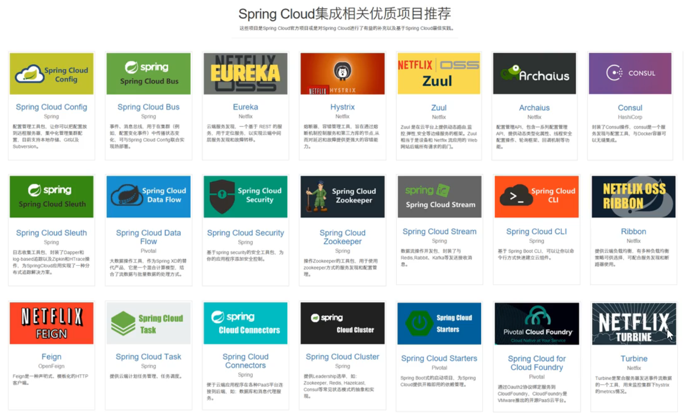

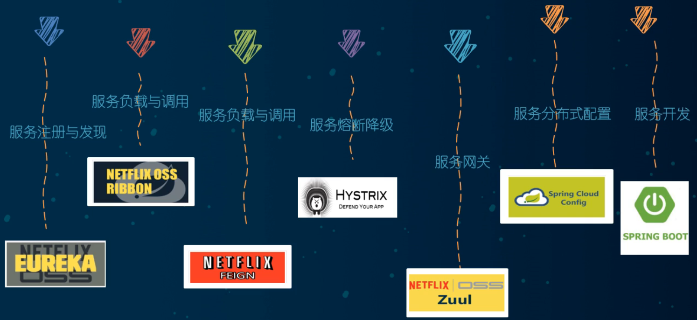


## 二、版本选型

| Spring Cloud | Spring Boot |
| ------------ | ----------- |
| Hoxton       | 2.2.x       |
| Greenwich    | 2.1.x       |
| Finchley     | 2.0.x       |
| Edgware      | 1.5.x       |
| Dalston      | 1.5.x       |

网站查看：https://start.spring.io/actuator/info


**教学版本**

| 技术栈        | 版本          |
| ------------- | ------------- |
| cloud         | Hoxton.SR1    |
| boot          | 2.2.2.RELEASE |
| cloud alibaba | 2.1.0.RELEASE |
| Java          | Java8         |
| Maven         | 3.5及以上     |
| Mysql         | 5.7及以上     |


## 三、Cloud各种组件的停更/升级/替换

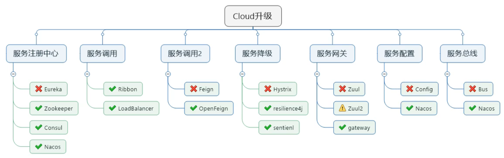


## 四、微服务架构编码构建

> 约定 > 配置 > 编码

### 1. IDEA新建project

#### (1)微服务整体聚合父工程

1. 创建一个maven工程
2. 字符编码
   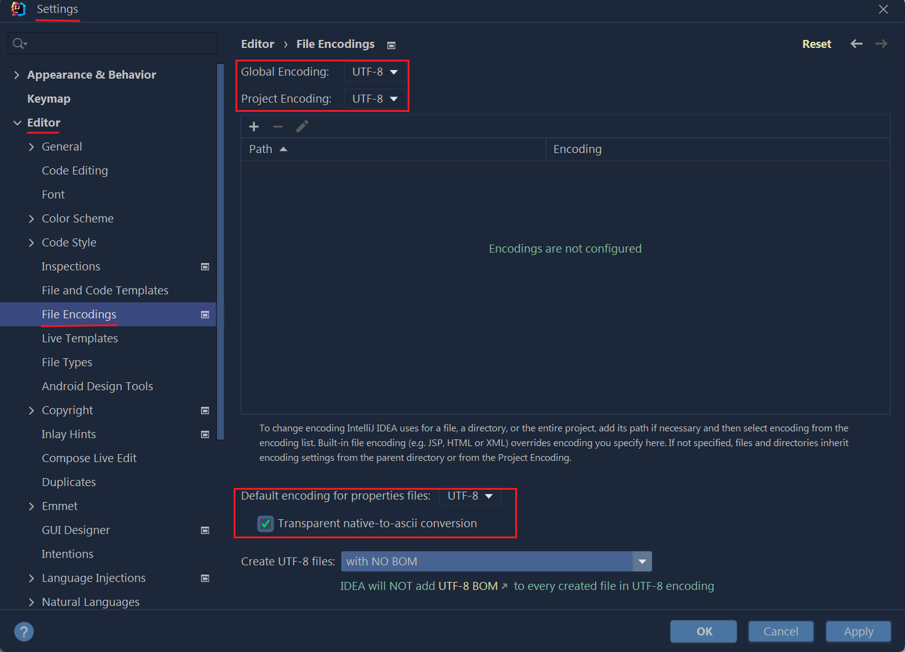
3. 注解生效激活
   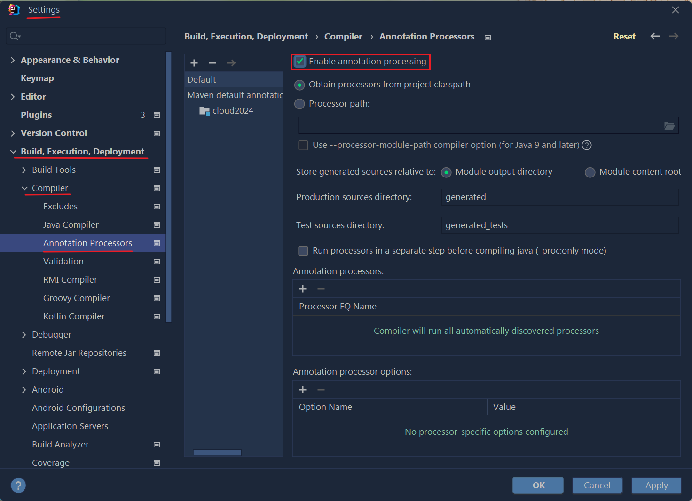
4. java编译版本选8
   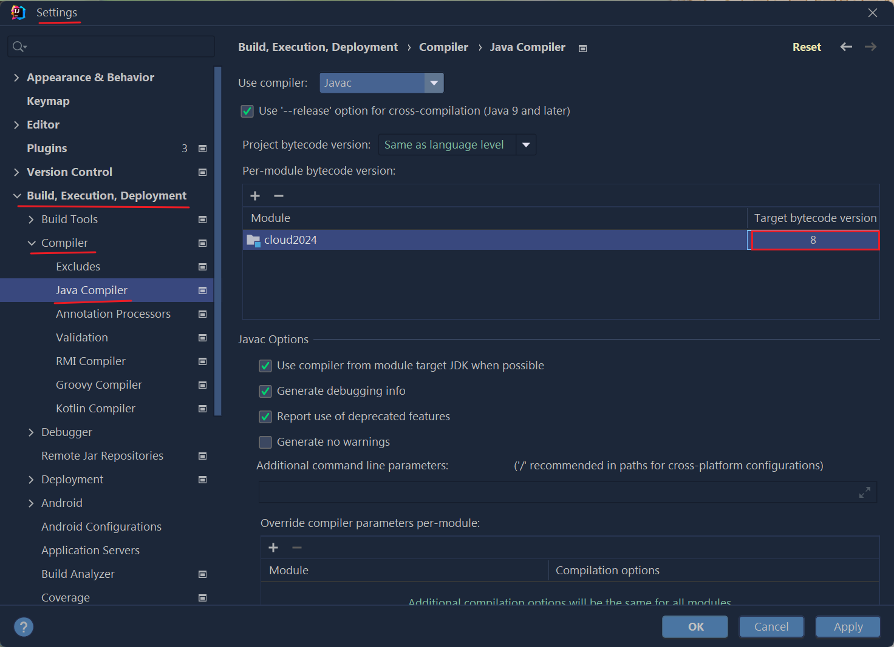


#### (2)父工程POM

```xml
<?xml version="1.0" encoding="UTF-8" ?>

<project xmlns="http://maven.apache.org/POM/4.0.0" xmlns:xsi="http://www.w3.org/2001/XMLSchema-instance"
         xsi:schemaLocation="http://maven.apache.org/POM/4.0.0 http://maven.apache.org/xsd/maven-4.0.0.xsd">
  <modelVersion>4.0.0</modelVersion>

  <groupId>com.atguigu.springcloud</groupId>
  <artifactId>cloud2024</artifactId>
  <version>1.0-SNAPSHOT</version>
  <packaging>pom</packaging>

  <!-- 统一管理jar包版本 -->
  <properties>
    <project.build.sourceEncoding>UTF-8</project.build.sourceEncoding>
    <maven.compiler.source>1.8</maven.compiler.source>
    <maven.compiler.target>1.8</maven.compiler.target>
    <junit.version>4.12</junit.version>
    <log4j.version>1.2.17</log4j.version>
    <lombok.version>1.16.18</lombok.version>
    <mysql.version>5.1.47</mysql.version>
    <druid.version>1.1.16</druid.version>
    <mybatis.spring.boot.version>1.3.0</mybatis.spring.boot.version>
  </properties>

  <!-- 子模块继承之后，提供作用：锁定版本+子modlue不用写groupId和version  -->
  <dependencyManagement>
    <dependencies>
      <!--spring boot 2.2.2-->
      <dependency>
        <groupId>org.springframework.boot</groupId>
        <artifactId>spring-boot-dependencies</artifactId>
        <version>2.2.2.RELEASE</version>
        <type>pom</type>
        <scope>import</scope>
      </dependency>
      <!--spring cloud Hoxton.SR1-->
      <dependency>
        <groupId>org.springframework.cloud</groupId>
        <artifactId>spring-cloud-dependencies</artifactId>
        <version>Hoxton.SR1</version>
        <type>pom</type>
        <scope>import</scope>
      </dependency>
      <!--spring cloud alibaba 2.1.0.RELEASE-->
      <dependency>
        <groupId>com.alibaba.cloud</groupId>
        <artifactId>spring-cloud-alibaba-dependencies</artifactId>
        <version>2.1.0.RELEASE</version>
        <type>pom</type>
        <scope>import</scope>
      </dependency>
      <dependency>
        <groupId>mysql</groupId>
        <artifactId>mysql-connector-java</artifactId>
        <version>${mysql.version}</version>
      </dependency>
      <dependency>
        <groupId>com.alibaba</groupId>
        <artifactId>druid</artifactId>
        <version>${druid.version}</version>
      </dependency>
      <dependency>
        <groupId>org.mybatis.spring.boot</groupId>
        <artifactId>mybatis-spring-boot-starter</artifactId>
        <version>${mybatis.spring.boot.version}</version>
      </dependency>
      <dependency>
        <groupId>junit</groupId>
        <artifactId>junit</artifactId>
        <version>${junit.version}</version>
      </dependency>
      <dependency>
        <groupId>log4j</groupId>
        <artifactId>log4j</artifactId>
        <version>${log4j.version}</version>
      </dependency>
      <dependency>
        <groupId>org.projectlombok</groupId>
        <artifactId>lombok</artifactId>
        <version>${lombok.version}</version>
        <optional>true</optional>
      </dependency>
    </dependencies>
  </dependencyManagement>

  <build>
    <plugins>
      <plugin>
        <groupId>org.springframework.boot</groupId>
        <artifactId>spring-boot-maven-plugin</artifactId>
        <configuration>
<!--          <fork>true</fork>-->
          <executable>true</executable> <!-- 使用 executable 标签替代 -->
          <addResources>true</addResources>
        </configuration>
      </plugin>
    </plugins>
  </build>

</project>
```


#### (3)Maven细节

##### dependencyManagement

> Maven使用dependencyManagement元素来提供了一种管理依赖版本号的方式。
> 通常会在一个组织或者项目的最顶层的父POM中看到dependencyManagement元素。

使用pom.xml中的dependencyManagement元素能让所有在子项目中引用一个依赖而不用显式的列出版本号。 Maven会沿着父子层次向上走，直到找到一个拥有dependencyManagement元素的项目，然后它就会使用这个 dependencyManagement元素中指定的版本号。


**好处**：如果有多个子项目都引用同一样依赖，则可以避免在每个使用的子项目里都声明一个版本号，这样当想升级或切换到另一个版本时，只需要在顶层父容器里更新，而不需要一个一个子项目的修改；另外如果某个子项目需要另外的一个版本，只需要声明version就可。


##### maven中跳过单元测试

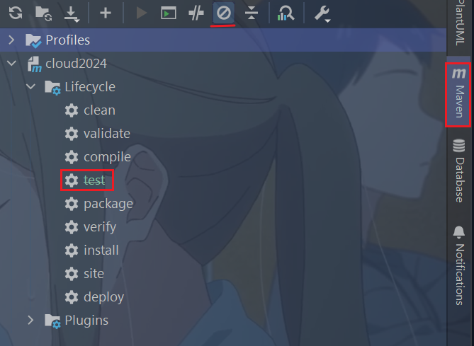


> 父工程创建完成执行mvn:install将父工程发布到仓库方便子工程继承
>


### 2. Rest微服务工程构建

#### (1)提供者模块

> cloud-provider-payment8001
>
> 微服务提供者支付Module模块

1. 建module

2. 改POM

   ```xml
   <project xmlns="http://maven.apache.org/POM/4.0.0"
            xmlns:xsi="http://www.w3.org/2001/XMLSchema-instance"
            xsi:schemaLocation="http://maven.apache.org/POM/4.0.0 http://maven.apache.org/xsd/maven-4.0.0.xsd">
       <modelVersion>4.0.0</modelVersion>
       <parent>
           <groupId>com.atguigu.springcloud</groupId>
           <artifactId>cloud2024</artifactId>
           <version>1.0-SNAPSHOT</version>
       </parent>
   
       <artifactId>cloud-provider-payment8001</artifactId>
   
       <dependencies>
   
           <dependency>
               <groupId>org.springframework.boot</groupId>
               <artifactId>spring-boot-starter-web</artifactId>
           </dependency>
           <dependency>
               <groupId>org.springframework.boot</groupId>
               <artifactId>spring-boot-starter-actuator</artifactId>
           </dependency>
           <dependency>
               <groupId>org.mybatis.spring.boot</groupId>
               <artifactId>mybatis-spring-boot-starter</artifactId>
           </dependency>
           <dependency>
               <groupId>com.alibaba</groupId>
               <artifactId>druid-spring-boot-starter</artifactId>
               <version>1.1.10</version>
           </dependency>
           <!--mysql-connector-java-->
           <dependency>
               <groupId>mysql</groupId>
               <artifactId>mysql-connector-java</artifactId>
           </dependency>
           <!--jdbc-->
           <dependency>
               <groupId>org.springframework.boot</groupId>
               <artifactId>spring-boot-starter-jdbc</artifactId>
           </dependency>
           <dependency>
               <groupId>org.springframework.boot</groupId>
               <artifactId>spring-boot-devtools</artifactId>
               <scope>runtime</scope>
               <optional>true</optional>
           </dependency>
           <dependency>
               <groupId>org.projectlombok</groupId>
               <artifactId>lombok</artifactId>
               <optional>true</optional>
           </dependency>
           <dependency>
               <groupId>org.springframework.boot</groupId>
               <artifactId>spring-boot-starter-test</artifactId>
               <scope>test</scope>
           </dependency>
       </dependencies>
   
   </project>
   
   
   ```

   

3. 写YML

   ```yml
   server:
     port: 8001
   
   spring:
     application:
       name: cloud-payment-service
     datasource:
       type: com.alibaba.druid.pool.DruidDataSource            # 当前数据源操作类型
       driver-class-name: org.gjt.mm.mysql.Driver              # mysql驱动包
       url: jdbc:mysql://localhost:3306/db2019?useUnicode=true&characterEncoding=utf-8&useSSL=false
       username: root
       password: isjhd
   
   mybatis:
     mapperLocations: classpath:mapper/*.xml
     type-aliases-package: com.atguigu.springcloud.entities    # 所有Entity别名类所在包
   
   ```

   

4. 主启动

   ```java
   @SpringBootApplication
   public class PaymentMain8001 {
       public static void main(String[] args) {
           SpringApplication.run(PaymentMain8001.class, args);
       }
   }
   ```

   

5. 业务类

   - 建表SQL
   - entities
   - dao
   - service
   - controller


6. 测试类


#### (2)热部署 Devtools

> 热部署是一种在不重启应用程序的情况下更新代码或配置的技术。它在开发过程中非常有用，因为它可以显著减少重新启动应用程序所需的时间和资源。热部署的实现依赖于Java的类加载机制和自定义类加载器。

1. Adding devtools to your project

   ```xml
   <dependency>
       <groupId>org.springframework.boot</groupId>
       <artifactId>spring-boot-devtools</artifactId>
       <scope>runtime</scope>
       <optional>true</optional>
   </dependency>
   ```

   

2. Adding plugin to your pom.xml
   聚合进父类总工程的pom.xml里

   ```xml
   <build>
       <plugins>
         <plugin>
           <groupId>org.springframework.boot</groupId>
           <artifactId>spring-boot-maven-plugin</artifactId>
           <configuration>
             <!--<fork>true</fork>-->
             <executable>true</executable> <!-- 使用 executable 标签替代fork -->
             <addResources>true</addResources>
           </configuration>
         </plugin>
       </plugins>
     </build>
   ```

3. Enabling automatic build
   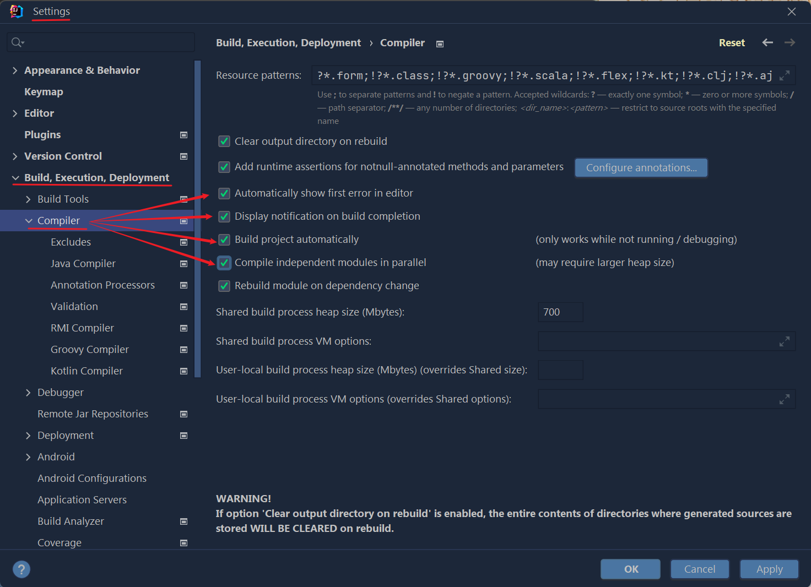

4. Update the value of
   press **ctrl + shift + Alt + /** and search for the registry. ln the Registry，enable：
   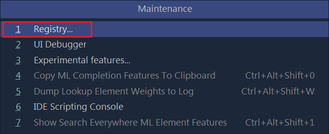

   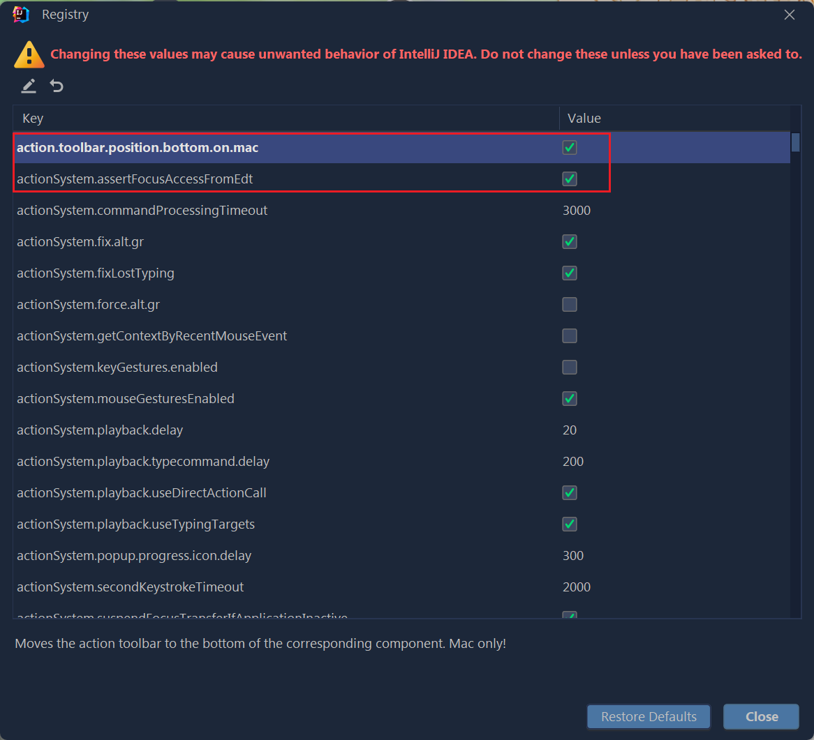

5. 重启IDEA


#### (3)消费者模块

> cloud-consumer-order80
> 微服务消费者订单Module模块

1. 建module

2. 改POM

   ```xml
   <project xmlns="http://maven.apache.org/POM/4.0.0" xmlns:xsi="http://www.w3.org/2001/XMLSchema-instance"
            xsi:schemaLocation="http://maven.apache.org/POM/4.0.0 http://maven.apache.org/maven-v4_0_0.xsd">
       <modelVersion>4.0.0</modelVersion>
       <parent>
           <groupId>com.atguigu.springcloud</groupId>
           <artifactId>cloud2024</artifactId>
           <version>1.0-SNAPSHOT</version>
       </parent>
   
       <artifactId>cloud-consumer-order80</artifactId>
   
       <dependencies>
           <dependency>
               <groupId>org.springframework.boot</groupId>
               <artifactId>spring-boot-starter-web</artifactId>
           </dependency>
           <dependency>
               <groupId>org.springframework.boot</groupId>
               <artifactId>spring-boot-starter-actuator</artifactId>
           </dependency>
   
           <dependency>
               <groupId>org.springframework.boot</groupId>
               <artifactId>spring-boot-devtools</artifactId>
               <scope>runtime</scope>
               <optional>true</optional>
           </dependency>
           <dependency>
               <groupId>org.projectlombok</groupId>
               <artifactId>lombok</artifactId>
               <optional>true</optional>
           </dependency>
           <dependency>
               <groupId>org.springframework.boot</groupId>
               <artifactId>spring-boot-starter-test</artifactId>
               <scope>test</scope>
           </dependency>
       </dependencies>
   </project>
   
   ```

   

3. 写YML

   ```yml
   server:
     port: 80
   ```

   

4. 主启动

   ```java
   @SpringBootApplication
   public class OrderMain80 {
       public static void main(String[] args) {
           SpringApplication.run(OrderMain80.class, args);
       }
   }
   ```

   

5. 业务类

6. 测试


#### (4)工程重构

> 问题：系统中有重复部分，重构

1. 新建工程	cloud-api-commons

2. 改POM

   ```xml
   <project xmlns="http://maven.apache.org/POM/4.0.0" xmlns:xsi="http://www.w3.org/2001/XMLSchema-instance"
            xsi:schemaLocation="http://maven.apache.org/POM/4.0.0 http://maven.apache.org/maven-v4_0_0.xsd">
       <modelVersion>4.0.0</modelVersion>
       <parent>
           <groupId>com.atguigu.springcloud</groupId>
           <artifactId>cloud2024</artifactId>
           <version>1.0-SNAPSHOT</version>
       </parent>
       <artifactId>cloud-api-commons</artifactId>
   
       <dependencies>
           <dependency>
               <groupId>org.springframework.boot</groupId>
               <artifactId>spring-boot-devtools</artifactId>
               <scope>runtime</scope>
               <optional>true</optional>
           </dependency>
           <dependency>
               <groupId>org.projectlombok</groupId>
               <artifactId>lombok</artifactId>
               <optional>true</optional>
           </dependency>
           <dependency>
               <groupId>cn.hutool</groupId>
               <artifactId>hutool-all</artifactId>
               <version>5.1.0</version>
           </dependency>
       </dependencies>
   
   </project>
   ```

   

3. 各项目公共部分 entities

4. maven 命令 clean install

5. 改造提供者模块和消费者模块

   删除各自的原先有过的entities文件夹

   各自粘贴POM内容

   ```xml
   <dependency>
        <groupId>com.atguigu.springcloud</groupId>
        <artifactId>cloud-api-commons</artifactId>
        <version>${project.version}</version>
   </dependency>
   ```

   

## 五、Eureka服务注册与发现

### 1. Eureka基础知识

#### (1)什么是服务治理？

> 在传统的rpc远程调用框架中，管理每个服务与服务之间依赖关系比较复杂，管理比较复杂，所以需要使用服务治理，管理服务于服务之间依赖关系，可以实现服务调用、负载均衡、容错等，实现服务发现与注册。
>


#### (2)什么是服务注册与发现？

> Eureka采用了CS的设计架构，Eureka Server作为服务注册功能的服务器，它是服务注册中心。而系统中的其他微服务，使用Eureka的客户端连接到Eureka Server并维持心跳连接。这样系统的维护人员就可以通过Eureka Server来监控系统中各个微服务是否正常运行。
>
> 在服务注册与发现中，有一个注册中心。当服务器启动的时候，会把当前自己服务器的信息比如服务地址通讯地址等以别名方式注册到注册中心上。另一方(消费者|服务提供者)，以该别名的方式去注册中心上获取到实际的服务通讯地址，然后再实现本地RPC调用RPC远程调用框架核心设计思想：在于注册中心，因为使用注册中心管理每个服务与服务之间的一个依赖关系(服务治理概念)。在任何rpc远程框架中，都会有一个注册中心(存放服务地址相关信息(接口地址))

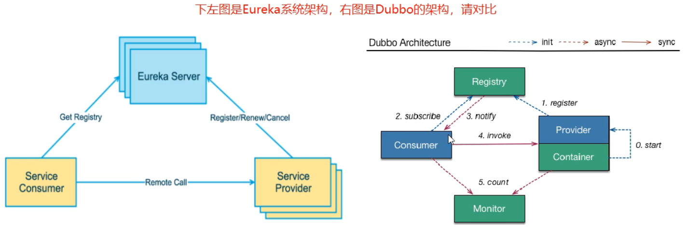


#### (3)Eureka包含两个组件：Eureka Server和Eureka Client

**Eureka Server**提供服务注册服务
各个微服务节点通过配置启动后，会在Eureka Server中进行注册，这样Eureka Server中的服务注册表中将会存储所有可用服务节点的信息，服务节点的信息可以在界面中直观看到。 

**Eureka Client**通过注册中心进行访问
是一个Java客户端，用于简化Eureka Server的交互，客户端同时也具备一个内置的、使用轮询(round-robin)负载算法的负载均衡器。在应用启动后，将会向Eureka Server发送心跳(默认周期为30秒)。如果Eureka Server在多个心跳周期内没有接收到某个节点的心跳，Eureka Server将会从服务注册表中把这个服务节点移除（默认90秒）


### 2. 单机Eureka构建步骤

1. 建Module

2. 改POM

   ```xml
   <project xmlns="http://maven.apache.org/POM/4.0.0" xmlns:xsi="http://www.w3.org/2001/XMLSchema-instance"
            xsi:schemaLocation="http://maven.apache.org/POM/4.0.0 http://maven.apache.org/xsd/maven-4.0.0.xsd">
       <modelVersion>4.0.0</modelVersion>
       <parent>
           <groupId>com.atguigu.springcloud</groupId>
           <artifactId>cloud2024</artifactId>
           <version>1.0-SNAPSHOT</version>
       </parent>
   
       <artifactId>cloud-eureka-server7001</artifactId>
   
       <dependencies>
           <!--eureka-server-->
           <dependency>
               <groupId>org.springframework.cloud</groupId>
               <artifactId>spring-cloud-starter-netflix-eureka-server</artifactId>
           </dependency>
           <!-- 引入自己定义的api通用包，可以使用Payment支付Entity -->
           <dependency>
               <groupId>com.atguigu.springcloud</groupId>
               <artifactId>cloud-api-commons</artifactId>
               <version>${project.version}</version>
           </dependency>
           <!--boot web actuator-->
           <dependency>
               <groupId>org.springframework.boot</groupId>
               <artifactId>spring-boot-starter-web</artifactId>
           </dependency>
           <dependency>
               <groupId>org.springframework.boot</groupId>
               <artifactId>spring-boot-starter-actuator</artifactId>
           </dependency>
           <!--一般通用配置-->
           <dependency>
               <groupId>org.springframework.boot</groupId>
               <artifactId>spring-boot-devtools</artifactId>
               <scope>runtime</scope>
               <optional>true</optional>
           </dependency>
           <dependency>
               <groupId>org.projectlombok</groupId>
               <artifactId>lombok</artifactId>
           </dependency>
           <dependency>
               <groupId>org.springframework.boot</groupId>
               <artifactId>spring-boot-starter-test</artifactId>
               <scope>test</scope>
           </dependency>
           <dependency>
               <groupId>junit</groupId>
               <artifactId>junit</artifactId>
           </dependency>
       </dependencies>
   
   
   </project>
   
   ```

   

3. 写YML

   ```yml
   server:
     port: 7001
   
   eureka:
     instance:
       hostname: localhost #eureka服务端的实例名称
     client:
       #false表示不向注册中心注册自己
       register-with-eureka: false
       #false表示自己端就是注册中心，我的职责就是维护服务实例，并不需要去检索服务
       fetch-registry: false
       service-url:
       #设置与Eureka Server交互的地址查询服务和注册服务都需要依赖这个地址
         defaultZone: http://${eureka.instance.hostname}:${server.port}/eureka/
   ```

   

4. 主启动

   ```java
   @SpringBootApplication
   @EnableEurekaServer
   public class EurekaMain7001 {
       public static void main(String[] args) {
           SpringApplication.run(EurekaMain7001.class, args);
       }
   }
   ```

   

5. 测试


### 3. 服务提供者provider入住

> Eureka Client端cloud-provider-payment8001
>
> 将注册进Eureka Server成为服务提供者provider，类似尚硅谷学校对外提供授课服务

1. 改POM

   ```xml
   <!--eureka-client-->
   <dependency>
     <groupId>org.springframework.cloud</groupId>
     <artifactId>spring-cloud-starter-netflix-eureka-client</artifactId>
   </dependency>
   ```

   

2. 写YML

   ```yml
   eureka:
     client:
       #表示是否将自己注册进EurekaServer默认为true
       register-with-eureka: true
       #是否从EurekaServer抓取已有的注册信息，默认为true。单节点无所谓，集群必须设置为ture才能配合ribbon使用负载均衡
       fetchRegistry: true
       service-url:
         defaultZone: http://localhost:7001/eureka
   ```

   

3. 主启动

   ```java
   @SpringBootApplication
   @EnableEurekaClient
   public class PaymentMain8001 {
       public static void main(String[] args) {
           SpringApplication.run(PaymentMain8001.class, args);
       }
   }
   ```

   

4. 测试
   微服务注册名配置说明
   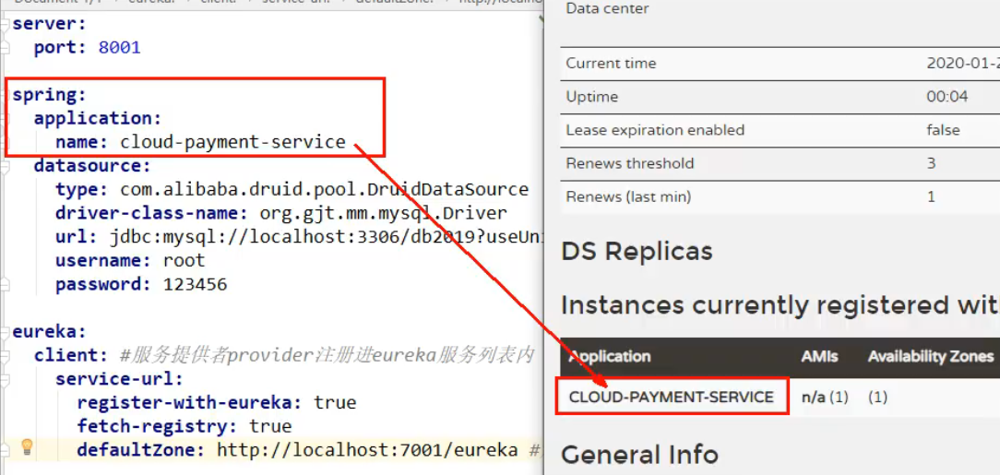

   

### 4. 服务消费者consumer入住

> Eureka Client端cloud-consumer-order80
>
> 将注册进Eureka Server成为服务消费者consumer，类似来尚硅谷上课消费的各位同学

1. POM

   ```xml
   <!--eureka-client-->
   <dependency>
       <groupId>org.springframework.cloud</groupId>
       <artifactId>spring-cloud-starter-netflix-eureka-client</artifactId>
   </dependency>
   ```

   

2. YML

   ```yml
   server:
     port: 80
   
   spring:
     application:
       name: cloud-payment-service
   
   eureka:
     client:
       #表示是否将自己注册进EurekaServer默认为true
       register-with-eureka: true
       #是否从EurekaServer抓取已有的注册信息，默认为true。单节点无所谓，集群必须设置为ture才能配合ribbon使用负载均衡
       fetchRegistry: true
       service-url:
         defaultZone: http://localhost:7001/eureka
   ```

   

3. 主启动

   ```java
   @SpringBootApplication
   @EnableEurekaClient
   public class OrderMain80 {
       public static void main(String[] args) {
           SpringApplication.run(OrderMain80.class, args);
       }
   }
   ```

   

4. 测试


### 5. 集群Eureka构建

#### (1)Eureka集群原理说明

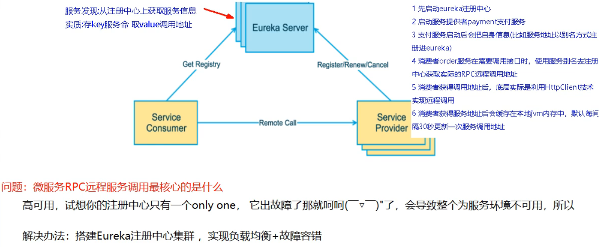


#### (2)Eureka Server集群环境构建步骤

1. 新建项目：参考cloud-eureka-server7001 新建cloud-eureka-server7002

2. 改POM

3. 修改映射文件
   找到C:\Windows\System32\drivers\etc路径下的hosts文件
   修改映射配置添加进hosts文件

   127.0.0.1       eureka7001.com
   127.0.0.1       eureka7002.com

4. 写YML
   7001

   ```yml
   server:
     port: 7001
   
   eureka:
     instance:
       hostname: eureka7001.com #eureka服务端的实例名称
     client:
       #false表示不向注册中心注册自己
       register-with-eureka: false
       #false表示自己端就是注册中心，我的职责就是维护服务实例，并不需要去检索服务
       fetch-registry: false
       service-url:
       #设置与Eureka Server交互的地址查询服务和注册服务都需要依赖这个地址
         defaultZone: http://eureka7002.com:7002/eureka/
   ```

   7002

   ```yml
   server:
     port: 7002
   
   eureka:
     instance:
       hostname: eureka7002.com #eureka服务端的实例名称
     client:
       #false表示不向注册中心注册自己
       register-with-eureka: false
       #false表示自己端就是注册中心，我的职责就是维护服务实例，并不需要去检索服务
       fetch-registry: false
       service-url:
       #设置与Eureka Server交互的地址查询服务和注册服务都需要依赖这个地址
         defaultZone: http://eureka7001.com:7001/eureka/
   ```

   

5. 主启动


#### (3)将服务端和客户端配置到集群

> 将服务端和客户端微服务发布到上面2台Eureka集群配置中
>

```yml
service-url:
  #defaultZone: http://localhost:7001/eureka
  defaultZone: http://eureka7001.com:7001/eureka,http://eureka7002.com:7002/eureka #集群版
```


#### (4)提供者集群环境构建

1. 新建项目：参考cloud-provider-payment8001 新建cloud-provider-payment8002

2. 改POM

3. 写YML

4. 主启动

5. 业务类

6. 修改8001/8002的Controller

   ```java
   @Value("${server.port}")
   private String serverPort;
   ```


##### 负载均衡

订单服务访问地址不能写死

```java
//public static final String PAYMENT_URL = "http://localhost:8001";
public static final String PAYMENT_URL = "http://CLOUD-PAYMENT-SERVICE";
```


使用@LoadBalanced注解赋予RestTemplate负载均衡的能力

```java
@Configuration
public class ApplicationContextConfig {

    @Bean
    @LoadBalanced
    public RestTemplate getRestTemplate() {
        return new RestTemplate();
    }

}
```


### 6. actuator微服务信息完善

#### (1)主机名称：服务名称修改

修改cloud-provider-payment8001

```yml
eureka:
  instance:
      instance-id: payment8001
```

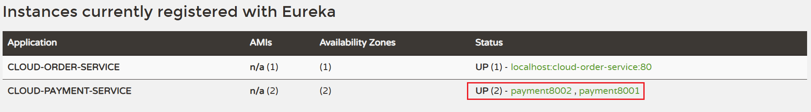


#### (2)访问信息有IP信息提示

```yml
eureka:
  instance:
      prefer-ip-address: true #访问路径可以显示IP地址
```

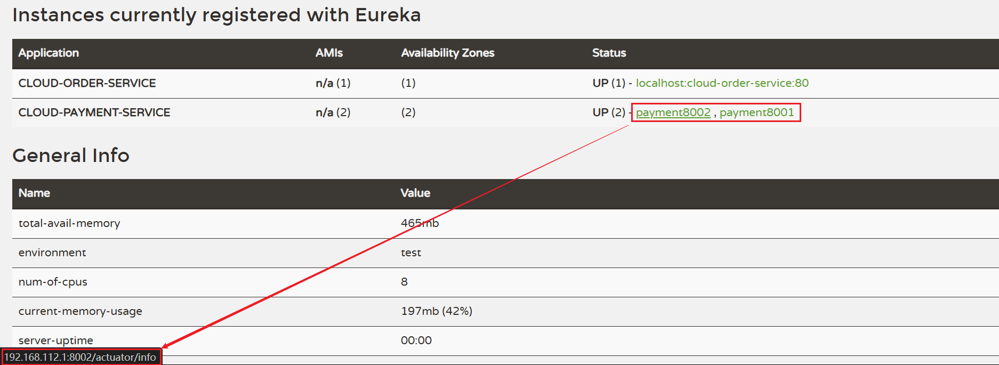


### 7. 服务发现Discovery

> 对于注册进eureka里面的微服务，可以通过服务发现来获得该服务的信息
>

修改cloud-provider-payment8001的Controller

```java
@Resource
private DiscoveryClient discoveryClient;

@GetMapping(value = "/payment/discovery")
public Object discovery() {
    List<String> services = discoveryClient.getServices();
    for(String element : services) {
        log.info("element: " + element);
    }

    List<ServiceInstance> instances = discoveryClient.getInstances("CLOUD-PAYMENT-SERVICE");
    for(ServiceInstance instance : instances) {
        log.info(instance.getServiceId() + "\t" + instance.getHost() + "\t" +
                 instance.getPort() + "\t" + instance.getUri());
    }

    return this.discoveryClient;
}
```


8001主启动类添加@EnableDiscoveryClient

```java
@SpringBootApplication
@EnableEurekaClient
@EnableDiscoveryClient
public class PaymentMain8001 {
    public static void main(String[] args) {
        SpringApplication.run(PaymentMain8001.class, args);
    }
}
```


### 8. Eureka自我保护

**概述**

> 保护模式主要用于一组客户端和Eureka Server之间存在网络分区场景下的保护。一旦进入保护模式，Eureka Server将会尝试保护其服务注册表中的信息，不再删除服务注册表中的数据，也就是不会注销任何微服务。


如果在Eureka Server的首页看到以下这段提示，则说明Eureka进入了保护模式：

> EMERGENCY!EUREKAMAYBEINCORRECTLYCLAIMINGINSTANCESAREUPWHENTHEY'RENOT.
>
> RENEWALSARELESSERTHANTHRESHOLDANDHENCETHEINSTANCESARENOTBEINGEXPIREDJUSTTOBESAFE


**一句话**：某时刻某一个微服务不可用了，Eureka不会立刻清理，依旧会对该微服务的信息进行保存


**为什么会产生Eureka自我保护机制？**

> 为了防止当Eureka Client可以正常运行，但是与Eureka Server网络不通情况下，Eureka Server不会立刻将Eureka Client服务剔除


**什么是自我保护模式？**

> 默认情况下，如果Eureka Server在一定时间内没有接收到某个微服务实例的心跳，Eureka Server将会注销该实例(默认90秒)。但是当网络分区故障发生(延时、卡顿、拥挤)时，微服务与Eureka Server之间无法正常通信，以上行为可能变得非常危险了一一因为微服务本身其实是健康的，此时本不应该注销这个微服务。Eureka通过“自我保护模式”来解决这个问题一一当Eureka Server节点在短时间内丢失过多客户端时(可能发生了网络分区故障)，那么这个节点就会进入自我保护模式。


在自我保护模式中，EurekaServer会保护服务注册表中的信息，不再注销任何服务实例。

它的设计哲学就是宁可保留错误的服务注册信息，也不盲目注销任何可能健康的服务实例。一句话讲解：好死不如赖活着


#### 禁止自我保护

**注册中心eureka Server端7001**

出厂默认。自我保护机制是开启的

```yml
eureka:
	server:
		#关闭自我保护机制，保证不可用服务被及时踢除
    	enable-self-preservation: false
    	eviction-interval-timer-in-ms: 2000
```


**生产者客户端eureka Client端8001**

```yml
eureka:
	instance:
		#Eureka客户端向服务端发送心跳的时间间隔，单位为秒(默认是30秒)
		lease-renewal-interval-in-seconds: 1
		#Eureka服务端在收到最后一次心跳后等待时间上限，单位为秒（默认是90秒），超时将剔除服务
		lease-expiration-duration-in-seconds: 2
```


## 六、Zookeeper服务注册与发现

### (1)下载和安装Zookeeper

1. 首先，从Zookeeper的官方网站或其他可信来源下载Zookeeper的压缩包。可以使用以下命令直接在Linux中下载：
   wget https://archive.apache.org/dist/zookeeper/zookeeper-3.4.9/zookeeper-3.4.9.tar.gz

2. 下载完成后，将压缩包解压到指定目录：

   tar -zxvf zookeeper-3.4.9.tar.gz -C /opt/

3. Zookeeper的配置文件位于*conf*目录下。默认情况下，*conf*目录下没有*zoo.cfg*文件，但提供了一个模板文件*zoo_sample.cfg*。我们可以将其重命名为*zoo.cfg*：
   cd /opt/zookeeper-3.4.9/conf
   mv zoo_sample.cfg zoo.cfg

4. 编辑*zoo.cfg*文件，配置Zookeeper的相关参数：

   ```
   tickTime=2000
   initLimit=10
   syncLimit=5
   dataDir=/opt/zookeeper-3.4.9/data
   clientPort=2181
   maxClientCnxns=60
   autopurge.snapRetainCount=3
   autopurge.purgeInterval=1
   ```

5. 创建数据存储目录：
   mkdir /opt/zookeeper-3.4.9/data


**启动和停止Zookeeper**

cd /opt/zookeeper-3.4.9/

启动：bin/zkServer.sh start

查看状态：bin/zkServer.sh status

停止：bin/zkServer.sh stop


### (2)服务的提供者

1. 新建cloud-provider-payment8004

2. POM

   ```xml
   <project xmlns="http://maven.apache.org/POM/4.0.0" xmlns:xsi="http://www.w3.org/2001/XMLSchema-instance"
            xsi:schemaLocation="http://maven.apache.org/POM/4.0.0 http://maven.apache.org/maven-v4_0_0.xsd">
       <modelVersion>4.0.0</modelVersion>
       <parent>
           <groupId>com.atguigu.springcloud</groupId>
           <artifactId>cloud2024</artifactId>
           <version>1.0-SNAPSHOT</version>
       </parent>
       <artifactId>cloud-provider-payment8004</artifactId>
   
       <dependencies>
           <!-- SpringBoot整合Web组件 -->
           <dependency>
               <groupId>org.springframework.boot</groupId>
               <artifactId>spring-boot-starter-web</artifactId>
           </dependency>
           <dependency><!-- 引入自己定义的api通用包，可以使用Payment支付Entity -->
               <groupId>com.atguigu.springcloud</groupId>
               <artifactId>cloud-api-commons</artifactId>
               <version>${project.version}</version>
           </dependency>
           <!-- SpringBoot整合zookeeper客户端 -->
           <dependency>
               <groupId>org.springframework.cloud</groupId>
               <artifactId>spring-cloud-starter-zookeeper-discovery</artifactId>
           </dependency>
           <dependency>
               <groupId>org.springframework.boot</groupId>
               <artifactId>spring-boot-devtools</artifactId>
               <scope>runtime</scope>
               <optional>true</optional>
           </dependency>
           <dependency>
               <groupId>org.projectlombok</groupId>
               <artifactId>lombok</artifactId>
               <optional>true</optional>
           </dependency>
           <dependency>
               <groupId>org.springframework.boot</groupId>
               <artifactId>spring-boot-starter-test</artifactId>
               <scope>test</scope>
           </dependency>
       </dependencies>
   
   
   </project>
   
   ```

   

3. YML

   ```yml
   #8004表示注册到zookeeper服务器的支付服务提供者端口号
   server:
     port: 8004
   
   #服务别名----注册zookeeper到注册中心名称
   spring:
     application:
       name: cloud-provider-payment
     cloud:
       zookeeper:
         connect-string: 192.168.13.129:2181
   ```

   

4. 主启动类

   ```java
   @SpringBootApplication
   @EnableDiscoveryClient //该注解用于向使用consul或者zookeeper作为注册中心时注册服务
   public class PaymentMain8004 {
       public static void main(String[] args) {
           SpringApplication.run(PaymentMain8004.class, args);
       }
   }
   
   ```

   

5. Controller

   ```java
   @RestController
   @Slf4j
   public class PaymentController {
   
       @Value("${server.port}")
       private String serverPort;
   
       @RequestMapping(value = "/payment/zk")
       public String paymentzk() {
           return "springCloud with zookeeper: " + serverPort +
                   "\t" + UUID.randomUUID().toString();
       }
   }
   ```

   

6. 启动8004注册进zookeeper
   ./zkServer.sh start
   ./zkCli.sh
   **启动后的问题**：自己安装的版本和服务器的版本不一样
   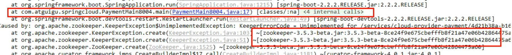

   ```xml
   <!-- SpringBoot整合zookeeper客户端 -->
   <dependency>
       <groupId>org.springframework.cloud</groupId>
       <artifactId>spring-cloud-starter-zookeeper-discovery</artifactId>
       <!--先排除自带的zookeeper3.5.3-->
       <exclusions>
           <exclusion>
               <groupId>org.apache.zookeeper</groupId>
               <artifactId>zookeeper</artifactId>
           </exclusion>
           <exclusion>
               <groupId>org.slf4j</groupId>
               <artifactId>slf4j-log4j12</artifactId>
           </exclusion>
       </exclusions>
   </dependency>
   <!--添加zookeeper3.4.9版本-->
   <dependency>
       <groupId>org.apache.zookeeper</groupId>
       <artifactId>zookeeper</artifactId>
       <version>3.4.9</version>
   </dependency>
   ```

   

7. 测试
   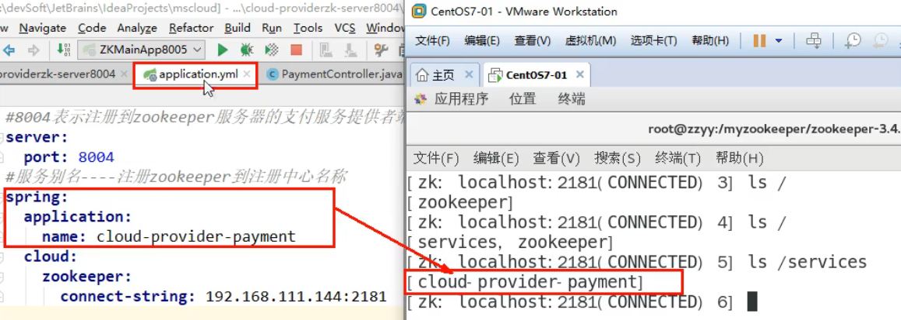


> zookeeper是临时节点
>


### (3)服务消费者

1. 新建cloud-consumerzk-order80

2. POM

   ```xml
   <project xmlns="http://maven.apache.org/POM/4.0.0" xmlns:xsi="http://www.w3.org/2001/XMLSchema-instance"
            xsi:schemaLocation="http://maven.apache.org/POM/4.0.0 http://maven.apache.org/maven-v4_0_0.xsd">
       <modelVersion>4.0.0</modelVersion>
       <parent>
           <groupId>com.atguigu.springcloud</groupId>
           <artifactId>cloud2024</artifactId>
           <version>1.0-SNAPSHOT</version>
       </parent>
       <artifactId>cloud-consumerzk-order80</artifactId>
   
       <dependencies>
           <!-- SpringBoot整合Web组件 -->
           <dependency>
               <groupId>org.springframework.boot</groupId>
               <artifactId>spring-boot-starter-web</artifactId>
           </dependency>
           <dependency><!-- 引入自己定义的api通用包，可以使用Payment支付Entity -->
               <groupId>com.atguigu.springcloud</groupId>
               <artifactId>cloud-api-commons</artifactId>
               <version>${project.version}</version>
           </dependency>
           <!-- SpringBoot整合zookeeper客户端 -->
           <dependency>
               <groupId>org.springframework.cloud</groupId>
               <artifactId>spring-cloud-starter-zookeeper-discovery</artifactId>
               <!--先排除自带的zookeeper3.5.3-->
               <exclusions>
                   <exclusion>
                       <groupId>org.apache.zookeeper</groupId>
                       <artifactId>zookeeper</artifactId>
                   </exclusion>
                   <exclusion>
                       <groupId>org.slf4j</groupId>
                       <artifactId>slf4j-log4j12</artifactId>
                   </exclusion>
               </exclusions>
           </dependency>
           <!--添加zookeeper3.4.9版本-->
           <dependency>
               <groupId>org.apache.zookeeper</groupId>
               <artifactId>zookeeper</artifactId>
               <version>3.4.9</version>
           </dependency>
           <dependency>
               <groupId>org.springframework.boot</groupId>
               <artifactId>spring-boot-devtools</artifactId>
               <scope>runtime</scope>
               <optional>true</optional>
           </dependency>
           <dependency>
               <groupId>org.projectlombok</groupId>
               <artifactId>lombok</artifactId>
               <optional>true</optional>
           </dependency>
           <dependency>
               <groupId>org.springframework.boot</groupId>
               <artifactId>spring-boot-starter-test</artifactId>
               <scope>test</scope>
           </dependency>
       </dependencies>
   </project>
   
   ```

   

3. YML

   ```yml
   #8004表示注册到zookeeper服务器的支付服务提供者端口号
   server:
     port: 80
   
   #服务别名----注册zookeeper到注册中心名称
   spring:
     application:
       name: cloud-consumer-payment
     cloud:
       zookeeper:
         connect-string: 192.168.13.129:2181
   ```

   

4. 主启动

   ```java
   @SpringBootApplication
   public class OrderZKMain80 {
       public static void main(String[] args) {
           SpringApplication.run(OrderZKMain80.class, args);
       }
   }
   ```

   

5. 业务类

   ```java
   @Configuration
   public class ApplicationContextConfig {
   
       @Bean
       @LoadBalanced
       public RestTemplate getRestTemplate(){
           return new RestTemplate();
       }
   
   }
   ```

   ```java
   @RestController
   @Slf4j
   public class OrderZKController {
   
       public static final String INVOKE_URL = "http://cloud-provider-payment";
   
       @Resource
       private RestTemplate restTemplate;
   
       @GetMapping(value = "/consumer/payment/zk")
       public String paymentInfo() {
           String result = restTemplate.getForObject(INVOKE_URL + "/payment/zk", String.class);
           return result;
       }
   
   }
   ```

   

6. 测试
   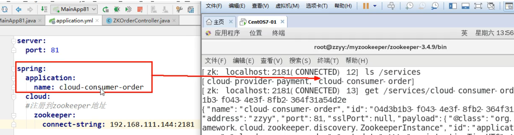


## 七、Consul服务注册与发现

Consul是什么？

> Consul是一套开源的分布式服务发现和配置管理系统，由HashiCorp公司用Go语言开发。
>
> 提供了微服务系统中的服务治理、配置中心、控制总线等功能。这些功能中的每一个都可以根据需要单独使用，也可以一起使用以构建全方位的服务网格，总之Consul提供了一种完整的服务网格解决方案。
>
> 它具有很多优点。包括：基于raft 协议，比较简洁；支持健康检查,同时支持HTTP和DNS 协议支持跨数据中心的WAN集群提供图形界面跨平台，支持Linux、Mac、Windows


Consul能干嘛？

> 服务发现、健康检测、KV存储、多数据中心、可视化Web界面


Consul去哪下？

> https://www.consul.io/downloads.html
>


### 1. 安装并运行Consul

官网安装说明

> https://learn.hashicorp.com/consul/getting-started/services
>

下载完成后解压，根据自己实际情况选择路径

解压完成后，在解压路径下的地址栏输入“cmd”，打开命令行窗口。并键入“consul”，若出现一连串英文则表示安装成功，见图二。

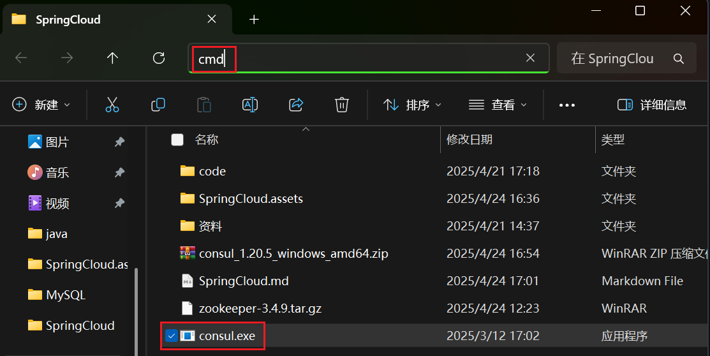

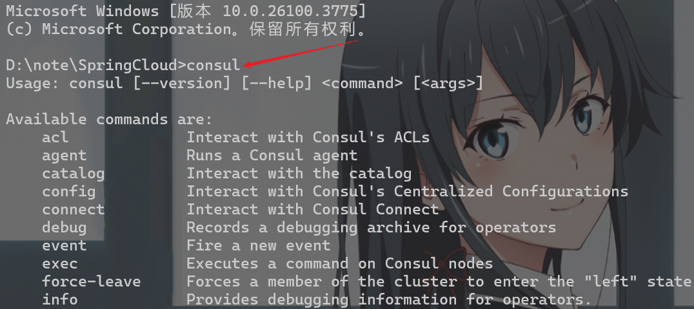


**启动**

> 命令 consul agent -dev 启动，看到Consul agent running! 启动成功
>


 通过以下地址可以访问 Consul 首页http://localhost:8500


### 2. 服务提供者

1. 新建Module支付服务provider8006

2. POM

   ```xml
   <!--SpringCloud consul-server -->
   <dependency>
       <groupId>org.springframework.cloud</groupId>
       <artifactId>spring-cloud-starter-consul-discovery</artifactId>
   </dependency>
   <!-- SpringBoot整合Web组件 -->
   <dependency>
       <groupId>org.springframework.boot</groupId>
       <artifactId>spring-boot-starter-web</artifactId>
   </dependency>	
   <dependency>
       <groupId>org.springframework.boot</groupId>
       <artifactId>spring-boot-starter-actuator</artifactId>
   </dependency>
   <!--日常通用jar包配置-->
   <dependency>
       <groupId>org.springframework.boot</groupId>
       <artifactId>spring-boot-devtools</artifactId>
       <scope>runtime</scope>
       <optional>true</optional>
   </dependency>
   <dependency>
       <groupId>org.projectlombok</groupId>
       <artifactId>lombok</artifactId>
       <optional>true</optional>
   </dependency>
   <dependency>
       <groupId>org.springframework.boot</groupId>
       <artifactId>spring-boot-starter-test</artifactId>
       <scope>test</scope>
   </dependency>
   <dependency>
       <groupId>cn.hutool</groupId>
       <artifactId>hutool-all</artifactId>
       <version>RELEASE</version>
       <scope>test</scope>
   </dependency>
   <dependency>
       <groupId>cn.hutool</groupId>
       <artifactId>hutool-all</artifactId>
       <version>RELEASE</version>
       <scope>test</scope>
   </dependency>
   ```

   

3. YML

   ```yml
   #consul服务端口号
   server:
     port: 8006
   
   spring:
     application:
       name: consul-provider-payment
   
   #consul注册中心地址
     cloud:
       consul:
         host: localhost
         port: 8500
         discovery:
           #hostname: 127.0.0.1
           service-name: ${spring.application.name}
   ```

   

4. 主启动类

   ```java
   @SpringBootApplication
   @EnableDiscoveryClient
   public class PaymentMain8006 {
       public static void main(String[] args) {
           SpringApplication.run(PaymentMain8006.class, args);
       }
   }
   ```

   

5. 业务类Controller

   ```java
   @RestController
   @Slf4j
   public class PaymentController {
   
       @Value("${server.port}")
       private String serverPort;
   
       @RequestMapping(value = "/payment/consul")
       public String paymentConsul() {
           return "springCloud with consul: " + serverPort +
                   "\t" + UUID.randomUUID().toString();
       }
   }
   
   ```

   

6. 测试


### 3. 服务消费者

1. 新建Module消费服务order80

2. POM

   ```xml
   <!--SpringCloud consul-server -->
   <dependency>
       <groupId>org.springframework.cloud</groupId>
       <artifactId>spring-cloud-starter-consul-discovery</artifactId>
   </dependency>
   <!-- SpringBoot整合Web组件 -->
   <dependency>
       <groupId>org.springframework.boot</groupId>
       <artifactId>spring-boot-starter-web</artifactId>
   </dependency>
   <dependency>
       <groupId>org.springframework.boot</groupId>
       <artifactId>spring-boot-starter-actuator</artifactId>
   </dependency>
   <!--日常通用jar包配置-->
   <dependency>
       <groupId>org.springframework.boot</groupId>
       <artifactId>spring-boot-devtools</artifactId>
       <scope>runtime</scope>
       <optional>true</optional>
   </dependency>
   <dependency>
       <groupId>org.projectlombok</groupId>
       <artifactId>lombok</artifactId>
       <optional>true</optional>
   </dependency>
   <dependency>
       <groupId>org.springframework.boot</groupId>
       <artifactId>spring-boot-starter-test</artifactId>
       <scope>test</scope>
   </dependency>
   <dependency>
       <groupId>cn.hutool</groupId>
       <artifactId>hutool-all</artifactId>
       <version>RELEASE</version>
       <scope>test</scope>
   </dependency>
   <dependency>
       <groupId>cn.hutool</groupId>
       <artifactId>hutool-all</artifactId>
       <version>RELEASE</version>
       <scope>test</scope>
   </dependency>
   ```

3. YML

   ```yml
   #consul服务端口号
   server:
     port: 80
   
   spring:
     application:
       name: consul-consumer-payment
   
     #consul注册中心地址
     cloud:
       consul:
         host: localhost
         port: 8500
         discovery:
           #hostname: 127.0.0.1
           service-name: ${spring.application.name}
   ```

   

4. 主启动类

   ```java
   @SpringBootApplication
   @EnableDiscoveryClient
   public class OrderConsulMain80 {
       public static void main(String[] args) {
           SpringApplication.run(OrderConsulMain80.class, args);
       }
   }
   ```

   

5. 配置Bean

   ```java
   @Configuration
   public class ApplicationContextConfig {
   
       @Bean
       @LoadBalanced
       public RestTemplate getRestTemplate() {
           return new RestTemplate();
       }
   
   }
   ```

   

6. Controller

   ```java
   @RestController
   @Slf4j
   public class OrderConsulController {
   
       public static final String INVOKE_URL = "http://consul-provider-payment";
   
       @Resource
       private RestTemplate restTemplate;
   
       @GetMapping(value = "/consumer/payment/consul")
       public String paymentInfo() {
           String result = restTemplate.getForObject(INVOKE_URL + "/payment/consul", String.class);
           return result;
       }
   
   }
   ```

   

7. 测试


### 4. 三个注册中心异同点

| 组件名    | 语言 | CAP  | 服务健康检查 | 对外暴露接口 | Spring Cloud集成 |
| --------- | ---- | ---- | ------------ | ------------ | ---------------- |
| Eureka    | Java | AP   | 可配支持     | HTTP         | 已集成           |
| Consul    | Go   | CP   | 支持         | HTTP/DNS     | 已集成           |
| Zookeeper | Java | CP   | 支持         | 客户端       | 已集成           |

#### (1)CAP

CAP理论关注粒度是数据，而不是整体系统设计的策略

- C：Consistency（强一致性） 
- A：Availability（可用性）
- P：Partition tolerance（分区容错性）
  **分区容错性**是指系统在出现网络分区（即部分节点之间的通信失败）时，仍然能够继续运行并提供服务。分区容错性要求系统能够处理网络分区带来的问题，例如数据同步和一致性问题。例如，当一个集群被分成两个分区时，每个分区仍然可以对外提供服务，但可能会导致数据不一致。

> CAP理论的核心是：一个分布式系统不可能同时很好的满足一致性，可用性和分区容错性这三个需求

因此，根据CAP原理将NoSQL数据库分成了满足CA原则、满足CP原则和满足AP原则三类：

CA－单点集群，满足一致性，可用性的系统，通常在可扩展性上不太强大。

CP－满足一致性，分区容忍必的系统，通常性能不是特别高。

AP－满足可用性，分区容忍性的系统，通常可能对一致性要求低一些。


#### (2)AP架构

> 当网络分区出现后，为了保证可用性，系统B可以返回旧值，保证系统的可用性。
>
> 结论：违背了一致性C的要求，只满足可用性和分区容错，即AP

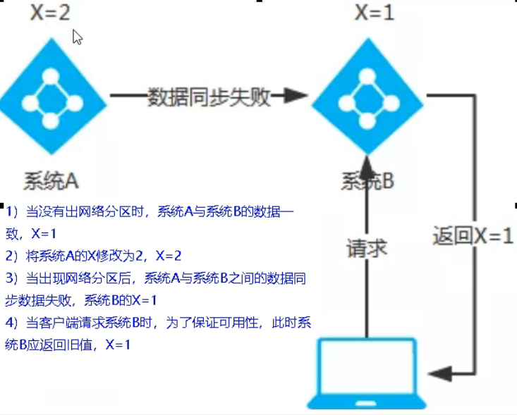


#### (3)CP架构

> 当网络分区出现后，为了保证一致性，就必须拒接请求，否则无法保证一致性
>
> 结论：违背了可用性A的要求，只满足一致性和分区容错，即CP

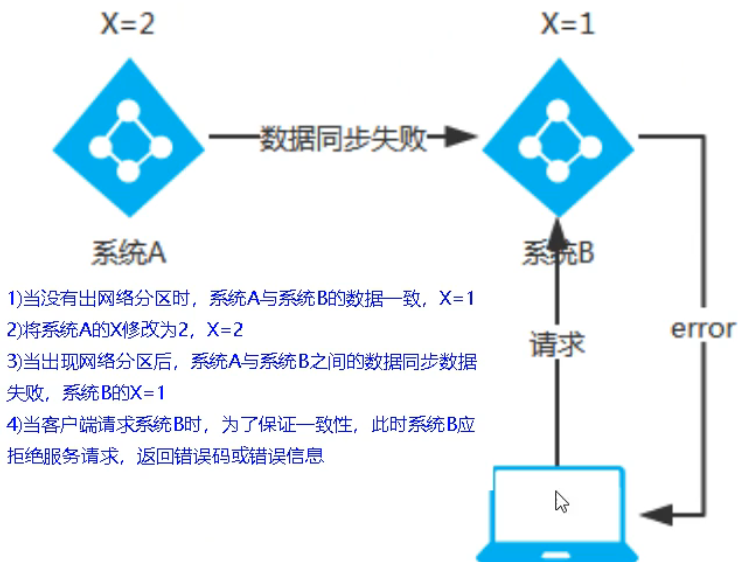


## 八、Ribbon负载均衡服务调用

### 1. Ribbon是什么？

> Spring Cloud Ribbon是基于Netflix Ribbon实现的一套客户端负载均衡的工具。
>
> 简单的说，Ribbon是Netflix发布的开源项目，主要功能是提供客户端的软件负载均衡算法和服务调用。Ribbon客户端组件提供一系列完善的配置项如连接超时，重试等。简单的说，就是在配置文件中列出Load Balancer（简称LB）后面所有的机器，Ribbon会自动的帮助你基于某种规则（如简单轮询，随机连接等）去连接这些机器。我们很容易使用Ribbon实现自定义的负载均衡算法。


### 2. Ribbon能干嘛？

**LB负载均衡(Load Balance)是什么?**

> 简单的说就是将用户的请求平摊的分配到多个服务上，从而达到系统的HA（高可用）。常见的负载均衡有软件Nginx，LVS，硬件F5等。

一句话：负载均衡 + Rest Template调用


**Ribbon本地负载均衡客户端VS Nginx服务端负载均衡区别**

> Nginx是服务器负载均衡，客户端所有请求都会交给nginx，然后由nginx实现转发请求。即负载均衡是由服务端实现的。
>
> Ribbon本地负载均衡，在调用微服务接口时候，会在注册中心上获取注册信息服务列表之后缓存到VM本地，从而在本地实现RPC远程服务调用技术。


**集中式LB**

> 即在服务的消费方和提供方之间使用独立的LB设施(可以是硬件，如F5，也可以是软件，如nginx)，由该设施负责把访问请求通过某种策略转发至服务的提供方。


进程内LB

> 将LB逻辑集成到消费方，消费方从服务注册中心获知有哪些地址可用，然后自己再从这些地址中选择出一个合适的服务器。
>
> Ribbon就属于进程内LB，它只是一个类库，集成于消费方进程，消费方通过它来获取到服务提供方的地址。


### 3. Ribbon负载均衡演示

> 总结：Ribbon其实就是一个软负载均衡的客户端组件，他可以和其他所需请求的客户端结合使用，和eureka结合只是其中的一个实例。

Ribbon在工作时分成两步

1. 第一步先选择Eureka Server，它优先选择在同一个区域内负载较少的server.
2. 第二步再根据用户指定的策略，在从server取到的服务注册列表中选择一个地址。其中Ribbon提供了多种策略：比如轮询、随机和根据响应时间加权。


#### (1)引入POM

之前写样例时候没有引入spring-cloud-starter-ribbon也可以使用ribbon

```xml
<dependency>
	<groupId>org.springframework.cloud</groupId>
    <artifactId>spring-cloud-starter-netflix-ribbon</artifactId>
</dependency>
```


可以看到spring-cloud-starter-netflix-eureka-client确实引入了Ribbon

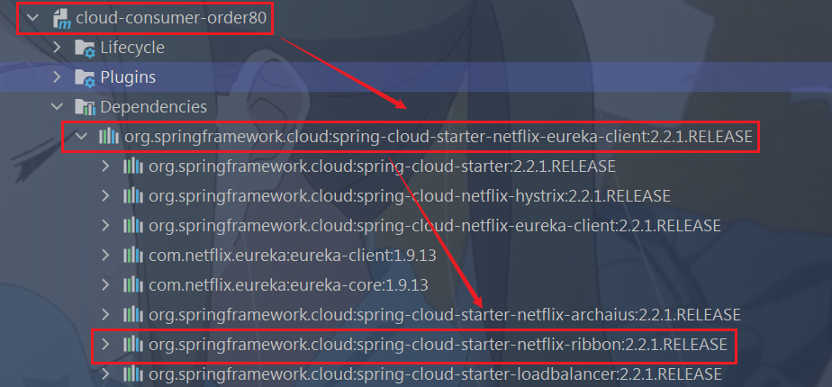


#### (2)RestTemplate的使用

**getForObject方法和getForEntity方法**

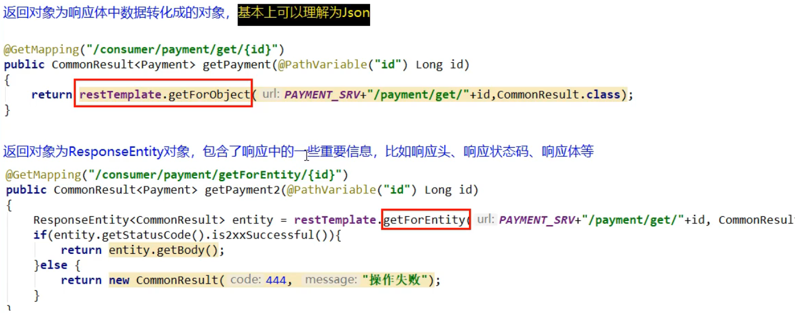


#### (3)Ribbon核心组件IRule

> IRule：根据特定算法中从服务列表中选取一个要访问的服务

- com.netflix.loadbalancer.RoundRobinRule	轮询
- com.netflix.loadbalancer.RandomRule     随机
- com.netflix.loadbalancer.RetryRule     先按照RoundRobinRule的策略获取服务，如果获取服务失败则在指定时间内会进行重试，获取可用的服务
- WeightedResponseTimeRule      对RoundRobinRule的扩展，响应速度越快的实例选择权重越大，越容易被选择
- BestAvailableRule    会先过滤掉由于多次访问故障而处于断路器跳闸状态的服务，然后选择一个并发量最小的服务
- AvailabilityFilteringRule    先过滤掉故障实例，再选择并发较小的实例
- ZoneAvoidanceRule     默认规则，复合判断server所在区域的性能和server的可用性选择服务器


**如何替换**

> 修改cloud-consumer-order80


**注意配置细节**

> 官方文档明确给出了警告：
>
> 这个自定义配置类不能放在@ComponentScan所扫描的当前包下以及子包下，
>
> 否则我们自定义的这个配置类就会被所有的Ribbon客户端所共享，达不到特殊化定制的目的了。


1. 新建package

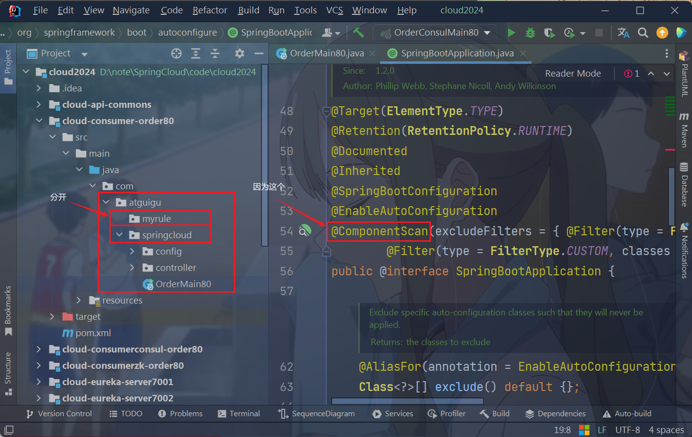


2. 包下新建MySelfRule规则类

```java
@Configuration
public class MySelfRule {

    @Bean
    public IRule myRule() {
        return new RandomRule();//随机
    }

}
```


3. 主启动类添加@RibbonClient

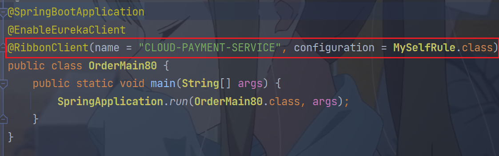


### 4.Ribbon负载均衡算法

**原理**

> 负载均衡算法：rest接口第几次请求数 % 服务器集群总数量 = 实际调用服务器位置下标，每次服务重启动后rest接口计数从1开始。
>

```java
List<Servicelnstance> instances = discoveryClient.getlnstances("CLOUD-PAYMENT-SERVICE");

如:	List[0] instances = 127.0.0.1:8002
     List[1] instances = 127.0.0.1:8001
```

8001+8002组合成为集群，它们共计2台机器，集群总数为2，按照轮询算法原理：

当总请求数为1时：1%2 = 1 对应下标位置为1，则获得服务地址为127.0.0.1:8001

当总请求数位2时：2%2 = 0 对应下标位置为0，则获得服务地址为127.0.0.1:8002

当总请求数位3时：3%2 = 1 对应下标位置为1，则获得服务地址为127.0.0.1:8001

当总请求数位4时：4%2 = 0 对应下标位置为0，则获得服务地址为127.0.0.1:8002


**手写一个负载均衡的算法**

- 服务端controller添加

  ```java
  @GetMapping(value = "/payment/lb")
  public String getPaymentLB() {
  	return serverPort;
  }
  ```

  

- 客户端ApplicationContextBean去掉注解@LoadBalanced
  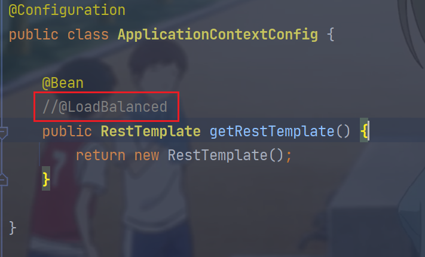

- LoadBalancer接口

  ```java
  public interface LoadBalancer {
  
      ServiceInstance instances(List<ServiceInstance> serviceInstances);
  
  }
  
  ```

  

- MyLB

  ```java
  @Component
  public class MyLb implements LoadBalancer {
  
      private AtomicInteger atomicInteger = new AtomicInteger(0);
  
      private final int getAndIncrement() {
          int current;
          int next;
          do {
              current = this.atomicInteger.get();
              next = current > Integer.MAX_VALUE ? 0 : current + 1;
          }while(!this.atomicInteger.compareAndSet(current, next));
          System.out.println("第几次访问，次数next: " + next);
          return next;
      }
  
      @Override
      public ServiceInstance instances(List<ServiceInstance> serviceInstances) {
          int index = getAndIncrement() % serviceInstances.size();
  
          return serviceInstances.get(index);
      }
  }
  
  ```

  

- OrderController

  ```java
  @Resource
      private LoadBalancer loadBalancer;
  
  @Resource
  private DiscoveryClient discoveryClient;
  
  @GetMapping(value = "/consumer/payment/lb")
  public String getPaymentLB() {
      List<ServiceInstance> instances = 
          discoveryClient.getInstances("CLOUD-PAYMENT-SERVICE");
      if(instances == null || instances.size() <= 0) {
          return null;
      }
  
      ServiceInstance serviceInstance = loadBalancer.instances(instances);
      URI uri = serviceInstance.getUri();
  
      return restTemplate.getForObject(uri + "/payment/lb", String.class);
  }
  ```

  

- 测试


## 九、OpenFeign服务接口调用

### 1. 概述

#### (1)OpenFeign是什么？

> Feign是一个声明式WebService客户端。使用Feign能让编写WebService客户端更加简单。
>
> 它的使用方法是定义一个服务接口然后在上面添加注解。Feign也支持可拔插式的编码器和解码器。SpringCloud对Feign进行了封装，使其支持了Spring MVC标准注解和HttpMessageConverters。Feign可以与Eureka和Ribbon组合使用以支持负载均衡

Feign是一个声明式的Web服务客户端，让编写Web服务客户端变得非常容易，只需创建一个接口并在接口上添加注解即可。


#### (2)Feign能干什么？

> Feign旨在使编写JavaHttp客户端变得更容易。

前面在使用Ribbon+RestTemplate时，利用RestTemplate对http请求的封装处理，形成了一套模版化的调用方法。但是在实际开发中，由于对服务依赖的调用可能不止一处，往往一个接口会被多处调用，所以通常都会针对每个微服务自行封装一些客户端类来包装这些依赖服务的调用。所以，Feign在此基础上做了进一步封装，由他来帮助我们定义和实现依赖服务接口的定义。在Feign的实现下我们只需创建一个接口并使用注解的方式来配置它(以前是Dao接口上面标注Mapper注解,现在是一个微服务接口上面标注一个 Feign注解即可)，即可完成对服务提供方的接口绑定，简化了使用SpringcloudRibbon时，自动封装服务调用客户端的开发量。


**Feign集成了Ribbon**
利用Ribbon维护了Payment的服务列表信息，并且通过轮询实现了客户端的负载均衡。而与Ribbon不同的是，通过feign只需要定义服务绑定接口且以声明式的方法，优雅而简单的实现了服务调用


#### (3)Feign和OpenFeign的区别

**Feign**

> Feign是SpringCloud组件中的一个轻量级RESTful的HTTP服务客户端 
>
> Feign内置了Ribbon，用来做客户端负载均衡，去调用服务注册中心的服务。Feign的使用方式是：使用Feign的注解定义接口，调用这个接口，就可以调用服务注册中心的服务


**OpenFeign**

> OpenFeign是SpringCloud在Feign的基础上支持了SpringMVC的注解，如@RequesMapping等等。OpenFeign的@FeignClient可以解析SpringMVC的@RequestMapping注解下的接口，并通过动态代理的方式产生实现类，实现类中做负载均衡并调用其他服务。
>


### 2. OpenFeign使用步骤

1. 新建cloud-consumer-feign-order80

2. POM

   ```xml
   <dependencies>
       <!--openfeign-->
       <dependency>
           <groupId>org.springframework.cloud</groupId>
           <artifactId>spring-cloud-starter-openfeign</artifactId>
       </dependency>
       <!--eureka client-->
       <dependency>
           <groupId>org.springframework.cloud</groupId>
           <artifactId>spring-cloud-starter-netflix-eureka-client</artifactId>
       </dependency>
       <!-- 引入自己定义的api通用包，可以使用Payment支付Entity -->
       <dependency>
           <groupId>com.atguigu.springcloud</groupId>
           <artifactId>cloud-api-commons</artifactId>
           <version>${project.version}</version>
       </dependency>
       <!--web-->
       <dependency>
           <groupId>org.springframework.boot</groupId>
           <artifactId>spring-boot-starter-web</artifactId>
       </dependency>
       <dependency>
           <groupId>org.springframework.boot</groupId>
           <artifactId>spring-boot-starter-actuator</artifactId>
       </dependency>
       <!--一般基础通用配置-->
       <dependency>
           <groupId>org.springframework.boot</groupId>
           <artifactId>spring-boot-devtools</artifactId>
           <scope>runtime</scope>
           <optional>true</optional>
       </dependency>
       <dependency>
           <groupId>org.projectlombok</groupId>
           <artifactId>lombok</artifactId>
           <optional>true</optional>
       </dependency>
       <dependency>
           <groupId>org.springframework.boot</groupId>
           <artifactId>spring-boot-starter-test</artifactId>
           <scope>test</scope>
       </dependency>
   </dependencies>
   ```

   

3. YML

   ```yml
   server:
     port: 80
   
   eureka:
     client:
       register-with-eureka: false
       service-url:
         defaultZone: http://eureka7001.com:7001/eureka/,http://eureka7002.com:7002/eureka/
   ```

   

4. 主启动

   ```java
   @SpringBootApplication
   @EnableFeignClients
   public class OrderFeignMain80 {
       public static void main(String[] args) {
           SpringApplication.run(OrderFeignMain80.class, args);
       }
   }
   ```

   

5. 业务类
   业务逻辑接口 + @FeignClient 配置去调用provider服务
   新建PaymentFeignService接口并新增注解@FeignClient
   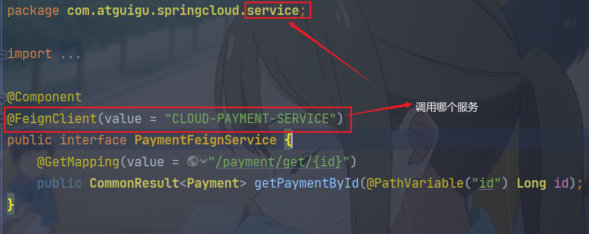

   控制层Controller

   ```java
   @RestController
   @Slf4j
   public class OrderFeignController {
   
       @Resource
       private PaymentFeignService paymentFeignService;
   
       @GetMapping(value = "/consumer/payment/get/{id}")
       public CommonResult<Payment> getPaymentById(@PathVariable Long id) {
           return paymentFeignService.getPaymentById(id);
       }
   }
   ```

   

6. 测试


### 3. OpenFeign超时控制

超时设置，故意设置超时演示出错的情况

服务提供方Controller 8001故意写暂停程序

```java
@GetMapping(value = "/payment/feign/timeout")
public String paymentFeignTimeout() {
    try {
        TimeUnit.SECONDS.sleep(3);
    } catch (InterruptedException e) {
        e.printStackTrace();
    }

    return serverPort;
}
```

服务消费方80添加超时方法PaymentFeignService

```java
@GetMapping(value = "/payment/feign/timeout")
public String paymentFeignTimeout();
```

服务消费方80添加超时方法OrderFeignController

```java
@GetMapping(value = "/consumer/payment/feign/timeout")
public String paymentFeignTimeout() {
    //openfeign-ribbon，客户端一般默认等待1秒钟
    return paymentFeignService.paymentFeignTimeout();
}
```

测试：http://localhost/consumer/payment/feign/timeout

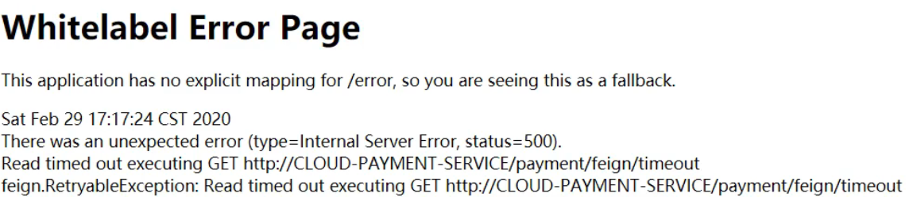

OpenFeign默认等待1秒钟，超过后报错


> 默认Feign客户端只等待一秒钟，但是服务端处理需要超过1秒钟，导致Feign客户端不想等待了，直接返回报错。
>
> 为了避免这样的情况，有时候我们需要设置Feign客户端的超时控制。

yml文件中开启配置

```yml
#设置feign客户端超时时间(OpenFeign默认支持ribbon)
ribbon:
  #指的是建立连接所用的时间，适用于网络状况正常的情况下,两端连接所用的时间
  ReadTimeout: 5000
  #指的是建立连接后从服务器读取到可用资源所用的时间
  ConnectTimeout: 5000
```


### 4. OpenFeign日志打印功能

**是什么？**

> Feign提供了日志打印功能，我们可以通过配置来调整日志级别，从而了解Feign中Http请求的细节。
>
> 说白了就是对Feign接口的调用情况进行监控和输出


**日志级别**

- NONE：默认的，不显示任何日志；
- BASIC：仅记录请求方法、URL、响应状态码及执行时间；
- HEADERS：除了BASIC中定义的信息之外，还有请求和响应的头信息；
- FULL：除了HEADERS中定义的信息之外，还有请求和响应的正文及元数据。


**配置日志bean**

```java
package com.atguigu.springcloud.config;

import feign.Logger;
import org.springframework.context.annotation.Bean;
import org.springframework.context.annotation.Configuration;

@Configuration
public class FeignConfig {

    @Bean
    Logger.Level feignLoggerLevel() {
        return Logger.Level.FULL;
    }

}
```


**YML文件里需要开启日志的Feign客户端**

```yml
logging:
  level:
    # feign日志以什么级别监控哪个接口
    com.atguigu.springcloud.service.PaymentFeignService: debug
```


## 十、Hystrix断路器

### 1. 分布式系统面临的问题

> 复杂分布式体系结构中的应用程序有数十个依赖关系，每个依赖关系在某些时候将不可避免地失败。

**服务雪崩**
多个微服务之间调用的时候，假设微服务A调用微服务B和微服务C，微服务B和微服务C又调用其它的微服务，这就是所谓的“扇出”。如果扇出的链路上某个微服务的调用响应时间过长或者不可用，对微服务A的调用就会占用越来越多的系统资源，进而引起系统崩溃，所谓的“雪崩效应”。

对于高流量的应用来说，单一的后端依赖可能会导致所有服务器上的所有资源都在几秒钟内饱和。比失败更糟糕的是，这些应用程序还可能导致服务之间的延迟增加，备份队列，线程和其他系统资源紧张，导致整个系统发生更多的级联故障。这些都表示需要对故障和延迟进行隔离和管理，以便单个依赖关系的失败，不能取消整个应用程序或系统。

所以,通常当你发现一个模块下的某个实例失败后，这时候这个模块依然还会接收流量，然后这个有问题的模块还调用了其他的模块，这样就会发生级联故障，或者叫雪崩。


### 2. Hystrix是什么？

> Hystrix是一个用于处理分布式系统的延迟和容错的开源库，在分布式系统里，许多依赖不可避免的会调用失败，比如超时、异常等， Hystrix能够保证在一个依赖出问题的情况下，不会导致整体服务失败，避免级联故障，以提高分布式系统的弹性。

"断路器”本身是一种开关装置，当某个服务单元发生故障之后，通过断路器的故障监控（类似熔断保险丝），向调用方返回一个符合预期的、可处理的备选响应（FallBack），而不是长时间的等待或者抛出调用方无法处理的异常，这样就保证了服务调用方的线程不会被长时间、不必要地占用，从而避免了故障在分布式系统中的蔓延，乃至雪崩。


### 3. Hystrix能干嘛？

> 服务降级、服务熔断、接近实时的监控


### 4. Hystrix重要概念

#### (1)服务降级

> 服务器忙，请稍后再试，不让客户端等待并立刻返回一个友好提示，fallback

哪些情况会触发降级

- 程序运行异常
- 超时
- 服务熔断触发服务降级
- 线程池 / 信号量打满也会导致服务降级


#### (2)服务熔断

> 类比保险丝达到最大服务访问后，直接拒绝访问，拉闸限电，然后调用服务降级的方法并返回友好提示


#### (3)服务限流

> 秒杀高并发等操作，严禁一窝蜂的过来拥挤，大家排队，一秒钟N个，有序进行


### 5. hystrix案例

#### (1)构建

1. 新建cloud-provider-hystrix-payment8001

2. POM

   ```xml
   <dependencies>
       <!--hystrix-->
       <dependency>
           <groupId>org.springframework.cloud</groupId>
           <artifactId>spring-cloud-starter-netflix-hystrix</artifactId>
       </dependency>
       <!--eureka client-->
       <dependency>
           <groupId>org.springframework.cloud</groupId>
           <artifactId>spring-cloud-starter-netflix-eureka-client</artifactId>
       </dependency>
       <!--web-->
       <dependency>
           <groupId>org.springframework.boot</groupId>
           <artifactId>spring-boot-starter-web</artifactId>
       </dependency>
       <dependency>
           <groupId>org.springframework.boot</groupId>
           <artifactId>spring-boot-starter-actuator</artifactId>
       </dependency>
       <dependency><!-- 引入自己定义的api通用包，可以使用Payment支付Entity -->
           <groupId>com.atguigu.springcloud</groupId>
           <artifactId>cloud-api-commons</artifactId>
           <version>${project.version}</version>
       </dependency>
       <dependency>
           <groupId>org.springframework.boot</groupId>
           <artifactId>spring-boot-devtools</artifactId>
           <scope>runtime</scope>
           <optional>true</optional>
       </dependency>
       <dependency>
           <groupId>org.projectlombok</groupId>
           <artifactId>lombok</artifactId>
           <optional>true</optional>
       </dependency>
       <dependency>
           <groupId>org.springframework.boot</groupId>
           <artifactId>spring-boot-starter-test</artifactId>
           <scope>test</scope>
       </dependency>
   </dependencies>
   ```

   

3. YML

   ```yml
   server:
     port: 8001
   
   spring:
     application:
       name: cloud-provider-hystrix-payment
   
   eureka:
     client:
       register-with-eureka: true
       fetch-registry: true
       service-url:
         #defaultZone: http://eureka7001.com:7001/eureka,http://eureka7002.com:7002/eureka
         defaultZone: http://eureka7001.com:7001/eureka
   ```

   

4. 主启动

   ```java
   @SpringBootApplication
   @EnableEurekaClient
   public class PaymentHystrixMain8001 {
       public static void main(String[] args) {
           SpringApplication.run(PaymentHystrixMain8001.class, args);
       }
   }
   ```

   

5. service

   ```java
   @Service
   public class PaymentService {
   
       /**
        * 正常访问，肯定OK
        * @param id
        * @return
        */
       public String paymentInfo_OK(Integer id) {
           return "线程池：" + Thread.currentThread().getName() +
                   "，paymentInfo_OK，id：" + id + "\t" + "哈哈";
       }
   
       public String paymentInfo_TimeOut(Integer id) {
   
           try {
               TimeUnit.SECONDS.sleep(3);
           } catch (InterruptedException e) {
               e.printStackTrace();
           }
   
           return "线程池：" + Thread.currentThread().getName() +
                   "，paymentInfo_TimeOut，id：" + id + "\t" + "哈哈" + "，耗时3秒钟";
       }
   
   
   }
   
   ```

   

6. controller

   ```java
   @RestController
   @Slf4j
   public class PaymentController {
   
       @Resource
       private PaymentService paymentService;
   
       @Value("${server.port}")
       private String serverPort;
   
       @GetMapping("/payment/hystrix/ok/{id}")
       public String paymentInfo_OK(@PathVariable("id") Integer id) {
           String result = paymentService.paymentInfo_OK(id);
           log.info("result: " + result);
           return result;
       }
   
       @GetMapping("/payment/hystrix/timeout/{id}")
       public String paymentInfo_TimeOut(@PathVariable("id") Integer id) {
           String result = paymentService.paymentInfo_TimeOut(id);
           log.info("result: " + result);
           return result;
       }
   
   }
   ```

   

7. 测试

> 以上述为根基平台，从正确->错误->降级熔断->恢复
>


#### (2)高并发测试

**Jmeter压测测试**

> 开启Jmeter，来20000个并发压死8001，20000个请求都去访问paymentlnfo_TimeOut服务
>

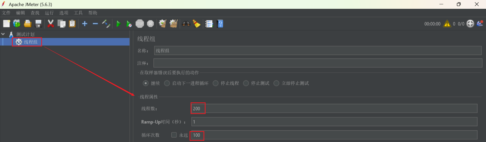

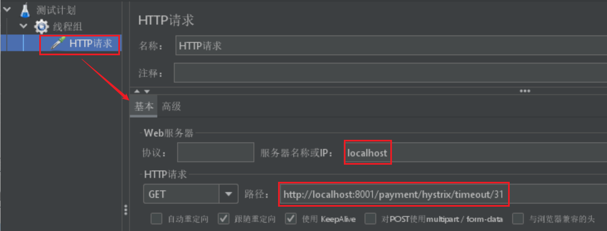


> 结果：转圈圈
>


**客户端新建加入**

1. 新建cloud-consumer-feign-hystrix-order80

2. POM

   ```xml
   <dependencies>
       <!--openfeign-->
       <dependency>
           <groupId>org.springframework.cloud</groupId>
           <artifactId>spring-cloud-starter-openfeign</artifactId>
       </dependency>
       <!--hystrix-->
       <dependency>
           <groupId>org.springframework.cloud</groupId>
           <artifactId>spring-cloud-starter-netflix-hystrix</artifactId>
       </dependency>
       <!--eureka client-->
       <dependency>
           <groupId>org.springframework.cloud</groupId>
           <artifactId>spring-cloud-starter-netflix-eureka-client</artifactId>
       </dependency>
       <!-- 引入自己定义的api通用包，可以使用Payment支付Entity -->
       <dependency>
           <groupId>com.atguigu.springcloud</groupId>
           <artifactId>cloud-api-commons</artifactId>
           <version>${project.version}</version>
       </dependency>
       <!--web-->
       <dependency>
           <groupId>org.springframework.boot</groupId>
           <artifactId>spring-boot-starter-web</artifactId>
       </dependency>
       <dependency>
           <groupId>org.springframework.boot</groupId>
           <artifactId>spring-boot-starter-actuator</artifactId>
       </dependency>
       <!--一般基础通用配置-->
       <dependency>
           <groupId>org.springframework.boot</groupId>
           <artifactId>spring-boot-devtools</artifactId>
           <scope>runtime</scope>
           <optional>true</optional>
       </dependency>
       <dependency>
           <groupId>org.projectlombok</groupId>
           <artifactId>lombok</artifactId>
           <optional>true</optional>
       </dependency>
       <dependency>
           <groupId>org.springframework.boot</groupId>
           <artifactId>spring-boot-starter-test</artifactId>
           <scope>test</scope>
       </dependency>
   </dependencies>
   ```

   

3. YML

   ```yml
   server:
     port: 80
   
   eureka:
     client:
       register-with-eureka: false
       service-url:
         defaultZone: http://eureka7001.com:7001/eureka
   ```

   

4. 主启动

   ```java
   @SpringBootApplication
   @EnableFeignClients
   public class OrderHystrixMain80 {
       public static void main(String[] args) {
           SpringApplication.run(OrderHystrixMain80.class, args);
       }
   }
   ```

   

5. Service

   ```java
   @Component
   @FeignClient(value = "CLOUD-PROVIDER-HYSTRIX-PAYMENT")
   public interface PaymentHystrixService {
   
       @GetMapping("/payment/hystrix/ok/{id}")
       public String paymentInfo_OK(@PathVariable("id") Integer id);
   
       @GetMapping("/payment/hystrix/timeout/{id}")
       public String paymentInfo_TimeOut(@PathVariable("id") Integer id);
   
   }
   ```

   

6. Controller

   ```java
   @RestController
   @Slf4j
   public class OrderHystrixController {
   
       @Resource
       private PaymentHystrixService paymentHystrixService;
   
       @GetMapping("/consumer/payment/hystrix/ok/{id}")
       public String paymentInfo_OK(@PathVariable("id") Integer id) {
           String result = paymentHystrixService.paymentInfo_OK(id);
           return result;
       }
   
       @GetMapping("/consumer/payment/hystrix/timeout/{id}")
       public String paymentInfo_TimeOut(@PathVariable("id") Integer id){
           String result = paymentHystrixService.paymentInfo_TimeOut(id);
           return result;
       }
   }
   
   ```

   

7. 正常测试
   http://localhost/consumer/payment/hystrix/ok/31
   http://localhost:8001/payment/hystrix/timeout/31

8. 高并发测试
   

   2W个线程压8001
   消费端80微服务再去访问正常的0k微服务8001地址
   http://localhost/consumer/payment/hystrix/ok/32
   消费者80要么转圈等待，要么消费端报超时错误


**故障现象和导致原因**

> 8001同一层次的其它接口服务被困死，因为tomcat线程池里面的工作线程已经被挤占完毕。
>
> 80此时调用8001，客户端访问响应缓慢，转圈圈


#### (3)如何解决

> 上诉结论
> 正因为有上述故障或不佳表现
> 才有我们的降级/容错/限流等技术诞生


解决

- 对方服务(8001)超时了，调用者(80)不能一直卡死等待，必须有服务降级
- 对方服务(8001)down机了，调用者(80)不能一直卡死等待，必须有服务降级
- 对方服务(8001)0K，调用者(80)自己出故障或有自我要求(自己的等待时间小于服务提供者)，自己处理降级


##### 服务降级

###### 解决超时问题

超时导致服务器变慢(转圈)：超时不再等待

> 服务端降级配置@HystrixCommand

1. 8001先从自身找问题
   设置自身调用超时时间的峰值，峰值内可以正常运行，超过了需要有兜底的方法处理，作为服务降级fallback

2. 8001fallback(服务提供者)
   业务类启用
   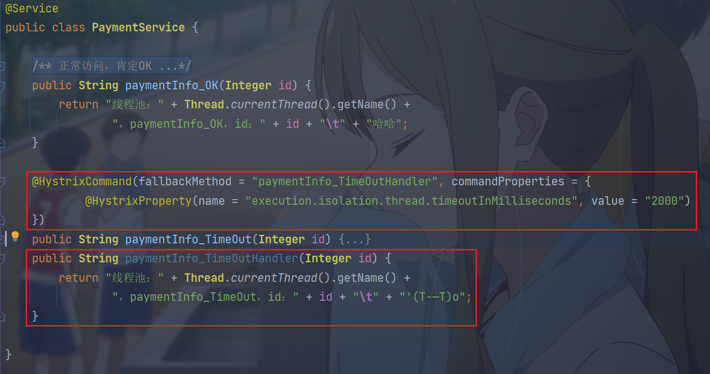

   主启动类激活
   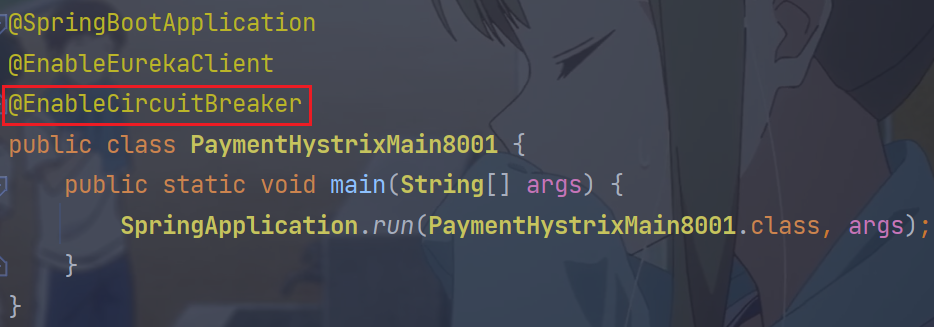

3. 80fallback(服务消费者)
   80订单微服务，也可以更好的保护自己，也一样进行客户端降级保护
   YML

   ```yml
   feign:
     hystrix:
       enabled: true
   ```

   主启动
   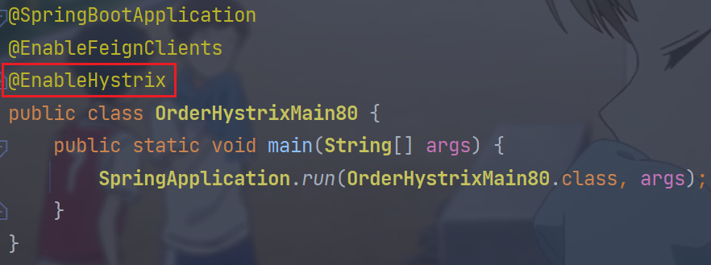

   业务类
   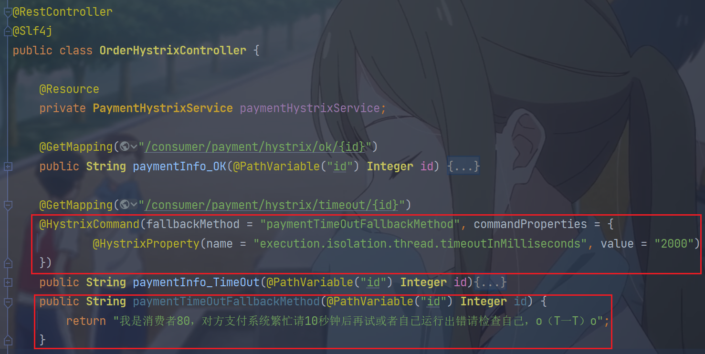


**解决问题**

> 问题：每个方法配置一个，代码膨胀
>

@DefaultProperties(defaultFallback = "")

1对1：每个方法配置一个服务降级方法，技术上可以，实际上傻X

1对N：除了个别重要核心业务有专属，其它普通的可以通过@DefaultProperties(defaultFallback="）统一跳转到统一处理结果页面

**通用的和独享的各自分开，避免了代码膨胀，合理减少了代码量。**

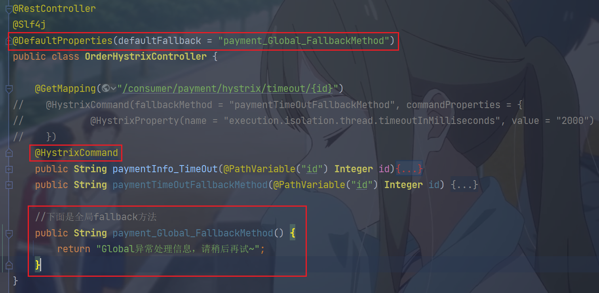


###### 解决服务器出错问题

出错(宕机或程序运行出错)：出错要有兜底

客户端降级配置

> 根据cloud-consumer-feign-hystrix-order80已经有的PaymentHystrixService接口，重新新建一个类(PaymentFallbackService)实现该接口，统一为接口里面的方法进行异常处理

1. PaymentFallbackService类实现PaymentFeignClientService接口

```java
@Component
public class PaymentFallbackService implements PaymentHystrixService{

    @Override
    public String paymentInfo_OK(Integer id) {
        return "------PaymentFallbackService fall back-paymentInfo_OK";
    }

    @Override
    public String paymentInfo_TimeOut(Integer id) {
        return "------PaymentFallbackService fall back-paymentInfo_TimeOut";
    }
}
```


2. YML

```yml
feign:
  hystrix:
    enabled: true
```


3. PaymentHystrixService接口

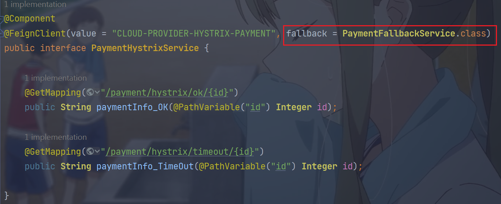


##### 服务熔断

> 一句话就是家里的保险丝
>

**熔断是什么？**

熔断机制概述

> 熔断机制是应对雪崩效应的一种微服务链路保护机制。当扇出链路的某个微服务出错不可用或者响应时间太长时，会进行服务的降级，进而熔断该节点微服务的调用，快速返回错误的响应信息。

当检测到该节点微服务调用响应正常后，恢复调用链路。

> 在SpringCloud框架里，熔断机制通过Hystrix实现。Hystrix会监控微服务间调用的状况，当失败的调用到一定阈值，缺省是5秒内20次调用失败，就会启动熔断机制。熔断机制的注解是@HystrixCommand。


**实操**

1. 修改cloud-provider-hystrix-payment8001


PaymentService
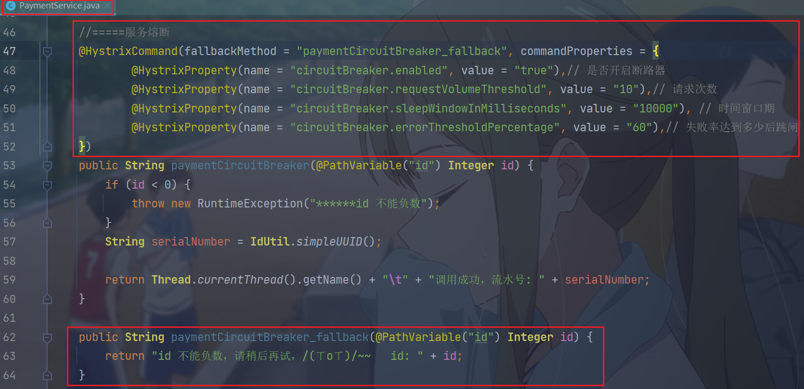


PaymentController

```java
//服务熔断
@GetMapping("/payment/circuit/{id}")
public String paymentCircuitBreaker(@PathVariable("id") Integer id) {
    String result = paymentService.paymentCircuitBreaker(id);
    log.info("result: " + result);
    return result;
}
```


### 6. 服务监控

概述

> 除了隔离依赖服务的调用以外，Hystrix还提供了准实时的调用监控（HystrixDashboard），Hystrix会持续地记录所有通过Hystrix发起的请求的执行信息，并以统计报表和图形的形式展示给用户，包括每秒执行多少请求多少成功，多少失败等。Netflix通过hystrix-metrics-event-stream项目实现了对以上指标的监控。SpringCloud也提供了HystrixDashboard的整合，对监控内容转化成可视化界面。

1. 新建cloud-consumer-hystrix-dashboard9001


2. POM

   ```xml
    <dependencies>
        <dependency>
            <groupId>org.springframework.cloud</groupId>
            <artifactId>spring-cloud-starter-netflix-hystrix-dashboard</artifactId>
        </dependency>
        <dependency>
            <groupId>org.springframework.boot</groupId>
            <artifactId>spring-boot-starter-actuator</artifactId>
        </dependency>
   
        <dependency>
            <groupId>org.springframework.boot</groupId>
            <artifactId>spring-boot-devtools</artifactId>
            <scope>runtime</scope>
            <optional>true</optional>
        </dependency>
        <dependency>
            <groupId>org.projectlombok</groupId>
            <artifactId>lombok</artifactId>
            <optional>true</optional>
        </dependency>
        <dependency>
            <groupId>org.springframework.boot</groupId>
            <artifactId>spring-boot-starter-test</artifactId>
            <scope>test</scope>
        </dependency>
   </dependencies>
   ```

   

3. YML

   ```yml
   server:
     port: 9001
   ```

   

4. 主启动类

   ```java
   @SpringBootApplication
   @EnableHystrixDashboard
   public class HystrixDashboardMain9001 {
       public static void main(String[] args) {
           SpringApplication.run(HystrixDashboardMain9001.class, args);
       }
   }
   ```

   

5. 所有Provider微服务提供类(8001/8002/8003)都需要监控依赖配置

   ```xml
   <dependency>
   	<groupId>org.springframework.boot</groupId>
   	<artifactId>spring-boot-starter-actuator</artifactId>
   </dependency>
   ```

   

访问地址：http://localhost:9001/hystrix


#### (1)服务熔断演示

服务端修改主启动了

> 注意：新版本Hystrix需要在主启动类MainAppHystrix8001中指定监控路径

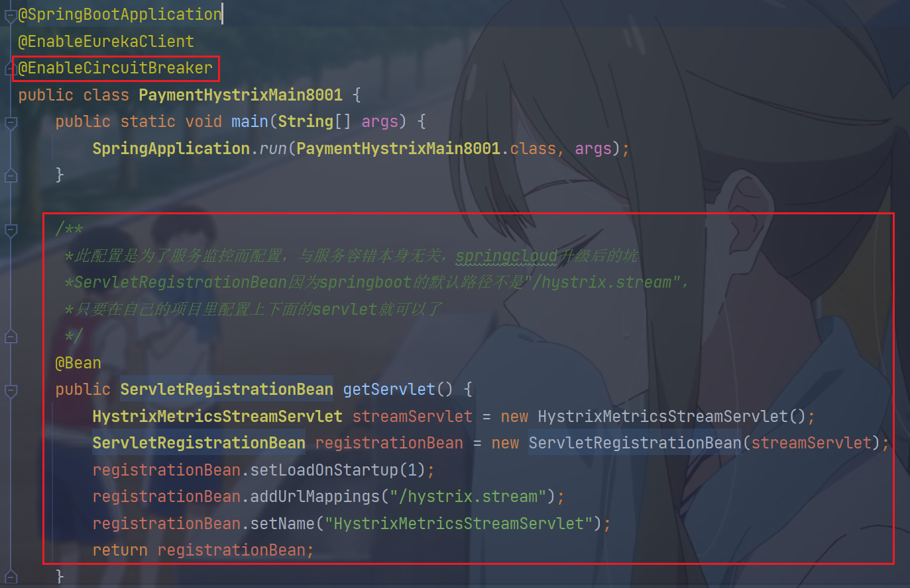


**监控测试**

启动1个eureka或者3个eureka集群均可


**观察监控窗口**

9001监控8001

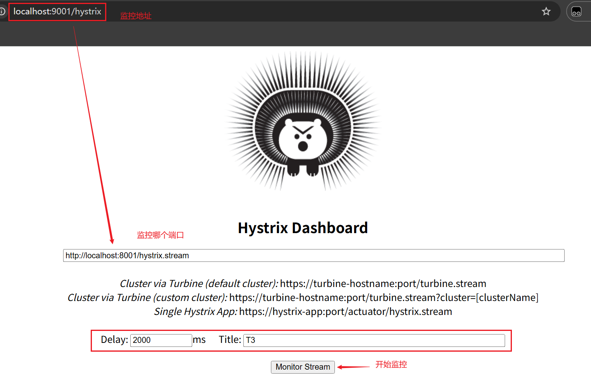

http://localhost:8001/payment/circuit/31正确的用户访问地址

http://localhost:8001/payment/circuit/-31错误的用户访问地址

先访问正确地址，再访问错误地址，再正确地址，会发现图示断路器都是慢慢放开的。
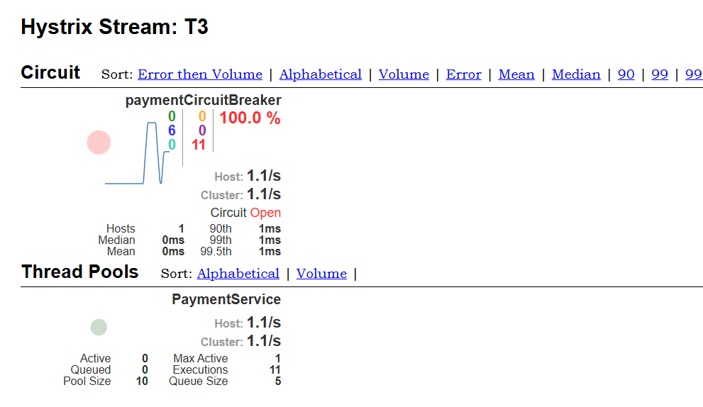

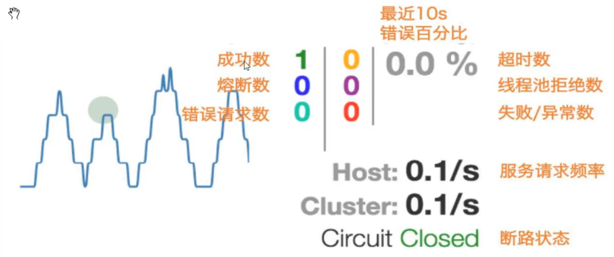


## 十一、Gareway网关

### 1. Gareway是什么

> Gateway是在Spring生态系统之上构建的APl网关服务，基于Spring5，SpringBoot2和ProjectReactor等技术。
>
> Gateway旨在提供一种简单而有效的方式来对APl进行路由，以及提供一些强大的过滤器功能，例如：熔断、限流、重试等

SpringCloudGateway是SpringCloud的一个全新项目，基于 Spring5.0+SpringBoot2.0 和 ProjectReactor 等技术开发的网关，它旨在为微服务架构提供一种简单有效的统一的API路由管理方式。

SpringCloudGateway作为SpringCloud生态系统中的网关，目标是替代 Zuul，在SpringCloud2.0以上版本中，没有对新版本的Zuul2.0以上最新高性能版本进行集成，仍然还是使用的Zuul1.x非Reactor模式的老版本。而为了提升网关的性能，SpringCloudGateway是基于WebFlux框架实现的，而WebFlux框架底层则使用了高性能的Reactor模式通信框架Netty。

Spring Cloud Gateway的目标提供统一的路由方式且基于Filter链的方式提供了网关基本的功能，例如：安全，监控/指标，和限流。


一句话

> SpringCloud Gateway使用的Webflux中的reactor-netty响应式编程组件，底层使用了Netty通讯框架。


### 2. Gareway能干吗

> 反向代理、鉴权、流量控制、熔断、日志控制


### 3. 微服务架构中网关在哪里

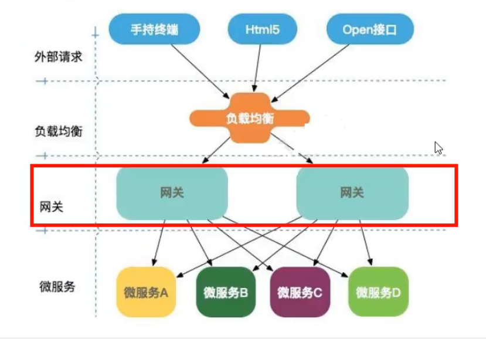


### 4. 三大核心概念

Route(路由)

> 路由是构建网关的基本模块，它由ID，目标URl，一系列的断言和过滤器组成，如果断言为true则匹配该路由


Predicate(断言)

> 开发人员可以匹配HTTP请求中的所有内容(例如请求头或请求参数)，如果请求与断言相匹配则进行路由


Filter(过滤)

> 指的是Spring框架中GatewayFilter的实例，使用过滤器，可以在请求被路由前或者之后对请求进行修改。


总体

> web请求，通过一些匹配条件，定位到真正的服务节点。并在这个转发过程的前后，进行一些精细化控制。
>
> predicate就是我们的匹配条件；而filter，就可以理解为一个无所不能的拦截器。有了这两个元素，再加上目标uri，就可以实现一个具体的路由了


### 5. Gateway工作流程

客户端向 Spring Cloud Gateway 发出请求。然后在 Gateway Handler Mapping 中找到与请求相匹配的路由，将其发送到 Gateway Web Handler.

Handler再通过指定的过滤器链来将请求发送到我们实际的服务执行业务逻辑，然后返回。过滤器之间用虚线分开是因为过滤器可能会在发送代理请求之前（"pre”）或之后（“post”）执行业务逻辑。 

Filter在"pre”类型的过滤器可以做参数校验、权限校验、流量监控、日志输出、协议转换等；在“post”类型的过滤器中可以做响应内容、响应头的修改，日志的输出，流量监控等有着非常重要的作用。


核心逻辑

> 路由转发+执行过滤器链


### 6. 搭建

1. 新建Module：cloud-gateway-gateway9527

2. POM

```xml
<dependencies>
    <!--gateway-->
    <dependency>
        <groupId>org.springframework.cloud</groupId>
        <artifactId>spring-cloud-starter-gateway</artifactId>
    </dependency>
    <!--eureka-client-->
    <dependency>
        <groupId>org.springframework.cloud</groupId>
        <artifactId>spring-cloud-starter-netflix-eureka-client</artifactId>
    </dependency>
    <!-- 引入自己定义的api通用包，可以使用Payment支付Entity -->
    <dependency>
        <groupId>com.atguigu.springcloud</groupId>
        <artifactId>cloud-api-commons</artifactId>
        <version>${project.version}</version>
    </dependency>
    <!--一般基础配置类-->
    <dependency>
        <groupId>org.springframework.boot</groupId>
        <artifactId>spring-boot-devtools</artifactId>
        <scope>runtime</scope>
        <optional>true</optional>
    </dependency>
    <dependency>
        <groupId>org.projectlombok</groupId>
        <artifactId>lombok</artifactId>
        <optional>true</optional>
    </dependency>
    <dependency>
        <groupId>org.springframework.boot</groupId>
        <artifactId>spring-boot-starter-test</artifactId>
        <scope>test</scope>
    </dependency>
</dependencies>
```

3. YML

```yml
server:
  port: 9527

spring:
  application:
    name: cloud-gateway

eureka:
  instance:
    hostname: cloud-gateway-service
  client: #服务提供者provider注册进eureka服务列表内
    service-url:
      register-with-eureka: true
      fetch-registry: true
      defaultZone: http://eureka7001.com:7001/eureka
```

4. 主启动类

```java
@SpringBootApplication
@EnableEurekaClient
public class GateWayMain9527 {
    public static void main(String[] args) {
        SpringApplication.run(GateWayMain9527.class, args);
    }
}
```


9527网关如何做路由映射

> 我们目前不想暴露8001端口，希望在8001外面套一层9527


**YML新增网关配置**

```yml
spring:
  application:
    name: cloud-gateway
  cloud:
    gateway:
      routes:
      	  #路由的ID，没有固定规则但要求唯一，建议配合服务名
        - id: payment_routh #payment_route    
          #匹配后提供服务的路由地址
          uri: http://localhost:8001
          predicates:
            - Path=/payment/get/** # 断言，路径相匹配的进行路由

		  #路由的ID，没有固定规则但要求唯一，建议配合服务名
        - id: payment_routh2 #payment_route    
          uri: http://localhost:8001          #匹配后提供服务的路由地址
          predicates:
            - Path=/payment/lb/** # 断言，路径相匹配的进行路由
```


**测试**

启动7001、启动8001、启动9527网关

访问说明

- 添加网关前http://localhost:8001/payment/get/31
- 添加网关后http://localhost:9527/payment/get/31


#### (1)配置路由的两种方式

Gateway网关路由有两种配置方式

> 在配置文件yml中配置，在上面已演示
>
> 代码中注入RouteLocator的Bean


演示在代码中注入RouteLocator的Bean

```java
@Configuration
public class GateWayConfig {

    @Bean
    public RouteLocator customRouteLocator(RouteLocatorBuilder routeLocatorBuilder) {
        RouteLocatorBuilder.Builder routes = routeLocatorBuilder.routes();

        routes.route("path_route_atguigu",
                r -> r.path("/guonei")
                        .uri("http://news.baidu.com/guonei")).build();

        return routes.build();
    }

}
```


### 7. 实现动态路由

> 默认情况下Gateway会根据注册中心注册的服务列表，以注册中心上微服务名为路径创建动态路由进行转发，从而实现动态路由的功能

启动：一个eureka7001 + 两个服务提供者8001 / 8002

**POM**

```xml
<!--eureka-client-->
	<dependency>
	<groupId>org.springframework.cloud</groupId>
	<artifactId>spring-cloud-starter-netflix-eureka-client</artifactId>
</dependency>
```


**YML**

> 需要注意的是uri的协议为lb，表示启用Gateway的负载均衡功能。
>
> Ib://serviceName是spring cloud
> gateway在微服务中自动为我们创建的负载均衡uri

```yml
spring:
  application:
    name: cloud-gateway
  cloud:
    gateway:
      discovery:
        locator:
          enabled: true #开启从注册中心动态创建路由的功能，利用微服务名进行路由
      routes:
        - id: payment_routh #payment_route    #路由的ID，没有固定规则但要求唯一，建议配合服务名
          #uri: http://localhost:8001          #匹配后提供服务的路由地址
          uri: lb://cloud-payment-service #匹配后提供服务的路由地址
          predicates:
            - Path=/payment/get/**         # 断言，路径相匹配的进行路由

        - id: payment_routh2 #payment_route    #路由的ID，没有固定规则但要求唯一，建议配合服务名
          #uri: http://localhost:8001          #匹配后提供服务的路由地址
          uri: lb://cloud-payment-service #匹配后提供服务的路由地址
          predicates:
            - Path=/payment/lb/**         # 断言，路径相匹配的进行路由
```


测试 http://localhost:9527/payment/lb 

8001/8002两个端口切换


### 8. Predicate的使用

是什么？

> Spring Cloud Gateway将路由匹配作为Spring WebFlux HandlerMapping基础架构的一部分。
>
> Spring Cloud Gateway包括许多内置的Route Predicate工厂。所有这些Predicate都与HTTP请求的不同属性匹配。多个Route Predicate工厂可以进行组合。
>
> Spring Cloud Gateway创建Route对象时，使用RoutePredicateFactory创建Predicate对象，Predicate对象可以赋值给 Route。 Spring Cloud Gateway 包含许多内置的Route Predicate Factories。
>
> 所有这些谓词都匹配HTTP请求的不同属性。多种谓词工厂可以组合，并通过逻辑and。


**常用的Route Predicate**

```yml
spring:
  cloud:
    gateway:
      routes:
      	  #路由的ID，没有固定规则但要求唯一，建议配合服务名
        - id: payment_routh2 #payment_route
          uri: lb://cloud-payment-service #匹配后提供服务的路由地址
          predicates:
            - Path=/payment/lb/**         # 断言，路径相匹配的进行路由
            #- After=2020-02-21T15:51:37.485+08:00[Asia/Shanghai]
            #- Cookie=username,zzyy
            #- Header=X-Request-Id, \d+  # 请求头要有X-Request-Id属性并且值为整数的正则表达式

```


1. After Route Predicate：在这个时间之后访问

   ```java
   public class T2 {
       public static void main(String[] args) {
           ZonedDateTime now = ZonedDateTime.now();
           System.out.println(now);
           //2025-04-29T11:01:59.666+08:00[Asia/Shanghai]
       }
   }
   ```

   

2. Cookie Route Predicate：需要两个参数，一个是Cookie name，一个是正则表达式。
   路由规则会通过获取对应的Cookie name值和正则表达式去匹配，如果匹配上就会执行路由，如果没有匹配上则不执行。

不带cookie访问

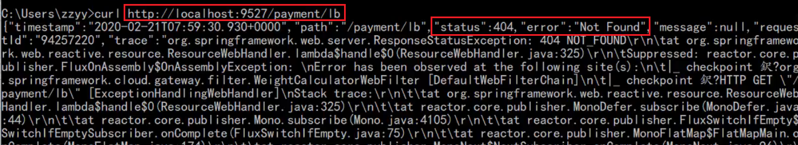


带cookie访问

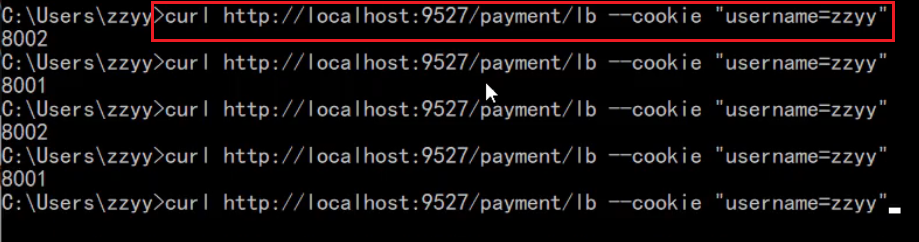


3. Header Route Predicate
   两个参数：一个是属性名称和一个正则表达式，这个属性值和正则表达式匹配则执行。

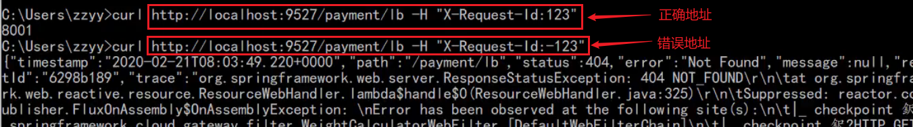


总结

> 说白了，Predicate就是为了实现一组匹配规则让请求过来找到对应的Route进行处理。
>


### 9. Filter的使用

**是什么？**

> 路由过滤器可用于修改进入的HTTP请求和返回的HTTP响应，路由过滤器只能指定路由进行使用。 
>
> Spring Cloud Gateway内置了多种路由过滤器，他们都由GatewayFilter的工厂类来产生


生命周期：pre 和 post

种类：GatewayFilter 和 GlobalFilter


常用的GatewayFilter

- AddRequestParameter


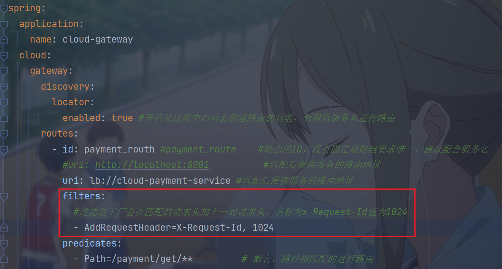


**自定义过滤器**

能干吗

> 全局日志记录，统一网关鉴权
>

```java
@Component
@Slf4j
public class MyLogGateWayFilter implements GlobalFilter, Ordered {

    @Override
    public Mono<Void> filter(ServerWebExchange exchange, GatewayFilterChain chain) {
        log.info("********come in MyLogGateWayFilter: " + new Date());
        String uname = exchange.getRequest().getQueryParams().getFirst("uname");
        if(uname == null) {
            log.info("*****用户名为null，非法用户");
            exchange.getResponse().setStatusCode(HttpStatus.NOT_ACCEPTABLE);
            return exchange.getResponse().setComplete();
        }
        return chain.filter(exchange);
    }

    @Override//执行顺序，数字越小，执行优先级越高
    public int getOrder() {
        return 0;
    }
}
```


## 十二、SpringCloud Config分布式配置中心

### 1. 问题

分布式系统面临的问题

> 微服务意味着要将单体应用中的业务拆分成一个个子服务，每个服务的粒度相对较小，因此系统中会出现大量的服务。由于每个服务都需要必要的配置信息才能运行，所以一套集中式的、动态的配置管理设施是必不可少的。
>
> SpringCloud提供了ConfigServer来解决这个问题，我们每一个微服务自己带着一个application.yml，上百个配置文件的管理..


### 2. 是什么

> SpringCloudConfig为微服务架构中的微服务提供集中化的外部配置支持，配置服务器为各个不同微服务应用的所有环境提供了一个中心化的外部配置。
>

SpringCloudConfig分为**服务端和客户端**两部分。

服务端也称为分布式配置中心，它是一个独立的微服务应用，用来连接配置服务器并为客户端提供获取配置信息，加密/解密信息等访问接口。

客户端则是通过指定的配置中心来管理应用资源，以及与业务相关的配置内容，并在启动的时候从配置中心获取和加载配置信息配置服务器默认采用git来存储配置信息，这样就有助于对环境配置进行版本管理，并且可以通过git客户端工具来方便的管理和访问配置内容


### 3. 能干吗

- 集中管理配置文件
- 不同环境不同配置，动态化的配置更新，分环境部署比如dev/test/prod/beta/release
- 运行期间动态调整配置，不再需要在每个服务部署的机器上编写配置文件，服务会向配置中心统一拉取配置自己的信息
- 当配置发生变动时，服务不需要重启即可感知到配置的变化并应用新的配置
- 将配置信息以REST接口的形式暴露


### 4. 服务端配置和测试

1. 用自己的账号在GitHub上新建一个名为springcloud-config的新Repository

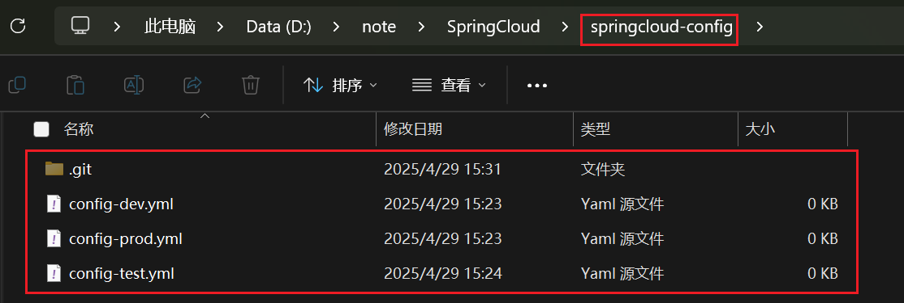


2. 新建Module模块cloud-config-center-3344

3. POM

   ```xml
   <dependencies>
       <!--添加消息总线RabbitMQ支持-->
       <dependency>
           <groupId>org.springframework.cloud</groupId>
           <artifactId>spring-cloud-starter-bus-amqp</artifactId>
       </dependency>
       <dependency>
           <groupId>org.springframework.cloud</groupId>
           <artifactId>spring-cloud-config-server</artifactId>
       </dependency>
       <dependency>
           <groupId>org.springframework.cloud</groupId>
           <artifactId>spring-cloud-starter-netflix-eureka-client</artifactId>
       </dependency>
       <dependency>
           <groupId>org.springframework.boot</groupId>
           <artifactId>spring-boot-starter-web</artifactId>
       </dependency>
   
       <dependency>
           <groupId>org.springframework.boot</groupId>
           <artifactId>spring-boot-starter-actuator</artifactId>
       </dependency>
       <dependency>
           <groupId>org.springframework.boot</groupId>
           <artifactId>spring-boot-devtools</artifactId>
           <scope>runtime</scope>
           <optional>true</optional>
       </dependency>
       <dependency>
           <groupId>org.projectlombok</groupId>
           <artifactId>lombok</artifactId>
           <optional>true</optional>
       </dependency>
       <dependency>
           <groupId>org.springframework.boot</groupId>
           <artifactId>spring-boot-starter-test</artifactId>
           <scope>test</scope>
       </dependency>
   </dependencies>
   ```

   

4. YML

   ```yml
   server:
     port: 3344
   
   spring:
     application:
       name:  cloud-config-center #注册进Eureka服务器的微服务名
     cloud:
       config:
         server:
           git:
             uri: https://github.com/isjhd/springcloud-config.git #GitHub上面的git仓库名字
             ####搜索目录
             search-paths:
               - springcloud-config
         ####读取分支
         label: master
   
   #服务注册到eureka地址
   eureka:
     client:
       service-url:
         defaultZone: http://localhost:7001/eureka
   
   ```

   

5. 主启动类

   ```java
   @SpringBootApplication
   @EnableConfigServer
   public class ConfigCenterMain3344 {
       public static void main(String[] args) {
           SpringApplication.run(ConfigCenterMain3344.class, args);
       }
   }
   ```

   

6. windows下修改hosts文件，增加映射
   127.0.0.1        config-3344.com

7. 测试通过Config微服务是否可以从GitHub上获取配置内容
   启动微服务3344
   http://config-3344.com:3344/master/config-dev.yml


### 5. 客户端配置和测试

1. 新建cloud-config-client-3355

2. POM

   ```xml
   <dependencies>
       <dependency>
           <groupId>org.springframework.cloud</groupId>
           <artifactId>spring-cloud-starter-config</artifactId>
       </dependency>
       <dependency>
           <groupId>org.springframework.cloud</groupId>
           <artifactId>spring-cloud-starter-netflix-eureka-client</artifactId>
       </dependency>
       <dependency>
           <groupId>org.springframework.boot</groupId>
           <artifactId>spring-boot-starter-web</artifactId>
       </dependency>
       <dependency>
           <groupId>org.springframework.boot</groupId>
           <artifactId>spring-boot-starter-actuator</artifactId>
       </dependency>
   
       <dependency>
           <groupId>org.springframework.boot</groupId>
           <artifactId>spring-boot-devtools</artifactId>
           <scope>runtime</scope>
           <optional>true</optional>
       </dependency>
       <dependency>
           <groupId>org.projectlombok</groupId>
           <artifactId>lombok</artifactId>
           <optional>true</optional>
       </dependency>
       <dependency>
           <groupId>org.springframework.boot</groupId>
           <artifactId>spring-boot-starter-test</artifactId>
           <scope>test</scope>
       </dependency>
   </dependencies>
   ```

3. bootstrap.yml

是什么？

> applicaiton.yml是用户级的资源配置项
>
> bootstrap.yml是系统级的，优先级更加高

Spring Cloud会创建一个Bootstrap Context，作为Spring应用的Application Context的父上下文。初始化的时候，Bootstrap Context负责从外部源加载配置属性并解析配置。这两个上下文共享一个从外部获取的Environment。

Bootstrap属性有高优先级，默认情况下，它们不会被本地配置覆盖。Bootstrapcontext和ApplicationContext有着不同的约定，所以新增了一个bootstrap.yml文件，保证BootstrapContext和ApplicationContext配置的分离。

要将Client模块下的application.yml文件改为bootstrap.yml,这是很关键的，因为bootstrap.yml是比application.yml先加载的。bootstrap.yml优先级高于application.yml

```yml
server:
  port: 3355

spring:
  application:
    name: config-client
  cloud:
    #Config客户端配置
    config:
      label: master #分支名称
      name: config #配置文件名称
      profile: dev #读取后缀名称   上述3个综合：master分支上config-dev.yml的配置文件被读取http://config-3344.com:3344/master/config-dev.yml
      uri: http://localhost:3344 #配置中心地址k

#服务注册到eureka地址
eureka:
  client:
    service-url:
      defaultZone: http://localhost:7001/eureka
```


4. 主启动

   ```java
   @EnableEurekaClient
   @SpringBootApplication
   public class ConfigClientMain3355 {
       public static void main(String[] args) {
           SpringApplication.run(ConfigClientMain3355.class, args);
       }
   }
   ```

   

5. 业务类

   ```java
   @RestController
   public class ConfigClientController {
   
       @Value("${config.info}")
       private String configInfo;
   
       @GetMapping("/configInfo")
       public String getConfigInfo() {
           return configInfo;
       }
       
   }
   ```

   

6. 测试

启动Config配置中心3344微服务并自测

启动3355作为Client准备访问

http://eureka7001.com:7001/

http://config-3344.com:3344/master/config-prod.yml

http://config-3344.com:3344/master/config-dev.yml

http://localhost:3355/configlnfo

成功实现了客户端3355访问SpringCloudConfig3344通过GitHub获取配置信息


### 6. 客户端动态刷新

问题随时而来，分布式配置的动态刷新问题

> Linux运维修改GitHub上的配置文件内容做调整
>
> 刷新3344，发现ConfigServer配置中心立刻响应
>
> 刷新3355，发现ConfigClient客户端没有任何响应
>
> 3355没有变化除非自己重启或者重新加载


为了避免每次更新配置都要重启客户端微服务3355

修改3355客户端模块

1. POM引入actuator监控

   ```xml
   <dependency>
   	<groupId>org.springframework.boot</groupId>
   	<artifactId>spring-boot-starter-actuator</artifactId>
   </dependency>
   ```

2. 修改YML，暴露监控端口

   ```yml
   #暴露监控端点
   management:
     endpoint:
       web:
         exposure:
           include: "*"
   ```

3. 业务类Controller修改
   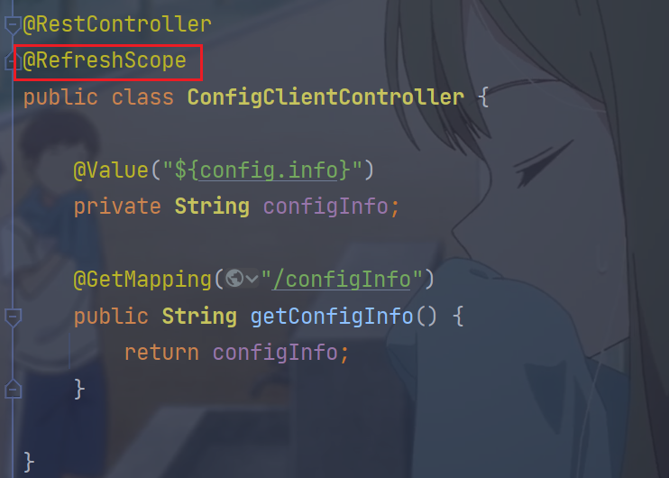

4. 需要运维人员发送Post请求刷新3355
   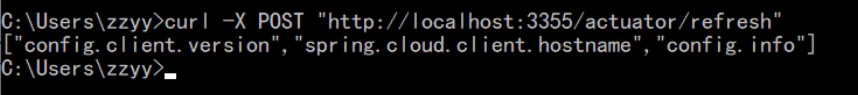

避免了服务重启


那么还有什么问题？

> 假如有多个微服务客户端3355/3366/3377
>
> 每个微服务都要执行一次post请求，手动刷新？


## 十三、SpringCloudBus消息总线

> 分布式自动刷新配置功能
>
> Spring Cloud Bus配合Spring Cloud Config 使用可以实现配置的动态刷新。


### 1. 是什么

> SpringCloudBus配合SpringCloudConfig使用可以实现配置的动态刷新。
>
> Bus支持两种消息代理：RabbitMQ和Kafka

SpringCloudBus是用来将分布式系统的节点与轻量级消息系统链接起来的框架，
它整合了Java的事件处理机制和消息中间件的功能。 SpringCludBus目前支持RabbitMQ和Kafka。


### 2. 能干什么

> SpringCloudBus能管理和传播分布式系统间的消息，就像一个分布式执行器，可用于广播状态更改、事件推送等，也可以当作微服务间的通信通道。
>


### 3. 为什么被称为总线

什么是总线

> 在微服务架构的系统中，通常会使用轻量级的消息代理来构建一个共用的消息主题，并让系统中所有微服务实例都连接上来。由于该主题中产生的消息会被所有实例监听和消费，所以称它为消息总线。在总线上的各个实例，都可以方便地广播一些需要让其他连接在该主题上的实例都知道的消息。


基本原理

> ConfigClient实例都监听MQ中同一个topic(默认是springCloudBus)。当一个服务刷新数据的时候，它会把这个信息放入到Topic中，这样其它监听同一Topic的服务就能得到通知，然后去更新自身的配置。


### 4. 动态刷新全局广播

1. 新建项目cloud-config-client-3366

2. POM

   ```xml
   <dependencies>
       <dependency>
           <groupId>org.springframework.cloud</groupId>
           <artifactId>spring-cloud-starter-config</artifactId>
       </dependency>
       <dependency>
           <groupId>org.springframework.cloud</groupId>
           <artifactId>spring-cloud-starter-netflix-eureka-client</artifactId>
       </dependency>
       <dependency>
           <groupId>org.springframework.boot</groupId>
           <artifactId>spring-boot-starter-web</artifactId>
       </dependency>
       <dependency>
           <groupId>org.springframework.boot</groupId>
           <artifactId>spring-boot-starter-actuator</artifactId>
       </dependency>
   
       <dependency>
           <groupId>org.springframework.boot</groupId>
           <artifactId>spring-boot-devtools</artifactId>
           <scope>runtime</scope>
           <optional>true</optional>
       </dependency>
       <dependency>
           <groupId>org.projectlombok</groupId>
           <artifactId>lombok</artifactId>
           <optional>true</optional>
       </dependency>
       <dependency>
           <groupId>org.springframework.boot</groupId>
           <artifactId>spring-boot-starter-test</artifactId>
           <scope>test</scope>
       </dependency>
   </dependencies>
   ```

3. YML

   ```yml
   server:
     port: 3366
   
   spring:
     application:
       name: config-client
     cloud:
       #Config客户端配置
       config:
         label: master #分支名称
         name: config #配置文件名称
         profile: dev #读取后缀名称   上述3个综合：master分支上config-dev.yml的配置文件被读取http://config-3344.com:3344/master/config-dev.yml
         uri: http://localhost:3344 #配置中心地址
   
   #服务注册到eureka地址
   eureka:
     client:
       service-url:
         defaultZone: http://localhost:7001/eureka
   
   # 暴露监控端点
   management:
     endpoints:
       web:
         exposure:
           include: "*"
   ```

4. 主启动

   ```java
   @EnableEurekaClient
   @SpringBootApplication
   public class ConfigClientMain3366 {
       public static void main(String[] args) {
           SpringApplication.run(ConfigClientMain3366.class, args);
       }
   }
   ```

5. controller

   ```java
   @RestController
   @RefreshScope
   public class ConfigClientController {
   
       @Value("${server.port}")
       private String serverPort;
   
       @Value("${config.info}")
       private String configInfo;
   
       @GetMapping("/configInfo")
       public String getConfigInfo() {
           return "serverPort: " + serverPort + "\t\n\n configInfo: " + configInfo;
       }
   
   }
   ```

   

**设计思想**

1. 利用消息总线触发一个客户端/bus/refresh，而刷新所有客户端的配置
2. 利用消息总线触发一个服务端ConfigServer的/bus/refresh端点，而刷新所有客户端的


配置图二的架构显然更加适合，图一不适合的原因如下

1. 打破了微服务的职责单一性，因为微服务本身是业务模块，它本不应该承担配置刷新的职责。
2. 破坏了微服务各节点的对等性。
3. 有一定的局限性。例如，微服务在迁移时，它的网络地址常常会发生变化，此时如果想要做到自动刷新，那就会增加更多的修改


给cloud-config-center-3344配置中心**服务端**添加消息总线支持

- POM

  ```xml
  <!--添加消息总线RabbitMQ支持-->
  <dependency>
  	<groupId>org.springframework.cloud</groupId>
  	<artifactId>spring-cloud-starter-bus-amqp</artifactId>
  </dependency>
  ```

  

- YML

  ```yml
  #rabbitmq相关配置
  rabbitmq:
    host: 192.168.13.129
    port: 5672
    username: admin
    password: 123
  
  #rabbitmq相关配置，暴露bus刷新配置的端点
  management:
    endpoints:
      web:
        exposure:
          include: 'bus-refresh'
  ```

   

给 cloud-config-client-3355客户端 和 cloud-config-client-3366客户端 
添加消息总线支持

- POM

  ```xml
  <!--添加消息总线RabbitMQ支持-->
  <dependency>
  	<groupId>org.springframework.cloud</groupId>
  	<artifactId>spring-cloud-starter-bus-amqp</artifactId>
  </dependency>
  ```

  

- YML

  ```yml
  #rabbitmg相关配置15672是web管理界面的端口：5672是MQ访问的端口
  rabbitmq:
    host: 192.168.13.129
    port: 5672
    username: admin
    password: 123
  ```

  

**测试**

修改Github上配置文件增加版本号

发送POST请求：curl -X POST "http://localhost:3344/actuator/bus-refresh"

> 一次发送，处处生效
>

配置中心：http://config-3344.com:3344/config-dev.yml

客户端：http://localhost:3355/configlnfo 
				http://localhost:3366/configlnfo

获取配置信息，发现都已经刷新了


### 5. 动态刷新定点通知

不想全部通知，只想定点通知


指定具体某一个实例生效而不是全部

> 公式：http://localhost:配置中心的端口号/actuator/bus-refresh/{destination}
>
> /bus/refresh请求不再发送到具体的服务实例上，而是发给configserver并通过destination参数类指定需要更新配置的服务或实例


**案例**

我们这里以刷新运行在3355端口上的config-client为例

只通知3355 不通知3366

curl -X POST "http://localhost:3344/actuator/bus-refresh/config-client:3355"


## 十四、SpringCloudStream消息驱动

> 有没有一种新的技术诞生，让我们不再关注具体MQ的细节。
>
> 我们只需要用一种适配绑定的方式，自动的给我们在各种MQ内切换。


### 1. 是什么

> 一句话：屏蔽底层消息中间件的差异，降低切换成本，统一消息的编程模型
>

什么是SpringCloudStream

官方定义SpringCloudStream是一个构建消息驱动微服务的框架。

应用程序通过inputs或者outputs来与SpringCloudStream中binder对象交互。

通过我们配置来binding(绑定)，而SpringCloudStream的binder对象负责与消息中间件交互。

所以，我们只需要搞清楚如何与SpringCloudStream交互就可以方便使用消息驱动的方式。

通过使用SpringIntegration来连接消息代理中间件以实现消息事件驱动。

Spring Cloud Stream 为一些供应商的消息中间件产品提供了个性化的自动化配置实现，引引用了发布-订阅、消费组、分区的三个核心概念。

**目前仅支持RabbitMQ、Kafka**。


### 2. 为什么用

> 中间件的差异性导致我们实际项目开发给我们造成了一定的困扰，我们如果用了两个消息队列的其中一种，后面的业务需求，我想往另外一种消息队列进行迁移，这时候无疑就是一个灾难性的，一大堆东西都要重新推倒重新做，因为它跟我们的系统耦合了，这时候springcloud Stream给我们提供了一种解耦合的方式。

在没有绑定器这个概念的情况下，我们的SpringBoot应用要直接与消息中间件进行信息交互的时候，由于各消息中间件构建的初衷不同，它们的实现细节上会有较大的差异性通过定义绑定器作为中间层，完美地实现了应用程序与消息中间件细节之间的隔离。通过向应用程序暴露统一的channel通道，使得应用程序不需要再考虑各种不同的消息中间件实现。

> 通过定义绑定器Binder作为中间层，实现了应用程序与消息中间件细节之间的隔离。


### 3. 编码API和常用注解

Binder：很方便的连接中间件，屏蔽差异。

Channel：通道，是队列Queue的一种抽象，在消息通讯系统中就是实现存储和转发的媒介，通过Channel对队列进行配置。

Source和Sink：简单的可理解为参照对象是SpringCloudStream自身，从Stream发布消息就是输出，接受消息就是输入。

| 组成            | 说明                                                         |
| --------------- | ------------------------------------------------------------ |
| Middleware      | 中间件，目前只支持RabbitMQ和Kafka                            |
| Binder          | Binder是应用与消息中间件之间的封装，目前实行了Kafka和RabbitMQ的Binder，通过Binder可以很方便的连接中间件，可以动态的改变消息类型（对应于Kafka的topic， RabbitMQ的exchange)，这些都可以通过配置文件来实现 |
| @Input          | 注解标识输入通道，通过该输入通道接收到的消息进入应用程序     |
| @Output         | 注解标识输出通道，发布的消息将通过该通道离开应用程序         |
| @StreamListener | 监听队列，用于消费者的队列的消息接收                         |
| @EnableBinding  | 指信道channel和exchange绑定在一起                            |


### 4. 生产者

1. 新建Module：cloud-stream-rabbitmq-provider8801

2. POM

   ```xml
   <dependencies>
       <dependency>
           <groupId>org.springframework.boot</groupId>
           <artifactId>spring-boot-starter-web</artifactId>
       </dependency>
       <dependency>
           <groupId>org.springframework.boot</groupId>
           <artifactId>spring-boot-starter-actuator</artifactId>
       </dependency>
       <dependency>
           <groupId>org.springframework.cloud</groupId>
           <artifactId>spring-cloud-starter-netflix-eureka-client</artifactId>
       </dependency>
       <dependency>
           <groupId>org.springframework.cloud</groupId>
           <artifactId>spring-cloud-starter-stream-rabbit</artifactId>
       </dependency>
       <!--基础配置-->
       <dependency>
           <groupId>org.springframework.boot</groupId>
           <artifactId>spring-boot-devtools</artifactId>
           <scope>runtime</scope>
           <optional>true</optional>
       </dependency>
       <dependency>
           <groupId>org.projectlombok</groupId>
           <artifactId>lombok</artifactId>
           <optional>true</optional>
       </dependency>
       <dependency>
           <groupId>org.springframework.boot</groupId>
           <artifactId>spring-boot-starter-test</artifactId>
           <scope>test</scope>
       </dependency>
   </dependencies>
   ```

   

3. YML

   ```yml
   server:
     port: 8801
   
   spring:
     application:
       name: cloud-stream-provider
     cloud:
         stream:
           binders: # 在此处配置要绑定的rabbitmq的服务信息；
             defaultRabbit: # 表示定义的名称，用于于binding整合
               type: rabbit # 消息组件类型
               environment: # 设置rabbitmq的相关的环境配置
                 spring:
                   rabbitmq:
                     host: 192.168.13.129
                     port: 5672
                     username: admin
                     password: 123
           bindings: # 服务的整合处理
             output: # 这个名字是一个通道的名称
               destination: studyExchange # 表示要使用的Exchange名称定义
               content-type: application/json # 设置消息类型，本次为json，文本则设置“text/plain”
               binder: defaultRabbit # 设置要绑定的消息服务的具体设置
   
   eureka:
     client: # 客户端进行Eureka注册的配置
       service-url:
         defaultZone: http://localhost:7001/eureka
     instance:
       lease-renewal-interval-in-seconds: 2 # 设置心跳的时间间隔（默认是30秒）
       lease-expiration-duration-in-seconds: 5 # 如果现在超过了5秒的间隔（默认是90秒）
       instance-id: send-8801.com  # 在信息列表时显示主机名称
       prefer-ip-address: true     # 访问的路径变为IP地址
   ```

   

4. 主启动类

   ```java
   @SpringBootApplication
   public class StreamMQMain8801 {
       public static void main(String[] args) {
           SpringApplication.run(StreamMQMain8801.class, args);
       }
   }
   ```

   

5. 发送消息接口 service.IMessageProvider

   ```java
   public interface IMessageProvider {
       public String send();
   }
   ```

   

6. 发送消息接口实现类 service实现类

   ```java
   @EnableBinding(Source.class)//定义消息的推送管道
   public class MessageProviderImpl implements IMessageProvider {
   
       @Resource
       private MessageChannel output;//消息发送管道
   
       @Override
       public String send() {
           String serial = UUID.randomUUID().toString();
           output.send(MessageBuilder.withPayload(serial).build());
           System.out.println("=======serial: " + serial);
           return null;
       }
   }
   ```

   

7. Controller

   ```java
   @RestController
   public class SendMessageController {
       @Resource
       private IMessageProvider messageProvider;
   
       @GetMapping(value = "/sendMessage")
       public String sendMessage() {
           return messageProvider.send();
       }
   
   }
   ```

8. 测试
   启动7001eureka
   启动rabbitmq
   启动8801
   访问 http://localhost:8801/sendMessage


### 5. 消费者

1. 新建Module：cloud-stream-rabbitmq-consumer8802

2. POM

   ```xml
   <dependencies>
       <dependency>
           <groupId>org.springframework.boot</groupId>
           <artifactId>spring-boot-starter-web</artifactId>
       </dependency>
       <dependency>
           <groupId>org.springframework.cloud</groupId>
           <artifactId>spring-cloud-starter-netflix-eureka-client</artifactId>
       </dependency>
       <dependency>
           <groupId>org.springframework.cloud</groupId>
           <artifactId>spring-cloud-starter-stream-rabbit</artifactId>
       </dependency>
       <dependency>
           <groupId>org.springframework.boot</groupId>
           <artifactId>spring-boot-starter-actuator</artifactId>
       </dependency>
       <!--基础配置-->
       <dependency>
           <groupId>org.springframework.boot</groupId>
           <artifactId>spring-boot-devtools</artifactId>
           <scope>runtime</scope>
           <optional>true</optional>
       </dependency>
       <dependency>
           <groupId>org.projectlombok</groupId>
           <artifactId>lombok</artifactId>
           <optional>true</optional>
       </dependency>
       <dependency>
           <groupId>org.springframework.boot</groupId>
           <artifactId>spring-boot-starter-test</artifactId>
           <scope>test</scope>
       </dependency>
   </dependencies>
   ```

   

3. YML

   ```yml
   server:
     port: 8802
   
   spring:
     application:
       name: cloud-stream-consumer
     cloud:
         stream:
           binders: # 在此处配置要绑定的rabbitmq的服务信息；
             defaultRabbit: # 表示定义的名称，用于于binding整合
               type: rabbit # 消息组件类型
               environment: # 设置rabbitmq的相关的环境配置
                 spring:
                   rabbitmq:
                     host: 192.168.13.129
                     port: 5672
                     username: admin
                     password: 123
           bindings: # 服务的整合处理
             input: # 这个名字是一个通道的名称
               destination: studyExchange # 表示要使用的Exchange名称定义
               content-type: application/json # 设置消息类型，本次为对象json，如果是文本则设置“text/plain”
               binder: defaultRabbit # 设置要绑定的消息服务的具体设置
   
   
   
   eureka:
     client: # 客户端进行Eureka注册的配置
       service-url:
         defaultZone: http://localhost:7001/eureka
     instance:
       lease-renewal-interval-in-seconds: 2 # 设置心跳的时间间隔（默认是30秒）
       lease-expiration-duration-in-seconds: 5 # 如果现在超过了5秒的间隔（默认是90秒）
       instance-id: receive-8802.com  # 在信息列表时显示主机名称
       prefer-ip-address: true     # 访问的路径变为IP地址
   ```

   

4. 主启动类

   ```java
   @SpringBootApplication
   public class StreamMQMain8802 {
       public static void main(String[] args) {
           SpringApplication.run(StreamMQMain8802.class, args);
       }
   }
   ```

   

5. controller

   ```java
   @Component
   @EnableBinding({Sink.class})
   public class ReceiveMessageListenerController {
   
       @Value("${server.port}")
       private String serverPort;
   
       @StreamListener(Sink.INPUT)
       public void input(Message<String> message) {
           System.out.println("消费者1号，---->接收到的消息：" +
                   message.getPayload() + "\t port：" + serverPort);
       }
       
   }
   ```

6. 测试
   8801发送8802接收消息 http://localhost:8801/sendMessage


### 6. 分组消费与持久化

1. 依照8802，clone出来一份运行8803
2. 运行后有两个问题：有重复消费问题 和 消息持久化问题


#### (1)重复消费

> 目前是8802/8803同时都收到了，存在重复消费问题
>

如何解决：分组和持久化属性group

比如在如下场景中，订单系统我们做集群部署，都会从RabbitMQ中获取订单信息，那如果一个订单同时被两个服务获取到，那么就会造成数据错误，我们得避免这种情况。这时我们就可以使用Stream中的消息分组来解决

注意：在Stream中处于同一个group中的多个消费者是竞争关系，就能够保证消息只会被其中一个应用消费一次。

不同组是可以全面消费的(重复消费)，同一组内会发生竞争关系，只有其中一个可以消费。


**故障现象**：重复消费
**导致原因**：默认分组group是不同的，组流水号不一样，被认为不同组，可以消费

自定义配置分组，自定义配置分为同一个组，解决重复消费问题


##### 分组

> 原理：微服务应用放置于同一个group中，就能够保证消息只会被其中一个应用消费一次。不同的组是可以消费的，同一个组内会发生竞争关系，只有其中一个可以消费。
>

- 8802/8803都变成不同组，group两个不同

group：atguiguA、atguiguB

8802修改YML：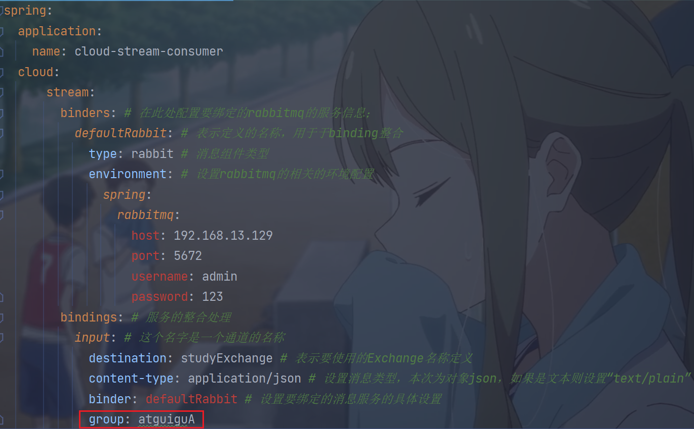


8803修改YML：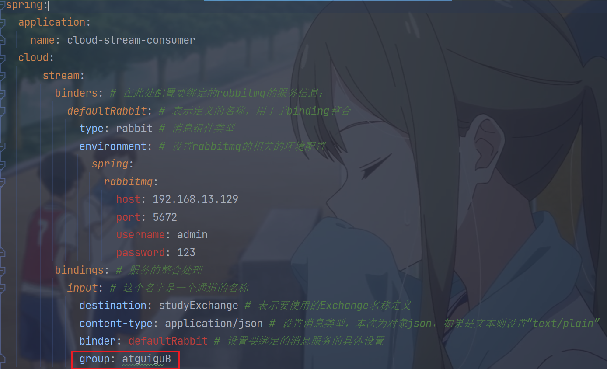


- 8802/8803都变成相同组，group两个相同

group：atguiguA

8803修改YML：


#### (2)持久化

1. 停止8802 和 8803并去除掉 8802 的分组 group：atguiguA
2. 8801 先发送4条消息到 rabbitmq
3. 先启动8802，无分组属性配置，后台没有打出来消息
4. 再启动8803，有分组属性配置，后台打出来了MQ上的消息


## 十五、SpringCloudSleuth分布式请求链路跟踪

### 1. 概述

出现的问题

> 在微服务框架中，一个由客户端发起的请求在后端系统中会经过多个不同的的服务节点调用来协同产生最后的请求结果，每一个前段请求都会形成一条复杂的分布式服务调用链路，链路中的任何一环出现高延时或错误都会引起整个请求最后的失败。


是什么

> SpringCloudSleuth提供了一套完整的服务跟踪的解决方案在分布式系统中提供追踪解决方案并且兼容支持了zipkin


### 2. 搭建

#### (1) zipkin

> SpringCloud从F版起已不需要自己构建ZipkinServer了，只需调用jar包即可

下载地址：https://search.maven.org/remote_content?g=io.zipkin.java&a=zipkin-server&v=LATEST&c=exec

运行jar

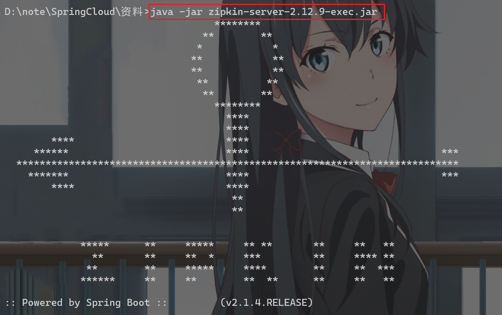


运行控制台：http://localhost:9411/zipkin/


名词解释：

> Trace：类似于树结构的Span集合，表示一条调用链路，存在唯一标识
>
> span：表示调用链路来源，通俗的理解span就是一次请求信息


#### (2) 服务提供者

1. cloud-provider-payment8001

2. POM

   ```xml
   <!--包含了sleuth + zipkin-->
   <dependency>
       <groupId>org.springframework.cloud</groupId>
       <artifactId>spring-cloud-starter-zipkin</artifactId>
   </dependency>
   ```

   

3. YML
   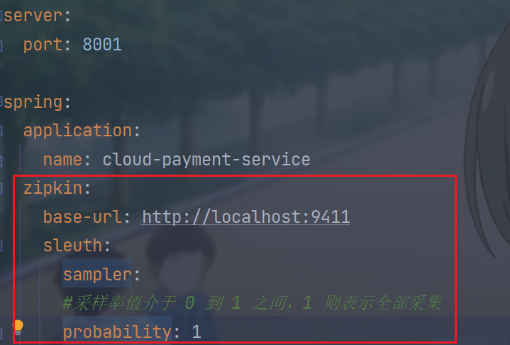

4. 业务类PaymentController

   ```java
   @RestController
   @Slf4j
   public class PaymentController {
   
       @GetMapping("/payment/zipkin")
       public String paymentZipkin() {
           return "hi, I am paymentzipkin server fall back, welcome";
       }
       
   }
   ```

   

#### (3) 服务消费者

1. cloud-consumer-order80

2. POM

   ```xml
   <!--包含了sleuth + zipkin-->
   <dependency>
   	<groupId>org.springframework.cloud</groupId>
   	<artifactId>spring-cloud-starter-zipkin</artifactId>
   </dependency>
   ```

   

3. YML
   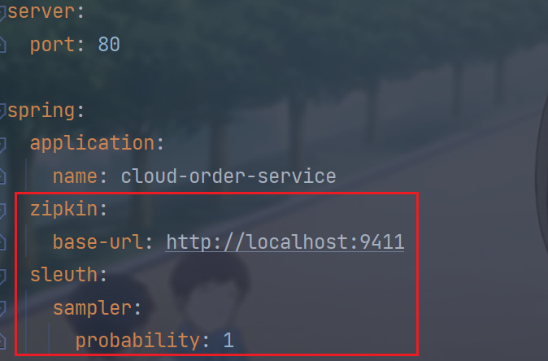

4. 业务类OrderController

   ```java
   @RestController
   @Slf4j
   public class OrderController {
   
       // =========> zipkin + sleuth
       @GetMapping("/consumer/payment/zipkin")
       public String paymentZipkin() {
           String result = restTemplate.
                   getForObject("http://localhost:8001" + "/payment/zipkin/", String.class);
           return result;
       }
   
   }
   
   ```

   

#### (4) 测试

1. 依次启动eureka7001/8001/80
2. 80调用8001几次测试下：http://localhost/consumer/payment/zipkin
3. 打开浏览器访问：http://localhost:9411


## 十六、SpringCloudAlibaba

### 1. 入门简介

为什么会出现SpringCloud alibaba

> SpringCloudNetflix项目进入维护模式


能干吗

- 服务限流降级：默认支持Servlet、Feign、RestTemplate、Dubbo和RocketMQ限流降级功能的接入，可以在运行时通过控制台实时修改限流降级规则，还支持查看限流降级Metrics监控。
- 服务注册与发现：适配SpringCloud服务注册与发现标准，默认集成了Ribbon的支持。
- 分布式配置管理：支持分布式系统中的外部化配置，配置更改时自动刷新。
- 消息驱动能力：基于SpringCloudStream为微服务应用构建消息驱动能力。
- 阿里云对象存储：阿里云提供的海量、安全、低成本、高可靠的云存储服务。支持在任何应用、任何时间、任何地点存储和访问任意类型的数据。
- 分布式任务调度：提供秒级、精准、高可靠、高可用的定时（基于Cron表达式）任务调度服务。同时提供分布式的任务执行模型，如网格任务。网格任务支持海量子任务均匀分配到所有Worker（schedulerx-client）上执行。


### 2. Nacos服务注册和配置中心

#### (1)简介

> 为什么叫Nacos，前四个字母分别为Naming和Configuration的前两个字母，最后的s为Service。


是什么

> 一个更易于构建云原生应用的动态服务发现、配置管理和服务管理平台。
>
> Nacos就是注册中心 + 配置中心的组合


能干吗

> 替代Eureka做服务注册中心
>
> 替代Config做服务配置中心


| 服务注册与发现 | CAP模型 | 控制台管理 | 社区活跃度      |
| -------------- | ------- | ---------- | --------------- |
| Eureka         | AP      | 支持       | 低(2.x版本闭源) |
| Zookeeper      | CP      | 不支持     | 中              |
| Consul         | CP      | 支持       | 高              |
| Nacos          | AP      | 支持       | 高              |


#### (2)安装并运行Nacos

1. 本地 Java8 + Maven 环境已经OK
2. 先从官网下载Nacos
3. 解压安装包，进入bin目录，启动命令：startup.cmd -m standalone
   (standalone代表着单机模式运行，非集群模式):
4. 命令运行成功后直接访问http://localhost:8848/nacos


#### (3)注册中心演示

##### 3.1 服务提供者

1. 新建Module：cloudalibaba-provider-payment9001

2. 父POM

   ```xml
   <!--spring cloud alibaba 2.1.0.RELEASE-->
   <dependency>
       <groupId>com.alibaba.cloud</groupId>
       <artifactId>spring-cloud-alibaba-dependencies</artifactId>
       <version>2.1.0.RELEASE</version>
       <type>pom</type>
       <scope>import</scope>
   </dependency>
   ```

3. 本模块POM

   ```xml
   <dependencies>
       <!--SpringCloud ailibaba nacos -->
       <dependency>
           <groupId>com.alibaba.cloud</groupId>
           <artifactId>spring-cloud-starter-alibaba-nacos-discovery</artifactId>
       </dependency>
       <!-- SpringBoot整合Web组件 -->
       <dependency>
           <groupId>org.springframework.boot</groupId>
           <artifactId>spring-boot-starter-web</artifactId>
       </dependency>
       <dependency>
           <groupId>org.springframework.boot</groupId>
           <artifactId>spring-boot-starter-actuator</artifactId>
       </dependency>
       <!--日常通用jar包配置-->
       <dependency>
           <groupId>org.springframework.boot</groupId>
           <artifactId>spring-boot-devtools</artifactId>
           <scope>runtime</scope>
           <optional>true</optional>
       </dependency>
       <dependency>
           <groupId>org.projectlombok</groupId>
           <artifactId>lombok</artifactId>
           <optional>true</optional>
       </dependency>
       <dependency>
           <groupId>org.springframework.boot</groupId>
           <artifactId>spring-boot-starter-test</artifactId>
           <scope>test</scope>
       </dependency>
   </dependencies>
   ```

   

4. YML

   ```yml
   server:
     port: 9001
   
   spring:
     application:
       name: nacos-payment-provider
     cloud:
       nacos:
         discovery:
           server-addr: localhost:8848 #配置Nacos地址
   
   management:
     endpoints:
       web:
         exposure:
           include: '*'
   ```

   

5. 主启动

   ```java
   @EnableDiscoveryClient
   @SpringBootApplication
   public class PaymentMain9001 {
       public static void main(String[] args) {
           SpringApplication.run(PaymentMain9001.class, args);
       }
   }
   ```

   

6. 业务Controller类

   ```java
   @RestController
   public class PaymentController {
       @Value("${server.port}")
       private String serverPort;
   
       @GetMapping(value = "/payment/nacos/{id}")
       public String getPayment(@PathVariable("id") Integer id) {
           return "nacos registry, serverPort: " + serverPort + "\t id" + id;
       }
   }
   ```

   

7. 测试
   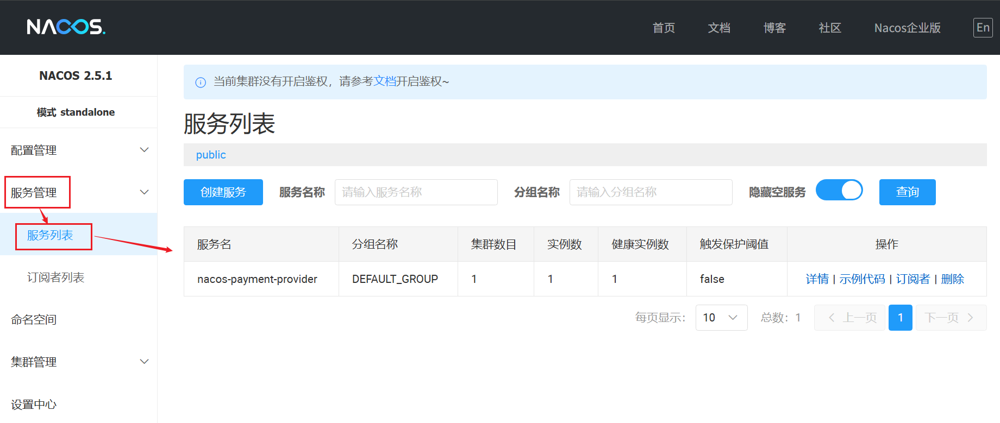


为了下一章节演示nacos的负载均衡，参照9001新建9002

> 新建cloudalibaba-provider-payment9002
>


或者取巧不想新建重复体力劳动，直接拷贝虚拟端口映射

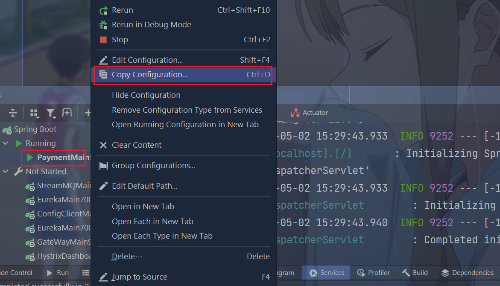

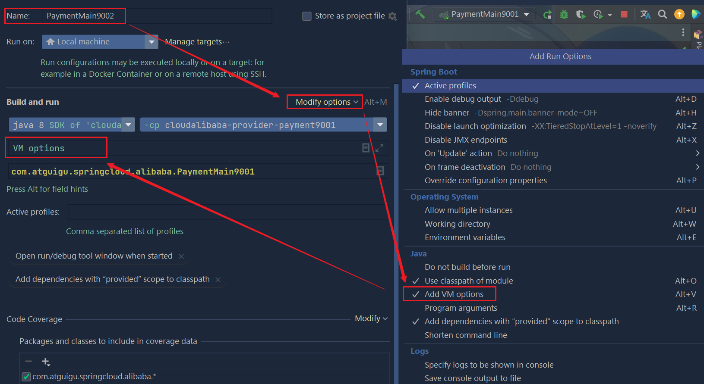

VM options添加：-DServer.port=9011


##### 3.2 服务消费者

1. 新建Module：cloudalibaba-consumer-nacos-order83

2. POM

   ```xml
   <dependencies>
       <!--SpringCloud ailibaba nacos -->
       <dependency>
           <groupId>com.alibaba.cloud</groupId>
           <artifactId>spring-cloud-starter-alibaba-nacos-discovery</artifactId>
       </dependency>
       <!-- 引入自己定义的api通用包，可以使用Payment支付Entity -->
       <dependency>
           <groupId>com.atguigu.springcloud</groupId>
           <artifactId>cloud-api-commons</artifactId>
           <version>${project.version}</version>
       </dependency>
       <!-- SpringBoot整合Web组件 -->
       <dependency>
           <groupId>org.springframework.boot</groupId>
           <artifactId>spring-boot-starter-web</artifactId>
       </dependency>
       <dependency>
           <groupId>org.springframework.boot</groupId>
           <artifactId>spring-boot-starter-actuator</artifactId>
       </dependency>
       <!--日常通用jar包配置-->
       <dependency>
           <groupId>org.springframework.boot</groupId>
           <artifactId>spring-boot-devtools</artifactId>
           <scope>runtime</scope>
           <optional>true</optional>
       </dependency>
       <dependency>
           <groupId>org.projectlombok</groupId>
           <artifactId>lombok</artifactId>
           <optional>true</optional>
       </dependency>
       <dependency>
           <groupId>org.springframework.boot</groupId>
           <artifactId>spring-boot-starter-test</artifactId>
           <scope>test</scope>
       </dependency>
   </dependencies>
   ```

   

3. YML

   ```yml
   server:
     port: 83
   
   
   spring:
     application:
       name: nacos-order-consumer
     cloud:
       nacos:
         discovery:
           server-addr: localhost:8848
   
   
   #消费者将要去访问的微服务名称(注册成功进nacos的微服务提供者)
   service-url:
     nacos-user-service: http://nacos-payment-provider
   ```

   

4. 主启动

   ```java
   @EnableDiscoveryClient
   @SpringBootApplication
   public class OrderNacosMain83 {
       public static void main(String[] args) {
           SpringApplication.run(OrderNacosMain83.class, args);
       }
   }
   ```

   

5. controller

   ```java
   @RestController
   @Slf4j
   public class OrderNacosController {
       @Resource
       private RestTemplate restTemplate;
   
       @Value("${service-url.nacos-user-service}")
       private String serverURL;
   
       @GetMapping(value = "/consumer/payment/nacos/{id}")
       public String paymentInfo(@PathVariable("id") Long id) {
           return restTemplate.getForObject(serverURL + "/payment/nacos/" + id, String.class);
       }
   
   }
   ```

   

6. config类

   ```java
   @Configuration
   public class ApplicationContextConfig
   {
       @Bean
       @LoadBalanced
       public RestTemplate getRestTemplate()
       {
           return new RestTemplate();
       }
   }
   ```

   

7. 测试负载均衡

   http://localhost:83/consumer/payment/nacos/13
   83访问9001/9002，轮询负载OK


##### 3.3 服务注册中心对比

**Nacos和CAP**

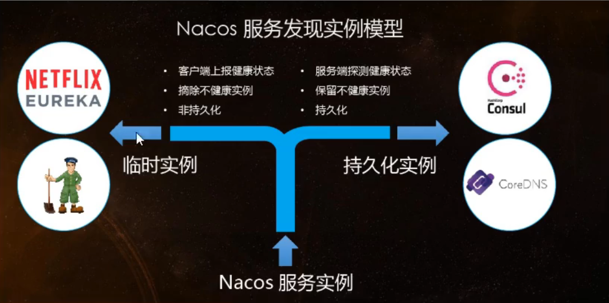

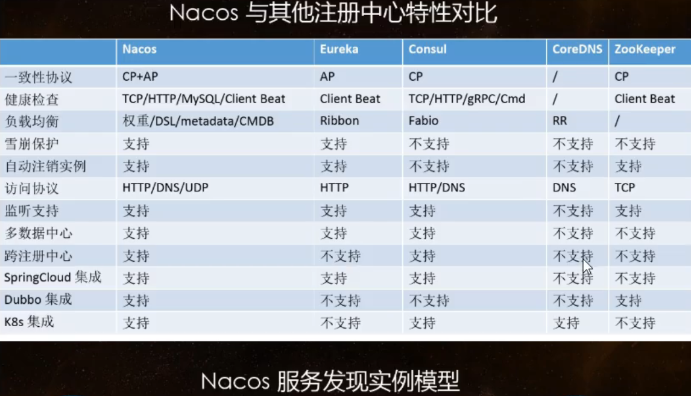


**Nacos支持AP和CP模式的切换**

> C是所有节点在同一时间看到的数据是一致的；而A的定义是所有的请求都会收到响应。
>


何时选择使用何种模式？

一般来说，如果不需要存储服务级别的信息且服务实例是通过nacos-client注册，并能够保持心跳上报，那么就可以选择AP模式。当前主流的服务如Springcloud和Dubbo服务，都适用于AP模式，AP模式为了服务的可能性而减弱了一致性，因此AP模式下只支持注册临时实例。

如果需要在服务级别编辑或者存储配置信息，那么CP是必须，K8S服务和DNS服务则适用于CP模式。

CP模式下则支持注册持久化实例，此时则是以Raf协议为集群运行模式，该模式下注册实例之前必须先注册服务，如果服务不存在，则会返回错误。


#### (4)配置中心演示

##### 4.1 基础配置

1. 新建Module：cloudalibaba-config-nacos-client3377

2. POM

   ```xml
   <dependencies>
       <!--nacos-config-->
       <dependency>
           <groupId>com.alibaba.cloud</groupId>
           <artifactId>spring-cloud-starter-alibaba-nacos-config</artifactId>
       </dependency>
       <!--nacos-discovery-->
       <dependency>
           <groupId>com.alibaba.cloud</groupId>
           <artifactId>spring-cloud-starter-alibaba-nacos-discovery</artifactId>
       </dependency>
       <!--web + actuator-->
       <dependency>
           <groupId>org.springframework.boot</groupId>
           <artifactId>spring-boot-starter-web</artifactId>
       </dependency>
       <dependency>
           <groupId>org.springframework.boot</groupId>
           <artifactId>spring-boot-starter-actuator</artifactId>
       </dependency>
       <!--一般基础配置-->
       <dependency>
           <groupId>org.springframework.boot</groupId>
           <artifactId>spring-boot-devtools</artifactId>
           <scope>runtime</scope>
           <optional>true</optional>
       </dependency>
       <dependency>
           <groupId>org.projectlombok</groupId>
           <artifactId>lombok</artifactId>
           <optional>true</optional>
       </dependency>
       <dependency>
           <groupId>org.springframework.boot</groupId>
           <artifactId>spring-boot-starter-test</artifactId>
           <scope>test</scope>
       </dependency>
   </dependencies>
   ```


3. YML

为什么配置两个？

> Nacos同springcloud-config一样，在项目初始化时，要保证先从配置中心进行配置拉取，拉取配置之后，才能保证项目的正常启动。
>
> springboot中配置文件的加载是存在优先级顺序的，bootstrap优先级高于application

bootstrap.yml

```yml
# nacos配置
server:
  port: 3377

spring:
  application:
    name: nacos-config-client
  cloud:
    nacos:
      discovery:
        server-addr: localhost:8848 #Nacos服务注册中心地址
      config:
        server-addr: localhost:8848 #Nacos作为配置中心地址
        file-extension: yaml #指定yaml格式的配置


```

application.yml

```yml
spring:
  profiles:
    active: dev # 表示开发环境
    #active: test # 表示测试环境
    #active: info
```


4. 主启动

   ```java
   @EnableDiscoveryClient
   @SpringBootApplication
   public class NacosConfigClientMain3377 {
       public static void main(String[] args) {
           SpringApplication.run(NacosConfigClientMain3377.class, args);
       }
   }
   ```

   

5. controller

   ```java
   @RestController
   @RefreshScope //支持Nacos的动态刷新功能。
   public class ConfigClientController {
       @Value("${config.info}")
       private String configInfo;
   
       @GetMapping("/config/info")
       public String getConfigInfo() {
           return configInfo;
       }
   }
   ```


6. 在Nacos中添加配置信息

Nacos中的匹配规则

> Nacos中的dataid的组成格式及与SpringBoot配置文件中的匹配规则

```yml
#${spring.application.name}-${spring.profile.active}.${spring.cloud.nacos.config.file-extension}

# nacos-config-client-dev.yaml
```

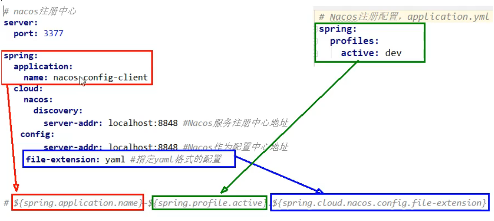


**Nacos界面配置对应**

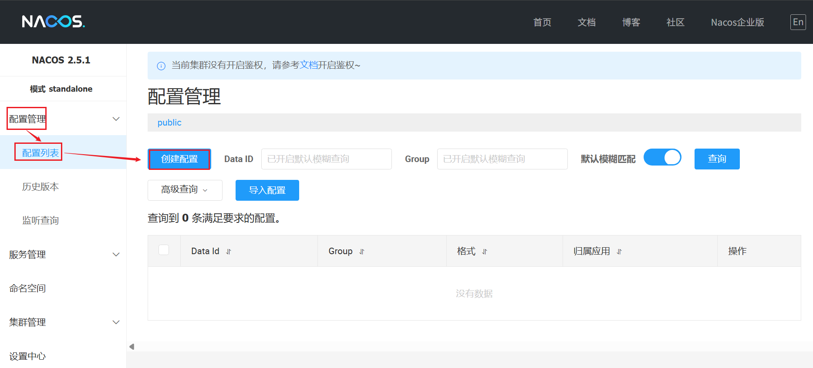

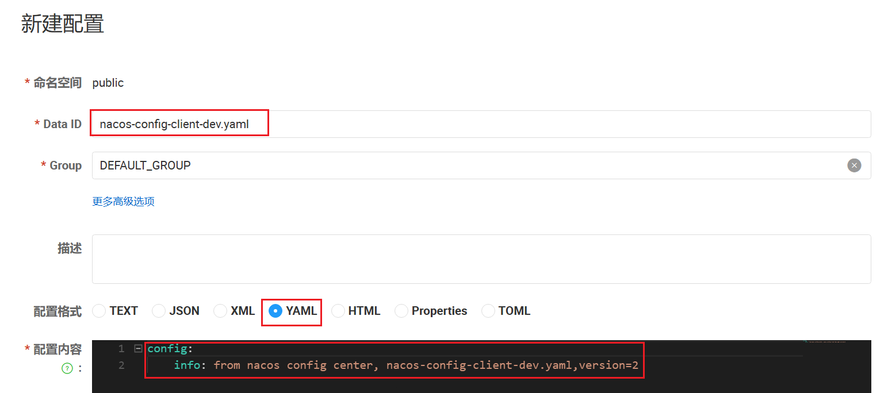


测试：http://localhost:3377/config/info


> 自带动态刷新：修改下Nacos中的yaml配置文件，再次调用查看配置的接口，就会发现配置已经刷新


##### 4.2 分类配置

问题：多环境多项目管理

- 问题1：
  实际开发中，通常一个系统会准备
  dev开发环境，test测试环境，prod生产环境。
  如何保证指定环境启动时服务能正确读取到Nacos上相应环境的配置文件呢？

- 问题2：
  一个大型分布式微服务系统会有很多微服务子项目，
  每个微服务项目又都会有相应的开发环境、测试环境、预发环境、正式环境....
  那怎么对这些微服务配置进行管理呢？

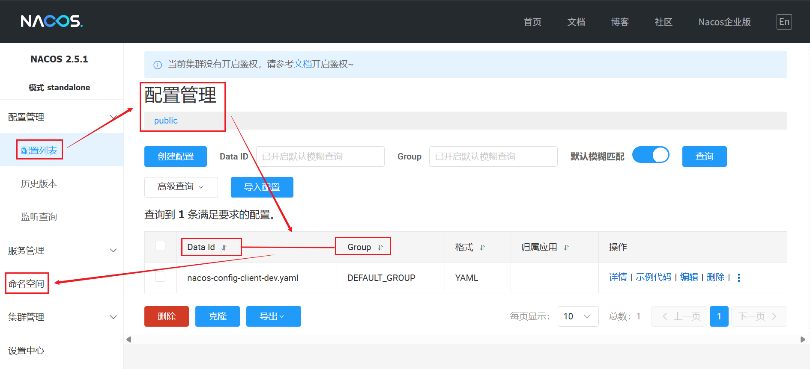

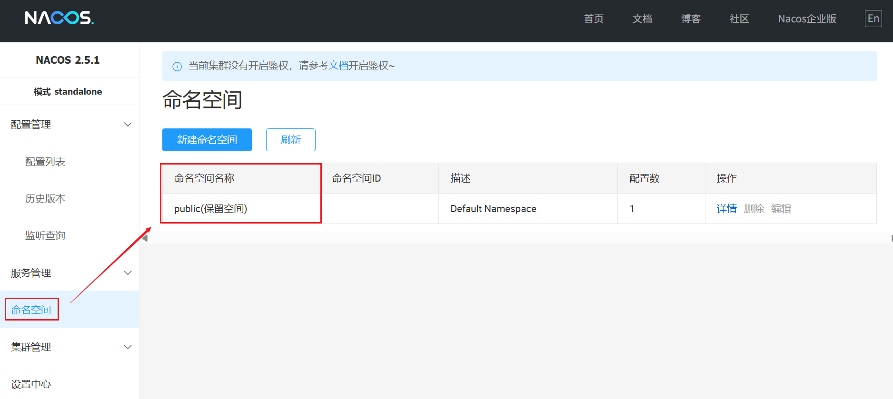


是什么？

> 类似Java里面的package名和类名。
>
> 最外层的namespace是可以用于区分部署环境的，Group和DatalD逻辑上区分两个目标对象。

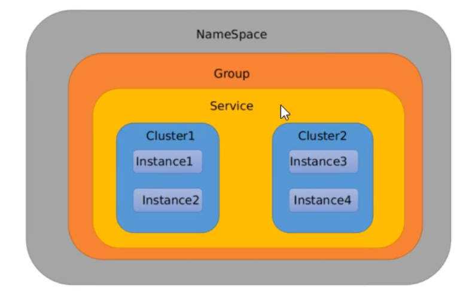


Nacos默认的命名空间是public，Namespace主要用来实现隔离。

比方说我们现在有三个环境：开发、测试、生产环境，我们就可以创建三个**Namespace**，不同的Namespace之间是隔离的。

**Group**默认是DEFAULT_GROUP，Group可以把不同的微服务划分到同一个分组里面去。

Service就是微服务；一个Service可以包含多个Cluster(集群)，Nacos默认Cluster是DEFAULT，Cluster是对指定微服务的一个虚拟划分。比方说为了容灾，将Service微服务分别部署在了杭州机房和广州机房，这时就可以给杭州机房的Service微服务起一个集群名称(HZ)，给广州机房的Service微服务起一个集群名称(GZ)，还可以尽量让同一个机房的微服务互相调用，以提升性能。

最后是lnstance，就是微服务的实例。


###### 三种方案加载配置

1. DataID方案


指定spring.profile.active和配置文件的DatalD来使不同环境下读取不同的配置

默认空间+默认分组+新建dev和test两个DatalD

- 新建dev配置DatalD
  
- 新建test配置DatalD
  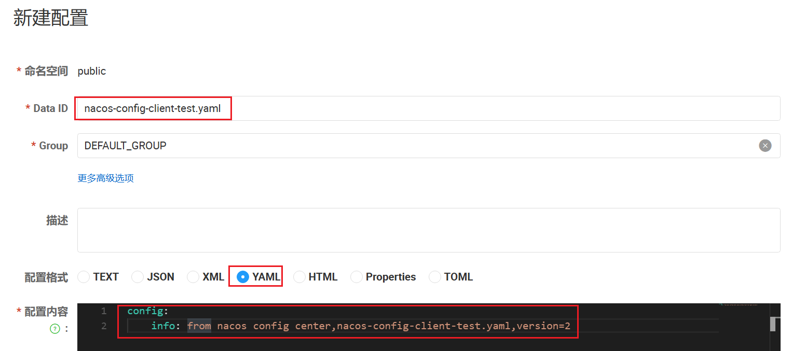


通过spring.profile.active属性就能进行多环境下配置文件的读取

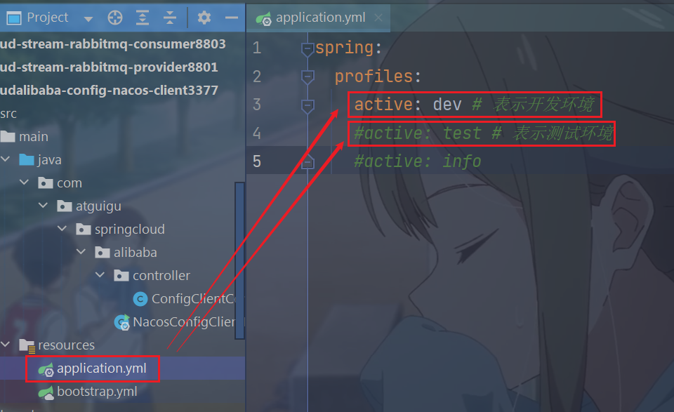


2. Group方案

通过Group实现环境区分

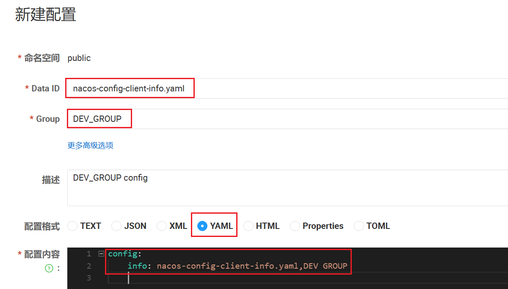

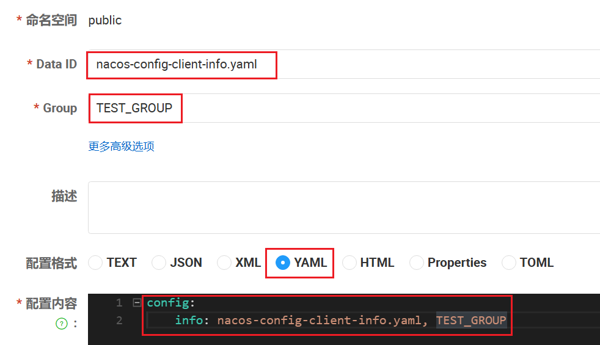


bootstrap+application

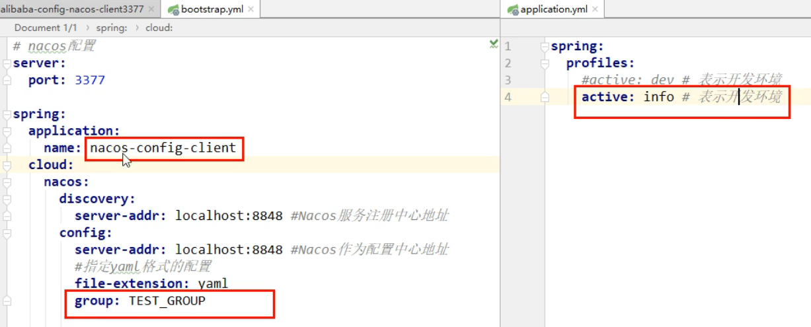


3. Namespace方案

新建 dev / test 的Namespace

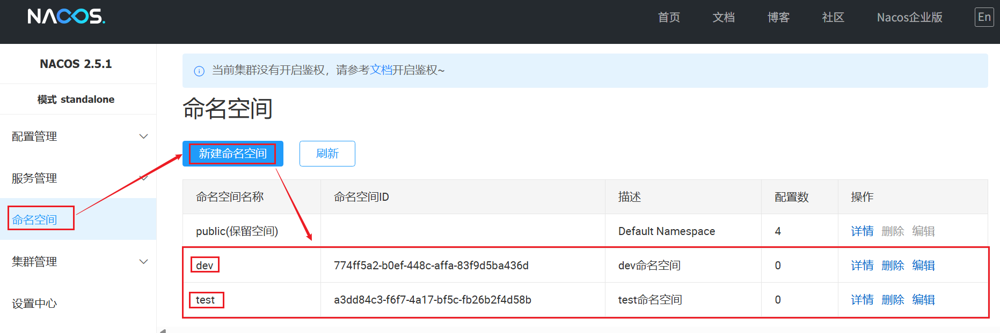


回到服务管理-服务列表查看

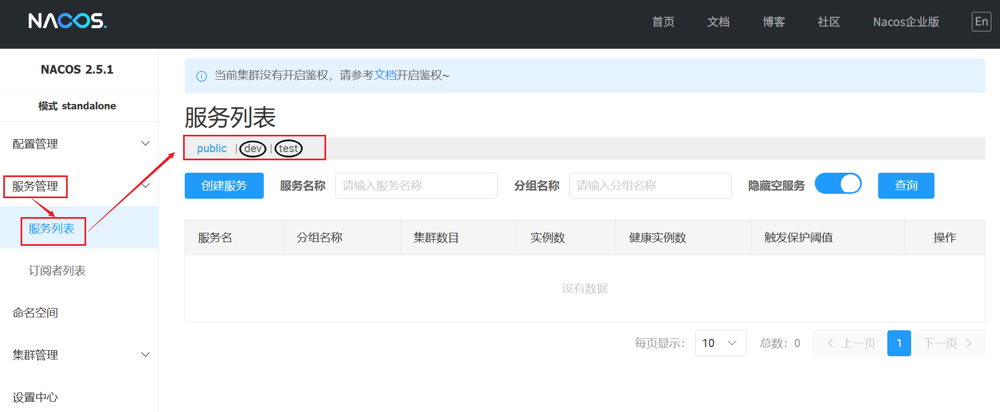


修改bootstrap.yml

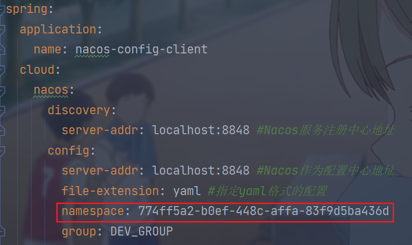


通过Namespace实现环境区分

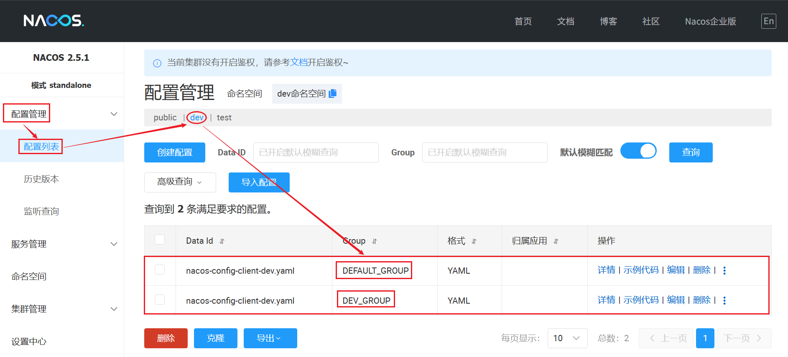


#### (5)集群和持久化配置

##### 5.1 Nacos持久化配置

> Nacos默认自带的是嵌入式数据库derby

derby切换到mysql切换配置步骤

1. nacos\conf 目录下找到sql脚本，mysql-schema.sql，在数据库里执行。

2. nacos\conf目录下找到application.properties，增加支持MySQL数据源配置，添加MySQL数据源的url、用户名和密码。

   ```properties
   spring.sql.init.platform=mysql
   
   db.num=1
   db.url.0=jdbc:mysql://127.0.0.1:3306/nacos_config?characterEncoding=utf8&connectTimeout=1000&socketTimeout=3000&autoReconnect=true&useUnicode=true&useSSL=false&serverTimezone=Asia/Shanghai
   db.user=root
   db.password=isjhd
   ```

   

启动Nacos，可以看到是个全新的空记录界面，以前是记录进derby


##### 5.2 Nacos之Linux版本安装

下载：https://github.com/alibaba/nacos/releases/download/2.5.1/nacos-server-2.5.1.tar.gz

存放到 /opt

解压：tar -zxvf nacos-server-2.5.1.tar.gz


##### 5.3 集群配置步骤

1. Linux服务器上mysql数据库配置
   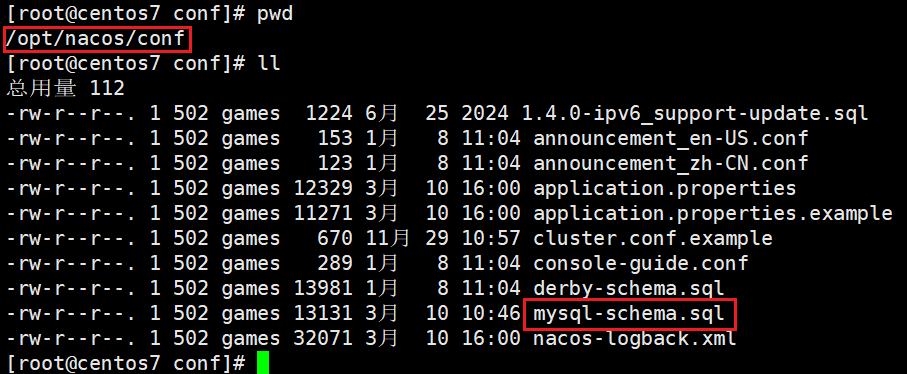

   在自己Linux机器上粘贴mysql-schema.sql到Linux服务器上mysql数据库
   cd /opt/mysql

2. application.properties 配置
   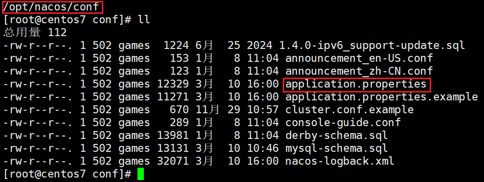

   修改vim application.properties，新增：

   ```properties
   spring.sql.init.platform=mysql
   
   db.num=1
   db.url.0=jdbc:mysql://127.0.0.1:3306/nacos_config?characterEncoding=utf8&connectTimeout=1000&socketTimeout=3000&autoReconnect=true&useUnicode=true&useSSL=false&serverTimezone=Asia/Shanghai
   db.user=root
   db.password=isjhd041001
   ```

3. Linux服务器上nacos的集群配置cluster.conf
   梳理出2台nacos集器的不同服务端口号
   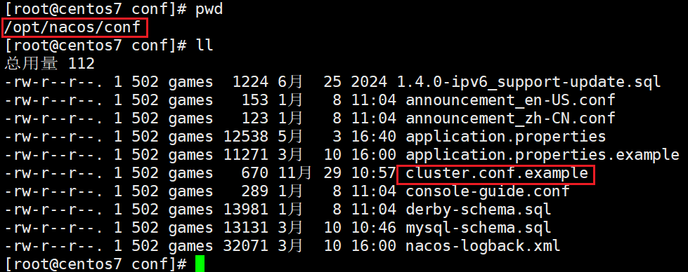

   复制出cluster.conf
   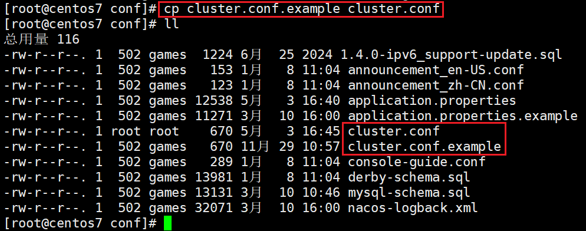

   修改cluster.conf的内容(这个IP不能写127.0.0.1，必须是Linux命令 hostname -i 能够识别的IP)
   
   ```properties
   192.168.124.19:8848
   192.168.13.129:8848
   ```
   
5. Nginx的配置，由它作为负载均衡器
   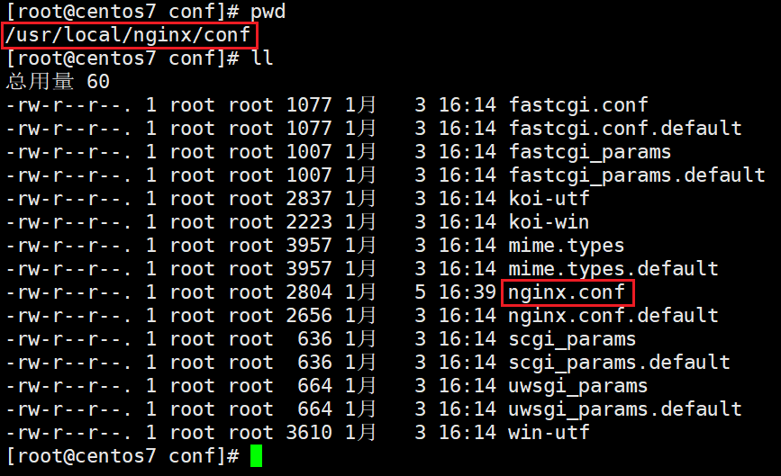

   修改nginx的配置文件
   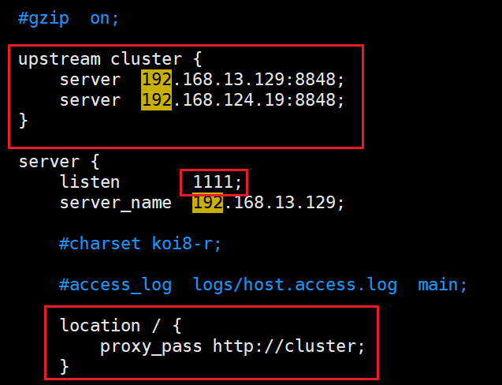


测试

启动Nacos：

> 路径：/opt/nacos/bin
>
> 每个服务器执行命令：sh startup.sh(linux)	startup.cmd(windows)
>


启动nginx：

> 路径：/usr/local/nginx/sbin
>
> 执行：./nginx -c /usr/local/nginx/conf/nginx.conf
>
> 查看是否启动：ps -ef | grep nginx


测试通过nginx访问nacos：http://192.168.13.129:1111/nacos

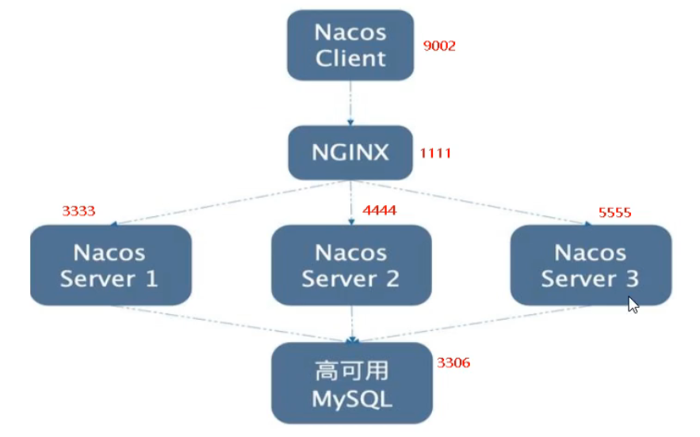


### 3. Sentinel实现熔断与限流

> 分布式系统的流量防卫兵
>


是什么？

> 轻量级的流量控制、熔断降级java库
>


#### (1) 安装Sentinel控制台

sentinel组件由2部分构成

- 核心库(Java客户端)不依赖任何框架/库，能够运行于所有Java运行时环境，同时对Dubbo/ SpringCloud等框架也有较好的支持。
- 控制台(Dashboard)基于SpringBoot开发，打包后可以直接运行，不需要额外的Tomcat等应用容器。

**安装步骤**

下载：https://github.com/alibaba/Sentinel/releases

运行前提：java8环境OK、8080端口不能被占用

开始运行：java -jar sentinel-dashboard-1.8.8.jar

访问sentinel管理界面：http://localhost:8080/，登录账号密码均为sentinel


#### (2) 初始化演示工程

1. 启动Nacos8848成功

2. 新建Module

新建：cloudalibaba-sentinel-service8401

POM

```xml
<dependencies>
    <dependency><!-- 引入自己定义的api通用包，可以使用Payment支付Entity -->
        <groupId>com.atguigu.springcloud</groupId>
        <artifactId>cloud-api-commons</artifactId>
        <version>${project.version}</version>
    </dependency>
    <!--SpringCloud ailibaba nacos -->
    <dependency>
        <groupId>com.alibaba.cloud</groupId>
        <artifactId>spring-cloud-starter-alibaba-nacos-discovery</artifactId>
    </dependency>
    <!--SpringCloud ailibaba sentinel-datasource-nacos 后续做持久化用到-->
    <dependency>
        <groupId>com.alibaba.csp</groupId>
        <artifactId>sentinel-datasource-nacos</artifactId>
    </dependency>
    <!--SpringCloud ailibaba sentinel -->
    <dependency>
        <groupId>com.alibaba.cloud</groupId>
        <artifactId>spring-cloud-starter-alibaba-sentinel</artifactId>
    </dependency>
    <!--openfeign-->
    <dependency>
        <groupId>org.springframework.cloud</groupId>
        <artifactId>spring-cloud-starter-openfeign</artifactId>
    </dependency>
    <!-- SpringBoot整合Web组件+actuator -->
    <dependency>
        <groupId>org.springframework.boot</groupId>
        <artifactId>spring-boot-starter-web</artifactId>
    </dependency>
    <dependency>
        <groupId>org.springframework.boot</groupId>
        <artifactId>spring-boot-starter-actuator</artifactId>
    </dependency>
    <!--日常通用jar包配置-->
    <dependency>
        <groupId>org.springframework.boot</groupId>
        <artifactId>spring-boot-devtools</artifactId>
        <scope>runtime</scope>
        <optional>true</optional>
    </dependency>
    <dependency>
        <groupId>cn.hutool</groupId>
        <artifactId>hutool-all</artifactId>
        <version>4.6.3</version>
    </dependency>
    <dependency>
        <groupId>org.projectlombok</groupId>
        <artifactId>lombok</artifactId>
        <optional>true</optional>
    </dependency>
    <dependency>
        <groupId>org.springframework.boot</groupId>
        <artifactId>spring-boot-starter-test</artifactId>
        <scope>test</scope>
    </dependency>

</dependencies>
```

YML

```yml
server:
  port: 8401

spring:
  application:
    name: cloudalibaba-sentinel-service
  cloud:
    nacos:
      discovery:
        #Nacos服务注册中心地址
        server-addr: localhost:8848
    sentinel:
      transport:
        #配置Sentinel dashboard地址
        dashboard: localhost:8080
        #默认8719端口，假如被占用会自动从8719开始依次+1扫描，直至找到未被占用的端口
        port: 8719

management:
  endpoints:
    web:
      exposure:
        include: '*'

feign:
  sentinel:
    enabled: true # 激活Sentinel对Feign的支持
```

主启动

```java
@EnableDiscoveryClient
@SpringBootApplication
public class MainApp8401 {
    public static void main(String[] args) {
        SpringApplication.run(MainApp8401.class, args);
    }
}
```

业务类FlowLimitController

```java
@RestController
@Slf4j
public class FlowLimitController {
    @GetMapping("/testA")
    public String testA() {
        return "------testA";
    }

    @GetMapping("/testB")
    public String testB() {
        return "------testB";
    }
}
```


3. 启动Sentinel8080

4. 启动8401微服务后查看sentienl控制台：空空如也，啥都没有

因为Sentinel采用的懒加载机制，所以需要执行一次访问
http://localhost:8401/testA


#### (3) 流控规则

##### 3.1 基本介绍

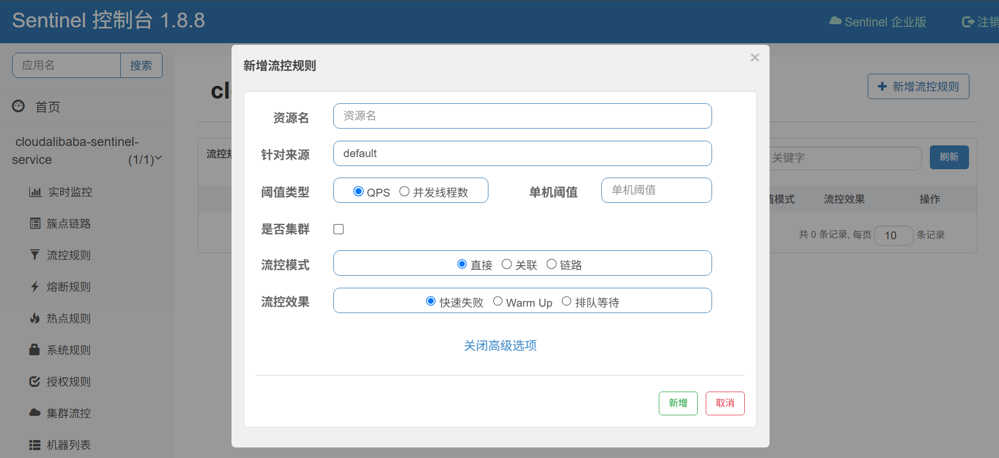

- 资源名：唯一名称，默认请求路径
- 针对来源：Sentinel可以针对调用者进行限流，填写微服务名，默认default(不区分来源)
- 阈值类型/单机阈值：
  - QPS(每秒钟的请求数量)：当调用该api的QPS达到间值的时候，进行限流。
  - 线程数：当调用该api的线程数达到阀值的时候，进行限流
- 是否集群：不需要集群
- 流控模式：
  - 直接：api达到限流条件时，直接限流
  - 关联：当关联的资源达到阈值时，就限流自己
  - 链路：规定一个入口，设置的资源的流量达到阈值，就限制入口的资源【api级别的针对来源】
- 流控效果：
  - 快速失败：直接失败，抛异常
  - WarmUp：根据codeFactor(冷加载因子，默认3)的值，从阀值/codeFactor，经过预热时长，才达到设置的QPS阈值
  - 排队等待：匀速排队，让请求以匀速的速度通过，阀值类型必须设置为QPS，否则无效


##### 3.2 流控模式

- 直接(默认)：api达到限流条件时，直接限流
  表示1秒钟内查询1次就是0K，若超过次数1，就直接-快速失败，报默认错误
  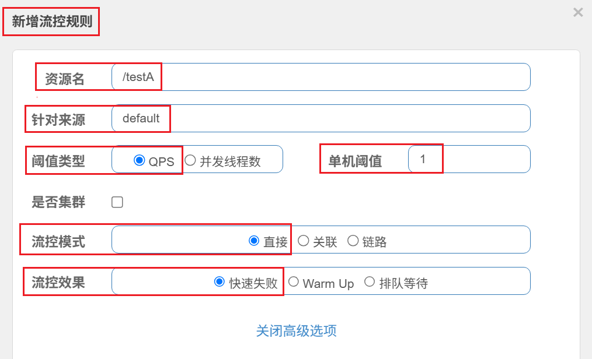

  测试：快速点击访问http://localhost:8401/testA

  结果：Blocked by Sentinel (flow limiting)


- 关联：当关联的资源达到阈值时，就限流自己
  (当与A关联的资源B达到阀值后，就限流A自己)

> 当关联资源/testB的qps阀值超过1时，就限流/testA的Rest访问地址，当关联资源到阈值后限制配置好的资源名

配置A

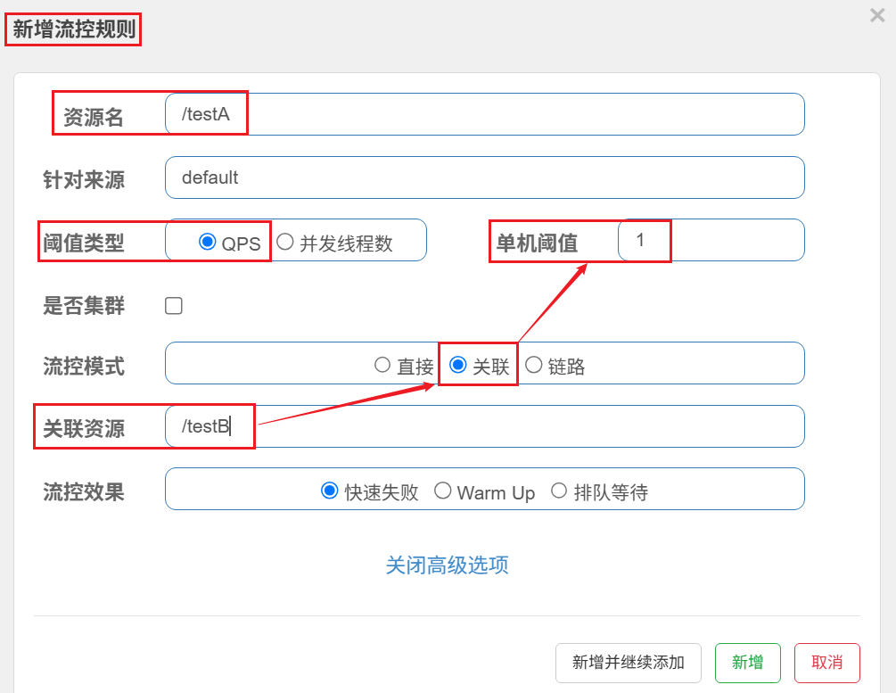


postman模拟并发 密集访问testB，运行后发现testA挂了


- 链路：规定一个入口，设置的资源的流量达到阈值，就限制入口的资源【api级别的针对来源】


##### 3.3 流控效果

- 直接：直接失败，抛异常


- 预热


> 公式：阈值除以coldFactor（默认值为3），经过预热时长后才会达到阈值

默认coldFactor为3，即请求QPS从(threshold／3)开始，经预热时长逐渐升至设定的QPS阈值。

案例，阀值为10+预热时长设置5秒。

系统初始化的阀值为10/3约等于3，即阀值刚开始为3；然后过了5秒后阀值才慢慢升高恢复到10

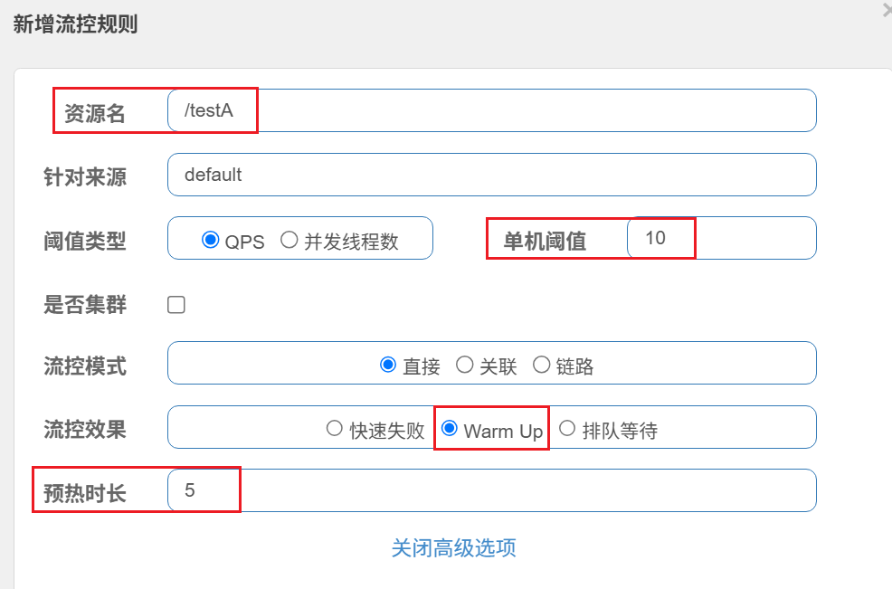


> 应用场景：秒杀系统在开启的瞬间，会有很多流量上来，很有可能把系统打死，预热方式就是把为了保护系统，可慢慢的把流量放进来，慢慢的把阀值增长到设置的阀值。


- 排队等待：匀速排队，让请求以匀速的速度通过，阀值类型必须设置为QPS，否则无效


设置含义：/testA每秒1次请求，超过的话就排队等待，等待的超时时间为20000毫秒。

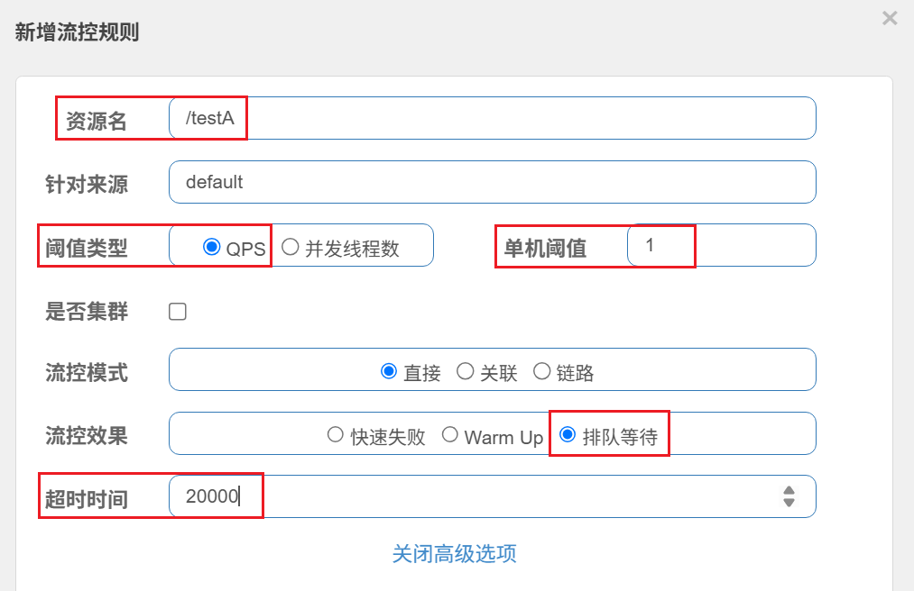


> 应用场景：这种方式主要用于处理间隔性突发的流量，例如消息队列。想象一下这样的场景，在某一秒有大量的请求到来，而接下来的几秒则处于空闲状态，我们希望系统能够在接下来的空闲期间逐渐处理这些请求，而不是在第一秒直接拒绝多余的请求。
>


#### (4) 降级规则

> Sentinel熔断降级会在调用链路中某个资源出现不稳定状态时（例如调用超时或异常比例升高），对这个资源的调用进行限制，让请求快速失败，避免影响到其它的资源而导致级联错误
>
> 当资源被降级后，在接下来的降级时间窗口之内，对该资源的调用都自动熔断（默认行为是抛出DegradeException）。
>
> Sentinel的断路器是没有半开状态的。


##### 4.1 RT

平均响应时间：当1s内持续进入5个请求，对应时刻的平均响应时间均超过阀值，那么在接下的时间窗口之内，对这个方法的调用都会自动地熔断。注意Sentinel默认统计的RT上限是4900ms，超出此间值的都会算作 4900ms，若需要变更此上限可以通过启动配置项-Dcsp.sentinel.statistic.max.rt=xxx来配置。

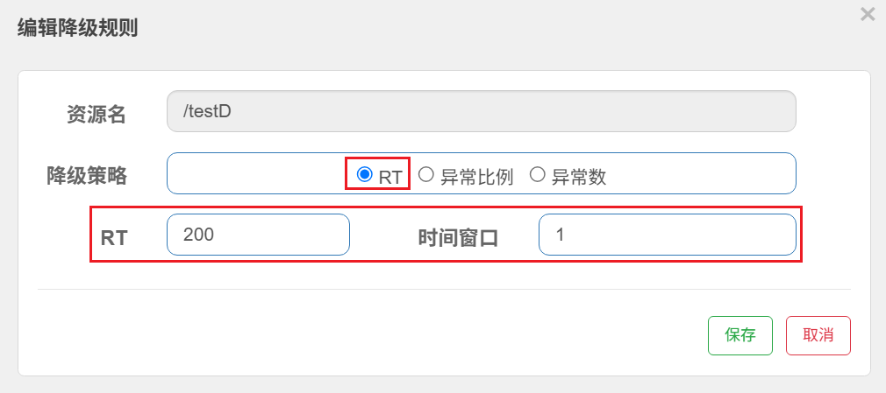

jmeter压测

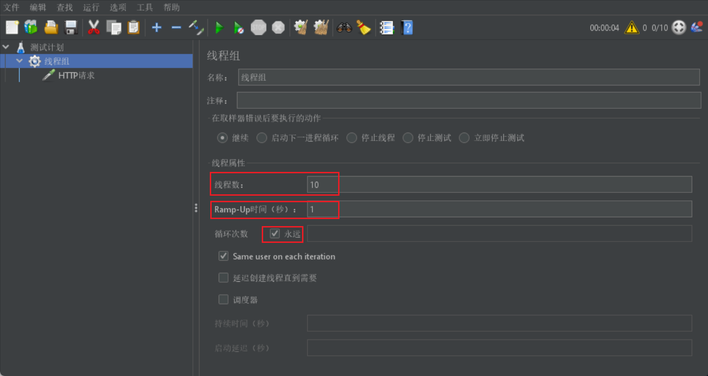

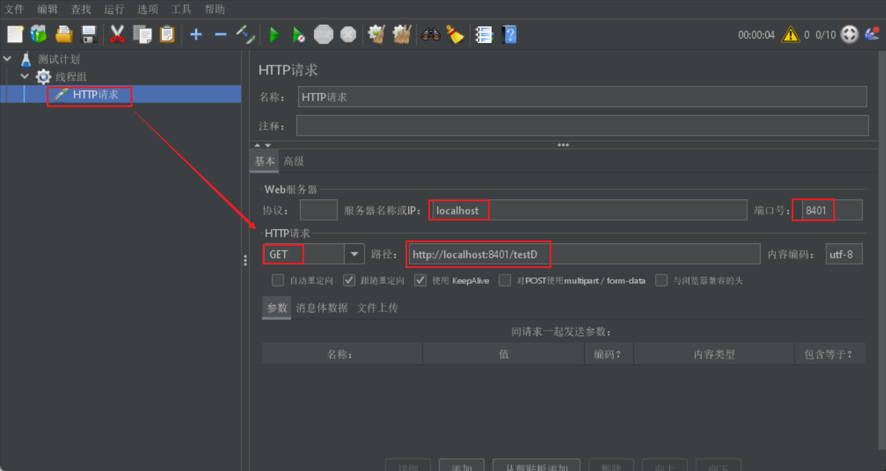

> 结论：永远一秒钟打进来10个线程（大于5个了）调用testD，我们希望200毫秒处理完本次任务，如果超过200毫秒还没处理完，在未来1秒钟的时间窗口内，断路器打开（保险丝跳闸）微服务不可用，保险丝跳闸断电了
>


##### 4.2 异常比例

异常比例：当资源的每秒请求量 >= 5，并且每秒异常总数占通过量的比值超过阈值之后，资源进入降级状态，即在接下的时间窗口之内，对这个方法的调用都会自动地返回。异常比率的阈值范围是[0.0，1.0]，代表0%-100%。

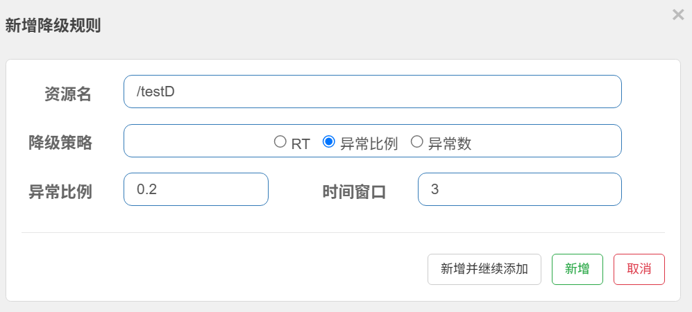

再次打开上面的jmeter压测

> 结论：单独访问一次，必然来一次报错一次(int age = 10/0)，调一次错一次。
>
> 开启jmeter后，直接高并发发送请求，多次调用达到我们的配置条件了。
>
> 断路器开启（保险丝跳闸），微服务不可用了，不再报错error而是服务降级了。


##### 4.3 异常数

异常数：当1分钟时间内的异常数目超过阈值之后会进行熔断。注意由于统计时间窗口是分钟级别的，若`timeWdow`小于60s，则结束熔断状态后仍可能再进入熔断状态。

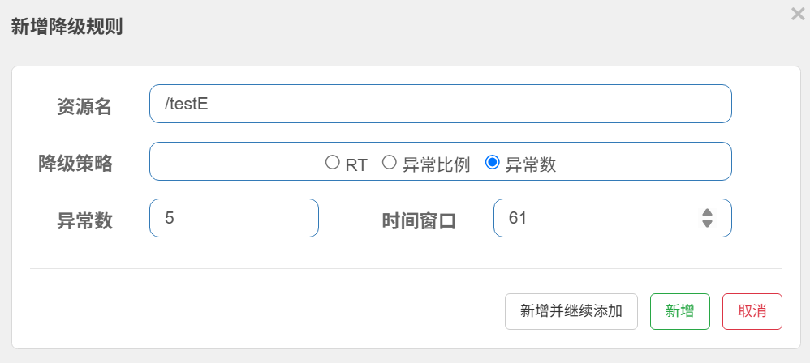

http://localhost:8401/testE，第一次访问绝对报错，因为除数不能为零，我们看到error窗口，但是达到5次报错后，进入熔断后降级。


#### (5) 热点key限流

##### 5.1 基本介绍

> 何为热点？热点即经常访问的数据。很多时候我们希望统计某个热点数据中访问频次最高的Top K 数据，并对其访问进行限制。比如：
>
> 商品ID为参数，统计一段时间内最常购买的商品ID并进行限制
>
> 用户ID为参数，针对一段时间内频繁访问的用户ID进行限制

代码

```java
@GetMapping("/testHotKey")
@SentinelResource(value = "testHotKey", blockHandler = "deal_testHotKey")
public String testHotKey(@RequestParam(value = "p1", required = false) String p1,
                         @RequestParam(value = "p2", required = false) String p2) {
    return "========testHotKey";
}

public String deal_testHotKey(String p1, String p2, BlockException exception) {
    //sentinel系统默认的提示：Blocked by Sentinel（flowLimiting）
    return "==========deal_testHotKey";
}
```

新增热点规则

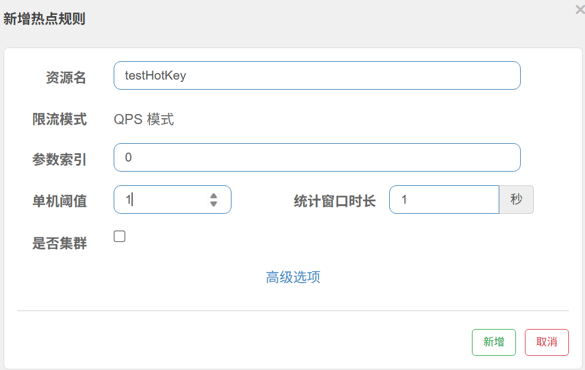

方法testHotKey里面第一个参数只要QPS超过每秒1次，马上降级处理


##### 5.2 参数例外项

**特例情况**

> 普通：超过1秒钟一个后，达到阈值1后马上被限流
>
> 特例：假如当p1的值等于5时，它的阈值可以达到200，我们期望p1参数当它是某个特殊值时，它的限流值和平时不一样

配置

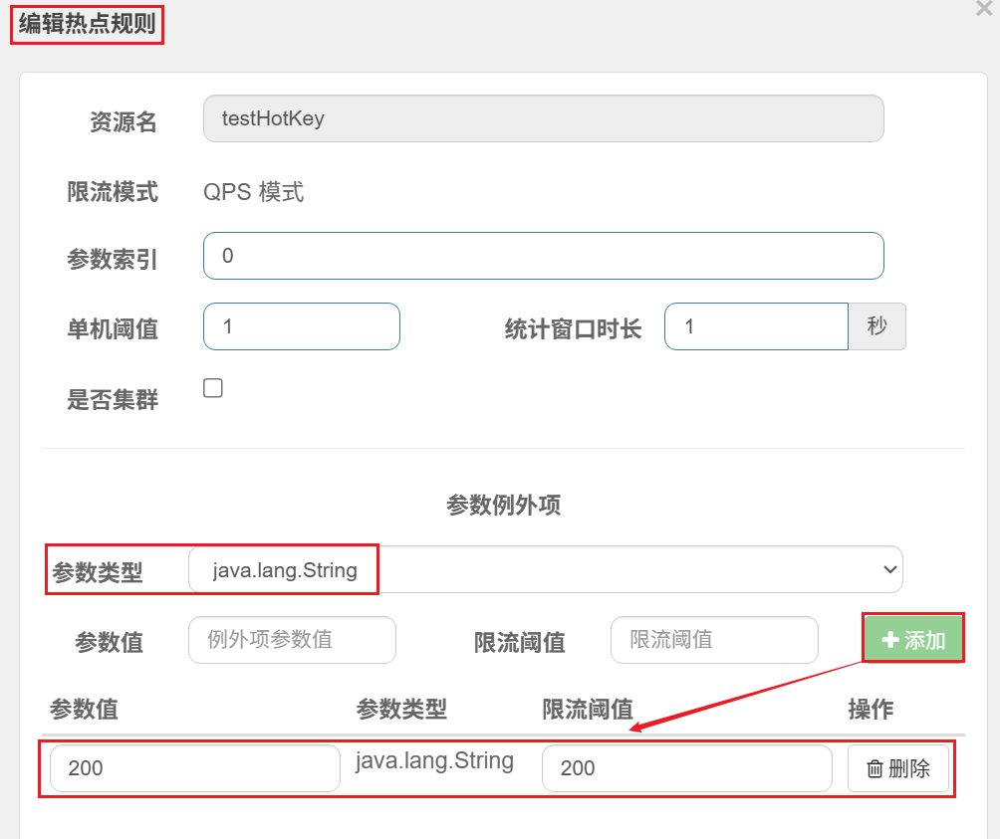

当p1等于200的时候，阈值变为200
当p1不等于200的时候，阈值就是平常的1


注意事项

> @SentinelResource：处理的是Sentinel控制台配置的违规情况，有blockHandler方法配置的兜底处理。
>
> RuntimeException：int age=10/0，这个是java运行时报出的运行时异常，@SentinelResource不管。
>
> 总结：@SentinelResource主管配置出错，运行出错该走异常走异常。


#### (6) 系统规则

是什么

> Sentinel系统自适应限流从整体维度对应用入口流量进行控制
>


各项配置参数说明

- **Load自适应**(仅对Linux/Unix-like机器生效)：系统的 load1 代为启发指标，进行自适应系统保护。当系统load1超过设定的启发值，且系统当前的并发线程数超过估算的系统容量时才会触发系统保护(BBR阶段)。系统容量由系统的`maxQps * minRt`估算得出。设定参考值一般是 `CPU cores * 2.5`。
- **CPU usage**(1.5.0+版本)：当系统CPU使用率超过阈值即触发系统保护(取值范围0.0-1.0)，比较灵敏。
- **平均 RT**：当单台机器上所有入口流量的平均RT达到阀值即触发系统保护，单位是毫秒。
- **并发线程数**：当单台机器上所有入口流量的并发线程数达到阔值即触发系统保护。
- **入口QPS**：当单台机器上所有入口流量的QPS达到间值即触发系统保护。


配置全局QPS

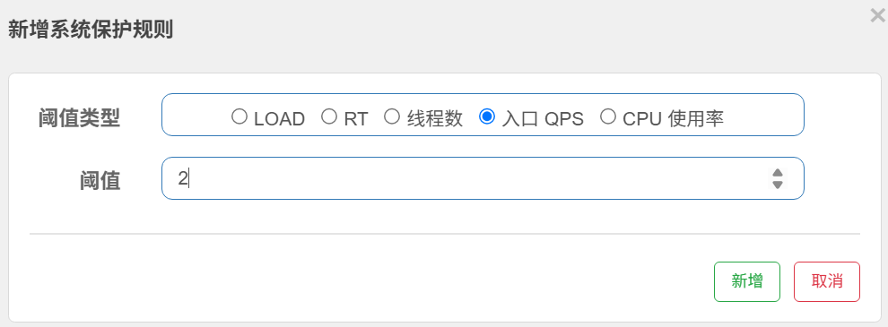


#### (7) @SentinelResource 

##### 7.1 按资源名称限流

1. 启动Nacos成功
2. 启动Sentine成功

3. 在cloudalibaba-sentinel-service8401项目上修改

4. 改POM

   ```xml
   <dependency><!-- 引入自己定义的api通用包，可以使用Payment支付Entity -->
       <groupId>com.atguigu.springcloud</groupId>
       <artifactId>cloud-api-commons</artifactId>
       <version>${project.version}</version>
   </dependency>
   ```

5. controller

   ```java
   @RestController
   public class RateLimitController {
       @GetMapping("/byResource")
       @SentinelResource(value = "byResource", blockHandler = "handleException")
       public CommonResult byResource() {
           return new CommonResult(200, "按资源名称限流测试OK", new Payment(2020L, "serial001"));
       }
   
       public CommonResult handleException(BlockException exception) {
           return new CommonResult(444, exception.getClass().getCanonicalName() + "\t 服务不可用");
       }
   
   }
   ```

6. 配置
   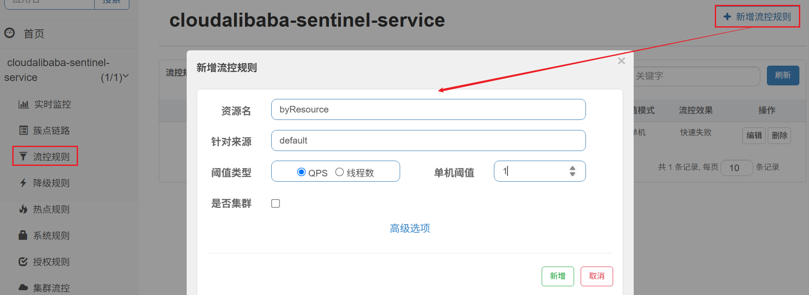


测试

> 1秒钟点击1下，OK。
>
> 超过上述，疯狂点击，返回了自己定义的限流处理信息，限流发生。


额外问题

> 此时关闭问服务8401。
>
> Sentinel控制台，流控规则消失了


##### 7.2 按照Url地址限流

业务类RateLimitController

```java
@GetMapping("/rateLimit/byUrl")
@SentinelResource(value = "byUrl")
public CommonResult byUrl() {
    return new CommonResult(200, "按url限流测试ok", new Payment(2020L, "serial002"));
}
```

配置

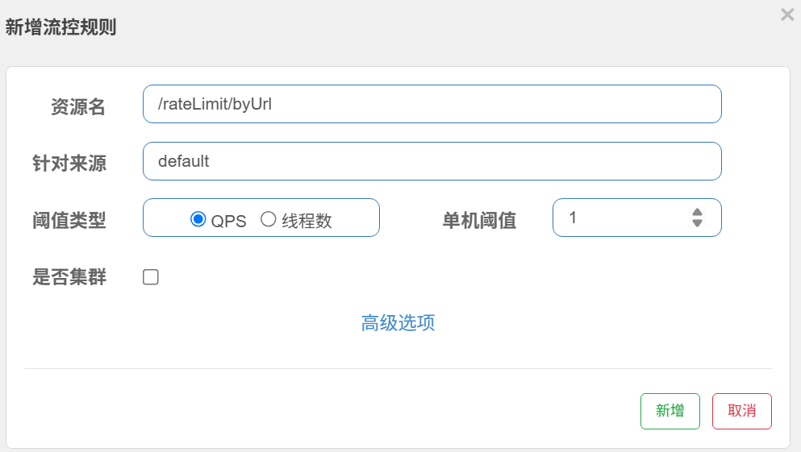


##### 7.3 面临的问题

1. 系统默认的，没有体现我们自己的业务要求。
2. 依照现有条件，我们自定义的处理方法又和业务代码耦合在一块，不直观。
3. 每个业务方法都添加一个兜底的，那代码膨胀加剧。
4. 全局统一的处理方法没有体现。


##### 7.4 客户自定义限流处理逻辑

1. 创建CustomerBlockHandler类用于自定义限流处理逻辑

   ```java
   public class CustomerBlockHandler {
       public static CommonResult handlerException(BlockException exception) {
           return new CommonResult(4444, "按客戶自定义,global handlerException----1");
       }
   
       public static CommonResult handlerException2(BlockException exception) {
           return new CommonResult(4444, "按客戶自定义,global handlerException----2");
       }
   }
   ```

2. 业务层controller类

   ```java
   @GetMapping("/rateLimit/customerBlockHandler")
   @SentinelResource(value = "customerBlockHandler",
                     blockHandlerClass = CustomerBlockHandler.class, blockHandler = "handlerException2")
   public CommonResult customerBlockHandler() {
       return new CommonResult(200, "按客户自定义", new Payment(2020L, "serial003"));
   }
   ```

3. 配置
   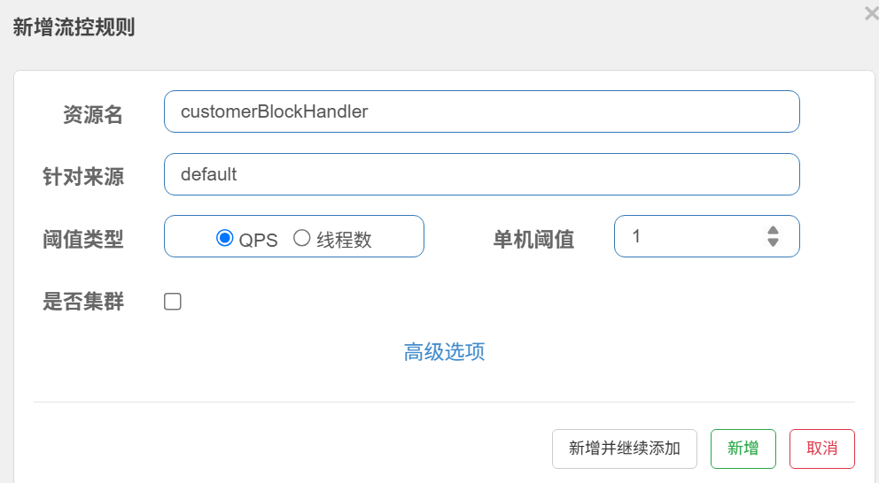

   

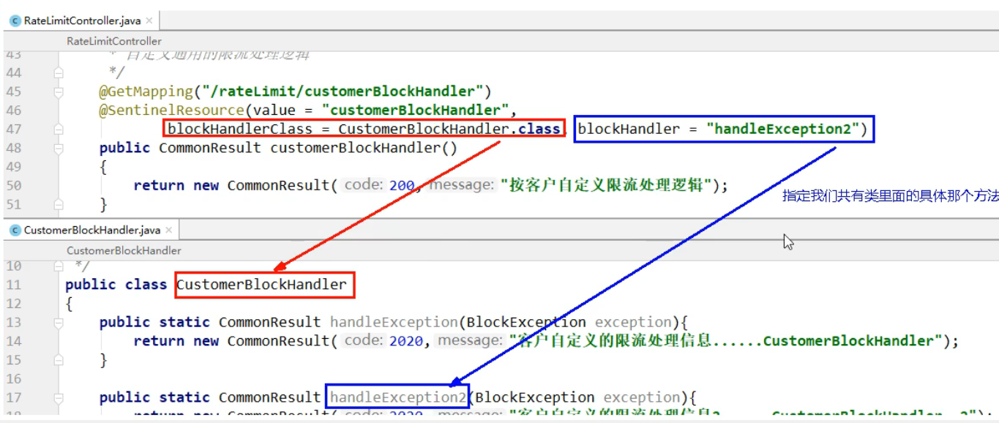


#### (8) 服务熔断功能

> sentinel整合 ribbon + openFeign + fallback

##### 8.1 Ribbon系列

> 目的：fallback管运行异常，blockHandler管配置违规

1. 启动nacos和sentinel
2. 新建cloudalibaba-provider-payment9003 和 9004 提供者，两个一样的做法

POM

```xml
<dependencies>
    <!--SpringCloud ailibaba nacos -->
    <dependency>
        <groupId>com.alibaba.cloud</groupId>
        <artifactId>spring-cloud-starter-alibaba-nacos-discovery</artifactId>
    </dependency>
    <dependency><!-- 引入自己定义的api通用包，可以使用Payment支付Entity -->
        <groupId>com.atguigu.springcloud</groupId>
        <artifactId>cloud-api-commons</artifactId>
        <version>${project.version}</version>
    </dependency>
    <!-- SpringBoot整合Web组件 -->
    <dependency>
        <groupId>org.springframework.boot</groupId>
        <artifactId>spring-boot-starter-web</artifactId>
    </dependency>
    <dependency>
        <groupId>org.springframework.boot</groupId>
        <artifactId>spring-boot-starter-actuator</artifactId>
    </dependency>
    <!--日常通用jar包配置-->
    <dependency>
        <groupId>org.springframework.boot</groupId>
        <artifactId>spring-boot-devtools</artifactId>
        <scope>runtime</scope>
        <optional>true</optional>
    </dependency>
    <dependency>
        <groupId>org.projectlombok</groupId>
        <artifactId>lombok</artifactId>
        <optional>true</optional>
    </dependency>
    <dependency>
        <groupId>org.springframework.boot</groupId>
        <artifactId>spring-boot-starter-test</artifactId>
        <scope>test</scope>
    </dependency>
</dependencies>
```

YML

```yml
server:
  port: 9003

spring:
  application:
    name: nacos-payment-provider
  cloud:
    nacos:
      discovery:
        server-addr: localhost:8848 #配置Nacos地址

management:
  endpoints:
    web:
      exposure:
        include: '*'
```

主启动

```java
@SpringBootApplication
@EnableDiscoveryClient
public class PaymentMain9003 {
    public static void main(String[] args) {
        SpringApplication.run(PaymentMain9003.class, args);
    }
}
```

业务类controller

```java
@RestController
public class PaymentController {
    @Value("${server.port}")
    private String serverPort;

    public static HashMap<Long, Payment> hashMap = new HashMap<>();

    static {
        hashMap.put(1L, new Payment(1L, "28a8c1e3bc2742d8848569891fb42181"));
        hashMap.put(2L, new Payment(2L, "bba8c1e3bc2742d8848569891ac32182"));
        hashMap.put(3L, new Payment(3L, "6ua8c1e3bc2742d8848569891xt92183"));
    }

    @GetMapping(value = "/paymentSQL/{id}")
    public CommonResult<Payment> paymentSQL(@PathVariable("id") Long id) {
        Payment payment = hashMap.get(id);
        CommonResult<Payment> result = new CommonResult(200, "from mysql,serverPort:  " + serverPort, payment);
        return result;
    }

}
```


测试地址：http://localhost:9003/paymentSQL/1


3. 新建 cloudalibaba-consumer-nacos-order84 消费者

POM

```xml
<dependencies>
    <!--SpringCloud openfeign -->
    <dependency>
        <groupId>org.springframework.cloud</groupId>
        <artifactId>spring-cloud-starter-openfeign</artifactId>
    </dependency>
    <!--SpringCloud ailibaba nacos -->
    <dependency>
        <groupId>com.alibaba.cloud</groupId>
        <artifactId>spring-cloud-starter-alibaba-nacos-discovery</artifactId>
    </dependency>
    <!--SpringCloud ailibaba sentinel -->
    <dependency>
        <groupId>com.alibaba.cloud</groupId>
        <artifactId>spring-cloud-starter-alibaba-sentinel</artifactId>
    </dependency>
    <!-- 引入自己定义的api通用包，可以使用Payment支付Entity -->
    <dependency>
        <groupId>com.atguigu.springcloud</groupId>
        <artifactId>cloud-api-commons</artifactId>
        <version>${project.version}</version>
    </dependency>
    <!-- SpringBoot整合Web组件 -->
    <dependency>
        <groupId>org.springframework.boot</groupId>
        <artifactId>spring-boot-starter-web</artifactId>
    </dependency>
    <dependency>
        <groupId>org.springframework.boot</groupId>
        <artifactId>spring-boot-starter-actuator</artifactId>
    </dependency>
    <!--日常通用jar包配置-->
    <dependency>
        <groupId>org.springframework.boot</groupId>
        <artifactId>spring-boot-devtools</artifactId>
        <scope>runtime</scope>
        <optional>true</optional>
    </dependency>
    <dependency>
        <groupId>org.projectlombok</groupId>
        <artifactId>lombok</artifactId>
        <optional>true</optional>
    </dependency>
    <dependency>
        <groupId>org.springframework.boot</groupId>
        <artifactId>spring-boot-starter-test</artifactId>
        <scope>test</scope>
    </dependency>
</dependencies>
```


YML

```yml
server:
  port: 84


spring:
  application:
    name: nacos-order-consumer
  cloud:
    nacos:
      discovery:
        server-addr: localhost:8848
    sentinel:
      transport:
        #配置Sentinel dashboard地址
        dashboard: localhost:8080
        #默认8719端口，假如被占用会自动从8719开始依次+1扫描,直至找到未被占用的端口
        port: 8719

#消费者将要去访问的微服务名称(注册成功进nacos的微服务提供者)
service-url:
  nacos-user-service: http://nacos-payment-provider

# 激活Sentinel对Feign的支持
feign:
  sentinel:
    enabled: true
```


主启动

```java
@EnableDiscoveryClient
@SpringBootApplication
@EnableFeignClients
public class OrderNacosMain84 {
    public static void main(String[] args) {
        SpringApplication.run(OrderNacosMain84.class, args);
    }
}
```


config类

```java
@Configuration
public class ApplicationContextConfig {
    @Bean
    @LoadBalanced
    public RestTemplate getRestTemplate() {
        return new RestTemplate();
    }
}
```


controller类

```java
@RestController
@Slf4j
public class CircleBreakerController {
    public static final String SERVICE_URL = "http://nacos-payment-provider";

    @Resource
    private RestTemplate restTemplate;

    @RequestMapping("/consumer/fallback/{id}")
    @SentinelResource(value = "fallback") //没有配置
    //@SentinelResource(value = "fallback",fallback = "handlerFallback") //fallback只负责业务异常
    //@SentinelResource(value = "fallback",blockHandler = "blockHandler") //blockHandler只负责sentinel控制台配置违规
    //@SentinelResource(value = "fallback", fallback = "handlerFallback", blockHandler = "blockHandler", exceptionsToIgnore = {IllegalArgumentException.class})
    public CommonResult<Payment> fallback(@PathVariable Long id) {
        CommonResult<Payment> result = restTemplate.getForObject(SERVICE_URL + "/paymentSQL/" + id, CommonResult.class, id);

        if (id == 4) {
            throw new IllegalArgumentException("IllegalArgumentException,非法参数异常....");
        } else if (result.getData() == null) {
            throw new NullPointerException("NullPointerException,该ID没有对应记录,空指针异常");
        }

        return result;
    }
}
```


测试地址：http:///localhost:84/consumer/fallback/1


###### 没有任何配置

> @SentinelResource(value = "fallback") //没有配置
>
> 给客户error页面，不友好

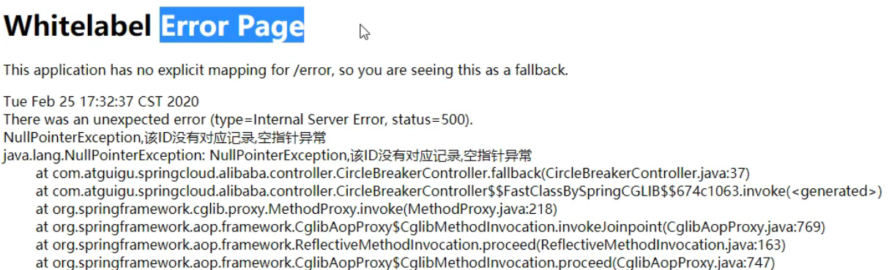


###### 只配置fallback

> fallback管运行异常

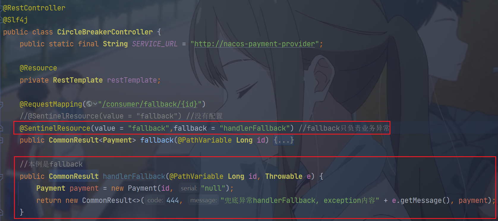

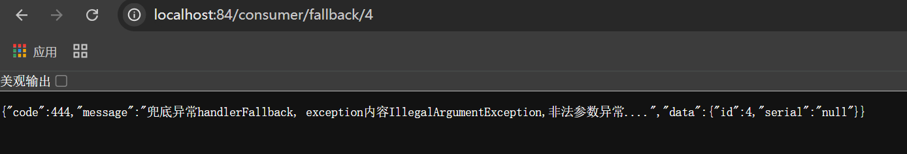


###### 只配置blockHandler

> blockHandler管配置违规

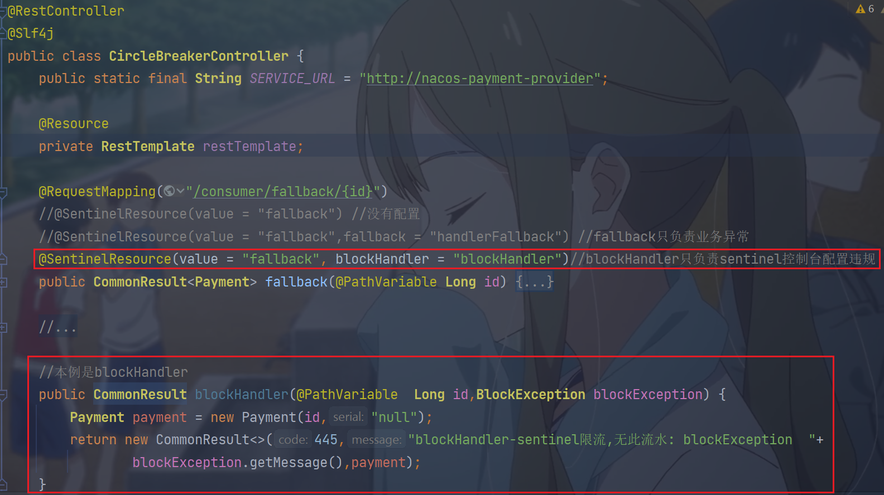

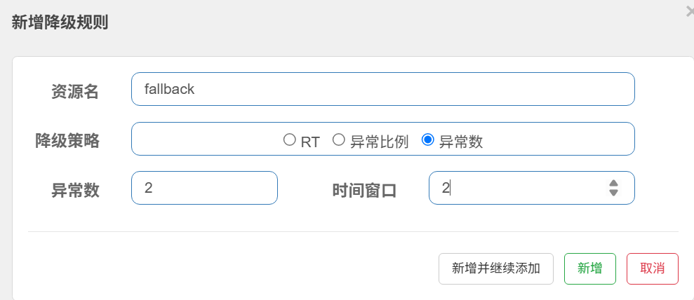


没有达到降级策略要求的条件时

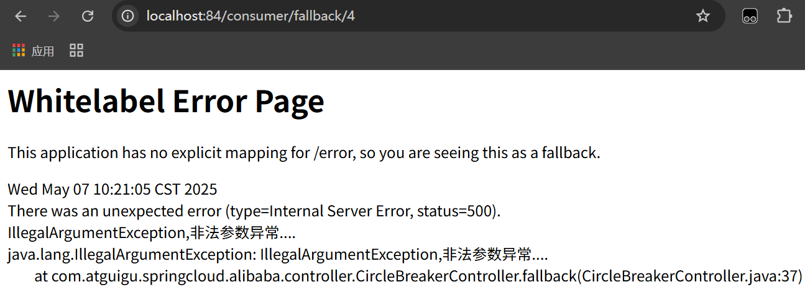


达到降级策略要求的条件时

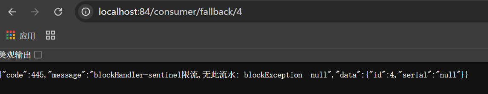


###### fallback和blockHandler都配置

> 若blockHandler和fallback都进行了配置，则被限流降级而抛出BlockException时只会进入blockHandler处理逻辑。
>


###### 忽略属性

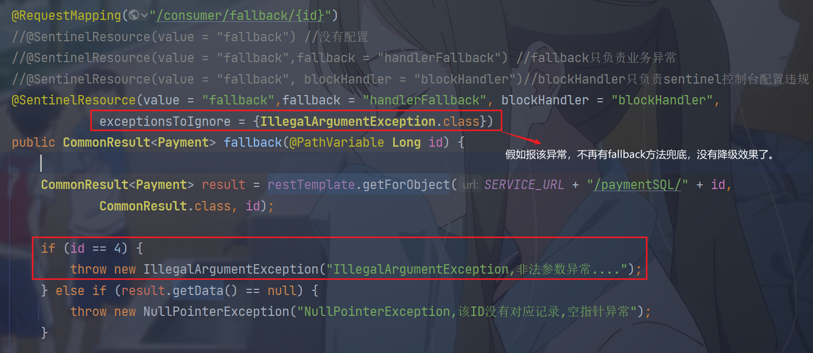


##### 8.2 Feign系列

1. 修改84模块

2. POM

   ```xml
   <!--SpringCloud openfeign -->
   <dependency>
       <groupId>org.springframework.cloud</groupId>
       <artifactId>spring-cloud-starter-openfeign</artifactId>
   </dependency>
   ```

3. YML

   ```yml
   # 激活Sentinel对Feign的支持
   feign:
     sentinel:
       enabled: true
   ```

4. 主启动类添加`@EnableFeignClients`

5. 业务service类

   ```java
   @FeignClient(value = "nacos-payment-provider", fallback = PaymentFallbackService.class)
   public interface PaymentService {
       @GetMapping(value = "/paymentSQL/{id}")
       public CommonResult<Payment> paymentSQL(@PathVariable("id") Long id);
   }
   ```

   ```java
   @Component
   public class PaymentFallbackService implements PaymentService {
       @Override
       public CommonResult<Payment> paymentSQL(Long id) {
           return new CommonResult<>(44444, "服务降级返回,---PaymentFallbackService",
                   new Payment(id, "errorSerial"));
       }
   }
   ```

6. controller类

   ```java
   //==================OpenFeign
   @Resource
   private PaymentService paymentService;
   
   @GetMapping(value = "/consumer/paymentSQL/{id}")
   public CommonResult<Payment> paymentSQL(@PathVariable("id") Long id) {
       return paymentService.paymentSQL(id);
   }
   ```

   

测试：http://localhost:84/consumer/paymentSQL/1

测试84调用9003，此时故意关闭9003微服务提供者，看84消费侧自动降级，不会被耗死


#### (9) 规则持久化

> 一旦我们重启应用，sentinel规则将消失，生产环境需要将配置规则进行持久化
>

将限流配置规则持久化进Nacos保存，只要刷新8401某个rest地址，sentinel控制台的流控规则就能看到，只要Nacos里面的配置不删除，针对8401上sentinel上的流控规则持续有效


修改cloudalibaba-sentinel-service8401

1. POM

   ```xml
   <!--SpringCloud ailibaba sentinel-datasource-nacos 后续做持久化用到-->
   <dependency>
       <groupId>com.alibaba.csp</groupId>
       <artifactId>sentinel-datasource-nacos</artifactId>
   </dependency>
   ```

2. YML

   ```yml
   spring:
     application:
       name: cloudalibaba-sentinel-service
     cloud:
       sentinel:
         datasource:
           ds1:
             nacos:
               server-addr: localhost:8848
               dataId: cloudalibaba-sentinel-service
               groupId: DEFAULT_GROUP
               data-type: json
               rule-type: flow
   ```

3. 添加Nacos业务规则配置

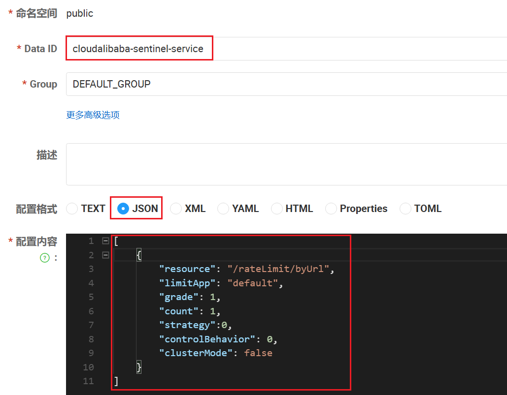

- resource：资源名称； 
- limitApp：来源应用；
- grade：阈值类型，0表示线程数，1表示QPS；
- count：单机阈值；
- strategy：流控模式，0表示直接，1表示关联，2表示链路；
- controlBehavior：流控效果，0表示快速失败，1表示WarmUp，2表示排队等待； 
- clusterMode：是否集群。

启动8401后刷新sentinel发现业务规则有了

出现报错

```
2025-05-07 12:30:37.712 ERROR 3252 --- [pool-3-thread-1] c.a.c.s.dashboard.metric.MetricFetcher   : Failed to fetch metric from <http://192.168.124.19:8720/metric?startTime=1746592227000&endTime=1746592233000&refetch=false> (ConnectionException: Connection refused: no further information)

2025-05-07 12:30:37.712错误3252-[pool-3-线程-1]c.a.c.s.dashboard.metric。MetricFetcher：无法从中获取度量<http://192.168.124.19:8720/metric?startTime=1746592227000&endTime=1746592233000&refetch=false>（ConnectionException：连接被拒绝：无更多信息）
```

当你遇到“Failed to fetch metric from”错误时，通常是由于客户端无法从指定的URL获取指标数据。这可能是由于网络连接问题、配置错误或防火墙设置等原因导致的。

确保在客户端配置文件中正确指定了 clientIp。例如，在Spring Cloud Sentinel中，你需要在配置文件中添加以下内容：

```yml
spring:
	cloud:
		sentinel:
			transport:
				#上面报错的ip地址
				clientIp: 192.168.124.19
```

启动8401后刷新sentinel发现业务规则有了

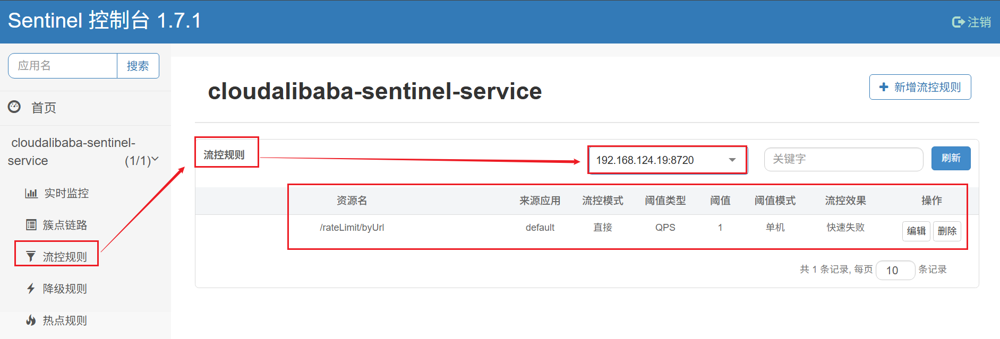

快速访问测试接口：http://localhost:8401/rateLimit/byUrl

停止8401再看sentinel：

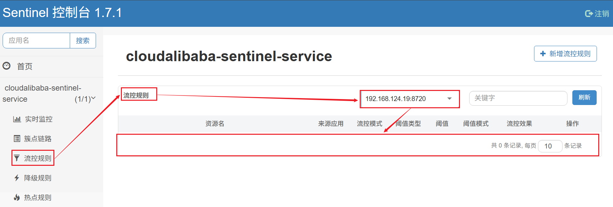


重新启动8401再看sentinel：

> 多次调用：http://localhost:8401/rateLimit/byUrl


### 4. Seata处理分布式事务

> 一次业务操作需要跨多个数据源或需要跨多个系统进行远程调用，就会产生分布式事务问题。


#### (1) 简介

**是什么？**

> Seata是一款开源的分布式事务解决方案，致力于在微服务架构下提供高性能和简单易用的分布式事务服务。
>


能干吗？

> 一个典型的分布式事务过程

分布式事务处理过程的 1 ID + 三组件模型

- Transaction ID XID：全局唯一的事务ID
- 3组件概念：
  - **Transaction Coordinator(TC)**： 事务协调器，维护全局事务的运行状态，负责协调并驱动全局事务的提交或回滚；
  -  **Transaction Manager(TM)**：控制全局事务的边界，负责开启一个全局事务，并最终发起全局提交或全局回滚的决议；
  - **Resource Manager(RM)**：控制分支事务，负责分支注册、状态汇报，并接收事务协调器的指令，驱动分支（本地）事务的提交和回滚

处理过程

1. TM向TC申请开启一个全局事务，全局事务创建成功并生成一个全局唯一的XID；
2. XID在微服务调用链路的上下文中传播；
3. RM向TC注册分支事务，将其纳入XID对应全局事务的管辖；
4. TM向TC发起针对XID的全局提交或回滚决议；
5. TC调度XID下管辖的全部分支事务完成提交或回滚请求。

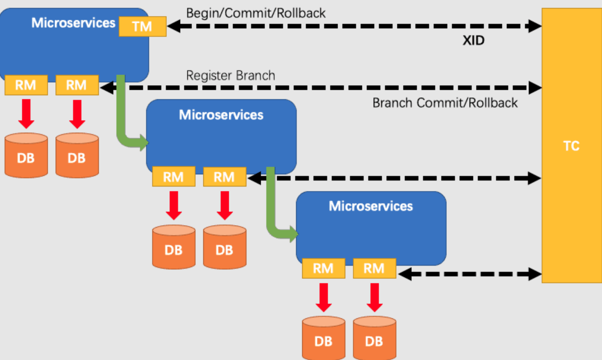


**怎么玩**

> 本地 @Transactional
>
> 全局 @GlobalTransactional


#### (2) 下载和安装

1. 下载：
   https://github.com/apache/incubator-seata/releases/download/v1.0.0/seata-server-1.0.0.zip
2. 修改conf目录下的file.conf配置文件

> 主要修改：自定义事务组名称 + 事务日志存储模式为db + 数据库连接信息

service模块

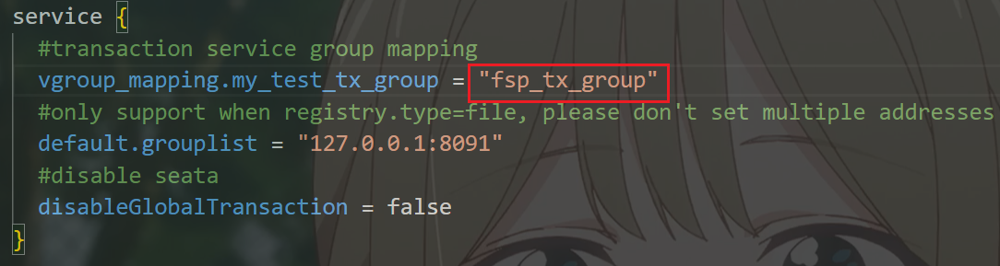

store模块

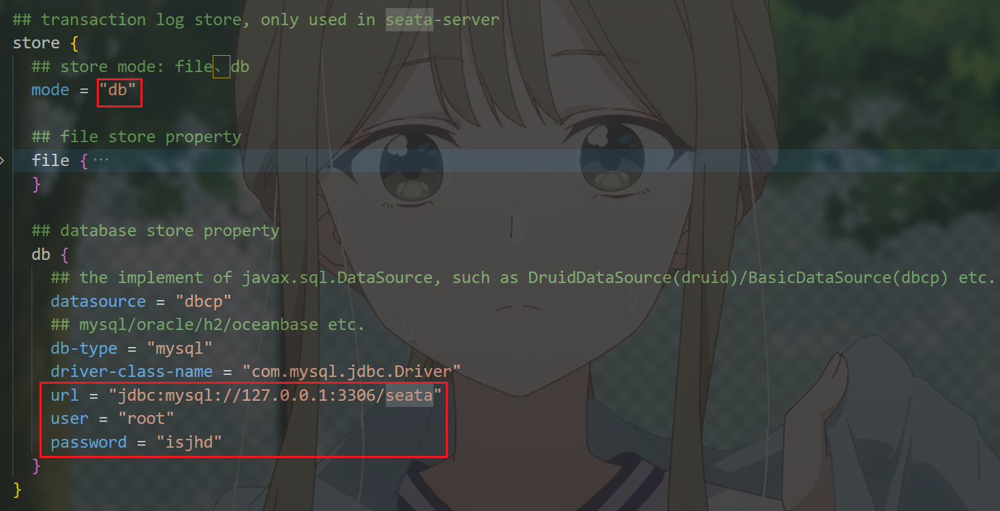


3. 数据库新建库seata

> 建表mysql.sql在incubator-seata-1.0.0\script\server\db目录里面

```mysql
-- -------------------------------- The script used when storeMode is 'db' --------------------------------
-- the table to store GlobalSession data
CREATE TABLE IF NOT EXISTS `global_table`
(
    `xid`                       VARCHAR(128) NOT NULL,
    `transaction_id`            BIGINT,
    `status`                    TINYINT      NOT NULL,
    `application_id`            VARCHAR(32),
    `transaction_service_group` VARCHAR(32),
    `transaction_name`          VARCHAR(128),
    `timeout`                   INT,
    `begin_time`                BIGINT,
    `application_data`          VARCHAR(2000),
    `gmt_create`                DATETIME,
    `gmt_modified`              DATETIME,
    PRIMARY KEY (`xid`),
    KEY `idx_gmt_modified_status` (`gmt_modified`, `status`),
    KEY `idx_transaction_id` (`transaction_id`)
) ENGINE = InnoDB
  DEFAULT CHARSET = utf8;

-- the table to store BranchSession data
CREATE TABLE IF NOT EXISTS `branch_table`
(
    `branch_id`         BIGINT       NOT NULL,
    `xid`               VARCHAR(128) NOT NULL,
    `transaction_id`    BIGINT,
    `resource_group_id` VARCHAR(32),
    `resource_id`       VARCHAR(256),
    `branch_type`       VARCHAR(8),
    `status`            TINYINT,
    `client_id`         VARCHAR(64),
    `application_data`  VARCHAR(2000),
    `gmt_create`        DATETIME,
    `gmt_modified`      DATETIME,
    PRIMARY KEY (`branch_id`),
    KEY `idx_xid` (`xid`)
) ENGINE = InnoDB
  DEFAULT CHARSET = utf8;

-- the table to store lock data
CREATE TABLE IF NOT EXISTS `lock_table`
(
    `row_key`        VARCHAR(128) NOT NULL,
    `xid`            VARCHAR(96),
    `transaction_id` BIGINT,
    `branch_id`      BIGINT       NOT NULL,
    `resource_id`    VARCHAR(256),
    `table_name`     VARCHAR(32),
    `pk`             VARCHAR(36),
    `gmt_create`     DATETIME,
    `gmt_modified`   DATETIME,
    PRIMARY KEY (`row_key`),
    KEY `idx_branch_id` (`branch_id`)
) ENGINE = InnoDB
  DEFAULT CHARSET = utf8;

```


4. 在conf下的registry.conf配置文件

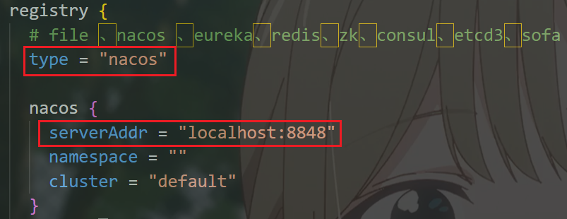


> 先启动Nacos端口号8848，再启动seata-server
>


#### (3) 订单/库存/账号业务数据库准备

分布式事务业务说明

> 这里我们会创建三个服务。一个订单服务，一个库存服务，一个账户服务。
>
> 当用户下单时，会在订单服务中创建一个订单，然后通过远程调用库存服务来扣减下单商品的库存，再通过远程调用账户服务来扣减用户账户里面的余额，最后在订单服务中修改订单状态为已完成。
>
> 该操作跨越三个数据库，有两次远程调用，很明显会有分布式事务问题。

下订单 -> 扣库存 -> 减余额


1. 创建业务数据库


> seata_order：存储订单的数据库；
>
> seata_storage：存储库存的数据库;
>
> seata_account：存储账户信息的数据库。

建数据库SQL

```mysql
CREATE DATABASE seata_order; 
CREATE DATABASE seata_storage; 
CREATE DATABASE seata_account;
```


2. 按照上述3库分别建对应业务表

seata_order库下建t_order表

```mysql
CREATE TABLE t_order(
 id BIGINT(11) NOT NULL AUTO_INCREMENT PRIMARY KEY,  
 user_id BIGINT(11) DEFAULT NULL COMMENT '用户id',
 product_id BIGINT(11) DEFAULT NULL COMMENT '产品id', 
 count INT(11) DEFAULT NULL COMMENT '数量',
 money DECIMAL(11,0) DEFAULT NULL COMMENT '金额',
 status INT(1) DEFAULT NULL COMMENT'订单状态: O:创建中；1:已完结'
)ENGINE=INNODB AUTO_INCREMENT = 7 DEFAULT CHARSET=utf8;
```

seata_storage库下建t_storage表

```mysql
CREATE TABLE t_storage(
	id BIGINT(11) NOT NULL AUTO_INCREMENT PRIMARY KEY, 		 
	product_id BIGINT(11) DEFAULT NULL COMMENT '产品id',
	total INT(11) DEFAULT NULL COMMENT '总库存',
	used INT(11) DEFAULT NULL COMMENT '已用库存',
	residue INT(11) DEFAULT NULL COMMENT'剩余库存'
)ENGINE=INNODB AUTO_INCREMENT=2 DEFAULT CHARSET=utf8;

INSERT INTO seata_storage.t_storage(id, product_id, total, used, residue) VALUES ('1', '1', '100', '0', '100');
```

seata_account库下建t_account表

```mysql
CREATE TABLE t_account(
	id BIGINT(11) NOT NULL AUTO_INCREMENT PRIMARY KEY COMMENT'id',
	user_id BIGINT(11) DEFAULT NULL COMMENT '用户id',
	total DECIMAL(10,0) DEFAULT NULL COMMENT '总额度',
	used DECIMAL(10,0) DEFAULT NULL COMMENT '已用余额',
  residue DECIMAL(10,0) DEFAULT '0' COMMENT '剩余可用额度'
)ENGINE=INNODB AUTO_INCREMENT=2 DEFAULT CHARSET=utf8;

INSERT INTO seata_account.t_account(id, user_id, total, used, residue) VALUES ('1', '1', '1000', '0', '1000');
```


3. 按照上述3库分别建对应的回滚日志表

订单-库存-账户3个库下都需要建各自的回滚日志表

```mysql
CREATE TABLE `undo_log` (
  `id` bigint(20) NOT NULL AUTO_INCREMENT,
  `branch_id` bigint(20) NOT NULL,
  `xid` varchar(100) NOT NULL,
  `context` varchar(128) NOT NULL,
  `rollback_info` longblob NOT NULL,
  `log_status` int(11) NOT NULL,
  `log_created` datetime NOT NULL,
  `log_modified` datetime NOT NULL,
  `ext` varchar(100) DEFAULT NULL,
  PRIMARY KEY (`id`),
  UNIQUE KEY `ux_undo_log` (`xid`,`branch_id`)
) ENGINE=InnoDB AUTO_INCREMENT=1 DEFAULT CHARSET=utf8;
```


#### (4) 订单/库存/账号业务微服务准备

业务需求

> 下订单->减库存->扣余额->改(订单)状态
>

1. 新建订单Order-Module


新建Module：seata-order-service2001

POM

```xml
<dependencies>
    <!--nacos-->
    <dependency>
        <groupId>com.alibaba.cloud</groupId>
        <artifactId>spring-cloud-starter-alibaba-nacos-discovery</artifactId>
    </dependency>
    <!--seata-->
    <dependency>
        <groupId>com.alibaba.cloud</groupId>
        <artifactId>spring-cloud-starter-alibaba-seata</artifactId>
        <exclusions>
            <exclusion>
                <artifactId>seata-all</artifactId>
                <groupId>io.seata</groupId>
            </exclusion>
        </exclusions>
    </dependency>
    <dependency>
        <groupId>io.seata</groupId>
        <artifactId>seata-all</artifactId>
        <version>1.0.0</version>
    </dependency>
    <!--feign-->
    <dependency>
        <groupId>org.springframework.cloud</groupId>
        <artifactId>spring-cloud-starter-openfeign</artifactId>
    </dependency>
    <!--web-actuator-->
    <dependency>
        <groupId>org.springframework.boot</groupId>
        <artifactId>spring-boot-starter-web</artifactId>
    </dependency>
    <dependency>
        <groupId>org.springframework.boot</groupId>
        <artifactId>spring-boot-starter-actuator</artifactId>
    </dependency>
    <!--mysql-druid-->
    <dependency>
        <groupId>mysql</groupId>
        <artifactId>mysql-connector-java</artifactId>
        <version>5.1.37</version>
    </dependency>
    <dependency>
        <groupId>com.alibaba</groupId>
        <artifactId>druid-spring-boot-starter</artifactId>
        <version>1.1.10</version>
    </dependency>
    <dependency>
        <groupId>org.mybatis.spring.boot</groupId>
        <artifactId>mybatis-spring-boot-starter</artifactId>
        <version>2.0.0</version>
    </dependency>
    <dependency>
        <groupId>org.springframework.boot</groupId>
        <artifactId>spring-boot-starter-test</artifactId>
        <scope>test</scope>
    </dependency>
    <dependency>
        <groupId>org.projectlombok</groupId>
        <artifactId>lombok</artifactId>
        <optional>true</optional>
    </dependency>
</dependencies>
```

YML

```yml
server:
  port: 2001

spring:
  application:
    name: seata-order-service
  cloud:
    alibaba:
      seata:
        #自定义事务组名称需要与seata-server中的对应
        tx-service-group: fsp_tx_group
    nacos:
      discovery:
        server-addr: localhost:8848
  datasource:
    driver-class-name: com.mysql.jdbc.Driver
    url: jdbc:mysql://localhost:3306/seata_order
    username: root
    password: isjhd

feign:
  hystrix:
    enabled: false

logging:
  level:
    io:
      seata: info

mybatis:
  mapperLocations: classpath:mapper/*.xml
```

新建resources\file.conf

```conf
transport {
  # tcp udt unix-domain-socket
  type = "TCP"
  #NIO NATIVE
  server = "NIO"
  #enable heartbeat
  heartbeat = true
  #thread factory for netty
  thread-factory {
    boss-thread-prefix = "NettyBoss"
    worker-thread-prefix = "NettyServerNIOWorker"
    server-executor-thread-prefix = "NettyServerBizHandler"
    share-boss-worker = false
    client-selector-thread-prefix = "NettyClientSelector"
    client-selector-thread-size = 1
    client-worker-thread-prefix = "NettyClientWorkerThread"
    # netty boss thread size,will not be used for UDT
    boss-thread-size = 1
    #auto default pin or 8
    worker-thread-size = 8
  }
  shutdown {
    # when destroy server, wait seconds
    wait = 3
  }
  serialization = "seata"
  compressor = "none"
}

service {

  vgroup_mapping.fsp_tx_group = "default" #修改自定义事务组名称

  default.grouplist = "127.0.0.1:8091"
  enableDegrade = false
  disable = false
  max.commit.retry.timeout = "-1"
  max.rollback.retry.timeout = "-1"
  disableGlobalTransaction = false
}


client {
  async.commit.buffer.limit = 10000
  lock {
    retry.internal = 10
    retry.times = 30
  }
  report.retry.count = 5
  tm.commit.retry.count = 1
  tm.rollback.retry.count = 1
}

## transaction log store
store {
  ## store mode: file、db
  mode = "db"

  ## file store
  file {
    dir = "sessionStore"

    # branch session size , if exceeded first try compress lockkey, still exceeded throws exceptions
    max-branch-session-size = 16384
    # globe session size , if exceeded throws exceptions
    max-global-session-size = 512
    # file buffer size , if exceeded allocate new buffer
    file-write-buffer-cache-size = 16384
    # when recover batch read size
    session.reload.read_size = 100
    # async, sync
    flush-disk-mode = async
  }

  ## database store
  db {
    ## the implement of javax.sql.DataSource, such as DruidDataSource(druid)/BasicDataSource(dbcp) etc.
    datasource = "dbcp"
    ## mysql/oracle/h2/oceanbase etc.
    db-type = "mysql"
    driver-class-name = "com.mysql.jdbc.Driver"
    url = "jdbc:mysql://127.0.0.1:3306/seata"
    user = "root"
    password = "123456"
    min-conn = 1
    max-conn = 3
    global.table = "global_table"
    branch.table = "branch_table"
    lock-table = "lock_table"
    query-limit = 100
  }
}
lock {
  ## the lock store mode: local、remote
  mode = "remote"

  local {
    ## store locks in user's database
  }

  remote {
    ## store locks in the seata's server
  }
}
recovery {
  #schedule committing retry period in milliseconds
  committing-retry-period = 1000
  #schedule asyn committing retry period in milliseconds
  asyn-committing-retry-period = 1000
  #schedule rollbacking retry period in milliseconds
  rollbacking-retry-period = 1000
  #schedule timeout retry period in milliseconds
  timeout-retry-period = 1000
}

transaction {
  undo.data.validation = true
  undo.log.serialization = "jackson"
  undo.log.save.days = 7
  #schedule delete expired undo_log in milliseconds
  undo.log.delete.period = 86400000
  undo.log.table = "undo_log"
}

## metrics settings
metrics {
  enabled = false
  registry-type = "compact"
  # multi exporters use comma divided
  exporter-list = "prometheus"
  exporter-prometheus-port = 9898
}

support {
  ## spring
  spring {
    # auto proxy the DataSource bean
    datasource.autoproxy = false
  }
}


```

新建resources\registry.conf

```conf
registry {
  # file 、nacos 、eureka、redis、zk、consul、etcd3、sofa
  type = "nacos"

  nacos {
    serverAddr = "localhost:8848"
    namespace = ""
    cluster = "default"
  }
  eureka {
    serviceUrl = "http://localhost:8761/eureka"
    application = "default"
    weight = "1"
  }
  redis {
    serverAddr = "localhost:6379"
    db = "0"
  }
  zk {
    cluster = "default"
    serverAddr = "127.0.0.1:2181"
    session.timeout = 6000
    connect.timeout = 2000
  }
  consul {
    cluster = "default"
    serverAddr = "127.0.0.1:8500"
  }
  etcd3 {
    cluster = "default"
    serverAddr = "http://localhost:2379"
  }
  sofa {
    serverAddr = "127.0.0.1:9603"
    application = "default"
    region = "DEFAULT_ZONE"
    datacenter = "DefaultDataCenter"
    cluster = "default"
    group = "SEATA_GROUP"
    addressWaitTime = "3000"
  }
  file {
    name = "file.conf"
  }
}

config {
  # file、nacos 、apollo、zk、consul、etcd3
  type = "file"

  nacos {
    serverAddr = "localhost"
    namespace = ""
  }
  consul {
    serverAddr = "127.0.0.1:8500"
  }
  apollo {
    app.id = "seata-server"
    apollo.meta = "http://192.168.1.204:8801"
  }
  zk {
    serverAddr = "127.0.0.1:2181"
    session.timeout = 6000
    connect.timeout = 2000
  }
  etcd3 {
    serverAddr = "http://localhost:2379"
  }
  file {
    name = "file.conf"
  }
}
```

domain实体类

```java
@Data
@AllArgsConstructor
@NoArgsConstructor
public class CommonResult<T> {
    private Integer code;
    private String message;
    private T data;

    public CommonResult(Integer code, String message) {
        this(code, message, null);
    }
}
```

```java
@Data
@AllArgsConstructor
@NoArgsConstructor
public class Order
{
    private Long id;

    private Long userId;

    private Long productId;

    private Integer count;

    private BigDecimal money;

    private Integer status; //订单状态：0：创建中；1：已完结
}
```

Dao接口及其实现

```java
@Mapper
public interface OrderDao {
    //1 新建订单
    void create(Order order);

    //2 修改订单状态，从零改为1
    void update(@Param("userId") Long userId, @Param("status") Integer status);
}
```

resources文件夹下新建mapper文件夹后添加OrderMapper.xml

```xml
<?xml version="1.0" encoding="UTF-8" ?>
<!DOCTYPE mapper PUBLIC "-//mybatis.org//DTD Mapper 3.0//EN" "http://mybatis.org/dtd/mybatis-3-mapper.dtd" >

<mapper namespace="com.atguigu.springcloud.alibaba.dao.OrderDao">

    <resultMap id="BaseResultMap" type="com.atguigu.springcloud.alibaba.domain.Order">
        <id column="id" property="id" jdbcType="BIGINT"/>
        <result column="user_id" property="userId" jdbcType="BIGINT"/>
        <result column="product_id" property="productId" jdbcType="BIGINT"/>
        <result column="count" property="count" jdbcType="INTEGER"/>
        <result column="money" property="money" jdbcType="DECIMAL"/>
        <result column="status" property="status" jdbcType="INTEGER"/>
    </resultMap>

    <insert id="create">
        insert into t_order (id,user_id,product_id,count,money,status)
        values (null,#{userId},#{productId},#{count},#{money},0);
    </insert>


    <update id="update">
        update t_order set status = 1
        where user_id=#{userId} and status = #{status};
    </update>

</mapper>
```

service接口及其实现

OrderService

```java
public interface OrderService {
    void create(Order order);
}
```

OrderServiceImpl

```java
@Service
@Slf4j
public class OrderServiceImpl implements OrderService {
    @Resource
    private OrderDao orderDao;
    @Resource
    private StorageService storageService;
    @Resource
    private AccountService accountService;

    /**
     * 创建订单->调用库存服务扣减库存->调用账户服务扣减账户余额->修改订单状态
     * 简单说：下订单->扣库存->减余额->改状态
     */
    @Override
    @GlobalTransactional(name = "fsp-create-order", rollbackFor = Exception.class)
    public void create(Order order) {
        log.info("----->开始新建订单");
        //1 新建订单
        orderDao.create(order);

        //2 扣减库存
        log.info("----->订单微服务开始调用库存，做扣减Count");
        storageService.decrease(order.getProductId(), order.getCount());
        log.info("----->订单微服务开始调用库存，做扣减end");

        //3 扣减账户
        log.info("----->订单微服务开始调用账户，做扣减Money");
        accountService.decrease(order.getUserId(), order.getMoney());
        log.info("----->订单微服务开始调用账户，做扣减end");

        //4 修改订单状态，从零到1,1代表已经完成
        log.info("----->修改订单状态开始");
        orderDao.update(order.getUserId(), 0);
        log.info("----->修改订单状态结束");

        log.info("----->下订单结束了，O(∩_∩)O哈哈~");

    }
}
```

StorageService

```java
@FeignClient(value = "seata-storage-service")
public interface StorageService {
    @PostMapping(value = "/storage/decrease")
    CommonResult decrease(@RequestParam("productId") Long productId, @RequestParam("count") Integer count);
}
```

AccountService

```java
@FeignClient(value = "seata-account-service")
public interface AccountService {
    @PostMapping(value = "/account/decrease")
    CommonResult decrease(@RequestParam("userId") Long userId, @RequestParam("money") BigDecimal money);
}
```

Controller

```java
@RestController
public class OrderController {
    @Resource
    private OrderService orderService;


    @GetMapping("/order/create")
    public CommonResult create(Order order) {
        orderService.create(order);
        return new CommonResult(200, "订单创建成功");
    }
}
```

config配置

MyBatisConfig

```java
@Configuration
@MapperScan({"com.atguigu.springcloud.alibaba.dao"})
public class MyBatisConfig {
}
```

DataSourceProxyConfig

```java
@Configuration
public class DataSourceProxyConfig {

    @Value("${mybatis.mapperLocations}")
    private String mapperLocations;

    @Bean
    @ConfigurationProperties(prefix = "spring.datasource")
    public DataSource druidDataSource(){
        return new DruidDataSource();
    }

    @Bean
    public DataSourceProxy dataSourceProxy(DataSource dataSource) {
        return new DataSourceProxy(dataSource);
    }

    @Bean
    public SqlSessionFactory sqlSessionFactoryBean(DataSourceProxy dataSourceProxy) throws Exception {
        SqlSessionFactoryBean sqlSessionFactoryBean = new SqlSessionFactoryBean();
        sqlSessionFactoryBean.setDataSource(dataSourceProxy);
        sqlSessionFactoryBean.setMapperLocations(new PathMatchingResourcePatternResolver().getResources(mapperLocations));
        sqlSessionFactoryBean.setTransactionFactory(new SpringManagedTransactionFactory());
        return sqlSessionFactoryBean.getObject();
    }

}
```

主启动类

```java
@EnableDiscoveryClient
@EnableFeignClients
@SpringBootApplication(exclude = DataSourceAutoConfiguration.class)//取消数据源的自动创建
public class SeataOrderMainApp2001 {

    public static void main(String[] args) {
        SpringApplication.run(SeataOrderMainApp2001.class, args);
    }
}
```


2. 新建库存Storage-Module（几乎和上面的一样）

新建Module：seata-storage-service2002

domain实体类

```java
@Data
@AllArgsConstructor
@NoArgsConstructor
public class CommonResult<T> {
    private Integer code;
    private String message;
    private T data;

    public CommonResult(Integer code, String message) {
        this(code, message, null);
    }
}
```

```java
@Data
public class Storage {

    private Long id;

    /**
     * 产品id
     */
    private Long productId;

    /**
     * 总库存
     */
    private Integer total;

    /**
     * 已用库存
     */
    private Integer used;

    /**
     * 剩余库存
     */
    private Integer residue;
}
```

Dao接口及其实现

```java
@Mapper
public interface StorageDao {

    //扣减库存
    void decrease(@Param("productId") Long productId, @Param("count") Integer count);
}
```

resources文件夹下新建mapper文件夹后添加StorageMapper.xml

```xml
<?xml version="1.0" encoding="UTF-8" ?>
<!DOCTYPE mapper PUBLIC "-//mybatis.org//DTD Mapper 3.0//EN" "http://mybatis.org/dtd/mybatis-3-mapper.dtd" >


<mapper namespace="com.atguigu.springcloud.alibaba.dao.StorageDao">

    <resultMap id="BaseResultMap" type="com.atguigu.springcloud.alibaba.domain.Storage">
        <id column="id" property="id" jdbcType="BIGINT"/>
        <result column="product_id" property="productId" jdbcType="BIGINT"/>
        <result column="total" property="total" jdbcType="INTEGER"/>
        <result column="used" property="used" jdbcType="INTEGER"/>
        <result column="residue" property="residue" jdbcType="INTEGER"/>
    </resultMap>

    <update id="decrease">
        UPDATE
            t_storage
        SET
            used = used + #{count},residue = residue - #{count}
        WHERE
            product_id = #{productId}
    </update>

</mapper>
```

service接口及其实现

```java
public interface StorageService {
    /**
     * 扣减库存
     */
    void decrease(Long productId, Integer count);
}
```

```java
@Service
public class StorageServiceImpl implements StorageService {

    private static final Logger LOGGER = LoggerFactory.getLogger(StorageServiceImpl.class);

    @Resource
    private StorageDao storageDao;

    /**
     * 扣减库存
     */
    @Override
    public void decrease(Long productId, Integer count) {
        LOGGER.info("------->storage-service中扣减库存开始");
        storageDao.decrease(productId,count);
        LOGGER.info("------->storage-service中扣减库存结束");
    }
}
```

controller

```java
@RestController
public class StorageController {

    @Autowired
    private StorageService storageService;

    /**
     * 扣减库存
     */
    @RequestMapping("/storage/decrease")
    public CommonResult decrease(Long productId, Integer count) {
        storageService.decrease(productId, count);
        return new CommonResult(200,"扣减库存成功！");
    }
}
```


3. 新建账号Account-Module

新建module：seata-account-service2003

domain实体类

```java
@Data
@AllArgsConstructor
@NoArgsConstructor
public class CommonResult<T> {
    private Integer code;
    private String message;
    private T data;

    public CommonResult(Integer code, String message) {
        this(code, message, null);
    }
}
```

```java
@Data
@AllArgsConstructor
@NoArgsConstructor
public class Account {

    private Long id;

    /**
     * 用户id
     */
    private Long userId;

    /**
     * 总额度
     */
    private BigDecimal total;

    /**
     * 已用额度
     */
    private BigDecimal used;

    /**
     * 剩余额度
     */
    private BigDecimal residue;
}
```

Dao接口及其实现

```java
@Mapper
public interface AccountDao {

    /**
     * 扣减账户余额
     */
    void decrease(@Param("userId") Long userId, @Param("money") BigDecimal money);
}
```

resources文件夹下新建mapper文件夹后添加StorageMapper.xml

```xml
<?xml version="1.0" encoding="UTF-8" ?>
<!DOCTYPE mapper PUBLIC "-//mybatis.org//DTD Mapper 3.0//EN" "http://mybatis.org/dtd/mybatis-3-mapper.dtd" >

<mapper namespace="com.atguigu.springcloud.alibaba.dao.AccountDao">

    <resultMap id="BaseResultMap" type="com.atguigu.springcloud.alibaba.domain.Account">
        <id column="id" property="id" jdbcType="BIGINT"/>
        <result column="user_id" property="userId" jdbcType="BIGINT"/>
        <result column="total" property="total" jdbcType="DECIMAL"/>
        <result column="used" property="used" jdbcType="DECIMAL"/>
        <result column="residue" property="residue" jdbcType="DECIMAL"/>
    </resultMap>

    <update id="decrease">
        UPDATE t_account
        SET
          residue = residue - #{money},used = used + #{money}
        WHERE
          user_id = #{userId};
    </update>

</mapper>
```

service及其实现类

```java
public interface AccountService {

    /**
     * 扣减账户余额
     * @param userId 用户id
     * @param money 金额
     */
    void decrease(@RequestParam("userId") Long userId, @RequestParam("money") BigDecimal money);
}
```

```java
@Service
public class AccountServiceImpl implements AccountService {

    private static final Logger LOGGER = LoggerFactory.getLogger(AccountServiceImpl.class);


    @Resource
    AccountDao accountDao;

    /**
     * 扣减账户余额
     */
    @Override
    public void decrease(Long userId, BigDecimal money) {
        LOGGER.info("------->account-service中扣减账户余额开始");
        //模拟超时异常，全局事务回滚
        //暂停几秒钟线程
        try { TimeUnit.SECONDS.sleep(20); } catch (InterruptedException e) { e.printStackTrace(); }
        accountDao.decrease(userId,money);
        LOGGER.info("------->account-service中扣减账户余额结束");
    }
}
```

controller

```java
@RestController
public class AccountController {

    @Resource
    AccountService accountService;

    /**
     * 扣减账户余额
     */
    @RequestMapping("/account/decrease")
    public CommonResult decrease(@RequestParam("userId") Long userId, @RequestParam("money") BigDecimal money){
        accountService.decrease(userId,money);
        return new CommonResult(200,"扣减账户余额成功！");
    }
}
```


#### (5) Test

> 下订单 -> 减库存 -> 扣余额 -> 改(订单)状态
>

数据库初始化情况

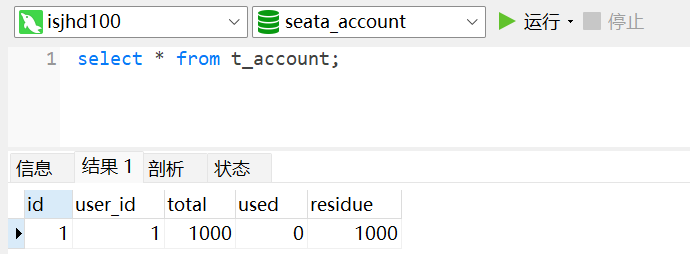

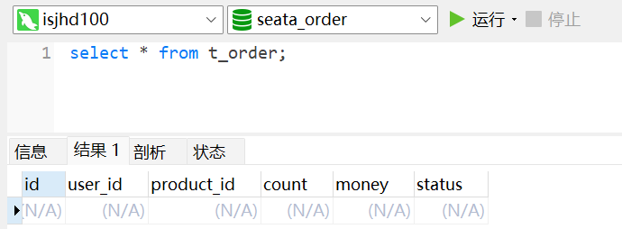

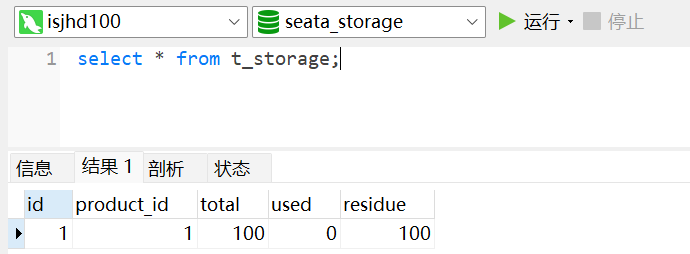


正常下单
http://localhost:2001/order/create?userId=1&productId=1&count=10&money=100


- 超时异常，没加@GlobalTransactional

AccountServiceImpl添加超时

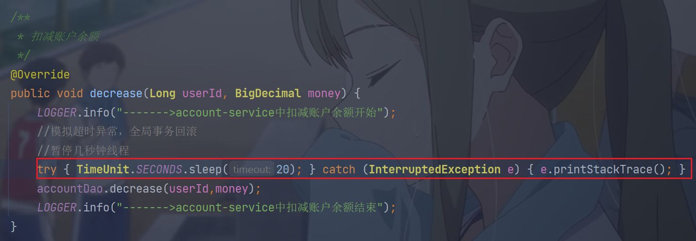

故障情况

> 当库存和账户金额扣减后，订单状态并没有设置为已经完成，没有从零改为1
>
> 而且由于feign的重试机制，账户余额还有可能被多次扣减


- 超时异常，添加@GlobalTransactional


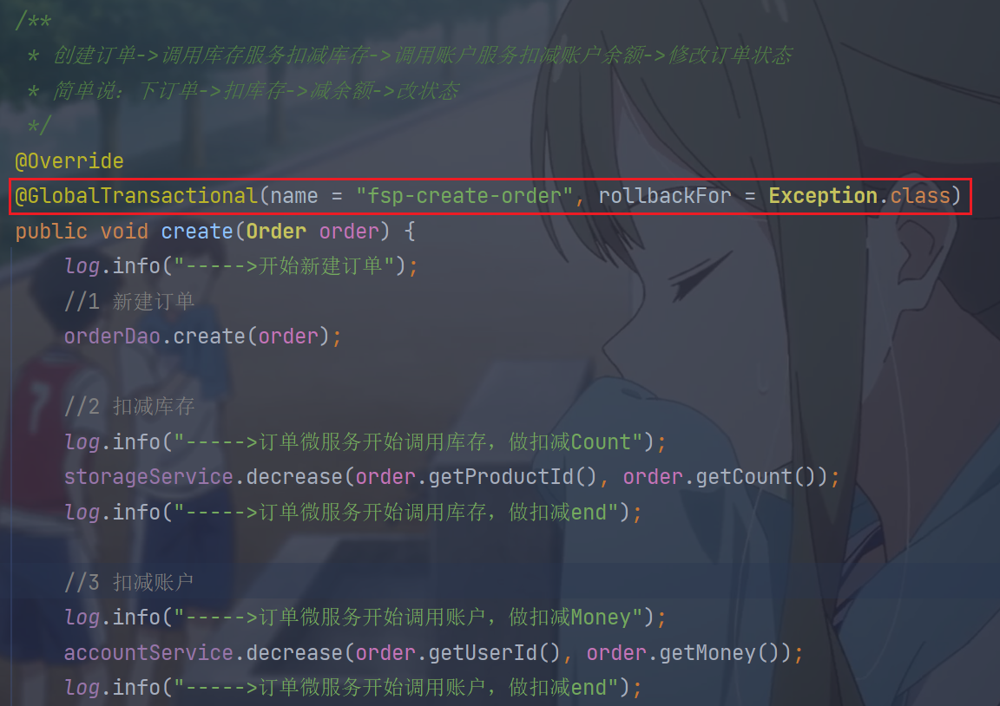

下单后数据库数据并没有任何改变，记录都添加不进来


#### (6) 原理简介

> 2019年1月份蚂蚁金服和阿里巴巴共同开源的分布式事务解决方案
>
> Simple Extensible Autonomous Transaction Architecture，简单可扩展自治事务框架
>
> 2020起始，参加工作后用1.0以后的版本


**再看TC/TM/RM三大组件**

分布式事务的执行流程

1. TM开启分布式事务(TM向TC注册全局事务记录)；
2. 按业务场景，编排数据库、服务等事务内资源(RM 向TC汇报资源准备状态)； 
3. TM结束分布式事务，事务一阶段结束(TM通知TC提交/回滚分布式事务)；
4. TC汇总事务信息，决定分布式事务是提交还是回滚； 
5. TC通知所有RM提交/回滚资源，事务二阶段结束。

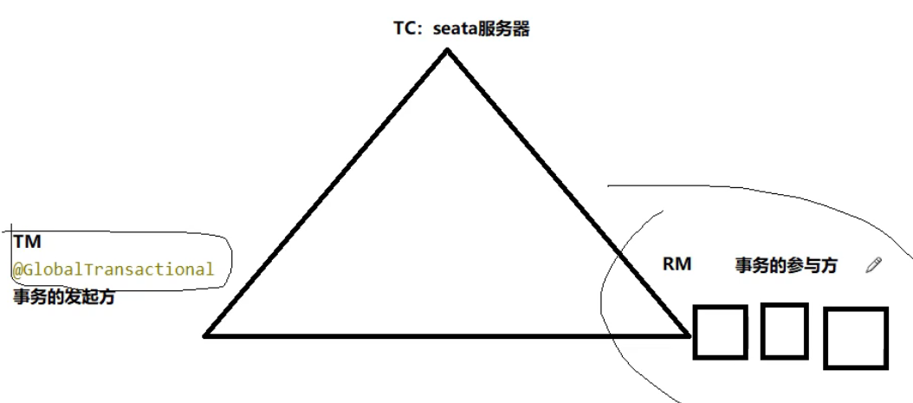


**AT模式如何做到对业务的无侵入**

一阶段加载

> 在一阶段，Seata会拦截“业务SQL”，
>
> 1. 解析SQL语义，找到“业务SQL”要更新的业务数据，在业务数据被更新前，将其保存成“before image”，
> 2. 执行“业务SQL”更新业务数据，在业务数据更新之后， 
> 3. 其保存成"after image”，最后生成行锁。

以上操作全部在一个数据库事务内完成，这样保证了一阶段操作的原子性。

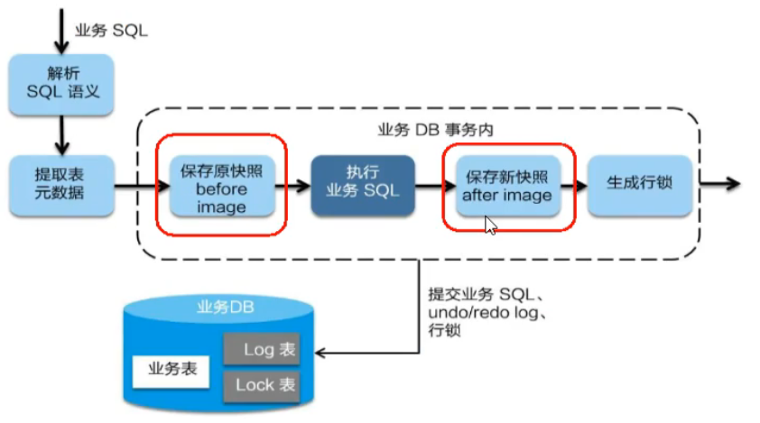


二阶段提交

> 二阶段如果顺利提交的话，
>
> 因为“业务SQL”在一阶段已经提交至数据库，所以Seata框架只需将一阶段保存的快照数据和行锁删掉，完成数据清理即可。

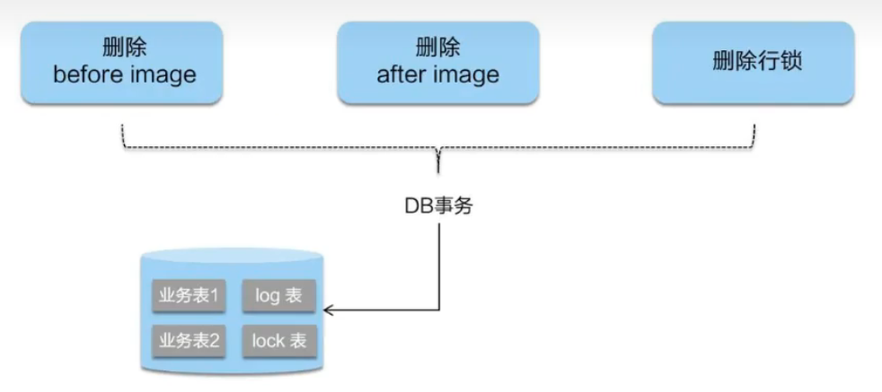


二阶段回滚

> 二阶段如果是回滚的话，Seata就需要回滚一阶段已经执行的"业务SQL”，还原业务数据。
>
> 回滚方式便是用“beforeimage”还原业务数据；但在还原前要首先要校验脏写，对比“数据库当前业务数据”和“after image”，
>
> 如果两份数据完全一致就说明没有脏写，可以还原业务数据，如果不一致就说明有脏写，出现脏写就需要转人工处理。

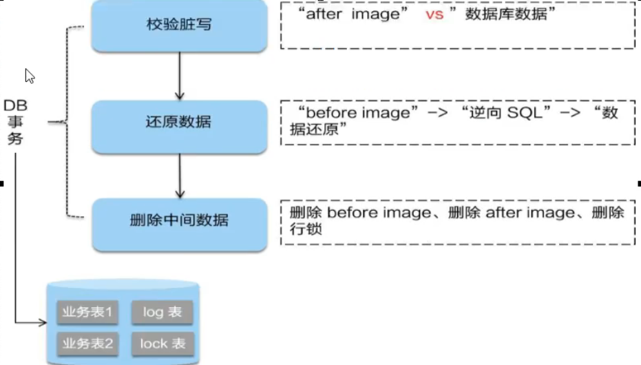


