# docker基础篇

## 一、简介

### 1. 问题：为什么会有docker出现

> 一款产品从开发到上线，从操作系统，到运行环境，再到应用配置。作为开发+运维之间的协作我们需要关心很多东西，这也是很多互联网公司都不得不面对的问题，特别是各种版本的迭代之后，不同版本环境的兼容，对运维人员都是考验
>
> Docker之所以发展如此迅速，也是因为它对此给出了一个标准化的解决方案。
>
> 环境配置如此麻烦，换一台机器，就要重来一次，费力费时。很多人想到，能不能从根本上解决问题，软件可以带环境安装？也就是说，安装的时候，把原始环境一模一样地复制过来。开发人员利用 Docker 可以消除协作编码时“在我的机器上可正常工作”的问题。


### 2. docker是什么？

> Docker是基于Go语言实现的云开源项目。
>
> Docker的主要目标是“Build，Ship and Run Any App，Anywhere”，也就是通过对应用组件的封装、分发、部署、运行等生命周期的管理，使用户的APP（可以是一个WEB应用或数据库应用等等）及其运行环境能够做到“一次镜像，处处运行”。
>
> Linux容器技术的出现就解决了这样一个问题，而Docker就是在它的基础上发展过来的。将应用打成镜像，通过镜像成为运行在 Docker容器上面的实例，而Docker容器在任何操作系统上都是一致的，这就实现了跨平台、跨服务器。只需要一次配置好环境，换到别的机子上就可以一键部署好，大大简化了操作。


### 3. 一句话

> 解决了运行环境和配置问题的软件容器，方便做持续集成并有助于整体发布的容器虚拟化技术。


### 4. 容器与虚拟机比较

传统虚拟机技术

> 虚拟机（virtualmachine）就是带环境安装的一种解决方案。
>
> 它可以在一种操作系统里面运行另一种操作系统，比如在Windows10系统里面运行Linux系统CentOS7。应用程序对此毫无感知，因为虚拟机看上去跟真实系统一模一样，而对于底层系统来说，虚拟机就是一个普通文件，不需要了就删掉，对其他部分毫无影响。这类虚拟机完美的运行了另一套系统，能够使应用程序，操作系统和硬件三者之间的逻辑不变。
>
> 传统虚拟机技术基于安装在主操作系统上的虚拟机管理系统（如：VirtualBox和VMWare等），创建虚拟机（虚拟出各种硬件），在虚拟机上安装从操作系统，在从操作系统中安装部署各种应用。


缺点：1. 资源占用多，2. 冗余步骤多，3. 启动慢。


容器虚拟化技术

> Linux容器(LinuxContainers，缩写为LXC)：Linux容器是与系统其他部分隔离开的一系列进程，从另一个镜像运行，并由该镜像提供支持进程所需的全部文件。容器提供的镜像包含了应用的所有依赖项，因而在从开发到测试再到生产的整个过程中，它都具有可移植性和一致性。
>
> Linux容器不是模拟一个完整的操作系统而是对进程进行隔离。有了容器，就可以将软件运行所需的所有资源打包到一个隔离的容器中。容器与虚拟机不同，不需要捆绑一整套操作系统，只需要软件工作所需的库资源和设置。系统因此而变得高效轻量并保证部署在任何环境中的软件都能始终如一地运行。
>
> Docker容器是在操作系统层面上实现虚拟化，直接复用本地主机的操作系统，而传统虚拟机则是在硬件层面实现虚拟化。与传统的虚拟机相比，Docker优势体现为启动速度快、占用体积小。


对比

- 传统虚拟机技术是虚拟出一套硬件后，在其上运行一个完整操作系统，在该系统上再运行所需应用进程；
- 容器内的应用进程直接运行于宿主的内核，容器内没有自己的内核且也没有进行硬件虚拟。因此容器要比传统虚拟机更为轻便。
- 每个容器之间互相隔离，每个容器有自己的文件系统，容器之间进程不会相互影响，能区分计算资源。


### 5. 为什么Docker会比VM虚拟机快

1. docker有着比虚拟机更少的抽象层
   由于docker不需要Hypervisor(虚拟机)实现硬件资源虚拟化，运行在docker容器上的程序直接使用的都是实际物理机的硬件资源。因此在CPU、内存利用率上docker将会在效率上有明显优势。
2. docker利用的是宿主机的内核，而不需要加载操作系统OS内核
   当新建一个容器时，docker不需要和虚拟机一样重新加载一个操作系统内核。进而避免引寻、加载操作系统内核返回等比较费时费资源的过程，当新建一个虚拟机时，虚拟机软件需要加载OS，返回新建过程是分钟级别的。而docker由于直接利用宿主机的操作系统，则省略了返回过程，因此新建一个docker容器只需要几秒钟。


## 二、安装

官网：docker官网：http://www.docker.com

仓库：Docker Hub官网:https://hub.docker.com/


### 1. 前提条件

> 目前，CentOS仅发行版本中的内核支持Docker。Docker运行在CentOS7(64-bit)上，要求系统为64位、Linux系统内核版本为3.8以上，这里选用Centos7.x

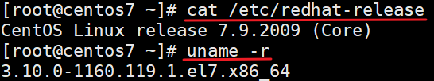


### 2. Docker的基本组成

- 镜像(image)：生成的容器实例，本身也是一个文件，称为镜像文件。
- 容器(container)：一个容器运行一种服务，当我们需要的时候，就可以通过docker客户端创建一个对应的运行实例，也就是我们的容器。
- 仓库(repository)：就是放一堆镜像的地方，我们可以把镜像发布到仓库中，需要的时候再从仓库中拉下来就可以了。


### 3. 安装步骤

CentOS7安装Docker：https://docs.docker.com/engine/install/centos/

1. 确定你是CentOs7及以上版本：cat /etc/redhat-release

2. 卸载旧版本

   ```
   yum remove docker \
              docker-client \
              docker-client-latest \
              docker-common \
              docker-latest \
              docker-latest-logrotate \
              docker-logrotate \
              docker-engine
   ```

3. yum安装gcc相关
   yum -y install gcc
   yum -y install gcc-c++

4. 安装需要的软件包
   yum install -y yum-utils

5. 设置stable镜像仓库
   yum-config-manager --add-repo http://mirrors.aliyun.com/docker-ce/linux/centos/docker-ce.repo

6. 更新yum软件包索引
   yum makecache fast

7. 安装DOCKER CE
   yum install docker-ce docker-ce-cli containerd.io

8. 启动docker
   systemctl start docker

9. 测试
   docker version
   docker run hello-world

10. 卸载
      systemctl stop docker
      yum remove docker-ce docker-ce-cli containerd.io
      rm -rf /var/lib/docker
      rm -rf /var/lib/containerd


### 4. 阿里云镜像加速

1. 注册一个属于自己的阿里云账户(可复用淘宝账号)
2. 找到容器镜像服务
   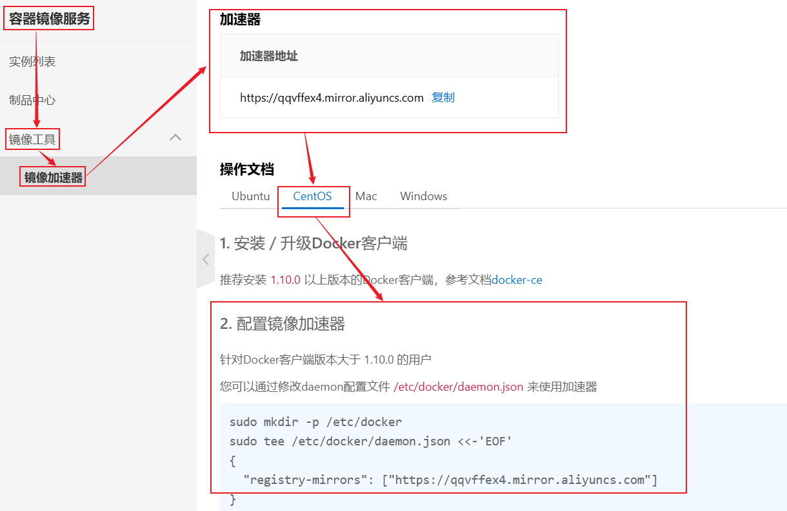https://qqvffex4.mirror.aliyuncs.com
3. 自己去B站找方法 ->回旋镖
4. 测试
   docker run hello-world

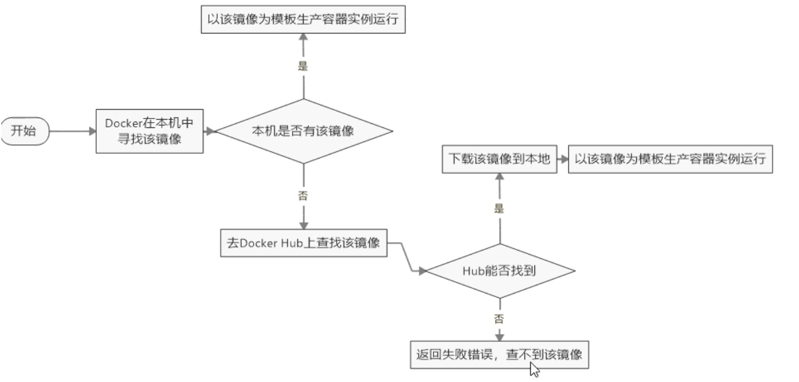


## 三、运行流程

Docker是一个C/S模式的架构，后端是一个松耦合架构，众多模块各司其职。 

Docker运行的基本流程为：

1. 用户是使用 Docker Client 与 Docker Daemon 建立通信，并发送请求给后者。
2. Docker Daemon 作为 Docker 架构中的主体部分，首先提供 Docker Server 的功能使其可以接受 Docker Client 的请求。 
3. Docker Engine 执行 Docker 内部的一系列工作，每一项工作都是以一个 Job 的形式的存在。
4. Job 的运行过程中，当需要容器镜像时，则从 Docker Registry 中下载镜像，并通过镜像管理驱动 Graph driver 将下载镜像以 Graph 的形式存储。
5. 当需要为 Docker 创建网络环境时，通过网络管理驱动 Network driver 创建并配置 Docker 容器网络环境。 
6. 当需要限制 Docker 容器运行资源或执行用户指令等操作时，则通过 Exec driver 来完成。
7. Libcontainer 是一项独立的容器管理包，Network driver 以及 Exec driver 都是通过 Libcontainer 来实现具体对容器进行的操作。


## 四、Docker常用命令

### 1. 帮助启动类命令

- 启动docker：systemctl start docker
- 停止docker：systemctl stop docker
- 重启docker：systemctl restart docker
- 查看docker状态：systemctl status docker
- 开机启动：systemctl enable docker
- 查看docker概要信息：docker info
- 查看docker总体帮助文档：docker --help
- 查看docker命令帮助文档：docker 具体命令 --help


### 2. 镜像命令

> docker images：列出本地主机上的镜像

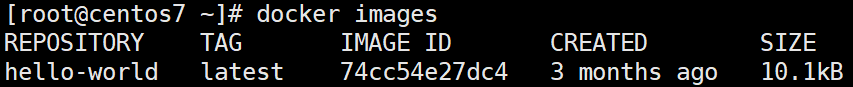

**各个选项说明：**

- REPOSITORY：表示镜像的仓库源
- TAG：版本号
- IMAGEID：镜像ID
- CREATED：镜像创建时间
- SIZE：镜像大小

同一仓库源可以有多个TAG版本，代表这个仓库源的不同个版本，我们使用REPOSITORY：TAG来定义不同的镜像。如果你不指定一个镜像的版本标签，例如你只使用ubuntu，docker将默认使用ubuntu:latest 镜像


**OPTIONS说明：**

- -a：列出本地所有的镜像(含历史映像层)。
- -q：只显示镜像ID。


> docker search 某个xxx镜像名字

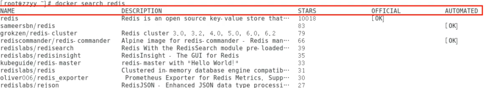

**各个选项说明：**

- NAME：镜像名称
- DESCRIPTION：镜像说明
- STARS：点赞数量
- OFFICIAL：是否是官方
- AUTOMATED：是否是自动构建的

**OPTIONS说明：**

- --limit：只列出N个镜像，默认25个。举例：docker search --limit 5 redis


> docker pull 某个xxx镜像名字(用来下载镜像)

docker pull 镜像名字[:TAG]：没有TAG就是最新版

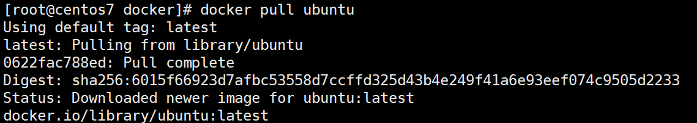


> docker system df 查看镜像/容器/数据卷所占的空间

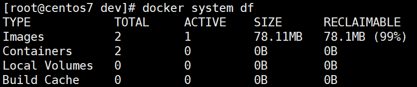


> docker rmi 某个xxx镜像名字ID

删除某个镜像

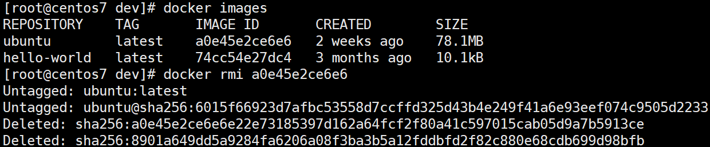

- 删除单个：docker rmi -f 镜像ID
- 删除多个：docker rmi -f 镜像名1:TAG 镜像名2:TAG
- 删除全部：docker rmi -f $(docker images -qa)


### 3. 容器命令

有镜像才能创建容器


> 新建 + 启动容器
>
> docker run [OPTIONS] IMAGE [COMMAND] [ARG]

OPTIONS说明(常用)：有些是一个减号，有些是两个减号

- --name="容器新名字"：为容器指定一个名称；
- -d：后台运行容器并返回容器ID，也即启动守护式容器(后台运行)；
- -i：以交互模式运行容器，通常与 -t 同时使用；
- -t：为容器重新分配一个伪输入终端，通常与 -i 同时使用；也即启动交互式容器(前台有伪终端，等待交互)；
- -P：随机端口映射，大写P
- -p：指定端口映射，小写p

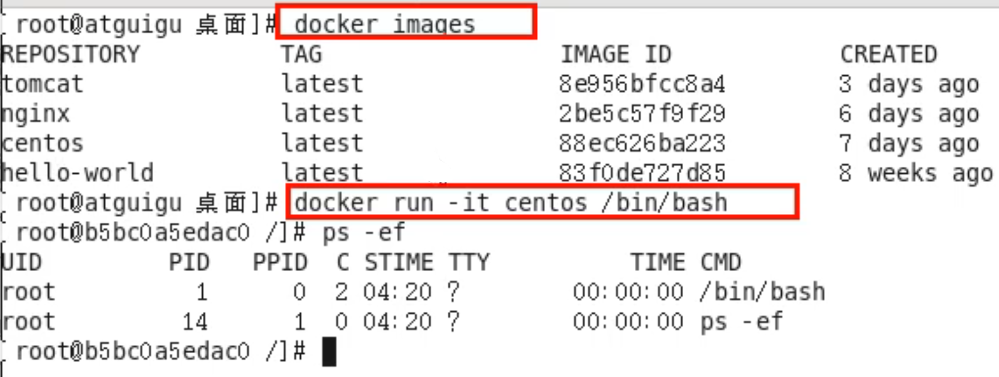

#使用镜像centos:latest以交互模式启动一个容器，在容器内执行/bin/bash命令。
docker run -it centos /bin/bash

参数说明：

- -i：交互式操作。
- -t：终端。
- centos：centos镜像。
- /bin/bash：放在镜像名后的是命令，这里我们希望有个交互式Shell，因此用的是/bin/bash。要退出终端，直接输入exit；


> 列出当前所有正在运行的容器
>
> docker ps [OPTIONS]

OPTIONS说明（常用）：

- -a：列出当前所有正在运行的容器 + 历史上运行过的
- -l：显示最近创建的容器。
- -n：显示最近 n 个创建的容器。
- -q：静默模式，只显示容器编号。


> 退出容器

两种退出方式

1. exit：run进去容器，exit退出，容器停止
2. ctrl + p + q：run进去容器，ctrl + p + q 退出，容器不停止


> 启动已停止运行的容器
>
> docker start 容器ID或者容器名


> 重启容器
>
> docker restart 容器ID或者容器名


> 停止容器
>
> docker stop 容器ID或者容器名


> 强制停止容器
>
> docker kill 容器ID或容器名


> 删除已停止的容器
>
> docker rm 容器ID

一次性删除多个容器实例

- docker rm -f $(docker ps -a -q)
- docker ps -a-q | xargs docker rm


> 启动守护式容器(后台服务器)
>
> 在大部分的场景下，我们希望docker的服务是在后台运行的，我们可以过-d指定容器的后台运行模式。
>
> docker run -d 容器名

举例：使用镜像centos:latest以后台模式启动一个容器

docker run -d centos

问题：然后dockerps-a进行查看，会发现容器已经退出
很重要的要说明的一点：Docker容器后台运行，就必须有一个前台进程
容器运行的命令如果不是那些一直挂起的命令(比如运行top，tail)，就是会自动退出的。

这个是docker的机制问题，比如你的web容器，我们以nginx为例，正常情况下，
我们配置启动服务只需要启动响应的service即可。例如servicenginxstart 
但是，这样做，nginx为后台进程模式运行，就导致docker前台没有运行的应用，
这样的容器后台启动后，会立即自杀因为他觉得他没事可做了。

所以，最佳的解决方案是，将你要运行的程序以前台进程的形式运行，常见就是命令行模式，表示我还有交互操作，别中断。


redis前后台启动演示case

1. 前台交互式启动：docker run -it redis:6.0.8 
2. 后台守护式启动：docker run -d redis:6.0.8
   


> 查看容器日志
>
> docker logs 容器ID


> 查看容器内运行的进程
>
> docker top 容器ID


> 查看容器内部细节
>
> docker inspect 容器ID


> 进入正在运行的容器并以命令行交互

1. docker exec -it 容器ID /bin/bash
2. 重新进入 docker attach 容器ID

**上述两个区别**

- attach 直接进入容器启动命令的终端，不会启动新的进程用exit退出，会导致容器的停止。
- exec 是在容器中打开新的终端，并且可以启动新的进程用exit退出，不会导致容器的停止。

推荐使用 docker exec 命令，因为退出容器终端，不会导致容器的停止。


> 从容器内拷贝文件到主机上
>

docker cp 容器ID:容器内路径 目的主机路径


> 导入和导出容器
>

- export 导出容器的内容留作为一个tar归档文件
- import 从tar包中的内容创建一个新的文件系统再导入为镜像

docker export 容器ID > 文件名.tar

cat 文件名.tar丨docker import - 镜像用户/镜像名:镜像版本号


 

## 五、Docker镜像

### 1. 是什么

> 是一种轻量级、可执行的独立软件包，它包含运行某个软件所需的所有内容，我们把应用程序和配置依赖打包好形成一个可交付的运行环境(包括代码、运行时需要的库、环境变量和配置文件等)，这个打包好的运行环境就是image镜像文件。
>
> 只有通过这个镜像文件才能生成Docker容器实例(类似Java中new出来一个对象)。

以我们的pull为例，在下载的过程中我们可以看到docker的镜像好像是在一层一层的在下载。


### 2. 分层的概念

#### 2.1 UnionFS(联合文件系统)

UnionFS(联合文件系统)：Union文件系统(UnionFS)是一种分层、轻量级并且高性能的文件系统，它支持对文件系统的修改作为一次提交来一层层的叠加，同时可以将不同目录挂载到同一个虚拟文件系统下(unite several directories into a single virtual filesystem)。Union文件系统是Docker镜像的基础。镜像可以通过分层来进行继承，基于基础镜像(没有父镜像)，可以制作各种具体的应用镜像。

特性：一次同时加载多个文件系统，但从外面看起来，只能看到一个文件系统，联合加载会把各层文件系统叠加起来，这样最终的文件系统会包含所有底层的文件和目录


#### 2.2 Docker镜像加载原理

docker的镜像实际上由一层一层的文件系统组成，这种层级的文件系统UnionFS。

bootfs(boot file system)主要包含bootloader和kernel。bootloader主要是引导加载kernel。Linux刚启动时会加载bootfs文件系统，在 Docker镜像的最底层是引导文件系统bootfs。这一层与我们典型的Linux/Unix系统是一样的，包含boot加载器和内核。当boot加载完成之后整个内核就都在内存中了，此时内存的使用权已由bootfs转交给内核，此时系统也会卸载bootfs。

rootfs(root file system)，在bootfs之上。包含的就是典型Linux系统中的/dev,/proc,/bin,/etc 等标准目录和文件。rootfs就是各种不同的操作系统发行版，比如UBuntu，Centos等等。

对于一个精简的OS，rootfs可以很小，只需要包括最基本的命令、工具和程序库就可以了，因为底层直接用Host的kermel，自己只需要提供 rootfs 就行了。由此可见对于不同的linux发行版，bootfs基本是一致的，rootfs会有差别，因此不同的发行版可以公用 bootfs.


#### 2.3 为什么采用分层结构

镜像分层最大的一个好处就是共享资源，方便复制迁移，就是为了复用。

比如说有多个镜像都从相同的base镜像构建而来，那么DockerHost只需在磁盘上保存一份base镜像；

同时内存中也只需加载一份base镜像，就可以为所有容器服务了。而且镜像的每一层都可以被共享。


Docker镜像层都是只读的，容器层是可写的

当容器启动时，一个新的可写层被加载到镜像的顶部。

这一层通常被称作"容器层"，"容器层"之下的都叫"镜像层"。


### 3. commit命令

> docker commit提交容器副本使之成为一个新的镜像
>

ubuntu安装vim

1. 从Hub上下载ubuntu镜像到本地并成功运行
2. 原始的默认ubuntu镜像是不带着vim命令的
3. 外网连通的情况下，安装vim
   apt-get update
   apt-get -y install vim
4. 安装完成后，commit我们自己的新镜像(新开一个终端)
   docker commit -m="提交的描述信息" -a="作者" 容器ID 要创建的目标镜像名:[标签名]
   docker commit -m="vim alreadly add" -a="isjhd" 445fa91ae6e1 atguigu/mybuntu:1.3


## 六、本地镜像发布到阿里云

本地镜像发布到阿里云流程

1. 生产一个镜像

2. 创建仓库镜像

进入阿里云，进入容器镜像服务

选择个人实例

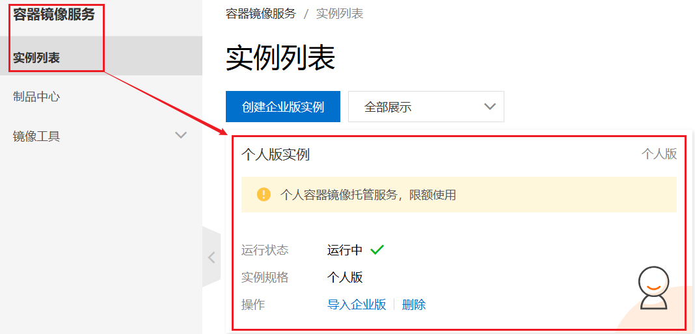

命名空间

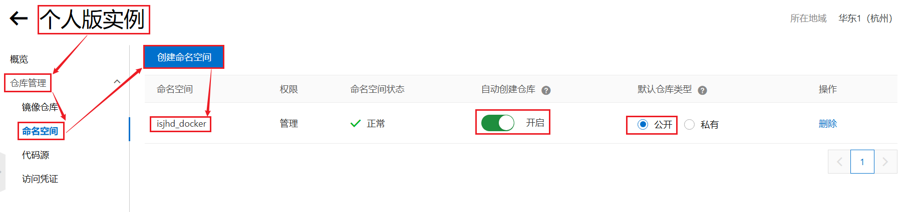

仓库名称

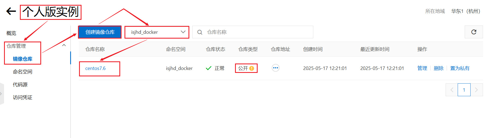

进入管理界面获得脚本

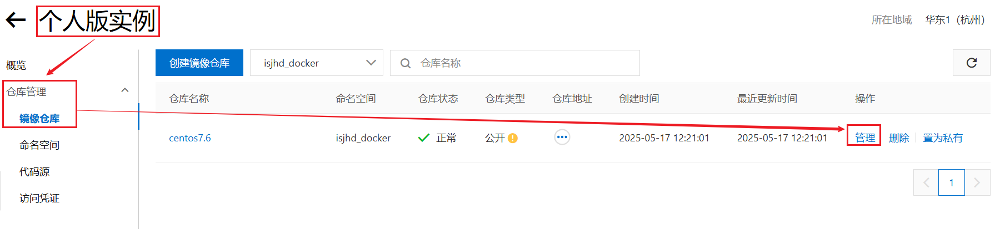


3. 将镜像推送到阿里云(跟着官方来)
   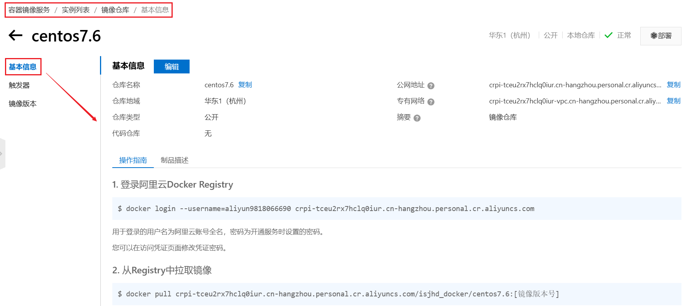

- docker login --username=aliyun9818066690 crpi-tceu2rx7hclq0iur.cn-hangzhou.personal.cr.aliyuncs.com
- docker tag [ImageId] crpi-tceu2rx7hclq0iur.cn-hangzhou.personal.cr.aliyuncs.com/isjhd_docker/centos7.6:[镜像版本号]
- docker push crpi-tceu2rx7hclq0iur.cn-hangzhou.personal.cr.aliyuncs.com/isjhd_docker/centos7.6:[镜像版本号]


4. 将阿里云上的镜像下载到本地

- docker pull crpi-tceu2rx7hclq0iur.cn-hangzhou.personal.cr.aliyuncs.com/isjhd_docker/centos7.6:[镜像版本号]


## 七、本地镜像发布到私有库

1. 官方DockerHub地址：https://hub.docker.com/，中国大陆访问太慢了且准备被阿里云取代的趋势，不太主流。
2. Dockerhub、阿里云这样的公共镜像仓库可能不太方便，涉及机密的公司不可能提供镜像给公网，所以需要创建一个本地私人仓库供给团队使用，基于公司内部项目构建镜像。

DockerRegistry是官方提供的工具，可以用于构建私有镜像仓库


**将本地镜像推送到私有库**

1. 下载镜像Docker Registry
   docker pull registry
2. 运行私有库Registry，相当于本地有个私有Docker hub
   docker run -d -p 5000:5000 -v /zzyyuse/myregistry/:/tmp/registry --privileged=true registry
3. 案例演示创建一个新镜像，ubuntu安装ifconfig命令
   docker run -it ubuntu /bin/bash
   apt-get update
   apt-get install net-tools
   docker commit -m="ifconfig cmd add" -a="作者" 容器ID 新的容器名:版本号
4. curl验证私服库上有什么镜像
   curl -XGET http://192.168.13.129:5000/v2/_catalog
5. 将新镜像zzyyubuntu:1.2修改符合私服规范的Tag
   docker tag 镜像:Tag Host:Port/Repository:Tag
   docker tag ubuntu:1.2 192.168.13.129:5000/ubuntu:1.2
6. 修改配置文件使之支持http
   vim /etc/docker/daemon.json
   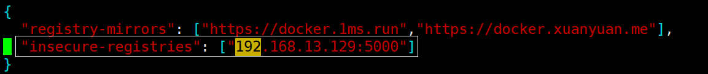
   重启docker：
   systemctl restart docker
   systemctl status docker
7. push推送到私服库
   docker push 192.168.13.129:5000/ubuntu:1.2
8. curl验证私服库上有什么镜像
   curl -XGET http://192.168.13.129:5000/v2/_catalog
9. pull到本地并运行
   docker pull 192.168.13.129:5000/ubuntu:1.2


## 八、Docker容器数据卷

### 1. 是什么？

> 将docker容器内的数据保存进宿主机的磁盘中

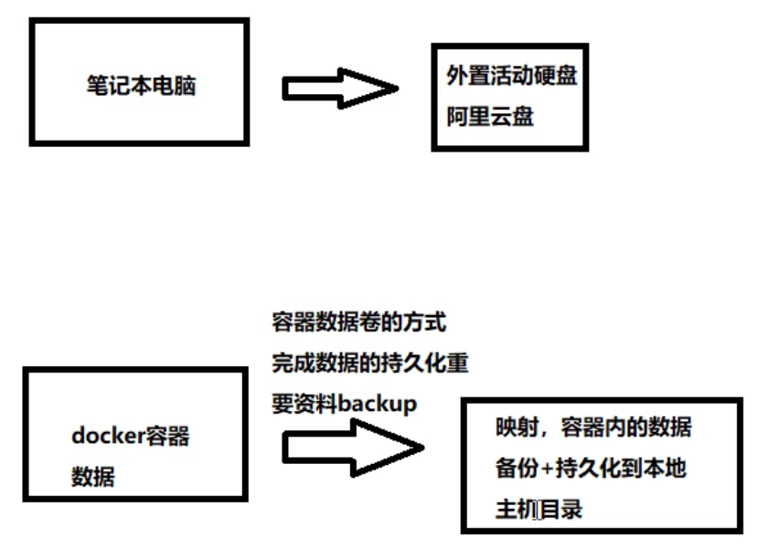


卷就是目录或文件，存在于一个或多个容器中，由docker挂载到容器，但不属于联合文件系统，因此能够绕过UnionFileSystem提供一些用于持续存储或共享数据的特性：

卷的设计目的就是数据的持久化，完全独立于容器的生存周期，因此Docker不会在容器删除时删除其挂载的数据卷


### 2. 能干吗？

将运用与运行的环境打包镜像，run后形成容器实例运行，但是我们对数据的要求希望是持久化的。

Docker容器产生的数据，如果不备份，那么当容器实例删除后，容器内的数据自然也就没有了。为了能保存数据在docker中我们使用卷。

特点：

1. 数据卷可在容器之间共享或重用数据
2. 卷中的更改可以直接实时生效
3. 数据卷中的更改不会包含在镜像的更新中
4. 数据卷的生命周期一直持续到没有容器使用它为1


### 3. 容器卷和主机互通互联

1. 宿主vs容器之间映射添加容器卷

docker run -it --privileged=true -v /宿主机绝对路径目录:/容器内目录 镜像名
docker run -it --privileged=true -v /tmp/host_data:/tmp/docker_data --name=u1 ubuntu

查看数据卷是否挂载成功
docker inspect 容器ID
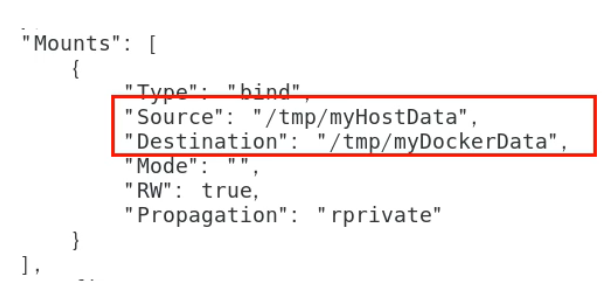

容器和宿主机之间数据共享

1. docker修改，主机同步获得
2. 主机修改，docker同步获得
3. docker容器stop，主机修改，docker容器重启看数据也同步。


### 4. 容器卷ro和rw读写规则

读写规则映射添加说明

> 读写(默认)：docker run -it --privileged=true -v /宿主机绝对路径目录:/容器内目录:rw 镜像名
>
> 只读：docker run -it --privileged=true -v /宿主机绝对路径目录:/容器内目录:ro 镜像名(容器实例内部被限制，只能读取不能写)


### 5. 容器卷的继承和共享

1. 容器1完成和宿主机的映射
   docker run -it --privileged=true -v /mydocker/u:/tmp/u --name u1 ubuntu /bin/bash
2. 容器2继承容器1的卷规则
   docker run -it --privileged=true --volumes-from 父类 --name u2 ubuntu


## 九、Docker常规安装简介

**总体步骤**

1. 搜索镜像
2. 拉取镜像
3. 查看镜像
4. 启动镜像
5. 停止容器
6. 移除容器


### 1. 安装tomcat

1. docker hub上面查找tomcat镜像
   docker search tomcat
2. 从docker hub上拉取tomcat镜像到本地
   docker pull tomcat
3. docker images查看是否有拉取到的tomcat
   docker images tomcat
4. 使用tomcat镜像创建容器实例(也叫运行镜像)
   docker run -it -p 8080:8080 tomcat
   -p：主机端口:docker容器端口
   -P：随机分配端口
   -i：交互
   -t：终端
   -d：后台
5. 访问tomcat首页
   docker run -d -p 8080:8080 --name t1 tomcat

**新版BUG，访问失败。**
解决：进入tomcat，把webapps.dist目录换成webapps
docker exec -it 容器ID /bin/bash
rm -r webapps
mv webapps.dist webapps


**免修改版说明**
docker pull billygoo/tomcat8-jdk8
docker run-d -p 8080:8080 --name mytomcat8 billygoo/tomcat8-jdk8


### 2. 安装mysql

**简单版**

1. docker hub上面查找mysql镜像
   docker search mysql
2. 从docker hub上(阿里云加速器)拉取mysql镜像到本地标签为5.7
   docker pull mysql:5.7
3. 使用mysql5.7镜像创建容器(也叫运行镜像)
   docker run -p 3306:3306 -e MYSQL_ROOT_PASSWORD=123456 -d mysql:5.7
   docker exec -it 容器ID /bin/bash

插入中文数据试试，为什么报错？docker上默认字符集编码隐患
mysql里面执行：SHOW VARIABLES LIKE 'character%'

删除容器后，里面的mysgl数据如何办？使用容器卷

**实战版**

1. 新建mysql容器实例：docker run -d -p 3306:3306 --privileged=true -v /zzyyuse/mysql/log:/var/log/mysql -v /zzyyuse/mysql/data:/var/lib/mysql -v /zzyyuse/mysql/conf:/etc/mysql/conf.d -e MYSQL_R00T_PASSWORD=123456 -name mysql mysql:5.7

2. 新建my.cnf，通过容器卷同步给mysql容器实例

   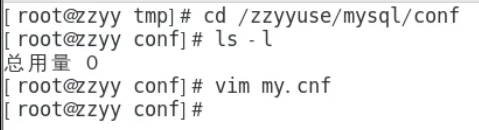
   插入以下内容

   ```
   [client]
   default_character_set=utf8
   [mysqld]
   collation_server=utf8_general_ci character_set_server=utf8
   ```

3. 重新启动mysql容器实例再重新进入并查看字符编码
   docker restart mysql
   docker exec -it mysql /bin/bash
   mysql -u root -p
   SHOW VARIABLES LIKE 'character%'

4. 测试


### 3. 安装redis

1. docker pull redis:6.0.8
2. 在CentOs宿主机下新建目录/app/redis
   mkdir -p /app/redis
3. 将一个 redis.conf 文件模板拷贝进 /app/redis 目录下
   (默认出厂的原始redis.conf可以自己去网上找)
4. /app/redis目录下修改redis.conf文件

(1) 开启redis验证(可选)
requirepass 123456

(2) 允许redis外地连接必须
注释掉 #bind 127.0.0.1

(3) 将 daemonize yes 注释起来或者 daemonize no 设置，因为该配置和docker run中 -d 参数冲突，会导致容器一直启动失败。
daemonize no

(4) 开启redis数据持久化(可选)
appendonly yes

6. 使用 redis6.0.8 镜像创建容器(也叫运行镜像)
   docker run -p 6379:6379 --name myr3 --privileged=true -v /app/redis/redis.conf:/etc/redis/redis.conf -v /app/redis/data:/data -d redis:6.0.8 redis-server /etc/redis/redis.conf
7. 测试redis-cli连接上来
   docker exec -it myrs /bin/bash
   redis-cli


redis.config

# docker高级篇

## 一、Docker复杂安装说明

### 1. 安装mysql主从复制

主从搭建步骤

1. 新建主服务器容器实例3307

docker run -p 3307:3306 --name mysql-master \
-v /mydata/mysql-master/log:/var/log/mysql \
-v /mydata/mysql-master/data:/var/lib/mysql \
-v /mydata/mysql-master/conf:/etc/mysql \
-e MYSQL_ROOT_PASSWORD=root \
-d mysql:5.7

2. 进入/mydata/mysql-master/conf目录下新建my.cnf

vim my.cnf

```properties
[mysqld]
##设置server_id，同一局域网中需要唯一 
server_id=101
##指定不需要同步的数据库名称
binlog-ignore-db=mysql
##开启二进制日志功能
log-bin=mall-mysql-bin
##设置二进制日志使用内存大小（事务） 
binlog_cache_size=1M
##设置使用的二进制日志格式（mixed，statement，row） 
binlog_format=mixed
##二进制日志过期清理时间。默认值为0；表示不自动清理。 
expire_logs_days=7
##跳过主从复制中遇到的所有错误或指定类型的错误，避免slave端复制中断。
##如：1062错误是指一些主键重复，1032错误是因为主从数据库数据不一致 
slave_skip_errors=1062
```


3. 修改完配置后重启master实例

docker restart mysql-master


4. 进入mysql-master容器

docker exec -it mysql-master /bin/bash

mysql -uroot -proot


5. master容器实例内创建数据同步用户

CREATE USER 'slave'@'%' IDENTIFIED BY '123456';

GRANT REPLICATION SLAVE, REPLICATION CLIENT ON &ast;.&ast; TO 'slave'@'%';


6. 新建从服务器容器实例3308

docker run -p 3308:3306 --name mysql-slave \
-v /mydata/mysql-slave/log:/var/log/mysql \
-v /mydata/mysql-slave/data:/var/lib/mysql \
-v /mydata/mysql-slave/conf:/etc/mysql \
-e MYSQL_ROOT_PASSWORD=root \
-d mysql:5.7


7. 进入/mydata/mysql-master/conf目录下新建my.cnf
   vim my.cnf

```properties
[mysqld]
##设置server_id，同一局域网中需要唯一 
server_id=102
##指定不需要同步的数据库名称
binlog-ignore-db=mysql
##开启二进制日志功能，以备Slave作为其它数据库实例的Master时使用
log-bin=mall-mysql-slave1-bin
##设置二进制日志使用内存大小（事务） 
binlog_cache_size=1M
##设置使用的二进制日志格式（mixed，statement，row）
binlog_format=mixed
##二进制日志过期清理时间。默认值为0，表示不自动清理。 
expire_logs_days=7
##跳过主从复制中遇到的所有错误或指定类型的错误，避免slaVe端复制中断。
##如：1062错误是指一些主键重复，1032错误是因为主从数据库数据不一致
slave_skip_errors=1062
##relay_Log配置中继日志
relay_log=mall-mysql-relay-bin
##log_slave_updates表示slave将复制事件写进自己的二进制日志
log_slave_updates=1
##slave设置为只读（具有super权限的用户除外）
read_only=1
```


8. 修改完配置后重启slave实例

docker restart mysql-slave


9. 在主数据库中查看主从同步状态

show master status;


10. 进入mysql-slave容器

docker exec-it mysql-slave /bin/bash 

mysql -uroot -proot


11. 在从数据库中配置主从复制

change master to master_host='宿主机ip', master_user='slave', master_password='123456', master_port=3307, master_log_file='mall-mysql-bin.000001', master_log_pos=617, master_connect_retry=30;


12. 在从数据库中查看主从同步状态

show slave status \G;


13. 在从数据库中开启主从同步

start slave;


14. 查看从数据库状态发现已经同步

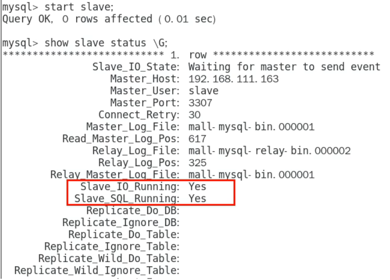


15. 主从复制测试

主机新建库-使用库-新建表-插入数据，ok 

从机使用库-查看记录，ok


### 2. 安装redis集群

- 3主3从redis集群配置

1. 关闭防火墙 + 启动docker后台服务

systemctl start docker


2. 新建6个docker容器实例

docker run -d --name redis-node-1 --net host --privileged=true -v /data/redis/share/redis-node-1:/data redis:6.0.8 --cluster-enabled yes --appendonly yes --port 6381

docker run -d --name redis-node-2 --net host --privileged=true -v /data/redis/share/redis-node-2:/data redis:6.0.8 --cluster-enabled yes --appendonly yes --port 6382

docker run -d --name redis-node-3 --net host --privileged=true -v /data/redis/share/redis-node-3:/data redis:6.0.8 --cluster-enabled yes --appendonly yes --port 6383

docker run -d --name redis-node-4 --net host --privileged=true -v /data/redis/share/redis-node-4:/data redis:6.0.8 --cluster-enabled yes --appendonly yes --port 6384

docker run -d --name redis-node-5 --net host --privileged=true -v /data/redis/share/redis-node-5:/data redis:6.0.8 --cluster-enabled yes --appendonly yes --port 6385

docker run -d --name redis-node-6 --net host --privileged=true -v /data/redis/share/redis-node-6:/data redis:6.0.8 --cluster-enabled yes --appendonly yes --port 6386


3. 进入容器redis-node-1并为6台机器构建集群关系

进入容器：docker exec -it redis-node-1 /bin/bash

构建主从关系：redis-cli --cluster create 192.168.111.167:6381 192.168.111.167:6382 192.168.111.167:6383 192.168.111.167:6384 192.168.111.167:6385 192.168.111.167:6386 --cluster-replicas 1


- 主从容错切换迁移案例

1. 数据读写存储

启动6机，构成的集群并通过exec进入

对6381新增两个key

防止路由失效加参数-c并新增两个key

查看集群信息：redis-cli --cluster check 192.168.111.147:6381


2. 容错切换迁移

主6381和从机切换，先停止主机6381

再次查看集群信息

先还原之前的3主3从

查看集群状态


## 二、DockerFile

### 1. 是什么？

Dockerfile是用来构建Docker镜像的文本文件，是由一条条构建镜像所需的指令和参数构成的脚本。

**构建三步骤**

1. 编写Dockerfile文件
2. docker build命令构建镜像
3. docker run依镜像运行容器实例


### 2. DockerFile构建过程

Dockerfile内容基础知识

1. 每条保留字指令都必须为大写字母且后面要跟随至少一个参数
2. 指令按照从上到下，顺序执行
3. #表示注释
4. 每条指令都会创建一个新的镜像层并对镜像进行提交


Docker执行Dockerfile的大致流程

1. docker从基础镜像运行一个容器
2. 执行一条指令并对容器作出修改
3. 执行类似docker commit的操作提交一个新的镜像层
4. docker再基于刚提交的镜像运行一个新容器
5. 执行docker file中的下一条指令直到所有指令都执行完成


**小总结**

从应用软件的角度来看，Dockerfile、Docker镜像与Docker容器分别代表软件的三个不同阶段。

- Dockerfile是软件的原材料
- Docker镜像是软件的交付品
- Docker容器则可以认为是软件镜像的运行态，也即依照镜像运行的容器实例

Dockerfile面向开发，Docker镜像成为交付标准，Docker容器则涉及部署与运维，三者缺一不可，合力充当Docker体系的基石。

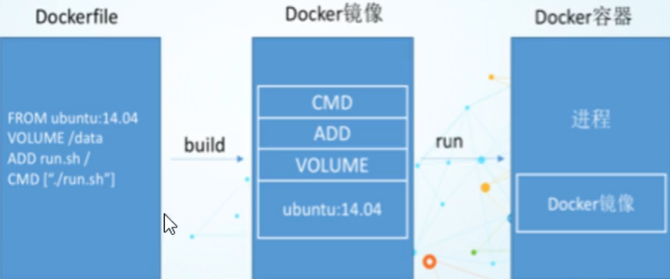

1. Dockerfile，需要定义一个Dockerfile，Dockerfile定义了进程需要的一切东西。Dockerfile涉及的内容包括执行代码或者是文件、环境变量、依赖包、运行时环境、动态链接库、操作系统的发行版、服务进程和内核进程(当应用进程需要和系统服务和内核进程打交道，这时需要考虑如何设计namespace的权限控制)等等；
2. Docker镜像，在用Dockerfile定义一个文件之后，docker build时会产生一个Docker镜像，当运行Docker镜像时会真正开始提供服务；
3. Docker容器，容器是直接提供服务的。


### 3. DockerFile常用保留字指令

- FROM


基础镜像，当前新镜像是基于哪个镜像的，指定一个已经存在的镜像作为模板，第一条必须是from


- MAINTAINER


镜像维护者的姓名和邮箱地址


- RUN


容器构建时需要运行的命令

**两种格式**

#<命令行命令>等同于，在终端操作的shell命令。
shell格式：RUN <命令行命令> 

#例如：RUN ["./test.php", "dev", "offline"] 等价于 RUN ./test.php dev offline
exec格式：RUN["可执行文件", "参数1", "参数2"]

RUN是在docker build时运行


- EXPOSE


当前容器对外暴露出的端口


- WORKDIR


指定在创建容器后，终端默认登陆的进来工作目录，一个落脚点


- USER


指定该镜像以什么样的用户去执行，如果都不指定，默认是root


- ENV


用来在构建镜像过程中设置环境变量


- ADD

将宿主机目录下的文件拷贝进镜像且会自动处理URL和解压tar压缩包


- COPY

类似ADD，拷贝文件和目录到镜像中。
将从构建上下文目录中<源路径>的文件/目录复制到新的一层的镜像内的<目标路径>位置


- VOLUME


容器数据卷，用于数据保存和持久化工作


- CMD


指定容器启动后的要干的事情

注意：Dockerfile中可以有多个CMD指令，但只有最后一个生效，CMD会被docker run之后的参数替换
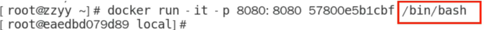

它和前面RUN命令的区别
CMD是在docker run时运行。
RUN是在docker build时运行。


- ENTRYPOINT


也是用来指定一个容器启动时要运行的命令

类似于CMD指令，但是ENTRYPOINT不会被docker run后面的命令覆盖，而且这些命令行参数会被当作参数送给ENTRYPOINT指令指定的程序

ENTRYPOINT可以和CMD一起用，一般是变参才会使用CMD，这里的CMD等于是在给ENTRYPOINT传参。

当指定了ENTRYPOINT后，CMD的含义就发生了变化，不再是直接运行其命令而是将CMD的内容作为参数传递给ENTRYPOINT指令，他两个组合会变成<ENTRYPOINT><cmd>

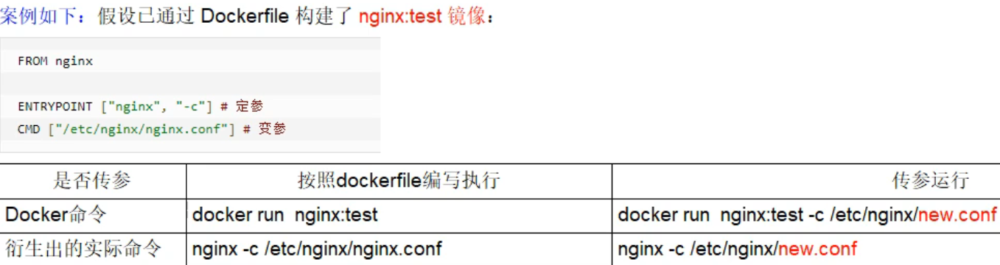


### 4. 案例

#### 4.1 自定义镜像mycentosjava8


要求：
Centos7镜像具备vim+ifconfig+jdk8
JDK的下载镜像地址

编写Dockerfile文件：

```Dockerfile
FROM centos
MAINTAINER zzyy<zzyybs@126.com>

ENV MYPATH /usr/local
WORKDIR $MYPATH

#安装vim编辑器
RUN yum -y install vim
#安装ifconfig命令查看网络IP
RUN yum -y install net-tools
#安装java8及Lib库
RUN yum -y install glibc.i686 
RUN mkdir /usr/local/java
#ADD是相对路径jar,把jdk-8u171-Linux-x64.tar.gz添加到容器中，安装包必须要和Dockerfile文件在同一位置
ADD jdk-8u171-linux-x64.tar.gz /usr/local/java/
#配置java环境变量
ENV JAVA_H0ME /usr/local/java/jdk1.8.O_171
ENV JRE_HOME $JAVA_HOME/jre
ENV CLASSPATH $JAVA_HOME/lib/dt.jar:$JAVA_HOME/lib/tools.jar:$JRE_HOME/Lib:$CLASSPATH
ENV PATH $JAVA_HOME/bin:$PATH

EXPOSE 80

CMD echo $MYPATH
CMD echo "success------ok"
CMD /bin/bash
```

构建：
docker build -t 新镜像名字:TAG .
docker build -t centosjava8:1.5 .

运行：
docker run -it 新镜像名字:TAG


#### 4.2 虚悬镜像

**是什么？**
仓库名、标签都是<none>的镜像，俗称dangling image

**Dockerfile写一个？**

1. vim Dockerfile

```Dockerfile
from ubuntu
CMD echo 'action is success'
```

2. docker build .

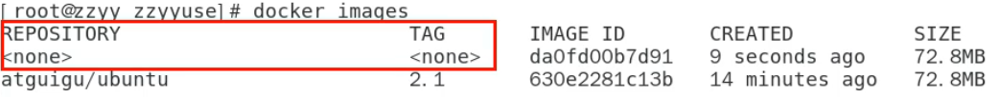


**查看**
docker image is -f dangling=true


**删除**
docker image prune


## 三、Docker微服务实战

- 通过IDEA新建一个普通微服务模块


- 通过dockerfile发布微服务部署到docker容器

1. IDEA工具里面搞定微服务jar包

2. 编写Dockerfile
   vim Dockerfile

   ```Dockerfile
   #基础镜像使用java
   FROM java:8
   #作者
   MAINTAINER zzyy
   #VOLUME指定临时文件目录为/tmp, 在主机/var/Lib/docker目录下创建了一个临时文件并链接到容器的/tmp
   VOLUME /tmp
   #将jar包添加到容器中并更名为zzyy_docker.jar
   ADD docker_boot-O.O.1-SNAPSHOT.jar zzyy_docker.jar
   #运行jar包
   RUN bash -c 'touch /zzyy_docker.jar'
   ENTRYPOINT ["java","-jar","/zzyy_docker.jar"]
   #暴露6001端口作为微服务 
   EXPOSE 6001
   ```

   

3. 构建镜像
   docker build -t zzyy_docker:1.6 .

4. 运行容器
   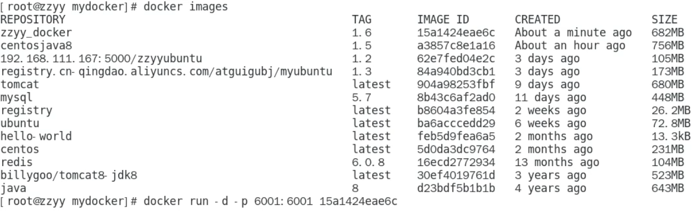

5. 访问测试


## 四、Docker网络

docker不启动，默认网络情况

- ens33
- lo
- virbr0

docker启动后，网络情况

- docker0
- ens33
- lo
- virbr0


### 1. 常见命令

- 查看网络
  docker network ls
- 查看网络源数据
  docker network inspect 网络名字
- 删除网络
  docker network rm 网络名字


**能干吗？**

- 容器间的互联和通信以及端口映射
- 容器IP变动时候可以通过服务名直接网络通信而不受到影响


### 2. 网络模式

| 网络模式  | 简介                                                         |
| --------- | ------------------------------------------------------------ |
| bridge    | 为每一个容器分配、设置IP等，并将容器连接到一个 docker0 虚拟网桥，默认为该模式。 |
| host      | 容器将不会虚拟出自己的网卡，配置自己的IP 等，而是使用宿主机的IP和端口。 |
| none      | 容器有独立的Network namespace，但并没有对其进行任何网络设置，如分配 veth pair 和网桥连接，IP等。 |
| container | 新创建的容器不会创建自己的网卡和配置自己的 IP，而是和一个指定的容器共享IP、端口范围等。 |

容器实例内默认网络IP生产规则

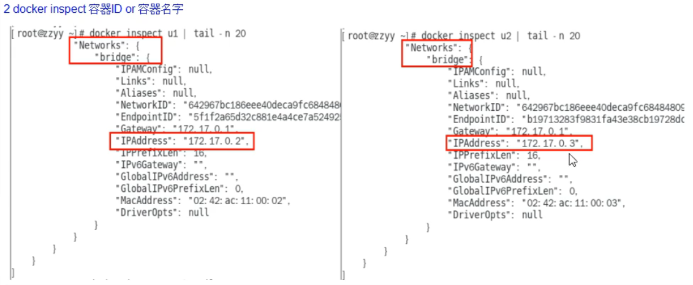

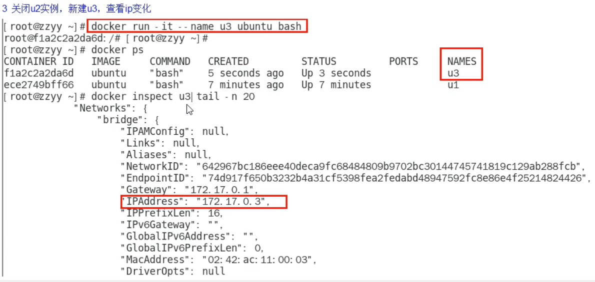

结论：docker容器内部的ip是有可能会发生改变的


### 3. 案例说明

#### 3.1 bridge


是什么？
Docker服务默认会创建一个docker0网桥（其上有一个docker0内部接口），该桥接网络的名称为docker0，它在内核层连通了其他的物理或虚拟网卡，这就将所有容器和本地主机都放到同一个物理网络。Docker默认指定了docker0接口的IP地址和子网掩码，让主机和容器之间可以通过网桥相互通信。

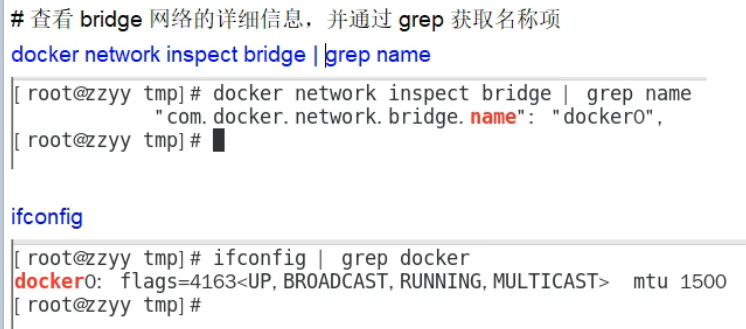


说明

1. Docker使用Linux桥接，在宿主机虚拟一个Docker容器网桥(docker0)，Docker启动一个容器时会根据Docker网桥的网段分配给容器一个IP地址，称为Container-IP，同时Docker网桥是每个容器的默认网关。因为在同一宿主机内的容器都接入同一个网桥，这样容器之间就能够通过容器的 Container-IP直接通信。
2. docker run的时候，没有指定net work的话默认使用的网桥模式就是bridge，使用的就是docker0。在宿主机ifconfig，就可以看到docker0和自己 create的network(后面讲)eth0，eth1，eth2.....代表网卡一，网卡二，网卡三...…，lo代表127.0.0.1，即localhost，inet addr用来表示网卡的IP地址
3. 网桥docker0创建一对对等虚拟设备接口一个叫veth，另一个叫eth0，成对匹配。
   1. 整个宿主机的网桥模式都是docker0，类似一个交换机有一堆接口，每个接口叫veth，在本地主机和容器内分别创建一个虚拟接口，并让他们彼此联通（这样一对接口叫veth pair）；
   2. 每个容器实例内部也有一块网卡，每个接口叫eth0；
   3. docker0上面的每个veth匹配某个容器实例内部的eth0，两两配对，一一匹配。

通过上述，将宿主机上的所有容器都连接到这个内部网络上，两个容器在同一个网络下，会从这个网关下各自拿到分配的ip，此时两个容器的网络是互通的。

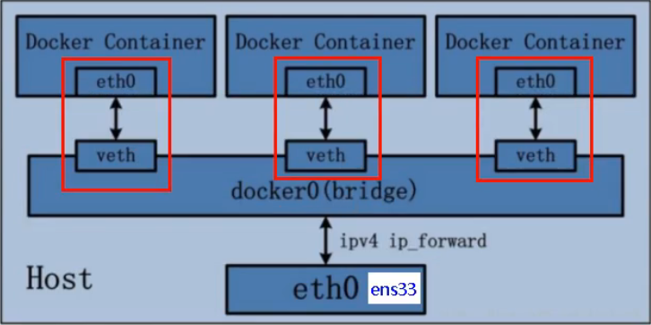

两两匹配验证

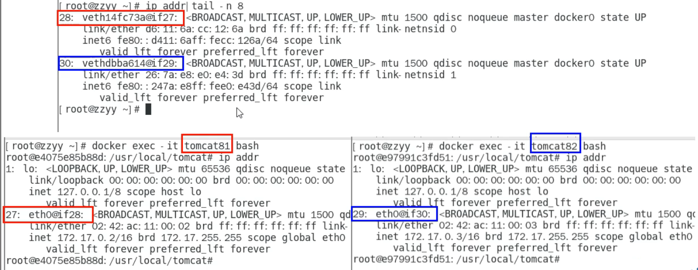


#### 3.2 host

是什么？
直接使用宿主机的IP地址与外界进行通信，不再需要额外进行NAT转换。

说明：容器将不会获得一个独立的Network Namespace，而是和宿主机共用一个Network Namespace。容器将不会虚拟出自己的网卡而是使用宿主机的 IP和端口。

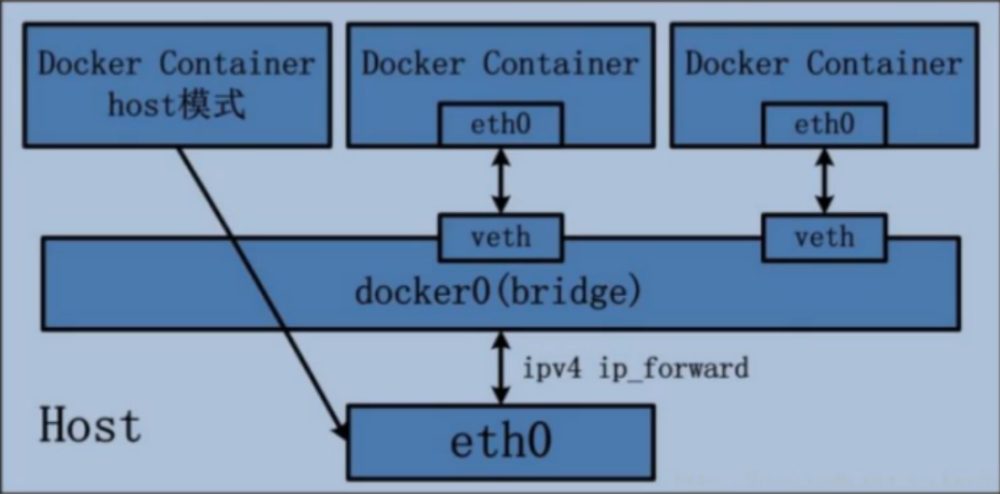


#### 3.3 none

是什么？
禁用网络功能，只有lo标识(就是127.0.0.1表示本地回环)

说明：
在none模式下，并不为Docker容器进行任何网络配置。
也就是说，这个Docker容器没有网卡、IP、路由等信息，只有一个lo 需要我们自己为Docker容器添加网卡、配置IP等。


#### 3.4 container

新建的容器和已经存在的一个容器共享一个网络ip配置而不是和宿主机共享。新创建的容器不会创建自己的网卡，配置自己的IP，而是和一个指定的容器共享IP、端口范围等。同样，两个容器除了网络方面，其他的如文件系统、进程列表等还是隔离的。

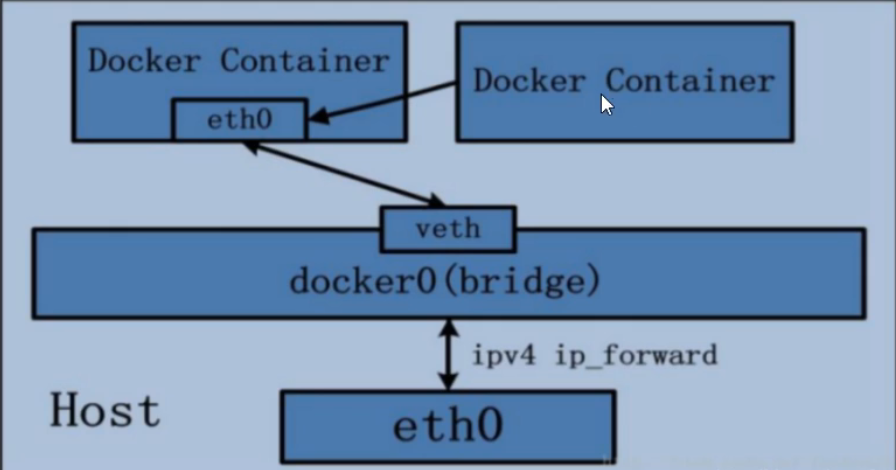


#### 3.5 自定义网络

- 用之前


docker run -d -p 8081:8080 --name tomcat81 billygoo/tomcat8-jdk8
docker run -d -p 8082:8080 --name tomcat82 billyg0o/tomcat8-jdk8
上述成功启动并用docker exec进入各自容器实例内部

问题：
按照IP地址ping是OK的
按照服务名ping不行


- 用之后


自定义桥接网络，自定义网络默认使用的是桥接网络bridge

新建自定义网络：**docker network create zzyy_network**

新建容器加入上一步新建的自定义网络
docker run -d -p 8081:8080 --network zzyy_network --name tomcat81 billygoo/tomcat8-jdk8
docker run -d -p 8082:8080 --network zzyy_network --name tomcat82 billygoo/tomcat8-jdk8

互相ping测试，OK

> 自定义网络本身就维护好了主机名和ip的对应关系。(ip和域名都能通)
>


## 五、Docker-compose容器编排

**是什么？**

> Docker-Compose是Docker官方的开源项目，负责实现对Docker容器集群的快速编排。
>
> Compose是Docker公司推出的一个工具软件，可以管理多个Docker容器组成一个应用。你需要定义一个YAML格式的配置文件 docker-compose.yml，写好多个容器之间的调用关系。然后，只要一个命令，就能同时启动/关闭这些容器

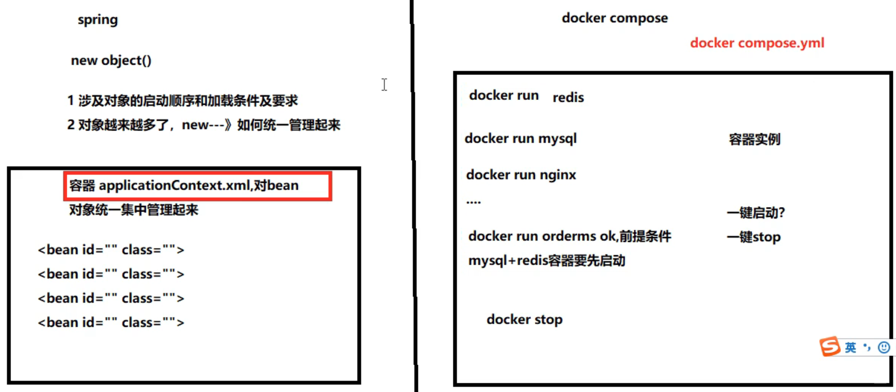


**能干吗？**

> docker建议我们每一个容器中只运行一个服务，因为docker容器本身占用资源极少，所以最好是将每个服务单独的分割开来但是这样我们又面临了一个问题？
>
> 如果我需要同时部署好多个服务，难道要每个服务单独写Dockerfile然后在构建镜像，构建容器，这样累都累死了，所以docker官方给我们提供了 docker-compose多服务部署的工具
>
> 例如要实现一个Web微服务项目，除了Web服务容器本身，往往还需要再加上后端的数据库mysql服务容器，redis服务器，注册中心eureka，甚至还包括负载均衡容器等等。。
>
> Compose允许用户通过一个单独的docker-compose.yml模板文件（YAML格式）来定义一组相关联的应用容器为一个项目（project）。
>
> 可以很容易地用一个配置文件定义一个多容器的应用，然后使用一条指令安装这个应用的所有依赖，完成构建。Docker-Compose解决了容器与容器之间如何管理编排的问题。


**下载**

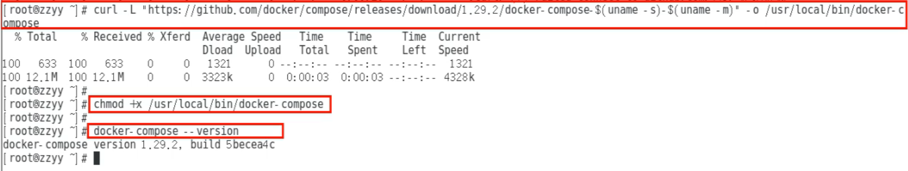


### 1. Compose核心概念

- 一个文件
  docker-compose.yml


- 两大要素


1. 服务
   一个个应用容器实例，比如订单微服务、库存微服务、mysql容器、nginx容器或者redis容器

2. 工程
   由一组关联的应用容器组成的一个完整业务单元，在 docker-compose.yml文件中定义。

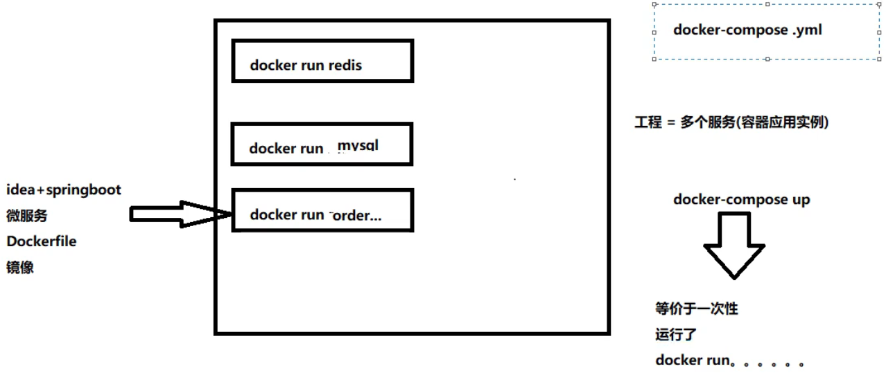


### 2. Compose使用的三个步骤

1. 编写Dockerfile定义各个微服务应用并构建出对应的镜像文件
2. 使用docker-compose.yml，定义一个完整业务单元，安排好整体应用中的各个容器服务。
3. 最后，执行docker-compose up命令，来启动并运行整个应用程序，完成一键部署上线


### 3. Compose常用命令

- docker-compose -h #查看帮助
- docker-compose up #启动所有docker-compose服务
- docker-compose up -d #启动所有docker-compose服务并后台运行
- docker-compose down #停止并删除容器、网络、卷、镜像。
- docker-compose exec yml里面的服务id #进入容器实例内部 docker-compose exec docker-compose.yml文件中写的服务id /bin/bash
- docker-compose ps #展示当前docker-compose编排过的运行的所有容器
- docker-compose top #展示当前docker-compose编排过的容器进程
- docker-compose logs yml里面的服务id #查看容器输出日志
- dokcer-compose config #检查配置
- dokcer-compose config -q #检查配置，有问题才有输出
- docker-compose restart #重启服务
- docker-compose start #启动服务
- docker-compose stop #停止服务


### 4. Compose编排微服务

- 改造升级微服务工程docker_boot

mvn package命令将微服务形成新的jar包并上传到Linux服务器/mydocker目录下

编写Dockerfile

构建镜像


- 不用Compose

1. 启动单独的mysql容器实例
2. 启动单独的redis容器实例
3. 微服务工程
4. 上面三个容器实例依次顺序启动成功


有什么问题？

1. 先后顺序要求固定，先mysgl+redis才能微服务访问成功
2. 多个run命令....
3. 容器间的启停或宕机，有可能导致IP地址对应的容器实例变化，映射出错，要么生产IP写死（可以但是不推荐)，要么通过服务调用


- 使用Compose


1. 编写docker-compose.yml文件


```yml
version: "3"

services:
	microService:
		image: zzyy_docker:1.6 
		container_name: ms01 
		ports:
			- "6001:6001" 
		volumes:
			- /app/microService:/data
		networks:
			- atguigu_net
		depends_on:
			- redis
			- mysql
    redis:
    	image: redis:6.0.8
    	ports:
    		- "6379:6379"
		volumes:
			- /app/redis/redis.conf:/etc/redis/redis.conf
			- /app/redis/data:/data
        networks:
        	- atguigu_net
        command: redis-server /etc/redis/redis.conf
        
	mysql:
		image: mysql:5.7
		environment:
            MYSQL_R00T_PASSWORD: '123456'
            MYSQL_ALLOW_EMPTY_PASSWORD: 'no'
            MYSQL_DATABASE: 'db2021'
            MYSQL_USER: 'zzyy'
            MYSQL_PASSWORD: 'zzyy123'
        ports:
			- "3306:3306"
        volumes:
            - /app/mysql/db:/var/lib/mysql
            - /app/mysql/conf/my.cnf:/etc/my.cnf
            - /app/mysql/init:/docker-entrypoint-initdb.d
        networks:
        	- atguigu_net
        command: --default-authentication-plugin=mysql_native_password #解决外部无法访问

networks:
	atguigu_net:
```

2. 第二次修改微服务工程docker_boot
   1. 写YML：通过服务名访问，IP无关
      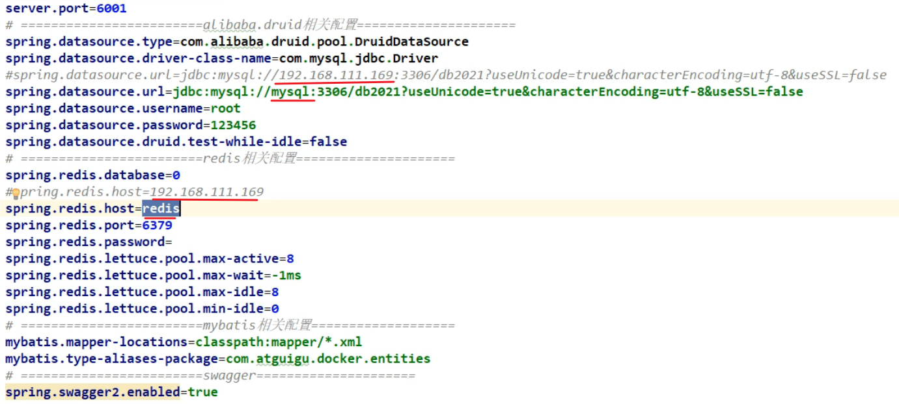
   2. mvn package命令将微服务形成新的jar包
   3. 并上传到Linux服务器/mydocker目录下
   4. 编写Dockerfile
   5. 构建镜像：docker build -t zyy_docker:1.6 .


## 六、Docker轻量级可视化工具Portainer

**是什么？**
Portainer是一款轻量级的应用，它提供了图形化界面，用于方便地管理Docker环境，包括单机环境和集群环境。


## 七、Docker容器监控之 CAdvisor + lnfluxDB + Granfana

**是什么？**

容器监控3剑客：-CAdvisor监控收集 + InfluxDB存储数据 + Granfana展示图表


