# HTML


## 一、网页

### 1. 什么是网页？

1. 网站是指在因特网上根据一定的规则，使用 HTML 等制作的用于展示特定内容相关的网页集合。
2. 网页是网站中的一“页”，通常是 HTML 格式的文件，它要通过浏览器来阅读。
3. 网页是构成网站的基本元素，它通常由图片、链接、文字、声音、视频等元素组成。通常我们看到的网页，常见以 .htm 或 .html 后缀结尾的文件，因此将其俗称为 HTML 文件。


### 2. 什么是HTML？

1. HTML 指的是超文本标记语言 (Hyper Text Markup Language) ，它是用来描述网页的一种语言。
2. HTML 不是一种编程语言，而是一种标记语言 (markup language)。标记语言是一套标记标签 (markup tag)。


## 二、浏览器

**常用的浏览器**

浏览器是网页显示、运行的平台。常用的浏览器有 IE、火狐（Firefox）、谷歌（Chrome）、 Safari和Opera等。平时称为五大浏览器。

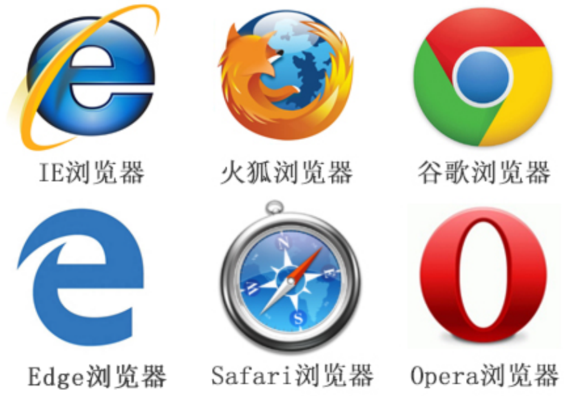


**浏览器内核（渲染引擎）**

负责读取网页内容，整理讯息，计算网页的显示方式并显示页面

| 浏览器       | 内核    | 备注                                                 |
| ------------ | ------- | ---------------------------------------------------- |
| IE           | Trident | IE、猎豹安全、360极速浏览器、百度浏览器              |
| firefox      | Gecko   | 火狐浏览器内核                                       |
| Safari       | Webkit  | 苹果浏览器内核                                       |
| chrome/Opera | Blink   | chrome / opera浏览器内核。Blink 其实是 WebKit 的分支 |


## 三、Web标准

Web 标准是由 W3C 组织和其他标准化组织制定的一系列标准的集合。W3C（万维网联盟）是国际 最著名的标准化组织。

**为什么需要Web标准**：浏览器不同，它们显示页面或者排版就有些许差异

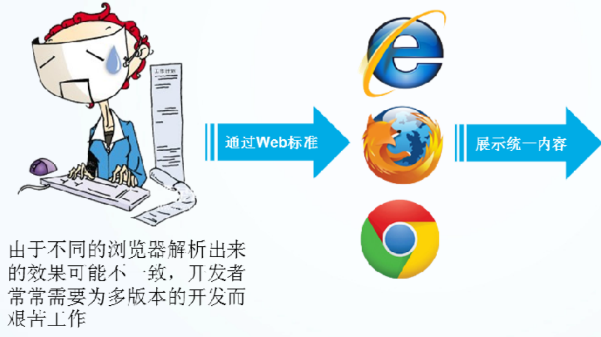

遵循 Web 标准除了可以让不同的开发人员写出的页面更标准、更统一外，还有以下优点：

1. 让 Web 的发展前景更广阔。
2. 内容能被更广泛的设备访问。
3. 更容易被搜寻引擎搜索。
4. 降低网站流量费用。
5. 使网站更易于维护。
6. 提高页面浏览速度。


**web标准的构成**： 主要包括 《结构Structure》 、《表现（Presentation）》和《行为（Behavior）》三个方面。

| 标准 | 说明                                                         |
| ---- | ------------------------------------------------------------ |
| 结构 | 结构用于对**网页元素**进行整理和分类，现阶段主要学的是HTML   |
| 表现 | 表现用于设置网页元素的版式、颜色、大小等**外观样式**，主要指的是CSS |
| 行为 | 行为是指网页模型的定义及**交互**的编写，现阶段主要学的是Javascript |

Web 标准提出的最佳体验方案：**结构、样式、行为相分离**。

简单理解：**结构写到 HTML 文件中， 表现写到 CSS 文件中， 行为写到 JavaScript 文件中**。

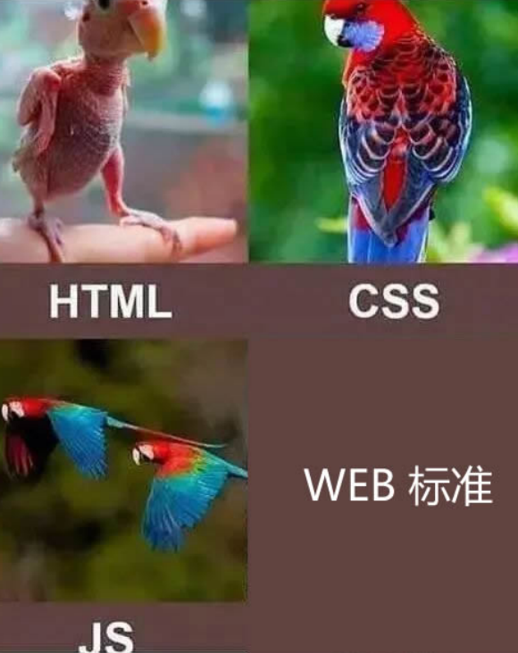

1. 结构类似身体
2. 表现类似外观装饰
3. 行为类似行为动作

> 相比较而言, 三者中结构最重要.


## 四、HTML标签

### 1. HTML语法规则

1. HTML 标签是由尖括号包围的关键词。
2. HTML 标签通常是成对出现的，我们称为双标签。
3. 标签对中的第一个标签是开始标签，第二个标签是结束标签。
4. 有些特殊的标签必须是单个标签（极少情况），我们称为单标签。


### 2. 标签的关系

双标签关系可以分为两类：包含关系和并列关系

- 包含标签：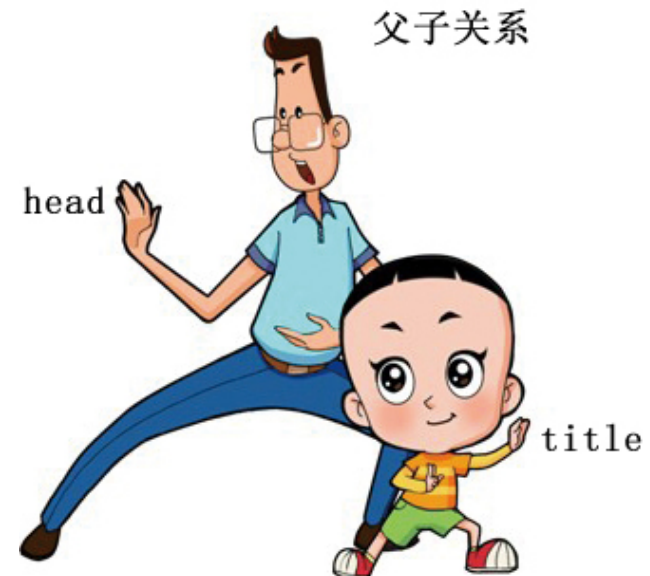


-  并列关系：


### 3. 基本结构标签

每个网页都会有一个基本的结构标签（也称为骨架标签），页面内容也是在这些基本标签上书写。

HTML页面也称为 HTML 文档

```html
<html>
    <head>
        <title>我的第一个页面</title>
    </head>
    <body>
        你我之间,黑马洗练,月薪过万,一飞冲天
    </body>
</html>
```


| 标签名           | 定义       | 说明                                                   |
| ---------------- | ---------- | ------------------------------------------------------ |
| <html></html>    | HTML标签   | 页面中最大的标签，我们称为根标签                       |
| <head></head>    | 文档的头部 | 注意在head标签中我们必须要设置的标签是title            |
| <titile></title> | 文档的标题 | 让页面拥有一个属于自己的网页标题                       |
| <body></body>    | 文档的主体 | 元素包含文档的所有内容，页面内容基本都是放到body里面的 |

HTML 文档的的后缀名必须是 .html 或 .htm ，浏览器的作用是读取 HTML 文档，并以网页的形式显示出它们。

此时，用浏览器打开这个网页，我们就可以预览我们写的第一个 HTML 文件了。


**基本结构标签总结**

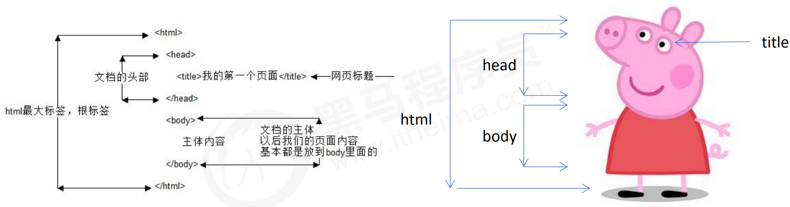


### 4. 网页开发工具

#### 4.1 VSCode的使用

1. 双击打开软件。
2. 新建文件（Ctrl + N ）。
3. 保存（Ctrl + S ）, 注意移动要保存为 .html 文件
4. Ctrl + 加号键 ，Ctrl + 减号键 可以放大缩小视图
5. 生成页面骨架结构。
输入! 按下 Tab 键。
6. 利用插件在浏览器中预览页面：单击鼠标右键，在弹出窗口中点击“Open In Default Browser”。

```html
<!DOCTYPE html>
<html lang="en">
<head>
    <meta charset="UTF-8">
    <meta name="viewport" content="width=device-width, initial-scale=1.0">
    <title>Document</title>
</head>
<body>
    
</body>
</html>
```

1. < !DOCTYPE html >文档类型声明标签,告诉浏览器这个页面采取html5版本来显示页面.
2. < html lang="en" > 告诉浏览器或者搜索引擎这是一个英文网站. 本页面采取英文来显示.
3. < meta charset="UTF-8" > 必须写. 采取 UTF-8来保存文字. 如果不写就会乱码.


#### 4.2 VSCode常用插件

1. Chinese(Simplified)：vscode下载完毕是英文版的，先安装这个插件，改为中文版，所以是我们第一个安装的插件。
2. Auto Rename Tag：修改开始标签，结束标签跟着自动变化，比较好用。
3. open in browser：浏览器预览页面 ，编写完代码，需要浏览器预览，可以安装这个插件


### 5. HTML 常用标签

#### 5.1 标签语义

学习标签是有技巧的，重点是记住每个标签的语义。简单理解就是指**标签的含义**，即这个标签是用来干嘛的。

根据标签的语义，在合适的地方给一个最为合理的标签，可以让页面结构更清晰。

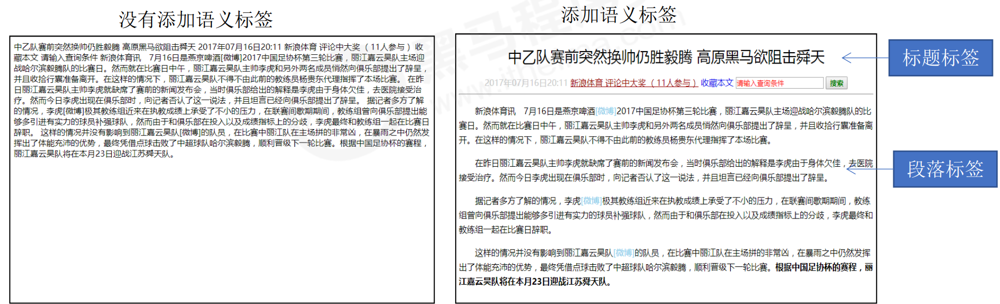


#### 5.2 标题标签 < h1 > - < h6 >

为了使网页更具有语义化，我们经常会在页面中用到标题标签。HTML 提供了 6 个等级的网页标题。

```html
 <h1> 我是一级标题 </h1>
```

单词 head 的缩写，意为头部、标题。

**标签语义**：作为标题使用，并且依据重要性递减。

特点：

1. 加了标题的文字会变的加粗，字号也会依次变大。
2. 一个标题独占一行。

```html
<h1>标题一共六级选,</h1>
<h2>文字加粗一行显。</h2>
<h3>由大到小依次减，</h3>
<h4>从重到轻随之变。</h4>
<h5>语法规范书写后，</h5>
<h6>具体效果刷新见。</h6>
			 ------pink老师
```


#### 5.3 段落和换行标签

**段落标签**

在网页中，要把文字有条理地显示出来，就需要将这些文字分段显示。在 HTML 标签中，< p >标签用于**定义段落**，它可以将整个网页分为若干个段落。

```html
<p> 我是一个段落标签 </p>
```

单词 paragraph 的缩写，意为段落。

标签语义：可以把 HTML 文档分割为若干段落。

特点：

1. 文本在一个段落中会根据浏览器窗口的大小自动换行。
2. 段落和段落之间保有空隙。


**换行标签**

在 HTML 中，一个段落中的文字会从左到右依次排列，直到浏览器窗口的右端，然后才自动换行。如果希望某段文本强制换行显示，就需要使用换行标签 < br / >。

```html
<br />
```

单词 break 的缩写，意为打断、换行。

标签语义：强制换行。

特点：

1. < br / > 是个单标签。
2. < br / > 标签只是简单地开始新的一行，跟段落不一样，段落之间会插入一些垂直的间距。


#### 5.4 文本格式化标签

在网页中，有时需要为文字设置粗体、斜体 或下划线等效果，这时就需要用到 HTML 中的文本格式化标签，使 文字以特殊的方式显示。

标签语义: 突出重要性, 比普通文字更重要.

| 语义   | 标签                         | 说明                                 |
| ------ | ---------------------------- | ------------------------------------ |
| 加粗   | <strong></strong>或者<b></b> | 更推荐使用<strong>标签加粗语义更强烈 |
| 倾斜   | <em></em>或者 <i></i>        | 更推荐使用<em>标签加粗语义更强烈     |
| 删除线 | <del></del>或者<s></s>       | 更推荐使用<del>标签加粗语义更强烈    |
| 下划线 | <ins></ins>或者<u></u>       | 更推荐使用<ins>标签加粗语义更强烈    |


#### 5.5 < div > 和 < span >标签

< div > 和 < span > 是没有语义的，它们就是一个盒子，用来装内容的。

```html
<div> 这是头部 </div>
<span> 今日价格 </span>
```

div 是 division 的缩写，表示分割、分区。span 意为跨度、跨距。


特点：

1. < div > 标签用来布局，但是现在一行只能放一个< div >。 大盒子
2. < span > 标签用来布局，一行上可以多个 < span >。小盒子


#### 5.6 图像标签和路径

##### 5.6.1 图像标签

在 HTML 标签中，< img > 标签用于定义 HTML 页面中的图像。

```html
 
```

单词 image 的缩写，意为图像。

src 是< img >标签的必须属性，它用于指定图像文件的路径和文件名。


所谓属性：简单理解就是属于这个图像标签的特性。

图像标签的其他属性：

| 属性   | 属性值   | 说明                                 |
| ------ | -------- | ------------------------------------ |
| src    | 图片路径 | 必须属性                             |
| alt    | 文本     | 替换文本。图像不能显示的文字         |
| title  | 文本     | 提示文本。鼠标放到图像上，显示的文字 |
| width  | 像素     | 设置图像的宽度                       |
| height | 像素     | 设置图像的高度                       |
| border | 像素     | 设置图像的边框粗细                   |

图像标签属性注意点：

1. 图像标签可以拥有多个属性，必须写在标签名的后面。
2. 属性之间不分先后顺序，标签名与属性、属性与属性之间均以空格分开。
3. 属性采取键值对的格式，即 key=“value" 的格式，属性 =“属性值”。


##### 5.6.2 路径

**目录文件夹和根目录**

实际工作中，我们的文件不能随便乱放，否则用起来很难快速的找到他们，因此我们需要一个文件夹来管理他们。

- **目录文件夹**：就是普通文件夹，里面只不过存放了我们做页面所需要的相关素材，比如 html 文件、图片等。
- **根目录**：打开目录文件夹的第一层就是根目录


页面中的图片会非常多， 通常我们会新建一个文件夹来存放这些图像文件（images），这时再查找图像，就需 要采用“路径”的方式来指定图像文件的位置。

路径可以分为：

1. 相对路径
2. 绝对路径


###### (1) 相对路径

相对路径：以引用文件所在位置为参考基础，而建立出的目录路径。

这里简单来说，图片相对于 HTML 页面的位置

| 相对路径分类 | 符号 | 说明                                                        |
| ------------ | ---- | ----------------------------------------------------------- |
| 同一级路径   |      | 图像文件位于HTML文件同一级如< img src="baidu.gif" />        |
| 下一级路径   | /    | 图像文件位于HTML文件下一级如< img src="images/baidu.gif" /> |
| 上一级路径   | ../  | 图像文件位于HTML文件上一级如< img src="../baidu.gif" />     |

相对路径是从代码所在的这个文件出发，去寻找目标文件的，而我们这里所说的上一级 、下一级和同一级就是 图片相对于 HTML 页面的位置。


###### (2) 绝对路径

绝对路径：是指目录下的绝对位置，直接到达目标位置，通常是从盘符开始的路径。

例如，“D:\web\img\logo.gif”或完整的网络地址“http://www.itcast.cn/images/logo.gif”。


#### 5.7 超链接标签

在 HTML 标签中，< a >标签用于定义超链接，作用是从一个页面链接到另一个页面。

1. 链接的语法格式
2. 链接的分类


##### 5.7.1 链接的语法格式

```html
<a href="跳转目标" target="目标窗口的弹出方式"> 文本或图像 </a>
```

单词 anchor 的缩写，意为：锚。

两个属性的作用如下：

| 属性   | 作用                                                         |
| ------ | ------------------------------------------------------------ |
| href   | 用于指定链接目标的url地址，（必须属性）当为标签应用href属性时，它就具有了超链接的功能 |
| target | 用于指定链接页面的打开方式，其中_self为默认值，__blank为在新窗口中打开方式。 |


##### 5.7.2 链接分类

1. 外部链接: 例如 < a href="http://www.baidu.com "> 百度</a >。
2. 内部链接:网站内部页面之间的相互链接. 直接链接内部页面名称即可，例如 < a href="index.html"> 首页 </a >。
3. 空链接: 如果当时没有确定链接目标时，< a href="#"> 首页 </a > 。
4. 下载链接: 如果 href 里面地址是一个文件或者压缩包，会下载这个文件。
5. 网页元素链接: 在网页中的各种网页元素，如文本、图像、表格、音频、视频等都可以添加超链接.
6. 锚点链接: 点我们点击链接,可以快速定位到页面中的某个位置. 
   - 在链接文本的 href 属性中，设置属性值为 #名字 的形式，如< a href="#two" > 第二集 < /a>
   - 找到目标位置标签，里面添加一个 id 属性 = 刚才的名字 ，如：< h3 id="two" > 第2集介绍< /h3 >


### 6. HTML 中的注释和特殊字符

#### 6.1 注释

如果需要在 HTML 文档中添加一些便于阅读和理解但又不需要显示在页面中的注释文字，就需要使用注释标签。

HTML中的注释以 < !-- 开头，以 -- > 结尾

```html
 <!-- 注释语句 --> 快捷键: ctrl + / 
```

一句话: 注释标签里面的内容是给程序猿看的, 这个代码是不执行不显示到页面中的.

添加注释是为了更好地解释代码的功能，便于相关开发人员理解和阅读代码，程序是不会执行注释内容的。


#### 6.2 特殊字符

在 HTML 页面中，一些特殊的符号很难或者不方便直接使用，此时我们就可以使用下面的字符来替代。

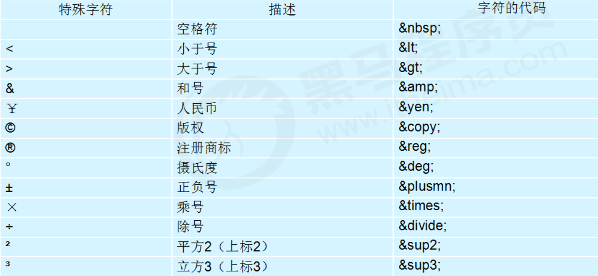

重点记住：空格 、大于号、 小于号 这三个， 其余的使用很少，如果需要回头查阅即可。


### 7. 表格标签

#### 7.1 表格的主要作用

表格主要用于显示、展示数据，因为它可以让数据显示的非常的规整，可读性非常好。特别是后台展示数据 的时候，能够熟练运用表格就显得很重要。一个清爽简约的表格能够把繁杂的数据表现得很有条理。

Pink老师总结: 表格不是用来布局页面的,而是用来展示数据的.

|      |      |      |
| ---- | ---- | ---- |
|      |      |      |
|      |      |      |
|      |      |      |


#### 7.2 表格的基本语法

```html
<table>
    <tr>
        <td>单元格内的文字</td>
        ...
    </tr>
    ...
</table>
```

1. < table > < /table > 是用于定义表格的标签。
2. < tr > < /tr > 标签用于定义表格中的行，必须嵌套在< table > < /table >标签中。
3. < td > < /td > 用于定义表格中的单元格，必须嵌套在< tr > < /tr >标签中。
4. 字母 td 指表格数据（table data），即数据单元格的内容。


#### 7.3 表头单元格标签

一般表头单元格位于表格的第一行或第一列，表头单元格里面的文本内容加粗居中显示.

< th >标签表示 HTML 表格的表头部分(table head 的缩写)

```html
<table>
    <tr>
        <th>姓名</th>
        ...
    </tr>
    ...
</table>
```

表头单元格也是单元格, 常用于表格第一行, 突出重要性, 表头单元格里面的文字会加粗居中显示.


#### 7.4 表格属性

表格标签这部分属性我们实际开发我们不常用，后面通过 CSS 来设置.

目的有2个: 

1. 记住这些英语单词,后面 CSS 会使用.
2. 直观感受表格的外观形态.

| 属性名      | 属性值              | 描述                                             |
| ----------- | ------------------- | ------------------------------------------------ |
| align       | left、center、right | 规定表格相对周围元素的对齐方式。                 |
| border      | 1或""               | 规定表格单元是否拥有边框，默认为""，表示没有边框 |
| cellpadding | 像素值              | 规定单元边沿与其内容之间的空白，默认1像素。      |
| cellspacing | 像素值              | 规定单元格之间的空白，默认2像素。                |
| width       | 像素值或百分比      | 规定表格的宽度。                                 |


#### 7.5 表格结构标签

使用场景:因为表格可能很长,为了更好的表示表格的语义，可以将表格分割成 表格头部和表格主体两大部分.

在表格标签中，分别用：< thead >标签 表格的头部区域、< tbody >标签 表格的主体区域. 这样可以更好的分清表 格结构。

1. < thead > < /thead >：用于定义表格的头部。< thead > 内部必须拥有 < tr > 标签。 一般是位于第一行。
2. < tbody > < /tbody >：用于定义表格的主体，主要用于放数据本体 。
3. 以上标签都是放在 < table > < /table > 标签中。

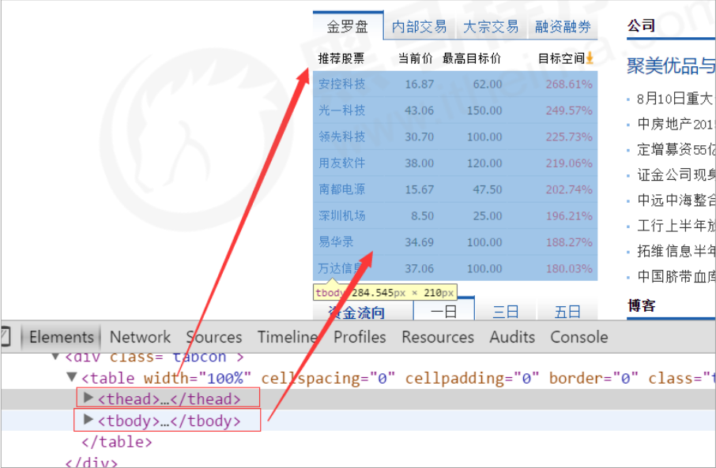


#### 7.6 合并单元格

特殊情况下,可以把多个单元格合并为一个单元格, 这里同学们会最简单的合并单元格即可.

1. 合并单元格方式
2. 目标单元格
3. 合并单元格的步骤

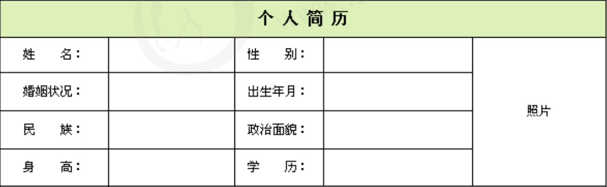


合并单元格方式：

- 跨行合并：rowspan="合并单元格的个数" 
- 跨列合并：colspan="合并单元格的个数"

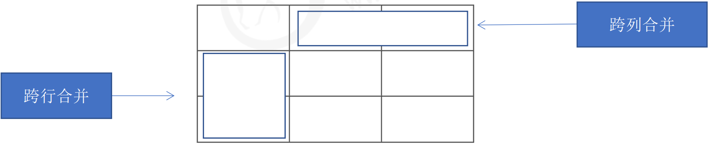


目标单元格：(写合并代码)

- 跨行：最上侧单元格为目标单元格, 写合并代码
- 跨列：最左侧单元格为目标单元格, 写合并代码

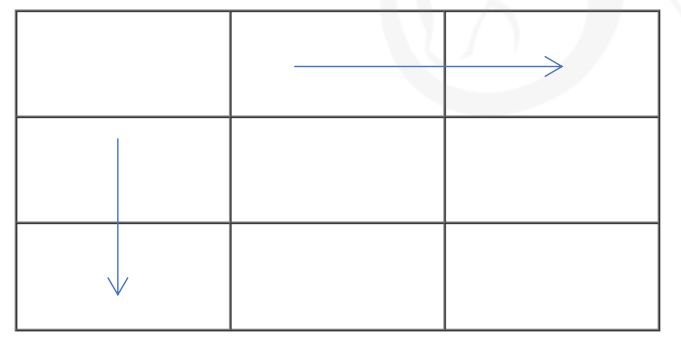


**合并单元格三步曲：**

1. 先确定是跨行还是跨列合并。
2. 找到目标单元格. 写上合并方式 = 合并的单元格数量。比如：< td colspan="2" >< /td >。
3. 删除多余的单元格。


### 8. 列表标签

表格是用来显示数据的，那么列表就是用来布局的。

列表最大的特点就是整齐、整洁、有序，它作为布局会更加自由和方便。

根据使用情景不同，列表可以分为三大类：无序列表、有序列表和自定义列表。

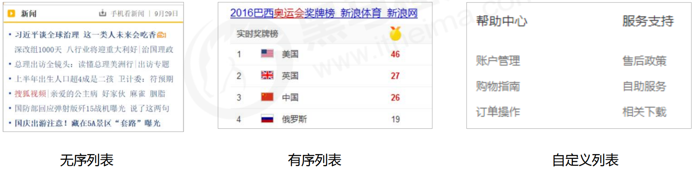


#### 8.1 无序列表

< ul > 标签表示 HTML 页面中项目的无序列表，一般会以项目符号呈现列表项，而列表项使用 < li >  标签定义。

无序列表的基本语法格式如下：

```html
<ul>
    <li>列表项1</li>
    <li>列表项2</li>
    <li>列表项3</li>
    ...
</ul>
```

1. 无序列表的各个列表项之间没有顺序级别之分，是并列的。
2. < ul > < /ul > 中只能嵌套 < li > < /li >，直接在 < ul > < /ul > 标签中输入其他标签或者文字的做法是不被允许的。
3. < li > < /li > 之间相当于一个容器，可以容纳所有元素。
4. 无序列表会带有自己的样式属性，但在实际使用时，我们会使用 CSS 来设置。


#### 8.2 有序列表

有序列表即为有排列顺序的列表，其各个列表项会按照一定的顺序排列定义。

在 HTML 标签中，< ol >  标签用于定义有序列表，列表排序以数字来显示，并且使用 < li > 标签来定义列表项。

有序列表的基本语法格式如下：

```html
<ol>
    <li>列表项1</li>
    <li>列表项2</li>
    <li>列表项3</li>
    ...
</ol>
```

1. < ol > < /ol > 中只能嵌套 < li > < /li >，直接在 < ol > < /ol > 标签中输入其他标签或者文字的做法是不被允许的。
2. < li > 与 < /li > 之间相当于一个容器，可以容纳所有元素。
3. 有序列表会带有自己样式属性，但在实际使用时，我们会使用 CSS 来设置。


#### 8.3 自定义列表

自定义列表的使用场景:

自定义列表常用于对术语或名词进行解释和描述，定义列表的列表项前没有任何项目符号。

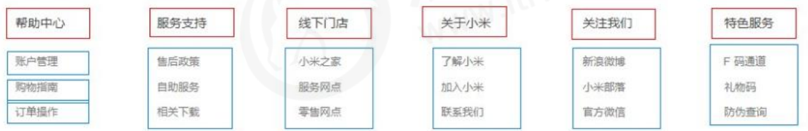

在 HTML 标签中，< dl > 标签用于定义描述列表（或定义列表），该标签会与 < dt > （定义项目/名字）和 < dd > （描述每一个项目/名字）一起使用。

```html
<dl>
    <dt>名词1</dt>
    <dd>名词1解释1</dd>
    <dd>名词1解释2</dd>
</dl>
```

1. < dl > < /dl > 里面只能包含 < dt > 和 < dd >。
2. < dt > 和 < dd > 个数没有限制，经常是一个 < dt > 对应多个 < dd >。

在 HTML 标签中，< dl > 标签用于定义描述列表（或定义列表），该标签会与 < dt > （定义项目/名字）和 < dd > （描述每一个项目/名字）一起使用。


#### 8.5 列表总结

| 标签名    | 定义       | 说明                                                         |
| --------- | ---------- | ------------------------------------------------------------ |
| <ul></ul> | 无序标签   | 里面只能包含li。没有顺序，使用较多。li里面可以包含任何标签   |
| <ol></ol> | 有序标签   | 里面只能包含li。有顺序，使用相对较少。li里面可以包含任何标签 |
| <dl></dl> | 自定义列表 | 里面只能包含dt和dd。dt和dd里面可以放任何标签                 |


### 9. 表单标签

现实中的表单，我们去银行办理信用卡填写的单子。

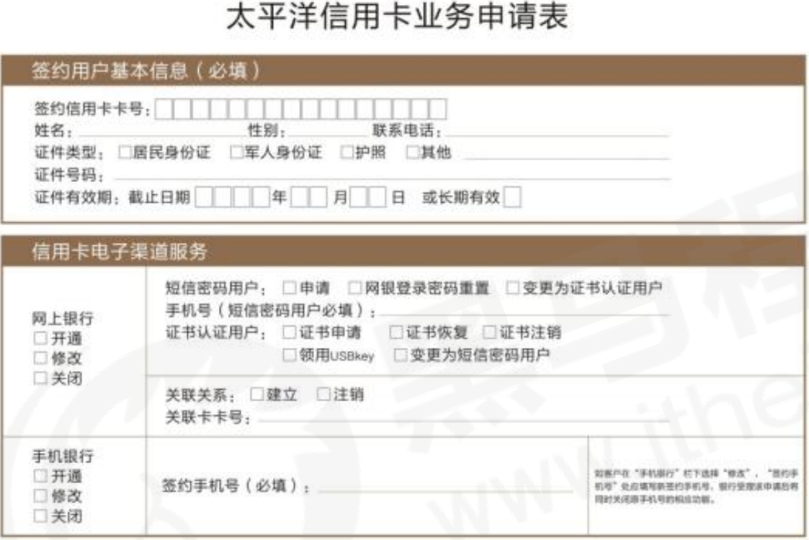


网页中的表单展示

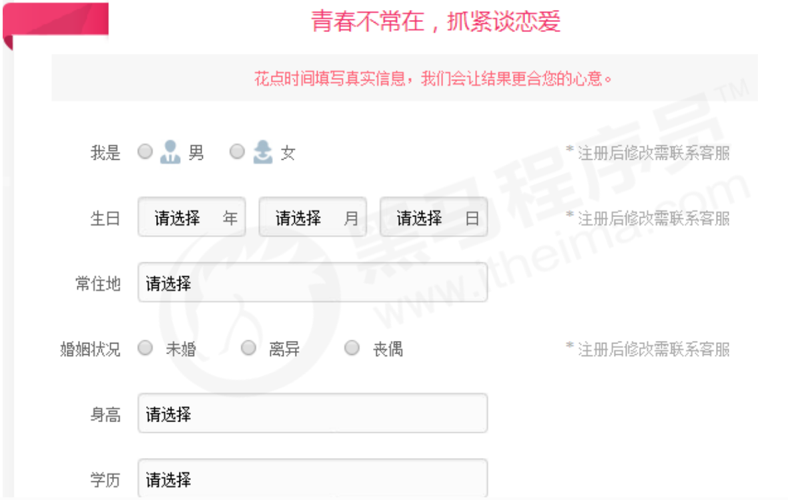


**为什么需要表单？**

使用表单目的是为了**收集用户信息**。

在我们网页中， 我们也需要跟用户进行交互，收集用户资料，此时就需要表单。


#### 9.1 表单的组成

在 HTML 中，一个完整的表单通常由**表单域**、**表单控件**（也称为表单元素）和 **提示信息**3个部分构成。

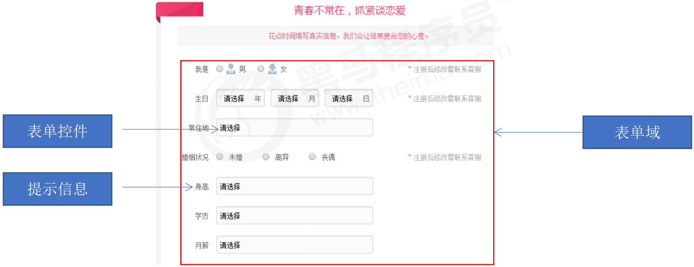


#### 9.2 表单控件(表单元素)

在表单域中可以定义各种表单元素，这些表单元素就是允许用户在表单中输入或者选择的内容控件。

接下来我们讲解:

1. input输入表单元素
2. select下拉表单元素
3. textarea 文本域元素


##### 9.2.1 < input > 表单元素

在英文单词中，input 是输入的意思，而在表单元素中 < input > 标签用于收集用户信息。

在 < input > 标签中，包含一个 type 属性，根据不同的 type 属性值，输入字段拥有很多种形式（可以是文本 字段、复选框、掩码后的文本控件、单选按钮、按钮等）。

```html
<input type="属性值" />
```

- < input / > 标签为单标签
- type 属性设置不同的属性值用来指定不同的控件类型

type 属性的属性值及其描述如下：

| 属性值   | 描述                                                         |
| -------- | ------------------------------------------------------------ |
| button   | 定义可点击按钮（多数情况下，用于通过JavaScript启动脚本）。   |
| checkbox | 定义复选框。                                                 |
| file     | 定义输入字段和"浏览"按钮，供文件上传。                       |
| hidden   | 定义隐藏的输入字段。                                         |
| image    | 定义图像形式的提交按钮。                                     |
| password | 定义密码字段。该字段中的字符被掩码。                         |
| radio    | 定义单选按钮。                                               |
| reset    | 定义重置按钮。重置按钮会清除表单中的所有数据。               |
| submit   | 定义提交按钮。提交按钮会把表单数据发送到服务器。             |
| text     | 定义单行的输入字段，用户可在其中输入文本。默认宽度为20个字符。 |

除 type 属性外，标签还有其他很多属性，其常用属性如下：

| 属性      | 属性值       | 描述                                  |
| --------- | ------------ | ------------------------------------- |
| name      | 由用户自定义 | 定义input元素的名称。                 |
| value     | 由用户自定义 | 规定input元素的值。                   |
| checked   | checked      | 规定此input元素首次加载时应当被选中。 |
| maxlength | 正整数       | 规定输入字段中的字符的最大长度。      |

1. name 和value 是每个表单元素都有的属性值,主要给后台人员使用.
2. name 表单元素的名字, 要求 单选按钮和复选框要有相同的name值.
3. checked属性主要针对于单选按钮和复选框, 主要作用一打开页面,就要可以默认选中某个表单元素.
4. maxlength 是用户可以在表单元素输入的最大字符数, 一般较少使用.


有些表单元素想刚打开页面就默认显示几个文字怎么做?

答: 可以给这些表单元素设置 value 属性=“值”

```html
 用户名: <input type="text" value="请输入用户名" /> 
```


页面中的表单元素很多，如何区别不同的表单元素?

答: name 属性：当前 input 表单的名字，后台可以通过这个 name 属性找到这个表单。页面中的表单很多， name 的主要作用就是用于区别不同的表单。

```html
用户名: <input type="text" value="请输入用户名" name="username" /> 
```

- name 属性后面的值，是自定义的
- radio (或者checkbox）如果是一组，我们必须给他们命名相同的名字 

```html
<input type="radio" name="sex" />男
<input type="radio" name="sex" />女
```


如果页面一打开就让某个单选按钮或者复选框是选中状态?

答: checked 属性：表示默认选中状态。用于单选按钮和复选按钮。

```html
性别:
<input type="radio" name="sex" value="男" checked="checked" />男
<input type="radio" name="sex" value="女" />女
```


如何让input表单元素展示不同的形态? 比如单选按钮或者文本框

答: type属性：type属性可以让input表单元素设置不同的形态.

```html
<input type="radio" name="sex" value="男" checked="checked" />男
<input type="text" value=“请输入用户名”> 
```


##### 9.2.2 < label > 标签

< label > 标签为input元素定义标注(标签)。

< label > 标签用于绑定一个表单元素, 当点击 < label > 标签内的文本时，浏览器就会自动将焦点(光标)转到或者 选择对应的表单元素上,用来增加用户体验.

语法： 

```html
<label for="sex">男</label>
<input type="radio" name="sex" id="sex" />
```

核心：< label > 标签的 **for 属性**应当与相关元素的 **id 属性**相同。


##### 9.2.3 < select > 表单元素

使用场景: 在页面中，如果有多个选项让用户选择，并且想要节约页面空间时，我们可以使用 < select > 标签控件定义下拉列表。

语法：

```html
<select>
    <option>选项1</option>
    <option>选项2</option>
    <option>选项3</option>
    ...
</select>
```

1. < select > 中至少包含一对 < option >
2. 在 < option > 中定义 selected =“ selected " 时，当前项即为默认选中项。


##### 9.2.4 < textarea > 表单元素

使用场景: 当用户输入内容较多的情况下，我们就不能使用文本框表单了，此时我们可以使用 < textarea > 标签。

在表单元素中，< trxtarea > 标签是用于定义多行文本输入的控件。

使用多行文本输入控件，可以输入更多的文字，该控件常见于留言板，评论。

语法：

```html
<textarea rows="3" cols="20">
    文本内容
</textarea>
```

1. 通过 < textarea > 标签可以轻松地创建多行文本输入框。
2. cols=“每行中的字符数” ，rows=“显示的行数”，我们在实际开发中不会使用，都是用 CSS 来改变大小。


#### 9.3 表单元素几个总结点

1. 表单元素我们学习了三大组 input 输入表单元素，select 下拉表单元素，textarea 文本域表单元素.
2. 这三组表单元素都应该包含在form表单域里面,并且有 name 属性.

```html
<form>
    <input type="text" name="username">
    <select name="jiguan">
        <option>北京</option>
    </select>
    <textarea name= "message"></textarea>
</form>
```


# CSS

## 一、CSS 简介

CSS 的主要使用场景就是美化网页,布局页面的.
1. HTML 的局限性
2. CSS-网页的美容师


### 1. HTML 的局限性

说起 HTML，这其实是个非常单纯的家伙，他只关注**内容的语义**。

很早的时候，世界上的网站虽然很多，但是他们都有一个共同的特点：**丑**。

虽然 HTML 可以做简单的样式，但是带来的是无尽的**臃肿和繁琐**……


### 2.  CSS-网页的美容师

CSS 是层叠样式表 ( Cascading Style Sheets ) 的简称.

有时我们也会称之为 CSS 样式表或级联样式表。

CSS 是也是一种标记语言

CSS 主要用于设置 HTML 页面中的**文本内容**（字体、大小、对齐方式等）、**图片的外形**（宽高、边框样式、 边距等）以及**版面的布局和外观显示样式**。

CSS 让我们的网页更加丰富多彩，布局更加灵活自如。简单理解：CSS 可以美化 HTML , 让 HTML 更漂亮， 让页面布局更简单。


总结：

1. HTML 主要做结构,显示元素内容.
2. CSS 美化 HTML ,布局网页.
3. CSS 最大价值: 由 HTML 专注去做结构呈现，样式交给 CSS，即 结构 ( HTML ) 与样式( CSS ) 相分离。


### 3. CSS 语法规范

使用 HTML 时，需要遵从一定的规范，CSS 也是如此。要想熟练地使用 CSS 对网页进行修饰，首先需要了解 CSS 样式规则。

CSS 规则由两个主要的部分构成：选择器以及一条或多条声明。

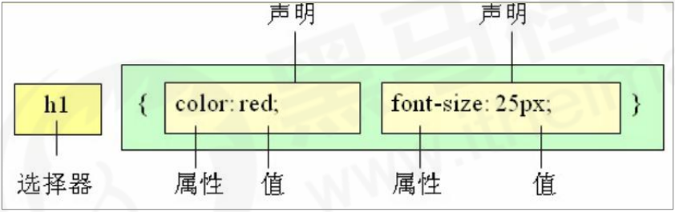

- 选择器是用于指定 CSS 样式的 HTML 标签，花括号内是对该对象设置的具体样式
- 属性和属性值以“键值对”的形式出现
- 属性是对指定的对象设置的样式属性，例如字体大小、文本颜色等
- 属性和属性值之间用英文“:”分开
- 多个“键值对”之间用英文“;”进行区分

所有的样式，都包含在 < style > 标签内，表示是样式表。< style > 一般写到 < /head > 上方。

```html
<head>
    <style>
        h4 {
            color: blue;
            font-size: 100px;
        }
    </style>
</head>
```


### 4. CSS 代码风格

以下代码书写风格不是强制规范,而是符合实际开发书写方式.


#### 4.1 样式格式书写

① 紧凑格式

```css
h3 { color: deeppink;font-size: 20px;}
```


② 展开格式

```css
h3 {
    color: pink;
    font-size: 20px;
}
```

强烈推荐第二种格式， 因为更直观。


#### 4.2 样式大小写

```css
h3 {
    color: pink;
}
```

```css
h3 {
    COLOR: PINK;
}
```

强烈推荐样式选择器，属性名，属性值关键字全部使用小写字母，特殊情况除外。


#### 4.3 空格规范

```css
h3 {
    color: pink;
}
```

① 属性值前面，冒号后面，保留一个空格

② 选择器（标签）和大括号中间保留空格


## 二、CSS 基础选择器

### 1. CSS 选择器的作用

```html
<div>我是div</div>
<div>我是div</div>
<p>我是段落</p>
<ul>
    <li>我是ul里面小li哦</li>
</ul>
<ol>
    <li>我是ol里面小li哦</li>
</ol> 
```

1. 我想把 div 里面的文字改为红色?
2. 我想把第一个div 里面的文字改为红色?
3. 我想把ul 里面的 li 文字改为红色?

选择器(选择符)就是根据不同需求把不同的标签选出来这就是选择器的作用。 简单来说，就是选择标签用的。


以上 CSS 做了两件事：

1. 找到所有的 h1 标签。 选择器（选对人）。
2. 设置这些标签的样式，比如颜色为红色（做对事）。


### 2. 选择器分类

**选择器**分为**基础选择器**和**复合选择器**两个大类，我们这里先讲解一下基础选择器。

- 基础选择器是由单个选择器组成的
- 基础选择器又包括：标签选择器、类选择器、id 选择器和通配符选择器


### 3. 标签选择器

标签选择器（元素选择器）是指用 HTML 标签名称作为选择器，按标签名称分类，为页面中某一类标签指定 统一的 CSS 样式。

**语法**：

```css
标签名{
    属性1: 属性值1;
    属性2: 属性值2;
    属性3: 属性值3;
    ...
}
```

**作用**：标签选择器可以把某一类标签全部选择出来，比如所有的 < div > 标签和所有的 < span >标签。

**优点**：能快速为页面中同类型的标签统一设置样式。

**缺点**：不能设计差异化样式，只能选择全部的当前标签。


### 4. 类选择器

如果想要差异化选择不同的标签，单独选一个或者某几个标签，可以使用类选择器.

**语法**：

```css
.类名 {
    属性1: 属性值1;
    ...
} 
```

例如，将所有拥有 red 类的 HTML 元素均为红色。

```css
.red {
    color: red;
}
```


**语法**：结构需要用**class属性**来调用 class 类的意思

```html
<div class=‘red’> 变红色 </div>
```


如果想要差异化选择不同的标签，单独选一个或者某几个标签，可以使用**类选择器**。

类选择器在 HTML 中以 class 属性表示，在 CSS 中，类选择器以一个点“.”号显示。


**注意**

1. 类选择器使用“.”（英文点号）进行标识，后面紧跟类名(自定义，我们自己命名的)。
2. 可以理解为给这个标签起了一个名字，来表示。
3. 长名称或词组可以使用中横线来为选择器命名。
4. 不要使用纯数字、中文等命名，尽量使用英文字母来表示。
5. 命名要有意义，尽量使别人一眼就知道这个类名的目的。
6. 命名规范：见附件（ Web 前端开发规范手册.doc）

记忆口诀：样式点定义，结构类调用。一个或多个，开发最常用。


#### 4.1 多类名

我们可以给一个标签指定**多个类名**，从而达到更多的选择目的。 这些类名都可以选出这个标签.

简单理解就是一个标签有多个名字. 

1. 多类名使用方式

```html
<div class="red font20">亚瑟</div>
```

(1) 在标签class 属性中写 多个类名
(2) 多个类名中间必须用空格分开
(3) 这个标签就可以分别具有这些类名的样式


2. 多类名开发中使用场景

(1) 可以把一些标签元素相同的样式(共同的部分)放到一个类里面.
(2) 这些标签都可以调用这个公共的类,然后再调用自己独有的类.
(3) 从而节省CSS代码,统一修改也非常方便.


```html
<div class="pink fontWeight font20">亚瑟</div>
<div class="font20">刘备</div>
<div class="font14 pink">安其拉</div>
<div class="font14">貂蝉</div>
```

- 各个类名中间用空格隔开
- 简单理解：就是给某个标签添加了多个类，或者这个标签有多个名字
- 这个标签就可以分别具有这些类名的样式
- 从而节省CSS代码,统一修改也非常方便.
- 多类名选择器在后期布局比较复杂的情况下，还是较多使用的


### 5. id 选择器

id 选择器可以为标有特定 id 的 HTML 元素指定特定的样式。

HTML 元素以 id 属性来设置 id 选择器，CSS 中 id 选择器以“#" 来定义。

**语法**

```css
#id名 {
    属性1: 属性值1;
    ...
} 
```

例如，将 id 为 nav 元素中的内容设置为红色。

```css
#nav {
    color:red;
}
```

注意：id 属性只能在每个 HTML 文档中出现一次。口诀: 样式#定义,结构id调用, 只能调用一次, 别人切勿使用.


### 6 .id 选择器和类选择器的区别

1. 类选择器（class）好比人的名字，一个人可以有多个名字，同时一个名字也可以被多个人使用。
2. id 选择器好比人的身份证号码，全中国是唯一的，不得重复。
3. id 选择器和类选择器最大的不同在于使用次数上。
4.  类选择器在修改样式中用的最多，id 选择器一般用于页面唯一性的元素上，经常和 JavaScript 搭配使用。


### 7.通配符选择器

  在 CSS 中，通配符选择器使用“*”定义，它表示选取页面中所有元素（标签）。

**语法**

```css
* {
    属性1: 属性值1;
    ...
}
```

- 通配符选择器不需要调用， 自动就给所有的元素使用样式
- 特殊情况才使用，后面讲解使用场景(以下是清除所有的元素标签的内外边距,后期讲)

```css
* {
    margin: 0;
    padding: 0;
} 
```


### 8. 基础选择器总结

| 基础选择器   | 作用                          | 特点                                | 使用情况     | 用法                |
| ------------ | ----------------------------- | ----------------------------------- | ------------ | ------------------- |
| 标签选择器   | 可以选出所有相同的标签，比如p | 不能差异化选择                      | 较多         | p {color: red;}     |
| 类选择器     | 可以选出1个或者多个标签       | 可以根据需求选择                    | 非常多       | .nav {color:  red;} |
| id选择器     | 一次只能选择1个标签           | ID属性只能在每个HTML 文档中出现一次 | 一般和js搭配 | #nav{color:  red;}  |
| 通配符选择器 | 选择所有的标签                | 选择的太多，有部分不需要            | 特殊情况使用 | *{color: red;}      |

- 每个基础选择器都有使用场景，都需要掌握
- 如果是修改样式， 类选择器是使用最多的


## 三、CSS 字体属性

CSS Fonts(字体)属性用于定义字体系列、大小、粗细、和文字样式(如斜体)。


### 1. 字体系列

CSS 使用 font-family 属性定义文本的字体系列。

```css
p { font-family:"微软雅黑";}
div {font-family: Arial,"Microsoft Yahei", "微软雅黑";}
```

- 各种字体之间必须使用英文状态下的逗号隔开
- 一般情况下,如果有空格隔开的多个单词组成的字体,加引号.
- 尽量使用系统默认自带字体，保证在任何用户的浏览器中都能正确显示
- 最常见的几个字体：body {font-family: 'Microsoft YaHei',tahoma,arial,'Hiragino Sans GB'; }


### 2. 字体大小

CSS 使用 font-size 属性定义字体大小。

```css
p {
    font-size: 20px;
}
```

- px（像素）大小是我们网页的最常用的单位
- 谷歌浏览器默认的文字大小为16px
- 不同浏览器可能默认显示的字号大小不一致，我们尽量给一个明确值大小，不要默认大小
- 可以给 body 指定整个页面文字的大小


### 3. 字体粗细

CSS 使用 font-weight 属性设置文本字体的粗细。

```css
p {
    font-weight: bold;
}
```

| 属性值  | 描述                                                         |
| ------- | ------------------------------------------------------------ |
| normal  | 默认值 (不加粗的)                                            |
| bold    | 定义粗体 (加粗的)                                            |
| 100~900 | 400 等同于 normal，而 700 等同于 bold，注意这个数字后面不跟单位 |

- 学会让加粗标签（比如 h 和 strong 等) 不加粗，或者其他标签加粗
- 实际开发时，我们更喜欢用数字表示粗细


### 4. 文字样式

CSS 使用 font-style 属性设置文本的风格。

```css
p {
    font-style: normal;
}
```

| 属性值 | 作用                                                   |
| ------ | ------------------------------------------------------ |
| normal | 默认值，浏览器会显示标准的字体样式 font-style: normal; |
| italic | 浏览器会显示斜体的字体样式。                           |

注意： 平时我们很少给文字加斜体，反而要给斜体标签（em，i）改为不倾斜字体。


### 5. 字体复合属性

字体属性可以把以上文字样式综合来写, 这样可以更节约代码:

```css
body {
    font: font-style font-weight font-size/line-height font-family;
}
```

- 使用 font 属性时，必须按上面语法格式中的顺序书写，不能更换顺序，并且各个属性间以空格隔开
- 使用 font 属性时，必须按上面语法格式中的顺序书写，不能更换顺序，并且各个属性间以空格隔开


### 6. 字体属性总结

| 属性        | 表示     | 注意点                                                       |
| ----------- | -------- | ------------------------------------------------------------ |
| font-size   | 字号     | 我们通常用的单位是px像素，一定要跟上单位                     |
| font-family | 字体     | 实际工作中按照团队约定来写字体                               |
| font-weight | 字体粗细 | 记住加粗是700或者bold不加粗是normal 或者400，记住数字不要跟单位 |
| font-style  | 字体样式 | 记住倾斜是italic，不倾斜是 normal ，工作中我们最常用 normal  |
| font        | 字体连写 | 1.字体连写是有顺序的 不能随意换位置；2.其中字号和字体必须同时出现 |


## 四、CSS 文本属性

CSS Text（文本）属性可定义文本的外观，比如文本的颜色、对齐文本、装饰文本、文本缩进、行间距等。


### 1. 文本颜色

color 属性用于定义文本的颜色。

```css
div {
    color: red;
}
```

| 表示           | 属性值                        |
| -------------- | ----------------------------- |
| 预定义的颜色值 | red，green，blue              |
| 十六进制       | #FF0000，#FF6600，#29D794     |
| RGB代码        | rgb(255,0,0)或rgb(100%,0%,0%) |

开发中最常用的是十六进制.


### 2. 对齐文本

text-align 属性用于设置元素内文本内容的水平对齐方式。

```css
div {
    text-align: center;
}
```

| 属性值 | 解释            |
| ------ | --------------- |
| left   | 左对齐 (默认值) |
| right  | 右对齐          |
| center | 居中对齐        |


### 3. 装饰文本

text-decoration 属性规定添加到文本的修饰。可以给文本添加下划线、删除线、上划线等。

```css
div {
    text-decoration：underline；
}
```

| 属性值       | 描述                           |
| ------------ | ------------------------------ |
| none         | 默认。 没有装饰线 (最常用)     |
| underline    | 下划线。链接a自带下划线 (常用) |
| overline     | 上划线。(几乎不用)             |
| line-through | 删除线。(不常用)               |


### 4. 文本缩进

text-indent 属性用来指定文本的第一行的缩进，通常是将段落的首行缩进。

```css
div {
    text-indent: 10px;
}
```

通过设置该属性，所有元素的第一行都可以缩进一个给定的长度，甚至该长度可以是负值。

```css
p {
    text-indent: 2em;
}
```

em 是一个相对单位，就是当前元素（font-size) 1 个文字的大小, 如果当前元素没有设置大小，则会按照父元素的 1 个文字大小。


### 5. 行间距

line-height 属性用于设置行间的距离（行高）。可以控制文字行与行之间的距离.

```css
p {
    line-height: 26px;
}
```

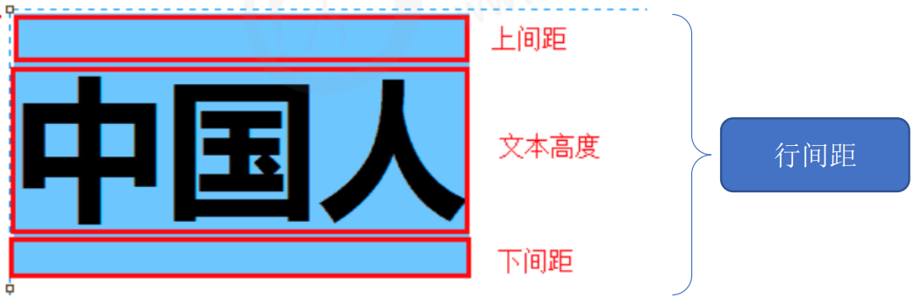


### 6. 文本属性总结

| 属性            | 表示     | 注意点                                               |
| --------------- | -------- | ---------------------------------------------------- |
| color           | 文本颜色 | 我们通常用十六进制，比如：而且是简写形式 #fff        |
| text-align      | 文本对齐 | 可以设定文字水平的对齐方式                           |
| text-indent     | 文本缩进 | 通常我们用于段落首行缩进2个字的距离 text-indent:2em; |
| text-decoration | 文本修饰 | 记住添加下划线 underline 取消下划线 none             |
| line-height     | 行高     | 控制行与行之间的距离                                 |


## 五、CSS 的引入方式

### 1. 内部样式表

内部样式表（内嵌样式表）是写到html页面内部，是将所有的 CSS 代码抽取出来，单独放到一个 < style > 标签中。

```html
<style>
    div {
        color: red;
        font-size: 12px;
    }
</style>
```

- < style > 标签理论上可以放在 HTML 文档的任何地方，但一般会放在文档的 < head > 标签中
- 通过此种方式，可以方便控制当前整个页面中的元素样式设置
- 代码结构清晰，但是并没有实现结构与样式完全分离
- 使用内部样式表设定 CSS，通常也被称为**嵌入式引入**，这种方式是我们练习时常用的方式


### 2. 行内样式表

行内样式表（内联样式表）是**在元素标签内部的 style 属性中设定 CSS 样式**。适合于修改简单样式.

```html
<div style="color: red; font-size: 12px;">青春不常在，抓紧谈恋爱</div>
```

- style 其实就是标签的属性
- 在双引号中间，写法要符合 CSS 规范
- 可以控制当前的标签设置样式
- 由于书写繁琐，并且没有体现出结构与样式相分离的思想，所以不推荐大量使用，只有对当前元素添加简 单样式的时候，可以考虑使用
- 使用行内样式表设定 CSS，通常也被称为**行内式引入**


### 3. 外部样式表

实际开发都是外部样式表. 适合于样式比较多的情况. 核心是:样式单独写到CSS 文件中，之后把CSS文件引入 到 HTML 页面中使用.

引入外部样式表分为两步：

1. 新建一个后缀名为 .css 的样式文件，把所有 CSS 代码都放入此文件中。
2. 在 HTML 页面中，使用 < link >  标签引入这个文件。

```html
<link rel="stylesheet" href="css文件路径">
```

| 属性 | 作用                                                         |
| ---- | ------------------------------------------------------------ |
| rel  | 定义当前文档与被链接文档之间的关系，在这里需要指定为"stylesheet"，表示被链接的文档是一个样式表文件。 |
| href | 定义所链接外部样式表文件的URL，可以是相对路径，也可以是绝对路径。 |


### 4. CSS 引入方式总结

| 样式表     | 优点                     | 缺点         | 使用情况 | 控制范围     |
| ---------- | ------------------------ | ------------ | -------- | ------------ |
| 行内样式表 | 书写方便，权重高         | 结构样式混写 | 较少     | 控制—个标签  |
| 内部样式表 | 部分结构和样式相分离     | 没有彻底分离 | 较多     | 控制—个页面  |
| 外部样式表 | 完全实现结构和样式相分离 | 需要引入     | 最多     | 控制多个页面 |


## 六. Chrome 调试工具

Chrome 浏览器提供了一个非常好用的调试工具，可以用来调试我们的 HTML 结构和 CSS 样式。

打开 Chrome 浏览器，按下 **F12** 键或者**右击页面空白处检查**。

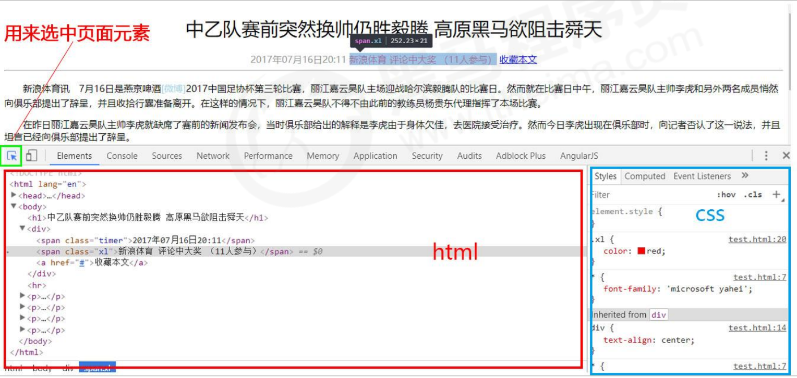

- Ctrl+滚轮 可以放大开发者工具代码大小。
- 左边是 HTML 元素结构，右边是 CSS 样式。
- 右边 CSS 样式可以改动数值（左右箭头或者直接输入）和查看颜色。
- Ctrl + 0 复原浏览器大小。
- 如果点击元素，发现右侧没有样式引入，极有可能是类名或者样式引入错误。
- 如果有样式，但是样式前面有黄色叹号提示，则是样式属性书写错误。


## 七、CSS 的复合选择器

在 CSS 中，可以根据选择器的类型把选择器分为**基础选择器**和**复合选择器**，复合选择器是建立在基础选择器之上，对 基本选择器进行组合形成的。

- 复合选择器可以更准确、更高效的选择目标元素（标签）
- 复合选择器是由两个或多个基础选择器，通过不同的方式组合而成的
- 常用的复合选择器包括：后代选择器、子选择器、并集选择器、伪类选择器等等


### 1. 后代选择器

后代选择器又称为包含选择器，可以选择父元素里面子元素。其写法就是把外层标签写在前面，内层标签写在 后面，中间用空格分隔。当标签发生嵌套时，内层标签就成为外层标签的后代。

语法：

```css
元素1 元素2 { 样式声明 } 
```

上述语法表示选择元素 1 里面的所有元素 2 (后代元素)。

例如：

```css
ul li { 样式声明 } /* 选择 ul 里面所有的 li标签元素 */
```

- 元素1 和 元素2 中间用空格隔开
- 元素1 是父级，元素2 是子级，最终选择的是元素2
- 元素2 可以是儿子，也可以是孙子等，只要是元素1 的后代即可
- 元素1 和 元素2 可以是任意基础选择器


### 2. 子选择器

子元素选择器（子选择器）只能选择作为某元素的最近一级子元素。简单理解就是选亲儿子元素.

语法：

```css
元素1 > 元素2 { 样式声明 } 
```

上述语法表示选择元素1 里面的所有直接后代(子元素) 元素2。

例如：

```css
div > p { 样式声明 } /* 选择 div 里面所有最近一级 p 标签元素 */
```

- 元素1 和 元素2 中间用 大于号 隔开
- 元素1 是父级，元素2 是子级，最终选择的是元素2
- 元素2 必须是亲儿子，其孙子、重孙之类都不归他管. 你也可以叫他 亲儿子选择器


### 3. 并集选择器

并集选择器可以选择多组标签, 同时为他们定义相同的样式。通常用于集体声明.

并集选择器是各选择器通过英文逗号（,）连接而成，任何形式的选择器都可以作为并集选择器的一部分。

语法：

```css
元素1,元素2 { 样式声明 } 
```

上述语法表示选择元素1 和 元素2。

例如：

```css
ul,div { 样式声明 } /* 选择 ul 和 div标签元素 */ 
```

- 元素1 和 元素2 中间用逗号隔开
- 逗号可以理解为和的意思
- 并集选择器通常用于集体声明


### 4. 伪类选择器

伪类选择器用于向某些选择器添加特殊的效果，比如给链接添加特殊效果，或选择第1个，第n个元素。

伪类选择器书写最大的特点是用冒号（:）表示，比如 :hover 、 :first-child 。

因为伪类选择器很多，比如有链接伪类、结构伪类等，所以这里先给大家讲解常用的链接伪类选择器。


#### 4.1 链接伪类选择器

**链接伪类选择器注意事项**

1. 为了确保生效，请按照 LVHA 的循顺序声明 :link，:visited，:hover，:active。
2. 记忆法：love hate 或者 lv 包包 hao 。
3. 因为 a 链接在浏览器中具有默认样式，所以我们实际工作中都需要给链接单独指定样式。

链接伪类选择器实际工作开发中的写法：

```css
/* a 是标签选择器 所有的链接 */
a {
    color: gray;
}

/* :hover 是链接伪类选择器 鼠标经过 */
a:hover {
    color: red; /* 鼠标经过的时候，由原来的 灰色 变成了红色 */
} 
```


#### 4.2 :focus 伪类选择器

:focus 伪类选择器用于选取获得焦点的表单元素。

焦点就是光标，一般情况 < input > 类表单元素才能获取，因此这个选择器也主要针对于表单元素来说。

```css
input:focus {
    background-color:yellow;
} 
```


### 5. 复合选择器总结

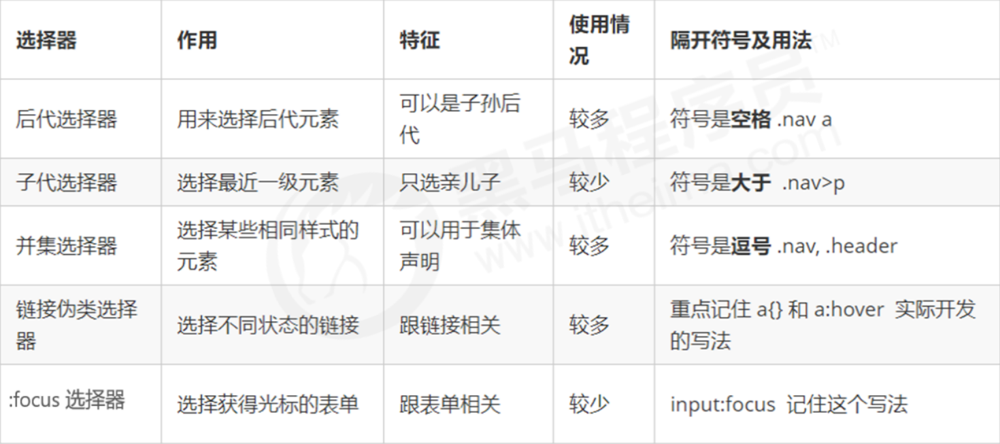


## 八、CSS 的元素显示模式

### 1. 什么是元素显示模式

作用：网页的标签非常多，在不同地方会用到不同类型的标签，了解他们的特点**可以更好的布局我们的网页**。

元素显示模式就是元素（标签）以什么方式进行显示，比如 < div > 自己占一行，比如一行可以放多个 < span > 。

HTML 元素一般分为**块元素**和**行内元素**两种类型。


### 2. 块元素

常见的块元素有 < h1 >~ < h6 >、< p >、< div >、< ul >、< ol >、< li >等，其中 < div > 标签是最典型的块元素。

块级元素的特点：

1. 比较霸道，自己独占一行。
2. 高度，宽度、外边距以及内边距都可以控制。
3. 宽度默认是容器（父级宽度）的100%。
4. 是一个容器及盒子，里面可以放行内或者块级元素。

注意：

- 文字类的元素内不能使用块级元素
- < p >标签主要用于存放文字，因此 < p > 里面不能放块级元素，特别是不能放 < div >
- 同理，< h1 >~ < h6 > 等都是文字类块级标签，里面也不能放其他块级元素


### 3. 行内元素

常见的行内元素有 < a >、< strong >、< b >、< em >、< i >、< del >、< s >、< ins >、< u >、< span >等，其中 < span > 标签是最典型的行内元素。有的地方也将行内元素称为内联元素。

行内元素的特点：

1. 相邻行内元素在一行上，一行可以显示多个。
2. 高、宽直接设置是无效的。
3. 默认宽度就是它本身内容的宽度。
4. 行内元素只能容纳文本或其他行内元素。

注意：

- 链接里面不能再放链接
- 特殊情况链接  < a >  里面可以放块级元素，但是给 < a > 转换一下块级模式最安全


### 4. 行内块元素

在行内元素中有几个特殊的标签，< img / >、< input / >、< td >，它们同时具有块元素和行内元素的特点。

有些资料称它们为行内块元素。

- 和相邻行内元素（行内块）在一行上，但是他们之间会有空白缝隙。一行可以显示多个（行内元素特点）。
- 默认宽度就是它本身内容的宽度（行内元素特点）。
- 高度，行高、外边距以及内边距都可以控制（块级元素特点）。


### 5. 元素显示模式总结

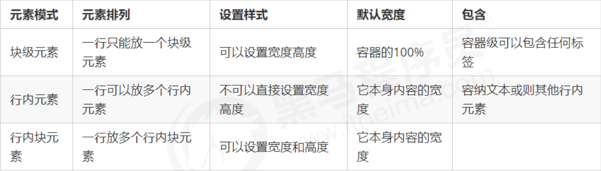

学习元素显示模式的主要目的就是分清它们各自的特点，当我们网页布局的时候，在合适的地方用合适的标签元素。


### 6. 元素显示模式转换

特殊情况下，我们需要元素模式的转换，简单理解: 一个模式的元素需要另外一种模式的特性

比如想要增加链接 < a > 的触发范围。 

- 转换为块元素：display:block;
- 转换为行内元素：display:inline;
- 转换为行内块：display: inline-block;


### 7. 单行文字垂直居中的原理

CSS 没有给我们提供文字垂直居中的代码. 这里我们可以使用一个小技巧来实现. 

解决方案: 让文字的行高等于盒子的高度 就可以让文字在当前盒子内垂直居中

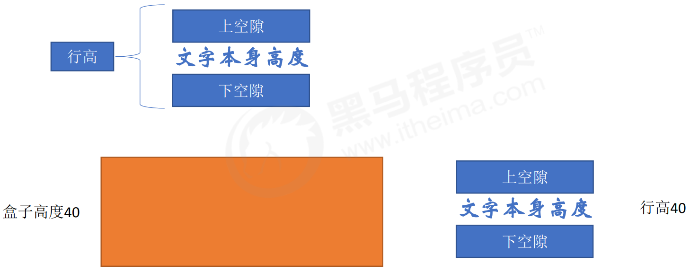

简单理解: 行高的上空隙和下空隙把文字挤到中间了. 是如果行高小于盒子高度,文字会偏上,如果行高大于盒子高度,则文字偏下


## 九、CSS 的背景

通过 CSS 背景属性，可以给页面元素添加背景样式。

背景属性可以设置背景颜色、背景图片、背景平铺、背景图片位置、背景图像固定等。


### 1. 背景颜色

background-color 属性定义了元素的背景颜色。

```css
background-color:颜色值; 
```

一般情况下元素背景颜色默认值是 transparent（透明），我们也可以手动指定背景颜色为透明色。

```css
background-color:transparent; 
```


### 2. 背景图片

background-image 属性描述了元素的背景图像。实际开发常见于 logo 或者一些装饰性的小图片或者是超 大的背景图片, 优点是非常便于控制位置. (精灵图也是一种运用场景)

```css
background-image : none | url (url) 
```

| 参数值 | 作用                           |
| ------ | ------------------------------ |
| none   | 无背景图(默认的)               |
| url    | 使用绝对或相对地址指定背景图像 |

注意：背景图片后面的地址，千万不要忘记加 URL， 同时里面的路径不要加引号。


### 3. 背景平铺

如果需要在 HTML 页面上对背景图像进行平铺，可以使用 background-repeat 属性。

```css
background-repeat: repeat | no-repeat | repeat-x | repeat-y 
```

| 参数值    | 作用                               |
| --------- | ---------------------------------- |
| repeat    | 背景图像在纵向和横向上平铺(默认的) |
| no-repeat | 背景图像不平铺                     |
| repeat-x  | 背景图像在横向上平铺               |
| repeat-y  | 背景图像在纵向平铺                 |


### 4. 背景图片位置

利用 background-position 属性可以改变图片在背景中的位置。

```css
background-position: x y; 
```

参数代表的意思是：x 坐标和 y 坐标。 可以使用 方位名词 或者 精确单位

| 参数值   | 说明                                                        |
| -------- | ----------------------------------------------------------- |
| length   | 百分数 \| 由浮点数字和单位标识符组成的长度值                |
| position | top \| center \| bottom \| left \| center \| right 方位名词 |

1. 参数是方位名词

- 如果指定的两个值都是方位名词，则两个值前后顺序无关，比如 left top 和 top left 效果一致
- 如果只指定了一个方位名词，另一个值省略，则第二个值默认居中对齐

2. 参数是精确单位

- 如果参数值是精确坐标，那么第一个肯定是 x 坐标，第二个一定是 y 坐标
- 如果只指定一个数值，那该数值一定是 x 坐标，另一个默认垂直居中

3. 参数是混合单位

- 如果指定的两个值是精确单位和方位名词混合使用，则第一个值是 x 坐标，第二个值是 y 坐标


### 5. 背景图像固定(背景附着)

background-attachment 属性设置背景图像是否固定或者随着页面的其余部分滚动。

background-attachment 后期可以制作视差滚动的效果。

```css
background-attachment : scroll | fixed 
```

| 参数   | 作用                     |
| ------ | ------------------------ |
| scroll | 背景图像是随对象内容滚动 |
| fixed  | 背景图像固定             |


### 6. 背景复合写法

为了简化背景属性的代码，我们可以将这些属性合并简写在同一个属性 background 中。从而节约代码量.

当使用简写属性时，没有特定的书写顺序,一般习惯约定顺序为：

background: 背景颜色 背景图片地址 背景平铺 背景图像滚动 背景图片位置;

```css
background: transparent url(image.jpg) repeat-y fixed top ;
```

这是实际开发中，我们更提倡的写法。


### 7. 背景色半透明

CSS3 为我们提供了背景颜色半透明的效果。

```css
background: rgba(0, 0, 0, 0.3);
```

- 最后一个参数是 alpha 透明度，取值范围在 0~1之间
- 我们习惯把 0.3 的 0 省略掉，写为 background: rgba(0, 0, 0, .3);
- 注意：背景半透明是指盒子背景半透明，盒子里面的内容不受影响
- CSS3 新增属性，是 IE9+ 版本浏览器才支持的
- 但是现在实际开发,我们不太关注兼容性写法了,可以放心使用


### 8. 背景总结

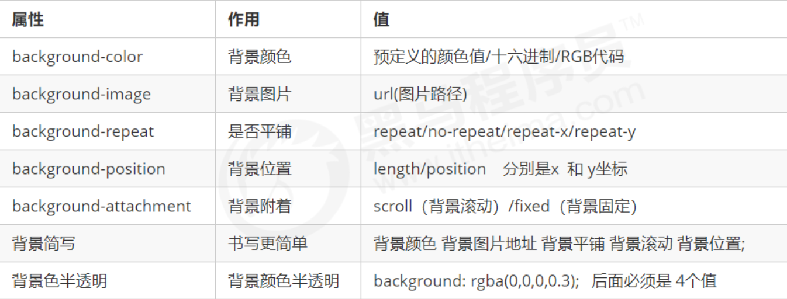

背景图片:实际开发常见于 logo 或者一些装饰性的小图片或者是超大的背景图片, 优点是非常便于控制位置. (精灵图也是一种运用场景)


## 十、CSS 的三大特性

CSS 有三个非常重要的三个特性：层叠性、继承性、优先级。


### 1. 层叠性

相同选择器给设置相同的样式，此时一个样式就会覆盖（层叠）另一个冲突的样式。层叠性主要解决样式冲突 的问题

层叠性原则：

- 样式冲突，遵循的原则是就近原则，哪个样式离结构近，就执行哪个样式
- 样式不冲突，不会层叠

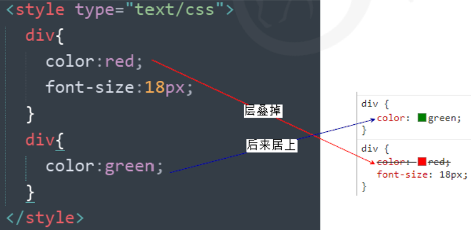

CSS 层叠性口诀：长江后浪推前浪，前浪死在沙滩上。


### 2. 继承性

现实中的继承: 我们继承了父亲的姓

CSS中的继承: 子标签会继承父标签的某些样式，如文本颜色和字号。简单的理解就是：子承父业。

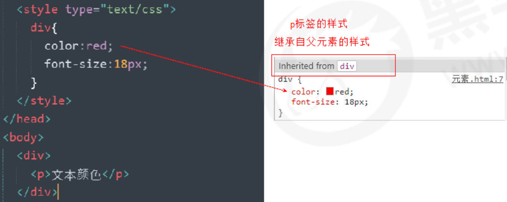

- 恰当地使用继承可以简化代码，降低 CSS 样式的复杂性
- 子元素可以继承父元素的样式（text-，font-，line-这些元素开头的可以继承，以及color属性）
- 继承性口诀：龙生龙，凤生凤，老鼠生的孩子会打洞


#### 2.1 行高的继承性

```css
body {
    font:12px/1.5 Microsoft YaHei；
}
```

- 行高可以跟单位也可以不跟单位
- 如果子元素没有设置行高，则会继承父元素的行高为 1.5
- 此时子元素的行高是：当前子元素的文字大小 * 1.5
- body 行高 1.5 这样写法最大的优势就是里面子元素可以根据自己文字大小自动调整行高


### 3. 优先级

当同一个元素指定多个选择器，就会有优先级的产生。

- 选择器相同，则执行层叠性
- 选择器不同，则根据选择器权重执行

选择器权重如下表所示。

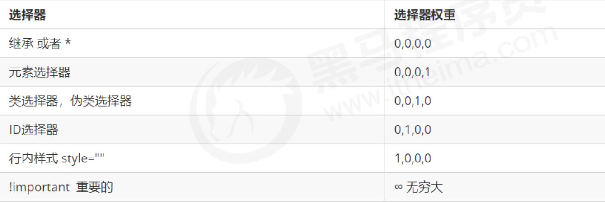

优先级注意点:

1. 权重是有4组数字组成,但是不会有进位。
2. 可以理解为类选择器永远大于元素选择器, id选择器永远大于类选择器,以此类推..
3. 等级判断从左向右，如果某一位数值相同，则判断下一位数值。
4. 可以简单记忆法: 通配符和继承权重为0, 标签选择器为1,类(伪类)选择器为 10, id选择器100, 行内样式表为1000, !important 无穷大.
5. 继承的权重是0， 如果该元素没有直接选中，不管父元素权重多高，子元素得到的权重都是0。


**权重叠加**：如果是复合选择器，则会有权重叠加，需要计算权重。

- div ul li ------> 0,0,0,3
- .nav ul li ------> 0,0,1,2
-  a:hover -----> 0,0,1,1
- .nav a ------> 0,0,1,1


## 十一、CSS 的注释

注释用于解释代码，它们会被浏览器忽略。CSS 中的注释以“ /* ”开头，以“ */ ”结尾。

```css
/* 需要注释的内容 */
```


## 十二、CSS 盒子模型

### 1. 盒子模型

页面布局要学习三大核心，盒子模型、浮动、定位，学习好盒子模型能非常好的帮助我们布局页面。


#### 1.1 看透网页布局的本质

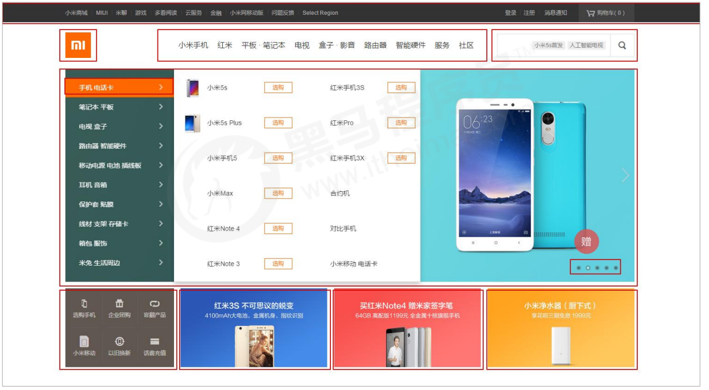

网页布局过程：

1. 先准备好相关的网页元素，网页元素基本都是盒子 Box 。
2. 利用 CSS 设置好盒子样式，然后摆放到相应位置。
3. 往盒子里面装内容.

网页布局的核心本质： 就是利用 CSS 摆盒子。


#### 1.2 盒子模型(Box Model)组成

所谓 盒子模型：就是把 HTML 页面中的布局元素看作是一个矩形的盒子，也就是一个盛装内容的容器。

CSS 盒子模型本质上是一个盒子，封装周围的 HTML 元素，它包括：边框、外边距、内边距、和 实际内容

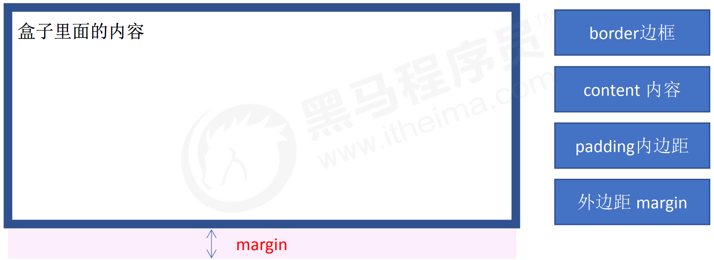

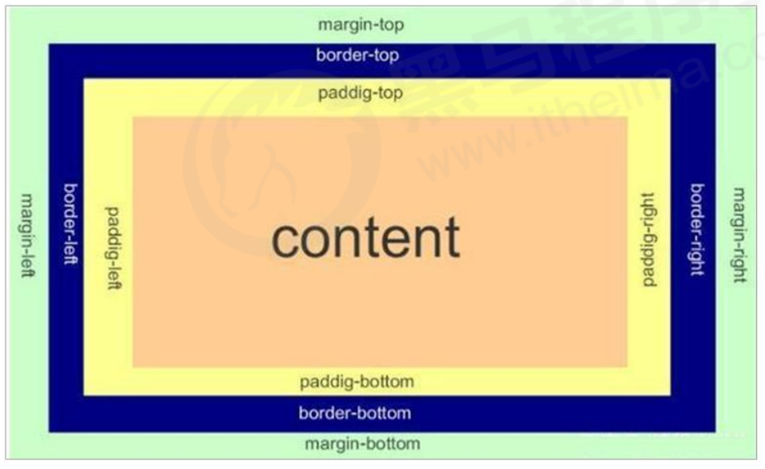


#### 1.3 边框(border)

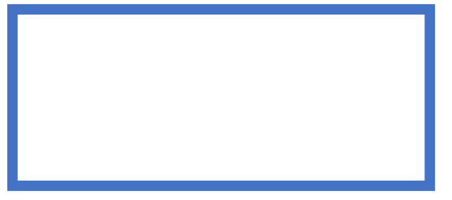

border可以设置元素的边框。边框有三部分组成:边框宽度(粗细) 边框样式 边框颜色

语法：

```css
border : border-width || border-style || border-color 
```

| 属性         | 作用                   |
| ------------ | ---------------------- |
| border-width | 定义边框粗细，单位是px |
| border-style | 边框的样式             |
| border-color | 边框颜色               |

边框样式 border-style 可以设置如下值：

- none：没有边框即忽略所有边框的宽度（默认值）
- solid：边框为单实线(最为常用的)
- dashed：边框为虚线
- dotted：边框为点线


边框简写：

```css
border: 1px solid red; # 没有顺序 
```

边框分开写法：

```css
border-top: 1px solid red; /* 只设定上边框， 其余同理 */ 
```


#### 1.4 表格的细线边框

border-collapse 属性控制浏览器绘制表格边框的方式。它控制相邻单元格的边框。

语法：

```css
border-collapse:collapse; 
```

- collapse 单词是合并的意思
- border-collapse: collapse; 表示相邻边框合并在一起


#### 1.5 边框会影响盒子实际大小

边框会额外增加盒子的实际大小。因此我们有两种方案解决:

1. 测量盒子大小的时候,不量边框.
2. 如果测量的时候包含了边框,则需要 width/height 减去边框宽度


#### 1.6 内边距(padding)

padding 属性用于设置内边距，即边框与内容之间的距离。

| 属性           | 作用     |
| -------------- | -------- |
| padding-left   | 左内边距 |
| padding-right  | 右内边距 |
| padding-top    | 上内边距 |
| padding-bottom | 下内边距 |

padding 属性（简写属性）可以有一到四个值。

| 值的个数                     | 表达意思                                                |
| ---------------------------- | ------------------------------------------------------- |
| padding: 5px;                | 1个值，代表上下左右都有5像素内边距;                     |
| padding: 5px 10px;           | 2个值，代表上下内边距是5像素左右内边距是10像素;         |
| padding: 5px 10px 20px;      | 3个值，代表上内边距5像素左右内边距10像素下内边距20像素; |
| padding: 5px 10px 20px 30px; | 4个值，上是5像素右10像素下20像素左是30像素 顺时针;      |


当我们给盒子指定 padding 值之后，发生了 2 件事情：

1. 内容和边框有了距离，添加了内边距。
2. padding影响了盒子实际大小。

也就是说，如果盒子已经有了宽度和高度，此时再指定内边框，会撑大盒子。

如果盒子本身没有指定width/height属性, 则此时padding不会撑开盒子大小.

> 解决方案：如果保证盒子跟效果图大小保持一致，则让 width/height 减去多出来的内边距大小即可。


#### 1.7 外边距(margin)

margin 属性用于设置外边距，即控制盒子和盒子之间的距离。

| 属性          | 作用     |
| ------------- | -------- |
| margin-left   | 左外边距 |
| margin-right  | 右外边距 |
| margin-top    | 上外边距 |
| margin-bottom | 下外边距 |

margin 简写方式代表的意义跟 padding 完全一致。


**外边距典型应用**

外边距可以让块级盒子水平居中，但是必须满足两个条件：

1. 盒子必须指定了宽度(width)。
2. 盒子左右的外边距都设置为 auto 。

```css
.header{ width:960px; margin:0 auto;}
```

常见的写法，以下三种都可以：

- margin-left: auto; margin-right: auto;
- margin: auto;
- margin: 0 auto;

注意：以上方法是让块级元素水平居中，行内元素或者行内块元素水平居中给其父元素添加 text-align:center 即可。


#### 1.8 外边距合并

使用 margin 定义块元素的垂直外边距时，可能会出现外边距的合并。

主要有两种情况:

1. 相邻块元素垂直外边距的合并
2. 嵌套块元素垂直外边距的塌陷


**相邻块元素垂直外边距的合并**

当上下相邻的两个块元素（兄弟关系）相遇时，如果上面的元素有下外边距 margin-bottom，下面的元素有 上外边距 margin-top ，则他们之间的垂直间距不是 margin-bottom 与 margin-top 之和。**取两个值中的较大者这种现象被称为相邻块元素垂直外边距的合并**。

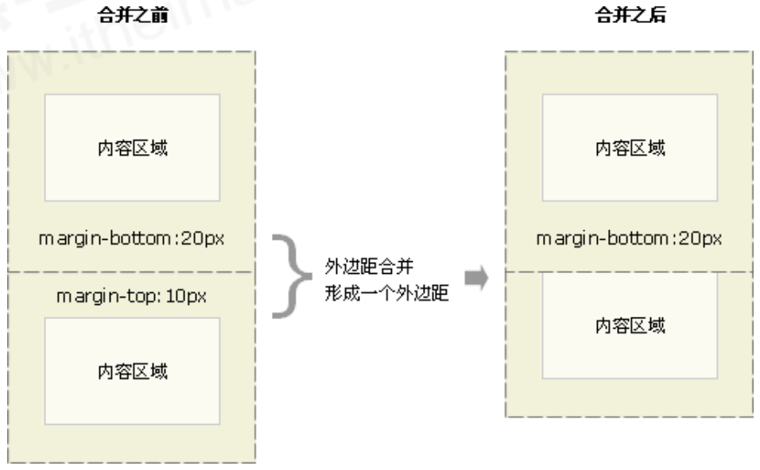

解决方案： 尽量只给一个盒子添加 margin 值。


**嵌套块元素垂直外边距的塌陷**

对于两个嵌套关系（父子关系）的块元素，父元素有上外边距同时子元素也有上外边距，此时父元素会塌陷较大的外边距值。

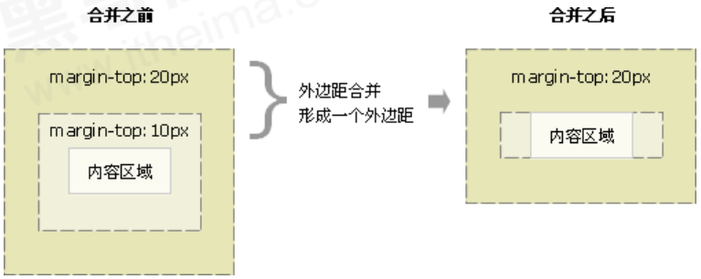

解决方案：

1. 可以为父元素定义上边框。
2. 可以为父元素定义上内边距。
3. 可以为父元素添加 overflow:hidden。

还有其他方法，比如浮动、固定，绝对定位的盒子不会有塌陷问题，后面咱们再总结。


#### 1.9 清除内外边距

网页元素很多都带有默认的内外边距，而且不同浏览器默认的也不一致。因此我们在布局前，首先要清除下网 页元素的内外边距。

```css
* {
    padding:0; /* 清除内边距 */
    margin:0; /* 清除外边距 */
}
```

注意：行内元素为了照顾兼容性，尽量只设置左右内外边距，不要设置上下内外边距。但是转换为块级和行内 块元素就可以了


## 十三、PS 基本操作

因为网页美工大部分效果图都是利用 PS（Photoshop）来做的，所以以后我们大部分切图工作都是在 PS 里面完成。

- 文件 -> 打开 ：可以打开我们要测量的图片
- Ctrl+R：可以打开标尺，或者 视图 -> 标尺
- 右击标尺，把里面的单位改为像素
- Ctrl+ 加号(+)可以放大视图， Ctrl+ 减号(-)可以缩小视图
- 按住空格键，鼠标可以变成小手，拖动 PS 视图
- 用选区拖动 可以测量大小
- Ctrl+ D 可以取消选区，或者在旁边空白处点击一下也可以取消选区

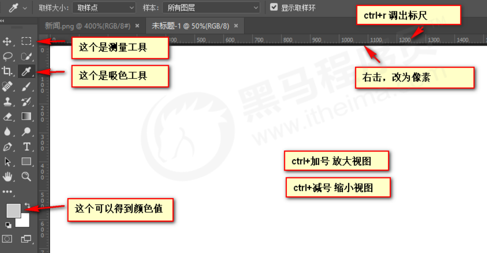


### 1. 常见的图片格式

1. jpg图像格式： JPEG（.JPG）对色彩的信息保留较好，高清，颜色较多，我们产品类的图片经常用jpg格 式的
2. gif图像格式：GIF格式最多只能储存256色，所以通常用来显示简单图形及字体，但是可以保存透明背景 和动画效果, 实际经常用于一些图片小动画效果.
3. png图像格式是一种新兴的网络图形格式，结合了GIF和JPEG的优点，具有存储形式丰富的特点，能够保 持透明背景. 如果想要切成背景透明的图片,请选择png格式.
4. PSD图像格式PSD格式是Photoshop的专用格式，里面可以存放图层、通道、遮罩等多种设计稿. 对我们 前端人员来说,最大的优点,我们可以直接从上面复制文字,获得图片,还可以测量大小和距离.


### 2. 图层切图

最简单的切图方式：右击图层 -> 快速导出为 PNG。

但是很多情况下,我们需要合并图层再导出:

1. 选中需要的图层: 图层菜单 -> 合并图层(ctrl+e) 
2. 右击 -> 快速导出为 PNG


### 3. 切片切图

1. 利用切片选中图片：利用切片工具手动划出

2. 导出选中的图片：文件菜单 -> 导出 -> 存储为 web 设备所用格式 -> 选择我们要的图片格式 -> 存储 。


## 十四、圆角边框

在 CSS3 中，新增了圆角边框样式，这样我们的盒子就可以变圆角了。

border-radius 属性用于设置元素的外边框圆角。

语法：

```css
border-radius:length; 
```

- 参数值可以为数值或百分比的形式
- 如果是正方形，想要设置为一个圆，把数值修改为高度或者宽度的一半即可，或者直接写为 50%
- 该属性是一个简写属性，可以跟四个值，分别代表左上角、右上角、右下角、左下角
- 分开写：border-top-left-radius、border-top-right-radius、border-bottom-right-radius 和 border-bottom-left-radius
- 兼容性 ie9+ 浏览器支持, 但是不会影响页面布局,可以放心使用.


## 十五、盒子阴影

CSS3 中新增了盒子阴影，我们可以使用 box-shadow 属性为盒子添加阴影。

语法：

```css
box-shadow: h-shadow v-shadow blur spread color inset; 
```

| 值       | 描述                                   |
| -------- | -------------------------------------- |
| h-shadow | 必需。水平阴影的位置。允许负值。       |
| v-shadow | 必需。垂直阴影的位置。允许负值。       |
| blur     | 可选。模糊距离。                       |
| spread   | 可选。阴影的尺寸。                     |
| color    | 可选。阴影的颜色。请参阅 CSS 颜色值。  |
| inset    | 可选。将外部阴影(outset)改为内部阴影。 |

注意：

1. 默认的是外阴影(outset), 但是不可以写这个单词,否则造成阴影无效
2. 盒子阴影不占用空间，不会影响其他盒子排列。


## 十六、文字阴影

在 CSS3 中，我们可以使用 text-shadow 属性将阴影应用于文本。

语法：

```css
text-shadow: h-shadow v-shadow blur color;
```

| 值       | 描述                               |
| -------- | ---------------------------------- |
| h-shadow | 必需。水平阴影的位置。允许负值。   |
| v-shadow | 必需。垂直阴影的位置。允许负值。   |
| blur     | 可选。模糊的距离。                 |
| color    | 可选。阴影的颜色。参阅CSS 颜色值。 |


## 十七、浮动

### 1. 传统网页布局的三种方式

网页布局的本质——用 CSS 来摆放盒子。 把盒子摆放到相应位置.

CSS 提供了三种传统布局方式(简单说,就是盒子如何进行排列顺序)：

- 普通流（标准流）
- 浮动
- 定位


### 2.标准流(普通流/文档流)

所谓的标准流: 就是标签按照规定好默认方式排列.

1. 块级元素会独占一行，从上向下顺序排列。
   常用元素：div、hr、p、h1~h6、ul、ol、dl、form、table
2. 行内元素会按照顺序，从左到右顺序排列，碰到父元素边缘则自动换行。
   常用元素：span、a、i、em 等

以上都是标准流布局，我们前面学习的就是标准流，标准流是最基本的布局方式。

这三种布局方式都是用来摆放盒子的，盒子摆放到合适位置，布局自然就完成了。

注意：实际开发中，一个页面基本都包含了这三种布局方式（后面移动端学习新的布局方式） 。


### 3. 为什么需要浮动？

提问：我们用标准流能很方便的实现如下效果吗？

1. 如何让多个块级盒子(div)水平排列成一行？

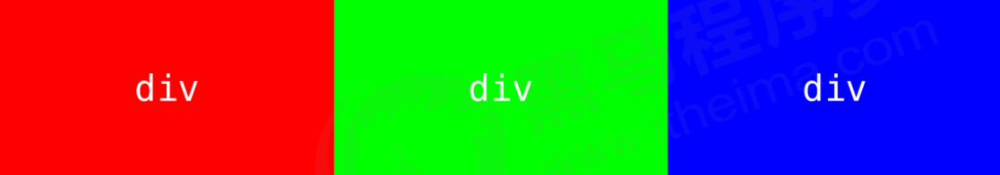

比较难，虽然转换为行内块元素可以实现一行显示，但是他们之间会有大的空白缝隙，很难控制。


2. 如何实现两个盒子的左右对齐？

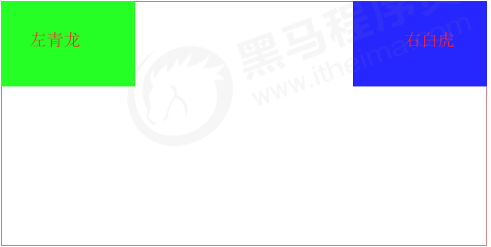


总结： 有很多的布局效果，标准流没有办法完成，此时就可以利用浮动完成布局。 因为浮动可以改变元素标 签默认的排列方式.

浮动最典型的应用：可以让多个块级元素一行内排列显示。

网页布局第一准则：多个块级元素纵向排列找标准流，多个块级元素横向排列找浮动。


### 4. 浮动语法

float 属性用于创建浮动框，将其移动到一边，直到左边缘或右边缘触及包含块或另一个浮动框的边缘。

语法：

```css
选择器 { float: 属性值; }
```

| 属性值 | 描述               |
| ------ | ------------------ |
| none   | 元素不浮动(默认值) |
| left   | 元素向左浮动       |
| right  | 元素向右浮动       |


### 5. 浮动特性

1. 浮动元素会脱离标准流(脱标)
2. 浮动的元素会一行内显示并且元素顶部对齐
3. 浮动的元素会具有行内块元素的特性.


设置了浮动（float）的元素最重要特性：

- 脱离标准普通流的控制（浮） 移动到指定位置（动）, （俗称脱标）
- 浮动的盒子不再保留原先的位置

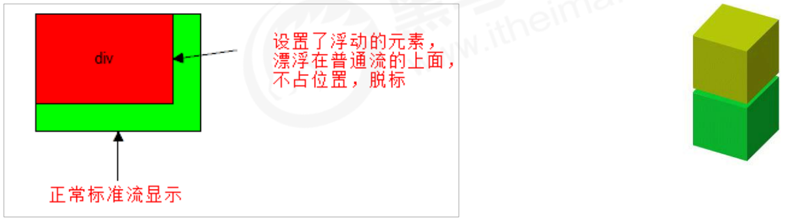


- 如果多个盒子都设置了浮动，则它们会按照属性值一行内显示并且顶端对齐排列。


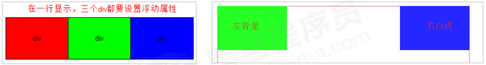

注意： 浮动的元素是互相贴靠在一起的（不会有缝隙），如果父级宽度装不下这些浮动的盒子， 多出的盒子 会另起一行对齐。


- 浮动元素会具有行内块元素特性


任何元素都可以浮动。不管原先是什么模式的元素，添加浮动之后具有行内块元素相似的特性。

1. 如果块级盒子没有设置宽度，默认宽度和父级一样宽，但是添加浮动后，它的大小根据内容来决定
2. 浮动的盒子中间是没有缝隙的，是紧挨着一起的
3. 行内元素同理


### 6. 浮动元素经常和标准流父级搭配使用

为了约束浮动元素位置, 我们网页布局一般采取的策略是:

先用标准流的父元素排列上下位置, 之后内部子元素采取浮动排列左右位置. 符合网页布局第一准侧.

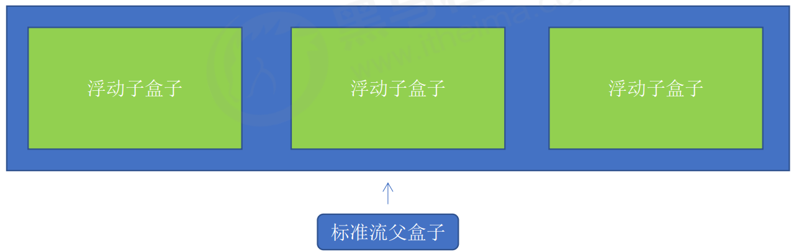


## 十八、常见网页布局

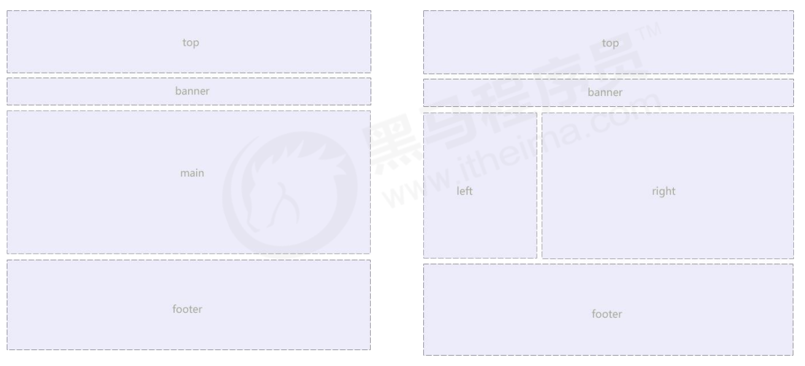

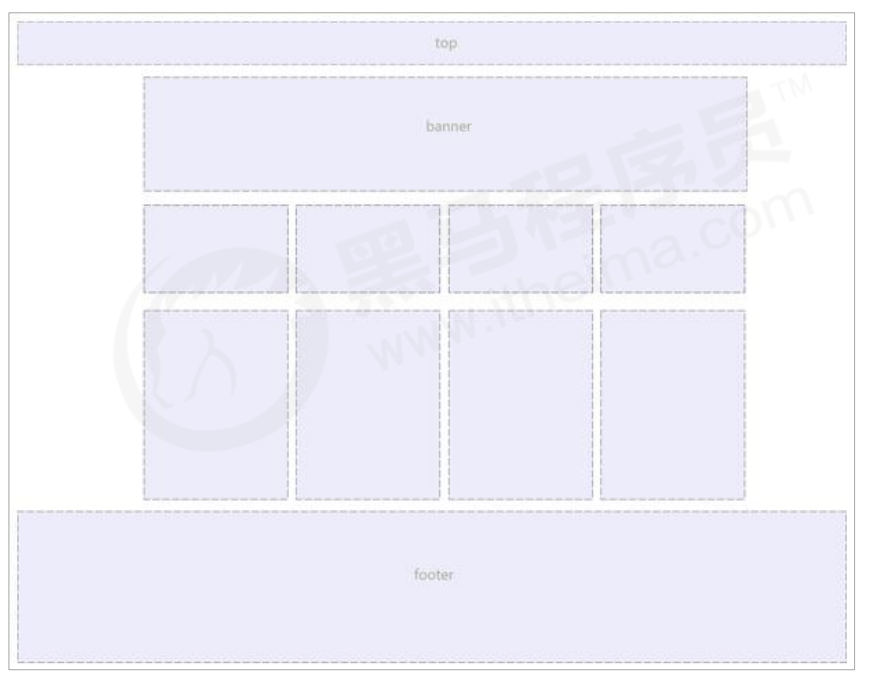


### 1. 浮动布局注意点

1. 浮动和标准流的父盒子搭配。
   先用标准流的父元素排列上下位置, 之后内部子元素采取浮动排列左右位置

2. 一个元素浮动了，理论上其余的兄弟元素也要浮动。
   一个盒子里面有多个子盒子，如果其中一个盒子浮动了，那么其他兄弟也应该浮动，以防止引起问题。
   浮动的盒子只会影响浮动盒子后面的标准流,不会影响前面的标准流.


我们前面浮动元素有一个标准流的父元素, 他们有一个共同的特点,都是有高度的.

但是, 所有的父盒子都必须有高度吗? 

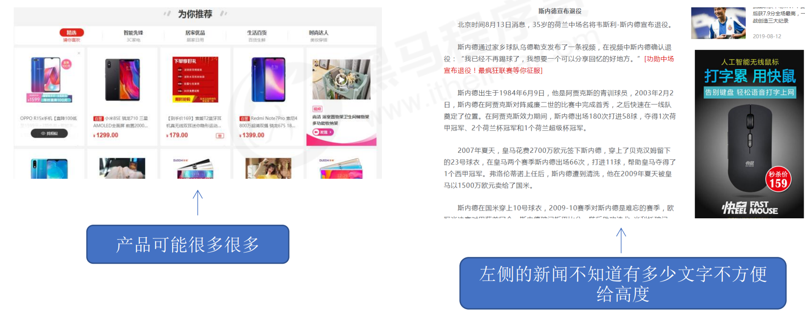


我们前面浮动元素有一个标准流的父元素, 他们有一个共同的特点,都是有高度的.

但是, 所有的父盒子都必须有高度吗? 

理想中的状态, 让子盒子撑开父亲. 有多少孩子,我父盒子就有多高.

但是不给父盒子高度会有问题吗?…..


## 十九、清除浮动

### 1. 为什么需要清除浮动？

由于父级盒子很多情况下，不方便给高度，但是子盒子浮动又不占有位置，最后父级盒子高度为 0 时，就会 影响下面的标准流盒子。

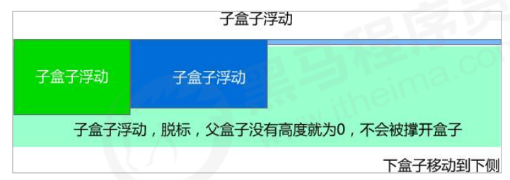

由于浮动元素不再占用原文档流的位置，所以它会对后面的元素排版产生影响


### 2. 清除浮动本质

- 清除浮动的本质是清除浮动元素造成的影响
- 如果父盒子本身有高度，则不需要清除浮动
- 清除浮动之后，父级就会根据浮动的子盒子自动检测高度。父级有了高度，就不会影响下面的标准流了


### 3. 语法

语法：

```css
选择器{clear:属性值;} 
```

| 属性值 | 描述                                      |
| ------ | ----------------------------------------- |
| left   | 不允许左侧有浮动元素 (清除左侧浮动的影响) |
| right  | 不允许右侧有浮动元素 (清除右侧浮动的影响) |
| both   | 同时清除左右两侧浮动的影响                |

我们实际工作中， 几乎只用 clear: both;

清除浮动的策略是: 闭合浮动. 


### 4. 清除浮动方法

1. 额外标签法也称为隔墙法，是 W3C 推荐的做法。
2. 父级添加 overflow 属性
3. 父级添加after伪元素
4. 父级添加双伪元素


#### 4.1 额外标签法

额外标签法也称为隔墙法，是 W3C 推荐的做法。

额外标签法会在浮动元素末尾添加一个空的标签。
例如：< div style="clear:both" >< /div >，或者其他标签(如< br/ >等)

- 优点： 通俗易懂，书写方便
- 缺点： 添加许多无意义的标签，结构化较差


总结:

1. 清除浮动本质是? 
   清除浮动的本质是清除浮动元素脱离标准流造成的影响
2. 清除浮动策略是?
   闭合浮动. 只让浮动在父盒子内部影响,不影响父盒子外面的其他盒子.
3. 额外标签法?
   隔墙法, 就是在最后一个浮动的子元素后面添加一个额外标签, 添加 清除浮动样式.
   实际工作可能会遇到,但是不常用


#### 4.2 父级添加 overflow

可以给父级添加 overflow 属性，将其属性值设置为 hidden、 auto 或 scroll 。

子不教,父之过,注意是给父元素添加代码

- 优点：代码简洁
- 缺点：无法显示溢出的部分


#### 4.3 :after 伪元素法

:after 方式是额外标签法的升级版。也是给父元素添加

```css
.clearfix:after {
    content: "";
    display: block;
    height: 0;
    clear: both;
    visibility: hidden;
}
.clearfix { /* IE6、7 专有 */
    *zoom: 1;
} 
```

- 优点：没有增加标签，结构更简单
- 缺点：照顾低版本浏览器
- 代表网站： 百度、淘宝网、网易等


#### 4.4 双伪元素清除浮动

也是给给父元素添加

```css
.clearfix:before,.clearfix:after {
    content:"";
    display:table;
}
.clearfix:after {
    clear:both;
}
.clearfix {
    *zoom:1;
} 
```

- 优点：代码更简洁
- 缺点：照顾低版本浏览器
- 代表网站：小米、腾讯等


#### 4.5 总结

为什么需要清除浮动？

1. 父级没高度。
2. 子盒子浮动了。
3. 影响下面布局了，我们就应该清除浮动了。

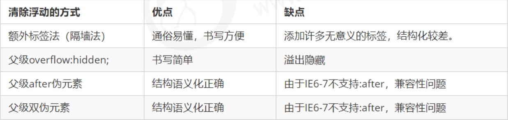


## 二十、学成在线案例


### 1. 准备素材和工具

1. 学成在线 PSD 源文件。
2. 开发工具 = PS（切图）/ cutterman 插件 + vscode（代码） + chrome（测试）。


### 2. 案例准备工作

我们本次采取结构与样式相分离思想：

1. 创建 study 目录文件夹 (用于存放我们这个页面的相关内容)。
2. 用vscode打开study目录文件夹.
3. study 目录内新建 images 文件夹，用于保存图片。
4. 新建首页文件 index.html（以后我们的网站首页统一规定为 index.html )。
5. 新建 style.css 样式文件。我们本次采用外链样式表。
6. 将样式引入到我们的 HTML 页面文件中。
7. 样式表写入清除内外边距的样式，来检测样式表是否引入成功。


### 3. CSS 属性书写顺序

编程中如何衡量一个人的代码能力?

规范标准 优雅高质量 等等 一个词形容 专业 从代码中看出是否有经验..

建议遵循以下顺序：

1. 布局定位属性：display / position / float / clear / visibility / overflow（建议 display 第一个写，毕竟关系到模式）
2. 自身属性：width / height / margin / padding / border / background
3. 文本属性：color / font / text-decoration / text-align / vertical-align / white- space / break-word
4. 其他属性（CSS3）：content / cursor / border-radius / box-shadow / text-shadow / background:linear-gradient …

```css
.jdc {
 display: block;
 position: relative;
 float: left;
 width: 100px;
 height: 100px;
 margin: 0 10px;
 padding: 20px 0;
 font-family: Arial, 'Helvetica Neue', Helvetica, sans-serif;
 color: #333;
 background: rgba(0,0,0,.5);
 border-radius: 10px;
} 
```


### 4. 页面布局整体思路

为了提高网页制作的效率，布局时通常有以下的整体思路：

1. 必须确定页面的版心（可视区），我们测量可得知。
2. 分析页面中的行模块，以及每个行模块中的列模块。其实页面布局第一准则.
3. 一行中的列模块经常浮动布局, 先确定每个列的大小,之后确定列的位置. 页面布局第二准则
4. 制作 HTML 结构。我们还是遵循，先有结构，后有样式的原则。结构永远最重要.
5. 所以, 先理清楚布局结构,再写代码尤为重要. 这需要我们多写多积累.


### 5. 确定版心

这个页面的版心是 1200 像素，每个版心都要水平居中对齐，可以定义版心为公共类：

```css
.w {
 width: 1200px;
 margin: auto;
}
```


### 6. 头部制作

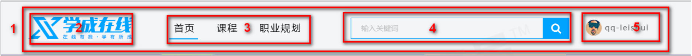

- 1 号是版心盒子 header 1200 * 42 的盒子水平居中对齐，上下给一个 margin 值就可以
- 版心盒子里面包含 2 号盒子 logo
- 版心盒子里面包含 3 号盒子 nav 导航栏
- 版心盒子里面包含 4 号盒子 search 搜索框
- 版心盒子里面包含 5 号盒子 user 个人信息
-  注意：要求里面的 4 个盒子必须都是浮动


导航栏注意点：实际开发中，我们不会直接用链接a 而是用 li 包含链接(li+a)的做法。

1. li+a 语义更清晰，一看这就是有条理的列表型内容。
2. 如果直接用a，搜索引擎容易辨别为有堆砌关键字嫌疑（故意堆砌关键字容易被搜索引擎有降权的风险）， 从而影响网站排名


注意

1. 让导航栏一行显示, 给 li 加浮动, 因为 li 是块级元素, 需要一行显示.
2. 这个nav导航栏可以不给宽度,将来可以继续添加其余文字
3. 因为导航栏里面文字不一样多,所以最好给链接 a 左右padding 撑开盒子,而不是指定宽度


search 搜索框：一个 search 大盒子里面包含 2个 表单

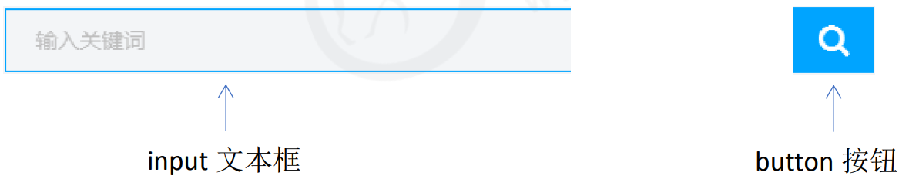


### 7. banner 制作

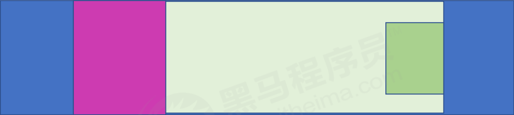

- 1 号盒子是通栏的大盒子 banner，不给宽度，给高度，给一个蓝色背景
- 2 号盒子是版心，要水平居中对齐
- 3 号盒子版心内，左对齐 subnav 侧导航栏
- 4 号盒子版心内，右对齐 course 课程


### 8. 精品推荐小模块

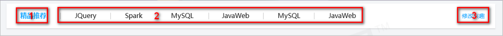

- 大盒子水平居中 goods 精品，注意此处有个盒子阴影
- 1 号盒子是标题 H3 左侧浮动
- 2 号盒子里面放链接左侧浮动， goods-item 距离可以控制链接的左右内边距（注意行内元素只给左右内外边距）
- 3 号盒子右浮动 mod 修改


### 9. 精品推荐大模块

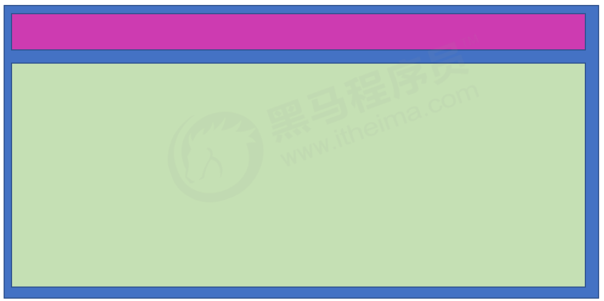

- 1 号盒子为最大的盒子， box 版心水平居中对齐
- 2 号盒子为上面部分，box-hd -- 里面左侧标题 H3 左浮动，右侧链接 a 右浮动
- 3 号盒子为底下部分，box-bd -- 里面是无序列表，有 10 个小 li 组成
- 小 li 外边距的问题，这里有个小技巧：给 box-hd 宽度为 1225 就可以一行装开 5 个 li

我们用到清除浮动，因为 box-hd 里面的盒子个数不一定是多少，所以我们就不给高度了，但是里 面的盒子浮动会影响下面的布局，因此需要清除浮动。


### 10. 底部模块

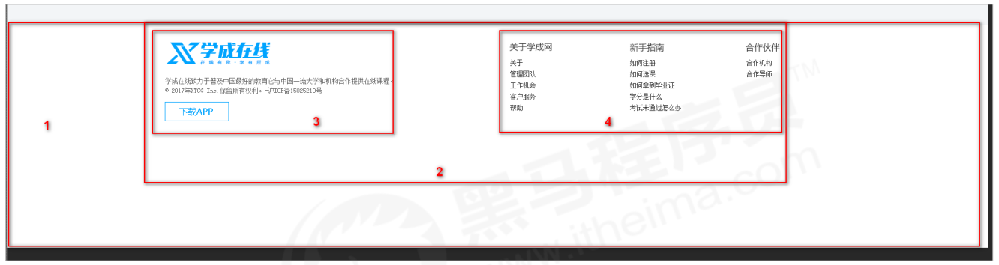

- 1 号盒子是通栏大盒子，底部 footer 给高度，底色是白色
- 2 号盒子版心水平居中
- 3 号盒子版权 copyright 左对齐
- 4 号盒子链接组 links 右对齐


## 二十一、CSS 定位

### 1. 为什么需要定位

提问： 以下情况使用标准流或者浮动能实现吗？

1. 某个元素可以自由的在一个盒子内移动位置，并且压住其他盒子.
   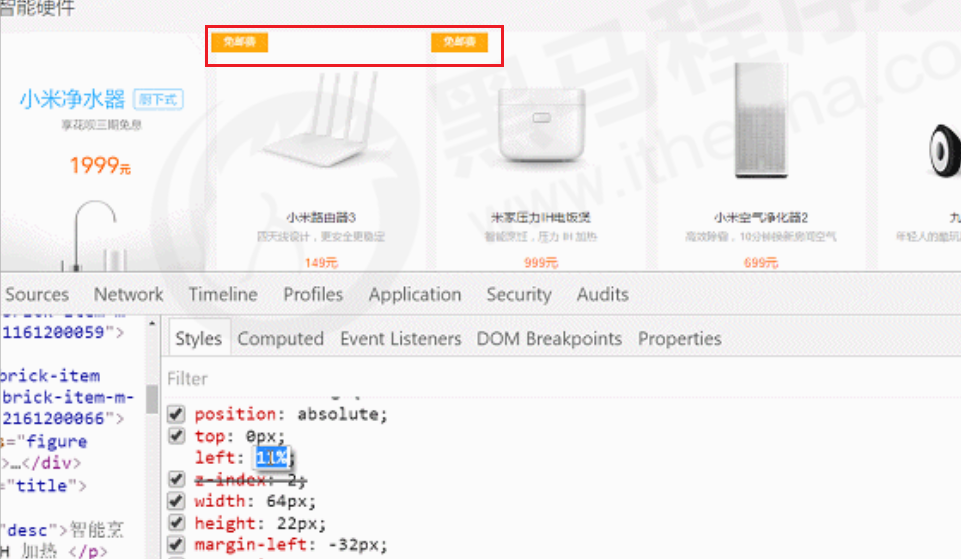


2. 当我们滚动窗口的时候，盒子是固定屏幕某个位置的。
   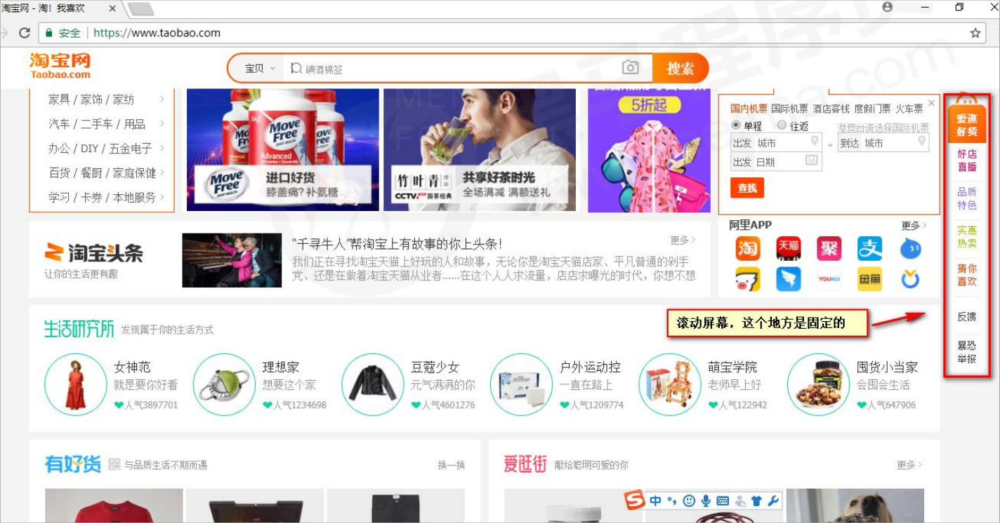


以上效果，标准流或浮动都无法快速实现，此时需要定位来实现。

所以：

1. 浮动可以让多个块级盒子一行没有缝隙排列显示， 经常用于横向排列盒子。
2. 定位则是可以让盒子自由的在某个盒子内移动位置或者固定屏幕中某个位置，并且可以压住其他盒子。


### 2. 定位组成

定位：将盒子定在某一个位置，所以定位也是在摆放盒子， 按照定位的方式移动盒子。

定位 = 定位模式 + 边偏移 。

定位模式用于指定一个元素在文档中的定位方式。边偏移则决定了该元素的最终位置。


#### 2.1 定位模式

定位模式决定元素的定位方式 ，它通过 CSS 的 position 属性来设置，其值可以分为四个：

| 值       | 语义     |
| -------- | -------- |
| static   | 静态定位 |
| relative | 相对定位 |
| absolute | 绝对定位 |
| fixed    | 固定定位 |


#### 2.2 边偏移

边偏移就是定位的盒子移动到最终位置。有 top、bottom、left 和 right 4 个属性。

| 边偏移属性 | 示例         | 描述                                             |
| ---------- | ------------ | ------------------------------------------------ |
| top        | top: 80px    | 顶端偏移量，定义元素相对于其父元素上边线的距离。 |
| bottom     | bottom: 80px | 底部偏移量，定义元素相对于其父元素下边线的距离。 |
| left       | left: 80px   | 左侧偏移量，定义元素相对于其父元素左边线的距离。 |
| right      | right: 80px  | 右侧偏移量，定义元素相对于其父元素右边线的距离。 |


### 3. 静态定位 static

静态定位是元素的默认定位方式，无定位的意思。

语法：

```css
选择器 { position: static; }
```

- 静态定位按照标准流特性摆放位置，它没有边偏移
- 静态定位在布局时很少用到


### 4. 相对定位 relative

相对定位是元素在移动位置的时候，是相对于它原来的位置来说的。

语法：

```css
选择器 { position: relative; }
```

相对定位的特点：

1. 它是相对于自己原来的位置来移动的（移动位置的时候参照点是自己原来的位置）。
2. 原来在标准流的位置继续占有，后面的盒子仍然以标准流的方式对待它。


### 5. 绝对定位 absolute

绝对定位是元素在移动位置的时候，是相对于它祖先元素来说的

语法：

```css
选择器 { position: absolute; }
```

绝对定位的特点：

1. 如果没有祖先元素或者祖先元素没有定位，则以浏览器为准定位（Document 文档）。
2. 如果祖先元素有定位（相对、绝对、固定定位），则以最近一级的有定位祖先元素为参考点移动位置。
3. 绝对定位不再占有原先的位置。（脱标）

所以绝对定位是脱离标准流的。


### 6. 子绝父相

这个“子绝父相”太重要了，是我们学习定位的口诀，是定位中最常用的一种方式这句话的意思是：子级是绝 对定位的话，父级要用相对定位。

1. 子级绝对定位，不会占有位置，可以放到父盒子里面的任何一个地方，不会影响其他的兄弟盒子。
2. 父盒子需要加定位限制子盒子在父盒子内显示。
3. 父盒子布局时，需要占有位置，因此父亲只能是相对定位。

这就是子绝父相的由来，所以相对定位经常用来作为绝对定位的父级。

总结： 因为父级需要占有位置，因此是相对定位， 子盒子不需要占有位置，则是绝对定位

当然，子绝父相不是永远不变的，如果父元素不需要占有位置，子绝父绝也会遇到。


### 7. 固定定位 fixed

固定定位是元素固定于浏览器可视区的位置。主要使用场景： 可以在浏览器页面滚动时元素的位置不会改变。

语法：

```css
选择器 { position: fixed; }
```

固定定位的特点：（务必记住）

1. 以浏览器的可视窗口为参照点移动元素。
   - 跟父元素没有任何关系
   - 不随滚动条滚动。

2. 固定定位不在占有原先的位置。
   固定定位也是脱标的，其实固定定位也可以看做是一种特殊的绝对定位。


**固定定位小技巧： 固定在版心右侧位置。**

小算法：

1. 让固定定位的盒子 left: 50%. 走到浏览器可视区（也可以看做版心） 的一半位置。
2. 让固定定位的盒子 margin-left: 版心宽度的一半距离。 多走 版心宽度的一半位置

就可以让固定定位的盒子贴着版心右侧对齐了。


### 8. 粘性定位 sticky

粘性定位可以被认为是相对定位和固定定位的混合。 Sticky 粘性的

语法：

```css
选择器 { position: sticky; top: 10px; }
```

粘性定位的特点：

1. 以浏览器的可视窗口为参照点移动元素（固定定位特点）
2. 粘性定位占有原先的位置（相对定位特点）
3. 必须添加 top 、left、right、bottom 其中一个才有效

跟页面滚动搭配使用。 兼容性较差，IE 不支持。


###  9. 定位的总结

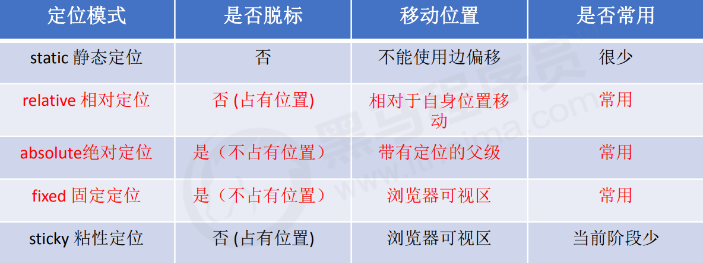

1. 一定记住 相对定位、固定定位、绝对定位 两个大的特点：
  - 是否占有位置（脱标否） 
  - 以谁为基准点移动位置。
2. 学习定位重点学会子绝父相。


### 10. 定位叠放次序 z-index

在使用定位布局时，可能会出现盒子重叠的情况。此时，可以使用 z-index 来控制盒子的前后次序 (z轴)

语法：

```css
选择器 { z-index: 1; }
```

- 数值可以是正整数、负整数或 0, 默认是 auto，数值越大，盒子越靠上
- 如果属性值相同，则按照书写顺序，后来居上
- 数字后面不能加单位
- 只有定位的盒子才有 z-index 属性


### 11. 定位的拓展

#### 11.1 绝对定位的盒子居中

加了绝对定位的盒子不能通过 margin:0 auto 水平居中，但是可以通过以下计算方法实现水平和垂直居中。

1. left: 50%;：让盒子的左侧移动到父级元素的水平中心位置。
2. margin-left: -100px;：让盒子向左移动自身宽度的一半。


#### 11.2 定位特殊特性

绝对定位和固定定位也和浮动类似。

1. 行内元素添加绝对或者固定定位，可以直接设置高度和宽度。
2. 块级元素添加绝对或者固定定位，如果不给宽度或者高度，默认大小是内容的大小。


#### 11.3 脱标的盒子不会触发外边距塌陷

浮动元素、绝对定位(固定定位)元素的都不会触发外边距合并的问题。


#### 11.4 绝对定位(固定定位)会完全压住盒子

浮动元素不同，只会压住它下面标准流的盒子，但是不会压住下面标准流盒子里面的文字（图片）

但是绝对定位（固定定位） 会压住下面标准流所有的内容。

浮动之所以不会压住文字，因为浮动产生的目的最初是为了做文字环绕效果的。 文字会围绕浮动元素


### 12. 综合案例

案例：淘宝焦点图布局制作


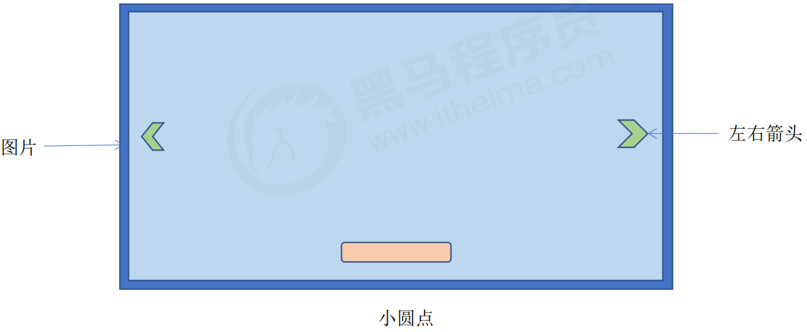

1. 大盒子我们类名为： tb-promo 淘宝广告
2. 里面先放一张图片。
3. 左右两个按钮 用链接就好了。 左箭头 prev 右箭头 next
4. 底侧小圆点ul 继续做。 类名为 promo-nav 


## 二十二、网页布局总结

通过盒子模型，清楚知道大部分html标签是一个盒子。

通过CSS浮动、定位 可以让每个盒子排列成为网页。

一个完整的网页，是标准流、浮动、定位一起完成布局的，每个都有自己的专门用法。

1. **标准流**：可以让盒子上下排列或者左右排列，垂直的块级盒子显示就用标准流布局。
2. **浮动**：可以让多个块级元素一行显示或者左右对齐盒子，多个块级盒子水平显示就用浮动布局。
3. **定位**：定位最大的特点是有层叠的概念，就是可以让多个盒子前后叠压来显示。如果元素自由在某个盒子内移动就用定位布局。


## 二十三、元素的显示与隐藏

类似网站广告，当我们点击关闭就不见了，但是我们重新刷新页面，会重新出现！

本质：让一个元素在页面中隐藏或者显示出来。

1. display 显示隐藏元素 但是不保留位置
2. visibility 显示隐藏元素 但是保留原来的位置
3. overflow 溢出显示隐藏 但是只是对于溢出的部分处理


### 1. display 属性

display 属性用于设置一个元素应如何显示。

- display: none ；隐藏对象
- display：block ；除了转换为块级元素之外，同时还有显示元素的意思

display 隐藏元素后，不再占有原来的位置。

后面应用及其广泛，搭配 JS 可以做很多的网页特效。


### 2. visibility 可见性

visibility 属性用于指定一个元素应可见还是隐藏。

- visibility：visible; 元素可视
- visibility：hidden; 元素隐藏

visibility 隐藏元素后，继续占有原来的位置。

如果隐藏元素想要原来位置， 就用 visibility：hidden

如果隐藏元素不想要原来位置， 就用 display：none (用处更多 重点）


### 3. overflow 溢出

overflow 属性指定了如果内容溢出一个元素的框（超过其指定高度及宽度） 时，会发生什么。

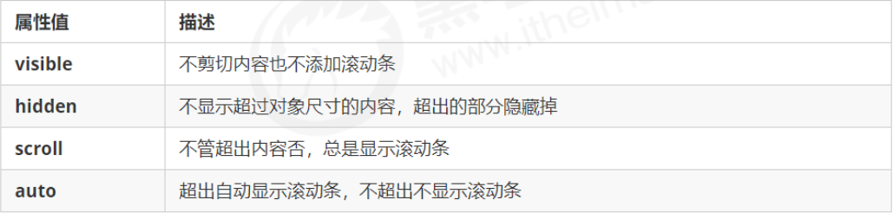

一般情况下，我们都不想让溢出的内容显示出来，因为溢出的部分会影响布局。

但是如果有定位的盒子， 请慎用overflow:hidden 因为它会隐藏多余的部分。


### 4. 综合案例

案例：土豆网鼠标经过显示遮罩


1. 练习元素的显示与隐藏
2. 练习元素的定位

核心原理： 原先半透明的黑色遮罩看不见， 鼠标经过 大盒子，就显示出来。

遮罩的盒子不占有位置， 就需要用绝对定位 和 display 配合使用。


# CSS高级

## 一、精灵图

### 1. 为什么需要精灵图

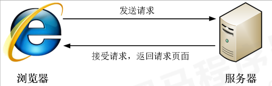

一个网页中往往会应用很多小的背景图像作为修饰，当网页中的图像过多时，服务器就会频繁地接收和发送 请求图片，造成服务器请求压力过大，这将大大降低页面的加载速度。

因此，为了有效地减少服务器接收和发送请求的次数，提高页面的加载速度，出现了 CSS 精灵技术（也称 CSS Sprites、CSS 雪碧）。

**核心原理**：将网页中的一些小背景图像整合到一张大图中 ，这样服务器只需要一次请求就可以了。

精灵技术**目的**： 为了有效地减少服务器接收和发送请求的次数，提高页面的加载速度


### 2. 精灵图(sprites)的使用

使用精灵图核心：

1. 精灵技术主要针对于背景图片使用。就是把多个小背景图片整合到一张大图片中。
2. 这个大图片也称为 sprites 精灵图 或者 雪碧图
3. 移动背景图片位置， 此时可以使用 background-position 。
4. 移动的距离就是这个目标图片的 x 和 y 坐标。注意网页中的坐标有所不同
5. 因为一般情况下都是往上往左移动，所以数值是负值。
6. 使用精灵图的时候需要精确测量，每个小背景图片的大小和位置。


```html
<!DOCTYPE html>
<html lang="en">
<head>
    <meta charset="UTF-8">
    <meta name="viewport" content="width=device-width, initial-scale=1.0">
    <meta http-equiv="X-UA-Compatible" content="ie=edge">
    <title>精灵图使用</title>
    <style>
        .box1 {
            width: 60px;
            height: 60px;   
            margin: 100px auto;
            background: url(images/sprites.png) no-repeat   -182px 0;
          
        }
        .box2 {
            width: 27px;
            height: 25px;
            /* background-color: pink; */
            margin: 200px;
            background: url(images/sprites.png) no-repeat  -155px -106px;

        }
    </style>
</head>
<body>
    <div class="box1"></div>
    <div class="box2"></div>
</body>
</html>
```


使用精灵图核心总结：

1. 精灵图主要针对于小的背景图片使用。
2. 主要借助于背景位置来实现---background-position 。
3. 一般情况下精灵图都是负值。（千万注意网页中的坐标： x轴右边走是正值，左边走是负值， y轴同理。）


## 二、字体图标

### 1. 字体图标的产生

字体图标使用场景： 主要用于显示网页中通用、常用的一些小图标。

精灵图是有诸多优点的，但是缺点很明显。

1. 图片文件还是比较大的。
2. 图片本身放大和缩小会失真。
3. 一旦图片制作完毕想要更换非常复杂。

此时，有一种技术的出现很好的解决了以上问题，就是**字体图标 iconfont**。

**字体图标**可以为前端工程师提供一种方便高效的图标使用方式，**展示的是图标，本质属于字体**。


### 2. 字体图标的优点

- 轻量级：一个图标字体要比一系列的图像要小。一旦字体加载了，图标就会马上渲染出来，减少了服务器请求
- 灵活性：本质其实是文字，可以很随意的改变颜色、产生阴影、透明效果、旋转等
- 兼容性：几乎支持所有的浏览器，请放心使用

**注意**： 字体图标不能替代精灵技术，只是对工作中图标部分技术的提升和优化。

**总结**：

1. 如果遇到一些结构和样式比较简单的小图标，就用字体图标。
2. 如果遇到一些结构和样式复杂一点的小图片，就用精灵图。


### 3. 字体图标的下载

推荐下载网站：

- **icomoon 字库** http://icomoon.io 推荐指数 ★★★★★
  IcoMoon 成立于 2011 年，推出了第一个自定义图标字体生成器，它允许用户选择所需要的图标，使它们成 一字型。该字库内容种类繁多，非常全面，唯一的遗憾是国外服务器，打开网速较慢。
- **阿里 iconfont 字库** http://www.iconfont.cn/ 推荐指数 ★★★★★
  这个是阿里妈妈 M2UX 的一个 iconfont 字体图标字库，包含了淘宝图标库和阿里妈妈图标库。可以使用 AI 制作图标上传生成。 重点是，免费！


### 4. 字体图标的引入

**字体文件格式**

不同浏览器所支持的字体格式是不一样的，字体图标之所以兼容，就是因为包含了主流浏览器支持的字体文件。

1. TureType(.ttf)格式.ttf字体是Windows和Mac的最常见的字体，支持这种字体的浏览器有IE9+、Firefox3.5+、
   Chrome4+、Safari3+、Opera10+、iOS Mobile、Safari4.2+；
2. Web Open Font Format(.woff)格式woff字体，支持这种字体的浏览器有IE9+、Firefox3.5+、Chrome6+、
   Safari3.6+、Opera11.1+；
3. Embedded Open Type(.eot)格式.eot字体是IE专用字体，支持这种字体的浏览器有IE4+；
4. SVG(.svg)格式.svg字体是基于SVG字体渲染的一种格式，支持这种字体的浏览器有Chrome4+、Safari3.1+、
   Opera10.0+、iOS Mobile Safari3.2+；


下载完毕之后，注意原先的文件不要删，后面会用。

1. 把下载包里面的 fonts 文件夹放入页面根目录下

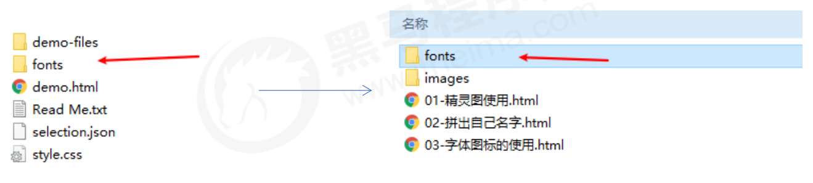


2. 在 CSS 样式中全局声明字体： 简单理解把这些字体文件通过css引入到我们页面中（一定注意字体文件路径的问题）。

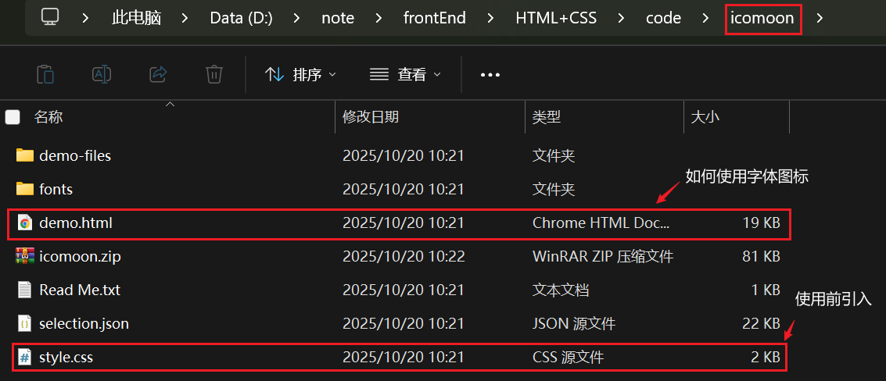

style.css里面引入@font-face，如下：

```css
@font-face {
  font-family: 'icomoon';
  src:  url('fonts/icomoon.eot?quh8vk');
  src:  url('fonts/icomoon.eot?quh8vk#iefix') format('embedded-opentype'),
    url('fonts/icomoon.ttf?quh8vk') format('truetype'),
    url('fonts/icomoon.woff?quh8vk') format('woff'),
    url('fonts/icomoon.svg?quh8vk#icomoon') format('svg');
  font-weight: normal;
  font-style: normal;
  font-display: block;
}
```


3. html 标签内添加小图标。

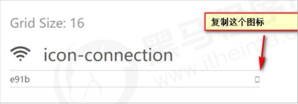

```html
<span></span>
```


4. 给标签定义字体。

```css
span {
	font-family: "icomoon";
}
```

务必保证 这个字体和上面@font-face里面的字体保持一致

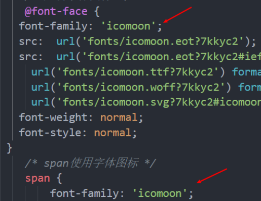


### 5. 字体图标的追加

如果工作中，原来的字体图标不够用了，我们需要添加新的字体图标到原来的字体文件中。

把压缩包里面的 selection.json 从新上传，然后选中自己想要新的图标，从新下载压缩包，并替换原来的文件即可。

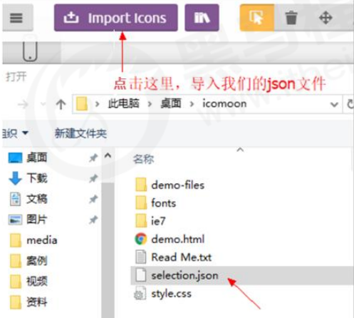


## 三、CSS 三角

网页中常见一些三角形，使用 CSS 直接画出来就可以，不必做成图片或者字体图标。

一张图， 你就知道 CSS 三角是怎么来的了, 做法如下：

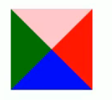

```css
div {
    width: 0;
    height: 0;
    
    /* 低版本浏览器兼容性问题 */
    line-height: 0;
    font-size: 0;
    
    border: 50px solid transparent;
    border-left-color: pink;
}
```


## 四、CSS 用户界面样式

### 1. 什么是界面样式

所谓的界面样式，就是更改一些用户操作样式，以便提高更好的用户体验。

- 更改用户的鼠标样式
- 表单轮廓
- 防止表单域拖拽


### 2. 鼠标样式 cursor

```css
li {cursor: pointer; }
```

设置或检索在对象上移动的鼠标指针采用何种系统预定义的光标形状。

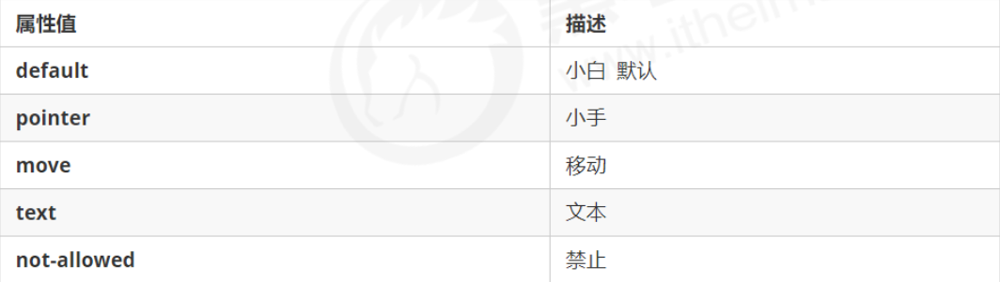


### 3. 轮廓线 outline

给表单添加 outline: 0; 或者 outline: none; 样式之后，就可以去掉默认的蓝色边框。

```css
input {outline: none; }
```


### 4. 防止拖拽文本域 resize

实际开发中，我们文本域右下角是不可以拖拽的。

```css
textarea{ resize: none;}
```


## 五、vertical-align 属性应用

CSS 的 vertical-align 属性使用场景： 经常用于设置图片或者表单(行内块元素）和文字垂直对齐。

官方解释： 用于设置一个元素的垂直对齐方式，但是它只针对于行内元素或者行内块元素有效。

语法：

```css
vertical-align : baseline | top | middle | bottom 
```

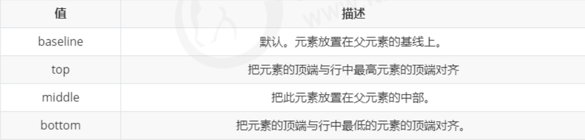

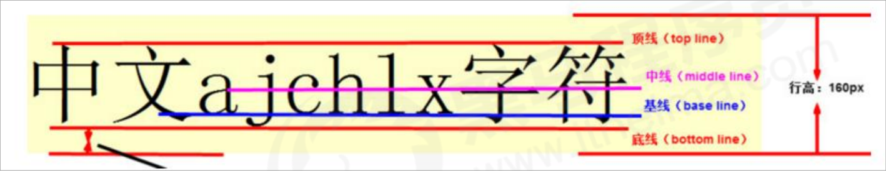


### 1. 图片、表单和文字对齐

图片、表单都属于行内块元素，默认的 vertical-align 是基线对齐。

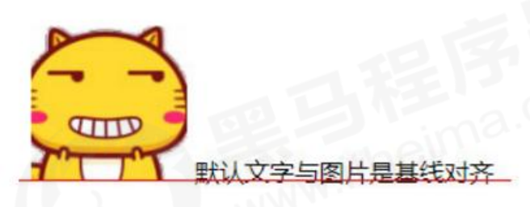

此时可以给图片、表单这些行内块元素的 vertical-align 属性设置为 middle 就可以让文字和图片垂直 居中对齐了。


### 2. 解决图片底部默认空白缝隙问题

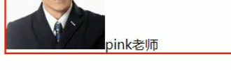

bug：图片底侧会有一个空白缝隙，原因是行内块元素会和文字的基线对齐。

主要解决方法有两种：

1. 给图片添加 vertical-align:middle | top| bottom 等。 （提倡使用的）
2. 把图片转换为块级元素 display: block;


## 六、溢出的文字省略号显示

### 1. 单行文本溢出显示省略号

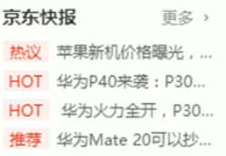

必须满足三个条件

```css
/*1. 先强制一行内显示文本*/
 white-space: nowrap; （ 默认 normal 自动换行）
 /*2. 超出的部分隐藏*/
 overflow: hidden;
 /*3. 文字用省略号替代超出的部分*/
 text-overflow: elli
```

示例：

```html
<!DOCTYPE html>
<html lang="en">
<head>
    <meta charset="UTF-8">
    <meta name="viewport" content="width=device-width, initial-scale=1.0">
    <meta http-equiv="X-UA-Compatible" content="ie=edge">
    <title>单行文本溢出显示省略号</title>
    <style>
        div {
            width: 150px;
            height: 80px;
            background-color: pink;
            margin: 100px auto;
            /* 这个单词的意思是如果文字显示不开自动换行 */
            /* white-space: normal; */
            /* 1.这个单词的意思是如果文字显示不开也必须强制一行内显示 */
            white-space: nowrap;
            /* 2.溢出的部分隐藏起来 */
            overflow: hidden;
            /* 3. 文字溢出的时候用省略号来显示 */
            text-overflow: ellipsis;
        }
    </style>
</head>
<body>
    <div>
        啥也不说，此处省略一万字
    </div>
</body>
</html>
```


### 2. 多行文本溢出显示省略号

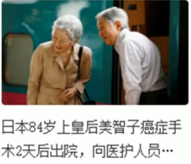

多行文本溢出显示省略号，有较大兼容性问题， 适合于webKit浏览器或移动端（移动端大部分是webkit内核）

```css
overflow: hidden;
text-overflow: ellipsis;
/* 弹性伸缩盒子模型显示 */
display: -webkit-box;
/* 限制在一个块元素显示的文本的行数 */
-webkit-line-clamp: 2;
/* 设置或检索伸缩盒对象的子元素的排列方式 */
-webkit-box-orient: vertical;
```

示例：

```html
<!DOCTYPE html>
<html lang="en">

<head>
    <meta charset="UTF-8">
    <meta name="viewport" content="width=device-width, initial-scale=1.0">
    <meta http-equiv="X-UA-Compatible" content="ie=edge">
    <title>单行文本溢出显示省略号</title>
    <style>
        div {
            width: 150px;
            height: 65px;
            background-color: pink;
            margin: 100px auto;
            overflow: hidden;
            text-overflow: ellipsis;
            /* 弹性伸缩盒子模型显示 */
            display: -webkit-box;
            /* 限制在一个块元素显示的文本的行数 */
            -webkit-line-clamp: 3;
            /* 设置或检索伸缩盒对象的子元素的排列方式 */
            -webkit-box-orient: vertical;
        }
    </style>
</head>

<body>
    <div>
        啥也不说，此处省略一万字,啥也不说，此处省略一万字此处省略一万字
    </div>
</body>

</html>
```

更推荐让后台人员来做这个效果，因为后台人员可以设置显示多少个字，操作更简单。


## 七、常见布局技巧

### 1. margin负值运用


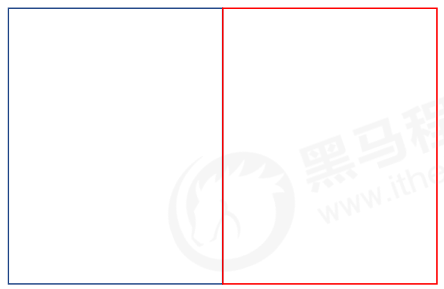

1. 让每个盒子margin 往左侧移动 -1px 正好压住相邻盒子边框
2. 鼠标经过某个盒子的时候，提高当前盒子的层级即可（如果没有有定位，则加相对定位（保留位置），如 果有定位，则加z-index）

```html
<!DOCTYPE html>
<html lang="en">

<head>
    <meta charset="UTF-8">
    <meta name="viewport" content="width=device-width, initial-scale=1.0">
    <meta http-equiv="X-UA-Compatible" content="ie=edge">
    <title>margin负值的巧妙运用</title>
    <style>
        ul li {
            position: relative;
            float: left;
            list-style: none;
            width: 150px;
            height: 200px;
            border: 1px solid red;
            margin-left: -1px;
        }

        /* ul li:hover {
           1. 如果盒子没有定位，则鼠标经过添加相对定位即可
        position: relative;
        border: 1px solid blue;

       } */
        ul li:hover {
            /* 2.如果li都有定位，则利用 z-index提高层级 */
            z-index: 1;
            border: 1px solid blue;
        }
    </style>
</head>

<body>
    <ul>
        <li>1</li>
        <li>2</li>
        <li>3</li>
        <li>4</li>
        <li>5</li>
    </ul>
</body>

</html>
```


### 2. 文字围绕浮动元素

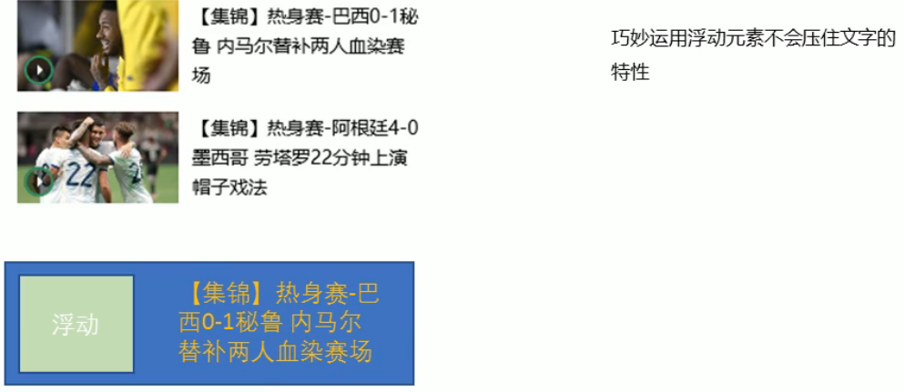

```html
<!DOCTYPE html>
<html lang="en">
<head>
    <meta charset="UTF-8">
    <meta name="viewport" content="width=device-width, initial-scale=1.0">
    <meta http-equiv="X-UA-Compatible" content="ie=edge">
    <title>文字围绕浮动元素的妙用</title>
    <style>
        * {
            margin: 0;
            padding: 0;
        }
        .box {
            width: 300px;
            height: 70px;
            background-color: pink;
            margin: 0 auto;
            padding: 5px;
        }
        .pic {
            float: left;
            width: 120px;
            height: 60px;
            margin-right: 5px;
        }
        .pic img {
            width: 100%;
        }
    </style>
</head>
<body>
    <div class="box">
        <div class="pic">
            
        </div>
        <p>【集锦】热身赛-巴西0-1秘鲁 内马尔替补两人血染赛场</p>
    </div>
</body>
</html>
```


### 3. 行内块巧妙运用

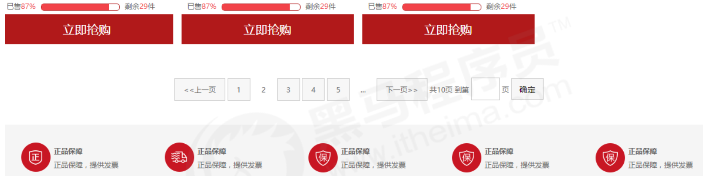

页码在页面中间显示:

1. 把这些链接盒子转换为行内块， 之后给父级指定 text-align:center;
2. 利用行内块元素中间有缝隙，并且给父级添加 text-align:center; 行内块元素会水平会居中

```html
<!DOCTYPE html>
<html lang="en">
<head>
    <meta charset="UTF-8">
    <meta name="viewport" content="width=device-width, initial-scale=1.0">
    <meta http-equiv="X-UA-Compatible" content="ie=edge">
    <title>行内块的巧妙运用</title>
    <style>
        * {
            margin: 0;
            padding: 0;
        }
        .box {
            text-align: center;
        }
        .box a {
            display: inline-block;
            width: 36px;
            height: 36px;
            background-color: #f7f7f7;
            border: 1px solid #ccc;
            text-align: center;
            line-height: 36px;
            text-decoration: none;
            color: #333;
            font-size: 14px;
        }
       .box .prev,
        .box .next {
            width: 85px;
        }
        .box .current,
        .box .elp {
            background-color: #fff;
            border: none;
        }
        .box input {
            height: 36px;
            width: 45px;
            border: 1px solid #ccc;
            outline: none;
        }
        .box button {
           width: 60px;
           height: 36px;
           background-color: #f7f7f7;
            border: 1px solid #ccc;
            
        }
    </style>
</head>
<body>
    <div class="box">
        <a href="#" class="prev">&lt;&lt;上一页</a>
        <a href="#" class="current">2</a>
        <a href="#">3</a>
        <a href="#">4</a>
        <a href="#">5</a>
        <a href="#">6</a>
        <a href="#" class="elp">...</a>
        <a href="#" class="next">&gt;&gt;下一页</a>
        到第 
        <input type="text">
        页
        <button>确定</button>
    </div>
</body>
</html>
```


### 4. CSS 三角强化

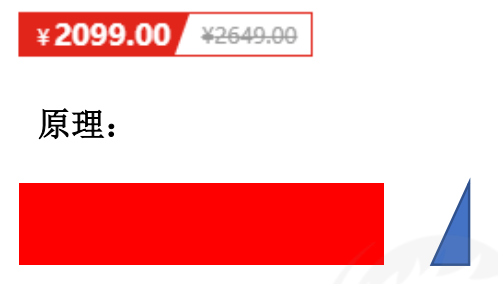

```html
<!DOCTYPE html>
<html lang="en">
<head>
    <meta charset="UTF-8">
    <meta name="viewport" content="width=device-width, initial-scale=1.0">
    <meta http-equiv="X-UA-Compatible" content="ie=edge">
    <title>CSS三角强化的巧妙运用</title>
    <style>
         .box1 {
            width: 0;
            height: 0;
            /* 把上边框宽度调大 */
            /* border-top: 100px solid transparent;
            border-right: 50px solid skyblue; */
            /* 左边和下边的边框宽度设置为0 */
            /* border-bottom: 0 solid blue;
            border-left: 0 solid green; */
           /* 1.只保留右边的边框有颜色 */
           border-color: transparent red transparent transparent;
            /* 2. 样式都是solid */
            border-style: solid;
            /* 3. 上边框宽度要大， 右边框 宽度稍小， 其余的边框该为 0 */
            border-width: 100px 50px 0 0 ;

        }
        .price {
            width: 160px;
            height: 24px;
            line-height: 24px;
            border: 1px solid red;
            margin: 0 auto;
        }
        .miaosha {
            position: relative;
            float: left;
            width: 90px;
            height: 100%;
            background-color:red;
            text-align: center;
            color: #fff;
            font-weight: 700;
            margin-right: 8px;

        }
        .miaosha i {
            position: absolute;
            right: 0;
            top: 0;
            width: 0;
            height: 0;
            border-color: transparent #fff transparent transparent;
            border-style: solid;
            border-width: 24px 10px 0 0;
        }
        .origin {
            font-size: 12px;
            color: gray;
            text-decoration: line-through;
        }
    </style>
</head>
<body>
        <div class="box1"></div>
        <div class="price">
            <span class="miaosha">
                ¥1650
                <i></i>
            </span>
            <span class="origin">¥5650</span>
        </div>
</body>
</html>
```


## 八、CSS初始化

不同浏览器对有些标签的默认值是不同的，为了消除不同浏览器对HTML文本呈现的差异，照顾浏览器的兼容，我们需要对CSS 初始化

简单理解： CSS初始化是指重设浏览器的样式。 (也称为CSS reset）

每个网页都必须首先进行 CSS初始化。

这里我们以 京东CSS初始化代码为例。

```css
/* 把我们所有标签的内外边距清零 */
* {
    margin: 0;
    padding: 0
}
/* em 和 i 斜体的文字不倾斜 */
em,
i {
    font-style: normal
}
/* 去掉li 的小圆点 */
li {
    list-style: none
}

img {
    /* border 0 照顾低版本浏览器 如果 图片外面包含了链接会有边框的问题 */
    border: 0;
    /* 取消图片底侧有空白缝隙的问题 */
    vertical-align: middle
}

button {
    /* 当我们鼠标经过button 按钮的时候，鼠标变成小手 */
    cursor: pointer
}

a {
    color: #666;
    text-decoration: none
}

a:hover {
    color: #c81623
}

button,
input {
    /* "\5B8B\4F53" 就是宋体的意思 这样浏览器兼容性比较好 */
    font-family: Microsoft YaHei, Heiti SC, tahoma, arial, Hiragino Sans GB, "\5B8B\4F53", sans-serif
}

body {
    /* CSS3 抗锯齿形 让文字显示的更加清晰 */
    -webkit-font-smoothing: antialiased;
    background-color: #fff;
    font: 12px/1.5 Microsoft YaHei, Heiti SC, tahoma, arial, Hiragino Sans GB, "\5B8B\4F53", sans-serif;
    color: #666
}

.hide,
.none {
    display: none
}
/* 清除浮动 */
.clearfix:after {
    visibility: hidden;
    clear: both;
    display: block;
    content: ".";
    height: 0
}

.clearfix {
    *zoom: 1
}
```

**Unicode编码字体：** 

把中文字体的名称用相应的Unicode编码来代替，这样就可以有效的避免浏览器解释CSS代码时候出现乱码的问题。 

比如： 

- 黑体 \9ED1\4F53
- 宋体 \5B8B\4F53
- 微软雅黑 \5FAE\8F6F\96C5\9ED1


# HTML5 和 CSS3 提高

## 一、HTML5 的新特性

HTML5 的新增特性主要是针对于以前的不足，增加了一些新的标签、新的表单和新的表单属性等。

这些新特性都有兼容性问题，基本是 IE9+ 以上版本的浏览器才支持，如果不考虑兼容性问题，可以大量使用这些新特性。


### 1. HTML5 新增的语义化标签

以前布局，我们基本用 div 来做。div 对于搜索引擎来说，是没有语义的。

```html
<div class=“header”> </div>
<div class=“nav”> </div>
<div class=“content”> </div>
<div class=“footer”> </div>
```

```html
<header>：头部标签
<nav>：导航标签
<article>：内容标签
<section>：定义文档某个区域
<aside>：侧边栏标签
<footer>：尾部标签
```

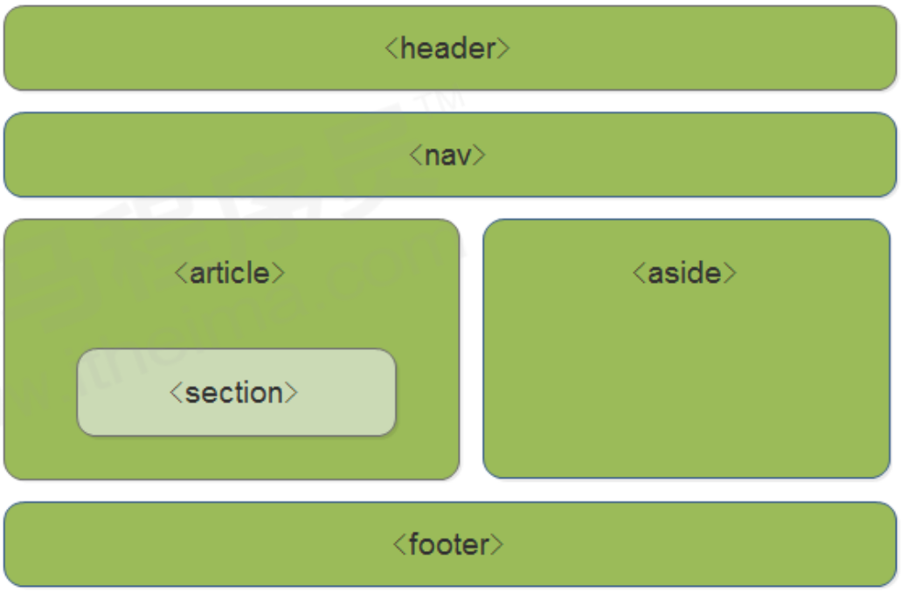

注意：

- 这种语义化标准主要是针对搜索引擎的
- 这些新标签页面中可以使用多次
- 在 IE9 中，需要把这些元素转换为块级元素
- 其实，我们移动端更喜欢使用这些标签
- HTML5 还增加了很多其他标签，我们后面再慢慢学


### 2. HTML5 新增的多媒体标签

新增的多媒体标签主要包含两个：

1. 音频：<audio>
2. 视频：<video>

使用它们可以很方便的在页面中嵌入音频和视频，而不再去使用 flash 和其他浏览器插件。

HTML5 在不使用插件的情况下，也可以原生的支持视频格式文件的播放，当然，支持的格式是有限的。


#### 2.1 视频< video >

当前 <video> 元素支持三种视频格式： 尽量使用 mp4格式

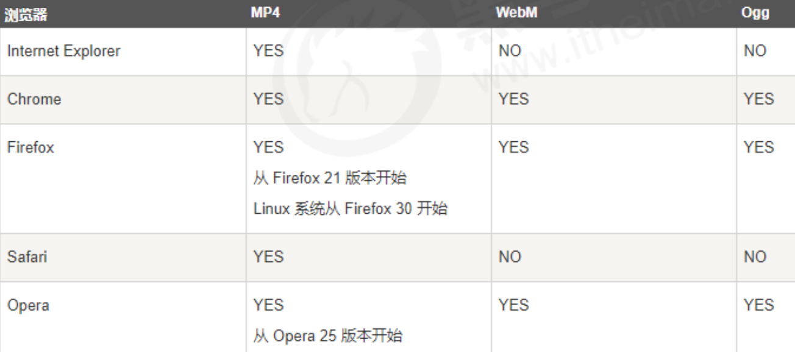


**语法**

```html
<video src="文件地址" controls="controls"></video>
```

```html
<video controls="controls" width="300">
    <source src="move.ogg" type="video/ogg" >
    <source src="move.mp4" type="video/mp4" >
    您的浏览器暂不支持 <video> 标签播放视频
</ video >
```


常见属性

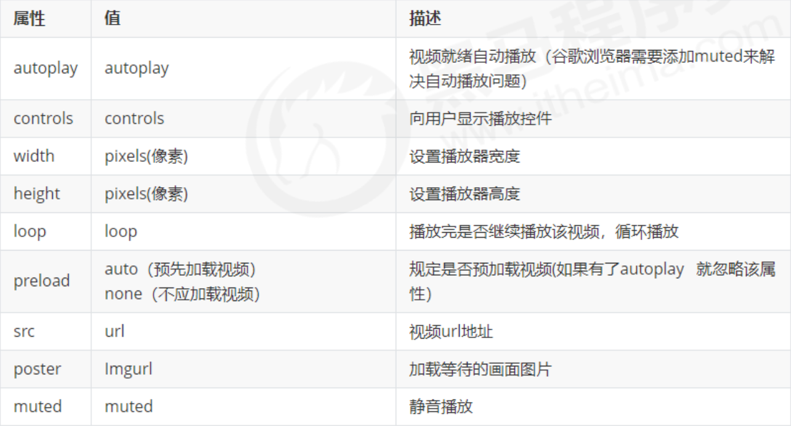


案例

```html
<!DOCTYPE html>
<html lang="en">
<head>
    <meta charset="UTF-8">
    <meta name="viewport" content="width=device-width, initial-scale=1.0">
    <meta http-equiv="X-UA-Compatible" content="ie=edge">
    <title>HTML5新增视频标签</title>
    <style>
        video {
            width: 100%;
        }
    </style>
</head>
<body>
    <video src="media/mi.mp4" autoplay="autoplay" muted="muted"  loop="loop" poster="media/mi9.jpg"></video>
</body>
</html>
```


#### 2.2 音频< audio >

当前 <audio> 元素支持三种音频格式：

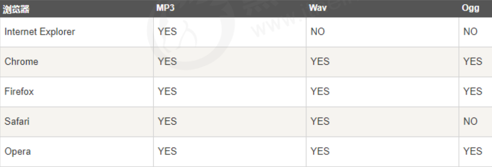


语法

```html
<audio src="文件地址" controls="controls"></audio>
```

```html
< audio controls="controls" >
     <source src="happy.mp3" type="audio/mpeg" >
     <source src="happy.ogg" type="audio/ogg" >
     您的浏览器暂不支持 <audio> 标签。
</ audio>
```


常见属性

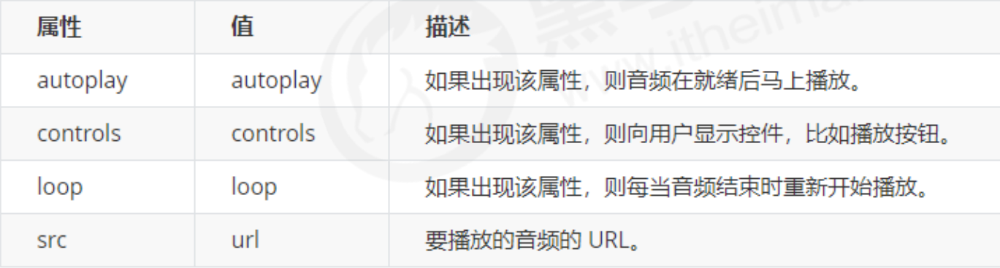


案例

```html
<!DOCTYPE html>
<html lang="en">
<head>
    <meta charset="UTF-8">
    <meta name="viewport" content="width=device-width, initial-scale=1.0">
    <meta http-equiv="X-UA-Compatible" content="ie=edge">
    <title>HTML5新增音频标签</title>
</head>
<body>
    <audio src="media/music.mp3" autoplay="autoplay" controls="controls"></audio>
</body>
</html>
```


#### 2.3 多媒体标签总结

- 音频标签和视频标签使用方式基本一致
- 浏览器支持情况不同
- 谷歌浏览器把音频和视频自动播放禁止了
- 我们可以给视频标签添加 muted 属性来静音播放视频，音频不可以（可以通过JavaScript解决）
- 视频标签是重点，我们经常设置自动播放，不使用 controls 控件，循环和设置大小属性


### 3. HTML5 新增的 input 类型

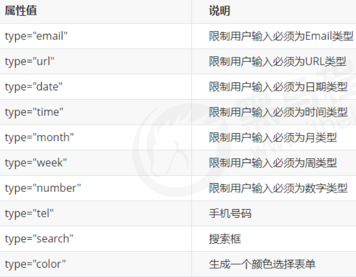

```html
<!DOCTYPE html>
<html lang="en">

<head>
    <meta charset="UTF-8">
    <meta name="viewport" content="width=device-width, initial-scale=1.0">
    <meta http-equiv="X-UA-Compatible" content="ie=edge">
    <title>Document</title>
</head>

<body>
    <!-- 我们验证的时候必须添加form表单域 -->
    <form action="">
        <ul>
            <li>邮箱: <input type="email" /></li>
            <li>网址: <input type="url" /></li>
            <li>日期: <input type="date" /></li>
            <li>时间: <input type="time" /></li>
            <li>数量: <input type="number" /></li>
            <li>手机号码: <input type="tel" /></li>
            <li>搜索: <input type="search" /></li>
            <li>颜色: <input type="color" /></li>
            <!-- 当我们点击提交按钮就可以验证表单了 -->
            <li> <input type="submit" value="提交"></li>
        </ul>
    </form>
</body>

</html>
```


### 4. HTML5 新增的表单属性

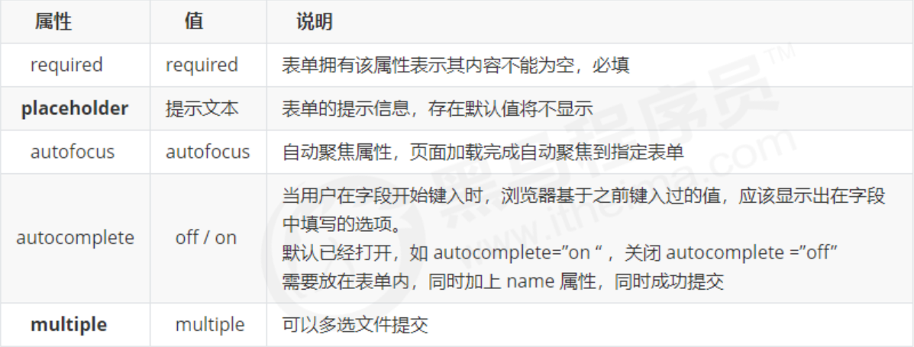

> 可以通过以下设置方式修改placeholder里面的字体颜色：
>
> input::placeholder {
> 	color: pink;
> }

```html
<!DOCTYPE html>
<html lang="en">
<head>
    <meta charset="UTF-8">
    <meta name="viewport" content="width=device-width, initial-scale=1.0">
    <meta http-equiv="X-UA-Compatible" content="ie=edge">
    <title>HTML5新增表单属性</title>
    <style>
        input::placeholder {
            color: pink;
        }
    </style>
</head>
<body>
    <form action="">
            <input type="search" name="sear" id="" required="required" placeholder="pink老师" autofocus="autofocus" autocomplete="off">
            <input type="file" name="" id="" multiple="multiple">
            <input type="submit" value="提交">
    </form>
  
</body>
</html>
```


## 二、CSS3的新特性


