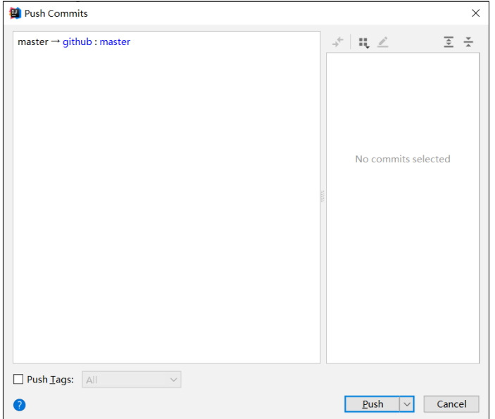
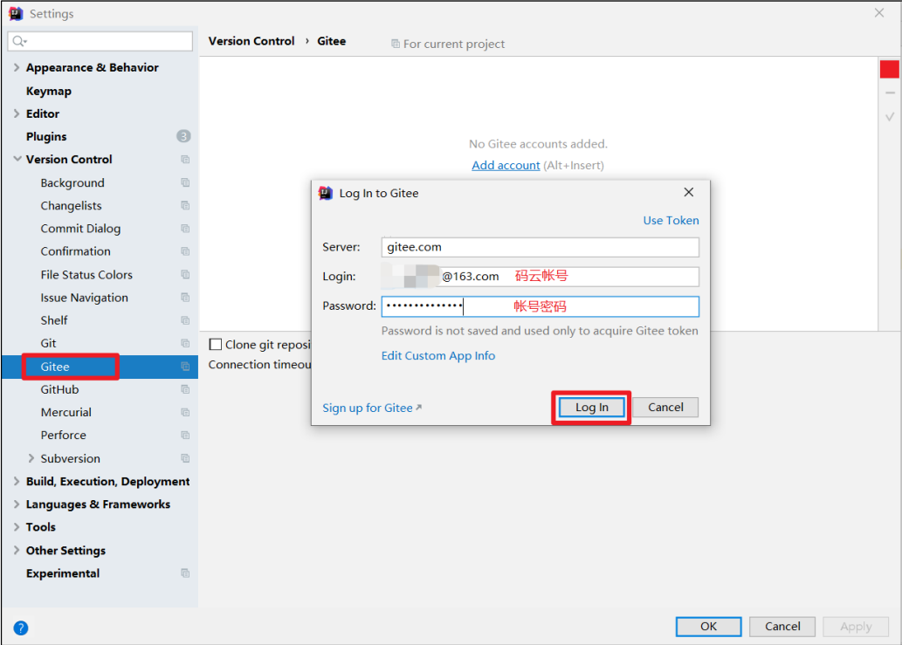

# Git / Github / Gitee码云 / GitLab 


## 一、Git 概述

Git 是一个免费的、开源的分布式版本控制系统，可以快速高效地处理从小型到大型的各种项目。
Git 易于学习，占地面积小，性能极快。 它具有廉价的本地库，方便的暂存区域和多个工作
流分支等特性。其性能优于 Subversion、CVS、Perforce 和 ClearCase 等版本控制工具。

### 1、何为版本控制

版本控制是一种记录文件内容变化，以便将来查阅特定版本修订情况的系统。
版本控制其实最重要的是可以记录文件修改历史记录，从而让用户能够查看历史版本，方便版本切换。


### 2、为什么需要版本控制

个人开发过渡到团队协作。


### 3、版本控制工具

➢ **集中式版本控制工具**	CVS、SVN(Subversion)、VSS……
集中化的版本控制系统诸如 CVS、SVN 等，都有一个单一的集中管理的服务器，保存所有文件的修订版本，而协同工作的人们都通过客户端连到这台服务器，取出最新的文件或者提交更新。多年以来，这已成为版本控制系统的标准做法。

这种做法带来了许多好处，每个人都可以在一定程度上看到项目中的其他人正在做些什么。而管理员也可以轻松掌控每个开发者的权限，并且管理一个集中化的版本控制系统，要远比在各个客户端上维护本地数据库来得轻松容易。

事分两面，有好有坏。这么做显而易见的缺点是中央服务器的单点故障。如果服务器宕机一小时，那么在这一小时内，谁都无法提交更新，也就无法协同工作。


➢ **分布式版本控制工具**	Git、Mercurial、Bazaar、Darcs……
像 Git 这种分布式版本控制工具，客户端提取的不是最新版本的文件快照，而是把代码仓库完整地镜像下来（本地库）。这样任何一处协同工作用的文件发生故障，事后都可以用其他客户端的本地仓库进行恢复。因为每个客户端的每一次文件提取操作，实际上都是一次对整个文件仓库的完整备份。

分布式的版本控制系统出现之后,解决了集中式版本控制系统的缺陷:
1.服务器断网的情况下也可以进行开发（因为版本控制是在本地进行的）
2.每个客户端保存的也都是整个完整的项目（包含历史记录，更加安全）


### 4、Git 简史


### 5、Git 工作机制


### 6、Git 和代码托管中心

代码托管中心是基于网络服务器的远程代码仓库，一般我们简单称为**远程库**。

➢ **局域网**
✓ GitLab

➢ **互联网**
✓ GitHub（外网）
✓ Gitee 码云（国内网站）


## 二、Git安装

官网地址： https://git-scm.com/ 
查看 GNU 协议，可以直接点击下一步。


在 Git Bash 终端里输入 git --version 查看 git 版本，如图所示，说明 Git 安装成功。

## 三、git常用命令

| 命令名称                             | 作用           |
| ------------------------------------ | -------------- |
| git config --global user.name 用户名 | 设置用户签名   |
| git config --global user.email 邮箱  | 设置用户签名   |
| git init                             | 初始化本地库   |
| git status                           | 查看本地库状态 |
| git add 文件名                       | 添加到暂存区   |
| git commit -m "日志信息" 文件名      | 提交到本地库   |
| git reflog                           | 查看历史记录   |
| git reset --hard 版本号              | 版本穿梭       |

### 1.设置用户签名

1）基本语法 
git config --global user.name 用户名 
git config --global user.email 邮箱

2）案例实操 
全局范围的签名设置：

```git
34782@isjhd MINGW32 ~/Desktop
$ git config --global user.email 3478215435@qq.com

34782@isjhd MINGW32 ~/Desktop
$ git config --global user.name isjhd
```

说明： 签名的作用是区分不同操作者身份。用户的签名信息在每一个版本的提交信息中能够看到，以此确认本次提交是谁做的。Git 首次安装必须设置一下用户签名，否则无法提交代码。

注意：这里设置用户签名和将来登录 GitHub（或其他代码托管中心）的账号没有任 何关系。

### 2.初始化本地库

1）基本语法
git init

2）案例实操

```git
34782@isjhd MINGW32 /d/note/git/Git-Space/git-demo
$ git init
Initialized empty Git repository in D:/note/git/Git-Space/git-demo/.git/

34782@isjhd MINGW32 /d/note/git/Git-Space/git-demo (master)
$ ll -a
total 4
drwxr-xr-x 1 34782 197609 0 May  6 09:00 ./
drwxr-xr-x 1 34782 197609 0 May  6 08:58 ../
drwxr-xr-x 1 34782 197609 0 May  6 09:00 .git/
```

3）结果查看


### 3.查看本地库状态

1）基本语法
git status

2）案例实操
3.1 首次查看（工作区没有任何文件）

```git
34782@isjhd MINGW32 /d/note/git/Git-Space/git-demo (master)
$ git status
On branch master

No commits yet

nothing to commit (create/copy files and use "git add" to track)

```

3.2 新增文件（hello.txt）

```git
34782@isjhd MINGW32 /d/note/git/Git-Space/git-demo (master)
$ cat hello.txt
hello world

hello world
hello world
hello world
hello world
hello world
hello world
hello world
hello world
hello world
```

3.3 再次查看（检测到未追踪的文件）

```git
34782@isjhd MINGW32 /d/note/git/Git-Space/git-demo (master)
$ git status
On branch master

No commits yet

Untracked files:
  (use "git add <file>..." to include in what will be committed)
        hello.txt

nothing added to commit but untracked files present (use "git add" to track)
```


### 4.添加暂存区

**将工作区的文件添加到暂存区**

1）基本语法 
git add 文件名 

2）案例实操

```git
34782@isjhd MINGW32 /d/note/git/Git-Space/git-demo (master)
$ git add hello.txt
warning: LF will be replaced by CRLF in hello.txt.
The file will have its original line endings in your working directory
```


**查看状态（检测到暂存区有新文件）**

```git
34782@isjhd MINGW32 /d/note/git/Git-Space/git-demo (master)
$ git status
On branch master

No commits yet

Changes to be committed:
  (use "git rm --cached <file>..." to unstage)
        new file:   hello.txt
```


### 5.提交本地库

**将暂存区的文件提交到本地库**

1）基本语法
git commit -m "日志信息" 文件名

2）案例实操

```git
34782@isjhd MINGW32 /d/note/git/Git-Space/git-demo (master)
$ git commit -m "first commit" hello.txt
warning: LF will be replaced by CRLF in hello.txt.
The file will have its original line endings in your working directory
[master (root-commit) 7342cb4] first commit
 1 file changed, 18 insertions(+)
 create mode 100644 hello.txt
```

**查看状态（没有文件需要提交）**

```git
34782@isjhd MINGW32 /d/note/git/Git-Space/git-demo (master)
$ git status
On branch master
nothing to commit, working tree clean
```


### 6.修改文件（hello.txt）

```git
34782@isjhd MINGW32 /d/note/git/Git-Space/git-demo (master)
$ vim hello.txt
hello git! hello atguigu! 2222222222222
hello git! hello atguigu!
hello git! hello atguigu!
hello git! hello atguigu!
hello git! hello atguigu!
hello git! hello atguigu!
```

**查看状态（检测到工作区有文件被修改）**

```git
34782@isjhd MINGW32 /d/note/git/Git-Space/git-demo (master)
$ git status
On branch master
Changes not staged for commit:
  (use "git add <file>..." to update what will be committed)
  (use "git restore <file>..." to discard changes in working directory)
        modified:   hello.txt

no changes added to commit (use "git add" and/or "git commit -a")
```

**将修改的文件再次添加暂存区**

```git
34782@isjhd MINGW32 /d/note/git/Git-Space/git-demo (master)
$ git add hello.txt
warning: LF will be replaced by CRLF in hello.txt.
The file will have its original line endings in your working directory
```

**查看状态（工作区的修改添加到了暂存区）**

```git
34782@isjhd MINGW32 /d/note/git/Git-Space/git-demo (master)
$ git status
On branch master
Changes to be committed:
  (use "git restore --staged <file>..." to unstage)
        modified:   hello.txt
```


### 7.历史版本

**查看历史版本**

1）基本语法
git reflog 查看版本信息
git log 查看版本详细信息

2）案例实操

```git
34782@isjhd MINGW32 /d/note/git/Git-Space/git-demo (master)
$ git reflog
8ba6728 (HEAD -> master) HEAD@{0}: commit: second commit
7342cb4 HEAD@{1}: commit (initial): first commit
```

**版本穿梭**

1）基本语法 
git reset --hard 版本号

2）案例实操

```git
--首先查看当前的历史记录，可以看到当前是在 087a1a7 这个版本
34782@isjhd MINGW32 /d/note/git/Git-Space/git-demo (master)
$ git reflog
8ba6728 (HEAD -> master) HEAD@{0}: commit: second commit
7342cb4 HEAD@{1}: commit (initial): first commit

--切换到 7342cb4 版本，也就是我们第一次提交的版本
34782@isjhd MINGW32 /d/note/git/Git-Space/git-demo (master)
$ git reset --hard 7342cb4
HEAD is now at 7342cb4 first commit

--切换完毕之后再查看历史记录，当前成功切换到了 7342cb4 版本
34782@isjhd MINGW32 /d/note/git/Git-Space/git-demo (master)
$ git reflog
7342cb4 (HEAD -> master) HEAD@{0}: reset: moving to 7342cb4
8ba6728 HEAD@{1}: commit: second commit
7342cb4 (HEAD -> master) HEAD@{2}: commit (initial): first commit


```

Git 切换版本，底层其实是移动的 HEAD 指针


## 四、Git分支操作


### 1.什么是分支

在版本控制过程中，同时推进多个任务，为每个任务，我们就可以创建每个任务的单独 分支。使用分支意味着程序员可以把自己的工作从开发主线上分离开来，开发自己分支的时 候，不会影响主线分支的运行。对于初学者而言，分支可以简单理解为副本，一个分支就是 一个单独的副本。（分支底层其实也是指针的引用）


### 2.分支的好处

同时并行推进多个功能开发，提高开发效率。 

各个分支在开发过程中，如果某一个分支开发失败，不会对其他分支有任何影响。失败 的分支删除重新开始即可。

### 3.分支的操作

| 命令名称            | 作用                         |
| ------------------- | ---------------------------- |
| git branch 分支名   | 创建分支                     |
| git branch -v       | 查看分支                     |
| git checkout 分支名 | 切换分支                     |
| git merge 分支名    | 把指定的分支合并到当前分支上 |

#### 3.1查看分支

1）基本语法
git branch -v

2）案例实操

```git
34782@isjhd MINGW32 /d/note/git/Git-Space/git-demo (master)
$ git branch -v
* master 7342cb4 first commit	（*代表当前所在的分区）
```

#### 3.2创建分支

1）基本语法
git branch 分支名

2）案例实操

```git
34782@isjhd MINGW32 /d/note/git/Git-Space/git-demo (master)
$ git branch hot-fix

34782@isjhd MINGW32 /d/note/git/Git-Space/git-demo (master)
$ git branch -v
  hot-fix 7342cb4 first commit	（刚创建的新的分支，并将主分支 master的内容复制了一份）
* master  7342cb4 first commit
```


#### 3.3修改分支

```git
--在 maste 分支上做修改
34782@isjhd MINGW32 /d/note/git/Git-Space/git-demo (hot-fix)
$ vim hello.txt
--添加暂存区
34782@isjhd MINGW32 /d/note/git/Git-Space/git-demo (hot-fix)
$ git add hello.txt
--提交本地库
34782@isjhd MINGW32 /d/note/git/Git-Space/git-demo (hot-fix)
$ git commit -m "third" hello.txt
[hot-fix f0ecbdb] third
 1 file changed, 1 insertion(+), 1 deletion(-)
--查看分支
34782@isjhd MINGW32 /d/note/git/Git-Space/git-demo (hot-fix)
$ git branch -v
* hot-fix f0ecbdb third		(已更新)
  master  7342cb4 first commit
```


#### 3.4切换分支

1）基本语法
git checkout 分支名

2）案例实操

```git
34782@isjhd MINGW32 /d/note/git/Git-Space/git-demo (master)
$ git checkout hot-fix
Switched to branch 'hot-fix'
```


#### 3.5合并分支

1）基本语法
git merge 分支名

2）案例实操 在 master 分支上合并 hot-fix 分支

```git
34782@isjhd MINGW32 /d/note/git/Git-Space/git-demo (master)
$ git merge hot-fix
Updating 7342cb4..f0ecbdb
Fast-forward
 hello.txt | 2 +-
 1 file changed, 1 insertion(+), 1 deletion(-)
```


#### 3.6产生冲突

冲突产生的表现：后面状态为 MERGING

冲突产生的原因： 
合并分支时，两个分支在同一个文件的同一个位置有两套完全不同的修改。Git无法替我们决定使用哪一个。必须人为决定新代码内容。

冲突的解决办法有所不同，建议百度


### 4.创建分支和切换分支图解

master、hot-fix 其实都是指向具体版本记录的指针。当前所在的分支，其实是由 HEAD 决定的。所以创建分支的本质就是多创建一个指针。

HEAD 如果指向 master，那么我们现在就在 master 分支上。 

HEAD 如果执行 hotfix，那么我们现在就在 hotfix 分支上。

所以切换分支的本质就是移动 HEAD 指针。


## 五、Git 团队协作机制

### 1.团队内协作


### 2.跨团队协作


## 六、GitHub操作

GitHub 网址：https://github.com/

Ps:全球最大同性交友网站，技术宅男的天堂，新世界的大门，你还在等什么?

### 1.创建远程仓库


### 2.远程仓库操作

| 命令名称                           |                                                           |
| ---------------------------------- | --------------------------------------------------------- |
| git remote -v                      | 查看当前所有远程地址别名                                  |
| git remote add 别名 远程地址       | 起别名                                                    |
| git push 别名 分支                 | 推送本地分支上的内容到远程仓库                            |
| git clone 远程地址                 | 将远程仓库的内容克隆到本地                                |
| git pull 远程库地址别名 远程分支名 | 将远程仓库对于分支最新内容拉下来后与 当前本地分支直接合并 |

#### 2.1创建远程仓库别名

1）基本语法
git remote -v 查看当前所有远程地址别名
git remote add 别名 远程地址

2）案例实操

```git
34782@isjhd MINGW32 /d/note/git/Git-Space/git-demo (master)
$ git remote add git-demo https://github.com/isjhd/git-demo.git

34782@isjhd MINGW32 /d/note/git/Git-Space/git-demo (master)
$ git remote -v
git-demo        https://github.com/isjhd/git-demo.git (fetch)
git-demo        https://github.com/isjhd/git-demo.git (push)
```

这个地址在创建完远程仓库后生成的连接，如图所示红框中


#### 2.2推送本地分支到远程仓库

1）基本语法
git push 别名 分支

2）案例实操

出现报错：SSL certificate problem: unable to get local issuer certificate
解决办法：显示ssh安全证书的 输入 git config --global http.sslverify false

```git
34782@isjhd MINGW32 /d/note/git/Git-Space/git-demo (master)
$ git push git-demo master
warning: ----------------- SECURITY WARNING ----------------
warning: | TLS certificate verification has been disabled! |
warning: ---------------------------------------------------
warning: HTTPS connections may not be secure. See https://aka.ms/gcmcore-tlsverify for more information.
warning: ----------------- SECURITY WARNING ----------------
warning: | TLS certificate verification has been disabled! |
warning: ---------------------------------------------------
warning: HTTPS connections may not be secure. See https://aka.ms/gcmcore-tlsverify for more information.
Enumerating objects: 15, done.
Counting objects: 100% (15/15), done.
Delta compression using up to 8 threads
Compressing objects: 100% (10/10), done.
Writing objects: 100% (15/15), 1.09 KiB | 557.00 KiB/s, done.
Total 15 (delta 5), reused 0 (delta 0), pack-reused 0
remote: Resolving deltas: 100% (5/5), done.
To https://github.com/isjhd/git-demo.git
 * [new branch]      master -> master
```

此时发现已将我们 master 分支上的内容推送到 GitHub 创建的远程仓库。


#### 2.3克隆远程仓库到本地

1）基本语法
git clone 远程地址

2）案例实操

```git
34782@isjhd MINGW32 /d/note/git/Git-lhc
$ git clone https://github.com/isjhd/git-demo.git
Cloning into 'git-demo'...
remote: Enumerating objects: 18, done.
remote: Counting objects: 100% (18/18), done.
remote: Compressing objects: 100% (7/7), done.
remote: Total 18 (delta 6), reused 14 (delta 5), pack-reused 0
Receiving objects: 100% (18/18), done.
Resolving deltas: 100% (6/6), done.
```

克隆结果：初始化本地仓库

```git
34782@isjhd MINGW32 /d/note/git/Git-lhc/git-demo (master)
$ git remote -v
origin  https://github.com/isjhd/git-demo.git (fetch)
origin  https://github.com/isjhd/git-demo.git (push)
```

小结：clone 会做如下操作。1、拉取代码。2、初始化本地仓库。3、创建别名


#### 2.4 邀请加入团队

**选择邀请合作者**

**填入想要合作的人**

复 制 地 址 并 通 过 微 信 钉 钉 等 方 式 发 送 给 该 用 户 ， 复 制 内 容 如 下 ：

在 atguigulinghuchong 这个账号中的地址栏复制收到邀请的链接，点击接受邀请。

成功之后可以在 atguigulinghuchong 这个账号上看到 git-Test 的远程仓库。


#### 2.5 拉取远程库内容

1）基本语法
git pull 远程库地址别名 远程分支名

2）案例实操

```git
--将远程仓库对于分支最新内容拉下来后与当前本地分支直接合并
Layne@LAPTOP-Layne MINGW64 /d/Git-Space/SH0720 (master)
$ git pull ori master
remote: Enumerating objects: 5, done.
remote: Counting objects: 100% (5/5), done.
remote: Compressing objects: 100% (1/1), done.
remote: Total 3 (delta 1), reused 3 (delta 1), pack-reused 0
Unpacking objects: 100% (3/3), done.
From https://github.com/atguiguyueyue/git-shTest
* branch master -> FETCH_HEAD
 7cb4d02..5dabe6b master -> ori/master
Updating 7cb4d02..5dabe6b
Fast-forward
hello.txt | 2 +-
1 file changed, 1 insertion(+), 1 deletion(-)
```


### 3.跨团队协作

1）将远程仓库的地址复制发给邀请跨团队协作的人，比如东方不败。

2）在东方不败的 GitHub 账号里的地址栏复制收到的链接，然后点击 Fork 将项目叉到自己的本地仓库。


3）东方不败就可以在线编辑叉取过来的文件。

5）接下来点击上方的 Pull 请求，并创建一个新的请求。


6）回到岳岳 GitHub 账号可以看到有一个 Pull request 请求。进入到聊天室，可以讨论代码相关内容。


7）如果代码没有问题，可以点击 Merge pull reque 合并代码。


### 4. SSH 免密登录

我们可以看到远程仓库中还有一个 SSH 的地址，因此我们也可以使用 SSH 进行访问。

```git
34782@isjhd MINGW32 ~
$ ssh-keygen -t rsa -C 3478215435@qq.com
Generating public/private rsa key pair.
Enter file in which to save the key (/c/Users/34782/.ssh/id_rsa):
Created directory '/c/Users/34782/.ssh'.
Enter passphrase (empty for no passphrase):
Enter same passphrase again:
Your identification has been saved in /c/Users/34782/.ssh/id_rsa
Your public key has been saved in /c/Users/34782/.ssh/id_rsa.pub
The key fingerprint is:
SHA256:Rv3cCqNJlnwkMc/9JxPfRMF0PlAeYUDXzoInlC4L2+I 3478215435@qq.com
The key's randomart image is:
+---[RSA 3072]----+
|        o   .==O*|
|         * .o =++|
|        o =o...=o|
|       o.+.o+oo+=|
|        S++ooo=.+|
|       +o+oo . + |
|       .o.  .    |
|        E        |
|                 |
+----[SHA256]-----+
34782@isjhd MINGW32 ~
$ cd .ssh
34782@isjhd MINGW32 ~/.ssh
$ ll -a
total 17
drwxr-xr-x 1 34782 197609    0 May  7 16:11 ./
drwxr-xr-x 1 34782 197609    0 May  7 16:11 ../
-rw-r--r-- 1 34782 197609 2602 May  7 16:11 id_rsa
-rw-r--r-- 1 34782 197609  571 May  7 16:11 id_rsa.pub
34782@isjhd MINGW32 ~/.ssh
$ cat id_rsa.pub
ssh-rsa AAAAB3NzaC1yc2EAAAADAQABAAABgQDOhkw4LRMWm8jPd5aBSuKMQX9Yu6+9UhsuM1P5xqvkd5IDccvnc8Iombzz3DjilhAwd8hEMMUclziG8sMjvVk1lXOWHZ9iVMcFfleXM6zeVCbUqvRUtG8PiH2Ftpkkat4apkDq2U4v/j4urMvhCzFhdZwICZPhMNNyQ2FbIiPTDrUHI1B9l2qulc3SzIhTz8I6cF8ypiCpUkIKVJ6D4EsaC9Ym7OhskBoBoj7GeRX57SGOnTvuquTZ46cTXK1Hz5vPsGra4kalXXweYVvfU7Rnl8AKlrIGfdxTMdtTpsCvwfr4F30MW2/+y2Pq+rVzRLcgNkkBmAWR46A00douF6xeM6RPiKhFHUcnsHfjzTs54D5++NA7RPki913uQpPDVmC/OwKnRGgd2njMp83dLpBloFlW9BeR6qW75m/5D3/ix7/Rq6mTHb/2WjehYYoQREmyPAsgGnZMblRc+ezL8Sj/XrVvGsifT3HtNPDSys+JhW37m59Gxap+wk/hRl/XBuk= 3478215435@qq.com
```

复制 id_rsa.pub 文件内容，登录 GitHub，点击用户头像→Settings→SSH and GPG keys


## 七、IDEA 集成 Git

### 1.配置 Git 忽略文件

**IDEA 特定文件**


**Maven 工程的 target 目录**


**问题 1:为什么要忽略他们？**
答：与项目的实际功能无关，不参与服务器上部署运行。把它们忽略掉能够屏蔽 IDE 工具之间的差异。

**问题 2：怎么忽略？**
1）创建忽略规则文件 xxxx.ignore（前缀名随便起，建议是 git.ignore）

这个文件的存放位置原则上在哪里都可以，为了便于让~/.gitconfig 文件引用，建议也放在用户家目录下

git.ignore 文件模版内容如下：

```git
# Compiled class file
*.class
# Log file
*.log

# BlueJ files
*.ctxt

# Mobile Tools for Java (J2ME)
.mtj.tmp/

# Package Files #
*.jar
*.war
*.nar
*.ear
*.zip
*.tar.gz
*.rar

# virtual machine crash logs, see
http://www.java.com/en/download/help/error_hotspot.xml
hs_err_pid*

.classpath
.project
.settings
target
.idea
*.iml
```

2）在.gitconfig 文件中引用忽略配置文件（此文件在 Windows 的家目录中）

```git
[user]
name = Layne
email = Layne@atguigu.com
[core]
excludesfile = C:/Users/asus/git.ignore
注意：这里要使用“正斜线（/）”，不要使用“反斜线（\）”
```


### 2.定位 Git 程序


### 3.初始化本地库


选择要创建 Git 本地仓库的工程。


### 4.添加到暂存区

右键点击项目选择 Git -> Add 将项目添加到暂存区。


### 5.提交到本地库


### 6.切换版本


### 7.创建分支


### 8.切换分支


### 9.合并分支

在 IDEA 窗口的右下角，将 hot-fix 分支合并到当前 master 分支。

如果代码没有冲突，分支直接合并成功，分支合并成功以后，代码自动提交，无需手动提交本地库。


### 10.解决冲突

如图所示，如果 master 分支和 hot-fix 分支都修改了代码，在合并分支的时候就会发生冲突。


代码冲突解决，自动提交本地库。


## 八、IDEA 集成 GitHub

### 1.设置 GitHub 账号


### 2.分享工程到 GitHub


### 3.push 推送本地库到远程库





### 4.pull 拉取远程库到本地库

右键点击项目，可以将远程仓库的内容 pull 到本地仓库。


注意：pull 是拉取远端仓库代码到本地，如果远程库代码和本地库代码不一致，会自动合并，如果自动合并失败，还会涉及到手动解决冲突的问题。


### 5.clone 克隆远程库到本地


## 九、国内代码托管中心-码云

### 1.简介

众所周知，GitHub 服务器在国外，使用 GitHub 作为项目托管网站，如果网速不好的话， 严重影响使用体验，甚至会出现登录不上的情况。针对这个情况，大家也可以使用国内的项 目托管网站-码云。

码云是开源中国推出的基于 Git 的代码托管服务中心，网址是 https://gitee.com/ ，使用 方式跟 GitHub 一样，而且它还是一个中文网站，如果你英文不是很好它是最好的选择。


### 2.码云创建远程库

点击首页右上角的加号，选择下面的新建仓库

填写仓库名称，路径和选择是否开源（共开库或私有库）

远程库创建好以后，就可以看到 HTTPS 和 SSH 的链接。


### 3.IDEA 集成码云

#### IDEA 安装码云插件

Idea 默认不带码云插件，我们第一步要安装 Gitee 插件。 
在 Idea 插件商店搜索 Gitee，然后点击右侧的 Install 按钮。

然后在码云插件里面添加码云帐号，我们就可以用 Idea 连接码云了。

#### IDEA 连接码云

Idea 连接码云和连接 GitHub 几乎一样，首先在 Idea 里面创建一个工程，初始化 git 工 程，然后将代码添加到暂存区，提交到本地库，这些步骤上面已经讲过，此处不再赘述。


### 4.码云复制 GitHub 项目

码云提供了直接复制 GitHub 项目的功能，方便我们做项目的迁移和下载。
具体操作如下：

将 GitHub 的远程库 HTTPS 链接复制过来，点击创建按钮即可。

如果 GitHub 项目更新了以后，在码云项目端可以手动重新同步，进行更新！


## 十、自建代码托管平台-GitLab

### 1.GitLab 简介

GitLab 是由 GitLabInc.开发，使用 MIT 许可证的基于网络的 Git 仓库管理工具，且具有 wiki 和 issue 跟踪功能。使用 Git 作为代码管理工具，并在此基础上搭建起来的 web 服务。 

GitLab 由乌克兰程序员 DmitriyZaporozhets 和 ValerySizov 开发，它使用 Ruby 语言写 成。后来，一些部分用 Go 语言重写。截止 2018 年 5 月，该公司约有 290 名团队成员，以 及 2000 多名开源贡献者。GitLab 被 IBM，Sony，JülichResearchCenter，NASA，Alibaba， Invincea，O’ReillyMedia，Leibniz-Rechenzentrum(LRZ)，CERN，SpaceX 等组织使用。

### 2.GitLab 官网地址

官网地址：https://about.gitlab.com/ 
安装说明：https://about.gitlab.com/installation/

### 3.GitLab 安装

#### 3.1服务器准备

准备一个系统为 CentOS7 以上版本的服务器，要求内存 4G，磁盘 50G。
关闭防火墙，并且配置好主机名和 IP，保证服务器可以上网。

#### 3.2安装包准备

Yum 在线安装 gitlab- ce 时，需要下载几百 M 的安装文件，非常耗时，所以最好提前把所需 RPM 包下载到本地，然后使用离线 rpm 的方式安装。

下载地址： https://packages.gitlab.com/gitlab/gitlabce/packages/el/7/gitlab-ce-13.10.2-ce.0.el7.x86_64.rpm 
注：资料里提供了此 rpm 包，直接将此包上传到服务器/opt/module 目录下即可。

#### 3.3编写安装脚本

安装 gitlab 步骤比较繁琐，因此我们可以参考官网编写 gitlab 的安装脚本。

```
[root@gitlab-server module]# vim gitlab-install.sh
sudo rpm -ivh /opt/module/gitlab-ce-13.10.2-ce.0.el7.x86_64.rpm
sudo yum install -y curl policycoreutils-python openssh-server cronie
sudo lokkit -s http -s ssh
sudo yum install -y postfix
sudo service postfix start
sudo chkconfig postfix on
curl https://packages.gitlab.com/install/repositories/gitlab/gitlabce/script.rpm.sh | sudo bash
sudo EXTERNAL_URL="http://gitlab.example.com" yum -y install gitlab-ce

```

**给脚本增加执行权限**

```
[root@gitlab-server module]# chmod +x gitlab-install.sh
[root@gitlab-server module]# ll
总用量 403104
-rw-r--r--. 1 root root 412774002 4 月 7 15:47 gitlab-ce-13.10.2-
ce.0.el7.x86_64.rpm
-rwxr-xr-x. 1 root root 416 4 月 7 15:49 gitlab-install.sh
```

**然后执行该脚本，开始安装 gitlab-ce。注意一定要保证服务器可以上网。**

```
[root@gitlab-server module]# ./gitlab-install.sh
警告：/opt/module/gitlab-ce-13.10.2-ce.0.el7.x86_64.rpm: 头 V4
RSA/SHA1 Signature, 密钥 ID f27eab47: NOKEY
准备中... #################################
[100%]
正在升级/安装...
 1:gitlab-ce-13.10.2-ce.0.el7
################################# [100%]
。 。 。 。 。 。
```


#### 3.4初始化 GitLab 服务

执行以下命令初始化 GitLab 服务，过程大概需要几分钟，耐心等待…

```
[root@gitlab-server module]# gitlab-ctl reconfigure
。 。 。 。 。 。
Running handlers:
Running handlers complete
Chef Client finished, 425/608 resources updated in 03 minutes 08
seconds
gitlab Reconfigured!
```


#### 3.5启动 GitLab 服务

执行以下命令启动 GitLab 服务，如需停止，执行 gitlab-ctl stop

```
[root@gitlab-server module]# gitlab-ctl start
ok: run: alertmanager: (pid 6812) 134s
ok: run: gitaly: (pid 6740) 135s
ok: run: gitlab-monitor: (pid 6765) 135s
ok: run: gitlab-workhorse: (pid 6722) 136s
ok: run: logrotate: (pid 5994) 197s
ok: run: nginx: (pid 5930) 203s
ok: run: node-exporter: (pid 6234) 185s
ok: run: postgres-exporter: (pid 6834) 133s
ok: run: postgresql: (pid 5456) 257s
ok: run: prometheus: (pid 6777) 134s
ok: run: redis: (pid 5327) 263s
ok: run: redis-exporter: (pid 6391) 173s
ok: run: sidekiq: (pid 5797) 215s
ok: run: unicorn: (pid 5728) 221s
```


#### 3.6使用浏览器访问 GitLab

使用主机名或者 IP 地址即可访问 GitLab 服务。需要提前配一下 windows 的 hosts 文件。


首次登陆之前，需要修改下 GitLab 提供的 root 账户的密码，要求 8 位以上，包含大小 写子母和特殊符号。

然后使用修改后的密码登录 GitLab


#### 3.7GitLab 创建远程库


#### 3.8 IDEA 集成 GitLab

1）安装 GitLab 插件

2）设置 GitLab 插件


3）push 本地代码到 GitLab 远程库

自定义远程连接


注意：gitlab 网页上复制过来的连接是：http://gitlab.example.com/root/git-test.git，
需要手动修改为：http://gitlab-server/root/git-test.git
选择 gitlab 远程连接，进行 push。


首次向连接 gitlab，需要登录帐号和密码，用 root 帐号和我们修改的密码登录即可。


代码 Push 成功。


