# javaSE

## 一、Java 概述

### 1.Java 技术体系平台


### 2.Java 重要特点

1) Java 语言是面向对象的(oop)
2) Java 语言是健壮的。Java 的强类型机制、异常处理、垃圾的自动收集等是 Java 程序健壮性的重要保证
3) Java 语言是**跨平台性的**。[即: 一个编译好的.class 文件可以在多个系统下运行，这种特性称为跨平台]

4) Java 语言是解释型的[了解]
   **解释性语言**：javascript,PHP, java。 **编译性语言**: c / c++
   区别是：解释性语言，编译后的代码，不能直接被机器执行,需要解释器来执行, 编译性语言, 编译后的代码, 可以直接被机器执行, c /c++


### 3.Java 的开发工具


### 4.Java 运行机制及运行过程

#### Java 语言的特点：跨平台性


#### Java 核心机制-Java 虚拟机 [JVM java virtual machine]

基本介绍

1) JVM 是一个虚拟的计算机，具有指令集并使用不同的存储区域。负责执行指令，管理数据、内存、寄存器，包含在JDK 中. 
2) 对于不同的平台，有不同的虚拟机。
3) Java 虚拟机机制屏蔽了底层运行平台的差别，实现了“一次编译，到处运行” [说明]


### 5.什么是 JDK，JRE

#### JDK 基本介绍

1) JDK 的全称(Java Development Kit Java 开发工具包)
JDK = JRE + java 的开发工具 [java, javac,javadoc,javap 等]
2) JDK 是提供给 Java 开发人员使用的，其中包含了 java 的开发工具，也包括了 JRE。所以安装了JDK，就不用在单独安装 JRE 了。

#### JRE 基本介绍

1) JRE(Java Runtime Environment Java 运行环境)
JRE = JVM + Java 的核心类库[类]
2) 包括 Java 虚拟机(JVM Java Virtual Machine)和 Java 程序所需的核心类库等，如果想要运行一个开发好的Java 程序，计算机中只需要安装 JRE 即可。

#### JDK、JRE 和 JVM 的包含关系

1) **JDK = JRE + 开发工具集**（例如 Javac,java 编译工具等)
2) **JRE = JVM + Java SE 标准类库**（java 核心类库）
3) 如果只想运行开发好的 .class 文件 只需要 JRE


### 6.下载、安装 JDK

自己去B站找


### 7.配置环境变量 path

#### 为什么要配置 path


#### 配置环境变量 path 的步骤


### 8.Java 快速入门

#### 需求说明

要求开发一个 Hello.java 程序，可以输出 "hello,world!"

#### 开发步骤

1) 将 Java 代码编写到扩展名为 Hello.java 的文件中。[代码说明]
2) 通过 javac 命令对该 java 文件进行编译，生成 .class 文件。
3) 通过 java 命令对生成的 class 文件进行运行。

#### 运行原理示意图


### 9.Java 开发快速入门


```java
//这是java的快速入门， 演示java的开发步骤
//对代码的相关说明
//1. public class Hello 表示Hello是一个类,是一个public公有的类
//2. Hello{ } 表示一个类的开始和结束
//3. public static void main(String[] args) 表示一个主方法,即我们程序的入口
//4. main() {} 表示方法的开始和结束
//5. System.out.println("hello,world~"); 表示输出"hello,world~"到屏幕
//6. ;表示语句结束
public class Hello {

	//编写一个main方法
	public static void main(String[] args) {
		System.out.println("韩顺平教育 hello");
	}

}

//一个源文件中最多只能有一个public类。其它类的个数不限。[演示]
//Dog 是一个类
//编译后，每一个类，都对于一个.class
class Dog {
	
	//一个源文件中最多只能有一个public类。其它类的个数不限，也可以将main方法写在非public类中，
	//然后指定运行非public 类，这样入口方法就是非public 的main方法
	public static void main(String[] args) {
		System.out.println("hello, 小狗狗~");
	}
}

class Tiger {

	public static void main(String[] args) {
		System.out.println("hello, 小老虎~");
	}

}

```


### 10.Java 开发注意事项和细节说明


### 11.如何快速掌握技术或知识点


### 12.Java 转义字符

#### Java 常用的转义字符

在控制台，输入 tab 键，可以实现命令补全
\t ：一个制表位，实现对齐的功能
\n ：换行符
\\\ ：一个\
\\" :一个"
\\' ：一个' 
\r :一个回车 System.out.println("韩顺平教育\r 北京");


### 13.初学 java 易犯错误


### 14.注释(comment)

#### 介绍：

用于注解说明解释程序的文字就是注释，注释提高了代码的阅读性（可读性）；注释是一个程序员必须要具有的良好编程习惯。将自己的思想通过注释先整理出来，再用代码去体现。


#### Java 中的注释类型

1) 单行注释 //
2) 多行注释 /* */
3) 文档注释 /** */


#### 单行注释：

基本格式
格式： //注释文字


#### 多行注释：

基本格式
格式： /* 注释文字 */


#### 使用细节

1) 被注释的文字，不会被 JVM（java 虚拟机）解释执行
2) 多行注释里面不允许有多行注释嵌套


### 15.文档注释：


### 16.Java 代码规范


### 17.DOS 命令(了解)

#### DOS 介绍

Dos： Disk Operating System 磁盘操作系统, 简单说一下 windows 的目录结构。[原理图]

#### 相关的知识补充: 相对路径， 绝对路径


#### 常用的 dos 命令

1) 查看当前目录是有什么内容 dir
    dir d:\abc2\test200
2) 切换到其他盘下：盘符号 cd : change directory
    案例演示：切换到 c 盘 cd /D c:
3) 切换到当前盘的其他目录下 (使用相对路径和绝对路径演示), ..\表示上一级目录
    案例演示： cd d:\abc2\test200 cd ..\..\abc2\test200
4) 切换到上一级：
    案例演示： cd .. 
5) 切换到根目录：cd \
    案例演示：cd \
6) 查看指定的目录下所有的子级目录 tree
7) 清屏 cls
8) 退出 DOS exit
9) 说明: 因为小伙伴后面使用 DOS 非常少，所以对下面的几个指令，老韩给大家演示下, 大家了解即可(md[创建目录],rd[删除目录],copy[拷贝文件],del[删除文件],echo[输入内容到文件],type,move[剪切]) => Linux,


## 二、变量

### 1.变量是程序的基本组成单位


### 2.简单的原理示意图


### 3.变(变化)量(值)的介绍

#### 概念

**变量相当于内存中一个数据存储空间**的表示，你可以把变量看做是一个房间的门牌号，通过门牌号我们可以找到房间，而通过变量名可以访问到变量(值)。

#### 变量使用的基本步骤

1) 声明变量
int a;
2) 赋值
    a = 60; //应该这么说: 把 60 赋给 a
    使用 System.out.println(a);
    //也可以一步到位[int a = 60; 通常我们是一步完成]


### 4.变量使用注意事项


### 5.程序中 +号的使用


### 6.数据类型

每一种数据都定义了明确的数据类型，在内存中分配了不同大小的内存空间(字节)。


1. java 数据类型分为两大类 基本数据类型， 引用类型
2. 基本数据类型有 8 中 数值型 [byte , short , int , long , float ,double] char , boolean
3. 引用类型 [类，接口， 数组]


### 7.整数类型

#### 基本介绍

Java 的整数类型就是用于存放整数值的，比如 12 , 30, 3456 等等

#### 整型的类型


#### 整型的使用细节


### 8.浮点类型

#### 基本介绍

Java 的浮点类型可以表示一个小数，比如 123.4 ，7.8 ，0.12 等等

#### 浮点型的分类


#### 说明一下

1) 关于浮点数在机器中存放形式的简单说明,浮点数=符号位+指数位+尾数位
2) 尾数部分可能丢失，造成精度损失(小数都是近似值)。

#### 浮点型使用细节


得到一个重要的使用点: 当我们对运算结果是小数的进行相等判断是，要小心
应该是以两个数的差值的绝对值，在某个精度范围类判断


### 9.Java API 文档


### 10.字符类型(char)

**基本介绍**

字符类型可以表示单个字符,字符类型是 char，char 是两个字节(可以存放汉字)，多个字符我们用字符串String(我们后面详细讲解 String)


**字符类型使用细节**


### 11.ASCII 码介绍(了解)


### 12.Unicode 编码介绍(了解)


### 13.UTF-8 编码介绍(了解)


### 14.布尔类型：boolean


### 15.基本数据类型转换

#### 自动类型转换


#### 自动类型转换注意和细节


#### 强制类型转换

**介绍**

自动类型转换的逆过程，**将容量大的数据类型转换为容量小的数据类型**。使用时要加上强制转换符( )，但可能造成**精度降低或溢出**,格外要注意。


#### 强制类型转换细节说明


### 16.基本数据类型和 String 类型的转换

#### 介绍和使用


#### 注意事项

1) 在将 String 类型转成 基本数据类型时，要确保 String 类型能够转成有效的数据 ，比如我们可以把"123" , 转成一个整数，但是不能把 "hello" 转成一个整数
2) 如果格式不正确，就会**抛出异常，程序就会终止**， 这个问题在异常处理章节中，会处理


## 三、运算符

### 1.运算符介绍

运算符是一种特殊的符号，用以表示数据的运算、赋值和比较等。

1) 算术运算符
2) 赋值运算符
3) 关系运算符 [比较运算符]
4) 逻辑运算符
5) 位运算符 [需要二进制基础]
6) 三元运算符


### 2.算术运算符

**介绍**

算术运算符是对数值类型的变量进行运算的，在 Java 程序中使用的非常多。


**算术运算符一览**


细节说明


### 3.关系运算符(比较运算符)

**介绍**

1) 关系运算符的结果都是 boolean 型，也就是要么是 true，要么是 false
2) 关系表达式 经常用在 if 结构的条件中或循环结构的条件中


**关系运算符一览**


**细节说明**

1) 关系运算符的结果都是 boolean 型，也就是要么是 true，要么是 false。
2) 关系运算符组成的表达式，我们称为关系表达式。 a > b
3) 比较运算符"=="不能误写成"="


### 4.逻辑运算符

**介绍**
用于连接多个条件（多个关系表达式），最终的结果也是一个 boolean 值。

#### 逻辑运算符一览

1) 短路与 && ， 短路或 ||，取反 !
2) 逻辑与 &，逻辑或 |，^ 逻辑异或


#### 说明逻辑运算规则：

1) a&b : & 叫逻辑与：规则：当 a 和 b 同时为 true ,则结果为 true, 否则为 false
2) a&&b : && 叫短路与：规则：当 a 和 b 同时为 true ,则结果为 true,否则为 false
3) a|b : | 叫逻辑或，规则：当 a 和 b ，有一个为 true ,则结果为 true,否则为 false
4) a||b : || 叫短路或，规则：当 a 和 b ，有一个为 true ,则结果为 true,否则为 false
5) !a : 叫取反，或者非运算。当 a 为 true, 则结果为 false, 当 a 为 false 是，结果为 true
6) a^b: 叫逻辑异或，当 a 和 b 不同时，则结果为 true, 否则为 false


#### && 和 & 基本规则

| 名称     | 语法           | 特点                                      |
| -------- | -------------- | ----------------------------------------- |
| 短路与&& | 条件 1&&条件 2 | 两个条件都为 true，结果为 true,否则 false |
| 逻辑与&  | 条件 1&条件 2  | 两个条件都为 true，结果为 true,否则 false |


#### && 和 & 使用区别

1. &&短路与：如果第一个条件为 false，则第二个条件不会判断，最终结果为 false，效率高
2. & 逻辑与：不管第一个条件是否为 false，第二个条件都要判断，效率低
3. 开发中， 我们使用的基本是使用短路与&&, 效率高


#### || 和 | 基本规则

| 名称       | 语法               | 特点                                              |
| ---------- | ------------------ | ------------------------------------------------- |
| 短路或\|\| | 条件 1 \|\| 条件 2 | 两个条件中只要有一个成立，结果为 true,否则为false |
| \|逻辑或   | 条件 1 \| 条件 2   | 只要有一个条件成立，结果为 true,否则为 false      |


#### || 和 | 使用区别

1) ||短路或：如果第一个条件为 true，则第二个条件不会判断，最终结果为 true，效率高
2) | 逻辑或：不管第一个条件是否为 true，第二个条件都要判断，效率低
3) 开发中，我们基本使用 ||


#### ! 取反 基本规则

| 名称         | 语法  | 特点                                        |
| ------------ | ----- | ------------------------------------------- |
| ! 非（取反） | !条件 | 如果条件本身成立，结果为 false，否则为 true |


#### ^ 案例演示

a^b: 叫逻辑异或，当 a 和 b 不同时，则结果为 true, 否则为 false ^逻辑异或，System.out.println( (4 < 1) ^ (6 > 3) ); // ?


### 5.赋值运算符

**介绍**
赋值运算符就是将某个运算后的值，赋给指定的变量。

**赋值运算符的分类**

基本赋值运算符 = int a = 10;

复合赋值运算符
+= ，-= ，*= ， /= ，%= 等 , 重点讲解一个 += ，其它的使用是一个道理
a += b; [等价 a = a + b; ]
a -= b; [等价 a = a - b; ]


**赋值运算符特点**

1) 运算顺序从右往左 int num = a + b + c;
2) 赋值运算符的左边 只能是变量,右边 可以是变量、表达式、常量值
int num = 20; int num2= 78 * 34 - 10; int num3 = a;
3) 复合赋值运算符等价于下面的效果
比如：a+=3;等价于 a=a+3; 其他类推
4) 复合赋值运算符会进行类型转换。
byte b = 2; b+=3; b++;


### 6 三元运算符

条件表达式 ? 表达式 1: 表达式 2;

运算规则：
1. 如果条件表达式为 true，运算后的结果是表达式 1；
2. 如果条件表达式为 false，运算后的结果是表达式 2；

使用细节：

1. 表达式 1 和表达式 2 要为可以赋给接收变量的类型(或可以自动转换)

2. 三元运算符可以转成 if--else 语句

   int res = a > b ? a++ : --b;
   if ( a > b) res = a++;
   else res = --b;


### 7 运算符优先级

1) 运算符有不同的优先级，所谓优先级就是表达式运算中的运算顺序。如右表，上一行运算符总优先于下一行。
2) 只有单目运算符、赋值运算符是从右向左运算的。
3) 一览表, 不要背，使用多了，就熟悉了.
   


### 8 标识符的命名规则和规范

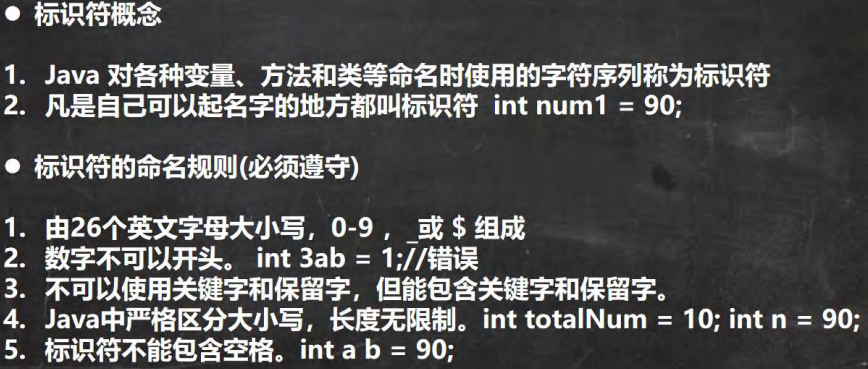

判断下面变量名是否正确

```
hsp //ok
hsp12 //ok
1hsp //错误, 数字不能开头
h-s // 错误 , 不能有 - x h // 错误， 有空格
h$4 // ok
class //错误，class 关键字
int // 错误 ,int 是关键字
double //错误 ,double 是关键字
public //错误 ,public 是关键字
static //错误 ,static 是关键字
goto //错误, goto 是保留字
stu_name //ok
```


标识符命名规范[更加专业]

1) 包名：多单词组成时所有字母都小写：aaa.bbb.ccc //比如 com.hsp.crm
2) 类名、接口名：多单词组成时，所有单词的首字母大写：XxxYyyZzz [大驼峰]
比如： TankShotGame
3) 变量名、方法名：多单词组成时，第一个单词首字母小写，第二个单词开始每个单词首字母大写：xxxYyyZzz[小驼峰， 简称 驼峰法]
比如： tankShotGame
4) 常量名：所有字母都大写。多单词时每个单词用下划线连接：XXX_YYY_ZZZ
比如 ：定义一个所得税率 TAX_RATE
5) 后面我们学习到 类，包，接口，等时，我们的命名规范要这样遵守,更加详细的看文档.


### 9 关键字

关键字的定义和特点 (不用背)
定义：被 Java 语言赋予了特殊含义，用做专门用途的字符串（单词）
特点：关键字中所有字母都为小写


### 10 保留字

**介绍**
Java 保留字：现有 Java 版本尚未使用，但以后版本可能会作为关键字使用。自己命名标识符时要避免使用这些保留字 byValue、cast、future、 generic、 inner、 operator、 outer、 rest、 var 、 goto 、const


### 11 键盘输入语句

**介绍**
在编程中，需要接收用户输入的数据，就可以使用键盘输入语句来获取。Input.java , 需要一个扫描器(对象), 就是Scanner

**步骤**
1) 导入该类的所在包, java.util.*
2) 创建该类对象（声明变量）
3) 调用里面的功能

**案例演示**
要求：可以从控制台接收用户信息，【姓名，年龄，薪水】

```java
import java.util.Scanner;//表示把 java.util 下的 Scanner 类导入
public class Input {
    
	//编写一个 main 方法
	public static void main(String[] args) {
		//演示接受用户的输入
		//步骤
        //Scanner 类 表示 简单文本扫描器，在 java.util 包
        //1. 引入/导入 Scanner 类所在的包
        //2. 创建 Scanner 对象 , new 创建一个对象,体会
        // myScanner 就是 Scanner 类的对象
        Scanner myScanner = new Scanner(System.in);
        //3. 接收用户输入了， 使用 相关的方法
        System.out.println("请输入名字");
        
        //当程序执行到 next 方法时，会等待用户输入~~~ 
        String name = myScanner.next(); //接收用户输入字符串
        System.out.println("请输入年龄");
        int age = myScanner.nextInt(); //接收用户输入 int
        System.out.println("请输入薪水");
        double sal = myScanner.nextDouble(); //接收用户输入 double
        System.out.println("人的信息如下:");
        
        System.out.println("名字=" + name + " 年龄=" + age + " 薪水=" + sal);
        
    }        
}        
```


### 12 进制(程序员的基本功)

**进制介绍**
对于整数，有四种表示方式：
二进制：0,1 ，满 2 进 1.以 0b 或 0B 开头。
十进制：0-9 ，满 10 进 1。
八进制：0-7 ，满 8 进 1. 以数字 0 开头表示。
十六进制：0-9 及 A(10)-F(15)，满 16 进 1. 以 0x 或 0X 开头表示。此处的 A-F 不区分大小写。


#### 进制的图示


#### 进制的转换(基本功)

进制转换的介绍

1. 第一组：
   二进制转十进制
   八进制转十进制
   十六进制转十进制

2. 第二组：
   十进制转二进制
   十进制转八进制
   十进制转十六进制
3. 第三组
   二进制转八进制
   二进制转十六进制
4. 第四组
   八进制转二进制
   十六进制转二进制


#### (1)二进制转换成十进制示例


#### (2)八进制转换成十进制示例


#### (3)十六进制转换成十进制示例

规则：从最低位(右边)开始，将每个位上的数提取出来，乘以 16 的(位数-1)次方，然后求和。案例：请将 0x23A 转成十进制的数
0x23A = 10 * 16^0 + 3 * 16 ^ 1 + 2 * 16^2 = 10 + 48 + 512 = 570

#### (4)十进制转换成二进制

规则：将该数不断除以 2，直到商为 0 为止，然后将每步得到的余数倒过来，就是对应的二进制。案例：请将 34 转成二进制 = 0B00100010


#### (5)十进制转换成八进制

规则：将该数不断除以 8，直到商为 0 为止，然后将每步得到的余数倒过来，就是对应的八进制。
案例：请将 131 转成八进制 => 0203


#### (6)十进制转换成十六进制

规则：将该数不断除以 16，直到商为 0 为止，然后将每步得到的余数倒过来，就是对应的十六进制。案例：请将 237 转成十六进制 => 0xED


#### (7)二进制转换成八进制

规则：从低位开始,将二进制数每三位一组，转成对应的八进制数即可。
案例：请将 ob11010101 转成八进制
ob11(3)010(2)101(5) => 0325


#### (8)二进制转换成十六进制

规则：从低位开始，将二进制数每四位一组，转成对应的十六进制数即可。
案例：请将 ob11010101 转成十六进制
ob1101(D)0101(5) = 0xD5
课堂练习：请将
0b11100101 转成 八进制
0b1110010110 转成 十六进制


#### (9)八进制转换成二进制

规则：将八进制数每 1 位，转成对应的一个 3 位的二进制数即可。
案例：请将 0237 转成二进制
02(010)3(011)7(111) = 0b10011111


#### (10)十六进制转换成二进制

规则：将十六进制数每 1 位，转成对应的 4 位的一个二进制数即可。
案例：请将 0x23B 转成二进制
0x2(0010)3(0011)B(1011) = 0b001000111011


#### 二进制在运算中的说明


### 13 原码、反码、补码(重点 难点)


### 14 位运算符

#### （1）java 中有 7 个位运算(&、|、 ^ 、~、>>、<<和 >>>)


#### （2）还有 3 个位运算符 >>、<< 和 >>> , 运算规则:

1) 算术右移 >>：低位溢出,符号位不变,并用符号位补溢出的高位
2) 算术左移 <<: 符号位不变,低位补 0
3) \>>> 逻辑右移也叫无符号右移,运算规则是: 低位溢出，高位补 0
4) 特别说明：没有 <<< 符号

int a=1>>2; //1 => 00000001 => 00000000 本质 1 / 2 / 2 =0

int c=1<<2; //1 => 00000001 => 00000100 本质 1 * 2 * 2 = 4


## 五、程序控制结构

### 1 程序流程控制介绍

在程序中，程序运行的流程控制决定程序是如何执行的，是我们必须掌握的，主要有三大流程控制语句。

1) 顺序控制
2) 分支控制
3) 循环控制

### 2 顺序控制


### 3 分支控制 if-else

让程序有选择的的执行,分支控制有三种

1) 单分支 if
2) 双分支 if-else
3) 多分支 if-else if -....-else

#### （1）单分支


#### （2）双分支

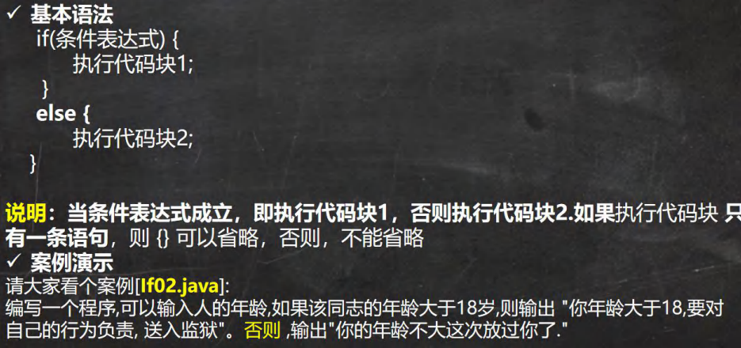


#### （3）多分支


### 4 嵌套分支

#### （1）基本介绍

**在一个分支结构中又完整的嵌套了另一个完整的分支结构**，里面的分支的结构称为内层分支外面的分支结构称为外层分支。老师建议: 不要超过 3 层 （可读性不好）


### 5 switch 分支结构

#### （1）基本语法


#### （2）流程图


#### （3）switch 注意事项和细节讨论


### 6 switch 和 if 的比较

1) 如果判断的具体数值不多，而且符合 byte、 short 、int、 char, enum[枚举], String 这6 种类型。虽然两个语句都可以使用，建议使用 swtich 语句。
2) 其他情况：对区间判断，对结果为 boolean 类型判断，使用 if，if 的使用范围更广


### 7 for 循环控制

基本介绍:听其名而知其意,就是让你的代码可以循环的执行

#### （1）基本语法

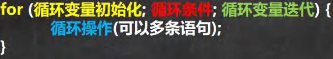

1. for 关键字，表示循环控制
2. for 有四要素: (1)循环变量初始化(2)循环条件(3)循环操作(4)循环变量迭代
3. 循环操作 , 这里可以有多条语句，也就是我们要循环执行的代码
4. 如果 循环操作(语句) 只有一条语句，可以省略 {}, 建议不要省略

#### （2）for 循环执行流程分析


#### （3）注意事项和细节说明

1) 循环条件是返回一个布尔值的表达式
2) for(;循环判断条件;) 中的初始化和变量迭代可以写到其它地方，但是两边的分号不能省略。
3) 循环初始值可以有多条初始化语句，但要求类型一样，并且中间用逗号隔开，循环变量迭代也可以有多条变量迭代语句，中间用逗号隔开。


### 8 while 循环控制

#### （1）基本语法


#### （2）while 循环执行流程分析


#### （3）注意事项和细节说明

1) 循环条件是返回一个布尔值的表达式
2) while 循环是先判断再执行语句


### 9 do..while 循环控制

#### （1）基本语法


#### （2）说明

1. do while 是关键字
1. 也有循环四要素, 只是位置不一样
2. 先执行，再判断，也就是说，一定会至少执行一次
3. 最后 有一个 分号 ;
4. while 和 do..while 区别举例: 要账


#### （3）do...while 循环执行流程分析


#### （4）注意事项和细节说明

1) 循环条件是返回一个布尔值的表达式
2) do..while 循环是先执行，再判断， 因此它至少执行一次


### 10 多重循环控制(难点! 重点!)

#### （1）介绍

1) 将一个循环放在另一个循环体内，就形成了嵌套循环。其中，for ,while ,do…while 均可以作为外层循环和内层循环。【建议一般使用两层，最多不要超过 3 层, 否则，代码的可读性很差】
2) 实质上，嵌套循环就是把内层循环当成外层循环的循环体。当只有内层循环的循环条件为false 时，才会完全跳出内层循环，才可结束外层的当次循环，开始下一次的循环[听不懂，走案例]。
3) 设外层循环次数为 m 次，内层为 n 次，则内层循环体实际上需要执行 m*n 次。


### 11 跳转控制语句-break

#### （1）看下面一个需求

随机生成 1-100 的一个数，直到生成了 97 这个数，看看你一共用了几次?
提示使用 (int)(Math.random() * 100) + 1
思路分析：
循环，但是循环的次数不知道. -> break ,当某个条件满足时，终止循环
通过该需求可以说明其它流程控制的必要性，比如 break


#### （2）基本介绍

break 语句用于终止某个语句块的执行，一般使用在 switch 或者循环[for , while , do-while]中


#### （3）基本语法

{ 
	……
	break; 
	……
}


#### （4）以 while 使用 break 为例,画出示意图


#### （5）注意事项和细节说明


### 12 跳转控制语句-continue

#### （1）基本介绍

1) continue 语句用于结束本次循环，继续执行下一次循环。
2) continue 语句出现在多层嵌套的循环语句体中时，可以通过标签指明要跳过的是哪一层循环, 这个和前面的标签的使用的规则一样.


#### （2）基本语法

{ 
	……
	continue;
	……
}


#### （3）以 while 使用 continue 为例,画出示意图


### 13 跳转控制语句-return

return 使用在方法，表示跳出所在的方法，在讲解方法的时候，会详细的介绍，这里我们简单的提一下。注意：如果 return 写在 main 方法，退出程序


## 六、数组、排序和查找

### 1 数组

#### （1）为什么需要数组

一个养鸡场有 6 只鸡，它们的体重分别是 3kg,5kg,1kg,3.4kg,2kg,50kg 。请问这六只鸡的总体重是多少?平均体重是多少? 请你编一个程序。 Array01.java

思路：
定义 6 个变量 , 加起来 总体重， 求出平均体重.引出 -> 数组


#### （2）数组介绍

数组可以存放多个同一类型的数据。数组也是一种数据类型，是引用类型。
即：数(数据)组(一组)就是一组数据


### 2 数组的使用

#### （1）使用方式 1-动态初始化


先声明数组
语法:数据类型 数组名[]; 也可以 数据类型[] 数组名;
int a[]; 或者 int[] a;

创建数组
语法: 数组名=new 数据类型[大小];
a=new int[10];


#### （2）使用方式 2-静态初始化


### 3 数组使用注意事项和细节

1) 数组是多个相同类型数据的组合，实现对这些数据的统一管理
2) 数组中的元素可以是任何数据类型，包括基本类型和引用类型，但是不能混用。
3) 数组创建后，如果没有赋值，有默认值
    int 0，short 0, byte 0, long 0, float 0.0,double 0.0，char \u0000，boolean false，String null
4) 使用数组的步骤 1. 声明数组并开辟空间 2 给数组各个元素赋值 3 使用数组
5) 数组的下标是从 0 开始的。
6) 数组下标必须在指定范围内使用，否则报：下标越界异常，比如int [] arr=new int[5]; 则有效下标为 0-4
7) 数组属引用类型，数组型数据是对象(object)


### 4 数组赋值机制

1) 基本数据类型赋值，这个值就是具体的数据，而且相互不影响。
int n1 = 2; int n2 = n1;
2) 数组在默认情况下是引用传递，赋的值是地址。
看一个案例，并分析数组赋值的内存图(重点, 难点. )。
//代码 ArrayAssign.java
int[] arr1 = {1,2,3};
int[] arr2 = arr1;


### 5 数组拷贝

将 int[] arr1 = {10,20,30}; 拷贝到 arr2 数组, 要求数据空间是独立的.

```java
public class ArrayCopy {
    
    //编写一个 main 方法
	public static void main(String[] args) {
        
        //将 int[] arr1 = {10,20,30}; 拷贝到 arr2 数组, 
        //要求数据空间是独立的.
        
        int[] arr1 = {10,20,30};
        
        //创建一个新的数组 arr2,开辟新的数据空间
        //大小 arr1.length;
        int[] arr2 = new int[arr1.length];
        
        //遍历 arr1 ，把每个元素拷贝到 arr2 对应的元素位置
        for(int i = 0; i < arr1.length; i++) {
			arr2[i] = arr1[i];
		}
        
        //老师修改 arr2， 不会对 arr1 有影响. 
        arr2[0] = 100;
        
        //输出 arr1
        System.out.println("====arr1 的元素====");
        for(int i = 0; i < arr1.length; i++) {
        	System.out.println(arr1[i]);//10,20,30
        }
        
        System.out.println("====arr2 的元素====");
        for(int i = 0; i < arr2.length; i++) {
        	System.out.println(arr2[i]);//
        }
        
    }
    
}
```


### 6 数组反转

要求：把数组的元素内容反转。

arr {11,22,33,44,55,66}		{66, 55,44,33,22,11}


**方式 1：通过找规律反转 【思路分析】**

```java
public class ArrayReverse {
    
    //编写一个 main 方法
	public static void main(String[] args) {
        
        //定义数组
		int[] arr = {11, 22, 33, 44, 55, 66};
        
        //规律
        //1. 把 arr[0] 和 arr[5] 进行交换 {66,22,33,44,55,11}
        //2. 把 arr[1] 和 arr[4] 进行交换 {66,55,33,44,22,11}
        //3. 把 arr[2] 和 arr[3] 进行交换 {66,55,44,33,22,11}
        //4. 一共要交换 3 次 = arr.length / 2
        //5. 每次交换时，对应的下标 是 arr[i] 和 arr[arr.length - 1 -i]
        
        int temp = 0;
        int len = arr.length; //计算数组的长度
        for( int i = 0; i < len / 2; i++) {
			temp = arr[len - 1 - i];//保存
			arr[len - 1 - i] = arr[i];
			arr[i] = temp;
		}
        
        System.out.println("===翻转后数组===");
        for(int i = 0; i < arr.length; i++) {
            System.out.print(arr[i] + "\t");//66,55,44,33,22,11
        }
        
        
    }
    
}
```


**方式 2：使用逆序赋值方式 【思路分析, 学员自己完成】**

```java
public class ArrayReverse02 {
    
    //编写一个 main 方法
	public static void main(String[] args) {
        
        //定义数组
        int[] arr = {11, 22, 33, 44, 55, 66};
        //使用逆序赋值方式
        //1. 先创建一个新的数组 arr2 ,大小 arr.length
        //2. 逆序遍历 arr ,将 每个元素拷贝到 arr2 的元素中(顺序拷贝)
        //3. 建议增加一个循环变量 j -> 0 -> 5
        int[] arr2 = new int[arr.length];
        //逆序遍历 arr
        for(int i = arr.length - 1, j = 0; i >= 0; i--, j++) {
            arr2[j] = arr[i];
        }
        //4. 当 for 循环结束，arr2 就是一个逆序的数组 {66, 55, 44,33, 22, 11}
        //5. 让 arr 指向 arr2 数据空间, 此时 arr 原来的数据空间就没有变量引用
        // 会被当做垃圾，销毁
        arr = arr2;
        System.out.println("====arr 的元素情况=====");
        //6. 输出 arr 看看
        for(int i = 0; i < arr.length; i++) {
            System.out.print(arr[i] + "\t");
        }
    }
    
}
```


### 7 数组添加/扩容

要求：实现动态的给数组添加元素效果，实现对数组扩容。ArrayAdd.java
1) 原始数组使用静态分配 int[] arr = {1,2,3}
2) 增加的元素 4，直接放在数组的最后 arr = {1,2,3,4}
3) 用户可以通过如下方法来决定是否继续添加，添加成功，是否继续？y/n

```java
public class ArrayAdd02 {
    
    //编写一个 main 方法
	public static void main(String[] args) {
		/*
		要求：实现动态的给数组添加元素效果，实现对数组扩容。ArrayAdd.java
		1.原始数组使用静态分配 int[] arr = {1,2,3}
		2.增加的元素 4，直接放在数组的最后 arr = {1,2,3,4}
		3.用户可以通过如下方法来决定是否继续添加，添加成功，是否继续？y/n
		
		思路分析
		1. 定义初始数组 int[] arr = {1,2,3}//下标 0-2
		2. 定义一个新的数组 int[] arrNew = new int[arr.length+1];
		3. 遍历 arr 数组，依次将 arr 的元素拷贝到 arrNew 数组
		4. 将 4 赋给 arrNew[arrNew.length - 1] = 4;把 4 赋给 arrNew 最后一个元素
		5. 让 arr 指向 arrNew ; arr = arrNew; 那么 原来 arr 数组就被销毁
		6. 创建一个 Scanner 可以接受用户输入
		7. 因为用户什么时候退出，不确定，老师使用 do-while + break 来控制
		*/
        
		Scanner myScanner = new Scanner(System.in);
        //初始化数组
		int[] arr = {1,2,3};
        
		do {
			int[] arrNew = new int[arr.length + 1];
            //遍历 arr 数组，依次将 arr 的元素拷贝到 arrNew 数组
            for(int i = 0; i < arr.length; i++) {
				arrNew[i] = arr[i];
			}
			System.out.println("请输入你要添加的元素");
			int addNum = myScanner.nextInt();
			//把 addNum 赋给 arrNew 最后一个元素
			arrNew[arrNew.length - 1] = addNum;
			//让 arr 指向 arrNew, 
            arr = arrNew;
			//输出 arr 看看效果
			System.out.println("====arr 扩容后元素情况====");
			for(int i = 0; i < arr.length; i++) {
				System.out.print(arr[i] + "\t");
			}
			//问用户是否继续
			System.out.println("是否继续添加 y/n");
			char key = myScanner.next().charAt(0);
			if( key == 'n') { //如果输入 n ,就结束
				break;
			}
		}while(true);
        
		System.out.println("你退出了添加...");
	}
                    
}
```


### 8 排序的介绍

排序是将多个数据，依指定的顺序进行排列的过程。

#### （1）内部排序

指将需要处理的所有数据都加载到内部存储器中进行排序。包括(交换式排序法、选择式排序法和插入式排序法)；

#### （2）外部排序法

数据量过大，无法全部加载到内存中，需要借助外部存储进行排序。包括(合并排序法和直接合并排序法)。


### 9 冒泡排序法

冒泡排序（Bubble Sorting）的基本思想是：通过对待排序序列从后向前（从下标较大的元素开始），依次比较相邻元素的值，若发现逆序则交换，使值较大的元素逐渐从前移向后部，就象水底下的气泡一样逐渐向上冒。


下面我们举一个具体的案例来说明冒泡法。我们将五个无序：24,69,80,57,13 使用冒泡排序法将其排成一个从小到大的有序数列。 
思路->走代码, 你可以自己完整的分析冒泡的执行流程，并可以不看老师代码，也可以写出代码.

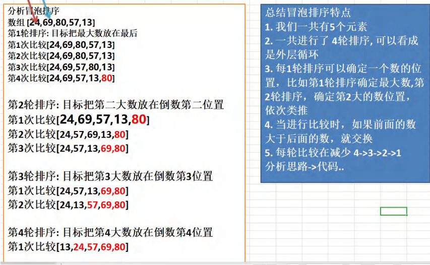

```java
public class BubbleSort {
    //编写一个 main 方法
    public static void main(String[] args) {
        
        // 化繁为简，先死后活
        int[] arr = {24, 69, 80, 57, 13};
		int temp = 0; //用于辅助交换的变量
        
        //将多轮排序使用外层循环包括起来即可
		//先死后活 =》 4 就是 arr.length - 1
		for( int i = 0; i < arr.length - 1; i++) {//外层循环是 4 次
            
            for( int j = 0; j < arr.length - 1 - i; j++) {//4 次比较-3 次-2 次-1 次
				//如果前面的数>后面的数，就交换
				if(arr[j] > arr[j + 1]) {
					temp = arr[j];
					arr[j] = arr[j+1];
					arr[j+1] = temp;
				}
			}
            System.out.println("\n==第"+(i+1)+"轮==");
            for(int j = 0; j < arr.length; j++) {
                System.out.print(arr[j] + "\t");
            }
            
        }
        
    }
}
```


### 10 查找

#### （1）介绍

在 java 中，我们常用的查找有两种:

1) 顺序查找 SeqSearch.java
2) 二分查找【二分法，我们放在算法讲解】


#### （2）案例演示

1) 有一个数列：白眉鹰王、金毛狮王、紫衫龙王、青翼蝠王猜数游戏：从键盘中任意输入一个名称，判断数列中是否包含此名称【顺序查找】 要求: 如果找到了，就提示找到，并给出下标值。

```java
public class SeqSearch {
    
    //编写一个 main 方法
	public static void main(String[] args) {
        
        // 思路分析
        // 1. 定义一个字符串数组
        // 2. 接收用户输入, 遍历数组，逐一比较，如果有，则提示信息，并退出
        //定义一个字符串数组
        String[] names = {"白眉鹰王", "金毛狮王", "紫衫龙王", "青翼蝠王"}
        Scanner myScanner = new Scanner(System.in);
        
        System.out.println("请输入名字");
        String findName = myScanner.next();
        
        //遍历数组，逐一比较，如果有，则提示信息，并退出
        //这里老师给大家一个编程思想/技巧, 一个经典的方法
        int index = -1;
        for(int i = 0; i < names.length; i++) {
            //比较 字符串比较 equals, 如果要找到名字就是当前元素
			if(findName.equals(names[i])) {
				System.out.println("恭喜你找到 " + findName);
				System.out.println("下标为= " + i);
				//把 i 保存到 index
				index = i;
				break;//退出
			}
        }
        
        if(index == -1) { //没有找到
        	System.out.println("sorry ,没有找到 " + findName);
        }
        
    }
    
}
```


### 11 多维数组-二维数组

多维数组我们只介绍二维数组。
二维数组的应用场景
比如我们开发一个五子棋游戏，棋盘就是需要二维数组来表示。如图


#### （1）快速入门案例

请用二维数组输出如下图形

0 0 0 0 0 0
0 0 1 0 0 0
0 2 0 3 0 0
0 0 0 0 0 0

```java
public class TwoDimensionalArray01 {
    
    //编写一个 main 方法
	public static void main(String[] args) {
        
        //什么是二维数组：
        //1. 从定义形式上看 int[][]
		//2. 可以这样理解，原来的一维数组的每个元素是一维数组, 就构成二维数组
        int[][] arr = { {0, 0, 0, 0, 0, 0}, 
						{0, 0, 1, 0, 0, 0}, 
						{0,2, 0, 3, 0, 0}, 
						{0, 0, 0, 0, 0, 0} };
        
        //关于二维数组的关键概念
        //(1) System.out.println("二维数组的元素个数=" + arr.length);
        //(2) 二维数组的每个元素是一维数组, 所以如果需要得到每个一维数组的值还需要再次遍历
        //(3) 如果我们要访问第 (i+1)个一维数组的第 j+1 个值 arr[i][j];
        //		举例 访问 3, =》 他是第 3 个一维数组的第 4 个值 arr[2][3]
        
        //输出二维图形
        for(int i = 0; i < arr.length; i++) {//遍历二维数组的每个元素
			//遍历二维数组的每个元素(数组)
			//老韩解读
			//1. arr[i] 表示 二维数组的第 i+1 个元素 比如 arr[0]：二维数组的第一个元素
			//2. arr[i].length 得到 对应的 每个一维数组的长度
			for(int j = 0; j < arr[i].length; j++) {
				System.out.print(arr[i][j] + " "); //输出了一维数组
			}
			System.out.println();//换行
		}
        
    }
    
}
```


#### （2）使用方式 1: 动态初始化

1) 语法: 类型[] [] 数组名=new 类型[大小] [大小]
2) 比如: int a[] []=new int[2] [3]

```java
public class TwoDimensionalArray02 {
    
    //编写一个 main 方法
	public static void main(String[] args) {
        
        //int arr[][] = new int[2][3];
        
        int arr[][]; //声明二维数组
        arr = new int[2][3];//再开空间
        
        arr[1][1] = 8;
		//遍历 arr 数组
        for(int i = 0; i < arr.length; i++) {
			for(int j = 0; j < arr[i].length; j++) {//对每个一维数组遍历
				System.out.print(arr[i][j] +" ");
			}
			System.out.println();//换行
		}
        
    }
}
```


#### （3）用方式 2: 动态初始化

先声明：类型 数组名[][];

再定义(开辟空间) 数组名 = new 类型[大小] [大小]

赋值(有默认值，比如 int 类型的就是 0)


#### （4）使用方式 3: 动态初始化-列数不确定


```java
public class TwoDimensionalArray03 {
    
    //编写一个 main 方法
	public static void main(String[] args) {
        
        /*
		看一个需求：动态创建下面二维数组，并输出
		
			i = 0: 1
			i = 1: 2 2
			i = 2: 3 3 3 
		
		一个有三个一维数组, 每个一维数组的元素是不一样的
		*/
        
        //创建 二维数组，一个有 3 个一维数组，但是每个一维数组还没有开数据空间
        int[][] arr = new int[3][];
        
        for(int i = 0; i < arr.length; i++) {//遍历 arr 每个一维数组
			//给每个一维数组开空间 new
			//如果没有给一维数组 new ,那么 arr[i]就是 null
			arr[i] = new int[i + 1];
                
			//遍历一维数组，并给一维数组的每个元素赋值
			for(int j = 0; j < arr[i].length; j++) {
				arr[i][j] = i + 1;//赋值
			}
            
            System.out.println("=====arr 元素=====");
			//遍历 arr 输出
			for(int i = 0; i < arr.length; i++) {
				//输出 arr 的每个一维数组
				for(int j = 0; j < arr[i].length; j++) {
					System.out.print(arr[i][j] + " ");
				}
				System.out.println();//换行
			}
        }
        
    }
    
}
```


#### （5）使用方式 4: 静态初始化

定义 类型 数组名[][] = {{值 1,值 2..},{值 1,值 2..},{值 1,值 2..}}
使用即可 [ 固定方式访问 ]

比如:
int[][] arr = {{1,1,1}, {8,8,9}, {100}};
解读

1. 定义了一个二维数组 arr
2. arr 有三个元素(每个元素都是一维数组)
3. 第一个一维数组有 3 个元素 , 第二个一维数组有 3 个元素, 第三个一维数组有 1 个元素


#### （6）二维数组的应用案例

1) 使用二维数组打印一个 10 行杨辉三角


```java
public class YangHui {
    
    //编写一个 main 方法
	public static void main(String[] args) {
        /*
			使用二维数组打印一个 10 行杨辉三角
			1
			1 1
			1 2 1
			1 3 3 1
			1 4 6 4 1
			1 5 10 10 5 1
			
			规律
				1.第一行有 1 个元素, 第 n 行有 n 个元素
				2. 每一行的第一个元素和最后一个元素都是 1
				3. 从第三行开始, 对于非第一个元素和最后一个元素的元素的值. arr[i][j]
					arr[i][j] = arr[i-1][j] + arr[i-1][j-1]; //必须找到这个规律
		*/
        int[][] yangHui = new int[12][];
		for(int i = 0; i < yangHui.length; i++) {//遍历 yangHui 的每个元素
        	//给每个一维数组(行) 开空间
			yangHui[i] = new int[i+1];
			//给每个一维数组(行) 赋值
			for(int j = 0; j < yangHui[i].length; j++){
				//每一行的第一个元素和最后一个元素都是 1
				if(j == 0 || j == yangHui[i].length - 1) {
					yangHui[i][j] = 1;
				} else {//中间的元素
					yangHui[i][j] = yangHui[i-1][j] + yangHui[i-1][j-1];
				}
            }    
        }
        //输出杨辉三角
		for(int i = 0; i < yangHui.length; i++) {
			for(int j = 0; j < yangHui[i].length; j++) {//遍历输出该行
				System.out.print(yangHui[i][j] + "\t");
			}
			System.out.println();//换行. }
        }
    }
    
}
```


#### （7）二维数组使用细节和注意事项

1) 一维数组的声明方式有:	
   int[] x 或者 int x[]

2) 二维数组的声明方式有:
   int[] [] y 或者 int[] y[] 或者 int y[] []
3) 二维数组实际上是由多个一维数组组成的，它的各个一维数组的长度可以相同，也可以不相同。比如：map[] [] 是一个二维数组

​		int map [][] = {{1,2},{3,4,5}}

​		由 map[0] 是一个含有两个元素的一维数组 ，map[1] 是一个含有三个元素的一维数组构成，我们也称为列数不等的二维数组


## 七 面向对象编程(基础部分)

### 1 类与对象

张老太养了两只猫猫:一只名字叫小白,今年 3 岁,白色。还有一只叫小花,今年 100 岁,花色。请编写一个程序，当用户输入小猫的名字时，就显示该猫的名字，年龄，颜色。如果用户输入的小猫名错误，则显示张老太没有这只猫猫。


**使用现有技术解决**

1) 单独的定义变量解决
2) 使用数组解决


**现有技术解决的缺点分析**

不利于数据的管理
效率低===》 引出我们的新知识点 类与对象 哲学, 道家思想
java 设计者 引入 类与对象(OOP) ，根本原因就是现有的技术，不能完美的解决新的新的需求.


一个程序就是一个世界，有很多事物(对象[属性, 行为])


#### （1）类与对象的关系示意图

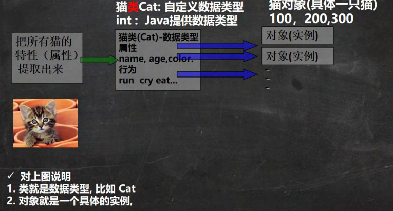


#### （2）类和对象的区别和联系

1. 类是抽象的，概念的，代表一类事物,比如人类,猫类.., 即它是数据类型. 
2. 对象是具体的，实际的，代表一个具体事物, 即 是实例. 
3. 类是对象的模板，对象是类的一个个体，对应一个实例


#### （3）对象在内存中存在形式

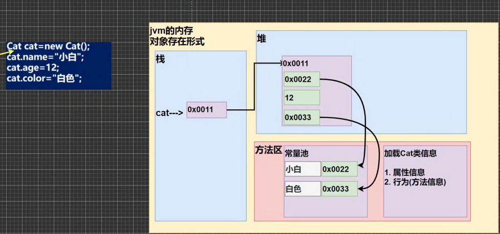


#### （4）属性/成员变量/字段

1. 从概念或叫法上看： 成员变量 = 属性 = field(字段) （即 成员变量是用来表示属性的，授课中，统一叫属性)
2. 属性是类的一个组成部分，一般是基本数据类型,也可是引用类型(对象，数组)。比如我们前面定义猫类的int age就是属性


**注意事项和细节说明**

1) 属性的定义语法同变量，示例：访问修饰符 属性类型 属性名;
这里老师简单的介绍访问修饰符： 控制属性的访问范围
有四种访问修饰符 public, proctected, 默认, private ,后面我会详细介绍
2) 属性的定义类型可以为任意类型，包含基本类型或引用类型
3) 属性如果不赋值，有默认值，规则和数组一致。具体说: int 0，short 0, byte 0, long 0, float 0.0,double 0.0，char \u0000，boolean false，String null


#### （5）如何创建对象

1) 先声明再创建
   Cat cat ; //声明对象 cat 
   cat = new Cat(); //创建
2) 直接创建
   Cat cat = new Cat();


#### （6）如何访问属性

基本语法：对象名.属性名;


#### （7）类和对象的内存分配机制


**Java 内存的结构分析**

1) 栈： 一般存放基本数据类型(局部变量)
2) 堆： 存放对象(Cat cat , 数组等)
3) 方法区：常量池(常量，比如字符串)， 类加载信息
4) 示意图 [Cat (name, age, price)]


**Java 创建对象的流程简单分析**

```java
Person p = new Person();
p.name = “jack”;
p.age = 10
```

1) 先加载 Person 类信息(属性和方法信息, 只会加载一次)
2) 在堆中分配空间, 进行默认初始化(看规则)
3) 把地址赋给 p , p 就指向对象
4) 进行指定初始化， 比如 p.name =”jack” p.age = 10


**看一个练习题，并分析画出内存布局图，进行分析**


### 2 成员方法

#### （1）基本介绍

在某些情况下，我们要需要定义成员方法(简称方法)。比如人类:除了有一些属性外( 年龄，姓名..),我们人类还有一些行为比如:可以说话、跑步..,通过学习，还可以做算术题。这时就要用成员方法才能完成。现在要求对Person 类完善。


#### （2）方法的调用机制原理


#### （3）成员方法的好处

1) 提高代码的复用性
2) 可以将实现的细节封装起来，然后供其他用户来调用即可


#### （4）成员方法的定义

访问修饰符 返回数据类型 方法名（形参列表..） {//方法体

​		语句；

​		return 返回值;

}

1) 形参列表：表示成员方法输入 cal(int n) ， getSum(int num1, int num2)

2) 返回数据类型：表示成员方法输出, void 表示没有返回值
3) 方法主体：表示为了实现某一功能代码块
4) return 语句不是必须的。


#### （5）注意事项和使用细节

1. 一个方法最多有一个返回值 [思考，如何返回多个结果 返回数组 ]
2. 返回类型可以为任意类型，包含基本类型或引用类型(数组，对象)
3. 如果方法要求有返回数据类型，则方法体中最后的执行语句必须为 return 值；而且要求返回值类型必须和 return 的值类型一致或兼容


**访问修饰符 (作用是控制 方法使用的范围)**

如果不写默认访问，[有四种: public, protected, 默认, private], 具体在后面说


**返回数据类型**

1) 一个方法最多有一个返回值 [思考，如何返回多个结果 返回数组 ]
2) 返回类型可以为任意类型，包含基本类型或引用类型(数组，对象)
3) 如果方法要求有返回数据类型，则方法体中最后的执行语句必须为 return 值; 而且要求返回值类型必须和return的值类型一致或兼容
4) 如果方法是 void，则方法体中可以没有 return 语句，或者 只写 return ;


**方法名**

遵循驼峰命名法，最好见名知义，表达出该功能的意思即可, 比如得到两个数的和 getSum, 开发中按照规范


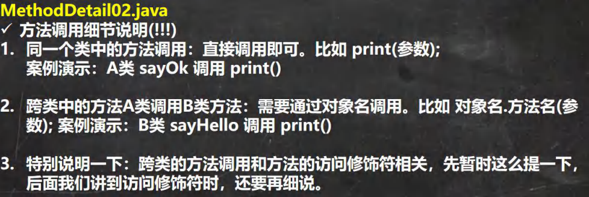


#### （6）类定义的完善


### 3 成员方法传参机制

方法的传参机制对我们今后的编程非常重要，一定要搞的清清楚楚明明白白。我们通过案例来学习

#### （1）基本数据类型的传参机制


```java
public class MethodParameter01 {
    
    //编写一个 main 方法
	public static void main(String[] args) {
        
        int a = 10;
        int b = 20;
        //创建 AA 对象 名字 obj
        AA obj = new AA();
        obj.swap(a, b); //调用 swap
        
        System.out.println("main 方法 a=" + a + " b=" + b);//a=10 b=20
        
    }
    
}

class AA {
	public void swap(int a,int b){
		System.out.println("\na 和 b 交换前的值\na=" + a + "\tb=" + b);//a=10 b=20
		//完成了 a 和 b 的交换
		int tmp = a;
		a = b;
		b = tmp;
		System.out.println("\na 和 b 交换后的值\na=" + a + "\tb=" + b);//a=20 b=10
	}
}
```


#### （2）引用数据类型的传参机制

B 类中编写一个方法 test100，可以接收一个数组，在方法中修改该数组，看看原来的数组是否变化？会变化
B 类中编写一个方法 test200，可以接收一个 Person(age,sal)对象，在方法中修改该对象属性，看看原来的对象是否变化？会变化.

```java
public class MethodParameter02 {
    //编写一个 main 方法
	public static void main(String[] args) {
        //测试
        B b = new B();
        // int[] arr = {1, 2, 3};
		// b.test100(arr);//调用方法
		// System.out.println(" main 的 arr 数组 ");
		// //遍历数组
		// for(int i = 0; i < arr.length; i++) {
		// 		System.out.print(arr[i] + "\t");
		// }
		// System.out.println();
        
        //测试
        Person p = new Person();
        p.name = "jack";
		p.age = 10;
		b.test200(p);
		//测试题, 如果 test200 执行的是 p = null ,下面的结果是 10
		//测试题, 如果 test200 执行的是 p = new Person();..., 下面输出的是 10
		System.out.println("main 的 p.age=" + p.age);//10000
        
    }
}

class Person {
	String name;
	int age;
}

class B {
    
    public void test200(Person p) {
        //p.age = 10000; //修改对象属性
        //思考
        p = new Person();
        p.name = "tom";
        p.age = 99;
        //思考
        //p = null;
    }
    
    //B 类中编写一个方法 test100，
	//可以接收一个数组，在方法中修改该数组，看看原来的数组是否变化
	public void test100(int[] arr) {
		arr[0] = 200;//修改元素
		//遍历数组
		System.out.println(" test100 的 arr 数组 ");
		for(int i = 0; i < arr.length; i++) {
			System.out.print(arr[i] + "\t");
		}
		System.out.println();
    }
}
```

**结论及示意图**

引用类型传递的是地址（传递也是值，但是值是地址），可以通过形参影响实参！


在看一个案例，下面的方法会对原来的对象有影响吗？

p=null 和 p = new Person(); 对应示意图


### 4 方法递归调用

#### （1）基本介绍

简单的说: 递归就是方法自己调用自己,每次调用时传入不同的变量.递归有助于编程者解决复杂问题,同时可以让代码变得简洁

#### （2）递归能解决什么问题?


#### （3）递归举例

列举两个小案例,来帮助大家理解递归调用机制

1) 打印问题
2) 阶乘问题

```java
public class Recursion01 {
    
	//编写一个 main 方法
	public static void main(String[] args) {
        
		T t1 = new T();
		t1.test(4);//输出什么？ n=2 n=3 n=4
		int res = t1.factorial(5);
		System.out.println("5 的阶乘 res =" + res);
        
	}
}

class T {
    
    //分析
    public void test(int n) {
		if (n > 2) {
			test(n - 1);
		}
		System.out.println("n=" + n);
	}
    
    //factorial 阶乘
	public int factorial(int n) {
		if (n == 1) {
			return 1;
		} else {
			return factorial(n - 1) * n;
		}
	}
    
}
```


#### （4）递归重要规则


### 5 方法重载(OverLoad)

#### （1）基本介绍

java 中允许同一个类中，多个同名方法的存在，但要求形参列表不一致！

比如：System.out.println(); out 是 PrintStream 类型

#### （2）重载的好处

1) 减轻了起名的麻烦
2) 减轻了记名的麻烦

#### （3）注意事项和使用细节

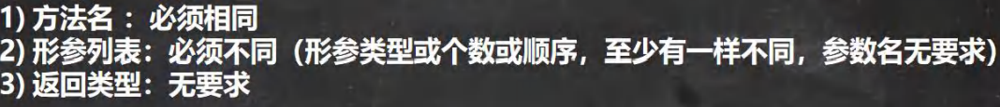

#### （4）课堂练习题


### 6 可变参数

#### （1）基本概念

java 允许将同一个类中多个同名同功能但参数个数不同的方法，封装成一个方法。 就可以通过可变参数实现


#### （2）基本语法

访问修饰符 返回类型 方法名(数据类型... 形参名) {

}


#### （3）快速入门案例

看一个案例 类 HspMethod，方法 sum 【可以计算 2 个数的和，3 个数的和 ， 4.5，。。】

```java
public class VarParameter01 {
    
    //编写一个 main 方法
	public static void main(String[] args) {
        
		HspMethod m = new HspMethod();
		System.out.println(m.sum(1, 5, 100)); //106
		System.out.println(m.sum(1,19)); //20
        
	}
    
}

class HspMethod {
	//可以计算 2 个数的和，3 个数的和 ， 4. 5， 。。
	//可以使用方法重载
	// public int sum(int n1, int n2) {//2 个数的和
	// return n1 + n2;
	// }
	// public int sum(int n1, int n2, int n3) {//3 个数的和
	// return n1 + n2 + n3;
	// }
	// public int sum(int n1, int n2, int n3, int n4) {//4 个数的和
	// return n1 + n2 + n3 + n4;
	// }
	//..... 
	//上面的三个方法名称相同，功能相同, 参数个数不同-> 使用可变参数优化
	//老韩解读
   	//1. int... 表示接受的是可变参数，类型是 int ,即可以接收多个 int(0-多)
	//2. 使用可变参数时，可以当做数组来使用 即 nums 可以当做数组
	//3. 遍历 nums 求和即可
    public int sum(int... nums) {
		//System.out.println("接收的参数个数=" + nums.length);
		int res = 0;
		for(int i = 0; i < nums.length; i++) {
			res += nums[i];
		}
		return res;
	}
}
    
```


#### （4）注意事项和使用细节


### 7 作用域

#### （1）基本使用


```java
public class VarScope {
    
	//编写一个 main 方法
	public static void main(String[] args) {
	}
    
}

class Cat {
	//全局变量：也就是属性，作用域为整个类体 Cat 类：cry eat 等方法使用属性
	//属性在定义时，可以直接赋值
	int age = 10; //指定的值是 10
    
	//全局变量(属性)可以不赋值，直接使用，因为有默认值，
	double weight; //默认值是 0.0
    
    
	public void hi() {
		//局部变量必须赋值后，才能使用，因为没有默认值
		int num = 1;
		String address = "北京的猫";
		System.out.println("num=" + num);
		System.out.println("address=" + address);
		System.out.println("weight=" + weight);//属性
	}
    
    
	public void cry() {
		//1. 局部变量一般是指在成员方法中定义的变量
		//2. n 和 name 就是局部变量
		//3. n 和 name 的作用域在 cry 方法中
		int n = 10;
		String name = "jack";
		System.out.println("在 cry 中使用属性 age=" + age);
	}
    
    public void eat() {
        
		System.out.println("在 eat 中使用属性 age=" + age);
		//System.out.println("在 eat 中使用 cry 的变量 name=" + name);//错误
	}
}
```


#### （2）注意事项和细节使用


### 8 构造方法/构造器

#### （1）看一个需求

我们来看一个需求：前面我们在创建人类的对象时，是先把一个对象创建好后，再给他的年龄和姓名属性赋值，如果现在我要求，在创建人类的对象时，就直接指定这个对象的年龄和姓名，该怎么做? 这时就可以使用构造器。

#### （2）基本语法

[修饰符] 方法名(形参列表){
	方法体;
}

1) 构造器的修饰符可以默认， 也可以是 public protected private
2) 构造器没有返回值
3) 方法名 和类名字必须一样
4) 参数列表 和 成员方法一样的规则
5) 构造器的调用, 由系统完成


#### （3）基本介绍

构造方法又叫构造器(constructor)，是类的一种特殊的方法，它的主要作用是完成对新对象的初始化。它有几个特点：

1) 方法名和类名相同
2) 没有返回值
3) 在创建对象时，系统会自动的调用该类的构造器完成对象的初始化。


#### （4）注意事项和使用细节


### 9 对象创建的流程分析

#### （1）看一个案例


学习完构造器后,我们类的定义就应该更加完善了


### 10 this 关键字

#### （1）先看一段代码,并分析问题


#### （2）深入理解 this


#### （3）this 的注意事项和使用细节

1) this 关键字可以用来访问本类的属性、方法、构造器
2) this 用于区分当前类的属性和局部变量
3) 访问成员方法的语法：this.方法名(参数列表);

4) 访问构造器语法：this(参数列表); 注意只能在构造器中使用(即只能在构造器中访问另外一个构造器, 必须放在第一条语句)
5) this 不能在类定义的外部使用，只能在类定义的方法中使用。


## 八、面向对象编程(中级部分)

### 1 包

#### （1）看一个应用场景


#### （2）包的三大作用


#### （3）包基本语法


#### （4）包的本质分析(原理)


#### （5）包的命名


#### （6）常用的包

一个包下,包含很多的类,java 中常用的包有:

1) java.lang.* //lang 包是基本包，默认引入，不需要再引入. 
2) java.util.* //util 包，系统提供的工具包, 工具类，使用 Scanner
3) java.net.* //网络包，网络开发
4) java.awt.* //是做 java 的界面开发，GUI


#### （7）如何引入包


#### （8）注意事项和使用细节


### 2 访问修饰符

#### （1）基本介绍

java 提供四种访问控制修饰符号，用于控制方法和属性(成员变量)的访问权限（范围）:

1) 公开级别:用 public 修饰,对外公开
2) 受保护级别:用 protected 修饰,对子类和同一个包中的类公开
3) 默认级别:没有修饰符号,向同一个包的类公开. 
4) 私有级别:用 private 修饰,只有类本身可以访问,不对外公开.

#### （2）4 种访问修饰符的访问范围


#### （3）使用的注意事项


### 4 面向对象编程三大特征

#### （1）基本介绍

面向对象编程有三大特征：封装、继承和多态。

#### （2）封装介绍


#### （3）封装的理解和好处


#### （4）封装的实现步骤 (三步)


### 5 面向对象编程-继承

#### （1）为什么需要继承


#### （2）继承基本介绍和示意图

继承可以解决代码复用,让我们的编程更加靠近人类思维.当多个类存在相同的属性(变量)和方法时,可以从这些类中抽象出父类,在父类中定义这些相同的属性和方法，所有的子类不需要重新定义这些属性和方法，只需要通过extends来声明继承父类即可。画出继承的示意图


#### （3）继承的基本语法


#### （4）继承给编程带来的便利

1) 代码的复用性提高了
2) 代码的扩展性和维护性提高了


#### （5）继承的深入讨论/细节问题

1) 子类继承了所有的属性和方法，非私有的属性和方法可以在子类直接访问, 但是私有属性和方法不能在子类直接访问，要通过父类提供公共的方法去访问
2) 子类必须调用父类的构造器， 完成父类的初始化
3) 当创建子类对象时，不管使用子类的哪个构造器，默认情况下总会去调用父类的无参构造器，如果父类没有提供无参构造器，则必须在子类的构造器中用 super 去指定使用父类的哪个构造器完成对父类的初始化工作，否则，编译不会通过(怎么理解。) [举例说明]

4) 如果希望指定去调用父类的某个构造器，则显式的调用一下 : super(参数列表)
5) super 在使用时，必须放在构造器第一行(super 只能在构造器中使用)
6) super() 和 this() 都只能放在构造器第一行，因此这两个方法不能共存在一个构造器
7) java 所有类都是 Object 类的子类, Object 是所有类的基类. 8) 父类构造器的调用不限于直接父类！将一直往上追溯直到 Object 类(顶级父类)
9) 子类最多只能继承一个父类(指直接继承)，即 java 中是单继承机制。
思考：如何让 A 类继承 B 类和 C 类？ 【A 继承 B， B 继承 C】
10) 不能滥用继承，子类和父类之间必须满足 is-a 的逻辑关系


#### （6）继承的本质分析(重要)

```java
/**
* 讲解继承的本质
*/
public class ExtendsTheory {
	public static void main(String[] args) {
		Son son = new Son();//内存的布局
		//?-> 这时请大家注意，要按照查找关系来返回信息
		//(1) 首先看子类是否有该属性
		//(2) 如果子类有这个属性，并且可以访问，则返回信息
		//(3) 如果子类没有这个属性，就看父类有没有这个属性(如果父类有该属性，并且可以访问，就返回信息..)
		//(4) 如果父类没有就按照(3)的规则，继续找上级父类，直到 Object... 				System.out.println(son.name);//返回就是大头儿子
		//System.out.println(son.age);//返回的就是 39
		//System.out.println(son.getAge());//返回的就是 39
		System.out.println(son.hobby);//返回的就是旅游
	}
}

class GrandPa { //爷类
	String name = "大头爷爷";
    String hobby = "旅游";
}

class Father extends GrandPa {//父类
	String name = "大头爸爸";
	private int age = 39;
    
	public int getAge() {
		return age;
	}
    
}

class Son extends Father { //子类
	String name = "大头儿子";
}
```


**子类创建的内存布局**


### 6 super 关键字

#### （1）基本介绍

super 代表父类的引用，用于访问父类的属性、方法、构造器

#### （2）基本语法


#### （3）super 给编程带来的便利/细节


#### （4）super 和 this 的比较


### 7 方法重写/覆盖(override)

#### （1）基本介绍


#### （2）注意事项和使用细节

方法重写也叫方法覆盖，需要满足下面的条件


### 8 面向对象编程-多态

#### （1）先看一个问题


使用传统的方法来解决（private 属性）

传统的方法带来的问题是什么? 如何解决?

问题是： 代码的复用性不高，而且不利于代码维护

解决方案： 引出我们要讲解的多态


#### （2）多[多种]态[状态]基本介绍

方法或对象具有多种形态。是面向对象的第三大特征，多态是建立在封装和继承基础之上的。


#### （3）多态的具体体现

1) 方法的多态

重写和重载就体现多态

```java
public class PloyMethod {
	public static void main(String[] args) {
		//方法重载体现多态
		A a = new A();
		//这里我们传入不同的参数，就会调用不同 sum 方法，就体现多态
		System.out.println(a.sum(10, 20));
		System.out.println(a.sum(10, 20, 30));
        
		//方法重写体现多态
		B b = new B();
		a.say();
		b.say();
        
    }
}

class B { //父类
	public void say() {
		System.out.println("B say() 方法被调用...");
	}
}

class A extends B {//子类
	public int sum(int n1, int n2){//和下面 sum 构成重载
		return n1 + n2;
	}
    
	public int sum(int n1, int n2, int n3){
		return n1 + n2 + n3;
	}
    
	public void say() {
		System.out.println("A say() 方法被调用...");
	}
}
```


2) 对象的多态 (核心，困难，重点)


#### （4）多态注意事项和细节讨论

多态的前提是：两个对象(类)存在继承关系

多态的向上转型


多态向下转型


#### （5）java 的动态绑定机制(非常非常重要.)

Java 重要特性: 动态绑定机制


#### （6）多态的应用

1. 多态数组
   数组的定义类型为父类类型，里面保存的实际元素类型为子类类型

2. 多态参数


### 9 Object 类详解

#### （1）equals 方法

==和 equals 的对比


#### （2）如何重写 equals 方法

应用实例: 判断两个 Person 对象的内容是否相等，如果两个 Person 对象的各个属性值都一样，则返回true，反之false。

```java
public class EqualsExercise01 {
	public static void main(String[] args) {
        
		Person person1 = new Person("jack", 10, '男');
		Person person2 = new Person("jack", 20, '男');
        
		System.out.println(person1.equals(person2));//假
	}
}

//判断两个 Person 对象的内容是否相等，
//如果两个 Person 对象的各个属性值都一样，则返回 true，反之 false
class Person{ //extends Object
	private String name;
	private int age;
	private char gender;
    
	//重写 Object 的 equals 方法
	public boolean equals(Object obj) {
		//判断如果比较的两个对象是同一个对象，则直接返回 true
		if(this == obj) {
			return true;
		}
		//类型判断
		if(obj instanceof Person) {//是 Person，我们才比较
            //进行 向下转型, 因为我需要得到 obj 的 各个属性
			Person p = (Person)obj;
			return this.name.equals(p.name) && this.age == p.age && this.gender == p.gender;
        }
        //如果不是 Person ，则直接返回 false
        return false;
    }
    
    public Person(String name, int age, char gender) {
		this.name = name;
		this.age = age;
		this.gender = gender;
	}
    
	public String getName() {
		return name;
	}
    
	public void setName(String name) {
		this.name = name;
	}
    
	public int getAge() {
		return age;
    }
    
    public void setAge(int age) {
		this.age = age;
	}
    
	public char getGender() {
		return gender;
	}
    
	public void setGender(char gender) {
		this.gender = gender;
	}
}
```


#### （3）hashCode 方法


6 个小结:
1) 提高具有哈希结构的容器的效率！
2) 两个引用，如果指向的是同一个对象，则哈希值肯定是一样的！
3) 两个引用，如果指向的是不同对象，则哈希值是不一样的
4) 哈希值主要根据地址号来的！， 不能完全将哈希值等价于地址。

5) 案例演示[HashCode_.java]: obj.hashCode() [测试：A obj1 = new A(); A obj2 = new A(); A obj3 = obj1]
6) 后面在集合，中 hashCode 如果需要的话，也会重写, 在讲解集合时，老韩在说如何重写hashCode()


#### （4）toString 方法

1) 基本介绍
   默认返回：全类名+@+哈希值的十六进制，【查看 Object 的 toString 方法】
   子类往往重写 toString 方法，用于返回对象的属性信息
2) 重写 toString 方法，打印对象或拼接对象时，都会自动调用该对象的 toString 形式.
   案例演示：Monster [name, job, sal] 案例: ToString_.java
3) 当直接输出一个对象时，toString 方法会被默认的调用, 比如 System.out.println(monster)；就会默认调用monster.toString()


#### （5）finalize 方法

1) 当对象被回收时，系统自动调用该对象的 finalize 方法。子类可以重写该方法，做一些释放资源的操作。
2) 什么时候被回收：当某个对象没有任何引用时，则 jvm 就认为这个对象是一个垃圾对象，就会使用垃圾回收机制来销毁该对象，在销毁该对象前，会先调用 finalize 方法。
3) 垃圾回收机制的调用，是由系统来决定(即有自己的 GC 算法), 也可以通过 System.gc() 主动触发垃圾回收机制。
    老韩提示： 我们在实际开发中，几乎不会运用 finalize , 所以更多就是为了应付面试

```java
//演示 Finalize 的用法
public class Finalize_ {
	public static void main(String[] args) {
        
		Car bmw = new Car("宝马");
		//这时 car 对象就是一个垃圾,垃圾回收器就会回收(销毁)对象, 在销毁对象前，会调用该对象的finalize 方法
		//,程序员就可以在 finalize 中，写自己的业务逻辑代码(比如释放资源：数据库连接,或者打开文件..)
		//,如果程序员不重写 finalize,那么就会调用 Object 类的 finalize, 即默认处理
        //,如果程序员重写了 finalize, 就可以实现自己的逻辑
		bmw = null;
		System.gc();//主动调用垃圾回收器
        
		System.out.println("程序退出了....");
    }
}

class Car {
	private String name;
	//属性, 资源。。
	public Car(String name) {
		this.name = name;
	}
	//重写 finalize
	@Override
	protected void finalize() throws Throwable {
		System.out.println("我们销毁 汽车" + name );
		System.out.println("释放了某些资源...");
	}
}
```


### 10 断点调试(debug)

#### （1）一个实际需求


#### （2）断点调试介绍


#### （3）断点调试的快捷键

F7(跳入) F8(跳过) shift+F8(跳出) F9(resume,执行到下一个断点)

F7：跳入方法内

F8: 逐行执行代码. 

shift+F8: 跳出方法


## 九、面向对象编程(高级部分)

### 1 类变量和类方法

#### （1）类变量-提出问题

提出问题的主要目的就是让大家思考解决之道，从而引出我要讲的知识点.

说：有一群小孩在玩堆雪人,不时有新的小孩加入,请问如何知道现在共有多少人在玩?，编写程序解决。


#### （2）传统的方法来解决


#### （3）类变量快速入门

思考: 如果,设计一个 int count 表示总人数,我们在创建一个小孩时，就把 count 加 1,并且count 是所有对象共享的就 ok 了!，我们使用类变量来解决

```java
public class ChildGame {
	public static void main(String[] args) {
        
        //定义一个变量 count, 统计有多少小孩加入了游戏
        int count = 0;
        
        Child child1 = new Child("白骨精");
		child1.join();
		//count++;
		child1.count++;
        
        Child child2 = new Child("狐狸精");
		child2.join();
		//count++;
		child2.count++;
        
        Child child3 = new Child("老鼠精");
		child3.join();
		//count++;
		child3.count++;
        
        //类变量，可以通过类名来访问
        System.out.println("共有" + Child.count + " 小孩加入了游戏...");
        //下面的代码输出什么?
        System.out.println("child1.count=" + child1.count);//3
		System.out.println("child2.count=" + child2.count);//3
		System.out.println("child3.count=" + child3.count);//3
        
    }
}  

class Child { //类
private String name;
	//定义一个变量 count ,是一个类变量(静态变量) static 静态
	//该变量最大的特点就是会被 Child 类的所有的对象实例共享
	public static int count = 0;
	public Child(String name) {
		this.name = name;
	}
    
	public void join() {
		System.out.println(name + " 加入了游戏..");
	}
}

```


#### （4）类变量内存布局


#### （5）什么是类变量


#### （6）如何定义类变量


#### （7）如何访问类变量


#### （8）类变量使用注意事项和细节讨论


#### （9）类方法基本介绍


#### （10）类方法的调用


#### （11）类方法经典的使用场景


#### （12）类方法使用注意事项和细节讨论


### 2 理解 main 方法语法

#### （1）深入理解 main 方法


#### （2）特别提示

1) 在 main()方法中，我们可以直接调用 main 方法所在类的静态方法或静态属性。
2) 但是，不能直接访问该类中的非静态成员，必须创建该类的一个实例对象后，才能通过这个对象去访问类中的非静态成员，

```java
public class Main01 {
    
	//静态的变量/属性
	private static String name = "韩顺平教育";
	//非静态的变量/属性
	private int n1 = 10000;
    
	//静态方法
	public static void hi() {
		System.out.println("Main01 的 hi 方法");
    }
    //非静态方法
	public void cry() {
		System.out.println("Main01 的 cry 方法");
	}
    
	public static void main(String[] args) {

        //可以直接使用 name
		//1. 静态方法 main 可以访问本类的静态成员
		System.out.println("name=" + name);
		hi();
		//2. 静态方法 main 不可以访问本类的非静态成员
		//System.out.println("n1=" + n1);//错误
		//cry();
		//3. 静态方法 main 要访问本类的非静态成员，需要先创建对象 , 再调用即可
		Main01 main01 = new Main01();
		System.out.println(main01.n1);//ok
		main01.cry();
	}
}
```


### 3 代码块

#### （1）基本介绍


#### （2）基本语法


#### （3）代码块的好处


#### （4）代码块使用注意事项和细节讨论


### 4 单例设计模式

#### （1）什么是设计模式


#### （2）什么是单例模式


#### （3）单例模式应用实例


```java
public class SingleTon01 {
    
    public static void main(String[] args) {
		// GirlFriend xh = new GirlFriend("小红");
		// GirlFriend xb = new GirlFriend("小白");
        
		//通过方法可以获取对象
		GirlFriend instance = GirlFriend.getInstance();
		System.out.println(instance);
        
		GirlFriend instance2 = GirlFriend.getInstance();
		System.out.println(instance2);
        
		System.out.println(instance == instance2);//T
		//System.out.println(GirlFriend.n1);
		//... 
    }
    
}

//有一个类， GirlFriend
//只能有一个女朋友
class GirlFriend {
    
    private String name;
    //public static int n1 = 100;
	//为了能够在静态方法中，返回 gf 对象，需要将其修饰为 static
	//對象，通常是重量級的對象, 餓漢式可能造成創建了對象，但是沒有使用.
    private static GirlFriend gf = new GirlFriend("小红红");
    
	//如何保障我们只能创建一个 GirlFriend 对象
	//步骤[单例模式-饿汉式]
	//1. 将构造器私有化
	//2. 在类的内部直接创建对象(该对象是 static)
	//3. 提供一个公共的 static 方法，返回 gf 对象
	private GirlFriend(String name) {
		System.out.println("構造器被調用.");
		this.name = name;
	}
    
	public static GirlFriend getInstance() {
		return gf;
	}
    
	@Override
	public String toString() {
		return "GirlFriend{" +
			"name='" + name + '\'' +
			'}';
	}
    
}
```


```java
/**
* 演示懶漢式的單例模式
*/
public class SingleTon02 {
	public static void main(String[] args) {
		//new Cat("大黃");
		//System.out.println(Cat.n1);
		Cat instance = Cat.getInstance();
		System.out.println(instance);
          
		//再次調用 getInstance
		Cat instance2 = Cat.getInstance();
		System.out.println(instance2);
		System.out.println(instance == instance2);//T
	}
}

//希望在程序運行過程中，只能創建一個 Cat 對象
//使用單例模式
class Cat {
	private String name;
	public static int n1 = 999;
	private static Cat cat ; //默認是 null
    
	//步驟
	//1.仍然構造器私有化
	//2.定義一個 static 靜態屬性對象
	//3.提供一個 public 的 static 方法，可以返回一個 Cat 對象
	//4.懶漢式，只有當用戶使用 getInstance 時，才返回 cat 對象, 後面再次調用時，會返回上次創建的cat 對象
    // 從而保證了單例
	private Cat(String name) {
		System.out.println("構造器調用...");
		this.name = name;
	}
	public static Cat getInstance() {
        
		if(cat == null) {//如果還沒有創建 cat 對象
			cat = new Cat("小可愛");
		}
		return cat;
	}
    
	@Override
	public String toString() {
        return "Cat{" +
			"name='" + name + '\'' +
			'}';
	}
}
```


#### （4）饿汉式 VS 懒汉式


### 5 final 关键字

#### （1）基本介绍


#### （2）final 使用注意事项和细节讨论


### 6 抽象类

#### （1）先看一个问题


```java
public class Abstract01 {
	public static void main(String[] args) {
	}
}

abstract class Animal {
	private String name;
    
	public Animal(String name) {
		this.name = name;
	}
    
	//思考：这里 eat 这里你实现了，其实没有什么意义
	//即： 父类方法不确定性的问题
	//===> 考虑将该方法设计为抽象(abstract)方法
	//===> 所谓抽象方法就是没有实现的方法
	//===> 所谓没有实现就是指，没有方法体
	//===> 当一个类中存在抽象方法时，需要将该类声明为 abstract 类
	//===> 一般来说，抽象类会被继承，有其子类来实现抽象方法. 
    // public void eat() {
	// 	System.out.println("这是一个动物，但是不知道吃什么..");
	// }
    public abstract void eat() ;
}    
```


#### （2）解决之道-抽象类快速入门


#### （3）抽象类的介绍


#### （4）抽象类使用的注意事项和细节讨论


### 7 抽象类最佳实践-模板设计模式

#### （1）基本介绍


#### （2）模板设计模式能解决的问题


#### （3）最佳实践


```java
abstract public class Template { //抽象类-模板设计模式
    
	public abstract void job();//抽象方法
    
    public void calculateTime() {//实现方法，调用 job 方法
		//得到开始的时间
		long start = System.currentTimeMillis();
        job(); //动态绑定机制
		//得的结束的时间
		long end = System.currentTimeMillis();
		System.out.println("任务执行时间 " + (end - start));
    }
}    
```

```java
public class AA extends Template {
    
	//计算任务
	//1+....+ 800000
	@Override
	public void job() { //实现 Template 的抽象方法 job
        
		long num = 0;
		for (long i = 1; i <= 800000; i++) {
			num += i;
		}
	}
    
//  public void job2() {
// 		//得到开始的时间
// 		long start = System.currentTimeMillis();
// 		long num = 0;
//     	for (long i = 1; i <= 200000; i++) {
// 			num += i;
// 		}
// 		//得的结束的时间
// 		long end = System.currentTimeMillis();
// 		System.out.println("AA 执行时间 " + (end - start));
// }
}
```

```java
public class BB extends Template{
    
	public void job() {//这里也去，重写了 Template 的 job 方法
        
		long num = 0;
		for (long i = 1; i <= 80000; i++) {
			num *= i;
		}
	}
    
}
```

```java
public class TestTemplate {
	public static void main(String[] args) {
    	AA aa = new AA();
		aa.calculateTime(); //这里还是需要有良好的 OOP 基础，对多态
        
		BB bb = new BB();
		bb.calculateTime();
	}
}
```


### 8 接口

#### （1）为什么有接口


#### （2）基本介绍


#### （3）深入讨论


#### （4）注意事项和细节


#### （5）实现接口 vs 继承类


#### （6）接口的多态特性


### 9 内部类

如果定义类在局部位置(方法中/代码块) :(1) 局部内部类 (2) 匿名内部类
定义在成员位置 (1) 成员内部类 (2) 静态内部类

#### （1）基本介绍


#### （2）基本语法


#### （3）内部类的分类


#### （4）局部内部类的使用


```java
/**
* 演示局部内部类的使用
*/
public class LocalInnerClass {//
	public static void main(String[] args) {
		//演示一遍
		Outer02 outer02 = new Outer02();
		outer02.m1();
		System.out.println("outer02 的 hashcode=" + outer02);
	}
}

class Outer02 {//外部类
	private int n1 = 100;
	private void m2() {
		System.out.println("Outer02 m2()");
	}//私有方法
	public void m1() {//方法
		//1.局部内部类是定义在外部类的局部位置,通常在方法
		//3.不能添加访问修饰符,但是可以使用 final 修饰
		//4.作用域 : 仅仅在定义它的方法或代码块中
		final class Inner02 {//局部内部类(本质仍然是一个类)
			//2.可以直接访问外部类的所有成员，包含私有的
            private int n1 = 800;
			public void f1() {
				//5. 局部内部类可以直接访问外部类的成员，比如下面 外部类 n1 和 m2()
				//7. 如果外部类和局部内部类的成员重名时，默认遵循就近原则，如果想访问外部类的成员，
				// 使用 外部类名.this.成员）去访问
				// 老韩解读 Outer02.this 本质就是外部类的对象, 即哪个对象调用了 m1, Outer02.this 就是哪个对象
            	System.out.println("n1=" + n1 + " 外部类的 n1=" + Outer02.this.n1);
				System.out.println("Outer02.this hashcode=" + Outer02.this);
				m2();
			}
		}
		//6. 外部类在方法中，可以创建 Inner02 对象，然后调用方法即可
		Inner02 inner02 = new Inner02();
		inner02.f1();
	}
}
```


#### （5）匿名内部类的使用(重要!!!!!!!)

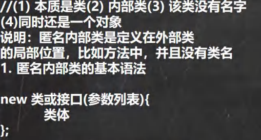

```java
/**
* 演示匿名内部类的使用
*/
public class AnonymousInnerClass {
	public static void main(String[] args) {
		Outer04 outer04 = new Outer04();
		outer04.method();
	}
}

class Outer04 { //外部类
	private int n1 = 10;//属性
	public void method() {//方法
		//基于接口的匿名内部类
		//老韩解读
		//1.需求： 想使用 IA 接口,并创建对象
		//2.传统方式，是写一个类，实现该接口，并创建对象 
		//3.老韩需求是 Tiger/Dog 类只是使用一次，后面再不使用
		//4. 可以使用匿名内部类来简化开发
		//5. tiger 的编译类型 ? IA
		//6. tiger 的运行类型 ? 就是匿名内部类 Outer04$1
		/*
			我们看底层 会分配 类名 Outer04$1
			class Outer04$1 implements IA {
				@Override
				public void cry() {
					System.out.println("老虎叫唤...");
				}
			}
		*/
        //7. jdk 底层在创建匿名内部类 Outer04$1,立即马上就创建了 Outer04$1 实例，并且把地址
        // 返回给 tiger
		//8. 匿名内部类使用一次，就不能再使用
		IA tiger = new IA() {
			@Override
			public void cry() {
				System.out.println("老虎叫唤...");
			}
		};
		System.out.println("tiger 的运行类型=" + tiger.getClass());
		tiger.cry();
		tiger.cry();
		tiger.cry();
        
		// IA tiger = new Tiger();
		// tiger.cry();
		//演示基于类的匿名内部类
		//分析
        //1. father 编译类型 Father
		//2. father 运行类型 Outer04$2
		//3. 底层会创建匿名内部类
		/*
			class Outer04$2 extends Father{
				@Override
				public void test() {
					System.out.println("匿名内部类重写了 test 方法");
				}
			}
		*/
		//4. 同时也直接返回了 匿名内部类 Outer04$2 的对象
		//5. 注意("jack") 参数列表会传递给 构造器
		Father father = new Father("jack"){
            
			@Override
			public void test() {
				System.out.println("匿名内部类重写了 test 方法");
			}
		};
		System.out.println("father 对象的运行类型=" + father.getClass());//Outer04$2
		father.test();
        
		//基于抽象类的匿名内部类
		Animal animal = new Animal(){
			@Override
            void eat() {
				System.out.println("小狗吃骨头...");
			}
		};
		animal.eat();
	}
}

interface IA {//接口
	public void cry();
}
//class Tiger implements IA {
//
// 	@Override
// 	public void cry() {
// 		System.out.println("老虎叫唤...");
// 	}
//}
//class Dog implements IA{
// 	@Override
// 	public void cry() {
// 		System.out.println("小狗汪汪...");
// 	}
//}

class Father {//类
    public Father(String name) {//构造器
		System.out.println("接收到 name=" + name);
	}
    
	public void test() {//方法
	}
}

abstract class Animal { //抽象类
	abstract void eat();
}
```


#### （6）成员内部类的使用


```java
public class MemberInnerClass01 {
    
    public static void main(String[] args) {
		Outer08 outer08 = new Outer08();
		outer08.t1();
        
		//外部其他类，使用成员内部类的三种方式
		//老韩解读
		// 第一种方式
		// outer08.new Inner08(); 相当于把 new Inner08()当做是 outer08 成员
		// 这就是一个语法，不要特别的纠结.
        Outer08.Inner08 inner08 = outer08.new Inner08();
		inner08.say();
		// 第二方式 在外部类中，编写一个方法，可以返回 Inner08 对象
		Outer08.Inner08 inner08Instance = outer08.getInner08Instance();
		inner08Instance.say();
	} 
}

class Outer08 { //外部类
	private int n1 = 10;
	public String name = "张三";
    
	private void hi() {
		System.out.println("hi()方法...");
	}
    
    //1.注意: 成员内部类，是定义在外部内的成员位置上
	//2.可以添加任意访问修饰符(public、protected 、默认、private),因为它的地位就是一个成员
    public class Inner08 {//成员内部类
		private double sal = 99.8;
		private int n1 = 66;
		public void say() {
			//可以直接访问外部类的所有成员，包含私有的
			//如果成员内部类的成员和外部类的成员重名，会遵守就近原则. 
            //，可以通过 外部类名.this.属性 来访问外部类的成员
			System.out.println("n1 = " + n1 + " name = " + name + " 外部类的 n1=" + Outer08.this.n1);
			hi();
		}
	}
    
	//方法，返回一个 Inner08 实例
	public Inner08 getInner08Instance(){
		return new Inner08();
	}
    
	//写方法
	public void t1() {
		//使用成员内部类
		//创建成员内部类的对象，然后使用相关的方法
		Inner08 inner08 = new Inner08();
		inner08.say();
        System.out.println(inner08.sal);
    }
}    
```


#### （7）静态内部类的使用


8.只有静态内部类才能够定义静态的成员变量与成员方法。

```java
public class StaticInnerClass01 {
    
	public static void main(String[] args) {
		Outer10 outer10 = new Outer10();
		outer10.m1();
        
		//外部其他类 使用静态内部类
        //方式 1
		//因为静态内部类，是可以通过类名直接访问(前提是满足访问权限)
		Outer10.Inner10 inner10 = new Outer10.Inner10();
		inner10.say();
		//方式 2
		//编写一个方法，可以返回静态内部类的对象实例. 
        Outer10.Inner10 inner101 = outer10.getInner10();
		System.out.println("============");
		inner101.say();
        
		Outer10.Inner10 inner10_ = Outer10.getInner10_();
		System.out.println("************");
		inner10_.say();
	}
}

class Outer10 { //外部类
	private int n1 = 10;
	private static String name = "张三";
	private static void cry() {}
	//Inner10 就是静态内部类
	//1. 放在外部类的成员位置
	//2. 使用 static 修饰
	//3. 可以直接访问外部类的所有静态成员，包含私有的，但不能直接访问非静态成员
	//4. 可以添加任意访问修饰符(public、protected 、默认、private),因为它的地位就是一个成员
    //5. 作用域 ：同其他的成员，为整个类体
    static class Inner10 {
		private static String name = "韩顺平教育";
		public void say() {
			//如果外部类和静态内部类的成员重名时，静态内部类访问的时，
			//默认遵循就近原则，如果想访问外部类的成员，则可以使用 （外部类名.成员）
            System.out.println(name + " 外部类 name= " + Outer10.name);
			cry();
		}
	}
    
    public void m1() { //外部类---访问------>静态内部类 访问方式：创建对象，再访问
		Inner10 inner10 = new Inner10();
		inner10.say();
	}
    
	public Inner10 getInner10() {
		return new Inner10();
	}
    
	public static Inner10 getInner10_() {
		return new Inner10();
	}
}
```


## 十一、枚举和注解

### 1 枚举

1) 枚举对应英文(enumeration, 简写 enum)
2) 枚举是一组常量的集合。
3) 可以这里理解：枚举属于一种特殊的类，里面只包含一组有限的特定的对象。

### 2 枚举的二种实现方式

1. 自定义类实现枚举

2) 使用 enum 关键字实现枚举

### 3 自定义类实现枚举-应用案例


```java
public class Enumeration02 {
	public static void main(String[] args) {
		System.out.println(Season.AUTUMN);
		System.out.println(Season.SPRING);
	}
}

//演示字定义枚举实现
class Season {//类
	private String name;
	private String desc;//描述
    
	//定义了四个对象, 固定. 
    public static final Season SPRING = new Season("春天", "温暖");
	public static final Season WINTER = new Season("冬天", "寒冷");
	public static final Season AUTUMN = new Season("秋天", "凉爽");
	public static final Season SUMMER = new Season("夏天", "炎热");
    
	//1. 将构造器私有化,目的防止 直接 new
	//2. 去掉 setXxx 方法, 防止属性被修改
    //3. 在 Season 内部，直接创建固定的对象
	//4. 优化，可以加入 final 修饰符
    private Season(String name, String desc) {
		this.name = name;
		this.desc = desc;
	}
    
	public String getName() {
		return name;
	}
    
	public String getDesc() {
		return desc;
	}
    
	@Override
	public String toString() {
		return "Season{" +
			"name='" + name + '\'' +
			", desc='" + desc + '\'' +
			'}';
	}
}
```


### 4 自定义类实现枚举-小结

小结：进行自定义类实现枚举，有如下特点：

1) 构造器私有化
2) 本类内部创建一组对象[四个 春夏秋冬]
3) 对外暴露对象（通过为对象添加 public final static 修饰符）
4) 可以提供 get 方法，但是不要提供 set


### 5 enum 关键字实现枚举-快速入门

#### （1）说明

```java
public class Enumeration03 {
	public static void main(String[] args) {
		System.out.println(Season2.AUTUMN);
		System.out.println(Season2.SUMMER);
	}
}

//演示使用 enum 关键字来实现枚举类
enum Season2 {//类
    
    //定义了四个对象, 固定. 
    // public static final Season SPRING = new Season("春天", "温暖");
	// public static final Season WINTER = new Season("冬天", "寒冷");
	// public static final Season AUTUMN = new Season("秋天", "凉爽");
	// public static final Season SUMMER = new Season("夏天", "炎热");
	//如果使用了 enum 来实现枚举类
	//1. 使用关键字 enum 替代 class
	//2. public static final Season SPRING = new Season("春天", "温暖") 直接使用
		// SPRING("春天", "温暖") 解读 常量名(实参列表)
	//3. 如果有多个常量(对象)， 使用 ,号间隔即可
	//4. 如果使用 enum 来实现枚举，要求将定义常量对象，写在前面
	//5. 如果我们使用的是无参构造器，创建常量对象，则可以省略 ()
	SPRING("春天", "温暖"), WINTER("冬天", "寒冷"), AUTUMN("秋天", "凉爽"), SUMMER("夏天", "炎热")/*, What()*/;
    
	private String name;
	private String desc;//描述
    
	private Season2() {//无参构造器
	}
    
   
	private Season2(String name, String desc) {
		this.name = name;
		this.desc = desc;
	}
    
    public String getName() {
		return name;
	}
    
	public String getDesc() {
		return desc;
	}
    
	@Override
	public String toString() {
		return "Season{" +
			"name='" + name + '\'' +
			", desc='" + desc + '\'' +
		'}';
	}
    
}
```


#### （2）enum 关键字实现枚举注意事项

1) 当我们使用 enum 关键字开发一个枚举类时，默认会继承 Enum 类, 而且是一个 final 类[如何证明],老师使用javap工具来演示
2) 传统的 public static final Season2 SPRING = new Season2("春天", "温暖"); 简化成 SPRING("春天", "温暖")，这里必须知道，它调用的是哪个构造器. 
3) 如果使用无参构造器 创建 枚举对象，则实参列表和小括号都可以省略

4) 当有多个枚举对象时，使用,间隔，最后有一个分号结尾
5) 枚举对象必须放在枚举类的行首.


### 6 enum 常 2 用方法说明

说明：使用关键字 enum 时，会隐式继承 Enum 类, 这样我们就可以使用 Enum 类相关的方法。[看下源码定义.]

```java
public abstract class Enum<E extends Enum<E>>
    	implements Comparable<E>, Serializable {
}
```


### 7 enum 常用方法应用实例

我们一起来举例说明 enum 常用的方法的使用，对 Season2 测试

1) toString:Enum 类已经重写过了，返回的是当前对象名,子类可以重写该方法，用于返回对象的属性信息
2) name：返回当前对象名（常量名），子类中不能重写
3) ordinal：返回当前对象的位置号，默认从 0 开始
4) values：返回当前枚举类中所有的常量
5) valueOf：将字符串转换成枚举对象，要求字符串必须为已有的常量名，否则报异常！
6) compareTo：比较两个枚举常量，比较的就是编号！


### 8 enum 实现接口

1) 使用 enum 关键字后，就不能再继承其它类了，因为 enum 会隐式继承 Enum，而 Java 是单继承机制。
1) 枚举类和普通类一样，可以实现接口，如下形式。
enum 类名 implements 接口 1，接口 2{}

```java
public class EnumDetail {
	public static void main(String[] args) {
		Music.CLASSICMUSIC.playing();
	}
}

class A {
}

//1.使用 enum 关键字后，就不能再继承其它类了，因为 enum 会隐式继承 Enum，而 Java 是单继承机制
//enum Season3 extends A {
//
//}
//2.enum 实现的枚举类，仍然是一个类，所以还是可以实现接口的.
```


### 9 注解的理解

1) 注解(Annotation)也被称为元数据(Metadata)，用于修饰解释 包、类、方法、属性、构造器、局部变量等数据信息。
2) 和注释一样，注解不影响程序逻辑，但注解可以被编译或运行，相当于嵌入在代码中的补充信息。
3) 在 JavaSE 中，注解的使用目的比较简单，例如标记过时的功能，忽略警告等。在 JavaEE 中注解占据了更重要的角色，例如用来配置应用程序的任何切面，代替 java EE 旧版中所遗留的繁冗代码和 XML 配置等。


### 10 基本的 Annotation 介绍

使用 Annotation 时要在其前面增加 @ 符号, 并把该 Annotation 当成一个修饰符使用。用于修饰它支持的程序元素 

三个基本的 Annotation:

1) @Override: 限定某个方法，是重写父类方法, 该注解只能用于方法
2) @Deprecated: 用于表示某个程序元素(类, 方法等)已过时
3) @SuppressWarnings: 抑制编译器警告


### 11 基本的 Annotation 应用案例

#### （1）@Override 注解的案例


#### （2）@Deprecated 注解的案例

@Deprecated: 用于表示某个程序元素(类, 方法等)已过时

```java
public class Deprecated_ {
	public static void main(String[] args) {
		A a = new A();
		a.hi();
		System.out.println(a.n1);
	}
}

//1. @Deprecated 修饰某个元素, 表示该元素已经过时
//2. 即不在推荐使用，但是仍然可以使用
//3. 查看 @Deprecated 注解类的源码
//4. 可以修饰方法，类，字段, 包, 参数 等等
//5. @Deprecated 可以做版本升级过渡使用
/*
@Documented
@Retention(RetentionPolicy.RUNTIME)
@Target(value={CONSTRUCTOR, FIELD, LOCAL_VARIABLE, METHOD, PACKAGE, PARAMETER, TYPE})
public @interface Deprecated {
}
*/
@Deprecated
class A {
	@Deprecated
	public int n1 = 10;
	@Deprecated
	public void hi(){
	}
}

```


#### （3）@SuppressWarnings 注解的案例

@SuppressWarnings: 抑制编译器警告

```java
@SuppressWarnings({"rawtypes", "unchecked", "unused"})
public class SuppressWarnings_ {
    
	//老韩解读
	//1. 当我们不希望看到这些警告的时候，可以使用 SuppressWarnings 注解来抑制警告信息
    //2. 在{""} 中，可以写入你希望抑制(不显示)警告信息
	//3. 可以指定的警告类型有
		// all，抑制所有警告
		// boxing，抑制与封装/拆装作业相关的警告
		// //cast，抑制与强制转型作业相关的警告
		// //dep-ann，抑制与淘汰注释相关的警告
		// //deprecation，抑制与淘汰的相关警告
		// //fallthrough，抑制与 switch 陈述式中遗漏 break 相关的警告
		// //finally，抑制与未传回 finally 区块相关的警告
		// //hiding，抑制与隐藏变数的区域变数相关的警告
		// //incomplete-switch，抑制与 switch 陈述式(enum case)中遗漏项目相关的警告
    	// //javadoc，抑制与 javadoc 相关的警告
    	// //nls，抑制与非 nls 字串文字相关的警告
		// //null，抑制与空值分析相关的警告
		// //rawtypes，抑制与使用 raw 类型相关的警告
		// //resource，抑制与使用 Closeable 类型的资源相关的警告
		// //restriction，抑制与使用不建议或禁止参照相关的警告
		// //serial，抑制与可序列化的类别遗漏 serialVersionUID 栏位相关的警告
		// //static-access，抑制与静态存取不正确相关的警告
		// //static-method，抑制与可能宣告为 static 的方法相关的警告
		// //super，抑制与置换方法相关但不含 super 呼叫的警告
		// //synthetic-access，抑制与内部类别的存取未最佳化相关的警告
		// //sync-override，抑制因为置换同步方法而遗漏同步化的警告
		// //unchecked，抑制与未检查的作业相关的警告
		// //unqualified-field-access，抑制与栏位存取不合格相关的警告
		// //unused，抑制与未用的程式码及停用的程式码相关的警告
	//4. 关于 SuppressWarnings 作用范围是和你放置的位置相关
		// 比如 @SuppressWarnings 放置在 main 方法，那么抑制警告的范围就是 main
		// 通常我们可以放置具体的语句, 方法, 类. 
    //5. 看看 @SuppressWarnings 源码
	//(1) 放置的位置就是 TYPE, FIELD, METHOD, PARAMETER, CONSTRUCTOR, LOCAL_VARIABLE
	//(2) 该注解类有数组 String[] values() 设置一个数组比如 {"rawtypes", "unchecked", "unused"}
    
	/*
		@Target({TYPE, FIELD, METHOD, PARAMETER, CONSTRUCTOR, LOCAL_VARIABLE})
			@Retention(RetentionPolicy.SOURCE)
			public @interface SuppressWarnings {
				String[] value();
			}
	*/
    
    public static void main(String[] args) {
		List list = new ArrayList();
		list.add("jack");
		list.add("tom");
		list.add("mary");
		int i;
		System.out.println(list.get(1));
	}
    
    public void f1() {
		// @SuppressWarnings({"rawtypes"})
		List list = new ArrayList();
        
		list.add("jack");
		list.add("tom");
		list.add("mary");
		// @SuppressWarnings({"unused"})
		int i;
		System.out.println(list.get(1));
	}
}
```


### 12 JDK 的元 Annotation(元注解， 了解)

#### （1）元注解的基本介绍

JDK 的元 Annotation 用于修饰其他 Annotation

元注解： 本身作用不大，讲这个原因希望同学们，看源码时，可以知道他是干什么.


#### （2）元注解的种类 (使用不多，了解, 不用深入研究)

1) Retention //指定注解的作用范围，三种 SOURCE,CLASS,RUNTIME
2) Target // 指定注解可以在哪些地方使用
3) Documented //指定该注解是否会在 javadoc 体现
4) Inherited //子类会继承父类注解


#### （3）@Retention 注解

说明

只能用于修饰一个 Annotation 定义, 用于指定该 Annotation 可以保留多长时间, @Rentention 包含一个RetentionPolicy类型的成员变量, 使用 @Rentention 时必须为该 value 成员变量指定值:

@Retention 的三种值

1) RetentionPolicy.SOURCE: 编译器使用后，直接丢弃这种策略的注释
2) RetentionPolicy.CLASS: 编译器将把注解记录在 class 文件中. 当运行 Java 程序时, JVM 不会保留注解。这是默认值

3) RetentionPolicy.RUNTIME:编译器将把注解记录在 class 文件中. 当运行 Java 程序时, JVM会保留注解. 程序可以通过反射获取该注解


#### （4）@Target


#### （5）@Documented


#### （6）@Inherited 注解


## 十二、异常-Exception

### 1 看个实际的问题和一段代码

运行下面的代码，看看有什么问题-> 引出异常和异常处理机制

```java
public static void main(String[] args) {
	int num1 = 10;
	int num2 = 0;
	int res = num1 / num2;
	System.out.println("程序继续运行....");
}
```

### 2 解决方案-异常捕获

对异常进行捕获，保证程序可以继续运行.

看老师的代码演示 try-catch

```java
public class Exception01 {
	public static void main(String[] args) {
		int num1 = 10;
		int num2 = 0;//Scanner();
        
		//老韩解读
        //1. num1 / num2 => 10 / 0
		//2. 当执行到 num1 / num2 因为 num2 = 0, 程序就会出现(抛出)异常 ArithmeticException
		//3. 当抛出异常后，程序就退出，崩溃了 , 下面的代码就不在执行
		//4. 大家想想这样的程序好吗? 不好，不应该出现了一个不算致命的问题，就导致整个系统崩溃
        //5. java 设计者，提供了一个叫 异常处理机制来解决该问题
		// int res = num1 / num2;
		//如果程序员，认为一段代码可能出现异常/问题，可以使用 try-catch 异常处理机制来解决
        //从而保证程序的健壮性
		//将该代码块->选中->快捷键 ctrl + alt + t -> 选中 try-catch
		//6. 如果进行异常处理，那么即使出现了异常，程序可以继续执行
		try {
			int res = num1 / num2;
		} catch (Exception e) {
			//e.printStackTrace();
			System.out.println("出现异常的原因=" + e.getMessage());//输出异常信息
		}
		System.out.println("程序继续运行....");
	}
}
```


### 3 异常介绍


### 4 异常体系图一览

#### （1）异常体系图


#### （2）异常体系图的小结


### 5 常见的运行时异常

#### （1）常见的运行时异常包括

1) NullPointerException 空指针异常
2) ArithmeticException 数学运算异常
3) ArrayIndexOutOfBoundsException 数组下标越界异常
4) ClassCastException 类型转换异常
5) NumberFormatException 数字格式不正确异常[]

#### （2）常见的运行时异常举例

1) NullPointerException 空指针异常
当应用程序试图在需要对象的地方使用 null 时，抛出该异常,看案例演示。


```java
public class NullPointerException_ {
	public static void main(String[] args) {
		String name = null;
		System.out.println(name.length());
	}
}
```


2) ArithmeticException 数学运算异常
   当出现异常的运算条件时，抛出此异常。例如，一个整数“除以零”时，抛出此类的一个实例, 案例演示


```java
public class NumberFormatException_ {
	public static void main(String[] args) {
		int num1 = 10;
		int num2 = 0;
		int res = num1 / num2;//抛出 ArithmeticException
	}
}
```


3) ArrayIndexOutOfBoundsException 数组下标越界异常
   用非法索引访问数组时抛出的异常。如果索引为负或大于等于数组大小，则该索引为非法索引


```java
public class ArrayIndexOutOfBoundsException_ {
	public static void main(String[] args) {
		int[] arr = {1,2,4};
		for (int i = 0; i <= arr.length; i++) {
			System.out.println(arr[i]);
		}
    }
}    
```


4) ClassCastException 类型转换异常
   当试图将对象强制转换为不是实例的子类时，抛出该异常。例如，以下代码将生成一个ClassCastException


```java
public class ClassCastException_ {
	public static void main(String[] args) {
		A b = new B(); //向上转型
		B b2 = (B)b;//向下转型，这里是 OK
		C c2 = (C)b;//这里抛出 ClassCastException
	}
}

class A {}
class B extends A {}
class C extends A {}
```


5) NumberFormatException 数字格式不正确异常
   当应用程序试图将字符串转换成一种数值类型，但该字符串不能转换为适当格式时，抛出该异常=> 使用异常我们可以确保输入是满足条件数字.


```java
public class NumberFormatException_ {
	public static void main(String[] args) {
		String name = "韩顺平教育";
		//将 String 转成 int
		int num = Integer.parseInt(name);//抛出 NumberFormatException
		System.out.println(num);//1234
	}
}
```


### 6 编译异常

#### （1）介绍


#### （2）常见的编译异常


#### （3）案例说明


```java
public class Exception02 {
	public static void main(String[] args) {
        
		try {
            FileInputStream fis;
			fis = new FileInputStream("d:\\aa.jpg");
			int len;
			while ((len = fis.read()) != -1) {
				System.out.println(len);
			}
			fis.close();
		} catch (IOException e) {
			e.printStackTrace();
		}
	}
}
```


### 7 异常处理

#### （1）基本介绍


#### （2）异常处理的方式


#### （3）示意图


### 8 try-catch 异常处理

#### （1）try-catch 方式处理异常说明


#### （2）try-catch 方式处理异常-注意事项


```java
public class TryCatchDetail02 {
	public static void main(String[] args) {
        //老韩解读
		//1.如果 try 代码块有可能有多个异常
		//2.可以使用多个 catch 分别捕获不同的异常，相应处理
		//3.要求子类异常写在前面，父类异常写在后面
		try {
			Person person = new Person();
			//person = null;
			System.out.println(person.getName());//NullPointerException
			int n1 = 10;
			int n2 = 0;
			int res = n1 / n2;//ArithmeticException
		} catch (NullPointerException e) {
			System.out.println("空指针异常=" + e.getMessage());
        } catch (ArithmeticException e) {
			System.out.println("算术异常=" + e.getMessage());
		} catch (Exception e) {
			System.out.println(e.getMessage());
		} finally {
		}
	}
}

class Person {
    
	private String name = "jack";
    
	public String getName() {
		return name;
	}
    
}
```


### 9 throws 异常处理

#### （1）基本介绍


#### （2）快速入门案例


#### （3）注意事项和使用细节


### 10 自定义异常

#### （1）基本概念


#### （2）自定义异常的步骤


#### （3）自定义异常的应用实例


```java
public class CustomException {
	public static void main(String[] args) /*throws AgeException*/ {
    
		int age = 180;
		//要求范围在 18 – 120 之间，否则抛出一个自定义异常
		if(!(age >= 18 && age <= 120)) {
			//这里我们可以通过构造器，设置信息
			throw new AgeException("年龄需要在 18~120 之间");
		}
		System.out.println("你的年龄范围正确.");
	}
}

//自定义一个异常
//老韩解读
//1. 一般情况下，我们自定义异常是继承 RuntimeException
//2. 即把自定义异常做成 运行时异常，好处时，我们可以使用默认的处理机制
//3. 即比较方便
class AgeException extends RuntimeException {
	public AgeException(String message) {//构造器
		super(message);
	}
}
```


### 11 throw 和 throws 的区别

#### （1）一览表


## 十三、常用类

### 1 包装类

#### （1）包装类的分类

1) 针对八种基本数据类型相应的引用类型—包装类
2) 有了类的特点，就可以调用类中的方法。
3) 如图:

#### （2）包装类和基本数据的转换


#### （3）案例演示

```java
public class Integer01 {
	public static void main(String[] args) {
		//演示 int <--> Integer 的装箱和拆箱
		//jdk5 前是手动装箱和拆箱
		//手动装箱 int->Integer
		int n1 = 100;
		Integer integer = new Integer(n1);
		Integer integer1 = Integer.valueOf(n1);
        
		//手动拆箱
		//Integer -> int
		int i = integer.intValue();
        
		//jdk5 后，就可以自动装箱和自动拆箱
		int n2 = 200;
		//自动装箱 int->Integer
		Integer integer2 = n2; //底层使用的是 Integer.valueOf(n2)
		//自动拆箱 Integer->int
		int n3 = integer2; //底层仍然使用的是 intValue()方法
	}
}        
```


#### （4）包装类型和 String 类型的相互转换

案例演示, 以 Integer 和 String 转换为例，其它类似:

```java
public class WrapperVSString {
	public static void main(String[] args) {
		//包装类(Integer)->String
		Integer i = 100;//自动装箱
        //方式 1
		String str1 = i + "";
		//方式 2
		String str2 = i.toString();
		//方式 3
		String str3 = String.valueOf(i);
        
		//String -> 包装类(Integer)
		String str4 = "12345";
		Integer i2 = Integer.parseInt(str4);//使用到自动装箱
		Integer i3 = new Integer(str4);//构造器
        
		System.out.println("ok~~");
	}
}

```


#### （5） Integer 类和 Character 类的常用方法

```java
public class WrapperMethod {
	public static void main(String[] args) {
		System.out.println(Integer.MIN_VALUE); //返回最小值
		System.out.println(Integer.MAX_VALUE);//返回最大值
		System.out.println(Character.isDigit('a'));//判断是不是数字
		System.out.println(Character.isLetter('a'));//判断是不是字母
		System.out.println(Character.isUpperCase('a'));//判断是不是大写
		System.out.println(Character.isLowerCase('a'));//判断是不是小写
		System.out.println(Character.isWhitespace('a'));//判断是不是空格
		System.out.println(Character.toUpperCase('a'));//转成大写
		System.out.println(Character.toLowerCase('A'));//转成小写
	}
}
```


#### （6）Integer 类面试题

```java
public class WrapperExercise02 {
    
    public static void main(String[] args) {
		Integer i = new Integer(1);
		Integer j = new Integer(1);
		System.out.println(i == j); //False
		//所以，这里主要是看范围 -128 ~ 127 就是直接返回
		/*
		老韩解读
		//1. 如果 i 在 IntegerCache.low(-128)~IntegerCache.high(127),就直接从数组返回
		//2. 如果不在 -128~127,就直接 new Integer(i)
		public static Integer valueOf(int i) {
			if (i >= IntegerCache.low && i <= IntegerCache.high)
				return IntegerCache.cache[i + (-IntegerCache.low)];
			return new Integer(i);
		}
		*/
        
		Integer m = 1; //底层 Integer.valueOf(1); -> 阅读源码
		Integer n = 1;//底层 Integer.valueOf(1);
		System.out.println(m == n); //T
		//所以，这里主要是看范围 -128 ~ 127 就是直接返回
		//，否则，就 new Integer(xx);
		Integer x = 128;//底层 Integer.valueOf(1);
		Integer y = 128;//底层 Integer.valueOf(1);
		System.out.println(x == y);//False
	}
}
```


### 2 String 类

#### （1）String 类的理解和创建对象


```java
public class String01 {
	public static void main(String[] args) {
		//1.String 对象用于保存字符串，也就是一组字符序列
		//2. "jack" 字符串常量, 双引号括起的字符序列
		//3. 字符串的字符使用 Unicode 字符编码，一个字符(不区分字母还是汉字)占两个字节
        //4. String 类有很多构造器，构造器的重载
        // 常用的有 String s1 = new String(); //
		//String s2 = new String(String original);
		//String s3 = new String(char[] a);
		//String s4 = new String(char[] a,int startIndex,int count)
		//String s5 = new String(byte[] b)
		//5. String 类实现了	接口 Serializable【String 可以串行化:可以在网络传输】	接口 Comparable [String 对象可以比较大小]
		//6. String 是 final 类，不能被其他的类继承
		//7. String 有属性 private final char value[]; 用于存放字符串内容
		//8. 一定要注意：value 是一个 final 类型， 不可以修改(需要功力)：即 value 不能指向
        // 新的地址，但是单个字符内容是可以变化
		String name = "jack";
		name = "tom";
		final char[] value = {'a','b','c'};
		char[] v2 = {'t','o','m'};
		value[0] = 'H';
		//value = v2; 不可以修改 value 地址
	}
}
```


#### （2）创建 String 对象的两种方式

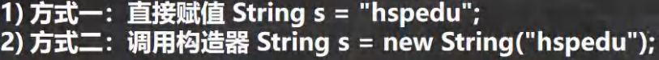


#### （3）两种创建 String 对象的区别


### 3 字符串的特性

#### （1）说明


### 4 String 类的常见方法

#### （1）说明


#### （2）String 类的常见方法一览


### 5 StringBuffer 类

#### （1）基本介绍


```java
public class StringBuffer01 {
	public static void main(String[] args) {
		//老韩解读
		//1. StringBuffer 的直接父类 是 AbstractStringBuilder
		//2. StringBuffer 实现了 Serializable, 即 StringBuffer 的对象可以串行化
		//3. 在父类中 AbstractStringBuilder 有属性 char[] value,不是 final
		// 该 value 数组存放 字符串内容，引出存放在堆中的
		//4. StringBuffer 是一个 final 类，不能被继承
		//5. 因为 StringBuffer 字符内容是存在 char[] value, 所有在变化(增加/删除)
		// 不用每次都更换地址(即不是每次创建新对象)， 所以效率高于 String
        
		StringBuffer stringBuffer = new StringBuffer("hello");
    }
}        
```


#### （2）String VS StringBuffer


#### （3）String 和 StringBuffer 相互转换

```java
public class StringAndStringBuffer {
	public static void main(String[] args) {
        
		//看 String——>StringBuffer
        String str = "hello tom";
		//方式 1 使用构造器
		//注意： 返回的才是 StringBuffer 对象，对 str 本身没有影响
		StringBuffer stringBuffer = new StringBuffer(str);
		//方式 2 使用的是 append 方法
		StringBuffer stringBuffer1 = new StringBuffer();
		stringBuffer1 = stringBuffer1.append(str);
        
		//看看 StringBuffer ->String
		StringBuffer stringBuffer3 = new StringBuffer("韩顺平教育");
		//方式 1 使用 StringBuffer 提供的 toString 方法
		String s = stringBuffer3.toString();
		//方式 2: 使用构造器来搞定
		String s1 = new String(stringBuffer3);
        
	}
}
```


#### 4 StringBuffer 类常见方法

```java
public class StringBufferMethod {
	public static void main(String[] args) {
        
		StringBuffer s = new StringBuffer("hello");
        
		//增
		s.append(',');// "hello,"
		s.append("张三丰");//"hello,张三丰"
		s.append("赵敏").append(100).append(true).append(10.5);//"hello,张三丰赵敏 100true10.5" 
        System.out.println(s);//"hello,张三丰赵敏 100true10.5"
        
		//删
		/*
		* 删除索引为>=start && <end 处的字符
		* 解读: 删除 11~14 的字符 [11, 14)
		*/
		s.delete(11, 14);
		System.out.println(s);//"hello,张三丰赵敏 true10.5"
        
		//改
		//老韩解读，使用 周芷若 替换 索引 9-11 的字符 [9,11)
		s.replace(9, 11, "周芷若");
		System.out.println(s);//"hello,张三丰周芷若 true10.5"
		//查找指定的子串在字符串第一次出现的索引，如果找不到返回-1
		int indexOf = s.indexOf("张三丰");
		System.out.println(indexOf);//6
        
		//插
        //老韩解读，在索引为 9 的位置插入 "赵敏",原来索引为 9 的内容自动后移
		s.insert(9, "赵敏");
		System.out.println(s);//"hello,张三丰赵敏周芷若 true10.5"
		//长度
		System.out.println(s.length());//22
		System.out.println(s);
	}
}
```


### 5 StringBuilder 类

#### （1）基本介绍


```java
public class StringBuffer01 {
	public static void main(String[] args) {
		//老韩解读
		//1. StringBuffer 的直接父类 是 AbstractStringBuilder
		//2. StringBuffer 实现了 Serializable, 即 StringBuffer 的对象可以串行化
		//3. 在父类中 AbstractStringBuilder 有属性 char[] value,不是 final
		// 该 value 数组存放 字符串内容，引出存放在堆中的
        //4. StringBuffer 是一个 final 类，不能被继承
		//5. 因为 StringBuffer 字符内容是存在 char[] value, 所有在变化(增加/删除)
		// 不用每次都更换地址(即不是每次创建新对象)， 所以效率高于 String
        StringBuffer stringBuffer = new StringBuffer("hello");
    }
}
```


#### （2）StringBuilder 常用方法


```java
public class StringBuilder01 {
	public static void main(String[] args) {
        //老韩解读
		//1. StringBuilder 继承 AbstractStringBuilder 类
		//2. 实现了 Serializable ,说明 StringBuilder 对象是可以串行化(对象可以网络传输,可以保存到文件)
		//3. StringBuilder 是 final 类, 不能被继承
		//4. StringBuilder 对象字符序列仍然是存放在其父类 AbstractStringBuilder 的 char[] value;
		// 因此，字符序列是堆中
		//5. StringBuilder 的方法，没有做互斥的处理,即没有 synchronized 关键字,因此在单线程的情况下使用
        // StringBuilder
		StringBuilder stringBuilder = new StringBuilder();
	}
}
```


#### （3）String、StringBuffer 和 StringBuilder 的比较


#### （4） String、StringBuffer 和 StringBuilder 的选择


### 7 Math 类

#### （1）基本介绍

Math 类包含用于执行基本数学运算的方法，如初等指数、对数、平方根和三角函数。

#### （2）方法一览(均为静态方法)


#### （3）Math 类常见方法应用案例

```java
public class MathMethod {
	public static void main(String[] args) {
		//看看 Math 常用的方法(静态方法)
		//1.abs 绝对值
		int abs = Math.abs(-9);
		System.out.println(abs);//9
    	//2.pow 求幂
		double pow = Math.pow(2, 4);//2 的 4 次方
		System.out.println(pow);//16
		//3.ceil 向上取整,返回>=该参数的最小整数(转成 double);
		double ceil = Math.ceil(3.9);
		System.out.println(ceil);//4.0
		//4.floor 向下取整，返回<=该参数的最大整数(转成 double)
		double floor = Math.floor(4.001);
		System.out.println(floor);//4.0
		//5.round 四舍五入 Math.floor(该参数+0.5)
		long round = Math.round(5.51);
		System.out.println(round);//6
		//6.sqrt 求开方
		double sqrt = Math.sqrt(9.0);
		System.out.println(sqrt);//3.0
        
		//7.random 求随机数
		// random 返回的是 0 <= x < 1 之间的一个随机小数
		// 思考：请写出获取 a-b 之间的一个随机整数,a,b 均为整数 ，比如 a = 2, b=7
		// 即返回一个数 x 2 <= x <= 7
		// 老韩解读 Math.random() * (b-a) 返回的就是 0 <= 数 <= b-a
		// (1) (int)(a) <= x <= (int)(a + Math.random() * (b-a +1) )
		// (2) 使用具体的数给小伙伴介绍 a = 2 b = 7
		// (int)(a + Math.random() * (b-a +1) ) = (int)( 2 + Math.random()*6)
		// Math.random()*6 返回的是 0 <= x < 6 小数
		// 2 + Math.random()*6 返回的就是 2<= x < 8 小数
        // (int)(2 + Math.random()*6) = 2 <= x <= 7
		// (3) 公式就是 (int)(a + Math.random() * (b-a +1) )
		for(int i = 0; i < 100; i++) {
			System.out.println((int)(2 + Math.random() * (7 - 2 + 1)));
		}
			
        //max , min 返回最大值和最小值
		int min = Math.min(1, 9);
		int max = Math.max(45, 90);
		System.out.println("min=" + min);
		System.out.println("max=" + max);
	}
}
```


### 8 Arrays 类

#### （1）Arrays 类常见方法应用案例


```java
public class ArraysMethod01 {
	public static void main(String[] args) {
        
		Integer[] integers = {1, 20, 90};
		//遍历数组
		// for(int i = 0; i < integers.length; i++) {
		// 		System.out.println(integers[i]);
		// }
		//直接使用 Arrays.toString 方法，显示数组
		// System.out.println(Arrays.toString(integers));//
        
		//演示 sort 方法的使用
        
		Integer arr[] = {1, -1, 7, 0, 89};
		//进行排序
		//老韩解读
		//1. 可以直接使用冒泡排序 , 也可以直接使用 Arrays 提供的 sort 方法排序
		//2. 因为数组是引用类型，所以通过 sort 排序后，会直接影响到 实参 arr
		//3. sort 重载的，也可以通过传入一个接口 Comparator 实现定制排序
		//4. 调用 定制排序 时，传入两个参数 (1) 排序的数组 arr
		// (2) 实现了 Comparator 接口的匿名内部类 , 要求实现 compare 方法
		//5. 先演示效果，再解释
		//6. 这里体现了接口编程的方式 , 看看源码，就明白
        // 源码分析
		//(1) Arrays.sort(arr, new Comparator()
		//(2) 最终到 TimSort 类的 private static <T> void binarySort(T[] a, int lo, int hi, int start, Comparator<? super T> c)()
		//(3) 执行到 binarySort 方法的代码, 会根据动态绑定机制 c.compare()执行我们传入的// 匿名内部类的 compare ()
		// while (left < right) {
		// 		int mid = (left + right) >>> 1;
		// 		if (c.compare(pivot, a[mid]) < 0)
		// 			right = mid;
		// 		else
		// 			left = mid + 1;
		// 		}
		//(4) new Comparator() {
		// 		@Override
		// 		public int compare(Object o1, Object o2) {
		// 			Integer i1 = (Integer) o1;
		// 			Integer i2 = (Integer) o2;
		// 			return i2 - i1;
		// 		}
		// 	  }
		//(5) public int compare(Object o1, Object o2) 返回的值>0 还是 <0
		// 会影响整个排序结果, 这就充分体现了 接口编程+动态绑定+匿名内部类的综合使用
		// 将来的底层框架和源码的使用方式，会非常常见
		//Arrays.sort(arr); // 默认排序方法
		//定制排序
        Arrays.sort(arr, new Comparator() {
			@Override
			public int compare(Object o1, Object o2) {
				Integer i1 = (Integer) o1;
				Integer i2 = (Integer) o2;
				return i2 - i1;
			}
		});
		System.out.println("===排序后===");
		System.out.println(Arrays.toString(arr));//
	}
}

```

```java
public class ArraysSortCustom {
    
    public static void main(String[] args) {
		int[] arr = {1, -1, 8, 0, 20};
		//bubble01(arr);
        
		bubble02(arr, new Comparator() {
			@Override
			public int compare(Object o1, Object o2) {
				int i1 = (Integer) o1;
				int i2 = (Integer) o2;
				return i2 - i1;// return i2 - i1;
			}
		});
        
		System.out.println("==定制排序后的情况==");
		System.out.println(Arrays.toString(arr));
	}
    
	//使用冒泡完成排序
	public static void bubble01(int[] arr) {
		int temp = 0;
		for (int i = 0; i < arr.length - 1; i++) {
			for (int j = 0; j < arr.length - 1 - i; j++) {
				//从小到大
				if (arr[j] > arr[j + 1]) {
    				temp = arr[j];
					arr[j] = arr[j + 1];
					arr[j + 1] = temp;
				}
			}
		}
	}
    
	//结合冒泡 + 定制
	public static void bubble02(int[] arr, Comparator c) {
		int temp = 0;
		for (int i = 0; i < arr.length - 1; i++) {
			for (int j = 0; j < arr.length - 1 - i; j++) {
				//数组排序由 c.compare(arr[j], arr[j + 1])返回的值决定
				if (c.compare(arr[j], arr[j + 1]) > 0) {
					temp = arr[j];
					arr[j] = arr[j + 1];
					arr[j + 1] = temp;
				}
			}
		}
	}
}
```

```java
public class ArraysMethod02 {
	public static void main(String[] args) {
		Integer[] arr = {1, 2, 90, 123, 567};
		// binarySearch 通过二分搜索法进行查找，要求必须排好
		// 老韩解读
		//1. 使用 binarySearch 二叉查找
		//2. 要求该数组是有序的. 如果该数组是无序的，不能使用 binarySearch
		//3. 如果数组中不存在该元素，就返回 return -(low + 1); // key not found.
        int index = Arrays.binarySearch(arr, 567);
		System.out.println("index=" + index);
        
		//copyOf 数组元素的复制
		// 老韩解读
		//1. 从 arr 数组中，拷贝 arr.length 个元素到 newArr 数组中
		//2. 如果拷贝的长度 > arr.length 就在新数组的后面 增加 null
		//3. 如果拷贝长度 < 0 就抛出异常 NegativeArraySizeException
		//4. 该方法的底层使用的是 System.arraycopy()
		Integer[] newArr = Arrays.copyOf(arr, arr.length);
		System.out.println("==拷贝执行完毕后==");
        System.out.println(Arrays.toString(newArr));
        
		//ill 数组元素的填充
		Integer[] num = new Integer[]{9,3,2};
		//老韩解读
		//1. 使用 99 去填充 num 数组，可以理解成是替换原理的元素
		Arrays.fill(num, 99);
		System.out.println("==num 数组填充后==");
		System.out.println(Arrays.toString(num));
        
		//equals 比较两个数组元素内容是否完全一致
		Integer[] arr2 = {1, 2, 90, 123};
		//老韩解读
		//1. 如果 arr 和 arr2 数组的元素一样，则方法 true;
		//2. 如果不是完全一样，就返回 false
		boolean equals = Arrays.equals(arr, arr2);
		System.out.println("equals=" + equals);
        
		//asList 将一组值，转换成 list
		//老韩解读
		//1. asList 方法，会将 (2,3,4,5,6,1)数据转成一个 List 集合
		//2. 返回的 asList 编译类型 List(接口)
		//3. asList 运行类型 java.util.Arrays#ArrayList, 是 Arrays 类的
		// 静态内部类 private static class ArrayList<E> extends AbstractList<E>
		// 					implements RandomAccess, java.io.Serializable
		List asList = Arrays.asList(2,3,4,5,6,1);
        System.out.println("asList=" + asList);
		System.out.println("asList 的运行类型" + asList.getClass());
    }
}
```


### 9 System 类

#### （1）System 类常见方法和案例


```java
public class System_ {
	public static void main(String[] args) {
        
		//exit 退出当前程序
        
		// System.out.println("ok1");
		// //老韩解读
		// //1. exit(0) 表示程序退出
		// //2. 0 表示一个状态 , 正常的状态
		// System.exit(0);//
		// System.out.println("ok2");
        
		//arraycopy ：复制数组元素，比较适合底层调用，
		// 一般使用 Arrays.copyOf 完成复制数组
        
		int[] src={1,2,3};
		int[] dest = new int[3];// dest 当前是 {0,0,0}
        
		//老韩解读
		//1. 主要是搞清楚这五个参数的含义
		//2. // 源数组
        // * @param src the source array. 
        // srcPos： 从源数组的哪个索引位置开始拷贝
		// * @param srcPos starting position in the source array. 
        // dest : 目标数组，即把源数组的数据拷贝到哪个数组
		// * @param dest the destination array. 
        // destPos: 把源数组的数据拷贝到 目标数组的哪个索引
		// * @param destPos starting position in the destination data. 
        // length: 从源数组拷贝多少个数据到目标数组
		// * @param length the number of array elements to be copied. 
        System.arraycopy(src, 0, dest, 0, src.length);
		// int[] src={1,2,3};
		System.out.println("dest=" + Arrays.toString(dest));//[1, 2, 3]
        
		//currentTimeMillens:返回当前时间距离 1970-1-1 的毫秒数
		// 老韩解读:
		System.out.println(System.currentTimeMillis());
	}
}
```


### 10 BigInteger 和 BigDecimal 类

#### （1）BigInteger 和 BigDecimal 介绍


#### （2）BigInteger 和 BigDecimal 常见方法

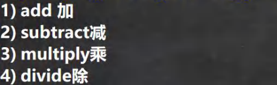

```java
public class BigInteger_ {
	public static void main(String[] args) {
        
		//当我们编程中，需要处理很大的整数，long 不够用
		//可以使用 BigInteger 的类来搞定
		// long l = 23788888899999999999999999999l;
		// System.out.println("l=" + l);
        
        BigInteger bigInteger = new BigInteger("23788888899999999999999999999");
        BigInteger bigInteger2 = new BigInteger("10099999999999999999999999999999999999999999999999999999999999999999999999999999999");
        System.out.println(bigInteger);
		//老韩解读
		//1. 在对 BigInteger 进行加减乘除的时候，需要使用对应的方法，不能直接进行+ - * /
		//2. 可以创建一个 要操作的 BigInteger 然后进行相应操作
		BigInteger add = bigInteger.add(bigInteger2);
		System.out.println(add);//
		BigInteger subtract = bigInteger.subtract(bigInteger2);
		System.out.println(subtract);//减
		BigInteger multiply = bigInteger.multiply(bigInteger2);
		System.out.println(multiply);//乘
		BigInteger divide = bigInteger.divide(bigInteger2);
		System.out.println(divide);//除
	}
}
```

```java
public class BigDecimal_ {
	public static void main(String[] args) {
		//当我们需要保存一个精度很高的数时，double 不够用
		//可以是 BigDecimal
		// double d = 1999.11111111111999999999999977788d;
		// System.out.println(d);
		BigDecimal bigDecimal = new BigDecimal("1999.11");
		BigDecimal bigDecimal2 = new BigDecimal("3");
		System.out.println(bigDecimal);
        
		//老韩解读
		//1. 如果对 BigDecimal 进行运算，比如加减乘除，需要使用对应的方法
		//2. 创建一个需要操作的 BigDecimal 然后调用相应的方法即可
		System.out.println(bigDecimal.add(bigDecimal2));
		System.out.println(bigDecimal.subtract(bigDecimal2));
		System.out.println(bigDecimal.multiply(bigDecimal2));
		//System.out.println(bigDecimal.divide(bigDecimal2));//可能抛出异常 ArithmeticException
		//在调用 divide 方法时，指定精度即可. BigDecimal.ROUND_CEILING
		//如果有无限循环小数，就会保留 分子 的精度
		System.out.println(bigDecimal.divide(bigDecimal2, BigDecimal.ROUND_CEILING));
	}
}

```


### 11 日期类

#### （1）第一代日期类


```java
public class Date01 {
	public static void main(String[] args) throws ParseException {
        
        //老韩解读
		//1. 获取当前系统时间
		//2. 这里的 Date 类是在 java.util 包
		//3. 默认输出的日期格式是国外的方式, 因此通常需要对格式进行转换
		Date d1 = new Date(); //获取当前系统时间
		System.out.println("当前日期=" + d1);
		Date d2 = new Date(9234567); //通过指定毫秒数得到时间
		System.out.println("d2=" + d2); //获取某个时间对应的毫秒数

		//老韩解读
		//1. 创建 SimpleDateFormat 对象，可以指定相应的格式
		//2. 这里的格式使用的字母是规定好，不能乱写
		SimpleDateFormat sdf = new SimpleDateFormat("yyyy 年 MM 月 dd 日 hh:mm:ss E");
		String format = sdf.format(d1); // format:将日期转换成指定格式的字符串
		System.out.println("当前日期=" + format);
        
		//老韩解读
		//1. 可以把一个格式化的 String 转成对应的 Date
		//2. 得到 Date 仍然在输出时，还是按照国外的形式，如果希望指定格式输出，需要转换
        //3. 在把 String -> Date ， 使用的 sdf 格式需要和你给的 String 的格式一样，否则会抛出转换异常
        String s = "1996 年 01 月 01 日 10:20:30 星期一";
		Date parse = sdf.parse(s);
		System.out.println("parse=" + sdf.format(parse));
        
    }
}
```


#### （2）第二代日期类


```java
public class Calendar_ {
	public static void main(String[] args) {
		//老韩解读
		//1. Calendar 是一个抽象类， 并且构造器是 private
		//2. 可以通过 getInstance() 来获取实例
		//3. 提供大量的方法和字段提供给程序员
        //4. Calendar 没有提供对应的格式化的类，因此需要程序员自己组合来输出(灵活)
		//5. 如果我们需要按照 24 小时进制来获取时间， Calendar.HOUR ==改成=> Calendar.HOUR_OF_DAY
        Calendar c = Calendar.getInstance(); //创建日历类对象//比较简单，自由
		System.out.println("c=" + c);
		//2.获取日历对象的某个日历字段
		System.out.println("年：" + c.get(Calendar.YEAR));
		// 这里为什么要 + 1, 因为 Calendar 返回月时候，是按照 0 开始编号
		System.out.println("月：" + (c.get(Calendar.MONTH) + 1));
		System.out.println("日：" + c.get(Calendar.DAY_OF_MONTH));
		System.out.println("小时：" + c.get(Calendar.HOUR));
		System.out.println("分钟：" + c.get(Calendar.MINUTE));
		System.out.println("秒：" + c.get(Calendar.SECOND));
		//Calender 没有专门的格式化方法，所以需要程序员自己来组合显示
		System.out.println(c.get(Calendar.YEAR) + "-" + (c.get(Calendar.MONTH) + 1) + "-" +c.get(Calendar.DAY_OF_MONTH) + " " + c.get(Calendar.HOUR_OF_DAY) + ":" + c.get(Calendar.MINUTE) + ":" + c.get(Calendar.SECOND) );
	}
}
```


#### （3）第三代日期类


```java
public class LocalDate_ {
	public static void main(String[] args) {
		//第三代日期
		//老韩解读
		//1. 使用 now() 返回表示当前日期时间的 对象
		LocalDateTime ldt = LocalDateTime.now();//LocalDate.now();//LocalTime.now()
		System.out.println(ldt);
        
		//2. 使用 DateTimeFormatter 对象来进行格式化
		// 创建 DateTimeFormatter 对象
		DateTimeFormatter dateTimeFormatter = DateTimeFormatter.ofPattern("yyyy-MM-dd HH:mm:ss");
		String format = dateTimeFormatter.format(ldt);
        
		System.out.println("格式化的日期=" + format);
		System.out.println("年=" + ldt.getYear());
		System.out.println("月=" + ldt.getMonth());
		System.out.println("月=" + ldt.getMonthValue());
		System.out.println("日=" + ldt.getDayOfMonth());
		System.out.println("时=" + ldt.getHour());
		System.out.println("分=" + ldt.getMinute());
		System.out.println("秒=" + ldt.getSecond());
        
		LocalDate now = LocalDate.now(); //可以获取年月日
        LocalTime now2 = LocalTime.now();//获取到时分秒
        
		//提供 plus 和 minus 方法可以对当前时间进行加或者减
		//看看 890 天后，是什么时候 把 年月日-时分秒
		LocalDateTime localDateTime = ldt.plusDays(890);
		System.out.println("890 天后=" + dateTimeFormatter.format(localDateTime));
		//看看在 3456 分钟前是什么时候，把 年月日-时分秒输出
		LocalDateTime localDateTime2 = ldt.minusMinutes(3456);
		System.out.println("3456 分钟前 日期=" + dateTimeFormatter.format(localDateTime2));
	}
}
```


#### （4）DateTimeFormatter 格式日期类


#### （5）Instant 时间戳


```java
public class Instant_ {
	public static void main(String[] args) {
        
		//1.通过 静态方法 now() 获取表示当前时间戳的对象
		Instant now = Instant.now();
		System.out.println(now);
		//2. 通过 from 可以把 Instant 转成 Date
		Date date = Date.from(now);
        //3. 通过 date 的 toInstant() 可以把 date 转成 Instant 对象
		Instant instant = date.toInstant();
	}
}
```


#### （6）第三代日期类更多方法


## 十四、集合

### 1 集合的理解和好处

前面我们保存多个数据使用的是数组，那么数组有不足的地方，我们分析一下

#### （1）数组


#### （2）集合


### 2 集合的框架体系

Java 的集合类很多，主要分为两大类


```java
public class Collection_ {
	@SuppressWarnings({"all"})
	public static void main(String[] args) {
        //老韩解读
		//1. 集合主要是两组(单列集合 , 双列集合)
		//2. Collection 接口有两个重要的子接口 List Set , 他们的实现子类都是单列集合
		//3. Map 接口的实现子类 是双列集合，存放的 K-V
		//4. 把老师梳理的两张图记住
		//Collection
		//Map
		ArrayList arrayList = new ArrayList();
		arrayList.add("jack");
		arrayList.add("tom");
        
		HashMap hashMap = new HashMap();
		hashMap.put("NO1", "北京");
		hashMap.put("NO2", "上海");
	}
}
```


### 3 Collection 接口和常用方法

#### （1）Collection 接口实现类的特点


Collection 接口常用方法,以实现子类 ArrayList 来演示.

```java
public class CollectionMethod {
	@SuppressWarnings({"all"})
	public static void main(String[] args) {
		List list = new ArrayList();
		// add:添加单个元素
		list.add("jack");
		list.add(10);//list.add(new Integer(10))
		list.add(true);
		System.out.println("list=" + list);
		// remove:删除指定元素
		//list.remove(0);//删除第一个元素
		list.remove(true);//指定删除某个元素
		System.out.println("list=" + list);
		// contains:查找元素是否存在
		System.out.println(list.contains("jack"));//T
		// size:获取元素个数
		System.out.println(list.size());//2
        // isEmpty:判断是否为空
		System.out.println(list.isEmpty());//F
		// clear:清空
		list.clear();
		System.out.println("list=" + list);
		// addAll:添加多个元素
		ArrayList list2 = new ArrayList();
		list2.add("红楼梦");
		list2.add("三国演义");
		list.addAll(list2);
		System.out.println("list=" + list);
		// containsAll:查找多个元素是否都存在
		System.out.println(list.containsAll(list2));//T
		// removeAll：删除多个元素
		list.add("聊斋");
		list.removeAll(list2);
		System.out.println("list=" + list);//[聊斋]
		// 说明：以 ArrayList 实现类来演示. 
    }
}
```

#### （2）Collection 接口遍历元素方式 1-使用 Iterator(迭代器)


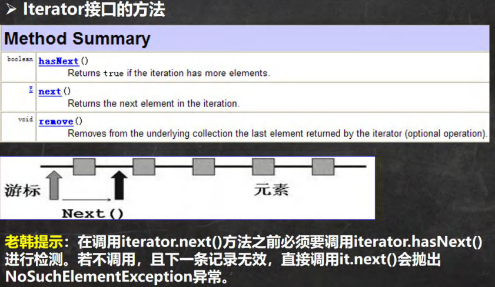

迭代器的使用案例

```java
public class CollectionIterator {
    
    @SuppressWarnings({"all"})
	public static void main(String[] args) {
        
		Collection col = new ArrayList();
        
		col.add(new Book("三国演义", "罗贯中", 10.1));
		col.add(new Book("小李飞刀", "古龙", 5.1));
		col.add(new Book("红楼梦", "曹雪芹", 34.6));
        
		//System.out.println("col=" + col);
		//现在老师希望能够遍历 col 集合
		//1. 先得到 col 对应的 迭代器
		Iterator iterator = col.iterator();
		//2. 使用 while 循环遍历
		// while (iterator.hasNext()) {//判断是否还有数据
		// 		//返回下一个元素，类型是 Object
		// 		Object obj = iterator.next();
		// 		System.out.println("obj=" + obj);
		// }
		//老师教大家一个快捷键，快速生成 while => itit
		//显示所有的快捷键的的快捷键 ctrl + j
		while (iterator.hasNext()) {
			Object obj = iterator.next();
			System.out.println("obj=" + obj);
        }
        //3. 当退出 while 循环后 , 这时 iterator 迭代器，指向最后的元素
		// iterator.next();//NoSuchElementException
		//4. 如果希望再次遍历，需要重置我们的迭代器
		iterator = col.iterator();
		System.out.println("===第二次遍历===");
		while (iterator.hasNext()) {
			Object obj = iterator.next();
			System.out.println("obj=" + obj);
		}
	}
}

class Book {
	private String name;
	private String author;
	private double price;
    
	public Book(String name, String author, double price) {
		this.name = name;
		this.author = author;
		this.price = price;
	}
    
    public String getName() {
		return name;
		}
    
	public void setName(String name) {
		this.name = name;
	}
    
	public String getAuthor() {
		return author;
	}
    
	public void setAuthor(String author) {
		this.author = author;
	}
    
	public double getPrice() {
		return price;
	}
    
	public void setPrice(double price) {
		this.price = price;
	}
    
	@Override
	public String toString() {
        return "Book{" +
			"name='" + name + '\'' +
			", author='" + author + '\'' +
			", price=" + price +
			'}';
	}
    
}
```


#### （3）Collection 接口遍历对象方式 2-for 循环增强


```java
public class CollectionExercise {
	@SuppressWarnings({"all"})
	public static void main(String[] args) {
		List list = new ArrayList();
		list.add(new Dog("小黑", 3));
		list.add(new Dog("大黄", 100));
		list.add(new Dog("大壮", 8));
        
		//先使用 for 增强
		for (Object dog : list) {
			System.out.println("dog=" + dog);
		}
        
		//使用迭代器
		System.out.println("===使用迭代器来遍历===");
		Iterator iterator = list.iterator();
		while (iterator.hasNext()) {
			Object dog = iterator.next();
			System.out.println("dog=" + dog);
        }
    }
}

/**
* 创建 3 个 Dog {name, age} 对象，放入到 ArrayList 中，赋给 List 引用
* 用迭代器和增强 for 循环两种方式来遍历
* 重写 Dog 的 toString 方法， 输出 name 和 age
*/
class Dog {
	private String name;
	private int age;
    
	public Dog(String name, int age) {
		this.name = name;
		this.age = age;
	}
    
	public String getName() {
		return name;
	}
    
	public void setName(String name) {
		this.name = name;
	}
    
    public int getAge() {
		return age;
	}
    
	public void setAge(int age) {
		this.age = age;
	}
    
	@Override
	public String toString() {
		return "Dog{" +
		"name='" + name + '\'' +
		", age=" + age +
		'}';
	}
}
```


### 4 List 接口和常用方法

#### （1）List 接口基本介绍


```java
public class List_ {
	@SuppressWarnings({"all"})
	public static void main(String[] args) {
		//1. List 集合类中元素有序(即添加顺序和取出顺序一致)、且可重复 [案例]
		List list = new ArrayList();
		list.add("jack");
		list.add("tom");
		list.add("mary");
		list.add("hsp");
        list.add("tom");
		System.out.println("list=" + list);
		//2. List 集合中的每个元素都有其对应的顺序索引，即支持索引
		// 索引是从 0 开始的
		System.out.println(list.get(3));//hsp
		//3.
    }
}
```


#### （2）List 接口的常用方法

```java
public class ListMethod {
	@SuppressWarnings({"all"})
	public static void main(String[] args) {
		List list = new ArrayList();
		list.add("张三丰");
		list.add("贾宝玉");
        // void add(int index, Object ele):在 index 位置插入 ele 元素
		//在 index = 1 的位置插入一个对象
		list.add(1, "韩顺平");
		System.out.println("list=" + list);
		// boolean addAll(int index, Collection eles):从 index 位置开始将 eles 中的所有元素添加进来
        List list2 = new ArrayList();
		list2.add("jack");
		list2.add("tom");
		list.addAll(1, list2);
		System.out.println("list=" + list);
		// Object get(int index):获取指定 index 位置的元素
		//说过
		// int indexOf(Object obj):返回 obj 在集合中首次出现的位置
		System.out.println(list.indexOf("tom"));//2
		// int lastIndexOf(Object obj):返回 obj 在当前集合中末次出现的位置
		list.add("韩顺平");
		System.out.println("list=" + list);
		System.out.println(list.lastIndexOf("韩顺平"));
		// Object remove(int index):移除指定 index 位置的元素，并返回此元素
		list.remove(0);
		System.out.println("list=" + list);
		// Object set(int index, Object ele):设置指定 index 位置的元素为 ele , 相当于是替换. 
        list.set(1, "玛丽");
		System.out.println("list=" + list);
		// List subList(int fromIndex, int toIndex):返回从 fromIndex 到 toIndex 位置的子集合
        // 注意返回的子集合 fromIndex <= subList < toIndex
        List returnlist = list.subList(0, 2);
		System.out.println("returnlist=" + returnlist);
	}
}
```


#### （4）List 的三种遍历方式


```java
public class ListFor {
	@SuppressWarnings({"all"})
	public static void main(String[] args) {
		//List 接口的实现子类 Vector LinkedList
		//List list = new ArrayList();
        //List list = new Vector();
		List list = new LinkedList();
        
		list.add("jack");
		list.add("tom");
		list.add("鱼香肉丝");
		list.add("北京烤鸭子");
        
		//遍历
		//1. 迭代器
		Iterator iterator = list.iterator();
		while (iterator.hasNext()) {
			Object obj = iterator.next();
			System.out.println(obj);
		}
        
		System.out.println("=====增强 for=====");
		//2. 增强 for
		for (Object o : list) {
			System.out.println("o=" + o);
		}
        
		System.out.println("=====普通 for====");
		//3. 使用普通 for
		for (int i = 0; i < list.size(); i++) {
        	System.out.println("对象=" + list.get(i));
        }
    }
}
```


### 5 ArrayList 底层结构和源码分析

#### （1）ArrayList 的注意事项


#### （2）ArrayList 的底层操作机制源码分析(重点，难点.)


```java
@SuppressWarnings({"all"})
public class ArrayListSource {
    
    public static void main(String[] args) {
		//老韩解读源码
		//注意，注意，注意，Idea 默认情况下，Debug 显示的数据是简化后的，如果希望看到完整的数据
        //需要做设置.
        //使用无参构造器创建 ArrayList 对象
		//ArrayList list = new ArrayList();
		ArrayList list = new ArrayList(8);
		//使用 for 给 list 集合添加 1-10 数据
		for (int i = 1; i <= 10; i++) {
			list.add(i);
		}
		//使用 for 给 list 集合添加 11-15 数据
		for (int i = 11; i <= 15; i++) {
			list.add(i);
		}
		list.add(100);
		list.add(200);
		list.add(null);
	}
}
```


### 6 Vector 底层结构和源码剖析

#### （1）Vector 的基本介绍


```java
@SuppressWarnings({"all"})
public class Vector_ {
	public static void main(String[] args) {
		//无参构造器
		//有参数的构造
		Vector vector = new Vector(8);
		for (int i = 0; i < 10; i++) {
			vector.add(i);
        }
		vector.add(100);
		System.out.println("vector=" + vector);
		//老韩解读源码
		//1. new Vector() 底层
		/*
			public Vector() {
				this(10);
			}
		补充：如果是 Vector vector = new Vector(8);
			走的方法:
			public Vector(int initialCapacity) {
				this(initialCapacity, 0);
			}
		2. vector.add(i)
		2.1 //下面这个方法就添加数据到 vector 集合
			public synchronized boolean add(E e) {
				modCount++;
				ensureCapacityHelper(elementCount + 1);
				elementData[elementCount++] = e;
				return true;
			}
		2.2 //确定是否需要扩容 条件 ： minCapacity - elementData.length>0
			private void ensureCapacityHelper(int minCapacity) {
				// overflow-conscious code
				if (minCapacity - elementData.length > 0)
						grow(minCapacity);
			}
		2.3 //如果 需要的数组大小 不够用，就扩容 , 扩容的算法
			//newCapacity = oldCapacity + ((capacityIncrement > 0) ?
			// capacityIncrement : oldCapacity);
			//就是扩容两倍. 
			private void grow(int minCapacity) {
				// overflow-conscious code
				int oldCapacity = elementData.length;
				int newCapacity = oldCapacity + ((capacityIncrement > 0) ?
									capacityIncrement : oldCapacity);
				if (newCapacity - minCapacity < 0)
					newCapacity = minCapacity;
				if (newCapacity - MAX_ARRAY_SIZE > 0)
					newCapacity = hugeCapacity(minCapacity);
				elementData = Arrays.copyOf(elementData, newCapacity);
			}
		*/
	}
}
```

#### （2）Vector 和 ArrayList 的比较


### 7 LinkedList 底层结构

#### （1）LinkedList 的全面说明


#### （2）LinkedList 的底层操作机制


```java
public class LinkedList01 {
	public static void main(String[] args) {
		//模拟一个简单的双向链表
        
		Node jack = new Node("jack");
		Node tom = new Node("tom");
		Node hsp = new Node("老韩");
		        
		//连接三个结点，形成双向链表
		//jack -> tom -> hsp
		jack.next = tom;
		tom.next = hsp;
		//hsp -> tom -> jack
		hsp.pre = tom;
		tom.pre = jack;
        
		Node first = jack;//让 first 引用指向 jack,就是双向链表的头结点
		Node last = hsp; //让 last 引用指向 hsp,就是双向链表的尾结点
        
		//演示，从头到尾进行遍历
		System.out.println("===从头到尾进行遍历===");
		while (true) {
            if(first == null) {
				break;
			}
			//输出 first 信息
			System.out.println(first);
			first = first.next;
		}
        
		//演示，从尾到头的遍历
		System.out.println("====从尾到头的遍历====");
		while (true) {
			if(last == null) {
				break;
			}
			//输出 last 信息
			System.out.println(last);
			last = last.pre;
		}
        
		//演示链表的添加对象/数据，是多么的方便
		//要求，是在 tom --------- 老韩直接，插入一个对象 smith
        
		//1. 先创建一个 Node 结点，name 就是 smith
		Node smith = new Node("smith");
		//下面就把 smith 加入到双向链表了
		smith.next = hsp;
        smith.pre = tom;
		hsp.pre = smith;
		tom.next = smith;
        
		//让 first 再次指向 jack
		first = jack;//让 first 引用指向 jack,就是双向链表的头结点
        
		System.out.println("===从头到尾进行遍历===");
		while (true) {
			if(first == null) {
				break;
			}
			//输出 first 信息
			System.out.println(first);
			first = first.next;
		}
        
		last = hsp; //让 last 重新指向最后一个结点
		//演示，从尾到头的遍历
		System.out.println("====从尾到头的遍历====");
		while (true) {
			if(last == null) {
				break;
			}
			//输出 last 信息
			System.out.println(last);
            last = last.pre;
		}
	}
}

//定义一个 Node 类，Node 对象 表示双向链表的一个结点
class Node {
	public Object item; //真正存放数据
	public Node next; //指向后一个结点
    public Node pre; //指向前一个结点
	public Node(Object name) {
		this.item = name;
	}
	public String toString() {
		return "Node name=" + item;
	}
}
```


#### （3）LinkedList 的增删改查案例

```java
@SuppressWarnings({"all"})
public class LinkedListCRUD {
	public static void main(String[] args) {
        
		LinkedList linkedList = new LinkedList();
		linkedList.add(1);
		linkedList.add(2);
		linkedList.add(3);
		System.out.println("linkedList=" + linkedList);
        
		//演示一个删除结点的
		linkedList.remove(); // 这里默认删除的是第一个结点
		//linkedList.remove(2);
        
		System.out.println("linkedList=" + linkedList);
        
		//修改某个结点对象
		linkedList.set(1, 999);
		System.out.println("linkedList=" + linkedList);
        
		//得到某个结点对象
		//get(1) 是得到双向链表的第二个对象
        Object o = linkedList.get(1);
		System.out.println(o);//999
        
		//因为 LinkedList 是 实现了 List 接口, 遍历方式
		System.out.println("===LinkeList 遍历迭代器====");
		Iterator iterator = linkedList.iterator();
		while (iterator.hasNext()) {
			Object next = iterator.next();
			System.out.println("next=" + next);
		}
        
		System.out.println("===LinkeList 遍历增强 for====");
		for (Object o1 : linkedList) {
			System.out.println("o1=" + o1);
		}
        
		System.out.println("===LinkeList 遍历普通 for====");
		for (int i = 0; i < linkedList.size(); i++) {
			System.out.println(linkedList.get(i));
		}
        
		//老韩源码阅读.
        /* 1. LinkedList linkedList = new LinkedList();
				public LinkedList() {}
			2. 这时 linkeList 的属性 first = null last = null
			3. 执行 添加
				public boolean add(E e) {
					linkLast(e);
					return true;
				}
			4.将新的结点，加入到双向链表的最后
			void linkLast(E e) {
				final Node<E> l = last;
				final Node<E> newNode = new Node<>(l, e, null);
				last = newNode;
				if (l == null)
					first = newNode;
				else
					l.next = newNode;
				size++;
				modCount++;
			}
		*/
        
		/*
			老韩读源码 linkedList.remove(); // 这里默认删除的是第一个结点
			1. 执行 removeFirst
				public E remove() {
					return removeFirst();
				}
			2. 执行
				public E removeFirst() {
					final Node<E> f = first;
					if (f == null)
						throw new NoSuchElementException();
					return unlinkFirst(f);
				}
  			3. 执行 unlinkFirst, 将 f 指向的双向链表的第一个结点拿掉
				private E unlinkFirst(Node<E> f) {
					// assert f == first && f != null;
					final E element = f.item;
					final Node<E> next = f.next;
					f.item = null;
					f.next = null; // help GC
					first = next;
					if (next == null)
						last = null;
					else
						next.prev = null;
					size--;
					modCount++;
					return element;
				}
			*/
		}
	}
}	
```


### 8 ArrayList 和 LinkedList 比较

#### （1）ArrayList 和 LinkedList 的比较


### 9 Set 接口和常用方法

#### （1）Set 接口基本介绍


#### （2）Set 接口的常用方法

和 List 接口一样, Set 接口也是 Collection 的子接口，因此，常用方法和 Collection 接口一样.


#### （3）Set 接口的遍历方式


#### （4）Set 接口的常用方法举例

```java
@SuppressWarnings({"all"})
public class SetMethod {
	public static void main(String[] args) {
		//老韩解读
		//1. 以 Set 接口的实现类 HashSet 来讲解 Set 接口的方法
		//2. set 接口的实现类的对象(Set 接口对象), 不能存放重复的元素, 可以添加一个null
		//3. set 接口对象存放数据是无序(即添加的顺序和取出的顺序不一致)
		//4. 注意：取出的顺序的顺序虽然不是添加的顺序，但是他的固定. Set set = new HashSet();
		set.add("john");
		set.add("lucy");
		set.add("john");//重复
		set.add("jack");
		set.add("hsp");
		set.add("mary");
		set.add(null);//
		set.add(null);//再次添加 null
		for(int i = 0; i <10;i ++) {
			System.out.println("set=" + set);
		}
        
		//遍历
		//方式 1： 使用迭代器
        System.out.println("=====使用迭代器====");
		Iterator iterator = set.iterator();
		while (iterator.hasNext()) {
			Object obj = iterator.next();
			System.out.println("obj=" + obj);
		}
        
		set.remove(null);
        
		//方式 2: 增强 for
		System.out.println("=====增强 for====");
			
        for (Object o : set) {
			System.out.println("o=" + o);
		}
        
		//set 接口对象，不能通过索引来获取
	}
}
```


### 10 Set 接口实现类-HashSet

#### （1）HashSet 的全面说明


```java
@SuppressWarnings({"all"})
public class HashSet_ {
	public static void main(String[] args) {
		//老韩解读
		//1. 构造器走的源码
		/*
			public HashSet() {
				map = new HashMap<>();
			}
		2. HashSet 可以存放 null ,但是只能有一个 null,即元素不能重复
		*/
		Set hashSet = new HashSet();
		hashSet.add(null);
		hashSet.add(null);
		System.out.println("hashSet=" + hashSet);
	}
}	
```

#### （2）HashSet 案例说明

```java
@SuppressWarnings({"all"})
public class HashSet01 {
	public static void main(String[] args) {
		HashSet set = new HashSet();
        //说明
		//1. 在执行 add 方法后，会返回一个 boolean 值
		//2. 如果添加成功，返回 true, 否则返回 false
		//3. 可以通过 remove 指定删除哪个对象
		System.out.println(set.add("john"));//T
		System.out.println(set.add("lucy"));//T
		System.out.println(set.add("john"));//F
		System.out.println(set.add("jack"));//T
		System.out.println(set.add("Rose"));//T
        
		set.remove("john");
		System.out.println("set=" + set);//3 个
        
		//
		set = new HashSet();
		System.out.println("set=" + set);//0
		//4 Hashset 不能添加相同的元素/数据?
		set.add("lucy");//添加成功
		set.add("lucy");//加入不了
		set.add(new Dog("tom"));//OK
		set.add(new Dog("tom"));//Ok
		System.out.println("set=" + set);
        
		//在加深一下. 非常经典的面试题.
        //看源码，做分析， 先给小伙伴留一个坑，以后讲完源码，你就了然
		//去看他的源码，即 add 到底发生了什么?=> 底层机制. 
        set.add(new String("hsp"));//ok
		set.add(new String("hsp"));//加入不了. 
        System.out.println("set=" + set);
	}
}

class Dog { //定义了 Dog 类
	private String name;
    
	public Dog(String name) {
		this.name = name;
	}
    
	@Override
	public String toString() {
		return "Dog{" +
			"name='" + name + '\'' +
			'}';
	}
}
```


#### （3）HashSet 底层机制说明


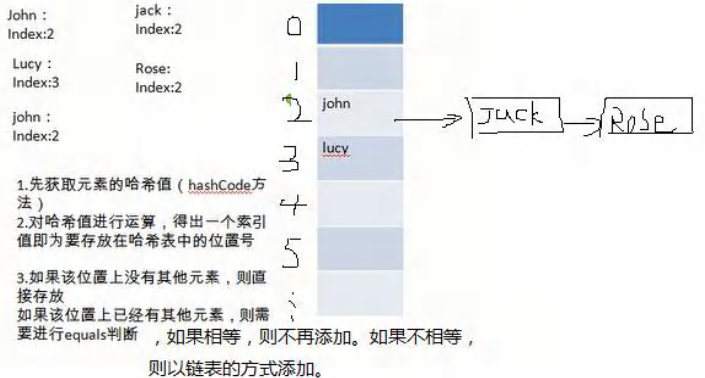


```java
@SuppressWarnings({"all"})
public class HashSetSource {
	public static void main(String[] args) {
        
		HashSet hashSet = new HashSet();
		hashSet.add("java");//到此位置，第 1 次 add 分析完毕. 
        hashSet.add("php");//到此位置，第 2 次 add 分析完毕
		hashSet.add("java");
		System.out.println("set=" + hashSet);
        
		/*
		老韩对 HashSet 的源码解读
		1. 执行 HashSet()
			public HashSet() {
				map = new HashMap<>();
			}
		2. 执行 add()
			public boolean add(E e) {//e = "java"
				return map.put(e, PRESENT)==null;//(static) PRESENT = new Object();
			}
		3.执行 put() , 该方法会执行 hash(key) 得到 key 对应的 hash 值 算法 h = key.hashCode()) ^ (h >>> 16)
		public V put(K key, V value) {//key = "java" value = PRESENT 共享
			return putVal(hash(key), key, value, false, true);
		}
		4.执行 putVal
		final V putVal(int hash, K key, V value, boolean onlyIfAbsent, boolean evict) {
			Node<K,V>[] tab; Node<K,V> p; int n, i; //定义了辅助变量
			//table 就是 HashMap 的一个数组，类型是 Node[]
			//if 语句表示如果当前 table 是 null, 或者 大小=0
			//就是第一次扩容，到 16 个空间. 
			if ((tab = table) == null || (n = tab.length) == 0)
				n = (tab = resize()).length;
			//(1)根据 key，得到 hash 去计算该 key 应该存放到 table 表的哪个索引位置
			//并把这个位置的对象，赋给 p
			//(2)判断 p 是否为 null
			//(2.1) 如果 p 为 null, 表示还没有存放元素, 就创建一个 Node (key="java",value=PRESENT)
			//(2.2) 就放在该位置 tab[i] = newNode(hash, key, value, null)
			
			if ((p = tab[i = (n - 1) & hash]) == null)
				tab[i] = newNode(hash, key, value, null);
			else {
				//一个开发技巧提示： 在需要局部变量(辅助变量)时候，在创建
				Node<K,V> e; K k; //
				//如果当前索引位置对应的链表的第一个元素和准备添加的 key 的 hash 值一样
				//并且满足 下面两个条件之一:
				//(1) 准备加入的 key 和 p 指向的 Node 结点的 key 是同一个对象
				//(2) p 指向的 Node 结点的 key 的 equals() 和准备加入的 key 比较后相同
				//就不能加入
				if (p.hash == hash &&
					((k = p.key) == key || (key != null && key.equals(k))))
					e = p;
				//再判断 p 是不是一颗红黑树, 
				//如果是一颗红黑树，就调用 putTreeVal , 来进行添加
				else if (p instanceof TreeNode)
					e = ((TreeNode<K,V>)p).putTreeVal(this, tab, hash, key, value);
				else {//如果 table 对应索引位置，已经是一个链表, 就使用 for 循环比较
						//(1) 依次和该链表的每一个元素比较后，都不相同, 则加入到该链表的最后
						// 注意在把元素添加到链表后，立即判断 该链表是否已经达到8 个结点
						// , 就调用 treeifyBin() 对当前这个链表进行树化(转成红黑树)
						// 注意，在转成红黑树时，要进行判断, 判断条件
						// if (tab == null || (n = tab.length) < MIN_TREEIFY_CAPACITY(64))
						// resize();
						// 如果上面条件成立，先 table 扩容.
						// 只有上面条件不成立时，才进行转成红黑树
						//(2) 依次和该链表的每一个元素比较过程中，如果有相同情况,就直接break
						
						for (int binCount = 0; ; ++binCount) {
							if ((e = p.next) == null) {
								p.next = newNode(hash, key, value, null);
								if (binCount >= TREEIFY_THRESHOLD(8) - 1) // -1 for 1st
									treeifyBin(tab, hash);
									break;
							}
							if (e.hash == hash &&
								((k = e.key) == key || (key != null && key.equals(k))))
								break;
							p = e;
						}
					}
					if (e != null) { // existing mapping for key
						V oldValue = e.value;
						if (!onlyIfAbsent || oldValue == null)
							e.value = value;
						afterNodeAccess(e);
						return oldValue;
					}
				}
				++modCount;
                //size 就是我们每加入一个结点 Node(k,v,h,next), size++
				if (++size > threshold)
					resize();//扩容
				afterNodeInsertion(evict);
				return null;
			}
		*/
	}
}
```


```java
@SuppressWarnings({"all"})
public class HashSetIncrement {
	public static void main(String[] args) {
		/*
		HashSet 底层是 HashMap, 第一次添加时，table 数组扩容到 16，
		临界值(threshold)是 16*加载因子(loadFactor)是 0.75 = 12
		如果 table 数组使用到了临界值 12,就会扩容到 16 * 2 = 32,
		新的临界值就是 32*0.75 = 24, 依次类推
		*/
        
		HashSet hashSet = new HashSet();
// 		for(int i = 1; i <= 100; i++) {
// 			hashSet.add(i);//1,2,3,4,5...100
// 		}
        
		/*
		在 Java8 中, 如果一条链表的元素个数到达 TREEIFY_THRESHOLD(默认是 8 )，并且 table 的大小 >= MIN_TREEIFY_CAPACITY(默认 64),就会进行树化(红黑树), 否则仍然采用数组扩容机制
		*/
        
// 		for(int i = 1; i <= 12; i++) {
// 			hashSet.add(new A(i));//
// 		}
        
/*
	当我们向 hashset 增加一个元素，-> Node -> 加入 table , 就算是增加了一个 size++
*/
        
		for(int i = 1; i <= 7; i++) {//在 table 的某一条链表上添加了 7 个 A 对象
			hashSet.add(new A(i));//
        }
        
		for(int i = 1; i <= 7; i++) {//在 table 的另外一条链表上添加了 7 个 B 对象
			hashSet.add(new B(i));//
		}
	}
}

class B {
	private int n;
    
	public B(int n) {
		this.n = n;
	}
    
	@Override
	public int hashCode() {
		return 200;
	}
}

class A {
	private int n;
    
    public A(int n) {
		this.n = n;
	}
    
	@Override
	public int hashCode() {
        return 100;
	}
}
```


### 11 Set 接口实现类-LinkedHashSet

#### （1）LinkedHashSet 的全面说明


### 12 Map 接口和常用方法

#### （1）Map 接口实现类的特点 [很实用]


#### （2）Map 接口常用方法

```java
@SuppressWarnings({"all"})
public class MapMethod {
	public static void main(String[] args) {
		//演示 map 接口常用方法
        
		Map map = new HashMap();
		map.put("邓超", new Book("", 100));//OK
        map.put("邓超", "孙俪");//替换-> 一会分析源码
		map.put("王宝强", "马蓉");//OK
		map.put("宋喆", "马蓉");//OK
		map.put("刘令博", null);//OK
		map.put(null, "刘亦菲");//OK
		map.put("鹿晗", "关晓彤");//OK
		map.put("hsp", "hsp 的老婆");
        
		System.out.println("map=" + map);
        
		// remove:根据键删除映射关系
		map.remove(null);
		System.out.println("map=" + map);
		// get：根据键获取值
		Object val = map.get("鹿晗");
		System.out.println("val=" + val);
		// size:获取元素个数
		System.out.println("k-v=" + map.size());
		// isEmpty:判断个数是否为 0
		System.out.println(map.isEmpty());//F
		// clear:清除 k-v
		//map.clear();
		System.out.println("map=" + map);
		// containsKey:查找键是否存在
		System.out.println("结果=" + map.containsKey("hsp"));//T
    }
}

class Book {
	private String name;
	private int num;
    
	public Book(String name, int num) {
		this.name = name;
		this.num = num;
	}
}
```


#### （3）Map 接口遍历方法


```java
@SuppressWarnings({"all"})
public class MapFor {
	public static void main(String[] args) {
        
		Map map = new HashMap();
		map.put("邓超", "孙俪");
		map.put("王宝强", "马蓉");
		map.put("宋喆", "马蓉");
		map.put("刘令博", null);
		map.put(null, "刘亦菲");
		map.put("鹿晗", "关晓彤");
        
		//第一组: 先取出 所有的 Key , 通过 Key 取出对应的 Value
		Set keyset = map.keySet();
        //(1) 增强 for
		System.out.println("-----第一种方式-------");
		for (Object key : keyset) {
			System.out.println(key + "-" + map.get(key));
		}
		//(2) 迭代器
		System.out.println("----第二种方式--------");
		Iterator iterator = keyset.iterator();
		while (iterator.hasNext()) {
			Object key = iterator.next();
			System.out.println(key + "-" + map.get(key));
		}
        
		//第二组: 把所有的 values 取出
		Collection values = map.values();
		//这里可以使用所有的 Collections 使用的遍历方法
		//(1) 增强 for
		System.out.println("---取出所有的 value 增强 for----");
		for (Object value : values) {
			System.out.println(value);
		}
		//(2) 迭代器
		System.out.println("---取出所有的 value 迭代器----");
		Iterator iterator2 = values.iterator();
		while (iterator2.hasNext()) {
			Object value = iterator2.next();
            System.out.println(value);
        }
        
        //第三组: 通过 EntrySet 来获取 k-v
		Set entrySet = map.entrySet();// EntrySet<Map.Entry<K,V>>
		//(1) 增强 for
		System.out.println("----使用 EntrySet 的 for 增强(第 3 种)----");
		for (Object entry : entrySet) {
			//将 entry 转成 Map.Entry
			Map.Entry m = (Map.Entry) entry;
			System.out.println(m.getKey() + "-" + m.getValue());
		}
		//(2) 迭代器
		System.out.println("----使用 EntrySet 的 迭代器(第 4 种)----");
		Iterator iterator3 = entrySet.iterator();
		while (iterator3.hasNext()) {
			Object entry = iterator3.next();
			//System.out.println(next.getClass());//HashMap$Node -实现-> Map.Entry (getKey,getValue)
			//向下转型 Map.Entry
			Map.Entry m = (Map.Entry) entry;
			System.out.println(m.getKey() + "-" + m.getValue());
		}
	}
}
```


### 13 Map 接口实现类-HashMap

#### （1）HashMap 小结


#### （2）HashMap 底层机制及源码剖析


```java
@SuppressWarnings({"all"})
public class HashMapSource1 {
	public static void main(String[] args) {
		HashMap map = new HashMap();
		map.put("java", 10);//ok
		map.put("php", 10);//ok
		map.put("java", 20);//替换 value
        
		System.out.println("map=" + map);//
        
		/*老韩解读 HashMap 的源码+图解
		1. 执行构造器 new HashMap()
		   初始化加载因子 loadfactor = 0.75
		   HashMap$Node[] table = null
		2. 执行 put 调用 hash 方法，计算 key 的 hash 值 (h = key.hashCode()) ^ (h >>> 16)
			public V put(K key, V value) {//K = "java" value = 10
				return putVal(hash(key), key, value, false, true);
			}
		3. 执行 putVal
			final V putVal(int hash, K key, V value, boolean onlyIfAbsent, boolean evict) {
			Node<K,V>[] tab; Node<K,V> p; int n, i;//辅助变量
			//如果底层的 table 数组为 null, 或者 length =0 , 就扩容到 16
			if ((tab = table) == null || (n = tab.length) == 0)
				n = (tab = resize()).length;
				//取出 hash 值对应的 table 的索引位置的 Node, 如果为 null, 就直接把加入的k-v
				//, 创建成一个 Node ,加入该位置即可
				if ((p = tab[i = (n - 1) & hash]) == null)
					tab[i] = newNode(hash, key, value, null);
				else {
					Node<K,V> e; K k;//辅助变量
				// 如果 table 的索引位置的 key 的 hash 相同和新的 key 的 hash 值相同，
				// 并 满足(table 现有的结点的 key 和准备添加的 key 是同一个对象 || equals 返回真)
				// 就认为不能加入新的 k-v		
					if (p.hash == hash &&
						((k = p.key) == key || (key != null && key.equals(k))))
						e = p;
					else if (p instanceof TreeNode)//如果当前的 table 的已有的 Node 是红黑树，就按照红黑树的方式处理
						e = ((TreeNode<K,V>)p).putTreeVal(this, tab, hash, key, value);
					else {
						//如果找到的结点，后面是链表，就循环比较
						for (int binCount = 0; ; ++binCount) {//死循环
							if ((e = p.next) == null) {//如果整个链表，没有和他相同,就加到该链表的最后
								p.next = newNode(hash, key, value, null);
								//加入后，判断当前链表的个数，是否已经到 8 个，到8 个，后
								//就调用 treeifyBin 方法进行红黑树的转换
								if (binCount >= TREEIFY_THRESHOLD - 1) // -1 for 1st
									treeifyBin(tab, hash);
								break;
							}
							if (e.hash == hash && //如果在循环比较过程中，发现有相同,就break,就只是替换value
								((k = e.key) == key || (key != null && key.equals(k))))
								break;
							p = e;
						}
					}
					if (e != null) { // existing mapping for key
						V oldValue = e.value;
						if (!onlyIfAbsent || oldValue == null)
							e.value = value; //替换，key 对应 value
						afterNodeAccess(e);
						return oldValue;
					}
				}
				++modCount;//每增加一个 Node ,就 size++
				if (++size > threshold[12-24-48])//如 size > 临界值，就扩容
					resize();
				afterNodeInsertion(evict);
				return null;
			}
			
				5. 关于树化(转成红黑树)
				//如果 table 为 null ,或者大小还没有到 64，暂时不树化，而是进行扩容. 
				//否则才会真正的树化 -> 剪枝
				final void treeifyBin(Node<K,V>[] tab, int hash) {
					int n, index; Node<K,V> e;
					if (tab == null || (n = tab.length) < MIN_TREEIFY_CAPACITY)
						resize();
				}
			*/
	}
}
```


### 14 Map 接口实现类-Hashtable

#### （1）HashTable 的基本介绍


#### （2）Hashtable 和 HashMap 对比


### 15 Map 接口实现类-Properties

#### （1）基本介绍


#### （2）基本使用

```java
@SuppressWarnings({"all"})
public class Properties_ {
	public static void main(String[] args) {
		//老韩解读
		//1. Properties 继承 Hashtable
		//2. 可以通过 k-v 存放数据，当然 key 和 value 不能为 null
		//增加
		Properties properties = new Properties();
		//properties.put(null, "abc");//抛出 空指针异常
		//properties.put("abc", null); //抛出 空指针异常
		properties.put("john", 100);//k-v
		properties.put("lucy", 100);
		properties.put("lic", 100);
		properties.put("lic", 88);//如果有相同的 key ， value 被替换
        
		System.out.println("properties=" + properties);
        
        //通过 k 获取对应值
		System.out.println(properties.get("lic"));//88
        
		//删除
		properties.remove("lic");
		System.out.println("properties=" + properties);
        
		//修改
		properties.put("john", "约翰");
		System.out.println("properties=" + properties);
	}
}
```


### 16 总结-开发中如何选择集合实现类(记住)


```java
@SuppressWarnings({"all"})
public class TreeSet_ {
	public static void main(String[] args) {
        
		//老韩解读
		//1. 当我们使用无参构造器，创建 TreeSet 时，仍然是无序的
		//2. 老师希望添加的元素，按照字符串大小来排序
		//3. 使用 TreeSet 提供的一个构造器，可以传入一个比较器(匿名内部类)
		// 并指定排序规则
		//4. 简单看看源码
		//老韩解读
		/*
		1. 构造器把传入的比较器对象，赋给了 TreeSet 的底层的 TreeMap 的属性 this.comparator
		
			public TreeMap(Comparator<? super K> comparator) {
				this.comparator = comparator;
			}
		2. 在 调用 treeSet.add("tom"), 在底层会执行到
			if (cpr != null) {//cpr 就是我们的匿名内部类(对象)
				do {
					parent = t;
					//动态绑定到我们的匿名内部类(对象)compare
					cmp = cpr.compare(key, t.key);
					if (cmp < 0)
						t = t.left;
					else if (cmp > 0)
						t = t.right;
					else //如果相等，即返回 0,这个 Key 就没有加入
						return t.setValue(value);
				} while (t != null);
			}
		*/
        
		// TreeSet treeSet = new TreeSet();
		TreeSet treeSet = new TreeSet(new Comparator() {
			@Override
			public int compare(Object o1, Object o2) {
				//下面 调用 String 的 compareTo 方法进行字符串大小比较
				//如果老韩要求加入的元素，按照长度大小排序
				//return ((String) o2).compareTo((String) o1);
				return ((String) o1).length() - ((String) o2).length();
			}
		});
		//添加数据. 
        treeSet.add("jack");
        treeSet.add("tom");//3
		treeSet.add("sp");
		treeSet.add("a");
		treeSet.add("abc");//3
		System.out.println("treeSet=" + treeSet);
	}
}

@SuppressWarnings({"all"})
public class TreeMap_ {
	public static void main(String[] args) {
        //使用默认的构造器，创建 TreeMap, 是无序的(也没有排序)
		/*
			老韩要求：按照传入的 k(String) 的大小进行排序
		*/
		// TreeMap treeMap = new TreeMap();
		TreeMap treeMap = new TreeMap(new Comparator() {
			@Override
			public int compare(Object o1, Object o2) {
				//按照传入的 k(String) 的大小进行排序
				//按照 K(String) 的长度大小排序
				//return ((String) o2).compareTo((String) o1);
				return ((String) o2).length() - ((String) o1).length();
			}
		});
		treeMap.put("jack", "杰克");
		treeMap.put("tom", "汤姆");
		treeMap.put("kristina", "克瑞斯提诺");
		treeMap.put("smith", "斯密斯");
		treeMap.put("hsp", "韩顺平");//加入不了
		System.out.println("treemap=" + treeMap);
        
		/*
			老韩解读源码：
			1. 构造器. 把传入的实现了 Comparator 接口的匿名内部类(对象)，传给给 TreeMap 的comparator
			public TreeMap(Comparator<? super K> comparator) {
				this.comparator = comparator;
			}
			2. 调用 put 方法
			2.1 第一次添加, 把 k-v 封装到 Entry 对象，放入 root
			Entry<K,V> t = root;
			if (t == null) {
				compare(key, key); // type (and possibly null) check
				
				root = new Entry<>(key, value, null);
				size = 1;
				modCount++;
				return null;
			}
			2.2 以后添加
			Comparator<? super K> cpr = comparator;
			if (cpr != null) {
				do { //遍历所有的 key , 给当前 key 找到适当位置
					parent = t;
					cmp = cpr.compare(key, t.key);//动态绑定到我们的匿名内部类的 compare
					if (cmp < 0)
						t = t.left;
					else if (cmp > 0)
						t = t.right;
					else //如果遍历过程中，发现准备添加 Key 和当前已有的 Key 相等，就不添加
						return t.setValue(value);
				} while (t != null);
			}
		*/
	}
}
```


### 17 Collections 工具类

#### （1）Collections 工具类介绍


#### （2）排序操作：（均为 static 方法)


```java
@SuppressWarnings({"all"})
public class Collections_ {
	public static void main(String[] args) {
        
		//创建 ArrayList 集合，用于测试. 
        List list = new ArrayList();
		list.add("tom");
		list.add("smith");
		list.add("king");
		list.add("milan");
		list.add("tom");
        
		// reverse(List)：反转 List 中元素的顺序
		Collections.reverse(list);
		System.out.println("list=" + list);
		// shuffle(List)：对 List 集合元素进行随机排序
		// for (int i = 0; i < 5; i++) {
		// 		Collections.shuffle(list);
		// 		System.out.println("list=" + list);
		// }
        
		// sort(List)：根据元素的自然顺序对指定 List 集合元素按升序排序
		Collections.sort(list);
		System.out.println("自然排序后");
        System.out.println("list=" + list);
		// sort(List，Comparator)：根据指定的 Comparator 产生的顺序对 List 集合元素进行排序
        //我们希望按照 字符串的长度大小排序
		Collections.sort(list, new Comparator() {
			@Override
			public int compare(Object o1, Object o2) {
				//可以加入校验代码. 
                return ((String) o2).length() - ((String) o1).length();
			}
		});
		System.out.println("字符串长度大小排序=" + list);
        
		// swap(List，int， int)：将指定 list 集合中的 i 处元素和 j 处元素进行交换
		//比如
		Collections.swap(list, 0, 1);
		System.out.println("交换后的情况");
		System.out.println("list=" + list);
        
		//Object max(Collection)：根据元素的自然顺序，返回给定集合中的最大元素
		System.out.println("自然顺序最大元素=" + Collections.max(list));
        
		//Object max(Collection，Comparator)：根据 Comparator 指定的顺序，返回给定集合中的最大元素
        //比如，我们要返回长度最大的元素
		Object maxObject = Collections.max(list, new Comparator() {
			@Override
			public int compare(Object o1, Object o2) {
				return ((String)o1).length() - ((String)o2).length();
			}
		});
		System.out.println("长度最大的元素=" + maxObject);
        
		//Object min(Collection)
		//Object min(Collection，Comparator)
		//上面的两个方法，参考 max 即可
        
		//int frequency(Collection，Object)：返回指定集合中指定元素的出现次数
		System.out.println("tom 出现的次数=" + Collections.frequency(list, "tom"));
        
		//void copy(List dest,List src)：将 src 中的内容复制到 dest 中
        
		ArrayList dest = new ArrayList();
		//为了完成一个完整拷贝，我们需要先给 dest 赋值，大小和 list.size()一样
		for(int i = 0; i < list.size(); i++) {
			dest.add("");
		}
        
		//拷贝
		Collections.copy(dest, list);
		System.out.println("dest=" + dest);
        
		//boolean replaceAll(List list，Object oldVal，Object newVal)：使用新值替换 List 对象的所有旧值
        //如果 list 中，有 tom 就替换成 汤姆
		Collections.replaceAll(list, "tom", "汤姆");
        System.out.println("list 替换后=" + list);
    }
}
```


#### （3）查找、替换


## 十五、泛型

### 1 泛型的理解和好处

#### （1）看一个需求

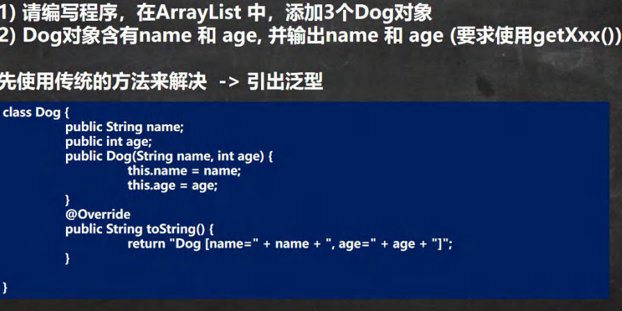

```java
@SuppressWarnings({"all"})
public class Generic01 {
	public static void main(String[] args) {
        //使用传统的方法来解决
		ArrayList arrayList = new ArrayList();
		arrayList.add(new Dog("旺财", 10));
		arrayList.add(new Dog("发财", 1));
		arrayList.add(new Dog("小黄", 5));
        
		//假如我们的程序员，不小心，添加了一只猫
		arrayList.add(new Cat("招财猫", 8));
        
		//遍历
		for (Object o : arrayList) {
			//向下转型 Object ->Dog
			Dog dog = (Dog) o;
			System.out.println(dog.getName() + "-" + dog.getAge());
		}
	}
}

/*
请编写程序，在 ArrayList 中，添加 3 个 Dog 对象
Dog 对象含有 name 和 age, 并输出 name 和 age (要求使用 getXxx())
*/
class Dog {
	private String name;
	private int age;
	public Dog(String name, int age) {
    	this.name = name;
		this.age = age;
	}
    
	public String getName() {
		return name;
	}
    
	public void setName(String name) {
		this.name = name;
	}
    
	public int getAge() {
		return age;
	}
    
	public void setAge(int age) {
		this.age = age;
	}
}

class Cat { //Cat 类
	private String name;
	private int age;
	public Cat(String name, int age) {
		this.name = name;
        this.age = age;
	}
    
    public String getName() {
		return name;
	}
    
	public void setName(String name) {
		this.name = name;
	}
    
	public int getAge() {
		return age;
	}
    
	public void setAge(int age) {
		this.age = age;
	}
}
```


#### （2）使用传统方法的问题分析


#### （3）泛型快速体验-用泛型来解决前面的问题

```java
@SuppressWarnings({"all"})
public class Generic02 {
	public static void main(String[] args) {
		//使用传统的方法来解决===> 使用泛型
		//老韩解读
		//1. 当我们 ArrayList<Dog> 表示存放到 ArrayList 集合中的元素是 Dog 类型 (细节后面说...)
		//2. 如果编译器发现添加的类型，不满足要求，就会报错
		//3. 在遍历的时候，可以直接取出 Dog 类型而不是 Object
		//4. public class ArrayList<E> {} E 称为泛型,那么 Dog->E
		ArrayList<Dog> arrayList = new ArrayList<Dog>();
		arrayList.add(new Dog("旺财", 10));
		arrayList.add(new Dog("发财", 1));
		arrayList.add(new Dog("小黄", 5));
		//假如我们的程序员，不小心，添加了一只猫
        //arrayList.add(new Cat("招财猫", 8));
		System.out.println("===使用泛型====");
		for (Dog dog : arrayList) {
			System.out.println(dog.getName() + "-" + dog.getAge());
		}
	}
}

/*
1.请编写程序，在 ArrayList 中，添加 3 个 Dog 对象
2.Dog 对象含有 name 和 age, 并输出 name 和 age (要求使用 getXxx())
3.老师使用泛型来完成代码
*/
class Dog {
	private String name;
	private int age;
	public Dog(String name, int age) {
		this.name = name;
		this.age = age;
	}
    
	public String getName() {
		return name;
	}
    
    public void setName(String name) {
		this.name = name;
	}
    
	public int getAge() {
		return age;
	}
    
	public void setAge(int age) {
		this.age = age;
	}
}

class Cat { //Cat 类
	private String name;
	private int age;
	public Cat(String name, int age) {
		this.name = name;
		this.age = age;
	}
    
	public String getName() {
		return name;
	}
    
    public void setName(String name) {
		this.name = name;
		}
    
	public int getAge() {
		return age;
	}
    
	public void setAge(int age) {
		this.age = age;
	}
}
```


### 2 泛型的理解和好处

#### （1）泛型的好处


### 3 泛型介绍


```java
public class Generic03 {
	public static void main(String[] args) {
        
		//注意，特别强调： E 具体的数据类型在定义 Person 对象的时候指定,即在编译期间，就确定E 是什么类型
        Person<String> person = new Person<String>("韩顺平教育");
		person.show(); //String
        
		/*
		你可以这样理解，上面的 Person 类
		class Person {
			String s ;//E 表示 s 的数据类型, 该数据类型在定义 Person 对象的时候指定,即在编译期间，就确定E是什么类型
			
			public Person(String s) {//E 也可以是参数类型
				this.s = s;
			}
			
			public String f() {//返回类型使用 E
				return s;
			}
		}
	*/
        
	Person<Integer> person2 = new Person<Integer>(100);
	person2.show();//Integer
        
	/*
		class Person {
			Integer s ;//E 表示 s 的数据类型, 该数据类型在定义 Person 对象的时候指定,即在编译期间，就确定E是什么类型
			
			public Person(Integer s) {//E 也可以是参数类型
				this.s = s;
			}
			
			public Integer f() {//返回类型使用 E
				return s;
			}
		}
	*/
	}
}

//泛型的作用是：可以在类声明时通过一个标识表示类中某个属性的类型，
// 或者是某个方法的返回值的类型，或者是参数类型

class Person<E> {
	E s ;//E 表示 s 的数据类型, 该数据类型在定义 Person 对象的时候指定,即在编译期间，就确定E 是什么类型
    
    public Person(E s) {//E 也可以是参数类型
		this.s = s;
	}
    
	public E f() {//返回类型使用 E
		return s;
	}
    
	public void show() {
		System.out.println(s.getClass());//显示 s 的运行类型
	}   
}
```


### 4 泛型的语法

#### （1）泛型的声明


#### （2）泛型的实例化


#### （3）泛型使用举例


```java
@SuppressWarnings({"all"})
public class GenericExercise {
	public static void main(String[] args) {
		//使用泛型方式给 HashSet 放入 3 个学生对象
		HashSet<Student> students = new HashSet<Student>();
		students.add(new Student("jack", 18));
		students.add(new Student("tom", 28));
		students.add(new Student("mary", 19));
        
		//遍历
		for (Student student : students) {
			System.out.println(student);
		}
        
		//使用泛型方式给 HashMap 放入 3 个学生对象
		//K -> String V->Student
		HashMap<String, Student> hm = new HashMap<String, Student>();
        
		/*
		public class HashMap<K,V> {}
		*/
        
		hm.put("milan", new Student("milan", 38));
		hm.put("smith", new Student("smith", 48));
        hm.put("hsp", new Student("hsp", 28));
        
		//迭代器 EntrySet
		/*
		public Set<Map.Entry<K,V>> entrySet() {
			Set<Map.Entry<K,V>> es;
			return (es = entrySet) == null ? (entrySet = new EntrySet()) : es;
		}
		*/
		Set<Map.Entry<String, Student>> entries = hm.entrySet();
		/*
		public final Iterator<Map.Entry<K,V>> iterator() {
			return new EntryIterator();
		}
		*/
        
		Iterator<Map.Entry<String, Student>> iterator = entries.iterator();
		System.out.println("==============================");
		while (iterator.hasNext()) {
			Map.Entry<String, Student> next = iterator.next();
			System.out.println(next.getKey() + "-" + next.getValue());
		}
	}
}
/**
* 创建 3 个学生对象
* 放入到 HashSet 中学生对象, 使用. 
* 放入到 HashMap 中，要求 Key 是 String name, Value 就是 学生对象
* 使用两种方式遍历
*/
class Student {
	private String name;
	private int age;
    
	public Student(String name, int age) {
		this.name = name;
		this.age = age;
	}
    
	public String getName() {
		return name;
	}
    
	public void setName(String name) {
		this.name = name;
	}
    
	public int getAge() {
		return age;
	}
    
    public void setAge(int age) {
		this.age = age;
	}
    
	@Override
	public String toString() {
		return "Student{" +
				"name='" + name + '\'' +
				", age=" + age +
					'}';
	}
}
```


#### （4）泛型使用的注意事项和细节


```java
@SuppressWarnings({"all"})
public class GenericDetail {
	public static void main(String[] args) {
		//1.给泛型指向数据类型是，要求是引用类型，不能是基本数据类型
		List<Integer> list = new ArrayList<Integer>(); //OK
		//List<int> list2 = new ArrayList<int>();//错误
        
		//2. 说明
		//因为 E 指定了 A 类型, 构造器传入了 new A()
		//在给泛型指定具体类型后，可以传入该类型或者其子类类型
		Pig<A> aPig = new Pig<A>(new A());
		aPig.f();
		Pig<A> aPig2 = new Pig<A>(new B());
		aPig2.f();
        
		//3. 泛型的使用形式
		ArrayList<Integer> list1 = new ArrayList<Integer>();
		List<Integer> list2 = new ArrayList<Integer>();
		//在实际开发中，我们往往简写
		//编译器会进行类型推断, 老师推荐使用下面写法
        ArrayList<Integer> list3 = new ArrayList<>();
		List<Integer> list4 = new ArrayList<>();
		ArrayList<Pig> pigs = new ArrayList<>();
        
		//4. 如果是这样写 泛型默认是 Object
		ArrayList arrayList = new ArrayList();//等价 ArrayList<Object> arrayList = new ArrayList<Object>();
		/*
			public boolean add(Object e) {
				ensureCapacityInternal(size + 1); // Increments modCount!!
				elementData[size++] = e;
				return true;
			}
		*/
        
		Tiger tiger = new Tiger();
        
		/*
			class Tiger {//类
				Object e;
				
				public Tiger() {}
				
				public Tiger(Object e) {
					this.e = e;
				}
			}
		*/
    }
}
	
class Tiger<E> {//类
    
	E e;
    
	public Tiger() {}
    
	public Tiger(E e) {
		this.e = e;
	}
}

class A {}
class B extends A {}

class Pig<E> {//
	E e;
    
	public Pig(E e) {
		this.e = e;
	}
    
	public void f() {
        System.out.println(e.getClass()); //运行类型
	}
}
```


### 6 自定义泛型

#### （1）自定义泛型类 (难度)


```java
@SuppressWarnings({"all"})
public class CustomGeneric_ {
    public static void main(String[] args) {
        
		//T=Double, R=String, M=Integer
		Tiger<Double,String,Integer> g = new Tiger<>("john");
		g.setT(10.9); //OK
		//g.setT("yy"); //错误，类型不对
		System.out.println(g);
		Tiger g2 = new Tiger("john~~");//OK T=Object R=Object M=Object
		g2.setT("yy"); //OK ,因为 T=Object "yy"=String 是 Object 子类
		System.out.println("g2=" + g2);
	}
}

//老韩解读
//1. Tiger 后面泛型，所以我们把 Tiger 就称为自定义泛型类
//2, T, R, M 泛型的标识符, 一般是单个大写字母
//3. 泛型标识符可以有多个. //4. 普通成员可以使用泛型 (属性、方法)
//5. 使用泛型的数组，不能初始化
//6. 静态方法中不能使用类的泛型
class Tiger<T, R, M> {
	String name;
	R r; //属性使用到泛型
	M m;
    T t;
	//因为数组在 new 不能确定 T 的类型，就无法在内存开空间
	T[] ts;
    
	public Tiger(String name) {
		this.name = name;
	}
    
	public Tiger(R r, M m, T t) {//构造器使用泛型
		this.r = r;
		this.m = m;
		this.t = t;
	}
    
	public Tiger(String name, R r, M m, T t) {//构造器使用泛型
		this.name = name;
		this.r = r;
		this.m = m;
		this.t = t;
	}
    
	//因为静态是和类相关的，在类加载时，对象还没有创建
	//所以，如果静态方法和静态属性使用了泛型，JVM 就无法完成初始化
	// static R r2;
	// public static void m1(M m) {
    //
	// }
    
	//方法使用泛型
    
	public String getName() {
		return name;
	}
    
	public void setName(String name) {
		this.name = name;
	}
    
	public R getR() {
		return r;
	}
    
	public void setR(R r) {//方法使用到泛型
		this.r = r;
	}
    
	public M getM() {//返回类型可以使用泛型. 
        return m;
	}
    
	public void setM(M m) {
        this.m = m;
	}
    
	public T getT() {
		return t;
	}
    
	public void setT(T t) {
		this.t = t;
	}
    
	@Override
	public String toString() {
		return "Tiger{" +
			"name='" + name + '\'' +
			", r=" + r +
			", m=" + m +
			", t=" + t +
			", ts=" + Arrays.toString(ts) +
			'}';
	}
}
```


#### （2）自定义泛型接口


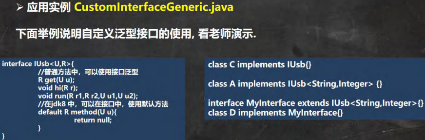

```java
/**
* 泛型接口使用的说明
* 1. 接口中，静态成员也不能使用泛型
* 2. 泛型接口的类型, 在继承接口或者实现接口时确定
* 3. 没有指定类型，默认为 Object
*/

//在继承接口 指定泛型接口的类型
interface IA extends IUsb<String, Double> {
}

//当我们去实现 IA 接口时，因为 IA 在继承 IUsu 接口时，指定了 U 为 String R 为 Double
//，在实现 IUsu 接口的方法时，使用 String 替换 U, 是 Double 替换 R
class AA implements IA {
    
	@Override
	public Double get(String s) {
		return null;
    }
	@Override
	public void hi(Double aDouble) {
	}
	@Override
	public void run(Double r1, Double r2, String u1, String u2) {
	}
}

//实现接口时，直接指定泛型接口的类型
//给 U 指定 Integer 给 R 指定了 Float
//所以，当我们实现 IUsb 方法时，会使用 Integer 替换 U, 使用 Float 替换 R
class BB implements IUsb<Integer, Float> {
    
	@Override
	public Float get(Integer integer) {
		return null;
	}
    
	@Override
	public void hi(Float aFloat) {
	}
    
    @Override
	public void run(Float r1, Float r2, Integer u1, Integer u2) {
	}
}

//没有指定类型，默认为 Object
//建议直接写成 IUsb<Object,Object>
class CC implements IUsb { //等价 class CC implements IUsb<Object,Object> {
	@Override
	public Object get(Object o) {
		return null;
	}
    
	@Override
	public void hi(Object o) {
	}
    
	@Override
	public void run(Object r1, Object r2, Object u1, Object u2) {
	}
}

interface IUsb<U, R> {
	int n = 10;
	//U name; 不能这样使用
    //普通方法中，可以使用接口泛型
	R get(U u);
    
	void hi(R r);
    
    void run(R r1, R r2, U u1, U u2);
    
	//在 jdk8 中，可以在接口中，使用默认方法, 也是可以使用泛型
	default R method(U u) {
		return null;
	}
}
```


#### （3）自定义泛型方法


```java
@SuppressWarnings({"all"})
public class CustomMethodGeneric {
	public static void main(String[] args) {
		Car car = new Car();
		car.fly("宝马", 100);//当调用方法时，传入参数，编译器，就会确定类型
		System.out.println("=======");
		car.fly(300, 100.1);//当调用方法时，传入参数，编译器，就会确定类型
        
		//测试
		//T->String, R-> ArrayList
		Fish<String, ArrayList> fish = new Fish<>();
		fish.hello(new ArrayList(), 11.3f);
	}
}

//泛型方法，可以定义在普通类中, 也可以定义在泛型类中
class Car {//普通类
    
	public void run() {//普通方法
	}
    
    //说明 泛型方法
	//1. <T,R> 就是泛型
	//2. 是提供给 fly 使用的
	public <T, R> void fly(T t, R r) {//泛型方法
		System.out.println(t.getClass());//String
		System.out.println(r.getClass());//Integer
	}
}

class Fish<T, R> {//泛型类
	public void run() {//普通方法
	}
    
	public<U,M> void eat(U u, M m) {//泛型方法
	}
    
	//说明
	//1. 下面 hi 方法不是泛型方法
	//2. 是 hi 方法使用了类声明的 泛型
	public void hi(T t) {
	}
    
	//泛型方法，可以使用类声明的泛型，也可以使用自己声明泛型
	public<K> void hello(R r, K k) {
		System.out.println(r.getClass());//ArrayList
		System.out.println(k.getClass());//Float
	}
}
```


### 7 泛型的继承和通配符

#### （1）泛型的继承和通配符说明


### 9 JUnit

#### （1）为什么需要 JUnit


#### （2）基本介绍


```java
public class JUnit_ {
	public static void main(String[] args) {
		//传统方式
		//new JUnit_().m1();
		//new JUnit_().m2();
	}
    
    @Test
	public void m1() {
		System.out.println("m1 方法被调用");
	}
    
	@Test
	public void m2() {
		System.out.println("m2 方法被调用");
	}
    
	@Test
	public void m3() {
		System.out.println("m3 方法被调用");
	}
}
```


## 十七、多线程基础

### 1 线程相关概念

#### （1）程序(program)


#### （2）进程


#### （3）什么是线程


#### （4）其他相关概念


### 2 线程基本使用

#### （1）创建线程的两种方式


#### （2）线程应用案例 1-继承 Thread 类

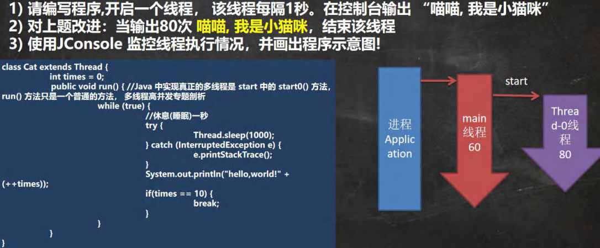

```java
//演示通过继承 Thread 类创建线程
public class Thread01 {
	public static void main(String[] args) throws InterruptedException {
        
		//创建 Cat 对象，可以当做线程使用
		Cat cat = new Cat();

		//老韩读源码
		/*
			(1)
			public synchronized void start() {
				start0();
			}
			(2)
			//start0() 是本地方法，是 JVM 调用, 底层是 c/c++实现
			//真正实现多线程的效果， 是 start0(), 而不是 run
			private native void start0();
		*/
        
        cat.start();//启动线程-> 最终会执行 cat 的 run 方法
        
        //cat.run();//run 方法就是一个普通的方法, 没有真正的启动一个线程，就会把 run 方法执行完毕，才向下执行
        //说明: 当 main 线程启动一个子线程 Thread-0, 主线程不会阻塞, 会继续执行
		//这时 主线程和子线程是交替执行.. 
        System.out.println("主线程继续执行" + Thread.currentThread().getName());//名字 main
		for(int i = 0; i < 60; i++) {
			System.out.println("主线程 i=" + i);
			//让主线程休眠
			Thread.sleep(1000);
		}
	}
}

//1. 当一个类继承了 Thread 类， 该类就可以当做线程使用
//2. 我们会重写 run 方法，写上自己的业务代码
//3. run Thread 类 实现了 Runnable 接口的 run 方法
/*
	@Override
	public void run() {
		if (target != null) {
			target.run();
		}
	}
*/

class Cat extends Thread {
    
	int times = 0;
	@Override
	public void run() {//重写 run 方法，写上自己的业务逻辑
		while (true) {
			//该线程每隔 1 秒。在控制台输出 “喵喵, 我是小猫咪”
			System.out.println("喵喵, 我是小猫咪" + (++times) + " 线程名=" + Thread.currentThread().getName());
            //让该线程休眠 1 秒 ctrl+alt+t
			try {
				Thread.sleep(1000);
			} catch (InterruptedException e) {
				e.printStackTrace();
			}
			if(times == 80) {
				break;//当 times 到 80, 退出 while, 这时线程也就退出.. }
			}
		}
	}
}
```

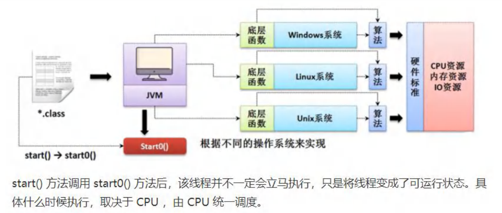


#### （3）线程应用案例 2-实现 Runnable 接口


```java
// 通过实现接口 Runnable 来开发线程
public class Thread02 {
	public static void main(String[] args) {
		Dog dog = new Dog();
		//dog.start(); 这里不能调用 start
		//创建了 Thread 对象，把 dog 对象(实现 Runnable),放入 Thread
		Thread thread = new Thread(dog);
		thread.start();
        
		// Tiger tiger = new Tiger();//实现了 Runnable
		// ThreadProxy threadProxy = new ThreadProxy(tiger);
		// threadProxy.start();
	}
}

class Animal {
}

class Tiger extends Animal implements Runnable {
    
	@Override
	public void run() {
		System.out.println("老虎嗷嗷叫....");
	}
}

//线程代理类 , 模拟了一个极简的 Thread 类
class ThreadProxy implements Runnable {//你可以把 Proxy 类当做 ThreadProxy
    
	private Runnable target = null;//属性，类型是 Runnable
    
	@Override
	public void run() {
		if (target != null) {
			target.run();//动态绑定（运行类型 Tiger）
		}
	}
    
    public ThreadProxy(Runnable target) {
		this.target = target;
	}
    
	public void start() {
		start0();//这个方法时真正实现多线程方法
	}
    
	public void start0() {
		run();
	}
}

class Dog implements Runnable { //通过实现 Runnable 接口，开发线程
    
	int count = 0;
    
	@Override
	public void run() { //普通方法
		while (true) {
			System.out.println("小狗汪汪叫..hi" + (++count) + Thread.currentThread().getName());
            
			//休眠 1 秒
			try {
				Thread.sleep(1000);
            } catch (InterruptedException e) {
				e.printStackTrace();
			}
            
			if (count == 10) {
				break;
			}
		}
	}
}
```


#### （5）线程如何理解


### 3 继承 Thread vs 实现 Runnable 的区别


### 4 线程终止

#### （1）基本说明


#### （2）应用案例


### 5 线程常用方法

#### （1）常用方法第一组


#### （2）注意事项和细节


#### （3）应用案例


#### （4）常用方法第二组


#### （5）应用案例

测试 yield 和 join 方法 ，注意体会方法的特点


#### （7）用户线程和守护线程


#### （8）应用案例

下面我们测试如何将一个线程设置成守护线程


### 6 线程的生命周期

#### （1）JDK 中用 Thread.State 枚举表示了线程的几种状态


#### （2）线程状态转换图


#### （3）写程序查看线程状态

```java
public class ThreadState_ {
	public static void main(String[] args) throws InterruptedException {
		T t = new T();
		System.out.println(t.getName() + " 状态 " + t.getState());
		t.start();
        
        while (Thread.State.TERMINATED != t.getState()) {
			System.out.println(t.getName() + " 状态 " + t.getState());
			Thread.sleep(500);
		}
        
		System.out.println(t.getName() + " 状态 " + t.getState());
        
	}
}

class T extends Thread {
    
	@Override
	public void run() {
		while (true) {
			for (int i = 0; i < 10; i++) {
				System.out.println("hi " + i);
				try {
					Thread.sleep(1000);
				} catch (InterruptedException e) {
					e.printStackTrace();
				}
			}
			break;
		}
	}
}
```


### 7 线程的同步

#### （1）先看一个问题

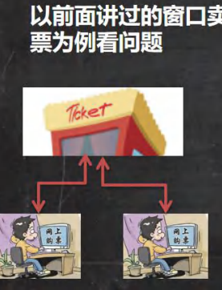

### 8 Synchronized

#### （1）线程同步机制


#### （2）同步具体方法-Synchronized


### 9 分析同步原理


### 10 互斥锁

#### （1）基本介绍


#### （2）使用互斥锁来解决售票问题

看老师代码演示(两种方式都演示下， 代码块加锁，和方法上加锁)

```java
//使用多线程，模拟三个窗口同时售票 100 张
public class SellTicket {
	public static void main(String[] args) {
        
		//测试
		// SellTicket01 sellTicket01 = new SellTicket01();
		// SellTicket01 sellTicket02 = new SellTicket01();
		// SellTicket01 sellTicket03 = new SellTicket01();

		//这里我们会出现超卖.. 
        // sellTicket01.start();//启动售票线程
        // sellTicket02.start();//启动售票线程
		// sellTicket03.start();//启动售票线程
        
		// System.out.println("===使用实现接口方式来售票=====");
		// SellTicket02 sellTicket02 = new SellTicket02();

		// new Thread(sellTicket02).start();//第 1 个线程-窗口
		// new Thread(sellTicket02).start();//第 2 个线程-窗口
		// new Thread(sellTicket02).start();//第 3 个线程-窗口
        
		//测试一把
		SellTicket03 sellTicket03 = new SellTicket03();
		new Thread(sellTicket03).start();//第 1 个线程-窗口
		new Thread(sellTicket03).start();//第 2 个线程-窗口
		new Thread(sellTicket03).start();//第 3 个线程-窗口
	}
}

//实现接口方式, 使用 synchronized 实现线程同步
class SellTicket03 implements Runnable {
	private int ticketNum = 100;//让多个线程共享 ticketNum
	private boolean loop = true;//控制 run 方法变量
	Object object = new Object();
    
    //同步方法（静态的）的锁为当前类本身
	//老韩解读
	//1. public synchronized static void m1() {} 锁是加在 SellTicket03.class
	//2. 如果在静态方法中，实现一个同步代码块. 
    /*
		synchronized (SellTicket03.class) {
			System.out.println("m2");
		}
	*/
    
	public synchronized static void m1() {
	}
    
	public static void m2() {
		synchronized (SellTicket03.class) {
			System.out.println("m2");
		}
	}
    
	//老韩说明
	//1. public synchronized void sell() {} 就是一个同步方法
	//2. 这时锁在 this 对象
	//3. 也可以在代码块上写 synchronize ,同步代码块, 互斥锁还是在 this 对象
	public /*synchronized*/ void sell() { //同步方法, 在同一时刻， 只能有一个线程来执行 sell 方法
        synchronized (/*this*/ object) {
			if (ticketNum <= 0) {
				System.out.println("售票结束...");
				loop = false;
				return;
			}
            
		//休眠 50 毫秒, 模拟
		try {
			Thread.sleep(50);
		} catch (InterruptedException e) {
			e.printStackTrace();
		}
            
		System.out.println("窗口 " + Thread.currentThread().getName() + " 售出一张票" + " 剩余票数=" + (--ticketNum));//1 - 0 - -1 - -2
		}
	}
    
	@Override
	public void run() {
		while (loop) {
			sell();//sell 方法是一共同步方法
		}
	}
    
}

//使用 Thread 方式
// new SellTicket01().start()
// new SellTicket01().start();
class SellTicket01 extends Thread {
    
	private static int ticketNum = 100;//让多个线程共享 ticketNum
    
	// public void m1() {
	// 		synchronized (this) {
	//			 System.out.println("hello");
	// 		}
	// }
    
	@Override
	public void run() {
        
		while (true) {
            
			if (ticketNum <= 0) {
				System.out.println("售票结束...");
				break;
			}    
            
            //休眠 50 毫秒, 模拟
			try {
				Thread.sleep(50);
			} catch (InterruptedException e) {
				e.printStackTrace();
			}
            
			System.out.println("窗口 " + Thread.currentThread().getName() + " 售出一张票" + " 剩余票数=" + (--ticketNum));
            
		}
	}
}

//实现接口方式
class SellTicket02 implements Runnable {
	private int ticketNum = 100;//让多个线程共享 ticketNum
    
	@Override
	public void run() {
		while (true) {
			if (ticketNum <= 0) {
				System.out.println("售票结束...");
				break;
            }
            
            //休眠 50 毫秒, 模拟
			try {
				Thread.sleep(50);
			} catch (InterruptedException e) {
				e.printStackTrace();
			}
            
			System.out.println("窗口 " + Thread.currentThread().getName() + " 售出一张票" + " 剩余票数=" + (--ticketNum));//1 - 0 - -1 - -2
            
		}
	}
}
```


#### （3）注意事项和细节


### 11 线程的死锁

#### （1）基本介绍


#### （2）应用案例


```java
//模拟线程死锁
public class DeadLock_ {
	public static void main(String[] args) {
		//模拟死锁现象
		DeadLockDemo A = new DeadLockDemo(true);
		A.setName("A 线程");
		DeadLockDemo B = new DeadLockDemo(false);
		B.setName("B 线程");
		A.start();
		B.start();
	}
}

//线程
class DeadLockDemo extends Thread {
	static Object o1 = new Object();// 保证多线程，共享一个对象,这里使用 static
	static Object o2 = new Object();
	boolean flag;
    
	public DeadLockDemo(boolean flag) {//构造器
		this.flag = flag;
	}
    
	@Override
	public void run() {
        
		//下面业务逻辑的分析
		//1. 如果 flag 为 T, 线程 A 就会先得到/持有 o1 对象锁, 然后尝试去获取 o2 对象锁
        //2. 如果线程 A 得不到 o2 对象锁，就会 Blocked
		//3. 如果 flag 为 F, 线程 B 就会先得到/持有 o2 对象锁, 然后尝试去获取 o1 对象锁
        //4. 如果线程 B 得不到 o1 对象锁，就会 Blocked
		if (flag) {
			synchronized (o1) {//对象互斥锁, 下面就是同步代码
				System.out.println(Thread.currentThread().getName() + " 进入 1");
				synchronized (o2) { // 这里获得 li 对象的监视权
					System.out.println(Thread.currentThread().getName() + " 进入 2");
				}
			}
		} else {
            synchronized (o2) {
				System.out.println(Thread.currentThread().getName() + " 进入 3");
				synchronized (o1) { // 这里获得 li 对象的监视权
					System.out.println(Thread.currentThread().getName() + " 进入 4");
				}
			}
		}
	}
}
```


### 12 释放锁

#### （1）下面操作会释放锁

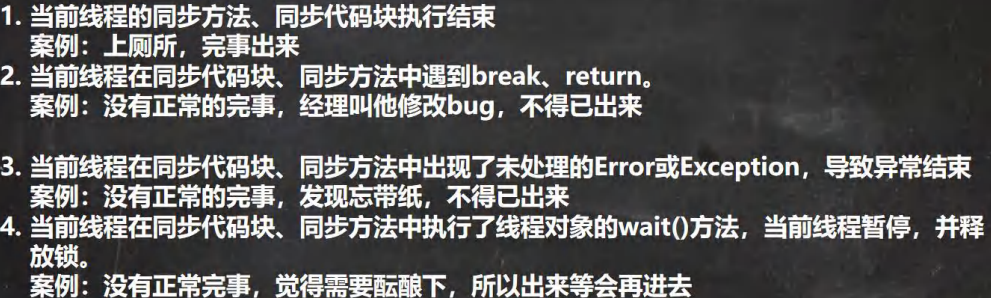

#### （2）下面操作不会释放锁


## 十九、IO 流

### 1 文件

#### （1）什么是文件


#### （2）文件流


### 2 常用的文件操作

#### （1）创建文件对象相关构造器和方法


```java
//演示创建文件
public class FileCreate {
	public static void main(String[] args) {
    }
    
    //方式 1 new File(String pathname)
	@Test
	public void create01() {
		String filePath = "e:\\news1.txt";
		File file = new File(filePath);
        
		try {
			file.createNewFile();
			System.out.println("文件创建成功");
		} catch (IOException e) {
			e.printStackTrace();
		}
	}
    
	//方式 2 new File(File parent,String child) //根据父目录文件+子路径构建
	//e:\\news2.txt
	@Test
	public void create02() {
		File parentFile = new File("e:\\");
		String fileName = "news2.txt";
		//这里的 file 对象，在 java 程序中，只是一个对象
		//只有执行了 createNewFile 方法，才会真正的，在磁盘创建该文件
		File file = new File(parentFile, fileName);
        
        try {
			file.createNewFile();
			System.out.println("创建成功~");
		} catch (IOException e) {
			e.printStackTrace();
		}
	}
    
    //方式 3 new File(String parent,String child) //根据父目录+子路径构建
	@Test
	public void create03() {
		//String parentPath = "e:\\";
		String parentPath = "e:\\";
		String fileName = "news4.txt";
		File file = new File(parentPath, fileName);
        
		try {
			file.createNewFile();
			System.out.println("创建成功~");
		} catch (IOException e) {
			e.printStackTrace();
		}
	}
    
    
	//下面四个都是抽象类
	//InputStream
	//OutputStream
	//Reader //字符输入流
	//Writer //字符输出流
}
```


#### （2）获取文件的相关信息


#### （3）应用案例演示


```java
public class FileInformation {
	public static void main(String[] args) {
	}
    
	//获取文件的信息
	@Test
	public void info() {
		//先创建文件对象
		File file = new File("e:\\news1.txt");
        
		//调用相应的方法，得到对应信息
		System.out.println("文件名字=" + file.getName());
		//getName、getAbsolutePath、getParent、length、exists、isFile、isDirectory
		System.out.println("文件绝对路径=" + file.getAbsolutePath());
		System.out.println("文件父级目录=" + file.getParent());
		System.out.println("文件大小(字节)=" + file.length());
		System.out.println("文件是否存在=" + file.exists());//T
		System.out.println("是不是一个文件=" + file.isFile());//T
		System.out.println("是不是一个目录=" + file.isDirectory());//F
    }
}
```


#### （4）目录的操作和文件删除


### 3 IO 流原理及流的分类

#### （1）Java IO 流原理

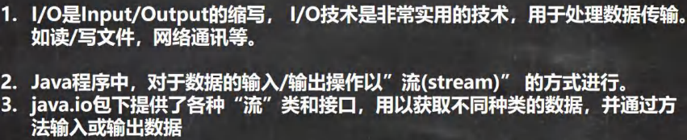


#### （2）流的分类


### 4 IO 流体系图-常用的类

#### （1）IO 流体系图


#### （2）文件 VS 流


#### （3）FileInputStream

```java
//演示 FileInputStream 的使用(字节输入流 文件--> 程序)
public class FileInputStream_ {
	public static void main(String[] args) {
    }
    
    /**
	* 演示读取文件... * 单个字节的读取，效率比较低
	* -> 使用 read(byte[] b)
	*/
    
	@Test
	public void readFile01() {
		String filePath = "e:\\hello.txt";
		int readData = 0;
		FileInputStream fileInputStream = null;
		try {
			//创建 FileInputStream 对象，用于读取 文件
			fileInputStream = new FileInputStream(filePath);
			//从该输入流读取一个字节的数据。 如果没有输入可用，此方法将阻止。
			//如果返回-1 , 表示读取完毕
			while ((readData = fileInputStream.read()) != -1) {
				System.out.print((char)readData);//转成 char 显示
			}
            
		} catch (IOException e) {
			e.printStackTrace();
		} finally {
			//关闭文件流，释放资源.
            try {
				fileInputStream.close();
			} catch (IOException e) {
				e.printStackTrace();
			}
		}
	}
    
	/**
	* 使用 read(byte[] b) 读取文件，提高效率
	*/
	@Test
	public void readFile02() {
		String filePath = "e:\\hello.txt";
		//字节数组
		byte[] buf = new byte[8]; //一次读取 8 个字节. int readLen = 0;
		FileInputStream fileInputStream = null;
		try {
			//创建 FileInputStream 对象，用于读取 文件
			fileInputStream = new FileInputStream(filePath);
			//从该输入流读取最多 b.length 字节的数据到字节数组。 此方法将阻塞，直到某些输入可用。
            //如果返回-1 , 表示读取完毕
			//如果读取正常, 返回实际读取的字节数
			while ((readLen = fileInputStream.read(buf)) != -1) {
                System.out.print(new String(buf, 0, readLen));//显示
			}
            
		} catch (IOException e) {
			e.printStackTrace();
		} finally {
			//关闭文件流，释放资源. 
            try {
				fileInputStream.close();
			} catch (IOException e) {
				e.printStackTrace();
			}
		}
	}
}
```


#### （4）FileOutputStream


要求: 请使用 FileOutputStream 在 a.txt 文件，中写入 “hello，world”. [老师代码演示], 如果文件不存在，会创建文件(注意：前提是目录已经存在.)

```java
public class FileOutputStream01 {
	public static void main(String[] args) {
	}
    
	/**
	* 演示使用 FileOutputStream 将数据写到文件中, 
	* 如果该文件不存在，则创建该文件
	*/
	@Test
    public void writeFile() {
        
		//创建 FileOutputStream 对象
		String filePath = "e:\\a.txt";
		FileOutputStream fileOutputStream = null;
        
		try {
			//得到 FileOutputStream 对象 对象
			//老师说明
			//1. new FileOutputStream(filePath) 创建方式，当写入内容是，会覆盖原来的内容
            //2. new FileOutputStream(filePath, true) 创建方式，当写入内容是，是追加到文件后面
            fileOutputStream = new FileOutputStream(filePath, true);
			//写入一个字节
			//fileOutputStream.write('H');//
			//写入字符串
			String str = "hsp,world!";
			//str.getBytes() 可以把 字符串-> 字节数组
			//fileOutputStream.write(str.getBytes());
			/*
			write(byte[] b, int off, int len) 将 len 字节从位于偏移量 off 的指定字节数组写入此文件输出流*/
			fileOutputStream.write(str.getBytes(), 0, 3);
            
		} catch (IOException e) {
			e.printStackTrace();
		} finally {
			try {
        	    fileOutputStream.close();
			} catch (IOException e) {
				e.printStackTrace();
			}
		}
	}
}
```


要求: 编程完成图片/音乐 的拷贝

```java
public class FileCopy {
	public static void main(String[] args) {
		//完成 文件拷贝，将 e:\\Koala.jpg 拷贝 c:\\
		//思路分析
        //1. 创建文件的输入流 , 将文件读入到程序
		//2. 创建文件的输出流， 将读取到的文件数据，写入到指定的文件. 
        String srcFilePath = "e:\\Koala.jpg";
		String destFilePath = "e:\\Koala3.jpg";
		FileInputStream fileInputStream = null;
		FileOutputStream fileOutputStream = null;
        
		try {
			fileInputStream = new FileInputStream(srcFilePath);
			fileOutputStream = new FileOutputStream(destFilePath);
			//定义一个字节数组,提高读取效果
			byte[] buf = new byte[1024];
			int readLen = 0;
			while ((readLen = fileInputStream.read(buf)) != -1) {
				//读取到后，就写入到文件 通过 fileOutputStream
				//即，是一边读，一边写
				fileOutputStream.write(buf, 0, readLen);//一定要使用这个方法
			}
			System.out.println("拷贝 ok~");
            
		} catch (IOException e) {
			e.printStackTrace();
		} finally {
            try {
				//关闭输入流和输出流，释放资源
				if (fileInputStream != null) {
					fileInputStream.close();
				}
				if (fileOutputStream != null) {
					fileOutputStream.close();
				}
			} catch (IOException e) {
				e.printStackTrace();
			}
		}
	}
}
```


#### （6）FileReader 和 FileWriter 介绍


#### （7）FileReader 相关方法


#### （8）FileWriter 常用方法


#### （9）FileReader 和 FileWriter 应用案例

要求： 1、使用 FileReader 从 story.txt 读取内容，并显示

```java
public class FileReader_ {
	public static void main(String[] args) {
	}
    
	/**
	* 单个字符读取文件
	*/
	@Test
	public void readFile01() {
		String filePath = "e:\\story.txt";
		FileReader fileReader = null;
		int data = 0;
		//1. 创建 FileReader 对象
		try {
			fileReader = new FileReader(filePath);
			//循环读取 使用 read, 单个字符读取
			while ((data = fileReader.read()) != -1) {
				System.out.print((char) data);
			}
        } catch (IOException e) {
			e.printStackTrace();
		} finally {
			try {
				if (fileReader != null) {
					fileReader.close();
				}
			} catch (IOException e) {
				e.printStackTrace();
			}
		}
	}
    
	/**
	* 字符数组读取文件
	*/
	@Test
	public void readFile02() {
		System.out.println("~~~readFile02 ~~~");
		String filePath = "e:\\story.txt";
		FileReader fileReader = null;
        
		int readLen = 0;
		char[] buf = new char[8];
		//1. 创建 FileReader 对象
        try {
			fileReader = new FileReader(filePath);
			//循环读取 使用 read(buf), 返回的是实际读取到的字符数
			//如果返回-1, 说明到文件结束
			while ((readLen = fileReader.read(buf)) != -1) {
				System.out.print(new String(buf, 0, readLen));
			}
            
		} catch (IOException e) {
			e.printStackTrace();
		} finally {
			try {
				if (fileReader != null) {
					fileReader.close();
				}
			} catch (IOException e) {
				e.printStackTrace();
			}
		}
	}
}
```


2) 使用 FileWriter 将 “风雨之后，定见彩虹” 写入到 note.txt 文件中, 注意细节.

```java
public class FileWriter_ {
	public static void main(String[] args) {
        
		String filePath = "e:\\note.txt";
		//创建 FileWriter 对象
		FileWriter fileWriter = null;
		char[] chars = {'a', 'b', 'c'};
		try {
			fileWriter = new FileWriter(filePath);//默认是覆盖写入
			// 3) write(int):写入单个字符
			fileWriter.write('H');
			// 4) write(char[]):写入指定数组
			fileWriter.write(chars);
			// 5) write(char[],off,len):写入指定数组的指定部分
			fileWriter.write("韩顺平教育".toCharArray(), 0, 3);
            // 6) write（string）：写入整个字符串
			fileWriter.write(" 你好北京~");
			fileWriter.write("风雨之后，定见彩虹");
            // 7) write(string,off,len):写入字符串的指定部分
			fileWriter.write("上海天津", 0, 2);
			//在数据量大的情况下，可以使用循环操作. 
        
        } catch (IOException e) {
			e.printStackTrace();
		} finally {
            
			//对应 FileWriter , 一定要关闭流，或者 flush 才能真正的把数据写入到文件
			//老韩看源码就知道原因. 
            /*
				看看代码
				private void writeBytes() throws IOException {
		this.bb.flip();
		int var1 = this.bb.limit();
		int var2 = this.bb.position();
		
		assert var2 <= var1;
		
		int var3 = var2 <= var1 ? var1 - var2 : 0;
		if (var3 > 0) {
			if (this.ch != null) {
				assert this.ch.write(this.bb) == var3 : var3;
			} else {
				this.out.write(this.bb.array(), this.bb.arrayOffset() + var2, var3);
			}
		}
				
		this.bb.clear();
	}
				*/
			try {
				//fileWriter.flush();
				//关闭文件流，等价 flush() + 关闭
				fileWriter.close();
			} catch (IOException e) {
				e.printStackTrace();
			}
		}
        
		System.out.println("程序结束...");
	}
}
```


### 5 节点流和处理流

#### （1）基本介绍


#### （2）节点流和处理流一览图


#### （3）节点流和处理流的区别和联系


#### （4）处理流的功能主要体现在以下两个方面:


#### （5）处理流-BufferedReader 和 BufferedWriter


```java
//演示 bufferedReader 使用
public class BufferedReader_ {
	public static void main(String[] args) throws Exception {
        
		String filePath = "e:\\a.java";
		//创建 bufferedReader
		BufferedReader bufferedReader = new BufferedReader(new FileReader(filePath));
        //读取
		String line; //按行读取, 效率高
		//说明
		//1. bufferedReader.readLine() 是按行读取文件
		//2. 当返回 null 时，表示文件读取完毕
		while ((line = bufferedReader.readLine()) != null) {
			System.out.println(line);
		}
        
		//关闭流, 这里注意，只需要关闭 BufferedReader ，因为底层会自动的去关闭 节点流
        //FileReader。
		/*
			public void close() throws IOException {
				synchronized (lock) {
					if (in == null)
						return;
					try {
						in.close();//in 就是我们传入的 new FileReader(filePath), 关闭了. 
					} finally {
						in = null;
						cb = null;
					}
				}
			}
		*/
        bufferedReader.close();
	}
}
```


```java
//演示 BufferedWriter 的使用
public class BufferedWriter_ {
	public static void main(String[] args) throws IOException {
		String filePath = "e:\\ok.txt";
		//创建 BufferedWriter
		//说明:
        //1. new FileWriter(filePath, true) 表示以追加的方式写入
		//2. new FileWriter(filePath) , 表示以覆盖的方式写入
        BufferedWriter bufferedWriter = new BufferedWriter(new FileWriter(filePath));
		bufferedWriter.write("hello, 韩顺平教育!");
		bufferedWriter.newLine();//插入一个和系统相关的换行
		bufferedWriter.write("hello2, 韩顺平教育!");
		bufferedWriter.newLine();
		bufferedWriter.write("hello3, 韩顺平教育!");
		bufferedWriter.newLine();
        
		//说明：关闭外层流即可 ， 传入的 new FileWriter(filePath) ,会在底层关闭
		bufferedWriter.close();
	}
}
```


```java
public class BufferedCopy_ {
    
    public static void main(String[] args) {
        
		//老韩说明
		//1. BufferedReader 和 BufferedWriter 是安装字符操作
		//2. 不要去操作 二进制文件[声音，视频，doc, pdf ], 可能造成文件损坏
		//BufferedInputStream
		//BufferedOutputStream
		String srcFilePath = "e:\\a.java";
		String destFilePath = "e:\\a2.java";
		// String srcFilePath = "e:\\0245_韩顺平零基础学 Java_引出 this.avi";
		// String destFilePath = "e:\\a2 韩顺平.avi";
		BufferedReader br = null;
		BufferedWriter bw = null;
		String line;
		try {
			br = new BufferedReader(new FileReader(srcFilePath));
			bw = new BufferedWriter(new FileWriter(destFilePath));
            
			//说明: readLine 读取一行内容，但是没有换行
			while ((line = br.readLine()) != null) {
				//每读取一行，就写入
				bw.write(line);
				//插入一个换行
				bw.newLine();
            }
			System.out.println("拷贝完毕...");
            
		} catch (IOException e) {
			e.printStackTrace();
		} finally {
			//关闭流
			try {
				if(br != null) {
					br.close();
				}
				if(bw != null) {
					bw.close();
				}
			} catch (IOException e) {
				e.printStackTrace();
			}
		}
	}
}
```


#### （6）处理流-BufferedInputStream 和 BufferedOutputStream


#### （7）介绍 BufferedOutputStream


```java
//演示使用 BufferedOutputStream 和 BufferedInputStream 使用
//使用他们，可以完成二进制文件拷贝. 
//思考：字节流可以操作二进制文件，可以操作文本文件吗？当然可以
public class BufferedCopy02 {
	public static void main(String[] args) {
        
		// String srcFilePath = "e:\\Koala.jpg";
		// String destFilePath = "e:\\hsp.jpg";
		// String srcFilePath = "e:\\0245_韩顺平零基础学 Java_引出 this.avi";
		// String destFilePath = "e:\\hsp.avi";
		String srcFilePath = "e:\\a.java";
		String destFilePath = "e:\\a3.java";
        
		//创建 BufferedOutputStream 对象 BufferedInputStream 对象
		BufferedInputStream bis = null;
		BufferedOutputStream bos = null;
        
		try {
			//因为 FileInputStream 是 InputStream 子类
			bis = new BufferedInputStream(new FileInputStream(srcFilePath));
            bos = new BufferedOutputStream(new FileOutputStream(destFilePath));
            
			//循环的读取文件，并写入到 destFilePath
			byte[] buff = new byte[1024];
			int readLen = 0;
			//当返回 -1 时，就表示文件读取完毕
			while ((readLen = bis.read(buff)) != -1) {
				bos.write(buff, 0, readLen);
			}
            
			System.out.println("文件拷贝完毕~~~");
            
		} catch (IOException e) {
			e.printStackTrace();
		} finally {
            
			//关闭流 , 关闭外层的处理流即可，底层会去关闭节点流
			try {
				if(bis != null) {
					bis.close();
				}
				if(bos != null) {
					bos.close();
				}
			} catch (IOException e) {
				e.printStackTrace();
            }
        }
    }
}
```


#### （8）对象流-ObjectInputStream 和 ObjectOutputStream


#### （9）对象流介绍

功能：提供了对基本类型或对象类型的序列化和反序列化的方法

ObjectOutputStream 提供 序列化功能

ObjectInputStream 提供 反序列化功能


```java
//演示 ObjectOutputStream 的使用, 完成数据的序列化
public class ObjectOutStream_ {
	public static void main(String[] args) throws Exception {
        
		//序列化后，保存的文件格式，不是存文本，而是按照他的格式来保存
		String filePath = "e:\\data.dat";
        
		ObjectOutputStream oos = new ObjectOutputStream(new FileOutputStream(filePath));
        
		//序列化数据到 e:\data.dat
		oos.writeInt(100);// int -> Integer (实现了 Serializable)
		oos.writeBoolean(true);// boolean -> Boolean (实现了 Serializable)
		oos.writeChar('a');// char -> Character (实现了 Serializable)
		oos.writeDouble(9.5);// double -> Double (实现了 Serializable)
		oos.writeUTF("韩顺平教育");//String
		//保存一个 dog 对象
		oos.writeObject(new Dog("旺财", 10, "日本", "白色"));
		oos.close();
        System.out.println("数据保存完毕(序列化形式)");
    }
}
```


```java
// 1.创建流对象
ObjectInputStream ois = new ObjectInputStream(new FileInputStream("src\\data.dat"));
// 2.读取， 注意顺序
System.out.println(ois.readInt());
System.out.println(ois.readBoolean());
System.out.println(ois.readChar());
System.out.println(ois.readDouble());
System.out.println(ois.readUTF());
System.out.println(ois.readObject());
System.out.println(ois.readObject());
System.out.println(ois.readObject());
// 3.关闭
ois.close();
System.out.println("以反序列化的方式读取(恢复)ok~");
```


#### （10）标准输入输出流


#### （11）转换流-InputStreamReader 和 OutputStreamWriter

先看一个文件乱码问题，引出学习转换流必要性.


```java
//看一个中文乱码问题
public class CodeQuestion {
	public static void main(String[] args) throws IOException {
        
		//读取 e:\\a.txt 文件到程序
		//思路
		//1. 创建字符输入流 BufferedReader [处理流]
		//2. 使用 BufferedReader 对象读取 a.txt
		//3. 默认情况下，读取文件是按照 utf-8 编码
		String filePath = "e:\\a.txt";
		BufferedReader br = new BufferedReader(new FileReader(filePath));
        
		String s = br.readLine();
		System.out.println("读取到的内容: " + s);
		br.close();
        
		//InputStreamReader
		//OutputStreamWriter
	}
}
```


```java
//演示使用 InputStreamReader 转换流解决中文乱码问题
//将字节流 FileInputStream 转成字符流 InputStreamReader, 指定编码 gbk/utf-8
public class InputStreamReader_ {
	public static void main(String[] args) throws IOException {
        
		String filePath = "e:\\a.txt";
		//解读
		//1. 把 FileInputStream 转成 InputStreamReader
        //2. 指定编码 gbk
		//InputStreamReader isr = new InputStreamReader(new FileInputStream(filePath), "gbk");
		//3. 把 InputStreamReader 传入 BufferedReader
		//BufferedReader br = new BufferedReader(isr);
        
		//将 2 和 3 合在一起
		BufferedReader br = new BufferedReader(new InputStreamReader(
new FileInputStream(filePath), "gbk"));
        
		//4. 读取
		String s = br.readLine();
		System.out.println("读取内容=" + s);
  	      
		//5. 关闭外层流
		br.close();
	}
}
```


```java
// 1.创建流对象
OutputStreamWriter osw =
new OutputStreamWriter(new FileOutputStream("d:\\a.txt"), "gbk");
// 2.写入
osw.write("hello,韩顺平教育~");
// 3.关闭
osw.close();
System.out.println("保存成功~");
```


### 6 打印流-PrintStream 和 PrintWriter


```java
//演示 PrintWriter 使用方式
public class PrintWriter_ {
    public static void main(String[] args) throws IOException {
        PrintWriter printWriter = new PrintWriter(new FileWriter("D:\\f2.txt"));
        printWriter.print("hi~");
        printWriter.close();//关闭流，才会将数据写入到文件...
    }
}
```

```java
//演示PrintStream(字节打印流)
public class PrintStream_ {
    public static void main(String[] args) throws IOException {

        PrintStream out = System.out;
        //在默认情况下，PrintStream输出数据的位置是标准输出，即显示器
        out.print("john, hello");
        //因为print底层使用的是write，所以我们可以直接调用write进行打印/输出
        out.write("你好".getBytes());
        out.close();

        //我们可以去修改打印流输出的位置/设备
        //1. 输出修改成到"D:\\f1.txt"
        //2. "hello"就会输出到D:\\f1.txt
        System.setOut(new PrintStream("D:\\f1.txt"));
        System.out.println("hello");
    }
}

```


### 7 Properties 类

#### （1）看一个需求


```java
public class Properties01 {
	public static void main(String[] args) throws IOException {
        
		//读取 mysql.properties 文件，并得到 ip, user 和 pwd
		BufferedReader br = new BufferedReader(new FileReader("src\\mysql.properties"));
		String line = "";
		while ((line = br.readLine()) != null) { //循环读取
			String[] split = line.split("=");
			//如果我们要求指定的 ip 值
			if("ip".equals(split[0])) {
				System.out.println(split[0] + "值是: " + split[1]);
			}
		}
        
		br.close();
	}
}      
```


#### （2）基本介绍


#### （3）应用案例

```java
public class Properties02 {
	public static void main(String[] args) throws IOException {
        
		//使用 Properties 类来读取 mysql.properties 文件
        
		//1. 创建 Properties 对象
		Properties properties = new Properties();
		//2. 加载指定配置文件
		properties.load(new FileReader("src\\mysql.properties"));
		//3. 把 k-v 显示控制台
		properties.list(System.out);
		//4. 根据 key 获取对应的值
		String user = properties.getProperty("user");
		String pwd = properties.getProperty("pwd");
		System.out.println("用户名=" + user);
		System.out.println("密码是=" + pwd);
	}
}
```

```java
public class Properties03 {
	public static void main(String[] args) throws IOException {
		//使用 Properties 类来创建 配置文件, 修改配置文件内容
        
		Properties properties = new Properties();
		//创建
		//1.如果该文件没有 key 就是创建
		//2.如果该文件有 key ,就是修改
		/*
			Properties 父类是 Hashtable ， 底层就是 Hashtable 核心方法
			public synchronized V put(K key, V value) {
				// Make sure the value is not null
				if (value == null) {
					throw new NullPointerException();
				}
				
				// Makes sure the key is not already in the hashtable. 
				Entry<?,?> tab[] = table;
				int hash = key.hashCode();
				int index = (hash & 0x7FFFFFFF) % tab.length;
				@SuppressWarnings("unchecked")
				Entry<K,V> entry = (Entry<K,V>)tab[index];
				for(; entry != null ; entry = entry.next) {
					if ((entry.hash == hash) && entry.key.equals(key)) {
						V old = entry.value;
						entry.value = value;//如果 key 存在，就替换
						return old;
					}
				}
				
				addEntry(hash, key, value, index);//如果是新 k, 就 addEntry
				return null;
			}
		*/
        
		properties.setProperty("charset", "utf8");
		properties.setProperty("user", "汤姆");//注意保存时，是中文的 unicode 码值
		properties.setProperty("pwd", "888888");
        
		//将 k-v 存储文件中即可
		properties.store(new FileOutputStream("src\\mysql2.properties"), null);
		System.out.println("保存配置文件成功~");
	}
}
```


## 二十一、网络编程

### 1 网络的相关概念

#### （1）网络通信


#### （2）网络


#### （3）ip 地址


#### （4）ipv4 地址分类


#### （5）域名


#### （6）网络通信协议


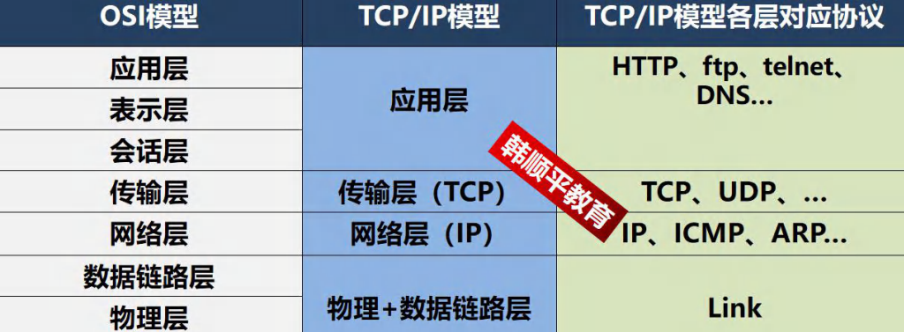


#### （8）TCP 和 UDP


### 2 InetAddress 类

#### （1）相关方法


#### （2）应用案例

编写代码，获取计算机的主机名和 IP 地址相关 API

```java
//获取本机 InetAddress 对象 getLocalHost
InetAddress localHost = InetAddress.getLocalHost();
System.out.println(localHost);
//根据指定主机名/域名获取 ip 地址对象 getByName
InetAddress host2 = InetAddress.getByName("ThinkPad-PC");
System.out.println(host2);
InetAddress host3 = InetAddress.getByName("www.hsp.com");
System.out.println(host3);
//获取 InetAddress 对象的主机名 getHostName
String host3Name = host3.getHostName();
System.out.println(host3Name);
//获取 InetAddress 对象的地址 getHostAddress
String host3Address = host3.getHostAddress();
System.out.println(host3Address);
```


### 3 Socket

#### （1）基本介绍


### 4 TCP 网络通信编程

#### （1）基本介绍


输出 // 设置结束标记 socket.shutdownOutput();

字符流 输出 // bufferedWriter.flush();//如果使用的字符流，需要手动刷新，否则数据不会写入数据通道


#### （2）应用案例 1(使用字节流)


```java
//服务端
public class SocketTCP01Server {
	public static void main(String[] args) throws IOException {
		//思路
		//1. 在本机 的 9999 端口监听, 等待连接
		// 细节: 要求在本机没有其它服务在监听 9999
		// 细节：这个 ServerSocket 可以通过 accept() 返回多个 Socket[多个客户端连接服务器的并发]
		ServerSocket serverSocket = new ServerSocket(9999);
        System.out.println("服务端，在 9999 端口监听，等待连接..");
		//2. 当没有客户端连接 9999 端口时，程序会 阻塞, 等待连接
		// 如果有客户端连接，则会返回 Socket 对象，程序继续
        
		Socket socket = serverSocket.accept();
		System.out.println("服务端 socket =" + socket.getClass());

		//3. 通过 socket.getInputStream() 读取客户端写入到数据通道的数据, 显示
		InputStream inputStream = socket.getInputStream();
		//4. IO 读取
		byte[] buf = new byte[1024];
		int readLen = 0;
		while ((readLen = inputStream.read(buf)) != -1) {
			System.out.println(new String(buf, 0, readLen));//根据读取到的实际长度，显示内容. }
			//5.关闭流和 socket
			inputStream.close();
			socket.close();
		serverSocket.close();//关闭
	}
}

```

```java
//客户端，发送 "hello, server" 给服务端
public class SocketTCP01Client {
	public static void main(String[] args) throws IOException {
		//思路
		//1. 连接服务端 (ip , 端口）
		//解读: 连接本机的 9999 端口, 如果连接成功，返回 Socket 对象
		Socket socket = new Socket(InetAddress.getLocalHost(), 9999);
		System.out.println("客户端 socket 返回=" + socket.getClass());
		//2. 连接上后，生成 Socket, 通过 socket.getOutputStream()
		// 得到 和 socket 对象关联的输出流对象
		OutputStream outputStream = socket.getOutputStream();
		//3. 通过输出流，写入数据到 数据通道
		outputStream.write("hello, server".getBytes());
		//4. 关闭流对象和 socket, 必须关闭
		outputStream.close();
		socket.close();
        System.out.println("客户端退出.....");
	}
}
```


#### （3）应用案例 2(使用字节流)


```java
//服务端
public class SocketTCP02Server {
	public static void main(String[] args) throws IOException {
        //思路
		//1. 在本机 的 9999 端口监听, 等待连接
		// 细节: 要求在本机没有其它服务在监听 9999
		// 细节：这个 ServerSocket 可以通过 accept() 返回多个 Socket[多个客户端连接服务器的并发]
		ServerSocket serverSocket = new ServerSocket(9999);
		System.out.println("服务端，在 9999 端口监听，等待连接..");
        
		//2. 当没有客户端连接 9999 端口时，程序会 阻塞, 等待连接
		// 如果有客户端连接，则会返回 Socket 对象，程序继续
        
		Socket socket = serverSocket.accept();
        
		System.out.println("服务端 socket =" + socket.getClass());

		//3. 通过 socket.getInputStream() 读取客户端写入到数据通道的数据, 显示
		InputStream inputStream = socket.getInputStream();
        	
		//4. IO 读取
		byte[] buf = new byte[1024];
		int readLen = 0;
		while ((readLen = inputStream.read(buf)) != -1) {
			System.out.println(new String(buf, 0, readLen));//根据读取到的实际长度，显示内容. 
        }
		//5. 获取 socket 相关联的输出流
		OutputStream outputStream = socket.getOutputStream();
		outputStream.write("hello, client".getBytes());
		// 设置结束标记
		socket.shutdownOutput();
        
        //6.关闭流和 socket
		outputStream.close();
		inputStream.close();
		socket.close();
		serverSocket.close();//关闭
	}
}
```

```java
//客户端，发送 "hello, server" 给服务端
public class SocketTCP02Client {
	public static void main(String[] args) throws IOException {
        //思路
		//1. 连接服务端 (ip , 端口）
		//解读: 连接本机的 9999 端口, 如果连接成功，返回 Socket 对象
		Socket socket = new Socket(InetAddress.getLocalHost(), 9999);
		System.out.println("客户端 socket 返回=" + socket.getClass());
		//2. 连接上后，生成 Socket, 通过 socket.getOutputStream()
		// 得到 和 socket 对象关联的输出流对象
		OutputStream outputStream = socket.getOutputStream();
		//3. 通过输出流，写入数据到 数据通道
		outputStream.write("hello, server".getBytes());
		// 设置结束标记
		socket.shutdownOutput();
        
		//4. 获取和 socket 关联的输入流. 读取数据(字节)，并显示
		InputStream inputStream = socket.getInputStream();
		byte[] buf = new byte[1024];
		int readLen = 0;
		while ((readLen = inputStream.read(buf)) != -1) {
			System.out.println(new String(buf, 0, readLen));
		}
        
		//5. 关闭流对象和 socket, 必须关闭
		inputStream.close();
		outputStream.close();
		socket.close();
		System.out.println("客户端退出.....");
    }
}
```


#### （4）应用案例 3(使用字符流)


```java
//服务端, 使用字符流方式读写
public class SocketTCP03Server {
	public static void main(String[] args) throws IOException {
		//思路
		//1. 在本机 的 9999 端口监听, 等待连接
		// 细节: 要求在本机没有其它服务在监听 9999
        // 细节：这个 ServerSocket 可以通过 accept() 返回多个 Socket[多个客户端连接服务器的并发]
		ServerSocket serverSocket = new ServerSocket(9999);
		System.out.println("服务端，在 9999 端口监听，等待连接..");
		//2. 当没有客户端连接 9999 端口时，程序会 阻塞, 等待连接
		// 如果有客户端连接，则会返回 Socket 对象，程序继续
        
		Socket socket = serverSocket.accept();
        
		System.out.println("服务端 socket =" + socket.getClass());

		//3. 通过 socket.getInputStream() 读取客户端写入到数据通道的数据, 显示
		InputStream inputStream = socket.getInputStream();
        
		//4. IO 读取, 使用字符流, 老师使用 InputStreamReader 将 inputStream 转成字符流
        BufferedReader bufferedReader = new BufferedReader(new InputStreamReader(inputStream));
		String s = bufferedReader.readLine();
		System.out.println(s);//输出
        
		//5. 获取 socket 相关联的输出流
		OutputStream outputStream = socket.getOutputStream();
		// 使用字符输出流的方式回复信息
		BufferedWriter bufferedWriter = new BufferedWriter(new OutputStreamWriter(outputStream));
		bufferedWriter.write("hello client 字符流");
		bufferedWriter.newLine();// 插入一个换行符，表示回复内容的结束
		bufferedWriter.flush();//注意需要手动的 flush
        
        //6.关闭流和 socket
		bufferedWriter.close();
		bufferedReader.close();
		socket.close();
		serverSocket.close();//关闭
	}
}
```

```java
//客户端，发送 "hello, server" 给服务端， 使用字符流
public class SocketTCP03Client {
	public static void main(String[] args) throws IOException {
		//思路
		//1. 连接服务端 (ip , 端口）
		//解读: 连接本机的 9999 端口, 如果连接成功，返回 Socket 对象
        Socket socket = new Socket(InetAddress.getLocalHost(), 9999);
		System.out.println("客户端 socket 返回=" + socket.getClass());
		//2. 连接上后，生成 Socket, 通过 socket.getOutputStream()
		// 得到 和 socket 对象关联的输出流对象
		OutputStream outputStream = socket.getOutputStream();
		//3. 通过输出流，写入数据到 数据通道, 使用字符流
		BufferedWriter bufferedWriter = new BufferedWriter(new OutputStreamWriter(outputStream));
		bufferedWriter.write("hello, server 字符流");
		bufferedWriter.newLine();//插入一个换行符，表示写入的内容结束, 注意，要求对方使用readLine()!!!!
		bufferedWriter.flush();// 如果使用的字符流，需要手动刷新，否则数据不会写入数据通道
        
        //4. 获取和 socket 关联的输入流. 读取数据(字符)，并显示
        InputStream inputStream = socket.getInputStream();
		BufferedReader bufferedReader = new BufferedReader(new InputStreamReader(inputStream));
		String s = bufferedReader.readLine();
		System.out.println(s);
        
		//5. 关闭流对象和 socket, 必须关闭
		bufferedReader.close();//关闭外层流
		bufferedWriter.close();
		socket.close();
		System.out.println("客户端退出.....");
	}
}
```


#### （5）应用案例 4


```java
//此类用于演示关于流的读写方法
public class StreamUtils {
	/**
	* 功能：将输入流转换成 byte[]
	* @param is
	* @return
	* @throws Exception
	*/
    public static byte[] streamToByteArray(InputStream is) throws Exception{
		ByteArrayOutputStream bos = new ByteArrayOutputStream();//创建输出流对象
		byte[] b = new byte[1024];
		int len;
		while((len=is.read(b))!=-1){
			bos.write(b, 0, len);
		}
		byte[] array = bos.toByteArray();
		bos.close();
		return array;
	}
    
	/**
	* 功能：将 InputStream 转换成 String
	* @param is
	* @return
	* @throws Exception
	*/
    
	public static String streamToString(InputStream is) throws Exception{
		BufferedReader reader = new BufferedReader(new InputStreamReader(is));
		StringBuilder builder= new StringBuilder();
		String line;
		while((line=reader.readLine())!=null){ //当读取到 null 时，就表示结束
			builder.append(line+"\r\n");
		}
		return builder.toString();
    }
}
```

```java
//文件上传的服务端
public class TCPFileUploadServer {
	public static void main(String[] args) throws Exception {
        
		//1. 服务端在本机监听 8888 端口
		ServerSocket serverSocket = new ServerSocket(8888);
		System.out.println("服务端在 8888 端口监听....");
		//2. 等待连接
		Socket socket = serverSocket.accept();
        
        //3. 读取客户端发送的数据
		// 通过 Socket 得到输入流
		BufferedInputStream bis = new BufferedInputStream(socket.getInputStream());
		byte[] bytes = StreamUtils.streamToByteArray(bis);
		//4. 将得到 bytes 数组，写入到指定的路径，就得到一个文件了
		String destFilePath = "src\\abc.mp4";
		BufferedOutputStream bos = new BufferedOutputStream(new FileOutputStream(destFilePath));
		bos.write(bytes);
		bos.close();
        
		// 向客户端回复 "收到图片"
		// 通过 socket 获取到输出流(字符)
		BufferedWriter writer = new BufferedWriter(new OutputStreamWriter(socket.getOutputStream()));
		writer.write("收到图片");
		writer.flush();//把内容刷新到数据通道
		socket.shutdownOutput();//设置写入结束标记
        
		//关闭其他资源
		writer.close();
		bis.close();
		socket.close();
		serverSocket.close();
	}
}
```

```java
//文件上传的客户端
public class TCPFileUploadClient {
	public static void main(String[] args) throws Exception {
        
		//客户端连接服务端 8888，得到 Socket 对象
        Socket socket = new Socket(InetAddress.getLocalHost(), 8888);
		//创建读取磁盘文件的输入流
		//String filePath = "e:\\qie.png";
		String filePath = "e:\\abc.mp4";
		BufferedInputStream bis = new BufferedInputStream(new FileInputStream(filePath));
        
		//bytes 就是 filePath 对应的字节数组
		byte[] bytes = StreamUtils.streamToByteArray(bis);
        
		//通过 socket 获取到输出流, 将 bytes 数据发送给服务端
		BufferedOutputStream bos = new BufferedOutputStream(socket.getOutputStream());
        
        bos.write(bytes);//将文件对应的字节数组的内容，写入到数据通道
		bis.close();
		socket.shutdownOutput();//设置写入数据的结束标记
        
		//=====接收从服务端回复的消息=====
        
		InputStream inputStream = socket.getInputStream();
		//使用 StreamUtils 的方法，直接将 inputStream 读取到的内容 转成字符串
		String s = StreamUtils.streamToString(inputStream);
		System.out.println(s);
        
		//关闭相关的流
		inputStream.close();
		bos.close();
		socket.close();
	}
}
```


#### （6）netstat 指令


#### （7）TCP 网络通讯不为人知的秘密


### 5 UDP 网络通信编程[了解]

#### （1）基本介绍


#### （2）基本流程


#### （3）应用案例


```java
// UDP 接收端
public class UDPReceiverA {
	public static void main(String[] args) throws IOException {
		//1. 创建一个 DatagramSocket 对象，准备在 9999 接收数据
		DatagramSocket socket = new DatagramSocket(9999);
		//2. 构建一个 DatagramPacket 对象，准备接收数据
		// 在前面讲解 UDP 协议时，老师说过一个数据包最大 64k
		byte[] buf = new byte[1024];
		DatagramPacket packet = new DatagramPacket(buf, buf.length);
		//3. 调用 接收方法, 将通过网络传输的 DatagramPacket 对象
		// 填充到 packet 对象
		//老师提示: 当有数据包发送到 本机的 9999 端口时，就会接收到数据
		// 如果没有数据包发送到 本机的 9999 端口, 就会阻塞等待. 
        System.out.println("接收端 A 等待接收数据..");
		socket.receive(packet);
        
        //4. 可以把 packet 进行拆包，取出数据，并显示. 
        int length = packet.getLength();//实际接收到的数据字节长度
		byte[] data = packet.getData();//接收到数据
		String s = new String(data, 0, length);
		System.out.println(s);
        
		//===回复信息给 B 端
		//将需要发送的数据，封装到 DatagramPacket 对象
		data = "好的, 明天见".getBytes();
		//说明: 封装的 DatagramPacket 对象 data 内容字节数组 , data.length , 主机(IP) , 端口
        packet = new DatagramPacket(data, data.length, InetAddress.getByName("192.168.12.1"), 9998);
        
		socket.send(packet);//发送
        
		//5. 关闭资源
		socket.close();
		System.out.println("A 端退出...");
	}
}
```

```java
//发送端 B ====> 也可以接收数据
public class UDPSenderB {
	public static void main(String[] args) throws IOException {
        
		//1.创建 DatagramSocket 对象，准备在 9998 端口 接收数据
		DatagramSocket socket = new DatagramSocket(9998);
        
        //2. 将需要发送的数据，封装到 DatagramPacket 对象
		byte[] data = "hello 明天吃火锅~".getBytes(); //
        
		//说明: 封装的 DatagramPacket 对象 data 内容字节数组 , data.length , 主机(IP) , 端口
        DatagramPacket packet = new DatagramPacket(data, data.length, InetAddress.getByName("192.168.12.1"), 9999);
        
		socket.send(packet);
        
		//3.=== 接收从 A 端回复的信息
		//(1) 构建一个 DatagramPacket 对象，准备接收数据
        // 在前面讲解 UDP 协议时，老师说过一个数据包最大 64k
		byte[] buf = new byte[1024];
		packet = new DatagramPacket(buf, buf.length);
		//(2) 调用 接收方法, 将通过网络传输的 DatagramPacket 对象
		// 填充到 packet 对象
		//老师提示: 当有数据包发送到 本机的 9998 端口时，就会接收到数据
		// 如果没有数据包发送到 本机的 9998 端口, 就会阻塞等待.
        socket.receive(packet);
        
		//(3) 可以把 packet 进行拆包，取出数据，并显示. 
        int length = packet.getLength();//实际接收到的数据字节长度
		data = packet.getData();//接收到数据
		String s = new String(data, 0, length);
		System.out.println(s);
        
		//关闭资源
		socket.close();
		System.out.println("B 端退出");
	}
}
```


## 二十三、反射(reflection)

### 1 一个需求引出反射

#### （1）请看下面的问题


```java
//反射问题的引入
public class ReflectionQuestion {
	public static void main(String[] args) throws IOException, ClassNotFoundException, IllegalAccessException, InstantiationException, NoSuchMethodException, InvocationTargetException, NoSuchFieldException {
        
		//根据配置文件 re.properties 指定信息, 创建 Cat 对象并调用方法 hi
        
		//老韩回忆
		//传统的方式 new 对象 -》 调用方法
		// Cat cat = new Cat();
		// cat.hi(); ===> cat.cry() 修改源码. 
        
        //我们尝试做一做 -> 明白反射
        
		//1. 使用 Properties 类, 可以读写配置文件
		Properties properties = new Properties();
		properties.load(new FileInputStream("src\\re.properties"));
		String classfullpath = properties.get("classfullpath").toString();//"com.hspedu.Cat" 
        String methodName = properties.get("method").toString();//"hi" 
        System.out.println("classfullpath=" + classfullpath);
		System.out.println("method=" + methodName);
        
        //2. 创建对象 , 传统的方法，行不通 =》 反射机制
		//new classfullpath();
        
		//3. 使用反射机制解决
		//(1) 加载类, 返回 Class 类型的对象 cls
		Class cls = Class.forName(classfullpath);
		//(2) 通过 cls 得到你加载的类 com.hspedu.Cat 的对象实例
		Object o = cls.newInstance();
		System.out.println("o 的运行类型=" + o.getClass()); //运行类型
		//(3) 通过 cls 得到你加载的类 com.hspedu.Cat 的 methodName"hi" 的方法对象
        // 即：在反射中，可以把方法视为对象（万物皆对象）
		Method method1 = cls.getMethod(methodName);
		//(4) 通过 method1 调用方法: 即通过方法对象来实现调用方法
		System.out.println("=============================");
		method1.invoke(o); //传统方法 对象.方法() , 反射机制 方法.invoke(对象)
	}
}
```


### 2 反射机制

#### （1）Java Reflection


#### （2）Java 反射机制原理示意图!!!


#### （3）Java 反射机制可以完成


#### （4）反射相关的主要类


```java
public class Reflection01 {
	public static void main(String[] args) throws Exception {
        
		//1. 使用 Properties 类, 可以读写配置文件
		Properties properties = new Properties();
		properties.load(new FileInputStream("src\\re.properties"));
		String classfullpath = properties.get("classfullpath").toString();//"com.hspedu.Cat" 
        String methodName = properties.get("method").toString();//"hi"
        
		//2. 使用反射机制解决
		//(1) 加载类, 返回 Class 类型的对象 cls
		Class cls = Class.forName(classfullpath);
		//(2) 通过 cls 得到你加载的类 com.hspedu.Cat 的对象实例
		Object o = cls.newInstance();
        System.out.println("o 的运行类型=" + o.getClass()); //运行类型
		//(3) 通过 cls 得到你加载的类 com.hspedu.Cat 的 methodName"hi" 的方法对象
        // 即：在反射中，可以把方法视为对象（万物皆对象）
		Method method1 = cls.getMethod(methodName);
		//(4) 通过 method1 调用方法: 即通过方法对象来实现调用方法
		System.out.println("=============================");
		method1.invoke(o); //传统方法 对象.方法() , 反射机制 方法.invoke(对象)
        
        //java.lang.reflect.Field: 代表类的成员变量, Field 对象表示某个类的成员变量
        //得到 name 字段
		//getField 不能得到私有的属性
		Field nameField = cls.getField("age"); //
		System.out.println(nameField.get(o)); // 传统写法 对象.成员变量 , 反射 : 成员变量对象.get(对象)
        
		//java.lang.reflect.Constructor: 代表类的构造方法, Constructor 对象表示构造器
        Constructor constructor = cls.getConstructor(); //()中可以指定构造器参数类型, 返回无参构造器
        System.out.println(constructor);//Cat()
        
        
		Constructor constructor2 = cls.getConstructor(String.class); //这里老师传入的String.class 就是String类的Class 对象
		System.out.println(constructor2);//Cat(String name)
	}
}
```


#### （5）反射优点和缺点


```Java
//测试反射调用的性能，和优化方案
public class Reflection02 {
	public static void main(String[] args) throws ClassNotFoundException, NoSuchMethodException, InvocationTargetException, InstantiationException, IllegalAccessException {
        
		//Field
		//Method
		//Constructor
		m1();//传统
		m2();//反射
		m3();//反射优化
	}
    
    //传统方法来调用 hi
	public static void m1() {
        
		Cat cat = new Cat();
		long start = System.currentTimeMillis();
		for (int i = 0; i < 90; i++) {
			cat.hi();
		}
		long end = System.currentTimeMillis();
		System.out.println("m1() 耗时=" + (end - start));
	}
    
	//反射机制调用方法 hi
	public static void m2() throws ClassNotFoundException, IllegalAccessException, InstantiationException, NoSuchMethodException, InvocationTargetException {
        
		Class cls = Class.forName("com.hspedu.Cat");
		Object o = cls.newInstance();
		Method hi = cls.getMethod("hi");
		long start = System.currentTimeMillis();
		for (int i = 0; i < 900000000; i++) {
			hi.invoke(o);//反射调用方法
		}
		long end = System.currentTimeMillis();
		System.out.println("m2() 耗时=" + (end - start));
    }
    
    //反射调用优化 + 关闭访问检查
    public static void m3() throws ClassNotFoundException, IllegalAccessException, InstantiationException, NoSuchMethodException, InvocationTargetException {
        
		Class cls = Class.forName("com.hspedu.Cat");
		Object o = cls.newInstance();
		Method hi = cls.getMethod("hi");
		hi.setAccessible(true);//在反射调用方法时，取消访问检查
		long start = System.currentTimeMillis();
		for (int i = 0; i < 900000000; i++) {
			hi.invoke(o);//反射调用方法
		}
		long end = System.currentTimeMillis();
		System.out.println("m3() 耗时=" + (end - start));
	}
}
```


#### （6）反射调用优化-关闭访问检查


### 3 Class 类

#### （1）基本介绍


```java
//对 Class 类特点的梳理
public class Class01 {
	public static void main(String[] args) throws ClassNotFoundException {
        
		//看看 Class 类图
		//1. Class 也是类，因此也继承 Object 类
		//Class
		//2. Class 类对象不是 new 出来的，而是系统创建的
		//(1) 传统 new 对象
		/* ClassLoader 类
			public Class<?> loadClass(String name) throws ClassNotFoundException {
				return loadClass(name, false);
			}
		*/
		//Cat cat = new Cat();
		//(2) 反射方式, 刚才老师没有 debug 到 ClassLoader 类的 loadClass, 原因是，我没有注销Cat cat =newCat();
        /*
			ClassLoader 类, 仍然是通过 ClassLoader 类加载 Cat 类的 Class 对象
			public Class<?> loadClass(String name) throws ClassNotFoundException {
				return loadClass(name, false);
			}
		*/
		Class cls1 = Class.forName("com.hspedu.Cat");
        
		//3. 对于某个类的 Class 类对象，在内存中只有一份，因为类只加载一次
		Class cls2 = Class.forName("com.hspedu.Cat");
		System.out.println(cls1.hashCode());
		System.out.println(cls2.hashCode());
		Class cls3 = Class.forName("com.hspedu.Dog");
		System.out.println(cls3.hashCode());
	}
}
```


#### （2）Class 类的常用方法


```java
//演示 Class 类的常用方法
public class Class02 {
	public static void main(String[] args) throws ClassNotFoundException, IllegalAccessException, InstantiationException, NoSuchFieldException {
        
		String classAllPath = "com.hspedu.Car";
        //1 . 获取到 Car 类 对应的 Class 对象
		//<?> 表示不确定的 Java 类型
		Class<?> cls = Class.forName(classAllPath);
		//2. 输出 cls
		System.out.println(cls); //显示 cls 对象, 是哪个类的 Class 对象 com.hspedu.Car
		System.out.println(cls.getClass());//输出 cls 运行类型 java.lang.Class
		//3. 得到包名
		System.out.println(cls.getPackage().getName());//包名
		//4. 得到全类名
		System.out.println(cls.getName());
		//5. 通过 cls 创建对象实例
		Car car = (Car) cls.newInstance();
		System.out.println(car);//car.toString()
		//6. 通过反射获取属性 brand
		Field brand = cls.getField("brand");
		System.out.println(brand.get(car));//宝马
		//7. 通过反射给属性赋值
		brand.set(car, "奔驰");
		System.out.println(brand.get(car));//奔驰
		//8 我希望大家可以得到所有的属性(字段)
		System.out.println("=======所有的字段属性====");
		Field[] fields = cls.getFields();
		for (Field f : fields) {
			System.out.println(f.getName());//名称
		}
    }
}
```


### 4 获取 Class 类对象

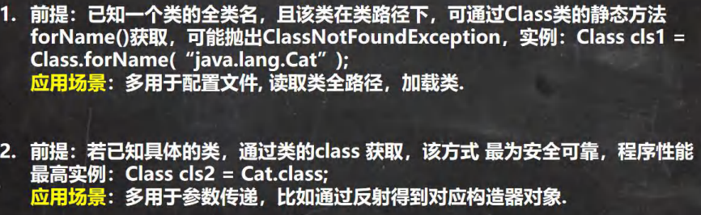


```java
//演示得到 Class 对象的各种方式(6)
public class GetClass_ {
	public static void main(String[] args) throws ClassNotFoundException {
        
		//1. Class.forName
		String classAllPath = "com.hspedu.Car"; //通过读取配置文件获取
		Class<?> cls1 = Class.forName(classAllPath);
		System.out.println(cls1);
        
		//2. 类名.class , 应用场景: 用于参数传递
		Class cls2 = Car.class;
		System.out.println(cls2);
        
		//3. 对象.getClass(), 应用场景，有对象实例
		Car car = new Car();
		Class cls3 = car.getClass();
		System.out.println(cls3);
        
		//4. 通过类加载器【4 种】来获取到类的 Class 对象
		//(1)先得到类加载器 car
        ClassLoader classLoader = car.getClass().getClassLoader();
		//(2)通过类加载器得到 Class 对象
		Class cls4 = classLoader.loadClass(classAllPath);
		System.out.println(cls4);
        
		//cls1 , cls2 , cls3 , cls4 其实是同一个对象
		System.out.println(cls1.hashCode());
		System.out.println(cls2.hashCode());
		System.out.println(cls3.hashCode());
		System.out.println(cls4.hashCode());
        
		//5. 基本数据(int, char,boolean,float,double,byte,long,short) 按如下方式得到 Class 类对象
        Class<Integer> integerClass = int.class;
		Class<Character> characterClass = char.class;
		Class<Boolean> booleanClass = boolean.class;
		System.out.println(integerClass);//int
        
		//6. 基本数据类型对应的包装类，可以通过 .TYPE 得到 Class 类对象
		Class<Integer> type1 = Integer.TYPE;
		Class<Character> type2 = Character.TYPE; //其它包装类 BOOLEAN, DOUBLE, LONG,BYTE 等待
        System.out.println(type1);
        
		System.out.println(integerClass.hashCode());//?
		System.out.println(type1.hashCode());//?
    }
}
```


### 5 哪些类型有 Class 对象

#### （1）如下类型有 Class 对象


#### （2）应用实例

```java
//演示哪些类型有 Class 对象
public class AllTypeClass {
	public static void main(String[] args) {
        
        Class<String> cls1 = String.class;//外部类
		Class<Serializable> cls2 = Serializable.class;//接口
		Class<Integer[]> cls3 = Integer[].class;//数组
		Class<float[][]> cls4 = float[][].class;//二维数组
		Class<Deprecated> cls5 = Deprecated.class;//注解
		//枚举
		Class<Thread.State> cls6 = Thread.State.class;
		Class<Long> cls7 = long.class;//基本数据类型
		Class<Void> cls8 = void.class;//void 数据类型
		Class<Class> cls9 = Class.class;//
        
		System.out.println(cls1);
		System.out.println(cls2);
		System.out.println(cls3);
		System.out.println(cls4);
		System.out.println(cls5);
		System.out.println(cls6);
		System.out.println(cls7);
		System.out.println(cls8);
		System.out.println(cls9);
	}
}
```


### 6 类加载

#### （1）基本说明


#### （2）类加载时机


#### （3）类加载过程图


#### （4）类加载各阶段完成任务


#### （5）加载阶段


#### （6）连接阶段-验证


#### （7）连接阶段-准备


```java
//我们说明一个类加载的链接阶段-准备
public class ClassLoad02 {
	public static void main(String[] args) {
        
	}
}

class A {
	//属性-成员变量-字段
	//老韩分析类加载的链接阶段-准备 属性是如何处理
    //1. n1 是实例属性, 不是静态变量，因此在准备阶段，是不会分配内存
	//2. n2 是静态变量，分配内存 n2 是默认初始化 0 ,而不是 20
	//3. n3 是 static final 是常量, 他和静态变量不一样, 因为一旦赋值就不变 n3 = 30
	public int n1 = 10;
	public static int n2 = 20;
	public static final int n3 = 30;
}
```


#### （8）连接阶段-解析


#### （9）Initialization（初始化)


```java
//演示类加载-初始化阶段
public class ClassLoad03 {
	public static void main(String[] args) throws ClassNotFoundException {
		//老韩分析
		//1. 加载 B 类，并生成 B 的 class 对象
		//2. 链接 num = 0
		//3. 初始化阶段
		// 依次自动收集类中的所有静态变量的赋值动作和静态代码块中的语句,并合并
        /*
			clinit() {
				System.out.println("B 静态代码块被执行");
				//num = 300;
				num = 100;
			}
			合并: num = 100
		*/
        
		//new B();//类加载
		//System.out.println(B.num);//100, 如果直接使用类的静态属性，也会导致类的加载
        
        //看看加载类的时候，是有同步机制控制
		/*
		protected Class<?> loadClass(String name, boolean resolve) throws ClassNotFoundException
		{
			//正因为有这个机制，才能保证某个类在内存中, 只有一份 Class 对象
			synchronized (getClassLoadingLock(name)) {
			//.... 
			}
			}
		*/
		B b = new B();
	}
}

class B {
	static {
		System.out.println("B 静态代码块被执行");
		num = 300;
	}
    
	static int num = 100;
    
	public B() {//构造器
		System.out.println("B() 构造器被执行");
	}
}
```


### 7 通过反射获取类的结构信息

#### （1）第一组: java.lang.Class 类


#### （2）第二组: java.lang.reflect.Field 类


#### （3）第三组: java.lang.reflect.Method 类


#### （4）第四组: java.lang.reflect.Constructor 类


```java
//演示如何通过反射获取类的结构信息
public class ReflectionUtils {
	public static void main(String[] args) {
	}
    
	@Test
	public void api_02() throws ClassNotFoundException, NoSuchMethodException {
		//得到 Class 对象
		Class<?> personCls = Class.forName("com.hspedu.reflection.Person");
		//getDeclaredFields:获取本类中所有属性
		//规定 说明: 默认修饰符 是 0 ， public 是 1 ，private 是 2 ，protected 是4 , static 是8 ，final 是16
        Field[] declaredFields = personCls.getDeclaredFields();
		for (Field declaredField : declaredFields) {
			System.out.println("本类中所有属性=" + declaredField.getName()
                               + " 该属性的修饰符值=" + declaredField.getModifiers()
								+ " 该属性的类型=" + declaredField.getType());
		}
        
        //getDeclaredMethods:获取本类中所有方法
		Method[] declaredMethods = personCls.getDeclaredMethods();
		for (Method declaredMethod : declaredMethods) {
			System.out.println("本类中所有方法=" + declaredMethod.getName()
					+ " 该方法的访问修饰符值=" + declaredMethod.getModifiers()
					+ " 该方法返回类型" + declaredMethod.getReturnType());
            
			//输出当前这个方法的形参数组情况
			Class<?>[] parameterTypes = declaredMethod.getParameterTypes();
			for (Class<?> parameterType : parameterTypes) {
				System.out.println("该方法的形参类型=" + parameterType);
			}
		}
        
		//getDeclaredConstructors:获取本类中所有构造器
		Constructor<?>[] declaredConstructors = personCls.getDeclaredConstructors();
		for (Constructor<?> declaredConstructor : declaredConstructors) {
			System.out.println("====================");
			System.out.println("本类中所有构造器=" + declaredConstructor.getName());//这里老师只是输出名
            Class<?>[] parameterTypes = declaredConstructor.getParameterTypes();
			for (Class<?> parameterType : parameterTypes) {
                System.out.println("该构造器的形参类型=" + parameterType);
			}
		}
	}
    
    
	//第一组方法 API
	@Test
	public void api_01() throws ClassNotFoundException, NoSuchMethodException {
        
		//得到 Class 对象
		Class<?> personCls = Class.forName("com.hspedu.reflection.Person");
		//getName:获取全类名
		System.out.println(personCls.getName());//com.hspedu.reflection.Person
		//getSimpleName:获取简单类名
		System.out.println(personCls.getSimpleName());//Person
		//getFields:获取所有 public 修饰的属性，包含本类以及父类的
		Field[] fields = personCls.getFields();
		for (Field field : fields) {//增强 for
			System.out.println("本类以及父类的属性=" + field.getName());
		}
		//getDeclaredFields:获取本类中所有属性
		Field[] declaredFields = personCls.getDeclaredFields();
        for (Field declaredField : declaredFields) {
			System.out.println("本类中所有属性=" + declaredField.getName());
		}
		//getMethods:获取所有 public 修饰的方法，包含本类以及父类的
		Method[] methods = personCls.getMethods();
		for (Method method : methods) {
			System.out.println("本类以及父类的方法=" + method.getName());
		}
		//getDeclaredMethods:获取本类中所有方法
		Method[] declaredMethods = personCls.getDeclaredMethods();
		for (Method declaredMethod : declaredMethods) {
			System.out.println("本类中所有方法=" + declaredMethod.getName());
		}
		//getConstructors: 获取所有 public 修饰的构造器，包含本类
		Constructor<?>[] constructors = personCls.getConstructors();
		for (Constructor<?> constructor : constructors) {
			System.out.println("本类的构造器=" + constructor.getName());
		}
		//getDeclaredConstructors:获取本类中所有构造器
		Constructor<?>[] declaredConstructors = personCls.getDeclaredConstructors();
		for (Constructor<?> declaredConstructor : declaredConstructors) {
			System.out.println("本类中所有构造器=" + declaredConstructor.getName());//这里老师只是输出名}
		//getPackage:以 Package 形式返回 包信息
		System.out.println(personCls.getPackage());//com.hspedu.reflection
		//getSuperClass:以 Class 形式返回父类信息
        Class<?> superclass = personCls.getSuperclass();
		System.out.println("父类的 class 对象=" + superclass);//
		//getInterfaces:以 Class[]形式返回接口信息
		Class<?>[] interfaces = personCls.getInterfaces();
		for (Class<?> anInterface : interfaces) {
			System.out.println("接口信息=" + anInterface);
		}
		//getAnnotations:以 Annotation[] 形式返回注解信息
		Annotation[] annotations = personCls.getAnnotations();
		for (Annotation annotation : annotations) {
			System.out.println("注解信息=" + annotation);//注解
		}
	}
}
    
class A {
    
	public String hobby;
    
	public void hi() {
	}
    
	public A() {
	}  
    
    public A(String name) {
	}
}  
    
interface IA {
}
    
interface IB {
}
    
@Deprecated
class Person extends A implements IA, IB {
	//属性
	public String name;
	protected static int age; // 4 + 8 = 12
	String job;
	private double sal;
    
	//构造器
	public Person() {
	}
    
	public Person(String name) {
	}
    
    //私有的
	private Person(String name, int age) {
	}
    	
	//方法
	public void m1(String name, int age, double sal) {
	}
    
	protected String m2() {
		return null;
	}
    
	void m3() {
	}
    
	private void m4() {
	}
}
```


### 8 通过反射创建对象


#### （1）案例演示

测试 1：通过反射创建某类的对象，要求该类中必须有 public 的无参构造
测试 2：通过调用某个特定构造器的方式，实现创建某类的对象

```java
//演示通过反射机制创建实例
public class ReflecCreateInstance {
	public static void main(String[] args) throws ClassNotFoundException, IllegalAccessException, InstantiationException, NoSuchMethodException, InvocationTargetException {
        //1. 先获取到 User 类的 Class 对象
		Class<?> userClass = Class.forName("com.hspedu.reflection.User");
		//2. 通过 public 的无参构造器创建实例
		Object o = userClass.newInstance();
		System.out.println(o);
		//3. 通过 public 的有参构造器创建实例
		/*
			constructor 对象就是
			public User(String name) {//public 的有参构造器
				this.name = name;
			}
		*/
		//3.1 先得到对应构造器
		Constructor<?> constructor = userClass.getConstructor(String.class);
		//3.2 创建实例，并传入实参
		Object hsp = constructor.newInstance("hsp");
		System.out.println("hsp=" + hsp);
		//4. 通过非 public 的有参构造器创建实例
		//4.1 得到 private 的构造器对象
		Constructor<?> constructor1 = userClass.getDeclaredConstructor(int.class, String.class);
		//4.2 创建实例
		//暴破【暴力破解】 , 使用反射可以访问 private 构造器/方法/属性, 反射面前，都是纸老虎
        constructor1.setAccessible(true);
		Object user2 = constructor1.newInstance(100, "张三丰");
		System.out.println("user2=" + user2);
    }
}

class User { //User 类
	private int age = 10;
	private String name = "韩顺平教育";
    
	public User() {//无参 public
	}
    
	public User(String name) {//public 的有参构造器
		this.name = name;
	}
    
	private User(int age, String name) {//private 有参构造器
		this.age = age;
		this.name = name;
	}
    
	public String toString() {
		return "User [age=" + age + ", name=" + name + "]";
	}
}
```


### 9 通过反射访问类中的成员

#### （1）访问属性


```java
//演示反射操作属性
public class ReflecAccessProperty {
	public static void main(String[] args) throws ClassNotFoundException, IllegalAccessException, InstantiationException, NoSuchFieldException {
        
		//1. 得到 Student 类对应的 Class 对象
		Class<?> stuClass = Class.forName("com.hspedu.reflection.Student");
		//2. 创建对象
		Object o = stuClass.newInstance();//o 的运行类型就是 Student
		System.out.println(o.getClass());//Student
  		//3. 使用反射得到 age 属性对象
		Field age = stuClass.getField("age");
		age.set(o, 88);//通过反射来操作属性
		System.out.println(o);//
		System.out.println(age.get(o));//返回 age 属性的值
        
		//4. 使用反射操作 name 属性
		Field name = stuClass.getDeclaredField("name");
		//对 name 进行暴破, 可以操作 private 属性
		name.setAccessible(true);
		//name.set(o, "老韩");
		name.set(null, "老韩~");//因为 name 是 static 属性，因此 o 也可以写出 null
		System.out.println(o);
		System.out.println(name.get(o)); //获取属性值
		System.out.println(name.get(null));//获取属性值, 要求 name 是 static
	}
}

class Student {//类
	public int age;
	private static String name;
    
	public Student() {//构造器
	}    
    
    public String toString() {
		return "Student [age=" + age + ", name=" + name + "]";
	}
}
```


#### （2）访问方法


```java
//演示通过反射调用方法
public class ReflecAccessMethod {
	public static void main(String[] args) throws ClassNotFoundException, NoSuchMethodException, IllegalAccessException, InstantiationException, InvocationTargetException {
        //1. 得到 Boss 类对应的 Class 对象
		Class<?> bossCls = Class.forName("com.hspedu.reflection.Boss");
		//2. 创建对象
		Object o = bossCls.newInstance();
		//3. 调用 public 的 hi 方法
		//Method hi = bossCls.getMethod("hi", String.class);//OK
		//3.1 得到 hi 方法对象
		Method hi = bossCls.getDeclaredMethod("hi", String.class);//OK
		//3.2 调用
		hi.invoke(o, "韩顺平教育~");
        
		//4. 调用 private static 方法
		//4.1 得到 say 方法对象
		Method say = bossCls.getDeclaredMethod("say", int.class, String.class, char.class);
		//4.2 因为 say 方法是 private, 所以需要暴破，原理和前面讲的构造器和属性一样
        say.setAccessible(true);
		System.out.println(say.invoke(o, 100, "张三", '男'));
		//4.3 因为 say 方法是 static 的，还可以这样调用 ，可以传入 null
		System.out.println(say.invoke(null, 200, "李四", '女'));
        
		//5. 在反射中，如果方法有返回值，统一返回 Object , 但是他运行类型和方法定义的返回类型一致
        Object reVal = say.invoke(null, 300, "王五", '男');
		System.out.println("reVal 的运行类型=" + reVal.getClass());//String
        
        //在演示一个返回的案例
		Method m1 = bossCls.getDeclaredMethod("m1");
		Object reVal2 = m1.invoke(o);
		System.out.println("reVal2 的运行类型=" + reVal2.getClass());//Monster
	}
}

class Monster {}

class Boss {//类
	public int age;
	private static String name;
    
	public Boss() {//构造器
	}
    
	public Monster m1() {
		return new Monster();
	}
    
	private static String say(int n, String s, char c) {//静态方法
		return n + " " + s + " " + c;
	}
    
	public void hi(String s) {//普通 public 方法
        System.out.println("hi " + s);
	}
}
```


