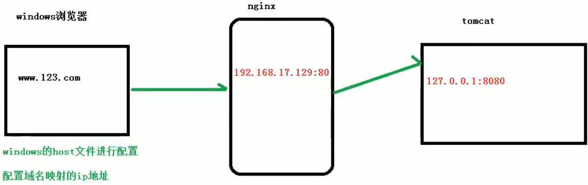
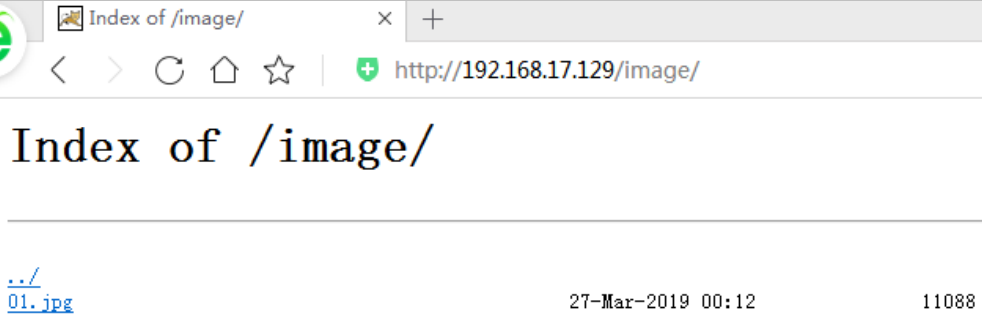

# Nginx

## 1.nginx 简介

### （1） 什么是 nginx

Nginx（"engine x"）是一个高性能的HTTP和反向代理服务器，特点是占有内存少，并发能力强，事实上nginx的并发能力确实在同类型的网页服务器中表现较好

Nginx专为性能优化而开发，性能是其最重要的考量，实现上非常注重效率，能经受高负载的考验，有报告表明能支持高达50，000个并发连接数。


### （2） 正向代理

正向代理：如果把局域网外的 Internet 想象成一个巨大的资源库，则局域网中的客户端要访 问 Internet，则需要通过代理服务器来访问，这种代理服务就称为正向代理。

**在客户端（浏览器）配置代理服务器，通过代理服务器进行互联网访问.**


### （3） 反向代理

反向代理，其实客户端对代理是无感知的，因为客户端不需要任何配置就可以访问，我们只 需要将请求发送到反向代理服务器，由反向代理服务器去选择目标服务器获取数据后，在返 回给客户端，此时反向代理服务器和目标服务器对外就是一个服务器，**暴露的是代理服务器 地址，隐藏了真实服务器 IP 地址**。


### （4）负载均衡

增加服务器的数量，然后将请求分发到各个服务器上，将原先请求集中到单个服务器上的 情况改为将请求分发到多个服务器上，将负载分发到不同的服务器，也就是我们所说的负载均衡


### （5） 动静分离

为了加快网站的解析速度，可以把动态页面和静态页面由不同的服务器来解析，加快解析速度。降低原来单个服务器的压力。


## 2.Nginx 的安装

**1、准备工作**

（1）打开虚拟机，使用远程连接工具连接 linux 操作系统 
（2）到 nginx 官网下载软件 http://nginx.org/ 


**2、开始进行 nginx 安装** 

（1）安装 pcre 依赖 

- 第一步 联网下载 pcre 压缩文件依赖 wget http://downloads.sourceforge.net/project/pcre/pcre/8.37/pcre-8.37.tar.gz
- 第二步 **解压压缩文件** 使用命令 tar –xvf pcre-8.37.tar.gz
- 第三步 **进入解压后的目录** 执行./configure
- 执行 make && make install
- 安装之后，使用命令，查看版本号 pcre-config --version


（2）安装 openssl 、zlib 、 gcc 依赖

- 执行 yum -y install make zlib zlib-devel gcc-c++ libtool openssl openssl-devel


（3）安装 nginx

- 把 nginx 安装文件放到 linux 系统中
- 解压压缩文件 tar -xvf nginx-1.12.2.tar.gz
- 进入解压后的目录 执行./configure
- 执行 make && make install

安装成功之后，在usr多出来一个文件夹 local/nginx，在 nginx 有 sbin 有启动脚本

进入目录 /usr/local/nginx/sbin/ 启动服务 **./nginx**

在 windows 系统中访问 linux 中 nginx，默认不能访问的，因为防火墙问题
（1）关闭防火墙
（2）开放访问的端口号，80 端口

查看开放的端口号
firewall-cmd --list-all

设置开放的端口号
**sudo firewall-cmd --add-port=80/tcp --permanent**

重启防火墙
firewall-cmd –reload


## 3.Nginx 的常用命令

使用nginx操作命令前提条件：必须进入nginx的目录
**cd /usr/local/nginx/sbin**

1、查看 nginx 版本号 
./nginx -v

2、启动nginx 
./nginx 

3、停止nginx 
./nginx -s stop 

4、重新加载nginx 
./nginx -s reload


## 4.Nginx 配置文件

**1、nginx 配置文件位置**
cd /usr/local/nginx/conf/


**2、nginx 配置文件由三部分组成**

（1）**全局块**：从配置文件开始到 events 块之间的内容，主要会设置一些影响 nginx 服务器整体运行的配置指令，主要包括配 置运行 Nginx 服务器的用户（组）、允许生成的 worker process 数，进程 PID 存放路径、日志存放路径和类型以 及配置文件的引入等。

 比如上面第一行配置的：**worker_processes 1**；
这是 Nginx 服务器并发处理服务的关键配置，worker_processes 值越大，可以支持的并发处理量也越多，但是 会受到硬件、软件等设备的制约


（2）**events 块**：events 块涉及的指令主要影响 Nginx 服务器与用户的网络连接，常用的设置包括是否开启对多 work process 下的网络连接进行序列化，是否允许同时接收多个网络连接，选取哪种事件驱动模型来处理连接请求，每个 word process 可以同时支持的最大连接数等。 


上述例子就表示每个 work process 支持的最大连接数为 1024. 

这部分的配置对 Nginx 的性能影响较大，在实际中应该灵活配置。


（3）**http 块**：这算是 Nginx 服务器配置中最频繁的部分，代理、缓存和日志定义等绝大多数功能和第三方模块的配置都在这里。 需要注意的是：http 块也可以包括 **http 全局块**、**server 块**。


**① http 全局块**：http 全局块配置的指令包括文件引入、MIME-TYPE 定义、日志自定义、连接超时时间、单链接请求数上限等。

**② server 块**：这块和虚拟主机有密切关系，虚拟主机从用户角度看，和一台独立的硬件主机是完全一样的，该技术的产生是为了 节省互联网服务器硬件成本。

- 每个 http 块可以包括多个 server 块，而每个 server 块就相当于一个虚拟主机。 
- 而每个 server 块也分为全局 server 块，以及可以同时包含多个 locaton 块。 
- **全局 server 块** 
  最常见的配置是本虚拟机主机的监听配置和本虚拟主机的名称或 IP 配置。
- **location 块**
  一个 server 块可以配置多个 location 块。
  这块的主要作用是基于 Nginx 服务器接收到的请求字符串（例如 server_name/uri-string），对虚拟主机名称 （也可以是 IP 别名）之外的字符串（例如 前面的 /uri-string）进行匹配，对特定的请求进行处理。地址定向、数据缓存和应答控制等功能，还有许多第三方模块的配置也在这里进行。


## 5.Nginx 配置 反向代理实例1

**1、实现效果**
（1）打开浏览器，在浏览器地址栏输入地址 www.123.com，跳转到 liunx 系统 tomcat 主页面中

**2、准备工作**
（1）在 liunx 系统安装 tomcat，使用默认端口 8080

* tomcat 安装文件放到 liunx 系统中 /usr/src/ 位置，解压
* 进入 tomcat 的 bin 目录中，./startup.sh 启动 tomcat 服务器

（2）对外开放访问的端口
	设置开放的端口：firewall-cmd --add-port=8080/tcp --permanent
	重启防火墙：firewall-cmd –reload
	查看已经开放的端口号 firewall-cmd --list-all

（3）在 windows 系统中通过浏览器访问 tomcat 服务器


**3、访问过程的分析**




**4、具体配置**

第一步 在 windows 系统的 host 文件进行域名和 ip 对应关系的配置


**（1）添加内容在 host 文件中**
	192.168.13.129       www.isjhd.com


第二步 在 nginx 进行请求转发的配置（反向代理配置）


**5、最终测试**


## 6.Nginx 配置 反向代理实例2

**1、实现效果** 
使用 nginx 反向代理，根据访问的路径跳转到不同端口的服务中 nginx 监听端口为 9001。

访问 http://192.168.17.129:9001/edu/ 直接跳转到 127.0.0.1:8080 
访问 http:// 192.168.17.129:9001/vod/ 直接跳转到 127.0.0.1:8081


**2、准备工作**
（1）准备两个 tomcat 服务器，一个 8080 端口，一个 8081 端口
（2）创建文件夹和测试页面


**3、具体配置** 
（1）找到 nginx 配置文件，进行反向代理配置


（2）开放对外访问的端口号 9001 8080 8081


**4、最终测试**


### location 指令说明

该指令用于匹配 URL。

语法如下：

1. = ：用于不含正则表达式的 uri 前，要求请求字符串与 uri 严格匹配，如果匹配成功，就停止继续向下搜索并立即处理该请求。
2.  ~：用于表示 uri 包含正则表达式，并且区分大小写。
3.  ~*：用于表示 uri 包含正则表达式，并且不区分大小写。
4.  ^~：用于不含正则表达式的 uri 前，要求 Nginx 服务器找到标识 uri 和请求字符串匹配度最高的 location 后，立即使用此 location 处理请求，而不再使用 location块中的正则 uri 和请求字符串做匹配。

**注意：如果 uri 包含正则表达式，则必须要有 ~ 或者 ~* 标识。**


## 7.Nginx 配置实例-负载均衡

**1、实现效果**
（1）浏览器地址栏输入地址 http://192.168.17.129/edu/a.html，负载均衡效果，平均 8080和 8081 端口中

**2、准备工作**
（1）准备两台 tomcat 服务器，一台 8080，一台 8081
（2）在两台 tomcat 里面 webapps 目录中，创建名称是 edu 文件夹，在 edu 文件夹中创建页面 a.html，用于测试

**3、在 nginx 的配置文件中进行负载均衡的配置**


**4、nginx 分配服务器策略**

第一种 轮询（默认）
每个请求按时间顺序逐一分配到不同的后端服务器，如果后端服务器down 掉，能自动剔除。


第二种 weight
weight 代表权重默认为 1,权重越高被分配的客户端越多


第三种 ip_hash
每个请求按访问 ip 的 hash 结果分配，这样每个访客固定访问一个后端服务器


第四种 fair（第三方）
按后端服务器的响应时间来分配请求，响应时间短的优先分配。


## 8.Nginx 配置实例-动静分离

**1、什么是动静分离**


通过 location 指定不同的后缀名实现不同的请求转发。通过 expires 参数设置，可以使浏 览器缓存过期时间，减少与服务器之前的请求和流量。具体 Expires 定义：是给一个资源 设定一个过期时间，也就是说无需去服务端验证，直接通过浏览器自身确认是否过期即可， 所以不会产生额外的流量。此种方法非常适合不经常变动的资源。（如果经常更新的文件， 不建议使用 Expires 来缓存），我这里设置 3d，表示在这 3 天之内访问这个 URL，发送一 个请求，比对服务器该文件最后更新时间没有变化，则不会从服务器抓取，返回状态码 304， 如果有修改，则直接从服务器重新下载，返回状态码 200。


**2、准备工作**
（1）在 liunx 系统中准备静态资源，用于进行访问


**3、具体配置**
（1）在 nginx 配置文件中进行配置


**4、最终测试**
（1）浏览器中输入地址http://192.168.17.129/image/01.jpg


- 因为配置文件 **autoindex on**：列出你当前文件夹的内容
  


（2）在浏览器地址栏输入地址 http://192.168.17.129/www/a.html


## 9.Nginx 配置高可用的集群


**1、什么是 nginx 高可用**


（1）需要两台 nginx 服务器
（2）需要 keepalived
（3）需要虚拟 ip

**2、配置高可用的准备工作**
（1）需要两台服务器 192.168.17.129 和 192.168.17.131
（2）在两台服务器安装 nginx
（3）在两台服务器安装 keepalived

**3、在两台服务器安装 keepalived**
（1）使用 yum 命令进行安装yum install keepalived –y
（2）检查是否安装成功：rpm -q -a keepalived
（3）安装之后，在 etc 里面生成目录 keepalived，有文件 keepalived.conf


### 高可用配置（主从配置）

（1）修改/etc/keepalived/keepalivec.conf 配置文件

keepalivec.conf

```
#全局配置
global_defs {
	notification_email {
		acassen@firewall.loc
		failover@firewall.loc
		sysadmin@firewall.loc
 	}
 	notification_email_from Alexandre.Cassen@firewall.loc
 	smtp_server 192.168.17.129
 	smtp_connect_timeout 30
	router_id LVS_DEVEL #主机姓名，访问到主机
}

#脚本配置
vrrp_script chk_http_port {

	script "/usr/local/src/nginx_check.sh"

	interval 2 #（检测脚本执行的间隔）

	weight 2 #设置当前服务器的权重
	
}

#虚拟ip配置
vrrp_instance VI_1 {
	state BACKUP # 备份服务器上将 MASTER 改为 BACKUP
	interface ens33 //网卡
	virtual_router_id 51 # 主、备机的 virtual_router_id 必须相同，相当于一个唯一标识
	priority 100 # 主、备机取不同的优先级，主机值较大，备份机值较小
	advert_int 1 #时间间隔，每隔一段时间检测是否活着
	authentication {#权限校验的方式
		auth_type PASS
		auth_pass 1111
 	}
	virtual_ipaddress {
		192.168.17.50 // VRRP H 虚拟地址
	}
}
```


（2）在/usr/local/src 添加检测脚本

nginx_check.sh

```sh
#!/bin/bash
A=`ps -C nginx –no-header |wc -l`
if [ $A -eq 0 ];then
	/usr/local/nginx/sbin/nginx
	sleep 2
	if [ `ps -C nginx --no-header |wc -l` -eq 0 ];then
		killall keepalived
	fi
fi
```


（3）把两台服务器上 nginx 和 keepalived 启动 
启动 nginx：./nginx 
启动 keepalived：systemctl start keepalived.service


最终测试
（1）在浏览器地址栏输入 虚拟 ip 地址 192.168.17.50 


（2）把主服务器（192.168.17.129）nginx 和 keepalived 停止，再输入192.168.17.50


## 10.Nginx 的原理

1、mater 和 worker


2、worker 如何进行工作的


3、一个 master 和多个 woker 有好处
（1）可以使用 nginx –s reload 热部署，利用 nginx 进行热部署操作
（2）每个 woker 是独立的进程，如果有其中的一个 woker 出现问题，其他 woker 独立的，继续进行争抢，实现请求过程，不会造成服务中断


4、设置多少个 woker 合适
worker 数和服务器的 cpu 数相等是最为适宜的


5、连接数 worker_connection
第一个：发送请求，占用了 woker 的几个连接数？
答案：2 或者 4 个

第二个：nginx 有一个 master，有四个 woker，每个 woker 支持最大的连接数1024，支持的最大并发数是多少？

- 普通的静态访问最大并发数是： worker_connections * worker_processes /2
- 而如果是 HTTP 作 为反向代理来说，最大并发数量应该是 worker_connections * worker_processes/4。


