# 基础篇Redis

## 1.初识Redis

### 1.1认识NoSQL

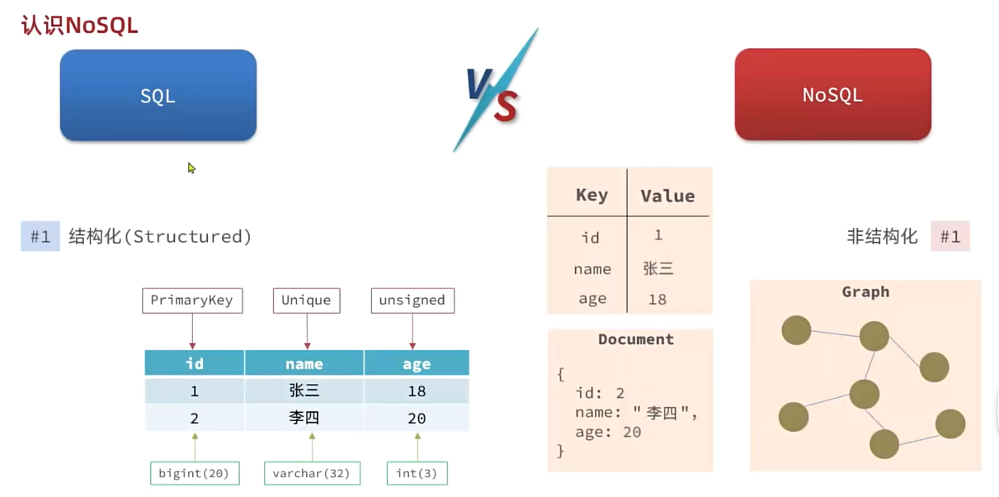

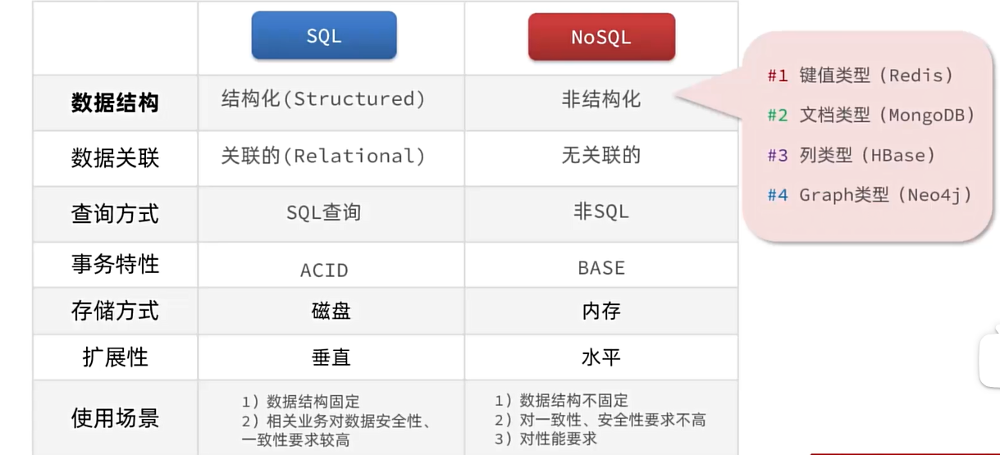

### 1.2认识Redis

Redis诞生于2009年全称是**Re**mote  **D**ictionary **S**erver 远程词典服务器，是一个基于内存的键值型NoSQL数据库。

**特征**：

- 键值（key-value）型，value支持多种不同数据结构，功能丰富
- 单线程，每个命令具备原子性
- 低延迟，速度快（基于内存、IO多路复用、良好的编码）。
- 支持数据持久化
- 支持主从集群、分片集群
- 支持多语言客户端

**作者**：Antirez

Redis的官方网站地址：https://redis.io/

### 1.3安装Redis

大多数企业都是基于Linux服务器来部署项目，而且Redis官方也没有提供Windows版本的安装包。因此课程中我们会基于Linux系统来安装Redis.

此处选择的Linux版本为CentOS 7.

#### 1.3.1.依赖库

Redis是基于C语言编写的，因此首先需要安装Redis所需要的gcc依赖：

```sh
yum install -y gcc tcl
```


#### 1.3.2.上传安装包并解压

然后将课前资料提供的Redis安装包上传到虚拟机的任意目录：

例如，我放到了/usr/local/src 目录：

解压缩：

```sh
tar -xzf redis-6.2.6.tar.gz
```

解压后进入redis目录：

```sh
cd redis-6.2.6
```

运行编译命令：

```sh
make && make install
```

如果没有出错，应该就安装成功了。

该目录已经默认配置到环境变量，因此可以在任意目录下运行这些命令。其中：

- redis-cli：是redis提供的命令行客户端
- redis-server：是redis的服务端启动脚本
- redis-sentinel：是redis的哨兵启动脚本


#### 1.3.3.启动

redis的启动方式有很多种，例如：

- 默认启动

- 指定配置启动

- 开机自启

  

#### 1.3.4.默认启动

安装完成后，在任意目录输入redis-server命令即可启动Redis：

```sh
redis-server
```

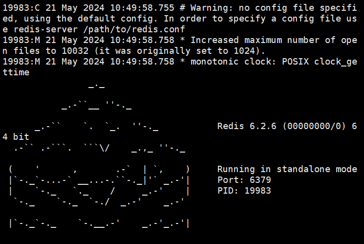

这种启动属于`前台启动`，会阻塞整个会话窗口，窗口关闭或者按下`CTRL + C`则Redis停止。不推荐使用。

#### 1.3.5.指定配置启动

如果要让Redis以`后台`方式启动，则必须修改Redis配置文件，就在我们之前解压的redis安装包下（`/usr/local/src/redis-6.2.6`），名字叫redis.conf：

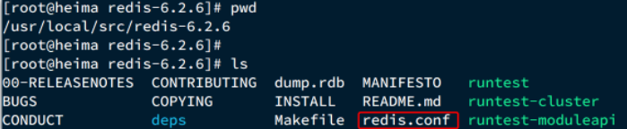

我们先将这个配置文件备份一份：

```sh
cp redis.conf redis.conf.bck
```


然后修改redis.conf文件中的一些配置：

```properties
# 允许访问的地址，默认是127.0.0.1，会导致只能在本地访问。修改为0.0.0.0则可以在任意IP访问，生产环境不要设置为0.0.0.0
bind 0.0.0.0
# 守护进程，修改为yes后即可后台运行
daemonize yes 
# 密码，设置后访问Redis必须输入密码
requirepass 123321
```


Redis的其它常见配置：

```properties
# 监听的端口
port 6379
# 工作目录，默认是当前目录，也就是运行redis-server时的命令，日志.持久化等文件会保存在这个目录
dir .
# 数据库数量，设置为1，代表只使用1个库，默认有16个库，编号0~15
databases 1
# 设置redis能够使用的最大内存
maxmemory 512mb
# 日志文件，默认为空，不记录日志，可以指定日志文件名
logfile "redis.log"
```


启动Redis：

```properties
# 进入redis安装目录 
cd /usr/local/src/redis-6.2.6
# 启动
redis-server redis.conf
```


停止服务：

```properties
# 利用redis-cli来执行 shutdown 命令，即可停止 Redis 服务，
# 因为之前配置了密码，因此需要通过 -u 来指定密码
redis-cli -u 123321 shutdown
#不行的话可以用kill杀死进程
kill -9 [进程号]
```


#### 1.3.6.开机自启

我们也可以通过配置来实现开机自启。

首先，新建一个系统服务文件：

```sh
vim /etc/systemd/system/redis.service
```

内容如下：

```conf
[Unit]
Description=redis-server
After=network.target

[Service]
Type=forking
ExecStart=/usr/local/bin/redis-server /usr/local/src/redis-6.2.6/redis.conf
PrivateTmp=true

[Install]
WantedBy=multi-user.target
```


然后重载系统服务：

```sh
systemctl daemon-reload
```


现在，我们可以用下面这组命令来操作redis了：

```sh
# 启动
systemctl start redis
# 停止
systemctl stop redis
# 重启
systemctl restart redis
# 查看状态
systemctl status redis
```


执行下面的命令，可以让redis开机自启：

```sh
systemctl enable redis
```


### 1.4Redis桌面客户端

安装完成Redis，我们就可以操作Redis，实现数据的CRUD了。这需要用到Redis客户端，包括：

- 命令行客户端
- 图形化桌面客户端
- 编程客户端

#### 1.4.1.Redis命令行客户端

Redis安装完成后就自带了命令行客户端：redis-cli，使用方式如下：

```sh
redis-cli [options] [commonds]
```

其中常见的options有：

- `-h 127.0.0.1`：指定要连接的redis节点的IP地址，默认是127.0.0.1
- `-p 6379`：指定要连接的redis节点的端口，默认是6379
- `-a 123321`：指定redis的访问密码 

其中的commonds就是Redis的操作命令，例如：

- `ping`：与redis服务端做心跳测试，服务端正常会返回`pong`

不指定commond时，会进入`redis-cli`的交互控制台：


#### 1.4.2.图形化桌面客户端

GitHub上的大神编写了Redis的图形化桌面客户端，地址：https://github.com/uglide/RedisDesktopManager

不过该仓库提供的是RedisDesktopManager的源码，并未提供windows安装包。

在下面这个仓库可以找到安装包：https://github.com/lework/RedisDesktopManager-Windows/releases


#### 1.4.3.建立连接


## 2.Redis常见命令

### 2.1Redis数据结构介绍

Redis是一个key-value的数据库，key一般是String类型，不过value的类型多种多样：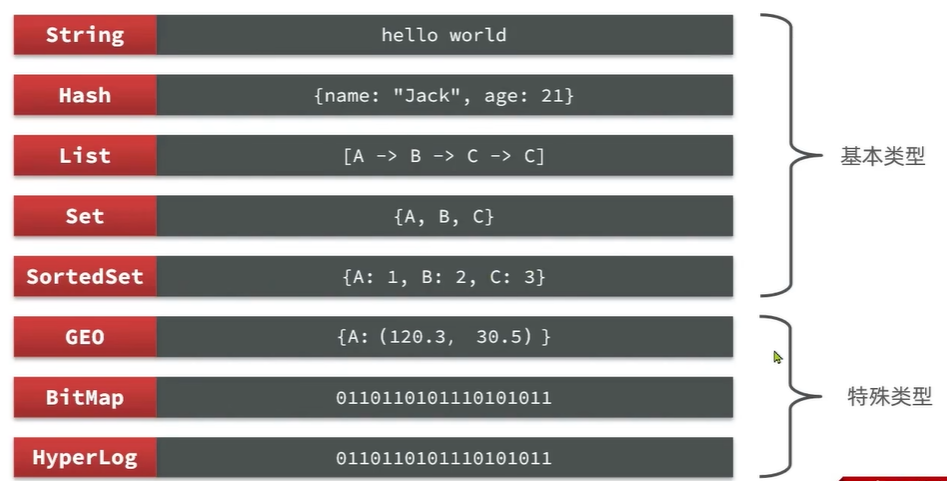

**贴心小建议：命令不要死记，学会查询就好啦**

Redis为了方便我们学习，将操作不同数据类型的命令也做了分组，在官网（ https://redis.io/commands ）可以查看到不同的命令：


### 2.2Redis通用命令

通用指令是部分数据类型的，都可以使用的指令，常见的有：

- KEYS：查看符合模板的所有key，**在生产环境下，不推荐使用keys 命令**
- DEL：删除一个指定的key
- EXISTS：判断key是否存在
- EXPIRE：给一个key设置有效期，有效期到期时该key会被自动删除
- TTL：查看一个KEY的剩余有效期

通过help [command] 可以查看一个命令的具体用法，例如：

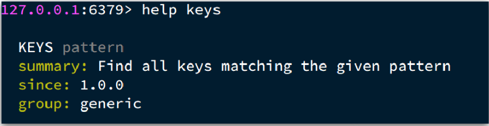

* KEYS

```sh
127.0.0.1:6379> keys *
1) "name"
2) "age"
127.0.0.1:6379>

# 查询以a开头的key
127.0.0.1:6379> keys a*
1) "age"
127.0.0.1:6379>
```

**贴心小提示：在生产环境下，不推荐使用keys 命令，因为这个命令在key过多的情况下，效率不高**

* DEL

```sh
127.0.0.1:6379> help del

  DEL key [key ...]
  summary: Delete a key
  since: 1.0.0
  group: generic

127.0.0.1:6379> del name #删除单个
(integer) 1  #成功删除1个

127.0.0.1:6379> keys *
1) "age"

127.0.0.1:6379> MSET k1 v1 k2 v2 k3 v3 #批量添加数据
OK

127.0.0.1:6379> keys *
1) "k3"
2) "k2"
3) "k1"
4) "age"

127.0.0.1:6379> del k1 k2 k3 k4
(integer) 3   #此处返回的是成功删除的key，由于redis中只有k1,k2,k3 所以只成功删除3个，最终返回
127.0.0.1:6379>

127.0.0.1:6379> keys * #再查询全部的key
1) "age"	#只剩下一个了
127.0.0.1:6379>
```

**贴心小提示：同学们在拷贝代码的时候，只需要拷贝对应的命令哦~**

* EXISTS

```sh
127.0.0.1:6379> help EXISTS

  EXISTS key [key ...]
  summary: Determine if a key exists
  since: 1.0.0
  group: generic

127.0.0.1:6379> exists age
(integer) 1

127.0.0.1:6379> exists name
(integer) 0
```

* EXPIRE

**贴心小提示**：内存非常宝贵，对于一些数据，我们应当给他一些过期时间，当过期时间到了之后，他就会自动被删除~

```sh
127.0.0.1:6379> expire age 10
(integer) 1

127.0.0.1:6379> ttl age
(integer) 8

127.0.0.1:6379> ttl age
(integer) 6

127.0.0.1:6379> ttl age
(integer) -2

127.0.0.1:6379> ttl age
(integer) -2  #当这个key过期了，那么此时查询出来就是-2 

127.0.0.1:6379> keys *
(empty list or set)

127.0.0.1:6379> set age 10 #如果没有设置过期时间
OK

127.0.0.1:6379> ttl age
(integer) -1  # ttl的返回值就是-1
```


### 2.3String类型

String类型，也就是字符串类型，是Redis中最简单的存储类型。

其value是字符串，不过根据字符串的格式不同，又可以分为3类：

* string：普通字符串
* int：整数类型，可以做自增.自减操作
* float：浮点类型，可以做自增.自减操作

不管是哪种格式，底层都是字节数组形式存储，只不过是编码方式不同。字符串类型的最大空间不能超过512m


String的常见命令有：

* SET：添加或者修改已经存在的一个String类型的键值对
* GET：根据key获取String类型的value
* MSET：批量添加多个String类型的键值对
* MGET：根据多个key获取多个String类型的value
* INCR：让一个整型的key自增1
* INCRBY:让一个整型的key自增并指定步长，例如：incrby num 2 让num值自增2
* INCRBYFLOAT：让一个浮点类型的数字自增并指定步长
* SETNX：添加一个String类型的键值对，前提是这个key不存在，否则不执行
* SETEX：添加一个String类型的键值对，并且指定有效期

**贴心小提示**：以上命令除了INCRBYFLOAT 都是常用命令

* SET 和GET: 如果key不存在则是新增，如果存在则是修改

* 

```java
127.0.0.1:6379> set name Rose  //原来不存在
OK

127.0.0.1:6379> get name 
"Rose"

127.0.0.1:6379> set name Jack //原来存在，就是修改
OK

127.0.0.1:6379> get name
"Jack"
```

* MSET和MGET

```java
127.0.0.1:6379> MSET k1 v1 k2 v2 k3 v3
OK

127.0.0.1:6379> MGET name age k1 k2 k3
1) "Jack" //之前存在的name
2) "10"   //之前存在的age
3) "v1"
4) "v2"
5) "v3"
```

* INCR和INCRBY和DECY

```java
127.0.0.1:6379> get age 
"10"

127.0.0.1:6379> incr age //增加1
(integer) 11
    
127.0.0.1:6379> get age //获得age
"11"

127.0.0.1:6379> incrby age 2 //一次增加2
(integer) 13 //返回目前的age的值
    
127.0.0.1:6379> incrby age 2
(integer) 15
    
127.0.0.1:6379> incrby age -1 //也可以增加负数，相当于减
(integer) 14
    
127.0.0.1:6379> incrby age -2 //一次减少2个
(integer) 12
    
127.0.0.1:6379> DECR age //相当于 incr 负数，减少正常用法
(integer) 11
    
127.0.0.1:6379> get age 
"11"

```

* SETNX

```java
127.0.0.1:6379> help setnx

  SETNX key value
  summary: Set the value of a key, only if the key does not exist
  since: 1.0.0
  group: string

127.0.0.1:6379> set name Jack  //设置名称
OK
127.0.0.1:6379> setnx name lisi //如果key不存在，则添加成功
(integer) 0
127.0.0.1:6379> get name //由于name已经存在，所以lisi的操作失败
"Jack"
127.0.0.1:6379> setnx name2 lisi //name2 不存在，所以操作成功
(integer) 1
127.0.0.1:6379> get name2 
"lisi"
```

* SETEX

```sh
127.0.0.1:6379> setex name 10 jack
OK

127.0.0.1:6379> ttl name
(integer) 8

127.0.0.1:6379> ttl name
(integer) 7

127.0.0.1:6379> ttl name
(integer) 5
```


### 2.4Key的层级结构

Redis没有类似MySQL中的Table的概念，我们该如何区分不同类型的key呢？

例如，需要存储用户.商品信息到redis，有一个用户id是1，有一个商品id恰好也是1，此时如果使用id作为key，那就会冲突了，该怎么办？

我们可以通过给key添加前缀加以区分，不过这个前缀不是随便加的，有一定的规范：

Redis的key允许有多个单词形成层级结构，多个单词之间用':'隔开，格式如下：


这个格式并非固定，也可以根据自己的需求来删除或添加词条。

例如我们的项目名称叫 heima，有user和product两种不同类型的数据，我们可以这样定义key：

- user相关的key：**heima:user:1**

- product相关的key：**heima:product:1**

如果Value是一个Java对象，例如一个User对象，则可以将对象序列化为JSON字符串后存储：

| **KEY**         | **VALUE**                                 |
| --------------- | ----------------------------------------- |
| heima:user:1    | {"id":1, "name": "Jack", "age": 21}       |
| heima:product:1 | {"id":1, "name": "小米11", "price": 4999} |

一旦我们向redis采用这样的方式存储，那么在可视化界面中，redis会以层级结构来进行存储，形成类似于这样的结构，更加方便Redis获取数据

```sh
192.168.13.129:6379> set heima:product:1 '{"id":1, "name":"xiaomi11", "price:4399}'
OK
192.168.13.129:6379> set heima:product:1 '{"id":2, "name":"ronyao11", "price:2399}'
OK

```

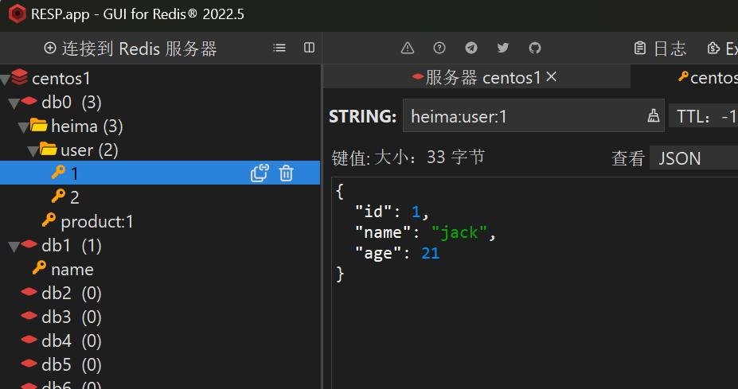


### 2.5Hash类型

Hash类型，也叫散列，其value是一个无序字典，类似于Java中的HashMap结构。

String结构是将对象序列化为JSON字符串后存储，当需要修改对象某个字段时很不方便：


Hash结构可以将对象中的每个字段独立存储，可以针对单个字段做CRUD：

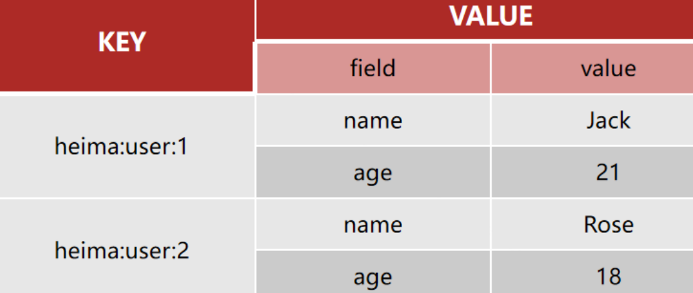

**Hash类型的常见命令**

- HSET key field value：添加或者修改hash类型key的field的值

- HGET key field：获取一个hash类型key的field的值

- HMSET：批量添加多个hash类型key的field的值

- HMGET：批量获取多个hash类型key的field的值

- HGETALL：获取一个hash类型的key中的所有的field和value
- HKEYS：获取一个hash类型的key中的所有的field
- HINCRBY:让一个hash类型key的字段值自增并指定步长
- HSETNX：添加一个hash类型的key的field值，前提是这个field不存在，否则不执行

**贴心小提示**：哈希结构也是我们以后实际开发中常用的命令哟

* HSET和HGET

```java
127.0.0.1:6379> HSET heima:user:3 name Lucy//大key是 heima:user:3 小key是name，小value是Lucy
(integer) 1
127.0.0.1:6379> HSET heima:user:3 age 21// 如果操作不存在的数据，则是新增
(integer) 1
127.0.0.1:6379> HSET heima:user:3 age 17 //如果操作存在的数据，则是修改
(integer) 0
127.0.0.1:6379> HGET heima:user:3 name 
"Lucy"
127.0.0.1:6379> HGET heima:user:3 age
"17"
```

* HMSET和HMGET

```java
127.0.0.1:6379> HMSET heima:user:4 name HanMeiMei
OK
127.0.0.1:6379> HMSET heima:user:4 name LiLei age 20 sex man
OK
127.0.0.1:6379> HMGET heima:user:4 name age sex
1) "LiLei"
2) "20"
3) "man"
```

* HGETALL

```java
127.0.0.1:6379> HGETALL heima:user:4
1) "name"
2) "LiLei"
3) "age"
4) "20"
5) "sex"
6) "man"
```

* HKEYS和HVALS

```java
127.0.0.1:6379> HKEYS heima:user:4
1) "name"
2) "age"
3) "sex"
127.0.0.1:6379> HVALS heima:user:4
1) "LiLei"
2) "20"
3) "man"
```

* HINCRBY

```java
127.0.0.1:6379> HINCRBY  heima:user:4 age 2
(integer) 22
127.0.0.1:6379> HVALS heima:user:4
1) "LiLei"
2) "22"
3) "man"
127.0.0.1:6379> HINCRBY  heima:user:4 age -2
(integer) 20
```

* HSETNX

```java
127.0.0.1:6379> HSETNX heima:user4 sex woman
(integer) 1
127.0.0.1:6379> HGETALL heima:user:3
1) "name"
2) "Lucy"
3) "age"
4) "17"
127.0.0.1:6379> HSETNX heima:user:3 sex woman
(integer) 1
127.0.0.1:6379> HGETALL heima:user:3
1) "name"
2) "Lucy"
3) "age"
4) "17"
5) "sex"
6) "woman"
```


### 2.6List类型

Redis中的List类型与Java中的LinkedList类似，可以看做是一个双向链表结构。既可以支持正向检索和也可以支持反向检索。

特征也与LinkedList类似：

* 有序
* 元素可以重复
* 插入和删除快
* 查询速度一般

常用来存储一个有序数据，例如：朋友圈点赞列表，评论列表等。

**List的常见命令有：**

- LPUSH key element ... ：向列表左侧插入一个或多个元素
- LPOP key：移除并返回列表左侧的第一个元素，没有则返回nil
- RPUSH key element ... ：向列表右侧插入一个或多个元素
- RPOP key：移除并返回列表右侧的第一个元素
- LRANGE key star end：返回一段角标范围内的所有元素
- BLPOP和BRPOP：与LPOP和RPOP类似，只不过在没有元素时等待指定时间，而不是直接返回nil

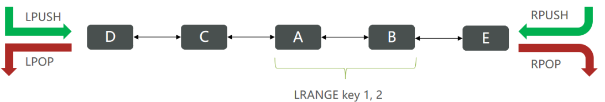

* LPUSH和RPUSH

```java
127.0.0.1:6379> LPUSH users 1 2 3
(integer) 3
127.0.0.1:6379> RPUSH users 4 5 6
(integer) 6
```

* LPOP和RPOP

```java
127.0.0.1:6379> LPOP users
"3"
127.0.0.1:6379> RPOP users
"6"
```

* LRANGE

```java
127.0.0.1:6379> LRANGE users 1 2
1) "1"
2) "4"
```


### 2.7Set类型

Redis的Set结构与Java中的HashSet类似，可以看做是一个value为null的HashMap。因为也是一个hash表，因此具备与HashSet类似的特征：

* 无序
* 元素不可重复
* 查找快
* 支持交集.并集.差集等功能

**Set类型的常见命令**

* SADD key member ... ：向set中添加一个或多个元素
* SREM key member ... : 移除set中的指定元素
* SCARD key： 返回set中元素的个数
* SISMEMBER key member：判断一个元素是否存在于set中
* SMEMBERS：获取set中的所有元素
* SINTER key1 key2 ... ：求key1与key2的交集
* SDIFF key1 key2 ... ：求key1与key2的差集
* SUNION key1 key2 ..：求key1和key2的并集

**具体命令**

```java
127.0.0.1:6379> sadd s1 a b c
(integer) 3
127.0.0.1:6379> smembers s1
1) "c"
2) "b"
3) "a"
127.0.0.1:6379> srem s1 a
(integer) 1
    
127.0.0.1:6379> SISMEMBER s1 a
(integer) 0
    
127.0.0.1:6379> SISMEMBER s1 b
(integer) 1
    
127.0.0.1:6379> SCARD s1
(integer) 2
```

**案例**

* 将下列数据用Redis的Set集合来存储：
* 张三的好友有：李四.王五.赵六
* 李四的好友有：王五.麻子.二狗
* 利用Set的命令实现下列功能：
* 计算张三的好友有几人
* 计算张三和李四有哪些共同好友
* 查询哪些人是张三的好友却不是李四的好友
* 查询张三和李四的好友总共有哪些人
* 判断李四是否是张三的好友
* 判断张三是否是李四的好友
* 将李四从张三的好友列表中移除

```java
127.0.0.1:6379> SADD zs lisi wangwu zhaoliu
(integer) 3
    
127.0.0.1:6379> SADD ls wangwu mazi ergou
(integer) 3
    
127.0.0.1:6379> SCARD zs
(integer) 3
    
127.0.0.1:6379> SINTER zs ls
1) "wangwu"
    
127.0.0.1:6379> SDIFF zs ls
1) "zhaoliu"
2) "lisi"
    
127.0.0.1:6379> SUNION zs ls
1) "wangwu"
2) "zhaoliu"
3) "lisi"
4) "mazi"
5) "ergou"
    
127.0.0.1:6379> SISMEMBER zs lisi
(integer) 1
    
127.0.0.1:6379> SISMEMBER ls zhangsan
(integer) 0
    
127.0.0.1:6379> SREM zs lisi
(integer) 1
    
127.0.0.1:6379> SMEMBERS zs
1) "zhaoliu"
2) "wangwu"
```


### 2.7SortedSet类型

Redis的SortedSet是一个可排序的set集合，与Java中的TreeSet有些类似，但底层数据结构却差别很大。SortedSet中的每一个元素都带有一个score属性，可以基于score属性对元素排序，底层的实现是一个跳表（SkipList）加 hash表。

SortedSet具备下列特性：

- 可排序
- 元素不重复
- 查询速度快

因为SortedSet的可排序特性，经常被用来实现排行榜这样的功能。


SortedSet的常见命令有：

- ZADD key score member：添加一个或多个元素到sorted set ，如果已经存在则更新其score值
- ZREM key member：删除sorted set中的一个指定元素
- ZSCORE key member : 获取sorted set中的指定元素的score值
- ZRANK key member：获取sorted set 中的指定元素的排名
- ZCARD key：获取sorted set中的元素个数
- ZCOUNT key min max：统计score值在给定范围内的所有元素的个数
- ZINCRBY key increment member：让sorted set中的指定元素自增，步长为指定的increment值
- ZRANGE key min max：按照score排序后，获取指定排名范围内的元素
- ZRANGEBYSCORE key min max：按照score排序后，获取指定score范围内的元素
- ZDIFF.ZINTER.ZUNION：求差集.交集.并集

注意：所有的排名默认都是升序，如果要降序则在命令的Z后面添加REV即可，例如：

- **升序**获取sorted set 中的指定元素的排名：ZRANK key member
- **降序**获取sorted set 中的指定元素的排名：ZREVRANK key memebe

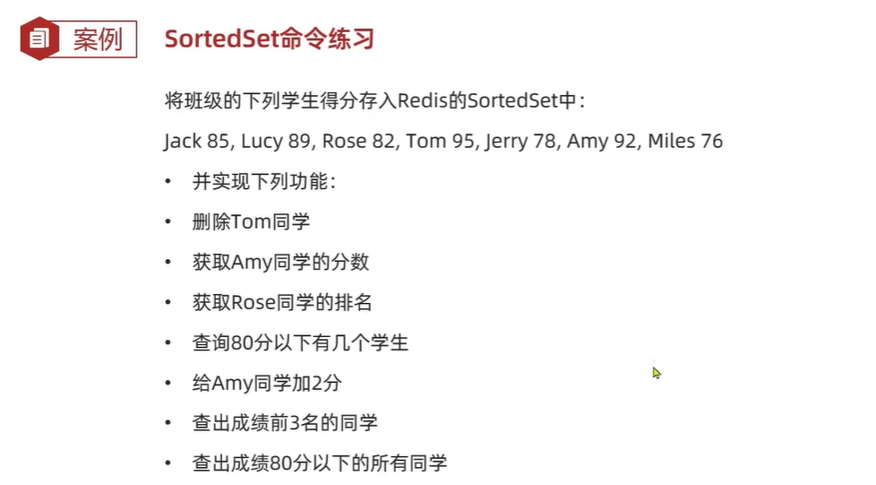

```sh
127.0.0.1:6379> zadd stus 85 jack 89 lucy 82 rose 95 tom 78 jerry 92 amy 76 miles
(integer) 7
127.0.0.1:6379> zrem stus tom
(integer) 1
127.0.0.1:6379> zrank stus rose
(integer) 2
127.0.0.1:6379> zrevrank stus rose
(integer) 3
127.0.0.1:6379> zcount stus 0 80
(integer) 2
127.0.0.1:6379> zincrby stus 2 amy
"94"
127.0.0.1:6379> zrevrange stus 0 2
1) "amy"
2) "lucy"
3) "jack"
127.0.0.1:6379> zrangebyscore stus 0 80
1) "miles"
2) "jerry"
```


## 3.Redis的java客户端-Jedis

在Redis官网中提供了各种语言的客户端，地址：https://redis.io/docs/clients/

其中Java客户端也包含很多：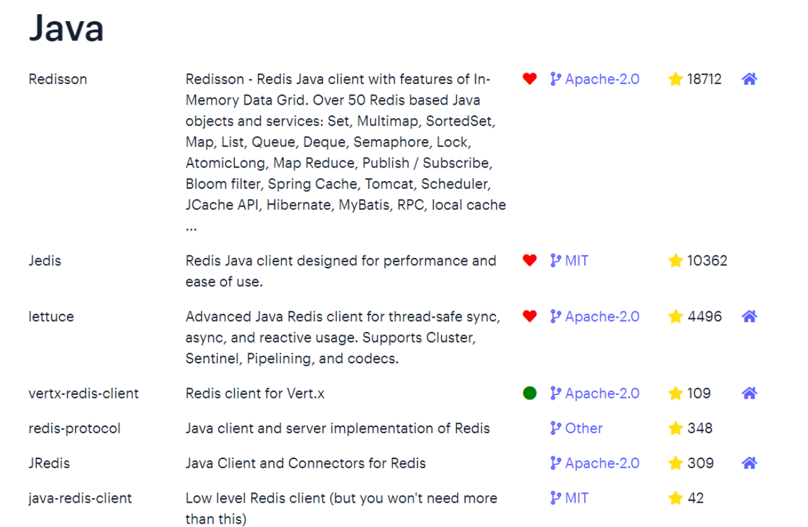

标记为❤的就是推荐使用的java客户端，包括：

- Jedis和Lettuce：这两个主要是提供了Redis命令对应的API，方便我们操作Redis，而SpringDataRedis又对这两种做了抽象和封装，因此我们后期会直接以SpringDataRedis来学习。
- Redisson：是在Redis基础上实现了分布式的可伸缩的java数据结构，例如Map.Queue等，而且支持跨进程的同步机制：Lock.Semaphore等待，比较适合用来实现特殊的功能需求。


### 3.1Jedis快速入门

**入门案例详细步骤**

0）创建Maven工程

1）引入依赖：

```xml
<!--jedis-->
<dependency>
    <groupId>redis.clients</groupId>
    <artifactId>jedis</artifactId>
    <version>3.7.0</version>
</dependency>
<!--单元测试-->
<dependency>
    <groupId>org.junit.jupiter</groupId>
    <artifactId>junit-jupiter</artifactId>
    <version>5.7.0</version>
    <scope>test</scope>
</dependency>
```


2）建立连接

新建一个单元测试类，内容如下：

```java
private Jedis jedis;

@BeforeEach
void setUp() {
    // 1.建立连接
    // jedis = new Jedis("192.168.150.101", 6379);
    jedis = JedisConnectionFactory.getJedis();
    // 2.设置密码
    jedis.auth("123321");
    // 3.选择库
    jedis.select(0);
}
```


3）测试：

```java
@Test
void testString() {
    // 存入数据
    String result = jedis.set("name", "虎哥");
    System.out.println("result = " + result);
    // 获取数据
    String name = jedis.get("name");
    System.out.println("name = " + name);
}

@Test
void testHash() {
    // 插入hash数据
    jedis.hset("user:1", "name", "Jack");
    jedis.hset("user:1", "age", "21");

    // 获取
    Map<String, String> map = jedis.hgetAll("user:1");
    System.out.println(map);
}
```


4）释放资源

```java
@AfterEach
void tearDown() {
    if (jedis != null) {
        jedis.close();
    }
}
```


### 3.2 Jedis连接池

Jedis本身是线程不安全的，并且频繁的创建和销毁连接会有性能损耗，因此我们推荐大家使用Jedis连接池代替Jedis的直连方式

有关池化思想，并不仅仅是这里会使用，很多地方都有，比如说我们的数据库连接池，比如我们tomcat中的线程池，这些都是池化思想的体现。

#### 3.2.1.创建Jedis的连接池

```java
public class JedisConnectionFacotry {

     private static final JedisPool jedisPool;

     static {
         //配置连接池
         JedisPoolConfig poolConfig = new JedisPoolConfig();
         poolConfig.setMaxTotal(8);
         poolConfig.setMaxIdle(8);
         poolConfig.setMinIdle(0);
         poolConfig.setMaxWaitMillis(1000);
         //创建连接池对象
         jedisPool = new JedisPool(poolConfig,
                 "192.168.150.101",6379,1000,"123321");
     }

     public static Jedis getJedis(){
          return jedisPool.getResource();
     }
}
```

**代码说明：**

- 1） JedisConnectionFacotry：工厂设计模式是实际开发中非常常用的一种设计模式，我们可以使用工厂，去降低代的耦合，比如Spring中的Bean的创建，就用到了工厂设计模式

- 2）静态代码块：随着类的加载而加载，确保只能执行一次，我们在加载当前工厂类的时候，就可以执行static的操作完成对 连接池的初始化

- 3）最后提供返回连接池中连接的方法.

#### 3.2.2.改造原始代码

**代码说明:**

1.在我们完成了使用工厂设计模式来完成代码的编写之后，我们在获得连接时，就可以通过工厂来获得。

，而不用直接去new对象，降低耦合，并且使用的还是连接池对象。

2.当我们使用了连接池后，当我们关闭连接其实并不是关闭，而是将Jedis还回连接池的。

```java
    @BeforeEach
    void setUp(){
        //建立连接
        /*jedis = new Jedis("127.0.0.1",6379);*/
        jedis = JedisConnectionFacotry.getJedis();
         //选择库
        jedis.select(0);
    }

   @AfterEach
    void tearDown() {
        if (jedis != null) {
            jedis.close();
        }
    }
```


## 4.Redis的Java客户端-SpringDataRedis

SpringData是Spring中数据操作的模块，包含对各种数据库的集成，其中对Redis的集成模块就叫做SpringDataRedis，官网地址：https://spring.io/projects/spring-data-redis

* 提供了对不同Redis客户端的整合（Lettuce和Jedis）
* 提供了RedisTemplate统一API来操作Redis
* 支持Redis的发布订阅模型
* 支持Redis哨兵和Redis集群
* 支持基于Lettuce的响应式编程
* 支持基于JDK.JSON.字符串.Spring对象的数据序列化及反序列化
* 支持基于Redis的JDKCollection实现

SpringDataRedis中提供了RedisTemplate工具类，其中封装了各种对Redis的操作。并且将不同数据类型的操作API封装到了不同的类型中：

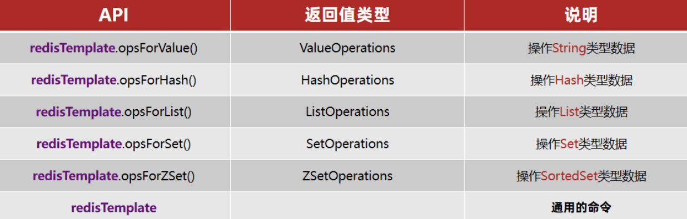

### 4.1.快速入门

SpringBoot已经提供了对SpringDataRedis的支持，使用非常简单：

#### 4.1.1.导入pom坐标

```xml
<?xml version="1.0" encoding="UTF-8"?>
<project xmlns="http://maven.apache.org/POM/4.0.0" xmlns:xsi="http://www.w3.org/2001/XMLSchema-instance"
         xsi:schemaLocation="http://maven.apache.org/POM/4.0.0 https://maven.apache.org/xsd/maven-4.0.0.xsd">
    <modelVersion>4.0.0</modelVersion>
    <parent>
        <groupId>org.springframework.boot</groupId>
        <artifactId>spring-boot-starter-parent</artifactId>
        <version>2.5.7</version>
        <relativePath/> <!-- lookup parent from repository -->
    </parent>
    <groupId>com.heima</groupId>
    <artifactId>redis-demo</artifactId>
    <version>0.0.1-SNAPSHOT</version>
    <name>redis-demo</name>
    <description>Demo project for Spring Boot</description>
    <properties>
        <java.version>1.8</java.version>
    </properties>
    <dependencies>
        <!--redis依赖-->
        <dependency>
            <groupId>org.springframework.boot</groupId>
            <artifactId>spring-boot-starter-data-redis</artifactId>
        </dependency>
        <!--common-pool-->
        <dependency>
            <groupId>org.apache.commons</groupId>
            <artifactId>commons-pool2</artifactId>
        </dependency>
        <!--Jackson依赖-->
        <dependency>
            <groupId>com.fasterxml.jackson.core</groupId>
            <artifactId>jackson-databind</artifactId>
        </dependency>
        <dependency>
            <groupId>org.projectlombok</groupId>
            <artifactId>lombok</artifactId>
            <optional>true</optional>
        </dependency>
        <dependency>
            <groupId>org.springframework.boot</groupId>
            <artifactId>spring-boot-starter-test</artifactId>
            <scope>test</scope>
        </dependency>
    </dependencies>

    <build>
        <plugins>
            <plugin>
                <groupId>org.springframework.boot</groupId>
                <artifactId>spring-boot-maven-plugin</artifactId>
                <configuration>
                    <excludes>
                        <exclude>
                            <groupId>org.projectlombok</groupId>
                            <artifactId>lombok</artifactId>
                        </exclude>
                    </excludes>
                </configuration>
            </plugin>
        </plugins>
    </build>

</project>
```

#### 4.1.2 .配置文件

```yaml
spring:
  redis:
    host: 192.168.150.101
    port: 6379
    password: 123321
    lettuce:
      pool:
        max-active: 8  #最大连接
        max-idle: 8   #最大空闲连接
        min-idle: 0   #最小空闲连接
        max-wait: 100ms #连接等待时间
```

#### 4.1.3.测试代码

```java
@SpringBootTest
class RedisDemoApplicationTests {

    @Autowired
    private RedisTemplate<String, Object> redisTemplate;

    @Test
    void testString() {
        // 写入一条String数据
        redisTemplate.opsForValue().set("name", "虎哥");
        // 获取string数据
        Object name = redisTemplate.opsForValue().get("name");
        System.out.println("name = " + name);
    }
}
```

**贴心小提示：SpringDataJpa使用起来非常简单，记住如下几个步骤即可**

SpringDataRedis的使用步骤：

* 引入spring-boot-starter-data-redis依赖
* 在application.yml配置Redis信息
* 注入RedisTemplate


### 4.2 .数据序列化器

RedisTemplate可以接收任意Object作为值写入Redis：

只不过写入前会把Object序列化为字节形式，默认是采用JDK序列化，得到的结果是这样的：

缺点：

- 可读性差
- 内存占用较大

我们可以自定义RedisTemplate的序列化方式，代码如下：

```java
@Configuration
public class RedisConfig {

    @Bean
    public RedisTemplate<String, Object> redisTemplate(RedisConnectionFactory connectionFactory){
        // 创建RedisTemplate对象
        RedisTemplate<String, Object> template = new RedisTemplate<>();
        // 设置连接工厂
        template.setConnectionFactory(connectionFactory);
        // 创建JSON序列化工具
        GenericJackson2JsonRedisSerializer jsonRedisSerializer = 
            							new GenericJackson2JsonRedisSerializer();
        // 设置Key的序列化
        template.setKeySerializer(RedisSerializer.string());
        template.setHashKeySerializer(RedisSerializer.string());
        // 设置Value的序列化
        template.setValueSerializer(jsonRedisSerializer);
        template.setHashValueSerializer(jsonRedisSerializer);
        // 返回
        return template;
    }
}
```

这里采用了JSON序列化来代替默认的JDK序列化方式。最终结果如图：

整体可读性有了很大提升，并且能将Java对象自动的序列化为JSON字符串，并且查询时能自动把JSON反序列化为Java对象。不过，其中记录了序列化时对应的class名称，目的是为了查询时实现自动反序列化。这会带来额外的内存开销。


### 4.3 StringRedisTemplate

尽管JSON的序列化方式可以满足我们的需求，但依然存在一些问题，如图：

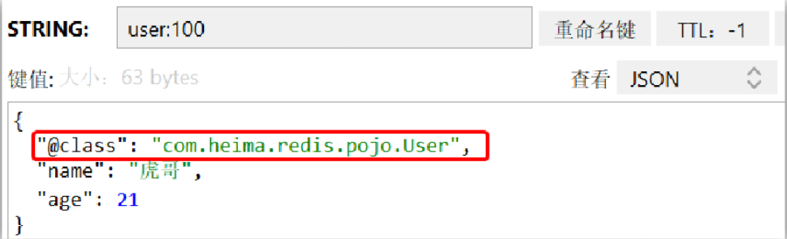

为了在反序列化时知道对象的类型，JSON序列化器会将类的class类型写入json结果中，存入Redis，会带来额外的内存开销。

为了减少内存的消耗，我们可以采用手动序列化的方式，换句话说，就是不借助默认的序列化器，而是我们自己来控制序列化的动作，同时，我们只采用String的序列化器，这样，在存储value时，我们就不需要在内存中就不用多存储数据，从而节约我们的内存空间

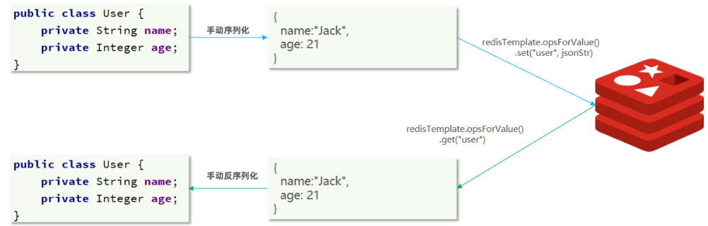

这种用法比较普遍，因此SpringDataRedis就提供了RedisTemplate的子类：StringRedisTemplate，它的key和value的序列化方式默认就是String方式。


省去了我们自定义RedisTemplate的序列化方式的步骤，而是直接使用：

```java
@SpringBootTest
class RedisStringTests {

    @Autowired
    private StringRedisTemplate stringRedisTemplate;

    @Test
    void testString() {
        // 写入一条String数据
        stringRedisTemplate.opsForValue().set("verify:phone:13600527634", "124143");
        // 获取string数据
        Object name = stringRedisTemplate.opsForValue().get("name");
        System.out.println("name = " + name);
    }

    private static final ObjectMapper mapper = new ObjectMapper();

    @Test
    void testSaveUser() throws JsonProcessingException {
        // 创建对象
        User user = new User("虎哥", 21);
        // 手动序列化
        String json = mapper.writeValueAsString(user);
        // 写入数据
        stringRedisTemplate.opsForValue().set("user:200", json);

        // 获取数据
        String jsonUser = stringRedisTemplate.opsForValue().get("user:200");
        // 手动反序列化
        User user1 = mapper.readValue(jsonUser, User.class);
        System.out.println("user1 = " + user1);
    }

}
```

此时我们再来看一看存储的数据，小伙伴们就会发现那个class数据已经不在了，节约了我们的空间~

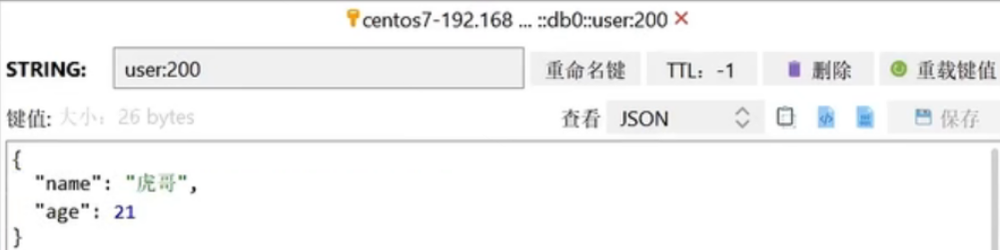

最后小总结：

RedisTemplate的两种序列化实践方案：

* 方案一：
  * 自定义RedisTemplate
  * 修改RedisTemplate的序列化器为GenericJackson2JsonRedisSerializer

* 方案二：
  * 使用StringRedisTemplate
  * 写入Redis时，手动把对象序列化为JSON
  * 读取Redis时，手动把读取到的JSON反序列化为对象

### 4.4 Hash结构操作

在基础篇的最后，咱们对Hash结构操作一下，收一个小尾巴，这个代码咱们就不再解释啦

马上就开始新的篇章~~~进入到我们的Redis实战篇

```java
@SpringBootTest
class RedisStringTests {

    @Autowired
    private StringRedisTemplate stringRedisTemplate;


    @Test
    void testHash() {
        stringRedisTemplate.opsForHash().put("user:400", "name", "虎哥");
        stringRedisTemplate.opsForHash().put("user:400", "age", "21");

        Map<Object, Object> entries = stringRedisTemplate.opsForHash().entries("user:400");
        System.out.println("entries = " + entries);
    }
}
```


# 实战篇Redis

## 开篇导读

亲爱的小伙伴们大家好，马上咱们就开始实战篇的内容了，相信通过本章的学习，小伙伴们就能理解各种redis的使用啦，接下来咱们来一起看看实战篇我们要学习一些什么样的内容

* 短信登录

这一块我们会使用redis共享session来实现

* 商户查询缓存

通过本章节，我们会理解缓存击穿，缓存穿透，缓存雪崩等问题，让小伙伴的对于这些概念的理解不仅仅是停留在概念上，更是能在代码中看到对应的内容

* 优惠卷秒杀

通过本章节，我们可以学会Redis的计数器功能， 结合Lua完成高性能的redis操作，同时学会Redis分布式锁的原理，包括Redis的三种消息队列

* 附近的商户

我们利用Redis的GEOHash来完成对于地理坐标的操作

* UV统计

主要是使用Redis来完成统计功能

* 用户签到

使用Redis的BitMap数据统计功能

* 好友关注

基于Set集合的关注、取消关注，共同关注等等功能，这一块知识咱们之前就讲过，这次我们在项目中来使用一下

* 打人探店

基于List来完成点赞列表的操作，同时基于SortedSet来完成点赞的排行榜功能

以上这些内容咱们统统都会给小伙伴们讲解清楚，让大家充分理解如何使用Redis

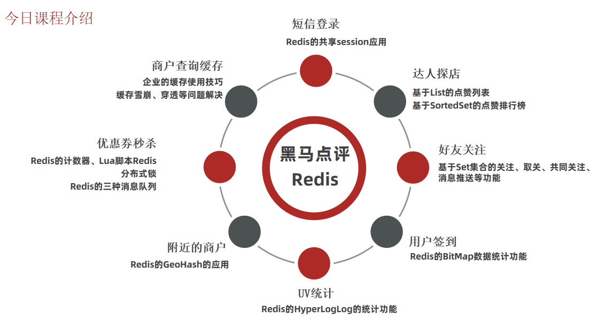


## 1、短信登录

### 1.1、导入黑马点评项目

#### 1.1.1 、导入SQL

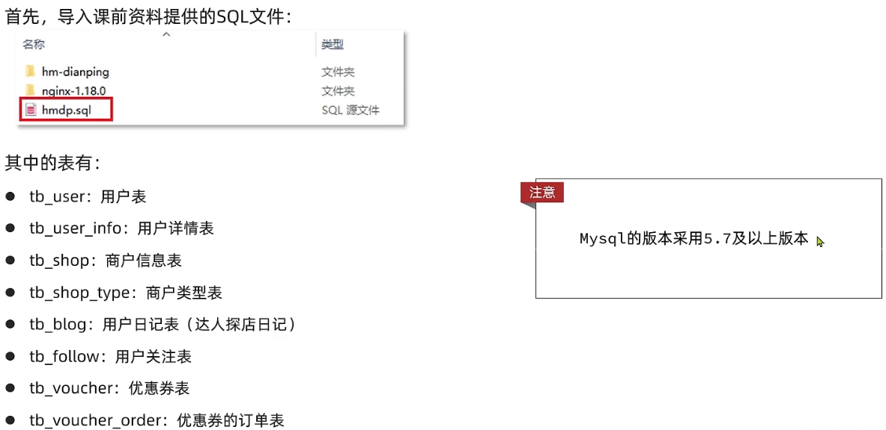


#### 1.1.2、有关当前模型

手机或者app端发起请求，请求我们的nginx服务器，nginx基于七层模型走的事HTTP协议，可以实现基 于Lua直接绕开tomcat访问redis，也可以作为静态资源服务器，轻松扛下上万并发， 负载均衡到下游 tomcat服务器，打散流量，我们都知道一台4核8G的tomcat，在优化和处理简单业务的加持下，大不了 就处理1000左右的并发， 经过nginx的负载均衡分流后，利用集群支撑起整个项目，同时nginx在部署 了前端项目后，更是可以做到动静分离，进一步降低tomcat服务的压力，这些功能都得靠nginx起作用，所以nginx是整个项目中重要的一环。

在tomcat支撑起并发流量后，我们如果让tomcat直接去访问Mysql，根据经验Mysql企业级服务器只要 上点并发，一般是16或32 核心cpu，32 或64G内存，像企业级mysql加上固态硬盘能够支撑的并发，大 概就是4000起~7000左右，上万并发， 瞬间就会让Mysql服务器的cpu，硬盘全部打满，容易崩溃，所 以我们在高并发场景下，会选择使用mysql集群，同时为了进一步降低Mysql的压力，同时增加访问的性 能，我们也会加入Redis，同时使用Redis集群使得Redis对外提供更好的服务。


#### 1.1.3、导入后端项目

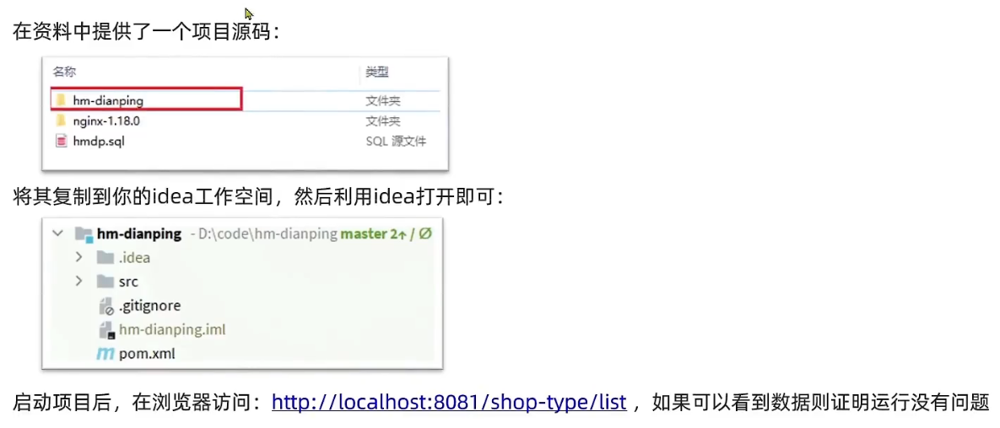

注意：不要忘了修改application.yaml文件中的mysql、redis地址信息


#### 1.1.4、导入前端工程

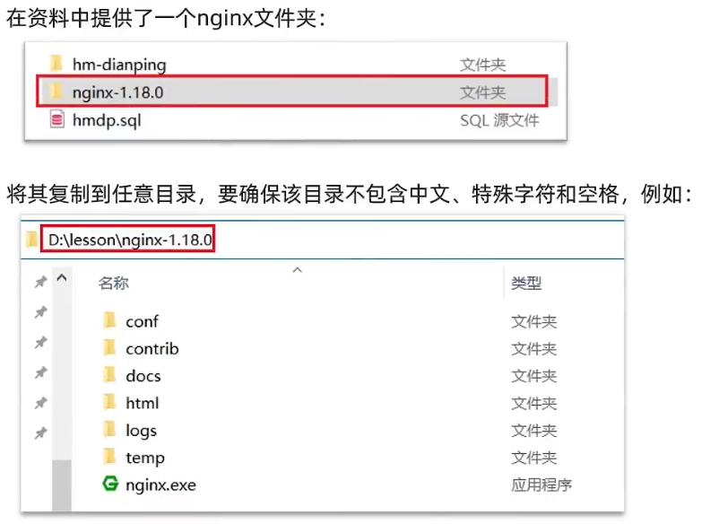


#### 1.1.5 运行前端项目

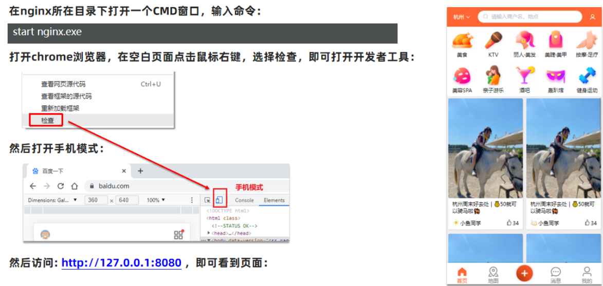


### 1.2、基于Session实现登录流程

**发送验证码：**

用户在提交手机号后，会校验手机号是否合法，如果不合法，则要求用户重新输入手机号

如果手机号合法，后台此时生成对应的验证码，同时将验证码进行保存，然后再通过短信的方式将验证 码发送给用户


**短信验证码登录、注册：**

用户将验证码和手机号进行输入，后台从session中拿到当前验证码，然后和用户输入的验证码进行校验，如果不一致，则无法通过校验，如果一致，则后台根据手机号查询用户，如果用户不存在，则为用户创建账号信息，保存到数据库，无论是否存在，都会将用户信息保存到session中，方便后续获得当前登录信息


**校验登录状态:**

用户在请求时候，会从cookie中携带者JsessionId到后台，后台通过JsessionId从session中拿到用户信 息，如果没有session信息，则进行拦截，如果有session信息，则将用户信息保存到threadLocal中，并 且放行

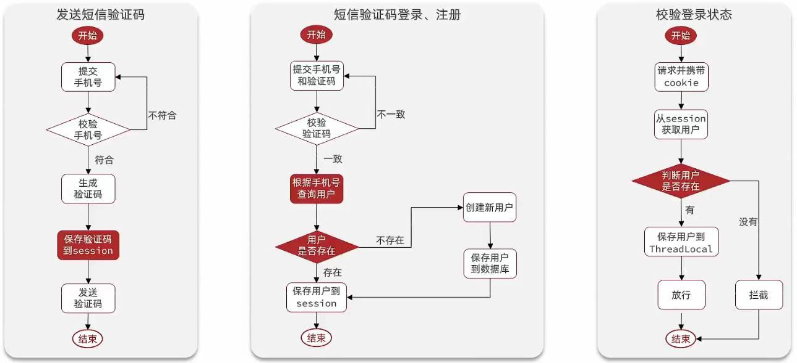


### 1.3、实现发送短信验证码功能

**页面流程**

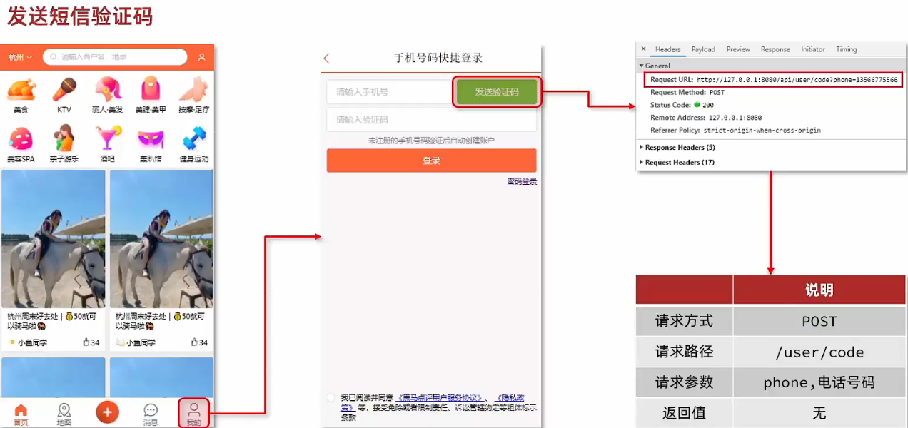


**具体代码如下**

**贴心小提示**： 具体逻辑上文已经分析，我们仅仅只需要按照提示的逻辑写出代码即可。

- 发送验证码

```java
@Override
public Result sendCode(String phone, HttpSession session) {
    //1.校验手机号
    if(RegexUtils.isPhoneInvalid(phone)) {
        //2.如果不符合，返回错误信息
        return Result.fail("手机号格式错误！");
    }

    //3.符合就生成验证码
    String code = RandomUtil.randomNumbers(6);

    //4.保存验证码到session
    session.setAttribute("code", code);

    //5.发送验证码
    log.debug("发送短信验证码成功，验证码：{}", code);

    return Result.ok();
}
```


- 登录

```java
@Override
public Result login(LoginFormDTO loginForm, HttpSession session) {
    //1.校验手机号
    String phone = loginForm.getPhone();
    if(RegexUtils.isPhoneInvalid(phone)) {
        //如果不符合，返回错误信息
        return Result.fail("手机号格式错误！");
    }

    //2.校验验证码
    Object cacheCode = session.getAttribute("code");
    String code = loginForm.getCode();
    if( cacheCode == null || !cacheCode.toString().equals(code) ) {
        //3.不一致，报错
        return Result.fail("验证码错误");
    }

    //4.根据手机号查询用户 select * from tb_user where phone = ?
    User user = query().eq("phone", phone).one();

    //5.判断用户是否存在
    if(user == null) {
        //6.不存在，创建新用户并保存
        user = createUserWithPhone(phone);
    }

    //7.保存用户信息到session中
    session.setAttribute("user", user);

    return Result.ok();
}
```


### 1.4、实现登录拦截功能

温馨小贴士：tomcat的运行原理

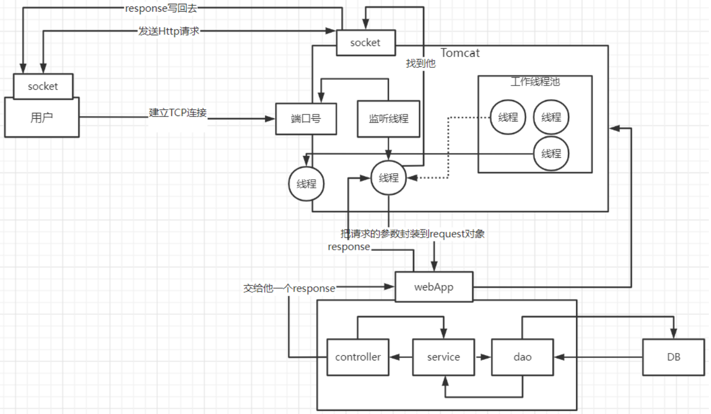

当用户发起请求时，会访问我们像tomcat注册的端口，任何程序想要运行，都需要有一个线程对当前端 口号进行监听，tomcat也不例外，当监听线程知道用户想要和tomcat连接连接时，那会由监听线程创建 socket连接，socket都是成对出现的，用户通过socket像互相传递数据，当tomcat端的socket接受到数 据后，此时监听线程会从tomcat的线程池中取出一个线程执行用户请求，在我们的服务部署到tomcat 后，线程会找到用户想要访问的工程，然后用这个线程转发到工程中的controller，service，dao中，并 且访问对应的DB，在用户执行完请求后，再统一返回，再找到tomcat端的socket，再将数据写回到用 户端的socket，完成请求和响应

通过以上讲解，我们可以得知 每个用户其实对应都是去找tomcat线程池中的一个线程来完成工作的， 使用完成后再进行回收，既然每个请求都是独立的，所以在每个用户去访问我们的工程时，我们可以使 用threadlocal来做到线程隔离，每个线程操作自己的一份数据


**温馨小贴士：关于threadlocal**

如果小伙伴们看过threadLocal的源码，你会发现在threadLocal中，无论是他的put方法和他的get方 法， 都是先从获得当前用户的线程，然后从线程中取出线程的成员变量map，只要线程不一样，map就 不一样，所以可以通过这种方式来做到线程隔离


拦截器代码

```java
public class LoginInterceptor implements HandlerInterceptor {

    @Override
    public boolean preHandle(HttpServletRequest request, HttpServletResponse response, Object handler) throws Exception {
        //1.获取session
        HttpSession session = request.getSession();
        //2.获取session中的用户
        Object user = session.getAttribute("user");
        //3.判断用户是否存在
        if(user == null) {
            //4.不存在，拦截，返回401状态码
            response.setStatus(401);
            return false;
        }

        //5.存在，保存用户信息到ThreadLocal
        UserHolder.saveUser((User) user);

        //6.放行
        return true;
    }

    @Override
    public void afterCompletion(HttpServletRequest request, HttpServletResponse response, Object handler, Exception ex) throws Exception {
        //移除用户
        UserHolder.removeUser();
    }
}
```


让拦截器生效

```java
@Configuration
public class MyConfig implements WebMvcConfigurer {

    @Override
    public void addInterceptors(InterceptorRegistry registry) {
        registry.addInterceptor(new LoginInterceptor())
                .excludePathPatterns(
                    "/shop/**",
                    "/voucher/**",
                    "/shop-type/**",
                    "/upload/**",
                     "/blog/hot",
                    "/user/code",
                    "/user/login"
                );
    }
}
```


### 1.5、隐藏用户敏感信息

我们通过浏览器观察到此时用户的全部信息都在，这样极为不靠谱，所以我们应当在返回用户信息之 前，将用户的敏感信息进行隐藏，采用的核心思路就是书写一个UserDto对象，这个UserDto对象就没 有敏感信息了，我们在返回前，将有用户敏感信息的User对象转化成没有敏感信息的UserDto对象，那 么就能够避免这个尴尬的问题了


**在登录方法处修改**

```java
//7.保存用户信息到session中
session.setAttribute("user", BeanUtils.copyProperties(user,UserDTO.class));
```


**在拦截器处：**

```java
//5.存在，保存用户信息到Threadlocal
UserHolder.saveUser((UserDTO) user)
```


**在UserHolder处：将user对象换成UserDTO**

```java
public class UserHolder {
    private static final ThreadLocal<UserDTO> tl = new ThreadLocal<>();

    public static void saveUser(UserDTO user){
        tl.set(user);
    }

    public static UserDTO getUser(){
        return tl.get();
    }

    public static void removeUser(){
        tl.remove();
    }
}
```


### 1.6、session共享问题

**核心思路分析：**

每个tomcat中都有一份属于自己的session,假设用户第一次访问第一台tomcat，并且把自己的信息存放 到第一台服务器的session中，但是第二次这个用户访问到了第二台tomcat，那么在第二台服务器上， 肯定没有第一台服务器存放的session，所以此时 整个登录拦截功能就会出现问题，我们能如何解决这 个问题呢？早期的方案是session拷贝，就是说虽然每个tomcat上都有不同的session，但是每当任意一 台服务器的session修改时，都会同步给其他的Tomcat服务器的session，这样的话，就可以实现 session的共享了


但是这种方案具有两个大问题

1. 每台服务器中都有完整的一份session数据，服务器压力过大。
2. session拷贝数据时，可能会出现延迟


所以咱们后来采用的方案都是基于redis来完成，我们把session换成redis，redis数据本身就是共享的， 就可以避免session共享的问题了

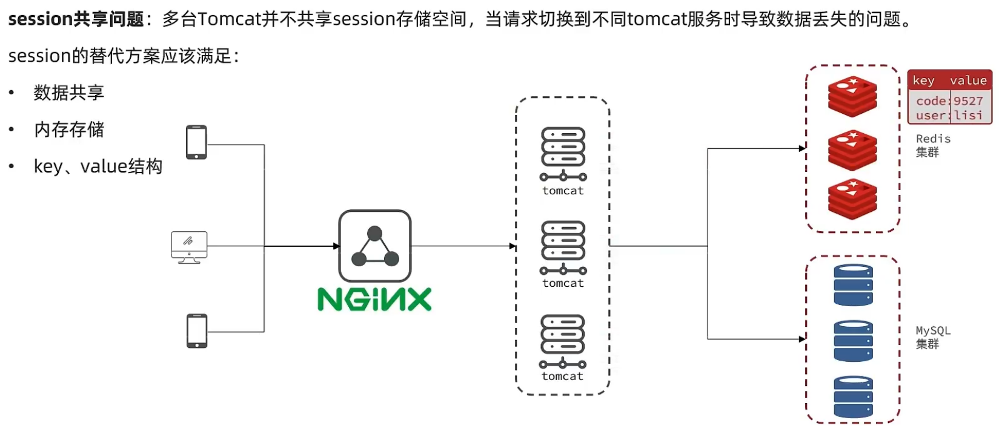


### 1.7 Redis代替session的业务流程

#### 1.7.1、设计key的结构

首先我们要思考一下利用redis来存储数据，那么到底使用哪种结构呢？由于存入的数据比较简单，我们 可以考虑使用String，或者是使用哈希，如下图，如果使用String，同学们注意他的value，用多占用一 点空间，如果使用哈希，则他的value中只会存储他数据本身，如果不是特别在意内存，其实使用String 就可以啦。


**基于Redis实现共享session登录**

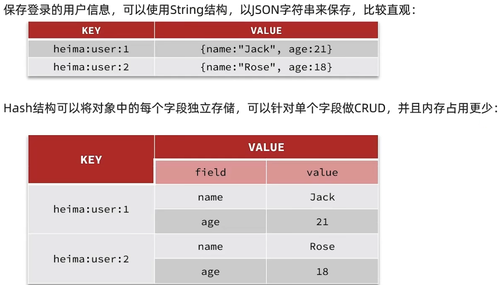


#### 1.7.2、设计key的具体细节

所以我们可以使用String结构，就是一个简单的key，value键值对的方式，但是关于key的处理， session他是每个用户都有自己的session，但是redis的key是共享的，咱们就不能使用code了

在设计这个key的时候，我们之前讲过需要满足两点

1. key要具有唯一性
2. key要方便携带

如果我们采用phone：手机号这个的数据来存储当然是可以的，但是如果把这样的敏感数据存储到redis 中并且从页面中带过来毕竟不太合适，所以我们在后台生成一个随机串token，然后让前端带来这个 token就能完成我们的整体逻辑了


#### 1.7.3、整体访问流程

当注册完成后，用户去登录会去校验用户提交的手机号和验证码，是否一致，如果一致，则根据手机号 查询用户信息，不存在则新建，最后将用户数据保存到redis，并且生成token作为redis的key，当我们 校验用户是否登录时，会去携带着token进行访问，从redis中取出token对应的value，判断是否存在这 个数据，如果没有则拦截，如果存在则将其保存到threadLocal中，并且放行。

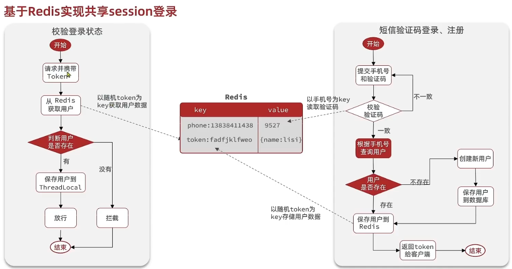


### 1.8 基于Redis实现短信登录

这里具体逻辑就不分析了，之前咱们已经重点分析过这个逻辑啦。

**UserServiceImpl代码**

```java
@Override
public Result login(LoginFormDTO loginForm, HttpSession session) {
    //1.校验手机号
    String phone = loginForm.getPhone();
    if(RegexUtils.isPhoneInvalid(phone)) {
        //如果不符合，返回错误信息
        return Result.fail("手机号格式错误！");
    }

    //2.从redis获取验证码并校验
    String cacheCode = stringRedisTemplate.opsForValue().get(LOGIN_CODE_KEY + phone);
    String code = loginForm.getCode();
    if( cacheCode == null || !cacheCode.equals(code) ) {
        //3.不一致，报错
        return Result.fail("验证码错误");
    }

    //4.根据手机号查询用户 select * from tb_user where phone = ?
    User user = query().eq("phone", phone).one();

    //5.判断用户是否存在
    if(user == null) {
        //6.不存在，创建新用户并保存
        user = createUserWithPhone(phone);
    }

    //7.保存用户信息到 redis 中
    //7.1随机生成token，作为登录令牌
    String token = UUID.randomUUID().toString(true);
    //7.2将User对象转为HashMap存储
    UserDTO userDTO = BeanUtil.copyProperties(user, UserDTO.class);
    Map<String, Object> userMap = BeanUtil.beanToMap(userDTO, new HashMap<>(),
            CopyOptions.create()
                    .setIgnoreNullValue(true)
                    .setFieldValueEditor((fieldName, fieldValue) -> fieldValue.toString()));
    //7.3存储
    String tokenKey = LOGIN_USER_KEY + token;
    stringRedisTemplate.opsForHash().putAll(tokenKey, userMap);
    //7.4设置token有效期
    stringRedisTemplate.expire(tokenKey, LOGIN_USER_TTL, TimeUnit.MINUTES);

    //8.返回token
    return Result.ok(token);
}
```


### 1.9 解决状态登录刷新问题

#### 1.9.1 初始方案思路总结：

在这个方案中，他确实可以使用对应路径的拦截，同时刷新登录token令牌的存活时间，但是现在这个 拦截器他只是拦截需要被拦截的路径，假设当前用户访问了一些不需要拦截的路径，那么这个拦截器就 不会生效，所以此时令牌刷新的动作实际上就不会执行，所以这个方案他是存在问题的

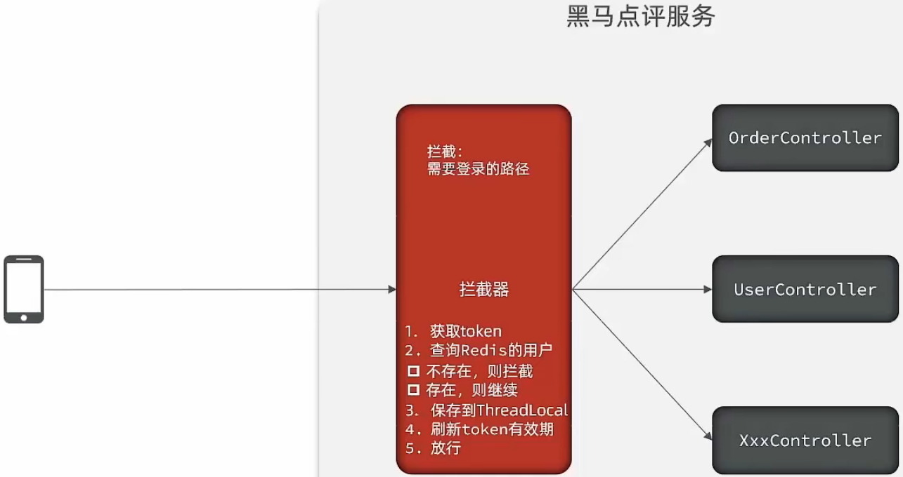


#### 1.9.2 优化方案

既然之前的拦截器无法对不需要拦截的路径生效，那么我们可以添加一个拦截器，在第一个拦截器中拦 截所有的路径，把第二个拦截器做的事情放入到第一个拦截器中，同时刷新令牌，因为第一个拦截器有 了threadLocal的数据，所以此时第二个拦截器只需要判断拦截器中的user对象是否存在即可，完成整体 刷新功能。

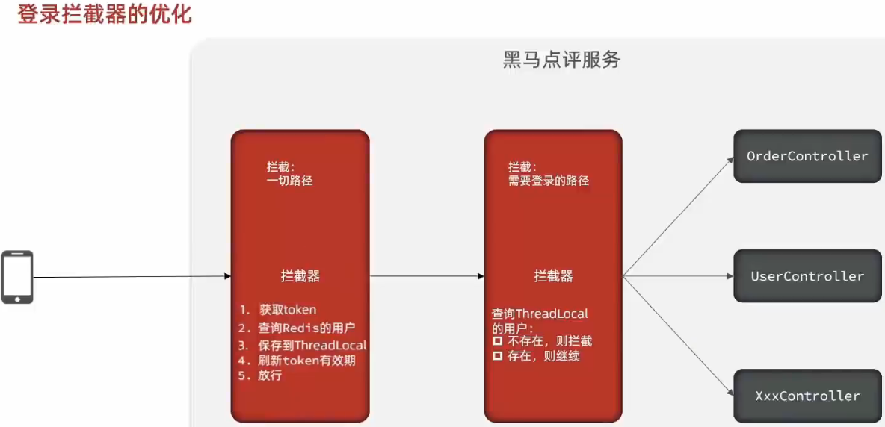


#### 1.9.3 代码

**RefreshTokenInterceptor**

```java
public class RefreshTokenInterceptor implements HandlerInterceptor {

    private StringRedisTemplate stringRedisTemplate;

    public RefreshTokenInterceptor(StringRedisTemplate stringRedisTemplate) {
        this.stringRedisTemplate = stringRedisTemplate;
    }

    @Override
    public boolean preHandle(HttpServletRequest request, HttpServletResponse response, Object handler) throws Exception {
        //1.获取请求头中的token
        String token = request.getHeader("authorization");

        if(StrUtil.isBlank(token)) {
            return true;
        }

        //2.基于token获取redis中的用户
        String key = LOGIN_USER_KEY + token;
        Map<Object, Object> userMap = stringRedisTemplate.opsForHash().entries(key);

        //3.判断用户是否存在
        if(userMap.isEmpty()) {
            return true;
        }

        //5.将查询到的Hash数据转为UserDTO对象
        UserDTO userDTO = BeanUtil.fillBeanWithMap(userMap, new UserDTO(), false);

        //6.存在，保存用户信息到ThreadLocal
        UserHolder.saveUser(userDTO);

        //7.刷新token有效期
        stringRedisTemplate.expire(key, LOGIN_USER_TTL, TimeUnit.MINUTES);

        //6.放行
        return true;
    }

    @Override
    public void afterCompletion(HttpServletRequest request, HttpServletResponse response, Object handler, Exception ex) throws Exception {
        //移除用户
        UserHolder.removeUser();
    }
}
```


**LoginInterceptor**

```java
public class LoginInterceptor implements HandlerInterceptor {

    @Override
    public boolean preHandle(HttpServletRequest request, HttpServletResponse response, Object handler) throws Exception {
        //1.判断是否需要拦截(ThreadLocal中是否有用户)
        if(UserHolder.getUser() == null) {
            //没有，需要拦截，设置状态码
            response.setStatus(401);
            //拦截
            return false;
        }
        //有用户，则放行
        return true;
    }
}
```


## 2、商户查询缓存

### 2.1 什么是缓存?

前言:什么是缓存?

就像自行车,越野车的避震器


举个例子:越野车,山地自行车,都拥有"避震器",**防止**车体加速后因惯性,在酷似"U"字母的地形上飞跃,硬着 陆导致的**损害**,像个弹簧一样;

同样,实际开发中,系统也需要"避震器",防止过高的数据访问猛冲系统,导致其操作线程无法及时处理信息 而瘫痪;

这在实际开发中对企业讲,对产品口碑,用户评价都是致命的;所以企业非常重视缓存技术;


**缓存**(Cache),就是数据交换的**缓冲区**,俗称的缓存就是**缓冲区内的数据**,一般从数据库中获取,存储于本地代 码(例如

```
例1:Static final ConcurrentHashMap<K,V> map = new ConcurrentHashMap<>(); 本地用于高并发

例2:static final Cache<K,V> USER_CACHE = CacheBuilder.newBuilder().build(); 用于redis等缓存

例3:Static final Map<K,V> map = new HashMap(); 本地缓存
```


由于其被**Static**修饰,所以随着类的加载而被加载到**内存之中**,作为本地缓存,由于其又被**final**修饰,所以其 引用(例3:map)和对象(例3:new HashMap())之间的关系是固定的,不能改变,因此不用担心赋值(=)导致缓 存失效;


#### 2.1.1 为什么要使用缓存

一句话:因为**速度快,好用**

缓存数据存储于代码中,而代码运行在内存中,内存的读写性能远高于磁盘,缓存可以大大降低**用户访问并发量带来的**服务器读写压力

实际开发过程中,企业的数据量,少则几十万,多则几千万,这么大数据量,如果没有缓存来作为"避震器",系统 是几乎撑不住的,所以企业会大量运用到缓存技术;

但是缓存也会增加代码复杂度和运营的成本:


#### 2.1.2 如何使用缓存

实际开发中,会构筑多级缓存来使系统运行速度进一步提升,例如:本地缓存与redis中的缓存并发使用

**浏览器缓存**：主要是存在于浏览器端的缓存

**应用层缓存**：可以分为tomcat本地缓存，比如之前提到的map，或者是使用redis作为缓存

**数据库缓存**：在数据库中有一片空间是 buffer pool，增改查数据都会先加载到mysql的缓存中

**CPU缓存**：当代计算机最大的问题是 cpu性能提升了，但内存读写速度没有跟上，所以为了适应当下的情况，增加了cpu的L1，L2，L3级的缓存

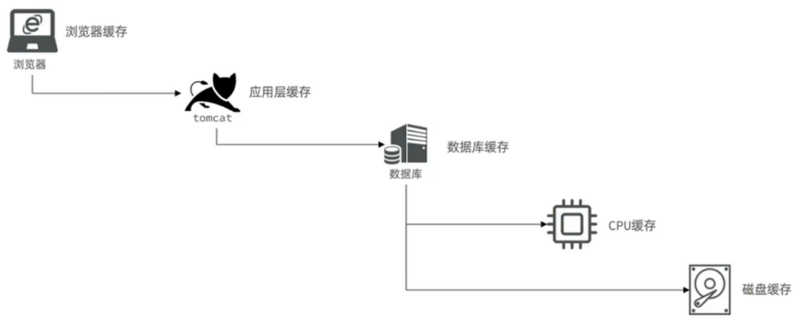


### 2.2 添加商户缓存

在我们查询商户信息时，我们是直接操作从数据库中去进行查询的，大致逻辑是这样，直接查询数据库 那肯定慢咯，所以我们需要增加缓存

```java
@GetMapping("/{id}")
public Result queryShopById(@PathVariable("id") Long id) {
	//这里是直接查询数据库
	return shopService.queryById(id);
}
```


#### 2.2.1 、缓存模型和思路

标准的操作方式就是查询数据库之前先查询缓存，如果缓存数据存在，则直接从缓存中返回，如果缓存 数据不存在，再查询数据库，然后将数据存入redis。

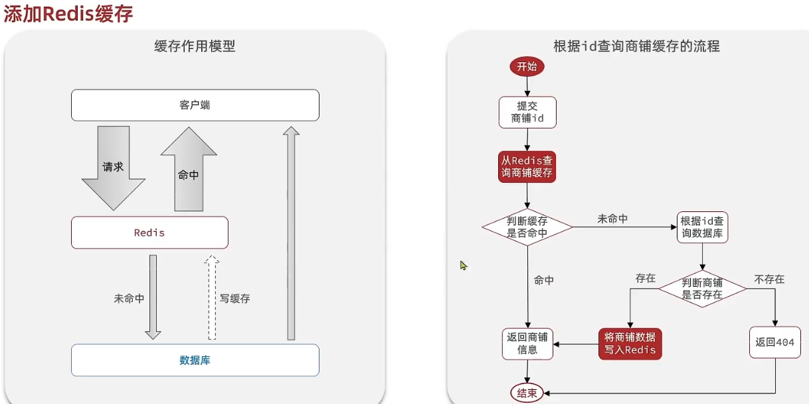


#### 2.1.2、代码如下

代码思路：如果缓存有，则直接返回，如果缓存不存在，则查询数据库，然后存入redis。

```java
@Override
public Result queryById(Long id) {
    String key = CACHE_SHOP_KEY + id;
    //1.从redis查询商铺缓存
    String shopJson = stringRedisTemplate.opsForValue().get(key);
    //2.判断是否存在
    if(StrUtil.isNotBlank(shopJson)) {
        //3.存在，直接返回
        Shop shop = JSONUtil.toBean(shopJson, Shop.class);
        return Result.ok(shop);
    }
    //4.不存在，根据id查询数据库
    Shop shop = getById(id);
    //5.不存在，返回错误
    if(shop == null) {
        return Result.fail("店铺不存在");
    }
    //6.存在，写入redis
    stringRedisTemplate.opsForValue().set(key, JSONUtil.toJsonStr(shop));
    //7.返回
    return Result.ok(shop);
}
```


### 2.3 缓存更新策略

缓存更新是redis为了节约内存而设计出来的一个东西，主要是因为内存数据宝贵，当我们向redis插入 太多数据，此时就可能会导致缓存中的数据过多，所以redis会对部分数据进行更新，或者把他叫为淘汰 更合适。

**内存淘汰**：redis自动进行，当redis内存达到咱们设定的max-memery的时候，会自动触发淘汰机制，淘汰掉一些不重要的数据(可以自己设置策略方式)

**超时剔除**：当我们给redis设置了过期时间ttl之后，redis会将超时的数据进行删除，方便咱们继续使用缓存

**主动更新**：我们可以手动调用方法把缓存删掉，通常用于解决缓存和数据库不一致问题

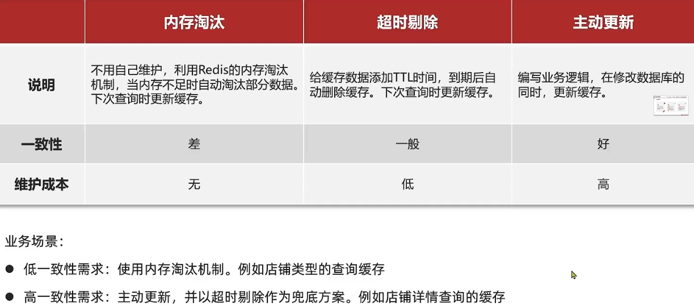


#### 2.3.1 、数据库缓存不一致解决方案：

由于我们的**缓存的数据源来自于数据库**,而数据库的**数据是会发生变化的**,因此,如果当数据库中**数据发生变化**,**而缓存却没有同步**,此时就会有**一致性问题存在**,其后果是:

用户使用缓存中的过时数据,就会产生类似多线程数据安全问题,从而影响业务,产品口碑等;怎么解决呢？ 有如下几种方案

Cache Aside Pattern 人工编码方式：缓存调用者在更新完数据库后再去更新缓存，也称之为双写方案

Read/Write Through Pattern : 由系统本身完成，数据库与缓存的问题交由系统本身去处理

Write Behind Caching Pattern ：调用者只操作缓存，其他线程去异步处理数据库，实现最终一致

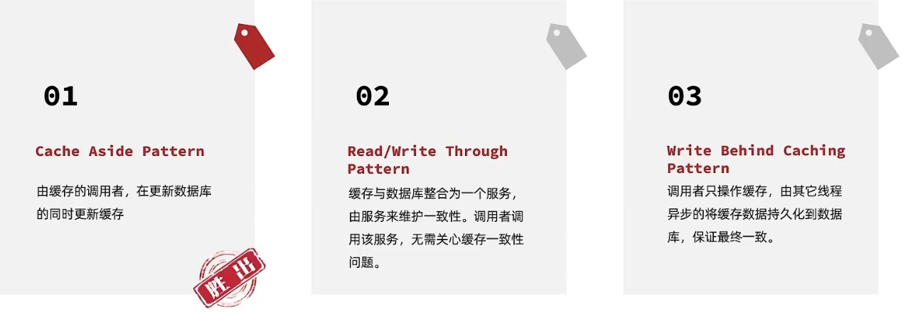


#### 2.3.2 、数据库和缓存不一致采用什么方案

综合考虑使用方案一，但是方案一调用者如何处理呢？这里有几个问题

操作缓存和数据库时有三个问题需要考虑：

- 删除缓存还是更新缓存？
  更新缓存：每次更新数据库都更新缓存，无效写操作较多
  删除缓存：更新数据库时让缓存失效，查询时再更新缓存
- 如何保证缓存与数据库的操作的同时成功或失败？
  单体系统，将缓存与数据库操作放在一个事务
  分布式系统，利用TCC等分布式事务方案

- 先操作缓存还是先操作数据库？ 
  先删除缓存，再操作数据库
  先操作数据库，再删除缓存

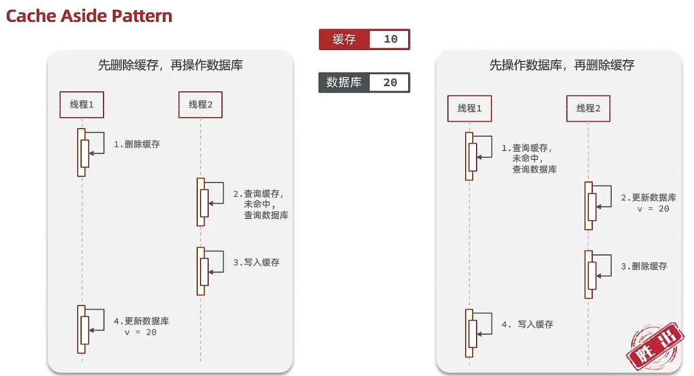


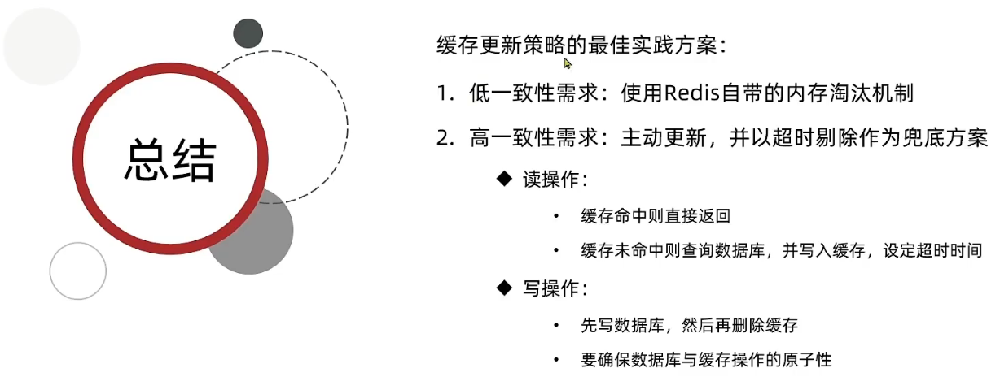


### 2.4 实现商铺和缓存与数据库双写一致

核心思路如下：

修改ShopController中的业务逻辑，满足下面的需求：

1. 根据id查询店铺时，如果缓存未命中，则查询数据库，将数据库结果写入缓存，并设置超时时间
2. 根据id修改店铺时，先修改数据库，再删除缓存


**修改重点代码1**：修改ShopServiceImpl的queryById方法

**设置redis缓存时添加过期时间**

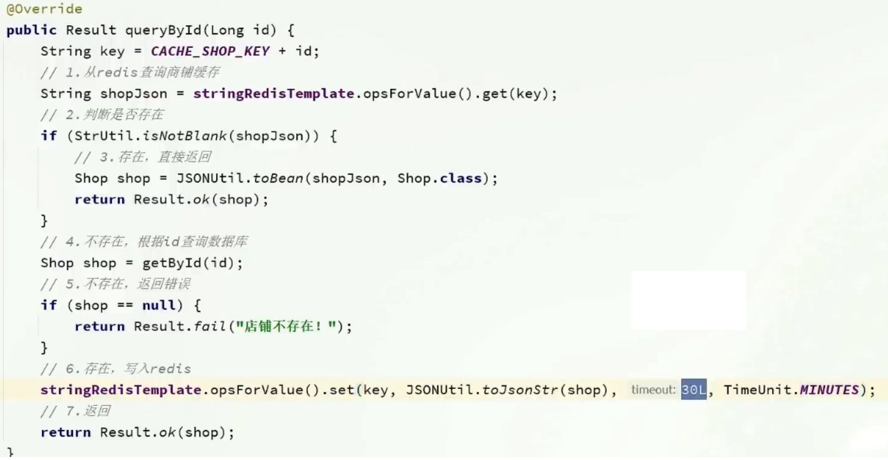


**修改重点代码2**

代码分析：通过之前的淘汰，我们确定了采用删除策略，来解决双写问题，当我们修改了数据之后，然 后把缓存中的数据进行删除，查询时发现缓存中没有数据，则会从mysql中加载最新的数据，从而避免 数据库和缓存不一致的问题

```java
@Override
@Transactional
public Result update(Shop shop) {
    Long id = shop.getId();
    if(id == null) {
        return Result.fail("店铺id不能为空");
    }

    //1.更新数据库
    updateById(shop);
    //2.删除缓存
    stringRedisTemplate.delete(CACHE_SHOP_KEY + id);


    return Result.ok();
}
```


### 2.5 缓存穿透问题的解决思路

缓存穿透 ：缓存穿透是指客户端请求的数据在缓存中和数据库中都不存在，这样缓存永远不会生效，这 些请求都会打到数据库。

常见的解决方案有两种：

- 缓存空对象
  - 优点：实现简单，维护方便
  - 缺点：额外的内存消耗，可能造成短期的不一致
- 布隆过滤
  - 优点：内存占用较少，没有多余key
  - 缺点： 实现复杂，存在误判可能

**缓存空对象思路分析**：当我们客户端访问不存在的数据时，先请求redis，但是此时redis中没有数据， 此时会访问到数据库，但是数据库中也没有数据，这个数据穿透了缓存，直击数据库，我们都知道数据 库能够承载的并发不如redis这么高，如果大量的请求同时过来访问这种不存在的数据，这些请求就都会 访问到数据库，简单的解决方案就是哪怕这个数据在数据库中也不存在，我们也把这个数据存入到redis 中去，这样，下次用户过来访问这个不存在的数据，那么在redis中也能找到这个数据就不会进入到缓存 了


**布隆过滤**：布隆过滤器其实采用的是哈希思想来解决这个问题，通过一个庞大的二进制数组，走哈希思想去判断当前这个要查询的这个数据是否存在，如果布隆过滤器判断存在，则放行，这个请求会去访问 redis，哪怕此时redis中的数据过期了，但是数据库中一定存在这个数据，在数据库中查询出来这个数据后，再将其放入到redis中， 

假设布隆过滤器判断这个数据不存在，则直接返回

这种方式优点在于节约内存空间，存在误判，误判原因在于：布隆过滤器走的是哈希思想，只要哈希思想，就可能存在哈希冲突

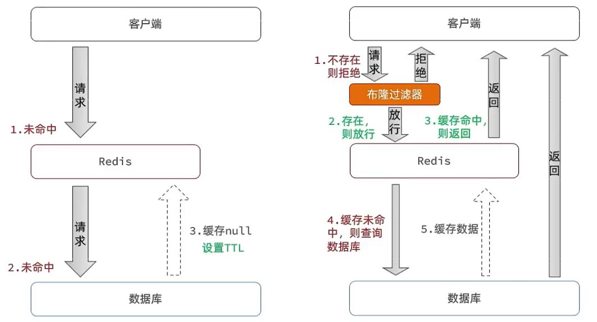


### 2.6 编码解决商品查询的缓存穿透问题：

核心思路如下： 在原来的逻辑中，我们如果发现这个数据在mysql中不存在，直接就返回404了，这样是会存在缓存穿透问题的

现在的逻辑中：如果这个数据不存在，我们不会返回404 ，还是会把这个数据写入到Redis中，并且将 value设置为空，当再次发起查询时，我们如果发现命中之后，判断这个value是否是null，如果是 null，则是之前写入的数据，证明是缓存穿透数据，如果不是，则直接返回数据。

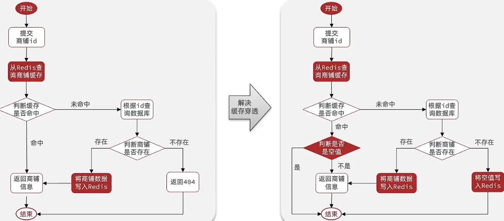

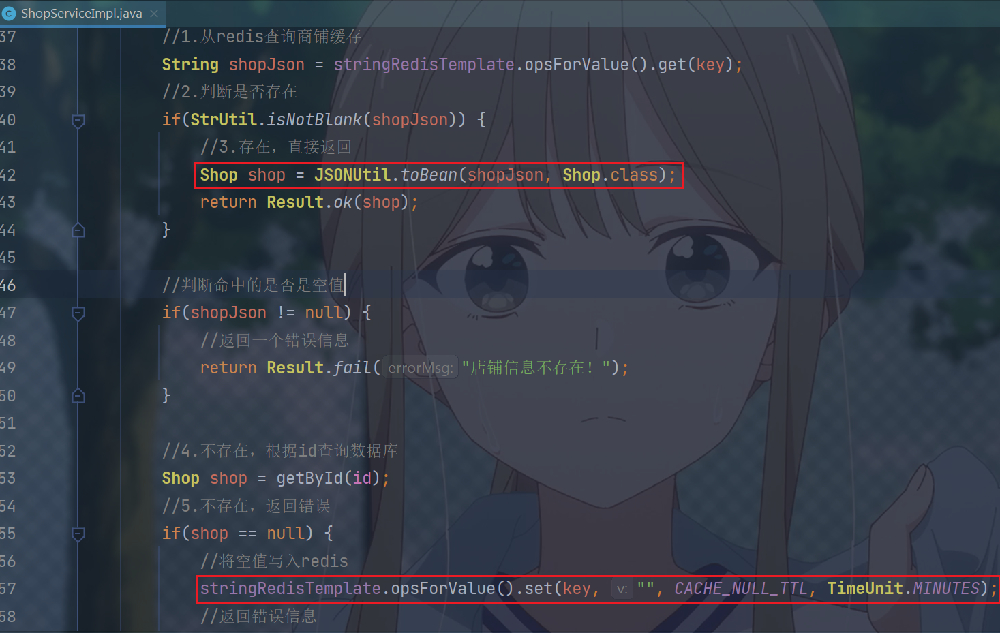


**小总结：**

缓存穿透产生的原因是什么？

- 用户请求的数据在缓存中和数据库中都不存在，不断发起这样的请求，给数据库带来巨大压力

缓存穿透的解决方案有哪些？

- 缓存null值
- 布隆过滤
- 增强id的复杂度，避免被猜测id规律
- 做好数据的基础格式校验
- 加强用户权限校验
- 做好热点参数的限流


### 2.7 缓存雪崩问题及解决思路

缓存雪崩是指在同一时段大量的缓存key同时失效或者Redis服务宕机，导致大量请求到达数据库，带来 巨大压力。

解决方案：

- 给不同的Key的TTL添加随机值
- 利用Redis集群提高服务的可用性
- 给缓存业务添加降级限流策略
- 给业务添加多级缓存

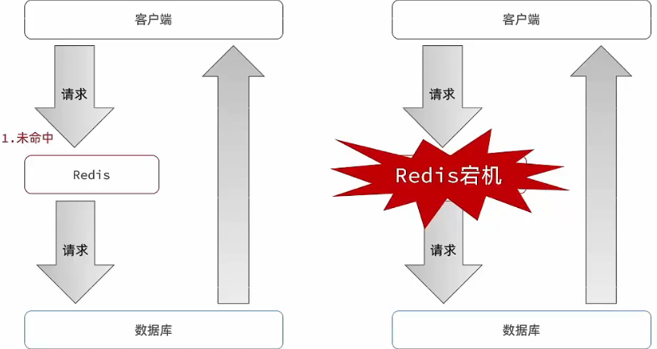


### 2.8 缓存击穿问题及解决思路

缓存击穿问题也叫热点Key问题，就是一个被高并发访问并且缓存重建业务较复杂的key突然失效了，无 数的请求访问会在瞬间给数据库带来巨大的冲击。

常见的解决方案有两种：

- 互斥锁
- 逻辑过期

逻辑分析：假设线程1在查询缓存之后，本来应该去查询数据库，然后把这个数据重新加载到缓存的，此 时只要线程1走完这个逻辑，其他线程就都能从缓存中加载这些数据了，但是假设在线程1没有走完的时 候，后续的线程2，线程3，线程4同时过来访问当前这个方法， 那么这些线程都不能从缓存中查询到数 据，那么他们就会同一时刻来访问查询缓存，都没查到，接着同一时间去访问数据库，同时的去执行数 据库代码，对数据库访问压力过大

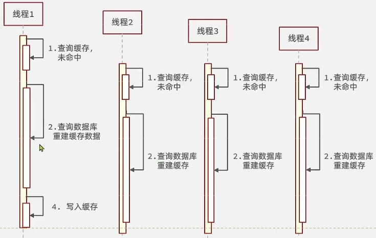


**解决方案一、使用锁来解决**：

因为锁能实现互斥性。假设线程过来，只能一个人一个人的来访问数据库，从而避免对于数据库访问压 力过大，但这也会影响查询的性能，因为此时会让查询的性能从并行变成了串行，我们可以采用tryLock 方法 + double check来解决这样的问题。

假设现在线程1过来访问，他查询缓存没有命中，但是此时他获得到了锁的资源，那么线程1就会一个人 去执行逻辑，假设现在线程2过来，线程2在执行过程中，并没有获得到锁，那么线程2就可以进行到休 眠，直到线程1把锁释放后，线程2获得到锁，然后再来执行逻辑，此时就能够从缓存中拿到数据了。


**解决方案二、逻辑过期方案**

方案分析：我们之所以会出现这个缓存击穿问题，主要原因是在于我们对key设置了过期时间，假设我们 不设置过期时间，其实就不会有缓存击穿的问题，但是不设置过期时间，这样数据不就一直占用我们内 存了吗，我们可以采用逻辑过期方案。

我们把过期时间设置在 redis的value中，注意：这个过期时间并不会直接作用于redis，而是我们后续通 过逻辑去处理。假设线程1去查询缓存，然后从value中判断出来当前的数据已经过期了，此时线程1去 获得互斥锁，那么其他线程会进行阻塞，获得了锁的线程他会开启一个 线程去进行 以前的重构数据的逻 辑，直到新开的线程完成这个逻辑后，才释放锁， 而线程1直接进行返回，假设现在线程3过来访问，由 于线程线程2持有着锁，所以线程3无法获得锁，线程3也直接返回数据，只有等到新开的线程2把重建数 据构建完后，其他线程才能走返回正确的数据。

这种方案巧妙在于，异步的构建缓存，缺点在于在构建完缓存之前，返回的都是脏数据。


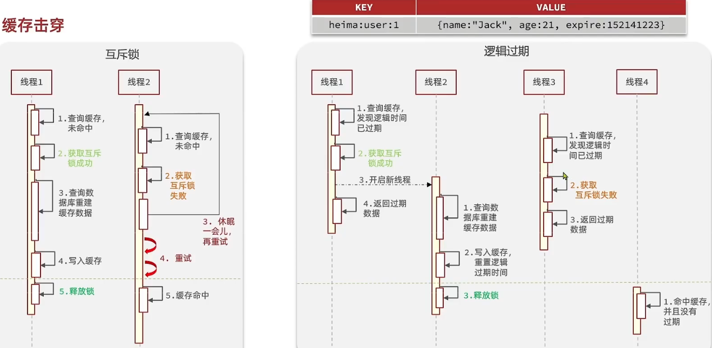


进行对比

**互斥锁方案**：由于保证了互斥性，所以数据一致，且实现简单，因为仅仅只需要加一把锁而已，也没其 他的事情需要操心，所以没有额外的内存消耗，缺点在于有锁就有死锁问题的发生，且只能串行执行性 能肯定受到影响

**逻辑过期方案**： 线程读取过程中不需要等待，性能好，有一个额外的线程持有锁去进行重构数据，但是 在重构数据完成前，其他的线程只能返回之前的数据，且实现起来麻烦

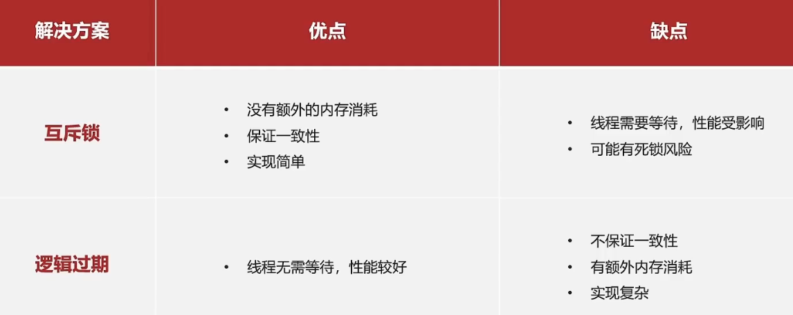


### 2.9 利用互斥锁解决缓存击穿问题

核心思路：相较于原来从缓存中查询不到数据后直接查询数据库而言，现在的方案是 进行查询之后，如 果从缓存没有查询到数据，则进行互斥锁的获取，获取互斥锁后，判断是否获得到了锁，如果没有获得 到，则休眠，过一会再进行尝试，直到获取到锁为止，才能进行查询

如果获取到了锁的线程，再去进行查询，查询后将数据写入redis，再释放锁，返回数据，利用互斥锁就 能保证只有一个线程去执行操作数据库的逻辑，防止缓存击穿

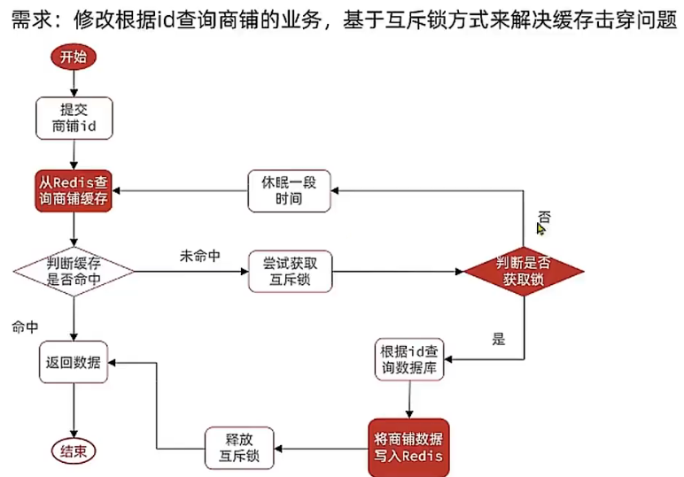


**操作锁的代码**：

核心思路就是利用redis的setnx方法来表示获取锁，该方法含义是redis中如果没有这个key，则插入成 功，返回1，在stringRedisTemplate中返回true， 如果有这个key则插入失败，则返回0，在 stringRedisTemplate返回false，我们可以通过true，或者是false，来表示是否有线程成功插入key，成 功插入的key的线程我们认为他就是获得到锁的线程。

```java
//获取锁
private boolean tryLock(String key) {
    Boolean flag = stringRedisTemplate.opsForValue().setIfAbsent(key, "1", 10, TimeUnit.SECONDS);
    return BooleanUtil.isTrue(flag);
}

//释放锁
private void unlock(String key) {
    stringRedisTemplate.delete(key);
}
```


操作代码：

```java
public Shop queryWithMutex(Long id) {
    String key = CACHE_SHOP_KEY + id;
    //1.从redis查询商铺缓存
    String shopJson = stringRedisTemplate.opsForValue().get(key);
    //2.判断是否存在
    if(StrUtil.isNotBlank(shopJson)) {
        //3.存在，直接返回
        return JSONUtil.toBean(shopJson, Shop.class);
    }

    //判断命中的是否是空值
    if(shopJson != null) {
        //返回一个错误信息
        return null;
    }

    //4.实现缓存重建
    //4.1 获取互斥锁
    String lockKey = "lock:shop:" + id;
    Shop shop = null;
    try {
        boolean isLock = tryLock(lockKey);
        //4.2 判断是否获取成功
        if(!isLock) {
            //4.3 失败，则休眠并重试
            Thread.sleep(50);
            return queryWithMutex(id);
        }
        //4.4 成功，根据id查询数据库
        shop = getById(id);
        //模拟重建的延时
        Thread.sleep(200);
        //5.不存在，返回错误
        if(shop == null) {
            //将空值写入redis
            stringRedisTemplate.opsForValue().set(key, "", CACHE_NULL_TTL, TimeUnit.MINUTES);
            //返回错误信息
            return null;
        }
        //6.存在，写入redis
        stringRedisTemplate.opsForValue().set(key, JSONUtil.toJsonStr(shop), CACHE_SHOP_TTL, TimeUnit.MINUTES);
    } catch (InterruptedException e) {
        throw new RuntimeException(e);
    } finally {
        //7.释放互斥锁
        unlock(lockKey);
    }

    //8.返回
    return shop;
}
```


### 3.0 利用逻辑过期解决缓存击穿问题

**需求：修改根据id查询商铺的业务，基于逻辑过期方式来解决缓存击穿问题**

思路分析：当用户开始查询redis时，判断是否命中，如果没有命中则直接返回空数据，不查询数据库， 而一旦命中后，将value取出，判断value中的过期时间是否满足，如果没有过期，则直接返回redis中的 数据，如果过期，则在开启独立线程后直接返回之前的数据，独立线程去重构数据，重构完成后释放互 斥锁。

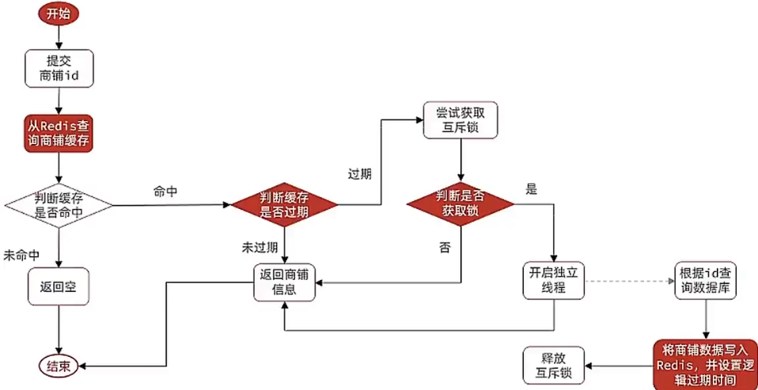

如果封装数据：因为现在redis中存储的数据的value需要带上过期时间，此时要么你去修改原来的实体 类，要么你

**步骤一、**

新建一个实体类，我们采用第二个方案，这个方案，对原来代码没有侵入性。

```java
@Data
public class RedisData {
    private LocalDateTime expireTime;
    private Object data;
}
```


步骤二、

在**ShopServiceImpl**新增此方法，利用单元测试进行缓存预热

```java
//逻辑过期时间
public void saveShop2Redis(Long id, Long expireSeconds) throws InterruptedException {
    //1.查询店铺数据
    Shop shop = getById(id);
    Thread.sleep(200);
    //2.封装逻辑过期时间
    RedisData redisData = new RedisData();
    redisData.setData(shop);
    redisData.setExpireTime(LocalDateTime.now().plusSeconds(expireSeconds));
    //3.写入Redis
    stringRedisTemplate.opsForValue().set(CACHE_SHOP_KEY + id, JSONUtil.toJsonStr(redisData));
}
```


**在测试类中**

```java
@Test
void testSaveShop() throws InterruptedException {
    shopService.saveShop2Redis(1L, 10L);
}
```


步骤三：正式代码

**ShopServiceImpl**

```java
private static final ExecutorService CACHE_REBUILD_EXECUTOR = Executors.newFixedThreadPool(10);


//逻辑过期代码实现
public Shop queryWithLogicalExpire(Long id){
    String key = CACHE_SHOP_KEY + id;
    //1.从redis查询商铺缓存
    String shopJson = stringRedisTemplate.opsForValue().get(key);
    //2.判断是否存在
    if(StrUtil.isBlank(shopJson)) {
        //3.存在，直接返回
        return null;
    }

    //4.命中，需要先把json反序列化为对象
    RedisData redisData = JSONUtil.toBean(shopJson, RedisData.class);
    Shop shop = JSONUtil.toBean((JSONObject) redisData.getData(), Shop.class);
    LocalDateTime expireTime = redisData.getExpireTime();

    //5.判断是否过期
    if(expireTime.isAfter(LocalDateTime.now())) {
        //5.1 未过期，直接返回店铺信息
        return shop;
    }
    //5.2 已过期，需要缓存重建
    //6.缓存重建
    //6.1 获取互斥锁
    String lockKey = LOCK_SHOP_KEY + id;
    boolean isLock = tryLock(lockKey);
    //6.2 判断是否获取锁成功
    if(isLock) {
        //6.3 成功，开启独立线程，实现缓存重建
        CACHE_REBUILD_EXECUTOR.submit(() -> {
            try {
                //重建缓存
                this.saveShop2Redis(id, 20L);
            } catch (Exception e) {
                throw new RuntimeException(e);
            } finally {
                //释放锁
                unlock(lockKey);
            }
        });
    }

    //6.4 返回过期的商铺信息
    return shop;
}
```


### 3.1、封装Redis工具类

基于StringRedisTemplate封装一个缓存工具类，满足下列需求：

- 方法1：将任意Java对象序列化为json并存储在string类型的key中，并且可以设置TTL过期时间

- 方法2：将任意Java对象序列化为json并存储在string类型的key中，并且可以设置逻辑过期时间， 用于处理缓存击穿问题


- 方法3：根据指定的key查询缓存，并反序列化为指定类型，利用缓存空值的方式解决缓存穿透问题 
- 方法4：根据指定的key查询缓存，并反序列化为指定类型，需要利用逻辑过期解决缓存击穿问题

将逻辑进行封装

```java
@Slf4j
@Component
public class CacheClient {

    private final StringRedisTemplate stringRedisTemplate;

    public CacheClient(StringRedisTemplate stringRedisTemplate) {
        this.stringRedisTemplate = stringRedisTemplate;
    }

    //设置TTL过期时间
    public void set(String key, Object value, Long time, TimeUnit unit) {
        stringRedisTemplate.opsForValue().set(key, JSONUtil.toJsonStr(value), time, unit);
    }

    //设置逻辑过期时间
    public void setWithLogicalExpire(String key, Object value, Long time, TimeUnit unit) {
        //设置逻辑过期
        RedisData redisData = new RedisData();
        redisData.setData(value);
        redisData.setExpireTime(LocalDateTime.now().plusSeconds(unit.toSeconds(time)));
        //写入Redis
        stringRedisTemplate.opsForValue().set(key, JSONUtil.toJsonStr(redisData));
    }

    public <R, ID> R queryWithPassThrough(String keyPrefix, ID id, Class<R> type,
                                          Function<ID, R> dbFallback, Long time, TimeUnit unit) {
        String key = keyPrefix + id;
        //1.从redis查询商铺缓存
        String Json = stringRedisTemplate.opsForValue().get(key);
        //2.判断是否存在
        if(StrUtil.isNotBlank(Json)) {
            //3.存在，直接返回
            return JSONUtil.toBean(Json, type);
        }

        //判断命中的是否是空值
        if(Json != null) {
            //返回一个错误信息
            return null;
        }

        //4.不存在，根据id查询数据库
        R r = dbFallback.apply(id);
        //5.不存在，返回错误
        if(r == null) {
            //将空值写入redis
            stringRedisTemplate.opsForValue().set(key, "", CACHE_NULL_TTL, TimeUnit.MINUTES);
            //返回错误信息
            return null;
        }
        //6.存在，写入redis
        this.set(key, r, time, unit);

        //7.返回
        return r;
    }

    private static final ExecutorService CACHE_REBUILD_EXECUTOR = Executors.newFixedThreadPool(10);
    public <R, ID> R queryWithLogicalExpire(String keyPrefix, ID id, Class<R> type,
                                            Function<ID, R> dbFallback, Long time, TimeUnit unit){
        String key = keyPrefix + id;
        //1.从redis查询商铺缓存
        String shopJson = stringRedisTemplate.opsForValue().get(key);
        //2.判断是否存在
        if(StrUtil.isBlank(shopJson)) {
            //3.存在，直接返回
            return null;
        }

        //4.命中，需要先把json反序列化为对象
        RedisData redisData = JSONUtil.toBean(shopJson, RedisData.class);
        R r = JSONUtil.toBean((JSONObject) redisData.getData(), type);
        LocalDateTime expireTime = redisData.getExpireTime();

        //5.判断是否过期
        if(expireTime.isAfter(LocalDateTime.now())) {
            //5.1 未过期，直接返回店铺信息
            return r;
        }
        //5.2 已过期，需要缓存重建
        //6.缓存重建
        //6.1 获取互斥锁
        String lockKey = LOCK_SHOP_KEY + id;
        boolean isLock = tryLock(lockKey);
        //6.2 判断是否获取锁成功
        if(isLock) {
            //6.3 成功，开启独立线程，实现缓存重建
            CACHE_REBUILD_EXECUTOR.submit(() -> {
                try {
                    //查询数据库
                    R r1 = dbFallback.apply(id);
                    //写入redis
                    this.setWithLogicalExpire(key, r1, time, unit);
                } catch (Exception e) {
                    throw new RuntimeException(e);
                } finally {
                    //释放锁
                    unlock(lockKey);
                }
            });
        }
        //6.4 返回过期的商铺信息
        return r;
    }
    //获取锁
    private boolean tryLock(String key) {
        Boolean flag = stringRedisTemplate.opsForValue().setIfAbsent(key, "1", 10, TimeUnit.SECONDS);
        return BooleanUtil.isTrue(flag);
    }
    //释放锁
    private void unlock(String key) {
        stringRedisTemplate.delete(key);
    }


}
```


在ShopServiceImpl 中

```java
@Resource
    private CacheClient cacheClient;

    @Override
    public Result queryById(Long id) {
        //缓存穿透
//        Shop shop = cacheClient.queryWithPassThrough
//                (CACHE_SHOP_KEY, id, Shop.class, this::getById, CACHE_SHOP_TTL, TimeUnit.MINUTES);

        //互斥锁解决缓存击穿
        //Shop shop = queryWithMutex(id);

        //逻辑过期解决缓存击穿
        Shop shop = cacheClient.queryWithLogicalExpire
                (CACHE_SHOP_KEY, id, Shop.class, this::getById, 20L, TimeUnit.SECONDS);

        if(shop == null) {
            return Result.fail("店铺不存在!");
        }

        //返回
        return Result.ok(shop);
    }
```


## 3、优惠卷秒杀

### 3.1 -全局唯一ID

每个店铺都可以发布优惠券：


当用户抢购时，就会生成订单并保存到tb_voucher_order这张表中，而订单表如果使用数据库自增ID就 存在一些问题：

- id的规律性太明显
- 受单表数据量的限制

场景分析：如果我们的id具有太明显的规则，用户或者说商业对手很容易猜测出来我们的一些敏感信 息，比如商城在一天时间内，卖出了多少单，这明显不合适。

场景分析二：随着我们商城规模越来越大，mysql的单表的容量不宜超过500W，数据量过大之后，我们 要进行拆库拆表，但拆分表了之后，他们从逻辑上讲他们是同一张表，所以他们的id是不能一样的， 于 是乎我们需要保证id的唯一性。

**全局ID生成器**，是一种在分布式系统下用来生成全局唯一ID的工具，一般要满足下列特性：

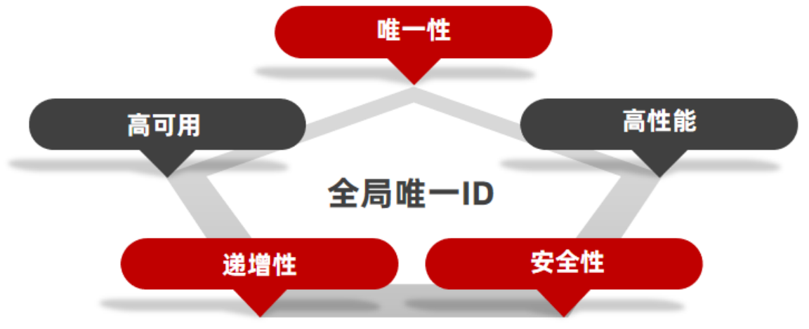

为了增加ID的安全性，我们可以不直接使用Redis自增的数值，而是拼接一些其它信息：

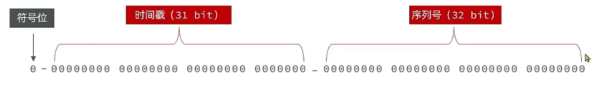

- ID的组成部分：符号位：1bit，永远为0
- 时间戳：31bit，以秒为单位，可以使用69年
- 序列号：32bit，秒内的计数器，支持每秒产生2^32个不同ID


### 3.2 -Redis实现全局唯一Id

```java
@Component
public class RedisIdWorker {

    //开始时间戳
    private static final long BEGIN_TIMESTAMP = 1640995200L;

    //序列号的位数
    private static final int COUNT_BITS = 32;

    private StringRedisTemplate stringRedisTemplate;

    public RedisIdWorker(StringRedisTemplate stringRedisTemplate) {
        this.stringRedisTemplate = stringRedisTemplate;
    }

    public long nextId(String keyPrefix) {
        // 1.生成时间戳
        LocalDateTime now = LocalDateTime.now();
        long nowSecond = now.toEpochSecond(ZoneOffset.UTC);
        long timestamp = nowSecond - BEGIN_TIMESTAMP;

        // 2.生成序列号
        // 2.1获取当前日期，精确到天
        String date = now.format(DateTimeFormatter.ofPattern("yyyyMMdd"));
        // 2.2自增长
        long count = stringRedisTemplate.opsForValue().increment("icr:" + keyPrefix + ":" + date);

        // 3.拼接并返回
        return timestamp << COUNT_BITS | count;
    }

    //得到一个2022年1月1日0时0分0秒的秒数
//    public static void main(String[] args) {
//        LocalDateTime time = LocalDateTime.of(2022, 1, 1, 0, 0, 0);
//        long second = time.toEpochSecond(ZoneOffset.UTC);
//        System.out.println("second= " + second);
//    }

}
```


测试类

知识小贴士：关于countdownlatch

countdownlatch名为信号枪：主要的作用是同步协调在多线程的等待于唤醒问题

我们如果没有CountDownLatch ，那么由于程序是异步的，当异步程序没有执行完时，主线程就已经执行完了，然后我们期望的是分线程全部走完之后，主线程再走，所以我们此时需要使用到CountDownLatch

CountDownLatch 中有两个最重要的方法

1. countDown
2. await

await 方法 是阻塞方法，我们担心分线程没有执行完时，main线程就先执行，所以使用await可以让 main线程阻塞，那么什么时候main线程不再阻塞呢？当CountDownLatch 内部维护的 变量变为0时， 就不再阻塞，直接放行，那么什么时候CountDownLatch 维护的变量变为0 呢，我们只需要调用一次 countDown ，内部变量就减少1，我们让分线程和变量绑定， 执行完一个分线程就减少一个变量，当分 线程全部走完，CountDownLatch 维护的变量就是0，此时await就不再阻塞，统计出来的时间也就是所 有分线程执行完后的时间。

```java
@Resource
private RedisIdWorker redisIdWorker;

private ExecutorService es = Executors.newFixedThreadPool(500);

@Test
void testIdWorker() throws InterruptedException {
    CountDownLatch latch = new CountDownLatch(300);

    Runnable task = () -> {
        for(int i = 0; i < 100; i++) {
            long id = redisIdWorker.nextId("order");
            System.out.println("id= " + id);
        }
        latch.countDown();
    };
    long begin = System.currentTimeMillis();
    for(int i = 0; i < 300; i++) {
        es.submit(task);
    }
    latch.await();
    long end = System.currentTimeMillis();
    System.out.println("time= " + (end - begin));
}
```


### 3.3 添加优惠卷

每个店铺都可以发布优惠券，分为平价券和特价券。平价券可以任意购买，而特价券需要秒杀抢购：


tb_voucher：优惠券的基本信息，优惠金额、使用规则等

tb_seckill_voucher：优惠券的库存、开始抢购时间，结束抢购时间。特价优惠券才需要填写这些信息

平价卷由于优惠力度并不是很大，所以是可以任意领取

而代金券由于优惠力度大，所以像第二种卷，就得限制数量，从表结构上也能看出，特价卷除了具有优 惠卷的基本信息以外，还具有库存，抢购时间，结束时间等等字段

**新增普通卷代码**： VoucherController

```java
@PostMapping
public Result addVoucher(@RequestBody Voucher voucher) {
	voucherService.save(voucher);
	return Result.ok(voucher.getId());
}

```


**新增秒杀卷代码**： VoucherController

```java
@PostMapping("seckill")
public Result addSeckillVoucher(@RequestBody Voucher voucher) {
	voucherService.addSeckillVoucher(voucher);
	return Result.ok(voucher.getId());
}

```

VoucherServiceImpl

```java
@Override
@Transactional
public void addSeckillVoucher(Voucher voucher) {
	// 保存优惠券
	save(voucher);
	// 保存秒杀信息
	SeckillVoucher seckillVoucher = new SeckillVoucher();
	seckillVoucher.setVoucherId(voucher.getId());
    seckillVoucher.setStock(voucher.getStock());
    seckillVoucher.setBeginTime(voucher.getBeginTime());
    seckillVoucher.setEndTime(voucher.getEndTime());
    seckillVoucherService.save(seckillVoucher);
    // 保存秒杀库存到Redis中
	stringRedisTemplate.opsForValue().set(SECKILL_STOCK_KEY + voucher.getId(),
	voucher.getStock().toString());
}
```


### 3.4 实现秒杀下单

下单核心思路：当我们点击抢购时，会触发右侧的请求，我们只需要编写对应的controller即可

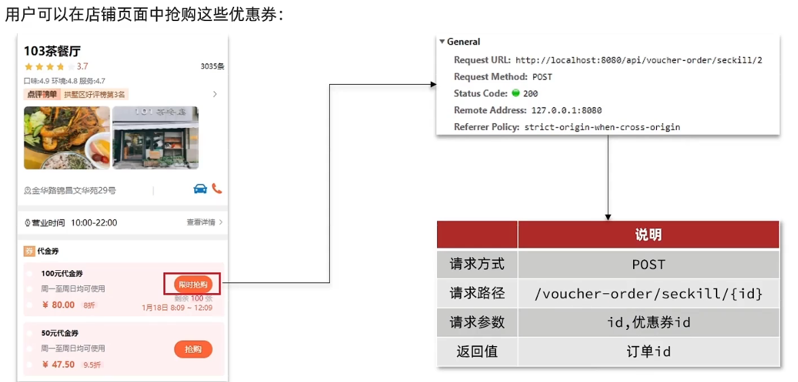

秒杀下单应该思考的内容：

下单时需要判断两点：

- 秒杀是否开始或结束，如果尚未开始或已经结束则无法下单
- 库存是否充足，不足则无法下单

下单核心逻辑分析：

当用户开始进行下单，我们应当去查询优惠卷信息，查询到优惠卷信息，判断是否满足秒杀条件

比如时间是否充足，如果时间充足，则进一步判断库存是否足够，如果两者都满足，则扣减库存，创建 订单，然后返回订单id，如果有一个条件不满足则直接结束。

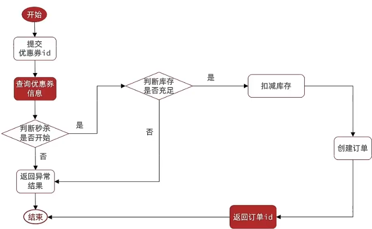

VoucherOrderServiceImpl

```java
@Service
public class VoucherOrderServiceImpl extends ServiceImpl<VoucherOrderMapper, VoucherOrder> implements IVoucherOrderService {

    @Resource
    private ISeckillVoucherService seckillVoucherService;

    @Resource
    private RedisIdWorker redisIdWorker;

    @Override
    @Transactional
    public Result seckillVoucher(Long voucherId) {
        //1.查询优惠劵
        SeckillVoucher voucher = seckillVoucherService.getById(voucherId);

        //2.判断秒杀是否已经开始
        if(voucher.getBeginTime().isAfter(LocalDateTime.now())) {
            //尚未开始
            return Result.fail("秒杀尚未开始！");
        }

        //3.判断秒杀是否已经结束
        if(voucher.getEndTime().isBefore(LocalDateTime.now())) {
            //尚未开始
            return Result.fail("秒杀已经结束！");
        }

        //4.判断库存是否充足
        if(voucher.getStock() < 1) {
            //库存不足
            return Result.fail("库存不足！");
        }

        //5.扣减库存
        boolean success = seckillVoucherService.update().
                setSql("stock = stock - 1").
                eq("voucher_id", voucherId).update();
        if(!success) {
            //扣减失败
            return Result.fail("库存不足！");
        }

        //6.创建订单
        VoucherOrder voucherOrder = new VoucherOrder();
        //6.1 订单id
        long orderId = redisIdWorker.nextId("order");
        voucherOrder.setId(orderId);
        //6.2 用户id
        Long userId = UserHolder.getUser().getId();
        voucherOrder.setUserId(userId);
        //6.3 代金券id
        voucherOrder.setVoucherId(voucherId);
        save(voucherOrder);

        //7.返回订单id
        return Result.ok(orderId);
    }
}
```


### 3.5 库存超卖问题分析

有关超卖问题分析：在我们原有代码中是这么写的

```java
if (voucher.getStock() < 1) {
        // 库存不足
        return Result.fail("库存不足！");
    }
    //5，扣减库存
    boolean success = seckillVoucherService.update()
    	.setSql("stock= stock -1")
    	.eq("voucher_id", voucherId).update();
    if (!success) {
        //扣减库存
        return Result.fail("库存不足！");
    }
```

假设线程1过来查询库存，判断出来库存大于1，正准备去扣减库存，但是还没有来得及去扣减，此时线 程2过来，线程2也去查询库存，发现这个数量一定也大于1，那么这两个线程都会去扣减库存，最终多 个线程相当于一起去扣减库存，此时就会出现库存的超卖问题。

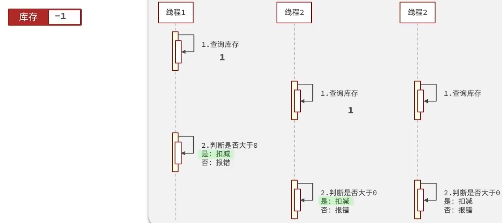

超卖问题是典型的多线程安全问题，针对这一问题的常见解决方案就是加锁：而对于加锁，我们通常有 两种解决方案：见下图：

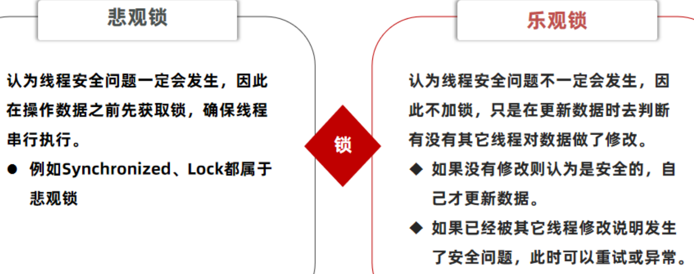

**悲观锁：**

悲观锁可以实现对于数据的串行化执行，比如syn，和lock都是悲观锁的代表，同时，悲观锁中又可以 再细分为公平锁，非公平锁，可重入锁，等等


**乐观锁：**

乐观锁：会有一个版本号，每次操作数据会对版本号+1，再提交回数据时，会去校验是否比之前的版 本大1 ，如果大1 ，则进行操作成功，这套机制的核心逻辑在于，如果在操作过程中，版本号只比原来 大1 ，那么就意味着操作过程中没有人对他进行过修改，他的操作就是安全的，如果不大1，则数据被修 改过，当然乐观锁还有一些变种的处理方式比如cas

 乐观锁的典型代表：就是cas，利用cas进行无锁化机制加锁，var5 是操作前读取的内存值，while中的 var1+var2 是预估值，如果预估值 == 内存值，则代表中间没有被人修改过，此时就将新值去替换 内存 值

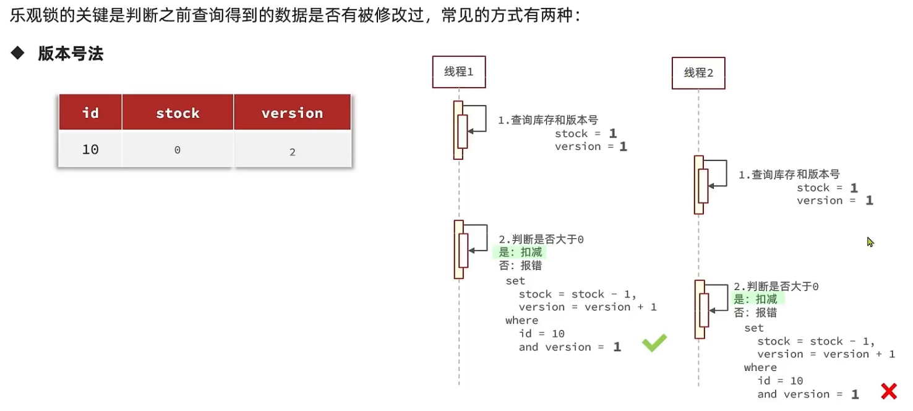

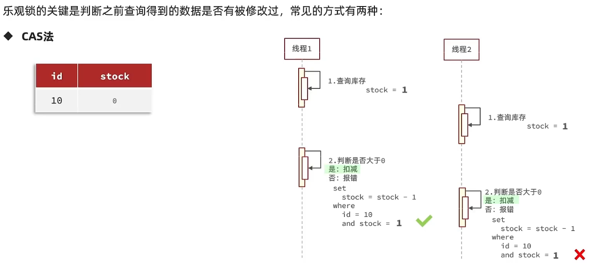


### 3.6 乐观锁解决超卖问题

**修改代码方案一**：VoucherOrderServiceImpl 在扣减库存时，改为：

```java
//5.扣减库存
boolean success = seckillVoucherService.update().
        setSql("stock = stock - 1").// set stock = stock - 1
        eq("voucher_id", voucherId).// where id = ?
        eq("stock", voucher.getStock()).// where stock = ?
        update();
```

以上逻辑的核心含义是：只要我扣减库存时的库存和之前我查询到的库存是一样的，就意味着没有人在 中间修改过库存，那么此时就是安全的，但是以上这种方式通过测试发现会有很多失败的情况，失败的 原因在于：在使用乐观锁过程中假设100个线程同时都拿到了100的库存，然后大家一起去进行扣减，但 是100个人中只有1个人能扣减成功，其他的人在处理时，他们在扣减时，库存已经被修改过了，所以此 时其他线程都会失败


**修改代码方案二**：之前的方式要修改前后都保持一致，但是这样我们分析过，成功的概率太低，所以我们的乐观锁需要变 一下，改成stock大于0 即可

```java
//5.扣减库存
boolean success = seckillVoucherService.update().
        setSql("stock = stock - 1").// set stock = stock - 1
        eq("voucher_id", voucherId).// where id = ?
        gt("stock", 0).// where stock > 0
        update();
```


**知识小扩展：**

针对cas中的自旋压力过大，我们可以使用Longaddr这个类去解决

java8 提供的一个对AtomicLong改进后的一个类，LongAdder

大量线程并发更新一个原子性的时候，天然的问题就是自旋，会导致并发性问题，当然这也比我们直接 使用syn来的好

所以利用这么一个类，LongAdder来进行优化

如果获取某个值，则会对cell和base的值进行递增，最后返回一个完整的值

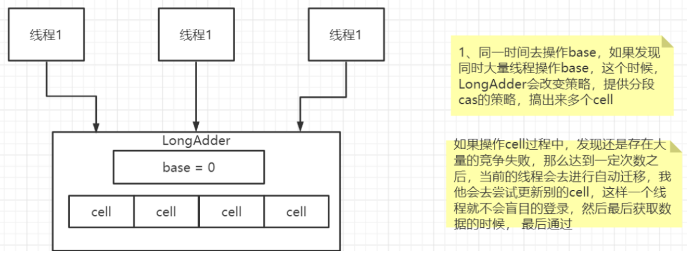


### 3.6 优惠券秒杀-一人一单

需求：修改秒杀业务，要求同一个优惠券，一个用户只能下一单

**现在的问题在于：**

优惠卷是为了引流，但是目前的情况是，一个人可以无限制的抢这个优惠卷，所以我们应当增加一层逻 辑，让一个用户只能下一个单，而不是让一个用户下多个单

具体操作逻辑如下：比如时间是否充足，如果时间充足，则进一步判断库存是否足够，然后再根据优惠 卷id和用户id查询是否已经下过这个订单，如果下过这个订单，则不再下单，否则进行下单

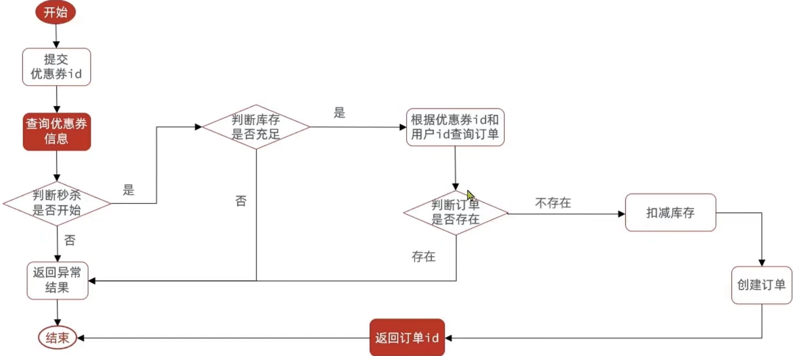

VoucherOrderServiceImpl 

**初步代码：增加一人一单逻辑**

```java
//5.一人一单
Long userId = UserHolder.getUser().getId();
//5.1 查询订单
int count = query().eq("user_id", userId).eq("voucher_id", voucherId).count();
//5.2 判断是否存在
if (count > 0) {
    //用户已经购买过了
    return Result.fail("用户已经购买过一次！");
}
```

**存在问题**：现在的问题还是和之前一样，并发过来，查询数据库，都不存在订单，所以我们还是需要加 锁，但是乐观锁比较适合更新数据，而现在是插入数据，所以我们需要使用悲观锁操作 

**注意**：在这里提到了非常多的问题，我们需要慢慢的来思考，首先我们的初始方案是封装了一个 createVoucherOrder方法，同时为了确保他线程安全，在方法上添加了一把synchronized 锁，


但是这样添加锁，锁的粒度太粗了，在使用锁过程中，控制**锁粒度** 是一个非常重要的事情，因为如果 锁的粒度太大，会导致每个线程进来都会锁住，所以我们需要去控制锁的粒度，以下这段代码需要修改 为： 

intern() 这个方法是从常量池中拿到数据，如果我们直接使用userId.toString() 他拿到的对象实际上是不 同的对象，new出来的对象，我们使用锁必须保证锁必须是同一把，所以我们需要使用intern()方法

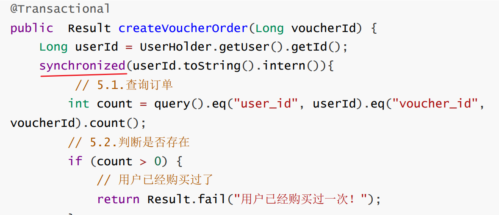

但是以上代码还是存在问题，问题的原因在于当前方法被spring的事务控制，如果你在方法内部加锁， 可能会导致当前方法事务还没有提交，但是锁已经释放也会导致问题，所以我们选择将当前方法整体包 裹起来，确保事务不会出现问题：如下： 

在seckillVoucher 方法中，添加以下逻辑，这样就能保证事务的特性，同时也控制了锁的粒度

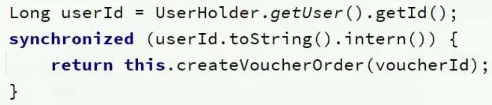

但是以上做法依然有问题，因为你调用的方法，其实是this.的方式调用的，事务想要生效，还得利用代 理来生效，所以这个地方，我们需要获得原始的事务对象， 来操作事务

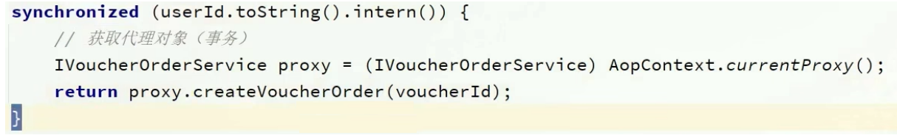

```java
@Override
public Result seckillVoucher(Long voucherId) {
    //1.查询优惠劵
    SeckillVoucher voucher = seckillVoucherService.getById(voucherId);

    //2.判断秒杀是否已经开始
    if (voucher.getBeginTime().isAfter(LocalDateTime.now())) {
        //尚未开始
        return Result.fail("秒杀尚未开始！");
    }

    //3.判断秒杀是否已经结束
    if (voucher.getEndTime().isBefore(LocalDateTime.now())) {
        //尚未开始
        return Result.fail("秒杀已经结束！");
    }

    //4.判断库存是否充足
    if (voucher.getStock() < 1) {
        //库存不足
        return Result.fail("库存不足！");
    }

    Long userId = UserHolder.getUser().getId();
    synchronized (userId.toString().intern()) {
        //获取代理对象
        IVoucherOrderService proxy = (IVoucherOrderService) AopContext.currentProxy();
        return proxy.createVoucherOrder(voucherId);
    }
}

@Transactional
public Result createVoucherOrder(Long voucherId) {
    //5.一人一单
    Long userId = UserHolder.getUser().getId();
    //5.1 查询订单
    int count = query().eq("user_id", userId).eq("voucher_id", voucherId).count();
    //5.2 判断是否存在
    if (count > 0) {
        //用户已经购买过了
        return Result.fail("用户已经购买过一次！");
    }

    //6.扣减库存
    boolean success = seckillVoucherService.update().
            setSql("stock = stock - 1").// set stock = stock - 1
                    eq("voucher_id", voucherId).// where id = ?
                    gt("stock", 0).// where stock > 0
                    update();
    if (!success) {
        //扣减失败
        return Result.fail("库存不足！");
    }

    //7.创建订单
    VoucherOrder voucherOrder = new VoucherOrder();
    //7.1 订单id
    long orderId = redisIdWorker.nextId("order");
    voucherOrder.setId(orderId);
    //7.2 用户id
    voucherOrder.setUserId(userId);
    //7.3 代金券id
    voucherOrder.setVoucherId(voucherId);
    save(voucherOrder);


    //8.返回订单id
    return Result.ok(orderId);
}
```


### 3.7 集群环境下的并发问题

通过加锁可以解决在单机情况下的一人一单安全问题，但是在集群模式下就不行了。

1、我们将服务启动两份，端口分别为8081和8082：


2、然后修改nginx的conf目录下的nginx.conf文件，配置反向代理和负载均衡：

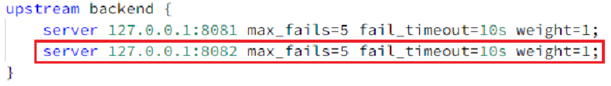

现在，用户请求会在这两个节点上负载均衡，再次测试下是否存在线程安全问题。


**有关锁失效原因分析**

由于现在我们部署了多个tomcat，每个tomcat都有一个属于自己的jvm，那么假设在服务器A的tomcat 内部，有两个线程，这两个线程由于使用的是同一份代码，那么他们的锁对象是同一个，是可以实现互 斥的，但是如果现在是服务器B的tomcat内部，又有两个线程，但是他们的锁对象写的虽然和服务器A一 样，但是锁对象却不是同一个，所以线程3和线程4可以实现互斥，但是却无法和线程1和线程2实现互 斥，这就是 集群环境下，syn锁失效的原因，在这种情况下，我们就需要使用分布式锁来解决这个问 题。

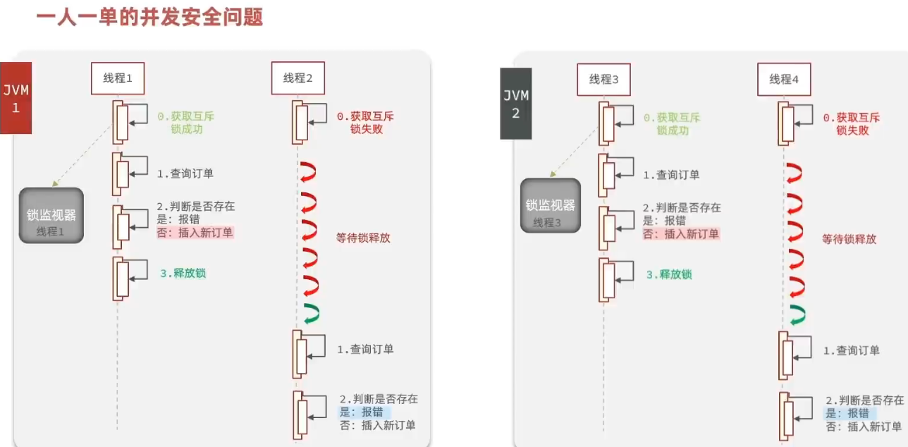


## 4、分布式锁

### 4.1 、基本原理和实现方式对比

**分布式锁**：满足分布式系统或集群模式下多进程可见并且互斥的锁。

分布式锁的核心思想就是让大家都使用同一把锁，只要大家使用的是同一把锁，那么我们就能锁住线程，不让线程进行，让程序串行执行，这就是分布式锁的核心思路

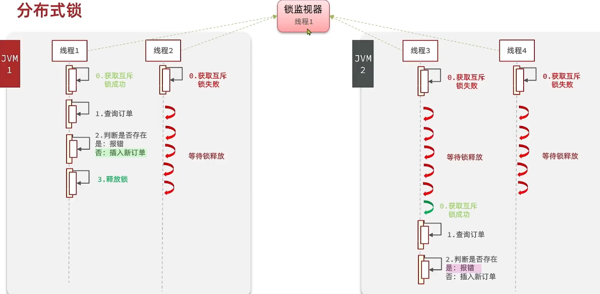

那么分布式锁他应该满足一些什么样的条件呢？

可见性：多个线程都能看到相同的结果，注意：这个地方说的可见性并不是并发编程中指的内存可见 性，只是说多个进程之间都能感知到变化的意思

互斥：互斥是分布式锁的最基本的条件，使得程序串行执行

高可用：程序不易崩溃，时时刻刻都保证较高的可用性

高性能：由于加锁本身就让性能降低，所有对于分布式锁本身需要他就较高的加锁性能和释放锁性能

安全性：安全也是程序中必不可少的一环

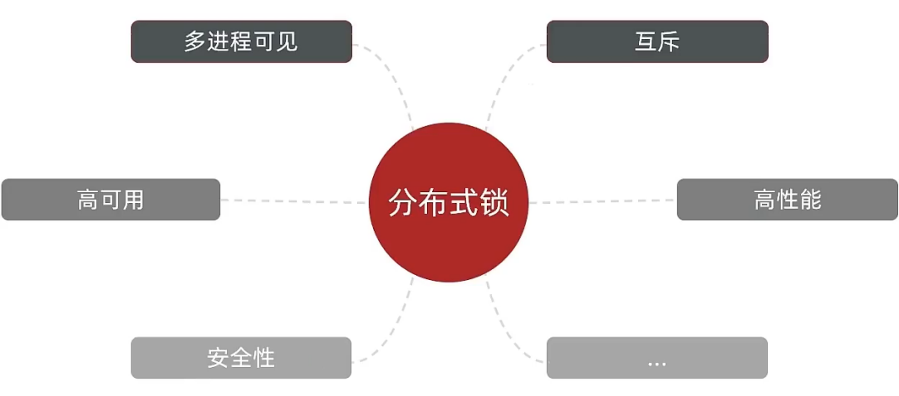

常见的分布式锁有三种

Mysql：mysql本身就带有锁机制，但是由于mysql性能本身一般，所以采用分布式锁的情况下，其实使 用mysql作为分布式锁比较少见

Redis：redis作为分布式锁是非常常见的一种使用方式，现在企业级开发中基本都使用redis或者 zookeeper作为分布式锁，利用setnx这个方法，如果插入key成功，则表示获得到了锁，如果有人插入 成功，其他人插入失败则表示无法获得到锁，利用这套逻辑来实现分布式锁

Zookeeper：zookeeper也是企业级开发中较好的一个实现分布式锁的方案，由于本套视频并不讲解 zookeeper的原理和分布式锁的实现，所以不过多阐述

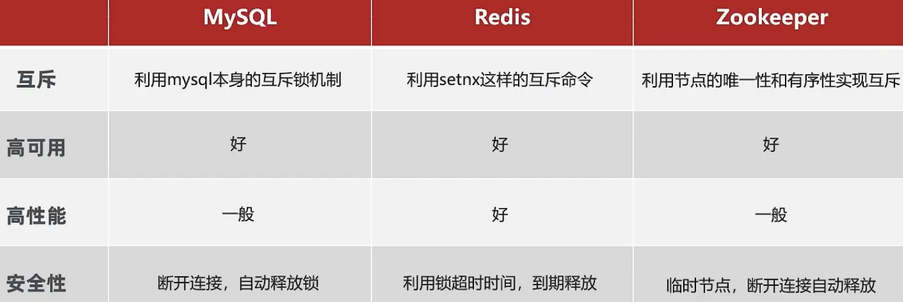


### 4.2 、Redis分布式锁的实现核心思路

实现分布式锁时需要实现的两个基本方法：

- 获取锁：
  - 互斥：确保只能有一个线程获取锁
  - 非阻塞：尝试一次，成功返回true，失败返回false
    
- 释放锁：
  - 手动释放
  - 超时释放：获取锁时添加一个超时时间
    

核心思路：

我们利用redis 的setNx 方法，当有多个线程进入时，我们就利用该方法，第一个线程进入时，redis 中 就有这个key 了，返回了1，如果结果是1，则表示他抢到了锁，那么他去执行业务，然后再删除锁，退 出锁逻辑，没有抢到锁的哥们，等待一定时间后重试即可

 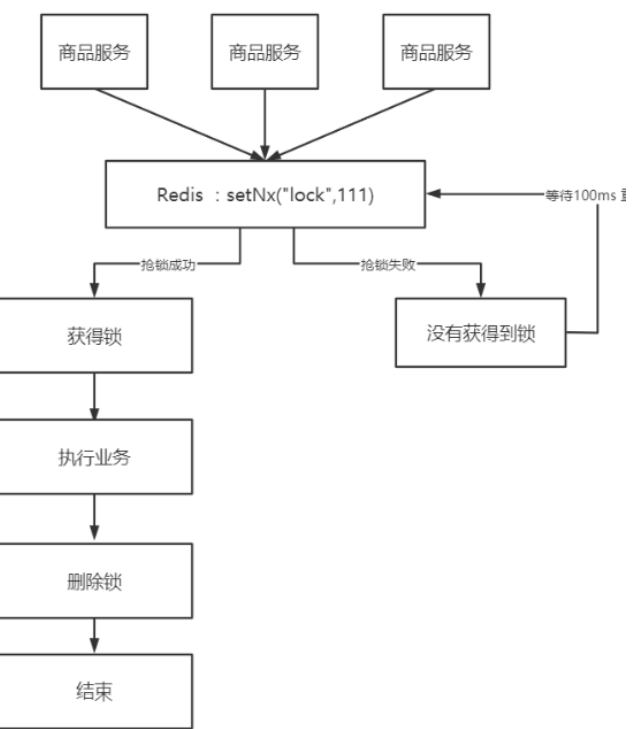


### 4.3 实现分布式锁版本一

- 加锁逻辑

锁的基本接口

```java
public interface ILock {

    /**
     * 尝试获取锁
     * @param timeoutSec 锁持有的超时时间，过期后自动释放
     * @return true代表获取锁成功；false代表获取锁失败
     */
    boolean tryLock(long timeoutSec);

    /**
     * 释放锁
     */
    void unlock();

}
```


**SimpleRedisLock**

利用setnx方法进行加锁，同时增加过期时间，防止死锁，此方法可以保证加锁和增加过期时间具有原子性

释放锁，防止删除别人的锁

```java
public class SimpleRedisLock implements ILock{

    private String name;
    private StringRedisTemplate stringRedisTemplate;

    public SimpleRedisLock(String name, StringRedisTemplate stringRedisTemplate) {
        this.name = name;
        this.stringRedisTemplate = stringRedisTemplate;
    }

    private static final String KEY_PREFIX = "lock:";

    @Override
    public boolean tryLock(long timeoutSec) {
        //获取线程标识
        long threadId = Thread.currentThread().getId();
        //获取锁
        Boolean success = stringRedisTemplate.opsForValue()
                .setIfAbsent(KEY_PREFIX + name, threadId + "", timeoutSec, TimeUnit.SECONDS);
        return Boolean.TRUE.equals(success);
    }

    @Override
    public void unlock() {
        //释放锁
        stringRedisTemplate.delete(KEY_PREFIX + name);
    }
}
```


- 修改业务代码


### 4.4 Redis分布式锁误删情况说明

逻辑说明：

持有锁的线程在锁的内部出现了阻塞，导致他的锁自动释放，这时其他线程，线程2来尝试获得锁，就拿 到了这把锁，然后线程2在持有锁执行过程中，线程1反应过来，继续执行，而线程1执行过程中，走到 了删除锁逻辑，此时就会把本应该属于线程2的锁进行删除，这就是误删别人锁的情况说明

解决方案：解决方案就是在每个线程释放锁的时候，去判断一下当前这把锁是否属于自己，如果属于自 己，则不进行锁的删除，假设还是上边的情况，线程1卡顿，锁自动释放，线程2进入到锁的内部执行逻 辑，此时线程1反应过来，然后删除锁，但是线程1，一看当前这把锁不是属于自己，于是不进行删除锁 逻辑，当线程2走到删除锁逻辑时，如果没有卡过自动释放锁的时间点，则判断当前这把锁是属于自己 的，于是删除这把锁。

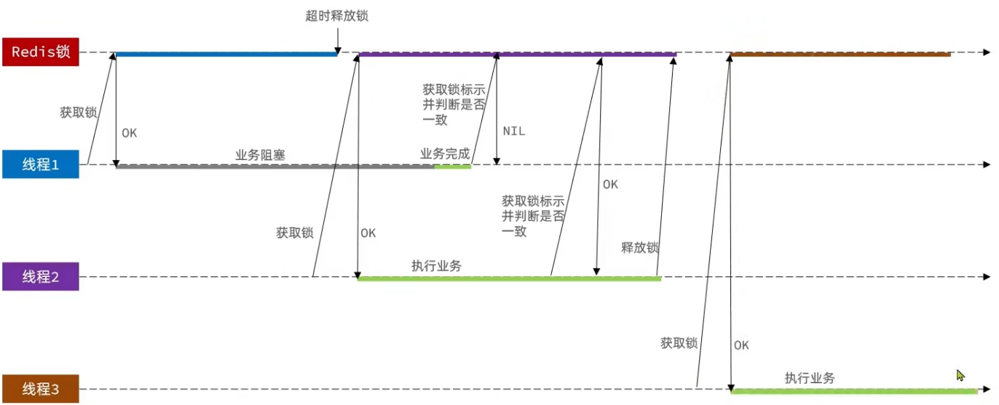

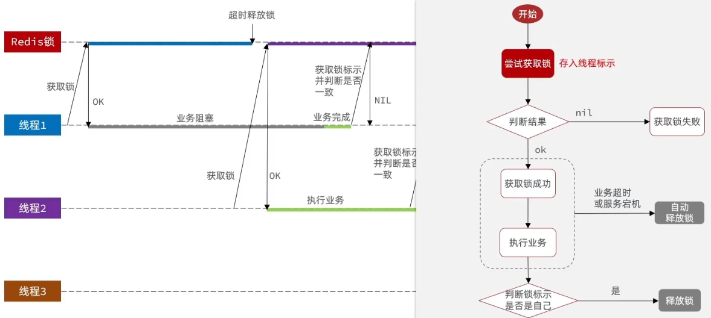


### 4.5 解决Redis分布式锁误删问题

需求：修改之前的分布式锁实现，满足：在获取锁时存入线程标示（可以用UUID表示） 在释放锁时先获取锁中的线程标示，判断是否与当前线程标示一致

- 如果一致则释放锁
- 如果不一致则不释放锁

核心逻辑：在存入锁时，放入自己线程的标识，在删除锁时，判断当前这把锁的标识是不是自己存入 的，如果是，则进行删除，如果不是，则不进行删除。


具体代码如下：加锁

```java
private static final String ID_PREFIX = UUID.randomUUID().toString(true) + "-";

//加锁
@Override
public boolean tryLock(long timeoutSec) {
    //获取线程标识
    String threadId = ID_PREFIX + Thread.currentThread().getId();
    //获取锁
    Boolean success = stringRedisTemplate.opsForValue()
            .setIfAbsent(KEY_PREFIX + name, threadId, timeoutSec, TimeUnit.SECONDS);
    return Boolean.TRUE.equals(success);
}

//释放锁
@Override
public void unlock() {
    //获取线程标识
    String threadId = ID_PREFIX + Thread.currentThread().getId();
    //获取锁中标识
    String id = stringRedisTemplate.opsForValue().get(KEY_PREFIX + name);
    //判断标识是否一致
    if(threadId.equals(id)) {
        //释放锁
        stringRedisTemplate.delete(KEY_PREFIX + name);
    }

}
```


**有关代码实操说明**：

在我们修改完此处代码后，我们重启工程，然后启动两个线程，第一个线程持有锁后，手动释放锁，第 二个线程 此时进入到锁内部，再放行第一个线程，此时第一个线程由于锁的value值并非是自己，所以 不能释放锁，也就无法删除别人的锁，此时第二个线程能够正确释放锁，通过这个案例初步说明我们解 决了锁误删的问题。


### 4.6 分布式锁的原子性问题

更为极端的误删逻辑说明：

线程1现在持有锁之后，在执行业务逻辑过程中，他正准备删除锁，而且已经走到了条件判断的过程中， 比如他已经拿到了当前这把锁确实是属于他自己的，正准备删除锁，但是此时他的锁到期了，那么此时 线程2进来，但是线程1他会接着往后执行，当他卡顿结束后，他直接就会执行删除锁那行代码，相当于 条件判断并没有起到作用，这就是删锁时的原子性问题，之所以有这个问题，是因为线程1的拿锁，比 锁，删锁，实际上并不是原子性的，我们要防止刚才的情况发生，

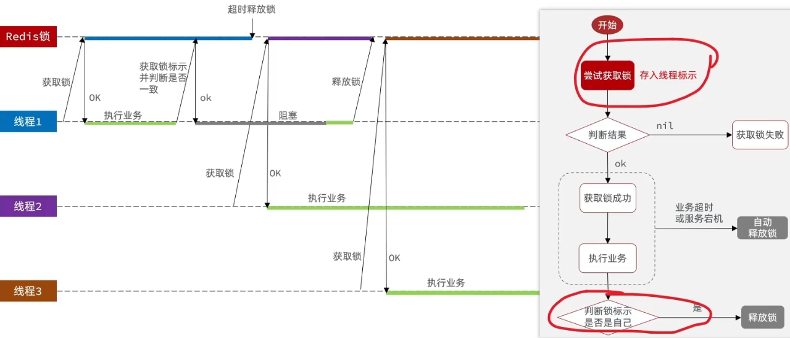


### 4.7 Lua脚本解决多条命令原子性问题

Redis提供了Lua脚本功能，在一个脚本中编写多条Redis命令，确保多条命令执行时的原子性。Lua是一 种编程语言，它的基本语法大家可以参考网站：https://www.runoob.com/lua/lua-tutorial.html，这里 重点介绍Redis提供的调用函数，我们可以使用lua去操作redis，又能保证他的原子性，这样就可以实现 拿锁比锁删锁是一个原子性动作了，作为Java程序员这一块并不作一个简单要求，并不需要大家过于精 通，只需要知道他有什么作用即可。

这里重点介绍Redis提供的调用函数，语法如下：

```lua
redis.call('命令名称', 'key', '其它参数', ...)
```

例如，我们要执行set name jack，则脚本是这样：

```lua
# 执行 set name jack
redis.call('set', 'name', 'jack')
```

例如，我们要先执行set name Rose，再执行get name，则脚本如下：

```lua
# 先执行 set name jack
redis.call('set', 'name', 'Rose')
# 再执行 get name
local name = redis.call('get', 'name')
# 返回
return name
```


写好脚本以后，需要用Redis命令来调用脚本，调用脚本的常见命令如下：

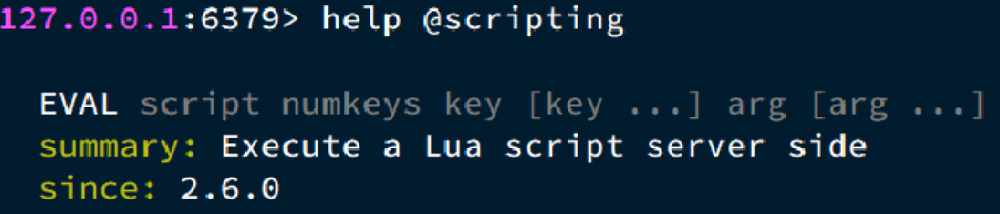

例如，我们要执行 redis.call('set', 'name', 'jack') 这个脚本，语法如下：


如果脚本中的key、value不想写死，可以作为参数传递。key类型参数会放入KEYS数组，其它参数会放 入ARGV数组，在脚本中可以从KEYS和ARGV数组获取这些参数：


接下来我们来回一下我们释放锁的逻辑：

释放锁的业务流程是这样的

1. 获取锁中的线程标示
2. 判断是否与指定的标示（当前线程标示）一致
3. 如果一致则释放锁（删除）
4. 如果不一致则什么都不做

如果用Lua脚本来表示则是这样的：
最终我们操作redis的拿锁比锁删锁的lua脚本就会变成这样

```lua
-- 这里的 KEYS[1] 就是锁的key，这里的ARGV[1] 就是当前线程标示
-- 获取锁中的标示，判断是否与当前线程标示一致
if (redis.call('GET', KEYS[1]) == ARGV[1]) then
	-- 一致，则删除锁
	return redis.call('DEL', KEYS[1])
end
-- 不一致，则直接返回
return 0
```


### 4.8 利用Java代码调用Lua脚本改造分布式锁

lua脚本本身并不需要大家花费太多时间去研究，只需要知道如何调用，大致是什么意思即可，所以在笔 记中并不会详细的去解释这些lua表达式的含义。

我们的RedisTemplate中，可以利用execute方法去执行lua脚本，参数对应关系就如下图股

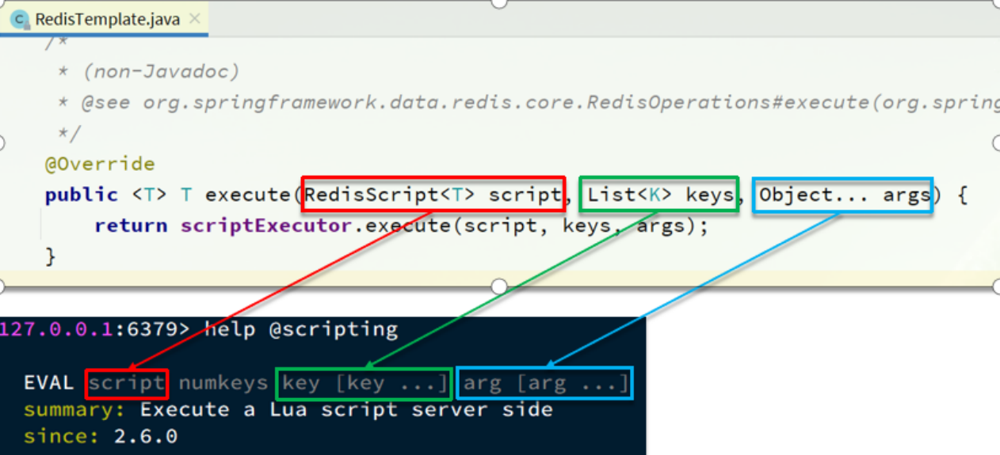

**Java代码**

```java
private static final DefaultRedisScript<Long> UNLOCK_SCRIPT;
    static {
        UNLOCK_SCRIPT = new DefaultRedisScript<>();
        UNLOCK_SCRIPT.setLocation(new ClassPathResource("unlock.lua"));
        UNLOCK_SCRIPT.setResultType(Long.class);
    }

public void unlock() {
    // 调用lua脚本
    stringRedisTemplate.execute(
        UNLOCK_SCRIPT,
        Collections.singletonList(KEY_PREFIX + name),
        ID_PREFIX + Thread.currentThread().getId());
}
//经过以上代码改造后，我们就能够实现 拿锁比锁删锁的原子性动作了~	
```


小总结：

基于Redis的分布式锁实现思路：

- 利用set nx ex获取锁，并设置过期时间，保存线程标示

- 释放锁时先判断线程标示是否与自己一致，一致则删除锁

  - 特性：

  - 利用set nx满足互斥性

  - 利用set ex保证故障时锁依然能释放，避免死锁，提高安全性

  - 利用Redis集群保证高可用和高并发特性

笔者总结：我们一路走来，利用添加过期时间，防止死锁问题的发生，但是有了过期时间之后，可能出 现误删别人锁的问题，这个问题我们开始是利用删之前 通过拿锁，比锁，删锁这个逻辑来解决的，也就 是删之前判断一下当前这把锁是否是属于自己的，但是现在还有原子性问题，也就是我们没法保证拿锁 比锁删锁是一个原子性的动作，最后通过lua表达式来解决这个问题

但是目前还剩下一个问题锁不住，什么是锁不住呢，你想一想，如果当过期时间到了之后，我们可以给 他续期一下，比如续个30s，就好像是网吧上网， 网费到了之后，然后说，来，网管，再给我来10块 的，是不是后边的问题都不会发生了，那么续期问题怎么解决呢，可以依赖于我们接下来要学习 redission啦


**测试逻辑：**

第一个线程进来，得到了锁，手动删除锁，模拟锁超时了，其他线程会执行lua来抢锁，当第一天线程利 用lua删除锁时，lua能保证他不能删除他的锁，第二个线程删除锁时，利用lua同样可以保证不会删除别 人的锁，同时还能保证原子性。


## 5、分布式锁-redission

### 5.1 分布式锁-redission功能介绍

基于setnx实现的分布式锁存在下面的问题：

**重入问题**：重入问题是指 获得锁的线程可以再次进入到相同的锁的代码块中，可重入锁的意义在于防止 死锁，比如HashTable这样的代码中，他的方法都是使用synchronized修饰的，假如他在一个方法内， 调用另一个方法，那么此时如果是不可重入的，不就死锁了吗？所以可重入锁他的主要意义是防止死 锁，我们的synchronized和Lock锁都是可重入的。

**不可重试**：是指目前的分布式只能尝试一次，我们认为合理的情况是：当线程在获得锁失败后，他应该 能再次尝试获得锁。

**超时释放**：我们在加锁时增加了过期时间，这样的我们可以防止死锁，但是如果卡顿的时间超长，虽然 我们采用了lua表达式防止删锁的时候，误删别人的锁，但是毕竟没有锁住，有安全隐患

**主从一致性**： 如果Redis提供了主从集群，当我们向集群写数据时，主机需要异步的将数据同步给从 机，而万一在同步过去之前，主机宕机了，就会出现死锁问题。

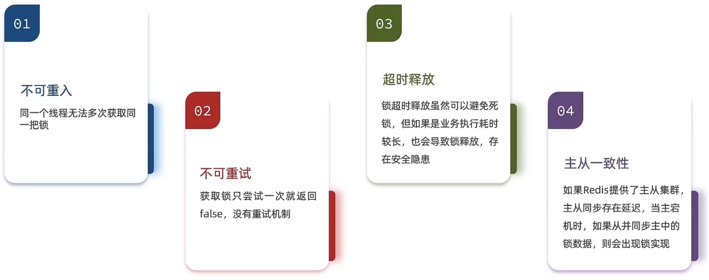


那么什么是Redission呢

Redisson是一个在Redis的基础上实现的Java驻内存数据网格（In-Memory Data Grid）。它不仅提供了 一系列的分布式的Java常用对象，还提供了许多分布式服务，其中就包含了各种分布式锁的实现。

Redission提供了分布式锁的多种多样的功能

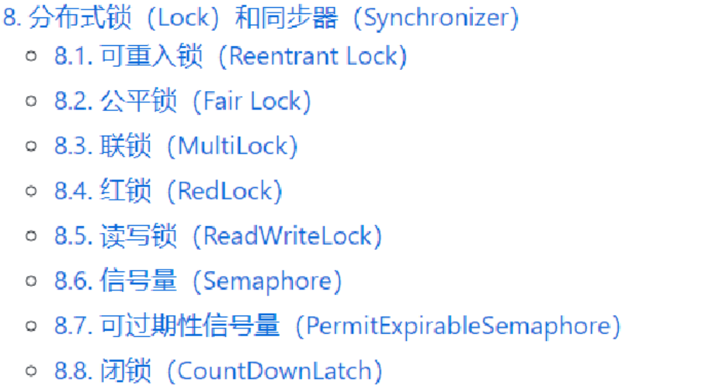


### 5.2 分布式锁-Redission快速入门

引入依赖：

```xml
<dependency>
    <groupId>org.redisson</groupId>
    <artifactId>redisson</artifactId>
    <version>3.13.6</version>
</dependency>
```

配置Redisson客户端：

```java
@Configuration
public class RedissonConfig {

    @Bean
    public RedissonClient redissonClient() {
        //配置
        Config config = new Config();
        config.useSingleServer().setAddress("redis://127.0.0.1:6379").setPassword("123456");
        //创建RedissonClient对象
        return Redisson.create(config);
    }

}
```

如何使用Redission的分布式锁

```java
@Resource
private RedissionClient redissonClient;

@Test
void testRedisson() throws Exception{
    //获取锁(可重入)，指定锁的名称
    RLock lock = redissonClient.getLock("anyLock");
    //尝试获取锁，参数分别是：获取锁的最大等待时间(期间会重试)，锁自动释放时间，时间单位
    boolean isLock = lock.tryLock(1,10,TimeUnit.SECONDS);
    //判断获取锁成功
    if(isLock){
        try{
        	System.out.println("执行业务");
        }finally{
            //释放锁
            lock.unlock();
        }
    }
}
```

在 VoucherOrderServiceImpl 注入RedissonClient

```java
@Override
public Result seckillVoucher(Long voucherId) {
    //1.查询优惠劵
    SeckillVoucher voucher = seckillVoucherService.getById(voucherId);

    //2.判断秒杀是否已经开始
    if (voucher.getBeginTime().isAfter(LocalDateTime.now())) {
        //尚未开始
        return Result.fail("秒杀尚未开始！");
    }

    //3.判断秒杀是否已经结束
    if (voucher.getEndTime().isBefore(LocalDateTime.now())) {
        //尚未开始
        return Result.fail("秒杀已经结束！");
    }

    //4.判断库存是否充足
    if (voucher.getStock() < 1) {
        //库存不足
        return Result.fail("库存不足！");
    }

    Long userId = UserHolder.getUser().getId();
    //创建锁对象
    //SimpleRedisLock lock = new SimpleRedisLock("order:" + userId, stringRedisTemplate);
    RLock lock = redissonClient.getLock("order:" + userId);
    //获取锁
    boolean isLock = lock.tryLock();
    //判断是否获取锁成功
    if(!isLock) {
        //获取锁失败，返回错误或重试
        return Result.fail("不允许重复下单");
    }

    try {
        //获取代理对象（事务）
        IVoucherOrderService proxy = (IVoucherOrderService) AopContext.currentProxy();
        return proxy.createVoucherOrder(voucherId);
    } finally {
        //释放锁
        lock.unlock();
    }

}
```


### 5.3 分布式锁-redission可重入锁原理

在Lock锁中，他是借助于底层的一个voaltile的一个state变量来记录重入的状态的，比如当前没有人持 有这把锁，那么state=0，假如有人持有这把锁，那么state=1，如果持有这把锁的人再次持有这把锁， 那么state就会+1 ，如果是对于synchronized而言，他在c语言代码中会有一个count，原理和state类 似，也是重入一次就加一，释放一次就-1 ，直到减少成0 时，表示当前这把锁没有被人持有。 


