# Spring5框架

## 课程内容介绍

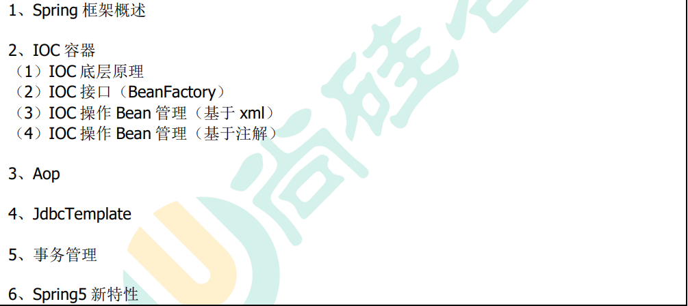


## Spring5 框架概述

1、Spring 是轻量级的开源的 JavaEE 框架
2、Spring 可以解决企业应用开发的复杂性
3、Spring 有两个核心部分：IOC 和 Aop
（1）IOC：控制反转，把创建对象过程交给 Spring 进行管理
（2）Aop：面向切面，不修改源代码进行功能增强
4、Spring 特点
（1）方便解耦，简化开发
（2）Aop 编程支持
（3）方便程序测试
（4）方便和其他框架进行整合
（5）方便进行事务操作
（6）降低 API 开发难度


## Spring5 入门案例

### 1. 下载Spring5 

[找到对应版本spring5.3.30](https://spring.io/projects/spring-framework#learn)

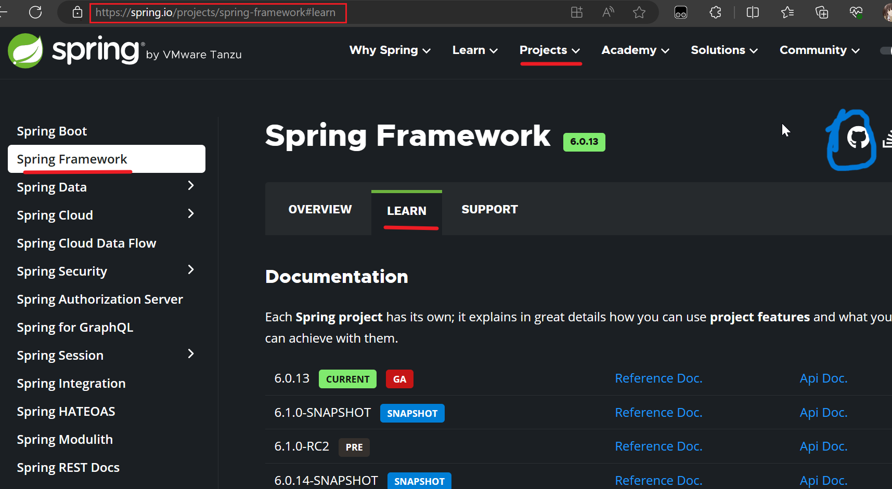

[点击如上githup找到](https://github.com/spring-projects/spring-framework)


[点击再进入再找到](https://github.com/spring-projects/spring-framework/wiki/Spring-Framework-Artifacts)

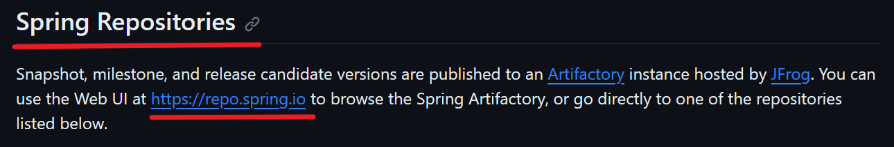

[点击再进入再找到](https://repo.spring.io/ui/repos/tree/General/plugins-release/org)

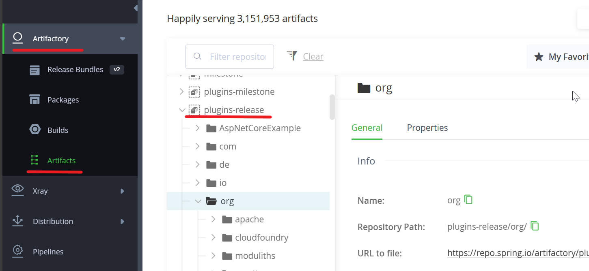

plugins-release/org/springframework/spring/

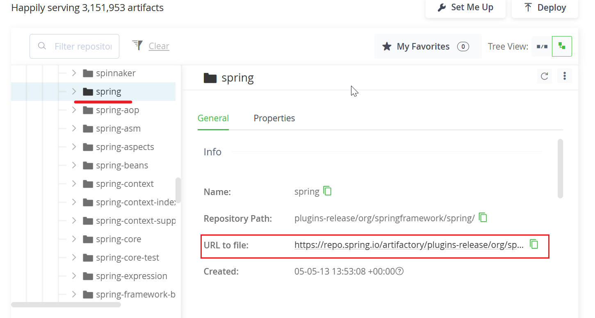

[点击再进入再找到](https://repo.spring.io/ui/native/plugins-release/org/springframework/spring/)

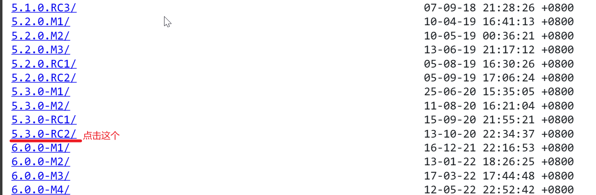

[点击再进入再找到](https://repo.spring.io/ui/native/plugins-release/org/springframework/spring/5.3.0-RC2/)

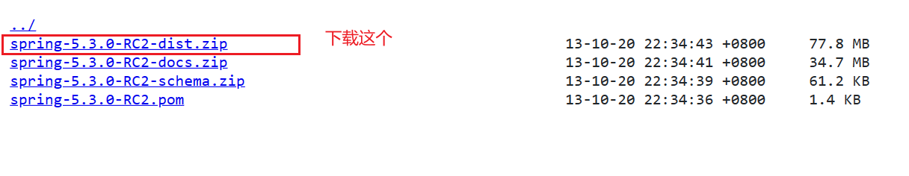


### 2. 打开 idea 工具，创建普通 java 工程

太简单，不写

### 3. 导入 Spring5 相关 jar 包


[commons-logging-1.1.1.jar](jar/commons-logging-1.1.1.jar)

[spring-beans-5.3.0-RC2.jar](jar/spring-beans-5.3.0-RC2.jar)

[spring-context-5.3.0-RC2.jar](jar/spring-context-5.3.0-RC2.jar)

[spring-core-5.3.0-RC2.jar](jar/spring-core-5.3.0-RC2.jar)

[spring-expression-5.3.0-RC2.jar](jar/spring-expression-5.3.0-RC2.jar)


### 4. 创建普通类，在这个类创建普通方法

```java
/* @author  i-s-j-h-d
 * @version 1.0 */
public class Main {
    public static void main(String[] args) {
        System.out.println("轻音少女");
    }
}
```


### 5. 创建Spring配置文件，在配置文件配置创建的对象

在xml中创建：

```xml
<?xml version="1.0" encoding="UTF-8"?>
<beans xmlns="http://www.springframework.org/schema/beans"
       xmlns:xsi="http://www.w3.org/2001/XMLSchema-instance"
       xsi:schemaLocation="http://www.springframework.org/schema/beans 
http://www.springframework.org/schema/beans/spring-beans.xsd">
    <!--配置 User 对象创建-->
    <bean id="user" class="com.atguigu.spring5_.User"></bean>
</beans>
```


### 6. 进行测试代码编写

```java
package com.atguigu.testdemo;

import com.atguigu.spring5_.User;
import org.junit.Test;
import org.springframework.context.ApplicationContext;
import org.springframework.context.support.ClassPathXmlApplicationContext;

/* @author  i-s-j-h-d
 * @version 1.0 */
public class TestSpring5 {
    @Test
    public void testAdd() {
        // 1.加载spring配置文件
        ApplicationContext context = new ClassPathXmlApplicationContext("bean1.xml");
        // 2.获取配置创建的对象
        User user = context.getBean("user", User.class);
        System.out.println(user);
        user.add();
    }
}
```


## IOC

### IOC（概念和原理）

1、什么是 IOC
（1）控制反转，把对象创建和对象之间的调用过程，交给 Spring 进行管理
（2）使用 IOC 目的：为了耦合度降低
（3）做入门案例就是 IOC 实现

2、IOC 底层原理
（1）xml 解析、工厂模式、反射

3、画图讲解 IOC 底层原理

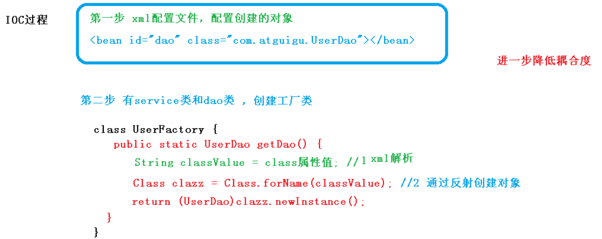


### IOC（BeanFactory 接口）

1、IOC 思想基于 IOC 容器完成，IOC 容器底层就是对象工厂

2、Spring 提供 IOC 容器实现两种方式：（两个接口）
	（1）BeanFactory：IOC 容器基本实现，是 Spring 内部的使用接口，不提供开发人员进行使用

​			加载配置文件时候不会创建对象，在获取对象（使用）才去创建对象

​	（2）ApplicationContext：BeanFactory 接口的子接口，提供更多更强大的功能，一般由开发人
员进行使用

​		加载配置文件时候就会把在配置文件对象进行创建

3、ApplicationContext 接口有实现类

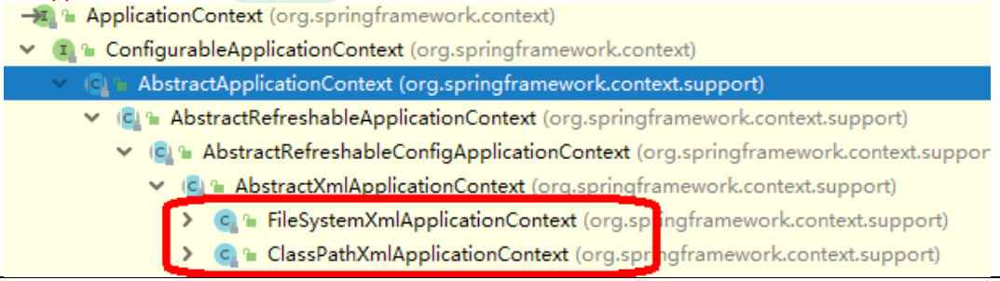


### IOC 操作 Bean 管理（概念）

1、什么是 Bean 管理
（0）Bean 管理指的是两个操作
（1）Spring 创建对象
（2）Spirng 注入属性

2、Bean 管理操作有两种方式
（1）基于 xml 配置文件方式实现
（2）基于注解方式实现


### IOC 操作 Bean 管理（基于 xml 方式）

#### 1、基于 xml 方式创建对象


​	（1）在 spring 配置文件中，使用 bean 标签，标签里面添加对应属性，就可以实现对象创建

​	（2）在 bean 标签有很多属性，介绍常用的属性

​			id 属性：唯一标识

​			class 属性：类全路径（包类路径）

​	（3）创建对象时候，默认也是执行无参数构造方法完成对象创建

#### 2、基于 xml 方式注入属性

​		DI：依赖注入，就是注入属性

#### 3、第一种注入方式：使用 set 方法进行注入

​	（1）创建类，定义属性和对应的 set 方法

```java
/**
* 演示使用 set 方法进行注入属性
*/
public class Book {
     //创建属性
     private String bname;
     private String bauthor;
     //创建属性对应的 set 方法
     public void setBname(String bname) {
    	 this.bname = bname;
     }
     public void setBauthor(String bauthor) {
    	 this.bauthor = bauthor;
     }
}
```

​	（2）在 spring 配置文件配置对象创建，配置属性注入

```xml
<?xml version="1.0" encoding="UTF-8"?>
<beans xmlns="http://www.springframework.org/schema/beans"
       xmlns:xsi="http://www.w3.org/2001/XMLSchema-instance"
       xsi:schemaLocation="http://www.springframework.org/schema/beans
http://www.springframework.org/schema/beans/spring-beans.xsd">
    <!--配置 User 对象创建-->
    <bean id="user" class="com.atguigu.spring5_.Book"></bean>

    <!--2 set 方法注入属性-->
    <bean id="book" class="com.atguigu.spring5_.Book">
        <!--使用 property 完成属性注入
        name：类里面属性名称
        value：向属性注入的值
        -->
        <property name="bname" value="易筋经"></property>
        <property name="bauthor" value="达摩老祖"></property>
    </bean>

</beans>
```


#### 4、第二种注入方式：使用有参数构造进行注入

（1）创建类，定义属性，创建属性对应有参数构造方法

```java
package com.atguigu.spring5_;

/* @author  i-s-j-h-d
 * @version 1.0
 * 使用有参数构造注入
 * */
public class Orders {
    // 属性
    private String oname;
    private String address;
    // 有参数构造
    public Orders(String oname, String address) {
        this.oname = oname;
        this.address = address;
    }

    public void text() {
        System.out.println(oname + "-" + address);
    }

}
```


（2）在 spring 配置文件中进行配置

```xml
<!-- 有参数构造注入属性 -->
<bean id="orders" class="com.atguigu.spring5_.Orders">
    <constructor-arg name="oname" value="电脑"></constructor-arg>
    <constructor-arg name="address" value="china"></constructor-arg>
</bean>
```


#### 5、p 名称空间注入（了解）

（1）使用 p 名称空间注入，可以简化基于  set 方法进行注入 xml 配置方式

第一步 添加 p 名称空间在配置文件中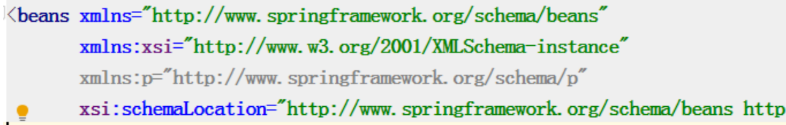

第二步 进行属性注入，在 bean 标签里面进行操作

```xml
<!--2 set 方法注入属性-->
<bean id="book" class="com.atguigu.spring5.Book" p:bname="九阳神功" 
p:bauthor="无名氏"></bean>
```


### IOC 操作 Bean 管理（xml 注入其他类型属性）

#### 1、字面量

​	（1）null 值

​		（2）属性值包含特殊符号

```xml
<!--属性值包含特殊符号
    1、把<>进行转义 &lt; &gt;
    2、把带特殊符号内容写到 CDATA
-->
<property name="address">
    <value><![CDATA[<<南京>>]]></value>
</property>
```


#### 2、注入属性-外部 bean

​	（1）创建两个类 service 类和 dao 类
​	（2）在 service 调用 dao 里面的方法
​	（3）在 spring 配置文件中进行配置

```java
package com.atguigu.service;

import com.atguigu.dao.UserDao;

/* @author  i-s-j-h-d
 * @version 1.0 */
public class UserService {
    // 创建 UserDao 类型属性，生成 set 方法
    private UserDao userDao;
    public void setUserDao(UserDao userDao) {
        this.userDao = userDao;
    }

    public void add() {
        System.out.println("service add......");
        userDao.update();
    }
}
```

```xml
<?xml version="1.0" encoding="UTF-8"?>
<beans xmlns="http://www.springframework.org/schema/beans"
       xmlns:xsi="http://www.w3.org/2001/XMLSchema-instance"
       xsi:schemaLocation="http://www.springframework.org/schema/beans
http://www.springframework.org/schema/beans/spring-beans.xsd">

    <!-- 1、service 和 dao 对象创建 -->
    <bean id="userService" class="com.atguigu.service.UserService">
        <!--
            注入 userDao 对象
            name属性：类里面属性名称
            ref属性：创建 userDao 对象 bean 标签 id 值
        -->
        <property name="userDao" ref="userDaoImpl"></property>
    </bean>
    <bean id="userDaoImpl" class="com.atguigu.dao.UserDaoImpl"></bean>
</beans>  
```


#### 3、注入属性-内部 bean

（1）一对多关系：部门和员工
	一个部门有多个员工，一个员工属于一个部门
	部门是一，员工是多
（2）在实体类之间表示一对多关系，员工表示所属部门，使用对象类型属性进行表示

```java
package com.atguigu.spring5_.bean;

/* @author  i-s-j-h-d
 * @version 1.0
 * 部门类
 * */
public class Dept {
    private String dname;

    public void setDname(String dname) {
        this.dname = dname;
    }

    @Override
    public String toString() {
        return "Dept{" +
                "dname='" + dname + '\'' +
                '}';
    }
}
```

```java
package com.atguigu.spring5_.bean;

/* @author  i-s-j-h-d
 * @version 1.0
 * 员工类
 * */
public class Emp {
    private String ename;
    private String gender;
    // 员工属于某一个部门，使用对象形式表示
    private Dept dept;

    public void setDept(Dept dept) {
        this.dept = dept;
    }

    public void setEname(String ename) {
        this.ename = ename;
    }

    public void setGender(String gender) {
        this.gender = gender;
    }
}
```


（3）在 spring 配置文件中进行配置

```xml
<!-- 内部bean -->
<bean id="emp" class="com.atguigu.spring5_.bean.Emp">
    <!-- 设置两个普通属性 -->
    <property name="ename" value="平泽唯"></property>
    <property name="gender" value="女"></property>
    <!-- 设置对象类型属性 -->
    <property name="dept">
        <bean id="dept" class="com.atguigu.spring5_.bean.Dept">
            <property name="dname" value="轻音部"></property>
        </bean>
    </property>
</bean>
```


#### 4、注入属性-级联赋值  

（1）第一种写法

```xml
<!-- 一级联赋值 -->
<bean id="emp" class="com.atguigu.spring5_.bean.Emp">
    <!-- 设置两个普通属性 -->
    <property name="ename" value="秋山澪"></property>
    <property name="gender" value="女"></property>
    <!-- 一级联赋值 -->
    <property name="dept" ref="dept"></property>
</bean>
<bean id="dept" class="com.atguigu.spring5_.bean.Dept">
    <property name="dname" value="k-no"></property>
</bean>
```

（2）第二种写法

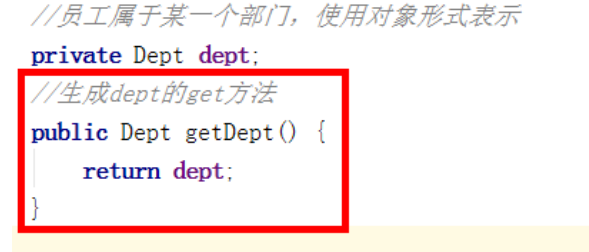

```xml
<!--一级联赋值-->
    <bean id="emp" class="com.atguigu.spring5_.bean.Emp">
        <!--设置两个普通属性-->
        <property name="ename" value="lucy"></property>
        <property name="gender" value="女"></property>
        <property name="dept" ref="dept"></property>
        <property name="dept.dname" value="轻音部"></property>
    </bean>
    <bean id="dept" class="com.atguigu.spring5_.bean.Dept">
<!--        <property name="dname" value="k-no"></property>-->
    </bean>
```


### IOC 操作 Bean 管理（xml 注入集合属性）

1、注入数组类型属性
2、注入 List 集合类型属性
3、注入 Map 集合类型属性

（1）创建类，定义数组、list、map、set 类型属性，生成对应 set 方法

```java
package com.atguigu.spring5.collectiontype;

import java.util.Arrays;
import java.util.List;
import java.util.Map;
import java.util.Set;

/* @author  i-s-j-h-d
 * @version 1.0 */
public class Stu {
    //1. 数组类型属性
    private String[] courses;
    //2. list集合类型属性
    private List<String> list;
    //3. map集合类型属性
    private Map<String,String> maps;
    //4. set集合类型属性
    private Set<String> sets;

    public void setCourses(String[] courses) {
        this.courses = courses;
    }

    public void setList(List<String> list) {
        this.list = list;
    }

    public void setMaps(Map<String, String> maps) {
        this.maps = maps;
    }

    public void setSets(Set<String> sets) {
        this.sets = sets;
    }

    public void add() {
        System.out.println(Arrays.toString(courses));
        System.out.println(list);
        System.out.println(maps);
        System.out.println(sets);
    }

}
```

（2）在 spring 配置文件进行配置

```xml
<!-- 集合类型属性注入 -->
<bean id="stu" class="com.atguigu.spring5.collectiontype.Stu">
    <!-- 数组类型属性注入 -->
    <property name="courses">
        <array>
            <value>java课程</value>
            <value>数据库课程</value>
        </array>
    </property>
    <!--list类型属性注入-->
    <property name="list">
        <list>
            <value>张三</value>
            <value>小三</value>
        </list>
    </property>
    <!--map类型属性注入-->
    <property name="maps">
        <map>
            <entry key="JAVA" value="java"></entry>
            <entry key="PHP" value="php"></entry>
        </map>
    </property>
    <!--set类型属性注入-->
    <property name="sets">
        <set>
            <value>MySQL</value>
            <value>Redis</value>
        </set>
    </property>
</bean>
```


4、在集合里面设置对象类型值

```xml
<!--创建多个 course 对象-->
<bean id="course1" class="com.atguigu.spring5.collectiontype.Course">
    <property name="cname" value="Spring5 框架"></property>
</bean>
<bean id="course2" class="com.atguigu.spring5.collectiontype.Course">
    <property name="cname" value="MyBatis 框架"></property>
</bean>
<bean>
    <!--注入 list 集合类型，值是对象-->
        <property name="courseList">
            <list>
                <ref bean="course1"></ref>
                <ref bean="course2"></ref>
            </list>
        </property>
</bean>
```


5、把集合注入部分提取出来

（1）在 spring 配置文件中引入名称空间 util

```xml
<?xml version="1.0" encoding="UTF-8"?>
<beans xmlns="http://www.springframework.org/schema/beans"
       xmlns:xsi="http://www.w3.org/2001/XMLSchema-instance"
       xmlns:p="http://www.springframework.org/schema/p"
       xmlns:util="http://www.springframework.org/schema/util"
       xsi:schemaLocation="http://www.springframework.org/schema/beans
http://www.springframework.org/schema/beans/spring-beans.xsd
 http://www.springframework.org/schema/util
http://www.springframework.org/schema/util/spring-util.xsd">
    
</beans>  
```

（2）使用 util 标签完成 list 集合注入提取

```xml
<!-- 1.提取util标签完成list集合注入提取 -->
<util:list id="bookList">
    <value>易筋经</value>
    <value>九阴真经</value>
    <value>九阳神功</value>
</util:list>
<!--2.提取list集合类型属性注入使用-->
<bean id="book" class="com.atguigu.spring5.collectiontype.Book">
    <property name="list" ref="bookList"></property>
</bean>
```


### IOC 操作 Bean 管理（FactoryBean）

1、Spring 有两种类型 bean，一种普通 bean，另外一种工厂 bean（FactoryBean）
2、普通 bean：在配置文件中定义 bean 类型就是返回类型
3、工厂 bean：在配置文件定义 bean 类型可以和返回类型不一样
	第一步 创建类，让这个类作为工厂 bean，实现接口 FactoryBean
	第二步 实现接口里面的方法，在实现的方法中定义返回的 bean 类型

```java
package com.atguigu.spring5.factorybean;

import com.atguigu.spring5.collectiontype.Course;
import org.springframework.beans.factory.FactoryBean;

/* @author  i-s-j-h-d
 * @version 1.0 */
public class MyBean implements FactoryBean<Course> {
    @Override
    public Course getObject() throws Exception {
        Course course = new Course();
        course.setCname("abc");
        return course;
    }

    @Override
    public Class<?> getObjectType() {
        return null;
    }

    @Override
    public boolean isSingleton() {
        return FactoryBean.super.isSingleton();
    }
}
```

```xml
<bean id="myBean" class="com.atguigu.spring5.factorybean.MyBean">

</bean>
```

```java
@Test
public void test3() {
    ApplicationContext context = new ClassPathXmlApplicationContext("bean3.xml");
    Course course = context.getBean("myBean",Course.class);
    System.out.println(course);
}
```


### IOC 操作 Bean 管理（bean 作用域）

1、在 Spring 里面，设置创建 bean 实例是单实例还是多实例
2、在 Spring 里面，默认情况下，bean 是单实例对象

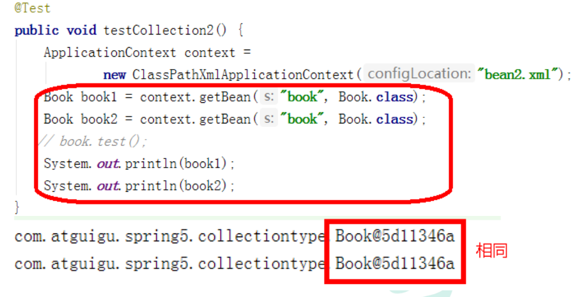

3、如何设置单实例还是多实例
（1）在 spring 配置文件 bean 标签里面有属性（scope）用于设置单实例还是多实例
（2）scope 属性值
第一个值 默认值，singleton，表示是单实例对象
第二个值 prototype，表示是多实例对象

（3）singleton 和 prototype 区别
第一 singleton 单实例，prototype 多实例
第二 设置 scope 值是 singleton 时候，加载 spring 配置文件时候就会创建单实例对象
 		设置 scope 值是 prototype 时候，不是在加载 spring 配置文件时候创建 对象，在调用getBean 方法时候创建多实例对象


### IOC 操作 Bean 管理（bean 生命周期）

1、生命周期
（1）从对象创建到对象销毁的过程

2、bean 生命周期
（1）通过构造器创建 bean 实例（无参数构造）
（2）为 bean 的属性设置值和对其他 bean 引用（调用 set 方法）
（3）调用 bean 的初始化的方法（需要进行配置初始化的方法）
（4）bean 可以使用了（对象获取到了）
（5）当容器关闭时候，调用 bean 的销毁的方法（需要进行配置销毁的方法）

3、演示 bean 生命周期

```java
public class Orders {

    // 无参构造器
    public Orders() {
        System.out.println("第一步 执行无参数构造创建 bean 实例");
    }

    private String oname;

    public void setOname(String oname) {
        this.oname = oname;
        System.out.println("第二步 调用 set 方法设置属性值");
    }

    // 创建执行的初始化的方法
    public void initMethod() {
        System.out.println("第三步 执行初始化的方法");
    }
    // 创建执行的销毁的方法
    public void destroyMethod() {
        System.out.println("第五步 执行销毁的方法");
    }
}
```

```xml
<bean id="orders" class="com.atguigu.spring5.collectiontype.Orders" init-method="initMethod" destroy-method="destroyMethod">
    <property name="oname" value="手机"></property>
</bean>
```

```java
    @Test
    public void test4() {
//        ApplicationContext context = new ClassPathXmlApplicationContext("bean4.xml");
        ClassPathXmlApplicationContext context = new ClassPathXmlApplicationContext("bean4.xml");
        Orders orders = context.getBean("orders", Orders.class);
        System.out.println("第四步 获取创建 bean 实例对象");
        System.out.println(orders);
        // 手动让bean实例销毁
        context.close();
    }
```

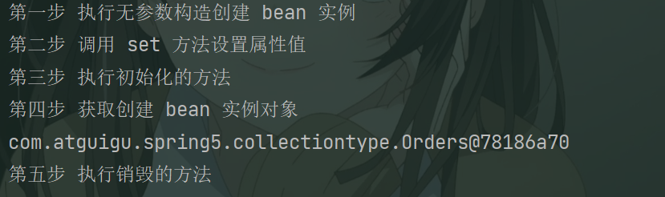

4、bean 的后置处理器，bean 生命周期有七步
（1）通过构造器创建 bean 实例（无参数构造）
（2）为 bean 的属性设置值和对其他 bean 引用（调用 set 方法）
（3）把 bean 实例传递 bean 后置处理器的方法 postProcessBeforeInitialization 
（4）调用 bean 的初始化的方法（需要进行配置初始化的方法）
（5）把 bean 实例传递 bean 后置处理器的方法 postProcessAfterInitialization
（6）bean 可以使用了（对象获取到了）
（7）当容器关闭时候，调用 bean 的销毁的方法（需要进行配置销毁的方法）

5、演示添加后置处理器效果
（1）创建类，实现接口 BeanPostProcessor，创建后置处理器

```java
package com.atguigu.spring5.collectiontype;

import org.springframework.beans.BeansException;
import org.springframework.beans.factory.config.BeanPostProcessor;

/* @author  i-s-j-h-d
 * @version 1.0 */
public class MyBeanPost implements BeanPostProcessor {
    @Override
    public Object postProcessBeforeInitialization(Object bean, String beanName)
            throws BeansException {
        System.out.println("在初始化之前执行的方法");
        return bean;
    }
    @Override
    public Object postProcessAfterInitialization(Object bean, String beanName)
            throws BeansException {
        System.out.println("在初始化之后执行的方法");
        return bean;
    }
}
```

```xml
<!--配置后置处理器-->
<bean id="myBeanPost" class="com.atguigu.spring5.collectiontype.MyBeanPost">
</bean>
```

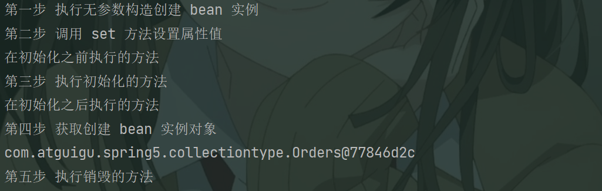


### IOC 操作 Bean 管理（xml 自动装配）

1、什么是自动装配
（1）根据指定装配规则（属性名称或者属性类型），Spring 自动将匹配的属性值进行注入

2、演示自动装配过程
（1）根据属性名称自动注入

```xml
<!--实现自动装配
     bean 标签属性 autowire，配置自动装配
     autowire 属性常用两个值：
        byName 根据属性名称注入 ，注入值 bean 的 id 值和类属性名称一样
        byType 根据属性类型注入
    -->
    <bean id="emp" class="com.atguigu.spring5.autowire.Emp" autowire="byName">
<!--        <property name="dept" ref="dept"></property>-->
    </bean>
    <bean id="dept" class="com.atguigu.spring5.autowire.Dept"></bean>
```

（2）根据属性类型自动注入

```xml
  <!--实现自动装配
     bean 标签属性 autowire，配置自动装配
     autowire 属性常用两个值：
        byName 根据属性名称注入 ，注入值 bean 的 id 值和类属性名称一样
        byType 根据属性类型注入
    -->
    <bean id="emp" class="com.atguigu.spring5.autowire.Emp" autowire="byType">
<!--        <property name="dept" ref="dept"></property>-->
    </bean>
    <bean id="dept" class="com.atguigu.spring5.autowire.Dept"></bean>
```


### IOC 操作 Bean 管理（外部属性文件）

1、直接配置数据库信息
（1）配置德鲁伊连接池
（2）引入德鲁伊连接池依赖 jar 包

[druid-1.1.9.jar](jar/druid-1.1.9.jar)

```xml
<!--直接配置连接池-->
<bean id="dataSource" class="com.alibaba.druid.pool.DruidDataSource">
    <property name="driverClassName" value="com.mysql.jdbc.Driver"></property>
    <property name="url" value="jdbc:mysql://localhost:3306/book"></property>
    <property name="username" value="root"></property>
    <property name="password" value="hsp"></property>
</bean>
```


2、引入外部属性文件配置数据库连接池
（1）创建外部属性文件，properties 格式文件，写数据库信息

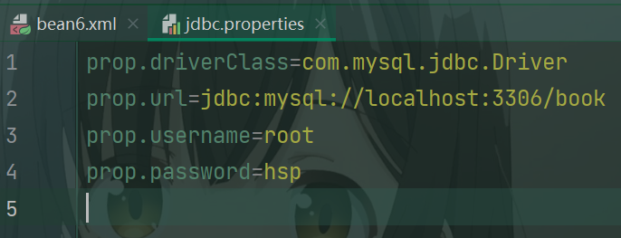

（2）把外部 properties 属性文件引入到 spring 配置文件中

* 引入 context 名称空间

```xml
<?xml version="1.0" encoding="UTF-8"?>
<beans xmlns="http://www.springframework.org/schema/beans"
       xmlns:xsi="http://www.w3.org/2001/XMLSchema-instance"
       xmlns:context="http://www.springframework.org/schema/context"
       xsi:schemaLocation="http://www.springframework.org/schema/beans
http://www.springframework.org/schema/beans/spring-beans.xsd
http://www.springframework.org/schema/context
http://www.springframework.org/schema/context/spring-context.xsd">

</beans>
```

-  在 spring 配置文件使用标签引入外部属性文件


```xml
<!--引入外部属性文件-->
<context:property-placeholder location="classpath:jdbc.properties"/>
<!--配置连接池-->
<bean id="dataSource" class="com.alibaba.druid.pool.DruidDataSource">
    <property name="driverClassName" value="${prop.driverClass}"></property>
    <property name="url" value="${prop.url}"></property>
    <property name="username" value="${prop.username}"></property>
    <property name="password" value="${prop.password}"></property>
</bean>
```


### IOC 操作 Bean 管理（基于注解方式）

#### 1、什么是注解

（1）注解是代码特殊标记，格式：@注解名称(属性名称=属性值, 属性名称=属性值..)
（2）使用注解，注解作用在类上面，方法上面，属性上面
（3）使用注解目的：简化 xml 配置

#### 2、Spring 针对 Bean 管理中创建对象提供注解

（1）@Component，将当前的组件标识为普通组件
（2）@Service，将当前的组件标识为业务层组件
（3）@Controller，将当前的组件标识为控制层组件
（4）@Repository，将当前的组件标识为持久层组件

* 上面四个注解功能是一样的，都可以用来创建 bean 实例

#### 3、基于注解方式实现对象创建

   第一步 引入依赖

[jar/spring-aop-5.3.0-RC2.jar](spring-aop-5.3.0-RC2.jar)

   第二步 开启组件扫描

```xml
<?xml version="1.0" encoding="UTF-8"?>
<beans xmlns="http://www.springframework.org/schema/beans"
       xmlns:xsi="http://www.w3.org/2001/XMLSchema-instance"
       xmlns:context="http://www.springframework.org/schema/context"
       xsi:schemaLocation="http://www.springframework.org/schema/beans
http://www.springframework.org/schema/beans/spring-beans.xsd
http://www.springframework.org/schema/context
http://www.springframework.org/schema/context/spring-context.xsd">

    <!--开启组件扫描
     1 如果扫描多个包，多个包使用逗号隔开
     2 扫描包上层目录
    -->
    <context:component-scan base-package="com.atguigu"></context:component-scan>

</beans>  
```

   第三步 创建类，在类上面添加创建对象注解

```java
/* @author  i-s-j-h-d
 * @version 1.0 */
//在注解里面 value 属性值可以省略不写，
//默认值是类名称，首字母小写
//UserService -- userService
@Component(value = "userService") // <bean id="userService" class=".."/>
public class UserService {

    public void add() {
        System.out.println("service add.....");
    }
}
```


#### 4、开启组件扫描细节配置

```xml
<!--示例 1
 	use-default-filters="false" 表示现在不使用默认 filter，自己配置 filter
 	context:include-filter ，设置扫描哪些内容
-->
<context:component-scan base-package="com.atguigu" use-default-filters="false">
 	<context:include-filter type="annotation" 
	expression="org.springframework.stereotype.Controller"/>
</context:component-scan>

<!--示例 2
 	下面配置扫描包所有内容
 	context:exclude-filter： 设置哪些内容不进行扫描
-->
<context:component-scan base-package="com.atguigu">
 	<context:exclude-filter type="annotation" 
 	expression="org.springframework.stereotype.Controller"/>
</context:component-scan>
```


#### 5、基于注解方式实现属性注入

（1）@Autowired：根据属性类型进行自动装配
第一步 把 service 和 dao 对象创建，在 service 和 dao 类添加创建对象注解
第二步 在 service 注入 dao 对象，在 service 类添加 dao 类型属性，在属性上面使用注解

```java
@Repository
public class UserDaoImpl implements UserDao{

    @Override
    public void add() {
        System.out.println("dao add......");
    }
}
```

```java
@Service
public class UserService {

    //定义 dao 类型属性
    //不需要添加 set 方法
    //添加注入属性注解
    @Autowired
    private UserDao userDao;

    public void add() {
        System.out.println("service add.....");
        userDao.add();
    }
}
```


（2）@Qualifier：根据名称进行注入
这个@Qualifier 注解的使用，和上面@Autowired 一起使用

```java
@Repository(value="userDaoImpl1")
public class UserDaoImpl implements UserDao{

    @Override
    public void add() {
        System.out.println("dao add......");
    }
}
```

```java
@Service
public class UserService {

    //定义 dao 类型属性
    //不需要添加 set 方法
    //添加注入属性注解
    @Autowired // 根据类型进行注入
    @Qualifier(value = "userDaoImpl1") // 根据名称进行注入
    private UserDao userDao;

    public void add() {
        System.out.println("service add.....");
        userDao.add();
    }
}
```


（3）@Resource：可以根据类型注入，可以根据名称注入

```java
//@Resource //根据类型进行注入
@Resource(name = "userDaoImpl1") //根据名称进行注入
private UserDao userDao;
```


（4）@Value：注入普通类型属性

```java
@Value(value = "abc")
private String name;
```


#### 6、完全注解开发

（1）创建配置类，替代 xml 配置文件

```java
@Configuration // 作为配置类，代替xml配置文件
@ComponentScan(basePackages={"com.atguigu"})
public class SpringConfig {
}
```

（2）编写测试类

```java
@Test
public void testService2() {
    ApplicationContext context = new AnnotationConfigApplicationContext(SpringConfig.class);
    UserService userService = context.getBean("userService", UserService.class);
    System.out.println(userService);
    userService.add();
}
```


## AOP

### 概念

1、什么是 AOP
（1）面向切面编程（方面），利用 AOP 可以对业务逻辑的各个部分进行隔离，从而使得业务逻辑各部分之间的耦合度降低，提高程序的可重用性，同时提高了开发的效率。
（2）通俗描述：不通过修改源代码方式，在主干功能里面添加新功能
（3）使用登录例子说明 AOP

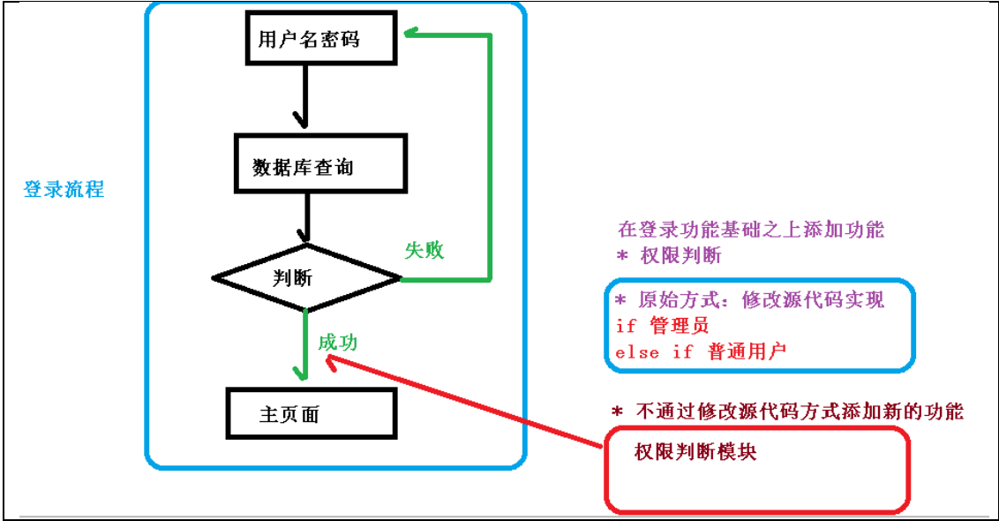


### 底层原理

1、AOP 底层使用动态代理
（1）有两种情况动态代理
第一种 有接口情况，使用 JDK 动态代理
⚫ 创建接口实现类代理对象，增强类的方法

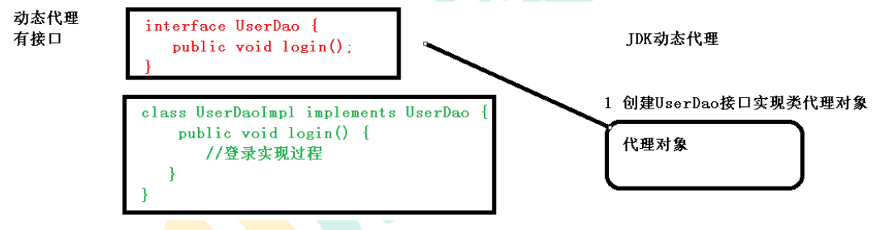

第二种 没有接口情况，使用 CGLIB 动态代理
⚫ 创建子类的代理对象，增强类的方法

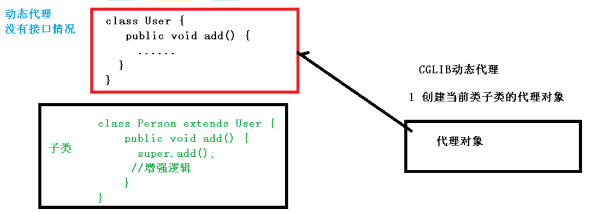


### AOP（JDK 动态代理）

1、使用 JDK 动态代理，使用 Proxy 类里面的方法创建代理对象

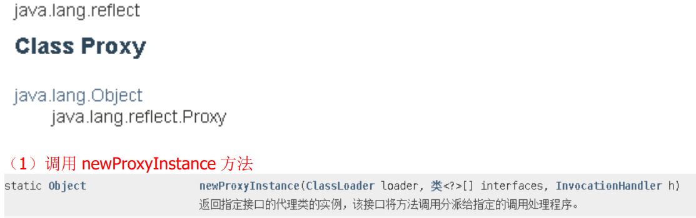

方法有三个参数：
第一参数，类加载器
第二参数，增强方法所在的类，这个类实现的接口，支持多个接口
第三参数，实现这个接口 InvocationHandler，创建代理对象，写增强的部分


2、编写 JDK 动态代理代码
（1）创建接口，定义方法

```java
public interface UserDao {
    public int add(int a, int b);
    public String update(String id);
}
```

（2）创建接口实现类，实现方法

```java
public class UserDaoImpl implements UserDao{

    @Override
    public int add(int a, int b) {
        return a+b;
    }

    @Override
    public String update(String id) {
        return id;
    }
}
```


（3）使用 Proxy 类创建接口代理对象

```java
public class JDKProxy {
    public static void main(String[] args) {
        // 创建接口实现类代理对象
        Class[] interfaces = {UserDao.class};
        // Proxy.newProxyInstance(JDKProxy.class.getClassLoader(), interfaces,new InvocationHandler() {
        //          @Override
        //          public Object invoke(Object proxy, Method method, Object[] args) throws Throwable {
        //                  return null;
        //          }
        // });
        UserDaoImpl userDao = new UserDaoImpl();
        UserDao dao = (UserDao) Proxy.newProxyInstance(JDKProxy.class.getClassLoader(), interfaces, new UserDaoProxy(userDao));

        String result = dao.update("wj");
        System.out.println("result:"+result);
    }
}
// 创建代理对象代码
class UserDaoProxy implements InvocationHandler {

    //1 把创建的是谁的代理对象，把谁传递过来
    //有参数构造传递
    private Object obj;
    public UserDaoProxy(Object obj) {
        this.obj = obj;
    }

    //增强的逻辑
    @Override
    public Object invoke(Object proxy, Method method, Object[] args) throws Throwable {
        //方法之前
        System.out.println("方法之前执行...."+method.getName()+" :传递的参数..."+ Arrays.toString(args));
        //被增强的方法执行
        Object res = method.invoke(obj, args);
        //方法之后
        System.out.println("方法之后执行...."+obj);
        return res;
    }
}
```


### AOP（术语）

1、连接点

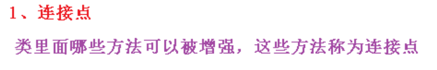

2、切入点


3、通知（增强）

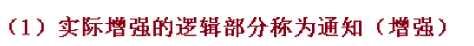


4、切面


### AOP 操作（准备工作）

1、Spring 框架一般都是基于 AspectJ 实现 AOP 操作
（1）AspectJ 不是 Spring 组成部分，独立 AOP 框架，一般把 AspectJ 和 Spirng 框架一起使用，进行 AOP 操作

2、基于 AspectJ 实现 AOP 操作
（1）基于 xml 配置文件实现
（2）基于注解方式实现（使用）

3、在项目工程里面引入 AOP 相关依赖

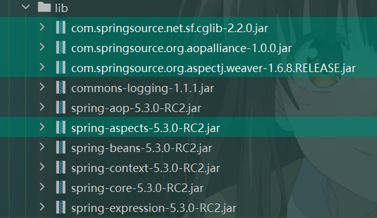

[com.springsource.net.sf.cglib-2.2.0.jar](jar/com.springsource.net.sf.cglib-2.2.0.jar)

[com.springsource.org.aopalliance-1.0.0.jar](jar/com.springsource.org.aopalliance-1.0.0.jar)

[com.springsource.org.aspectj.weaver-1.6.8.RELEASE.jar](jar/com.springsource.org.aspectj.weaver-1.6.8.RELEASE,jar)

[spring-aspects-5.3.0-RC2.jar](jar/spring-aspects-5.3.0-RC2.jar)

4、切入点表达式
（1）切入点表达式作用：知道对哪个类里面的哪个方法进行增强
（2）语法结构： execution([权限修饰符] [返回类型] [类全路径] [方法名称]([参数列表]) )
	

```java
举例 1：对 com.atguigu.dao.BookDao 类里面的 add 进行增强
	execution(* com.atguigu.dao.BookDao.add(..))
举例 2：对 com.atguigu.dao.BookDao 类里面的所有的方法进行增强
	execution(* com.atguigu.dao.BookDao.* (..))
举例 3：对 com.atguigu.dao 包里面所有类，类里面所有方法进行增强
	execution(* com.atguigu.dao.*.* (..))
```


### AOP 操作（AspectJ 注解）

1、创建类，在类里面定义方法

```java
public class User {
    public void add() {
        System.out.println("add...");
    }
}
```

2、创建增强类（编写增强逻辑）
（1）在增强类里面，创建方法，让不同方法代表不同通知类型

```java
// 增强的类
public class UserProxy {
    public void before() { // 前置通知
        System.out.println("before....");
    }
}
```

3、进行通知的配置
（1）在 spring 配置文件中，开启注解扫描

```xml
<?xml version="1.0" encoding="UTF-8"?>
<beans xmlns="http://www.springframework.org/schema/beans"
       xmlns:xsi="http://www.w3.org/2001/XMLSchema-instance"
       xmlns:context="http://www.springframework.org/schema/context"
       xmlns:aop="http://www.springframework.org/schema/aop"
       xsi:schemaLocation="http://www.springframework.org/schema/beans
http://www.springframework.org/schema/beans/spring-beans.xsd
http://www.springframework.org/schema/context
http://www.springframework.org/schema/context/spring-context.xsd
http://www.springframework.org/schema/aop
http://www.springframework.org/schema/aop/spring-aop.xsd">

    <!--开启注解扫描-->
    <context:component-scan base-package="com.atguigu.spring5.aopanno"></context:component-scan>
</beans>  
```

（2）使用注解创建 User 和 UserProxy 对象

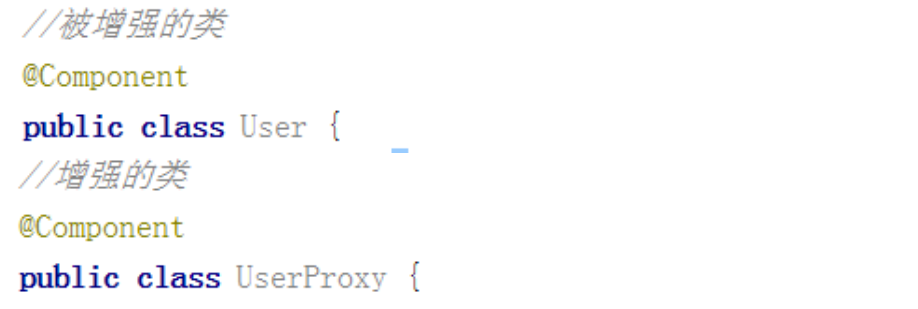

（3）在增强类上面添加注解 @Aspect

```java
// 增强的类
@Component
@Aspect // 生成代理对象
public class UserProxy {
    public void before() { // 前置通知
        System.out.println("before....");
    }
}
```

（4）在 spring 配置文件中开启生成代理对象

```xml
<!--开启Aspect生成代理对象-->
<aop:aspectj-autoproxy></aop:aspectj-autoproxy>
```

4、配置不同类型的通知
（1）在增强类的里面，在作为通知方法上面添加通知类型注解，使用切入点表达式配置

```java
// 增强的类
@Component
@Aspect // 生成代理对象
public class UserProxy {
    //前置通知
    //@Before 注解表示作为前置通知
    @Before(value = "execution(* com.atguigu.spring5.aopanno.User.add(..))")
    public void before() {
        System.out.println("before.........");
    }

    //后置通知（返回通知）
    @AfterReturning(value = "execution(* com.atguigu.spring5.aopanno.User.add(..))")
    public void afterReturning() {
        System.out.println("afterReturning.........");
    }

    //最终通知
    @After(value = "execution(* com.atguigu.spring5.aopanno.User.add(..))")
    public void after() {
        System.out.println("after.........");
    }

    //异常通知
    @AfterThrowing(value = "execution(* com.atguigu.spring5.aopanno.User.add(..))")
    public void afterThrowing() {
        System.out.println("afterThrowing.........");
    }

    //环绕通知
    @Around(value = "execution(* com.atguigu.spring5.aopanno.User.add(..))")
    public void around(ProceedingJoinPoint proceedingJoinPoint) throws
            Throwable {
        System.out.println("环绕之前.........");
        //被增强的方法执行
        proceedingJoinPoint.proceed();
        System.out.println("环绕之后.........");
    }
}
```


5、相同的切入点抽取

```java
// 增强的类
@Component
@Aspect // 生成代理对象
public class UserProxy {

    // 相同切入点抽取
    @Pointcut(value = "execution(* com.atguigu.spring5.aopanno.User.add(..))")
    public void pointDemo() {
    }

    //前置通知
    //@Before 注解表示作为前置通知
    @Before(value = "pointDemo()")
    public void before() {
        System.out.println("before.........");
    }
}    
```


6、有多个增强类多同一个方法进行增强，设置增强类优先级
（1）在增强类上面添加注解 @Order(数字类型值)，数字类型值越小优先级越高

```java
@Component
@Aspect
@Order(1)
public class PersonProxy {

    //前置通知
    //@Before 注解表示作为前置通知
    @Before(value = "execution(* com.atguigu.spring5.aopanno.User.add(..))")
    public void before() {
        System.out.println(" PersonProxy before.........");
    }
}
```


7、完全使用注解开发 
（1）创建配置类，不需要创建 xml 配置文件

```java
@Configuration
@ComponentScan(basePackages = {"com.atguigu"})
@EnableAspectJAutoProxy(proxyTargetClass = true)
public class ConfigAop {
}
```


### AOP 操作（AspectJ 配置文件）

1、创建两个类，增强类和被增强类，创建方法

2、在 spring 配置文件中创建两个类对象

```xml
<!--创建对象-->
<bean id="book" class="com.atguigu.spring5.aopxml.Book"></bean>
<bean id="bookProxy" class="com.atguigu.spring5.aopxml.BookProxy"></bean>

```

3、在 spring 配置文件中配置切入点

```xml
<!--配置 aop 增强-->
<aop:config>
     <!--切入点-->
     <aop:pointcut id="p" expression="execution(* com.atguigu.spring5.aopxml.Book.buy(..))"/>
     <!--配置切面-->
     <aop:aspect ref="bookProxy">
         <!--增强作用在具体的方法上-->
         <aop:before method="before" pointcut-ref="p"/>
     </aop:aspect>
</aop:config>

```


## JdbcTemplate

### JdbcTemplate(概念和准备)

1、什么是 JdbcTemplate
（1）Spring 框架对 JDBC 进行封装，使用 JdbcTemplate 方便实现对数据库操作

2、准备工作
（1）引入相关 jar 包

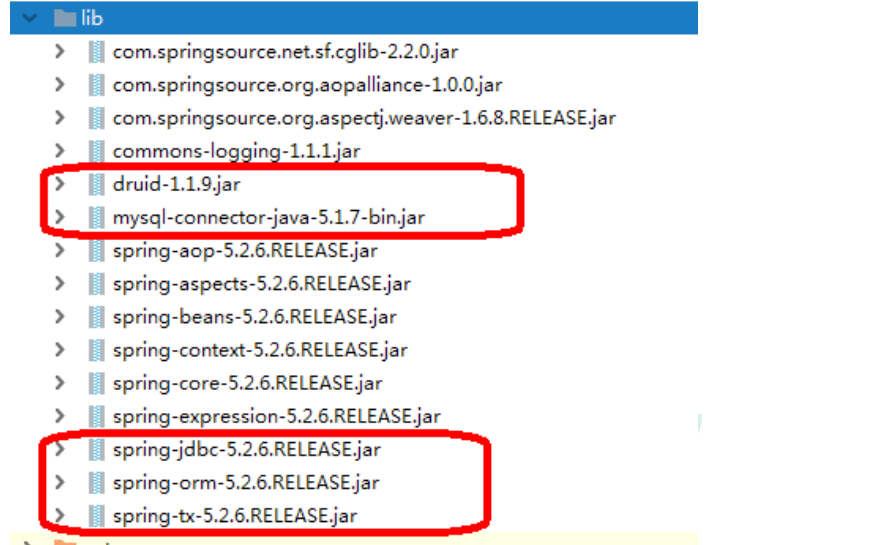

（2）在 spring 配置文件配置数据库连接池

```xml
<!-- 数据库连接池 -->
<bean id="dataSource" class="com.alibaba.druid.pool.DruidDataSource" destroy-method="close">
     <property name="url" value="jdbc:mysql:///user_db" />
     <property name="username" value="root" />
     <property name="password" value="root" />
     <property name="driverClassName" value="com.mysql.jdbc.Driver" />
</bean>

```


（3）配置 JdbcTemplate 对象，注入 DataSource

```xml
<!-- JdbcTemplate 对象 -->
<bean id="jdbcTemplate" class="org.springframework.jdbc.core.JdbcTemplate">
     <!--注入 dataSource-->
     <property name="dataSource" ref="dataSource"></property>
</bean>

```


（4）创建 service 类，创建 dao 类，在 dao 注入 jdbcTemplate 对象

 *配置文件

```xml
<!-- 组件扫描 -->
<context:component-scan base-package="com.atguigu"></context:component-scan>
```

⚫ Service

```java
@Service
public class BookService {
    // 注入dao
    @Autowired
    private BookDao bookDao;
}
```

⚫ Dao

```java
@Repository
public class BookDaoImpl implements BookDao{
    // 注入JdbcTemplate
    @Autowired
    private JdbcTemplate jdbcTemplate;
}
```


### JdbcTemplate 操作数据库（添加）

1、对应数据库创建实体类

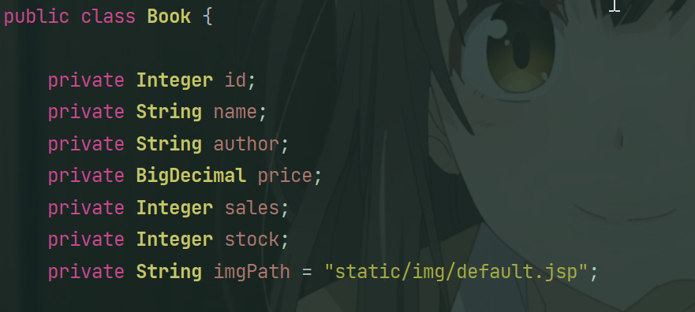

2、编写 service 和 dao
（1）在 dao 进行数据库添加操作
（2）调用 JdbcTemplate 对象里面 update 方法实现添加操作


> ⚫ 有两个参数
> ⚫ 第一个参数：sql 语句
> ⚫ 第二个参数：可变参数，设置 sql 语句值

```java
@Repository
public class BookDaoImpl implements BookDao {
     //注入 JdbcTemplate
     @Autowired
     private JdbcTemplate jdbcTemplate;
     //添加的方法
     @Override
     public void add(Book book) {
         //1 创建 sql 语句
         String sql = "insert into t_book values(?,?,?)";
         //2 调用方法实现
         Object[] args = {book.getUserId(), book.getUsername(), book.getUstatus()};
         int update = jdbcTemplate.update(sql,args);
         System.out.println(update);
     }
}

```

3、测试类

```java
@Test
public void testJdbcTemplate() {
     ApplicationContext context = new ClassPathXmlApplicationContext("bean1.xml");
     BookService bookService = context.getBean("bookService", BookService.class);
     Book book = new Book();
     book.setUserId("1");
     book.setUsername("java");
     book.setUstatus("a");
     bookService.addBook(book);
}

```


### JdbcTemplate 操作数据库（修改和删除）

```java
@Override
public void updateBook(Book book) {
    String sql = "update t_order_item set name=?, count=? where id=?";
    Object[] args = {book.getName(), book.getCount(), book.getId()};
    int update = jdbcTemplate.update(sql, args);
    System.out.println(update);
}

@Override
public void deleteBook(String id) {
    String sql = "delete from t_order_item where id=?";
    int update = jdbcTemplate.update(sql, id);
    System.out.println(update);
}
```


### JdbcTemplate 操作数据库（查询返回某个值）

1、查询表里面有多少条记录，返回是某个值
2、使用 JdbcTemplate 实现查询返回某个值代码


> ⚫ 有两个参数 
> ⚫ 第一个参数：sql 语句
> ⚫ 第二个参数：返回类型 Class

```java
//查询表记录数
@Override
public int selectCount() {
 	String sql = "select count(*) from t_book";
 	Integer count = jdbcTemplate.queryForObject(sql, Integer.class);
 	return count;
}
```


### JdbcTemplate 操作数据库（查询返回对象）

1、场景：查询图书详情
2、JdbcTemplate 实现查询返回对象


> ⚫ 有三个参数 
> ⚫ 第一个参数：sql 语句
> ⚫ 第二个参数：RowMapper 是接口，针对返回不同类型数据，使用这个接口里面实现类完成数据封装
> ⚫ 第三个参数：sql 语句值

```java
//查询返回对象
@Override
public Book findBookInfo(String id) {
	 String sql = "select * from t_book where user_id=?";
	 //调用方法
	 Book book = jdbcTemplate.queryForObject(sql, new BeanPropertyRowMapper<Book>(Book.class), id);
 return book;
}
```


### JdbcTemplate 操作数据库（查询返回集合）

1、场景：查询图书列表分页…
2、调用 JdbcTemplate 方法实现查询返回集合


> ⚫ 有三个参数 
> ⚫ 第一个参数：sql 语句
> ⚫ 第二个参数：RowMapper 是接口，针对返回不同类型数据，使用这个接口里面实现类完成数据封装
> ⚫ 第三个参数：sql 语句值

```java
@Override
public List<Book> findAllBook() {
    String sql = "select * from t_order_item";
    // 调用方法
    List<Book> bookList = jdbcTemplate.query(sql, new BeanPropertyRowMapper<Book>(Book.class));
    return bookList;
}
```


### JdbcTemplate 操作数据库（批量操作）

1、批量操作：操作表里面多条记录
2、JdbcTemplate 实现批量添加操作


> ⚫ 有两个参数 
> ⚫ 第一个参数：sql 语句
> ⚫ 第二个参数：List 集合，添加多条记录数据

```java
//批量添加
@Override
public void batchAddBook(List<Object[]> batchArgs) {
     String sql = "insert into t_book values(?,?,?)";
     int[] ints = jdbcTemplate.batchUpdate(sql, batchArgs);
     System.out.println(Arrays.toString(ints));
}


//批量添加测试
List<Object[]> batchArgs = new ArrayList<>();
Object[] o1 = {"3","java","a"};
Object[] o2 = {"4","c++","b"};
Object[] o3 = {"5","MySQL","c"};
batchArgs.add(o1);
batchArgs.add(o2);
batchArgs.add(o3);
//调用批量添加
bookService.batchAdd(batchArgs);
```


3、JdbcTemplate 实现批量修改操作

```java
//批量修改
@Override
public void batchUpdateBook(List<Object[]> batchArgs) {
     String sql = "update t_book set username=?,ustatus=? where user_id=?";
     int[] ints = jdbcTemplate.batchUpdate(sql, batchArgs);
     System.out.println(Arrays.toString(ints));
}


//批量修改
List<Object[]> batchArgs = new ArrayList<>();
Object[] o1 = {"java0909","a3","3"};
Object[] o2 = {"c++1010","b4","4"};
Object[] o3 = {"MySQL1111","c5","5"};
batchArgs.add(o1);
batchArgs.add(o2);
batchArgs.add(o3);
//调用方法实现批量修改
bookService.batchUpdate(batchArgs);
```


4、JdbcTemplate 实现批量删除操作

```java
//批量删除
@Override
public void batchDeleteBook(List<Object[]> batchArgs) {
     String sql = "delete from t_book where user_id=?";
     int[] ints = jdbcTemplate.batchUpdate(sql, batchArgs);
     System.out.println(Arrays.toString(ints));
}


//批量删除
List<Object[]> batchArgs = new ArrayList<>();
Object[] o1 = {"3"};
Object[] o2 = {"4"};
batchArgs.add(o1);
batchArgs.add(o2);
//调用方法实现批量删除
bookService.batchDelete(batchArgs);
```


## 事务操作

### 事务操作（事务概念）

1、什么事务
（1）事务是数据库操作最基本单元，逻辑上一组操作，要么都成功，如果有一个失败所有操作都失败
（2）典型场景：银行转账

* lucy 转账 100 元 给 mary
* lucy 少 100，mary 多 100

2、事务四个特性（ACID）
（1）原子性
（2）一致性
（3）隔离性
（4）持久性

### 事务操作（搭建事务操作环境）

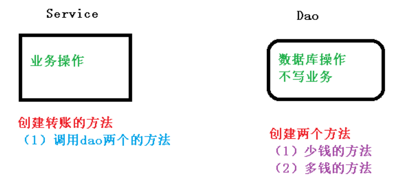

1、创建数据库表，添加记录


2、创建 service，搭建 dao，完成对象创建和注入关系
（1）service 注入 dao，在 dao 注入 JdbcTemplate，在 JdbcTemplate 注入 DataSource

```java
@Service
public class UserService {
     //注入 dao
     @Autowired
     private UserDao userDao;
}
@Repository
public class UserDaoImpl implements UserDao {
     @Autowired
     private JdbcTemplate jdbcTemplate;
}

```


3、在 dao 创建两个方法：多钱和少钱的方法，在 service 创建方法（转账的方法）

```java
@Repository
public class UserDaoImpl implements UserDao {
    
     @Autowired
     private JdbcTemplate jdbcTemplate;
    
     //lucy 转账 100 给 mary
     //少钱
     @Override
     public void reduceMoney() {
         String sql = "update t_account set money=money-? where username=?";
         jdbcTemplate.update(sql,100,"lucy");
	 }
     //多钱
     @Override
         public void addMoney() {
         String sql = "update t_account set money=money+? where username=?";
         jdbcTemplate.update(sql,100,"mary");
     }
}
@Service
public class UserService {
     //注入 dao
     @Autowired
     private UserDao userDao;
    
     //转账的方法
     public void accountMoney() {
         //lucy 少 100
         userDao.reduceMoney();
         
         //mary 多 100
         userDao.addMoney();
     }
}

```


4、上面代码，如果正常执行没有问题的，但是如果代码执行过程中出现异常，有问题

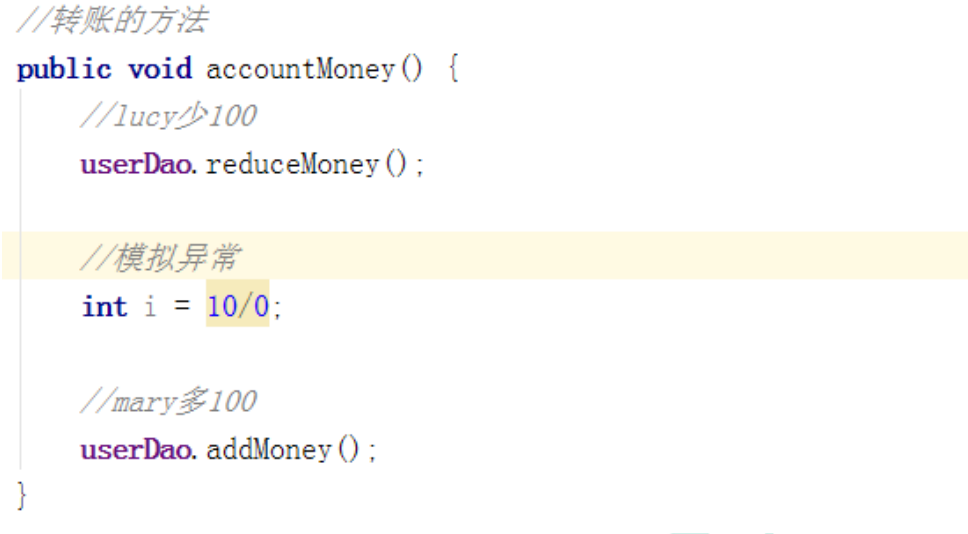

（1）上面问题如何解决呢？
* 使用事务进行解决

（2）事务操作过程

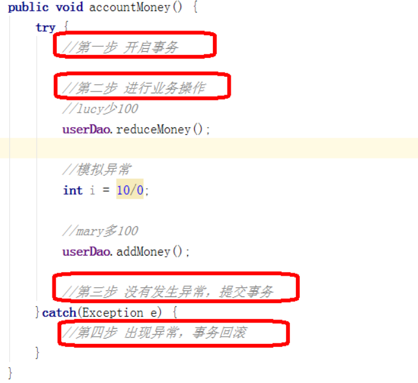


### 事务操作（Spring 事务管理介绍）

1、事务添加到 JavaEE 三层结构里面 Service 层（业务逻辑层）

2、在 Spring 进行事务管理操作
（1）有两种方式：编程式事务管理和声明式事务管理（使用）

3、声明式事务管理
（1）基于注解方式（使用）
（2）基于 xml 配置文件方式

4、在 Spring 进行声明式事务管理，底层使用 AOP 原理

5、Spring 事务管理 API
（1）提供一个接口，代表事务管理器，这个接口针对不同的框架提供不同的实现类

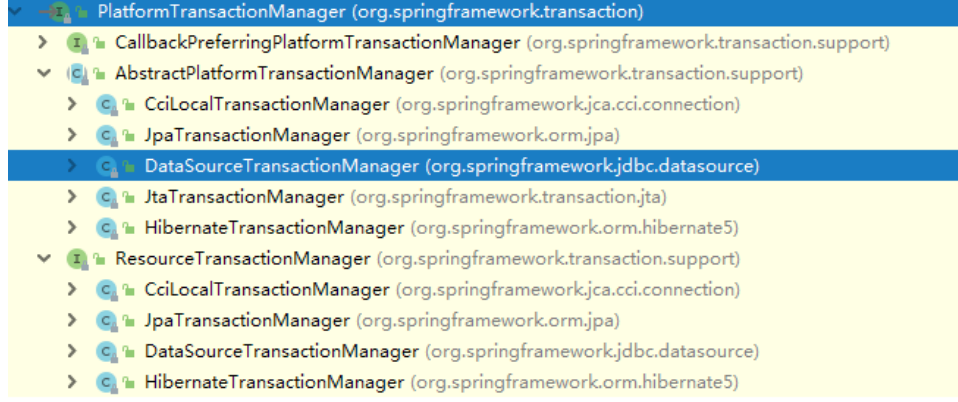


### 事务操作（注解声明式事务管理）

1、在 spring 配置文件配置事务管理器

```xml
<!--创建事务管理器-->
    <bean id="transactionManager" class="org.springframework.jdbc.datasource.DataSourceTransactionManager">
        <!--注入数据源-->
        <property name="dataSource" ref="dataSource"></property>
    </bean>
```

2、在 spring 配置文件，开启事务注解
（1）在 spring 配置文件引入名称空间 tx

```xml
<?xml version="1.0" encoding="UTF-8"?>
<beans xmlns="http://www.springframework.org/schema/beans"
       xmlns:xsi="http://www.w3.org/2001/XMLSchema-instance"
       xmlns:context="http://www.springframework.org/schema/context"
       xmlns:aop="http://www.springframework.org/schema/aop"
       xmlns:tx="http://www.springframework.org/schema/tx"
       xsi:schemaLocation="http://www.springframework.org/schema/beans
http://www.springframework.org/schema/beans/spring-beans.xsd
http://www.springframework.org/schema/context
http://www.springframework.org/schema/context/spring-context.xsd
http://www.springframework.org/schema/aop
http://www.springframework.org/schema/aop/spring-aop.xsd
http://www.springframework.org/schema/tx
http://www.springframework.org/schema/tx/spring-tx.xsd">
</beans>
```

（2）开启事务注解

```xml
<!--开启事务注解-->
<tx:annotation-driven transaction-manager="transactionManager"/>
```


3、在 service 类上面（或者 service 类里面方法上面）添加事务注解
（1）@Transactional，这个注解添加到类上面，也可以添加方法上面
（2）如果把这个注解添加类上面，这个类里面所有的方法都添加事务
（3）如果把这个注解添加方法上面，为这个方法添加事务

```java
@Service
@Transactional
public class UserService {
}
```


### 事务操作（声明式事务管理参数配置）

1、在 service 类上面添加注解@Transactional，在这个注解里面可以配置事务相关参数

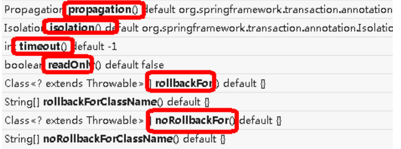

2、propagation：事务传播行为
（1）当一个事务方法被另外一个事务方法调用时候，这个事务方法如何进行

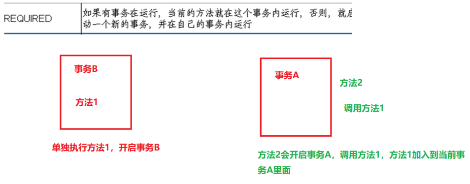

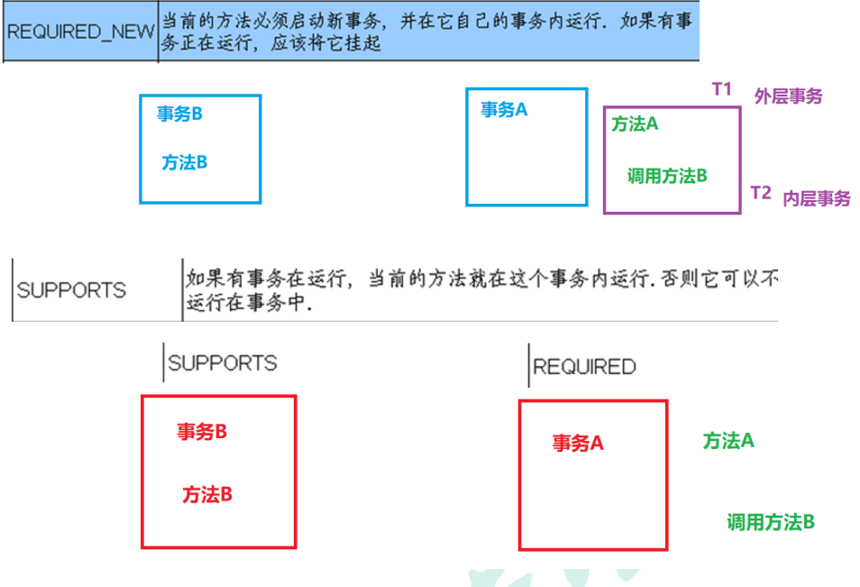

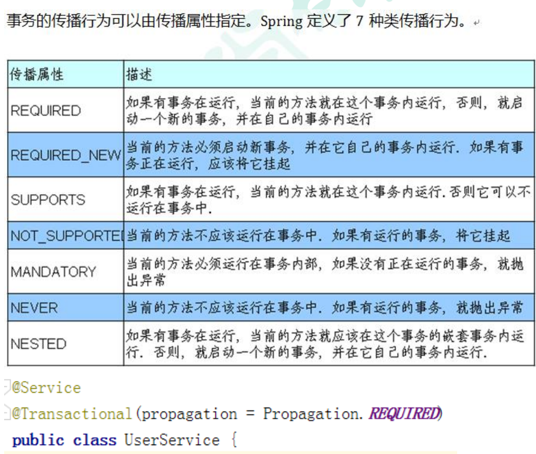

3、ioslation：事务隔离级别
（1）事务有特性成为隔离性，多事务操作之间不会产生影响。不考虑隔离性产生很多问题
（2）有三个读问题：脏读、不可重复读、虚（幻）读
（3）脏读：一个未提交事务读取到另一个未提交事务的数据

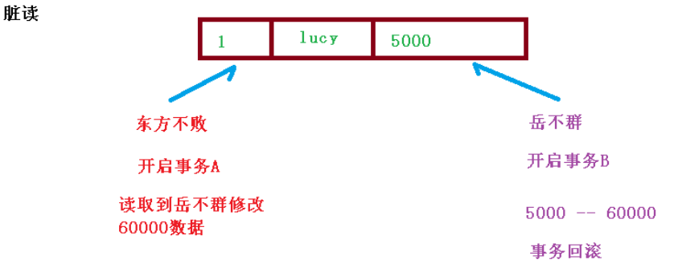

（4）不可重复读：一个未提交事务读取到另一提交事务修改数据

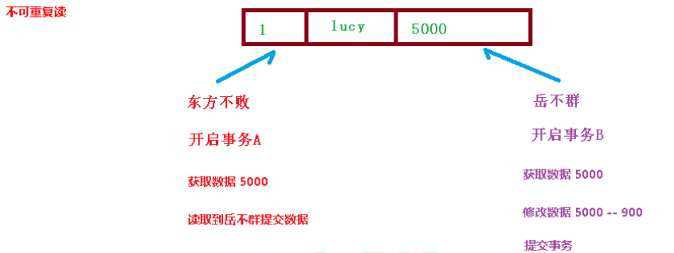

（5）虚读：一个未提交事务读取到另一提交事务添加数据

（6）解决：通过设置事务隔离级别，解决读问题

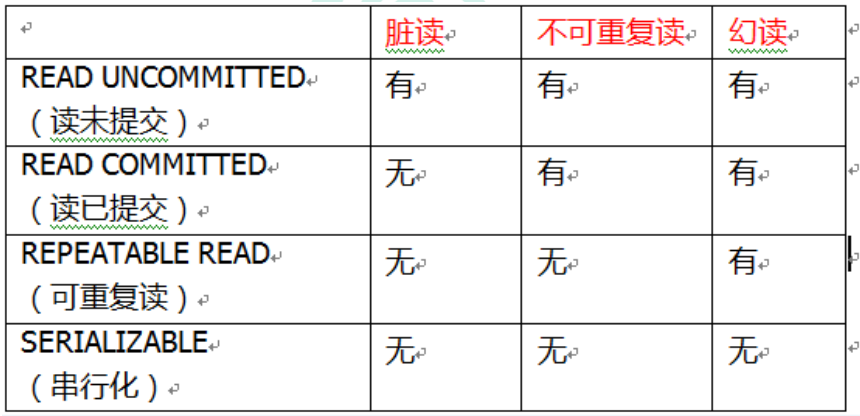

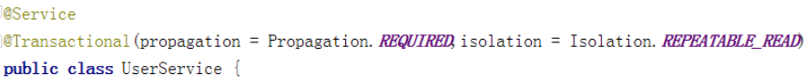

4、timeout：超时时间
（1）事务需要在一定时间内进行提交，如果不提交进行回滚
（2）默认值是 -1 ，设置时间以秒单位进行计算


5、readOnly：是否只读
（1）读：查询操作，写：添加修改删除操作
（2）readOnly 默认值 false，表示可以查询，可以添加修改删除操作
（3）设置 readOnly 值是 true，设置成 true 之后，只能查询

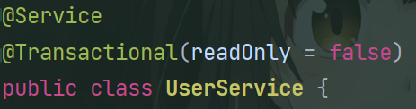

6、rollbackFor：回滚
（1）设置出现哪些异常进行事务回滚

7、noRollbackFor：不回滚
（1）设置出现哪些异常不进行事务回滚


### 事务操作（XML 声明式事务管理）

1、在 spring 配置文件中进行配置
		第一步 配置事务管理器
		第二步 配置通知
		第三步 配置切入点和切面

```xml
<?xml version="1.0" encoding="UTF-8"?>
<beans xmlns="http://www.springframework.org/schema/beans"
       xmlns:xsi="http://www.w3.org/2001/XMLSchema-instance"
       xmlns:context="http://www.springframework.org/schema/context"
       xmlns:aop="http://www.springframework.org/schema/aop"
       xmlns:tx="http://www.springframework.org/schema/tx"
       xsi:schemaLocation="http://www.springframework.org/schema/beans
http://www.springframework.org/schema/beans/spring-beans.xsd
 http://www.springframework.org/schema/context
http://www.springframework.org/schema/context/spring-context.xsd
 http://www.springframework.org/schema/aop
http://www.springframework.org/schema/aop/spring-aop.xsd
 http://www.springframework.org/schema/tx
http://www.springframework.org/schema/tx/spring-tx.xsd">

    <!-- 组件扫描 -->
    <context:component-scan base-package="com.atguigu"></context:component-scan>

    <!-- 数据库连接池 -->
    <bean id="dataSource" class="com.alibaba.druid.pool.DruidDataSource"
          destroy-method="close">
        <property name="url" value="jdbc:mysql:///book" />
        <property name="username" value="root" />
        <property name="password" value="hsp" />
        <property name="driverClassName" value="com.mysql.jdbc.Driver" />
    </bean>

    <!-- JdbcTemplate 对象 -->
    <bean id="jdbcTemplate" class="org.springframework.jdbc.core.JdbcTemplate">
        <!--注入 dataSource-->
        <property name="dataSource" ref="dataSource"></property>
    </bean>

    <!-- 1.创建事务管理器-->
    <bean id="transactionManager" class="org.springframework.jdbc.datasource.DataSourceTransactionManager">
        <!--注入数据源-->
        <property name="dataSource" ref="dataSource"></property>
    </bean>

    <!-- 2.配置通知 -->
    <tx:advice id="txadvice">
        <!--配置事务参数-->
        <tx:attributes>
            <!--指定哪种规则的方法上面添加事务-->
            <tx:method name="accountMoney" propagation="REQUIRED"/>
<!--            <tx:method name="account*"/>-->
        </tx:attributes>
    </tx:advice>

    <!-- 3.配置切入点和切面 -->
    <aop:config>
        <!--配置切入点-->
        <aop:pointcut id="pt" expression="execution(* com.atguigu.spring5.service.UserService.*(..))"/>
        <!--配置切面-->
        <aop:advisor advice-ref="txadvice" pointcut-ref="pt"/>
    </aop:config>


</beans>
```


### 事务操作（完全注解声明式事务管理）

1、创建配置类，使用配置类替代 xml 配置文件

```java
package com.atguigu.spring5.config;

import com.alibaba.druid.pool.DruidDataSource;
import org.springframework.context.annotation.Bean;
import org.springframework.context.annotation.ComponentScan;
import org.springframework.context.annotation.Configuration;
import org.springframework.jdbc.core.JdbcTemplate;
import org.springframework.jdbc.datasource.DataSourceTransactionManager;
import org.springframework.transaction.annotation.EnableTransactionManagement;

import javax.sql.DataSource;


/* @author  i-s-j-h-d
 * @version 1.0 */
@Configuration //配置类
@ComponentScan(basePackages = "com.atguigu") //组件扫描
@EnableTransactionManagement // 开启事务
public class TxConfig {
    // 创建数据库连接池
    @Bean
    public DruidDataSource getDruidDataSource() {
        DruidDataSource dataSource = new DruidDataSource();
        dataSource.setDriverClassName("com.mysql.jdbc.Driver");
        dataSource.setUrl("jdbc:mysql:///book");
        dataSource.setUsername("root");
        dataSource.setPassword("hsp");
        return dataSource;
    }

    // 创建JdbcTemplate 对象
    @Bean
    public JdbcTemplate getJdbcTemplate(DataSource dataSource){
        //到 ioc 容器中根据类型找到 dataSource
        JdbcTemplate jdbcTemplate = new JdbcTemplate();
        //注入 dataSource
        jdbcTemplate.setDataSource(dataSource);
        return jdbcTemplate;
    }

    // 创建事务管理器
    @Bean
    public DataSourceTransactionManager getDataSourceTransactionManager(DataSource dataSource) {
        DataSourceTransactionManager transactionManager = new DataSourceTransactionManager();
        transactionManager.setDataSource(dataSource);
        return transactionManager;
    }

}
```


## Spring5 框架新功能

### 1、整个 Spring5 框架的代码基于 Java8，运行时兼容 JDK9，许多不建议使用的类和方法在代码库中删除

### 2、Spring 5.0 框架自带了通用的日志封装 

（1）Spring5 已经移除 Log4jConfigListener，官方建议使用 Log4j2
（2）Spring5 框架整合 Log4j2
第一步 引入 jar 包

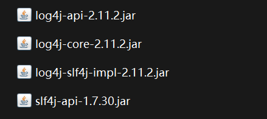

[log4j-api-2.11.2.jar](jar/log4j-api-2.11.2.jar)

[log4j-core-2.11.2.jar](jar/log4j-core-2.11.2.jar)

[log4j-slf4j-impl-2.11.2.jar](jar/log4j-slf4j-impl-2.11.2.jar)

[slf4j-api-1.7.30.jar](jar/slf4j-api-1.7.30.jar)

第二步 创建 log4j2.xml 配置文件

```xml
<?xml version="1.0" encoding="UTF-8"?>
<!--日志级别以及优先级排序: OFF > FATAL > ERROR > WARN > INFO > DEBUG > TRACE > ALL -->
<!--Configuration后面的status用于设置log4j2自身内部的信息输出，可以不设置，当设置成trace时，可以看到log4j2内部各种详细输出-->
<configuration status="DEBUG">
    <!--先定义所有的appender-->
    <appenders>
        <!--输出日志信息到控制台-->
        <console name="Console" target="SYSTEM_OUT">
            <!--控制日志输出的格式-->
            <PatternLayout pattern="%d{yyyy-MM-dd HH:mm:ss.SSS} [%t] %-5level %logger{36} - %msg%n"/>
        </console>
    </appenders>
    <!--然后定义logger，只有定义了logger并引入的appender，appender才会生效-->
    <!--root：用于指定项目的根日志，如果没有单独指定Logger，则会使用root作为默认的日志输出-->
    <loggers>
        <root level="info">
            <appender-ref ref="Console"/>
        </root>
    </loggers>
</configuration>
```


### 3、Spring5 框架核心容器支持@Nullable 注解

（1）@Nullable 注解可以使用在方法上面，属性上面，参数上面，表示方法返回可以为空，属性值可以为空，参数值可以为空
（2）注解用在方法上面，方法返回值可以为空


（3）注解使用在方法参数里面，方法参数可以为空


（4）注解使用在属性上面，属性值可以为空

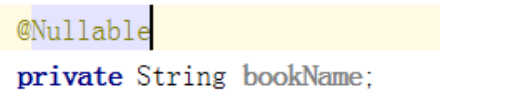

### 4、Spring5 核心容器支持函数式风格 GenericApplicationContext

```java
//函数式风格创建对象，交给 spring 进行管理
@Test
public void testGenericApplicationContext() {
     //1 创建 GenericApplicationContext 对象
     GenericApplicationContext context = new GenericApplicationContext();
     //2 调用 context 的方法对象注册
     context.refresh();
     context.registerBean("user1",User.class,() -> new User());
     //3 获取在 spring 注册的对象
     // User user = (User)context.getBean("com.atguigu.spring5.test.User");
     User user = (User)context.getBean("user1");
     System.out.println(user);
}
```


### 5、Spring5 支持整合 JUnit5

（1）整合 JUnit4
第一步 引入 Spring 相关针对测试依赖

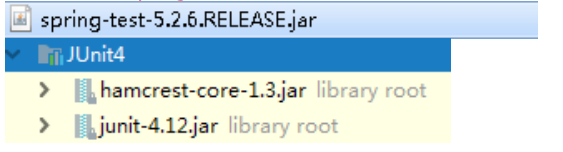

[spring-test-5.3.0-RC2.jar](jar/spring-test-5.3.0-RC2.jar)

第二步 创建测试类，使用注解方式完成

```java
import com.atguigu.spring5.service.UserService;
import org.junit.Test;
import org.junit.runner.RunWith;
import org.springframework.beans.factory.annotation.Autowired;
import org.springframework.test.context.ContextConfiguration;
import org.springframework.test.context.junit4.SpringJUnit4ClassRunner;

/* @author  i-s-j-h-d
 * @version 1.0 */
@RunWith(SpringJUnit4ClassRunner.class) //单元测试框架
@ContextConfiguration("classpath:bean1.xml") //加载配置文件
public class JTest4 {
    @Autowired
    private UserService userService;
    @Test
    public void test1() {
        userService.accountMoney();
    }
}
```

把配置类上的开启事务管理器注释掉!!!!!!!!!!!


（2）Spring5 整合 JUnit5
第一步 引入 JUnit5 的 jar 包

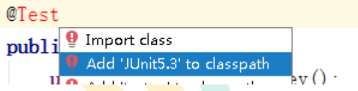

第二步 创建测试类，使用注解完成

```java
import com.atguigu.spring5.service.UserService;
import org.junit.jupiter.api.Test;
import org.junit.jupiter.api.extension.ExtendWith;
import org.springframework.beans.factory.annotation.Autowired;
import org.springframework.test.context.ContextConfiguration;
import org.springframework.test.context.junit.jupiter.SpringExtension;

/* @author  i-s-j-h-d
 * @version 1.0 */
@ExtendWith(SpringExtension.class)
@ContextConfiguration("classpath:bean1.xml")
public class JTest5 {
    @Autowired
    private UserService userService;
    @Test
    public void test1() {
        userService.accountMoney();
    }

}
```

记得关闭自动导包，idea太TM智能了！！！！！！


（3）使用一个复合注解替代上面两个注解完成整合

```java
import com.atguigu.spring5.service.UserService;
import org.junit.jupiter.api.Test;
import org.springframework.beans.factory.annotation.Autowired;
import org.springframework.test.context.junit.jupiter.SpringJUnitConfig;

/* @author  i-s-j-h-d
 * @version 1.0 */
@SpringJUnitConfig(locations = "classpath:bean1.xml")
public class JTest5 {
    @Autowired
    private UserService userService;
    @Test
    public void test1() {
        userService.accountMoney();
    }

}
```


## Spring5 框架新功能（Webflux）


