# 计算机网络

## 第一章 概述

### 1.1因特网概述

#### 1.网络、互连网 (互联网) 和因特网

- 网络（Network）由若干**结点**（Node）和连接这些结点的**链路**（Link）组成。
- 多个网络还可以通过路由器互连起来，这样就构成了一个覆盖范围更大的网络，即互联网（或互连网）。因此，互联网是“**网络的网络**（NetwrokofNetworks）”。
- 因特网（lnternet）是世界上最大的互连网络（用户数以亿计，互连的网络数以百万计）。

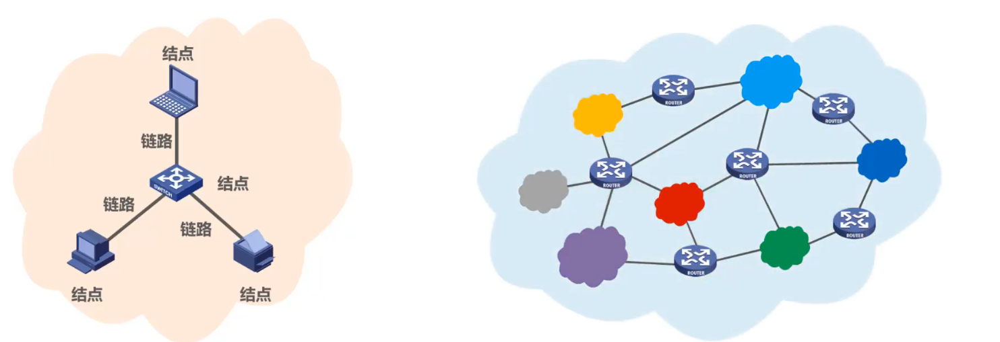

#### 2.因特网发展的三个阶段

- 因特网服务提供者**ISP** (Internet Service Provider)

- 基于ISP的三层结构的因特网

#### 3.因特网的标准化工作

#### 4.因特网的组成

- 边缘部分
  由所有连接在因特网上的**主机**组成。这部分是**用户直接使用**的，用来进行**通信**（传送数据、音频或视频）和**资源共享**。
- 核心部分
  由**大量网络**和连接这些网络的**路由器**组成。这部分是**为边缘部分提供服务**的（提供连通性和交换）。

### 1.2三种交换方式

#### 1.电路交换(Circuit Switching)

- 电话交换机接通电话线的方式称为电路交换；
- 从通信资源的分配角度来看，交换（Switching）就是按照某种方式动态地分配传输线路的资源；

- 电路交换的三个步骤：
  建立连接（分配通信资源）
  通话（一直占用通信资源）
  释放连接（归还通信资源）

**当使用电路交换来传送计算机数据时，其线路的传输效率往往很低。**

#### 2.分组交换(Packet Switching)

#### 3.电路交换、报文交换、分组交换的对比

### 1.3计算机网络的定义和分类

#### 1.计算机网络的定义

- 计算机网络的精确定义并未统一
- 计算机网络的最简单的定义是：一些**互**相**连**接的、**自治**的计算机的**集合**.
  互连：是指计算机之间可以通过有线或无线的方式进行数据通信；
  自治：是指独立的计算机，它有自己的硬件和软件，可以单独运行使用；
  集合：是指至少需要两台计算机；
- 计算机网络的较好的定义是：计算机网络主要是由一些**通用的、可编程的硬件互连**而成的，而这些硬件并非专门用来实现某一特定目的（例如，传送数据或视频信号）。这些可编程的硬件能够用来**传送多种不同类型的数据**，并能**支持广泛的和日益增长的应用**。
- 计算机网络所连接的硬件，并不限于一般的计算机，而是包括了智能手机等智能硬件。
- 计算机网络并非专门用来传送数据，而是能够支持很多种的应用(包括今后可能出现的各种应用)。

#### 2.计算机网络的分类

### 1.4计算机网络的性能指标

- 性能指标可以从不同的方面来度量计算机网络的性能。

- 常用的计算机网络的性能指标有以下8个：

  **速率、带宽、吞吐量、时延、时延带宽积、往返时间、利用率、丢包率**

- 速率

- 带宽

- 吞吐量

- 时延

- 时延带宽积

- 往返时间

- 利用率

- 丢包率

### 1.5计算机网络体系结构

#### 1.常见的计算机网络体系结构

#### 2.计算机网络体系结构分层的必要性

- **计算机网络是个非常复杂的系统**。早在最初的ARPANET设计时就提出了分层的设计理念。
- “**分层**“可将庞大而复杂的问题，转化为若干较小的局部问题，而这些较小的局部问题就比较易于研究和处理。
- 下面，我们按照由简单到复杂的顺序，来看看实现计算机网络要面临哪些主要的问题，以及如何将这些问题划分到相应的层次，层层处理。

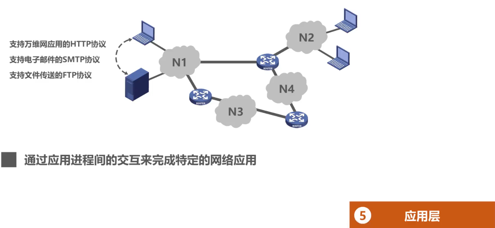

#### 3.计算机网络体系结构分层思想举例

#### 4.计算机网络体系结构中的专用术语

**协议**：控制两个对等实体进行逻辑通信的规则的集合。

协议的三要素	**语法**	**语义**	**同步**

**语法**：定义所交换信息的格式

**语义**：定义收发双方所要完成的操作

**同步**：定义收发双方的时序关系

### 1.6体系结构相关习题

【2009年题33】在OSI参考模型中，自下而上第一个提供端到端服务的层次是	**B**

A.数据链路层	B.传输层	C.会话层	D.应用层

【2010年题33】下列选项中，不属于网络体系结构所描述的内容是	**C**
A.网络的层次	B.每一层使用的协议	C.协议的内部实现细节	D.每一层必须完成的功能

【2011年题33】TCP/IP参考模型的网络层提供的是	**A**
A.无连接不可靠的数据报服务	B.无连接可靠的数据报服务
C.有连接不可靠的虚电路服务	D.有连接可靠的虚电路服务

【2012年题33】在TCP/IP体系结构中，直接为ICMP提供服务的协议是	**B**
A. PPP	B. IP	C. UDP	D. TCP

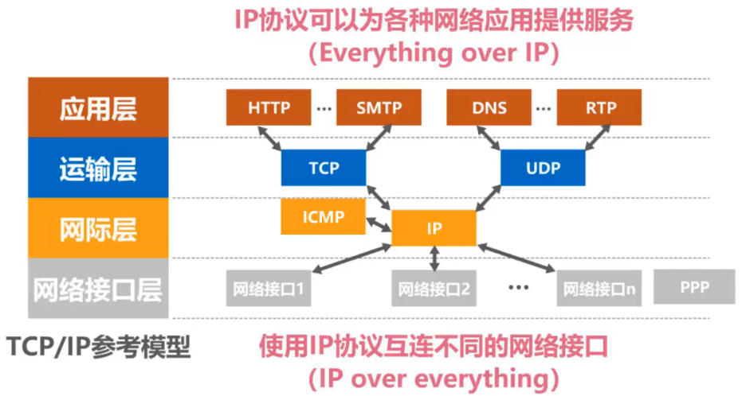

【2013年题33】在0SI参考模型中，下列功能需由应用层的相邻层实现的是	**B**
A.对话管理	B.数据格式转换	C.路由选择	D.可靠数据传输

【2014年题33】在OSI参考模型中，直接为会话层提供服务的是	**C**
A.应用层	B.表示层	C.传输层	D.网络层

【2015年题33】通过POP3协议接收邮件时，使用的传输层服务类型是	**D**
A.无连接不可靠的数据传输服务	B.无连接可靠的数据传输服务
C.有连接不可靠的数据传输服务	D.有连接可靠的数据传输服务

【2016年题33】在OSI参考模型中，R1、Switch、Hub实现的最高功能层分别是	**C**
A.2、2、1	B.2、2、2	C.3、2、1	D.3、2、2

【2017年题33】假设OSI参考模型的应用层欲发送400B的数据（无拆分），除物理层和应用层之外，其他各层在封装PDU时均引I入20B的额外开销，则应用层数据传输效率约为	**A**
A. 80%	B. 83%	C. 87%	D. 91%

【2018年题33】下列TCP/IP应用层协议中，可以使用传输层无连接服务的是	**B**
A. FTP	B. DNS	C. SMTP	D. HTTP

### 1.7时延相关习题

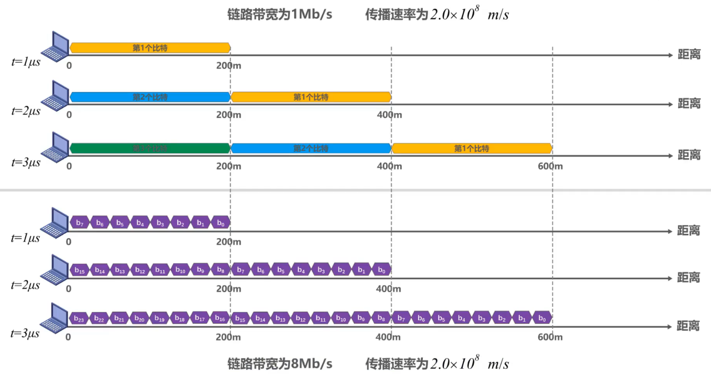

【习题1】两主机间的链路长度为60m，链路带宽为10Mb/s，信号的传播速率2.0×10^8m/s，其中一台主机给另一台主机发送1b信息，当主机接收完该信息时共耗费多长时间？

【习题2】试在下列条件下比较电路交换和分组交换。
要传送的报文共x（bit)。从源点到终点共经过k段链路，每段链路的传播时延为d（s），带宽为b（bit/s)。在电路交换时，电路的建立时间为s（s)。在分组交换时，报文可被划分成若干个长度为p（bit）的数据段，添加首部后即可构成分组，假设分组首部的长度以及分组在各结点的排队等待时间忽略不计。问在怎样的条件下，电路交换的的时延比分组交换的要大？

【习题3】在习题2的分组交换网中，设报文长度和分组长度分别为x和(p+h)(bit)，其中p为分组的数据部分的长度，而h为每个分组的首部，其长度固定，与p 的大小无关。通信的两端共经过k段链路。链路带宽为b（bit/s），但传播时延和结点的排队时间均忽略不计。若打算使总的时延为最小，问分组的数据部分长度p应取多大？

【习题42013年题35】主机甲通过1个路由器（存储转发方式）与主机乙互联，两段链路的数据传输速率均为10Mbps，主机甲分别采用报文交换和分组大小为10Kb的分组交换向主机乙发送1个大小为8Mb（1M=10°）的报文。若忽略链路传播延迟、分组头开销和分组拆装时间，则两种交换方式完成该报文传输所需的总时间分别为	**D**

A. 800ms、1600ms	B. 801ms、1600ms
A. 1600ms、800ms	B. 1600ms、801ms

【习题5 2010年 题34】在下图所示的采用“存储-转发”方式的分组交换网络中，所有链路的数据传输速率为100Mbps，分组大小为1000B，其中分组头大小为20B.若主机H1向主机H2发送一个大小为980000B的文件，则在不考虑分组拆装时间和传播延迟的情况下，从H1发送开始到H2接收完为止，需要的时间至少是	**C**
A.80ms	B.80.08ms	C. 80.16ms	D.80.24ms

## 第二章 物理层

### 2.1物理层的基本概念

- 物理层考虑的是怎样才能在连接各种计算机的传输媒体上传输数据比特流
- 物理层为数据链路层屏蔽了各种传输媒体的差异，使数据链路层只需要考虑如何完成本层的协议和服务，而不必考虑网络具体的传输媒体是什么。

### 2.2物理层下面的传输媒体

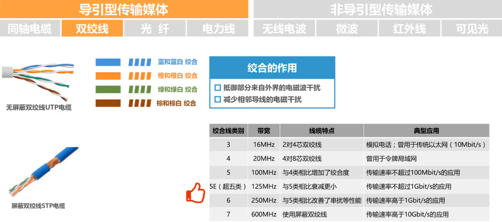

### 2.3传输方式

### 2.4编码和调制

常用编码

基本调制方法

混合调制举例

### 2.5信道的极限容量

奈氏准则

香农公式

### 2.6物理层 习题课

## 第三章 数据链路层

### 3.1数据链路层概述

- 数据链路层在网络体系结构中所处的地位

- **链路**（Link）就是从一个结点到相邻结点的一段物理线路，而中间没有任何其他的交换结点。
- **数据链路**（DataLink）是指把实现通信协议的硬件和软件加到链路上，就构成了数据链路。
- 数据链路层以**帧**为单位传输和处理数据。

- 数据链路层的三个重要问题

- 使用广播信道的数据链路层（共享式局域网）

- 交换式局域网

- 无线局域网

### 3.2封装成帧

- 封装成帧是指数据链路层给上层交付的协议数据单元添加帧头和帧尾使之成为帧。
  - 帧头和帧尾中包含有重要的控制信息。
  - 帧头和帧尾的作用之一就是**帧定界**。
- 透明传输是指**数据链路层对上层交付的传输数据没有任何限制**，就好像数据链路层不存在一样。
  - 面向字节的物理链路使用字节填充（或称字符填充）的方法实现透明传输。
  - 面向比特的物理链路使用比特填充的方法实现透明传输。

- 为了提高帧的传输效率，应当使帧的数据部分的长度尽可能大些。
- 考虑到差错控制等多种因素，每一种数据链路层协议都规定了帧的数据部分的长度上限，即最大传送单元MTU(Maximum Transfer Unit)。

### 3.3差错检测

- 实际的通信链路都不是理想的，比特在传输过程中可能会产生差错：1可能会变成0，而0也可能变成1。这称为**比特差错**。
- 在一段时间内，传输错误的比特占所传输比特总数的比率称为**误码率BER**（BitErrorRate) 
- 使用**差错检测码**来检测数据在传输过程中是否产生了比特差错，是数据链路层所要解决的重要问题之一。

- 奇偶校验
  - 在待发送的数据后面**添加1位奇偶校验位**，使整个数据（包括所添加的校验位在内）中**“1”的个数**为奇数（奇校验）或偶数（偶校验）。
  - 如果有**奇数个位发生误码**，则奇偶性发生变化，**可以检查出误码**；
  - 如果有**偶数个位发生误码**，则奇偶性不发生变化，**不能检查出误码（漏检）**；

- 循环冗余校验CRC（CyclicRedundancyCheck) 
  - 收发双方约定好一个**生成多项式**G（x);
  - 发送方基于待发送的数据和生成多项式计算出差错检测码（**冗余码**），将其添加到待传输数据的后面一起传输；
  - 接收方通过生成多项式来计算收到的数据是否产生了误码；

- **检错码**只能检测出帧在传输过程中出现了差错，但并不能定位错误，因此**无法纠正错误**
- 要想纠正传输中的差错，可以使用余信息更多的**纠错码**进行**前向纠错**。但纠错码的开销比较大，在**计算机网络中较少使用**。
- 循环余校验**CRC**有很好的检错能力（**漏检率非常低**），虽然计算比较复杂，但非常**易于用硬件实现**，因此被**广泛应用于数据链路层**
- 在计算机网络中通常采用我们后续课程中将要讨论的**检错重传方式来纠正传输中的差错**，**或者仅仅是丢弃检测到差错的帧**，这取决于数据链路层向其上层提供的是可靠传输服务还是不可靠传输服务。

### 3.4可靠传输

#### 3.4.1可靠传输的基本概念

- 使用**差错检测技术**（例如循环余校验CRC），接收方的数据链路层就可检测出帧在传输过程中是否产生了**误码**（比特错误）。
- 数据链路层向上层提供的服务类型
  **不可靠传输服务**：**仅仅丢弃有误码的帧**，其他什么也不做；
  **可靠传输服务**：想办法实现**发送端发送什么，接收端就收到什么**。
- 一般情况下，**有线链路**的误码率比较低，为了减小开销，并**不要求数据链路层**向上提供**可靠**传输服务。即使出现了误码，可靠传输的问题由其上层处理。
- **无线链路**易受干扰，误码率比较高，因此**要求数据链路层**必须向上层提供**可靠**传输服务。

- **比特差错**只是传输差错中的一种。
- 从整个计算机网络体系结构来看，传输差错还包括**分组丢失**、**分组失序**以及**分组重复**。
- 分组丢失、分组失序以及分组重复这些传输差错，一般不会出现在数据链路层，而会出现在其上层。
- **可靠传输服务并不仅局限于数据链路层**，其他各层均可选择实现可靠传输。
- 可靠传输的实现比较复杂，开销也比较大，是否使用可靠传输取决于应用需求。

#### 3.4.2可靠传输的实现机制-停止等待协议SW

- 这三种可靠传输实现机制的基本原理并不仅限于数据链路层可以应用到计算机网络体系结构的各层协议中
- 希望同学们在学习时，不要把思维局限在数据链路层，而应放眼于整个网络体系结构

接收方收不到数据分组，就不会发送ACK或NAK。如果不采取其他措施，发送方就会一直处于等待接收方ACK或NAK的状态。

为解决该问题，可以在发送方发送完一个数据分组时，启动一个**超时计时器**。若到了超时计时器所设置的**重传时间**而发送方仍收不到接收方的任何ACK或NAK，则重传原来的数据分组，这就叫做**超时重传**。

一般可将重传时间选为略大于“从发送方到接收方的平均往返时间”

为**避免分组重复**这种传输错误，必须给**每个分组带上序号**

对于停止-等待协议，由于每发送一个数据分组就停止等待，只要保证每发送一个新的数据分组，其发送序号与上次发送的数据分组的序号不同就可以了，因此用**一个比特来编号就够了**。

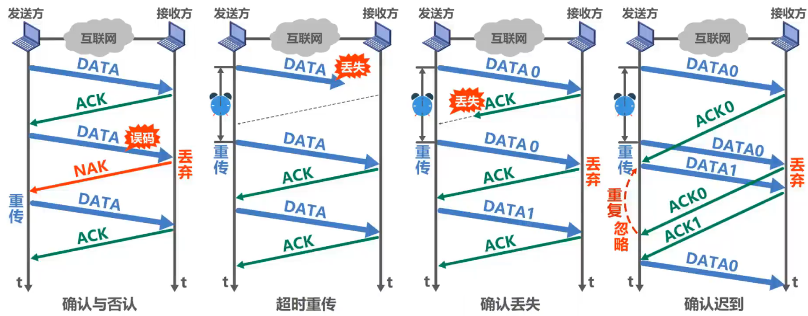

**【注意事项】**

- 接收端检测到数据分组有误码时，将其丢弃并等待发送方的超时重传。但对于误码率较高的点对点链路，为使发送方**尽早重传**，也可**给发送方发送NAK分组**。
- 为了让接收方能够判断所收到的数据分组是否是重复的，需要给**数据分组编号**。由于停止-等待协议的停等特性，**只需1个比特编号**就够了，即编号0和1。
- 为了让发送方能够判断所收到的ACK分组是否是重复的，需要给**ACK分组编号**，所用比特数量**与数据分组编号所用比特数量一样**。数据链路层一般不会出现 ACK分组迟到的情况，因此在**数据链路层实现停止-等待协议可以不用给ACK分组编号**。
- 超时计时器设置的**重传时间**应仔细选择。一般可将重传时间选为**略大于“从发送方到接收方的平均往返时间”**。
  - 在数据链路层点对点的往返时间比较确定，重传时间比较好设定。
  - 然而在运输层，由于端到端往返时间非常不确定，设置合适的重传时间有时并不容易。

**停止-等待协议的信道利用率**

- **当往返时延RTT远大于数据帧发送时延TD时（例如使用卫星链路），信道利用率非常低。**
- 若出现重传，则对于传送有用的数据信息来说，信道利用率还要降低。
- 为了克服停止-等待协议信道利用率很低的缺点，就产生了另外两种协议，即后退N帧协议GBN和选择重传协议SR。

#### 3.4.3可靠传输的实现机制-回退N帧协议GBN

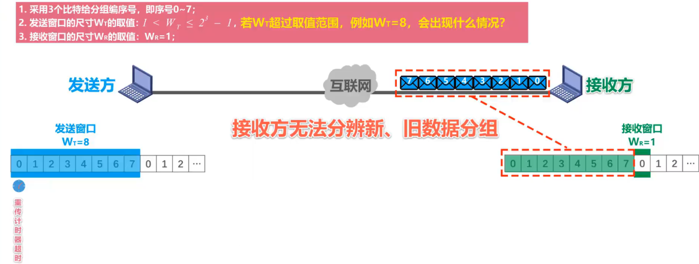

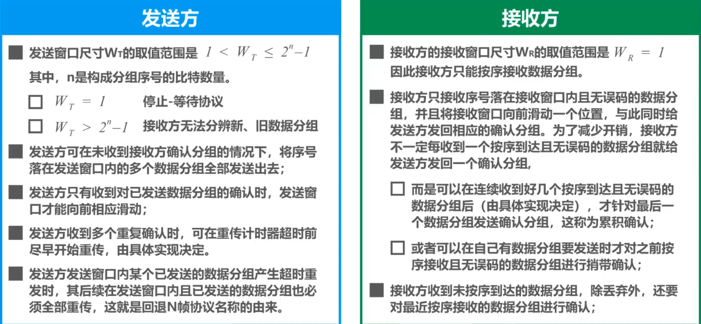

- 回退N帧协议在流水线传输的基础上利用发送窗口来限制发送方连续发送数据分组的数量，是一种连续ARQ协议。
- 在协议的工作过程中发送窗口和接收窗口不断向前滑动，因此这类协议又称为滑动窗口协议。
- 由于回退N帧协议的特性，当通信线路质量不好时，其信道利用率并不比停止·等待协议高。

#### 3.4.4可靠传输的实现机制-选择重传协议SR

- **回退N帧协议**的接收窗口尺寸**WR只能等于1**，因此**接收方只能按序接收正确到达的数据分组**。
- 一个数据分组的误码就会导致其后续多个数据分组不能被接收方按序接收而丢弃（尽管它们无乱序和误码）。这必然会造成发送方对这些数据分组的超时重传，显然这是对通信资源的极大浪费。
- 为了进一步提高性能，可设法只重传出现误码的数据分组。因此，接收窗口的尺寸**WR不应再等于1（而应大于1）**，以便**接收方先收下失序到达但无误码并且序号落在接收窗口内的那些数据分组**，等到所缺分组收齐后再一并送交上层。这就是**选择重传协议**。

注意：

- **选择重传协议**为了使发送方仅重传出现差错的分组，接收方**不能再采用累积确认**，而需要对每个正确接收到的数据分组进行**逐一确认**！

### 3.5点对点协议PPP

- 点对点协议PPP（Point-to-PointProtocol）是目前使用最广泛的点对点数据链路层协议。

- PPP协议是因特网工程任务组IETF在1992年制定的。经过1993年和1994年的修订，现在的PPP协议已成为因特网的正式标准[RFC1661，RFC1662]。

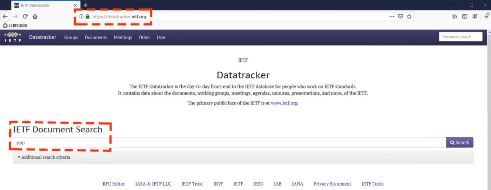

- PPP协议为在点对点链路传输各种协议数据报提供了一个标准方法，主要由以下三部分构成：
  - 对各种协议数据报的封装方法（封装成帧）
  - 链路控制协议LCP：用于建立、配置以及测试数据链路的连接
  - 一套网络控制协议NCPs：其中的每一个协议支持不同的网络层协议

**帧格式**

**透明传输**

**透明传输一面向字节的异步链路采用插入转义字符的字节填充法**

**透明传输——面向比特的同步链路采用插入比特0的比特填充法**

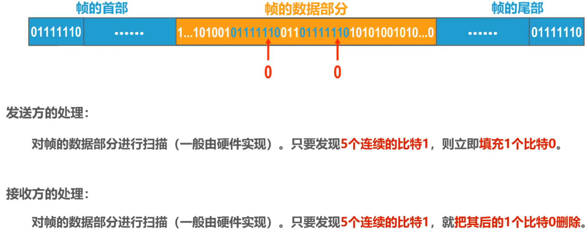

**差错检测**

**工作状态**

### 3.6媒体接入控制

#### 3.6.1媒体接入控制的基本概念

- 共享信道要着重考虑的一个问题就是如何协调多个发送和接收站点对一个共享传输媒体的占用，即**媒体接入控制MAC**(MediumAccessControl)。

- 随着技术的发展，交换技术的成熟和成本的降低，具有更高性能的使用点对点链路和链路层交换机的交换式局域网在有线领域已完全取代了共享式局域网，但由于无线信道的广播天性，无线局域网仍然使用的是共享媒体技术，

#### 3.6.2媒体接入控制-静态划分信道

**信道复用**

- 复用（Multiplexing）是通信技术中的一个重要概念。复用就是通过一条物理线路同时传输多路用户的信号。
- 当网络中传输媒体的传输容量大于多条单一信道传输的总通信量时，可利用复用技术在一条物理线路上建立多条通信信道来充分利用传输媒体的带宽。

**频分复用FDM**

**时分复用TDM**

**波分复用WDM**

**码分复用CDM**

#### 3.6.3媒体接入控制-动态接入控制-随机接入-CSMA/CD协议

载波监听多址接入/碰撞检测CSMA/CD（CarrierSenseMultipleAccess/CollisionDetection）

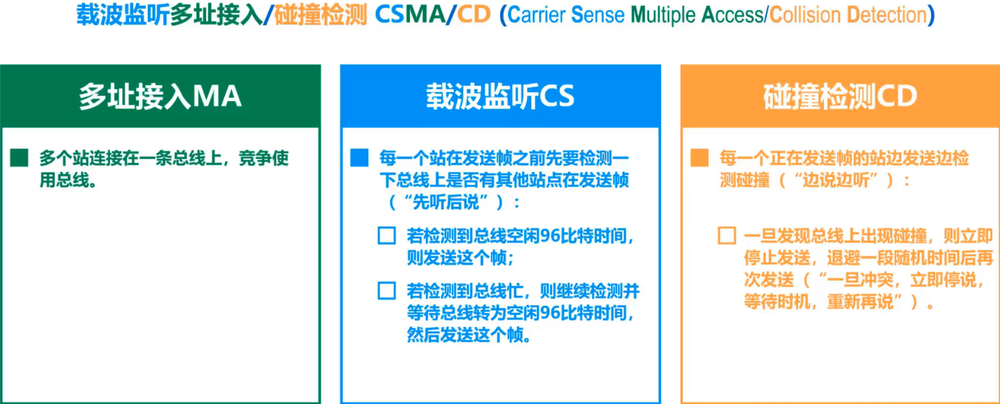

CSMA/CD协议一争用期（碰撞窗口）

CSMA/CD协议一最小帧长

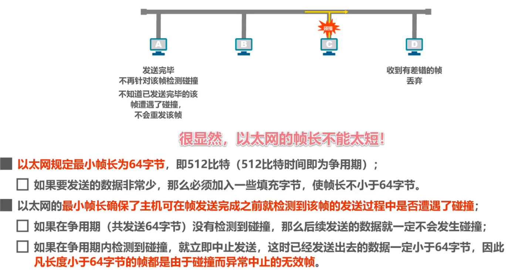

CSMA/CD协议一最大帧长

CSMA/CD协议一截断二进制指数退避算法

CSMA/CD协议一信道利用率

CSMA/CD协议—帧发送流程

CSMA/CD协议——帧接收流程

#### 3.6.4媒体接入控制-动态接入控制-随机接入-CSMA/CA协议

载波监听多址接入/碰撞避免CSMA/CA（CarrierSenseMultipleAccess/CollisionAvoidance)

既然CSMA/CD协议已经成功地应用于使用广播信道的有线局域网，那么同样使用广播信道的无线局域网能不能也使用CSMA/CD协议呢？

- **在无线局域网中，仍然可以使用载波监听多址接入CSMA**，即在发送帧之前先对传输媒体进行载波监听。若发现有其他站在发送帧，就推迟发送以免发生碰撞。
- **在无线局域网中，不能使用碰撞检测CD**，原因如下：
  - 由于无线信道的传输条件特殊，其信号强度的动态范围非常大，无线网卡上接收到的信号强度往往会远远小于发送信号的强度（可能相差百万倍）。**如果要在无线网卡上实现碰撞检测CD，对硬件的要求非常高**。
  - 即使能够在硬件上实现无线局域网的碰撞检测功能，但由于无线电波传播的特殊性（**存在隐蔽站问题**），**进行碰撞检测的意义也不大**。

- **802.11无线局域网**使用CSMA/CA协议，在CSMA的基础上增加了一个**碰撞避免CA功能**，而不再实现碰撞检测功能。
- 由于**不可能避免所有的碰撞**，并且**无线信道误码率较高**，802.11标准还使用了**数据链路层确认机制（停止-等待协议）**来保证数据被正确接收。
- 802.11的MAC层标准定义了两种不同的媒体接入控制方式：
  - **分布式协调功能DCF**（DistributedCoordinationFunction)。在DCF方式下，没有中心控制站点，每个站点使用CSMA/CA协议通过争用信道来获取发送权，这是802.11定义的默认方式。
  - **点协调功能PCF**（PointCoordinationFunction)。PCF方式使用集中控制的接入算法（一般在接入点AP实现集中控制），是802.11定义的可选方式，在实际中较少使用。

帧间间隔IFS（InterFrameSpace)

- 802.11标准规定，所有的**站点必须在持续检测到信道空闲一段指定时间后才能发送帧**，这段时间称为顿间间隔IFS。
- 倾间间隔的长短取决于该站点要发送的帧的类型：
  - 高优先级帧需要等待的时间较短，因此可优先获得发送权；
  - 低优先级帧需要等待的时间较长。若某个站的低优先级帧还没来得及发送，而其他站的高优先级帧已发送到信道上，则信道变为忙态，因而低优先级帧就只能再推迟发送了。这样就减少了发生碰撞的机会。
- 常用的两种帧间间隔如下：
  - **短帧间间隔SIFS**（28uS），是最短的帧间间隔，用来分隔开属于一次对话的各帧。一个站点应当能够在这段时间内从发送方式切换到接收方式。使用SIFS的帧类型有ACK帧、CTS帧、由过长的MAC帧分片后的数据帧、以及所有回答AP探询的帧和在PCF方式中接入点AP发送出的任何帧。
  - **DCF帧间间隔DIFS**（128uS)，它比短帧间间隔SIFS要长得多，在DCF方式中用来发送数据帧和管理帧。

CSMA/CA协议的工作原理

- 当站点检测到信道是空闲的，并且所发送的数据帧不是成功发送完上一个数据帧之后立即连续发送的数据帧，则不使用退避算法。
- 以下情况必须使用退避算法：
  - 在发送数据帧之前检测到信道处于忙状态时；
  - 在每一次重传一个数据帧时；
  - 在每一次成功发送后要连续发送下一个帧时（这是为了避免一个站点长时间占用信道）。

CSMA/CA协议的退避算法

CSMA/CA协议的信道预约和虚拟载波监听

- 为了**尽可能减少碰撞的概率**和降低碰撞的影响，802.11标准充许要发送数据的站点**对信道进行预约**。
  1. 源站在发送数据帧之前先发送一个短的控制帧，称为**请求发送RTS**（RequestToSend)，它包括源地址、目的地址以及这次通信（包括相应的确认帧）所需的持续时间。
  2. 若目的站正确收到源站发来的RTS帧，且媒体空闲，就发送一个响应控制帧，称为**允许发送CTS**（ClearToSend），它也包括这次通信所需的持续时间（从RTS帧中将此持续时间复制到CTS帧中）。
  3. 源站收到CTS帧后，再等待一段时间SIFS后，就可发送其数据帧。
  4. 若目的站正确收到了源站发来的数据帧，在等待时间SIFS后，就向源站发送确认帧ACK。

- 除源站和目的站以外的**其他各站**，在**收到CTS帧（或数据帧）后就推迟接入到无线局域网中**。这样就保证了源站和目的站之间的通信不会受到其他站的干扰。
- 如果RTS帧发生碰撞，源站就收不到CTS帧，需执行退避算法重传RTS帧。
- **由于RTS帧和CTS帧很短，发送碰撞的概率、碰撞产生的开销及本身的开销都很小**。而对于一般的数据帧，其发送时延往往大于传播时延（因为是局域网），碰撞的概率很大，且一旦发生碰撞而导致数据帧重发，则浪费的时间就很多，因此**用很小的代价对信道进行预约往往是值得的**。802.11标准规定了3种情况供用户选择：
  - 使用RTS帧和CTS帧
  - 不使用RTS帧和CTS帧
  - 只有当数据帧的长度超过某一数值时才使用RTS帧和CTS帧

- 除RTS帧和CTS帧会携带通信需要持续的时间，数据帧也能携带通信需要持续的时间，这称为802.11的**虚拟载波监听**机制。
- 由于利用虚拟载波监听机制，**站点只要监听到RTS帧、CTS帧或数据帧中的任何一个，就能知道信道被占用的持续时间**，而不需要真正监听到信道上的信号，因此**虚拟载波监听机制能减少隐蔽站带来的碰撞问题**。

### 3.7MAC地址、IP地址以及ARP协议

#### 3.7.1 MAC地址

- 当多个主机连接在同一个广播信道上，要想实现两个主机之间的通信，则每个主机都必须有一个唯一的标识，即一个数据链路层地址；
- 在每个主机发送的**帧中必须携带标识发送主机和接收主机的地址**。由于这类地址是用于媒体接入控制 MAC(MediaAccessControl)，因此这类地址被称为**MAC地址**；
  - MAC地址一般被固化在网卡（网络适配器）的电可擦可编程只读存储器EEPROM中，因此MAC地址也被称为**硬件地址**;
  - MAC地址有时也被称为**物理地址**。**请注意：这并不意味着MAC地址属于网络体系结构中的物理层**！
- 一般情况下，用户主机会包含两个网络适配器：有线局域网适配器（有线网卡）和无线局域网适配器（无线网卡）。每个网络适配器都有一个全球唯一的MAC地址。而交换机和路由器往往拥有更多的网络接口，所以会拥有更多的MAC地址。综上所述，**严格来说，MAC地址是对网络上各接口的唯一标识，而不是对网络上各设备的唯一标识**。

IEEE 802局域网的MAC地址格式

IEEE802局域网的MAC地发送顺序

单播MAC地址举例

广播MAC地址举例

给主机配置多播组列表进行私有应用时，不得使用公有的标准多播地址

#### 3.7.2 IP地址

- IP地址是因特网（lnternet）上的主机和路由器所使用的地址，用于标识两部分信息：
  - **网络编号**：标识因特网上数以百万计的网络
  - **主机编号**：标识同一网络上不同主机（或路由器各接口）
- 很显然，之前介绍的MAC地址不具备区分不同网络的功能。 
  - 如果只是一个单独的网络，不接入因特网，可以只使用MAC地址（这不是一般用户的应用方式）。
  - 如果主机所在的网络要接入因特网，则IP地址和MAC地址都需要使用。

从网络体系结构看IP地址与MAC地址

数据包转发过程中IP地址与MAC地址的变化情况

- 数据包转发过程中**源IP地址和目的IP地址保持不变**；
- 数据包转发过程中**源MAC地址和目的MAC地址逐个链路（或逐个网络）改变**

#### 3.7.3 ARP协议

- 源主机在自己的**ARP高速缓存表**中查找目的主机的IP地址所对应的MAC地址，若找到了，则可以封装MAC帧进行发送；若找不到，则发送**ARP请求（封装在广播MAC帧中）**
- 目的主机收到ARP请求后，将源主机的IP地址与MAC地址记录到自己的ARP高速缓存表中，然后给源主机发送**ARP响应（封装在单播MAC帧中）**，ARP响应中包含有目的主机的IP地址和MAC 地址
- 源主机收到ARP响应后，将目的主机的IP地址与MAC地址记录到自己的ARP高速缓存表中，然后就可以封装之前想发送的MAC帧并发送给目的主机；
- **ARP的作用范围：逐段链路或逐个网络使用**
- **除ARP请求和响应外，ARP还有其他类型的报文**（例如用于检查IP地址冲突的“无故ARP、免费ARP（GratuitousARP)”）
-  ARP没有安全验证机制，**存在ARP欺骗（攻击）问题**

### 3.8集线器与交换机的区别

- 早期的总线型以太网

- 使用双绞线和集线器HUB的星型以太网
  - **使用集线器的以太网在逻辑上仍是一个总线网**，各站共享总线资源，**使用的还是CSMA/CD协议**；
  - **集线器只工作在物理层**，它的每个接口仅简单地转发比特，不进行碰撞检测（由各站的网卡检测）；
  - **集线器一般都有少量的容错能力和网络管理功能**。例如，若网络中某个网卡出了故障，不停地发送帧。此时，集线器可以检测到这个问题，在内部断开与出故障网卡的连线，使整个以太网仍然能正常工作。

- 使用集线器HUB在物理层扩展以太网

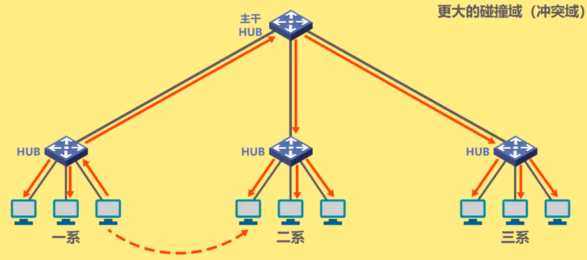

- 以太网交换机

- 以太网交换机通常都有**多个接口**。每个接口都可以直接与一台主机或另一个以太网交换机相连。一般都工作在**全双工方式**。
- 以太网交换机具有并行性，能**同时连通多对接口**，使多对主机能同时通信，**无碰撞**（**不使用CSMA/CD协议**）。
- 以太网交换机一般都具有多种速率的接口，例如：
  10Mb/s、100Mb/s、1Gb/s、10Gb/s接口的多种组合。
- 以太网交换机**工作在数据链路层**（也包括物理层），它收到帧后，在帧交换表中查找**帧的目的MAC地址所对应的接口号**，然后通过该接口转发帧。
- 以太网交换机是一种即插即用设备，其内部的**帧交换表**是通过**自学习算法**自动地逐渐建立起来的。
- 帧的两种转发方式： 
  1.**存储转发**
  2.**直通交换**：采用基于硬件的交叉矩阵（交换时延非常小，但不检查帧是否有差错）

- 对比集线器和交换机

### 3.9以太网交换机自学习和转发帧的流程

- 以太网交换机工作在**数据链路层**（也包括物理层）
- 以太网交换机收到帧后，在帧交换表中查找**帧的目的MAC地址所对应的接口号**，然后通过该接口转发帧。
- 以太网交换机是一种即插即用设备，刚上电启动时其内部的帧交换表是空的。随着网络中各主机间的通信，以太网交换机**通过自学习算法**自动逐渐**建立起帧交换表**。
- 以太网交换机自学习和转发帧的流程：
  - 收到帧后进行**登记**。登记的内容为**帧的源MAC地址**及进入交换机的**接口号**；
  - 根据**帧的目的MAC地址**和交换机的**帧交换表**对帧进行**转发**，有以下三种情况：
    - **明确转发**：交换机知道应当从哪个（或哪些）接口转发该帧（单播，多播，广播）
    - **盲目转发**：交换机不知道应当从哪个端口转发帧，只能将其通过除进入交换机的接口外的其他所有接口转发（也称为泛洪）。
    - **明确丢弃**：交换机知道不应该转发该帧，将其丢弃。
- 顿交换表中的每条记录都有自己的**有效时间**，到期删除。原因如下：
  - 交换机的接口改接了另一台主机；
  - 主机更换了网卡。

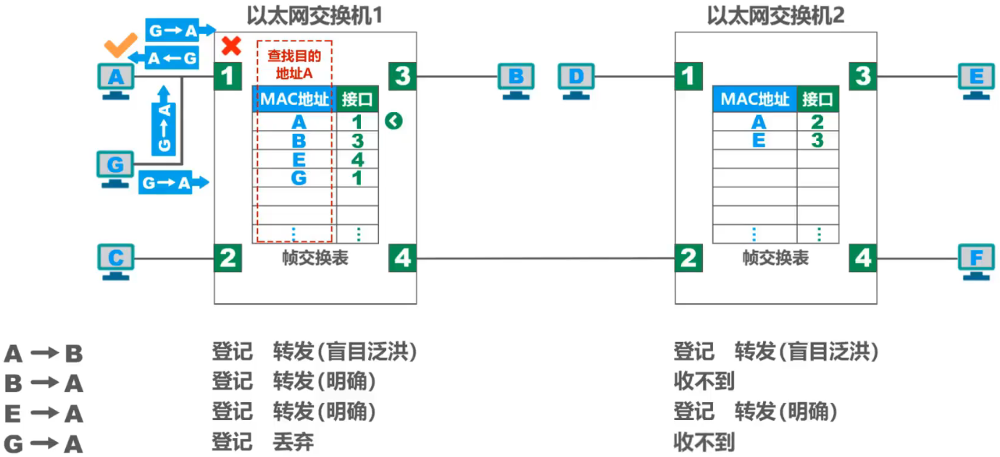

### 3.10以太网交换机的生成树协议STP

### 3.11虚拟局域网VLAN

#### 3.11.1虚拟局域网VLAN概述

**网络中会频繁出现广播信息**

- TCP/IP协议栈中的很多协议都会使用广播：
  - 地址解析协议ARP（已知IP地址，找出其相应的MAC地址）
  - 路由信息协议RIP（一种小型的内部路由协议）
  - 动态主机配置协议DHCP（用于自动配置IP地址）
- NetBEUl：Widnows下使用的广播型协议 
- IPX/SPX：Novell网络的协议栈
- AppleTalk：Apple公司的网络协议栈

**分割广播域的方法**

- 使用路由器可以隔离广播域
  路由器的成本较高

- 虚拟局域网VLAN技术应运而生

虚拟局域网VLAN（VirtualLocalAreaNetwork）是一种将局域网内的**设备划分成与物理位置无关的逻辑组的技术，这些逻辑组具有某些共同的需求**.

#### 3.11.2虚拟局域网VLAN的实现机制

IEEE802.1Q帧

**交换机的端口类型**

- 交换机的端口类型有以下三种：
  Access、Trunk、Hybrid
- 交换机各端口的缺省VLAN ID
  - 在思科交换机上称为Native VLAN，即本征VLAN。
  - 在华为交换机上称为Port VLAN ID，即端口VLANID，简记为PVID。

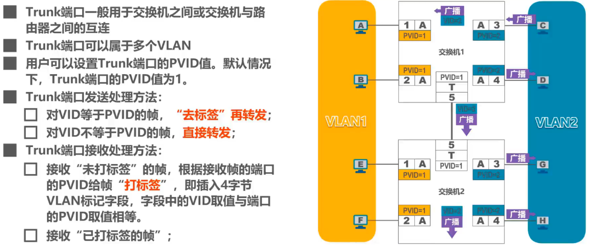

## 第四章 网络层

### 4.1网络层概述

- 网络层的主要任务是**实现网络互连**，进而**实现数据包在各网络之间的传输**。
- 要实现网络层任务，需要解决以下主要问题：
  - 网络层向运输层提供怎样的服务（“可靠传输”还是“不可靠传输”）
  - 网络层寻址问题
  - 路由选择问题

- **因特网**（Internet）是目前全世界用户数量最多的互联网，它**使用TCP/IP协议栈**。
- 由于TCP/IP协议栈的网络层使用**网际协议IP**，它是整个协议栈的核心协议，因此在 TCP/IP协议栈中网络层常称为**网际层**
- 综上所述，我们通过学习TCP/IP协议栈的网际层来学习网络层的理论知识和实践技术。

### 4.2网络层提供的两种服务

面向连接的虚电路服务

- **可靠通信由网络来保证**
- 必须建立**网络层的连接**——**虚电路VC**（Virtual Circuit）
- 通信双方**沿着已建立的虚电路发送分组**
- 目的主机的地址仅在连接建立阶段使用，之后每个**分组的首部只需携带一条虚电路的编号**（构成虚电路的每一段链路都有一个虚电路编号）。
- 这种通信方式如果再使用可靠传输的网络协议，就可使所发送的分组最终正确到达接收方（无差错按序到达、不丢失、不重复）。
- **通信结束后，需要释放之前所建立的虚电路**。
- 很多广域分组交换网都使用面向连接的虚电路服务。例如，曾经的X.25和逐渐过时的帧中继FR、异步传输模式ATM等。

无连接的数据报服务

- **可靠通信应当由用户主机来保证**
- **不需要建立网络层连接**
- **每个分组可走不同的路径**
- 每个分组的**首部必须携带目的主机的完整地址**
- 这种通信方式所传送的**分组可能误码、丢失、重复和失序。**
- 由于**网络本身不提供端到端的可靠传输服务**，这就使网络中的路由器可以做得比较简单，而且价格低廉（与电信网的交换机相比较）。
- 因特网采用了这种设计思想，也就是**将复杂的网络处理功能置于因特网的边缘（用户主机和其内部的运输层）**，而将相对简单的尽最大努力的分组交付功能置于因特网核心。

### 4.3 IPv4地址

#### 4.3.1 IPv4地址概述

- 在TCP/IP体系中，IP地址是一个最基本的概念，我们必须把它弄清楚。
- **IPv4地址**就是给因特网（lnternet）上的**每一台主机（或路由器）的每一个接口**分配一个在全世界范围内是**唯一的32比特的标识符**。
- IP地址由因特网名字和数字分配机构ICANN(Internet Corporation for Assigned Names and Numbers)进行分配。
  - 我国用户可向亚太网络信息中心APNIC（Asia Pacific Network Information Center）申请IP地址，需要缴费
  - 2011年2月3日，互联网号码分配管理局IANA（由ICANN行使职能）宣布，IPV4地址已经分配完毕。
  - 我国在2014至2015年也逐步停止了向新用户和应用分配IPv4地址。同时全面开展商用部署IPv6。 
- **IPv4地址的编址方法经历了如下三个历史阶段**：

- 32比特的IPv4地址不方便阅读、记录以及输入等，因此IPv4地址采用**点分十进制表示方法**以方便用户使用。
  

- 8位无符号二进制整数转十进制数

- 十进制正整数转8位无符号二进制数

#### 4.3.2 分类编址的IPv4地址

A类网络

B类网络

C类网络

#### 4.3.3 划分子网的IPv4地址

- 为新增网络申请新的网络号会带来以下弊端：
  - 需要等待时间和花费更多的费用
  - 会增加其他路由器中路由表记录的数量
  - 浪费原有网络号中剩余的大量IP地址
- 可以从主机号部分借用一部分比特作为子网号

- **32比特的子网掩码可以表明分类IP地址的主机号部分被借用了几个比特作为子网号**
  - 子网掩码使用**连续的比特1来对应网络号和子网号**
  - 子网掩码使用**连续的比特0来对应主机号**
- 将划分子网的**IPv4地址**与其相应的**子网掩码**进行**逻辑与运算**就可得到IPv4地址**所在子网的网络地址**

默认的子网掩码是指在未划分子网的情况下使用的子网掩码

#### 4.3.4 无分类编址的IPv4地址

- 划分子网在一定程度上缓解了因特网在发展中遇到的困难，但是**数量巨大的C类网**因为其**地址空间太小**并**没有得到充分使用**，而因特网的IP地址仍在加速消耗，整个**IPv4地址空间面临全部耗尽的威胁**。
- 为此，因特网工程任务组IETF又提出了采用**无分类编址**的方法来解决IP地址紧张的问题，同时还专门成立IPv6工作组负责研究新版本IP以彻底解决IP地址耗尽问题。
- 1993年，IETF发布了**无分类域间路由选择CIDR**(Classless Inter-Domain Routing)的RFC 文档：RFC1517~1519和1520。
  - **CIDR消除了传统的A类、B类和C类地址，以及划分子网的概念**；
  - **CIDR可以更加有效地分配IPv4的地址空间**，并且可以在新的IPv6使用之前允许因特网的规模继续增长。

- CIDR使用“**斜线记法**”，或称CIDR记法。即在IPv4地址后面加上斜线“/”，在**斜线后面写上网络前缀所占的比特数量**。

- CIDR实际上是将**网络前缀都相同的连续的IP地址组成一个“CIDR地址块”**
- 我们只要知道CIDR地址块中的任何一个地址，就可以知道该地址块的全部细节：
  - 地址块的最小地址
  - 地址块的最大地址
  - 地址块中的地址数量
  - 地址块聚合某类网络（A类、B类或C类）的数量
  - 地址掩码（也可继续称为子网掩码）

**路由聚合**（构造超网）

#### 4.3.5地址的应用规划

定长的子网掩码FLSM

变长的子网掩码VLSM

### 4.4 IP数据报的发送和转发过程

- IP数据报的发送和转发过程包含以下两部分：
  - 主机发送IP数据报
  - 路由器转发IP数据报

- **主机发送IP数据报**
- **判断目的主机是否与自己在同一个网络**（判断方法请参看本节课相关示例）
  - 若在**同一个网络**，则属于**直接交付**
  - 若**不在同一个网络**，则属于**间接交付**，传输给主机所在网络的**默认网关**（路由器），由默认网关帮忙转发；

- **路由器转发IP数据报**
- **检查IP数据报首部是否出错**：
  - 若出错，则直接丢弃该IP数据报并通告源主机；
  - 若没有出错，则进行转发；
- **根据IP数据报的目的地址在路由表中查找匹配的条目**（查找方法请参看本节课相关示例）：
  - 若找到匹配的条目，则转发给条目中指示的下一跳；
  - 若找不到，则丢弃该IP数据报并通告源主机；

### 4.5静态路由配置及其可能产生的路由环路问题

- 静态路由配置是指用户或网络管理员使用路由器的相关命令给路由器**人工配置路由表**。
  - 这种人工配置方式简单、开销小。但**不能及时适应网络状态（流量、拓扑等）的变化**。
  - 一般只在小规模网络中采用。
- 使用静态路由配置可能出现以下**导致**产生**路由环路**的错误
  - 配置错误
  - 聚合了不存在的网络
  - 网络故障

- 路由条目的类型
  - 直连网络
  - 静态路由（人工配置）
  - 动态路由（路由选择协议）
- 特殊的静态路由条目
  - 默认路由（目的网络为0.0.0.0，地址掩码为0.0.0.0）
  - 特定主机路由（目的网络为特定主机的IP地址，地址掩码为255.255.255.255）
  - 黑洞路由（下一跳为null0）

【举例】静态路由配置

【举例】默认路由举例

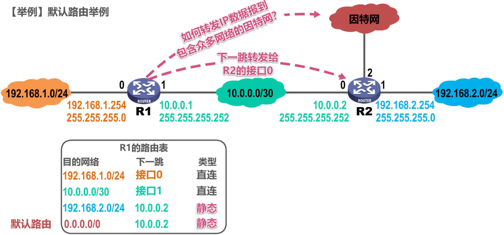

【举例】特定主机路由举例

### 4.6路由协议

#### 4.6.1路由选择协议概述

- 因特网所采用的路由选择协议的主要特点

- 因特网采用**分层次**的路由选择协议

- 常见的路由选择协议

- 路由器的基本结构

#### 4.6.2路由信息协议RIP的基本工作原理

- **路由信息协议RIP**（Routing Information Protocol）是内部网关协议IGP中最先得到广泛使用的协议之一，其相关标准文档为RFC1058。
- RIP要求自治系统AS内的每一个路由器都要维护从它自己到AS内其他每一个网络的距离记录。这是一组距离，称为“**距离向量D-V(Distance-Vector)**”。
- RIP使用**跳数**（HopCount)作为度量（Metric）**来衡量到达目的网络的距离**。
  - 路由器到直连网络的距离定义为1。
  - 路由器到非直连网络的距离定义为所经过的路由器数加1。
  - 允许一条路径最多只能包含15个路由器。“距离”等于16时相当于不可达。因此，**RIP只适用于小型互联网**。

- RIP认为**好的路由**就是“距离短”的路由，也就是**所通过路由器数量最少的路由**

- 当到达同一目的网络有多条“距离相等”的路由时，可以进行**等价负载均衡** 
- RIP包含以下三个要点：
  - **和谁交换信息**：仅和**相邻路由器**交换信息
  - **交换什么信息**：自己的**路由表**
  - **何时交换信息**：**周期性交换**（例如每30秒）

【举例】RIP的基本工作过程

【举例】RIP的路由条目的更新规则

- RIP存在“**坏消息传播得慢**”的问题
- “坏消息传播得慢”又称为**路由环路**或**距离无穷计数**问题，这是**距离向量算法的一个固有问题**。可以采取多种措施**减少**出现该问题的概率或减小该问题带来的危害。
  - **限制最大路径距离**为15（16表示不可达）
  - 当路由表发生变化时就立即发送更新报文（即“**触发更新**”），而不仅是周期性发送
  - 让路由器记录收到某特定路由信息的接口，而不让同一路由信息再通过此接口向反方向传送（即“**水平分割**”）

#### 4.6.3开放最短路径优先OSPF的基本工作原理

- 开放最短路径优先OSPF（OpenShortestPathFirst），是为克服RIP的缺点在1989年开发出来的。
  - “开放”表明OSPF协议不是受某一家厂商控制，而是**公开发表**的。
  - “最短路径优先”是因为使用了Dijkstra提出的**最短路径算法**SPF。
- OSPF是**基于链路状态**的，而不像RIP那样是基于距离向量的。
- OSPF采用SPF算法计算路由，从算法上保证了**不会产生路由环路**。
- OSPF**不限制网络规模**，更新效率高，**收敛速度快**。
- 链路状态是指本路由器都**和哪些路由器相邻**，以及相应**链路的“代价”**(cost)。
  - “代价”用来表示费用、距离、时延、带宽，等等。这些都由网络管理人员来决定。

- OSPF相邻路由器之间通过交互**问候（Hello）分组**，建立和维护**邻居关系**。
  

- 使用OSPF的每个路由器都会产生**链路状态通告LSA**（LinkStateAdvertisement)。LSA中包含以下内容：
  - 直连网络的链路状态信息
  - 邻居路由器的链路状态信息
- LSA被封装在**链路状态更新分组LSU**中，采用**洪泛法**发送。
- 使用OSPF的每个路由器都有一个**链路状态数据库LSDB**，用于存储LSA。
- 通过各路由器洪泛发送封装有自己LSA的LSU分组，各路由器的LSDB最终将达到一致。

- 使用OSPF的各路由器**基于LSDB进行最短路径优先SPF计算**，构建出各自到达其他各路由器的最短路径，即构建各自的路由表。

- OSPF有以下五种分组类型

- OSPF的基本工作过程

- OSPF在多点接入网络中路由器邻居关系的建立

- 为了使OSPF能够用于规模很大的网络，OSPF把一个自治系统再划分为若干个更小的范围，叫做**区域**（Area）

#### 4.6.4边界网关协议BGP的基本工作原理

- 因特网采用分层次的路由选择协议
  

- 内部网关协议IGP（例如路由信息协议RIP或开放最短路径优先OSPF）

  - 设法使分组在一个自治系统内尽可能有效地从源网络传输到目的网络
  - 无需考虑自治系统外部其他方面的策略

- 外部网关协议EGP（例如边界网关协议BGP）

  - 在不同自治系统内，度量路由的“代价”（距离，带宽，费用等）可能不同。因此，对于自治系统之间的路由选择，使用“代价”作为度量来寻找最佳路由是不行的。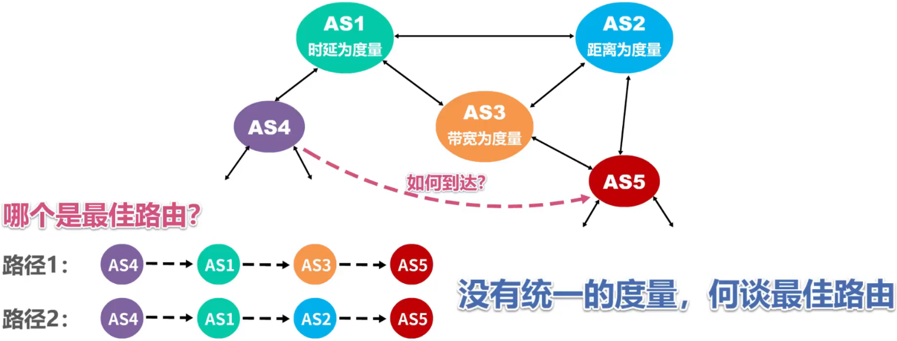
  - 自治系统之间的路由选择必须考虑相关策略（政治，经济，安全等）

  - BGP只能是力求寻找一条能够到达目的网络且比较好的路由（不能兜圈子），而并非要寻找一条最佳路由

- 在配置BGP时，每个自治系统的管理员要选择至少一个路由器作为该自治系统的“**BGP发言人**”
- 不同自治系统的BGP发言人要交换路由信息，首先必须建立**TCP连接**，端口号为179 
  - 在此TCP连接上交换BGP报文以建立**BGP会话**
  - 利用BGP会话**交换路由信息**（例如，增加新的路由，或撤销过时的路由，以及报告出错的情况等）
  - 使用TCP连接交换路由信息的两个BGP发言人，彼此称为对方的**邻站**（neighbor）或**对等站**（peer） 
- BGP发言人除了运行BGP外，还必须运行自己所在自治系统所使用的内部网关协议IGP，例如OSPF或RIP。
- BGP发言人**交换网络可达性的信息**（要到达某个网络所要经过的一系列自治系统）
- 当BGP发言人互相交换了网络可达性的信息后，各BGP发言人就**根据**所采用的**策略**从收到的路由信息中**找出到达各自治系统的较好的路由**。也就是构造出树形结构、**不存在回路的自治系统连通图**。

- BGP适用于多级结构的因特网

- BGP-4有以下四种报文
  - **OPEN（打开）报文**：用来与相邻的另一个BGP发言人建立关系，使通信初始化。 
  - **UPDATE（更新）报文**：用来通告某一路由的信息，以及列出要撤销的多条路由。
  - **KEEPALIVE（保活）报文**：用来周期性地证实邻站的连通性。
  - **NOTIFICATION（通知）报文**：用来发送检测到的差错。

### 4.7 IPv4数据报的首部格式

- **版本**：占4比特，表示IP协议的版本。通信双方使用的IP协议的版本必须一致。目前广泛使用的IP协议版本号为4（即IPv4）
- **首部长度**：占4比特，表示IP数据报首部的长度。该字段的取值以4字节为单位。
  最小十进制取值为5，表示IP数据报首部只有20字节固定部分；
  最大十进制取值为15，表示IP数据报首部包含20字节固定部分和最大40字节可变部分。
- **可选字段**：长度从1个字节到40个字节不等。用来支持排错、测量及安全等措施。
  可选字段增加了IP数据报的功能，但这同时也使得IP数据报的首部长度成为可变的。这就增加了每一个路由器处理IP数据报的开销。实际上可选字段很少被使用。
- **填充字段**：确保首部长度为4字节的整数倍。使用全0进行填充。
- **区分服务**：占8比特，用来获得更好的服务。1998年，因特网工程任务组IETF把这个字段改名为区分服务。利用该字段的不同数值可提供不同等级的服务质量。只有在使用区分服务时，该字段才起作用。一般情况下都不使用该字段。
- **总长度**：占16比特，表示IP数据报的总长度（首部+数据载荷）。最大取值为十进制的65535，以字节为单位。
- **标识**：占16比特，属于同一个数据报的各分片数据报应该具有相同的标识。IP软件维持一个计数器，每产生一个数据报，计数器值加1，并将此值赋给标识字段。
- **标志**：占3比特，各比特含义如下：DF位：1表示不允许分片；0表示允许分片；MF位：1表示“后面还有分片”；0表示“这是最后一个分片”；保留位：必须为0。
- **片偏移**：占13比特，指出分片数据报的数据载荷部分偏移其在原数据报的位置有多少个单位。片偏移以8个字节为单位。
- **生存时间TTL**：占8比特，表示IP数据报的生存时间。
  最初以秒为单位，最大生存周期为255秒：路由器转发IP数据报时，将IP数据报首部中的该字段的值减去IP数据报在本路由器上所耗费的时间，若不为0就转发，否则就丢弃。现在以“跳数”为单位，路由器转发IP数据报时，将IP数据报首部中的该字段的值减1，若不为0就转发，否则就丢弃。
  IP数据报每经过一个路由器，路由器都要重新计算首部检验和，因为某些字段（生存时间、标志、片偏移等）的取值可能发生变化。
- **协议**：占8比特，指明IPv4数据报的数据部分是何种协议数据单元。常用的一些协议和相应的协议字段值如下。
  
- **首部检验和**：占16比特，用来检测首部在传输过程中是否出现差错。比CRC检验码简单，称为因特网检验和。
  由于IP层本身并不提供可靠传输的服务，并且计算首部校验和是一项耗时的操作，因此在IPv6中，路由器不再计算首部校验和，从而更快转发IP数据报。
- **源IP地址和目的IP地址**：各占32比特，用来填写发送该IP数据报的源主机的IP地址和接收该IP数据报的目的主机的IP地址。

【举例】对IPv4数据报进行分片

【举例】生存时间TTL字段的作用一防止IP数据报在网络中永久兜圈

### 4.8网际控制报文协议ICMP

- 为了更有效地转发IP数据报和提高交付成功的机会，在网际层使用了网际控制报文协议 **ICMP**(lnternet Control Message Protocol)。
- 主机或路由器使用ICMP来发送**差错报告报文**和**询问报文**。
- **ICMP报文被封装在IP数据报**中发送。

- **ICMP差错报告报文共有以下五种：**

  - 终点不可达
    

  - 源点抑制
    

  - 时间超过

    - 当路由器收到一个目的IP地址不是自己的IP数据报，会将其生存时间TTL字段的值减1。
      若结果不为0，则将该IP数据报转发出去；若结果为0，除丢弃该IP数据报外，还要向源点发送时间超过报文。
    - 另外，当终点在预先规定的时间内不能收到一个数据报的全部数据报片时，就把已收到的数据报片都丢弃，也会向源点发送时间超过报文。

    

  - 参数问题
    

  - 改变路由 (重定向）
    

- 以下情况**不应发送ICMP差错报告报文**：
  - 对ICMP差错报告报文不再发送ICMP差错报告报文
  - 对第一个分片的数据报片的所有后续数据报片都不发送ICMP差错报告报文
  - 对具有多播地址的数据报都不发送ICMP差错报告报文
  - 对具有特殊地址（如127.0.0.0或0.0.0.0）的数据报不发送ICMP差错报告报文

- 常用的**ICMP询问报文**有以下两种：

  - **回送请求和回答**
    ICMP回送请求报文是由主机或路由器向一个特定的目的主机发出的询问。

    收到此报文的主机必须给源主机或路由器发送ICMP回送回答报文。

    这种询问报文用来**测试目的站是否可达**及了解其有关状态。

  - **时间戳请求和回答**
    ICMP时间戳请求报文是请某个主机或路由器回答当前的日期和时间。

    在ICMP时间戳回答报文中有一个32位的字段，其中写入的整数代表从1900年1月1日起到当前时刻一共有多少秒。

    这种询问报文用来**进行时钟同步和测量时间**。

- ICMP应用举例

  - 分组网间探测PING(Packet Internet Groper)

    用来测试主机或路由器间的连通性

    应用层直接使用网际层的ICMP（没有通过运输层的TCP或UDP）

    使用ICMP回送请求和回答报文

    

  - 跟踪路由 traceroute

    - 用来测试IP数据报从源主机到达目的主机要经过哪些路由器 

      Windows版本
      tracert命令
      应用层直接使用网际层ICMP
      使用了ICMP回送请求和回答报文以及差错报告报文 

    - Unix版本
      traceroute命令
      在运输层使用UDP协议
      仅使用ICMP差错报告报文

### 4.9虚拟专用网VPN与网络地址转换NAT

- **虚拟专用网VPN**（VirtualPrivateNetwork）

  **利用公用的因特网**作为本机构各专用网之间的通信载体，这样的专用网又称为虚拟专用网。由于IPv4地址的紧缺，一个机构能够申请到的IPv4地址数量往往远小于本机构所拥有的主机数量。因此，**虚拟专用网中的各主机所分配的地址应该是本机构可自由分配的专用地址**而不是需要申请的、在因特网上使用的公有地址。

如下图所示，同一机构内不同部门的内部网络所构成的虚拟专用网VPN又称为**内联网VPN**。

有时一个机构的VPN需要有某些外部机构（通常就是合作伙伴）参加进来。这样的VPN就称为**外联网VPN**。

在外地工作的员工需要访问公司内部的专用网络时，只要在任何地点接入到因特网，运行驻留在员工PC中的 VPN软件，在员工的PC和公司的主机之间建立VPN隧道，即可访问专用网络中的资源。这种VPN称为**远程接入VPN**。

- 网络地址转换NAT（Network Address Translation)

虽然因特网采用了无分类编址方式来减缓IPv4地址空间耗尽的速度，但由于因特网用户数目的激增，特别是大量小型办公室网络和家庭网络接入因特网的需求不断增加，IPv4地址空间即将面临耗尽的危险仍然没有被解除。

1994年提出了一种网络地址转换NAT的方法再次**缓解了IPv4地址空间即将耗尽的问题**。

NAT能使大量**使用内部专用地址的专用网络用户共享少量外部全球地址来访问因特网上的主机和资源**。

该转换方法存在一个问题：如果NAT路由器具有 N个全球IP地址，那么至多只能有N个内网主机能够同时和因特网上的主机通信

对于一些P2P网络应用，需要外网主机主动与内网主机进行通信，在通过NAT 时会遇到问题，需要网络应用自己使用一些特殊的NAT穿越技术来解决问题。

另外，由于NAT对外网屏蔽了内网主机的网络地址，能为内网的主机提供一定的安全保护。

## 第五章 运输层

### 5.1运输层概述

- 之前课程所介绍的计算机网络体系结构中的**物理层**、**数据链路层**以及**网络层**它们共同解决了将主机通过异构网络互联起来所面临的问题，**实现了主机到主机的通信**。
- 但实际上在计算机网络中进行**通信的真正实体是位于通信两端主机中的进程**。
- **如何为运行在不同主机上的应用进程提供直接的通信服务是运输层的任务**，运输层协议又称为端到端协议。

### 5.2运输层端口号、复用与分用的概念

- 运行在计算机上的进程使用**进程标识符PID**来标志。
- 因特网上的计算机并不是使用统一的操作系统，不同的操作系统（windows，Linux，MacOS）又使用**不同格式的进程标识符**。
- 为了使运行不同操作系统的计算机的应用进程之间能够进行网络通信，就必须**使用统一的方法对 TCP/IP体系的应用进程进行标识**
- TCP/IP体系的运输层使用**端口号**来区分应用层的不同应用进程口
  - 端口号使用**16比特表示**，取值范围**0~65535**；
    - **熟知端口号**：0~1023，IANA把这些端口号指派给了TCP/IP体系中最重要的一些应用协议，例如：FTP 使用21/20，HTTP使用80，DNS使用53。
    - **登记端口号**：1024~49151，为没有熟知端口号的应用程序使用。使用这类端口号必须在IANA按照规定的手续登记，以防止重复。例如：MicrosoftRDP微软远程桌面使用的端口是3389。
    - **短暂端口号**：49152~65535，留给客户进程选择暂时使用。当服务器进程收到客户进程的报文时，就知道了客户进程所使用的动态端口号。通信结束后，这个端口号可供其他客户进程以后使用。
  - **端口号只具有本地意义**，即端口号只是为了**标识本计算机应用层中的各进程**，在因特网中，**不同计算机中的相同端口号是没有联系的**。

- 发送方的复用和接收方的分用

- TCP/IP体系的应用层常用协议所使用的运输层熟知端口号

### 5.3UDP和TCP的对比

- UDP和TCP是TCP/IP体系结构运输层中的两个重要协议

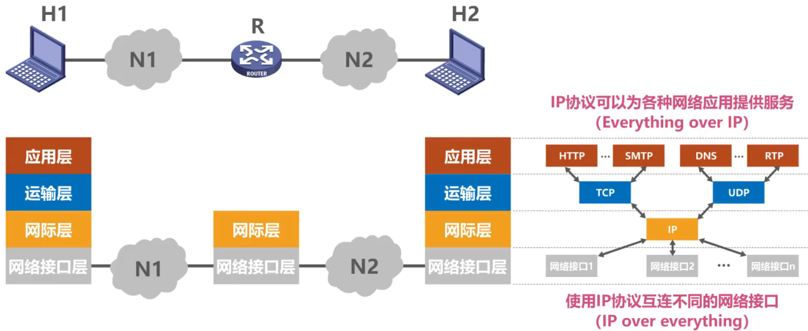

### 5.4TCP的流量控制

- 一般来说，我们总是希望数据传输得更快一些。
  - 但如果发送方把数据发送得过快，接收方就可能来不及接收，这就会造成数据的丢失。
- 所谓流量控制（flowcontrol）就是**让发送方的发送速率不要太快，要让接收方来得及接收**
- 利用**滑动窗口**机制可以很方便地在TCP连接上实现对发送方的流量控制。

### 5.5TCP的拥塞控制

- 在某段时间，若**对网络中某一资源的需求超过了该资源所能提供的可用部分**，**网络性能就要变坏**。这种情况就叫做**拥塞**（congestion)。
  - 在计算机网络中的链路容量（即带宽）、交换结点中的缓存和处理机等，都是网络的资源。
- 若**出现拥塞而不进行控制**，整个网络的**吞吐量将随输入负荷的增大而下降**。

**下面介绍这四种拥塞控制算法的基本原理，假定如下条件：**

1. 数据是单方向传送，而另一个方向只传送确认。
2. 接收方总是有足够大的缓存空间，因而发送方发送窗口的大小由网络的拥塞程度来决定。
3. 以最大报文段MSS的个数为讨论问题的单位，而不是以字节为单位。

### 5.6TCP超时重传时间的选择

- 超时重传时间的选择是TCP最复杂的问题之一

- RFC6298建议使用下式计算超时重传时间RTO：

- 往返时间RTT的测量比较复杂

- 针对**出现超时重传时无法测准往返时间RTT的问题**，**Karn** 提出了一个**算法**：**在计算加权平均往返时间RTTs时，只要报文段重传了，就不采用其往返时间RTT样本**。也就是出现重传时，不重新计算RTTs，进而超时重传时间RTO也不会重新计算。
  - 这又引起了新的问题。设想出现这样的情况：报文段的时延突然增大了很多，并且之后很长一段时间都会保持这种时延。因此在原来得出的重传时间内，不会收到确认报文段。于是就重传报文段。但根据Karn算法，不考虑重传的报文段的往返时间样本。这样，超时重传时间就无法更新。这会导致报文段反复被重传。
- 因此，要对**Karn算法进行修正**。方法是：**报文段每重传一次，就把超时重传时间 RTO增大一些**。典型的做法是将新RTO的值取为I日RTO值的2倍。

### 5.7TCP可靠传输的实现

- TCP基于以字节为单位的滑动窗口来实现可靠传输

- 虽然发送方的发送窗口是根据接收方的接收窗口设置的，但在同一时刻，**发送方的发送窗口并不总是和接收方的接收窗口**一样大。
  - 网络传送窗口值需要经历一定的时间滞后，并且这个时间还是不确定的。
  - 发送方还可能根据网络当时的拥塞情况适当减小自己的发送窗口尺寸。
- 对于**不按序到达的数据应如何处理**，TCP并无明确规定。
  - 如果接收方把不按序到达的数据一律丢弃，那么接收窗口的管理将会比较简单，但这样做对网络资源的利用不利，因为发送方会重复传送较多的数据。
  - TCP通常对不按序到达的数据是先临时存放在接收窗口中，等到字节流中所缺少的字节收到后，再**按序交付上层的应用进程**。
- TCP要求接收方必须有**累积确认和销带确认机制**，这样可以减小传输开销。接收方可以在合适的时候发送确认，也可以在自己有数据要发送时把确认信息顺便销带上。
  - **接收方不应过分推迟发送确认**，否则会导致发送方不必要的超时重传，这反而浪费了网络的资源。
    TCP标准规定，确认推迟的时间不应超过0.5秒。若收到一连串具有最大长度的报文段，则必须每隔一个报文段就发送一个确认[RFC1122]。
  - 销带确认实际上并不经常发生，因为大多数应用程序很少同时在两个方向上发送数据。
- **TCP的通信是全双工通信**。通信中的每一方都在发送和接收报文段。因此，每一方都有自己的发送窗口和接收窗口。在谈到这些窗口时，一定要弄清楚是哪一方的窗口。

### 5.8 TCP的运输连接管理

#### 5.8.1 TCP的运输连接管理一TCP的连接建立

- TCP是面向连接的协议，它基于运输连接来传送TCP报文段。
- TCP运输连接的建立和释放是每一次面向连接的通信中必不可少的过程。
- TCP运输连接有以下三个阶段：

- TCP的运输连接管理就是使运输连接的建立和释放都能正常地进行。

- TCP的连接建立要解决以下三个问题：
  1. 使TCP双方能够确知对方的存在；
  2. 使TCP双方能够协商一些参数（如最大窗口值、是否使用窗口扩大选项和时间戳选项以及服务质量等）；
  3. 使TCP双方能够对运输实体资源（如缓存大小、连接表中的项目等）进行分配。

- TCP使用“三报文握手”建立连接

#### 5.8.2TCP的运输连接管理—TCP的连接释放

- TCP通过“四报文挥手”来释放连接

### 5.9TCP报文段的首部格式

- 为了实现可靠传输，TCP采用了**面向字节流**的方式
- 但TCP在发送数据时，是从发送缓存取出一部分或全部字节并给其添加一个首部使之成为**TCP报文段**后进行发送。
  - 一个TCP报文段由**首部**和**数据载荷**两部分构成；
  - TCP的全部功能都体现在它首部中各字段的作用

- **源端口**：占16比特，写入源端口号，用来**标识发送该TCP报文段的应用进程**。
- **目的端口**：占16比特，写入目的端口号，用来**标识接收该TCP报文段的应用进程**。
  

- **序号**：占32比特，取值范围[0，2^32 - 1]，序号增加到最后一个后，下一个序号就又回到0。**指出本TCP报文段数据载荷的第一个字节的序号**。
  

- **确认号**：占32比特，取值范围[0，2^32-1]，确认号增加到最后一个后，下一个确认号就又回到0。**指出期望收到对方下一个TCP报文段的数据载荷的第一个字节的序号，同时也是对之前收到的所有数据的确认**。**若确认号=n，则表明到序号n-1为止的所有数据都已正确接收，期望接收序号为n的数据**。
- **确认标志位ACK**：取值为1时确认号字段才有效；取值为0时确认号字段无效。
  **TCP规定，在连接建立后所有传送的TCP报文段都必须把ACK置1**。
  

- **数据偏移**：占4比特，并以4字节为单位。
  **用来指出TCP报文段的数据载荷部分的起始处距离TCP报文段的起始处有多远**。
  **这个字段实际上是指出了TCP报文段的首部长度**。

  首部固定长度为20字节，因此数据偏移字段的最小值为0101
  首部最大长度为60字节，因此数据偏移字段的最大值为1111
  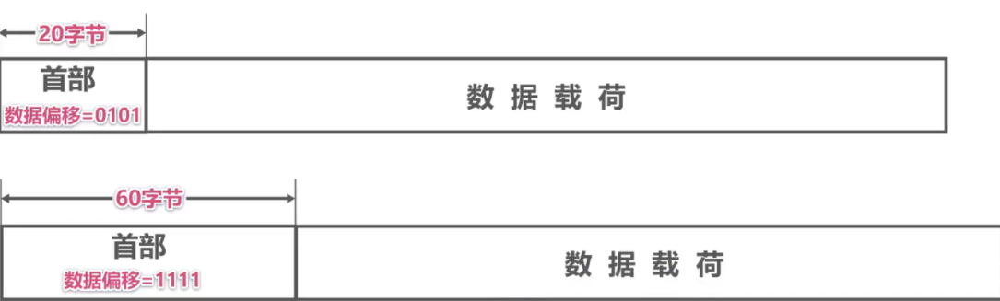

- **保留**：占6比特，保留为今后使用，但目前应置为0。

- **窗口**：占16比特，以字节为单位。**指出发送本报文段的一方的接收窗口**。

  **窗口值作为接收方让发送方设置其发送窗口的依据**。

  **这是以接收方的接收能力来控制发送方的发送能力，称为流量控制**。

- **校验和**：占16比特，检查范围包括TCP报文段的首部和数据载荷两部分。

  在计算校验和时，要在TCP报文段的前面加上12字节的伪首部。

- **同步标志位SYN**：在TCP连接建立时用来同步序号
  

- **终止标志位FIN**：用来释放TCP连接
  

- **复位标志位RST**：用来复位TCP连接。

  **当RST=1时，表明TCP连接出现了异常，必须释放连接，然后再重新建立连接**。

  **RST置1还用来拒绝一个非法的报文段或拒绝打开一个TCP连接**。

- **推送标志位PSH**：接收方的TCP收到该标志位为1的报文段会**尽快上交应用进程**，而不必等到接收缓存都填满后再向上交付。

- **紧急标志位URG**：取值为1时紧急指针字段有效：取值为0时紧急指针字段无效。

- **紧急指针**：占16比特，以字节为单位，用来指明紧急数据的长度。

  **当发送方有紧急数据时，可将紧急数据插队到发送缓存的最前面，并立刻封装到一个TCP报文段中进行发送。紧急指针会指出本报文段数据载荷部分包含了多长的紧急数据，紧急数据之后是普通数据**。

- **选项（长度可变）**

  **最大报文段长度MSS选项**：TCP报文段数据载荷部分的最大长度。

  **窗口扩大选项**：为了扩大窗口（提高吞吐率）。

  **时间戳选项**：用来计算往返时间RTT。用于处理序号超范围的情况，又称为防止序号绕回PAWS。

  **选择确认选项**：用来实现选择确认功能。

- **填充**：由于选项的长度可变，因此使用填充来**确保报文段首部能被4整除**（因为数据偏移字段，也就是首部长度字段，是以4字节为单位的）。

## 第六章 应用层

### 6.1应用层概述

- 应用层是计算机网络体系结构的**最顶层**，是**设计和建立计算机网络的最终目的**，也是计算机网络中发展最快的部分。
  - 早期基于文本的应用（电子邮件、远程登录、文件传输、新闻组）
  - 20世纪90年代将因特网带入千家万户的万维网WWW
  - 当今流行的即时通信、P2P文件共享及各种音视频应用
  - 计算设备的小型化和“无处不在”，宽带住宅接入和无线接入的日益普及和迅速发展，为未来更多的新型应用提供了广阔的舞台。
- 在本章中，我们以一些经典的网络应用为例来学习有关网络应用的原理、协议和实现方面的知识。

### 6.2客户 一 服务器方式和对等方式

- 网络应用程序运行在处于网络边缘的不同的端系统上，通过彼此间的通信来共同完成某项任务。

- 开发一种新的网络应用首先要考虑的问题就是**网络应用程序在各种端系统上的组织方式和它们之间的关系**。目前流行的主要有以下两种：

  **客户/服务器**（Client/Server，C/S）方式

  **对等**（Peer-to-Peer，P2P）方式

- 客户/服务器（Client/Server，C/S）方式
  - 客户和服务器是指通信中所涉及的两个应用进程。
  - 客户/服务器方式所描述的是进程之间服务和被服务的关系。
  - **客户是服务请求方，服务器是服务提供方**。
  - **服务器总是处于运行状态，并等待客户的服务请求。服务器具有固定端口号（例如HTTP服务器的默认端口号为80），而运行服务器的主机也具有固定的IP地址**。
    

- C/S方式是因特网上传统的、同时也是最成熟的方式，很多我们熟悉的网络应用采用的都是C/S方式。包括万维网WWW、电子邮件、文件传输FTP等。
- 基于C/S方式的应用服务通常是**服务集中型**的，即应用服务集中在网络中比客户计算机少得多的服务器计算机上。
  - 由于一台服务器计算机要为多个客户机提供服务，在C/S应用中，**常会出现服务器计算机跟不上众多客户机请求的情况**。
  - 为此，在C/S应用中，常用**计算机群集**（或服务器场）构建一个强大的**虚拟服务器**。

- 对等（Peer-to-Peer，P2P）方式
  - 在P2P方式中，**没有固定的服务请求者和服务提供者**，分布在网络边缘各端系统中的应用进程是对等的，被称为**对等方**。**对等方相互之间直接通信**，每个对等方既是服务的请求者，又是服务的提供者。
- 目前，在因特网上流行的P2P应用主要包括P2P文件共享、即时通信、P2P流媒体、分布式存储等。
- 基于P2P的应用是**服务分散型**的，因为服务不是集中在少数几个服务器计算机中，而是分散在大量对等计算机中，这些计算机并不为服务提供商所有，而是为个人控制的桌面计算机和笔记本电脑，它们通常位于住宅、校园和办公室中。
- P2P方式的最突出特性之一就是它的**可扩展性**。因为系统每增加一个对等方，不仅增加的是服务的请求者，同时也增加了服务的提供者，**系统性能不会因规模的增大而降低**。
- P2P方式**具有成本上的优势**，因为它通常不需要庞大的服务器设施和服务器带宽。为了降低成本，服务提供商对于将P2P方式用于应用的兴趣越来越大。
  

### 6.3动态主机配置协议DHCP

- DHCP的作用

- DHCP的工作过程

- DHCP中继代理

### 6.4域名系统DNS（Domain Name System)

- 域名系统DNS的作用

- 因特网采用**层次树状结构的域名结构**

- 域名的结构由若干个分量组成，各分量之间用“点”隔开，分别代表不同级别的域名。
  

  - 每一级的域名都由英文字母和数字组成，不超过63个字符，不区分大小写字母。

  - 级别最低的域名写在最左边，而级别最高的顶级域名写在最右边。
  - 完整的域名不超过255个字符。

- 域名系统既不规定一个域名需要包含多少个下级域名，也不规定每一级的域名代表什么意思。
- 各级域名由其上一级的域名管理机构管理，而最高的顶级域名则由因特网名称与数字地址分配机构ICANN进行管理。
  

- **顶级域名TLD**（TopLevelDomain）分为以下三类：
  - **国家顶级域名nTLD**：采用iSO3166的规定。如cn表示中国，us表示美国，uk表示英国、等等。
  - **通用顶级域名gTLD**：最常见的通用顶级域名有七个，即：com（公司企业）、net（网络服务机构）、org（非营利性组织）、int（国际组织）、edu（美国教育结构）、gov（美国政府部门）、mil（美国军事部门）。
  - **反向域arpa**：用于反向域名解析，即IP地址反向解析为域名。
- 在**国家顶级域名下注册的二级域名均由该国家自行确定**。例如，顶级域名为p的日本，将其教育和企业机构的二级域名定为ac和co，而不用edu和com。
- **我国则将二级域名划分为以下两类**：
  - **类别域名**：共七个：ac（科研机构）、com（工、商、金融等企业）、edu（教育机构）、gov（政府部门）、net（提供网络服务的机构）、mil（军事机构）和org（非营利性组织）。
  - **行政区域名**：共34个，适用于我国的各省、自治区、直辖市。例如：bj为北京市、sh为上海市、 js为江苏省，等等。

**【举例】因特网的域名空间**

- 域名和IP地址的映射关系必须保存在域名服务器中，供所有其他应用查询。显然不能将所有信息都储存在一台域名服务器中。 DNS使用**分布在各地的域名服务器**来实现域名到IP地址的转换。

- 域名服务器可以划分为以下四种不同的类型：

  - **根域名服务器**
    根域名服务器是最高层次的域名服务器。每个根域名服务器都知道所有的顶级域名服务器的域名及其IP地址。因特网上共有**13个**不同IP地址的根域名服务器。尽管我们将这13个根域名服务器中的每一个都视为单个的服务器，但“每台服务器”实际上是由许多分布在世界各地的计算机构成的**服务器群集**。当本地域名服务器向根域名服务器发出查询请求时，路由器就把查询请求报文转发到离这个DNS客户最近的一个根域名服务器。这就加快了DNS的查询过程，同时也更合理地利用了因特网的资源。**根域名服务器通常并不直接对域名进行解析，而是返回该域名所属顶级域名的顶级域名服务器的IP地址**。

  - **顶级域名服务器**

    这些域名服务器负责**管理在该顶级域名服务器注册的所有二级域名**。当收到DNS查询请求时就给出相应的回答（可能是最后的结果，也可能是下一级权限域名服务器的IP地址）。

  - **权限域名服务器**

    这些域名服务器**负责管理某个区的域名**。每一个主机的域名都必须在某个权限域名服务器处注册登记。因此权限域名服务器知道其管辖的域名与IP地址的映射关系。另外，权限域名服务器还知道其下级域名服务器的地址。

  - **本地域名服务器**

    本地域名服务器不属于上述的域名服务器的等级结构。当一个主机发出DNS请求报文时，这个报文就首先被送往该主机的本地域名服务器。**本地域名服务器起着代理的作用，会将该报文转发到上述的域名服务器的等级结构中**。每一个因特网服务提供者ISP，一个大学，甚至一个大学里的学院，都可以拥有一个本地域名服务器，它有时也称为**默认域名服务器**。本地域名服务器离用户较近，一般不超过几个路由器的距离，也有可能就在同一个局域网中。本地域名服务器的IP地址需要直接配置在需要域名解析的主机中。

**域名解析的过程**

- 为了提高DNS的查询效率，并减轻根域名服务器的负荷和减少因特网上的DNS查询报文数量，在域名服务器中广泛地使用了**高速缓存**。高速缓存用来存放最近查询过的域名以及从何处获得域名映射信息的记录。

- 为了提高DNS的查询效率，并减轻根域名服务器的负荷和减少因特网上的DNS查询报文数量，在域名服务器中广泛地使用了**高速缓存**。高速缓存用来存放最近查询过的域名以及从何处获得域名映射信息的记录。
- 由于域名到IP地址的映射关系并不是永久不变，为保持高速缓存中的内容正确，域名服务器**应为每项内容设置计时器并删除超过合理时间的项**（例如，每个项目只存放两天）。
- 不但在本地域名服务器中需要高速缓存，在用户主机中也很需要。许多用户主机在启动时从本地域名服务器下载域名和IP地址的全部数据库，维护存放自己最近使用的域名的高速缓存，并且只在从缓存中找不到域名时才向域名服务器查询。同理，主机也需要保持高速缓存中内容的正确性。

### 6.5文件传送协议FTP

- 将某台计算机中的文件通过网络传送到可能相距很远的另一台计算机中，是一项基本的网络应用，即文件传送。
- **文件传送协议FTP**（File Transfer Protocol）是因特网上使用得最广泛的文件传送协议。
  - FTP**提供交互式的访问**，允许客户**指明文件的类型与格式**（如指明是否使用ASCII码），并允许**文件具有存取权限**（如访问文件的用户必须经过授权，并输入有效的口令）。
  - **FTP屏蔽了各计算机系统的细节，因而适合于在异构网络中任意计算机之间传送文件**。
- 在因特网发展的早期阶段，用FTP传送文件约占整个因特网的通信量的三分之一，而由电子邮件和域名系统所产生的通信量还要小于FTP所产生的通信量。只是到了1995年，万维网WWW的通信量才首次超过了FTP。

**【举例】文件传送协议FTP的应用**

- 根据应用需求的不同，FTP 服务器可能需要一台高性能和高可靠性的服务器计算机，也可能只需要一台普通的个人计算机即可。
- 在windows系统中添加了一个FTP站点（FTP服务器），具体方法比较简单，请同学们在网上自行查阅。
- FTP的常见用途是在计算机之间传输文件，尤其是用于批量传输文件。
- FTP的另一个常见用途是让网站设计者将构成网站内容的大量文件批量上传到他们的Web服务器

**FTP的基本工作原理**

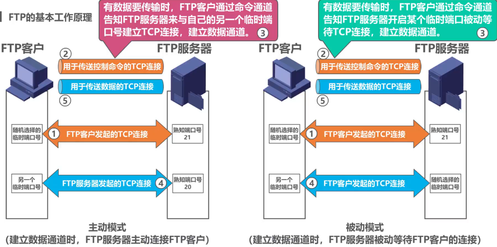

### 6.6电子邮件

- 电子邮件（E-mail）是因特网上**最早流行的一种应用**，并且仍然是当今因特网上最重要、最实用的应用之一。
- 传统的电话通信属于实时通信，存在以下两个缺点：
  - 电话通信的主叫和被叫双方必须同时在场；
  - 一些不是十分紧迫的电话也常常不必要地打断人们的工作或休息。
- 而电子邮件与邮政系统的寄信相似。
  1. 发件人将邮件发送到自己使用的**邮件服务器**；
  2. 发件人的邮件服务器将收到的邮件按其目的地址转发到收件人邮件服务器中的收件人邮箱； 
  3. 收件人在方便的时候访问收件人邮件服务器中自己的邮箱，获取收到的电子邮件。
- 电子邮件使用方便、传递迅速而且费用低廉。它不仅可以传送文字信息，而且还可附上声音和图像。
- 由于电子邮件的广泛使用，现在许多国家已经正式取消了电报业务。在我国，**电信局的电报业务也因电子邮件的普及而濒临消失**。

- 电子邮件系统采用**客户/服务器方式**。
- 电子邮件系统的三个主要组成构件：**用户代理**，**邮件服务器**，以及**电子邮件所需的协议**。
  - **用户代理**：是用户与电子邮件系统的接口，又称为**电子邮件客户端软件**。
  - **邮件服务器**：是电子邮件系统的基础设施。因特网上所有的ISP都有邮件服务器，其功能是**发送和接收邮件**，同时还要负责维护用户的邮箱
  - **协议**包括邮件**发送协议**（例如SMTP）和邮件**读取协议**（例如POP3，IMAP）。

**简单邮件传送协议SMTP（Simple Mail Transfer Protocol）的基本工作原理**

**电子邮件的信息格式**

- 电子邮件的信息格式并不是由SMTP定义的，而是在RFC 822中单独定义的。这个RFC文档已在2008年更新为RFC 5322。一个电子邮件有**信封**和**内容**两部分。而内容又由**首部**和**主体**两部分构成。

- **SMTP协议只能传送ASCII码文本数据**，不能传送可执行文件或其他的二进制对象。
- SMTP不能满足传送多媒体邮件（例如带有图片、音频或视频数据）的需要。并且许多其他非英语国家的文字（例如中文、俄文、甚至带有重音符号的法文或德文）也无法用SMTP传送。
- 为解决SMTP传送非ASCII码文本的问题，提出了**多用途因特网邮件扩展MIME**（MultipurposeInternetMailExtensions）。
  - 增加了**5个新的邮件首部字段**，这些字段提供了有关邮件主体的信息。
  - 定义了**许多邮件内容的格式**，对多媒体电子邮件的表示方法进行了标准化。
  - 定义了**传送编码**，可对任何内容格式进行转换，而不会被邮件系统改变。
- 实际上，MIME不仅仅用于SMTP，也用于后来的同样面向ASCII字符的HTTP。

**常用的邮件读取协议有以下两个：**

- **邮局协议POP**（Post Office Protocol），POP3是其第三个版本，是因特网正式标准。
  - 非常简单、功能有限的邮件读取协议。用户只能以**下载并删除方式或下载并保留方式**从邮件服务器下载邮件到用户方计算机。**不充许用户在邮件服务器上管理自己的邮件**。（例如创建文件夹，对邮件进行分类管理等）。
- **因特网邮件访问协议IMAP**（Internet Message Access Protocol），IMAP4是其第四个版本，目前还只是因特网建议标准。
  - 功能比POP3强大的邮件读取协议。**用户在自己的计算机上就可以操控邮件服务器中的邮箱**，就像在本地操控一样，因此IMAP是一个联机协议。
- POP3和IMAP4都采用**基于TCP连接的客户/服务器方式**。POP3使用熟知端口110，IMAP4使用熟知端口143。

**基于万维网的电子邮件**

- 通过**浏览器**登录（提供用户名和口令）**邮件服务器万维网网站**就可以撰写、收发、阅读和管理电子邮件。这种工作模式与IMAP很类似，不同的是用户计算机无需安装专门的用户代理程序，只需要使用通用的万维网浏览器。
- 邮件服务器网站通常都提供非常强大和方便的邮件管理功能，用户可以在邮件服务器网站上管理和处理自己的邮件，而不需要将邮件下载到本地进行管理。

### 6.7万维网WWW

- 万维网WWW（World Wide Web）**并非某种特殊的计算机网络**。它是一个大规模的、联机式的信息储藏所**是运行在因特网上的一个分布式应用**。
- 万维网利用网页之间的**超链接**将不同网站的网页链接成一张逻辑上的信息网。
- 万维网是欧洲粒子物理实验室的**Tim Berners-Lee**最初于1989年3月提出的。
  

- 1993年2月，第一个图形界面的浏览器Mosaic 
- 1995年著名的Netscape Navigator浏览器上市。
  

- 目前比较流行的浏览器如下：
  

- 浏览器最重要的部分是**渲染引擎**，也就是**浏览器内核**。负责对网页内容进行解析和显示。
  - 不同的浏览器内核对网页内容的解析也有不同，因此同一网页在不同内核的浏览器里的显示效果可能不同；
  - 网页编写者需要在不同内核的浏览器中测试网页显示效果。

- 为了方便地访问在世界范围的文档，万维网使用**统一资源定位符URL**来指明因特网上任何种类“资源”的位置。 
- URL的一般形式由以下四个部分组成：
  

**万维网的文档**

**超文本传输协议HTTP（Hyper Text Transfer Protocol)**

- HTTP定义了浏览器（即万维网客户进程）怎样向万维网服务器请求万维网文档，以及万维网服务器怎样把万维网文档传送给浏览器。

- HTTP/1.0采用**非持续连接**方式。在该方式下，每次浏览器要请求一个文件都要与服务器建立TCP连接，当收到响应后就立即关闭连接。
  - **每请求一个文档就要有两倍的RTT的开销**。若一个网页上有很多引用对象（例如图片等），那么请求每一个对象都需要花费2RTT的时间。
  - 为了减小时延，**浏览器通常会建立多个并行的TCP连接同时请求多个对象**。但是，这会大量占用万维网服务器的资源，特别是万维网服务器往往要同时服务于大量客户的请求，这会使其负担很重。
- HTTP/1.1采用**持续连接**方式。在该方式下，万维网服务器在发送响应后仍然保持这条连接，使同一个客户（浏览器）和该服务器可以继续在这条连接上传送后续的HTTP请求报文和响应报文。这并不局限于传送同一个页面上引用的对象，而是只要这些文档都在同一个服务器上就行。
  - 为了进一步提高效率，HTTP/1.1的持续连接还可以使用**流水线**方式工作，即浏览器在收到HTTP的响应报文之前就能够连续发送多个请求报文。这样的一个接一个的请求报文到达服务器后，服务器就发回一个接一个的响应报文。这样就节省了很多个RTT时间，使TCP连接中的空闲时间减少，提高了下载文档的效率。

**HTTP的报文格式**

- HTTP是**面向文本**的，其报文中的每一个**字段**都是一些**ASCII码串**，并且每个字段的**长度**都是**不确定**的。

**使用Cookie在服务器上记录用户信息**

- 早期的万维网应用非常简单，仅仅是用户查看存放在不同服务器上的各种静态的文档。因此HTTP被设计为一种**无状态**的协议。这样可以简化服务器的设计。
- 现在，用户可以通过万维网实现各种复杂的应用，如网上购物、电子商务等。这些应用往往需要万维网服务器能够识别用户。
- Cookie提供了一种机制使得万维网服务器能够“记住”用户，而无需用户主动提供用户标识信息。也就是说，**Cookie是一种对无状态的HTTP进行状态化的技术**。

**万维网缓存与代理服务器**

- 在万维网中还可以使用缓存机制以提高万维网的效率。
- 万维网缓存又称为**Web缓存**（Web Cache），可位于客户机，也可位于中间系统上，位于中间系统上的 Web缓存又称为**代理服务器**（Proxy Server）。
- Web缓存把最近的一些请求和响应暂存在本地磁盘中。**当新请求到达时，若发现这个请求与暂时存放的请求相同，就返回暂存的响应，而不需要按URL的地址再次去因特网访问该资源**。

