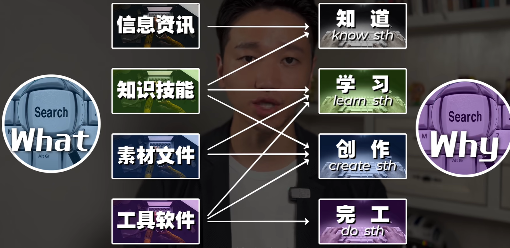
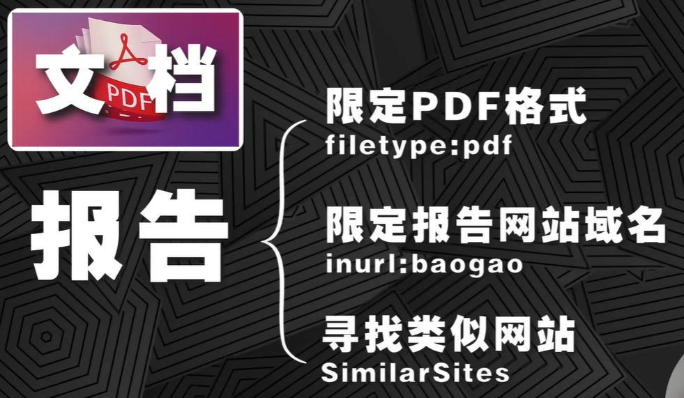

# 超级搜索技术

## 搜什么&为什么搜

## 搜信息咨询

### 1 “ ” 限定关键词

### 2 intitle 限定标题

### 3 allintitle 限定标题多个关键词

### 4 intext 限定内容关键词

### 5 inurl 限定网址关键词

### 6 site 限定网址来源

### 7 imagesize 限定图片尺寸

### 8 filetype 限定文件格式

## 搜知识技能

### 组织内部

- 同事的电脑：有各种项目的全套资料、策划案、复盘报告等等
- 聊天记录：企微钉钉飞书的聊天记录里面项目群、群文件、群模板等等
- 线上知识库：公司的线上知识库里面，有的是直接用的企业微信、钉钉、飞书他们的知识库网盘，有的是自己开发的Wiki系统，还有的用的是confluence这种第三方的知识库平台。

### 组织外部

- 网页 web pages
- 电子书 eBooks
- 电子文档 files
- 学术论文 papers
- 笔记Apps
- 知识平台Apps
- 视频网站Apps
- AI大脑ChatGPT
- 牛人的大脑

### 知识技能的搜索渠道到底怎么选？

#### 角度1：看你要的知识技能最有可能附着在哪类载体上？

- 网页
- PDF文档
- 电子书
- 视频教程

#### 角度2：看你搜索知识技能是为了什么？

- 知道 know sth
- 学习 learn sth
- 创作 create sth

#### 如果是搜索网页

- 首当其冲是谷歌最快最强
- 中文的文本类知识主要沉淀在公众号和知乎的文章里面，可以用搜狗搜索、微信搜一搜
- 还有一些专业向的知识社群和聚合的导航网站（可以直接谷歌搜某某行业或者某某岗位必逛的网站）

总的来说如果你的知识沉淀在网页上，用谷歌加搜狗搜索加微信搜一搜足够了

#### 如果要找的知识在PDF报告里

#### 如果你要的知识在电子书上面

中文用鸠摩搜书

英文我们直接谷歌best free ebook download sites

电子书APP：微信读书和得到APP

#### 如果你要的知识在视频上面

零碎的用短视频平台。

系统的就用b站、油管等等。（记不住没关系，直接谷歌best online learning websites）

## 搜素材文件

### 视频

免费无版权的高清视频素材网站：
www.pexels.com、www.pixabay.com、www.videvo.net、www.mixkit.co
（不知道没关系，可以直接打开谷歌输入best sites for free stock videos）

youtube的视频，我们只需要在 www. 后面输入9x,就可以提取这条视频

如果需要4k的视频，也可以使用下载器，比如说 save.tube 

### BGM和音效

比如在谷歌搜索关键词 best sites for free BGM 或 royalty free BGM sites

当遇到一些音频素材，没办法下载的时候，把这个音频完整的播放一遍，然后完整的录下来就好了。

### 图片

结合前面的讲的 imagesize 这个语法

一些素材图片网站：www.pexels.com、www.pixabay.com、www.unsplash.com、

如果要下载一些收费的高清图片，复制网址链接，然后打开一个下载器叫做 gettyimages downloader，然后直接把网址复制过来就可以了。

GIF动图，可以直接谷歌 best gif sites

icon图标：可以直接谷歌关键词 + icon + filetype:png
国内有个网站叫 iconfront.cn

### 下载各种文件

PPT模板，PS，AI，C4D，CAD等

PPT模板：iSlide 插件、canva.com

## 搜工具软件

优先考虑在线工具 -> 然后再考虑下载软件 -> 最后再考虑为这个软件安装相应的插件

比如说设计一个**海报**直接交给搞定设计或canva这种在线设计网站就行
在线**抠图**交给 remove.bg 抠的贼干净
**文字转语音**交给腾讯智影或Azure
**画脑图或者概念图**交给 miro 或者 canva
**找台词**就上找台词网
在线剪辑视频有 Clipchamp 和 Flexclip
测网速 fast.com
检测陌生链接安全性 virustotal.com

利用 alternativeto.net 这个网站，专门帮你找某个软件的替代软件

插件：可以在谷歌搜索 the best Chrome extensions

内事不决，微信搜一搜；外事不决，谷歌问一问。